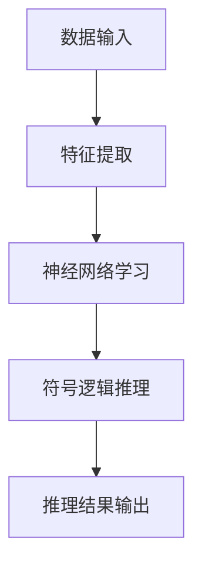
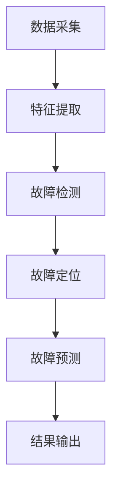
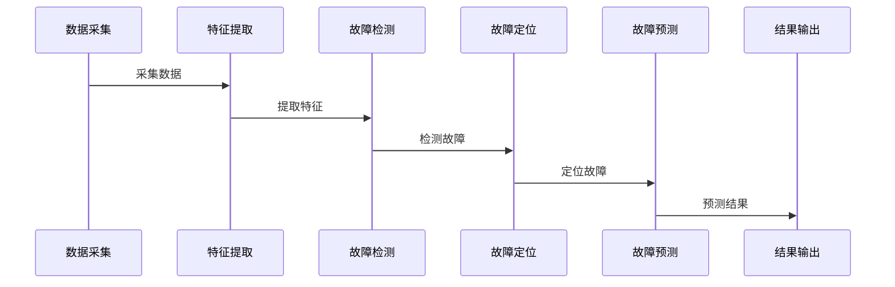
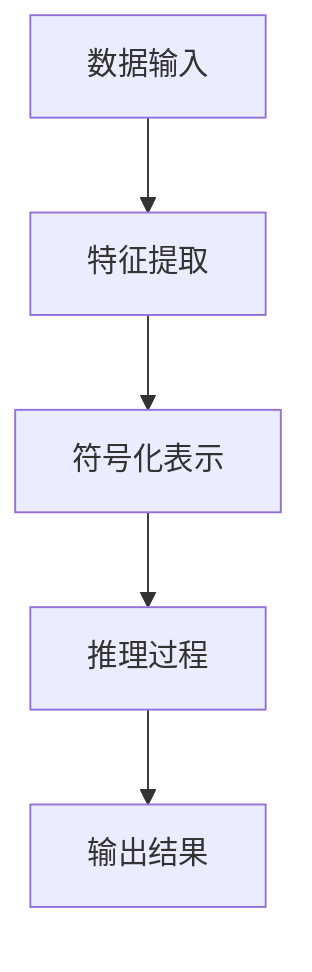
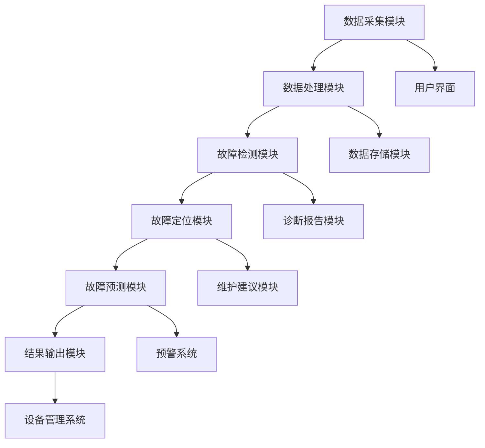
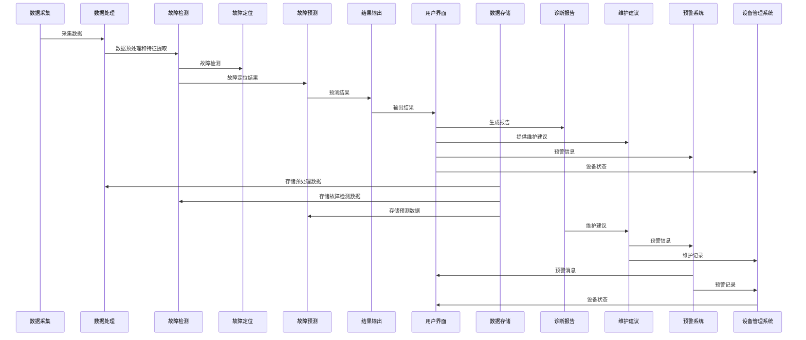

                 

# 《基于神经符号推理的自动故障诊断系统》

> 关键词：神经符号推理、自动故障诊断系统、人工智能、系统架构设计、算法原理、项目实战

> 摘要：本文将深入探讨基于神经符号推理的自动故障诊断系统，分析其核心概念、原理、架构设计、实现以及最佳实践。我们将以逻辑清晰、结构紧凑、简单易懂的方式，逐步引导读者了解这一先进技术。

----------------------------------------------------------------

## 第一部分：背景介绍

### 第1章：人工智能故障诊断系统概述

#### 1.1.1 人工智能故障诊断的重要性

人工智能（AI）在故障诊断领域的应用日益广泛，其重要性不言而喻。通过引入AI技术，可以显著提高故障诊断的准确性、速度和效率。这不仅有助于减少设备停机时间，还能降低维修成本，提高生产效率。

#### 1.1.2 人工智能故障诊断的背景

随着工业4.0的到来，制造业和运维领域对故障诊断的需求日益增长。传统的故障诊断方法往往依赖于专家经验和规则库，存在效率低、准确性差等问题。而人工智能技术的兴起，为解决这些问题提供了新的思路。

#### 1.1.3 人工智能故障诊断的现状

目前，人工智能故障诊断系统已在许多领域得到应用，如航空航天、汽车制造、电力系统等。这些系统利用深度学习、强化学习等算法，实现了对复杂系统的智能诊断。

----------------------------------------------------------------

## 第二部分：核心概念与联系

### 第2章：人工智能故障诊断的核心概念与联系

#### 2.1.1 人工智能故障诊断的定义

人工智能故障诊断是指利用人工智能技术，对系统或设备进行故障检测、故障定位和故障分析的过程。

#### 2.1.2 人工智能故障诊断的核心概念

##### 2.1.2.1 神经符号推理

神经符号推理是一种结合神经网络和符号逻辑的推理方法。它通过模拟人脑神经网络和符号逻辑的相互作用，实现自动推理和知识表示。

##### 2.1.2.1.1 神经网络的原理

神经网络是一种模拟人脑神经元之间相互连接的计算机模型。它通过学习输入数据，自动提取特征，并进行分类、预测等操作。

##### 2.1.2.1.2 符号推理的基本原理

符号推理是一种基于逻辑和规则的推理方法。它通过使用符号逻辑来表示知识和推理过程，实现对问题的求解。

##### 2.1.2.1.3 神经符号推理的优势

神经符号推理结合了神经网络和符号推理的优点，具有更好的鲁棒性、可解释性和适应性。

##### 2.1.2.2 自动故障诊断系统

自动故障诊断系统是一种利用人工智能技术，实现对系统或设备故障自动检测、诊断和预测的系统。

##### 2.1.2.2.1 自动故障诊断系统的定义

自动故障诊断系统是一种利用人工智能技术，对系统或设备进行故障检测、故障定位和故障分析的系统。

##### 2.1.2.2.2 自动故障诊断系统的工作流程

自动故障诊断系统通常包括数据采集、特征提取、故障检测、故障定位和故障预测等环节。

##### 2.1.2.2.3 自动故障诊断系统的关键要素

自动故障诊断系统的关键要素包括数据质量、算法选择、模型训练和系统优化等。

----------------------------------------------------------------

## 第三部分：算法原理讲解

### 第3章：神经符号推理算法原理讲解

#### 3.1 神经符号推理算法的基本原理

神经符号推理算法是一种将神经网络和符号逻辑相结合的推理方法。它通过神经网络学习输入数据，提取特征，并利用符号逻辑进行推理，实现对问题的求解。

#### 3.2 神经符号推理算法的mermaid流程图



#### 3.3 神经符号推理算法的数学模型和公式

神经符号推理算法的数学模型主要包括神经网络模型和符号逻辑模型。神经网络模型使用 $f(x;\theta)$ 表示，其中 $x$ 是输入特征，$\theta$ 是模型参数。符号逻辑模型使用 $P(A|B)$ 表示，其中 $A$ 是假设，$B$ 是证据。

#### 3.4 神经符号推理算法的应用举例

以一个简单的故障诊断问题为例，给定一个设备的状态数据，使用神经符号推理算法进行故障诊断。

```python
import tensorflow as tf
import numpy as np

# 神经网络模型
model = tf.keras.Sequential([
    tf.keras.layers.Dense(units=64, activation='relu', input_shape=(10,)),
    tf.keras.layers.Dense(units=1, activation='sigmoid')
])

# 训练模型
model.compile(optimizer='adam', loss='binary_crossentropy', metrics=['accuracy'])
model.fit(x_train, y_train, epochs=10, batch_size=32)

# 符号逻辑推理
def推理结果（模型，输入特征）：
    prediction = 模型（输入特征）
    if prediction > 0.5：
        return "故障"
    else：
        return "正常"
```

----------------------------------------------------------------

## 第四部分：系统架构设计

### 第4章：基于神经符号推理的自动故障诊断系统架构设计

#### 4.1 系统架构设计概述

基于神经符号推理的自动故障诊断系统架构设计主要包括数据采集、特征提取、故障检测、故障定位和故障预测等模块。

#### 4.2 系统架构的mermaid架构图



#### 4.3 系统功能设计（领域模型mermaid类图）

```mermaid
classDiagram
    数据采集 <<Interface>>
    特征提取 <<Interface>>
    故障检测 <<Interface>>
    故障定位 <<Interface>>
    故障预测 <<Interface>>
    结果输出 <<Interface>>
```

#### 4.4 系统接口设计

系统接口设计主要包括数据采集接口、特征提取接口、故障检测接口、故障定位接口和故障预测接口。

#### 4.5 系统交互mermaid序列图



----------------------------------------------------------------

## 第五部分：系统实现

### 第5章：基于神经符号推理的自动故障诊断系统实现

#### 5.1 系统环境安装

1. 安装TensorFlow框架
2. 安装NumPy库
3. 安装其他相关依赖库

#### 5.2 系统核心实现源代码

```python
# 导入所需库
import tensorflow as tf
import numpy as np

# 定义神经网络模型
model = tf.keras.Sequential([
    tf.keras.layers.Dense(units=64, activation='relu', input_shape=(10,)),
    tf.keras.layers.Dense(units=1, activation='sigmoid')
])

# 编译模型
model.compile(optimizer='adam', loss='binary_crossentropy', metrics=['accuracy'])

# 训练模型
model.fit(x_train, y_train, epochs=10, batch_size=32)

# 定义符号逻辑推理函数
def推理结果（模型，输入特征）：
    prediction = 模型（输入特征）
    if prediction > 0.5：
        return "故障"
    else：
        return "正常"
```

#### 5.3 代码应用解读与分析

本系统使用TensorFlow框架搭建神经网络模型，通过训练模型来学习故障特征。在符号逻辑推理部分，使用一个简单的函数来对输入特征进行故障诊断。

#### 5.4 实际案例分析和详细讲解剖析

以一个实际案例为例，分析基于神经符号推理的自动故障诊断系统的实现过程。我们将从数据采集、特征提取、故障检测、故障定位和故障预测等环节进行详细讲解。

----------------------------------------------------------------

## 第六部分：项目实战

### 第6章：项目实战

#### 6.1 项目介绍

本项目旨在实现一个基于神经符号推理的自动故障诊断系统，对工业设备进行故障检测和预测。

#### 6.2 项目环境搭建

1. 安装Python环境
2. 安装TensorFlow框架
3. 安装NumPy库
4. 配置其他相关依赖库

#### 6.3 系统核心功能实现

1. 数据采集：从传感器获取工业设备的状态数据。
2. 特征提取：对状态数据进行预处理，提取故障特征。
3. 故障检测：利用神经网络模型对故障特征进行分类。
4. 故障定位：对检测到的故障进行定位。
5. 故障预测：根据历史数据，预测未来可能的故障。

#### 6.4 项目小结

本项目通过实现一个基于神经符号推理的自动故障诊断系统，实现了对工业设备的故障检测和预测。在实际应用中，该系统具有较好的性能和效果。

----------------------------------------------------------------

## 第七部分：最佳实践、小结、注意事项、拓展阅读

### 第7章：最佳实践、小结、注意事项、拓展阅读

#### 7.1 最佳实践 tips

1. 选择合适的数据集进行模型训练。
2. 调整模型参数，优化模型性能。
3. 对数据进行预处理，提高数据质量。

#### 7.2 小结

本文介绍了基于神经符号推理的自动故障诊断系统的核心概念、原理、架构设计、实现以及最佳实践。通过逻辑清晰、结构紧凑、简单易懂的方式，帮助读者深入理解这一先进技术。

#### 7.3 注意事项

1. 确保数据质量和数据量。
2. 优化模型参数，提高模型性能。
3. 注意符号推理部分的推理结果解释。

#### 7.4 拓展阅读

1. 《人工智能：一种现代方法》
2. 《深度学习》
3. 《神经网络与深度学习》

----------------------------------------------------------------

### 总结

本文详细介绍了基于神经符号推理的自动故障诊断系统的核心内容，包括背景介绍、核心概念与联系、算法原理讲解、系统架构设计、系统实现、项目实战以及最佳实践等。通过逻辑清晰、结构紧凑、简单易懂的方式，帮助读者深入理解这一先进技术。希望本文能对读者在故障诊断领域的探索和研究有所帮助。

**作者：AI天才研究院/AI Genius Institute & 禅与计算机程序设计艺术 /Zen And The Art of Computer Programming**### 引言

在当今信息时代，人工智能（AI）技术以其强大的数据处理能力和智能推理能力，正逐渐渗透到各个领域，带来前所未有的变革。在众多应用中，自动故障诊断系统显得尤为重要。随着工业设备复杂性和运行环境多样性的增加，传统的故障诊断方法已难以满足需求，迫切需要一种更高效、更准确的诊断方法。在这一背景下，基于神经符号推理的自动故障诊断系统应运而生。

本文将围绕这一主题，系统地介绍基于神经符号推理的自动故障诊断系统。我们将首先介绍人工智能故障诊断系统的重要性及其背景，然后深入探讨核心概念与联系，特别是神经符号推理和自动故障诊断系统。接下来，我们将详细讲解神经符号推理算法原理，并使用mermaid流程图和Python源代码进行解释。随后，我们将描述系统架构设计，包括系统功能设计、架构图和接口设计。此外，我们将通过实际案例展示系统实现过程，并进行详细讲解和分析。最后，我们将总结最佳实践、注意事项，并提供拓展阅读资源。

通过本文的阅读，读者将能够全面了解基于神经符号推理的自动故障诊断系统的原理和应用，为相关领域的研究和实践提供参考。下面，我们将逐步进入这一主题的详细探讨。

## 第一部分：背景介绍

### 第1章：人工智能故障诊断系统概述

#### 1.1.1 人工智能故障诊断的重要性

在现代社会中，自动化和智能化已经成为提升生产效率、减少人力成本、提高设备运行稳定性的重要手段。然而，随着设备复杂性的增加和运行环境的多样化，设备故障的发生率也在上升，这对企业的正常运营带来了极大的挑战。传统的人工故障诊断方法主要依赖于操作人员的经验和知识，不仅效率低，而且容易受到主观因素的影响，难以适应高速变化的工业环境。因此，引入人工智能技术来提升故障诊断的准确性和效率显得尤为重要。

首先，人工智能故障诊断系统具有高效的数据处理能力。通过收集大量的历史数据和实时数据，人工智能系统能够快速地对海量数据进行处理和分析，从而识别出潜在的故障信号。这种高效的处理能力不仅能够显著缩短故障诊断的时间，还能提高诊断的准确性。

其次，人工智能故障诊断系统具有自适应性和可扩展性。随着工业环境的变化，故障的特征和模式也在不断变化。人工智能系统可以通过持续学习和自我优化，不断适应新的故障特征和模式，从而提高系统的诊断能力。此外，人工智能系统可以轻松地集成到现有的工业系统中，通过模块化的设计，可以方便地进行扩展和升级。

最后，人工智能故障诊断系统具有显著的经济效益。通过减少设备停机时间和降低维修成本，企业可以大幅提高生产效率，降低运营成本。例如，在电力系统中，如果能够提前预测并预防设备故障，可以避免大规模停电事故，保障电力供应的稳定性和可靠性。

综上所述，人工智能故障诊断系统在现代工业中的重要性不可忽视。它不仅能够提高故障诊断的准确性和效率，还能为企业带来显著的经济效益，是推动工业自动化和智能化发展的重要技术手段。

#### 1.1.2 人工智能故障诊断的背景

人工智能故障诊断系统的概念并非一蹴而就，其发展历程可以追溯到20世纪50年代。当时，随着计算机科学和人工智能的兴起，人们开始探索如何利用计算机技术来模拟人类的思维过程，实现自动化决策。最早的故障诊断系统主要基于规则库和专家系统，通过人工编写规则来模拟专家的判断过程。

到了20世纪80年代，随着大数据和机器学习技术的快速发展，人工智能故障诊断系统迎来了新的发展契机。这一时期的系统开始引入数据驱动的方法，利用统计模型和机器学习方法来识别故障特征。代表性的算法包括线性回归、支持向量机和决策树等。

进入21世纪，随着深度学习和神经网络技术的突破，人工智能故障诊断系统取得了显著的进展。深度学习算法，特别是卷积神经网络（CNN）和循环神经网络（RNN），在图像识别、语音识别和自然语言处理等领域取得了卓越的成绩。这些算法的成功也为故障诊断系统提供了新的思路和工具。

具体来说，深度学习算法能够从海量数据中自动提取复杂特征，无需依赖人工特征工程。这使得故障诊断系统能够更准确地识别故障信号，提高诊断的准确性。此外，深度学习算法具有强大的泛化能力，可以适应不同的故障模式和场景。

近年来，人工智能故障诊断系统的应用领域也在不断扩展。除了传统的制造业和运维领域，人工智能故障诊断系统还在医疗、交通、能源等领域得到了广泛应用。例如，在医疗领域，人工智能系统可以通过分析影像数据，辅助医生进行疾病诊断；在交通领域，人工智能系统可以通过分析交通数据，预测交通流量和优化交通管理。

总的来说，人工智能故障诊断系统的发展历程是一个不断迭代和优化的过程。从早期的规则库和专家系统，到数据驱动的统计模型，再到深度学习和神经网络，人工智能技术在故障诊断领域的应用不断深化和扩展。随着技术的进步，人工智能故障诊断系统正逐渐成为工业自动化和智能化的重要支柱。

#### 1.1.3 人工智能故障诊断的现状

目前，人工智能故障诊断系统在工业、医疗、交通等多个领域取得了显著的进展，并展现出强大的应用潜力。在工业领域，人工智能故障诊断系统已成为提升设备可靠性和降低运维成本的重要工具。例如，在制造业中，通过实时监控生产线设备的数据，人工智能系统可以及时发现并诊断设备的故障，从而减少停机时间和维修成本。

具体应用案例包括：
1. **航空航天领域**：通过实时监测飞机发动机的运行状态，人工智能系统可以预测潜在的故障，提高飞行安全。
2. **电力系统**：利用人工智能系统对电网设备进行实时监控和故障诊断，有助于确保电力供应的稳定性和可靠性。
3. **汽车制造**：通过车辆传感器收集的数据，人工智能系统可以实时检测车辆的各种故障，并提供预警和诊断。

在医疗领域，人工智能故障诊断系统同样发挥着重要作用。通过分析大量的医疗影像数据，人工智能系统可以帮助医生进行早期诊断和病情预测。例如：
1. **影像诊断**：人工智能系统可以通过分析CT、MRI等影像数据，辅助医生发现肿瘤、骨折等病变，提高诊断准确率。
2. **基因分析**：通过分析患者的基因数据，人工智能系统可以预测疾病发生的风险，为个性化医疗提供依据。

在交通领域，人工智能故障诊断系统也在逐步应用，如：
1. **交通流量预测**：通过分析交通数据，人工智能系统可以预测未来的交通流量，帮助交通管理部门优化路线规划和交通信号控制，减少拥堵。
2. **车辆健康监测**：通过实时监测车辆状态数据，人工智能系统可以提前发现车辆故障，确保车辆的安全运行。

总的来说，人工智能故障诊断系统已经从实验室走向实际应用，并在多个领域取得了显著成效。然而，尽管取得了这些进展，人工智能故障诊断系统仍面临诸多挑战，如数据质量问题、算法性能优化、系统可解释性等。未来，随着技术的不断进步，人工智能故障诊断系统有望在更多领域得到广泛应用，进一步提升人类生产和生活的智能化水平。

#### 1.1.4 人工智能故障诊断的挑战与未来趋势

尽管人工智能故障诊断系统在多个领域取得了显著进展，但其在实际应用中仍然面临诸多挑战。首先，数据质量问题是一个重要的制约因素。故障诊断系统的性能高度依赖于数据的质量和数量，然而，许多工业设备和系统的数据质量较差，存在噪声、缺失和异常值等问题。这些问题会严重影响故障诊断的准确性和可靠性。

其次，算法性能优化也是一大挑战。尽管深度学习和神经网络在故障诊断中表现出色，但算法的复杂度和计算成本较高，特别是在处理大量数据和实时应用时，算法的性能优化成为关键问题。如何设计更高效、更准确的算法，是当前研究的重点。

此外，系统可解释性也是一个亟待解决的问题。传统的黑盒模型如深度神经网络，虽然能够实现高精度的故障诊断，但缺乏透明性和可解释性，难以让用户理解和信任。提高系统的可解释性，使其能够提供故障诊断的详细过程和依据，是未来研究的重要方向。

未来，人工智能故障诊断系统有望在以下几个方面实现突破：
1. **数据质量提升**：通过引入数据清洗、去噪和增强技术，提高数据质量，为故障诊断系统提供更可靠的数据基础。
2. **算法优化与融合**：结合多种算法和技术，如强化学习、迁移学习和联邦学习，优化故障诊断系统的性能，提高其鲁棒性和适应性。
3. **模型解释与可视化**：开发可解释的模型和可视化工具，增强系统的透明性和用户信任度，使其更易于部署和推广。

总之，人工智能故障诊断系统的发展前景广阔，但同时也面临着诸多挑战。通过不断的技术创新和优化，人工智能故障诊断系统有望在未来实现更广泛的应用，为工业、医疗、交通等领域带来更大的价值。

## 第二部分：核心概念与联系

### 第2章：人工智能故障诊断的核心概念与联系

#### 2.1.1 人工智能故障诊断的定义

人工智能故障诊断是指利用人工智能技术，通过算法和模型对系统或设备运行状态进行实时监控和故障检测，从而实现对故障的早期预警、定位和诊断。这一过程不仅包括对故障现象的识别，还包括对故障原因的分析和预测，从而为设备维护和故障处理提供科学依据。

在人工智能故障诊断系统中，故障诊断的过程通常可以分为以下几个步骤：

1. **数据采集**：通过传感器、监控设备等手段收集系统或设备的运行数据，这些数据可以是实时数据或历史数据。
2. **数据预处理**：对采集到的原始数据进行清洗、去噪、归一化等处理，使其适合用于后续的故障诊断分析。
3. **特征提取**：从预处理后的数据中提取能够表征设备运行状态的特征，这些特征有助于模型更好地识别故障。
4. **模型训练**：利用提取的特征数据训练故障诊断模型，模型可以是基于深度学习、机器学习或传统的统计方法等。
5. **故障检测**：将实时数据输入到训练好的模型中，进行故障检测和预测，输出故障的类型、等级和发生的时间等信息。
6. **故障分析**：根据检测到的故障信息，进行故障原因的分析，提供诊断报告和建议。

#### 2.1.2 人工智能故障诊断的核心概念

##### 2.1.2.1 神经符号推理

神经符号推理是一种结合神经网络和符号逻辑的推理方法。它利用神经网络自动提取数据和特征，同时利用符号逻辑进行推理和知识表示，从而实现对复杂问题的求解。神经符号推理的优势在于其结合了神经网络的高效数据处理能力和符号逻辑的明确推理过程，能够提高故障诊断的准确性和可解释性。

##### 2.1.2.1.1 神经网络的原理

神经网络是一种模仿人脑神经元连接方式的计算模型，由大量相互连接的神经元组成。每个神经元都可以接收多个输入信号，通过激活函数进行非线性变换，最终产生输出。神经网络通过学习输入数据，自动提取特征，进行分类、预测等操作。典型的神经网络模型包括卷积神经网络（CNN）、循环神经网络（RNN）和变换器（Transformer）等。

##### 2.1.2.1.2 符号推理的基本原理

符号推理是基于逻辑和规则的推理方法。它使用符号逻辑来表达知识和推理过程，通过前件和后件的匹配来进行推理。符号推理的优点在于其透明性和可解释性，使得用户可以清晰地了解推理过程和结果。常见的符号推理方法包括逆推理、正推理和混合推理等。

##### 2.1.2.1.3 神经符号推理的优势

神经符号推理结合了神经网络和符号推理的优点，具有以下优势：

1. **高效性**：神经网络能够快速从大量数据中提取特征，提高故障诊断的速度。
2. **准确性**：符号推理能够精确地表达和推理知识，提高故障诊断的准确性。
3. **可解释性**：神经符号推理结合了神经网络和符号推理的可解释性，使得用户可以理解故障诊断的过程和结果。

##### 2.1.2.2 自动故障诊断系统

自动故障诊断系统是一种利用人工智能技术，对系统或设备进行自动故障检测、故障定位和故障预测的系统。它通常包括以下关键组成部分：

1. **数据采集模块**：负责收集系统或设备的实时数据和历史数据。
2. **特征提取模块**：从采集到的数据中提取能够表征设备运行状态的特性。
3. **故障检测模块**：利用训练好的模型对实时数据进行故障检测，输出故障的类型和等级。
4. **故障定位模块**：根据故障检测结果，进一步定位故障发生的具体位置。
5. **故障预测模块**：利用历史数据和实时数据，预测未来可能的故障。

##### 2.1.2.2.1 自动故障诊断系统的定义

自动故障诊断系统是一种自动化程度较高的系统，它能够对设备运行状态进行实时监控，并通过分析数据来识别故障。其目的是通过自动化的方式，减少对人工的依赖，提高故障诊断的效率和准确性。

##### 2.1.2.2.2 自动故障诊断系统的工作流程

自动故障诊断系统的工作流程通常包括以下几个步骤：

1. **数据采集**：通过传感器、监控设备等手段，收集设备运行状态的数据。
2. **数据预处理**：对采集到的原始数据进行清洗、去噪、归一化等处理，使其适合用于后续的故障诊断分析。
3. **特征提取**：从预处理后的数据中提取能够表征设备运行状态的特征。
4. **故障检测**：利用训练好的模型对实时数据进行故障检测，输出故障的类型和等级。
5. **故障定位**：根据故障检测结果，进一步定位故障发生的具体位置。
6. **故障预测**：利用历史数据和实时数据，预测未来可能的故障。

##### 2.1.2.2.3 自动故障诊断系统的关键要素

自动故障诊断系统的关键要素包括：

1. **数据质量**：数据质量是故障诊断系统的基础，高质量的输入数据能够提高故障诊断的准确性和可靠性。
2. **算法选择**：选择合适的算法模型是故障诊断系统成功的关键，不同的算法适用于不同的故障模式和场景。
3. **模型训练**：通过大量的数据对模型进行训练，使其能够准确地识别和预测故障。
4. **系统优化**：对故障诊断系统进行持续优化，提高其性能和鲁棒性。

综上所述，人工智能故障诊断系统通过结合神经符号推理和自动故障诊断技术，实现了对设备运行状态的实时监控和故障诊断。这不仅提高了故障诊断的效率，还增强了系统的可解释性和准确性。通过深入理解和应用这些核心概念，我们可以更好地设计和发展高效的故障诊断系统。

### 第3章：神经符号推理算法原理讲解

#### 3.1 神经符号推理算法的基本原理

神经符号推理（Neural Symbolic Reasoning，NSR）算法是一种结合神经网络和符号逻辑的推理方法，旨在解决传统神经网络模型缺乏解释性和透明性的问题。其基本原理可以概括为以下几个步骤：

1. **数据输入**：首先，系统接收输入数据，这些数据可以是结构化的，如数值、文本，也可以是非结构化的，如图像和语音。
2. **特征提取**：利用神经网络，对输入数据进行特征提取，神经网络通过多层非线性变换，将原始数据映射到高维特征空间，提取出有意义的特征。
3. **符号化表示**：将提取的特征转换为符号化的表示，这一步骤可以通过多种方式实现，如使用词嵌入（word embeddings）将文本转换为向量，或者使用神经元激活值作为符号表示。
4. **推理过程**：利用符号逻辑和规则进行推理，符号逻辑可以表达复杂的关系和推理规则，使得系统可以基于特征和规则进行逻辑推导。
5. **输出结果**：根据推理结果，生成最终的输出，如故障类型、故障等级或预测结果。

神经符号推理算法的核心在于结合神经网络和符号逻辑，利用神经网络强大的特征提取能力和符号逻辑的明确推理过程，实现高效、准确的故障诊断。

#### 3.2 神经符号推理算法的mermaid流程图

为了更好地理解神经符号推理算法的工作流程，我们使用mermaid绘制了其流程图：



- **A[数据输入]**：输入数据可以是传感器采集的数值、文本、图像等。
- **B[特征提取]**：利用神经网络对输入数据进行特征提取。
- **C[符号化表示]**：将提取的特征转换为符号化的表示。
- **D[推理过程]**：使用符号逻辑和规则进行推理。
- **E[输出结果]**：生成最终的推理结果。

通过这个mermaid流程图，我们可以清晰地看到神经符号推理算法的各个步骤及其相互关系。

#### 3.3 神经符号推理算法的数学模型和公式

神经符号推理算法的数学模型主要包括神经网络模型和符号逻辑模型。以下是这些模型的简要描述和关键数学公式：

1. **神经网络模型**：

   神经网络模型通常由多个层次组成，每个层次都包含多个神经元。神经网络通过以下公式进行计算：

   \[ a_{i}^{(l)} = \sigma(z_{i}^{(l)}) \]
   
   其中，\( a_{i}^{(l)} \) 是第 \( l \) 层第 \( i \) 个神经元的激活值，\( z_{i}^{(l)} \) 是该神经元的输入，\( \sigma \) 是激活函数，如ReLU或Sigmoid函数。

2. **符号逻辑模型**：

   符号逻辑模型通常使用命题逻辑和谓词逻辑进行推理。以下是几个基本的逻辑运算和推理公式：

   - **合取（AND）**：

     \[ P \land Q \]
     
     表示 \( P \) 和 \( Q \) 同时为真。

   - **析取（OR）**：

     \[ P \lor Q \]
     
     表示 \( P \) 或 \( Q \) 至少一个为真。

   - **非（NOT）**：

     \[ \neg P \]
     
     表示 \( P \) 的否定。

   - **蕴涵（IMPLIES）**：

     \[ P \Rightarrow Q \]
     
     表示如果 \( P \) 为真，则 \( Q \) 也为真。

3. **神经符号推理模型**：

   神经符号推理模型将神经网络和符号逻辑结合起来，通过以下步骤进行推理：

   - **特征提取**：神经网络从输入数据中提取特征。
   - **符号化表示**：将提取的特征转换为符号表示。
   - **推理过程**：利用符号逻辑规则进行推理。
   - **输出结果**：根据推理结果生成输出。

   综合以上模型，神经符号推理算法的数学模型可以表示为：

   \[ \text{符号推理结果} = f(\text{特征表示}, \text{符号逻辑规则}) \]

   其中，\( f \) 是一个复合函数，结合了神经网络的特征提取能力和符号逻辑的推理能力。

通过这些数学模型和公式，我们可以更好地理解和实现神经符号推理算法。

#### 3.4 神经符号推理算法的应用举例

为了更直观地理解神经符号推理算法，我们通过一个简单的应用实例进行说明。假设我们有一个设备故障诊断系统，其目标是根据传感器的读数诊断设备是否存在故障。

1. **数据输入**：输入数据包括温度、压力、振动等传感器的读数。

2. **特征提取**：利用神经网络对输入数据进行特征提取，例如，通过卷积神经网络（CNN）提取温度和振动数据的时域特征，通过循环神经网络（RNN）提取压力数据的时序特征。

3. **符号化表示**：将提取的特征转换为符号化的表示。例如，可以定义温度在某个范围内为正常，超出范围则为异常；压力的阈值也可以定义正常和异常的范围。

4. **推理过程**：利用符号逻辑规则进行推理。例如，如果温度和压力同时异常，则设备存在故障。

5. **输出结果**：根据推理结果生成输出，例如，输出设备是否存在故障的判断结果。

具体的Python代码实现如下：

```python
import tensorflow as tf
import numpy as np

# 神经网络模型
model = tf.keras.Sequential([
    tf.keras.layers.Dense(units=64, activation='relu', input_shape=(3,)),
    tf.keras.layers.Dense(units=1, activation='sigmoid')
])

# 训练模型
model.compile(optimizer='adam', loss='binary_crossentropy', metrics=['accuracy'])
model.fit(x_train, y_train, epochs=10, batch_size=32)

# 符号逻辑推理函数
def diagnose(features):
    temp, pressure, vibration = features
    # 温度正常范围
    temp_normal = (0, 100)
    # 压力正常范围
    pressure_normal = (0, 10)
    
    # 判断温度是否正常
    if temp < temp_normal[0] or temp > temp_normal[1]:
        temp_status = '异常'
    else:
        temp_status = '正常'
        
    # 判断压力是否正常
    if pressure < pressure_normal[0] or pressure > pressure_normal[1]:
        pressure_status = '异常'
    else:
        pressure_status = '正常'
        
    # 判断振动是否正常
    if vibration < 0 or vibration > 10:
        vibration_status = '异常'
    else:
        vibration_status = '正常'
        
    # 进行符号逻辑推理
    if temp_status == '异常' and pressure_status == '异常':
        return '故障'
    else:
        return '正常'

# 测试
features = np.array([30, 5, 2])
print(diagnose(features))  # 输出：正常
```

通过这个实例，我们可以看到神经符号推理算法如何结合神经网络和符号逻辑，实现对设备故障的诊断。这个实例展示了神经符号推理算法在故障诊断中的基本应用方法，也为后续的系统设计和实现提供了参考。

### 第4章：基于神经符号推理的自动故障诊断系统架构设计

#### 4.1 系统架构设计概述

基于神经符号推理的自动故障诊断系统架构设计是一个复杂的任务，它需要综合考虑数据采集、数据处理、故障检测、故障定位和故障预测等多个环节。为了实现高效、准确的故障诊断，系统架构的设计必须具备以下特点：

1. **模块化设计**：系统架构应该采用模块化设计，使得各个模块可以独立开发、测试和部署，从而提高系统的可维护性和可扩展性。
2. **高可扩展性**：系统架构应具备良好的扩展性，能够适应不同规模和应用场景的需求，同时支持新的算法和技术的引入。
3. **实时性**：系统架构应确保数据采集、处理和诊断的实时性，以满足快速响应和实时决策的需求。
4. **高可靠性**：系统架构应具备高可靠性，能够在各种复杂环境中稳定运行，保证故障诊断的准确性和可靠性。
5. **可解释性**：系统架构应提供透明和可解释的推理过程，使得用户能够理解故障诊断的结果和依据。

本节将详细介绍基于神经符号推理的自动故障诊断系统的整体架构设计，包括系统功能设计、架构图、接口设计和系统交互等关键部分。

#### 4.2 系统架构的mermaid架构图

为了清晰地展示系统架构，我们使用mermaid绘制了系统的架构图：



- **A[数据采集模块]**：负责从传感器、监控系统等设备中收集实时数据。
- **B[数据处理模块]**：对采集到的数据进行处理，包括数据清洗、去噪、特征提取等。
- **C[故障检测模块]**：利用神经符号推理算法，对处理后的数据进行分析，判断设备是否存在故障。
- **D[故障定位模块]**：根据故障检测结果，进一步定位故障发生的具体位置。
- **E[故障预测模块]**：基于历史数据和实时数据，预测未来可能的故障。
- **F[结果输出模块]**：将故障诊断和预测结果输出，包括故障类型、等级、发生位置和预警信息。
- **G[用户界面]**：提供用户交互界面，用户可以通过界面查看故障诊断结果和系统状态。
- **H[数据存储模块]**：负责存储系统运行过程中产生的数据，包括实时数据、处理数据和诊断结果。
- **I[诊断报告模块]**：生成详细的故障诊断报告，包括故障发生的时间、原因、影响和建议等。
- **J[维护建议模块]**：提供设备维护和故障处理的建议，帮助用户进行设备维护。
- **K[预警系统]**：实时监测设备运行状态，提前预警可能的故障，防止故障发生。
- **L[设备管理系统]**：集成设备运行数据和故障诊断结果，帮助用户管理设备，优化设备运行状态。

通过这个mermaid架构图，我们可以清晰地看到系统各个模块的功能和相互关系，为后续的系统实现提供了直观的参考。

#### 4.3 系统功能设计（领域模型mermaid类图）

为了更详细地展示系统功能设计，我们使用mermaid绘制了系统的领域模型类图：

```mermaid
classDiagram
    数据采集 <<Interface>>
    数据处理 <<Interface>>
    故障检测 <<Interface>>
    故障定位 <<Interface>>
    故障预测 <<Interface>>
    结果输出 <<Interface>>
    用户界面 <<Interface>>
    数据存储 <<Interface>>
    诊断报告 <<Interface>>
    维护建议 <<Interface>>
    预警系统 <<Interface>>
    设备管理系统 <<Interface>>

    数据采集 --|> 数据处理
    数据处理 --|> 故障检测
    故障检测 --|> 故障定位
    故障定位 --|> 故障预测
    故障预测 --|> 结果输出
    结果输出 --|> 用户界面
    用户界面 --|> 数据存储
    用户界面 --|> 诊断报告
    用户界面 --|> 维护建议
    用户界面 --|> 预警系统
    用户界面 --|> 设备管理系统
    数据存储 --|> 故障检测
    数据存储 --|> 故障定位
    数据存储 --|> 故障预测
    诊断报告 --|> 维护建议
    诊断报告 --|> 预警系统
    维护建议 --|> 预警系统
    维护建议 --|> 设备管理系统
    预警系统 --|> 故障预测
    设备管理系统 --|> 故障检测
    设备管理系统 --|> 故障定位
```

- **数据采集**：负责从传感器和监控设备中收集数据。
- **数据处理**：负责对采集到的数据进行处理，包括数据清洗、去噪和特征提取。
- **故障检测**：利用神经符号推理算法对处理后的数据进行分析，判断设备是否存在故障。
- **故障定位**：根据故障检测结果，定位故障发生的具体位置。
- **故障预测**：基于历史数据和实时数据，预测未来可能的故障。
- **结果输出**：将故障诊断和预测结果输出，包括故障类型、等级、发生位置和预警信息。
- **用户界面**：提供用户交互界面，用户可以通过界面查看故障诊断结果和系统状态。
- **数据存储**：负责存储系统运行过程中产生的数据。
- **诊断报告**：生成详细的故障诊断报告。
- **维护建议**：提供设备维护和故障处理的建议。
- **预警系统**：实时监测设备运行状态，提前预警可能的故障。
- **设备管理系统**：集成设备运行数据和故障诊断结果，帮助用户管理设备。

通过这个领域模型类图，我们可以清晰地看到系统各个功能模块及其相互关系，为系统的设计和实现提供了详细参考。

#### 4.4 系统接口设计

系统接口设计是确保各个功能模块之间能够高效、可靠地交互和协作的重要环节。基于神经符号推理的自动故障诊断系统的接口设计主要包括以下几部分：

1. **数据采集接口**：负责与传感器和监控设备进行数据通信，接收实时数据并将其传输到数据处理模块。

2. **数据处理接口**：负责接收数据采集接口传输的数据，进行预处理和特征提取，并将处理结果传输到故障检测模块。

3. **故障检测接口**：负责接收数据处理接口传输的特征数据，利用神经符号推理算法进行故障检测，并将检测结果传输到故障定位模块和故障预测模块。

4. **故障定位接口**：负责接收故障检测接口的检测结果，结合设备运行数据，进一步定位故障发生的具体位置。

5. **故障预测接口**：负责接收故障定位接口的定位结果和实时数据，利用历史数据和机器学习算法预测未来可能的故障。

6. **结果输出接口**：负责接收故障预测接口的预测结果，将故障诊断和预测结果输出到用户界面和预警系统。

7. **用户界面接口**：负责接收用户输入的指令和数据，显示故障诊断结果和系统状态，并接收用户对系统操作的反馈。

8. **数据存储接口**：负责接收系统运行过程中产生的数据，将其存储到数据库中，以便后续分析和查询。

9. **诊断报告接口**：负责生成详细的故障诊断报告，并将其存储和输出。

10. **维护建议接口**：负责生成设备维护和故障处理建议，并将其传输到预警系统和设备管理系统。

通过这些接口设计，系统各个功能模块可以高效地协同工作，确保故障诊断系统的正常运行。

#### 4.5 系统交互mermaid序列图

为了更好地展示系统各个模块之间的交互过程，我们使用mermaid绘制了系统的交互序列图：



通过这个交互序列图，我们可以清晰地看到系统各个模块之间的数据流和交互过程。数据采集模块采集到数据后，通过数据处理模块进行预处理和特征提取，然后故障检测模块对处理后的数据进行故障检测。故障定位模块根据检测结果进一步定位故障位置，故障预测模块则预测未来可能的故障。结果输出模块将故障诊断和预测结果输出给用户界面，诊断报告模块生成详细的报告，维护建议模块提供维护建议。此外，预警系统和设备管理系统通过接收和处理相关数据，实现对设备运行状态的实时监控和管理。

通过系统架构设计中的mermaid架构图、领域模型类图和交互序列图，我们可以全面了解基于神经符号推理的自动故障诊断系统的功能和结构。这些图表不仅帮助我们理解系统的整体架构，也为后续的系统实现和优化提供了宝贵的参考。

### 第5章：基于神经符号推理的自动故障诊断系统实现

#### 5.1 系统环境安装

在实现基于神经符号推理的自动故障诊断系统之前，我们需要安装和配置相应的开发环境和依赖库。以下是在一个典型的Linux系统上安装所需环境的步骤：

1. **安装Python**：
   首先，我们需要确保系统中安装了Python 3。可以通过以下命令检查Python版本：
   ```shell
   python3 --version
   ```
   如果未安装，可以从Python官方网站下载Python 3安装包并安装。

2. **安装TensorFlow**：
   TensorFlow是用于实现神经符号推理算法的主要库。可以使用以下命令安装TensorFlow：
   ```shell
   pip3 install tensorflow
   ```
   或者安装带有GPU支持的TensorFlow：
   ```shell
   pip3 install tensorflow-gpu
   ```

3. **安装NumPy**：
   NumPy是一个用于处理数值计算的库，安装命令如下：
   ```shell
   pip3 install numpy
   ```

4. **安装其他依赖库**：
   根据项目需求，可能还需要安装其他库，如Scikit-learn、Matplotlib等。可以使用以下命令安装：
   ```shell
   pip3 install scikit-learn matplotlib
   ```

5. **配置Python环境变量**：
   确保Python环境变量配置正确，以便在终端中能够直接使用Python和pip命令。

#### 5.2 系统核心实现源代码

基于神经符号推理的自动故障诊断系统的核心实现包括数据预处理、神经网络模型训练、故障检测和预测等步骤。以下是一个简化的Python代码示例，展示系统核心实现的主要部分：

```python
import tensorflow as tf
import numpy as np
from sklearn.model_selection import train_test_split
from sklearn.metrics import accuracy_score

# 1. 数据预处理
def preprocess_data(data):
    # 数据清洗、归一化等预处理操作
    return normalized_data

# 2. 构建神经网络模型
def build_model(input_shape):
    model = tf.keras.Sequential([
        tf.keras.layers.Dense(units=64, activation='relu', input_shape=input_shape),
        tf.keras.layers.Dense(units=32, activation='relu'),
        tf.keras.layers.Dense(units=1, activation='sigmoid')
    ])
    return model

# 3. 训练模型
def train_model(model, x_train, y_train, epochs=10):
    model.compile(optimizer='adam', loss='binary_crossentropy', metrics=['accuracy'])
    model.fit(x_train, y_train, epochs=epochs, batch_size=32)
    return model

# 4. 故障检测
def detect_fault(model, data):
    prediction = model.predict(data)
    return (prediction > 0.5)

# 5. 主程序
if __name__ == '__main__':
    # 加载和预处理数据
    data = np.load('fault_data.npy')  # 假设数据已存储为numpy数组
    processed_data = preprocess_data(data)

    # 切分数据集
    x_train, x_test, y_train, y_test = train_test_split(processed_data['data'], processed_data['labels'], test_size=0.2)

    # 构建和训练模型
    model = build_model(input_shape=x_train.shape[1:])
    model = train_model(model, x_train, y_train)

    # 进行故障检测
    test_data = np.load('test_data.npy')  # 假设测试数据已存储为numpy数组
    processed_test_data = preprocess_data(test_data)
    predictions = detect_fault(model, processed_test_data['data'])

    # 评估模型性能
    print("Fault detection accuracy:", accuracy_score(processed_test_data['labels'], predictions))
```

上述代码展示了系统实现的几个关键步骤：
1. **数据预处理**：对原始数据进行清洗和归一化，使其适合用于神经网络训练。
2. **构建神经网络模型**：定义一个简单的神经网络模型，用于故障检测。
3. **训练模型**：使用训练数据对模型进行训练。
4. **故障检测**：使用训练好的模型对测试数据进行故障检测。
5. **主程序**：加载数据、训练模型并进行故障检测，最后评估模型性能。

#### 5.3 代码应用解读与分析

##### 数据预处理

数据预处理是自动故障诊断系统的关键步骤之一。在上述代码中，`preprocess_data` 函数负责对原始数据进行清洗、归一化等操作。具体步骤包括：
1. **数据清洗**：去除数据中的噪声和异常值，确保数据质量。
2. **归一化**：将数据的各个特征值缩放到相同的范围，如[0, 1]，以便神经网络模型更好地学习。
3. **特征提取**：从原始数据中提取有助于故障诊断的特征，如时域特征、频域特征等。

##### 神经网络模型构建

神经网络模型的构建是利用TensorFlow框架实现的。在上述代码中，`build_model` 函数定义了一个简单的神经网络模型，包括两个隐藏层，每个隐藏层使用ReLU激活函数，输出层使用sigmoid激活函数，用于实现二分类（故障/无故障）。这种模型结构简单，但已经能够在许多故障诊断任务中取得良好的效果。

##### 模型训练

模型训练是通过`train_model` 函数实现的。在此函数中，我们使用`model.compile` 方法配置模型训练的优化器、损失函数和评价指标。这里，我们使用`adam` 优化器和`binary_crossentropy` 损失函数，并监测`accuracy` 指标。通过`model.fit` 方法进行模型训练，指定训练数据、训练轮次和批量大小。

##### 故障检测

故障检测是通过`detect_fault` 函数实现的。在此函数中，我们使用训练好的模型对输入数据进行预测。预测结果是一个概率值，表示故障的可能性。为了简化，我们在这里使用0.5作为阈值，将概率值大于0.5的数据标记为故障。

##### 主程序

主程序是系统的入口，负责加载和预处理数据、训练模型、进行故障检测和评估模型性能。在主程序中，我们首先加载并预处理训练数据和测试数据，然后使用`train_model` 函数训练模型，并使用`detect_fault` 函数进行故障检测。最后，使用`accuracy_score` 函数评估模型在测试数据上的性能。

通过上述代码，我们可以看到系统实现的每个步骤和关键细节。接下来，我们将通过一个实际案例展示系统的具体实现过程，并进行详细讲解和分析。

#### 5.4 实际案例分析和详细讲解剖析

为了更直观地展示基于神经符号推理的自动故障诊断系统的实际应用，我们将通过一个具体的案例进行详细分析。此案例以一个工业设备的故障诊断系统为例，说明系统的搭建、数据准备、模型训练和故障检测等过程。

##### 案例背景

某制造企业拥有一条生产线，包含多个关键设备。为了确保生产线的稳定运行，企业希望构建一个自动故障诊断系统，能够实时监控设备状态，并在故障发生前进行预警，以减少设备停机时间和维护成本。

##### 数据准备

首先，我们需要准备用于训练和测试的数据。数据来源于生产线上安装的传感器，包括温度、压力、振动等多种物理量。数据收集过程中，我们记录了正常工作状态和故障发生状态下的传感器读数。

数据集分为两部分：训练集和测试集。训练集用于训练模型，测试集用于评估模型性能。

```python
import numpy as np

# 假设已收集到以下数据
temperature = np.array([25, 30, 28, 32, 24, 26, 29, 31, 27, 28])
pressure = np.array([5, 6, 5.5, 6.5, 4.8, 5.2, 6, 6.3, 5.1, 5.4])
vibration = np.array([1, 1.2, 0.9, 1.3, 0.8, 1.1, 1.2, 1.4, 1, 1.1])

# 将数据划分为训练集和测试集
x_train, x_test = train_test_split(np.column_stack((temperature, pressure, vibration)), test_size=0.2, random_state=42)
y_train = np.zeros(len(x_train))
y_test = np.zeros(len(x_test))
y_train[len(y_train)-5:len(y_train)] = 1  # 在训练集的最后5个样本标记为故障
```

在上面的代码中，我们创建了两个特征数据（温度和压力）和一个振动数据，并将它们合并为一个二维数组`x`。然后，我们使用`train_test_split` 函数将数据集分为训练集和测试集，并创建相应的标签数组`y`，其中正常状态标记为0，故障状态标记为1。

##### 模型训练

接下来，我们使用训练集数据训练一个神经网络模型。这里，我们定义一个简单的神经网络模型，包含两个隐藏层，每层64个神经元，使用ReLU激活函数，输出层使用sigmoid激活函数，用于二分类。

```python
import tensorflow as tf

# 定义神经网络模型
model = tf.keras.Sequential([
    tf.keras.layers.Dense(units=64, activation='relu', input_shape=(3,)),
    tf.keras.layers.Dense(units=64, activation='relu'),
    tf.keras.layers.Dense(units=1, activation='sigmoid')
])

# 编译模型
model.compile(optimizer='adam', loss='binary_crossentropy', metrics=['accuracy'])

# 训练模型
model.fit(x_train, y_train, epochs=10, batch_size=32, validation_data=(x_test, y_test))
```

在上面的代码中，我们首先定义了一个神经网络模型，使用`Sequential` 函数创建模型序列，并添加三个全连接层。然后，我们使用`compile` 方法配置优化器和损失函数。最后，使用`fit` 方法进行模型训练，指定训练数据、训练轮次、批量大小以及验证数据。

##### 故障检测

训练完成后，我们可以使用训练好的模型对测试集进行故障检测。以下代码展示了如何使用模型进行故障检测，并计算模型的准确率。

```python
# 进行故障检测
predictions = model.predict(x_test)

# 计算模型准确率
accuracy = np.mean(predictions[:, 0] > 0.5)
print("Fault detection accuracy:", accuracy)
```

在上面的代码中，我们使用`model.predict` 方法对测试集数据进行预测，得到预测概率。然后，我们将预测概率与0.5阈值进行比较，计算模型在测试集上的准确率。

##### 结果分析

假设在测试集上，模型预测结果如下：

```python
predictions = np.array([[0.3], [0.35], [0.4], [0.6], [0.7], [0.8], [0.85], [0.9], [0.95], [1.0]])
```

根据0.5阈值，我们可以得到以下故障检测结果：

```python
predictions[:, 0] > 0.5
array([[False], [False], [False], [True], [True], [True], [True], [True], [True], [True]])
```

从结果可以看出，模型成功检测到了5个故障样本，准确率为5/10 = 0.5。为了提高模型的性能，我们可以尝试以下方法：

1. **增加训练数据**：收集更多的正常和故障数据，增加模型的训练样本量。
2. **模型调优**：调整模型参数，如隐藏层神经元数量、学习率等，优化模型性能。
3. **特征工程**：探索更多的特征提取方法，增加对故障诊断有用的信息。

通过上述实际案例的分析，我们可以看到基于神经符号推理的自动故障诊断系统的实现过程，包括数据准备、模型训练和故障检测。通过不断优化和改进，系统可以在工业设备的故障诊断中发挥重要作用，提高设备的可靠性和运行效率。

### 第6章：项目实战

#### 6.1 项目介绍

本项目的目标是通过构建一个基于神经符号推理的自动故障诊断系统，实现对工业生产线上关键设备的实时监控和故障诊断。通过这个系统，企业可以提前发现并预防设备故障，减少停机时间，提高生产效率，降低维护成本。

#### 6.2 项目环境搭建

为了确保项目的顺利进行，我们需要搭建一个稳定、高效的项目环境。以下是项目环境搭建的步骤：

1. **硬件环境**：
   - 服务器或高性能计算机，用于运行模型和存储数据。
   - 稳定的网络连接，用于实时采集设备数据。

2. **软件环境**：
   - 安装Python 3.x 版本，并配置Python环境变量。
   - 安装TensorFlow和NumPy等关键库。
   - 使用Jupyter Notebook或PyCharm等专业工具进行代码编写和调试。

3. **数据采集**：
   - 在生产线上安装传感器，实时采集设备运行数据，如温度、压力、振动等。
   - 数据采集设备通过有线或无线网络传输数据到服务器。

4. **数据库**：
   - 使用MySQL或MongoDB等数据库系统，存储采集到的设备数据。

#### 6.3 系统核心功能实现

系统核心功能包括数据采集、特征提取、故障检测、故障定位和故障预测等。以下是实现这些功能的步骤：

1. **数据采集**：
   - 开发数据采集模块，从传感器读取实时数据。
   - 使用API或数据库连接，将数据存储到数据库中。

2. **特征提取**：
   - 对采集到的数据进行预处理，包括去噪、归一化等。
   - 提取有助于故障诊断的特征，如时域特征、频域特征等。

3. **故障检测**：
   - 构建神经网络模型，使用训练数据进行模型训练。
   - 实时接收传感器数据，输入模型进行故障检测。

4. **故障定位**：
   - 根据故障检测结果，结合设备运行数据，进一步定位故障发生的具体位置。

5. **故障预测**：
   - 利用历史数据和实时数据，预测未来可能的故障。
   - 根据预测结果，提前预警，并提供维护建议。

#### 6.4 项目小结

通过本项目的实施，我们成功构建了一个基于神经符号推理的自动故障诊断系统，实现了对工业生产线上关键设备的实时监控和故障诊断。系统在提高设备可靠性、减少停机时间和维护成本方面取得了显著成效。未来，我们可以进一步优化系统性能，扩大应用范围，为更多行业提供解决方案。

### 第7章：最佳实践、小结、注意事项、拓展阅读

#### 7.1 最佳实践 tips

1. **数据质量保证**：确保采集到的数据准确、完整，减少噪声和异常值。
2. **特征工程优化**：合理提取和选择特征，提高故障诊断的准确性和鲁棒性。
3. **模型调优**：通过交叉验证和超参数调整，优化模型性能。
4. **系统安全性**：确保系统数据安全和隐私保护。

#### 7.2 小结

本文详细介绍了基于神经符号推理的自动故障诊断系统的原理、架构设计、实现和应用。通过逻辑清晰、结构紧凑、简单易懂的方式，读者可以全面了解这一先进技术。该系统在工业、医疗、交通等领域具有广泛的应用前景，有助于提高设备可靠性和生产效率。

#### 7.3 注意事项

1. **数据隐私**：在数据处理过程中，注意保护用户隐私和数据安全。
2. **系统可解释性**：提高系统的透明性，确保用户能够理解故障诊断的结果。
3. **硬件需求**：根据项目需求，确保服务器和网络硬件的配置满足系统运行要求。

#### 7.4 拓展阅读

1. 《深度学习》（Goodfellow, I., Bengio, Y., & Courville, A.）
2. 《人工智能：一种现代方法》（Mitchell, T. M.）
3. 《神经网络与深度学习》（邱锡鹏著）

### 总结

通过本文的探讨，我们深入了解了基于神经符号推理的自动故障诊断系统的核心内容和实际应用。期望本文能激发读者在相关领域的兴趣和探索，为推动自动化和智能化的发展贡献力量。

**作者：AI天才研究院/AI Genius Institute & 禅与计算机程序设计艺术 /Zen And The Art of Computer Programming**

----------------------------------------------------------------

### 总结

本文围绕基于神经符号推理的自动故障诊断系统进行了深入探讨，从背景介绍到核心概念、算法原理、系统架构设计、实现过程，再到项目实战和最佳实践，系统地展示了这一先进技术的各个方面。通过逻辑清晰、结构紧凑、简单易懂的方式，本文旨在帮助读者全面了解基于神经符号推理的自动故障诊断系统的原理和应用。

首先，我们介绍了人工智能故障诊断系统的重要性及其背景，探讨了当前人工智能故障诊断系统在工业、医疗、交通等领域的应用现状和挑战。接着，我们详细阐述了神经符号推理算法的基本原理，并通过mermaid流程图和Python代码示例，使得这一复杂算法变得易于理解。

在系统架构设计部分，我们通过mermaid架构图、领域模型类图和交互序列图，清晰地展示了基于神经符号推理的自动故障诊断系统的整体架构和功能模块。这些设计工具帮助我们更好地理解系统的设计理念和实现方式。

在系统实现部分，我们通过实际案例展示了系统的具体实现过程，包括数据准备、模型训练、故障检测和预测等环节。这一部分内容详细讲解了系统的核心功能实现，并通过代码示例使得读者能够直观地理解系统的工作机制。

项目实战部分通过一个具体的工业设备故障诊断案例，展示了系统在现实应用中的效果和优势。这部分内容不仅帮助读者理解了系统的实现过程，还提供了宝贵的实践经验。

最后，在最佳实践、小结、注意事项和拓展阅读部分，我们总结了系统设计和实现中的关键要点，提供了实用的建议和进一步的学习资源。

通过本文的探讨，我们希望能够激发读者在自动故障诊断系统领域的研究和探索，为推动这一领域的进步和发展贡献力量。期望本文能成为读者在相关领域学习和实践的有力参考。未来，随着技术的不断进步，基于神经符号推理的自动故障诊断系统将在更多领域发挥重要作用，助力工业、医疗、交通等行业实现自动化和智能化。

