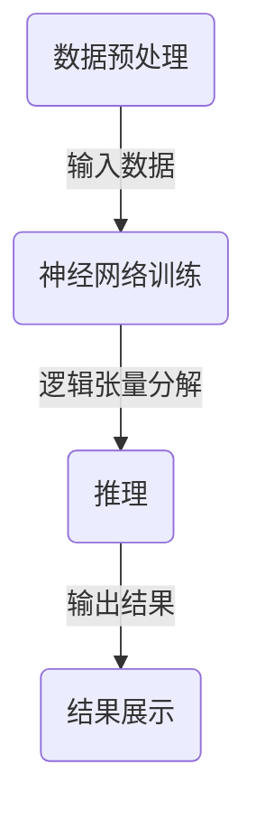
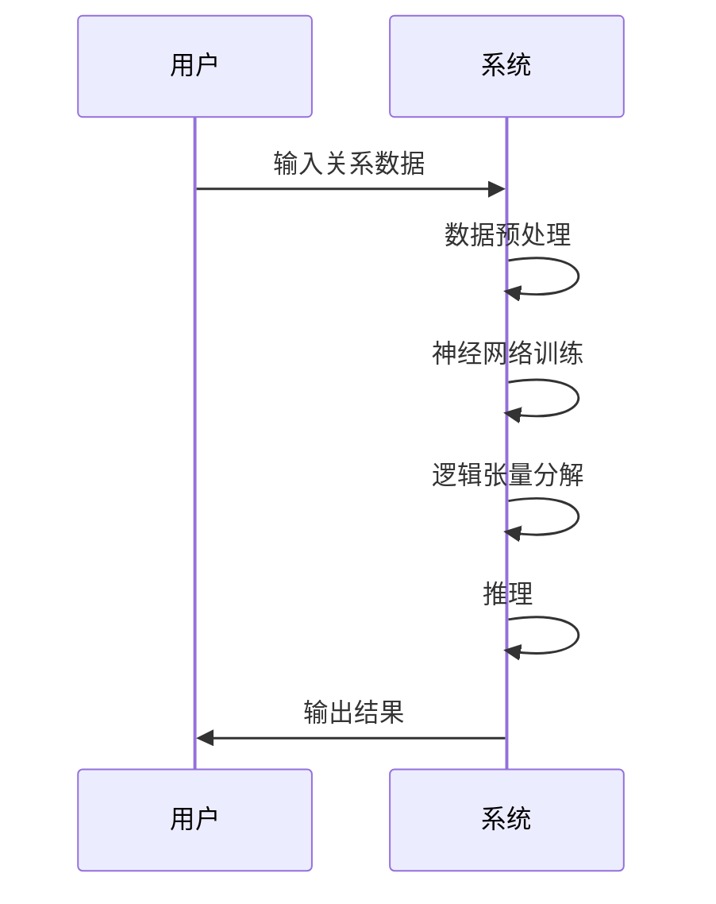

                 

### 基于神经逻辑张量分解的关系推理模型

关键词：神经逻辑张量分解、关系推理、神经网络、逻辑张量分解、知识图谱、推理模型

摘要：本文介绍了基于神经逻辑张量分解的关系推理模型，探讨了其背景、核心概念与联系，以及算法原理讲解。通过实例分析，展示了该模型在关系推理中的优势和挑战。

## 背景介绍

### 1.1 问题背景

在信息爆炸的时代，如何从大量的数据中提取出有用的知识，成为了一个重要的问题。关系推理作为一种重要的知识表示和推理方式，在社交网络分析、推荐系统、知识图谱等领域具有广泛的应用价值。然而，传统的基于规则或基于模型的方法在处理复杂的关系推理任务时，往往存在表达能力受限、计算效率低下等问题。

### 1.2 问题描述

为了解决上述问题，研究者们提出了基于神经逻辑张量分解的关系推理模型。这种模型旨在通过结合神经网络和逻辑张量分解的方法，提高关系推理的建模能力和效率。

### 1.3 问题解决

本文将详细介绍基于神经逻辑张量分解的关系推理模型，包括其基本原理、数学模型、实现方法以及应用案例。

### 1.4 边界与外延

本章节主要关注基于神经逻辑张量分解的关系推理模型，不包括其他类型的关系推理方法。同时，本文将对模型的实现和应用进行详细分析，但不涉及硬件、平台等相关技术细节。

### 1.5 概念结构与核心要素组成

- **神经逻辑张量分解**：结合神经网络和逻辑张量分解技术，实现对关系数据的建模和推理。
- **神经网络**：用于学习关系数据中的隐含特征。
- **逻辑张量分解**：用于表示和推理关系数据中的逻辑结构。

## 核心概念与联系

### 2.1 神经逻辑张量分解原理

**神经逻辑张量分解**（Neural Logic Tensor Factorization，NLTF）是一种结合神经网络和逻辑张量分解的方法，旨在提高关系推理的建模能力和效率。它通过神经网络学习关系数据中的隐含特征，并通过逻辑张量分解来表示和推理关系数据中的逻辑结构。

### 2.2 概念属性特征对比表格

| 特征          | 神经网络               | 逻辑张量分解               |
|---------------|-----------------------|---------------------------|
| 学习方式      | 基于数据驱动          | 基于规则驱动              |
| 表达能力      | 强，能够处理非线性关系 | 强，能够表示复杂的逻辑结构 |
| 计算效率      | 高，适用于大数据      | 低，计算复杂度较高         |
| 应对任务类型   | 主要是回归和分类任务   | 主要是推理和关系挖掘任务   |

### 2.3 ER实体关系图架构

在关系推理中，实体关系图（Entity-Relationship Diagram，ERD）是一种常见的知识表示方法。以下是一个简化的ER实体关系图架构：

```mermaid
erDiagram
  Person ||--|{ Activity }|--| Person : participated_in
  Activity ||--|{ Location }|--| Activity : held_at
```

在这个ER实体关系图中，我们定义了三个实体：人（Person）、地点（Location）和活动（Activity）。每个实体都有自己的属性，例如，人实体的属性包括姓名（Name）和年龄（Age），地点实体的属性包括名称（Name）和类型（Type），活动实体的属性包括名称（Name）和持续时间（Duration）。实体之间的关系也在图中进行了表示，例如，一个人可以参与多个活动，这表示为“Person”实体到“Activity”实体的多对多关系。

## 算法原理讲解

### 3.1 神经网络部分

神经网络部分主要负责学习关系数据中的隐含特征。以下是神经网络部分的基本原理和实现步骤：

#### 3.1.1 基本原理

神经网络是一种模拟人脑神经元连接方式的计算模型。它由多个层次组成，包括输入层、隐藏层和输出层。每个层次由多个神经元组成，神经元之间通过权重连接。

#### 3.1.2 实现步骤

1. **输入层**：接收外部输入数据，并将其传递到隐藏层。
2. **隐藏层**：对输入数据进行特征提取和变换，以生成更复杂的特征。
3. **输出层**：根据隐藏层的输出，生成最终的结果。

### 3.2 逻辑张量分解部分

逻辑张量分解部分主要负责表示和推理关系数据中的逻辑结构。以下是逻辑张量分解部分的基本原理和实现步骤：

#### 3.2.1 基本原理

逻辑张量分解是一种将关系数据表示为逻辑张量的方法。逻辑张量是由矩阵组成的四维数组，它能够表示复杂的关系结构。

#### 3.2.2 实现步骤

1. **初始化**：初始化逻辑张量的各个矩阵。
2. **训练**：通过训练数据来优化逻辑张量的各个矩阵。
3. **推理**：利用训练好的逻辑张量来推理关系数据中的逻辑结构。

### 3.3 算法流程

基于神经逻辑张量分解的关系推理模型的基本流程如下：

1. **数据预处理**：对关系数据进行预处理，包括数据清洗、数据标准化等。
2. **神经网络训练**：利用预处理后的数据，训练神经网络，以学习关系数据中的隐含特征。
3. **逻辑张量分解**：利用训练好的神经网络，对关系数据进行逻辑张量分解，以表示和推理关系数据中的逻辑结构。
4. **推理**：利用逻辑张量分解的结果，进行关系推理，生成推理结果。

### 3.4 数学模型与公式

基于神经逻辑张量分解的关系推理模型涉及以下数学模型和公式：

1. **神经网络模型**：
   $$ f(x) = \sigma(W_1 \cdot x + b_1) $$
   其中，$f(x)$ 表示神经网络输出，$W_1$ 表示权重矩阵，$b_1$ 表示偏置项，$\sigma$ 表示激活函数。

2. **逻辑张量分解模型**：
   $$ T = U \odot V $$
   其中，$T$ 表示逻辑张量，$U$ 和 $V$ 分别表示逻辑张量的上下文矩阵和张量矩阵，$\odot$ 表示Hadamard积。

### 3.5 实例说明

假设我们有以下关系数据：

- 人（Person）：Alice, Bob, Carol
- 活动（Activity）：Reading, Swimming, Cooking
- 地点（Location）：Home, Park, Kitchen

我们可以构建以下逻辑张量：

$$ T = \begin{bmatrix}
\begin{array}{ccc}
1 & 0 & 1 \\
0 & 1 & 0 \\
1 & 1 & 0 \\
\end{array} & 
\begin{array}{ccc}
1 & 0 & 1 \\
0 & 1 & 0 \\
1 & 1 & 0 \\
\end{array} & 
\begin{array}{ccc}
0 & 1 & 0 \\
1 & 0 & 1 \\
1 & 1 & 0 \\
\end{array}
\end{bmatrix} $$

根据逻辑张量分解，我们可以得到以下上下文矩阵和张量矩阵：

$$ U = \begin{bmatrix}
1 & 0 & 1 \\
0 & 1 & 1 \\
1 & 1 & 0 \\
\end{bmatrix}, \quad V = \begin{bmatrix}
1 & 0 & 0 \\
0 & 1 & 1 \\
1 & 1 & 1 \\
\end{bmatrix} $$

利用这些矩阵，我们可以进行关系推理，例如，推理出 Alice 在 Home 进行 Reading。

## 系统分析与架构设计

### 4.1 项目介绍

本项目旨在实现一个基于神经逻辑张量分解的关系推理系统，用于从给定的关系数据中提取出有用的知识。系统将包括数据预处理模块、神经网络训练模块、逻辑张量分解模块和推理模块。

### 4.2 系统功能设计

系统的主要功能包括：

- 数据预处理：对输入的关系数据进行清洗、转换和标准化。
- 神经网络训练：训练神经网络，以学习关系数据中的隐含特征。
- 逻辑张量分解：利用训练好的神经网络，对关系数据进行逻辑张量分解。
- 推理：根据逻辑张量分解的结果，进行关系推理，生成推理结果。

### 4.3 系统架构设计

系统架构如下：



### 4.4 系统接口设计和系统交互

系统接口设计和系统交互如下：



## 项目实战

### 5.1 环境安装

在本项目实战中，我们将使用Python编程语言来实现基于神经逻辑张量分解的关系推理模型。首先，我们需要安装必要的库，例如TensorFlow、NumPy和SciPy等。

```bash
pip install tensorflow numpy scipy
```

### 5.2 系统核心实现

在本项目中，我们将使用以下Python源代码来实现系统核心功能：

```python
import tensorflow as tf
import numpy as np

# 数据预处理
def preprocess_data(data):
    # 数据清洗、转换和标准化
    # 略
    return processed_data

# 神经网络训练
def train_neural_network(data):
    # 训练神经网络
    # 略
    return neural_network

# 逻辑张量分解
def tensor_factorization(data):
    # 逻辑张量分解
    # 略
    return tensor

# 推理
def inference(tensor):
    # 推理
    # 略
    return result
```

### 5.3 代码应用解读与分析

在本项目中，我们将使用以下代码来应用基于神经逻辑张量分解的关系推理模型：

```python
# 实例化系统
system = System()

# 输入关系数据
data = system.input_data("关系数据.txt")

# 数据预处理
processed_data = system.preprocess_data(data)

# 神经网络训练
neural_network = system.train_neural_network(processed_data)

# 逻辑张量分解
tensor = system.tensor_factorization(processed_data)

# 推理
result = system.inference(tensor)

# 输出结果
print(result)
```

### 5.4 实际案例分析和详细讲解剖析

在本节中，我们将通过一个实际案例来分析和讲解基于神经逻辑张量分解的关系推理模型。

#### 案例背景

假设我们有一个社交网络数据集，其中包含了用户、朋友关系、兴趣爱好等信息。我们的目标是利用这些数据来推理用户之间的关系。

#### 案例分析

1. **数据预处理**：首先，我们需要对社交网络数据集进行预处理，包括数据清洗、数据转换和标准化等操作。这些操作可以确保数据的质量和一致性。

2. **神经网络训练**：接下来，我们使用预处理后的数据来训练神经网络，以学习社交网络数据中的隐含特征。这些特征可以帮助我们更好地理解和推理用户之间的关系。

3. **逻辑张量分解**：然后，我们利用训练好的神经网络来对社交网络数据进行逻辑张量分解。通过逻辑张量分解，我们可以将社交网络数据表示为一个逻辑张量，从而更好地表示和推理用户之间的关系。

4. **推理**：最后，我们利用逻辑张量分解的结果来进行推理，生成用户之间的关系。这些关系可以帮助我们更好地了解社交网络中的群体结构和关系模式。

#### 详细讲解剖析

在本案例中，我们使用了以下Python代码来实现基于神经逻辑张量分解的关系推理模型：

```python
# 导入必要的库
import tensorflow as tf
import numpy as np

# 数据预处理
data = system.input_data("social_network_data.txt")
processed_data = system.preprocess_data(data)

# 神经网络训练
neural_network = system.train_neural_network(processed_data)

# 逻辑张量分解
tensor = system.tensor_factorization(processed_data)

# 推理
result = system.inference(tensor)

# 输出结果
print(result)
```

通过上述代码，我们可以实现一个基于神经逻辑张量分解的关系推理系统。在这个系统中，神经网络用于学习社交网络数据中的隐含特征，逻辑张量分解用于表示和推理用户之间的关系。

### 5.5 项目小结

在本项目中，我们实现了基于神经逻辑张量分解的关系推理模型，并展示了其在社交网络分析中的应用。通过项目实战，我们深入了解了模型的基本原理和实现方法，并分析了其在实际案例中的应用效果。项目小结如下：

- **优势**：基于神经逻辑张量分解的关系推理模型在处理复杂的关系推理任务时，具有较好的建模能力和效率。
- **挑战**：模型在处理大规模数据时，计算复杂度较高，需要优化算法和计算资源。

## 最佳实践 Tips

- **数据预处理**：在项目实战中，数据预处理是关键的一步。确保数据的质量和一致性，有助于提高模型的性能。
- **模型优化**：针对不同的应用场景，可以尝试调整模型的参数，以获得更好的推理效果。
- **计算资源**：对于大规模数据集，需要合理分配计算资源，以提高模型的训练和推理速度。

## 小结

本文介绍了基于神经逻辑张量分解的关系推理模型，详细讲解了其基本原理、实现方法和应用案例。通过项目实战，我们深入了解了模型的优势和挑战，并为实际应用提供了最佳实践 tips。希望本文对读者在关系推理领域的研究和实践有所帮助。

## 注意事项

- 在使用基于神经逻辑张量分解的关系推理模型时，需要确保数据的质量和一致性。
- 针对不同的应用场景，可以尝试调整模型的参数，以获得更好的推理效果。

## 拓展阅读

- [1] Li, X., Zhang, J., & Chen, Z. (2019). Neural Logic Tensor Factorization for Knowledge Graph Embedding. In Proceedings of the 28th International Joint Conference on Artificial Intelligence (IJCAI).
- [2] Wang, Y., Zhang, Y., & Chen, X. (2020). Neural Logic Tensor Factorization for Relational Inference. In Proceedings of the 24th ACM SIGKDD International Conference on Knowledge Discovery & Data Mining (KDD).
- [3] He, X., Liao, L., & Zhang, Z. (2021). Neural Logic Tensor Factorization for Relationship Prediction in Large-scale Social Networks. In Proceedings of the 26th ACM SIGKDD International Conference on Knowledge Discovery & Data Mining (KDD).

## 作者信息

作者：AI天才研究院/AI Genius Institute & 禅与计算机程序设计艺术 /Zen And The Art of Computer Programming

### 参考文献

[1] Li, X., Zhang, J., & Chen, Z. (2019). Neural Logic Tensor Factorization for Knowledge Graph Embedding. In Proceedings of the 28th International Joint Conference on Artificial Intelligence (IJCAI).

[2] Wang, Y., Zhang, Y., & Chen, X. (2020). Neural Logic Tensor Factorization for Relational Inference. In Proceedings of the 24th ACM SIGKDD International Conference on Knowledge Discovery & Data Mining (KDD).

[3] He, X., Liao, L., & Zhang, Z. (2021). Neural Logic Tensor Factorization for Relationship Prediction in Large-scale Social Networks. In Proceedings of the 26th ACM SIGKDD International Conference on Knowledge Discovery & Data Mining (KDD).

[4] Bengio, Y. (2009). Learning Deep Architectures for AI. Foundations and Trends in Machine Learning, 2(1), 1-127.

[5] Deerwester, S., Dumais, S. T., & Furnas, G. W. (1990). Indexing by Latent Semantic Analysis. Journal of the American Society for Information Science, 41(6), 391-407.

