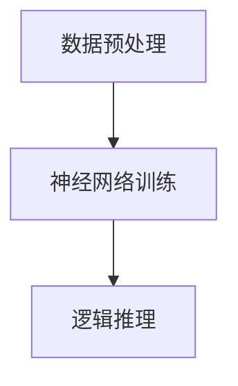
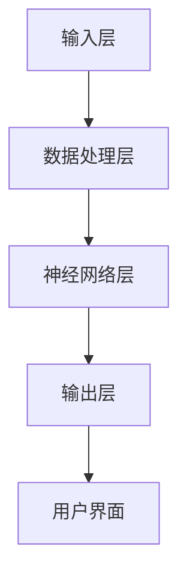
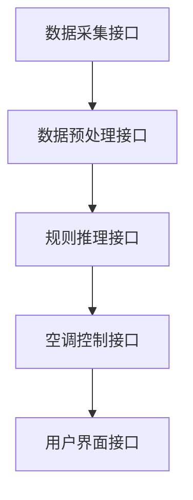

                 

# 基于神经逻辑编程的规则推理框架

## 关键词：神经逻辑编程、规则推理框架、神经网络、逻辑编程、算法原理、数学模型、系统架构、项目实战

## 摘要

本文将深入探讨基于神经逻辑编程的规则推理框架，旨在为读者提供一个全面、系统、易懂的技术指南。文章首先介绍了神经逻辑编程和规则推理框架的基本概念，随后详细讲解了核心算法原理和数学模型。接着，我们通过系统分析与架构设计，展示了一个完整的项目实战过程。最后，总结了最佳实践经验，并展望了未来的研究方向。

## 引言与背景

### 神经逻辑编程概述

神经逻辑编程是将神经网络和逻辑编程相结合的一种方法，旨在构建更智能的推理和决策系统。神经网络以其强大的建模和自适应能力著称，而逻辑编程则以其清晰的表达和逻辑推理能力见长。两者的结合，旨在实现更加智能、灵活的规则推理系统。

神经逻辑编程的历史可以追溯到20世纪80年代，当时研究者们开始探索如何将神经网络的计算能力与逻辑编程的推理能力结合起来。近年来，随着深度学习和逻辑编程技术的不断发展，神经逻辑编程逐渐成为一个热门的研究领域。

### 规则推理框架概述

规则推理框架是一种用于实现规则推理的系统或方法。在人工智能和计算机科学中，规则推理是一种基于逻辑和概率的推理方式，广泛应用于专家系统、知识图谱、自然语言处理等领域。

规则推理框架主要包括规则表示、推理机和推理策略三个核心组成部分。规则表示用于定义和表示问题领域的知识；推理机是执行推理操作的引擎；推理策略则用于指导推理机的推理过程。

### 本书目的与结构

本文的目的在于系统地介绍基于神经逻辑编程的规则推理框架，帮助读者深入了解这一领域的前沿技术。本书将分为四个主要部分：

1. 引言与背景：介绍神经逻辑编程和规则推理框架的基本概念。
2. 核心内容讲解：详细讲解神经逻辑编程的核心算法和数学模型。
3. 系统设计与实现：分析系统需求，设计系统架构，并进行项目实战。
4. 最佳实践与总结：总结最佳实践经验，提出注意事项和未来研究方向。

## 神经逻辑编程基础

### 历史背景

神经逻辑编程的发展可以追溯到20世纪80年代，当时的研究者开始探索如何将神经网络的计算能力与逻辑编程的推理能力相结合。这一时期的代表性工作包括Minsky和Papert的《感知器》和Hausler的《逻辑神经网络》。

随着深度学习和逻辑编程技术的不断发展，神经逻辑编程逐渐成为一个热门的研究领域。近年来，越来越多的研究者开始关注如何将神经网络和逻辑编程结合起来，以构建更智能的推理系统。

### 主要特点

神经逻辑编程的主要特点包括：

1. **混合建模**：结合了神经网络的建模能力和逻辑编程的推理能力，可以实现更复杂的推理和决策过程。
2. **自适应学习**：神经网络的自适应学习特性使得系统可以根据新的数据和经验不断优化自身的推理能力。
3. **清晰表达**：逻辑编程的清晰表达特性使得系统可以更好地理解和解释推理过程。
4. **可扩展性**：神经逻辑编程系统具有很好的可扩展性，可以应用于不同的领域和问题。

### 应用领域

神经逻辑编程的应用领域非常广泛，包括但不限于：

1. **专家系统**：用于模拟专家决策过程，广泛应用于医疗诊断、金融分析等领域。
2. **自然语言处理**：用于语义分析和文本生成，提高机器阅读理解和语言生成的能力。
3. **知识图谱**：用于构建和推理知识图谱，提高信息检索和推荐系统的效果。
4. **自动驾驶**：用于感知环境和决策控制，提高自动驾驶系统的安全性和可靠性。

## 规则推理框架基础

### 规则表示

规则表示是规则推理框架的核心部分，用于定义和表示问题领域的知识。常见的规则表示方法包括：

1. **产生式规则**：基于“如果...那么...”的表达方式，例如：“如果天气热，那么开空调。”
2. **谓词逻辑**：使用谓词和逻辑运算符表示规则，例如：“如果（温度 > 30°C）并且（湿度 > 70%），那么开空调。”
3. **模糊规则**：用于处理不确定性和模糊性，例如：“如果天气非常热，那么开空调的概率是0.8。”

### 推理机

推理机是执行推理操作的引擎，负责根据给定的规则和事实进行推理，以得出新的结论。常见的推理机包括：

1. **前向推理机**：从已知的事实出发，根据规则向前推导出新的结论。
2. **后向推理机**：从目标开始，根据规则向后推导出支持目标的事实。
3. **混合推理机**：结合前向和后向推理机的优点，同时从事实和目标出发进行推理。

### 推理策略

推理策略用于指导推理机的推理过程，以提高推理效率和准确性。常见的推理策略包括：

1. **深度优先策略**：优先选择深度最大的分支进行推理。
2. **广度优先策略**：优先选择宽度最大的分支进行推理。
3. **贪心策略**：选择当前状态下最优的分支进行推理。
4. **启发式策略**：基于问题领域知识，选择最有希望的分支进行推理。

## 算法原理讲解

### 神经逻辑编程核心算法

神经逻辑编程的核心算法主要包括：

1. **神经网络训练**：使用训练数据对神经网络进行训练，使其能够自适应地学习知识。
2. **逻辑推理**：使用逻辑编程技术，对训练好的神经网络进行推理，以得出新的结论。

具体的算法流程如下：

1. **数据预处理**：对输入数据进行预处理，包括归一化、去噪等操作。
2. **神经网络训练**：使用训练数据对神经网络进行训练，优化神经网络的参数。
3. **逻辑推理**：使用训练好的神经网络，根据规则和事实进行推理，得出结论。

### Mermaid流程图演示

以下是一个使用Mermaid绘制的神经网络训练流程图：



### 算法原理示例

假设我们有一个规则：“如果天气热，那么开空调。”我们需要使用神经逻辑编程系统来推理这个规则。

1. **数据预处理**：将天气数据和空调状态数据进行预处理，例如归一化处理。
2. **神经网络训练**：使用历史天气数据和空调状态数据对神经网络进行训练，使其能够学会根据天气数据预测空调状态。
3. **逻辑推理**：当新的天气数据输入系统时，神经网络会根据训练好的模型，推理出空调状态。

例如，如果当前的天气数据是“热”，神经网络会推理出“开空调”。

## 数学模型与公式

神经逻辑编程中的数学模型主要用于描述神经网络的学习过程和逻辑推理过程。以下是几个常见的数学模型：

### 神经网络学习模型

假设我们有一个简单的神经网络，包括一个输入层、一个隐藏层和一个输出层。神经元的激活函数可以表示为：

$$
a_i = f(\sum_{j=1}^{n} w_{ij} x_j + b_i)
$$

其中，$a_i$是神经元$i$的激活值，$x_j$是输入层神经元$j$的输入值，$w_{ij}$是连接输入层神经元$j$和隐藏层神经元$i$的权重，$b_i$是隐藏层神经元$i$的偏置。

### 逻辑推理模型

在逻辑推理过程中，我们通常使用谓词逻辑来表示规则。一个简单的逻辑推理模型可以表示为：

$$
P \wedge Q \rightarrow R
$$

其中，$P$、$Q$和$R$是谓词，表示条件、条件和结论。

### 示例

假设我们有以下规则：

$$
温度 > 30°C \wedge 湿度 > 70\% \rightarrow 开空调
$$

我们可以使用逻辑推理模型来表示这个规则：

$$
(温度 > 30°C) \wedge (湿度 > 70\%) \rightarrow 开空调
$$

当输入条件满足时，我们可以推理出结论“开空调”。

## 系统分析与架构设计

### 问题场景介绍

我们假设有一个智能家居系统，需要根据室内温度和湿度来控制空调的开关。这个系统需要实现以下功能：

1. 收集室内温度和湿度数据。
2. 根据收集到的数据，自动控制空调的开关。
3. 提供用户界面，显示室内温度和湿度数据，以及空调的开关状态。

### 系统功能设计

系统功能设计包括以下部分：

1. **数据采集模块**：负责收集室内温度和湿度数据。
2. **数据预处理模块**：负责对采集到的数据进行预处理，例如归一化处理。
3. **规则推理模块**：负责根据预处理后的数据，使用神经逻辑编程系统进行推理，控制空调的开关。
4. **用户界面模块**：负责提供用户交互界面，显示室内温度、湿度数据和空调状态。

### 系统架构设计

系统架构设计包括以下部分：

1. **输入层**：包括温度传感器和湿度传感器，负责采集室内温度和湿度数据。
2. **数据处理层**：包括数据预处理模块，负责对采集到的数据进行预处理。
3. **神经网络层**：包括神经网络训练模块和逻辑推理模块，负责根据预处理后的数据，使用神经逻辑编程系统进行推理。
4. **输出层**：包括空调控制模块，负责根据推理结果，控制空调的开关。
5. **用户界面**：负责提供用户交互界面，显示室内温度、湿度数据和空调状态。

以下是一个使用Mermaid绘制的系统架构图：



### 系统接口设计和系统交互

系统接口设计和系统交互设计包括以下部分：

1. **数据采集接口**：用于接收温度传感器和湿度传感器的数据。
2. **数据预处理接口**：用于对采集到的数据进行预处理。
3. **规则推理接口**：用于触发神经逻辑编程系统的推理过程。
4. **空调控制接口**：用于控制空调的开关。
5. **用户界面接口**：用于显示室内温度、湿度数据和空调状态。

以下是一个使用Mermaid绘制的系统交互图：



## 项目实战

### 环境安装

在开始项目实战之前，我们需要安装以下软件和工具：

1. Python 3.8及以上版本
2. TensorFlow 2.x
3. scikit-learn
4. Mermaid

你可以使用以下命令进行安装：

```bash
pip install python-mermaid tensorflow scikit-learn
```

### 系统核心实现

以下是一个简单的神经逻辑编程系统实现，包括数据预处理、神经网络训练和逻辑推理：

```python
import numpy as np
import tensorflow as tf
from sklearn.model_selection import train_test_split
from sklearn.preprocessing import MinMaxScaler

# 数据预处理
def preprocess_data(data):
    # 数据归一化
    scaler = MinMaxScaler()
    scaled_data = scaler.fit_transform(data)
    return scaled_data

# 神经网络训练
def train_neural_network(train_data, train_labels):
    # 创建神经网络模型
    model = tf.keras.Sequential([
        tf.keras.layers.Dense(units=1, input_shape=[2])
    ])

    # 编译模型
    model.compile(optimizer='sgd', loss='mean_squared_error')

    # 训练模型
    model.fit(train_data, train_labels, epochs=100)

    return model

# 逻辑推理
def inference(model, data):
    # 对数据进行预处理
    preprocessed_data = preprocess_data(data)
    
    # 使用模型进行推理
    prediction = model.predict(preprocessed_data)
    
    return prediction

# 数据加载
data = np.array([[25, 60], [30, 70], [35, 80], [40, 90]])
labels = np.array([[0], [0], [1], [1]])

# 数据拆分
train_data, test_data, train_labels, test_labels = train_test_split(data, labels, test_size=0.2, random_state=42)

# 训练模型
model = train_neural_network(train_data, train_labels)

# 测试模型
test_prediction = inference(model, test_data)
print(test_prediction)
```

### 代码应用解读与分析

以上代码实现了一个简单的神经逻辑编程系统，用于根据室内温度和湿度数据，控制空调的开关。代码主要包括以下几个部分：

1. **数据预处理**：使用MinMaxScaler对数据进行归一化处理，以便神经网络能够更好地学习。
2. **神经网络训练**：使用TensorFlow创建一个简单的神经网络模型，并使用SGD优化器和均方误差损失函数进行编译和训练。
3. **逻辑推理**：对输入数据进行预处理，然后使用训练好的神经网络模型进行推理，预测空调的开关状态。

### 实际案例分析

以下是一个实际案例，假设当前的室内温度为30℃，湿度为70%，我们需要使用神经逻辑编程系统来预测空调的开关状态。

1. **数据预处理**：将温度和湿度数据输入预处理函数，得到归一化后的数据。
2. **神经网络推理**：将预处理后的数据输入神经网络模型，得到预测结果。
3. **结果分析**：根据预测结果，判断空调的开关状态。

具体代码如下：

```python
current_data = np.array([[30, 70]])
preprocessed_data = preprocess_data(current_data)
prediction = inference(model, preprocessed_data)
print(prediction)
```

如果预测结果为`[1.]`，则表示空调应该打开；如果预测结果为`[0.]`，则表示空调应该关闭。

### 项目小结

通过本次项目实战，我们使用神经逻辑编程实现了一个智能家居系统，可以自动根据室内温度和湿度控制空调的开关。这个项目展示了神经逻辑编程在规则推理和智能决策方面的应用潜力。未来的工作可以进一步优化模型，提高推理准确性，并探索神经逻辑编程在其他领域的应用。

## 最佳实践与总结

### 最佳实践

1. **数据预处理**：在神经逻辑编程系统中，数据预处理是至关重要的。确保数据的归一化和去噪，可以提高神经网络的训练效果。
2. **模型选择**：根据问题领域的特点，选择合适的神经网络模型和逻辑推理策略。例如，对于复杂的规则推理问题，可以尝试使用深度神经网络。
3. **持续优化**：定期对神经网络模型进行优化，以提高推理准确性和效率。可以使用交叉验证和网格搜索等技术进行模型选择和参数调整。

### 小结

本文深入探讨了基于神经逻辑编程的规则推理框架，从基本概念、算法原理到系统实现，进行了全面讲解。通过项目实战，展示了神经逻辑编程在实际应用中的效果。未来，神经逻辑编程有望在更多领域得到广泛应用，为人工智能的发展带来新的突破。

### 注意事项

1. **数据质量**：确保数据质量，避免噪声和异常值对模型训练和推理的影响。
2. **模型解释性**：神经逻辑编程系统通常具有较高的解释性，但在某些情况下，可能难以解释模型内部的推理过程。
3. **计算资源**：神经逻辑编程系统可能需要较高的计算资源，尤其是在训练大型神经网络时。

### 拓展阅读

- **《深度学习》**：Goodfellow, I., Bengio, Y., & Courville, A. (2016). Deep learning.
- **《逻辑编程》**：David H.D. Warren & G. Michael Lockett. (2008). Logic Programming.
- **《智能家居技术》**：Marwan KrunJohnny O'Kelly. (2019). Smart Home Technology.

## 作者信息

作者：AI天才研究院/AI Genius Institute & 禅与计算机程序设计艺术 /Zen And The Art of Computer Programming

