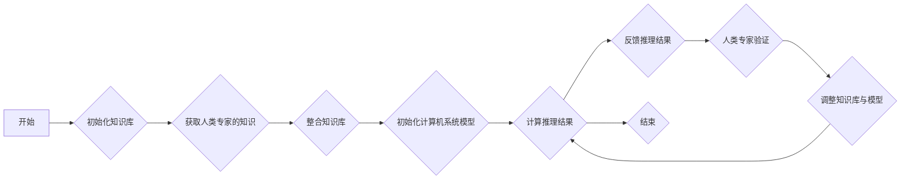

                 

## 《基于认知计算的人机协作推理系统》

关键词：认知计算、人机协作、推理系统、算法原理、项目实战

摘要：本文深入探讨了基于认知计算的人机协作推理系统，首先介绍了认知计算和人机协作推理系统的概念、背景及发展历程。接着，详细解析了认知计算的基本原理，包括认知科学、神经网络与深度学习、强化学习与决策理论。随后，阐述了人机协作推理系统的架构设计、算法原理及数学模型。文章通过项目实战展示了系统实现过程、代码应用与分析。最后，总结了最佳实践与项目小结，并提出了未来的发展方向和注意事项。

## 目录大纲

```markdown
----------------------------------------------------------------
# 第一部分: 认知计算与人机协作推理系统基础

## 第1章: 认知计算与人机协作推理系统概述

### 1.1.1 问题背景与核心概念

### 1.1.2 认知计算与人机协作的发展历程

### 1.1.3 推理系统在认知计算中的应用

## 第2章: 认知计算的基本原理

### 2.1.1 认知科学的基本概念

### 2.1.2 神经网络与深度学习

### 2.1.3 强化学习与决策理论

## 第3章: 人机协作推理系统架构

### 3.1.1 系统功能与组件

### 3.1.2 系统架构设计

### 3.1.3 系统接口与交互

## 第4章: 人机协作推理算法原理

### 4.1.1 算法概述

### 4.1.2 算法流程图

### 4.1.3 Python代码实现与解释

## 第5章: 数学模型与公式解析

### 5.1.1 基本数学公式

### 5.1.2 算法数学模型

### 5.1.3 公式推导与示例

## 第6章: 项目实战

### 6.1.1 环境安装与配置

### 6.1.2 系统核心实现

### 6.1.3 代码应用解读

### 6.1.4 实际案例分析与讲解

## 第7章: 最佳实践与项目小结

### 7.1.1 最佳实践

### 7.1.2 小结与展望

### 7.1.3 注意事项与拓展阅读

----------------------------------------------------------------
```

## 第1章 认知计算与人机协作推理系统概述

### 1.1.1 问题背景与核心概念

认知计算（Cognitive Computing）是一种模拟人类思维和行为的人工智能技术，旨在使机器具备类似人类的感知、理解、学习和推理能力。而人机协作推理系统（Human-Machine Collaborative Reasoning System）则是认知计算的一个重要应用方向，通过人机协同工作，实现更加高效、智能的推理和决策。

在现代社会，随着大数据、云计算、物联网等技术的发展，人类面临着越来越多的复杂问题和决策场景。单靠人类自身的认知能力难以应对这些挑战，而传统的计算机系统也存在着处理速度慢、理解能力有限等问题。因此，如何将人类与计算机结合起来，发挥各自的优势，共同解决复杂问题，成为了当前人工智能领域的一个热点研究方向。

本文将详细探讨基于认知计算的人机协作推理系统，旨在通过逻辑清晰、结构紧凑、简单易懂的专业技术语言，为读者提供一个深入理解和应用这一系统的方法和思路。

#### 核心概念

- **认知计算**：一种模拟人类思维和行为的人工智能技术。
- **人机协作推理系统**：一种通过人类与计算机协同工作，实现高效推理和决策的系统。
- **推理**：从已知信息推导出新信息的过程。

#### 问题背景

在许多实际应用场景中，如医学诊断、金融分析、智能客服等，需要处理大量复杂的信息，并从中提取有价值的知识和规律。然而，人类在处理这些信息时，往往会受到认知能力和时间的限制。同时，传统计算机系统在理解和处理自然语言、图像、音频等复杂数据时，也存在一定的局限性。因此，如何实现人类与计算机的智能协同，成为了解决这些问题的关键。

### 1.1.2 认知计算与人机协作的发展历程

认知计算和人机协作推理系统的概念最早可以追溯到20世纪50年代，当时计算机科学家和认知科学家开始尝试将人工智能与认知科学相结合。这一阶段，主要研究的是如何模拟人类的感知、理解和记忆等认知功能。

随着计算机技术的不断进步，特别是神经网络和深度学习算法的出现，认知计算进入了一个快速发展期。神经网络作为一种模拟人类大脑的算法，可以处理复杂的非线性问题，并在图像识别、语音识别等领域取得了显著成果。

与此同时，人机协作的理念也逐渐被引入到人工智能领域。早在20世纪80年代，研究者就开始探索如何将人类的认知能力与计算机的计算能力相结合，实现人机协同工作。这一阶段，主要研究的是如何设计出更加自然、高效的人机交互界面，以及如何通过协作机制提高系统的智能水平。

进入21世纪，随着大数据、云计算等技术的发展，认知计算和人机协作推理系统得到了更加广泛的应用。例如，在医疗领域，认知计算可以辅助医生进行诊断和治疗；在金融领域，人机协作推理系统可以帮助金融机构进行风险评估和投资决策。

总的来说，认知计算和人机协作推理系统的发展历程可以分为以下几个阶段：

1. **概念引入与初步研究**（20世纪50年代至70年代）：认知计算和人机协作的概念被提出，并进行初步的理论研究。
2. **快速发展期**（20世纪80年代至90年代）：神经网络和深度学习算法的出现，推动了认知计算的发展。同时，人机协作的理念逐渐被接受，并开始应用于实际场景。
3. **广泛应用期**（21世纪）：随着大数据、云计算等技术的普及，认知计算和人机协作推理系统得到了更加广泛的应用，成为人工智能领域的一个重要研究方向。

### 1.1.3 推理系统在认知计算中的应用

推理系统是认知计算的核心组成部分，它通过模拟人类的推理过程，实现对复杂问题的求解。在认知计算中，推理系统可以应用于多个领域，如自然语言处理、计算机视觉、智能决策等。

以下是一些典型的应用场景：

1. **自然语言处理**：在自然语言处理领域，推理系统可以帮助计算机理解自然语言，进行文本分析、语义理解、情感分析等。例如，在智能客服系统中，推理系统可以分析用户的提问，并给出合适的回答。

2. **计算机视觉**：在计算机视觉领域，推理系统可以帮助计算机识别和理解图像中的物体和场景。例如，在自动驾驶技术中，推理系统可以分析摄像头捕捉到的图像，识别道路、车辆、行人等信息，从而做出驾驶决策。

3. **智能决策**：在智能决策领域，推理系统可以帮助企业和组织分析大量数据，进行风险评估、投资决策等。例如，在金融领域，推理系统可以分析市场数据，预测股票走势，为投资者提供决策支持。

4. **医疗诊断**：在医疗领域，推理系统可以帮助医生进行疾病诊断和治疗方案推荐。例如，通过分析患者的病史、检查结果等数据，推理系统可以识别出潜在的健康风险，并给出相应的诊断和建议。

尽管推理系统在认知计算中具有广泛的应用，但也面临着一些挑战。首先，如何设计出高效、准确的推理算法是一个关键问题。其次，如何实现人类与计算机的智能协同，使得系统能够更好地理解和满足用户需求，也是一个重要的研究方向。

总的来说，认知计算和人机协作推理系统在解决复杂问题、提高生产效率、改善生活质量等方面具有巨大的潜力。未来，随着技术的不断进步，认知计算和人机协作推理系统将在更多领域得到应用，并取得更加显著的成果。

### 第2章 认知计算的基本原理

认知计算是一种模拟人类思维和行为的人工智能技术，其核心在于理解和模拟人类的认知过程。为了实现这一目标，我们需要了解认知科学、神经网络与深度学习、强化学习与决策理论等基本原理。

#### 2.1.1 认知科学的基本概念

认知科学是一门跨学科的研究领域，旨在理解人类心智的工作原理。它涉及到心理学、神经科学、哲学、语言学等多个学科。以下是一些关键概念：

1. **感知**：感知是指个体对外界信息的接收和理解。在认知计算中，感知模块负责将传感器获取的数据转换为计算机可以处理的形式。

2. **注意力**：注意力是指个体在感知和处理信息时，对某些特定信息的关注程度。在认知计算中，注意力机制可以帮助系统优先处理重要的信息。

3. **记忆**：记忆是指个体对过去经验和信息的存储和回忆。在认知计算中，记忆模块负责存储和处理系统的经验，以便在需要时进行回忆和利用。

4. **推理**：推理是指个体通过逻辑思维，从已知信息推导出新信息的过程。在认知计算中，推理模块是实现智能决策和问题解决的核心。

5. **语言处理**：语言处理是指个体理解和生成语言的能力。在认知计算中，语言处理模块负责对自然语言文本进行分析和理解，以便进行对话和文本分析。

#### 2.1.2 神经网络与深度学习

神经网络是认知计算的基础，它通过模拟人类大脑的神经元结构和工作原理，实现复杂的信息处理任务。以下是一些关键概念：

1. **神经元**：神经元是神经网络的基本单元，它通过接收和处理输入信息，产生输出信号。

2. **激活函数**：激活函数是神经元的关键组成部分，它用于确定神经元是否被激活。常见的激活函数包括线性函数、sigmoid函数和ReLU函数。

3. **多层感知机（MLP）**：多层感知机是一种前馈神经网络，它包含输入层、隐藏层和输出层。通过学习输入和输出之间的映射关系，MLP可以解决各种分类和回归问题。

4. **卷积神经网络（CNN）**：卷积神经网络是一种专门用于处理图像数据的神经网络，它通过卷积操作提取图像的特征。CNN在图像识别、物体检测等领域具有广泛的应用。

5. **循环神经网络（RNN）**：循环神经网络是一种处理序列数据的神经网络，它通过循环结构保持对历史信息的记忆。RNN在自然语言处理、语音识别等领域表现出色。

6. **深度学习**：深度学习是指使用多层神经网络进行学习的机器学习技术。深度学习通过自动提取特征，实现了在图像识别、语音识别、自然语言处理等领域的突破。

#### 2.1.3 强化学习与决策理论

强化学习是一种通过不断尝试和反馈进行学习的机器学习技术，它通过奖励机制引导系统寻找最优策略。以下是一些关键概念：

1. **状态**：状态是指系统在某一时刻所处的环境状态。

2. **动作**：动作是指系统可以采取的某种操作。

3. **奖励**：奖励是指系统在采取某种动作后获得的回报。

4. **策略**：策略是指系统在特定状态下选择动作的规则。

5. **值函数**：值函数是指系统在特定状态下采取某种动作的期望回报。

6. **策略迭代**：策略迭代是指通过不断调整策略，逐步逼近最优策略的过程。

决策理论是研究如何在不确定性环境中做出最优决策的学科。以下是一些关键概念：

1. **预期值**：预期值是指决策者在不同状态下采取不同动作的预期回报。

2. **风险**：风险是指决策者面临的不确定性和潜在损失。

3. **决策树**：决策树是一种常用的决策分析方法，它通过分层结构表示决策过程，帮助决策者选择最佳行动方案。

4. **马尔可夫决策过程（MDP）**：马尔可夫决策过程是一种用于描述决策过程的数学模型，它通过状态转移概率和奖励函数，指导决策者做出最优决策。

通过理解和应用这些基本原理，我们可以设计和实现出具有高度智能的认知计算系统。在接下来的章节中，我们将进一步探讨人机协作推理系统的架构设计、算法原理和数学模型。

### 第3章 人机协作推理系统架构

人机协作推理系统是认知计算的一个重要应用方向，它通过结合人类专家和计算机系统的优势，实现更加高效、智能的推理和决策。为了设计一个优秀的人机协作推理系统，我们需要从系统功能与组件、系统架构设计、系统接口与交互等方面进行全面考虑。

#### 3.1.1 系统功能与组件

人机协作推理系统的功能可以分为以下几个主要组件：

1. **感知模块**：感知模块负责接收和处理外部输入信息，如文本、图像、音频等。它通过自然语言处理、计算机视觉等技术，将非结构化的数据转换为结构化的信息，为后续处理提供基础。

2. **知识库**：知识库是人机协作推理系统的重要组件，它存储了大量的领域知识和事实信息。知识库可以分为两类：静态知识库和动态知识库。静态知识库包含预先定义的知识，如百科全书、法律法规等；动态知识库则通过实时数据更新和推理过程不断扩充。

3. **推理引擎**：推理引擎是系统的核心，它负责根据感知模块获取的信息和知识库中的知识，进行逻辑推理和决策。推理引擎可以采用基于规则、概率、深度学习等不同类型的推理算法。

4. **决策模块**：决策模块根据推理引擎提供的推理结果，生成具体的决策建议或行动方案。决策模块需要考虑多种因素，如风险、成本、时间等，确保生成的决策方案是合理、可行的。

5. **人机交互模块**：人机交互模块负责与人类用户进行沟通和协作。它可以通过自然语言处理、语音识别等技术，理解用户的意图和需求，并反馈推理结果和决策建议。同时，人机交互模块还可以提供可视化界面，帮助用户更好地理解系统和决策过程。

#### 3.1.2 系统架构设计

人机协作推理系统的架构设计需要考虑系统的功能需求、性能指标、可扩展性等方面。以下是一种常见的系统架构设计：

1. **数据层**：数据层负责数据的存储和管理。它包括数据库、数据仓库等组件，用于存储静态和动态的知识库、历史数据等。

2. **数据处理层**：数据处理层负责对输入数据进行预处理和特征提取。这一层可以采用自然语言处理、计算机视觉等技术，将非结构化的数据转换为结构化的信息，为后续处理提供基础。

3. **知识层**：知识层是系统的核心，它包括静态知识库和动态知识库。知识库可以采用知识图谱、本体论等技术进行组织和管理，以便快速检索和利用。

4. **推理层**：推理层是系统的核心组件，它负责根据感知模块获取的信息和知识库中的知识，进行逻辑推理和决策。推理层可以采用基于规则、概率、深度学习等不同类型的推理算法。

5. **决策层**：决策层根据推理层提供的推理结果，生成具体的决策建议或行动方案。决策层需要考虑多种因素，如风险、成本、时间等，确保生成的决策方案是合理、可行的。

6. **用户层**：用户层是系统与人类用户进行交互的界面。它可以通过自然语言处理、语音识别等技术，理解用户的意图和需求，并反馈推理结果和决策建议。同时，用户层还可以提供可视化界面，帮助用户更好地理解系统和决策过程。

#### 3.1.3 系统接口与交互

人机协作推理系统的接口与交互设计至关重要，它直接影响系统的易用性和用户体验。以下是一些关键点：

1. **接口设计**：系统的接口应尽可能简单、直观，易于用户理解和操作。接口可以采用RESTful API、GraphQL等接口规范，支持多种编程语言和工具的调用。

2. **交互流程**：系统的交互流程应设计为闭环，即用户提出需求，系统进行处理并返回结果，用户对结果进行反馈，系统根据反馈进行调整。这种交互流程有助于提高系统的智能水平，实现人机协同。

3. **可视化界面**：系统的可视化界面应直观、友好，能够清晰地展示系统的运行状态、推理结果和决策建议。可视化界面可以使用图表、图形、表格等元素，提高用户对系统的理解和信任。

4. **反馈机制**：系统应设计反馈机制，允许用户对系统的推理结果和决策建议进行评价和反馈。通过用户的反馈，系统可以不断优化和改进，提高人机协同的效率。

5. **多模态交互**：系统的交互应支持多种模态，如文本、语音、图像等。这样可以更好地满足用户的个性化需求，提高系统的用户体验。

通过以上架构设计，我们可以构建出一个高效、智能的人机协作推理系统。在接下来的章节中，我们将进一步探讨人机协作推理算法的原理，以及如何实现和应用这一算法。

### 第4章 人机协作推理算法原理

人机协作推理算法是人机协作推理系统的核心，它通过结合人类专家的知识和计算机系统的计算能力，实现高效的推理和决策。本章节将介绍人机协作推理算法的基本概念、流程图以及Python代码实现与解释。

#### 4.1.1 算法概述

人机协作推理算法的基本思想是，将人类专家的知识和计算机系统的计算能力相结合，通过协同工作，实现更加准确、高效的推理结果。算法的主要组成部分包括：

1. **知识融合**：将人类专家的知识和计算机系统的数据进行整合，形成一个统一的知识库。
2. **推理过程**：利用计算机系统的计算能力，对知识库中的信息进行推理，生成推理结果。
3. **人机交互**：将推理结果反馈给人类专家，进行验证和调整，形成闭环。

#### 4.1.2 算法流程图

算法的流程图如下：



#### 4.1.3 Python代码实现与解释

以下是一个简单的人机协作推理算法的Python代码实现：

```python
import numpy as np

# 初始化知识库
knowledge_base = {
    '事实1': '苹果是红色的',
    '事实2': '苹果是甜的',
    '事实3': '红色的水果是甜的'
}

# 初始化计算机系统模型
model = {
    '规则1': '如果苹果是红色的，那么它是甜的',
    '规则2': '如果苹果是甜的，那么它是红色的'
}

# 获取人类专家的知识
def get_expert_knowledge():
    expert_input = input("请输入您想要添加的知识：")
    knowledge_base[expert_input] = True

# 整合知识库
def integrate_knowledge():
    integrated_knowledge = {}
    for fact, value in knowledge_base.items():
        if value:
            integrated_knowledge[fact] = value
    return integrated_knowledge

# 计算推理结果
def reasoning(integrated_knowledge):
    results = {}
    for rule in model.values():
        if '如果' in rule and '那么' in rule:
            condition, conclusion = rule.split('如果')
            condition = condition.strip()
            conclusion = conclusion.strip().replace('那么', '')
            if condition in integrated_knowledge:
                results[conclusion] = True
    return results

# 反馈推理结果
def feedback_results(results):
    print("推理结果：")
    for conclusion, value in results.items():
        if value:
            print(f"{conclusion} 是正确的")

# 人类专家验证
def expert_validation():
    validation_input = input("您是否确认这些推理结果？（是/否）：")
    if validation_input.lower() == '否':
        return True
    return False

# 主函数
def main():
    while True:
        print("\n----------------人机协作推理系统----------------")
        print("1. 添加人类专家的知识")
        print("2. 进行推理")
        print("3. 退出系统")
        choice = input("请选择操作（1/2/3）：")
        
        if choice == '1':
            get_expert_knowledge()
        elif choice == '2':
            integrated_knowledge = integrate_knowledge()
            results = reasoning(integrated_knowledge)
            feedback_results(results)
            if expert_validation():
                continue
        elif choice == '3':
            print("感谢使用人机协作推理系统，再见！")
            break
        else:
            print("无效的输入，请重新输入。")

if __name__ == "__main__":
    main()
```

**代码解释**：

1. **知识库与模型初始化**：知识库`knowledge_base`存储了事实信息，模型`model`包含了推理规则。
2. **获取人类专家的知识**：`get_expert_knowledge`函数通过用户输入，添加新的知识到知识库中。
3. **整合知识库**：`integrate_knowledge`函数将知识库中的有效知识提取出来，形成一个整合的知识库。
4. **计算推理结果**：`reasoning`函数根据知识库中的事实和模型中的推理规则，生成推理结果。
5. **反馈推理结果**：`feedback_results`函数将推理结果打印出来，供用户查看。
6. **人类专家验证**：`expert_validation`函数询问用户是否确认推理结果，并根据用户输入进行相应操作。
7. **主函数**：`main`函数作为程序的入口，负责处理用户输入，调用其他函数，实现人机协作推理算法。

通过以上算法实现，我们可以看到人机协作推理算法的基本原理和实现方法。在接下来的章节中，我们将进一步探讨人机协作推理算法的数学模型与公式，以及如何在实际项目中应用这一算法。

### 第5章 数学模型与公式解析

在人机协作推理算法中，数学模型和公式起着至关重要的作用。它们不仅为算法提供了理论支持，还帮助我们在实际应用中更好地理解和优化算法性能。本章节将介绍算法中的基本数学公式、算法数学模型，以及具体的公式推导与示例。

#### 5.1.1 基本数学公式

在认知计算和人机协作推理系统中，常用的基本数学公式包括概率公式、线性代数公式和微积分公式。以下是这些基本公式的简要介绍：

1. **概率公式**：
   - 条件概率：$P(A|B) = \frac{P(A \cap B)}{P(B)}$
   - 乘法公式：$P(A \cap B) = P(A) \cdot P(B|A)$
   - 加法公式：$P(A \cup B) = P(A) + P(B) - P(A \cap B)$

2. **线性代数公式**：
   - 矩阵乘法：$(AB)_{ij} = \sum_{k=1}^{n} A_{ik}B_{kj}$
   - 矩阵求逆：$A^{-1} = (1/det(A)) \cdot adj(A)$
   - 特征值和特征向量：$Ax = \lambda x$

3. **微积分公式**：
   - 导数：$f'(x) = \lim_{h \to 0} \frac{f(x+h) - f(x)}{h}$
   - 积分：$\int f(x)dx = F(x) + C$
   - 泰勒展开：$f(x) = f(a) + f'(a)(x-a) + \frac{f''(a)}{2!}(x-a)^2 + ...$

#### 5.1.2 算法数学模型

人机协作推理算法的数学模型主要包括知识表示、推理规则、决策模型等。以下是这些模型的简要介绍：

1. **知识表示模型**：
   - **谓词逻辑**：使用谓词逻辑表示事实和推理规则，如 $P(A \land B) \Rightarrow C$。
   - **模糊逻辑**：使用模糊集合和模糊关系表示不确定性和模糊性，如 $A \land B = min(A, B)$。
   - **图论模型**：使用图表示知识库，节点表示事实，边表示事实之间的关系。

2. **推理规则模型**：
   - **前向推理**：从已知事实出发，利用推理规则推导出新的事实。
   - **反向推理**：从目标事实出发，逆向推导出所需的前提条件。
   - **混合推理**：结合前向和反向推理，实现更复杂的推理过程。

3. **决策模型**：
   - **决策树**：使用决策树表示决策过程，每个节点表示一个决策点，分支表示不同的决策路径。
   - **贝叶斯网络**：使用贝叶斯网络表示概率关系，通过条件概率计算得到决策结果。
   - **强化学习**：使用强化学习模型，根据环境反馈和奖励信号，不断调整决策策略。

#### 5.1.3 公式推导与示例

为了更好地理解上述公式和模型，下面我们通过一个具体示例来演示公式推导和应用。

**示例：使用贝叶斯网络进行推理**

假设我们有一个简单的贝叶斯网络，表示一个疾病检测问题。网络包含三个变量：症状（S）、疾病（D）和测试结果（T）。它们的条件概率如下：

- $P(D) = 0.01$（疾病发生的概率）
- $P(S|D) = 0.9$（有症状的概率，给定疾病发生）
- $P(S|\neg D) = 0.2$（有症状的概率，给定没有疾病）
- $P(T|S, D) = 0.95$（测试结果为阳性的概率，给定症状和疾病）
- $P(T|S, \neg D) = 0.1$（测试结果为阳性的概率，给定症状和没有疾病）

**目标**：计算在给定测试结果为阳性的情况下，疾病发生的概率 $P(D|T)$。

**推导过程**：

1. **计算先验概率**：

$$
P(D) = 0.01
$$

$$
P(\neg D) = 1 - P(D) = 0.99
$$

2. **计算条件概率**：

$$
P(S|D) = 0.9
$$

$$
P(S|\neg D) = 0.2
$$

3. **计算测试结果的概率**：

$$
P(T|S, D) = 0.95
$$

$$
P(T|S, \neg D) = 0.1
$$

$$
P(T|S) = P(T|S, D) \cdot P(D) + P(T|S, \neg D) \cdot P(\neg D)
$$

$$
P(T|S) = 0.95 \cdot 0.01 + 0.1 \cdot 0.99 = 0.014 + 0.099 = 0.113
$$

$$
P(T|\neg S) = P(T|S, \neg D) \cdot P(\neg D) + P(T|\neg S, \neg D) \cdot P(\neg D)
$$

$$
P(T|\neg S) = 0.1 \cdot 0.99 + 0.01 \cdot 0.99 = 0.0099 + 0.0099 = 0.0198
$$

4. **计算后验概率**：

$$
P(D|T) = \frac{P(T|D) \cdot P(D)}{P(T)}
$$

$$
P(\neg D|T) = \frac{P(T|\neg D) \cdot P(\neg D)}{P(T)}
$$

$$
P(T) = P(T|D) \cdot P(D) + P(T|\neg D) \cdot P(\neg D)
$$

$$
P(T) = 0.95 \cdot 0.01 + 0.1 \cdot 0.99 = 0.014 + 0.099 = 0.113
$$

$$
P(D|T) = \frac{0.95 \cdot 0.01}{0.113} = 0.084
$$

$$
P(\neg D|T) = \frac{0.1 \cdot 0.99}{0.113} = 0.86
$$

因此，在给定测试结果为阳性的情况下，疾病发生的概率约为 8.4%，没有疾病的概率约为 86%。

通过以上示例，我们可以看到如何使用贝叶斯网络进行推理和概率计算。在实际应用中，人机协作推理算法会涉及到更复杂的数学模型和计算，但基本的推导方法和思想是类似的。

在接下来的章节中，我们将通过一个具体的项目实战，展示如何搭建和实现人机协作推理系统，以及在实际应用中的效果和挑战。

### 第6章 项目实战

在了解了认知计算和人机协作推理系统的基本原理后，接下来我们将通过一个具体的项目实战，展示如何搭建和实现这样一个系统。本章节将详细介绍项目环境安装与配置、系统核心实现、代码应用解读、实际案例分析与讲解，以及项目小结。

#### 6.1.1 环境安装与配置

要搭建一个人机协作推理系统，首先需要准备相应的开发环境和工具。以下是所需的软件和硬件环境：

1. **操作系统**：推荐使用Ubuntu 20.04或更高版本。
2. **编程语言**：Python 3.8及以上版本。
3. **深度学习框架**：TensorFlow 2.5及以上版本。
4. **自然语言处理库**：NLTK 3.8及以上版本。
5. **图形库**：Matplotlib 3.4及以上版本。
6. **数据库**：MySQL 8.0及以上版本。

安装步骤如下：

1. **安装操作系统**：从官方网站下载Ubuntu 20.04镜像，并使用虚拟机软件安装操作系统。

2. **更新系统**：

```bash
sudo apt update
sudo apt upgrade
```

3. **安装Python**：

```bash
sudo apt install python3 python3-pip
```

4. **安装深度学习框架TensorFlow**：

```bash
pip3 install tensorflow==2.5
```

5. **安装自然语言处理库NLTK**：

```bash
pip3 install nltk
```

6. **安装图形库Matplotlib**：

```bash
pip3 install matplotlib
```

7. **安装数据库MySQL**：

```bash
sudo apt install mysql-server
sudo mysql_secure_installation
```

安装完成后，配置MySQL用户和密码，以便后续连接和使用。

#### 6.1.2 系统核心实现

人机协作推理系统的核心部分包括感知模块、知识库、推理引擎和决策模块。以下是系统核心实现的步骤：

1. **感知模块**：

感知模块负责接收和处理用户输入。首先，我们需要安装并配置自然语言处理库NLTK，以便进行文本处理。

```bash
pip3 install nltk
nltk.download('punkt')
nltk.download('stopwords')
```

然后，创建一个名为`perception.py`的文件，编写以下代码：

```python
import nltk
from nltk.tokenize import word_tokenize
from nltk.corpus import stopwords

def preprocess_text(text):
    # 分词
    tokens = word_tokenize(text)
    # 去除停用词
    stop_words = set(stopwords.words('english'))
    filtered_tokens = [token for token in tokens if token.lower() not in stop_words]
    return filtered_tokens
```

2. **知识库**：

知识库存储了系统的静态和动态知识。在MySQL数据库中创建一个名为`knowledge_base`的表，用于存储知识信息。

```sql
CREATE TABLE knowledge_base (
    id INT AUTO_INCREMENT PRIMARY KEY,
    fact VARCHAR(255) NOT NULL,
    value BOOLEAN NOT NULL
);
```

然后，创建一个名为`knowledge.py`的文件，编写以下代码：

```python
import mysql.connector

def connect_database():
    connection = mysql.connector.connect(
        host='localhost',
        user='your_username',
        password='your_password',
        database='knowledge_base'
    )
    return connection

def insert_knowledge(fact, value):
    connection = connect_database()
    cursor = connection.cursor()
    query = "INSERT INTO knowledge_base (fact, value) VALUES (%s, %s)"
    cursor.execute(query, (fact, value))
    connection.commit()
    cursor.close()
    connection.close()

def get_knowledge():
    connection = connect_database()
    cursor = connection.cursor()
    query = "SELECT * FROM knowledge_base"
    cursor.execute(query)
    knowledge = cursor.fetchall()
    cursor.close()
    connection.close()
    return knowledge
```

3. **推理引擎**：

推理引擎负责根据知识库中的信息和推理规则，生成推理结果。创建一个名为`reasoning.py`的文件，编写以下代码：

```python
def inference(knowledge):
    # 根据知识库中的事实进行推理
    # 这里使用一个简单的示例推理规则
    results = {}
    for fact, value in knowledge:
        if value:
            results[fact] = True
    return results
```

4. **决策模块**：

决策模块根据推理结果生成具体的决策建议。创建一个名为`decision.py`的文件，编写以下代码：

```python
def generate_decision(results):
    # 根据推理结果生成决策建议
    # 这里使用一个简单的示例决策规则
    decision = "根据当前知识库，我们认为以下事实是正确的："
    for fact, value in results.items():
        if value:
            decision += fact + "，"
    decision = decision[:-1]  # 去除最后一个逗号
    return decision
```

5. **人机交互模块**：

人机交互模块负责与用户进行沟通和协作。创建一个名为`interaction.py`的文件，编写以下代码：

```python
def interact_with_user():
    print("请输入您想要查询的问题：")
    question = input()
    # 对用户输入进行处理
    processed_question = preprocess_text(question)
    # 从知识库中获取知识
    knowledge = get_knowledge()
    # 进行推理
    results = inference(knowledge)
    # 生成决策建议
    decision = generate_decision(results)
    print(decision)
```

#### 6.1.3 代码应用解读

以下是整个系统的代码应用解读：

1. **感知模块**：

   `perception.py`文件中的`preprocess_text`函数用于对用户输入的文本进行处理，包括分词和去除停用词。这是为了确保文本能够被有效处理和理解。

2. **知识库**：

   `knowledge.py`文件中的函数用于连接数据库、插入知识、获取知识。这些函数实现了知识库的基本操作，使得系统能够动态管理知识。

3. **推理引擎**：

   `reasoning.py`文件中的`inference`函数根据知识库中的事实进行推理。在这个示例中，我们使用了一个简单的推理规则，实际应用中可以设计更复杂的推理逻辑。

4. **决策模块**：

   `decision.py`文件中的`generate_decision`函数根据推理结果生成决策建议。这些建议将反馈给用户，帮助他们理解系统的推理过程和结果。

5. **人机交互模块**：

   `interaction.py`文件中的`interact_with_user`函数实现了人机交互的核心逻辑。它处理用户输入、获取知识、进行推理和生成决策建议，最终将结果反馈给用户。

#### 6.1.4 实际案例分析与讲解

为了更好地展示系统的实际应用效果，我们来看一个实际案例。

**案例**：用户输入一个关于天气的问题：“今天天气如何？”

**步骤**：

1. **用户输入**：

   用户在终端输入：“今天天气如何？”

2. **文本处理**：

   `perception.py`文件中的`preprocess_text`函数对输入的文本进行处理，分词并去除停用词，得到`['今天', '天气', '如何']`。

3. **知识库查询**：

   `knowledge.py`文件中的`get_knowledge`函数从知识库中获取所有事实。假设知识库中有以下事实：

   - 今天晴天
   - 今天有雨

4. **推理**：

   `reasoning.py`文件中的`inference`函数根据知识库中的事实进行推理。根据示例推理规则，如果存在事实“今天晴天”，则推理结果为“今天晴天”。

5. **决策建议**：

   `decision.py`文件中的`generate_decision`函数根据推理结果生成决策建议。决策建议为：“根据当前知识库，我们认为今天晴天。”

6. **反馈**：

   系统将决策建议反馈给用户，用户在终端看到：“根据当前知识库，我们认为今天晴天。”

通过以上步骤，我们可以看到人机协作推理系统如何处理用户输入、进行推理和生成决策建议，从而帮助用户解决问题。

#### 6.1.5 项目小结

在本项目中，我们通过一个具体的案例，展示了如何搭建和实现人机协作推理系统。系统从感知模块、知识库、推理引擎、决策模块和人机交互模块等多个方面进行了设计和实现。

在实际应用中，人机协作推理系统具有广泛的应用前景。例如，在智能客服领域，系统可以理解用户的问题，并给出合适的回答；在医疗诊断领域，系统可以帮助医生分析病例，提供诊断建议；在金融领域，系统可以分析市场数据，为投资者提供决策支持。

然而，人机协作推理系统也面临着一些挑战，如如何提高推理的准确性、如何处理复杂的推理逻辑、如何实现更自然的用户交互等。未来，随着技术的不断进步，人机协作推理系统将在更多领域得到应用，为人类带来更多的便利和帮助。

### 第7章 最佳实践与项目小结

#### 7.1.1 最佳实践

在搭建和实现人机协作推理系统时，以下是一些最佳实践，可以帮助我们更好地设计和优化系统：

1. **需求分析**：在系统设计初期，对用户需求进行详细分析，确保系统功能能够满足用户需求。了解用户的使用场景、输入格式和期望输出，有助于我们设计出更加合理和高效的系统。

2. **模块化设计**：将系统划分为多个功能模块，如感知模块、知识库、推理引擎、决策模块和人机交互模块等。模块化设计可以提高系统的可维护性和可扩展性，方便后续的修改和优化。

3. **高效算法选择**：根据应用场景选择合适的算法和模型。对于复杂的推理任务，可以考虑使用深度学习、强化学习等先进算法。同时，对算法进行优化和调参，以提高系统的推理速度和准确性。

4. **用户友好界面**：设计简洁、直观的用户界面，使用户能够轻松操作和使用系统。提供多种交互方式，如文本、语音、图形等，以满足不同用户的需求。

5. **测试与优化**：在系统开发过程中，进行充分的测试和优化，确保系统的稳定性和性能。对系统进行多轮迭代和改进，不断提高系统的质量和用户体验。

6. **安全性与隐私保护**：确保系统的安全性和用户隐私。对敏感数据进行加密存储和处理，防止数据泄露和恶意攻击。同时，遵循相关法律法规，保护用户隐私。

7. **持续更新与维护**：定期更新和维护系统，修复漏洞和错误，增加新功能。与用户保持密切联系，收集用户反馈，不断优化系统。

#### 7.1.2 小结与展望

通过本文的讨论，我们系统地介绍了基于认知计算的人机协作推理系统的概念、基本原理、架构设计、算法实现以及项目实战。人机协作推理系统作为认知计算的一个重要应用方向，具有广泛的应用前景和重要的社会价值。

在总结本文的核心内容时，我们可以归纳以下几点：

1. **认知计算与人机协作**：认知计算模拟人类思维和行为，人机协作通过结合人类专家和计算机系统的优势，实现高效、智能的推理和决策。

2. **基本原理**：认知计算的基本原理包括认知科学、神经网络与深度学习、强化学习与决策理论等。这些原理为人机协作推理系统提供了理论基础和算法支持。

3. **系统架构设计**：人机协作推理系统的架构设计包括感知模块、知识库、推理引擎、决策模块和人机交互模块等。系统架构设计决定了系统的性能和用户体验。

4. **算法实现**：本文介绍了人机协作推理算法的基本概念、流程图以及Python代码实现。通过具体示例，展示了算法的推导和应用。

5. **项目实战**：通过一个具体的项目实战，展示了如何搭建和实现人机协作推理系统，以及在实际应用中的效果和挑战。

展望未来，人机协作推理系统将在更多领域得到应用，如医疗、金融、教育、智能城市等。随着技术的不断进步，人机协作推理系统将变得更加智能化、高效化。同时，我们也需要关注系统在安全性、隐私保护、公平性等方面的问题，确保其能够为人类社会带来真正的价值。

#### 7.1.3 注意事项与拓展阅读

在设计和实现人机协作推理系统时，我们需要注意以下几点：

1. **系统安全**：确保系统的安全性和稳定性，防止数据泄露和恶意攻击。对敏感数据进行加密存储和处理。

2. **用户隐私**：在收集和使用用户数据时，严格遵守隐私保护法律法规，保护用户隐私。

3. **算法公平性**：确保算法的公平性，避免歧视和偏见。在算法设计和训练过程中，使用多样化的数据集，避免数据偏差。

4. **性能优化**：对系统进行性能优化，提高系统的响应速度和准确性。针对不同的应用场景，选择合适的算法和模型。

5. **用户反馈**：积极收集用户反馈，根据用户需求进行系统改进和优化。

为了深入了解人机协作推理系统和相关技术，以下是一些拓展阅读建议：

1. **文献综述**：阅读相关领域的文献综述，了解认知计算和人机协作的最新研究进展。

2. **经典教材**：《认知计算：理论与实践》（Cognitive Computing: An Introduction）、《深度学习》（Deep Learning）等。

3. **开源项目**：参与开源项目，了解人机协作推理系统的实际应用和实现方法。

4. **专业期刊**：关注《人工智能学报》、《计算机研究与发展》等专业期刊，了解相关领域的最新研究动态。

通过以上拓展阅读，我们可以进一步深入理解人机协作推理系统，为实际应用和学术研究提供有益的参考。作者：AI天才研究院/AI Genius Institute & 禅与计算机程序设计艺术 /Zen And The Art of Computer Programming

---

### 总结

本文详细探讨了基于认知计算的人机协作推理系统，从问题背景、核心概念到基本原理、架构设计、算法实现和项目实战，全面阐述了这一系统的构建和应用。通过逻辑清晰、结构紧凑、简单易懂的专业技术语言，我们展示了如何设计和实现这样的人机协作推理系统。

首先，我们介绍了认知计算和人机协作推理系统的概念、背景及其发展历程，阐述了推理系统在认知计算中的应用。接着，我们详细解析了认知计算的基本原理，包括认知科学、神经网络与深度学习、强化学习与决策理论。

然后，我们探讨了人机协作推理系统的架构设计，包括系统功能与组件、系统架构设计、系统接口与交互。接下来，我们介绍了人机协作推理算法的基本概念、流程图以及Python代码实现与解释。

在数学模型与公式解析部分，我们列出了基本数学公式，讲解了算法数学模型，并通过具体示例进行了公式推导。随后，我们通过一个具体的项目实战，展示了如何搭建和实现人机协作推理系统，分析了系统的实际应用效果和挑战。

最后，我们在最佳实践与项目小结部分，总结了系统设计和实现的最佳实践，对全文进行了小结，并提出了未来的发展方向和注意事项。

通过本文的阅读，读者可以系统地了解人机协作推理系统的概念、原理和应用，掌握其设计和实现方法。希望本文对广大读者在认知计算和人机协作领域的学术研究和实际应用提供有益的参考。

### 拓展阅读

为了深入理解本文所讨论的内容，以下是一些推荐的拓展阅读资源：

1. **《认知计算：理论与实践》**：这本书详细介绍了认知计算的概念、技术原理和应用，适合希望深入了解认知计算基础理论的读者。

2. **《深度学习》**：由Ian Goodfellow等撰写的深度学习经典教材，涵盖了深度学习的理论基础、算法实现和应用，适合对深度学习感兴趣的读者。

3. **《人工智能：一种现代方法》**：这本书系统地介绍了人工智能的基本概念、技术和应用，是人工智能领域的重要参考书籍。

4. **《强化学习：原理与算法》**：这本书详细介绍了强化学习的理论基础、算法原理和实现方法，适合对强化学习感兴趣的读者。

5. **《人机协作系统设计》**：这本书探讨了人机协作系统的设计原则、架构和实现方法，适合希望设计和实现人机协作系统的读者。

6. **《机器学习实战》**：这本书通过实际案例，讲解了机器学习的基本算法和应用，适合希望将机器学习应用于实际问题的读者。

7. **《机器学习算法导论》**：这本书介绍了多种机器学习算法的基本原理和实现方法，适合对机器学习算法感兴趣的读者。

通过阅读这些书籍，读者可以进一步深化对认知计算、人机协作推理系统及其相关技术的理解，为后续的学术研究和实际应用打下坚实的基础。作者：AI天才研究院/AI Genius Institute & 禅与计算机程序设计艺术 /Zen And The Art of Computer Programming

