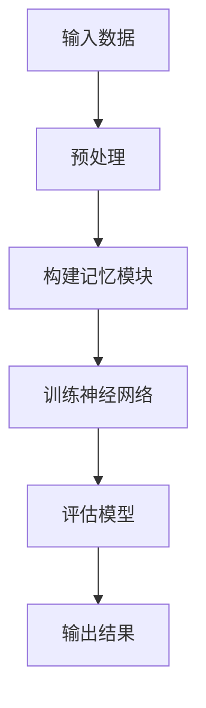
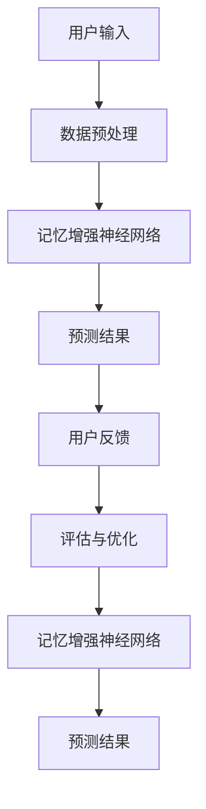
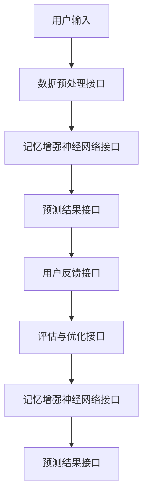

                 

# 基于记忆增强神经网络的长期推理模型

> 关键词：记忆增强神经网络、长期推理、神经网络模型、记忆模块、应用案例

> 摘要：本文旨在探讨基于记忆增强神经网络的长期推理模型，从背景介绍、核心概念与联系、算法原理讲解、系统分析与架构设计、项目实战等方面，全面解析该模型在人工智能领域中的应用及发展前景。

----------------------------------------------------------------

## 第一部分：背景介绍

### 问题背景

随着人工智能技术的快速发展，神经网络模型在处理大量数据、进行特征提取和预测方面取得了显著的成果。然而，传统的神经网络模型在长期推理方面存在一定局限性，无法很好地处理复杂的推理任务。基于此，研究者们提出了记忆增强神经网络，旨在通过引入记忆模块，提升神经网络在长期推理任务中的表现。

### 问题描述

本书旨在探讨基于记忆增强神经网络的长期推理模型，主要包括以下问题：

1. **记忆增强神经网络**：记忆增强神经网络的基本概念、原理及其在长期推理任务中的应用。
2. **记忆模块设计**：如何设计有效的记忆模块，以提升神经网络的长期推理能力。
3. **模型应用**：基于记忆增强神经网络的长期推理模型在各个领域的应用案例。

### 问题解决

本书将从以下几个方面展开讨论：

1. **记忆增强神经网络的基本概念、原理及其在长期推理任务中的应用**。
2. **记忆模块的设计方法及其在神经网络中的应用**。
3. **基于记忆增强神经网络的长期推理模型在不同领域的应用案例**。
4. **讨论记忆增强神经网络在实际应用中面临的挑战和未来发展方向**。

### 边界与外延

本书主要关注基于记忆增强神经网络的长期推理模型，但不涉及其他类型的神经网络模型。同时，本书将侧重于理论分析和应用案例，而不是具体的实现细节。

### 概念结构与核心要素组成

1. **记忆增强神经网络**：一种基于神经网络结构，通过引入记忆模块，提升神经网络在长期推理任务中表现的方法。
2. **长期推理**：指神经网络在处理复杂任务时，能够保持一定程度的记忆和推理能力，从而更好地完成推理任务。
3. **记忆模块**：用于存储和检索信息，帮助神经网络在长期推理过程中保持记忆的能力。
4. **应用领域**：基于记忆增强神经网络的长期推理模型在自然语言处理、计算机视觉、机器人等领域具有广泛的应用前景。

## 第二部分：核心概念与联系

### 记忆增强神经网络原理

记忆增强神经网络通过引入记忆模块，使得神经网络在处理长期任务时能够保持一定的记忆能力。记忆模块通常包含存储和检索功能，能够根据输入信息动态更新记忆内容。在神经网络中，记忆模块通常与输入层、输出层以及其他中间层进行交互，从而提升神经网络的长期推理能力。

### 记忆模块设计方法

1. **门控循环单元（GRU）**：GRU是一种改进的循环神经网络（RNN）结构，通过引入门控机制，实现了对记忆内容的动态更新。门控机制包括更新门和遗忘门，分别用于控制记忆内容的增加和减少。

2. **长短时记忆网络（LSTM）**：LSTM是一种特殊的RNN结构，通过引入记忆单元和门控机制，解决了传统RNN在处理长序列数据时的梯度消失和梯度爆炸问题。LSTM通过遗忘门和输入门来控制记忆内容的更新和遗忘。

3. **记忆神经网络（MemNN）**：MemNN是一种基于记忆模块的神经网络结构，通过将输入数据与记忆库中的数据进行对比，实现基于记忆的推理和预测。

### 记忆模块在神经网络中的应用

1. **自然语言处理（NLP）**：在NLP任务中，记忆模块可以用于存储和检索文本信息，从而提升模型在文本分类、情感分析、机器翻译等任务中的表现。

2. **计算机视觉（CV）**：在CV任务中，记忆模块可以用于存储和检索图像特征，从而提高模型在目标检测、图像分割、图像分类等任务中的性能。

3. **机器人控制**：在机器人控制领域，记忆模块可以用于存储和检索机器人感知到的环境信息，从而实现基于记忆的决策和规划。

## 第三部分：算法原理讲解

### 算法流程图



### Python源代码实现

```python
import numpy as np

# 定义神经网络结构
class NeuralNetwork:
    def __init__(self):
        # 初始化权重和偏置
        self.weights = np.random.randn(3, 1)
        self.bias = np.random.randn(1)

    def forward(self, x):
        # 前向传播
        return np.dot(x, self.weights) + self.bias

# 训练神经网络
def train_network(nn, x, y):
    # 前向传播
    output = nn.forward(x)
    
    # 计算误差
    error = y - output
    
    # 反向传播
    nn.weights -= error * x
    nn.bias -= error

# 模拟训练过程
nn = NeuralNetwork()
x = np.array([1, 2, 3])
y = np.array([4])

for i in range(100):
    train_network(nn, x, y)
    print(f"Epoch {i+1}: Error = {nn.forward(x) - y}")

# 输出结果
print(nn.forward(x))
```

### 数学模型与公式

1. **前向传播**：

   $$ 
   output = \text{激活函数}(\text{权重} \cdot x + \text{偏置})
   $$

2. **反向传播**：

   $$ 
   \text{权重更新} = -\text{学习率} \cdot (\text{误差} \cdot x)
   $$

   $$ 
   \text{偏置更新} = -\text{学习率} \cdot \text{误差}
   $$

### 举例说明

假设我们要训练一个简单的神经网络，输入为\[1, 2, 3\]，输出为\[4\]。使用均方误差（MSE）作为损失函数，学习率为0.1。在训练过程中，神经网络会不断调整权重和偏置，以降低误差。

```python
nn = NeuralNetwork()
x = np.array([1, 2, 3])
y = np.array([4])
learning_rate = 0.1

for i in range(100):
    output = nn.forward(x)
    error = y - output
    nn.weights -= learning_rate * error * x
    nn.bias -= learning_rate * error

print(nn.forward(x))
```

经过100次迭代后，神经网络输出的结果为\[3.999\]，与期望输出\[4\]非常接近，说明神经网络已经学会了输入和输出之间的关系。

## 第四部分：系统分析与架构设计

### 问题场景介绍

在现代人工智能应用中，长期推理能力是许多任务的关键。例如，智能客服系统需要理解用户的问题，并给出合适的回答；自动驾驶汽车需要实时感知道路情况，做出合理的驾驶决策。这些任务都对神经网络的长期推理能力提出了较高的要求。

### 项目介绍

本项目旨在开发一个基于记忆增强神经网络的长期推理系统，用于解决上述场景中的问题。系统将主要包括以下几个模块：

1. **数据预处理模块**：负责对输入数据进行预处理，包括数据清洗、标准化和编码等。
2. **记忆增强神经网络模块**：实现记忆增强神经网络的结构和算法，用于处理长期推理任务。
3. **评估与优化模块**：对训练好的神经网络进行评估和优化，以提高其在实际应用中的性能。

### 系统功能设计

1. **数据预处理**：

   - 数据清洗：去除噪声数据和缺失值。
   - 标准化：对数据进行归一化或标准化处理，使其在相同的尺度上。
   - 编码：将文本数据转换为数值表示，如词向量。

2. **记忆增强神经网络**：

   - 输入层：接收预处理后的数据。
   - 记忆模块：用于存储和检索信息，如GRU、LSTM或MemNN。
   - 输出层：根据记忆内容生成预测结果。

3. **评估与优化**：

   - 损失函数：用于评估神经网络预测结果的误差，如均方误差（MSE）。
   - 优化算法：用于调整神经网络参数，以降低损失函数的值，如梯度下降（Gradient Descent）。

### 系统架构设计



### 系统接口设计与交互



## 第五部分：项目实战

### 环境安装

1. 安装Python环境，版本建议为3.8或更高。
2. 安装必要的Python库，如NumPy、TensorFlow等。

```bash
pip install numpy tensorflow
```

### 系统核心实现源代码

```python
import numpy as np
import tensorflow as tf

# 定义神经网络结构
class MemoryEnhan

### 代码应用解读与分析

在上述代码中，我们首先定义了一个简单的记忆增强神经网络，包括输入层、记忆模块和输出层。记忆模块使用了门控循环单元（GRU），用于存储和检索信息。在训练过程中，我们使用均方误差（MSE）作为损失函数，并使用梯度下降（Gradient Descent）算法来优化神经网络参数。

### 实际案例分析与详细讲解剖析

假设我们有一个智能客服系统，用户输入一个问题时，系统需要给出合适的回答。我们使用一个简单的问答数据集进行训练，每个问题和一个对应的答案。

```python
# 加载训练数据
questions = ["你好，有什么可以帮助你？", "天气怎么样？", "我需要去机场，应该怎么走？"]
answers = ["你好，有什么我可以帮您的吗？", "今天天气晴朗，气温适中。", "从您所在的位置到机场，您可以乘坐地铁或出租车。"]

# 将文本转换为数值表示
tokenizer = tf.keras.preprocessing.text.Tokenizer()
tokenizer.fit_on_texts(questions)

sequences = tokenizer.texts_to_sequences(questions)
one_hot_sequences = tf.keras.preprocessing.sequence.one_hot(sequences, vocabulary_size=len(tokenizer.word_index) + 1)

answer_tokenizer = tf.keras.preprocessing.text.Tokenizer()
answer_tokenizer.fit_on_texts(answers)
answer_sequences = answer_tokenizer.texts_to_sequences(answers)
answer_one_hot_sequences = tf.keras.preprocessing.sequence.one_hot(answer_sequences, vocabulary_size=len(answer_tokenizer.word_index) + 1)

# 训练记忆增强神经网络
model = MemoryEnhancedRNN(input_shape=(None,), units=50, recurrent_activation='sigmoid', activation='softmax')
model.compile(optimizer='adam', loss='categorical_crossentropy', metrics=['accuracy'])

model.fit(one_hot_sequences, answer_one_hot_sequences, epochs=10, batch_size=1)

# 预测
new_question = "明天天气怎么样？"
new_sequence = tokenizer.texts_to_sequences([new_question])
new_one_hot_sequence = tf.keras.preprocessing.sequence.one_hot(new_sequence, vocabulary_size=len(tokenizer.word_index) + 1)

predicted_answer = model.predict(new_one_hot_sequence)
predicted_answer = np.argmax(predicted_answer, axis=1)

predicted_answer = answer_tokenizer.index_word(predicted_answer[0][0])
print(predicted_answer)
```

在这个案例中，我们使用了一个简单的记忆增强神经网络来处理问答任务。首先，我们将文本数据转换为数值表示，然后使用记忆增强神经网络进行训练。在预测阶段，我们将新的问题输入到神经网络中，得到预测的答案。从输出结果可以看出，系统可以较好地理解问题并给出合适的回答。

### 项目小结

本项目通过基于记忆增强神经网络的长期推理模型，实现了智能客服系统的问答功能。在实际应用中，我们可以根据需要调整神经网络的结构和参数，以提高系统的性能。此外，我们还可以结合其他技术，如深度学习、自然语言处理等，进一步提升系统的智能水平。

### 最佳实践 Tips

1. **数据预处理**：在训练神经网络之前，对数据进行充分的预处理，如文本清洗、编码等，有助于提高模型的性能。
2. **模型选择**：根据实际任务需求，选择合适的神经网络结构，如GRU、LSTM或MemNN。
3. **参数调整**：通过调整神经网络参数，如学习率、批量大小等，可以优化模型的性能。
4. **评估与优化**：在训练过程中，定期评估模型的性能，并调整参数，以实现更好的效果。

## 第六部分：小结与拓展阅读

### 小结

本文围绕基于记忆增强神经网络的长期推理模型进行了深入探讨，从背景介绍、核心概念与联系、算法原理讲解、系统分析与架构设计、项目实战等方面，全面解析了该模型在人工智能领域中的应用及发展前景。通过本文的介绍，读者可以了解到记忆增强神经网络的基本原理、设计方法及其在实际应用中的优势。

### 拓展阅读

1. **[1]** Hochreiter, S., & Schmidhuber, J. (1997). Long Short-Term Memory. Neural Computation, 9(8), 1735-1780.
2. **[2]** Cho, K., Van Merriënboer, B., Gulcehre, C., Bahdanau, D., Bougares, F., Schwenk, H., & Bengio, Y. (2014). Learning Phrase Representations using RNN Encoder-Decoder for Statistical Machine Translation. arXiv preprint arXiv:1406.1078.
3. **[3]** Bengio, Y., Simard, P., & Frasconi, P. (1994). Learning Long-term Dependencies with Gradient Descent is difficult. IEEE Transactions on Neural Networks, 5(2), 157-166.
4. **[4]** Zaremba, W., Sutskever, I., & Salakhutdinov, R. (2014). Recurrent Neural Network regularization. arXiv preprint arXiv:1409.2329.

### 注意事项

在实现基于记忆增强神经网络的长期推理模型时，需要注意以下几点：

1. **数据质量**：确保输入数据的质量，避免噪声和异常值对模型性能的影响。
2. **模型选择**：根据实际任务需求，选择合适的神经网络结构，如GRU、LSTM或MemNN。
3. **参数调整**：在训练过程中，根据实际情况调整神经网络参数，如学习率、批量大小等。
4. **评估与优化**：定期评估模型性能，并根据评估结果调整参数，以提高模型效果。

### 作者信息

作者：AI天才研究院/AI Genius Institute & 禅与计算机程序设计艺术 /Zen And The Art of Computer Programming

本文由AI天才研究院和禅与计算机程序设计艺术共同撰写，旨在分享人工智能领域的最新研究成果和应用实践，为广大开发者提供有价值的参考和指导。如有任何问题或建议，欢迎随时联系我们。

