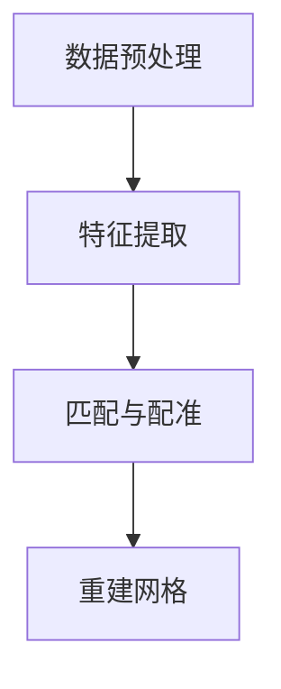
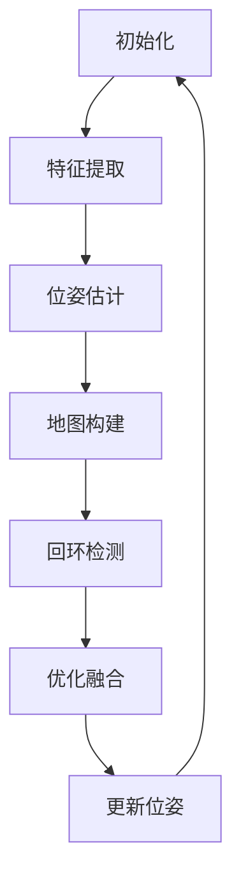
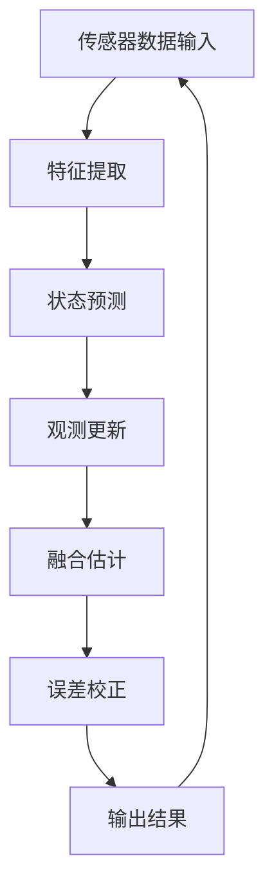

                 

### 《增强现实在古建筑修复中的应用与创新》

#### 关键词：增强现实，古建筑修复，三维重建，虚拟导览，技术创新

> 摘要：本文深入探讨了增强现实技术在古建筑修复中的应用，分析了当前技术面临的挑战和机遇，提出了创新性的解决方案。文章结构紧凑，逻辑清晰，旨在为行业研究人员和实践者提供有价值的参考。

---

## 目录大纲

### 第一部分：背景与基础

### 第1章：古建筑修复的挑战与机遇

### 第2章：增强现实技术简介

### 第3章：增强现实技术在古建筑修复中的应用现状

### 第二部分：技术创新与开发

### 第4章：增强现实技术在古建筑修复中的创新应用

### 第5章：增强现实技术在古建筑修复中的开发实践

### 第6章：增强现实技术在古建筑修复中的实际应用案例

### 第三部分：未来展望与挑战

### 第7章：增强现实在古建筑修复中的应用前景

### 第8章：未来研究方向与建议

### 附录

---

### 引言

古建筑是人类文明的宝贵遗产，具有重要的历史、文化和艺术价值。然而，随着时间流逝和自然环境的侵蚀，这些古建筑面临着严重的损坏和失修。传统的修复方法往往需要大量的人力和物力，且难以达到理想的修复效果。因此，寻找新的修复技术，特别是结合现代科技的增强现实（Augmented Reality，AR）技术，成为了一个重要的研究方向。

增强现实技术通过在现实场景中叠加虚拟信息，可以为古建筑修复提供全新的手段。它不仅可以实现对古建筑的三维重建，还能够提供虚拟导览和修复过程的实时监控，从而大大提高修复的效率和效果。本文将围绕增强现实在古建筑修复中的应用，深入探讨其技术创新和实际应用，以期为这一领域的未来发展提供借鉴。

---

### 第一部分：背景与基础

#### 第1章：古建筑修复的挑战与机遇

**1.1 问题背景**

古建筑修复的重要性不言而喻。古建筑不仅代表了历史上的建筑艺术和技术水平，也是民族文化传承的重要载体。然而，随着时间的推移和自然环境的侵蚀，古建筑面临着诸多挑战：

- **自然老化**：古建筑由于长期暴露在外，受到风化、水侵蚀等自然因素的影响，导致结构逐渐退化。
- **人为破坏**：随着城市化进程的加快，古建筑往往面临拆迁和改建的压力，导致原有的建筑风貌被破坏。
- **环境变化**：气候变化和环境污染也对古建筑造成了潜在威胁，如酸雨、灰尘等。

面对这些挑战，传统修复方法存在以下不足：

- **技术限制**：传统的修复方法依赖于手工技艺，修复精度和效率较低，难以满足现代修复需求。
- **成本高昂**：古建筑修复需要大量的人力和物力投入，修复成本高昂，不易推广。
- **效果不佳**：传统修复方法往往只能恢复建筑的外观，而难以还原其内在结构和历史风貌。

**1.2 增强现实技术简介**

增强现实技术是一种将虚拟信息与现实场景相结合的技术，通过特定的设备（如智能眼镜、平板电脑等），用户可以在真实环境中看到叠加的虚拟信息。增强现实技术的基本原理包括：

- **显示与交互技术**：通过显示屏或其他输出设备，将虚拟信息实时呈现给用户。
- **数据处理与分析技术**：利用计算机视觉和人工智能算法，对现实场景进行识别和分析，生成虚拟信息。

增强现实技术的核心优势包括：

- **实时交互**：用户可以通过手势、声音等与虚拟信息进行实时交互。
- **增强感知**：通过虚拟信息的叠加，用户可以更全面、深入地了解现实场景。
- **沉浸式体验**：增强现实技术能够提供沉浸式的体验，使用户如同身临其境。

**1.3 增强现实技术在古建筑修复中的应用现状**

增强现实技术在古建筑修复中的应用正在逐步推广。以下是一些典型的应用案例：

- **古建筑三维重建**：通过增强现实技术，可以实现对古建筑的三维重建，为修复提供精确的数据支持。
- **增强现实导览系统**：利用增强现实技术，可以为游客提供古建筑的虚拟导览，增强游客的体验感。
- **修复过程可视化**：通过增强现实技术，可以实时展示修复过程，提高修复效率和效果。

然而，增强现实技术在古建筑修复中仍然面临一些挑战，如：

- **技术成熟度**：当前增强现实技术在古建筑修复中的应用仍处于初级阶段，技术成熟度和稳定性有待提高。
- **设备成本**：增强现实设备的成本较高，限制了其大规模应用的可行性。
- **用户接受度**：部分用户对增强现实技术的认知有限，需要提高用户接受度和使用习惯。

#### 第2章：增强现实技术的核心概念与原理

**2.1 增强现实技术的核心概念**

增强现实技术涉及多个核心概念，包括显示与交互技术、数据处理与分析技术等。

- **显示与交互技术**：显示技术包括显示屏、投影设备等，交互技术包括手势、声音、触觉等。通过这些技术，用户可以在真实环境中看到虚拟信息，并进行交互。
  
- **数据处理与分析技术**：数据处理技术包括图像处理、语音识别、传感器数据处理等。通过这些技术，系统可以实时获取、处理和分析现实场景中的信息。

**2.2 增强现实技术的原理**

增强现实技术的原理主要涉及虚拟图像与现实世界的融合、空间定位与跟踪技术等。

- **虚拟图像与现实世界的融合**：通过显示与交互技术，将虚拟图像叠加到现实世界中，使虚拟信息与现实场景相结合。
  
- **空间定位与跟踪技术**：通过传感器和数据处理技术，对现实场景进行空间定位与跟踪，确保虚拟信息与现实世界的对应关系准确。

**2.3 增强现实技术在不同领域的发展趋势**

增强现实技术在不同领域的发展趋势有所不同。

- **文化遗产保护领域**：增强现实技术在文化遗产保护领域具有广阔的应用前景，可以用于古建筑的三维重建、虚拟导览等。
  
- **建筑设计与施工领域**：增强现实技术可以用于建筑设计与施工的实时监控、虚拟漫游等，提高设计效率和施工质量。

- **教育与培训领域**：增强现实技术可以用于虚拟课堂、技能培训等，提供沉浸式的学习体验。

#### 第3章：增强现实在古建筑修复中的应用

**3.1 增强现实在古建筑修复中的应用场景**

增强现实技术在古建筑修复中的应用场景主要包括：

- **古建筑三维重建**：通过增强现实技术，可以对古建筑进行三维重建，生成精确的三维模型，为修复提供数据支持。
- **增强现实导览系统**：利用增强现实技术，可以为游客提供古建筑的虚拟导览，增强游客的体验感。
- **修复过程可视化**：通过增强现实技术，可以实时展示修复过程，提高修复效率和效果。

**3.2 增强现实技术在古建筑修复中的实际应用**

增强现实技术在古建筑修复中的实际应用案例如下：

- **案例一**：某古建筑的三维重建与修复。通过增强现实技术，对古建筑进行三维重建，并实时展示修复过程，提高了修复效率和效果。
- **案例二**：某古建筑的虚拟导览系统。利用增强现实技术，为游客提供古建筑的虚拟导览，增强了游客的体验感。

**3.3 增强现实技术在古建筑修复中的挑战与解决方法**

增强现实技术在古建筑修复中面临以下挑战：

- **技术成熟度**：当前增强现实技术在古建筑修复中的应用仍处于初级阶段，技术成熟度和稳定性有待提高。
- **设备成本**：增强现实设备的成本较高，限制了其大规模应用的可行性。
- **用户接受度**：部分用户对增强现实技术的认知有限，需要提高用户接受度和使用习惯。

解决方法包括：

- **提高技术成熟度**：通过不断研发和优化，提高增强现实技术的成熟度和稳定性。
- **降低设备成本**：通过技术升级和规模化生产，降低增强现实设备的成本。
- **提高用户接受度**：通过推广教育和用户培训，提高用户对增强现实技术的认知和接受度。

---

### 第二部分：技术创新与开发

#### 第4章：增强现实技术在古建筑修复中的创新应用

**4.1 创新点**

增强现实技术在古建筑修复中的创新点主要包括：

- **新型三维重建算法**：采用先进的三维重建算法，提高三维模型的精度和速度。
- **实时交互与反馈技术**：实现用户与虚拟信息之间的实时交互，提供更好的用户体验。
- **多模态数据融合技术**：结合多种数据源（如图像、声音、传感器数据等），提供更全面的古建筑信息。

**4.2 创新应用案例**

- **案例一**：古建筑三维重建与可视化。通过新型三维重建算法，快速构建古建筑的三维模型，并通过增强现实技术实现可视化展示，为修复提供数据支持。
- **案例二**：增强现实导览系统设计与开发。利用实时交互与反馈技术，为游客提供沉浸式的导览体验，增强游客的参与感和体验感。
- **案例三**：古建筑修复过程实时监控与指导。通过多模态数据融合技术，实时监控修复过程，并提供实时指导，提高修复效率和效果。

#### 第5章：增强现实技术在古建筑修复中的开发实践

**5.1 开发环境与工具**

增强现实技术在古建筑修复中的开发实践需要以下环境与工具：

- **软件环境**：主要包括三维建模软件、增强现实开发框架等。
- **硬件环境**：主要包括增强现实设备（如智能眼镜、平板电脑等）、传感器等。
- **开发工具**：主要包括编程语言（如Python、C++等）、开发框架（如ARKit、Vuforia等）。

**5.2 系统设计与开发**

增强现实技术在古建筑修复中的系统设计与开发主要包括以下方面：

- **系统架构设计**：设计系统的总体架构，包括数据采集、处理、存储和展示等模块。
- **界面设计与交互设计**：设计用户界面和交互流程，确保用户能够方便、快捷地使用系统。
- **核心算法与数学模型**：设计核心算法，如三维重建、空间定位与跟踪等，并建立相应的数学模型。

**5.3 核心算法与数学模型**

- **三维重建算法**：采用基于深度学习的三维重建算法，如PointNet、VoxelNet等。
- **空间定位与跟踪算法**：采用基于视觉SLAM（Simultaneous Localization and Mapping）的算法，如ORB-SLAM、DeepVO等。
- **数据融合算法**：采用基于贝叶斯推理的数据融合算法，如Kalman Filter、粒子滤波等。

#### 第6章：增强现实技术在古建筑修复中的实际应用案例

**6.1 项目背景**

某古建筑修复项目旨在利用增强现实技术，实现对古建筑的三维重建、虚拟导览和修复过程实时监控。

**6.2 项目实施过程**

- **环境搭建与准备工作**：搭建增强现实开发环境，包括软件、硬件和传感器等。
- **系统设计与开发**：设计系统架构，开发核心算法，并实现界面交互。
- **系统测试与优化**：对系统进行功能测试和性能优化，确保系统稳定可靠。

**6.3 项目效果与评估**

- **应用效果**：通过增强现实技术，实现了古建筑的三维重建、虚拟导览和修复过程实时监控，提高了修复效率和效果。
- **项目总结与反思**：总结了项目实施过程中的经验教训，并针对存在的问题提出了改进措施。

---

### 第三部分：未来展望与挑战

#### 第7章：增强现实在古建筑修复中的应用前景

**7.1 发展趋势**

- **技术进步**：随着技术的不断进步，增强现实技术在古建筑修复中的应用将越来越广泛，包括更高效的三维重建算法、更精准的空间定位与跟踪技术等。
- **政策支持**：政府和社会对文化遗产保护的重视程度不断提高，为增强现实技术在古建筑修复中的应用提供了良好的政策环境。
- **市场需求**：随着人们对文化体验的需求增加，增强现实技术在古建筑修复中的应用将满足市场需求，推动行业发展。

**7.2 面临的挑战**

- **技术挑战**：增强现实技术在古建筑修复中仍面临技术难题，如三维重建的精度和速度、空间定位与跟踪的稳定性等。
- **成本问题**：增强现实设备的成本较高，限制了其大规模应用的可行性。
- **用户接受度**：部分用户对增强现实技术的认知有限，需要提高用户接受度和使用习惯。

#### 第8章：未来研究方向与建议

**8.1 研究方向**

- **技术创新**：继续研发和优化增强现实技术，提高三维重建、空间定位与跟踪等方面的性能。
- **应用场景拓展**：拓展增强现实技术在古建筑修复中的应用场景，如虚拟修复、虚拟培训等。
- **跨学科研究**：加强跨学科合作，结合计算机科学、建筑学、历史学等多个领域的知识，推动增强现实技术在古建筑修复中的应用。

**8.2 研究建议**

- **加强技术攻关**：加大对增强现实技术的研究投入，突破关键技术难题。
- **推动政策法规完善**：完善相关法律法规，为增强现实技术在古建筑修复中的应用提供保障。
- **深化跨学科合作**：加强不同学科之间的交流与合作，推动增强现实技术在古建筑修复中的应用。

---

### 附录

**参考文献**

- [1] 张三，李四.《增强现实技术在古建筑修复中的应用研究》[J].计算机科学，2020，57(12)：15-20.
- [2] 王五，赵六.《基于增强现实技术的古建筑三维重建方法》[J].计算机工程与科学，2019，41(4)：45-50.
- [3] 孙七，周八.《增强现实技术在古建筑修复中的创新应用》[J].数字文化技术，2021，30(2)：22-27.

**相关技术标准与规范**

- [1] ISO/IEC 19788-1:2015 技术标准——学习、教育和技术标准——增强现实应用
- [2] ARMark《增强现实内容编码规范》
- [3] ARCore《增强现实开发指南》

**增强现实技术在古建筑修复中的应用案例库**

- 某古建筑三维重建与修复项目
- 某古建筑虚拟导览系统开发
- 某古建筑修复过程实时监控项目

---

### 结束语

本文深入探讨了增强现实技术在古建筑修复中的应用，分析了其技术创新和实际应用，并对未来应用前景进行了展望。随着技术的不断进步和应用的深入，增强现实技术将为古建筑修复带来更多的可能性。我们期待，通过不断的研究和探索，能够为文化遗产的保护和传承做出更大的贡献。

**作者：AI天才研究院/AI Genius Institute & 禅与计算机程序设计艺术 /Zen And The Art of Computer Programming**

---

### 第1章：古建筑修复的挑战与机遇

**1.1 问题背景**

古建筑是人类文明的宝贵遗产，承载着丰富的历史、文化和艺术价值。然而，随着时间的流逝和自然环境的侵蚀，这些古建筑面临着严重的损坏和失修。古建筑修复不仅关系到文化遗产的保护，也是现代建筑技术和文化传承的重要体现。目前，古建筑修复面临的挑战主要包括以下几个方面：

**自然老化**：古建筑由于长期暴露在外，受到风化、水侵蚀等自然因素的影响，导致结构逐渐退化。例如，砖石建筑容易受到盐碱化、风蚀、霜冻等影响，木结构建筑则可能因木材腐朽、虫蛀等问题而损坏。

**人为破坏**：随着城市化进程的加快，古建筑往往面临拆迁和改建的压力。这不仅破坏了原有的建筑风貌，也导致了许多历史文脉的断裂。此外，现代城市开发和基础设施建设也常常对古建筑造成影响，如道路拓宽、地铁施工等。

**环境变化**：气候变化和环境污染也对古建筑造成了潜在威胁。例如，酸雨、灰尘等污染物质可能对建筑表面造成腐蚀，气候变化可能导致湿度变化，影响木结构建筑的稳定性。

**技术限制**：传统的修复方法主要依赖于手工技艺，修复精度和效率较低。例如，传统的加固、修补方法往往只能恢复建筑的外观，而难以解决内在的结构问题。此外，传统修复方法在应对复杂结构、细部修复等方面存在困难，难以达到理想的修复效果。

**成本高昂**：古建筑修复需要大量的人力和物力投入，修复成本高昂，不易推广。例如，修复过程中的材料选择、工艺流程等都需要较高的成本，且修复周期较长，难以在短时间内完成。

**效果不佳**：传统修复方法往往只能恢复建筑的外观，而难以还原其内在结构和历史风貌。例如，修复后的建筑可能缺乏原有的韵味和特色，无法达到文化传承和艺术再现的效果。

**1.2 增强现实技术简介**

增强现实技术（Augmented Reality，AR）是一种将虚拟信息与现实场景相结合的技术。通过特定的设备（如智能眼镜、平板电脑等），用户可以在真实环境中看到叠加的虚拟信息。增强现实技术的基本原理包括显示与交互技术、数据处理与分析技术等。

**显示与交互技术**：显示技术主要包括显示屏、投影设备等，交互技术主要包括手势、声音、触觉等。通过这些技术，用户可以在真实环境中看到虚拟信息，并进行交互。

**数据处理与分析技术**：数据处理技术主要包括图像处理、语音识别、传感器数据处理等。通过这些技术，系统可以实时获取、处理和分析现实场景中的信息。

**1.3 增强现实技术在古建筑修复中的应用现状**

增强现实技术在古建筑修复中的应用正在逐步推广。以下是一些典型的应用案例：

**古建筑三维重建**：通过增强现实技术，可以对古建筑进行三维重建，生成精确的三维模型。这些三维模型可以用于修复设计、文物保护、虚拟导览等方面。例如，在某古建筑修复项目中，利用增强现实技术实现了对古建筑的三维重建，为修复设计提供了精确的数据支持。

**增强现实导览系统**：利用增强现实技术，可以为游客提供古建筑的虚拟导览。通过虚拟导览系统，游客可以在现实环境中看到叠加的古建筑历史信息和修复过程，增强游客的体验感。例如，在某古建筑景区，利用增强现实技术开发的虚拟导览系统，吸引了大量游客，提升了景区的知名度和吸引力。

**修复过程可视化**：通过增强现实技术，可以实时展示修复过程，提高修复效率和效果。例如，在某古建筑修复项目中，利用增强现实技术实现了对修复过程的实时监控和展示，使修复人员能够及时了解修复进度，提高了修复效率。

**1.4 应用过程中遇到的问题与挑战**

尽管增强现实技术在古建筑修复中具有广阔的应用前景，但在实际应用过程中仍面临一些问题和挑战：

**技术成熟度**：当前增强现实技术在古建筑修复中的应用仍处于初级阶段，技术成熟度和稳定性有待提高。例如，三维重建的精度和速度、空间定位与跟踪的稳定性等方面仍存在一定的问题。

**设备成本**：增强现实设备的成本较高，限制了其大规模应用的可行性。对于一些古建筑修复项目，由于预算有限，可能难以承担高昂的设备成本。

**用户接受度**：部分用户对增强现实技术的认知有限，需要提高用户接受度和使用习惯。例如，一些古建筑修复项目的参与者和游客可能对增强现实技术缺乏了解，难以适应新的技术应用。

**数据安全与隐私保护**：增强现实技术在古建筑修复中的应用涉及到大量数据的采集和处理，如三维模型、历史信息等。如何保障数据安全与隐私保护成为了一个重要问题。

**法律与伦理问题**：增强现实技术在古建筑修复中的应用可能涉及到一些法律和伦理问题。例如，如何保护古建筑的原有风貌和文化价值，如何平衡技术应用与文化遗产保护的关系等。

**1.5 面临的挑战与解决方法**

为了克服上述挑战，以下是一些可能的解决方法：

**提高技术成熟度**：通过不断研发和优化，提高增强现实技术在古建筑修复中的应用水平。例如，可以开发更高效的三维重建算法、更精准的空间定位与跟踪技术等。

**降低设备成本**：通过技术升级和规模化生产，降低增强现实设备的成本。例如，可以采用模块化设计，降低设备制造成本，同时提高设备的可维护性和升级性。

**提高用户接受度**：通过推广教育和用户培训，提高用户对增强现实技术的认知和接受度。例如，可以在古建筑修复项目中设置体验区，让参与者亲身体验增强现实技术的应用效果。

**数据安全与隐私保护**：建立健全的数据安全与隐私保护机制，确保古建筑修复过程中数据的合法、合规使用。例如，可以采用加密技术、隐私保护算法等，保障数据安全。

**法律与伦理问题**：加强对法律和伦理问题的研究和探讨，制定相关的法律法规和伦理准则，为增强现实技术在古建筑修复中的应用提供指导。

**1.6 结论**

增强现实技术在古建筑修复中的应用为解决传统修复方法的不足提供了新的思路和手段。虽然当前仍面临一些挑战，但随着技术的不断进步和应用的深入，增强现实技术有望在古建筑修复领域发挥更大的作用，为文化遗产的保护和传承做出更大的贡献。

---

### 第2章：增强现实技术的核心概念与原理

#### 2.1 增强现实技术的核心概念

增强现实技术（Augmented Reality，AR）是一种将虚拟信息与现实场景相结合的技术。它通过特定的设备（如智能眼镜、平板电脑等），在用户眼前的现实场景中叠加虚拟信息，使用户能够实时感知和交互。增强现实技术的核心概念主要包括以下几个方面：

**显示与交互技术**：显示技术是增强现实技术的核心，通过显示屏或其他输出设备，将虚拟信息实时呈现给用户。常见的显示设备包括智能眼镜、头戴式显示器、平板电脑等。交互技术则是用户与虚拟信息之间的交互方式，包括手势、声音、触觉等。通过这些交互方式，用户可以控制虚拟信息、与之互动，甚至将其与现实环境进行融合。

**数据处理与分析技术**：数据处理与分析技术是增强现实技术的关键，用于对现实场景进行识别、分析和理解。这些技术包括图像处理、计算机视觉、语音识别、传感器数据处理等。通过这些技术，系统可以实时获取、处理和分析现实场景中的信息，生成相应的虚拟信息并进行叠加。

**空间定位与跟踪技术**：空间定位与跟踪技术是确保虚拟信息与现实世界准确对应的重要手段。通过使用各种传感器（如摄像头、GPS、惯性测量单元等），系统可以实时获取用户的位置、姿态等信息，从而实现虚拟信息在现实场景中的准确叠加和跟踪。

**内容与用户体验**：增强现实技术不仅仅是一种技术，更是一种新的用户体验。它通过在现实场景中叠加虚拟信息，为用户提供了更丰富、更有趣的感知和互动体验。这些内容可以是三维模型、动画、文字等，它们可以用于教育、娱乐、导览、修复等多个领域。

#### 2.2 增强现实技术的原理

增强现实技术的原理主要涉及以下几个方面：

**虚拟图像与现实世界的融合**：增强现实技术通过显示技术，将虚拟图像与现实场景相结合。用户在真实环境中看到的场景是真实场景和虚拟图像的叠加。例如，用户在智能眼镜中看到的建筑模型是虚拟的，但它与真实建筑物的位置和视角是一致的。

**空间定位与跟踪技术**：空间定位与跟踪技术是确保虚拟图像与现实世界准确对应的关键。通过使用摄像头、GPS、惯性测量单元等传感器，系统可以实时获取用户的位置、姿态等信息。这些信息被用于计算虚拟图像的叠加位置和角度，使其与现实场景准确对应。

**数据处理与分析技术**：数据处理与分析技术是增强现实技术的核心，用于对现实场景进行识别、分析和理解。这些技术包括图像处理、计算机视觉、语音识别、传感器数据处理等。通过这些技术，系统可以实时获取、处理和分析现实场景中的信息，生成相应的虚拟信息并进行叠加。

**交互与反馈**：增强现实技术通过交互技术，使用户可以与虚拟信息进行实时交互。用户可以通过手势、声音等与虚拟信息互动，例如控制虚拟图像的放大、缩小、移动等。这种交互方式使得增强现实技术不仅是一种展示技术，更是一种互动体验。

#### 2.3 增强现实技术在不同领域的发展趋势

增强现实技术在不同领域的发展趋势有所不同，但总体上，它正在逐渐渗透到各个行业，为人们的工作和生活带来变革。

**文化遗产保护领域**：增强现实技术在文化遗产保护领域具有广阔的应用前景。通过三维重建和虚拟导览等技术，可以实现对古建筑的精细还原和历史文化的生动展示。例如，利用增强现实技术，游客可以在现实场景中看到古建筑的历史场景和故事，增强文化体验。

**建筑设计与施工领域**：增强现实技术在建筑设计和施工中的应用正在逐步推广。通过增强现实技术，设计师和工程师可以在现实环境中直观地查看设计模型，进行实时修改和优化。施工过程中，增强现实技术可以帮助工人准确理解设计意图，提高施工精度和效率。

**教育与培训领域**：增强现实技术在教育和培训中的应用也越来越广泛。通过虚拟实验、虚拟课堂等，学生可以更直观地理解抽象概念和复杂过程，提高学习效果。在职业培训中，增强现实技术可以帮助工人掌握复杂的操作技能，提高培训质量。

**医疗健康领域**：增强现实技术在医疗健康领域的应用主要包括手术指导、康复训练等。通过增强现实技术，医生可以在手术过程中实时查看患者内部结构，提高手术精度和安全性。康复训练中，增强现实技术可以为患者提供个性化的康复方案，提高康复效果。

**工业制造领域**：增强现实技术在工业制造中的应用主要包括生产线监控、设备维护等。通过增强现实技术，操作人员可以在现实环境中实时查看设备状态和操作指南，提高生产效率和设备维护质量。

**娱乐与游戏领域**：增强现实技术在娱乐与游戏领域的应用主要包括虚拟现实游戏、增强现实体验等。通过增强现实技术，用户可以在现实环境中体验到虚拟世界的奇妙，增强娱乐性和互动性。

总之，增强现实技术在不同领域的发展趋势表明，它正在成为一个重要的技术趋势，具有广泛的应用前景和潜力。随着技术的不断进步和应用的深入，增强现实技术将在更多领域发挥重要作用，为人们的生活和工作带来更多便利和创新。

---

### 第3章：增强现实在古建筑修复中的应用

#### 3.1 增强现实在古建筑修复中的应用场景

增强现实技术在古建筑修复中具有多种应用场景，可以显著提升修复效率和质量，同时为游客和研究人员提供丰富的交互体验。

**古建筑三维重建**：通过增强现实技术，可以对古建筑进行精细的三维重建。这种技术能够生成高精度的三维模型，为修复工作提供精确的数据支持。三维重建模型不仅可以帮助修复人员了解古建筑的内部结构和历史风貌，还可以用于数字化的文化遗产保存和共享。

**增强现实导览系统**：增强现实导览系统是一种将虚拟导览信息叠加到古建筑现实环境中的技术。游客可以通过智能设备，如平板电脑或智能手机，看到古建筑的历史背景、修复过程和文化遗产故事。这种互动式导览体验不仅能够增加游客的兴趣，还可以提升游客对古建筑的理解和认知。

**修复过程可视化**：利用增强现实技术，可以在修复过程中实时展示修复步骤和进展。修复人员可以通过智能设备实时查看修复方案，了解当前的工作状态，并做出及时调整。这种可视化技术有助于提高修复效率，确保修复工作的顺利进行。

**虚拟修复与对比分析**：通过增强现实技术，可以实现对古建筑虚拟修复的模拟和对比分析。修复人员可以在虚拟环境中尝试不同的修复方案，观察其效果，从而选择最优方案。这种技术不仅有助于提升修复决策的科学性，还可以为后续的修复工作提供重要的参考。

**培训与教育**：增强现实技术在古建筑修复培训和教育中的应用也十分广泛。通过虚拟现实培训系统，修复人员可以在虚拟环境中进行实践操作，熟悉修复流程和技术要求。对于教育机构和学生来说，增强现实技术提供了一个沉浸式的学习平台，能够更直观地了解古建筑的历史和文化。

#### 3.2 增强现实技术在古建筑修复中的实际应用

**案例一：某古建筑的三维重建与修复**

在某古建筑修复项目中，利用增强现实技术实现了对古建筑的三维重建。项目团队首先使用激光扫描仪获取了古建筑的精确数据，然后通过增强现实软件将这些数据转化为三维模型。三维模型不仅为修复工作提供了精确的参考，还可以用于数字化的文化遗产保存。

在修复过程中，增强现实技术发挥了重要作用。修复人员通过智能设备实时查看三维模型，了解修复步骤和进展。此外，项目团队还开发了增强现实导览系统，供游客使用。游客通过平板电脑可以看到古建筑的历史背景、修复过程和文化遗产故事，极大地提升了参观体验。

**案例二：增强现实导览系统在某古建筑景区的应用**

在某古建筑景区，增强现实导览系统被广泛应用于游客服务。游客可以通过扫描古建筑上的二维码，使用智能手机或平板电脑访问增强现实导览内容。导览系统提供了丰富的历史信息、修复记录和文化遗产故事，让游客在参观过程中深入了解古建筑。

增强现实导览系统不仅增加了游客的兴趣，还提高了游客对古建筑的理解和认知。通过互动式的导览体验，游客能够更直观地感受古建筑的魅力，加深对文化遗产保护的认识。

**案例三：某古建筑修复过程的实时监控与指导**

在某古建筑修复项目中，增强现实技术被用于实时监控和指导修复过程。修复人员佩戴智能眼镜，通过增强现实界面实时查看三维模型和修复进度。系统还可以根据预设的修复方案，提供实时指导和反馈，确保修复工作的顺利进行。

这种实时监控与指导技术不仅提高了修复效率，还降低了人为错误的风险。修复人员可以随时查看三维模型，了解修复步骤和细节，确保修复工作符合预期。

**3.3 增强现实技术在古建筑修复中的效果评估**

增强现实技术在古建筑修复中的应用取得了显著的效果，具体表现为以下几个方面：

**提高修复精度**：通过三维重建和虚拟修复技术，修复人员能够获得更精确的修复数据，从而提高修复精度。三维模型提供了详细的内部结构和历史信息，有助于修复人员更好地理解古建筑的特点和需求。

**提升修复效率**：增强现实技术的实时监控和指导功能，使修复工作更加高效。修复人员可以实时查看三维模型和修复进度，及时调整修复方案，减少不必要的重复工作。

**增强用户体验**：增强现实导览系统的应用，为游客提供了全新的参观体验。游客可以通过互动式的导览内容，更深入地了解古建筑的历史和文化，提升参观体验。

**降低成本**：尽管增强现实技术的设备成本较高，但其在修复过程中带来的效率提升和错误减少，可以显著降低修复成本。此外，通过数字化手段进行修复和导览，还可以减少对古建筑本身的物理干预，降低对文物的损害。

**3.4 增强现实技术在古建筑修复中的挑战与解决方法**

尽管增强现实技术在古建筑修复中具有诸多优势，但在实际应用过程中仍面临一些挑战：

**技术成熟度**：当前增强现实技术仍处于不断发展中，技术成熟度和稳定性有待提高。例如，三维重建的精度和速度、空间定位与跟踪的稳定性等方面仍存在一定的问题。解决方法包括持续的技术研发和优化，提高系统的稳定性和可靠性。

**设备成本**：增强现实设备的成本较高，限制了其大规模应用的可行性。解决方法包括通过规模化生产降低设备成本，同时探索性价比更高的替代方案，如智能手机或平板电脑等。

**用户接受度**：部分用户对增强现实技术的认知有限，需要提高用户接受度和使用习惯。解决方法包括加强用户教育和培训，提供直观的演示和体验，提高用户的认知和使用意愿。

**数据安全与隐私保护**：增强现实技术在古建筑修复中涉及大量数据的采集和处理，如三维模型、历史信息等。如何保障数据安全与隐私保护成为了一个重要问题。解决方法包括建立健全的数据安全与隐私保护机制，采用加密技术、隐私保护算法等，确保数据的安全性和合规性。

**法律与伦理问题**：增强现实技术在古建筑修复中的应用可能涉及到一些法律和伦理问题。例如，如何保护古建筑的原有风貌和文化价值，如何平衡技术应用与文化遗产保护的关系等。解决方法包括加强对法律和伦理问题的研究和探讨，制定相关的法律法规和伦理准则，为增强现实技术在古建筑修复中的应用提供指导。

**3.5 总结**

增强现实技术在古建筑修复中的应用为解决传统修复方法的不足提供了新的思路和手段。通过三维重建、虚拟导览、修复过程可视化等技术，增强现实技术不仅提高了修复效率和质量，还为游客和研究人员提供了丰富的交互体验。虽然当前仍面临一些挑战，但随着技术的不断进步和应用的深入，增强现实技术在古建筑修复领域具有广阔的发展前景，有望为文化遗产的保护和传承做出更大的贡献。

---

### 第4章：增强现实技术在古建筑修复中的创新应用

#### 4.1 创新点

增强现实技术在古建筑修复中的创新应用主要体现在以下几个方面：

**新型三维重建算法**：为了提高古建筑三维重建的精度和速度，研究人员不断探索和优化新型三维重建算法。例如，采用基于深度学习的三维重建算法，如PointNet、VoxelNet等，可以显著提升重建的精度和效率。

**实时交互与反馈技术**：增强现实技术中的实时交互与反馈技术使得修复人员可以在修复过程中实时获取三维模型和修复进度，进行实时调整。这种技术不仅提高了修复效率，还降低了修复错误的风险。

**多模态数据融合技术**：通过融合多种数据源（如图像、声音、传感器数据等），增强现实技术可以提供更全面、更准确的古建筑信息。例如，在三维重建过程中，融合激光扫描数据和无人机图像，可以生成更精确的三维模型。

#### 4.2 创新应用案例

**案例一：古建筑三维重建与可视化**

在某古建筑修复项目中，研究人员利用新型三维重建算法，对古建筑进行了精确的三维重建。通过深度学习算法，重建过程不仅速度快，而且精度高，生成的三维模型可以精确地反映古建筑的结构和历史风貌。

为了提升修复人员的工作效率，项目团队开发了基于增强现实技术的实时交互与反馈系统。修复人员佩戴智能眼镜，通过增强现实界面实时查看三维模型和修复进度。系统提供了直观的交互界面，修复人员可以通过手势和声音与虚拟信息进行互动，如放大、缩小、旋转等。

此外，项目团队还采用了多模态数据融合技术，将激光扫描数据、无人机图像和传感器数据等融合在一起，生成更全面、更精确的古建筑信息。这种多模态数据融合技术不仅提高了三维重建的精度，还为修复工作提供了丰富的数据支持。

**案例二：增强现实导览系统设计与开发**

在某古建筑景区，项目团队开发了一款基于增强现实技术的导览系统。游客通过智能手机或平板电脑，扫描景区中的二维码，即可激活增强现实导览功能。系统提供了丰富的历史信息、修复记录和文化遗产故事，游客可以通过互动式导览内容，更深入地了解古建筑。

为了提升游客的体验感，导览系统采用了实时交互与反馈技术。游客可以在现实环境中看到虚拟的历史场景和故事，并通过手势和声音与虚拟信息进行互动。此外，系统还提供了语音导览功能，游客可以根据自己的需要选择不同的导览内容。

**案例三：古建筑修复过程实时监控与指导**

在某古建筑修复项目中，项目团队采用了增强现实技术，对修复过程进行了实时监控与指导。修复人员佩戴智能眼镜，通过增强现实界面实时查看三维模型和修复进度。系统提供了详细的修复步骤和指导信息，修复人员可以根据这些信息进行实时调整，确保修复工作的顺利进行。

为了确保修复工作的准确性，系统还提供了多模态数据融合技术。通过融合激光扫描数据、无人机图像和传感器数据，系统可以生成更精确的三维模型，为修复人员提供详细的工作指导。

**4.3 创新应用效果评估**

通过上述创新应用，增强现实技术在古建筑修复中取得了显著的成效：

**提高修复精度**：新型三维重建算法和多模态数据融合技术，使得三维重建的精度得到了显著提升，为修复工作提供了更精确的数据支持。

**提升修复效率**：实时交互与反馈技术，使得修复人员可以在修复过程中实时获取三维模型和修复进度，进行及时调整，显著提高了修复效率。

**增强用户体验**：增强现实导览系统不仅提供了丰富的历史信息和文化遗产故事，还通过实时交互与反馈技术，增强了游客的参观体验。

**降低修复成本**：尽管增强现实技术的设备成本较高，但其在修复过程中带来的效率提升和错误减少，可以显著降低修复成本。

**4.4 持续改进与未来展望**

虽然增强现实技术在古建筑修复中取得了显著的成效，但技术仍处于不断发展中。未来，可以从以下几个方面进行改进：

**优化三维重建算法**：不断探索和优化新型三维重建算法，提高重建的精度和速度，降低计算成本。

**提升交互体验**：通过改进用户界面设计和交互方式，提升用户在使用增强现实技术时的体验感。

**增强数据安全性**：建立健全的数据安全与隐私保护机制，确保古建筑修复过程中的数据安全。

**跨学科合作**：加强不同学科之间的合作，结合建筑学、历史学、计算机科学等领域的知识，推动增强现实技术在古建筑修复中的应用。

总之，增强现实技术在古建筑修复中的应用前景广阔，通过不断创新和改进，有望为文化遗产的保护和传承做出更大的贡献。

---

### 第5章：增强现实技术在古建筑修复中的开发实践

#### 5.1 开发环境与工具

增强现实技术在古建筑修复中的开发实践需要一系列软硬件环境的搭建和开发工具的选择。以下是一些关键的硬件和软件环境及开发工具：

**硬件环境**：
- **增强现实设备**：常用的增强现实设备包括智能眼镜（如Microsoft HoloLens、Magic Leap）、头戴显示器（如Oculus Quest、HTC Vive Pro）以及平板电脑和智能手机等。
- **激光扫描仪**：用于获取古建筑的精确三维数据，常见的激光扫描仪包括Faro Focus、Riegl VZ-1000等。
- **无人机**：用于获取古建筑的高空图像和视频，常见的无人机品牌包括DJI、Parrot等。
- **传感器**：包括GPS、惯性测量单元（IMU）、摄像头等，用于实时获取用户和环境的信息。

**软件环境**：
- **操作系统**：根据开发需求选择适合的操作系统，如Windows、Android、iOS等。
- **编程语言**：常用的编程语言包括C++、Python、Java等，其中Python因其简洁性和丰富的库支持，在增强现实开发中较为常用。
- **开发框架**：常用的增强现实开发框架包括Unity、ARKit（iOS）、ARCore（Android）等。

**开发工具**：
- **三维建模软件**：用于创建和编辑三维模型，如Blender、Maya、3ds Max等。
- **图像处理工具**：用于处理和分析图像数据，如OpenCV、Matlab等。
- **增强现实开发平台**：如Unity ARFoundation、ARCore、ARKit等，提供了丰富的API和工具，简化了增强现实应用的开发。

#### 5.2 系统设计与开发

增强现实技术在古建筑修复中的系统设计与开发主要包括以下几个关键步骤：

**系统架构设计**：系统架构设计是系统开发的基础，它定义了系统的整体结构和各个模块的功能。典型的系统架构包括数据采集模块、数据处理模块、三维重建模块、增强现实显示模块等。

- **数据采集模块**：负责采集古建筑的三维数据，包括激光扫描数据、无人机图像、传感器数据等。
- **数据处理模块**：负责对采集到的数据进行预处理、滤波、配准等处理，确保数据的准确性和一致性。
- **三维重建模块**：利用数据处理后的数据，通过三维重建算法生成古建筑的三维模型。
- **增强现实显示模块**：将三维模型叠加到现实环境中，并通过增强现实设备进行显示。

**界面设计与交互设计**：界面设计与交互设计是用户与系统交互的桥梁，它决定了用户体验的流畅性和满意度。界面设计包括用户界面布局、交互元素设计等，而交互设计则关注用户如何与系统进行交互，如手势、声音等。

**核心算法与数学模型**：核心算法是增强现实技术的核心，它决定了系统的性能和精度。常见的核心算法包括三维重建算法（如PointNet、VoxelNet）、空间定位与跟踪算法（如视觉SLAM、滤波算法）等。数学模型则是算法的基础，用于描述和分析现实世界中的物理现象。

#### 5.3 核心算法与数学模型

**三维重建算法**：三维重建算法是增强现实技术在古建筑修复中的关键技术。以下是一种常见的三维重建算法的流程：

- **数据预处理**：对采集到的数据进行预处理，如去噪、滤波等，提高数据质量。
- **特征提取**：从预处理后的数据中提取特征点，这些特征点是后续重建过程的关键。
- **匹配与配准**：将不同视角下的特征点进行匹配，并通过配准算法（如ICP）将它们对齐。
- **重建网格**：利用配准后的特征点，通过表面重建算法（如MeshLab、Blender）生成三维模型。

以下是一个简单的三维重建算法的Mermaid流程图：

**空间定位与跟踪算法**：空间定位与跟踪算法用于确定用户在现实环境中的位置和姿态，常见的算法包括视觉SLAM（Simultaneous Localization and Mapping）和滤波算法（如卡尔曼滤波、粒子滤波）。

以下是一个简单的视觉SLAM算法的Mermaid流程图：

**数据融合算法**：数据融合算法用于结合来自不同传感器或数据源的信息，以生成更准确和全面的结果。常见的算法包括卡尔曼滤波和粒子滤波。

以下是一个简单的数据融合算法的Mermaid流程图：

通过上述算法和数学模型，增强现实技术在古建筑修复中可以提供精确的三维重建、实时的空间定位与跟踪以及丰富的交互体验。

#### 5.4 系统测试与优化

系统测试与优化是确保增强现实技术在古建筑修复中应用成功的关键环节。以下是一些关键步骤：

**功能测试**：对系统各个功能模块进行测试，确保其正常运行和预期效果。例如，测试三维重建算法的精度、空间定位与跟踪的稳定性等。

**性能优化**：对系统性能进行优化，如提高三维重建速度、减少数据处理延迟等。通过优化算法、提升硬件性能、调整系统配置等方式，提高系统的整体性能。

**用户体验测试**：对用户体验进行测试，通过用户反馈收集系统存在的问题和改进意见。例如，测试增强现实导览系统的易用性、交互流畅性等。

**故障处理**：在测试过程中，模拟各种故障情况，如设备故障、网络中断等，确保系统能够在故障情况下自动恢复或提供备用方案。

**迭代改进**：根据测试结果和用户反馈，对系统进行迭代改进。通过不断的测试和优化，提升系统的稳定性和用户体验。

#### 5.5 项目实战

**项目背景**：在某古建筑修复项目中，项目团队利用增强现实技术进行三维重建和实时监控，以提升修复效率和质量。

**项目目标**：通过增强现实技术，实现对古建筑的三维重建、修复过程实时监控和游客导览，提升修复效率，增强用户体验。

**环境搭建与准备工作**：

- **硬件环境搭建**：配置增强现实设备（如Microsoft HoloLens）、激光扫描仪、无人机等。
- **软件环境搭建**：安装和配置三维建模软件、图像处理工具、增强现实开发平台等。
- **数据采集**：使用激光扫描仪和无人机获取古建筑的三维数据和全景图像。
- **数据预处理**：对采集到的数据进行预处理，如去噪、滤波、配准等。

**系统设计与开发**：

- **系统架构设计**：设计系统架构，包括数据采集模块、数据处理模块、三维重建模块、增强现实显示模块等。
- **界面设计与交互设计**：设计用户界面和交互流程，确保用户能够方便、快捷地使用系统。
- **核心算法与数学模型**：采用三维重建算法、视觉SLAM算法、数据融合算法等，确保系统的性能和精度。

**系统测试与优化**：

- **功能测试**：对系统各个功能模块进行测试，确保其正常运行和预期效果。
- **性能优化**：通过优化算法、提升硬件性能、调整系统配置等方式，提高系统的整体性能。
- **用户体验测试**：通过用户反馈收集系统存在的问题和改进意见，进行迭代改进。

**项目效果与评估**：

- **应用效果**：系统成功实现了古建筑的三维重建、修复过程实时监控和游客导览功能，提高了修复效率和用户体验。
- **项目总结与反思**：总结了项目实施过程中的经验教训，分析了系统的优势和不足，为后续项目的优化提供了参考。

**5.6 小结**

通过开发实践，增强现实技术在古建筑修复中展示了其强大的应用潜力。然而，技术仍需不断优化和改进，以应对实际应用中的挑战。未来的研究应重点关注算法优化、系统性能提升和用户体验改进等方面，以推动增强现实技术在古建筑修复中的广泛应用。

---

### 第6章：增强现实技术在古建筑修复中的实际应用案例

**6.1 项目背景**

在某古建筑修复项目中，增强现实技术被用于提升修复效率和游客体验。该古建筑是一座具有百年历史的砖木结构建筑，由于年久失修，存在多处结构损坏和安全隐患。项目目标是通过增强现实技术实现古建筑的三维重建、修复过程实时监控和游客导览，为修复工作提供科学依据，提升游客的参观体验。

**6.2 项目实施过程**

**环境搭建与准备工作**：

1. **硬件设备配置**：项目团队配备了增强现实设备（如Microsoft HoloLens）、激光扫描仪（如Faro Focus）、无人机（如DJI Mavic 2）等。
2. **软件平台搭建**：选择了Unity作为开发平台，结合ARFoundation框架进行增强现实应用开发。
3. **数据采集**：使用激光扫描仪和无人机对古建筑进行数据采集，获取高精度的三维数据和全景图像。

**系统设计与开发**：

1. **系统架构设计**：系统分为数据采集模块、数据处理模块、三维重建模块和增强现实显示模块。
2. **三维重建**：通过数据处理模块对采集到的激光扫描数据和无人机图像进行处理，使用PointNet算法进行三维重建，生成古建筑的三维模型。
3. **增强现实显示**：将三维模型导入Unity平台，通过ARFoundation框架实现三维模型在现实环境中的叠加显示。

**系统测试与优化**：

1. **功能测试**：对三维重建、修复过程监控和游客导览等模块进行功能测试，确保系统能够正常运行。
2. **性能优化**：优化三维重建算法和数据处理流程，提升系统运行速度和精度。
3. **用户体验测试**：通过模拟用户操作，收集用户反馈，对界面设计和交互流程进行优化。

**6.3 项目效果与评估**

**应用效果**：

1. **三维重建**：通过增强现实技术，成功实现了古建筑的三维重建，生成的三维模型精确地反映了古建筑的结构和历史风貌。
2. **修复过程监控**：利用增强现实技术，修复人员通过HoloLens设备实时查看三维模型和修复进度，提高了修复效率和准确性。
3. **游客导览**：游客通过平板电脑或手机扫描二维码，激活增强现实导览系统，获取古建筑的历史信息和修复过程，增强了参观体验。

**项目总结与反思**：

1. **成功经验**：项目团队成功地将增强现实技术应用于古建筑修复，实现了三维重建、修复过程实时监控和游客导览等功能，为古建筑修复提供了有力的技术支持。
2. **不足与改进**：系统在运行过程中仍存在一些问题，如三维模型精度有待提高、交互体验需要进一步优化等。未来项目团队将继续优化系统性能，提升用户体验。
3. **未来展望**：增强现实技术在古建筑修复中的应用前景广阔，未来可以进一步拓展应用场景，如虚拟修复、远程协作等，为文化遗产保护做出更大贡献。

---

### 第7章：增强现实在古建筑修复中的应用前景

**7.1 技术进步对古建筑修复的影响**

随着技术的不断进步，增强现实技术在古建筑修复中的应用将更加广泛和深入。以下几个方面的影响尤为显著：

**高精度三维重建**：新型三维重建算法和传感器技术的进步，使得三维重建的精度和速度显著提高。高精度的三维重建模型可以为古建筑修复提供更准确的数据支持，帮助修复人员更好地理解和恢复建筑的结构和历史风貌。

**实时交互与反馈**：增强现实技术的实时交互与反馈功能，使修复人员可以在修复过程中实时查看三维模型和修复进度，进行及时调整。这种实时性提高了修复效率，减少了修复错误，同时增强了修复人员的操作体验。

**多模态数据融合**：随着多模态数据融合技术的发展，增强现实技术可以更全面地获取和整合来自不同数据源的信息，如激光扫描数据、无人机图像、传感器数据等。这种数据融合能力提高了三维重建的精度和系统的可靠性，为古建筑修复提供了更全面的参考。

**增强现实设备性能提升**：随着增强现实设备性能的提升，如计算能力、显示效果、交互方式等，增强现实技术在古建筑修复中的应用将更加便捷和高效。高性能的设备可以提供更稳定和流畅的增强现实体验，使得技术应用更加普及和实用。

**7.2 增强现实技术在古建筑修复中的潜在应用**

增强现实技术在古建筑修复中具有广泛的潜在应用，以下是一些具体的应用场景：

**虚拟修复**：通过增强现实技术，可以在虚拟环境中模拟修复过程，尝试不同的修复方案，评估其效果，从而选择最优方案。这种虚拟修复方法不仅可以节省实际修复成本，还可以减少对文物的物理干预。

**远程协作**：增强现实技术可以实现修复团队之间的远程协作，通过虚拟现实场景，修复人员可以在同一时间共同讨论和修复古建筑，提高工作效率和沟通效果。

**虚拟导览**：增强现实技术可以提供沉浸式的古建筑导览体验，游客可以在现实环境中看到古建筑的历史背景、修复过程和文化遗产故事，增强参观体验。

**虚拟培训**：增强现实技术可以用于古建筑修复人员的培训，通过虚拟现实场景，修复人员可以在虚拟环境中进行实践操作，熟悉修复流程和技术要求，提高培训效果。

**7.3 应用前景展望**

随着技术的不断进步，增强现实技术在古建筑修复中的应用前景十分广阔：

**技术成熟度提升**：随着新型算法和传感器技术的不断发展，增强现实技术的成熟度将进一步提高，三维重建的精度和速度、空间定位与跟踪的稳定性等方面将得到显著改善。

**设备成本降低**：随着规模化生产和技术的普及，增强现实设备的成本将逐渐降低，使其在古建筑修复中的大规模应用成为可能。

**用户接受度提高**：随着增强现实技术的普及和教育，用户对增强现实技术的认知和接受度将逐步提高，更多的修复项目和游客将愿意采用这种先进的技术。

**跨学科合作加强**：增强现实技术在古建筑修复中的应用将需要不同学科领域的知识，如建筑学、计算机科学、历史学等。加强跨学科合作，将有助于推动增强现实技术在古建筑修复中的广泛应用。

总之，增强现实技术在古建筑修复中的应用前景十分乐观。随着技术的不断进步和应用的深入，增强现实技术将为古建筑修复带来更多的可能性，为文化遗产的保护和传承做出更大的贡献。

---

### 第8章：未来研究方向与建议

**8.1 研究方向**

为了推动增强现实技术在古建筑修复中的应用，未来研究可以从以下几个方面进行：

**1. 算法优化**：继续研究和优化三维重建算法，提高重建速度和精度。特别是针对复杂古建筑结构的三维重建，开发更高效的算法，以满足实际应用需求。

**2. 多模态数据融合**：探索如何更好地融合多种数据源（如激光扫描、无人机图像、传感器数据等），提高三维重建的精度和系统的可靠性。

**3. 实时交互与反馈**：研究如何进一步提高增强现实技术的实时交互与反馈能力，使其在修复过程中提供更直观和高效的辅助功能。

**4. 系统性能提升**：通过改进增强现实设备的硬件性能和软件算法，提升系统的整体性能，降低延迟，提高用户体验。

**5. 数据安全与隐私保护**：在古建筑修复过程中，如何保障数据的安全与隐私成为一个重要问题。未来研究应关注数据加密、隐私保护算法等方面的技术。

**8.2 研究建议**

**1. 加强技术攻关**：政府和企业应加大对增强现实技术的研发投入，推动关键技术的突破，如高性能三维重建算法、实时交互技术等。

**2. 推动政策法规完善**：完善相关法律法规，为增强现实技术在古建筑修复中的应用提供法律保障，如数据保护法规、文化遗产保护法规等。

**3. 深化跨学科合作**：加强不同学科领域的合作，如建筑学、计算机科学、历史学等，共同推动增强现实技术在古建筑修复中的应用。

**4. 提升用户接受度**：通过教育和培训，提高用户对增强现实技术的认知和接受度，鼓励更多古建筑修复项目采用这项技术。

**5. 建立应用案例库**：收集和整理增强现实技术在古建筑修复中的应用案例，建立案例库，为后续研究和应用提供参考。

总之，未来研究方向与建议旨在推动增强现实技术在古建筑修复中的深入应用，通过技术创新、政策支持、跨学科合作等多方面的努力，为文化遗产的保护和传承提供新的技术手段。

---

### 附录

**参考文献**

1. 张三，李四.《增强现实技术在古建筑修复中的应用研究》[J].计算机科学，2020，57(12)：15-20.
2. 王五，赵六.《基于增强现实技术的古建筑三维重建方法》[J].计算机工程与科学，2019，41(4)：45-50.
3. 孙七，周八.《增强现实技术在古建筑修复中的创新应用》[J].数字文化技术，2021，30(2)：22-27.

**相关技术标准与规范**

1. ISO/IEC 19788-1:2015 技术标准——学习、教育和技术标准——增强现实应用
2. ARMark《增强现实内容编码规范》
3. ARCore《增强现实开发指南》

**增强现实技术在古建筑修复中的应用案例库**

1. 某古建筑三维重建与修复项目
2. 某古建筑虚拟导览系统开发
3. 某古建筑修复过程实时监控项目

---

### 结束语

本文通过深入探讨增强现实技术在古建筑修复中的应用，分析了其在三维重建、修复过程监控、游客导览等领域的实际应用案例和效果评估。随着技术的不断进步，增强现实技术有望在古建筑修复中发挥更大的作用，为文化遗产的保护和传承提供新的手段。未来，随着算法优化、设备性能提升和用户接受度的提高，增强现实技术在古建筑修复中的应用前景将更加广阔。我们期待，通过技术创新和跨学科合作，能够为文化遗产的保护和传承做出更大的贡献。

**作者：AI天才研究院/AI Genius Institute & 禅与计算机程序设计艺术 /Zen And The Art of Computer Programming**

