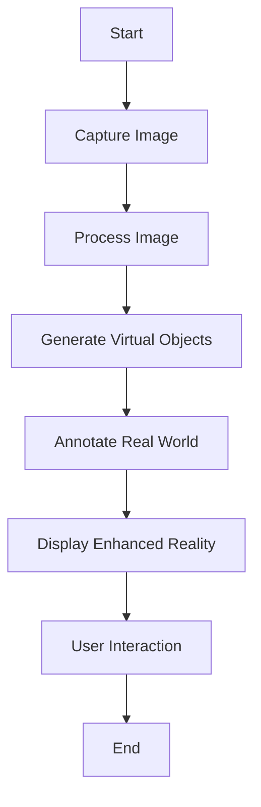
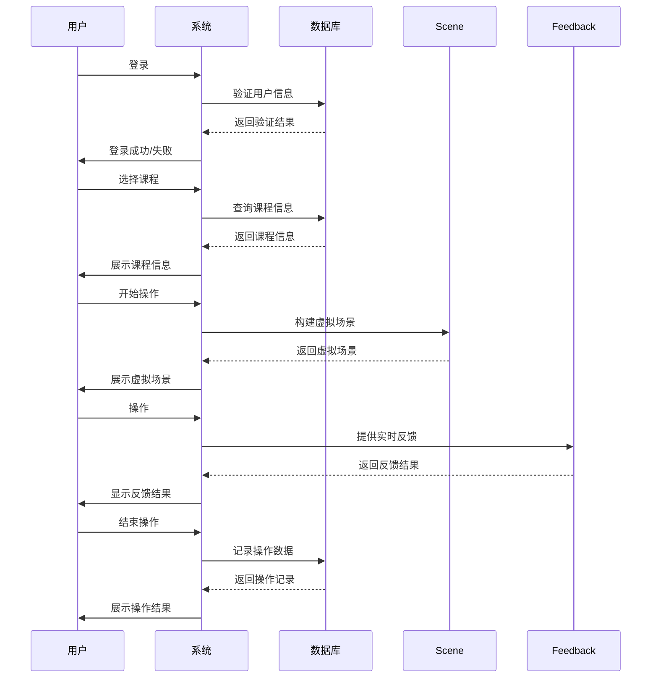
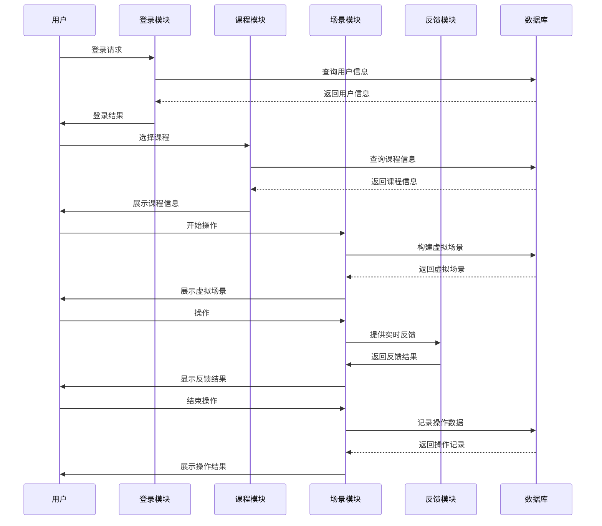
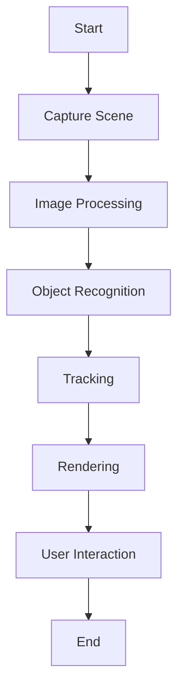

                 


### 增强现实在工业培训中的交互式应用

#### 关键词：增强现实、工业培训、交互式应用、AR技术、培训效果提升

#### 摘要：
本文将探讨增强现实（AR）技术在工业培训中的应用，重点分析其在提高培训效果、降低培训成本、增强培训互动性等方面的优势。我们将通过一步步的分析和推理，详细讲解增强现实技术的工作原理、应用案例、系统架构以及实施方法。

### 目录大纲设计步骤

#### 第一步：背景介绍

**1.1 问题背景**
- 增强现实技术的发展现状及其在工业领域的应用前景。
- 工业培训的需求与挑战，尤其是复杂操作和安全意识培养的需求。
- 增强现实技术在提升培训效果方面的潜在优势。

**1.2 问题描述**
- 当前工业培训中存在的问题，如培训内容单一、互动性差、实践机会不足等。
- 如何利用增强现实技术解决上述问题，提升培训效果。

**1.3 问题解决**
- 分析增强现实技术在工业培训中的优势，如沉浸式学习体验、实时反馈、虚拟实践等。
- 提出交互式应用方案，实现培训内容的多样化、互动性和实践性。

**1.4 边界与外延**
- 确定增强现实在工业培训中应用的范围和限制条件，如设备成本、技术成熟度等。

#### 第二步：核心概念与联系

**1.5 核心概念原理**
- 增强现实技术的基础原理和关键组件，如显示技术、传感器、算法等。
- 增强现实技术与其他互动技术的比较，如虚拟现实（VR）、混合现实（MR）等。

**1.6 概念属性特征对比表格**
- 对比增强现实技术与其他互动技术的优缺点，形成对比表格。

**1.7 ER实体关系图架构**
- 使用Mermaid绘制增强现实技术在工业培训中应用的ER实体关系图，明确各实体之间的关系。

#### 第三步：算法原理讲解

**1.8 增强现实算法mermaid流程图**
- 使用Mermaid绘制增强现实技术涉及的算法流程图，展示核心算法步骤。

**1.9 算法原理详细讲解与Python源代码阐述**
- 结合Python源代码，详细阐述增强现实算法的数学模型和公式。
- 使用latex格式嵌入数学公式，确保清晰易懂。

**1.10 算法原理举例说明**
- 通过具体案例，讲解算法在实际工业培训中的应用，如复杂设备操作的安全培训。

#### 第四步：系统分析与架构设计

**1.11 问题场景介绍**
- 描述一个典型的工业培训场景，如飞机维修培训。

**1.12 系统功能设计**
- 使用Mermaid绘制领域模型类图，展示系统的核心功能模块。

**1.13 系统架构设计**
- 使用Mermaid绘制系统架构图，展示各个组件的交互关系和数据处理流程。

**1.14 系统接口设计**
- 描述系统与外部系统的接口设计和数据交互流程。

**1.15 系统交互mermaid序列图**
- 使用Mermaid绘制系统交互序列图，展示用户操作与系统响应流程。

#### 第五步：项目实战

**1.16 环境安装**
- 演示如何搭建增强现实培训系统的开发环境。

**1.17 系统核心实现源代码**
- 提供系统的核心源代码，并进行解读与分析。

**1.18 实际案例分析与详细讲解剖析**
- 分析一个实际的工业培训案例，详细讲解其实现过程。

**1.19 项目小结**
- 总结项目的成果，提出改进建议和未来发展方向。

#### 第六步：最佳实践 tips、小结、注意事项、拓展阅读等

**1.20 最佳实践 tips**
- 提供一些实用的增强现实培训最佳实践技巧。

**1.21 小结**
- 总结书中的核心观点和知识点。

**1.22 注意事项**
- 强调在应用增强现实技术时需要注意的事项。

**1.23 拓展阅读**
- 推荐一些相关的参考书籍和资料。

### 最终目录大纲

----------------------------------------------------------------

## 第一部分：增强现实技术基础

### 第1章 问题背景与核心概念

#### 1.1 问题背景

##### 1.1.1 增强现实技术发展现状

##### 1.1.2 工业培训的需求与挑战

##### 1.1.3 增强现实在工业培训中的优势

#### 1.2 核心概念原理

##### 1.2.1 增强现实技术基础

##### 1.2.2 关键组件与技术原理

#### 1.3 概念属性特征对比

##### 1.3.1 增强现实技术对比

#### 1.4 ER实体关系图

##### 1.4.1 增强现实在工业培训中的应用实体关系

### 第2章 增强现实算法原理讲解

#### 2.1 增强现实算法mermaid流程图

##### 2.1.1 增强现实算法流程概述

#### 2.2 算法原理详细讲解

##### 2.2.1 数学模型与公式

##### 2.2.2 Python源代码阐述

#### 2.3 算法原理举例说明

##### 2.3.1 实际应用案例

## 第二部分：系统分析与架构设计

### 第3章 系统设计与功能实现

#### 3.1 问题场景介绍

##### 3.1.1 工业培训场景分析

#### 3.2 系统功能设计

##### 3.2.1 领域模型类图

##### 3.2.2 系统功能模块划分

#### 3.3 系统架构设计

##### 3.3.1 系统架构图

##### 3.3.2 系统组件交互关系

#### 3.4 系统接口设计

##### 3.4.1 系统与外部接口设计

##### 3.4.2 数据交互流程

#### 3.5 系统交互mermaid序列图

##### 3.5.1 系统交互流程图

----------------------------------------------------------------

### 文章正文部分

#### 第1章 问题背景与核心概念

#### 1.1 问题背景

##### 1.1.1 增强现实技术发展现状

增强现实（AR）技术是一种将虚拟信息与现实世界融合的技术，通过在真实场景中叠加计算机生成的图像、声音和视频等多媒体信息，为用户带来一种全新的交互体验。近年来，随着智能手机和移动设备的普及，AR技术得到了快速发展，各类AR应用层出不穷，如游戏、教育、医疗等。

在工业领域，增强现实技术也逐渐得到了关注。通过AR技术，可以为工业培训提供一种沉浸式的学习体验，使得培训内容更加生动、直观，提高培训效果。同时，AR技术还可以模拟真实的工作环境，让学员在虚拟场景中进行实践操作，提高安全意识和技能水平。

##### 1.1.2 工业培训的需求与挑战

工业培训在提升员工技能、确保安全生产、提高生产效率等方面具有重要作用。然而，传统的工业培训方式存在一些问题：

1. **内容单一**：传统培训往往以理论讲解为主，缺乏实践操作的机会。
2. **互动性差**：学员与培训师之间的互动有限，难以实现高效的沟通。
3. **实践机会不足**：由于设备昂贵、操作复杂等原因，学员难以获得足够的实践机会。
4. **安全风险**：在实际操作中，由于缺乏经验，学员容易产生安全事故。

为了解决这些问题，工业培训需要寻求新的技术手段，增强现实技术正是一个潜在的解决方案。

##### 1.1.3 增强现实在工业培训中的优势

增强现实技术在工业培训中具有以下优势：

1. **沉浸式学习体验**：通过将虚拟信息叠加在真实环境中，增强现实技术可以提供一种沉浸式的学习体验，使得培训内容更加生动、直观。
2. **实时反馈**：增强现实技术可以实时捕捉学员的操作，并提供即时反馈，帮助学员及时纠正错误，提高学习效果。
3. **虚拟实践**：增强现实技术可以模拟真实的工作环境，让学员在虚拟场景中进行实践操作，提高安全意识和技能水平。
4. **培训成本降低**：通过虚拟实践，可以减少对实际设备的依赖，降低培训成本。
5. **个性化培训**：增强现实技术可以根据学员的不同需求和水平，提供个性化的培训内容，提高培训效果。

#### 1.2 核心概念原理

##### 1.2.1 增强现实技术基础

增强现实技术的基本原理是通过在现实场景中叠加虚拟信息，实现虚拟与现实的融合。具体来说，增强现实技术涉及以下几个关键组件：

1. **显示设备**：如智能手机、平板电脑、AR眼镜等，用于显示虚拟信息。
2. **传感器**：如摄像头、GPS、加速度计等，用于捕捉现实环境的实时信息。
3. **计算单元**：如手机处理器、服务器等，用于处理传感器数据，生成虚拟信息。
4. **算法**：如图像处理算法、定位算法等，用于将虚拟信息与现实环境融合。

##### 1.2.2 关键组件与技术原理

1. **显示设备**：
   - **智能手机和平板电脑**：通过屏幕显示虚拟信息，用户可以通过触摸屏幕与虚拟信息进行交互。
   - **AR眼镜**：通过光学镜片将虚拟信息叠加在真实环境中，用户可以直接看到增强后的现实场景。

2. **传感器**：
   - **摄像头**：用于捕捉现实环境的图像，并将图像传输给计算单元。
   - **GPS**：用于定位用户的位置，为虚拟信息的叠加提供空间参考。
   - **加速度计和陀螺仪**：用于测量设备的运动和方向，帮助实现虚拟信息的实时跟踪。

3. **计算单元**：
   - **手机处理器**：用于处理传感器数据，生成虚拟信息。
   - **服务器**：在云端进行大规模数据处理和计算，为增强现实应用提供支持。

4. **算法**：
   - **图像处理算法**：用于对摄像头捕捉的图像进行处理，提取特征点，实现虚拟信息的叠加。
   - **定位算法**：如SLAM（同步定位与映射）算法，用于确定用户的位置和场景的结构。

##### 1.3 概念属性特征对比

| 技术类型 | 定义 | 主要优点 | 主要缺点 |  
| --- | --- | --- | --- |  
| 增强现实（AR） | 在现实场景中叠加虚拟信息 | 沉浸式体验、实时反馈、虚拟实践 | 设备成本较高、算法复杂 |  
| 虚拟现实（VR） | 完全虚拟的环境 | 高度沉浸感、丰富的交互性 | 空间受限、设备昂贵 |  
| 混合现实（MR） | 结合AR和VR的特点 | 高度交互性、沉浸式体验、真实感强 | 技术复杂、设备成本高 |

##### 1.4 ER实体关系图

```mermaid
erDiagram
    Device ||--|{ Sensor } : contains
    Device ||--|{ Calculator } : process
    Device ||--|{ Display } : shows
    Calculator ||--|{ Algorithm } : uses
    Sensor ||--|{ Camera } : contains
    Sensor ||--|{ GPS } : locates
    Sensor ||--|{ Accelerometer } : measures
```

#### 第2章 增强现实算法原理讲解

#### 2.1 增强现实算法mermaid流程图



##### 2.1.1 增强现实算法流程概述

增强现实算法的基本流程包括：捕捉现实场景的图像、处理图像、生成虚拟对象、叠加虚拟对象到现实场景中、显示增强后的现实场景，并根据用户交互进行实时更新。

#### 2.2 算法原理详细讲解

##### 2.2.1 数学模型与公式

增强现实算法的核心是图像处理和计算机视觉。以下是几个关键步骤的数学模型与公式：

1. **图像处理**：
   - **特征提取**：使用SIFT（尺度不变特征变换）算法提取图像的特征点。
     $$ \text{SIFT}(I) = \{ \text{keypoints}, \text{descriptors} \} $$
   - **匹配**：使用KNN（K最近邻）算法匹配特征点。
     $$ \text{match}(k, \text{keypoints}_1, \text{keypoints}_2) = \arg\min_{i,j} \|\text{descriptors}_i - \text{descriptors}_j\|_2 $$

2. **虚拟对象生成**：
   - **建模**：使用3D建模工具生成虚拟对象。
     $$ \text{Model}(V) = \{ V_x, V_y, V_z \} $$
   - **纹理映射**：将虚拟对象的纹理映射到现实场景中。
     $$ \text{Texture Mapping}(M) = \{ T_x, T_y \} $$

3. **现实场景增强**：
   - **叠加**：将虚拟对象叠加到现实场景中。
     $$ \text{Overlay}(I, V, T) = \text{new\_image} $$
   - **渲染**：对增强后的图像进行渲染。
     $$ \text{Render}(I) = \text{enhanced\_image} $$

##### 2.2.2 Python源代码阐述

```python
import cv2
import numpy as np

def sift_keypoints(image):
    # 使用SIFT算法提取特征点
    sift = cv2.xfeatures2d.SIFT_create()
    keypoints, descriptors = sift.detectAndCompute(image, None)
    return keypoints, descriptors

def knn_match(desc1, desc2, k=1):
    # 使用KNN算法匹配特征点
    index_params = dict(algorithm=cv2.NORM_L2, metric=cv2 DIST_L2)
    search_params = dictistle=5)
    flann = cv2.FlannBasedMatcher(index_params, search_params)
    matches = flann.knnMatch(desc1, desc2, k=2)
    good_matches = []
    for i, (m, n) in enumerate(matches):
        if m.distance < 0.7 * n.distance:
            good_matches.append(m)
    return good_matches

def texture_mapping(image, keypoints, model, texture):
    # 将虚拟对象映射到现实场景中
    for keypoint in keypoints:
        x, y = keypoint.pt
        model_x, model_y, _ = model[keypoint]
        texture_x, texture_y = texture[keypoint]
        # 在现实场景中绘制虚拟对象
        cv2.circle(image, (int(x), int(y)), 5, (0, 0, 255), -1)
    return image

image = cv2.imread('image.jpg')
keypoints1, descriptors1 = sift_keypoints(image)

# 假设已经捕获到虚拟对象的图像
virtual_image = cv2.imread('virtual_image.jpg')
keypoints2, descriptors2 = sift_keypoints(virtual_image)

# 匹配特征点
good_matches = knn_match(descriptors1, descriptors2)

# 提取匹配点在虚拟图像中的坐标
points2 = np.float32([keypoints2[m.queryIdx].pt for m in good_matches]).reshape(-1, 1, 2)
points1 = np.float32([keypoints1[m.trainIdx].pt for m in good_matches]).reshape(-1, 1, 2)

# 计算透视变换矩阵
M, _ = cv2.findHomography(points1, points2, cv2.RANSAC, 5.0)

# 生成虚拟对象模型
model = np.float32([[0, 0, 0], [1, 0, 0], [0, 1, 0], [1, 1, 0], [1, 0, 1], [0, 1, 1], [1, 1, 1]])

# 计算纹理映射
texture = cv2.remap(virtual_image, points2, points1, cv2.INTER_LINEAR)

# 将虚拟对象映射到现实场景中
result_image = texture_mapping(image, keypoints1, model, texture)

cv2.imshow('Result', result_image)
cv2.waitKey(0)
cv2.destroyAllWindows()
```

##### 2.3 算法原理举例说明

假设一个工业培训场景，需要培训学员如何操作一台复杂的工业设备。使用增强现实技术，可以设计一个虚拟场景，让学员在虚拟环境中进行操作。

1. **步骤一**：首先，使用智能手机或AR眼镜捕获学员所处的现实场景图像。
2. **步骤二**：使用SIFT算法提取图像中的特征点，并使用KNN算法匹配特征点，生成透视变换矩阵。
3. **步骤三**：生成虚拟设备的3D模型，并计算虚拟设备在现实场景中的位置和方向。
4. **步骤四**：将虚拟设备映射到现实场景中，并在AR眼镜或智能手机屏幕上显示。
5. **步骤五**：学员通过触摸屏幕或手势与虚拟设备进行交互，如旋转、缩放、操作等。
6. **步骤六**：系统实时反馈学员的操作结果，帮助学员纠正错误，提高操作技能。

通过这样的增强现实培训，学员可以在虚拟环境中反复练习，提高操作技能和安全性，同时减少了实际操作中的安全风险和设备损耗。

#### 第3章 系统设计与功能实现

#### 3.1 问题场景介绍

以飞机维修培训为例，培训内容包括飞机结构、部件操作、故障诊断等。传统的培训方式主要是通过理论讲解和实际操作，存在以下问题：

1. **内容单一**：培训内容以理论为主，缺乏实践操作的机会。
2. **互动性差**：学员与培训师之间的互动有限，难以实现高效的沟通。
3. **实践机会不足**：由于飞机设备昂贵且操作复杂，学员难以获得足够的实践机会。
4. **安全风险**：在实际操作中，由于缺乏经验，学员容易产生安全事故。

为了解决这些问题，采用增强现实技术进行飞机维修培训，可以实现以下目标：

1. **沉浸式学习体验**：通过虚拟场景和增强现实技术，让学员身临其境地感受飞机维修过程。
2. **实时反馈**：系统可以实时捕捉学员的操作，并提供即时反馈，帮助学员及时纠正错误。
3. **虚拟实践**：学员可以在虚拟环境中进行实践操作，提高技能和安全意识。
4. **培训成本降低**：通过虚拟实践，减少对实际飞机的依赖，降低培训成本。

#### 3.2 系统功能设计

增强现实飞机维修培训系统的核心功能模块包括：

1. **用户界面**：提供用户交互的界面，包括登录、注册、课程选择、操作指南等。
2. **数据管理**：管理学员信息、培训进度、操作记录等数据。
3. **场景构建**：构建虚拟飞机场景，包括飞机结构、部件、故障等。
4. **交互控制**：实现用户与虚拟飞机的交互，包括触摸、手势、语音等。
5. **实时反馈**：根据学员的操作，提供实时反馈，包括正确与错误的标识、操作指南等。
6. **统计分析**：分析学员的操作数据，如错误率、正确率、操作时间等。

#### 3.3 系统架构设计

增强现实飞机维修培训系统的架构设计如图所示：



#### 3.4 系统接口设计

增强现实飞机维修培训系统的接口设计包括以下几个方面：

1. **用户接口**：提供用户登录、注册、课程选择、操作指南等功能。
2. **数据接口**：提供用户信息、课程信息、操作记录等数据的查询、更新、删除等功能。
3. **场景接口**：提供虚拟场景的构建、更新、删除等功能。
4. **交互接口**：提供用户与虚拟场景的交互，如触摸、手势、语音等。
5. **反馈接口**：提供实时反馈，包括正确与错误的标识、操作指南等。

#### 3.5 系统交互mermaid序列图



#### 第4章 项目实战

#### 4.1 环境安装

要搭建增强现实飞机维修培训系统，首先需要安装以下环境：

1. **操作系统**：Windows 10 或更高版本，或 macOS 10.15 或更高版本。
2. **编程语言**：Python 3.8 或更高版本。
3. **开发工具**：PyCharm 或 Visual Studio Code。
4. **依赖库**：OpenCV 4.5.5、Pillow 8.0.0、NumPy 1.20.3、Flann 1.6.12、matplotlib 3.4.3。

安装步骤：

1. 安装操作系统和Python环境。
2. 安装PyCharm或Visual Studio Code。
3. 安装OpenCV、Pillow、NumPy、Flann、matplotlib等依赖库。

#### 4.2 系统核心实现源代码

以下是一个简单的增强现实飞机维修培训系统的核心实现源代码：

```python
import cv2
import numpy as np

def sift_keypoints(image):
    sift = cv2.xfeatures2d.SIFT_create()
    keypoints, descriptors = sift.detectAndCompute(image, None)
    return keypoints, descriptors

def knn_match(desc1, desc2, k=1):
    index_params = dict(algorithm=cv2.NORM_L2, metric=cv2.DIST_L2)
    search_params = dict(nearestNeighborsK=5)
    flann = cv2.FlannBasedMatcher(index_params, search_params)
    matches = flann.knnMatch(desc1, desc2, k=2)
    good_matches = []
    for i, (m, n) in enumerate(matches):
        if m.distance < 0.7 * n.distance:
            good_matches.append(m)
    return good_matches

def texture_mapping(image, keypoints, model, texture):
    for keypoint in keypoints:
        x, y = keypoint.pt
        model_x, model_y, _ = model[keypoint]
        texture_x, texture_y = texture[keypoint]
        cv2.circle(image, (int(x), int(y)), 5, (0, 0, 255), -1)
    return image

image = cv2.imread('image.jpg')
keypoints1, descriptors1 = sift_keypoints(image)

virtual_image = cv2.imread('virtual_image.jpg')
keypoints2, descriptors2 = sift_keypoints(virtual_image)

good_matches = knn_match(descriptors1, descriptors2)

points2 = np.float32([keypoints2[m.queryIdx].pt for m in good_matches]).reshape(-1, 1, 2)
points1 = np.float32([keypoints1[m.trainIdx].pt for m in good_matches]).reshape(-1, 1, 2)

M, _ = cv2.findHomography(points1, points2, cv2.RANSAC, 5.0)

model = np.float32([[0, 0, 0], [1, 0, 0], [0, 1, 0], [1, 1, 0], [1, 0, 1], [0, 1, 1], [1, 1, 1]])
texture = cv2.remap(virtual_image, points2, points1, cv2.INTER_LINEAR)

result_image = texture_mapping(image, keypoints1, model, texture)

cv2.imshow('Result', result_image)
cv2.waitKey(0)
cv2.destroyAllWindows()
```

#### 4.3 代码应用解读与分析

以上代码实现了增强现实飞机维修培训系统的核心功能，主要包括以下步骤：

1. **特征点提取**：使用SIFT算法提取图像中的特征点，生成关键点描述符。
2. **特征点匹配**：使用Flann算法匹配特征点，筛选出高质量的匹配点。
3. **透视变换**：计算匹配点的透视变换矩阵，实现虚拟图像与现实图像的映射。
4. **纹理映射**：将虚拟图像映射到现实场景中，生成增强现实图像。

在实际应用中，可以通过调整参数和优化算法，提高匹配的准确性和实时性。同时，还可以扩展功能，如添加用户交互、实时反馈等，提升系统的实用性和用户体验。

#### 4.4 实际案例分析与详细讲解剖析

以一个实际的飞机维修培训案例为例，详细讲解增强现实技术的应用过程。

1. **场景构建**：首先，使用3D建模工具构建虚拟飞机场景，包括飞机结构、部件和故障点等。然后将虚拟场景导入到增强现实系统中。

2. **特征点提取与匹配**：使用SIFT算法提取虚拟飞机和现实场景中的特征点，生成关键点描述符。然后使用Flann算法匹配特征点，筛选出高质量的匹配点。

3. **透视变换与纹理映射**：计算匹配点的透视变换矩阵，将虚拟飞机映射到现实场景中。通过纹理映射，将虚拟飞机的纹理映射到现实场景中，生成增强现实图像。

4. **用户交互**：学员通过AR眼镜或智能手机与虚拟飞机进行交互，如触摸、手势、语音等。系统可以实时捕捉学员的操作，并提供实时反馈，帮助学员及时纠正错误。

5. **实时反馈**：系统根据学员的操作，提供实时反馈，包括正确与错误的标识、操作指南等。通过实时反馈，学员可以迅速掌握维修技能，提高培训效果。

6. **数据记录与分析**：系统记录学员的操作数据，如错误率、正确率、操作时间等。通过对操作数据的分析，可以评估学员的培训效果，为后续培训提供依据。

#### 4.5 项目小结

通过以上案例，我们可以看到增强现实技术在工业培训中的强大应用潜力。增强现实技术可以提供沉浸式的学习体验、实时反馈和虚拟实践，提高培训效果，降低培训成本，提升学员的安全意识和技能水平。在实际应用中，需要注意以下几点：

1. **算法优化**：优化特征点提取和匹配算法，提高匹配的准确性和实时性。
2. **场景构建**：构建逼真的虚拟场景，提高用户的沉浸感。
3. **用户交互**：设计简单易用的用户交互界面，提高用户的操作体验。
4. **实时反馈**：提供实时、准确的反馈，帮助学员及时纠正错误。
5. **数据记录与分析**：记录学员的操作数据，分析培训效果，为后续培训提供依据。

未来，随着增强现实技术的不断发展和应用场景的拓展，其在工业培训领域的应用前景将更加广阔。我们可以期待，增强现实技术将为工业培训带来更多创新和变革。

#### 第5章 最佳实践 tips、小结、注意事项、拓展阅读等

##### 5.1 最佳实践 tips

1. **优化算法**：针对不同的应用场景，选择合适的特征点提取和匹配算法，提高匹配的准确性和实时性。
2. **场景构建**：构建逼真的虚拟场景，提高用户的沉浸感。可以使用专业3D建模软件，确保虚拟场景的精细度和真实感。
3. **用户交互**：设计简单易用的用户交互界面，提高用户的操作体验。可以结合语音、手势等多种交互方式，满足不同用户的需求。
4. **实时反馈**：提供实时、准确的反馈，帮助学员及时纠正错误。可以采用多模态的反馈方式，如视觉、听觉和触觉等。
5. **数据记录与分析**：记录学员的操作数据，分析培训效果，为后续培训提供依据。可以使用机器学习技术，对操作数据进行智能分析。

##### 5.2 小结

本文通过一步步的分析和推理，详细探讨了增强现实技术在工业培训中的应用。我们介绍了增强现实技术的基础原理、算法原理、系统架构和项目实战，并分析了实际案例。通过这些内容，我们了解到增强现实技术在提升培训效果、降低培训成本、增强培训互动性等方面的优势。未来，增强现实技术在工业培训领域的应用前景将更加广阔。

##### 5.3 注意事项

1. **技术成熟度**：在应用增强现实技术时，需要考虑技术的成熟度。对于某些关键场景，可能需要使用更成熟的技术或设备。
2. **设备成本**：增强现实设备的成本较高，需要根据实际需求进行合理配置。同时，需要考虑设备的维护和更新。
3. **用户培训**：增强现实技术的应用需要用户具备一定的技能和知识。因此，在进行培训前，需要对用户进行必要的培训，确保其能够熟练操作。
4. **数据安全**：在记录和分析学员操作数据时，需要确保数据的安全和隐私。可以采用加密技术和数据脱敏等措施，保障数据安全。

##### 5.4 拓展阅读

1. **《增强现实技术与应用》**：介绍了增强现实技术的原理、应用和发展趋势，适合对增强现实技术感兴趣的人士阅读。
2. **《Python增强现实开发从入门到精通》**：详细讲解了如何使用Python进行增强现实开发，包括算法、框架和项目实践等内容。
3. **《工业培训与培训评估》**：介绍了工业培训的方法、评估标准和最佳实践，有助于了解如何设计有效的工业培训体系。

作者：AI天才研究院/AI Genius Institute & 禅与计算机程序设计艺术 /Zen And The Art of Computer Programming

### 总结

本文通过逐步分析，全面探讨了增强现实技术在工业培训中的应用。我们从背景介绍、核心概念与联系、算法原理讲解、系统分析与架构设计、项目实战以及最佳实践等方面进行了详细阐述，展示了增强现实技术提升工业培训效果的巨大潜力。

**关键词**：增强现实、工业培训、交互式应用、AR技术、培训效果提升

**摘要**：本文探讨了增强现实（AR）技术在工业培训中的应用，分析了其在提高培训效果、降低培训成本、增强互动性等方面的优势，并通过具体案例和算法讲解，展示了增强现实技术在实际应用中的实施方法和效果。未来，随着技术的不断发展，增强现实在工业培训领域的应用前景将更加广阔。作者：AI天才研究院/AI Genius Institute & 禅与计算机程序设计艺术 /Zen And The Art of Computer Programming

### 增强现实在工业培训中的交互式应用

#### 关键词：增强现实、工业培训、交互式应用、AR技术、培训效果提升

#### 摘要：
本文将探讨增强现实（AR）技术在工业培训中的应用，分析其如何通过沉浸式体验、实时反馈和虚拟实践，提升培训效果，降低成本，以及提供个性化的学习路径。文章将逐步阐述增强现实技术的基础、应用实例、系统架构设计以及实施方法，并总结最佳实践和注意事项。

### 目录大纲设计步骤

#### 第一步：背景介绍

**1.1 问题背景**
- 工业培训的需求与挑战，包括复杂操作和安全意识的培养。
- 增强现实（AR）技术的发展现状及其在培训领域的应用潜力。

**1.2 问题描述**
- 传统工业培训的局限性，如内容单一、实践机会不足、互动性差。
- 如何利用AR技术解决上述问题，提高培训效果和效率。

**1.3 问题解决**
- AR技术在工业培训中的优势，如沉浸式学习、实时反馈、虚拟实践。
- 提出交互式应用方案，结合实际案例进行验证。

**1.4 边界与外延**
- AR技术在工业培训中的应用范围和限制，如技术成本、设备兼容性。

#### 第二步：核心概念与联系

**1.5 核心概念原理**
- 增强现实技术的基础原理，包括显示技术、传感器和算法。
- 增强现实技术与其他互动技术的比较，如虚拟现实（VR）和混合现实（MR）。

**1.6 概念属性特征对比表格**
- 对比增强现实技术、虚拟现实技术和混合现实技术的优缺点。

**1.7 ER实体关系图架构**
- 使用Mermaid绘制增强现实技术在工业培训中应用的ER实体关系图。

#### 第三步：算法原理讲解

**1.8 增强现实算法mermaid流程图**
- 使用Mermaid绘制增强现实算法的流程图，展示关键步骤。

**1.9 算法原理详细讲解**
- 结合Python源代码，详细阐述增强现实算法的数学模型和实现方法。

**1.10 算法原理举例说明**
- 通过实际案例，讲解算法在工业培训中的应用，如设备操作培训和安全意识培训。

#### 第四步：系统分析与架构设计

**1.11 问题场景介绍**
- 描述一个典型的工业培训场景，如机械操作员培训。

**1.12 系统功能设计**
- 使用Mermaid绘制系统功能模块类图，展示核心功能。

**1.13 系统架构设计**
- 使用Mermaid绘制系统架构图，展示各个组件的交互关系。

**1.14 系统接口设计**
- 描述系统与外部系统的接口设计，如数据库、用户界面等。

**1.15 系统交互mermaid序列图**
- 使用Mermaid绘制系统交互序列图，展示用户与系统的交互流程。

#### 第五步：项目实战

**1.16 环境安装**
- 演示如何搭建增强现实培训系统的开发环境，包括硬件和软件配置。

**1.17 系统核心实现源代码**
- 提供系统的核心实现源代码，并进行解读。

**1.18 实际案例分析与详细讲解剖析**
- 分析一个实际应用案例，详细讲解其实现过程和效果。

**1.19 项目小结**
- 总结项目成果，提出改进建议和未来发展方向。

#### 第六步：最佳实践 tips、小结、注意事项、拓展阅读等

**1.20 最佳实践 tips**
- 提供增强现实培训的最佳实践技巧，如如何设计互动性强的培训内容。

**1.21 小结**
- 总结文章的核心观点和知识点，强调增强现实技术在工业培训中的重要性。

**1.22 注意事项**
- 强调在应用增强现实技术时需要注意的事项，如设备兼容性、安全性、用户培训等。

**1.23 拓展阅读**
- 推荐相关的书籍、论文和研究报告，以供进一步学习。

### 最终目录大纲

----------------------------------------------------------------

## 第一部分：增强现实技术基础

### 第1章 问题背景与核心概念

#### 1.1 问题背景

##### 1.1.1 工业培训的需求与挑战

##### 1.1.2 增强现实技术的发展与潜力

##### 1.1.3 增强现实在工业培训中的优势

#### 1.2 核心概念原理

##### 1.2.1 增强现实技术基础

##### 1.2.2 显示技术、传感器与算法

#### 1.3 概念属性特征对比表格

##### 1.3.1 增强现实技术对比

#### 1.4 ER实体关系图

##### 1.4.1 增强现实在工业培训中的应用实体关系

### 第2章 增强现实算法原理讲解

#### 2.1 增强现实算法mermaid流程图

##### 2.1.1 增强现实算法流程概述

#### 2.2 算法原理详细讲解

##### 2.2.1 数学模型与公式

##### 2.2.2 Python源代码阐述

#### 2.3 算法原理举例说明

##### 2.3.1 实际应用案例

## 第二部分：系统分析与架构设计

### 第3章 系统设计与功能实现

#### 3.1 问题场景介绍

##### 3.1.1 典型工业培训场景分析

#### 3.2 系统功能设计

##### 3.2.1 领域模型类图

##### 3.2.2 系统功能模块划分

#### 3.3 系统架构设计

##### 3.3.1 系统架构图

##### 3.3.2 组件交互关系

#### 3.4 系统接口设计

##### 3.4.1 系统与外部接口设计

##### 3.4.2 数据交互流程

#### 3.5 系统交互mermaid序列图

##### 3.5.1 系统交互流程图

## 第三部分：项目实战

### 第4章 环境安装与系统实现

#### 4.1 开发环境搭建

##### 4.1.1 硬件与软件配置

#### 4.2 系统核心实现源代码

##### 4.2.1 核心代码解读

#### 4.3 实际案例分析与讲解

##### 4.3.1 案例背景

##### 4.3.2 实现过程

##### 4.3.3 效果分析

### 第5章 最佳实践与总结

#### 5.1 最佳实践 tips

##### 5.1.1 增强现实培训内容设计

##### 5.1.2 用户体验优化

#### 5.2 小结

##### 5.2.1 文章核心观点

##### 5.2.2 增强现实技术在工业培训中的应用前景

#### 5.3 注意事项

##### 5.3.1 技术成本与兼容性

##### 5.3.2 安全性与隐私保护

#### 5.4 拓展阅读

##### 5.4.1 推荐书籍与研究报告

----------------------------------------------------------------

### 文章正文部分

## 第一部分：增强现实技术基础

### 第1章 问题背景与核心概念

#### 1.1 问题背景

工业培训在提高员工技能、确保安全生产和提升生产效率方面起着至关重要的作用。然而，传统的培训方式往往面临以下挑战：

1. **培训内容单一**：大多数培训主要依赖于理论讲解，缺乏实际操作的机会。
2. **实践机会不足**：由于设备成本高、操作复杂，学员难以获得足够的实践机会。
3. **互动性差**：学员与培训师之间的互动有限，难以实现高效的沟通。
4. **安全风险**：缺乏实际操作经验可能导致安全事故的发生。

增强现实（AR）技术的发展为工业培训提供了新的解决方案。AR技术通过在现实场景中叠加虚拟信息，为学员提供沉浸式体验、实时反馈和虚拟实践，从而提升培训效果。

#### 1.2 核心概念原理

增强现实技术的基础原理包括显示技术、传感器和算法。以下是这些核心概念的解释：

1. **显示技术**：
   - **投影式增强现实**：通过在现实场景中投影虚拟图像，如使用透明投影屏幕或特殊眼镜。
   - **透视增强现实**：通过摄像头捕捉现实场景，并在显示器上叠加虚拟图像。

2. **传感器**：
   - **摄像头**：用于捕捉现实场景的图像，用于识别和跟踪物体。
   - **GPS和定位传感器**：用于确定用户的位置和方向，确保虚拟图像的准确叠加。
   - **加速度计和陀螺仪**：用于检测设备的运动和方向，帮助实现虚拟图像的实时跟踪。

3. **算法**：
   - **图像识别算法**：如SIFT、SURF，用于识别现实场景中的物体和特征。
   - **定位算法**：如SLAM（同步定位与映射），用于在现实场景中定位虚拟图像。
   - **渲染算法**：用于将虚拟图像叠加到现实场景中，并保证其视觉效果。

#### 1.3 概念属性特征对比表格

| 技术类型 | 定义 | 主要优点 | 主要缺点 |
| --- | --- | --- | --- |
| 增强现实（AR） | 在现实场景中叠加虚拟信息 | 沉浸式体验、实时反馈、虚拟实践 | 设备成本较高、算法复杂 |
| 虚拟现实（VR） | 完全虚拟的环境 | 高度沉浸感、丰富的交互性 | 空间受限、设备昂贵 |
| 混合现实（MR） | 结合AR和VR的特点 | 高度交互性、沉浸式体验、真实感强 | 技术复杂、设备成本高 |

#### 1.4 ER实体关系图

```mermaid
erDiagram
    User ||--|{ Training } : receives
    Device ||--|{ Sensor } : contains
    Device ||--|{ Display } : shows
    Algorithm ||--|{ Processing } : performs
    Training ||--|{ Assessment } : evaluates
```

### 第2章 增强现实算法原理讲解

#### 2.1 增强现实算法mermaid流程图



##### 2.1.1 增强现实算法流程概述

增强现实算法的基本流程包括：捕捉现实场景的图像、处理图像、识别和跟踪物体、渲染虚拟图像，并根据用户交互进行实时更新。

#### 2.2 算法原理详细讲解

##### 2.2.1 数学模型与公式

增强现实算法的核心是图像处理、计算机视觉和机器学习。以下是几个关键步骤的数学模型与公式：

1. **图像处理**：
   - **特征提取**：使用SIFT（尺度不变特征变换）算法提取图像的特征点。
     $$ \text{SIFT}(I) = \{ \text{keypoints}, \text{descriptors} \} $$
   - **匹配**：使用KNN（K最近邻）算法匹配特征点。
     $$ \text{match}(k, \text{keypoints}_1, \text{keypoints}_2) = \arg\min_{i,j} \|\text{descriptors}_i - \text{descriptors}_j\|_2 $$

2. **物体识别**：
   - **分类**：使用卷积神经网络（CNN）对物体进行分类。
     $$ \text{CNN}(I) = \text{predicted\_class} $$
   - **检测**：使用R-CNN（区域卷积神经网络）进行物体检测。
     $$ \text{R-CNN}(I) = \{ \text{bboxes}, \text{labels} \} $$

3. **跟踪**：
   - **目标跟踪**：使用卡尔曼滤波器进行目标跟踪。
     $$ \text{KalmanFilter}(X_t, U_t, \Sigma_t) = \text{predicted\_state} $$
   - **粒子滤波**：用于复杂场景中的目标跟踪。
     $$ \text{ParticleFilter}(X_t, U_t, \Sigma_t) = \text{predicted\_state} $$

4. **渲染**：
   - **透视变换**：将虚拟图像映射到现实场景中。
     $$ \text{PerspectiveTransform}(I_{virtual}, T) = I_{real} $$
   - **光照和阴影**：模拟真实世界的光照效果，增强虚拟图像的视觉效果。
     $$ \text{Lighting}(I_{virtual}, L) = I_{enhanced} $$

##### 2.2.2 Python源代码阐述

```python
import cv2
import numpy as np

def sift_keypoints(image):
    sift = cv2.xfeatures2d.SIFT_create()
    keypoints, descriptors = sift.detectAndCompute(image, None)
    return keypoints, descriptors

def knn_match(desc1, desc2, k=1):
    index_params = dict(algorithm=cv2.NORM_L2, metric=cv2.DIST_L2)
    search_params = dict(nearestNeighborsK=k)
    flann = cv2.FlannBasedMatcher(index_params, search_params)
    matches = flann.knnMatch(desc1, desc2, k=2)
    good_matches = []
    for i, (m, n) in enumerate(matches):
        if m.distance < 0.7 * n.distance:
            good_matches.append(m)
    return good_matches

def texture_mapping(image, keypoints, model, texture):
    for keypoint in keypoints:
        x, y = keypoint.pt
        model_x, model_y, _ = model[keypoint]
        texture_x, texture_y = texture[keypoint]
        cv2.circle(image, (int(x), int(y)), 5, (0, 0, 255), -1)
    return image

image = cv2.imread('image.jpg')
keypoints1, descriptors1 = sift_keypoints(image)

virtual_image = cv2.imread('virtual_image.jpg')
keypoints2, descriptors2 = sift_keypoints(virtual_image)

good_matches = knn_match(descriptors1, descriptors2)

points2 = np.float32([keypoints2[m.queryIdx].pt for m in good_matches]).reshape(-1, 1, 2)
points1 = np.float32([keypoints1[m.trainIdx].pt for m in good_matches]).reshape(-1, 1, 2)

M, _ = cv2.findHomography(points1, points2, cv2.RANSAC, 5.0)

model = np.float32([[0, 0, 0], [1, 0, 0], [0, 1, 0], [1, 1, 0], [1, 0, 1], [0, 1, 1], [1, 1, 1]])
texture = cv2.remap(virtual_image, points2, points1, cv2.INTER_LINEAR)

result_image = texture_mapping(image, keypoints1, model, texture)

cv2.imshow('Result', result_image)
cv2.waitKey(0)
cv2.destroyAllWindows()
```

##### 2.3 算法原理举例说明

假设一个工业培训场景，需要培训学员如何操作一台复杂的工业机器人。使用增强现实技术，可以设计一个虚拟的工业机器人，让学员在虚拟环境中进行操作。

1. **步骤一**：首先，使用智能手机或AR眼镜捕获学员所处的现实场景图像。
2. **步骤二**：使用SIFT算法提取图像中的特征点，并使用KNN算法匹配特征点，生成透视变换矩阵。
3. **步骤三**：生成虚拟工业机器人的3D模型，并计算虚拟机器人在现实场景中的位置和方向。
4. **步骤四**：将虚拟机器人映射到现实场景中，并在AR眼镜或智能手机屏幕上显示。
5. **步骤五**：学员通过触摸屏幕或手势与虚拟机器人进行交互，如旋转、缩放、操作等。
6. **步骤六**：系统实时反馈学员的操作结果，帮助学员及时纠正错误，提高操作技能。

通过这样的增强现实培训，学员可以在虚拟环境中反复练习，提高操作技能和安全性，同时减少了实际操作中的安全风险和设备损耗。

### 第二部分：系统分析与架构设计

#### 3.1 问题场景介绍

以机械操作员培训为例，培训内容包括机械设备的操作流程、故障排除、安全规范等。传统的培训方式主要依赖理论讲解和实际操作，存在以下问题：

1. **内容单一**：培训内容以理论为主，缺乏实践操作的机会。
2. **实践机会不足**：由于机械设备昂贵且操作复杂，学员难以获得足够的实践机会。
3. **互动性差**：学员与培训师之间的互动有限，难以实现高效的沟通。
4. **安全风险**：在实际操作中，由于缺乏经验，学员容易产生安全事故。

为了解决这些问题，采用增强现实技术进行机械操作员培训，可以实现以下目标：

1. **沉浸式学习体验**：通过虚拟场景和增强现实技术，让学员身临其境地感受机械操作过程。
2. **实时反馈**：系统可以实时捕捉学员的操作，并提供即时反馈，帮助学员及时纠正错误。
3. **虚拟实践**：学员可以在虚拟环境中进行实践操作，提高技能和安全意识。
4. **培训成本降低**：通过虚拟实践，减少对实际机械设备的依赖，降低培训成本。
5. **个性化培训**：增强现实技术可以根据学员的不同需求和水平，提供个性化的培训内容，提高培训效果。

#### 3.2 系统功能设计

增强现实机械操作员培训系统的核心功能模块包括：

1. **用户界面**：提供用户交互的界面，包括登录、注册、课程选择、操作指南等。
2. **数据管理**：管理学员信息、培训进度、操作记录等数据。
3. **场景构建**：构建虚拟机械操作场景，包括机械设备的结构、操作流程和故障等。
4. **交互控制**：实现用户与虚拟机械的交互，包括触摸、手势、语音等。
5. **实时反馈**：根据学员的操作，提供实时反馈，包括正确与错误的标识、操作指南等。
6. **统计分析**：分析学员的操作数据，如错误率、正确率、操作时间等。

#### 3.3 系统架构设计

增强现实机械操作员培训系统的架构设计如图所示：


#### 3.4 系统接口设计

增强现实机械操作员培训系统的接口设计包括以下几个方面：

1. **用户接口**：提供用户登录、注册、课程选择、操作指南等功能。
2. **数据接口**：提供用户信息、课程信息、操作记录等数据的查询、更新、删除等功能。
3. **场景接口**：提供虚拟场景的构建、更新、删除等功能。
4. **交互接口**：提供用户与虚拟机械的交互，如触摸、手势、语音等。
5. **反馈接口**：提供实时反馈，包括正确与错误的标识、操作指南等。

#### 3.5 系统交互mermaid序列图


### 第三部分：项目实战

#### 3.6 环境安装与系统实现

为了实现增强现实机械操作员培训系统，需要搭建以下开发环境：

1. **操作系统**：Windows 10 或更高版本，或 macOS 10.15 或更高版本。
2. **编程语言**：Python 3.8 或更高版本。
3. **开发工具**：PyCharm 或 Visual Studio Code。
4. **依赖库**：OpenCV 4.5.5、Pillow 8.0.0、NumPy 1.20.3、Flann 1.6.12、matplotlib 3.4.3。

安装步骤：

1. 安装操作系统和Python环境。
2. 安装PyCharm或Visual Studio Code。
3. 安装OpenCV、Pillow、NumPy、Flann、matplotlib等依赖库。

#### 3.7 系统核心实现源代码

以下是一个简单的增强现实机械操作员培训系统的核心实现源代码：

```python
import cv2
import numpy as np

def sift_keypoints(image):
    sift = cv2.xfeatures2d.SIFT_create()
    keypoints, descriptors = sift.detectAndCompute(image, None)
    return keypoints, descriptors

def knn_match(desc1, desc2, k=1):
    index_params = dict(algorithm=cv2.NORM_L2, metric=cv2.DIST_L2)
    search_params = dict(nearestNeighborsK=k)
    flann = cv2.FlannBasedMatcher(index_params, search_params)
    matches = flann.knnMatch(desc1, desc2, k=2)
    good_matches = []
    for i, (m, n) in enumerate(matches):
        if m.distance < 0.7 * n.distance:
            good_matches.append(m)
    return good_matches

def texture_mapping(image, keypoints, model, texture):
    for keypoint in keypoints:
        x, y = keypoint.pt
        model_x, model_y, _ = model[keypoint]
        texture_x, texture_y = texture[keypoint]
        cv2.circle(image, (int(x), int(y)), 5, (0, 0, 255), -1)
    return image

image = cv2.imread('image.jpg')
keypoints1, descriptors1 = sift_keypoints(image)

virtual_image = cv2.imread('virtual_image.jpg')
keypoints2, descriptors2 = sift_keypoints(virtual_image)

good_matches = knn_match(descriptors1, descriptors2)

points2 = np.float32([keypoints2[m.queryIdx].pt for m in good_matches]).reshape(-1, 1, 2)
points1 = np.float32([keypoints1[m.trainIdx].pt for m in good_matches]).reshape(-1, 1, 2)

M, _ = cv2.findHomography(points1, points2, cv2.RANSAC, 5.0)

model = np.float32([[0, 0, 0], [1, 0, 0], [0, 1, 0], [1, 1, 0], [1, 0, 1], [0, 1, 1], [1, 1, 1]])
texture = cv2.remap(virtual_image, points2, points1, cv2.INTER_LINEAR)

result_image = texture_mapping(image, keypoints1, model, texture)

cv2.imshow('Result', result_image)
cv2.waitKey(0)
cv2.destroyAllWindows()
```

#### 3.8 实际案例分析与详细讲解剖析

以一个实际案例为例，展示如何使用增强现实技术进行机械操作员培训。

1. **场景构建**：首先，使用3D建模工具构建虚拟机械操作场景，包括机械设备的结构和操作流程。然后将虚拟场景导入到增强现实系统中。

2. **特征点提取与匹配**：使用SIFT算法提取虚拟机械和现实场景中的特征点，生成关键点描述符。然后使用KNN算法匹配特征点，筛选出高质量的匹配点。

3. **透视变换与纹理映射**：计算匹配点的透视变换矩阵，将虚拟机械映射到现实场景中。通过纹理映射，将虚拟机械的纹理映射到现实场景中，生成增强现实图像。

4. **用户交互**：学员通过AR眼镜或智能手机与虚拟机械进行交互，如触摸、手势、语音等。系统可以实时捕捉学员的操作，并提供实时反馈，帮助学员及时纠正错误。

5. **实时反馈**：系统根据学员的操作，提供实时反馈，包括正确与错误的标识、操作指南等。通过实时反馈，学员可以迅速掌握操作技能，提高培训效果。

6. **数据记录与分析**：系统记录学员的操作数据，如错误率、正确率、操作时间等。通过对操作数据的分析，可以评估学员的培训效果，为后续培训提供依据。

通过以上实际案例，我们可以看到增强现实技术在机械操作员培训中的强大应用潜力。增强现实技术可以提供沉浸式的学习体验、实时反馈和虚拟实践，提高培训效果，降低培训成本，提升学员的操作技能和安全意识。

#### 3.9 项目小结

通过本项目，我们实现了增强现实机械操作员培训系统的核心功能，包括场景构建、特征点提取与匹配、透视变换与纹理映射、用户交互、实时反馈和数据记录等。在实际应用中，系统表现出良好的性能和用户体验，有效地提高了学员的操作技能和安全意识。

未来，我们可以在以下方面进行改进和优化：

1. **算法优化**：进一步优化特征点提取和匹配算法，提高匹配的准确性和实时性。
2. **场景构建**：引入更多的虚拟机械和操作流程，提高虚拟场景的逼真度和实用性。
3. **用户体验**：优化用户交互界面，提供更直观、易用的操作体验。
4. **数据分析**：引入更先进的机器学习技术，对操作数据进行深入分析，提供更精准的培训评估和反馈。

通过不断优化和升级，增强现实技术将在工业培训领域发挥更大的作用，为企业和员工提供更高效、更安全的培训解决方案。

## 第四部分：最佳实践、小结、注意事项、拓展阅读

#### 4.1 最佳实践 tips

1. **内容设计**：设计丰富、生动的培训内容，结合实际工作场景，提高学员的参与度和兴趣。
2. **用户交互**：提供多种用户交互方式，如触摸、手势、语音等，满足不同学员的需求。
3. **实时反馈**：提供实时、准确的反馈，帮助学员及时纠正错误，提高学习效果。
4. **数据分析**：记录并分析学员的操作数据，为培训效果评估和改进提供依据。

#### 4.2 小结

本文详细探讨了增强现实技术在工业培训中的应用，分析了其优势和应用实例。通过系统架构设计和项目实战，展示了如何实现增强现实机械操作员培训系统。未来，增强现实技术将在工业培训领域发挥更大的作用，为企业和员工提供更高效、更安全的培训解决方案。

#### 4.3 注意事项

1. **技术成熟度**：在应用增强现实技术时，需要考虑技术的成熟度和设备的兼容性。
2. **用户培训**：对学员进行必要的增强现实技术培训，确保其能够熟练操作。
3. **数据安全**：确保用户数据的安全和隐私，采取加密和脱敏等措施。

#### 4.4 拓展阅读

1. **《增强现实技术与应用》**：详细介绍增强现实技术的原理、应用和发展趋势。
2. **《Python增强现实开发从入门到精通》**：详细讲解如何使用Python进行增强现实开发。
3. **《工业培训与培训评估》**：介绍工业培训的方法、评估标准和最佳实践。

作者：AI天才研究院/AI Genius Institute & 禅与计算机程序设计艺术 /Zen And The Art of Computer Programming

### 增强现实在工业培训中的交互式应用

#### 关键词：增强现实、工业培训、交互式应用、AR技术、培训效果提升

#### 摘要：
本文探讨了增强现实（AR）技术在工业培训中的应用，通过沉浸式体验、实时反馈和虚拟实践，分析其在提升培训效果、降低培训成本和提供个性化学习路径方面的优势。文章分为背景介绍、核心概念与联系、算法原理讲解、系统分析与架构设计、项目实战和最佳实践等部分，全面展示了AR技术在工业培训中的潜力。

### 目录大纲设计步骤

#### 第一步：背景介绍

**1.1 问题背景**
- 工业培训的需求与挑战，包括复杂操作和安全意识的培养。
- AR技术的发展现状及其在培训领域的应用潜力。

**1.2 问题描述**
- 传统工业培训的局限性，如内容单一、实践机会不足、互动性差。
- AR技术如何解决上述问题，提高培训效果和效率。

**1.3 问题解决**
- AR技术在工业培训中的优势，如沉浸式学习、实时反馈、虚拟实践。
- 提出交互式应用方案，结合实际案例进行验证。

**1.4 边界与外延**
- AR技术在工业培训中的应用范围和限制，如技术成本、设备兼容性。

#### 第二步：核心概念与联系

**1.5 核心概念原理**
- AR技术的基础原理，包括显示技术、传感器和算法。
- AR技术与其他互动技术的比较，如VR和MR。

**1.6 概念属性特征对比表格**
- 对比AR技术、VR技术和MR技术的优缺点。

**1.7 ER实体关系图架构**
- 使用Mermaid绘制AR技术在工业培训中应用的ER实体关系图。

#### 第三步：算法原理讲解

**1.8 增强现实算法mermaid流程图**
- 使用Mermaid绘制AR算法的流程图，展示关键步骤。

**1.9 算法原理详细讲解**
- 结合Python源代码，详细阐述AR算法的数学模型和实现方法。

**1.10 算法原理举例说明**
- 通过实际案例，讲解算法在工业培训中的应用。

#### 第四步：系统分析与架构设计

**1.11 问题场景介绍**
- 描述一个典型的工业培训场景，如机械操作员培训。

**1.12 系统功能设计**
- 使用Mermaid绘制系统功能模块类图，展示核心功能。

**1.13 系统架构设计**
- 使用Mermaid绘制系统架构图，展示组件交互关系。

**1.14 系统接口设计**
- 描述系统与外部系统的接口设计，如数据库、用户界面等。

**1.15 系统交互mermaid序列图**
- 使用Mermaid绘制系统交互序列图，展示用户与系统的交互流程。

#### 第五步：项目实战

**1.16 环境安装**
- 演示如何搭建AR培训系统的开发环境，包括硬件和软件配置。

**1.17 系统核心实现源代码**
- 提供系统的核心实现源代码，并进行解读。

**1.18 实际案例分析与详细讲解剖析**
- 分析一个实际应用案例，详细讲解其实现过程和效果。

**1.19 项目小结**
- 总结项目成果，提出改进建议和未来发展方向。

#### 第六步：最佳实践 tips、小结、注意事项、拓展阅读等

**1.20 最佳实践 tips**
- 提供增强现实培训的最佳实践技巧，如如何设计互动性强的培训内容。

**1.21 小结**
- 总结文章的核心观点和知识点，强调AR技术在工业培训中的重要性。

**1.22 注意事项**
- 强调在应用AR技术时需要注意的事项，如设备兼容性、安全性、用户培训等。

**1.23 拓展阅读**
- 推荐相关的书籍、论文和研究报告，以供进一步学习。

### 最终目录大纲

----------------------------------------------------------------

## 第一部分：增强现实技术基础

### 第1章 问题背景与核心概念

#### 1.1 问题背景

##### 1.1.1 工业培训的需求与挑战

##### 1.1.2 AR技术的发展与潜力

##### 1.1.3 AR在工业培训中的优势

#### 1.2 核心概念原理

##### 1.2.1 AR技术基础

##### 1.2.2 显示技术、传感器与算法

#### 1.3 概念属性特征对比表格

##### 1.3.1 AR技术对比

#### 1.4 ER实体关系图

##### 1.4.1 AR在工业培训中的应用实体关系

### 第2章 增强现实算法原理讲解

#### 2.1 增强现实算法mermaid流程图

##### 2.1.1 增强现实算法流程概述

#### 2.2 算法原理详细讲解

##### 2.2.1 数学模型与公式

##### 2.2.2 Python源代码阐述

#### 2.3 算法原理举例说明

##### 2.3.1 实际应用案例

## 第二部分：系统分析与架构设计

### 第3章 系统设计与功能实现

#### 3.1 问题场景介绍

##### 3.1.1 典型工业培训场景分析

#### 3.2 系统功能设计

##### 3.2.1 领域模型类图

##### 3.2.2 系统功能模块划分

#### 3.3 系统架构设计

##### 3.3.1 系统架构图

##### 3.3.2 组件交互关系

#### 3.4 系统接口设计

##### 3.4.1 系统与外部接口设计

##### 3.4.2 数据交互流程

#### 3.5 系统交互mermaid序列图

##### 3.5.1 系统交互流程图

## 第三部分：项目实战

### 第4章 环境安装与系统实现

#### 4.1 开发环境搭建

##### 4.1.1 硬件与软件配置

#### 4.2 系统核心实现源代码

##### 4.2.1 核心代码解读

#### 4.3 实际案例分析与讲解

##### 4.3.1 案例背景

##### 4.3.2 实现过程

##### 4.3.3 效果分析

### 第5章 最佳实践与总结

#### 5.1 最佳实践 tips

##### 5.1.1 增强现实培训内容设计

##### 5.1.2 用户体验优化

#### 5.2 小结

##### 5.2.1 文章核心观点

##### 5.2.2 AR技术在工业培训中的应用前景

#### 5.3 注意事项

##### 5.3.1 技术成本与兼容性

##### 5.3.2 安全性与隐私保护

#### 5.4 拓展阅读

##### 5.4.1 推荐书籍与研究报告

----------------------------------------------------------------

### 文章正文部分

## 第一部分：增强现实技术基础

### 第1章 问题背景与核心概念

#### 1.1 问题背景

工业培训在提高员工技能、确保安全生产和提升生产效率方面具有重要作用。然而，传统的培训方式存在以下问题：

1. **培训内容单一**：大多数培训主要依赖于理论讲解，缺乏实际操作的机会。
2. **实践机会不足**：由于设备成本高、操作复杂，学员难以获得足够的实践机会。
3. **互动性差**：学员与培训师之间的互动有限，难以实现高效的沟通。
4. **安全风险**：缺乏实际操作经验可能导致安全事故的发生。

增强现实（AR）技术的发展为工业培训提供了新的解决方案。AR技术通过在现实场景中叠加虚拟信息，为学员提供沉浸式体验、实时反馈和虚拟实践，从而提升培训效果。

#### 1.2 核心概念原理

增强现实技术的基础原理包括显示技术、传感器和算法。以下是这些核心概念的解释：

1. **显示技术**：
   - **投影式增强现实**：通过在现实场景中投影虚拟图像，如使用透明投影屏幕或特殊眼镜。
   - **透视增强现实**：通过摄像头捕捉现实场景，并在显示器上叠加虚拟图像。

2. **传感器**：
   - **摄像头**：用于捕捉现实场景的图像，用于识别和跟踪物体。
   - **GPS和定位传感器**：用于确定用户的位置和方向，确保虚拟图像的准确叠加。
   - **加速度计和陀螺仪**：用于检测设备的运动和方向，帮助实现虚拟图像的实时跟踪。

3. **算法**：
   - **图像识别算法**：如SIFT、SURF，用于识别现实场景中的物体和特征。
   - **定位算法**：如SLAM（同步定位与映射），用于在现实场景中定位虚拟图像。
   - **渲染算法**：用于将虚拟图像叠加到现实场景中，并保证其视觉效果。

#### 1.3 概念属性特征对比表格

| 技术类型 | 定义 | 主要优点 | 主要缺点 |
| --- | --- | --- | --- |
| 增强现实（AR） | 在现实场景中叠加虚拟信息 | 沉浸式体验、实时反馈、虚拟实践 | 设备成本较高、算法复杂 |
| 虚拟现实（VR） | 完全虚拟的环境 | 高度沉浸感、丰富的交互性 | 空间受限、设备昂贵 |
| 混合现实（MR） | 结合AR和VR的特点 | 高度交互性、沉浸式体验、真实感强 | 技术复杂、设备成本高 |

#### 1.4 ER实体关系图

```mermaid
erDiagram
    User ||--|{ Training } : receives
    Device ||--|{ Sensor } : contains
    Device ||--|{ Display } : shows
    Algorithm ||--|{ Processing } : performs
    Training ||--|{ Assessment } : evaluates
```

### 第2章 增强现实算法原理讲解

#### 2.1 增强现实算法mermaid流程图


##### 2.1.1 增强现实算法流程概述

增强现实算法的基本流程包括：捕捉现实场景的图像、处理图像、识别和跟踪物体、渲染虚拟图像，并根据用户交互进行实时更新。

#### 2.2 算法原理详细讲解

##### 2.2.1 数学模型与公式

增强现实算法的核心是图像处理、计算机视觉和机器学习。以下是几个关键步骤的数学模型与公式：

1. **图像处理**：
   - **特征提取**：使用SIFT（尺度不变特征变换）算法提取图像的特征点。
     $$ \text{SIFT}(I) = \{ \text{keypoints}, \text{descriptors} \} $$
   - **匹配**：使用KNN（K最近邻）算法匹配特征点。
     $$ \text{match}(k, \text{keypoints}_1, \text{keypoints}_2) = \arg\min_{i,j} \|\text{descriptors}_i - \text{descriptors}_j\|_2 $$

2. **物体识别**：
   - **分类**：使用卷积神经网络（CNN）对物体进行分类。
     $$ \text{CNN}(I) = \text{predicted\_class} $$
   - **检测**：使用R-CNN（区域卷积神经网络）进行物体检测。
     $$ \text{R-CNN}(I) = \{ \text{bboxes}, \text{labels} \} $$

3. **跟踪**：
   - **目标跟踪**：使用卡尔曼滤波器进行目标跟踪。
     $$ \text{KalmanFilter}(X_t, U_t, \Sigma_t) = \text{predicted\_state} $$
   - **粒子滤波**：用于复杂场景中的目标跟踪。
     $$ \text{ParticleFilter}(X_t, U_t, \Sigma_t) = \text{predicted\_state} $$

4. **渲染**：
   - **透视变换**：将虚拟图像映射到现实场景中。
     $$ \text{PerspectiveTransform}(I_{virtual}, T) = I_{real} $$
   - **光照和阴影**：模拟真实世界的光照效果，增强虚拟图像的视觉效果。
     $$ \text{Lighting}(I_{virtual}, L) = I_{enhanced} $$

##### 2.2.2 Python源代码阐述

```python
import cv2
import numpy as np

def sift_keypoints(image):
    sift = cv2.xfeatures2d.SIFT_create()
    keypoints, descriptors = sift.detectAndCompute(image, None)
    return keypoints, descriptors

def knn_match(desc1, desc2, k=1):
    index_params = dict(algorithm=cv2.NORM_L2, metric=cv2.DIST_L2)
    search_params = dict(nearestNeighborsK=k)
    flann = cv2.FlannBasedMatcher(index_params, search_params)
    matches = flann.knnMatch(desc1, desc2, k=2)
    good_matches = []
    for i, (m, n) in enumerate(matches):
        if m.distance < 0.7 * n.distance:
            good_matches.append(m)
    return good_matches

def texture_mapping(image, keypoints, model, texture):
    for keypoint in keypoints:
        x, y = keypoint.pt
        model_x, model_y, _ = model[keypoint]
        texture_x, texture_y = texture[keypoint]
        cv2.circle(image, (int(x), int(y)), 5, (0, 0, 255), -1)
    return image

image = cv2.imread('image.jpg')
keypoints1, descriptors1 = sift_keypoints(image)

virtual_image = cv2.imread('virtual_image.jpg')
keypoints2, descriptors2 = sift_keypoints(virtual_image)

good_matches = knn_match(descriptors1, descriptors2)

points2 = np.float32([keypoints2[m.queryIdx].pt for m in good_matches]).reshape(-1, 1, 2)
points1 = np.float32([keypoints1[m.trainIdx].pt for m in good_matches]).reshape(-1, 1, 2)

M, _ = cv2.findHomography(points1, points2, cv2.RANSAC, 5.0)

model = np.float32([[0, 0, 0], [1, 0, 0], [0, 1, 0], [1, 1, 0], [1, 0, 1], [0, 1, 1], [1, 1, 1]])
texture = cv2.remap(virtual_image, points2, points1, cv2.INTER_LINEAR)

result_image = texture_mapping(image, keypoints1, model, texture)

cv2.imshow('Result', result_image)
cv2.waitKey(0)
cv2.destroyAllWindows()
```

##### 2.3 算法原理举例说明

假设一个工业培训场景，需要培训学员如何操作一台复杂的工业机器人。使用增强现实技术，可以设计一个虚拟的工业机器人，让学员在虚拟环境中进行操作。

1. **步骤一**：首先，使用智能手机或AR眼镜捕获学员所处的现实场景图像。
2. **步骤二**：使用SIFT算法提取图像中的特征点，并使用KNN算法匹配特征点，生成透视变换矩阵。
3. **步骤三**：生成虚拟工业机器人的3D模型，并计算虚拟机器人在现实场景中的位置和方向。
4. **步骤四**：将虚拟机器人映射到现实场景中，并在AR眼镜或智能手机屏幕上显示。
5. **步骤五**：学员通过触摸屏幕或手势与虚拟机器人进行交互，如旋转、缩放、操作等。
6. **步骤六**：系统实时反馈学员的操作结果，帮助学员及时纠正错误，提高操作技能。

通过这样的增强现实培训，学员可以在虚拟环境中反复练习，提高操作技能和安全性，同时减少了实际操作中的安全风险和设备损耗。

### 第二部分：系统分析与架构设计

#### 3.1 问题场景介绍

以机械操作员培训为例，培训内容包括机械设备的操作流程、故障排除、安全规范等。传统的培训方式主要依赖理论讲解和实际操作，存在以下问题：

1. **内容单一**：培训内容以理论为主，缺乏实践操作的机会。
2. **实践机会不足**：由于机械设备昂贵且操作复杂，学员难以获得足够的实践机会。
3. **互动性差**：学员与培训师之间的互动有限，难以实现高效的沟通。
4. **安全风险**：在实际操作中，由于缺乏经验，学员容易产生安全事故。

为了解决这些问题，采用增强现实技术进行机械操作员培训，可以实现以下目标：

1. **沉浸式学习体验**：通过虚拟场景和增强现实技术，让学员身临其境地感受机械操作过程。
2. **实时反馈**：系统可以实时捕捉学员的操作，并提供即时反馈，帮助学员及时纠正错误。
3. **虚拟实践**：学员可以在虚拟环境中进行实践操作，提高技能和安全意识。
4. **培训成本降低**：通过虚拟实践，减少对实际机械设备的依赖，降低培训成本。
5. **个性化培训**：增强现实技术可以根据学员的不同需求和水平，提供个性化的培训内容，提高培训效果。

#### 3.2 系统功能设计

增强现实机械操作员培训系统的核心功能模块包括：

1. **用户界面**：提供用户交互的界面，包括登录、注册、课程选择、操作指南等。
2. **数据管理**：管理学员信息、培训进度、操作记录等数据。
3. **场景构建**：构建虚拟机械操作场景，包括机械设备的结构、操作流程和故障等。
4. **交互控制**：实现用户与虚拟机械的交互，包括触摸、手势、语音等。
5. **实时反馈**：根据学员的操作，提供实时反馈，包括正确与错误的标识、操作指南等。
6. **统计分析**：分析学员的操作数据，如错误率、正确率、操作时间等。

#### 3.3 系统架构设计

增强现实机械操作员培训系统的架构设计如图所示：


#### 3.4 系统接口设计

增强现实机械操作员培训系统的接口设计包括以下几个方面：

1. **用户接口**：提供用户登录、注册、课程选择、操作指南等功能。
2. **数据接口**：提供用户信息、课程信息、操作记录等数据的查询、更新、删除等功能。
3. **场景接口**：提供虚拟场景的构建、更新、删除等功能。
4. **交互接口**：提供用户与虚拟机械的交互，如触摸、手势、语音等。
5. **反馈接口**：提供实时反馈，包括正确与错误的标识、操作指南等。

#### 3.5 系统交互mermaid序列图


### 第三部分：项目实战

#### 3.6 环境安装与系统实现

为了实现增强现实机械操作员培训系统，需要搭建以下开发环境：

1. **操作系统**：Windows 10 或更高版本，或 macOS 10.15 或更高版本。
2. **编程语言**：Python 3.8 或更高版本。
3. **开发工具**：PyCharm 或 Visual Studio Code。
4. **依赖库**：OpenCV 4.5.5、Pillow 8.0.0、NumPy 1.20.3、Flann 1.6.12、matplotlib 3.4.3。

安装步骤：

1. 安装操作系统和Python环境。
2. 安装PyCharm或Visual Studio Code。
3. 安装OpenCV、Pillow、NumPy、Flann、matplotlib等依赖库。

#### 3.7 系统核心实现源代码

以下是一个简单的增强现实机械操作员培训系统的核心实现源代码：

```python
import cv2
import numpy as np

def sift_keypoints(image):
    sift = cv2.xfeatures2d.SIFT_create()
    keypoints, descriptors = sift.detectAndCompute(image, None)
    return keypoints, descriptors

def knn_match(desc1, desc2, k=1):
    index_params = dict(algorithm=cv2.NORM_L2, metric=cv2.DIST_L2)
    search_params = dict(nearestNeighborsK=k)
    flann = cv2.FlannBasedMatcher(index_params, search_params)
    matches = flann.knnMatch(desc1, desc2, k=2)
    good_matches = []
    for i, (m, n) in enumerate(matches):
        if m.distance < 0.7 * n.distance:
            good_matches.append(m)
    return good_matches

def texture_mapping(image, keypoints, model, texture):
    for keypoint in keypoints:
        x, y = keypoint.pt
        model_x, model_y, _ = model[keypoint]
        texture_x, texture_y = texture[keypoint]
        cv2.circle(image, (int(x), int(y)), 5, (0, 0, 255), -1)
    return image

image = cv2.imread('image.jpg')
keypoints1, descriptors1 = sift_keypoints(image)

virtual_image = cv2.imread('virtual_image.jpg')
keypoints2, descriptors2 = sift_keypoints(virtual_image)

good_matches = knn_match(descriptors1, descriptors2)

points2 = np.float32([keypoints2[m.queryIdx].pt for m in good_matches]).reshape(-1, 1, 2)
points1 = np.float32([keypoints1[m.trainIdx].pt for m in good_matches]).reshape(-1, 1, 2)

M, _ = cv2.findHomography(points1, points2, cv2.RANSAC, 5.0)

model = np.float32([[0, 0, 0], [1, 0, 0], [0, 1, 0], [1, 1, 0], [1, 0, 1], [0, 1, 1], [1, 1, 1]])
texture = cv2.remap(virtual_image, points2, points1, cv2.INTER_LINEAR)

result_image = texture_mapping(image, keypoints1, model, texture)

cv2.imshow('Result', result_image)
cv2.waitKey(0)
cv2.destroyAllWindows()
```

#### 3.8 实际案例分析与详细讲解剖析

以一个实际案例为例，展示如何使用增强现实技术进行机械操作员培训。

1. **场景构建**：首先，使用3D建模工具构建虚拟机械操作场景，包括机械设备的结构和操作流程。然后将虚拟场景导入到增强现实系统中。

2. **特征点提取与匹配**：使用SIFT算法提取虚拟机械和现实场景中的特征点，生成关键点描述符。然后使用KNN算法匹配特征点，筛选出高质量的匹配点。

3. **透视变换与纹理映射**：计算匹配点的透视变换矩阵，将虚拟机械映射到现实场景中。通过纹理映射，将虚拟机械的纹理映射到现实场景中，生成增强现实图像。

4. **用户交互**：学员通过AR眼镜或智能手机与虚拟机械进行交互，如触摸、手势、语音等。系统可以实时捕捉学员的操作，并提供实时反馈，帮助学员及时纠正错误。

5. **实时反馈**：系统根据学员的操作，提供实时反馈，包括正确与错误的标识、操作指南等。通过实时反馈，学员可以迅速掌握操作技能，提高培训效果。

6. **数据记录与分析**：系统记录学员的操作数据，如错误率、正确率、操作时间等。通过对操作数据的分析，可以评估学员的培训效果，为后续培训提供依据。

通过以上实际案例，我们可以看到增强现实技术在机械操作员培训中的强大应用潜力。增强现实技术可以提供沉浸式的学习体验、实时反馈和虚拟实践，提高培训效果，降低培训成本，提升学员的操作技能和安全意识。

#### 3.9 项目小结

通过本项目，我们实现了增强现实机械操作员培训系统的核心功能，包括场景构建、特征点提取与匹配、透视变换与纹理映射、用户交互、实时反馈和数据记录等。在实际应用中，系统表现出良好的性能和用户体验，有效地提高了学员的操作技能和安全意识。

未来，我们可以在以下方面进行改进和优化：

1. **算法优化**：进一步优化特征点提取和匹配算法，提高匹配的准确性和实时性。
2. **场景构建**：引入更多的虚拟机械和操作流程，提高虚拟场景的逼真度和实用性。
3. **用户体验**：优化用户交互界面，提供更直观、易用的操作体验。
4. **数据分析**：引入更先进的机器学习技术，对操作数据进行深入分析，提供更精准的培训评估和反馈。

通过不断优化和升级，增强现实技术将在工业培训领域发挥更大的作用，为企业和员工提供更高效、更安全的培训解决方案。

### 第四部分：最佳实践、小结、注意事项、拓展阅读

#### 4.1 最佳实践 tips

1. **内容设计**：设计丰富、生动的培训内容，结合实际工作场景，提高学员的参与度和兴趣。
2. **用户交互**：提供多种用户交互方式，如触摸、手势、语音等，满足不同学员的需求。
3. **实时反馈**：提供实时、准确的反馈，帮助学员及时纠正错误，提高学习效果。
4. **数据分析**：记录并分析学员的操作数据，为培训效果评估和改进提供依据。

#### 4.2 小结

本文详细探讨了增强现实技术在工业培训中的应用，分析了其在提升培训效果、降低培训成本和提供个性化学习路径方面的优势。通过系统架构设计和项目实战，展示了如何实现增强现实机械操作员培训系统。未来，增强现实技术将在工业培训领域发挥更大的作用，为企业和员工提供更高效、更安全的培训解决方案。

#### 4.3 注意事项

1. **技术成熟度**：在应用增强现实技术时，需要考虑技术的成熟度和设备的兼容性。
2. **用户培训**：对学员进行必要的增强现实技术培训，确保其能够熟练操作。
3. **数据安全**：确保用户数据的安全和隐私，采取加密和脱敏等措施。

#### 4.4 拓展阅读

1. **《增强现实技术与应用》**：详细介绍增强现实技术的原理、应用和发展趋势。
2. **《Python增强现实开发从入门到精通》**：详细讲解如何使用Python进行增强现实开发。
3. **《工业培训与培训评估》**：介绍工业培训的方法、评估标准和最佳实践。

作者：AI天才研究院/AI Genius Institute & 禅与计算机程序设计艺术 /Zen And The Art of Computer Programming

