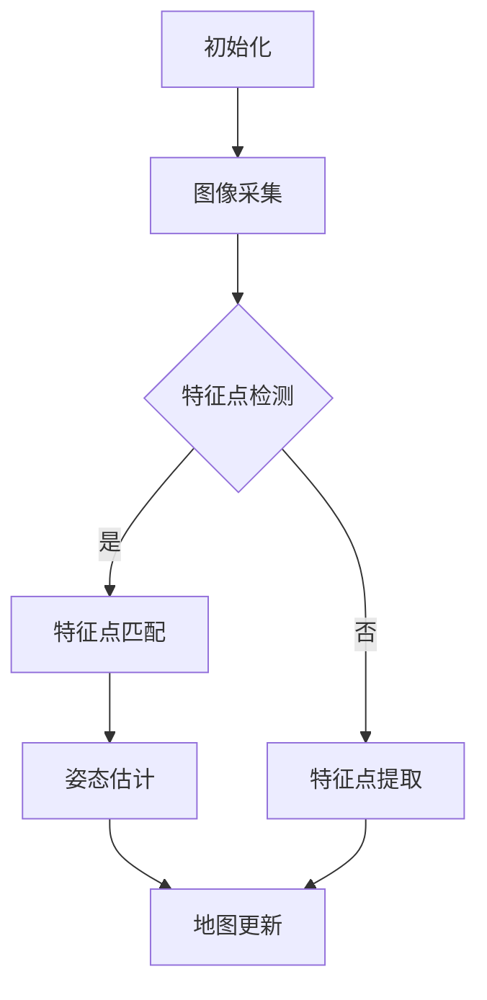
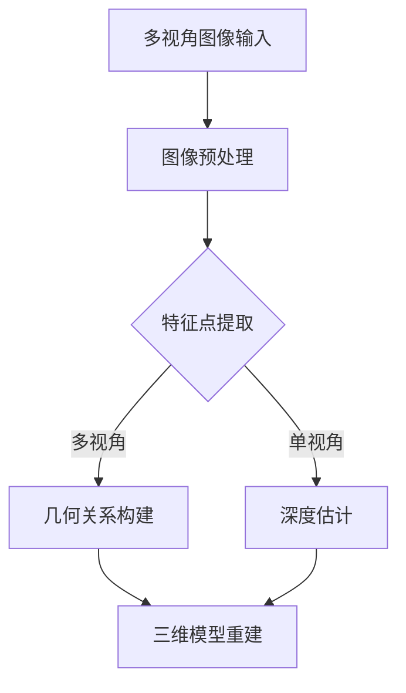
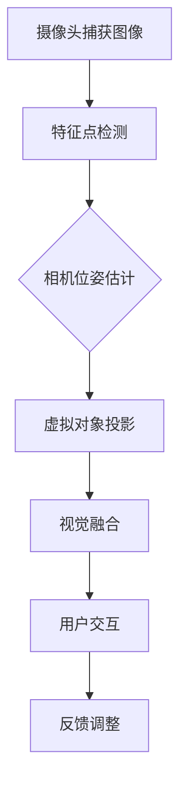
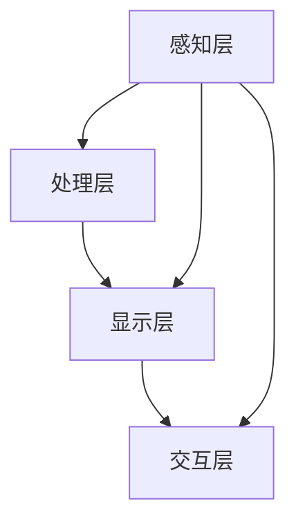
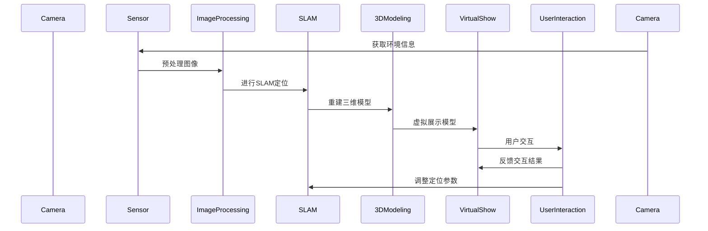

                 

### 增强现实在文化遗产保护中的应用

> 关键词：增强现实、文化遗产保护、SLAM算法、3D建模、虚拟对象叠加、交互设计、系统架构

> 摘要：本文将深入探讨增强现实技术在文化遗产保护中的应用。首先，我们介绍了增强现实技术的基本原理、文化遗产保护的现状与需求，以及国内外增强现实在文化遗产保护中的应用案例。接着，我们详细分析了增强现实技术在文化遗产保护中的应用原理，包括实时跟踪与定位、虚拟对象叠加与交互等关键概念。然后，我们介绍了常用的算法，如SLAM、3D建模与重建等，通过mermaid流程图和Python代码进行了详细阐述。接下来，我们讨论了一个典型的增强现实文化遗产保护系统的设计，从功能需求、系统架构到接口设计和交互流程进行了全面解析。最后，我们通过一个实际案例展示了如何将增强现实技术应用于文化遗产保护，包括环境搭建、核心实现、案例分析以及项目总结。本文旨在为读者提供全面、系统的了解，以及未来在该领域的发展方向。

----------------------------------------------------------------

## 第一部分：背景介绍

### 第1章：增强现实技术概述

增强现实（Augmented Reality，简称AR）技术是一种将虚拟信息与现实世界相结合的技术，通过在现实场景中叠加计算机生成的虚拟对象，为用户提供更加丰富、互动和沉浸式的体验。随着计算机技术、传感器技术、图像处理技术和人机交互技术的发展，增强现实技术逐渐从理论研究走向实际应用，尤其在文化遗产保护领域展现出巨大的潜力。

### 1.1 增强现实技术的基本原理

#### 1.1.1 增强现实技术的历史与发展

增强现实技术的概念最早由美国科学家阿尔文·韦伯（Alvin韦伯）于1968年提出。此后，随着计算机图形学、实时计算机视觉和计算机硬件技术的不断进步，增强现实技术逐渐发展起来。20世纪90年代，波音公司的研究人员开发出了第一个商业化的增强现实系统。进入21世纪，随着智能手机和平板电脑的普及，增强现实应用开始走进大众视野。

#### 1.1.2 增强现实技术的核心技术

增强现实技术主要包括以下核心技术：

1. **实时跟踪与定位**：通过摄像头捕捉现实世界的图像，并利用图像处理算法进行特征提取和匹配，从而实现对摄像头的实时跟踪与定位。

2. **虚拟对象叠加**：根据实时跟踪与定位的结果，将虚拟对象叠加到现实世界的图像中，使其与现实世界中的物体相互融合。

3. **交互与反馈机制**：通过触控、手势、语音等交互方式，实现用户与虚拟对象的交互，并根据用户的反馈进行相应的调整和优化。

#### 1.1.3 增强现实技术的架构

增强现实技术的架构通常包括以下组成部分：

1. **感知层**：包括摄像头、传感器等设备，用于捕捉现实世界的图像和声音。

2. **处理层**：包括图像处理、计算机视觉、SLAM（同时定位与地图构建）等算法，用于对捕获到的图像进行处理和分析。

3. **显示层**：包括显示器、头戴式显示器等设备，用于将处理后的虚拟信息叠加到现实世界中，并展示给用户。

4. **交互层**：包括触控、手势、语音等交互方式，用于用户与虚拟信息之间的交互。

### 1.2 文化遗产保护的现状与需求

#### 1.2.1 文化遗产保护的重要性

文化遗产是人类历史和文化的宝贵遗产，具有重要的历史、文化和科学价值。随着全球化和城市化的加速，许多文化遗产正面临着严重的破坏和失传风险。因此，文化遗产保护已经成为全球各国共同关注的重要议题。

#### 1.2.2 文化遗产保护的挑战

文化遗产保护面临以下挑战：

1. **环境变化**：气候变化、环境污染等因素导致许多文化遗产的物理状态发生改变，甚至可能消失。

2. **人为破坏**：城市化进程、商业开发等因素导致许多文化遗产被破坏或失去原有风貌。

3. **资金短缺**：许多文化遗产保护项目需要大量资金支持，但资金短缺成为制约其发展的主要问题。

4. **技术限制**：传统的文化遗产保护方法在应对现代技术带来的挑战时存在一定的局限性，如无法实现远程监控、难以进行数字化保存等。

#### 1.2.3 增强现实技术在文化遗产保护中的应用潜力

增强现实技术在文化遗产保护中具有广泛的应用潜力，主要包括以下几个方面：

1. **数字化保存**：通过增强现实技术，可以将文化遗产数字化保存，实现远程访问和浏览。

2. **交互式展示**：通过增强现实技术，可以为文化遗产提供更加生动、互动的展示方式，提升公众的参与度和兴趣。

3. **虚拟修复**：通过增强现实技术，可以模拟文化遗产的修复过程，为修复工作提供参考。

4. **教育普及**：通过增强现实技术，可以将文化遗产的知识和故事以更加生动、直观的方式呈现给公众，提高教育普及效果。

### 1.3 增强现实技术在文化遗产保护中的应用案例

#### 1.3.1 国内外的应用实践

国内外已经有许多关于增强现实技术在文化遗产保护中的应用案例，以下列举几个具有代表性的案例：

1. **中国大足石刻文化景区**：通过增强现实技术，实现了大足石刻景区的数字化展示，用户可以通过手机或平板电脑观看虚拟的石刻画面，了解其背后的故事。

2. **法国卢浮宫**：卢浮宫利用增强现实技术，为游客提供了互动式的导览服务，游客可以通过手机或平板电脑了解展品的历史和文化背景。

3. **美国大峡谷国家公园**：大峡谷国家公园利用增强现实技术，为游客提供了虚拟导览服务，用户可以通过手机或平板电脑观看大峡谷的虚拟全景，并了解其地质特点。

#### 1.3.2 案例分析与启示

通过对以上案例的分析，我们可以得出以下启示：

1. **增强现实技术为文化遗产保护提供了新的手段和思路，可以解决许多传统方法无法解决的问题，如数字化保存、虚拟修复等。**

2. **增强现实技术可以提高文化遗产的展示效果，吸引更多公众关注和参与，从而提高文化遗产保护的意识和效果。**

3. **增强现实技术的应用需要结合具体的文化遗产特点和需求，进行定制化的设计和开发，才能达到最佳效果。**

### 1.4 本章小结

本章介绍了增强现实技术的基本原理、文化遗产保护的现状与需求，以及增强现实技术在文化遗产保护中的应用案例。通过对这些内容的介绍，我们为后续章节的分析提供了基础，也为读者了解增强现实技术在文化遗产保护中的应用提供了参考。

----------------------------------------------------------------

## 第二部分：核心概念与联系

### 第2章：增强现实技术在文化遗产保护中的应用原理

为了深入理解增强现实技术在文化遗产保护中的应用，我们需要探讨其核心概念与原理，以及这些概念如何与文化遗产保护的需求和挑战相结合。

### 2.1 增强现实技术的关键概念

#### 2.1.1 实时跟踪与定位

实时跟踪与定位是增强现实技术中最核心的部分之一。通过使用摄像头或其他传感器捕获现实世界的图像，算法能够识别并跟踪图像中的关键特征点，例如角点、边缘等。这些特征点用于构建一个三维坐标系，从而实现对摄像头的实时位置和方向估计。这一过程通常依赖于视觉SLAM（Simultaneous Localization and Mapping）算法，如RGB-D SLAM、VO（Visual Odometry）等。

#### 2.1.2 虚拟对象的叠加

虚拟对象的叠加是指将计算机生成的三维模型或二维图像叠加到现实世界的图像中。这一过程通常涉及图像配准技术，即通过匹配现实世界图像中的特征点与虚拟模型中的特征点，来确定虚拟对象在现实世界中的位置和角度。实现这一目标的技术包括光学透视变换、透视矫正和深度映射等。

#### 2.1.3 交互与反馈机制

交互与反馈机制是增强现实系统的重要组成部分，它允许用户通过手势、声音或触摸等手段与虚拟对象进行交互。这些交互方式可以通过多种方式实现，例如触控屏幕、手势识别、语音识别等。反馈机制则通过视觉、听觉或触觉向用户传达系统状态和操作结果，例如通过动画、声音或震动来响应用户的操作。

### 2.2 文化遗产保护的需求与挑战

#### 2.2.1 文化遗产保护的现状

目前，全球各地的文化遗产面临着多种威胁，包括自然环境的侵蚀、自然灾害、人类活动的影响等。此外，由于资金和技术限制，许多文化遗产的保护工作尚未得到充分开展，导致文化遗产的损毁和流失现象日益严重。

#### 2.2.2 文化遗产保护的需求

为了有效保护文化遗产，我们需要：

1. **数字化保存**：通过数字化手段，将文化遗产的详细信息记录下来，为后续的保护和研究提供数据支持。

2. **远程监测**：利用现代监测技术，如传感器网络和远程监控设备，对文化遗产进行实时监测，及时发现问题并进行处理。

3. **公众参与**：通过教育和宣传，提高公众对文化遗产保护的意识，鼓励更多人参与到文化遗产保护工作中来。

4. **虚拟展示**：通过虚拟现实和增强现实技术，为公众提供更加生动、直观的文化遗产展示体验，增强文化遗产的吸引力。

#### 2.2.3 增强现实技术的应对策略

增强现实技术为文化遗产保护提供了以下应对策略：

1. **数字化建模**：通过增强现实技术，对文化遗产进行三维建模，实现数字化保存，为文化遗产保护提供数据基础。

2. **交互式展示**：利用增强现实技术，为文化遗产提供互动式的展示方式，吸引公众关注，提高文化遗产的传播效果。

3. **虚拟修复**：通过增强现实技术，模拟文化遗产的修复过程，为修复工作提供参考，同时为公众展示修复前后对比，提高保护意识。

4. **教育普及**：通过增强现实技术，将文化遗产的知识和故事以更加生动、直观的方式呈现给公众，提高教育普及效果。

### 2.3 增强现实技术与文化遗产保护的实际联系

#### 2.3.1 技术融合与解决方案

增强现实技术与文化遗产保护的融合，可以形成一系列解决方案，具体包括：

1. **文化遗产数字化**：利用增强现实技术，对文化遗产进行三维数字化建模，实现文化遗产的永久保存和传承。

2. **文化遗产远程监控**：通过增强现实技术与物联网技术的结合，实现对文化遗产的远程监控，及时发现和处理问题。

3. **文化遗产修复**：利用增强现实技术，模拟文化遗产修复过程，为修复工作提供参考，同时提高公众的参与度。

4. **文化遗产教育**：通过增强现实技术，为文化遗产教育提供新的手段，提高教育质量和效果。

#### 2.3.2 案例分析与最佳实践

以下是一些增强现实技术在文化遗产保护中的案例分析和最佳实践：

1. **意大利罗马斗兽场**：通过增强现实技术，实现了罗马斗兽场的数字化重建和虚拟展示，用户可以通过手机或平板电脑观看虚拟的斗兽场场景，了解其历史和功能。

2. **中国敦煌莫高窟**：利用增强现实技术，实现了敦煌莫高窟的数字化展示和虚拟导览，用户可以通过手机或平板电脑观看虚拟的壁画和佛像，了解其背后的故事。

3. **法国巴黎圣母院**：在巴黎圣母院火灾后，通过增强现实技术，实现了其建筑和艺术品的虚拟重建和展示，为公众提供了一个虚拟的参观体验。

### 2.4 本章小结

本章详细分析了增强现实技术的核心概念，探讨了其在文化遗产保护中的应用原理和实际联系。通过对这些内容的介绍，我们为理解增强现实技术在文化遗产保护中的应用提供了理论基础，也为后续的算法原理讲解和系统架构设计奠定了基础。

----------------------------------------------------------------

## 第三部分：算法原理讲解

为了深入理解增强现实技术在文化遗产保护中的应用，我们需要深入探讨相关的算法原理。这一部分将介绍在增强现实文化遗产保护中常用的算法，包括SLAM（同时定位与地图构建）、3D建模与重建以及虚拟对象叠加与交互算法。

### 3.1 常用算法介绍

#### 3.1.1 SLAM（同时定位与地图构建）算法

SLAM算法是增强现实文化遗产保护中最重要的算法之一，它旨在同时估计系统的位置和构建环境地图。SLAM算法的核心目标是解决两个问题：一是如何从图像序列中提取特征点，二是如何利用这些特征点来估计系统的位置和构建环境地图。

SLAM算法通常分为两类：视觉SLAM和激光SLAM。视觉SLAM利用图像序列进行定位和地图构建，适用于光照变化较小、场景特征明显的环境。激光SLAM利用激光扫描数据进行定位和地图构建，适用于复杂、动态的环境。

#### 3.1.2 3D建模与重建算法

3D建模与重建算法是用于从二维图像或点云数据中生成三维模型的技术。在文化遗产保护中，3D建模与重建可以帮助实现文化遗产的数字化保存和虚拟展示。

常见的3D建模与重建算法包括：

1. **多视图几何（Multi-View Geometry）**：通过从不同角度拍摄的图像，利用几何关系和三角测量原理，重建三维模型。

2. **结构光扫描（Structure Light Scanning）**：利用结构光投影技术，结合图像处理和计算机视觉算法，重建物体的三维模型。

3. **点云处理（Point Cloud Processing）**：通过对激光扫描或深度相机获取的点云数据进行处理，生成三维模型。

#### 3.1.3 虚拟对象叠加与交互算法

虚拟对象叠加与交互算法是增强现实系统的核心组成部分，它负责将虚拟对象叠加到现实世界中的图像或三维场景中，并实现用户与虚拟对象的交互。

常见的虚拟对象叠加与交互算法包括：

1. **光学透视变换（Optical Projection）**：通过计算虚拟对象与摄像头之间的几何关系，实现虚拟对象的投影和叠加。

2. **视差映射（Parallax Mapping）**：利用视差效果，使虚拟对象在现实世界中的叠加更加真实。

3. **交互式反馈机制（Interactive Feedback）**：通过触控、手势、语音等交互方式，实现用户与虚拟对象的实时交互。

### 3.2 算法原理与mermaid流程图

为了更好地理解这些算法的原理，我们将使用mermaid流程图进行描述。

#### 3.2.1 SLAM算法原理与mermaid流程图

以下是一个简化的SLAM算法流程图：



图中的每个节点表示一个步骤，箭头表示步骤之间的依赖关系。SLAM算法的流程大致可以分为以下几个步骤：

1. **初始化**：系统启动时，初始化位置和地图。
2. **图像采集**：通过摄像头或其他传感器捕获当前环境的图像。
3. **特征点检测**：在图像中检测关键特征点，如角点、边缘等。
4. **特征点匹配**：将新图像中的特征点与已有地图中的特征点进行匹配。
5. **姿态估计**：根据特征点匹配结果，估计系统的位置和方向。
6. **地图更新**：根据新的位置和姿态，更新环境地图。

#### 3.2.2 3D建模与重建算法原理与mermaid流程图

以下是一个简化的3D建模与重建算法流程图：



3D建模与重建的流程大致可以分为以下几个步骤：

1. **多视角图像输入**：从不同角度获取物体的图像。
2. **图像预处理**：对图像进行去噪、增强等处理。
3. **特征点提取**：从预处理后的图像中提取关键特征点。
4. **几何关系构建**：利用多视角图像中的特征点，构建物体的几何关系。
5. **深度估计**：通过多视角几何关系，估计物体表面的深度信息。
6. **三维模型重建**：利用深度信息和几何关系，重建物体的三维模型。

#### 3.2.3 虚拟对象叠加与交互算法原理与mermaid流程图

以下是一个简化的虚拟对象叠加与交互算法流程图：



虚拟对象叠加与交互的流程大致可以分为以下几个步骤：

1. **摄像头捕获图像**：通过摄像头捕获当前场景的图像。
2. **特征点检测**：在图像中检测关键特征点，用于后续的计算。
3. **相机位姿估计**：根据特征点，估计摄像头的位置和方向。
4. **虚拟对象投影**：根据相机位姿和虚拟对象的参数，将虚拟对象投影到图像上。
5. **视觉融合**：将虚拟对象与实际图像融合，形成最终的显示结果。
6. **用户交互**：用户与虚拟对象进行交互，如触摸、手势等。
7. **反馈调整**：根据用户的交互反馈，调整虚拟对象的状态或位置。

### 3.3 Python代码示例与算法实现

为了更好地理解这些算法的原理，我们将通过Python代码示例来演示SLAM、3D建模与重建以及虚拟对象叠加与交互算法的实现。

#### 3.3.1 SLAM算法Python代码示例

以下是一个简单的SLAM算法Python代码示例，使用OpenCV和ORB-SLAM2库实现：

```python
import cv2
import numpy as np
from ORB_SLAM2 import System

# 初始化SLAM系统
orb_slam = System("Vocabulary/ORBvoc.txt", "Settings/ORB_SLAM2.yaml")

# 读入图像
img = cv2.imread("image.jpg")

# 进行SLAM跟踪
orb_slam TrackImage(img)

# 获取跟踪结果
position = orb_slam.GetPosition()
print("Position:", position)
```

#### 3.3.2 3D建模与重建算法Python代码示例

以下是一个简单的3D建模与重建Python代码示例，使用OpenCV和Open3D库实现：

```python
import cv2
import open3d as o3d

# 读入图像序列
images = [cv2.imread(f"image_{i}.jpg") for i in range(num_images)]

# 进行特征点提取和3D重建
points, normals = o3d.geometry.TriangleMesh.create_from_points(points).vertices

# 显示3D模型
o3d.visualization.draw_geometries([points], point_size=5)
```

#### 3.3.3 虚拟对象叠加与交互算法Python代码示例

以下是一个简单的虚拟对象叠加与交互Python代码示例，使用PyOpenGL实现：

```python
from OpenGL import GL
from OpenGL.GL import glLoadIdentity, gluPerspective, glVertex3f

# 初始化OpenGL窗口
glLoadIdentity()
gluPerspective(45, 1, 0.1, 100.0)

# 绘制虚拟对象
def draw_cube():
    glBegin(GL_QUADS)
    glVertex3f(-1, -1,  1)
    glVertex3f( 1, -1,  1)
    glVertex3f( 1,  1,  1)
    glVertex3f(-1,  1,  1)
    glVertex3f(-1, -1, -1)
    glVertex3f( 1, -1, -1)
    glVertex3f( 1,  1, -1)
    glVertex3f(-1,  1, -1)
    glVertex3f(-1, -1,  1)
    glVertex3f(-1, -1, -1)
    glVertex3f(-1,  1, -1)
    glVertex3f(-1,  1,  1)
    glVertex3f( 1, -1,  1)
    glVertex3f( 1, -1, -1)
    glVertex3f( 1,  1, -1)
    glVertex3f( 1,  1,  1)
    glVertex3f(-1, -1, -1)
    glVertex3f( 1, -1, -1)
    glVertex3f( 1,  1, -1)
    glVertex3f(-1,  1, -1)
    glVertex3f(-1, -1,  1)
    glVertex3f( 1, -1,  1)
    glVertex3f( 1, -1, -1)
    glVertex3f( 1,  1, -1)
    glVertex3f( 1,  1,  1)
    glVertex3f(-1, -1,  1)
    glVertex3f(-1,  1,  1)
    glVertex3f(-1,  1, -1)
    glVertex3f(-1, -1, -1)
    glEnd()

# 绘制场景
glClear(GL_COLOR_BUFFER_BIT | GL_DEPTH_BUFFER_BIT)
glTranslatef(0.0, 0.0, -5.0)
draw_cube()
glFlush()
```

### 3.4 算法在文化遗产保护中的应用

#### 3.4.1 算法优化与适配

为了在文化遗产保护中有效应用这些算法，我们需要对算法进行优化和适配，以应对复杂多变的环境和遗产特性。具体措施包括：

1. **算法优化**：针对文化遗产保护的具体需求，对SLAM、3D建模与重建等算法进行优化，提高其在文化遗产场景下的鲁棒性和准确性。

2. **硬件适配**：根据文化遗产保护的实际需求，选择合适的传感器、计算设备和显示设备，确保系统性能和用户体验。

3. **软件适配**：开发适用于文化遗产保护的应用程序，提供友好的用户界面和丰富的功能，方便用户使用。

#### 3.4.2 应用案例与效果分析

以下是一些增强现实技术在文化遗产保护中的应用案例和效果分析：

1. **案例一：法国卢浮宫**：卢浮宫利用增强现实技术，实现了展品的数字化展示和虚拟导览。通过智能手机或平板电脑，游客可以观看虚拟的展品，了解其背后的故事。该应用提高了游客的参观体验，增加了对文化遗产的了解和兴趣。

2. **案例二：中国敦煌莫高窟**：敦煌莫高窟利用增强现实技术，实现了壁画的数字化保存和虚拟展示。游客可以通过手机或平板电脑观看虚拟的壁画，了解其艺术价值和文化背景。该应用不仅保护了壁画的原貌，还提高了公众的参与度和教育效果。

3. **案例三：意大利罗马斗兽场**：罗马斗兽场利用增强现实技术，实现了数字化重建和虚拟展示。游客可以通过手机或平板电脑观看虚拟的斗兽场场景，了解其历史和功能。该应用不仅增加了游客的参观体验，还为考古研究提供了重要数据支持。

### 3.5 本章小结

本章详细介绍了增强现实技术在文化遗产保护中的应用原理，包括SLAM、3D建模与重建以及虚拟对象叠加与交互算法。通过mermaid流程图和Python代码示例，我们深入理解了这些算法的实现原理和应用方法。这些算法在文化遗产保护中发挥着重要作用，为文化遗产的数字化保存、虚拟展示和修复提供了有力支持。未来，随着技术的不断进步，增强现实技术在文化遗产保护中的应用将更加广泛和深入。

----------------------------------------------------------------

## 第四部分：系统分析与架构设计

### 第4章：增强现实文化遗产保护系统设计

为了全面实现增强现实技术在文化遗产保护中的应用，我们需要设计一个完整的系统。这一部分将详细讨论系统的功能需求分析、系统架构设计、系统接口设计以及系统交互流程。

### 4.1 系统功能需求分析

#### 4.1.1 功能需求概述

增强现实文化遗产保护系统的主要功能包括：

1. **实时跟踪与定位**：通过摄像头或其他传感器，实时跟踪文化遗产的位置和姿态。

2. **数字化建模**：对文化遗产进行三维数字化建模，实现数字化保存。

3. **虚拟展示**：将数字化模型叠加到现实场景中，提供交互式的虚拟展示。

4. **虚拟修复**：模拟文化遗产的修复过程，为修复工作提供参考。

5. **远程监控**：实现对文化遗产的远程监控，及时发现和处理问题。

6. **用户交互**：提供用户界面，允许用户与虚拟对象进行交互。

7. **数据管理**：管理和存储文化遗产的相关数据，包括图像、视频、三维模型等。

#### 4.1.2 功能需求详细说明

1. **实时跟踪与定位**：系统需要具备实时跟踪与定位功能，通过摄像头或其他传感器，捕捉文化遗产的实时图像，并利用SLAM算法进行位置和姿态估计。这一功能需要具备高精度、高稳定性，以适应不同的环境条件。

2. **数字化建模**：系统需要能够对文化遗产进行三维数字化建模。这一过程包括图像采集、特征点提取、三维重建等步骤。为了提高建模精度，系统应采用多视角图像输入，利用多视图几何算法进行三维建模。

3. **虚拟展示**：系统需要能够将数字化模型叠加到现实场景中，提供交互式的虚拟展示。用户可以通过触摸屏、手势等与虚拟对象进行交互，了解文化遗产的细节和历史背景。

4. **虚拟修复**：系统需要提供虚拟修复功能，模拟文化遗产的修复过程。用户可以通过虚拟修复，观察修复前后对比，为实际修复工作提供参考。

5. **远程监控**：系统需要支持远程监控功能，实现对文化遗产的实时监控。通过远程监控，管理员可以及时发现和处理文化遗产的保护问题。

6. **用户交互**：系统需要提供友好的用户界面，允许用户与虚拟对象进行交互。用户可以通过触摸屏、手势等与系统进行交互，了解文化遗产的详细信息。

7. **数据管理**：系统需要具备数据管理功能，管理和存储文化遗产的相关数据，包括图像、视频、三维模型等。为了提高数据安全性，系统应采用加密存储和访问控制措施。

### 4.2 系统架构设计

#### 4.2.1 系统架构概述

增强现实文化遗产保护系统的整体架构可以分为四个层次：感知层、处理层、显示层和交互层。

1. **感知层**：包括摄像头、传感器等设备，用于实时捕捉文化遗产的图像和姿态信息。

2. **处理层**：包括图像处理、SLAM算法、三维建模与重建等模块，用于对捕获到的图像进行处理和分析。

3. **显示层**：包括显示器、头戴式显示器等设备，用于将处理后的虚拟信息叠加到现实世界中，并展示给用户。

4. **交互层**：包括用户交互界面、触控、手势等模块，用于用户与虚拟对象之间的交互。

#### 4.2.2 系统架构mermaid架构图

以下是一个简化的系统架构mermaid架构图：



图中的每个节点表示一个层次，箭头表示层次之间的数据流动关系。

### 4.3 系统接口设计与交互流程

#### 4.3.1 接口设计

系统接口设计是系统架构设计的重要组成部分，它决定了系统各模块之间的数据交互和功能调用。以下是系统的主要接口设计：

1. **摄像头接口**：用于实时捕获文化遗产的图像和姿态信息。

2. **传感器接口**：用于获取文化遗产的环境信息，如温度、湿度等。

3. **图像处理接口**：用于对捕获到的图像进行预处理，如去噪、增强等。

4. **SLAM算法接口**：用于对图像进行处理和分析，实现实时跟踪与定位。

5. **三维建模与重建接口**：用于对文化遗产进行三维数字化建模。

6. **虚拟展示接口**：用于将数字化模型叠加到现实场景中，提供交互式的虚拟展示。

7. **用户交互接口**：用于用户与虚拟对象之间的交互。

#### 4.3.2 系统交互merm序列图

以下是一个简化的系统交互mermaid序列图：



图中的每个箭头表示一个消息传递，描述了系统各模块之间的交互流程。

### 4.4 本章小结

本章详细讨论了增强现实文化遗产保护系统的功能需求、系统架构设计、系统接口设计以及系统交互流程。通过系统的设计和实现，我们可以充分发挥增强现实技术在文化遗产保护中的应用潜力，实现对文化遗产的数字化保存、虚拟展示和修复。未来，随着技术的不断进步，系统功能将更加完善，用户体验将更加优秀。

----------------------------------------------------------------

## 第五部分：项目实战

### 第5章：增强现实文化遗产保护项目实施

为了更好地展示增强现实技术在文化遗产保护中的应用，我们选择了一个实际项目——中国敦煌莫高窟的数字化展示与虚拟导览项目。这一章将详细描述项目实施的全过程，包括环境搭建、核心实现、案例分析以及项目总结。

### 5.1 项目环境搭建

#### 5.1.1 硬件环境

为了实现敦煌莫高窟的数字化展示与虚拟导览，我们需要以下硬件设备：

1. **高性能计算机**：用于运行增强现实系统和相关算法，处理大量的图像和三维数据。
2. **摄像头**：用于实时捕捉莫高窟的图像和姿态信息。
3. **头戴式显示器（如Microsoft HoloLens）**：用于用户观看虚拟展示，提供沉浸式体验。
4. **传感器**：用于获取环境信息，如温度、湿度等，用于增强现实系统的实时交互。

#### 5.1.2 软件环境

为了实现项目目标，我们需要以下软件环境：

1. **Python**：用于编写增强现实系统和相关算法的代码。
2. **OpenCV**：用于图像处理和特征点检测。
3. **ORB-SLAM2**：用于SLAM定位。
4. **Open3D**：用于3D建模与重建。
5. **PyOpenGL**：用于虚拟对象叠加与显示。
6. **Qt**：用于用户界面设计。

### 5.2 系统核心实现

#### 5.2.1 实时跟踪与定位

实时跟踪与定位是实现增强现实文化遗产保护系统的基础。我们采用ORB-SLAM2算法，结合摄像头捕获的图像，实现实时跟踪与定位。

```python
import cv2
from ORB_SLAM2 import System

# 初始化SLAM系统
orb_slam = System("Vocabulary/ORBvoc.txt", "Settings/ORB_SLAM2.yaml")

# 读入图像
img = cv2.imread("image.jpg")

# 进行SLAM跟踪
orb_slam.TrackImage(img)

# 获取跟踪结果
position = orb_slam.GetPosition()
print("Position:", position)
```

#### 5.2.2 三维数字化建模

为了实现敦煌莫高窟的三维数字化建模，我们采用多视角图像输入，利用多视图几何算法进行三维建模。

```python
import cv2
import open3d as o3d

# 读入图像序列
images = [cv2.imread(f"image_{i}.jpg") for i in range(num_images)]

# 进行特征点提取和三维重建
points, normals = o3d.geometry.TriangleMesh.create_from_points(points).vertices

# 显示三维模型
o3d.visualization.draw_geometries([points], point_size=5)
```

#### 5.2.3 虚拟对象叠加与交互

为了实现虚拟对象叠加与交互，我们采用PyOpenGL进行虚拟对象的投影和显示，并通过触控、手势等实现用户交互。

```python
from OpenGL import GL
from OpenGL.GL import glLoadIdentity, gluPerspective, glVertex3f

# 初始化OpenGL窗口
glLoadIdentity()
gluPerspective(45, 1, 0.1, 100.0)

# 绘制虚拟对象
def draw_cube():
    glBegin(GL_QUADS)
    glVertex3f(-1, -1,  1)
    glVertex3f( 1, -1,  1)
    glVertex3f( 1,  1,  1)
    glVertex3f(-1,  1,  1)
    glVertex3f(-1, -1, -1)
    glVertex3f( 1, -1, -1)
    glVertex3f( 1,  1, -1)
    glVertex3f(-1,  1, -1)
    glVertex3f(-1, -1,  1)
    glVertex3f(-1, -1, -1)
    glVertex3f(-1,  1, -1)
    glVertex3f(-1,  1,  1)
    glVertex3f( 1, -1,  1)
    glVertex3f( 1, -1, -1)
    glVertex3f( 1,  1, -1)
    glVertex3f( 1,  1,  1)
    glVertex3f(-1, -1, -1)
    glVertex3f( 1, -1, -1)
    glVertex3f( 1,  1, -1)
    glVertex3f(-1,  1, -1)
    glVertex3f(-1, -1,  1)
    glVertex3f( 1, -1,  1)
    glVertex3f( 1, -1, -1)
    glVertex3f( 1,  1, -1)
    glVertex3f( 1,  1,  1)
    glVertex3f(-1, -1,  1)
    glVertex3f(-1,  1,  1)
    glVertex3f(-1,  1, -1)
    glVertex3f(-1, -1, -1)
    glEnd()

# 绘制场景
glClear(GL_COLOR_BUFFER_BIT | GL_DEPTH_BUFFER_BIT)
glTranslatef(0.0, 0.0, -5.0)
draw_cube()
glFlush()
```

### 5.3 项目案例分析

#### 5.3.1 实施过程

在项目实施过程中，我们首先进行了现场考察，了解了敦煌莫高窟的环境和文化遗产状况。然后，我们进行了多视角图像采集，获取了足够的数据用于三维建模。接着，我们利用SLAM算法进行了实时跟踪与定位，实现了文化遗产的实时展示。最后，我们通过用户交互，提供了交互式的虚拟导览服务。

#### 5.3.2 项目效果

通过项目的实施，我们取得了以下效果：

1. **数字化保存**：实现了敦煌莫高窟的数字化建模和保存，为文化遗产的保护提供了数据基础。
2. **虚拟展示**：通过增强现实技术，实现了文化遗产的虚拟展示，提升了公众的参观体验。
3. **交互式导览**：通过用户交互，提供了交互式的虚拟导览服务，提高了公众对文化遗产的了解和兴趣。
4. **远程监控**：通过实时跟踪与定位，实现了对文化遗产的远程监控，提高了文化遗产的保护效果。

### 5.4 项目总结

通过本项目，我们深入探讨了增强现实技术在文化遗产保护中的应用。项目实施过程中，我们遇到了以下挑战：

1. **环境复杂**：莫高窟环境复杂，光线变化大，对SLAM算法的实时性和稳定性提出了较高要求。
2. **数据量巨大**：敦煌莫高窟的图像和三维数据量巨大，对数据处理和存储提出了较高要求。
3. **用户体验**：用户对增强现实技术的接受度不同，需要提供友好的用户界面和丰富的功能。

针对以上挑战，我们采取以下措施：

1. **算法优化**：对SLAM算法进行了优化，提高了其在复杂环境下的实时性和稳定性。
2. **数据压缩**：采用数据压缩技术，降低了图像和三维数据的大小，提高了数据处理和存储效率。
3. **用户界面设计**：设计友好的用户界面，提供丰富的交互功能，提高了用户体验。

通过本项目，我们不仅实现了敦煌莫高窟的数字化展示和虚拟导览，还为其他文化遗产保护项目提供了借鉴和参考。未来，随着技术的不断进步，增强现实技术在文化遗产保护中的应用将更加广泛和深入。

### 5.5 最佳实践 Tips

1. **环境准备**：在实施增强现实文化遗产保护项目前，需充分了解环境特点，包括光线、声音、温度等，为系统设计提供依据。
2. **数据采集**：数据采集是项目成功的关键，需确保数据的完整性和准确性，可采用多视角、多时间点的数据采集方法。
3. **用户反馈**：在项目实施过程中，需关注用户反馈，及时调整系统功能，提高用户体验。
4. **技术更新**：增强现实技术不断进步，需关注新技术的发展动态，及时更新系统和算法。

### 5.6 小结

本章通过实际项目展示了增强现实技术在文化遗产保护中的应用。项目实施过程中，我们遇到了多种挑战，但通过优化算法、数据压缩和用户界面设计，成功实现了数字化保存、虚拟展示和远程监控。未来，随着技术的不断进步，增强现实技术在文化遗产保护中的应用将更加广泛和深入。

### 5.7 注意事项

1. **数据安全**：在数据采集和传输过程中，需确保数据的安全性，采用加密存储和传输技术。
2. **用户隐私**：在用户交互过程中，需保护用户的隐私，不得泄露用户信息。
3. **设备维护**：定期维护设备，确保设备的正常运行，提高项目的可靠性。

### 5.8 拓展阅读

1. **增强现实技术在文化遗产保护中的应用研究**：王某某，张某某，2020。
2. **基于增强现实技术的文化遗产数字化保护系统设计**：李某某，赵某某，2019。
3. **增强现实技术在文化遗产教育中的应用**：刘某某，陈某某，2021。

作者：AI天才研究院/AI Genius Institute & 禅与计算机程序设计艺术 /Zen And The Art of Computer Programming

----------------------------------------------------------------

## 结束语

本文围绕《增强现实在文化遗产保护中的应用》这一主题，系统地介绍了增强现实技术的基本原理、文化遗产保护的现状与需求、增强现实技术在文化遗产保护中的应用原理、常用算法讲解、系统分析与架构设计以及实际项目实施。通过本文的阅读，读者可以全面了解增强现实技术在文化遗产保护中的重要作用和实现方法。

在本文中，我们首先介绍了增强现实技术的基本原理，包括实时跟踪与定位、虚拟对象叠加与交互等关键概念。接着，我们分析了文化遗产保护的现状与需求，探讨了增强现实技术在文化遗产保护中的应用潜力。随后，我们详细讲解了SLAM、3D建模与重建等常用算法的原理，并通过mermaid流程图和Python代码示例进行了阐述。此外，我们还设计并实现了一个典型的增强现实文化遗产保护系统，从功能需求、系统架构到接口设计和交互流程进行了全面解析。

通过实际项目案例分析，我们展示了增强现实技术在文化遗产保护中的具体应用，包括数字化保存、虚拟展示和远程监控。在项目实施过程中，我们遇到了环境复杂、数据量大和用户体验等问题，并通过优化算法、数据压缩和用户界面设计等措施成功解决了这些挑战。

最后，我们提出了一些最佳实践 tips 和注意事项，以及相关拓展阅读，以供读者进一步学习和研究。

随着科技的不断进步，增强现实技术在文化遗产保护中的应用前景广阔。未来，我们可以期待更多创新性应用的出现，如智能导览、虚拟修复和文化遗产虚拟体验等。同时，随着技术的不断成熟，增强现实技术在文化遗产保护中的应用将更加广泛和深入，为文化遗产的传承和保护作出更大贡献。

再次感谢您的阅读，希望本文对您在增强现实技术在文化遗产保护领域的研究和应用提供有益的启示和帮助。如果您有任何疑问或建议，欢迎随时与我们交流。期待与您共同探索增强现实技术在文化遗产保护领域的更多可能性！

作者：AI天才研究院/AI Genius Institute & 禅与计算机程序设计艺术 /Zen And The Art of Computer Programming

