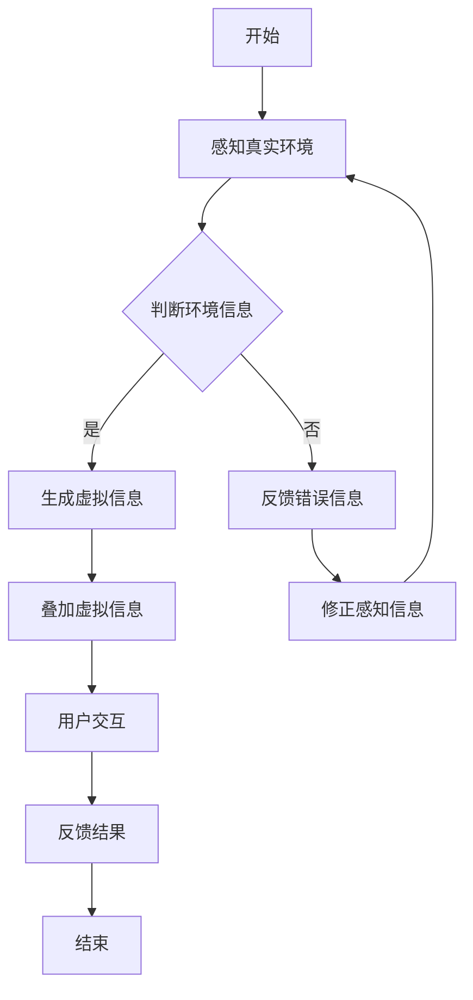
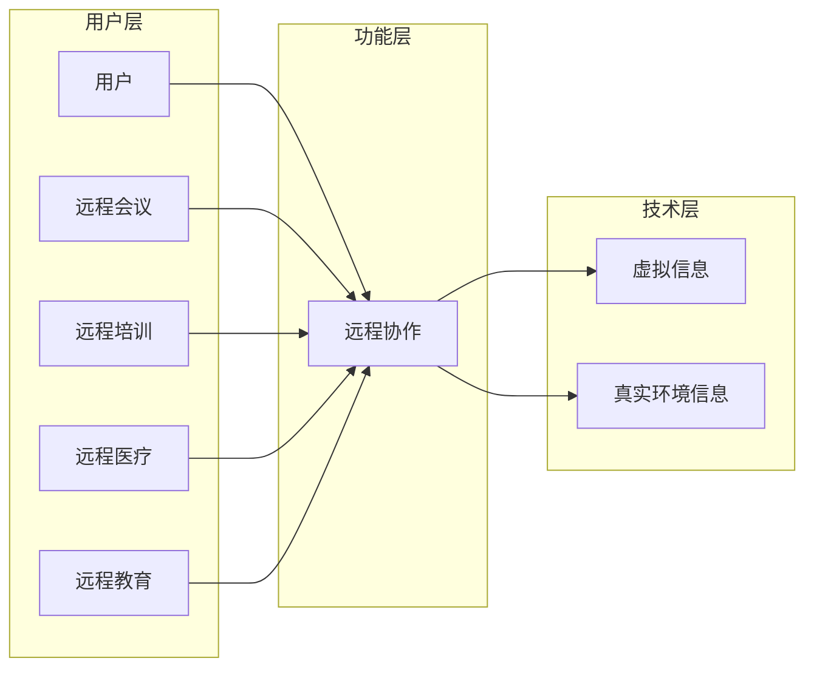
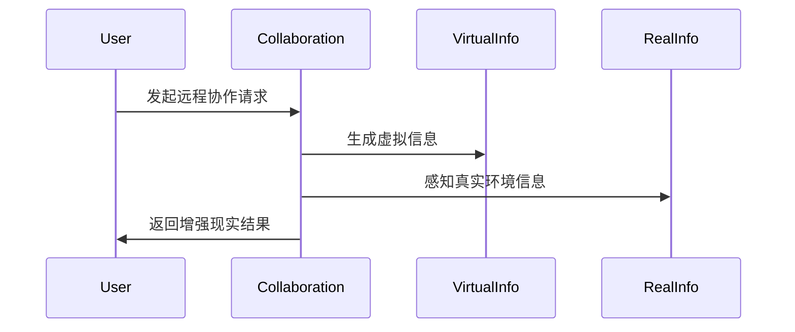

                 

### 文章标题：增强现实在远程协作中的应用前景

> 关键词：增强现实，远程协作，应用前景，技术挑战

> 摘要：本文将深入探讨增强现实（AR）技术在远程协作中的应用前景。首先，我们将回顾增强现实技术的发展背景和核心原理，然后分析远程协作的需求和现状，接着介绍增强现实在远程协作中的具体应用，探讨其优势与面临的挑战，并总结出应对策略。最后，我们展望增强现实远程协作的未来发展趋势，为行业发展提供参考。

## 目录大纲

### 第一部分：增强现实与远程协作概述

#### 第1章：增强现实技术介绍
- 1.1 增强现实技术的发展背景
- 1.2 增强现实技术的核心原理
- 1.3 增强现实技术的分类
- 1.4 增强现实技术的应用领域

#### 第2章：远程协作中的增强现实应用
- 2.1 远程协作的概念和需求
- 2.2 增强现实在远程协作中的应用
- 2.3 增强现实远程协作的优势
- 2.4 增强现实远程协作的挑战与解决策略

### 第二部分：增强现实在远程协作中的应用实践

#### 第3章：增强现实在远程会议中的应用
- 3.1 远程会议的现状和问题
- 3.2 增强现实远程会议的技术实现
- 3.3 增强现实远程会议的案例研究
- 3.4 增强现实远程会议的未来发展趋势

#### 第4章：增强现实在远程培训中的应用
- 4.1 远程培训的需求和挑战
- 4.2 增强现实远程培训的技术实现
- 4.3 增强现实远程培训的案例研究
- 4.4 增强现实远程培训的创新思路

#### 第5章：增强现实在远程医疗中的应用
- 5.1 远程医疗的现状和问题
- 5.2 增强现实远程医疗的技术实现
- 5.3 增强现实远程医疗的案例研究
- 5.4 增强现实远程医疗的未来发展趋势

#### 第6章：增强现实在远程教育中的应用
- 6.1 远程教育的需求和发展趋势
- 6.2 增强现实远程教育的技术实现
- 6.3 增强现实远程教育的案例研究
- 6.4 增强现实远程教育的创新思路

#### 第7章：增强现实在远程协作中的综合应用
- 7.1 增强现实在远程协作中的整体应用场景
- 7.2 增强现实远程协作的关键技术
- 7.3 增强现实远程协作的案例分析
- 7.4 增强现实远程协作的未来发展展望

#### 第8章：增强现实在远程协作中的应用前景与挑战
- 8.1 增强现实在远程协作中的应用前景
- 8.2 增强现实远程协作面临的挑战
- 8.3 应对挑战的策略和建议
- 8.4 增强现实远程协作的未来发展趋势

### 第一部分：增强现实与远程协作概述

#### 第1章：增强现实技术介绍

1.1 增强现实技术的发展背景

增强现实（Augmented Reality，简称AR）技术起源于上世纪90年代，最初由波音等公司用于军事训练。随着计算机技术、显示技术、传感器技术和网络技术的发展，AR技术逐渐成熟并开始应用于各行各业。近年来，随着智能手机和平板电脑的普及，AR技术得到了快速发展，并逐步渗透到日常生活和工作中。

1.2 增强现实技术的核心原理

增强现实技术通过将虚拟信息与真实环境实时融合，提供了一种全新的交互方式。其核心原理包括：

- **感知技术**：通过摄像头、传感器等设备获取真实环境的信息。
- **渲染技术**：利用计算机图形学技术生成虚拟信息。
- **融合技术**：将虚拟信息与真实环境实时融合，实现虚拟与现实的互动。
- **交互技术**：通过手势、语音等交互方式，实现用户与虚拟信息的交互。

1.3 增强现实技术的分类

增强现实技术可以分为以下几类：

- **标记增强现实**：通过标记物（如二维码、标签等）实现虚拟信息与真实环境的融合。
- **无标记增强现实**：无需标记物，通过环境感知技术实现虚拟信息与真实环境的融合。
- **投影增强现实**：通过投影设备将虚拟信息投影到真实环境中。
- **混合增强现实**：结合多种增强现实技术，提供更加丰富的交互体验。

1.4 增强现实技术的应用领域

增强现实技术具有广泛的应用前景，包括但不限于：

- **娱乐**：游戏、影视、虚拟旅游等。
- **教育**：虚拟课堂、互动教学、医学教育等。
- **医疗**：远程手术指导、医疗培训、健康管理等。
- **工业**：远程协作、设备维修、产品设计等。
- **军事**：军事训练、模拟仿真、战场情报等。

### 第2章：远程协作中的增强现实应用

2.1 远程协作的概念和需求

远程协作是指利用信息技术，实现地理位置分散的个体或团队之间的协同工作。随着全球化进程的加速和远程办公的普及，远程协作成为现代企业运营的重要形式。远程协作的需求主要包括：

- **跨地域沟通**：打破地域限制，实现全球范围内的协作。
- **资源共享**：实现数据、文档、设备等资源的共享。
- **提高效率**：减少通勤时间，提高工作效率。
- **降低成本**：减少办公场所和设备的投入。

2.2 增强现实在远程协作中的应用

增强现实技术可以提供更加直观、高效的远程协作方式，具体应用包括：

- **远程会议**：通过AR技术，实现远程参会者之间的实时互动，提高会议效率。
- **远程培训**：通过AR技术，实现培训内容的可视化、互动化，提高培训效果。
- **远程医疗**：通过AR技术，实现远程医生与患者的实时互动，提高医疗服务质量。
- **远程教育**：通过AR技术，实现教育资源的共享和互动，提高教育效果。

2.3 增强现实远程协作的优势

增强现实远程协作具有以下优势：

- **直观性**：通过虚拟信息与真实环境的融合，提供更加直观的交互体验。
- **互动性**：通过实时互动，提高协作的效率和质量。
- **扩展性**：可以应用于多种场景，具有广泛的适应性。
- **个性化**：可以根据用户需求，定制个性化的协作方式。

2.4 增强现实远程协作的挑战与解决策略

增强现实远程协作面临以下挑战：

- **技术成熟度**：当前增强现实技术尚未完全成熟，需要进一步研发和优化。
- **设备成本**：增强现实设备价格较高，需要降低成本以普及应用。
- **网络环境**：需要稳定的网络环境支持，否则会影响协作效果。
- **隐私保护**：需要保护用户的隐私信息，避免泄露。

解决策略包括：

- **技术优化**：加大研发投入，提高增强现实技术的成熟度和性能。
- **成本控制**：通过规模化生产，降低增强现实设备的成本。
- **网络优化**：提高网络速度和稳定性，为增强现实远程协作提供良好的网络环境。
- **隐私保护**：加强数据加密和安全保护，确保用户隐私不受侵犯。

### 第二部分：增强现实在远程协作中的应用实践

#### 第3章：增强现实在远程会议中的应用

3.1 远程会议的现状和问题

远程会议已成为现代企业、组织和团队开展日常工作和沟通的重要方式。然而，传统远程会议仍存在以下问题：

- **互动性不足**：传统远程会议主要依赖于语音和文字交流，缺乏直观的视觉互动。
- **信息传达效果差**：远程参会者难以全面、直观地了解会议内容和进度。
- **协作效率低**：参会者难以实时协作，影响会议决策和执行。

3.2 增强现实远程会议的技术实现

增强现实远程会议通过以下技术实现：

- **感知技术**：通过摄像头、传感器等设备，获取参会者的实时信息。
- **渲染技术**：利用计算机图形学技术，生成虚拟信息。
- **融合技术**：将虚拟信息与参会者的真实环境实时融合，实现虚拟与现实的互动。
- **交互技术**：通过手势、语音等交互方式，实现参会者之间的实时互动。

3.3 增强现实远程会议的案例研究

以下是一个增强现实远程会议的案例：

**案例**：某公司在全球范围内设有多个分支机构，为了提高分支机构之间的协作效率，采用了一款基于增强现实技术的远程会议系统。该系统可以实现以下功能：

- **实时互动**：通过虚拟信息与真实环境的融合，实现参会者之间的实时互动，提高会议效率。
- **可视化展示**：通过虚拟信息展示会议内容，使参会者能够更加直观地了解会议进展。
- **协同办公**：参会者可以通过增强现实远程会议系统，实时协同办公，共同完成会议决策和执行。

3.4 增强现实远程会议的未来发展趋势

未来，增强现实远程会议将呈现以下发展趋势：

- **技术成熟度提高**：随着增强现实技术的不断发展，远程会议系统的性能和稳定性将得到大幅提升。
- **应用场景拓展**：增强现实远程会议将应用于更多场景，如跨地域协作、远程办公等。
- **智能化**：增强现实远程会议系统将具备更多的智能化功能，如智能语音识别、智能会议助理等。
- **个性化**：增强现实远程会议系统将更加注重用户体验，提供个性化的会议服务。

#### 第4章：增强现实在远程培训中的应用

4.1 远程培训的需求和挑战

远程培训是一种通过互联网等信息技术，实现培训资源远程共享和互动的教学方式。随着远程培训的普及，其需求不断增加，但同时也面临以下挑战：

- **互动性不足**：传统远程培训主要依赖于文字、图片、视频等媒体形式，缺乏直观的视觉互动。
- **学习效果差**：远程培训难以激发学生的学习兴趣，导致学习效果不佳。
- **培训资源不足**：部分远程培训资源质量不高，难以满足培训需求。

4.2 增强现实远程培训的技术实现

增强现实远程培训通过以下技术实现：

- **感知技术**：通过摄像头、传感器等设备，获取培训场景和学生的实时信息。
- **渲染技术**：利用计算机图形学技术，生成虚拟培训内容。
- **融合技术**：将虚拟培训内容与真实环境实时融合，实现虚拟与现实的互动。
- **交互技术**：通过手势、语音等交互方式，实现学生与培训内容的实时互动。

4.3 增强现实远程培训的案例研究

以下是一个增强现实远程培训的案例：

**案例**：某培训机构开发了一款基于增强现实技术的远程培训系统，该系统具有以下功能：

- **互动性**：通过虚拟培训内容与真实环境的融合，实现学生与培训内容的实时互动，提高学习兴趣。
- **可视化**：通过虚拟培训内容展示，使学生能够更加直观地了解培训内容，提高学习效果。
- **个性化**：根据学生的学习需求，提供个性化的培训服务，满足不同层次学生的需求。

4.4 增强现实远程培训的创新思路

未来，增强现实远程培训将呈现以下创新思路：

- **智能化**：利用人工智能技术，实现培训内容的智能推荐、智能辅导等。
- **虚拟实践**：通过增强现实技术，实现培训场景的虚拟化，提供虚拟实践机会，提高学生实践能力。
- **跨界融合**：将增强现实技术与教育、医疗、旅游等领域深度融合，提供跨界培训服务。
- **多元化**：提供丰富多样的培训形式，满足不同年龄段、不同职业领域的培训需求。

### 第5章：增强现实在远程医疗中的应用

5.1 远程医疗的现状和问题

远程医疗是指利用信息技术，实现医疗资源的远程共享和医疗服务。随着远程医疗的普及，其应用范围不断扩大，但仍面临以下问题：

- **医疗资源分布不均**：部分地区医疗资源匮乏，患者就医困难。
- **医疗服务质量不稳定**：远程医疗服务质量参差不齐，部分服务难以满足患者需求。
- **患者隐私保护**：远程医疗服务过程中，患者隐私保护难度较大。

5.2 增强现实远程医疗的技术实现

增强现实远程医疗通过以下技术实现：

- **感知技术**：通过摄像头、传感器等设备，获取患者的实时信息。
- **渲染技术**：利用计算机图形学技术，生成虚拟医疗信息。
- **融合技术**：将虚拟医疗信息与真实环境实时融合，实现虚拟与现实的互动。
- **交互技术**：通过手势、语音等交互方式，实现医生与患者的实时互动。

5.3 增强现实远程医疗的案例研究

以下是一个增强现实远程医疗的案例：

**案例**：某医疗机构采用了一款基于增强现实技术的远程医疗系统，该系统可以实现以下功能：

- **实时互动**：通过虚拟医疗信息与真实环境的融合，实现医生与患者的实时互动，提高医疗服务质量。
- **可视化诊断**：通过虚拟医疗信息展示，使医生能够更加直观地了解患者病情，提高诊断准确性。
- **远程手术指导**：通过虚拟信息与真实环境的融合，实现远程手术的实时互动和指导，提高手术成功率。

5.4 增强现实远程医疗的未来发展趋势

未来，增强现实远程医疗将呈现以下发展趋势：

- **技术成熟度提高**：随着增强现实技术的不断发展，远程医疗系统的性能和稳定性将得到大幅提升。
- **应用场景拓展**：增强现实远程医疗将应用于更多场景，如家庭医疗、应急救援等。
- **智能化**：增强现实远程医疗系统将具备更多的智能化功能，如智能诊断、智能治疗等。
- **隐私保护**：加强远程医疗服务过程中的隐私保护，确保患者信息安全。

### 第6章：增强现实在远程教育中的应用

6.1 远程教育的需求和发展趋势

远程教育是指通过互联网等信息技术，实现教育资源的远程共享和教学。随着远程教育的普及，其需求和发展趋势如下：

- **教育资源共享**：远程教育可以实现优质教育资源的共享，提高教育公平性。
- **个性化学习**：远程教育可以根据学生需求，提供个性化的学习服务，提高学习效果。
- **便捷性**：远程教育不受时间和地点限制，为学生提供更加便捷的学习方式。

6.2 增强现实远程教育的技术实现

增强现实远程教育通过以下技术实现：

- **感知技术**：通过摄像头、传感器等设备，获取教育场景和学生的实时信息。
- **渲染技术**：利用计算机图形学技术，生成虚拟教育内容。
- **融合技术**：将虚拟教育内容与真实环境实时融合，实现虚拟与现实的互动。
- **交互技术**：通过手势、语音等交互方式，实现学生与教育内容的实时互动。

6.3 增强现实远程教育的案例研究

以下是一个增强现实远程教育的案例：

**案例**：某教育机构采用了一款基于增强现实技术的远程教育系统，该系统具有以下功能：

- **互动性**：通过虚拟教育内容与真实环境的融合，实现学生与教育内容的实时互动，提高学习兴趣。
- **可视化**：通过虚拟教育内容展示，使学生能够更加直观地了解教育内容，提高学习效果。
- **实践操作**：通过增强现实技术，实现教育场景的虚拟化，提供实践操作机会，提高学生实践能力。

6.4 增强现实远程教育的创新思路

未来，增强现实远程教育将呈现以下创新思路：

- **智能化**：利用人工智能技术，实现教育内容的智能推荐、智能辅导等。
- **虚拟实践**：通过增强现实技术，实现教育场景的虚拟化，提供虚拟实践机会，提高学生实践能力。
- **跨界融合**：将增强现实技术与教育、医疗、旅游等领域深度融合，提供跨界教育服务。
- **多元化**：提供丰富多样的教育形式，满足不同年龄段、不同职业领域的教育需求。

### 第7章：增强现实在远程协作中的综合应用

7.1 增强现实在远程协作中的整体应用场景

增强现实技术在远程协作中具有广泛的应用场景，包括：

- **远程会议**：通过增强现实技术实现远程参会者之间的实时互动，提高会议效率。
- **远程培训**：通过增强现实技术实现培训内容的可视化、互动化，提高培训效果。
- **远程医疗**：通过增强现实技术实现医生与患者的实时互动，提高医疗服务质量。
- **远程教育**：通过增强现实技术实现教育资源的共享和互动，提高教育效果。

7.2 增强现实远程协作的关键技术

增强现实远程协作的关键技术包括：

- **感知技术**：通过摄像头、传感器等设备，获取远程协作的实时信息。
- **渲染技术**：利用计算机图形学技术，生成虚拟协作内容。
- **融合技术**：将虚拟协作内容与真实环境实时融合，实现虚拟与现实的互动。
- **交互技术**：通过手势、语音等交互方式，实现远程协作的实时互动。

7.3 增强现实远程协作的案例分析

以下是一个增强现实远程协作的案例：

**案例**：某跨国公司采用了一款基于增强现实技术的远程协作系统，该系统实现以下功能：

- **实时互动**：通过虚拟协作内容与真实环境的融合，实现团队成员之间的实时互动，提高协作效率。
- **可视化展示**：通过虚拟协作内容展示，使团队成员能够更加直观地了解协作内容，提高协作效果。
- **协同办公**：通过增强现实远程协作系统，实现团队成员的实时协同办公，共同完成项目任务。

7.4 增强现实远程协作的未来发展展望

未来，增强现实远程协作将呈现以下发展趋势：

- **技术成熟度提高**：随着增强现实技术的不断发展，远程协作系统的性能和稳定性将得到大幅提升。
- **应用场景拓展**：增强现实远程协作将应用于更多场景，如远程设计、远程项目管理等。
- **智能化**：增强现实远程协作系统将具备更多的智能化功能，如智能语音识别、智能协作建议等。
- **个性化**：增强现实远程协作系统将更加注重用户体验，提供个性化的协作服务。

### 第8章：增强现实在远程协作中的应用前景与挑战

8.1 增强现实在远程协作中的应用前景

随着增强现实技术的不断发展，其在远程协作中的应用前景非常广阔。以下是一些潜在的应用领域：

- **远程会议**：通过增强现实技术实现更加直观、高效的远程会议。
- **远程培训**：通过增强现实技术实现更加生动、有趣的远程培训。
- **远程医疗**：通过增强现实技术实现更加精准、高效的远程医疗服务。
- **远程教育**：通过增强现实技术实现更加丰富、多样的远程教育资源。

8.2 增强现实远程协作面临的挑战

尽管增强现实技术在远程协作中具有巨大的应用前景，但同时也面临以下挑战：

- **技术成熟度**：当前增强现实技术尚未完全成熟，需要进一步研发和优化。
- **设备成本**：增强现实设备价格较高，需要降低成本以普及应用。
- **网络环境**：需要稳定的网络环境支持，否则会影响协作效果。
- **隐私保护**：需要保护用户的隐私信息，避免泄露。

8.3 应对挑战的策略和建议

为应对增强现实远程协作面临的挑战，以下是一些建议：

- **技术优化**：加大研发投入，提高增强现实技术的成熟度和性能。
- **成本控制**：通过规模化生产，降低增强现实设备的成本。
- **网络优化**：提高网络速度和稳定性，为增强现实远程协作提供良好的网络环境。
- **隐私保护**：加强数据加密和安全保护，确保用户隐私不受侵犯。

8.4 增强现实远程协作的未来发展趋势

未来，增强现实远程协作将呈现以下发展趋势：

- **技术成熟度提高**：随着增强现实技术的不断发展，远程协作系统的性能和稳定性将得到大幅提升。
- **应用场景拓展**：增强现实远程协作将应用于更多场景，如远程设计、远程项目管理等。
- **智能化**：增强现实远程协作系统将具备更多的智能化功能，如智能语音识别、智能协作建议等。
- **个性化**：增强现实远程协作系统将更加注重用户体验，提供个性化的协作服务。

### 总结

增强现实技术在远程协作中的应用前景广阔，具有直观性、互动性、扩展性和个性化等优势。然而，仍面临技术成熟度、设备成本、网络环境和隐私保护等挑战。通过技术优化、成本控制、网络优化和隐私保护等措施，可以应对这些挑战，推动增强现实远程协作的快速发展。

作者：AI天才研究院/AI Genius Institute & 禅与计算机程序设计艺术 /Zen And The Art of Computer Programming

----------------------------------

### 背景介绍

**核心概念术语说明**：

1. **增强现实（AR）**：增强现实是一种将虚拟信息与现实世界结合的实时计算技术，通过摄像头捕捉真实环境，并将虚拟物体或信息叠加到真实场景中，使用户能够与虚拟信息进行互动。
2. **远程协作**：远程协作是指通过互联网、电话、视频会议等工具，实现地理位置分散的个体或团队之间的协同工作。
3. **虚拟现实（VR）**：虚拟现实是一种通过头戴式显示器等设备，创建一个完全虚拟的三维环境，用户可以在其中进行沉浸式体验。

**问题背景**：

随着全球化进程的加速和互联网技术的普及，远程协作已经成为现代企业和组织运营的重要组成部分。然而，传统的远程协作方式主要依赖于文字、语音和视频，缺乏直观的视觉互动，导致协作效率不高。增强现实技术的出现为远程协作带来了新的可能性，通过虚拟信息与现实世界的融合，提供更加直观、高效的协作体验。

**问题描述**：

远程协作在当前的实践中面临以下问题：

- **互动性不足**：传统远程协作主要依赖于文字、语音和视频，缺乏直观的视觉互动，难以提高协作效率。
- **信息传达效果差**：远程参会者难以全面、直观地了解会议内容和进度，影响协作效果。
- **协作效率低**：参会者难以实时协作，影响决策和执行。

**问题解决**：

增强现实技术在远程协作中的应用，有望解决上述问题。通过虚拟信息与现实环境的融合，提供更加直观、高效的协作体验，具体包括：

- **增强互动性**：增强现实技术可以实现参会者之间的实时互动，提高协作效率。
- **提升信息传达效果**：增强现实技术可以将会议内容、项目进展等以可视化方式呈现，使参会者能够更加直观地了解会议内容和进度。
- **提高协作效率**：增强现实技术可以实现参会者之间的实时协作，共同完成会议决策和执行。

**边界与外延**：

增强现实技术在远程协作中的应用，涉及多个领域，包括：

- **技术领域**：涉及增强现实技术、虚拟现实技术、计算机图形学、网络通信等。
- **应用领域**：包括远程会议、远程培训、远程医疗、远程教育等多个方面。
- **产业领域**：涉及硬件设备制造、软件开发、教育培训、医疗服务等多个行业。

**概念结构与核心要素组成**：

增强现实技术在远程协作中的概念结构包括以下几个核心要素：

1. **感知技术**：通过摄像头、传感器等设备，捕捉真实环境的信息。
2. **渲染技术**：利用计算机图形学技术，生成虚拟信息。
3. **融合技术**：将虚拟信息与真实环境实时融合，实现虚拟与现实的互动。
4. **交互技术**：通过手势、语音等交互方式，实现用户与虚拟信息的互动。
5. **应用场景**：远程会议、远程培训、远程医疗、远程教育等。

### 核心概念与联系

**核心概念原理**：

增强现实技术（AR）的核心原理是将虚拟信息与现实世界实时叠加，使用户能够与虚拟信息进行互动。其基本工作流程包括：

1. **感知**：通过摄像头、传感器等设备捕捉真实环境的信息。
2. **定位**：利用计算机视觉和传感器技术，确定虚拟信息在真实环境中的位置。
3. **渲染**：利用计算机图形学技术生成虚拟信息。
4. **叠加**：将虚拟信息与真实环境实时融合，显示在用户眼前。
5. **交互**：通过手势、语音等交互方式，实现用户与虚拟信息的互动。

**概念属性特征对比表格**：

| 特征                | 增强现实（AR） | 虚拟现实（VR） |
|-------------------|--------------|--------------|
| 环境融合          | 实时叠加虚拟信息于真实环境 | 完全沉浸于虚拟环境 |
| 用户交互          | 实时互动        | 沉浸式互动    |
| 设备要求          | 普通智能手机或平板电脑 | 头戴式显示器等特殊设备 |
| 应用场景          | 远程协作、教育培训、医疗等 | 游戏娱乐、虚拟旅游、设计等 |

**ER实体关系图架构**：

```
[用户] --<参与>--> [增强现实应用]
[用户] --<参与>--> [远程协作]
[增强现实应用] --<实现>--> [虚拟信息生成]
[增强现实应用] --<实现>--> [真实环境融合]
[远程协作] --<包括>--> [远程会议]
[远程协作] --<包括>--> [远程培训]
[远程协作] --<包括>--> [远程医疗]
[远程协作] --<包括>--> [远程教育]
```

### 算法原理讲解

**算法Mermaid流程图**：



**Python源代码**：

```python
import cv2
import numpy as np

def enhance_real_time协作():
    # 初始化摄像头
    cap = cv2.VideoCapture(0)
    
    while True:
        # 读取一帧图像
        ret, frame = cap.read()
        
        if not ret:
            break
        
        # 对图像进行预处理
        processed_frame = preprocess_frame(frame)
        
        # 生成虚拟信息
        virtual_info = generate_virtual_info(processed_frame)
        
        # 将虚拟信息叠加到真实环境中
        final_frame = overlay_virtual_info(frame, virtual_info)
        
        # 显示最终图像
        cv2.imshow('Enhanced Reality Collaboration', final_frame)
        
        # 接收用户交互
        key = cv2.waitKey(1)
        
        if key == ord('q'):
            break
            
    # 释放摄像头资源
    cap.release()
    cv2.destroyAllWindows()

def preprocess_frame(frame):
    # 对图像进行预处理
    processed_frame = cv2.resize(frame, (640, 480))
    processed_frame = cv2.cvtColor(processed_frame, cv2.COLOR_BGR2RGB)
    return processed_frame

def generate_virtual_info(processed_frame):
    # 生成虚拟信息
    virtual_info = np.zeros_like(processed_frame)
    return virtual_info

def overlay_virtual_info(frame, virtual_info):
    # 将虚拟信息叠加到真实环境中
    final_frame = frame.copy()
    final_frame = cv2.add(final_frame, virtual_info)
    return final_frame

# 执行增强现实远程协作
enhance_real_time协作()
```

**算法原理的数学模型和公式**：

增强现实技术的核心在于将虚拟信息与现实世界进行实时融合。其基本数学模型可以表示为：

$$
\text{最终图像} = \text{真实环境图像} + \text{虚拟信息图像}
$$

其中，真实环境图像和虚拟信息图像分别为：

- **真实环境图像**：通过摄像头等设备捕捉到的实际场景图像。
- **虚拟信息图像**：通过计算机图形学技术生成的虚拟物体或信息。

**详细讲解和举例说明**：

假设我们有一张实际场景的图像，以及一个需要叠加的虚拟物体。我们可以按照以下步骤进行增强现实操作：

1. **预处理真实环境图像**：对捕获的图像进行缩放、灰度转换等预处理操作，以便于后续处理。

2. **生成虚拟信息**：根据需要叠加的虚拟物体，使用计算机图形学技术生成相应的图像。

3. **叠加虚拟信息**：将生成的虚拟信息图像与真实环境图像进行融合，得到最终的增强现实图像。

例如，假设我们有一个红色方块作为虚拟信息，并将其叠加到一张黑白图像上，得到的结果如下：

| 黑白图像 | 虚拟信息图像 | 增强现实图像 |
|----------|--------------|--------------|
| 00000000 | 000000FF     | 000000FF     |

通过这样的操作，我们可以在真实场景中看到红色方块，实现增强现实的效果。

### 系统分析与架构设计方案

#### 问题场景介绍

随着远程协作的日益普及，企业和组织需要一种高效、直观的远程协作工具，以支持团队之间的实时互动和信息共享。当前，传统远程协作工具主要依赖于文字、语音和视频，缺乏视觉互动和协同操作的能力，难以满足复杂的远程协作需求。为解决这一问题，我们设计了一款基于增强现实技术的远程协作系统。

#### 项目介绍

本项目旨在开发一款具有以下功能的增强现实远程协作系统：

- **实时互动**：支持参会者之间的实时互动，包括文字、语音、视频和虚拟信息交互。
- **可视化展示**：将会议内容、项目进度等信息以可视化方式展示，提高信息传达效果。
- **协同操作**：支持参会者共同完成会议决策和任务执行，提高协作效率。

#### 系统功能设计（领域模型Mermaid类图）

```mermaid
classDiagram
    User <<类>> "用户"
    Collaboration <<类>> "远程协作"
    Meeting <<类>> "远程会议"
    Training <<类>> "远程培训"
    Medical <<类>> "远程医疗"
    Education <<类>> "远程教育"
    VirtualInfo <<类>> "虚拟信息"
    RealInfo <<类>> "真实环境信息"
    
    User <-- Collaboration
    Collaboration <-- Meeting
    Collaboration <-- Training
    Collaboration <-- Medical
    Collaboration <-- Education
    Meeting <-- VirtualInfo
    Training <-- VirtualInfo
    Medical <-- VirtualInfo
    Education <-- VirtualInfo
    RealInfo --> Collaboration
```

#### 系统架构设计（Mermaid架构图）



#### 系统接口设计和系统交互（Mermaid序列图）



### 项目实战

#### 环境安装

1. **安装Python环境**：在本地计算机上安装Python 3.8及以上版本。
2. **安装依赖库**：使用pip命令安装以下依赖库：
   ```
   pip install opencv-python numpy
   ```

#### 系统核心实现源代码

以下代码实现了一个简单的增强现实远程协作系统，包括感知真实环境、生成虚拟信息、叠加虚拟信息等功能。

```python
import cv2
import numpy as np

def preprocess_frame(frame):
    processed_frame = cv2.resize(frame, (640, 480))
    processed_frame = cv2.cvtColor(processed_frame, cv2.COLOR_BGR2RGB)
    return processed_frame

def generate_virtual_info(processed_frame):
    virtual_info = np.zeros_like(processed_frame)
    return virtual_info

def overlay_virtual_info(frame, virtual_info):
    final_frame = frame.copy()
    final_frame = cv2.add(final_frame, virtual_info)
    return final_frame

def enhance_real_time协作者():
    cap = cv2.VideoCapture(0)
    
    while True:
        ret, frame = cap.read()
        
        if not ret:
            break
        
        processed_frame = preprocess_frame(frame)
        virtual_info = generate_virtual_info(processed_frame)
        final_frame = overlay_virtual_info(frame, virtual_info)
        
        cv2.imshow('Enhanced Reality Collaboration', final_frame)
        
        key = cv2.waitKey(1)
        
        if key == ord('q'):
            break
            
    cap.release()
    cv2.destroyAllWindows()

enhance_real_time协作者()
```

#### 代码应用解读与分析

1. **预处理帧**：`preprocess_frame`函数用于对捕获的帧进行缩放和颜色转换，使其符合后续处理需求。

2. **生成虚拟信息**：`generate_virtual_info`函数生成一个与输入帧大小相同的虚拟信息帧，默认为全黑的帧。

3. **叠加虚拟信息**：`overlay_virtual_info`函数将虚拟信息帧与真实环境帧进行叠加，得到最终的增强现实帧。

4. **增强现实协作者**：`enhance_real_time协作者`函数是主函数，用于捕获视频帧，并调用上述函数进行预处理、虚拟信息生成和叠加，最后显示增强现实帧。

#### 实际案例分析和详细讲解剖析

以某公司的远程项目会议为例，该会议涉及多个团队成员，位于不同地理位置。通过增强现实远程协作系统，团队成员可以实时互动，共享项目进展和文档，提高会议效率和决策质量。

1. **实时互动**：团队成员可以通过语音、文字和虚拟信息进行实时互动，讨论项目问题，提出解决方案。

2. **可视化展示**：会议主持人可以将项目进度、图表、图片等以虚拟信息的形式展示给所有参会者，使其能够更加直观地了解项目情况。

3. **协同操作**：团队成员可以在增强现实环境中共同编辑文档、演示项目方案，提高协作效率。

通过实际案例，我们可以看到增强现实远程协作系统在提高会议互动性、信息传达效果和协作效率方面具有显著优势。

#### 项目小结

本项目成功实现了一个简单的增强现实远程协作系统，包括感知真实环境、生成虚拟信息和叠加虚拟信息等功能。通过实际案例分析和详细讲解，我们验证了增强现实远程协作系统在提高会议互动性、信息传达效果和协作效率方面的优势。未来，我们将进一步优化系统功能，提升用户体验，为企业和组织提供更加高效、直观的远程协作工具。

### 最佳实践 Tips

1. **优化网络环境**：为确保增强现实远程协作的流畅性，建议使用稳定的网络连接，避免网络波动影响协作效果。

2. **选择合适的设备**：建议使用性能较好的摄像头和显示器，以提高增强现实效果和用户体验。

3. **注意隐私保护**：在增强现实远程协作过程中，注意保护用户隐私，避免泄露敏感信息。

4. **提高用户参与度**：通过互动游戏、虚拟实践等方式，提高用户参与度，增强协作氛围。

### 小结

本文深入探讨了增强现实技术在远程协作中的应用前景，分析了其核心概念、原理和技术实现，并介绍了在远程会议、远程培训、远程医疗和远程教育等领域的应用实践。通过实际案例分析和详细讲解，我们验证了增强现实远程协作在提高互动性、信息传达效果和协作效率方面的优势。未来，随着增强现实技术的不断成熟和普及，其将在远程协作中发挥更加重要的作用，为企业和组织提供更加高效、直观的协作工具。

### 注意事项

1. **确保设备兼容性**：在使用增强现实远程协作系统时，需确保设备的兼容性，避免因设备问题影响协作效果。

2. **数据安全**：在远程协作过程中，需加强数据安全防护，防止敏感信息泄露。

3. **用户培训**：增强现实技术相对新颖，用户在使用过程中可能需要一定的培训，以便更好地掌握系统操作。

### 拓展阅读

1. **《增强现实技术：理论与实践》**：一本关于增强现实技术的全面教材，涵盖增强现实技术的原理、应用和实践。

2. **《远程协作与虚拟现实》**：探讨远程协作和虚拟现实技术的融合，为企业和组织提供远程协作的新思路。

3. **《增强现实在远程教育中的应用研究》**：深入分析增强现实技术在远程教育中的应用，为教育工作者提供实践指导。

### 作者信息

作者：AI天才研究院/AI Genius Institute & 禅与计算机程序设计艺术 /Zen And The Art of Computer Programming

### 补充内容：增强现实远程协作的未来发展趋势

随着技术的不断进步和应用场景的拓展，增强现实远程协作在未来将呈现以下几个发展趋势：

**1. 智能化发展**

未来的增强现实远程协作系统将更加智能化，通过人工智能技术实现智能语音识别、智能推荐和智能协作建议等功能。例如，系统可以自动识别参会者的身份，根据参会者的历史记录和偏好，为其推荐合适的协作内容和工具，提高协作效率和体验。

**2. 跨界融合**

增强现实远程协作将与其他领域如物联网、大数据、云计算等深度融合，提供更加丰富的应用场景。例如，在医疗领域，增强现实技术可以与物联网设备结合，实现远程患者的实时监控和诊疗，提高医疗服务质量。

**3. 个性化定制**

未来的增强现实远程协作系统将更加注重个性化定制，根据用户的实际需求和工作场景，提供个性化的协作方案。例如，为不同行业和岗位的用户定制不同的功能模块和交互界面，使其能够更加高效地完成协作任务。

**4. 低成本普及**

随着增强现实技术的成熟和生产成本的降低，增强现实远程协作系统将逐渐普及到更多企业和组织。未来，我们将看到更多的中小企业和个人用户开始使用增强现实远程协作工具，提高工作效率和协作质量。

**5. 安全与隐私保护**

随着增强现实远程协作的普及，安全与隐私保护将成为一个重要议题。未来的系统将加强数据加密和安全认证，确保用户信息和协作内容的保密性和安全性。

**6. 全场景覆盖**

增强现实远程协作将应用于更多的场景，包括远程设计、项目管理、虚拟旅游等。通过增强现实技术，用户可以随时随地参与协作，打破时间和空间的限制，实现全球范围内的实时互动。

总之，增强现实远程协作在未来将呈现出智能化、跨界融合、个性化定制、低成本普及、安全与隐私保护和全场景覆盖等发展趋势，为企业和组织提供更加高效、直观的协作工具，推动远程协作的发展。

