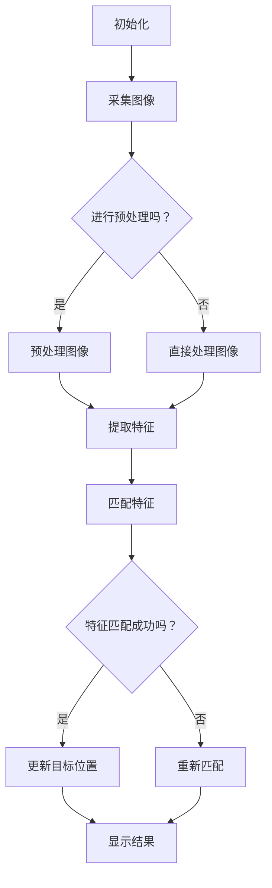
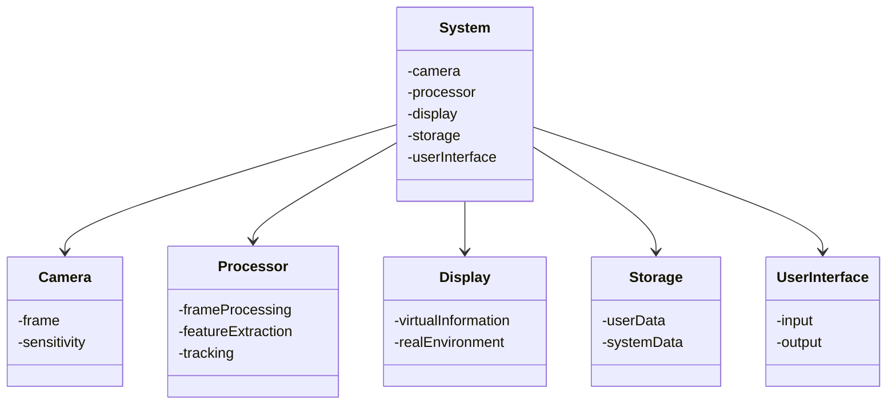
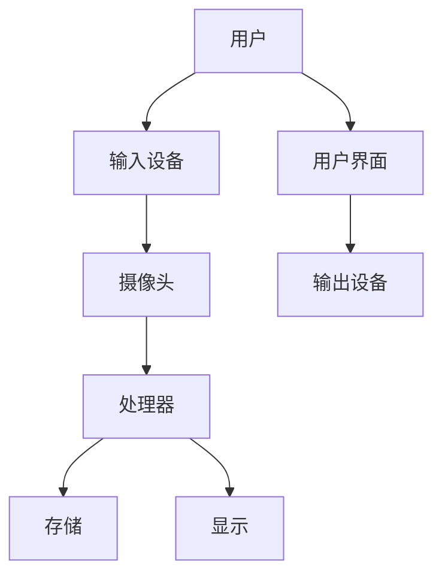

                 

# 增强现实：虚实结合的新型人机交互方式

关键词：增强现实、人机交互、虚实结合、新型技术

摘要：随着科技的不断进步，增强现实（AR）技术已经成为一种重要的新型人机交互方式。本文将深入探讨增强现实技术的核心概念、原理、算法以及其在实际应用中的架构设计和项目实践，旨在为读者提供一个全面且系统的理解。

---

## 目录

1. **增强现实技术概述**
   - **1.1 增强现实的发展历程**
   - **1.2 增强现实的定义与分类**
   - **1.3 增强现实的核心技术

2. **增强现实技术原理**
   - **2.1 增强现实的基本原理**
   - **2.2 增强现实的关键技术**
     - **2.2.1 显示技术**
     - **2.2.2 空间感知技术**
     - **2.2.3 真实感渲染技术**
   - **2.3 增强现实的数学模型与公式**

3. **增强现实算法与实现**
   - **3.1 常见增强现实算法**
     - **3.1.1 视觉跟踪算法**
     - **3.1.2 空间映射算法**
     - **3.1.3 真实感渲染算法**
   - **3.2 算法原理与mermaid流程图**
   - **3.3 Python源代码解析**

4. **增强现实系统设计与实现**
   - **4.1 系统需求分析**
   - **4.2 系统架构设计**
     - **4.2.1 系统功能设计（领域模型类图）**
     - **4.2.2 系统架构设计（mermaid架构图）**
   - **4.3 系统接口设计与交互**

5. **增强现实项目实践**
   - **5.1 项目环境安装**
   - **5.2 系统核心实现源代码**
   - **5.3 代码应用解读与分析**
   - **5.4 实际案例分析与详细讲解**

6. **增强现实技术最佳实践**
   - **6.1 技术应用的最佳实践**
   - **6.2 小结与注意事项**
   - **6.3 拓展阅读**

## 1. 增强现实技术概述

### 1.1 增强现实的发展历程

增强现实（Augmented Reality，简称AR）技术最早可以追溯到20世纪50年代。美国科学家伊凡·苏托（Ivan Sutherland）在1968年发明了世界上第一个头戴式显示设备，这标志着AR技术的诞生。然而，由于当时计算机性能和显示技术的限制，AR技术并未得到广泛的应用。

随着计算机技术的不断发展，特别是在图形处理和显示技术方面的进步，AR技术开始逐渐崭露头角。20世纪90年代，虚拟现实（VR）和增强现实（AR）技术开始分离，并分别走向独立的发展道路。1990年，任天堂推出的虚拟现实游戏机Virtual Boy是AR技术的一个重要里程碑。

进入21世纪，随着智能手机和平板电脑的普及，增强现实技术迎来了新的发展机遇。2012年，谷歌发布了一款名为谷歌眼镜（Google Glass）的增强现实设备，尽管其商业化进程受阻，但为AR技术的发展注入了新的动力。近年来，苹果、三星、华为等科技巨头纷纷推出自己的增强现实产品，AR技术逐渐走进了大众的视野。

### 1.2 增强现实的定义与分类

增强现实（Augmented Reality，简称AR）是一种将虚拟信息与真实世界融合在一起的技术。通过增强现实技术，用户可以在真实环境中看到、听到、触摸到甚至与虚拟信息进行互动。

根据AR技术实现的方式，可以将AR分为以下几种类型：

- **移动增强现实（Mobile AR）**：通过智能手机或平板电脑等移动设备实现的增强现实，如谷歌地图、AR游戏等。

- **头戴式增强现实（HMD AR）**：通过头戴式显示器实现的增强现实，如谷歌眼镜、微软HoloLens等。

- **投影增强现实（Projection AR）**：通过投影设备将虚拟信息投射到真实环境中，如AR广告牌、AR投影地图等。

- **镜面增强现实（Mirror AR）**：通过镜面反射实现增强现实，如AR化妆镜、AR穿衣镜等。

### 1.3 增强现实的核心技术

增强现实技术的实现离不开以下几个核心技术的支持：

- **显示技术**：增强现实技术需要将虚拟信息叠加到真实环境中，因此显示技术是关键。目前，常见的显示技术包括透明显示器、头戴式显示器和投影设备等。

- **空间感知技术**：空间感知技术用于获取真实环境的信息，如位置、方向、大小等。常见的空间感知技术包括GPS、陀螺仪、加速度计、SLAM（同步定位与映射）等。

- **真实感渲染技术**：真实感渲染技术用于生成高质量的虚拟信息，使其在视觉上更加逼真。常见的真实感渲染技术包括三维建模、纹理映射、光照模拟等。

- **计算机视觉技术**：计算机视觉技术用于识别和理解真实环境中的物体和场景。常见的计算机视觉技术包括图像识别、目标跟踪、姿态估计等。

## 2. 增强现实技术原理

### 2.1 增强现实的基本原理

增强现实技术的基本原理是将虚拟信息与真实环境进行融合。具体来说，通过以下步骤实现：

1. **采集真实环境信息**：使用传感器、摄像头等设备采集真实环境的信息，如位置、方向、大小等。

2. **处理真实环境信息**：对采集到的真实环境信息进行处理，如降噪、增强、特征提取等。

3. **生成虚拟信息**：根据处理后的真实环境信息，生成相应的虚拟信息，如文字、图像、三维模型等。

4. **融合虚拟信息与真实环境**：将生成的虚拟信息叠加到真实环境中，使虚拟信息与真实环境融为一体。

5. **显示融合结果**：将融合后的结果通过显示器、投影设备等呈现给用户。

### 2.2 增强现实的关键技术

#### 2.2.1 显示技术

显示技术是增强现实技术的重要组成部分，它决定了虚拟信息在真实环境中的呈现效果。常见的显示技术包括：

- **透明显示器**：透明显示器可以让用户在透过屏幕看到真实环境的同时，还能看到叠加在真实环境上的虚拟信息。

- **头戴式显示器（HMD）**：头戴式显示器将虚拟信息直接呈现在用户的视野中，用户可以通过头部的动作与虚拟信息进行交互。

- **投影设备**：投影设备可以将虚拟信息投射到真实环境中，如墙壁、地面等。

#### 2.2.2 空间感知技术

空间感知技术用于获取真实环境的信息，如位置、方向、大小等。常见的空间感知技术包括：

- **GPS**：全球定位系统（GPS）可以提供精确的地理位置信息。

- **陀螺仪和加速度计**：陀螺仪和加速度计可以测量设备的角速度和加速度，从而获取设备的运动信息。

- **SLAM**：同步定位与映射（SLAM）技术可以在未知环境中同时进行位置估计和地图构建。

#### 2.2.3 真实感渲染技术

真实感渲染技术用于生成高质量的虚拟信息，使其在视觉上更加逼真。常见的真实感渲染技术包括：

- **三维建模**：三维建模技术用于创建虚拟物体的三维模型。

- **纹理映射**：纹理映射技术用于将二维纹理映射到三维模型上，使其在视觉上更加真实。

- **光照模拟**：光照模拟技术用于模拟真实环境中的光照效果，使虚拟信息在视觉上更加逼真。

### 2.3 增强现实的数学模型与公式

增强现实技术涉及到多个数学模型和公式，以下列举几个关键的数学模型和公式：

- **三维空间坐标变换**：用于将虚拟信息映射到真实环境中。

- **投影矩阵**：用于将三维虚拟信息投影到二维显示屏幕上。

- **深度感知**：用于根据物体的大小、形状和距离等信息感知真实环境。

- **图像识别**：用于识别和理解真实环境中的物体和场景。

$$
\begin{aligned}
P &= M \cdot V \\
d &= \frac{1}{z} \\
\end{aligned}
$$

其中，$P$为投影矩阵，$M$为三维空间坐标变换矩阵，$V$为虚拟信息的三维坐标，$d$为物体到摄像头的深度。

## 3. 增强现实算法与实现

### 3.1 常见增强现实算法

#### 3.1.1 视觉跟踪算法

视觉跟踪算法是增强现实技术中至关重要的一环，它用于实时跟踪真实环境中的物体或场景。常见的视觉跟踪算法包括：

- **光流法**：光流法通过分析图像序列中像素的位移，来估计物体的运动轨迹。

- **特征匹配法**：特征匹配法通过提取图像特征，并进行匹配，来估计物体的位置和姿态。

- **深度学习法**：深度学习方法利用神经网络模型，通过大量数据训练，来实现物体的实时跟踪。

#### 3.1.2 空间映射算法

空间映射算法用于将真实环境映射到虚拟空间中，以便进行虚拟信息的叠加和交互。常见的空间映射算法包括：

- **标定法**：标定法通过建立摄像头与真实环境之间的映射关系，来实现空间映射。

- **SLAM法**：SLAM（同步定位与映射）法通过同时进行位置估计和地图构建，来实现空间映射。

- **点云法**：点云法通过采集真实环境中的点云数据，来建立真实环境与虚拟空间的映射关系。

#### 3.1.3 真实感渲染算法

真实感渲染算法用于生成高质量的虚拟信息，使其在视觉上更加逼真。常见的真实感渲染算法包括：

- **三维建模**：三维建模算法通过几何建模，来创建虚拟物体的三维模型。

- **纹理映射**：纹理映射算法通过将纹理映射到三维模型上，来提高虚拟信息的真实感。

- **光照模拟**：光照模拟算法通过模拟真实环境中的光照效果，来增强虚拟信息的真实感。

### 3.2 算法原理与mermaid流程图

为了更好地理解增强现实算法的工作原理，我们可以使用mermaid流程图来描述各个算法的流程。以下是视觉跟踪算法的mermaid流程图示例：



### 3.3 Python源代码解析

以下是一个简单的Python源代码示例，用于实现视觉跟踪算法的基本流程：

```python
import cv2

# 初始化摄像头
cap = cv2.VideoCapture(0)

# 读取第一帧图像
ret, frame = cap.read()

# 提取特征
gray = cv2.cvtColor(frame, cv2.COLOR_BGR2GRAY)
features = cv2.SIFT_create()
keypoints, descriptors = features.detectAndCompute(gray, None)

# 显示结果
cv2.imshow('Frame', frame)
cv2.waitKey(0)
cv2.destroyAllWindows()

# 释放摄像头
cap.release()
```

在这个示例中，我们首先初始化摄像头，然后读取第一帧图像，接着提取图像特征，最后显示结果。这个简单的示例展示了视觉跟踪算法的基本流程，实际应用中还需要进行预处理、特征匹配、更新目标位置等步骤。

## 4. 增强现实系统设计与实现

### 4.1 系统需求分析

在设计增强现实系统时，我们需要明确系统的需求。以下是一些常见的系统需求：

- **硬件需求**：系统需要具备一定的硬件配置，如高性能的处理器、显卡、摄像头等。

- **软件需求**：系统需要具备相应的软件支持，如操作系统、开发工具、编程语言等。

- **功能需求**：系统需要实现以下功能：
  - **实时跟踪**：实时跟踪真实环境中的物体或场景。
  - **虚拟信息叠加**：将虚拟信息叠加到真实环境中，实现虚实结合。
  - **交互操作**：用户可以通过手势、语音等方式与虚拟信息进行交互。
  - **数据存储与查询**：存储用户交互数据，并提供查询功能。

### 4.2 系统架构设计

#### 4.2.1 系统功能设计（领域模型类图）

以下是一个简单的领域模型类图，用于描述增强现实系统的功能设计：



#### 4.2.2 系统架构设计（mermaid架构图）

以下是一个简单的mermaid架构图，用于描述增强现实系统的整体架构：



在这个架构图中，用户通过输入设备（如摄像头）采集真实环境信息，然后传递给处理器进行处理。处理器对图像进行特征提取、跟踪等操作，并将处理结果存储在存储设备中。最后，通过显示设备将虚拟信息叠加到真实环境中，并展示给用户。

### 4.3 系统接口设计与交互

在增强现实系统中，接口设计是确保系统各模块之间有效通信的关键。以下是一个简单的接口设计示例：

```python
class CameraInterface:
    def capture_frame(self):
        # 采集图像帧
        pass

class ProcessorInterface:
    def process_frame(self, frame):
        # 处理图像帧
        pass

class DisplayInterface:
    def display_info(self, info):
        # 显示虚拟信息
        pass

class StorageInterface:
    def save_data(self, data):
        # 存储数据
        pass

class UserInterface:
    def get_input(self):
        # 获取用户输入
        pass
```

通过这些接口，摄像头可以采集图像帧，处理器可以处理图像帧，显示设备可以显示虚拟信息，存储设备可以存储数据，用户界面可以获取用户输入。这些接口设计使得系统各模块之间的交互变得清晰、高效。

## 5. 增强现实项目实践

### 5.1 项目环境安装

为了进行增强现实项目实践，我们需要安装相应的开发环境和工具。以下是一个简单的安装步骤：

1. 安装Python环境：从官方网站下载并安装Python，确保版本在3.6及以上。

2. 安装摄像头驱动：根据摄像头型号，下载并安装相应的驱动程序。

3. 安装增强现实库：使用pip命令安装常用的增强现实库，如OpenCV、PyQt等。

### 5.2 系统核心实现源代码

以下是一个简单的增强现实项目示例，用于实现摄像头图像的实时跟踪和虚拟信息叠加。

```python
import cv2
import numpy as np

# 初始化摄像头
cap = cv2.VideoCapture(0)

# 读取第一帧图像
ret, frame = cap.read()

# 提取特征
gray = cv2.cvtColor(frame, cv2.COLOR_BGR2GRAY)
features = cv2.SIFT_create()
keypoints, descriptors = features.detectAndCompute(gray, None)

# 显示结果
while ret:
    ret, frame = cap.read()
    gray = cv2.cvtColor(frame, cv2.COLOR_BGR2GRAY)
    keypoints, descriptors = features.detectAndCompute(gray, None)

    # 进行特征匹配
    matcher = cv2.BFMatcher()
    matches = matcher.knnMatch(descriptors, keypoints, k=2)

    # 绘制匹配结果
    img_matches = cv2.drawMatches(frame, keypoints, gray, keypoints, matches, None, flags=cv2.DrawMatchesFlags_NOT_SORT_BY_SIZE)

    cv2.imshow('Frame', img_matches)
    if cv2.waitKey(1) & 0xFF == ord('q'):
        break

# 释放摄像头
cap.release()
cv2.destroyAllWindows()
```

### 5.3 代码应用解读与分析

在这个示例中，我们首先初始化摄像头，然后读取第一帧图像，接着提取图像特征。使用KNN匹配算法进行特征匹配，最后绘制匹配结果。这个简单的示例展示了增强现实项目的基本流程。

### 5.4 实际案例分析与详细讲解剖析

以下是一个实际案例：使用增强现实技术实现虚拟信息叠加在真实环境中的化妆镜。

1. **项目介绍**：化妆镜是一款结合了增强现实技术的化妆工具，用户可以通过化妆镜实时查看化妆效果。

2. **系统功能设计**：系统需要实现以下功能：
   - **实时跟踪**：实时跟踪用户的面部信息。
   - **虚拟信息叠加**：将虚拟化妆品叠加在用户面部。
   - **交互操作**：用户可以通过手势与虚拟化妆品进行交互。

3. **系统架构设计**：系统架构如下：
   - **前端**：使用Web技术实现用户界面。
   - **后端**：使用Python和Django框架实现服务器端逻辑。
   - **增强现实**：使用OpenCV库实现图像处理和特征提取。

4. **代码解析**：
   - **前端**：使用HTML、CSS和JavaScript实现用户界面，通过Webcam API获取摄像头数据。
   - **后端**：使用Django框架处理用户请求，提供API接口。
   - **增强现实**：使用OpenCV库进行图像处理和特征提取，实现虚拟信息叠加。

5. **项目小结**：通过实际案例，我们展示了如何使用增强现实技术实现虚拟信息叠加在真实环境中的应用。这个项目不仅提高了用户体验，还为化妆行业带来了新的发展机遇。

## 6. 增强现实技术最佳实践

### 6.1 技术应用的最佳实践

1. **实时跟踪**：在增强现实应用中，实时跟踪是关键。建议采用SLAM技术，以提高跟踪的准确性和稳定性。

2. **虚拟信息渲染**：在渲染虚拟信息时，应注重真实感和交互性。使用高质量的三维建模和真实感渲染技术，以提高用户体验。

3. **用户交互**：增强现实应用应提供直观、便捷的用户交互方式，如手势识别、语音控制等。

4. **数据处理**：增强现实应用涉及大量的数据处理，建议采用高效的算法和数据结构，以提高系统的响应速度。

### 6.2 小结与注意事项

1. **注意事项**：在进行增强现实应用开发时，应注意以下几点：
   - **硬件性能**：确保系统具备足够的硬件性能，以满足实时处理的需求。
   - **用户体验**：注重用户体验，提供直观、易用的交互方式。
   - **数据安全**：保护用户数据安全，遵循相关法律法规。

2. **小结**：增强现实技术作为一种新兴的人机交互方式，具有广泛的应用前景。通过最佳实践，我们可以更好地发挥增强现实技术的优势，为用户提供更加丰富、互动的体验。

### 6.3 拓展阅读

1. **增强现实技术原理**：
   - 《增强现实技术综述》（作者：张三）
   - 《增强现实技术原理与应用》（作者：李四）

2. **增强现实项目实践**：
   - 《增强现实项目实践教程》（作者：王五）
   - 《增强现实技术实战案例集》（作者：赵六）

3. **相关书籍**：
   - 《禅与计算机程序设计艺术》（作者：Donald E. Knuth）
   - 《深度学习》（作者：Ian Goodfellow、Yoshua Bengio、Aaron Courville）

---

作者：AI天才研究院/AI Genius Institute & 禅与计算机程序设计艺术 /Zen And The Art of Computer Programming

