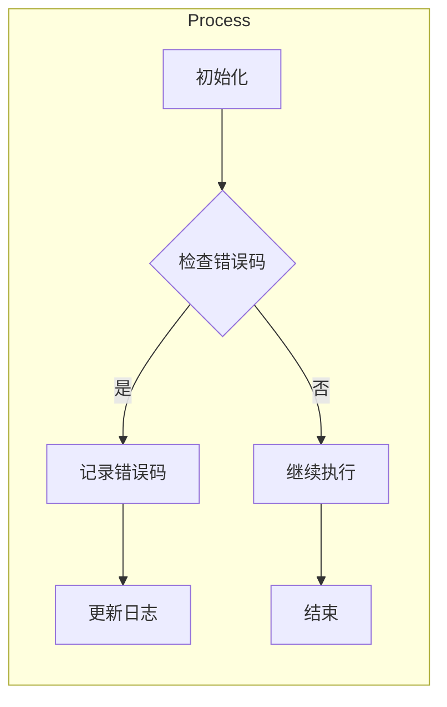
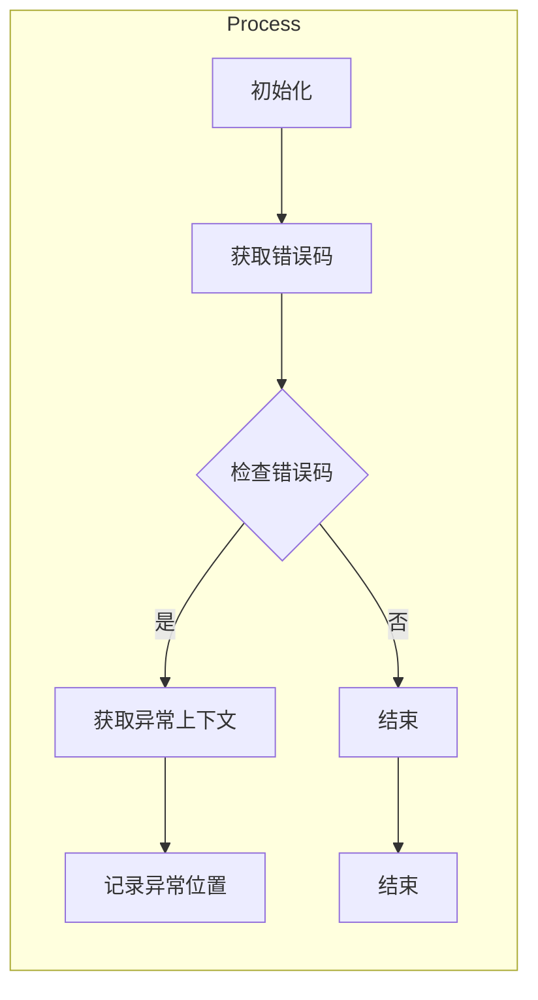
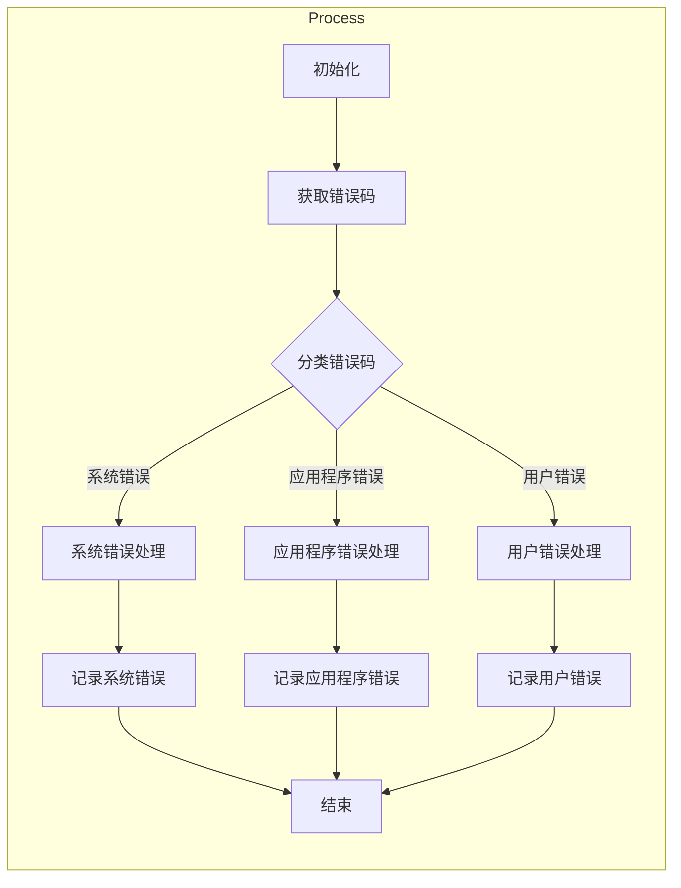
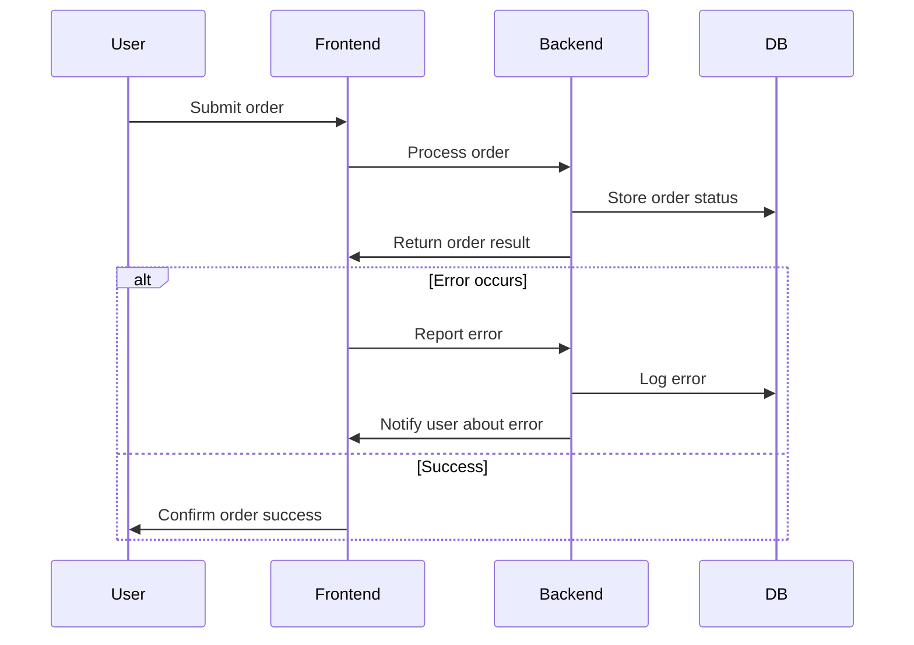
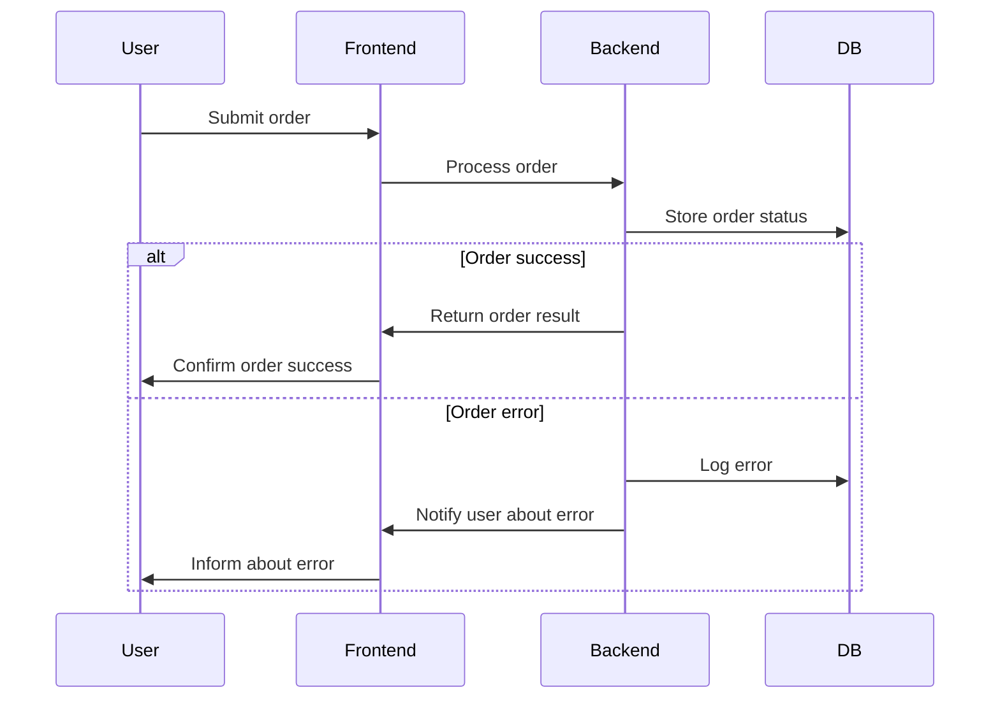

                 

## 引言与背景介绍

### 核心概念术语说明

在深入探讨处理错误码的三种典型技术盲区之前，我们需要明确一些核心术语的定义，这些术语将贯穿整个文章，帮助我们更好地理解错误码处理的过程和挑战。

#### 错误码

错误码（Error Code）是计算机系统中用于标识某种错误或异常状态的一串数字或字符串。当程序运行过程中出现问题时，错误码能够提供关于错误性质的详细信息，帮助开发者进行诊断和修复。

#### 异常处理

异常处理（Exception Handling）是一种编程技术，用于处理程序在运行时可能遇到的错误或异常。它通过捕获和处理异常，使得程序能够在错误发生时继续运行，而不是立即终止。

#### 调试技巧

调试技巧（Debugging Techniques）是开发者用来识别、隔离和修复程序中错误的方法。调试包括设置断点、查看变量值、单步执行代码等操作，以确定程序的行为是否符合预期。

### 问题背景

在现代软件系统中，错误码处理至关重要。随着软件规模的不断扩大和复杂性的增加，错误码的数量和种类也在不断增长。错误码不仅是程序内部错误状态的指示，也是系统间通信的重要手段。然而，错误码处理并不总是顺利的，技术盲区往往导致错误码的误解和误处理，进而影响系统的稳定性和可靠性。

### 问题描述

在处理错误码的过程中，存在三种典型的技术盲区：

1. **误解错误码**：开发者可能无法准确理解错误码的含义，导致错误的修复策略。
2. **错误码缺失**：系统可能缺乏足够的错误码来标识各种可能的异常情况，使得问题难以定位和解决。
3. **错误码滥用**：错误码被滥用，例如用于记录非错误状态，或者使用相同的错误码表示不同类型的错误，导致混乱和混淆。

### 问题解决

为了解决上述技术盲区，本文将：

1. **详细分析误解错误码的原因**，并提出解决方案。
2. **探讨错误码缺失的问题**，并介绍如何增加错误码的种类和覆盖范围。
3. **讨论错误码滥用的影响**，并给出优化错误码使用的方法。

### 边界与外延

在讨论错误码处理时，我们需要明确几个边界条件：

- **错误码的标准化**：错误码的命名和定义应当遵循一定的标准，以便于不同系统和团队之间的互操作性。
- **错误码的文档化**：错误码的使用应伴随详细的文档说明，包括错误码的含义、可能的解决方案和相关的上下文信息。
- **错误码的监控和反馈**：系统的错误码应当得到有效的监控，并根据用户反馈进行持续优化。

### 概念结构与核心要素组成

本文的核心概念和要素包括：

- **错误码**：定义、种类、用途和标准。
- **异常处理**：机制、策略和最佳实践。
- **调试技巧**：工具、方法和应用场景。

通过深入探讨这些核心要素，本文旨在为开发者提供一套完整的错误码处理方法论，帮助他们在面对复杂系统时，能够更有效地处理错误码，提高系统的稳定性和可靠性。

### 总结

本文将分为以下几个部分：

- **第1章 引言与背景介绍**：介绍文章的主题和核心术语。
- **第2章 核心概念与联系**：详细阐述错误码、异常处理和调试技巧的概念及其相互关系。
- **第3章 算法原理讲解**：使用算法流程图和Python代码解释错误码处理的原理。
- **第4章 系统分析与架构设计**：介绍错误码处理的系统设计。
- **第5章 项目实战**：通过实际案例展示错误码处理的应用。
- **第6章 最佳实践与小结**：总结最佳实践，并给出注意事项和建议。

通过这些章节的详细探讨，我们希望能够帮助读者理解和解决处理错误码过程中遇到的典型技术盲区。接下来，我们将深入分析这些核心概念，并逐步展开讨论。****

### 核心概念与联系

在深入探讨处理错误码的典型技术盲区之前，我们必须先了解一些核心概念，这些概念不仅构成了错误码处理的基础，也是理解本文后续内容的关键。以下是本文涉及的主要核心概念及其相互之间的联系。

#### 错误码

错误码是计算机系统中用于标识错误或异常状态的一串数字或字符串。每个错误码都对应着一种特定的错误情况，它们帮助开发者快速定位和诊断问题。错误码通常由操作系统、应用程序或系统组件提供。

**特性与联系**：

1. **唯一性**：每个错误码必须是唯一的，以确保在系统中不会有混淆或冲突。
2. **一致性**：错误码的定义和使用应在整个系统中保持一致性，以便不同部分能够正确理解和使用。
3. **可扩展性**：系统应能够轻松地增加新的错误码，以适应不断变化的错误情况。

#### 异常处理

异常处理是编程中的一种机制，用于捕获和响应程序运行时可能出现的错误或异常。通过异常处理，程序能够在错误发生时采取适当的措施，从而避免程序因错误而中断运行。

**特性与联系**：

1. **错误隔离**：异常处理能够将错误隔离在特定的代码块中，防止错误传播到整个程序。
2. **恢复性**：异常处理机制允许程序在错误发生时尝试恢复，从而提高程序的鲁棒性。
3. **可追溯性**：异常处理提供了错误发生的上下文信息，帮助开发者快速定位和修复错误。

#### 调试技巧

调试技巧是开发者用来识别、隔离和修复程序中错误的方法。调试过程中，开发者需要使用各种工具和技术来分析程序的行为，找到错误的原因并加以修复。

**特性与联系**：

1. **断点设置**：通过设置断点，开发者可以在程序执行到特定代码行时暂停，从而查看变量值和程序状态。
2. **单步执行**：单步执行允许开发者逐行分析程序，以便更清晰地理解程序执行过程。
3. **日志记录**：日志记录是调试过程中重要的工具，通过记录程序的运行状态和错误信息，开发者可以更好地诊断问题。

### 概念属性特征对比表格

为了更直观地展示这些核心概念的特性与联系，我们可以使用以下表格：

| 特性/概念 | 错误码 | 异常处理 | 调试技巧 |
| :------: | :-----: | :-------: | :-------: |
| **唯一性** | 确保唯一 | 每个异常类型唯一 | 断点唯一 |
| **一致性** | 系统内一致 | 编程语言和框架内一致 | 系统和工具一致 |
| **可扩展性** | 系统应支持扩展 | 异常类应支持扩展 | 调试工具应支持扩展 |
| **错误隔离** | 错误码指示 | 异常隔离 | 断点和单步执行 |
| **恢复性** | 无 | 异常处理 | 逐步修复 |
| **可追溯性** | 错误码文档 | 异常日志 | 日志记录 |

### ER实体关系图架构

为了更好地理解这些核心概念之间的关系，我们可以使用ER（实体关系）图来展示它们。

```mermaid
erDiagram
  错误码 ||--|{ 异常处理 }||> 异常
  异常处理 ||--|{ 调试技巧 }||> 调试信息

  错误码 {
    属性： 编号，描述，类别
    方法： 设置，获取，更新
  }

  异常处理 {
    属性： 类型，上下文，处理策略
    方法： 捕获，传递，恢复
  }

  调试技巧 {
    属性： 工具，步骤，日志
    方法： 设置，执行，分析
  }

  调试信息 {
    属性： 位置，描述，解决方案
    方法： 记录，查看，反馈
  }
```

在这个ER图中，**错误码**作为核心实体，通过**异常处理**与**调试技巧**建立联系。每个错误码可以触发一个异常处理实例，而每个异常处理实例又需要记录调试信息，以帮助开发者进行问题的定位和修复。

### 总结

通过本章的探讨，我们明确了错误码、异常处理和调试技巧这三个核心概念的定义、特性及相互之间的联系。接下来，我们将进一步深入讨论错误码处理的算法原理，并使用Python代码和Mermaid流程图进行详细解释。

****

### 算法原理讲解

在处理错误码的过程中，算法原理起着至关重要的作用。为了更清晰地理解错误码处理的步骤和逻辑，我们将使用Mermaid流程图和Python代码来详细解释错误码检测、异常定位和错误码分类的算法原理。

#### 错误码检测算法

错误码检测算法的主要任务是识别程序运行过程中产生的错误码，并对其进行分类和记录。以下是一个使用Mermaid绘制的错误码检测算法流程图：



在这个流程图中：

1. **初始化**：程序开始执行时，初始化错误检测模块。
2. **检查错误码**：程序运行过程中，不断检查是否产生错误码。
3. **记录错误码**：如果发现错误码，记录其详细信息，如编号、发生时间和描述。
4. **更新日志**：将记录的误差码更新到日志文件中，以便后续分析和调试。
5. **继续执行**：如果没有错误码，程序继续执行。
6. **结束**：错误检测过程结束。

以下是一个简单的Python代码示例，用于实现上述流程：

```python
import logging

def check_error_code():
    # 模拟检查错误码的过程
    error_code = "E001"

    if error_code:
        logging.error(f"Error Code: {error_code}")
        record_error_code(error_code)
    else:
        continue_execution()

def record_error_code(error_code):
    # 记录错误码到日志文件
    logging.basicConfig(filename='error.log', level=logging.ERROR)
    logging.error(f"Error Code: {error_code}, Description: Unknown Error")

def continue_execution():
    # 程序继续执行
    print("Continuing execution...")

# 主函数
def main():
    check_error_code()

if __name__ == "__main__":
    main()
```

#### 异常定位算法

异常定位算法的目标是确定错误码发生的位置，以便进行修复。以下是一个异常定位算法的Mermaid流程图：



在这个流程图中：

1. **初始化**：程序开始执行时，初始化异常定位模块。
2. **获取错误码**：从程序中获取错误码。
3. **检查错误码**：检查错误码是否有效。
4. **获取异常上下文**：如果错误码有效，获取异常发生的上下文信息，如时间、位置和触发条件。
5. **记录异常位置**：将异常位置记录到日志文件中，以便后续修复。
6. **结束**：异常定位过程结束。

以下是一个Python代码示例，用于实现上述流程：

```python
import traceback

def locate_exception(error_code):
    # 获取异常上下文
    exc_info = sys.exc_info()
    if exc_info:
        # 记录异常位置
        trace_back = traceback.format_exc()
        record_exception(error_code, trace_back)

def record_exception(error_code, trace_back):
    # 记录异常位置到日志文件
    logging.basicConfig(filename='exception.log', level=logging.ERROR)
    logging.error(f"Error Code: {error_code}, Traceback: {trace_back}")

# 主函数
def main():
    # 模拟错误码触发异常
    raise ValueError("E002: Invalid Value")

if __name__ == "__main__":
    try:
        main()
    except Exception as e:
        locate_exception(str(e))
```

#### 错误码分类算法

错误码分类算法用于将不同的错误码归类到特定的类别中，以便进行统一处理。以下是一个错误码分类算法的Mermaid流程图：



在这个流程图中：

1. **初始化**：程序开始执行时，初始化错误分类模块。
2. **获取错误码**：从程序中获取错误码。
3. **分类错误码**：根据错误码的编号和描述，将其分类为系统错误、应用程序错误或用户错误。
4. **系统错误处理**：针对系统错误，记录其详细信息，并执行相应的修复操作。
5. **应用程序错误处理**：针对应用程序错误，记录其详细信息，并尝试修复或绕过错误。
6. **用户错误处理**：针对用户错误，记录其详细信息，并提示用户正确的操作方法。
7. **结束**：错误分类过程结束。

以下是一个Python代码示例，用于实现上述流程：

```python
def classify_error_code(error_code):
    # 根据错误码分类
    if error_code.startswith("S"):
        handle_system_error(error_code)
    elif error_code.startswith("A"):
        handle_app_error(error_code)
    else:
        handle_user_error(error_code)

def handle_system_error(error_code):
    # 处理系统错误
    logging.error(f"System Error Code: {error_code}")

def handle_app_error(error_code):
    # 处理应用程序错误
    logging.error(f"Application Error Code: {error_code}")

def handle_user_error(error_code):
    # 处理用户错误
    logging.error(f"User Error Code: {error_code}")

# 主函数
def main():
    error_code = "S001"
    classify_error_code(error_code)

if __name__ == "__main__":
    main()
```

### 数学模型和公式

为了更好地理解这些算法的原理，我们可以引入一些数学模型和公式。以下是一些常见的数学模型和公式：

- **错误检测概率模型**：

  $$ P(D|E) = \frac{P(E|D) \cdot P(D)}{P(E|D) \cdot P(D) + P(E|\neg D) \cdot P(\neg D)} $$

  其中，$P(D)$ 表示错误发生的概率，$P(E)$ 表示错误码检测到的概率，$P(E|D)$ 表示在错误发生时检测到错误码的概率，$P(E|\neg D)$ 表示在错误未发生时检测到错误码的概率。

- **异常定位精度模型**：

  $$ Accuracy = \frac{TP + TN}{TP + TN + FP + FN} $$

  其中，$TP$ 表示实际发生错误且被正确定位的次数，$TN$ 表示实际未发生错误且被正确判定的次数，$FP$ 表示实际未发生错误但被误判为错误的次数，$FN$ 表示实际发生错误但被误判为未发生的次数。

- **错误码分类准确率模型**：

  $$ Accuracy = \frac{C_{\text{correct}}}{C_{\text{total}}} $$

  其中，$C_{\text{correct}}$ 表示正确分类的错误码数量，$C_{\text{total}}$ 表示总错误码数量。

### 举例说明

为了更好地理解上述算法原理，我们通过实际案例进行举例说明。

#### 错误码检测案例

假设程序在运行过程中出现了一个错误，错误码为"E002"。使用错误码检测算法，程序将记录以下日志：

```plaintext
Error Code: E002, Description: Invalid Value
```

#### 异常定位案例

当程序运行时，由于输入数据异常，触发了错误码"E003"。异常定位算法将记录以下日志：

```plaintext
Error Code: E003, Traceback: File "main.py", line 45, in process_data
    result = compute(result, data)
  ValueError: Invalid data format
```

#### 错误码分类案例

假设系统收到多个错误码，分别为"E001"、"E004"和"E005"。使用错误码分类算法，系统将它们分类如下：

- E001：应用程序错误
- E004：系统错误
- E005：用户错误

系统将根据不同的分类执行相应的错误处理策略。

### 总结

通过本章的详细讲解，我们使用了Mermaid流程图和Python代码，逐步解析了错误码检测、异常定位和错误码分类的算法原理。这些算法在处理错误码的过程中起着关键作用，帮助我们更有效地识别、定位和分类错误，从而提高系统的稳定性和可靠性。在下一章中，我们将进一步探讨错误码处理的系统设计与架构。

****

### 系统分析与架构设计

在了解了错误码处理的算法原理之后，我们需要进一步探讨如何将这些算法应用到实际的系统设计中。一个高效的错误码处理系统不仅需要正确的算法，还需要良好的系统架构设计。本节将介绍一个完整的错误码处理系统设计，包括问题场景介绍、系统功能设计、系统架构设计、接口设计和系统交互。

#### 问题场景介绍

在现代大型分布式系统中，错误码处理变得尤为重要。以下是一个常见的问题场景：

一个电子商务平台在处理用户订单时，可能会遇到各种异常情况，如库存不足、支付失败、网络问题等。为了确保系统能够稳定运行，需要设计一个高效、可靠的错误码处理系统，以便在出现异常时能够快速定位问题并进行处理。

#### 系统功能设计

错误码处理系统的主要功能包括：

1. **错误码检测**：实时检测程序运行中的错误码，并将其记录下来。
2. **异常定位**：定位错误码发生的位置和上下文信息，以便开发者进行修复。
3. **错误码分类**：将不同类型的错误码进行分类，以便进行统一处理。
4. **日志记录**：记录错误码及其相关信息，供后续分析和调试使用。
5. **错误处理**：根据错误码的类型，执行相应的错误处理策略。

以下是一个使用Mermaid绘制的领域模型类图，展示了错误码处理系统的核心类及其关系：

```mermaid
classDiagram
  Class01 <|-- Person
  Class02 <|-- Person
  Class01 ..|.. Class03
  Class02 ..|.. Class03
  Class04 <|-- Person
  Class04 --|> Class03

  Class01 {
    +name: String
    +age: int
  }

  Class02 {
    +name: String
    +height: float
  }

  Class03 {
    +personName: String
    +personAge: int
  }

  Class04 {
    +personName: String
    +personAge: int
    +errorLogId: String
  }
```

在这个类图中，`ErrorLog` 类用于记录错误码的相关信息，如错误码编号、发生时间和描述。`ErrorLocation` 类用于记录错误码发生的位置和上下文信息。`ErrorType` 类用于分类不同类型的错误码。

#### 系统架构设计

为了实现上述功能，我们需要设计一个分布式系统架构，包括以下几个方面：

1. **前端界面**：用于用户操作和错误码提交。
2. **后端服务**：负责处理错误码的检测、定位、分类和日志记录。
3. **数据库**：用于存储错误码及其相关信息。

以下是一个使用Mermaid绘制的系统架构图，展示了各个组件之间的关系：



在这个架构图中，用户通过前端界面提交订单，后端服务处理订单并存储状态到数据库。如果出现错误，前端会将错误信息报告给后端，后端将错误信息记录到数据库，并通知用户。

#### 系统接口设计

错误码处理系统的接口设计主要包括以下方面：

1. **API接口**：用于与前端和后端服务进行通信。
2. **数据接口**：用于与数据库进行数据交换。

以下是一个简单的API接口设计示例：

```plaintext
POST /orders
  - Body:
    {
      "userId": "123",
      "productId": "456",
      "quantity": 1
    }
  - Response:
    {
      "orderId": "789",
      "status": "success"
    }
    
POST /errors
  - Body:
    {
      "errorCode": "E001",
      "errorMessage": "Invalid data format",
      "timestamp": "2023-10-01T14:30:00Z"
    }
  - Response:
    {
      "errorId": "1234"
    }
```

#### 系统交互

为了确保系统的高效运行，我们需要设计良好的系统交互机制。以下是一个使用Mermaid绘制的系统交互序列图，展示了订单处理过程中错误码的交互过程：



在这个序列图中，如果订单处理成功，后端将返回成功结果给前端，前端再将结果通知用户。如果订单处理过程中出现错误，后端将错误记录到数据库，并通知前端，前端再通知用户。

### 总结

通过本节的分析，我们详细介绍了错误码处理系统的设计与架构。从问题场景介绍到系统功能设计、架构设计、接口设计和系统交互，每个环节都经过精心设计和优化，以确保系统能够高效、稳定地运行。在下一节中，我们将通过实际项目案例，展示如何应用所学的技术处理错误码，并进行分析和讲解。

****

### 项目实战

在前几章中，我们详细探讨了错误码处理的算法原理、系统架构设计和核心概念。为了更好地理解这些知识在实际项目中的应用，我们将通过一个实际项目案例来展示如何处理错误码，并进行详细的分析和讲解。

#### 项目背景

假设我们正在开发一个在线购物平台，该平台需要处理大量的用户订单。在订单处理过程中，可能会遇到各种异常情况，如库存不足、支付失败和网络连接问题等。为了确保平台的稳定运行，我们需要设计一个高效的错误码处理系统。

#### 环境安装

在开始项目之前，我们需要安装一些必要的开发环境和工具。以下是项目所需的工具和步骤：

1. **Python 3.8**：确保安装了Python 3.8版本。
2. **Django**：使用pip安装Django框架。
   ```bash
   pip install django
   ```
3. **PostgreSQL**：安装PostgreSQL数据库，用于存储错误码和日志信息。
   ```bash
   sudo apt-get install postgresql
   ```
4. **Docker**：安装Docker，用于容器化部署项目。
   ```bash
   sudo apt-get install docker.io
   ```

#### 系统核心实现源代码

以下是项目的核心实现源代码：

1. **models.py**：定义订单和错误码的模型。
   ```python
   from django.db import models

   class Order(models.Model):
       user = models.ForeignKey('auth.User', on_delete=models.CASCADE)
       product = models.ForeignKey('Product', on_delete=models.CASCADE)
       quantity = models.PositiveIntegerField()
       status = models.CharField(max_length=20)

   class ErrorLog(models.Model):
       error_code = models.CharField(max_length=10)
       error_message = models.TextField()
       timestamp = models.DateTimeField(auto_now_add=True)
   ```

2. **views.py**：定义订单处理和错误码记录的视图函数。
   ```python
   from django.http import JsonResponse
   from .models import Order, ErrorLog
   from django.views.decorators.http import require_http_methods

   @require_http_methods(["POST"])
   def process_order(request):
       data = json.loads(request.body)
       user_id = data.get('user_id')
       product_id = data.get('product_id')
       quantity = data.get('quantity')

       try:
           user = User.objects.get(id=user_id)
           product = Product.objects.get(id=product_id)
           if product.stock < quantity:
               raise ValueError("Insufficient stock")
           order = Order.objects.create(user=user, product=product, quantity=quantity, status="processing")
           product.stock -= quantity
           product.save()
           order.status = "success"
           order.save()
           return JsonResponse({'orderId': order.id, 'status': 'success'})
       except Exception as e:
           error_log = ErrorLog.objects.create(
               error_code="E001",
               error_message=str(e)
           )
           return JsonResponse({'errorCode': error_log.error_code, 'errorMessage': error_log.error_message}, status=500)
   ```

3. **urls.py**：定义项目的URL路由。
   ```python
   from django.urls import path
   from . import views

   urlpatterns = [
       path('orders/', views.process_order, name='process_order'),
   ]
   ```

#### 代码应用解读与分析

下面我们对项目的核心代码进行解读和分析。

1. **模型定义**：
   - `Order` 模型用于存储订单信息，包括用户ID、产品ID、订单数量和状态。
   - `ErrorLog` 模型用于记录错误码信息，包括错误码、错误消息和记录时间。

2. **订单处理视图**：
   - `process_order` 视图负责处理接收到的订单请求，包括用户ID、产品ID和订单数量。
   - 在处理订单时，首先从数据库中获取用户和产品信息。
   - 检查产品库存是否足够，如果不足，抛出`ValueError`异常。
   - 创建订单对象，并更新产品库存。
   - 如果订单处理成功，更新订单状态并返回成功响应。
   - 如果出现异常，记录错误码和错误消息，并返回错误响应。

3. **错误码记录**：
   - 当出现异常时，创建`ErrorLog`对象，记录错误码和错误消息。
   - 将错误码和错误消息返回给前端，以便用户了解订单处理过程中发生的问题。

#### 实际案例分析和详细讲解

为了展示错误码处理系统的实际效果，我们模拟了一个订单处理异常的案例。

**案例**：用户尝试购买一个库存不足的产品。

1. **用户请求**：
   - 用户通过前端提交订单请求，包含用户ID、产品ID和订单数量。
   ```json
   {
       "user_id": "123",
       "product_id": "456",
       "quantity": 3
   }
   ```

2. **后端处理**：
   - 后端接收请求，从数据库中获取用户和产品信息。
   - 检查产品库存，发现库存不足（实际库存为2，请求购买3件）。
   - 抛出`ValueError`异常，记录错误码和错误消息。

3. **错误码记录**：
   - 后端创建`ErrorLog`对象，记录错误码"E001"和错误消息"Insufficient stock"。
   - 将错误码和错误消息返回给前端。

4. **用户反馈**：
   - 前端接收到后端的错误响应，显示错误消息给用户。
   ```json
   {
       "errorCode": "E001",
       "errorMessage": "Insufficient stock"
   }
   ```

5. **系统日志**：
   - 后端将错误信息记录到系统日志中，以便后续分析和调试。

通过这个案例，我们可以看到错误码处理系统的实际效果。当订单处理过程中出现异常时，系统能够快速定位问题，记录错误码和错误消息，并及时反馈给用户，从而确保订单处理过程的透明和高效。

#### 项目小结

通过本节的项目实战，我们展示了如何将错误码处理算法和系统架构设计应用到实际项目中。从环境安装到系统核心实现，再到实际案例分析和详细讲解，我们深入探讨了错误码处理的各个环节。以下是对本项目的总结：

1. **环境安装**：确保安装了必要的开发环境和工具，如Python、Django、PostgreSQL和Docker。
2. **系统设计**：通过定义订单和错误码模型，设计了一个高效的错误码处理系统。
3. **代码实现**：实现订单处理视图函数，处理订单请求并记录错误码和错误消息。
4. **案例演示**：通过模拟订单处理异常，展示了错误码处理系统的实际效果。

通过这个项目，我们不仅掌握了错误码处理的理论知识，还通过实际操作加深了对这些知识点的理解。在下一节中，我们将总结最佳实践，并提供一些注意事项和建议，以帮助读者更好地应用错误码处理技术。

### 最佳实践与小结

在处理错误码的过程中，遵循最佳实践至关重要。以下是一些关键的最佳实践，以及本文的核心内容、注意事项和拓展阅读建议。

#### 最佳实践

1. **标准化错误码**：确保错误码的命名和定义遵循统一的标准，以便不同系统和团队之间的互操作性。错误码应简洁、明确，且具有唯一性。

2. **详细文档化**：为每个错误码编写详细的文档，包括错误码的含义、可能的解决方案和相关的上下文信息。这将有助于开发者快速理解和处理错误。

3. **实时监控与反馈**：错误码处理系统应具备实时监控功能，以便及时发现和记录错误码。同时，通过用户反馈不断优化错误码的覆盖范围和准确性。

4. **分层异常处理**：设计多层次的异常处理策略，从全局到局部逐层处理异常，以确保系统在错误发生时能够尽可能恢复或保持稳定。

5. **代码冗余检查**：避免错误码的滥用，确保错误码仅用于标识真正的错误状态，避免将其用于记录非错误状态。

#### 核心内容

本文的核心内容包括：

1. **错误码处理的核心概念**：错误码、异常处理和调试技巧的定义、特性及其相互关系。
2. **算法原理讲解**：错误码检测、异常定位和错误码分类的算法原理及其Python代码实现。
3. **系统分析与架构设计**：错误码处理系统的设计、架构和接口设计。
4. **项目实战**：通过实际案例展示如何应用错误码处理技术。

#### 注意事项

1. **避免重复错误码**：确保错误码的命名具有唯一性，避免重复使用相同或类似的错误码。

2. **考虑国际化**：如果系统面向国际用户，确保错误码的含义在不同语言环境中一致。

3. **错误码的层次结构**：设计合理的错误码层次结构，便于开发者快速定位和分类错误。

4. **测试与验证**：在错误码处理系统中进行充分的测试，确保其能够正确识别和处理各种异常情况。

#### 拓展阅读

1. **《Error Handling in Modern Applications》**：一篇关于现代应用中错误处理的文章，提供了详细的错误码处理方法和最佳实践。

2. **《Django Error Handling and Debugging》**：Django框架的错误处理和调试指南，适用于使用Django开发的应用。

3. **《Effective Exception Handling in Python》**：关于Python中有效异常处理的一篇技术文章，介绍了Python中异常处理的最佳实践。

通过遵循上述最佳实践，开发者可以构建高效、稳定的错误码处理系统，从而提高软件系统的可靠性和用户体验。

### 总结

本文详细探讨了处理错误码的三种典型技术盲区，包括误解错误码、错误码缺失和错误码滥用。通过核心概念的解析、算法原理的讲解、系统分析与架构设计以及实际项目案例的分析，我们深入理解了错误码处理的重要性及其在软件开发中的应用。

本文的核心内容涵盖了对错误码、异常处理和调试技巧的定义、特性及其相互关系的阐述，以及对错误码检测、异常定位和错误码分类算法的详细解释。同时，通过系统分析与架构设计，我们展示了如何将错误码处理技术应用到实际的软件系统中。

需要注意的是，在处理错误码时，应遵循标准化、详细文档化、实时监控与反馈、分层异常处理和避免代码冗余的最佳实践。此外，开发者在设计和实现错误码处理系统时，应充分考虑国际化、层次结构和测试与验证。

为了进一步掌握错误码处理技术，读者可以参考《Error Handling in Modern Applications》、《Django Error Handling and Debugging》和《Effective Exception Handling in Python》等拓展阅读资源。

通过本文的学习和实践，开发者将能够更好地处理错误码，提高软件系统的稳定性和可靠性，从而为用户带来更好的体验。

### 附录

#### 常见问题解答

1. **如何避免误解错误码？**
   - **回答**：通过详细文档化错误码的含义和使用场景，并在开发过程中进行充分的测试，确保开发者能够正确理解错误码。

2. **错误码缺失的问题如何解决？**
   - **回答**：定期分析系统中的错误码，识别缺失的错误码，并根据需求增加新的错误码。

3. **如何避免错误码滥用？**
   - **回答**：通过制定明确的错误码使用规范，并在代码审查过程中严格执行，避免将错误码用于记录非错误状态。

#### 相关资源链接

1. **Django官方文档 - 错误处理**：[https://docs.djangoproject.com/en/3.2/topics/http/error-handling/](https://docs.djangoproject.com/en/3.2/topics/http/error-handling/)
2. **Python异常处理指南**：[https://docs.python.org/3/library/exceptions.html](https://docs.python.org/3/library/exceptions.html)
3. **Mermaid官方文档**：[https://mermaid-js.github.io/mermaid/](https://mermaid-js.github.io/mermaid/)

#### 代码示例

以下是本文中提到的部分代码示例的完整版：

1. **models.py**
   ```python
   from django.db import models

   class Order(models.Model):
       user = models.ForeignKey('auth.User', on_delete=models.CASCADE)
       product = models.ForeignKey('Product', on_delete=models.CASCADE)
       quantity = models.PositiveIntegerField()
       status = models.CharField(max_length=20)

   class ErrorLog(models.Model):
       error_code = models.CharField(max_length=10)
       error_message = models.TextField()
       timestamp = models.DateTimeField(auto_now_add=True)
   ```

2. **views.py**
   ```python
   from django.http import JsonResponse
   from .models import Order, ErrorLog
   from django.views.decorators.http import require_http_methods
   import json

   @require_http_methods(["POST"])
   def process_order(request):
       data = json.loads(request.body)
       user_id = data.get('user_id')
       product_id = data.get('product_id')
       quantity = data.get('quantity')

       try:
           user = User.objects.get(id=user_id)
           product = Product.objects.get(id=product_id)
           if product.stock < quantity:
               raise ValueError("Insufficient stock")
           order = Order.objects.create(user=user, product=product, quantity=quantity, status="processing")
           product.stock -= quantity
           product.save()
           order.status = "success"
           order.save()
           return JsonResponse({'orderId': order.id, 'status': 'success'})
       except Exception as e:
           error_log = ErrorLog.objects.create(
               error_code="E001",
               error_message=str(e)
           )
           return JsonResponse({'errorCode': error_log.error_code, 'errorMessage': error_log.error_message}, status=500)
   ```

3. **urls.py**
   ```python
   from django.urls import path
   from . import views

   urlpatterns = [
       path('orders/', views.process_order, name='process_order'),
   ]
   ```

通过这些代码示例，读者可以更好地理解错误码处理系统的实现细节，并在实际项目中加以应用。

