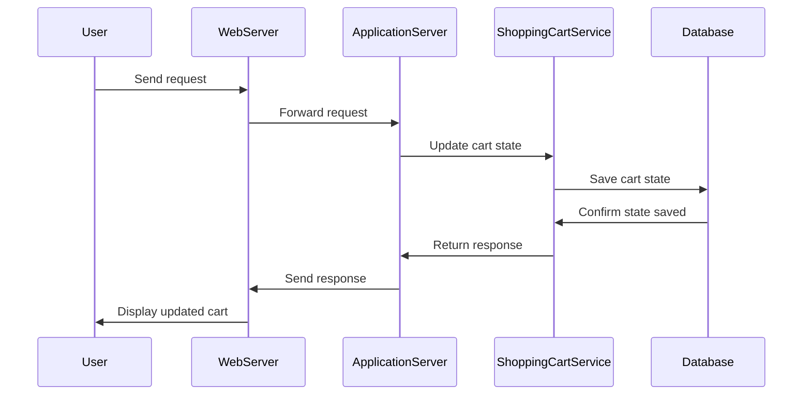
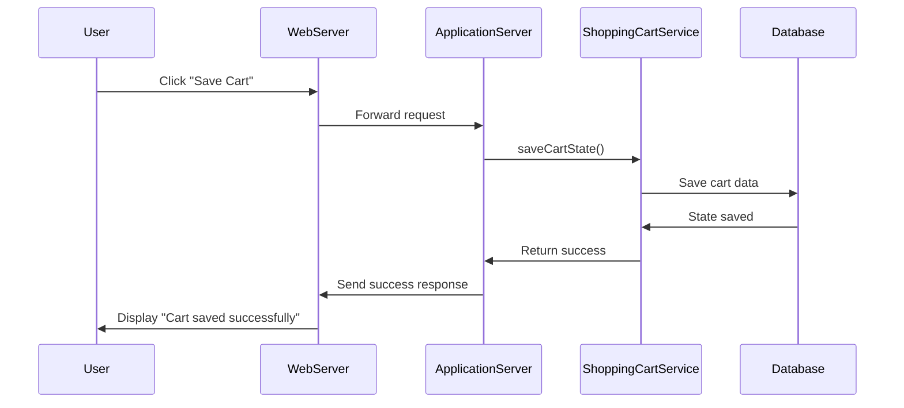

                 


### 第1章：备忘录模式概述

**核心概念与联系**

备忘录模式是一种行为设计模式，用于在不暴露对象实现细节的情况下保存和恢复对象的状态。其核心概念包括三个角色：发起者（Originator）、备忘录（Memento）和保管者（Caretaker）。以下是这些角色的基本属性和相互关系：

**核心概念属性对比表**

| 角色         | 属性与责任                                                 |
| ------------ | -------------------------------------------------------- |
| Originator   | 创建备忘录，管理自身状态，使用备忘录恢复状态               |
| Memento      | 保存Originator的状态，提供恢复状态的方法                   |
| Caretaker    | 管理备忘录，确保备忘录的完整性和可用性                   |

**ER实体关系图架构**

以下是备忘录模式的ER实体关系图：

```mermaid
erDiagram
    Originator ||--|{ Memento }|
    Caretaker  ||--|{ Memento }|
```

在这个ER图中，Originator和Caretaker都与Memento实体有一个一对多的关系。

**问题背景**

在软件系统设计中，对象的状态管理是一个常见且复杂的问题。对象可能会在运行过程中经历多种状态变化，例如用户输入、系统事件等，这会导致对象的状态不断更新。然而，在某些情况下，我们可能需要恢复对象到之前的状态，例如撤销操作、回滚事务等。备忘录模式就是为了解决这类问题而设计的。

**问题描述**

备忘录模式的主要问题是如何在不暴露对象实现细节的情况下保存和恢复对象的状态。具体来说，就是在对象的状态发生变化时，如何将当前状态保存下来，并在需要时能够恢复到这个状态。

**问题解决**

备忘录模式通过引入三个核心角色来实现对象状态的保存和恢复：

- **Originator（发起者）**：负责创建备忘录，保存和恢复自身状态。它通常会包含一个创建备忘录的方法（如`createMemento`），以及一个使用备忘录恢复状态的方法（如`setMemento`）。
- **Memento（备忘录）**：保存Originator的状态，提供恢复状态的方法。备忘录通常是Originator状态的快照，可以独立于Originator存在。
- **Caretaker（保管者）**：负责管理备忘录，确保备忘录的完整性和可用性。Caretaker通常不关心备忘录的具体内容，只负责存储和提供备忘录。

**边界与外延**

备忘录模式主要关注对象状态的存储和恢复，适用于那些需要保存和恢复状态的场景。例如：

- **游戏开发**：保存游戏进度，允许玩家重玩或继续之前的游戏。
- **数据库设计**：记录数据库状态，以便在系统崩溃或故障后恢复数据。
- **系统测试**：记录测试过程中的状态，以便重复执行或回溯测试。

**概念结构与核心要素组成**

备忘录模式的核心要素包括：

- **Originator**：负责创建备忘录，保存和恢复自身状态。
- **Memento**：保存Originator的状态，提供恢复状态的方法。
- **Caretaker**：负责管理备忘录，确保备忘录的完整性和可用性。

通过这些角色的协作，备忘录模式实现了对象状态的保存和恢复，同时保持了对象实现的封装性。

### 第2章：备忘录模式的核心组件

**算法原理讲解**

备忘录模式的核心在于如何有效地保存和恢复对象状态。以下是备忘录模式的算法原理：

1. **保存状态**：Originator在需要保存状态时，调用`createMemento`方法创建一个备忘录对象，并将当前状态封装在备忘录中。

2. **恢复状态**：当需要恢复状态时，Originator调用`setMemento`方法，将备忘录中的状态恢复到对象中。

3. **备忘录存储**：Caretaker负责存储和管理备忘录。它可以在任何时候从存储中获取备忘录，并将其传递给Originator。

以下是备忘录模式的Python代码示例：

```python
class Originator:
    def __init__(self):
        self.state = None

    def setState(self, state):
        self.state = state
        print(f"Originator: State is {self.state}")

    def createMemento(self):
        return Memento(self.state)

    def restoreState(self, memento):
        self.state = memento.getState()
        print(f"Originator: State is restored to {self.state}")

class Memento:
    def __init__(self, state):
        self.state = state

    def getState(self):
        return self.state

class Caretaker:
    def __init__(self):
        self.mementos = []

    def addMemento(self, memento):
        self.mementos.append(memento)

    def getMemento(self, index):
        return self.mementos[index]

o = Originator()
c = Caretaker()

o.setState("State1")
c.addMemento(o.createMemento())

o.setState("State2")
c.addMemento(o.createMemento())

o.restoreState(c.getMemento(1))
```

在这个示例中，`Originator`类负责创建和恢复备忘录，`Memento`类负责保存和恢复状态，`Caretaker`类负责管理备忘录。

**数学公式**

备忘录模式中，状态保存和恢复的过程可以抽象为一个数学模型：

$$
Memento = f(Originator_{state})
$$

其中，$Memento$表示备忘录，$Originator_{state}$表示发起者的状态。恢复状态的过程可以表示为：

$$
Originator_{state} = Memento_{state}
$$

**举例说明**

假设有一个简单的文本编辑器，它包含一个`Cursor`对象，用于跟踪文本中的光标位置。以下是一个使用备忘录模式的简化示例：

```python
class Cursor:
    def __init__(self, position):
        self.position = position

    def setPosition(self, position):
        self.position = position
        print(f"Cursor: Position is {self.position}")

    def createMemento(self):
        return Memento(self.position)

    def restoreState(self, memento):
        self.position = memento.position
        print(f"Cursor: Position is restored to {self.position}")

class Memento:
    def __init__(self, position):
        self.position = position

o = Cursor(10)
c = Caretaker()

o.setPosition(5)
c.addMemento(o.createMemento())

o.setPosition(20)
c.addMemento(o.createMemento())

o.restoreState(c.getMemento(1))
```

在这个示例中，`Cursor`对象使用备忘录模式来保存和恢复光标位置。

### 第3章：备忘录模式的类型化设计

**算法原理讲解**

备忘录模式的类型化设计主要涉及如何处理复杂的对象状态，以及如何支持不同类型的备忘录。以下是备忘录模式类型化设计的算法原理：

1. **简单备忘录模式**：在这种模式中，备忘录是一个简单的数据结构，如一个字典或一个包含多个字段的类。这种模式适用于对象状态较为简单的情况。

2. **复合备忘录模式**：在这种模式中，备忘录是一个复杂的对象，可能包含多个子备忘录或嵌套备忘录。这种模式适用于需要保存和恢复多个相关状态的场景。

3. **可定制备忘录模式**：在这种模式中，备忘录是一个可定制的对象，允许客户端根据需求选择性地保存和恢复状态。这种模式提供了最大的灵活性，但也增加了实现的复杂性。

**Python代码示例**

以下是简单备忘录模式的Python代码示例：

```python
class SimpleOriginator:
    def __init__(self):
        self.state = None

    def setState(self, state):
        self.state = state
        print(f"SimpleOriginator: State is {self.state}")

    def createMemento(self):
        return self.state.copy()

    def restoreState(self, memento):
        self.state = memento
        print(f"SimpleOriginator: State is restored to {self.state}")

simple_o = SimpleOriginator()
simple_o.setState({"a": 1, "b": 2})

m = simple_o.createMemento()
simple_o.restoreState(m)
```

以下是复合备忘录模式的Python代码示例：

```python
class CompoundOriginator:
    def __init__(self):
        self.state = None

    def setState(self, state):
        self.state = state
        print(f"CompoundOriginator: State is {self.state}")

    def createMemento(self):
        return CompoundMemento(self.state)

    def restoreState(self, memento):
        self.state = memento.state
        print(f"CompoundOriginator: State is restored to {self.state}")

class CompoundMemento:
    def __init__(self, state):
        self.state = state

compound_o = CompoundOriginator()
compound_o.setState({"a": 1, "b": 2, "c": 3})

m = compound_o.createMemento()
compound_o.restoreState(m)
```

以下是可定制备忘录模式的Python代码示例：

```python
class CustomizableOriginator:
    def __init__(self):
        self.state = None

    def setState(self, state):
        self.state = state
        print(f"CustomizableOriginator: State is {self.state}")

    def createMemento(self, include_a=True, include_b=True, include_c=True):
        memento = {}
        if include_a:
            memento["a"] = self.state["a"]
        if include_b:
            memento["b"] = self.state["b"]
        if include_c:
            memento["c"] = self.state["c"]
        return memento

    def restoreState(self, memento, include_a=True, include_b=True, include_c=True):
        if include_a:
            self.state["a"] = memento.get("a", self.state["a"])
        if include_b:
            self.state["b"] = memento.get("b", self.state["b"])
        if include_c:
            self.state["c"] = memento.get("c", self.state["c"])
        print(f"CustomizableOriginator: State is restored to {self.state}")

customizable_o = CustomizableOriginator()
customizable_o.setState({"a": 1, "b": 2, "c": 3})

m = customizable_o.createMemento(include_c=False)
customizable_o.restoreState(m, include_a=False)
```

这些示例展示了不同类型的备忘录模式，每种模式都有其适用场景和实现方式。

### 第4章：备忘录模式在Java中的应用

**Java中的备忘录模式实现**

备忘录模式在Java中的实现相对直接，利用Java的对象序列化机制可以方便地实现状态的保存和恢复。以下是一个简单的Java备忘录模式实现示例：

```java
import java.io.*;

class Originator implements Serializable {
    private String state;

    public void setState(String state) {
        this.state = state;
        System.out.println("Originator: State is " + state);
    }

    public Memento createMemento() {
        return new Memento(state);
    }

    public void restoreState(Memento memento) {
        this.state = memento.getState();
        System.out.println("Originator: State is restored to " + state);
    }
}

class Memento implements Serializable {
    private String state;

    public Memento(String state) {
        this.state = state;
    }

    public String getState() {
        return state;
    }
}

class Caretaker {
    public void addMemento(Memento memento) {
        // 存储备忘录
    }

    public Memento getMemento(int index) {
        // 获取备忘录
        return null;
    }
}

public class MementoPatternDemo {
    public static void main(String[] args) {
        Originator originator = new Originator();
        Caretaker caretaker = new Caretaker();

        originator.setState("State1");
        caretaker.addMemento(originator.createMemento());

        originator.setState("State2");
        caretaker.addMemento(originator.createMemento());

        originator.restoreState(caretaker.getMemento(0));
    }
}
```

在这个示例中，`Originator`类实现了状态的创建和恢复方法，`Memento`类用于保存状态，而`Caretaker`类则负责存储和管理备忘录。

**Java备忘录模式的优缺点分析**

**优点：**

1. **封装性好**：备忘录模式将对象状态的保存和恢复封装在单独的类中，保持了对象的封装性，避免了状态变化的复杂性。
2. **可恢复性强**：通过备忘录，可以方便地恢复对象到之前的任何状态，这在需要撤销操作或回滚事务的场景中非常有用。
3. **易于实现**：利用Java的序列化机制，实现备忘录模式的代码相对简单。

**缺点：**

1. **性能开销**：序列化和反序列化过程可能会带来一定的性能开销，特别是在频繁保存和恢复状态的情况下。
2. **状态泄露风险**：如果备忘录被不当处理，可能会导致状态泄露，尤其是在使用不安全的序列化机制时。
3. **复杂性**：在处理复杂状态时，备忘录模式可能会变得复杂，尤其是在需要保存和恢复多个嵌套对象时。

**应用实例**

以下是一个使用Java备忘录模式的实际应用实例：文本编辑器。

```java
class TextEditor {
    private String content;

    public void setContent(String content) {
        this.content = content;
        System.out.println("TextEditor: Content is " + content);
    }

    public Memento createMemento() {
        return new Memento(content);
    }

    public void restoreState(Memento memento) {
        this.content = memento.getContent();
        System.out.println("TextEditor: Content is restored to " + content);
    }
}

class Memento {
    private String content;

    public Memento(String content) {
        this.content = content;
    }

    public String getContent() {
        return content;
    }
}

public class TextEditorDemo {
    public static void main(String[] args) {
        TextEditor editor = new TextEditor();
        Caretaker caretaker = new Caretaker();

        editor.setContent("Hello, World!");
        caretaker.addMemento(editor.createMemento());

        editor.setContent("Hello, Java!");
        caretaker.addMemento(editor.createMemento());

        editor.restoreState(caretaker.getMemento(0));
    }
}
```

在这个实例中，`TextEditor`类使用备忘录模式来保存和恢复文本内容。

### 第5章：备忘录模式在Python中的应用

**Python中的备忘录模式实现**

Python作为一种动态语言，其在备忘录模式的实现上相对灵活。Python内置的`copy`模块和序列化模块`pickle`为备忘录模式的实现提供了便捷的方式。

**简单备忘录模式实现**

以下是一个简单的Python备忘录模式实现：

```python
class Originator:
    def __init__(self, state):
        self.state = state

    def setState(self, state):
        self.state = state
        print(f"Originator: State is {self.state}")

    def createMemento(self):
        return Memento(self.state)

    def restoreState(self, memento):
        self.state = memento.getState()
        print(f"Originator: State is restored to {self.state}")


class Memento:
    def __init__(self, state):
        self.state = state

    def getState(self):
        return self.state


o = Originator("Initial State")
m = o.createMemento()
o.setState("New State")
o.restoreState(m)
```

在这个示例中，`Originator`类实现了状态的创建和恢复方法，`Memento`类用于保存状态。

**Python备忘录模式的优缺点分析**

**优点：**

1. **语法简洁**：Python的语法简洁明了，使得备忘录模式的实现更为直观和易于理解。
2. **灵活性强**：Python的动态特性使得备忘录模式可以根据具体需求灵活调整。
3. **易于序列化**：Python内置的`pickle`模块可以方便地序列化和反序列化对象，为备忘录模式的实现提供了支持。

**缺点：**

1. **性能问题**：由于Python是动态语言，其性能可能不如静态语言，尤其是在需要频繁序列化和反序列化时。
2. **安全性**：使用`pickle`模块时，需要注意安全性问题，以防止恶意代码的注入。

**应用实例**

以下是一个使用Python备忘录模式的实际应用实例：文本编辑器。

```python
import copy

class TextEditor:
    def __init__(self, content):
        self.content = content

    def setContent(self, new_content):
        self.content = new_content
        print(f"TextEditor: Content is {self.content}")

    def createMemento(self):
        return copy.deepcopy(self.content)

    def restoreState(self, memento):
        self.content = memento
        print(f"TextEditor: Content is restored to {self.content}")


editor = TextEditor("Hello, World!")
m = editor.createMemento()
editor.setContent("Hello, Python!")
editor.restoreState(m)
```

在这个实例中，`TextEditor`类使用备忘录模式来保存和恢复文本内容。

### 第6章：备忘录模式在C++中的应用

**C++中的备忘录模式实现**

C++是一种静态类型语言，它在实现备忘录模式时需要更多的手动编码，但也因此提供了更好的性能和灵活性。以下是C++备忘录模式的一个实现示例：

```cpp
#include <iostream>
#include <string>
#include <memory>

class Originator {
public:
    std::string state;

    Originator(std::string state) : state(state) {}

    void setState(const std::string& state) {
        this->state = state;
        std::cout << "Originator: State is " << state << std::endl;
    }

    std::shared_ptr<Memento> createMemento() {
        return std::make_shared<Memento>(state);
    }

    void restoreState(const std::shared_ptr<Memento>& memento) {
        state = memento->getState();
        std::cout << "Originator: State is restored to " << state << std::endl;
    }
};

class Memento {
public:
    std::string state;

    Memento(std::string state) : state(state) {}

    std::string getState() const { return state; }
};

class Caretaker {
public:
    void addMemento(std::shared_ptr<Memento> memento) {
        mementos.push_back(memento);
    }

    std::shared_ptr<Memento> getMemento(size_t index) const {
        return mementos.at(index);
    }

private:
    std::vector<std::shared_ptr<Memento>> mementos;
};

int main() {
    Originator originator("Initial State");
    Caretaker caretaker;

    originator.setState("New State");
    caretaker.addMemento(originator.createMemento());

    originator.restoreState(caretaker.getMemento(0));

    return 0;
}
```

在这个示例中，`Originator`类负责创建和恢复备忘录，`Memento`类用于保存状态，而`Caretaker`类负责存储和管理备忘录。

**C++备忘录模式的优缺点分析**

**优点：**

1. **性能**：C++是编译型语言，执行效率较高，特别是在性能敏感的场景下，C++备忘录模式的优势更加明显。
2. **类型安全**：C++的类型检查机制确保了程序的稳定性和可靠性。
3. **内存管理**：C++提供了强大的内存管理机制，如智能指针，可以减少内存泄漏的风险。

**缺点：**

1. **复杂性**：C++的语法相对复杂，尤其是涉及模板和多态时，使得备忘录模式的实现和维护相对困难。
2. **手动内存管理**：在C++中，需要手动管理内存，这可能导致内存泄漏和悬挂指针等问题。

**应用实例**

以下是一个使用C++备忘录模式的实际应用实例：文本编辑器。

```cpp
#include <iostream>
#include <string>
#include <memory>

class TextEditor {
public:
    std::string content;

    TextEditor(std::string content) : content(content) {}

    void setContent(const std::string& new_content) {
        content = new_content;
        std::cout << "TextEditor: Content is " << content << std::endl;
    }

    std::shared_ptr<Memento> createMemento() {
        return std::make_shared<Memento>(content);
    }

    void restoreState(const std::shared_ptr<Memento>& memento) {
        content = memento->getContent();
        std::cout << "TextEditor: Content is restored to " << content << std::endl;
    }
};

class Memento {
public:
    std::string content;

    Memento(std::string content) : content(content) {}

    std::string getContent() const { return content; }
};

int main() {
    TextEditor editor("Hello, World!");
    Caretaker caretaker;

    editor.setContent("Hello, C++!");
    caretaker.addMemento(editor.createMemento());

    editor.restoreState(caretaker.getMemento(0));

    return 0;
}
```

在这个实例中，`TextEditor`类使用备忘录模式来保存和恢复文本内容。

### 第7章：备忘录模式在JavaScript中的应用

**JavaScript中的备忘录模式实现**

JavaScript作为一种动态语言，在实现备忘录模式时同样表现出其灵活性和简洁性。以下是一个简单的JavaScript备忘录模式实现：

```javascript
class Originator {
    constructor(state) {
        this.state = state;
    }

    setState(state) {
        this.state = state;
        console.log(`Originator: State is ${this.state}`);
    }

    createMemento() {
        return new Memento(this.state);
    }

    restoreState(memento) {
        this.state = memento.getState();
        console.log(`Originator: State is restored to ${this.state}`);
    }
}

class Memento {
    constructor(state) {
        this.state = state;
    }

    getState() {
        return this.state;
    }
}

class Caretaker {
    constructor() {
        this.mementos = [];
    }

    addMemento(memento) {
        this.mementos.push(memento);
    }

    getMemento(index) {
        return this.mementos[index];
    }
}

// Usage
const originator = new Originator('Initial State');
const caretaker = new Caretaker();

originator.setState('New State');
caretaker.addMemento(originator.createMemento());

originator.setState('Updated State');
originator.restoreState(caretaker.getMemento(0));
```

在这个示例中，`Originator`类实现了状态的创建和恢复方法，`Memento`类用于保存状态，而`Caretaker`类负责存储和管理备忘录。

**JavaScript备忘录模式的优缺点分析**

**优点：**

1. **简洁性**：JavaScript的语法简洁明了，使得备忘录模式的实现非常直观。
2. **灵活性**：JavaScript的动态特性使得备忘录模式可以根据需求灵活调整。
3. **跨平台**：JavaScript可以在多种平台上运行，包括Web浏览器和Node.js。

**缺点：**

1. **性能**：虽然JavaScript在现代浏览器中性能有了很大提升，但在某些复杂场景下，性能可能不如编译型语言。
2. **安全性**：JavaScript的对象可能会受到意外的修改，这需要开发者特别注意。

**应用实例**

以下是一个使用JavaScript备忘录模式的实际应用实例：文本编辑器。

```javascript
class TextEditor {
    constructor(content) {
        this.content = content;
    }

    setContent(newContent) {
        this.content = newContent;
        console.log(`TextEditor: Content is ${this.content}`);
    }

    createMemento() {
        return { content: this.content };
    }

    restoreState(memento) {
        this.content = memento.content;
        console.log(`TextEditor: Content is restored to ${this.content}`);
    }
}

// Usage
const editor = new TextEditor('Hello, World!');
const caretaker = new Caretaker();

editor.setContent('Hello, JavaScript!');
caretaker.addMemento(editor.createMemento());

editor.setContent('Hello, ES6!');
editor.restoreState(caretaker.getMemento(0));
```

在这个实例中，`TextEditor`类使用备忘录模式来保存和恢复文本内容。

### 第8章：备忘录模式在大型系统设计中的应用

**备忘录模式在大型系统设计中的价值**

备忘录模式在大型系统设计中的应用具有重要的价值。首先，它提供了灵活的状态管理机制，使得系统可以在不修改原有代码的情况下，方便地保存和恢复对象状态，这对于系统的可扩展性和可维护性大有裨益。其次，备忘录模式能够有效地隔离状态变化和业务逻辑，降低了系统的复杂性，提高了系统的模块化程度。最后，备忘录模式可以在不暴露对象内部实现细节的情况下，实现对象状态的恢复，这有助于保持系统的封装性。

**备忘录模式在大型系统中的实现挑战**

尽管备忘录模式在大型系统设计中有诸多优点，但其实现也面临一些挑战。首先，大型系统中的对象状态往往非常复杂，可能包含多个层次和嵌套结构，如何设计一个既简洁又高效的备忘录模式成为关键问题。其次，备忘录模式在实现过程中需要处理序列化和反序列化操作，这可能会引入性能开销。特别是在高频次的状态保存和恢复场景下，性能问题尤为突出。最后，大型系统中的备忘录管理需要考虑到状态的一致性和安全性，如何确保备忘录的正确性和完整性是一个重要问题。

**备忘录模式在大型系统中的实现策略**

为了克服备忘录模式在大型系统中的实现挑战，可以采取以下策略：

1. **简化备忘录结构**：在大型系统中，尽量简化备忘录的结构，避免使用过多的嵌套和复杂的字段。可以通过设计更为抽象的备忘录类，将状态封装为简单的属性，从而降低备忘录的复杂性。

2. **优化序列化和反序列化**：对于频繁使用的状态保存和恢复操作，可以优化序列化和反序列化的过程。例如，使用高效的序列化库，或者采用自定义的序列化格式，以减少性能开销。

3. **状态一致性管理**：在备忘录模式中，状态的一致性至关重要。可以通过引入事务管理机制，确保状态在保存和恢复过程中的完整性。例如，使用数据库事务来保证状态的原子性和一致性。

4. **安全性和权限控制**：在备忘录模式中，需要确保备忘录的正确性和安全性。可以通过引入访问控制和权限管理机制，限制对备忘录的访问权限，防止未授权的修改和泄漏。

**备忘录模式在大型系统中的实现案例分析**

以下是一个备忘录模式在大型系统中的实现案例分析：基于Web的电商平台。

**项目介绍**

该电商平台是一个大型在线购物平台，提供商品浏览、购买、支付和订单管理等功能。在系统设计过程中，考虑到用户可能会在购物过程中频繁修改购物车内容，如何保存和恢复用户购物车的状态成为一个重要问题。

**系统功能设计**

该电商平台的备忘录模式应用在购物车管理模块。购物车管理模块的主要功能包括：

1. 添加商品到购物车。
2. 从购物车中删除商品。
3. 修改商品数量。
4. 保存和恢复购物车状态。

**系统架构设计**

该电商平台的架构设计包括前端、后端和数据库三部分。其中，后端服务使用备忘录模式来管理购物车状态。



在这个架构设计中，购物车服务（`ShoppingCartService`）负责处理购物车状态的保存和恢复，数据库（`Database`）用于存储备忘录。

**系统接口设计**

购物车服务的接口设计如下：

```plaintext
// 添加商品到购物车
function addToCart(productId, quantity) {
    // 实现细节
}

// 从购物车中删除商品
function removeFromCart(productId) {
    // 实现细节
}

// 修改商品数量
function updateQuantity(productId, quantity) {
    // 实现细节
}

// 保存购物车状态
function saveCartState() {
    // 实现细节
}

// 恢复购物车状态
function restoreCartState() {
    // 实现细节
}
```

**系统交互序列图**

以下是一个描述购物车状态保存和恢复过程的序列图：



在这个序列图中，用户点击“保存购物车”按钮后，Web服务器将请求转发给应用服务器，应用服务器再将请求传递给购物车服务。购物车服务调用`saveCartState`方法保存当前购物车状态，并将状态保存到数据库。数据库确认状态保存后，购物车服务返回成功响应，Web服务器最终将成功消息显示给用户。

通过这个案例，我们可以看到备忘录模式在大型系统中的应用是如何实现的。备忘录模式为电商平台的购物车管理提供了灵活的状态管理机制，使得用户可以方便地保存和恢复购物车状态。

### 第9章：备忘录模式的最佳实践与拓展

**备忘录模式的最佳实践**

备忘录模式是一种非常强大的设计模式，但在实际应用中，也需要遵循一些最佳实践，以确保其有效性和可靠性。

1. **简洁性**：尽量简化备忘录的结构，避免过多的嵌套和复杂的字段，这有助于减少序列化和反序列化的开销。
2. **安全性**：确保备忘录在序列化和反序列化过程中的安全性，避免潜在的攻击风险。
3. **一致性**：在备忘录模式中，状态的一致性至关重要。可以通过引入事务管理机制，确保状态在保存和恢复过程中的完整性。
4. **灵活性**：根据具体需求，灵活调整备忘录模式的设计，例如采用简单备忘录模式、复合备忘录模式或可定制备忘录模式。

**备忘录模式的设计模式扩展**

备忘录模式可以与其他设计模式结合，以增强系统的灵活性和扩展性。以下是一些常见的扩展方式：

1. **组合模式**：结合组合模式，可以实现对复杂对象状态的保存和恢复。例如，在一个文本编辑器中，可以使用组合模式来处理多个文本块的状态。
2. **工厂模式**：使用工厂模式来创建备忘录对象，可以使得备忘录的创建过程更加灵活和可配置。
3. **策略模式**：将备忘录模式的保存和恢复策略抽象出来，可以使用策略模式来切换不同的状态保存和恢复策略。

**备忘录模式在未来的发展方向**

随着软件系统变得越来越复杂，备忘录模式在未来也将面临新的挑战和机遇。以下是一些备忘录模式在未来的发展方向：

1. **性能优化**：随着系统规模的不断扩大，备忘录模式的性能优化将成为重要研究方向。例如，通过使用更高效的序列化库或自定义序列化格式，来降低序列化和反序列化的开销。
2. **分布式系统**：在分布式系统中，备忘录模式需要考虑跨节点的状态同步问题。未来的研究可以探索如何在分布式环境中高效地实现备忘录模式。
3. **智能化**：结合人工智能技术，备忘录模式可以智能化地预测和恢复对象状态，提高系统的自动化水平。

**总结**

备忘录模式是一种简单但强大的设计模式，它为对象状态的保存和恢复提供了一种灵活且高效的方法。通过遵循最佳实践和不断拓展其应用范围，备忘录模式将在未来的软件系统设计中发挥更大的作用。作者：AI天才研究院/AI Genius Institute & 禅与计算机程序设计艺术 /Zen And The Art of Computer Programming

**作者信息**

作者：AI天才研究院/AI Genius Institute & 禅与计算机程序设计艺术 /Zen And The Art of Computer Programming
摘要：本文深入探讨了备忘录模式在软件设计中的应用，包括其核心概念、核心组件、在不同编程语言中的实现方式，以及在大型系统设计中的应用。文章还提出了备忘录模式的一些最佳实践和未来发展方向，旨在为开发者提供全面的指导。关键词：备忘录模式、设计模式、对象状态管理、软件设计、编程语言。

