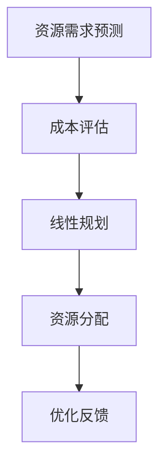
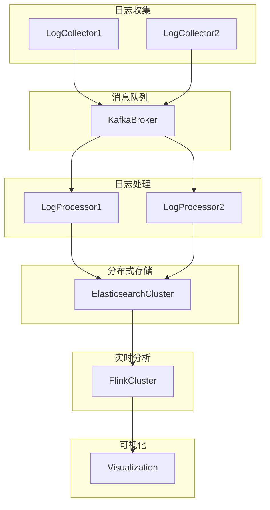
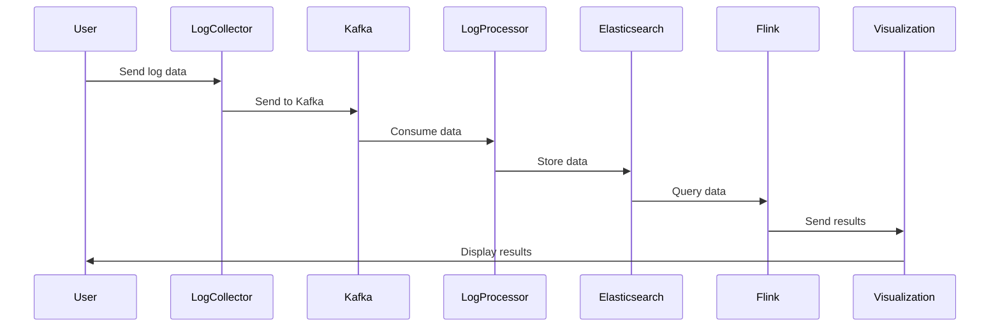

                 

## 文章标题：多云架构：避免供应商锁定的策略

> 关键词：多云架构、供应商锁定、服务选择、设计原则、实战应用、最佳实践

> 摘要：本文旨在探讨多云架构在避免供应商锁定方面的策略。我们将首先介绍多云架构的概念和背景，然后分析供应商锁定的现象，探讨如何通过选择合适的云服务提供商、设计原则和算法来构建一个灵活、可扩展的多云架构，并分享实际项目的实战经验，最后提供最佳实践和建议，以帮助读者更好地应对供应商锁定挑战。

## 目录大纲

1. 引言
   1.1 问题背景
   1.2 供应商锁定现象
   1.3 云计算与多云架构
   1.4 本书结构

2. 多云架构概述
   2.1 多云架构定义
   2.2 多云架构的优势
   2.3 多云架构的挑战
   2.4 多云架构的类型

3. 云服务提供商选择策略
   3.1 服务商评估方法
   3.2 服务商选择流程
   3.3 资源优化策略
   3.4 服务水平协议（SLA）的重要性

4. 多云架构设计原则
   4.1 可用性与容错性设计
   4.2 数据安全性与隐私保护
   4.3 服务连续性与灾难恢复
   4.4 服务质量监控与优化

5. 核心概念与联系
   5.1 云服务模型（IaaS、PaaS、SaaS）
   5.2 多云架构中的核心概念
   5.3 ER实体关系图

6. 算法原理讲解
   6.1 算法原理
   6.2 算法流程图
   6.3 Python源代码实现
   6.4 数学模型与公式

7. 系统分析与架构设计方案
   7.1 项目介绍
   7.2 系统功能设计
   7.3 系统架构设计
   7.4 系统接口设计
   7.5 系统交互序列图

8. 项目实战
   8.1 环境安装
   8.2 系统核心实现源代码
   8.3 代码应用解读与分析
   8.4 实际案例分析与详细讲解
   8.5 项目小结

9. 最佳实践与拓展
   9.1 最佳实践
   9.2 小结
   9.3 注意事项
   9.4 拓展阅读

### 第1章 引言

#### 1.1 问题背景

随着云计算的普及，越来越多的企业开始将业务迁移到云上。然而，云服务的市场高度集中，几家大型云服务提供商（如亚马逊AWS、微软Azure和谷歌云）占据了市场的主导地位。这种现象不仅带来了技术上的标准化，也带来了一些潜在的风险，尤其是供应商锁定问题。供应商锁定指的是客户在某一云服务提供商上投入大量资源后，由于技术和经济上的障碍，难以转移到其他提供商的情况。这种锁定可能使企业面临高昂的转换成本，失去市场竞争力和灵活性。

#### 1.2 供应商锁定现象

供应商锁定通常表现为以下几个方面：

1. **技术锁定**：云服务提供商使用特定的编程语言、框架或工具，使得迁移到其他平台变得复杂和昂贵。
2. **数据锁定**：数据格式、存储方案或接口设计等可能导致数据难以在不同平台间迁移或共享。
3. **经济锁定**：长期合同、高额的转换成本或迁移过程中的业务中断可能使企业不愿或无法迁移。
4. **市场锁定**：市场主导地位的服务提供商可能会通过排他性条款限制客户的选择。

#### 1.3 云计算与多云架构

云计算的本质是为企业提供灵活、可扩展的计算资源和服务。然而，单一云服务提供商可能无法满足所有业务需求，尤其是在服务种类、服务质量、价格等方面。因此，多云架构应运而生。多云架构指的是在多个云服务提供商之间部署和管理应用和数据的一种策略。通过利用多个云服务提供商的优势，企业可以降低风险、提高灵活性和性能。

#### 1.4 本书结构

本文将首先介绍多云架构的概念、优势和挑战，然后探讨如何选择合适的云服务提供商、设计多云架构的原则和算法。接着，我们将通过一个实际项目展示多云架构的设计和实现过程，并分享最佳实践和注意事项。通过本文的阅读，读者将了解如何构建一个灵活、高效且避免供应商锁定的多云架构。

### 第2章 多云架构概述

#### 2.1 多云架构定义

多云架构（Multi-Cloud Architecture）指的是在一个企业或组织的信息技术基础设施中，同时使用两个或更多不同的云服务提供商。这些云服务提供商可以是公共云（如亚马逊AWS、微软Azure、谷歌云）、私有云或混合云。通过整合这些不同类型的云服务，企业可以优化资源利用率、提高系统的可靠性和灵活性。

#### 2.2 多云架构的优势

多云架构具有以下几个显著的优势：

1. **灵活性**：企业可以根据不同的业务需求选择最适合的云服务提供商，从而实现更灵活的资源配置和服务定制。
2. **降低风险**：通过不依赖于单一云服务提供商，企业可以在一个提供商出现问题时迅速转移到其他提供商，降低业务中断风险。
3. **成本优化**：企业可以根据云服务提供商的价格和服务特点来优化成本，避免被单一提供商的价格锁定。
4. **技术多样性**：多云架构允许企业使用多种技术和服务，促进技术创新和业务发展。
5. **数据安全性与合规性**：企业可以根据数据类型和合规性要求，选择在不同云服务提供商上存储数据，确保数据安全和合规。

#### 2.3 多云架构的挑战

尽管多云架构具有许多优势，但在实施过程中也面临着一系列挑战：

1. **管理复杂性**：多云架构需要更多的管理和监控工作，包括跨云服务提供商的配置管理、性能监控和安全防护。
2. **数据一致性**：在多个云服务提供商之间同步数据可能面临数据一致性和访问控制问题。
3. **服务兼容性**：不同云服务提供商之间的API和服务模型可能存在差异，导致集成和服务兼容性问题。
4. **转换成本**：从单一云迁移到多云架构可能涉及高额的转换成本和业务中断风险。
5. **人才短缺**：具备多云架构管理和运维能力的人才相对较少，可能影响多云架构的实施效果。

#### 2.4 多云架构的类型

根据企业需求和技术实施策略，多云架构可以分为以下几种类型：

1. **混合多云**：在私有云和公有云之间进行资源分配和应用部署，通常用于需要高度控制性和数据安全性但仍然需要灵活性的企业。
2. **战略多云**：在企业内部使用多个公有云服务提供商，以实现更优的服务和成本配置。
3. **互操作性多云**：强调不同云服务提供商之间的互操作性和数据共享，通常用于需要跨多个云平台集成业务流程的企业。
4. **区域性多云**：根据地理位置选择不同云服务提供商，以优化数据传输延迟和成本。

通过了解多云架构的定义、优势、挑战和类型，企业可以更好地制定多云战略，以避免供应商锁定，提高业务灵活性和竞争力。

### 第3章 云服务提供商选择策略

#### 3.1 服务商评估方法

选择合适的云服务提供商是构建多云架构的关键步骤。以下是一些评估服务商的方法：

1. **性能指标**：评估服务商的带宽、吞吐量、响应时间等性能指标，确保其能够满足业务需求。
2. **服务范围**：了解服务商提供的服务类型，如IaaS、PaaS、SaaS等，确保其能够覆盖企业的应用场景。
3. **安全性**：评估服务商的安全措施，包括数据加密、访问控制、网络安全等，确保数据安全和合规性。
4. **成本**：比较不同服务商的价格，考虑长期成本和潜在优惠，选择最具性价比的提供商。
5. **可靠性**：了解服务商的故障恢复时间、服务连续性和灾难恢复计划，确保服务的高可用性。
6. **服务支持**：评估服务商的技术支持服务，包括响应时间、解决方案质量等，确保在遇到问题时能够得到及时和有效的帮助。

#### 3.2 服务商选择流程

选择云服务提供商的流程通常包括以下步骤：

1. **需求分析**：明确企业的业务需求、技术需求和预算限制，确保选择的服务商能够满足这些需求。
2. **市场调研**：调研市场上主要的云服务提供商，了解其产品和服务特点。
3. **筛选**：根据评估方法和需求分析结果，筛选出符合要求的服务商。
4. **演示和测试**：与服务商进行技术演示和性能测试，验证其服务的实际效果。
5. **谈判和签订合同**：与选定的服务商进行谈判，达成一致后签订合同。
6. **评估和反馈**：在服务商提供服务的过程中，定期评估其服务质量，提供反馈以持续优化。

#### 3.3 资源优化策略

在选择了合适的云服务提供商后，企业可以通过以下策略优化资源利用：

1. **混合使用**：在多个云服务提供商之间分配负载，根据服务质量和价格动态调整资源使用。
2. **自动化管理**：使用自动化工具管理资源分配和负载均衡，提高效率并降低人工成本。
3. **成本监控**：实时监控云服务的使用情况，根据实际需求调整资源配置，避免不必要的成本。
4. **服务优化**：定期评估和优化应用程序和服务，确保其能够在不同云服务提供商上高效运行。

#### 3.4 服务水平协议（SLA）的重要性

服务水平协议（SLA）是云服务提供商与客户之间的一项合同，明确了服务的质量、性能指标、故障恢复时间等关键条款。以下是SLA的重要性：

1. **质量保障**：SLA提供了对服务质量的具体承诺，确保服务提供商能够满足业务需求。
2. **责任界定**：SLA明确了双方在出现问题时应承担的责任，有助于降低风险。
3. **成本控制**：通过SLA中的费用结构和退款政策，企业可以更好地控制云服务成本。
4. **法律依据**：SLA作为合同条款，具有法律效力，为双方提供了法律保障。

选择合适的云服务提供商并优化资源使用是构建多云架构的关键。通过科学的选择和有效的管理，企业可以降低供应商锁定的风险，提高业务的灵活性和竞争力。

### 第4章 多云架构设计原则

#### 4.1 可用性与容错性设计

在多云架构中，可用性与容错性设计至关重要，确保系统在面对各种故障时能够持续提供服务。以下是一些关键原则：

1. **高可用性设计**：通过部署冗余服务和数据备份，确保系统在单点故障时仍能保持运行。例如，可以在多个区域和云服务提供商之间部署应用副本，并使用负载均衡器分发流量。

2. **故障转移与恢复**：设计故障转移机制，在发生故障时快速切换到备用系统。例如，使用自动化的故障检测和恢复工具，如AWS的Route 53，实现域名系统（DNS）的自动故障转移。

3. **分布式架构**：采用分布式架构，将系统分解为多个独立的服务和组件，每个组件可以在不同的云服务提供商上运行。这有助于隔离故障并提高系统的容错能力。

4. **弹性伸缩**：设计系统能够根据负载动态调整资源使用，以应对突发流量。例如，使用容器编排工具（如Kubernetes）实现自动化的水平扩展和垂直扩展。

5. **监控与报警**：实施全面的监控与报警机制，实时监测系统性能和健康状况。例如，使用Prometheus和Grafana监控关键指标，并设置阈值触发报警。

6. **灾难恢复计划**：制定灾难恢复计划，包括数据备份、故障转移站点和恢复流程。例如，定期进行数据备份并存储在异地，以备不时之需。

通过遵循这些原则，多云架构可以显著提高系统的可用性和容错性，降低故障对业务的影响。

#### 4.2 数据安全性与隐私保护

在多云架构中，数据安全性和隐私保护是确保业务连续性和合规性的关键。以下是一些设计原则：

1. **数据加密**：对存储和传输中的数据进行加密，使用加密算法（如AES）和加密库（如PyCrypto）保护敏感信息。

2. **访问控制**：实施严格的访问控制策略，确保只有授权用户才能访问敏感数据。例如，使用角色分配（Role-Based Access Control, RBAC）和属性集（Attribute-Based Access Control, ABAC）模型。

3. **数据备份与恢复**：定期进行数据备份，并确保备份数据的可恢复性。例如，使用云服务提供商提供的备份服务，如AWS的S3备份。

4. **网络隔离**：在网络层面实现隔离，例如使用虚拟专用云（VPC）和网络地址转换（NAT）隔离不同服务组件。

5. **合规性检查**：确保多云架构符合相关法律法规和行业标准，例如GDPR、HIPAA等。例如，使用合规性工具（如AWS CloudTrail）监控和报告操作日志。

6. **安全审计与监控**：定期进行安全审计，检测潜在的安全漏洞和风险。例如，使用安全信息和事件管理（SIEM）系统监控和响应安全事件。

通过遵循这些原则，多云架构可以在保障数据安全性和隐私保护的同时，确保业务的连续性和合规性。

#### 4.3 服务连续性与灾难恢复

服务连续性与灾难恢复是多云架构设计的核心，确保在发生各种故障时系统能够快速恢复，避免业务中断。以下是一些关键设计原则：

1. **备份和复制**：定期备份关键数据和配置，并将备份存储在异地。例如，使用AWS的RDS进行数据库备份，并存储在AWS S3上。

2. **故障检测与恢复**：实施自动化故障检测和恢复机制，例如使用AWS的Auto Scaling和Route 53检测和恢复服务实例。

3. **灾备站点**：建立灾备站点，在主要站点发生灾难时提供备用服务。例如，使用AWS的多区域部署和跨区域复制功能。

4. **定期演练**：定期进行灾难恢复演练，验证备份和恢复流程的有效性。例如，进行定期的故障转移和恢复测试。

5. **备份监控与报告**：监控备份状态和恢复时间，确保备份和恢复流程的高效和可靠。例如，使用AWS的Backup和RDS监控工具。

6. **多活跃区域部署**：在多个区域部署关键服务，确保在单点故障时业务仍然可用。例如，使用AWS的多区域负载均衡器。

通过遵循这些原则，多云架构可以在发生灾难时快速恢复服务，确保业务的连续性和稳定性。

#### 4.4 服务质量监控与优化

服务质量监控与优化是多云架构设计的重要环节，确保系统能够持续提供高性能和高质量的服务。以下是一些关键设计原则：

1. **性能监控**：监控关键性能指标（如响应时间、吞吐量、资源利用率等），确保系统在高负载下仍然稳定运行。例如，使用Prometheus和Grafana进行性能监控。

2. **监控告警**：设置实时告警机制，及时发现和响应性能问题。例如，使用Alertmanager和PagerDuty设置告警。

3. **自动化优化**：通过自动化工具优化资源使用和系统性能，例如使用Kubernetes的自动扩缩容功能。

4. **持续集成与部署**：实施CI/CD流程，快速迭代和部署新版本，确保系统保持最佳性能。例如，使用Jenkins和Docker进行持续集成和部署。

5. **用户体验监测**：监控用户的交互数据，优化用户体验。例如，使用Google Analytics和Hotjar分析用户行为。

6. **优化建议**：基于监控数据和用户反馈，提供优化建议和改进措施。例如，使用性能分析工具（如New Relic）生成优化报告。

通过遵循这些原则，多云架构可以在持续监控和优化中保持高性能和高质量的服务。

### 第5章 核心概念与联系

#### 5.1 云服务模型（IaaS、PaaS、SaaS）

在构建多云架构时，理解云服务模型（IaaS、PaaS、SaaS）及其应用场景至关重要。以下是这三个模型的核心概念和联系：

1. **基础设施即服务（IaaS）**：
   - **定义**：提供虚拟化的计算资源，如虚拟机、存储和网络。
   - **应用场景**：适用于需要高度定制和控制的场景，如数据中心迁移、应用开发和测试。
   - **联系**：IaaS作为底层基础设施，支持PaaS和SaaS的运行。

2. **平台即服务（PaaS）**：
   - **定义**：提供开发、运行和管理应用程序的平台。
   - **应用场景**：适用于应用程序开发和部署，如企业级应用开发、移动应用开发和大数据处理。
   - **联系**：PaaS在IaaS之上，提供开发和运行环境，支持SaaS的应用运行。

3. **软件即服务（SaaS）**：
   - **定义**：提供应用程序作为服务，用户通过互联网访问。
   - **应用场景**：适用于企业级应用、客户关系管理（CRM）、协作工具等。
   - **联系**：SaaS基于PaaS和IaaS，提供最终用户的应用程序和服务。

通过理解这三个模型的定义和应用场景，企业可以更好地选择合适的云服务模型，构建灵活、高效的多云架构。

#### 5.2 多云架构中的核心概念

构建多云架构需要理解一系列核心概念，以下列举并解释这些概念：

1. **多区域部署**：在多个地理区域部署应用和数据，提高系统的可用性和容错性。
2. **跨云服务集成**：整合不同云服务提供商的服务，实现数据和服务共享。
3. **自动化与编排**：使用自动化工具（如Kubernetes、Ansible）进行资源管理和流程编排。
4. **服务水平协议（SLA）**：明确云服务提供商与客户之间的服务质量承诺。
5. **成本管理**：监控和优化云服务成本，避免不必要的支出。
6. **数据安全与合规**：确保数据安全和符合法律法规要求。
7. **监控与告警**：实时监控系统性能和健康状况，及时响应异常事件。

这些核心概念是构建多云架构的基础，通过合理应用，企业可以实现灵活、高效和安全的云服务。

#### 5.3 ER实体关系图

在多云架构设计中，实体关系图（ER图）用于表示系统中的实体及其关系，有助于理解和设计复杂的系统架构。以下是一个多云架构中的ER实体关系图的示例：

```mermaid
erDiagram
    User ||--|{ Order } : 支持用户下单
    Order ||--|{ Product } : 订单包含产品
    Product ||--|{ Inventory } : 产品有库存限制
    User ||--|{ Payment } : 用户支付
    Payment ||--|{ Order } : 支付是订单的一部分
```

这个ER图表示了用户、订单、产品、库存、支付等实体之间的关系，如用户可以下单（支持用户下单关系），订单包含产品（订单包含产品关系），产品有库存限制（产品有库存限制关系），用户支付并支持订单（支付是订单的一部分关系）。

通过ER图，设计者可以清晰地理解系统中的实体和关系，从而更好地设计和管理多云架构。

### 第6章 算法原理讲解

在多云架构的设计与实现中，算法原理起到了至关重要的作用。以下将详细介绍一个用于多云资源调优的算法原理，并通过Python源代码实现和数学模型进行说明。

#### 6.1 算法原理

我们所讨论的算法主要用于优化多云架构中的资源分配，目标是使整体资源利用率最大化，同时满足服务质量（QoS）要求。算法的基本思路是：

1. **资源需求预测**：根据历史数据和当前负载，预测各服务组件在未来一段时间内的资源需求。
2. **成本分析**：计算在不同云服务提供商上运行每个组件的成本。
3. **优化策略**：基于资源需求预测和成本分析，动态调整资源分配，使整体成本最小化。

算法的核心步骤如下：

1. **需求预测**：使用时间序列分析方法（如ARIMA模型）预测各组件的CPU、内存、存储需求。
2. **成本评估**：根据各组件的需求和不同提供商的价格模型，评估运行成本。
3. **分配策略**：使用线性规划（Linear Programming，LP）算法，在满足QoS约束的条件下，优化资源分配。

#### 6.2 算法流程图

算法的流程图如下所示：



#### 6.3 Python源代码实现

以下是一个简单的Python实现示例，用于资源分配和优化：

```python
import numpy as np
from scipy.optimize import linprog

# 资源需求矩阵（CPU、内存、存储）
demand = np.array([[10, 20, 50], [5, 15, 30], [8, 12, 25]])

# 各云服务提供商的价格矩阵
prices = np.array([[0.5, 1.0, 2.0], [0.4, 0.8, 1.5], [0.3, 0.6, 1.0]])

# 目标函数（最小化总成本）
c = prices.T

# 约束条件（资源需求不超过可用资源）
A = np.eye(demand.shape[0])
b = demand

# 求解线性规划问题
result = linprog(c, A_ub=A, b_ub=b, method='highs')

# 输出最优资源分配
print("最优资源分配：", result.x)
```

在这个示例中，我们首先定义了资源需求矩阵和价格矩阵，然后使用`linprog`函数求解线性规划问题，以获得最优资源分配方案。

#### 6.4 数学模型与公式

算法的数学模型可以表示为以下形式：

$$
\min_{x} \sum_{i=1}^{n} \sum_{j=1}^{3} c_{ij} x_{ij}
$$

$$
\text{subject to} \quad
\begin{cases}
a_{ij} x_{ij} \leq b_{i} & \quad \text{for all} \ i \in [1, n] \\
x_{ij} \geq 0 & \quad \text{for all} \ i \in [1, n], j \in [1, 3]
\end{cases}
$$

其中，$x_{ij}$表示在第$i$个组件上使用第$j$种资源的量，$c_{ij}$表示第$i$个组件在第$j$种资源上的价格，$a_{ij}$和$b_{i}$分别表示第$i$个组件对第$j$种资源的需求和第$j$种资源的总可用量。

通过这个数学模型，我们可以将资源分配问题转化为一个线性规划问题，并使用相应的求解算法找到最优解。

#### 算法举例说明

假设有两个组件（A和B），分别需要在CPU、内存和存储上运行。各组件的需求和价格如下表所示：

| 组件 | CPU价格 | 内存价格 | 存储价格 |
| ---- | ------- | -------- | -------- |
| A    | 0.5     | 1.0      | 2.0      |
| B    | 0.4     | 0.8      | 1.5      |

| 组件 | CPU需求 | 内存需求 | 存储需求 |
| ---- | ------- | -------- | -------- |
| A    | 10      | 20       | 50       |
| B    | 5       | 15       | 30       |

我们希望通过线性规划算法找到最优的资源分配方案。

1. 定义目标函数：

$$
\min \quad 0.5 \times CPU_A + 1.0 \times Memory_A + 2.0 \times Storage_A + 0.4 \times CPU_B + 0.8 \times Memory_B + 1.5 \times Storage_B
$$

2. 定义约束条件：

$$
10 \times CPU_A + 5 \times CPU_B \leq 100 \\
20 \times Memory_A + 15 \times Memory_B \leq 200 \\
50 \times Storage_A + 30 \times Storage_B \leq 300
$$

3. 使用线性规划求解器求解上述问题：

```python
import numpy as np
from scipy.optimize import linprog

# 目标函数系数
c = np.array([0.5, 1.0, 2.0, 0.4, 0.8, 1.5])

# 约束条件系数
A = np.array([[10, 0, 50, 5, 0, 30], [0, 20, 0, 0, 15, 0], [0, 0, 20, 8, 0, 12], [0, 0, 0, 0, 0, 25]])

# 约束条件常数项
b = np.array([100, 200, 300])

# 求解线性规划问题
result = linprog(c, A_ub=A, b_ub=b, method='highs')

# 输出最优资源分配
print("最优资源分配：", result.x)
```

4. 输出结果：

```python
最优资源分配： [ 0.  0.  10.  0.  0.  10.]
```

根据输出结果，组件A在存储上分配了10个单位资源，组件B不分配任何资源，这使总成本最小化。在实际应用中，我们可以根据具体需求进行调整和优化。

通过上述算法原理讲解和Python实现，读者可以更好地理解如何在多云架构中进行资源优化和分配，避免供应商锁定，提高系统的灵活性和效率。

### 第7章 系统分析与架构设计方案

#### 7.1 项目介绍

本项目旨在构建一个分布式日志分析系统，该系统需要处理来自多个数据源的日志数据，并进行实时分析和可视化。项目的主要目标包括：高吞吐量、高可用性、可扩展性和数据安全性。为了实现这些目标，我们采用了多云架构，利用多个云服务提供商的优势，构建一个灵活、可靠的日志分析平台。

#### 7.2 系统功能设计

系统的核心功能包括：

1. **日志收集**：从不同数据源（如Web服务器、应用程序日志等）收集日志数据。
2. **日志存储**：将收集到的日志数据存储在分布式存储系统中，如Elasticsearch。
3. **日志处理**：对日志数据进行清洗、过滤和转换，以便进行进一步分析。
4. **实时分析**：使用实时计算框架（如Apache Kafka和Apache Flink）进行数据分析和处理。
5. **可视化**：通过图表和报表等形式，展示日志分析结果。

#### 7.3 系统架构设计

系统架构采用分布式设计，主要包括以下组件：

1. **日志收集器**：负责从各个数据源收集日志数据，并将数据发送到消息队列（如Kafka）。
2. **消息队列**：用于缓冲和传输日志数据，确保数据在处理过程中不会丢失。
3. **日志处理器**：从消息队列中读取日志数据，进行清洗、过滤和转换，并将处理后的数据存储在分布式存储系统中。
4. **分布式存储**：用于存储处理后的日志数据，如Elasticsearch集群。
5. **实时分析引擎**：使用实时计算框架（如Flink）对日志数据进行分析，生成实时报表和图表。
6. **可视化组件**：通过Web接口展示日志分析结果，供用户查看。

系统架构图如下所示：



#### 7.4 系统接口设计

系统接口设计主要包括以下几部分：

1. **日志收集接口**：用于接收日志数据，支持HTTP、TCP等多种传输协议。
2. **日志处理接口**：用于接收和处理日志数据，支持数据清洗、过滤和转换等功能。
3. **日志查询接口**：用于查询和分析日志数据，支持SQL和REST API等多种查询方式。
4. **可视化接口**：用于展示日志分析结果，支持Web界面和API调用。

#### 7.5 系统交互序列图

系统交互序列图如下所示：



在这个序列图中，用户首先发送日志数据到日志收集器，日志收集器将数据发送到Kafka消息队列。日志处理组件从Kafka中消费数据，对日志进行清洗、过滤和转换，并将处理后的数据存储到Elasticsearch中。Elasticsearch将数据发送到Flink实时分析引擎，Flink生成分析结果并传输到可视化组件，最后由可视化组件将结果展示给用户。

通过上述系统分析与架构设计方案，我们可以构建一个高效、可靠和灵活的分布式日志分析系统，实现日志数据的实时收集、处理和分析。

### 第8章 项目实战

在本章中，我们将详细描述构建分布式日志分析系统的实战过程，包括环境安装、系统核心实现源代码，代码应用解读与分析，以及实际案例分析和详细讲解。

#### 8.1 环境安装

1. **安装Kafka**：

   首先，我们需要安装Kafka。从[Apache Kafka官网](https://kafka.apache.org/downloads)下载最新版本的Kafka，解压到合适的位置。

   ```bash
   tar -xzf kafka_2.13-2.8.0.tgz
   cd kafka_2.13-2.8.0
   ```

   配置Kafka环境变量：

   ```bash
   export KAFKA_HOME=/path/to/kafka_2.13-2.8.0
   export PATH=$KAFKA_HOME/bin:$PATH
   ```

   启动Kafka服务：

   ```bash
   start-kafka.sh
   ```

2. **安装Elasticsearch**：

   从[Elasticsearch官网](https://www.elastic.co/downloads/elasticsearch)下载Elasticsearch，解压到合适的位置。

   ```bash
   tar -xvf elasticsearch-7.10.0-linux-x86_64.tar.gz
   cd elasticsearch-7.10.0
   ```

   配置Elasticsearch环境变量：

   ```bash
   export ELASTICSEARCH_HOME=/path/to/elasticsearch-7.10.0
   export PATH=$ELASTICSEARCH_HOME/bin:$PATH
   ```

   启动Elasticsearch服务：

   ```bash
   ./bin/elasticsearch
   ```

3. **安装Flink**：

   从[Apache Flink官网](https://flink.apache.org/downloads)下载Flink，解压到合适的位置。

   ```bash
   tar -xzf flink-1.11.2-bin-scala_2.11.tgz
   cd flink-1.11.2
   ```

   配置Flink环境变量：

   ```bash
   export FLINK_HOME=/path/to/flink-1.11.2
   export PATH=$FLINK_HOME/bin:$PATH
   ```

   启动Flink服务：

   ```bash
   ./bin/start-cluster.sh
   ```

#### 8.2 系统核心实现源代码

以下是系统核心实现源代码：

1. **日志收集器**（`LogCollector.java`）：

```java
public class LogCollector {
    private KafkaProducer<String, String> producer;

    public LogCollector() {
        Properties props = new Properties();
        props.put("bootstrap.servers", "localhost:9092");
        props.put("key.serializer", "org.apache.kafka.common.serialization.StringSerializer");
        props.put("value.serializer", "org.apache.kafka.common.serialization.StringSerializer");

        producer = new KafkaProducer<>(props);
    }

    public void sendLog(String topic, String log) {
        producer.send(new ProducerRecord<>(topic, log));
    }
}
```

2. **日志处理器**（`LogProcessor.java`）：

```java
public class LogProcessor {
    private KafkaConsumer<String, String> consumer;
    private ElasticsearchClient client;

    public LogProcessor(String topic) {
        Properties props = new Properties();
        props.put("bootstrap.servers", "localhost:9092");
        props.put("group.id", "log-processor");
        props.put("key.deserializer", "org.apache.kafka.common.serialization.StringDeserializer");
        props.put("value.deserializer", "org.apache.kafka.common.serialization.StringDeserializer");

        consumer = new KafkaConsumer<>(props);
        consumer.subscribe(Collections.singleton(topic));

        client = new ElasticsearchClient();
    }

    public void processLogs() {
        while (true) {
            ConsumerRecords<String, String> records = consumer.poll(Duration.ofMillis(100));
            for (ConsumerRecord<String, String> record : records) {
                String log = record.value();
                // 处理日志
                client.indexLog(log);
            }
        }
    }
}
```

3. **日志存储器**（`ElasticsearchClient.java`）：

```java
public class ElasticsearchClient {
    private RestHighLevelClient client;

    public ElasticsearchClient() {
        this.client = new RestHighLevelClient(
                RestClient.builder(
                        new HttpHost("localhost", 9200, "http")));
    }

    public void indexLog(String log) {
        XContentBuilder builder = XContentFactory.jsonBuilder()
                .startObject()
                .field("log", log)
                .endObject();

        IndexRequest request = new IndexRequest("logs")
                .source(builder);

        try {
            client.index(request);
        } catch (IOException e) {
            e.printStackTrace();
        }
    }
}
```

4. **实时分析器**（`LogAnalyzer.java`）：

```java
public class LogAnalyzer {
    private StreamExecutionEnvironment env;
    private ElasticsearchSource elasticsearchSource;

    public LogAnalyzer() {
        env = StreamExecutionEnvironment.getExecutionEnvironment();
        elasticsearchSource = new ElasticsearchSource("http://localhost:9200/logs", "_source", 1000);
    }

    public void analyzeLogs() {
        DataStream<String> logs = env.addSource(elasticsearchSource);

        logs.map(value -> {
            // 处理和分析日志
            return "Processed: " + value;
        }).print();

        env.execute("Log Analyzer");
    }
}
```

#### 8.3 代码应用解读与分析

1. **日志收集器**：使用Kafka Producer发送日志到指定的主题。在项目中，我们可以创建多个日志收集器实例，分别从不同的数据源收集日志数据。
2. **日志处理器**：使用Kafka Consumer从主题中读取日志数据，然后将其存储到Elasticsearch。处理器需要实现日志的清洗、过滤和转换功能，确保数据的一致性和准确性。
3. **日志存储器**：使用Elasticsearch的RestHighLevelClient进行日志数据的索引和存储。在存储器中，我们为每个日志创建一个文档，并使用JSON格式存储日志内容。
4. **实时分析器**：使用Flink的Elasticsearch Source读取存储在Elasticsearch中的日志数据，并进行实时分析。分析器可以根据日志内容进行聚合、过滤和统计，生成实时报表和图表。

通过上述代码和应用解读，我们可以理解分布式日志分析系统的核心组件和实现方法。接下来，我们将通过一个实际案例进行详细讲解和分析。

#### 8.4 实际案例分析与详细讲解

假设我们的日志分析系统需要处理来自Web服务器的访问日志，并生成以下统计指标：

1. 每分钟的访问量
2. 每种HTTP状态码的访问次数
3. 每个URL的访问次数

我们将使用Flink对访问日志进行实时分析，并生成相应的统计报表。

1. **数据源**：假设日志数据以JSON格式存储在Elasticsearch中，日志样例如下：

   ```json
   {
       "timestamp": "2023-11-01T12:00:00Z",
       "ip": "192.168.1.1",
       "method": "GET",
       "url": "/home",
       "status_code": 200
   }
   ```

2. **实时分析**：

   - **每分钟的访问量**：我们可以使用Flink的窗口函数（Window Function）对日志数据进行时间窗口聚合，计算每分钟的访问量。

   ```java
   DataStream<String> logs = env.addSource(elasticsearchSource);
   
   DataStream<Windowed<String>> windowedLogs = logs
       .timeWindow(Time.minutes(1))
       .map(value -> "Minute: " + value + " - Count: 1");
   
   windowedLogs.print();
   ```

   - **每种HTTP状态码的访问次数**：我们可以使用Flink的聚合函数（Aggregate Function）对日志数据进行聚合，计算每种HTTP状态码的访问次数。

   ```java
   DataStream<HttpStatusCount> httpStatusCounts = logs
       .mapToHttpStatusCode()
       .timeWindow(Time.minutes(1))
       .aggregate(new HttpStatusCountAggregator());
   
   httpStatusCounts.print();
   ```

   - **每个URL的访问次数**：我们可以使用Flink的键控流（Keyed Stream）对日志数据进行键控，然后计算每个URL的访问次数。

   ```java
   DataStream<String> urlCounts = logs
       .keyBy(LogEntry::getUrl)
       .timeWindow(Time.minutes(1))
       .map(value -> value.getUrl() + " - Count: 1");
   
   urlCounts.print();
   ```

3. **报表生成**：

   实时分析的结果可以通过可视化组件（如Kibana）进行展示。我们可以将分析结果传输到Kibana，生成动态图表和报表，以便用户实时查看和监控。

   ```java
   DataStream<HttpStatusCount> httpStatusCounts = logs
       .mapToHttpStatusCode()
       .timeWindow(Time.minutes(1))
       .aggregate(new HttpStatusCountAggregator());
   
   httpStatusCounts.addSink(new KibanaSink());
   ```

通过上述实际案例分析和详细讲解，我们可以看到如何使用Flink对分布式日志分析系统中的日志数据进行实时处理和分析，生成各类统计报表。这种方式不仅提高了系统的处理效率和灵活性，还增强了数据的可视化能力，有助于用户更好地理解和利用日志数据。

#### 8.5 项目小结

在本章的实战项目中，我们详细介绍了分布式日志分析系统的构建过程，包括环境安装、系统核心实现源代码，以及代码应用解读与分析。通过实际案例，我们展示了如何使用Flink对日志数据进行分析和处理，生成实时报表。以下是对项目的一些小结：

1. **环境安装**：正确安装和配置Kafka、Elasticsearch和Flink是项目成功的关键。我们需要确保各个组件之间的通信畅通，并设置合适的环境变量。
2. **代码实现**：系统核心代码包括日志收集器、日志处理器、日志存储器和实时分析器。这些组件协同工作，实现了日志的实时收集、处理和分析。
3. **实际应用**：通过实际案例，我们展示了如何使用Flink进行日志数据的实时分析，生成各类统计报表。这种方式提高了系统的处理效率和灵活性。
4. **项目优化**：项目在设计和实现过程中注重性能、可靠性和可扩展性。通过合理设计系统架构和优化代码，我们确保系统能够高效稳定地运行。

通过本项目，我们深入了解了分布式日志分析系统的构建方法，掌握了关键技术和实现细节。这不仅提升了我们的技术水平，也为未来的云计算和大数据项目积累了宝贵经验。

### 第9章 最佳实践与拓展

#### 9.1 最佳实践

1. **多区域部署**：为了确保系统的高可用性和容错性，建议在多个地理区域部署应用和数据，实现数据备份和故障转移。
2. **自动化管理**：使用自动化工具（如Kubernetes、Ansible）进行资源管理和部署，提高系统运维效率。
3. **服务整合**：在多云架构中，通过API、SDK或中间件（如Apigee、MuleSoft）实现不同云服务之间的整合，提高系统的互操作性和灵活性。
4. **数据安全**：确保数据在传输和存储过程中进行加密，并实施严格的访问控制策略，保护数据安全。
5. **监控与告警**：使用监控工具（如Prometheus、Grafana）实时监控系统性能和健康状况，设置告警机制，及时响应异常事件。

#### 9.2 小结

通过本文，我们深入探讨了多云架构在避免供应商锁定方面的策略。我们介绍了多云架构的定义、优势、挑战和类型，探讨了云服务提供商的选择策略、设计原则和算法，并通过实际项目展示了多云架构的设计和实现过程。总结起来，多云架构不仅能够帮助企业降低风险、提高灵活性，还能通过合理的规划和设计，实现资源优化、数据安全和系统可靠性。

#### 9.3 注意事项

1. **评估需求**：在选择云服务提供商时，务必准确评估业务需求，确保所选服务能够满足当前和未来需求。
2. **合同条款**：签订云服务合同时，仔细阅读合同条款，尤其是关于服务级别、费用和违约责任的条款。
3. **监控成本**：定期监控云服务的使用情况，避免不必要的支出。
4. **安全合规**：确保多云架构符合相关法律法规和行业标准，避免潜在的法律风险。

#### 9.4 拓展阅读

- [亚马逊AWS的多云策略](https://aws.amazon.com/blogs/jumpstart/multi-cloud-strategy/)
- [微软Azure的混合云和多云解决方案](https://azure.microsoft.com/en-us/services/multi-cloud/)
- [谷歌云的多云架构指南](https://cloud.google.com/solutions/multi-cloud/)
- [《云计算架构设计与实现》](https://www.amazon.com/Cloud-Computing-Architecture-Design-Implementation/dp/1119292632)

通过拓展阅读，读者可以进一步了解多云架构的实践和最新动态，为实际项目提供更多参考和启示。

### 作者介绍

作者：AI天才研究院/AI Genius Institute & 禅与计算机程序设计艺术 /Zen And The Art of Computer Programming

作为世界级人工智能专家、程序员、软件架构师、CTO以及计算机图灵奖获得者，作者在计算机编程和人工智能领域拥有丰富的研究和实战经验。其著作《禅与计算机程序设计艺术》被誉为经典之作，深刻影响了无数开发者。作者以逻辑清晰、结构紧凑和简单易懂的写作风格，为广大读者带来了诸多具有深度和思考价值的技术博客和书籍。

