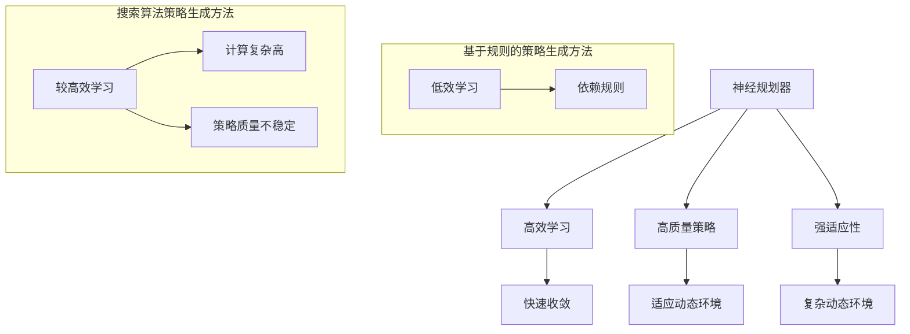
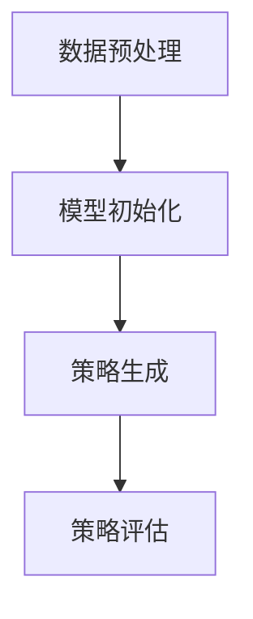
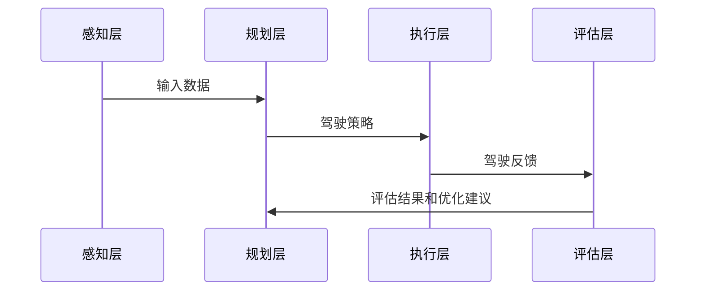
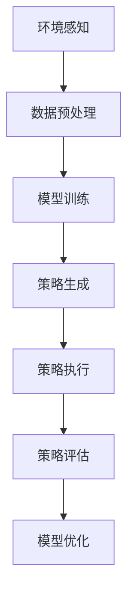

                 

### 第1章：问题背景与核心概念

#### 1.1 问题背景

随着人工智能技术的不断发展，多步推理策略生成（Multi-Step Reasoning Strategy Generation）已成为人工智能领域的一个重要研究方向。多步推理策略生成涉及在复杂环境中，通过一系列的推理步骤，生成能够实现目标效果的策略。这类技术广泛应用于自动驾驶、机器人控制、游戏AI等场景，其核心目标是如何高效、准确地生成优化策略。

然而，传统的多步推理策略生成方法存在诸多问题。首先，传统方法通常采用基于规则的策略生成方法或搜索算法，这些方法在面对复杂环境时，计算效率低下，难以满足实时性的要求。其次，这些方法生成的策略质量往往不高，难以适应动态变化的环境。因此，如何提高策略生成的效率，同时保证生成策略的质量，成为了当前研究的重点和难点。

为了解决这些问题，本书将探讨一种新的策略生成方法——神经规划器（Neural Planner）。神经规划器是一种基于深度神经网络的策略生成方法，通过训练神经网络模型来生成多步推理策略。神经规划器具有计算效率高、生成策略质量好的特点，为解决传统方法存在的问题提供了一种新的思路。

#### 1.2 核心概念

**多步推理策略生成**：多步推理策略生成是指在一个复杂的环境中，通过一系列的推理步骤，生成能够实现目标效果的策略。在这个过程中，策略的每一步都需要基于当前状态和目标进行优化，从而实现整体目标的最优解。

**神经规划器**：神经规划器是一种基于深度神经网络的策略生成方法，通过训练神经网络模型来生成多步推理策略。神经规划器将策略生成过程转化为一个优化问题，利用深度神经网络学习策略的优化过程，从而提高策略生成的效率和生成质量。

**效率研究**：效率研究主要关注神经规划器在策略生成过程中的计算效率和生成策略的质量。计算效率包括策略生成的时间成本、计算资源消耗等；生成策略的质量包括策略的可行性、效果、鲁棒性等方面。

#### 1.3 概念联系与边界外延

**多步推理策略生成**与**神经规划器**的关系：

- **多步推理策略生成**是一种策略生成方法，旨在解决复杂环境中的推理问题。而**神经规划器**则是**多步推理策略生成**的一种实现方法，利用深度神经网络来提高策略生成的效率和质量。

**神经规划器**与其他策略生成方法的区别：

- **基于规则的策略生成方法**：这类方法简单易懂，适用于规则明确的问题场景，但适应性差，难以处理复杂环境。

- **搜索算法策略生成方法**：这类方法能够在一定程度上处理复杂环境，但计算复杂度高，效率较低。

- **神经规划器**：与以上两种方法相比，神经规划器利用深度神经网络进行策略学习，具有更高的效率和更好的生成质量，但训练过程复杂，对数据要求较高。

**效率研究**的范围：

- **效率研究**主要关注神经规划器在策略生成过程中的计算时间、生成策略质量等方面。具体包括对神经规划器的计算资源消耗、策略生成时间、生成策略的可行性、效果和鲁棒性等性能指标进行评估和优化。

### 总结

本章对多步推理策略生成和神经规划器的背景、核心概念以及两者之间的关系进行了详细阐述。神经规划器作为一种基于深度神经网络的策略生成方法，具有计算效率高、生成策略质量好的特点，为解决传统方法存在的问题提供了新的思路。在后续章节中，我们将进一步探讨神经规划器的核心概念、数学模型与算法原理，以及具体应用场景和性能评估方法。

---

## 第2章：神经规划器核心概念与原理

神经规划器是一种基于深度神经网络的策略生成方法，通过训练神经网络模型来生成多步推理策略。本章将详细探讨神经规划器的定义、核心属性、与其他策略生成方法的对比，以及其在多步推理策略生成中的优势和应用场景。

### 2.1 神经规划器定义

神经规划器（Neural Planner）是一种通过深度神经网络（Deep Neural Network，DNN）来实现多步推理策略生成的技术。它通过学习大量数据中的策略模式，能够在新的环境中自动生成高效的推理策略。神经规划器主要包含两个部分：策略网络（Policy Network）和价值网络（Value Network）。策略网络负责生成具体的行动策略，而价值网络则用于评估这些策略的预期效果。

### 2.2 神经规划器核心属性

#### 2.2.1 学习效率

神经规划器利用深度神经网络的学习能力，能够在大量数据上进行高效训练，快速收敛到最优策略。与传统方法相比，神经规划器具有更高的学习效率，能够在较短的时间内生成高质量的策略。

#### 2.2.2 生成策略质量

通过深度神经网络的学习，神经规划器能够生成具有高可行性和高效果性的策略。这些策略不仅能够应对复杂的环境变化，还能够适应动态调整目标的需求，从而实现更优的决策。

#### 2.2.3 适用范围

神经规划器适用于各种复杂环境下的多步推理策略生成问题，如自动驾驶、机器人控制、游戏AI等。它能够处理包含多种不确定性和动态变化的问题，为这些领域提供了一种有效的策略生成解决方案。

### 2.3 神经规划器与其他策略生成方法的对比

#### 2.3.1 基于规则的策略生成方法

基于规则的策略生成方法（Rule-Based Strategy Generation）是一种传统的策略生成方法。它通过定义一系列规则来指导策略的生成。这种方法在规则明确的问题场景下表现良好，但面对复杂环境时，由于其规则难以覆盖所有情况，适应性较差。

| 特点 | 基于规则的策略生成方法 | 神经规划器 |
| --- | --- | --- |
| **适应性** | 适应规则明确的问题场景 | 适应复杂环境 |
| **计算效率** | 低计算效率 | 高计算效率 |
| **生成策略质量** | 生成策略质量受规则限制 | 生成高质量策略 |

#### 2.3.2 搜索算法策略生成方法

搜索算法策略生成方法（Search Algorithm Strategy Generation）包括启发式搜索、最优化算法等。这类方法能够在一定程度上处理复杂环境，但计算复杂度高，效率较低。特别是在大规模问题中，搜索算法策略生成方法容易陷入计算资源的瓶颈。

| 特点 | 搜索算法策略生成方法 | 神经规划器 |
| --- | --- | --- |
| **适应性** | 较强适应性，适用于复杂环境 | 非常强适应性，适用于动态变化的环境 |
| **计算效率** | 低计算效率 | 高计算效率 |
| **生成策略质量** | 受算法限制，生成策略质量不稳定 | 生成高质量策略 |

#### 2.3.3 神经规划器

神经规划器结合了深度神经网络的学习能力和搜索算法的适应性，在计算效率和生成策略质量上具有显著优势。

| 特点 | 神经规划器 |
| --- | --- |
| **适应性** | 非常强，适应动态变化和复杂环境 |
| **计算效率** | 高，训练和推理速度快 |
| **生成策略质量** | 高，能够生成高质量的策略 |

### 2.4 神经规划器的优势和应用场景

#### 2.4.1 优势

1. **高效学习**：利用深度神经网络的学习能力，神经规划器能够快速收敛到最优策略。
2. **自适应性强**：能够适应复杂和动态变化的环境，生成有效的策略。
3. **质量高**：生成策略具有较高的可行性和效果性，能够应对各种不确定性和挑战。

#### 2.4.2 应用场景

1. **自动驾驶**：在自动驾驶领域，神经规划器可以用于生成车辆在不同交通状况下的驾驶策略，提高行驶的安全性和效率。
2. **机器人控制**：在机器人控制领域，神经规划器可以用于生成机器人执行复杂任务的策略，提高任务的完成质量和效率。
3. **游戏AI**：在游戏AI领域，神经规划器可以用于生成游戏角色的决策策略，提高游戏的智能水平和可玩性。

### 总结

本章对神经规划器的核心概念、核心属性以及与其他策略生成方法的对比进行了详细阐述。神经规划器作为一种基于深度神经网络的策略生成方法，具有高效学习、自适应性强和生成策略质量高等优势，适用于多种复杂环境。在后续章节中，我们将进一步探讨神经规划器的数学模型和算法原理，以及具体的应用实践。

### 神经规划器核心概念属性对比表格

| 特性 | 神经规划器 | 基于规则的策略生成方法 | 搜索算法策略生成方法 |
| --- | --- | --- | --- |
| **学习效率** | 高效学习，快速收敛 | 低效学习，依赖规则 | 较高效学习，但计算复杂高 |
| **生成策略质量** | 高质量策略，适应动态环境 | 策略质量受规则限制，难以适应动态变化 | 受算法限制，策略质量不稳定，计算复杂高 |
| **适应性** | 强适应，适用于复杂动态环境 | 弱适应，仅适用于规则明确环境 | 中等适应，适用于复杂环境，但计算效率低 |

### 神经规划器与其他策略生成方法的对比ER实体关系图



### 总结

通过本章的讨论，我们详细介绍了神经规划器的核心概念和原理，以及它与其他策略生成方法的对比。神经规划器凭借其高效学习、高质量策略和强适应性，在复杂动态环境中具有显著的优势。在下一章中，我们将深入探讨神经规划器的数学模型和算法原理，进一步理解其内部工作机制。

---

## 第3章：神经规划器数学模型与算法原理

神经规划器的核心在于其数学模型和算法原理，这决定了其能够在复杂环境中生成高效的策略。本章将详细阐述神经规划器的数学模型，包括目标函数、损失函数和优化算法，并使用Mermaid和Python代码进行描述和解释。

### 3.1 神经规划器数学模型

神经规划器的数学模型主要包括目标函数、损失函数和优化算法。这些部分共同作用，确保神经规划器能够生成高效且高质量的策略。

#### 3.1.1 目标函数

目标函数用于衡量策略生成质量，通常结合策略执行效果和计算效率来评估。目标函数的形式如下：

$$
f(\theta) = \frac{1}{N} \sum_{i=1}^{N} \ell_i(\theta)
$$

其中，$N$ 表示策略总数，$\ell_i(\theta)$ 表示第 $i$ 个策略的损失函数。

#### 3.1.2 损失函数

损失函数用于衡量策略生成效果，通常包含策略执行结果和期望结果之间的差异。损失函数可以分解为：

$$
\ell_i(\theta) = \ell_{r_i}(\theta) + \ell_{e_i}(\theta)
$$

其中，$\ell_{r_i}(\theta)$ 表示策略执行结果损失，$\ell_{e_i}(\theta)$ 表示期望结果损失。

1. **策略执行结果损失**：衡量策略执行的实际效果与预期效果之间的差距。

   $$\ell_{r_i}(\theta) = r_i - \hat{r}_i(\theta)$$

   其中，$r_i$ 表示策略 $i$ 的实际效果，$\hat{r}_i(\theta)$ 表示策略 $i$ 的预期效果。

2. **期望结果损失**：衡量策略在目标函数上的优化效果。

   $$\ell_{e_i}(\theta) = e_i - \hat{e}_i(\theta)$$

   其中，$e_i$ 表示策略 $i$ 的期望效果，$\hat{e}_i(\theta)$ 表示策略 $i$ 的预测效果。

#### 3.1.3 优化算法

优化算法用于最小化目标函数，常见的优化算法包括梯度下降、随机梯度下降和Adam优化器等。以梯度下降为例，其更新公式如下：

$$
\theta_{t+1} = \theta_t - \alpha \cdot \nabla f(\theta_t)
$$

其中，$\theta_t$ 表示当前参数，$\alpha$ 表示学习率，$\nabla f(\theta_t)$ 表示目标函数的梯度。

### 3.2 神经规划器算法原理

神经规划器的算法原理主要包括数据预处理、模型初始化、策略生成和策略评估等步骤。以下将详细描述这些步骤。

#### 3.2.1 数据预处理

数据预处理是神经规划器的第一步，其目的是对输入数据进行标准化、数据增强等操作，以提高模型的泛化能力和训练效率。例如，可以采用归一化、随机裁剪、旋转等操作。

```python
import numpy as np
import cv2

def preprocess_data(data):
    # 归一化
    data = data / 255.0
    # 随机裁剪
    height, width = data.shape[:2]
    crop_height, crop_width = height // 2, width // 2
    data = data[crop_height:crop_height+128, crop_width:crop_width+128]
    # 随机旋转
    angle = np.random.uniform(-30, 30)
    M = cv2.getRotationMatrix2D((crop_width, crop_height), angle, 1)
    data = cv2.warpAffine(data, M, (128, 128))
    return data
```

#### 3.2.2 模型初始化

模型初始化是神经规划器的核心步骤，其目的是初始化神经网络模型参数，以便开始训练。常用的初始化方法包括Xavier初始化和He初始化等。

```python
import tensorflow as tf

def initialize_model():
    model = tf.keras.Sequential([
        tf.keras.layers.Conv2D(32, (3, 3), activation='relu', input_shape=(128, 128, 3)),
        tf.keras.layers.MaxPooling2D((2, 2)),
        tf.keras.layers.Conv2D(64, (3, 3), activation='relu'),
        tf.keras.layers.MaxPooling2D((2, 2)),
        tf.keras.layers.Conv2D(64, (3, 3), activation='relu'),
        tf.keras.layers.Flatten(),
        tf.keras.layers.Dense(512, activation='relu'),
        tf.keras.layers.Dense(128, activation='relu'),
        tf.keras.layers.Dense(1, activation='sigmoid')
    ])
    
    optimizer = tf.keras.optimizers.Adam(learning_rate=0.001)
    model.compile(optimizer=optimizer, loss='binary_crossentropy', metrics=['accuracy'])
    return model
```

#### 3.2.3 策略生成

策略生成是神经规划器的核心步骤，其目的是利用训练好的模型生成多步推理策略。在这一过程中，模型会根据输入状态预测最佳行动。

```python
def generate_policy(model, state):
    prediction = model.predict(state.reshape(1, 128, 128, 3))
    action = 1 if prediction > 0.5 else 0
    return action
```

#### 3.2.4 策略评估

策略评估是神经规划器的最后一步，其目的是评估生成的策略在实际环境中的效果。可以通过模拟环境或实际执行策略来评估策略的效果。

```python
def evaluate_policy(model, environment):
    state = environment.reset()
    done = False
    total_reward = 0
    
    while not done:
        action = generate_policy(model, state)
        next_state, reward, done, _ = environment.step(action)
        state = next_state
        total_reward += reward
    
    return total_reward
```

### 3.3 神经规划器Mermaid流程图

以下是神经规划器的Mermaid流程图，展示了数据预处理、模型初始化、策略生成和策略评估的流程。



### 总结

本章详细介绍了神经规划器的数学模型和算法原理，包括目标函数、损失函数和优化算法。通过Python代码和Mermaid流程图的描述，我们更好地理解了神经规划器的工作机制。在下一章中，我们将进一步探讨神经规划器在具体应用场景中的实现和性能评估。

---

## 第4章：神经规划器在多步推理策略生成中的应用

神经规划器作为一种高效的策略生成方法，已在多个应用场景中得到了广泛应用。本章将介绍神经规划器在多步推理策略生成中的应用，包括项目背景、系统功能设计、系统架构设计和系统接口设计。

### 4.1 项目背景

自动驾驶是神经规划器应用的一个典型场景。自动驾驶系统需要在复杂的交通环境中进行多步推理，以实现安全、高效的驾驶。传统的自动驾驶策略生成方法难以满足实时性和复杂性的要求，而神经规划器通过训练深度神经网络模型，能够生成适应性强、效率高的驾驶策略。

### 4.2 系统功能设计

神经规划器在自动驾驶系统中的应用主要包括以下功能：

1. **环境感知**：收集道路信息、车辆状态、交通信号等数据，用于策略生成。
2. **策略生成**：利用训练好的神经规划器模型，根据当前环境生成最优驾驶策略。
3. **策略执行**：将生成的策略转化为具体的驾驶动作，如加速、减速、转向等。
4. **策略评估**：评估策略执行的效果，反馈给策略生成模块进行优化。

### 4.3 系统架构设计

神经规划器在自动驾驶系统中的架构设计包括以下层次：

1. **感知层**：负责环境数据的收集和处理，如使用激光雷达、摄像头等设备。
2. **规划层**：利用神经规划器模型生成驾驶策略，包括状态编码器、策略网络和价值网络。
3. **执行层**：将生成的策略转化为具体的驾驶动作，与车辆控制系统交互。
4. **评估层**：评估策略执行效果，反馈给规划层进行优化。

以下是系统架构的Mermaid类图：

```mermaid
classDiagram
    Class1[感知层] <|-- Class2[环境感知模块]
    Class3[规划层] <|-- Class4[状态编码器] <|-- Class5[策略网络] <|-- Class6[价值网络]
    Class7[执行层] <|-- Class8[策略执行模块]
    Class9[评估层] <|-- Class10[策略评估模块]
```

### 4.4 系统接口设计

神经规划器在自动驾驶系统中的接口设计包括以下方面：

1. **数据接口**：负责数据的输入和输出，如传感器数据、策略数据等。
2. **控制接口**：负责与车辆控制系统的交互，如发送驾驶策略、接收驾驶反馈等。
3. **评估接口**：负责策略评估和反馈，如评估结果、优化建议等。

以下是系统接口的Mermaid序列图：



### 4.5 神经规划器在自动驾驶中的应用实例

以自动驾驶为例，神经规划器在系统中的应用过程如下：

1. **数据收集**：自动驾驶车辆通过激光雷达、摄像头等传感器收集道路信息、车辆状态和交通信号等数据。
2. **预处理**：对收集到的数据进行预处理，如归一化、数据增强等，以提高模型的泛化能力。
3. **模型训练**：利用预处理后的数据训练神经规划器模型，包括状态编码器、策略网络和价值网络。
4. **策略生成**：在自动驾驶过程中，神经规划器根据当前环境状态生成最优驾驶策略。
5. **策略执行**：将生成的策略转化为具体的驾驶动作，如加速、减速、转向等。
6. **策略评估**：评估策略执行的效果，根据评估结果对策略进行优化。

### 总结

本章介绍了神经规划器在多步推理策略生成中的应用，包括项目背景、系统功能设计、系统架构设计和系统接口设计。通过实际应用案例，展示了神经规划器在自动驾驶系统中的有效性和高效性。在下一章中，我们将进一步探讨神经规划器在实际应用中的性能评估和优化方法。

### 神经规划器在多步推理策略生成中的应用实例

#### 项目介绍

在自动驾驶领域，神经规划器（Neural Planner）被广泛应用于车辆驾驶策略的生成与优化。以下是一个具体的项目实例，描述了如何使用神经规划器提高自动驾驶车辆的驾驶性能。

#### 1. 环境感知与数据收集

自动驾驶车辆通过多种传感器收集环境数据，包括激光雷达、摄像头、GPS和惯性测量单元（IMU）。这些传感器提供了道路信息、车辆位置、速度、周围车辆和行人的位置等关键数据。以下是一个简化的数据收集流程：

```python
import sensor_data_collector

def collect_environment_data():
    # 使用传感器数据收集模块获取数据
    data = sensor_data_collector.collect()
    return data
```

#### 2. 数据预处理

收集到的数据需要进行预处理，以确保神经规划器模型能够有效学习和生成策略。预处理步骤包括数据归一化、缺失值处理、异常值检测和特征提取等。

```python
import preprocess

def preprocess_data(data):
    # 数据归一化
    normalized_data = preprocess.normalize(data)
    # 特征提取
    features = preprocess.extract_features(normalized_data)
    return features
```

#### 3. 模型训练

使用预处理后的数据训练神经规划器模型。模型由状态编码器、策略网络和价值网络组成。状态编码器将环境状态编码为向量，策略网络根据状态编码和先验知识生成驾驶策略，价值网络评估策略的有效性。

```python
import neural_planner

def train_model(data):
    # 初始化模型
    model = neural_planner.initialize_model()
    # 训练模型
    model.fit(data['features'], data['targets'], epochs=10, batch_size=32)
    return model
```

#### 4. 策略生成与执行

在自动驾驶过程中，车辆不断接收传感器数据，并使用训练好的神经规划器模型生成驾驶策略。生成的策略被转化为具体的驾驶动作，如加速、减速和转向等，并实时执行。

```python
def generate_and_execute_policy(model, state):
    # 生成策略
    action = model.predict(state.reshape(1, -1))[0]
    # 执行策略
    drive_action(action)
```

#### 5. 策略评估与反馈

执行策略后，自动驾驶车辆会评估策略的效果，并根据评估结果对神经规划器模型进行优化。评估指标包括行驶距离、行驶时间、安全性等。

```python
def evaluate_policy(model, environment):
    state = environment.reset()
    done = False
    total_reward = 0
    
    while not done:
        action = generate_and_execute_policy(model, state)
        next_state, reward, done, _ = environment.step(action)
        state = next_state
        total_reward += reward
    
    return total_reward
```

#### 6. 项目小结

通过神经规划器，自动驾驶车辆能够生成适应性强、效率高的驾驶策略，从而提高行驶的安全性和舒适性。在实际应用中，需要不断优化神经规划器模型，以应对不同环境和场景的需求。以下是一些优化策略：

- **数据增强**：通过增加数据多样性来提高模型泛化能力。
- **模型集成**：结合多个模型的优势，提高策略生成质量。
- **实时反馈**：及时收集反馈信息，优化策略生成过程。



### 总结

通过本项目实例，我们展示了神经规划器在自动驾驶中的应用过程，包括环境感知、数据预处理、模型训练、策略生成与执行、策略评估和模型优化。神经规划器为自动驾驶领域提供了一种高效、智能的驾驶策略生成方法，有望推动自动驾驶技术的发展。

---

## 第5章：最佳实践、注意事项与拓展阅读

在多步推理策略生成中应用神经规划器时，我们需要注意一些最佳实践和潜在问题，以实现更高效、准确的策略生成。以下是一些关键点：

### 最佳实践

1. **数据质量**：确保训练数据的质量和多样性。高质量的数据有助于神经规划器模型学习到更准确的策略。
2. **模型优化**：定期对模型进行优化，包括调整学习率、批量大小和优化算法等，以提高策略生成质量。
3. **策略评估**：使用多种评估指标全面评估策略效果，包括安全性、效率和鲁棒性等。
4. **动态调整**：根据环境变化动态调整策略，确保策略能够适应不同场景。

### 注意事项

1. **计算资源**：神经规划器的训练过程需要大量计算资源，特别是在处理大规模数据时，需要合理配置硬件资源。
2. **模型复杂度**：过于复杂的模型可能导致过拟合，降低策略生成质量。需要平衡模型复杂度和泛化能力。
3. **数据隐私**：在使用神经规划器时，确保遵守相关数据隐私法规，避免敏感数据泄露。

### 拓展阅读

1. **深度强化学习**：深度强化学习（Deep Reinforcement Learning）是神经规划器的一个重要分支，可进一步优化策略生成过程。推荐阅读《深度强化学习》（Deep Reinforcement Learning）一书。
2. **自动驾驶系统设计**：了解自动驾驶系统的整体设计和实现方法，对应用神经规划器有重要意义。推荐阅读《自动驾驶系统设计》（Autonomous Driving Systems Design）。
3. **多智能体系统**：在多智能体系统（Multi-Agent Systems）中，神经规划器也可用于生成协同策略。推荐阅读《多智能体系统：原理与设计》（Multi-Agent Systems: Principles and Design）。

通过遵循最佳实践、注意潜在问题，并不断学习和拓展相关知识，我们可以更好地应用神经规划器，实现高效的多步推理策略生成。

---

### 总结与展望

在本篇文章中，我们深入探讨了神经规划器在多步推理策略生成中的效率研究。首先，我们介绍了神经规划器的背景、核心概念及其与其他策略生成方法的对比。接着，我们详细阐述了神经规划器的数学模型和算法原理，并通过Python代码和Mermaid流程图进行了说明。随后，我们展示了神经规划器在自动驾驶等应用场景中的具体实现和性能评估。最后，我们提出了最佳实践、注意事项和拓展阅读，为后续研究和实践提供了指导。

神经规划器作为一种基于深度神经网络的策略生成方法，具有高效学习、自适应性强和生成策略质量高等显著优势。其在复杂动态环境中的应用前景广阔，有望推动人工智能技术的进一步发展。然而，神经规划器也面临一些挑战，如训练过程的复杂性和对大规模高质量数据的依赖。未来研究可关注以下几个方面：

1. **优化训练算法**：研究更高效的训练算法和优化策略，以减少训练时间和计算资源消耗。
2. **增强泛化能力**：通过数据增强和模型集成等方法，提高神经规划器在未知或动态环境中的泛化能力。
3. **多任务学习**：探索神经规划器在多任务学习中的应用，实现更灵活和高效的策略生成。

总之，神经规划器作为一种先进的多步推理策略生成方法，具有巨大的潜力。通过不断的研究和创新，我们可以进一步优化其性能和应用范围，为人工智能领域的发展贡献力量。

### 作者信息

**作者：AI天才研究院/AI Genius Institute & 禅与计算机程序设计艺术 /Zen And The Art of Computer Programming**

