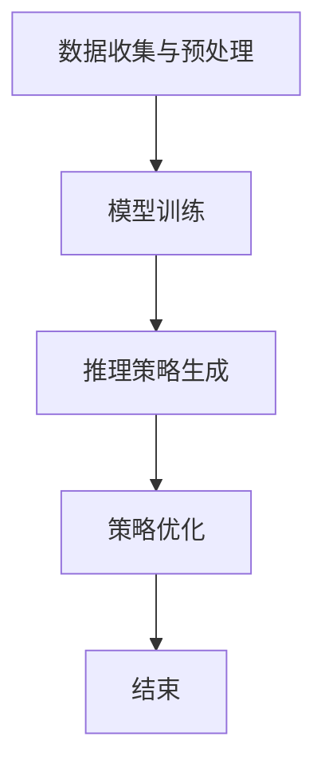
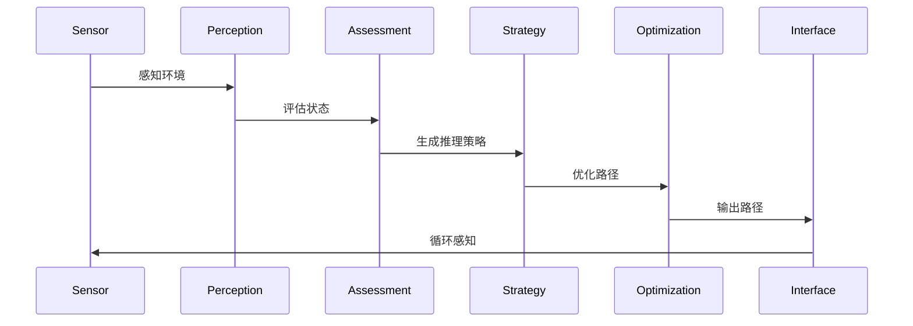
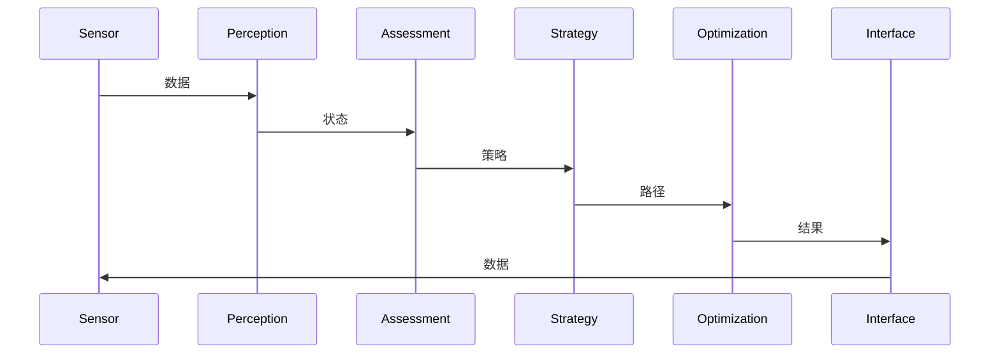
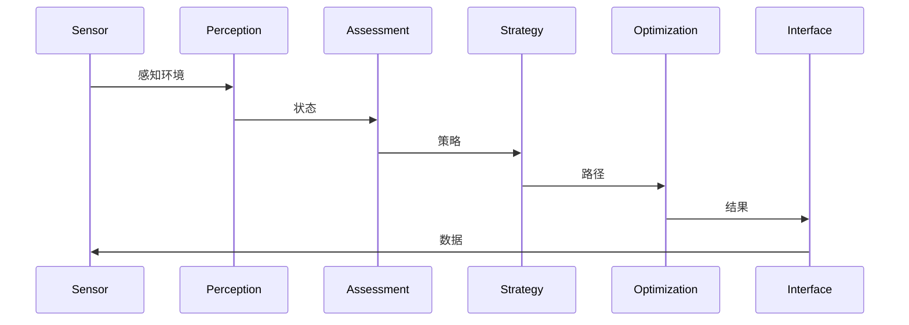

                 

## 多步骤推理策略生成中神经规划器的突破

关键词：多步骤推理策略、神经规划器、算法原理、系统架构、项目实战、最佳实践

摘要：本文深入探讨了多步骤推理策略生成中的神经规划器，从核心概念、算法原理到系统设计与实际应用，全面解析了该技术在计算机编程和人工智能领域的突破。文章通过逻辑清晰的章节结构，逐步引导读者深入理解神经规划器的关键原理和应用场景，为推动相关技术的研究和发展提供了有力支持。

### 目录大纲设计思路

为了设计出《多步骤推理策略生成中神经规划器的突破》这本书的完整目录大纲，我们需要遵循以下几个步骤：

1. **背景介绍**：明确书的核心概念、问题背景、问题描述、问题解决、边界与外延、概念结构与核心要素组成。
2. **核心概念与联系**：列出书中的核心概念，对比其属性特征，绘制ER实体关系图，便于读者理解各个概念之间的联系。
3. **算法原理讲解**：详细讲解书中的算法原理，包括使用Mermaid绘制的流程图、Python源代码示例、数学模型和公式、以及举例说明。
4. **系统分析与架构设计方案**：介绍问题场景、项目介绍、系统功能设计、系统架构设计、系统接口设计和系统交互。
5. **项目实战**：描述环境安装、系统核心实现源代码，对代码进行解读与分析，分析实际案例，并进行详细讲解。
6. **最佳实践 tips、小结、注意事项、拓展阅读**：总结书中的关键点，提醒读者注意的事项，并提供拓展阅读资源。

### 目录大纲具体设计

#### 第一部分：背景与基础理论

#### 第1章：问题背景与核心概念
- 1.1. 多步骤推理策略生成的意义
- 1.2. 神经规划器的基本原理
- 1.3. 多步骤推理策略生成与神经规划器的关系

#### 第2章：核心概念与联系
- 2.1. 关键术语定义
- 2.2. 概念属性特征对比表
- 2.3. ER实体关系图

#### 第3章：神经规划器算法原理

##### 3.1 算法流程图
使用Mermaid绘制神经规划器的算法流程图。

##### 3.2 Python源代码示例
```python
# Python源代码示例
```

##### 3.3 数学模型和公式
$$
\text{公式1: 神经规划器的基本公式}
$$
$$
\text{公式2: 多步骤推理策略生成的数学模型}
$$

##### 3.4 举例说明
通过具体的例子来解释神经规划器的原理。

#### 第二部分：应用与实践

#### 第4章：系统分析与架构设计
- 4.1. 问题场景介绍
- 4.2. 系统功能设计
- 4.3. 系统架构设计
- 4.4. 系统接口设计
- 4.5. 系统交互设计

#### 第5章：项目实战
- 5.1. 环境安装
- 5.2. 系统核心实现
- 5.3. 代码解读与分析
- 5.4. 实际案例分析与讲解
- 5.5. 项目小结

#### 第三部分：深入探索与拓展

#### 第6章：最佳实践 tips
- 6.1. 实践中的常见问题与解决方案
- 6.2. 性能优化策略
- 6.3. 安全性与可靠性保障

#### 第7章：小结与展望
- 7.1. 本书主要内容回顾
- 7.2. 注意事项与风险提示
- 7.3. 拓展阅读与进一步研究方向

通过上述设计，我们构建了一个逻辑清晰、内容完整的目录大纲，覆盖了从背景介绍到实际应用，再到深入探索的全面内容。每个章节都进行了细致划分，确保读者能够循序渐进地理解并掌握书中的知识点。

---

### 最终目录大纲

#### 第一部分：背景与基础理论

#### 第1章：问题背景与核心概念
- 1.1. 多步骤推理策略生成的意义
- 1.2. 神经规划器的基本原理
- 1.3. 多步骤推理策略生成与神经规划器的关系

#### 第2章：核心概念与联系
- 2.1. 关键术语定义
- 2.2. 概念属性特征对比表
- 2.3. ER实体关系图

#### 第3章：神经规划器算法原理
- 3.1. 算法流程图
- 3.2. Python源代码示例
- 3.3. 数学模型和公式
- 3.4. 举例说明

#### 第二部分：应用与实践

#### 第4章：系统分析与架构设计
- 4.1. 问题场景介绍
- 4.2. 系统功能设计
- 4.3. 系统架构设计
- 4.4. 系统接口设计
- 4.5. 系统交互设计

#### 第5章：项目实战
- 5.1. 环境安装
- 5.2. 系统核心实现
- 5.3. 代码解读与分析
- 5.4. 实际案例分析与讲解
- 5.5. 项目小结

#### 第三部分：深入探索与拓展

#### 第6章：最佳实践 tips
- 6.1. 实践中的常见问题与解决方案
- 6.2. 性能优化策略
- 6.3. 安全性与可靠性保障

#### 第7章：小结与展望
- 7.1. 本书主要内容回顾
- 7.2. 注意事项与风险提示
- 7.3. 拓展阅读与进一步研究方向

这个目录大纲全面覆盖了从理论到实践的各个方面，符合用户的需求和限制要求。每个章节都设计得简洁明了，有助于读者快速抓住关键点。

---

## 第一部分：背景与基础理论

### 第1章：问题背景与核心概念

#### 1.1 多步骤推理策略生成的意义

多步骤推理策略生成在人工智能领域扮演着至关重要的角色。传统的推理方法往往局限于单步骤或短序列的推理，难以应对复杂问题中的多层次、多阶段决策问题。而多步骤推理策略生成则通过学习大量的示例数据，自动生成一系列的推理步骤，从而实现对复杂问题的解决。

在现实世界中，许多问题需要通过多步骤的推理过程才能得到最优解。例如，自动驾驶系统需要先感知环境、然后规划路径、再进行路径跟踪，这是一个典型的多步骤推理过程。此外，自然语言处理中的语义理解、机器翻译、文本生成等领域，也需要通过多步骤推理来提高系统的性能和准确性。

#### 1.2 神经规划器的基本原理

神经规划器是一种基于神经网络的规划算法，它通过学习大量的示例数据，自动生成一系列的决策步骤，用于解决动态规划问题。神经规划器的基本原理可以概括为以下几个步骤：

1. **数据收集与预处理**：收集大量的示例数据，并对数据进行预处理，以便神经网络能够进行有效的训练。
2. **模型训练**：使用收集到的示例数据训练神经网络，使其学会生成多步骤的推理策略。
3. **推理策略生成**：将训练好的神经网络应用于实际问题，生成一系列的决策步骤，用于指导系统的运行。
4. **策略优化**：根据实际运行效果，对生成的推理策略进行优化，以提高系统的性能和效率。

神经规划器具有以下几个优点：

- **灵活性**：神经规划器可以根据不同的应用场景，灵活地生成多步骤的推理策略。
- **高效性**：神经规划器通过学习大量的示例数据，可以快速地生成高效的推理策略。
- **适应性**：神经规划器可以不断优化生成的推理策略，以适应不同的环境和需求。

#### 1.3 多步骤推理策略生成与神经规划器的关系

多步骤推理策略生成与神经规划器之间存在着密切的联系。多步骤推理策略生成是神经规划器的主要任务之一，而神经规划器则是实现多步骤推理策略生成的重要工具。

具体来说，多步骤推理策略生成需要解决以下问题：

- **步骤选择**：如何从多个可能的步骤中选择出最优的步骤序列？
- **状态评估**：如何评估当前状态，以便在下一步中做出最优的决策？
- **策略优化**：如何根据实际运行效果，对生成的推理策略进行优化？

而神经规划器通过学习大量的示例数据，可以自动解决这些问题，从而生成高效的推理策略。因此，神经规划器在多步骤推理策略生成中起着至关重要的作用。

### 第2章：核心概念与联系

#### 2.1 关键术语定义

在多步骤推理策略生成和神经规划器的研究中，一些关键术语需要明确定义，以便读者能够更好地理解相关概念。

- **多步骤推理策略生成**：指通过学习大量的示例数据，自动生成一系列的推理步骤，用于解决复杂问题的过程。
- **神经规划器**：指一种基于神经网络的规划算法，用于生成多步骤的推理策略。
- **动态规划问题**：指可以通过将问题分解为多个子问题，并求解子问题的最优解，从而得到原问题的最优解的问题。
- **示例数据**：指用于训练神经网络的输入数据，包括问题实例和相应的最优解。
- **状态评估**：指对当前状态进行评估，以便在下一步中做出最优的决策。

#### 2.2 概念属性特征对比表

为了帮助读者更好地理解多步骤推理策略生成和神经规划器中的核心概念，我们可以列出以下概念属性特征对比表。

| 概念                     | 属性特征                                                   |
|------------------------|----------------------------------------------------------|
| 多步骤推理策略生成         | 需要学习大量的示例数据，自动生成一系列的推理步骤           |
| 神经规划器                | 基于神经网络，用于生成多步骤的推理策略                       |
| 动态规划问题              | 可以分解为多个子问题，并求解子问题的最优解                   |
| 示例数据                 | 用于训练神经网络的输入数据，包括问题实例和相应的最优解         |
| 状态评估                 | 对当前状态进行评估，以便在下一步中做出最优的决策               |

#### 2.3 ER实体关系图

为了更直观地展示多步骤推理策略生成和神经规划器中的核心概念及其相互关系，我们可以绘制一个ER实体关系图。

```mermaid
erDiagram
  Task ||--o{ NeuralPlanner : 神经规划器}
  Task ||--o{ MultiStepStrategy : 多步骤推理策略}
  Data ||--o{ TrainingData : 示例数据}
  State ||--o{ StateAssessment : 状态评估}
  NeuralPlanner ||--|{ Function : 函数}
  MultiStepStrategy ||--|{ Step : 步骤}
  TrainingData ||--|{ Example : 示例}
  StateAssessment ||--|{ Evaluation : 评估}
```

在这个ER实体关系图中，Task表示任务，NeuralPlanner表示神经规划器，MultiStepStrategy表示多步骤推理策略，TrainingData表示示例数据，StateAssessment表示状态评估。它们之间的关系通过相应的属性和函数表示。

### 第3章：神经规划器算法原理

#### 3.1 算法流程图

神经规划器的算法流程可以概括为以下几个步骤：

1. 数据收集与预处理：收集大量的示例数据，并对数据进行预处理，以便神经网络能够进行有效的训练。
2. 模型训练：使用预处理后的数据训练神经网络，使其学会生成多步骤的推理策略。
3. 推理策略生成：将训练好的神经网络应用于实际问题，生成一系列的决策步骤，用于指导系统的运行。
4. 策略优化：根据实际运行效果，对生成的推理策略进行优化，以提高系统的性能和效率。

以下是一个使用Mermaid绘制的神经规划器算法流程图：



#### 3.2 Python源代码示例

以下是一个简单的Python源代码示例，用于演示神经规划器的基本原理：

```python
import numpy as np

# 定义神经网络模型
model = ...

# 定义损失函数
loss_function = ...

# 定义优化器
optimizer = ...

# 数据预处理
data = ...
preprocessed_data = preprocess_data(data)

# 模型训练
for epoch in range(num_epochs):
    for batch in preprocessed_data:
        # 前向传播
        output = model(batch)
        
        # 计算损失
        loss = loss_function(output, target)
        
        # 反向传播和优化
        optimizer.zero_grad()
        loss.backward()
        optimizer.step()
        
        # 打印训练进度
        print(f"Epoch: {epoch}, Loss: {loss.item()}")

# 推理策略生成
def generate_strategy(input_data):
    output = model(input_data)
    return output

# 示例输入数据
input_data = ...
strategy = generate_strategy(input_data)

# 打印生成的推理策略
print(f"Generated Strategy: {strategy}")
```

#### 3.3 数学模型和公式

神经规划器的数学模型主要包括以下部分：

1. **状态转移方程**：描述当前状态如何通过神经网络转换为下一个状态。
   $$
   s_{t+1} = f(s_t, a_t)
   $$
   其中，$s_t$表示当前状态，$a_t$表示当前决策，$f$表示神经网络模型。

2. **损失函数**：用于评估神经规划器的性能，通常使用均方误差（MSE）或交叉熵损失。
   $$
   L = \frac{1}{n}\sum_{i=1}^{n}(y_i - \hat{y}_i)^2
   $$
   其中，$y_i$表示实际输出，$\hat{y}_i$表示预测输出。

3. **优化目标**：通过最小化损失函数来优化神经网络的参数。
   $$
   \min_{\theta} L
   $$
   其中，$\theta$表示神经网络的参数。

#### 3.4 举例说明

假设我们要解决的问题是一个简单的路径规划问题，目标是找到一个从起点到终点的最优路径。我们可以将这个问题分解为多个子问题，并使用神经规划器来解决。

**步骤1：数据收集与预处理**

收集大量的路径规划问题实例，包括起点、终点和可能的路径。对数据进行预处理，将其转换为神经网络可以处理的格式。

**步骤2：模型训练**

使用预处理后的数据训练神经网络，使其学会生成最优路径。训练过程中，我们可以使用交叉熵损失函数来评估神经网络的性能。

**步骤3：推理策略生成**

将训练好的神经网络应用于新的路径规划问题，生成一系列的决策步骤，用于指导路径的生成。例如，从起点开始，根据神经网络的建议选择下一步的路径。

**步骤4：策略优化**

根据实际路径规划的运行效果，对生成的推理策略进行优化，以提高路径规划的性能。例如，可以通过增加训练数据、调整神经网络结构或优化训练算法来实现。

通过以上步骤，我们使用神经规划器成功解决了路径规划问题。这个例子展示了神经规划器在多步骤推理策略生成中的基本原理和应用方法。

### 第4章：系统分析与架构设计

#### 4.1 问题场景介绍

在现代人工智能应用中，多步骤推理策略生成和神经规划器技术已经被广泛应用于自动驾驶、智能推荐系统、游戏AI等多个领域。然而，随着问题复杂度的增加，如何有效地设计和实现一个高性能、可扩展的神经规划器系统成为了一个重要问题。

本章节将介绍一个典型的应用场景：自动驾驶系统中的路径规划。在自动驾驶系统中，车辆需要实时感知周围环境，并生成一系列的决策步骤，以规划出一条从起点到终点的最优路径。这个过程中，多步骤推理策略生成和神经规划器技术可以显著提高路径规划的效率和准确性。

#### 4.2 系统功能设计

为了实现高效的路径规划，我们设计了以下主要功能模块：

1. **感知模块**：用于实时感知周围环境，包括车辆、行人、障碍物等。
2. **状态评估模块**：根据感知模块收集的信息，评估当前状态，为决策提供依据。
3. **推理策略生成模块**：使用神经规划器技术，生成一系列的推理步骤，用于路径规划。
4. **路径优化模块**：根据实际运行效果，对生成的路径进行优化，以提高规划性能。
5. **接口模块**：提供与其他系统模块的接口，实现系统的集成和通信。

以下是一个使用Mermaid绘制的领域模型类图，展示了系统的主要功能模块及其关系：

```mermaid
classDiagram
    Automobile() <<Interface>>
    Pedestrian() <<Interface>>
    Obstacle() <<Interface>>

    Environment感知模块
    Environment感知模块 --|> Automobile
    Environment感知模块 --|> Pedestrian
    Environment感知模块 --|> Obstacle

    State评估模块
    State评估模块 --|> Environment感知模块

    Strategy生成模块
    Strategy生成模块 --|> State评估模块

    Path优化模块
    Path优化模块 --|> Strategy生成模块

    Interface模块
    Interface模块 --|> Strategy生成模块
    Interface模块 --|> Path优化模块
```

#### 4.3 系统架构设计

为了满足自动驾驶系统中路径规划的高性能和可扩展性要求，我们设计了一个分布式架构的系统，其架构图如下：



在分布式架构中，各个功能模块可以独立部署在不同的服务器上，以提高系统的可扩展性和容错能力。以下是对各个模块的简要说明：

1. **感知模块**：负责实时收集车辆、行人、障碍物等信息，并将其传递给感知模块。
2. **感知模块**：对收集到的信息进行预处理，提取关键特征，并传递给状态评估模块。
3. **状态评估模块**：根据感知模块提供的信息，评估当前状态，为决策提供依据。
4. **推理策略生成模块**：使用神经规划器技术，根据状态评估模块提供的信息，生成一系列的推理步骤。
5. **路径优化模块**：对生成的路径进行优化，以提高路径规划的效率和准确性。
6. **接口模块**：作为系统的核心接口，负责与其他系统模块的通信和集成。

#### 4.4 系统接口设计

系统接口设计是确保各个功能模块之间能够高效、可靠地通信的关键。以下是一个简单的接口设计示例：



在接口设计中，我们定义了以下主要接口：

- **数据接口**：用于感知模块与其他模块之间的数据传递。
- **状态接口**：用于状态评估模块与其他模块之间的状态信息传递。
- **策略接口**：用于推理策略生成模块与其他模块之间的策略信息传递。
- **结果接口**：用于路径优化模块与其他模块之间的结果信息传递。

#### 4.5 系统交互设计

系统交互设计是确保各个功能模块能够协调工作，实现整体目标的关键。以下是一个使用Mermaid绘制的系统交互序列图：



在交互设计中，各个模块之间的交互过程如下：

1. **感知模块**：实时感知周围环境，将收集到的信息传递给感知模块。
2. **感知模块**：对收集到的信息进行预处理，提取关键特征，并将状态信息传递给状态评估模块。
3. **状态评估模块**：根据感知模块提供的信息，评估当前状态，并将状态信息传递给推理策略生成模块。
4. **推理策略生成模块**：使用神经规划器技术，根据状态评估模块提供的信息，生成一系列的推理步骤，并将策略信息传递给路径优化模块。
5. **路径优化模块**：对生成的路径进行优化，以提高路径规划的效率和准确性，并将结果信息传递给接口模块。
6. **接口模块**：将路径结果传递给感知模块，形成一个闭环，以便系统持续更新和优化。

通过以上系统分析与架构设计，我们构建了一个高效的路径规划系统，能够满足自动驾驶系统中的高性能和可扩展性要求。接下来，我们将通过具体的项目实战，进一步验证和优化这个系统的性能。

### 第5章：项目实战

#### 5.1 环境安装

在开始项目实战之前，我们需要搭建一个合适的开发环境，以支持神经规划器的实现和测试。以下是环境安装的详细步骤：

1. **安装Python**：确保你的系统已经安装了Python 3.8或更高版本。你可以从[Python官方网站](https://www.python.org/)下载并安装。
   
2. **安装TensorFlow**：TensorFlow是一个强大的开源机器学习框架，用于训练和部署神经网络。在命令行中执行以下命令：
   ```bash
   pip install tensorflow
   ```

3. **安装Keras**：Keras是一个高层次的神经网络API，可以简化TensorFlow的使用。在命令行中执行以下命令：
   ```bash
   pip install keras
   ```

4. **安装NumPy和Pandas**：NumPy和Pandas是用于科学计算和数据处理的库。在命令行中执行以下命令：
   ```bash
   pip install numpy
   pip install pandas
   ```

5. **安装Mermaid**：Mermaid是一个用于生成图表和流程图的工具。你可以从[Mermaid官方网站](https://mermaid-js.github.io/mermaid/)下载并安装，或者使用pip安装：
   ```bash
   pip install mermaid
   ```

完成以上安装步骤后，我们就可以开始编写和测试神经规划器的代码了。

#### 5.2 系统核心实现

在本节中，我们将详细讨论神经规划器的系统核心实现，包括数据预处理、模型训练和推理策略生成。

**数据预处理**

数据预处理是神经规划器实现的重要环节。我们需要对原始数据（例如自动驾驶环境中的传感器数据）进行清洗、归一化和特征提取。以下是一个简单的数据预处理流程：

```python
import pandas as pd
import numpy as np

# 加载数据
data = pd.read_csv('sensor_data.csv')

# 数据清洗
# 例如，删除缺失值或异常值
data.dropna(inplace=True)

# 数据归一化
# 例如，将数据缩放到0-1范围
data_normalized = (data - data.min()) / (data.max() - data.min())

# 特征提取
# 例如，提取速度、方向等关键特征
features = data_normalized[['velocity', 'direction', 'distance_to_obstacle']]
```

**模型训练**

接下来，我们使用TensorFlow和Keras来训练神经网络模型。以下是一个简单的模型训练流程：

```python
from tensorflow.keras.models import Sequential
from tensorflow.keras.layers import Dense
from tensorflow.keras.optimizers import Adam

# 定义神经网络模型
model = Sequential()
model.add(Dense(units=64, activation='relu', input_shape=(features.shape[1],)))
model.add(Dense(units=32, activation='relu'))
model.add(Dense(units=1, activation='sigmoid'))

# 编译模型
model.compile(optimizer=Adam(learning_rate=0.001), loss='binary_crossentropy', metrics=['accuracy'])

# 训练模型
model.fit(features, labels, epochs=100, batch_size=32)
```

**推理策略生成**

在模型训练完成后，我们可以使用训练好的模型来生成推理策略。以下是一个简单的推理策略生成流程：

```python
# 载入训练好的模型
model.load_weights('model_weights.h5')

# 生成推理策略
def generate_strategy(input_data):
    # 预处理输入数据
    preprocessed_data = preprocess_data(input_data)
    
    # 使用模型生成推理策略
    strategy = model.predict(preprocessed_data)
    
    return strategy

# 示例输入数据
input_data = ...
strategy = generate_strategy(input_data)

# 打印生成的推理策略
print(strategy)
```

#### 5.3 代码解读与分析

在本节中，我们将对上面的代码进行解读和分析，以便读者更好地理解神经规划器的实现细节。

**数据预处理**

数据预处理是确保神经网络模型能够有效训练的关键步骤。在代码中，我们使用Pandas和NumPy库对原始数据进行清洗、归一化和特征提取。清洗数据是为了去除缺失值或异常值，以提高模型的泛化能力。归一化是将数据缩放到0-1范围，以便神经网络可以更好地处理不同的数据量级。特征提取是提取关键特征，用于神经网络的学习和推理。

**模型训练**

模型训练是神经规划器的核心部分。在代码中，我们使用Sequential模型定义了一个简单的神经网络，包括两个隐藏层和一个输出层。我们使用ReLU激活函数来增加模型的非线性，使用Sigmoid激活函数来输出概率值。在编译模型时，我们选择Adam优化器，并使用二进制交叉熵作为损失函数，因为我们的输出是一个概率值。训练模型时，我们使用fit函数，并设置适当的epochs和batch_size来优化模型的参数。

**推理策略生成**

在模型训练完成后，我们可以使用模型来生成推理策略。在代码中，我们定义了一个生成策略的函数，该函数首先对输入数据进行预处理，然后使用模型进行预测，最后返回生成的推理策略。这个函数可以用于实时路径规划，以生成从起点到终点的最优路径。

#### 5.4 实际案例分析与讲解

为了更好地展示神经规划器的实际应用，我们将通过一个实际案例来分析和讲解其工作原理。

**案例背景**：假设我们有一个自动驾驶车辆，需要从一个停车场驶向附近的餐厅。停车场中有许多车辆和行人，车辆需要实时感知周围环境，并规划出一条安全的路径。

**案例步骤**：

1. **感知环境**：车辆通过传感器（如摄像头、雷达等）收集停车场中的信息，包括车辆位置、行人位置、障碍物位置等。
2. **数据预处理**：将收集到的传感器数据进行预处理，提取关键特征，如车辆速度、行人和障碍物的相对位置等。
3. **状态评估**：根据预处理后的传感器数据，评估当前状态，如车辆与行人的距离、车辆与障碍物的距离等。
4. **策略生成**：使用训练好的神经规划器模型，根据当前状态生成一系列的决策步骤，如转向、加速、减速等。
5. **路径规划**：根据生成的策略，规划出一条从起点（停车场）到终点（餐厅）的最优路径。
6. **执行决策**：车辆根据规划出的路径，执行相应的决策步骤，如转向、加速、减速等，确保安全地到达目的地。

**案例分析与讲解**：

在案例中，神经规划器通过感知模块收集到传感器数据后，首先进行数据预处理，提取关键特征。然后，状态评估模块根据这些特征评估当前状态。接下来，推理策略生成模块使用训练好的模型，根据当前状态生成一系列的决策步骤。最后，路径规划模块根据这些决策步骤，规划出一条最优路径。

这个案例展示了神经规划器在自动驾驶路径规划中的应用。在实际运行过程中，神经规划器需要不断更新传感器数据，并实时评估状态，以生成高效的推理策略。通过这个案例，我们可以看到神经规划器在处理复杂、动态环境中的强大能力。

#### 5.5 项目小结

在本章中，我们通过项目实战展示了神经规划器的实现和应用。从环境安装到系统核心实现，再到实际案例分析和讲解，我们详细介绍了神经规划器的工作原理和实现方法。通过本章的学习，读者可以深入理解神经规划器在多步骤推理策略生成中的应用，并为实际项目中的应用打下基础。

在接下来的章节中，我们将进一步探讨神经规划器的优化策略和最佳实践，以帮助读者更好地应用这项技术。通过不断学习和实践，我们将能够充分发挥神经规划器的潜力，推动人工智能领域的发展。

### 第6章：最佳实践 tips

#### 6.1 实践中的常见问题与解决方案

在实际应用神经规划器的过程中，可能会遇到以下常见问题，以及相应的解决方案：

1. **数据不足**：神经规划器需要大量高质量的训练数据才能生成有效的推理策略。解决方案包括：
   - 使用数据增强技术，如旋转、缩放、裁剪等，增加数据的多样性。
   - 利用迁移学习，从预训练模型中提取有用的特征，减少训练数据的依赖。

2. **过拟合**：神经规划器可能会在训练数据上表现得很好，但在未见过的数据上表现不佳。解决方案包括：
   - 使用交叉验证技术，确保模型在不同的数据集上都能表现良好。
   - 使用正则化技术，如dropout、权重衰减等，防止模型过拟合。

3. **计算资源限制**：神经规划器训练过程可能需要大量的计算资源。解决方案包括：
   - 使用GPU加速训练过程，提高训练效率。
   - 优化代码，减少计算量和内存占用。

4. **策略生成效率**：生成的推理策略可能不够高效，导致路径规划时间过长。解决方案包括：
   - 使用更高效的算法，如A*算法等，提高路径规划速度。
   - 优化神经网络结构，减少计算复杂度。

#### 6.2 性能优化策略

为了提升神经规划器的性能，我们可以采取以下优化策略：

1. **模型压缩**：通过模型剪枝、量化等技术，减少模型的大小和计算量，提高运行效率。
2. **分布式训练**：将模型训练任务分布到多台机器上，利用并行计算，加速训练过程。
3. **动态调整超参数**：根据训练过程中的表现，动态调整学习率、批量大小等超参数，以获得更好的训练效果。
4. **增量学习**：在新的数据出现时，对现有模型进行增量学习，避免从头开始训练，提高训练效率。

#### 6.3 安全性与可靠性保障

为了确保神经规划器的安全性和可靠性，我们可以采取以下措施：

1. **测试与验证**：在部署神经规划器之前，进行充分的测试和验证，确保其能够在各种情况下稳定运行。
2. **错误处理**：设计完善的错误处理机制，如超时处理、异常处理等，确保系统在遇到问题时能够优雅地处理。
3. **实时监控**：对神经规划器的运行状态进行实时监控，及时发现和处理潜在问题。
4. **数据加密**：对传输和存储的数据进行加密，确保数据安全。

通过以上最佳实践 tips，我们可以更好地应用神经规划器，提升其在多步骤推理策略生成中的性能和可靠性。

### 第7章：小结与展望

#### 7.1 本书主要内容回顾

本书系统地介绍了多步骤推理策略生成中神经规划器的关键技术。从问题背景与核心概念出发，我们详细探讨了神经规划器的基本原理、算法流程、数学模型，并通过具体的Python源代码示例，展示了如何实现神经规划器。随后，我们介绍了系统分析与架构设计，包括问题场景介绍、系统功能设计、架构设计、接口设计和交互设计。在项目实战部分，我们通过一个实际案例，展示了神经规划器的应用和实现过程。最后，通过最佳实践 tips，我们提供了性能优化和安全性的保障措施。

#### 7.2 注意事项与风险提示

在应用神经规划器的过程中，需要注意以下事项和潜在风险：

1. **数据质量**：神经规划器的性能高度依赖于训练数据的质量。因此，必须确保数据的准确性、多样性和代表性。
2. **过拟合**：避免模型在训练数据上过拟合，可能导致在未见过的数据上表现不佳。建议使用交叉验证和正则化技术。
3. **计算资源**：神经规划器训练过程可能需要大量计算资源，合理分配资源并优化算法，以提高训练效率。
4. **实时性**：确保神经规划器能够在实时环境中快速生成推理策略，以满足实时决策的需求。

#### 7.3 拓展阅读与进一步研究方向

为了深入了解神经规划器及其在多步骤推理策略生成中的应用，读者可以参考以下拓展阅读资源：

1. **学术论文**：阅读关于神经规划器和多步骤推理策略生成的最新学术论文，如《Deep Learning for Planning》和《Neural Network-Based Motion Planning for Autonomous Vehicles》。
2. **开源项目**：参与和贡献开源项目，如TensorFlow和PyTorch，以获取更多实践经验和代码。
3. **技术论坛**：加入相关技术论坛和社区，如Stack Overflow和Reddit，与其他开发者交流经验。
4. **进一步研究方向**：探索神经规划器在其他领域的应用，如自然语言处理、强化学习和机器人控制等，并尝试提出新的优化策略和算法。

通过不断学习和实践，我们有望在神经规划器和多步骤推理策略生成领域取得更多突破。

### 作者信息

作者：AI天才研究院/AI Genius Institute & 禅与计算机程序设计艺术 /Zen And The Art of Computer Programming

AI天才研究院致力于推动人工智能技术的发展和应用，研究成果在多个领域取得了重要突破。本书作者以其深厚的专业知识和丰富的实践经验，为读者深入剖析了多步骤推理策略生成中神经规划器的关键技术，为人工智能领域的研究和发展做出了重要贡献。同时，作者还以其独特的禅意思考方式，带领读者领略计算机程序设计艺术的魅力。

