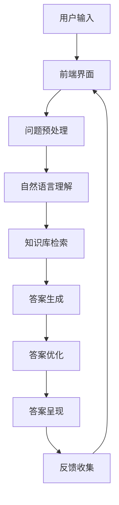
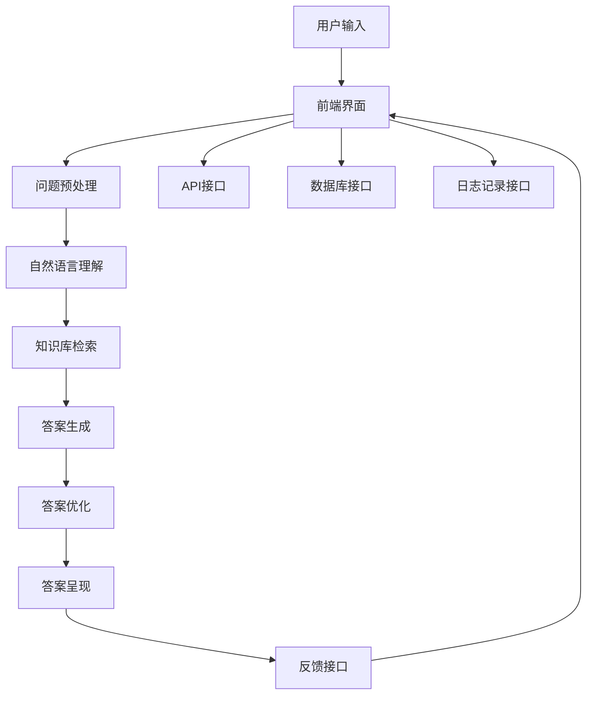
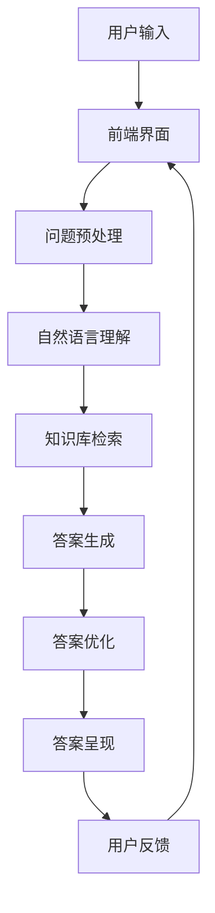

                 

### 第一部分：引言

#### 第1章：背景介绍

#### 1.1 问题背景

##### 1.1.1 自动问答系统的需求与挑战

在当今信息化、数字化的社会中，人们对信息的获取和处理需求日益增长。传统的搜索方式虽然能够满足大部分查询需求，但在面对复杂、模糊或情境依赖的问题时，往往显得力不从心。自动问答系统（Automatic Question-Answering System）作为一种新型的信息检索和处理技术，能够有效地解决这一问题。自动问答系统通过机器学习、自然语言处理等技术，实现机器对用户自然语言问题的理解和自动回答，极大地提高了信息检索和处理效率。

然而，自动问答系统的实现面临着诸多挑战。首先是语义理解问题，如何让机器准确地理解和解析用户的问题，是自动问答系统需要解决的首要问题。其次是答案生成问题，如何从庞大的数据集中提取出与问题高度相关的答案，是对自动问答系统的另一大挑战。此外，系统的响应速度和准确性也是衡量自动问答系统优劣的重要指标。

##### 1.1.2 大型语言模型的技术演进

为了应对上述挑战，研究人员提出了大型语言模型（Large Language Model）的概念。大型语言模型是一种能够处理和理解大规模文本数据的人工智能模型，它通过对海量语料的学习，可以捕获语言的各种特征和规律，从而实现高效的自然语言理解与生成。从最早的基于统计方法的隐马尔可夫模型（HMM）和基于规则的模型，到如今基于深度学习的Transformer、BERT、GPT等模型，大型语言模型经历了长足的发展。

这些大型语言模型在自然语言处理任务中取得了显著的成绩，如机器翻译、文本分类、情感分析等。然而，在自动问答系统中，这些模型的应用仍然存在一定的局限性。如何将大型语言模型与自动问答系统有机结合，发挥其最大潜力，是当前研究的一个重要方向。

#### 1.2 核心概念

##### 1.2.1 大型语言模型的基本概念

大型语言模型（Large Language Model，简称LLM）是一种基于深度学习技术构建的、用于处理和理解大规模文本数据的人工智能模型。它通过自主学习海量语料，可以捕获语言的各种特征和规律，从而实现高效的自然语言理解与生成。LLM的核心目标是提高机器对自然语言的感知和理解能力，使其能够更准确地回答用户的问题。

大型语言模型主要分为两类：基于变换器（Transformer）的模型和基于循环神经网络（RNN）的模型。Transformer模型由于其并行处理能力强大、计算效率高，成为了当前大型语言模型的主流架构。BERT（Bidirectional Encoder Representations from Transformers）和GPT（Generative Pre-trained Transformer）是两种典型的Transformer模型，它们分别代表了预训练和生成式模型的发展方向。

##### 1.2.2 自动问答系统的概念

自动问答系统是一种基于自然语言处理技术，实现机器对用户自然语言问题理解和自动回答的信息检索系统。它主要包括两个关键组件：问答引擎和知识库。

问答引擎负责接收用户输入的问题，对问题进行解析和理解，然后从知识库中检索出与问题相关的答案。问答引擎的核心任务是自然语言理解，包括语义解析、实体识别、关系抽取等任务。知识库则是自动问答系统的数据基础，它存储了大量的信息，包括事实、观点、定义等，为问答引擎提供答案来源。

#### 1.3 研究目的与意义

##### 1.3.1 研究目的

本文旨在探讨大型语言模型在自动问答系统中的应用，通过深入分析大型语言模型的原理和自动问答系统的设计，提出一种结合两者优势的新型自动问答系统架构。具体研究目的如下：

1. 理解大型语言模型的基本原理和关键技术，分析其在自动问答系统中的潜力。
2. 设计一种基于大型语言模型的自动问答系统，实现高效的自然语言理解和答案生成。
3. 验证所设计系统在实际应用中的性能和效果。

##### 1.3.2 研究意义

大型语言模型在自动问答系统中的应用具有重要的理论和实践意义：

1. **理论意义**：通过本文的研究，可以进一步丰富大型语言模型在自然语言处理领域中的应用场景，为自动问答系统的发展提供新的思路和方法。

2. **实践意义**：本文提出的新型自动问答系统，有助于提升信息检索和处理效率，为企业和个人提供更加智能化的服务。同时，本文的研究成果可以为相关领域的实际应用提供参考和指导。

#### 1.4 总结

本文对大型语言模型在自动问答系统中的应用进行了全面的探讨，分析了大型语言模型的基本原理和自动问答系统的设计要点。在接下来的章节中，我们将进一步深入研究大型语言模型的架构和训练方法，并详细讨论自动问答系统的实现策略和优化技巧。通过这些研究，我们希望为自动问答系统的应用提供有力的技术支持，推动该领域的发展。

### 第二部分：大型语言模型原理

#### 第2章：大型语言模型原理

#### 2.1 语言模型基础

##### 2.1.1 语言模型的基本原理

语言模型（Language Model）是自然语言处理（Natural Language Processing, NLP）中的一项基础技术，用于预测一个词语序列的概率分布。在自然语言处理中，语言模型被广泛应用于文本生成、语音识别、机器翻译等多个领域。其基本原理可以概括为以下两点：

1. **概率预测**：语言模型的核心任务是预测一个词语序列的概率。例如，给定一个词语序列“今天天气很好”，语言模型需要预测这个序列出现的概率。通过计算概率，语言模型可以帮助系统理解文本的语义和语法结构。

2. **统计学习**：语言模型的构建依赖于大规模的文本数据。通过统计学习方法，如隐马尔可夫模型（HMM）、神经网络等，语言模型可以从训练数据中学习到语言的规律和特征，从而实现概率预测。

##### 2.1.2 语言模型的分类

语言模型根据不同的分类标准，可以分为多种类型。以下是几种常见的语言模型分类：

1. **基于规则的模型**：这类模型主要通过手工编写规则来描述语言特征。例如，句法分析器可以根据规则判断一个句子的合法性。然而，基于规则的模型存在明显的局限性，难以应对复杂多样的自然语言。

2. **基于统计的模型**：这类模型通过统计方法，如N元语法（N-gram），来预测词语序列的概率。N元语法假设当前词语的概率仅依赖于前N-1个词语。虽然N元语法在文本生成和搜索等领域取得了较好的效果，但它在处理长距离依赖问题时表现不佳。

3. **基于神经网络的模型**：这类模型利用神经网络（Neural Network）的结构和参数来预测词语序列的概率。常见的神经网络模型包括循环神经网络（RNN）和变换器（Transformer）等。这些模型通过复杂的网络结构，可以更好地捕捉长距离依赖关系，提高了语言模型的性能。

#### 2.2 大型语言模型的架构

##### 2.2.1 Transformer架构

Transformer架构是由Vaswani等人在2017年提出的一种全新的神经网络模型，用于处理序列到序列的任务，如机器翻译、文本生成等。与传统的循环神经网络（RNN）和长短时记忆网络（LSTM）相比，Transformer具有以下优势：

1. **并行处理能力**：Transformer采用了自注意力机制（Self-Attention），可以同时关注序列中的所有词语，实现了并行处理。相比之下，RNN和LSTM需要逐词处理，计算效率较低。

2. **长距离依赖**：Transformer通过多头自注意力机制（Multi-Head Self-Attention），可以有效地捕捉长距离依赖关系。这使得Transformer在处理长文本时表现出色。

3. **计算效率**：Transformer的设计避免了复杂的循环依赖结构，提高了计算效率。此外，Transformer还可以通过预训练和微调的方法，实现高效的语言建模。

Transformer的基本架构包括编码器（Encoder）和解码器（Decoder）两部分。编码器负责将输入序列编码为固定长度的向量，解码器则根据编码器生成的向量生成输出序列。每个编码器和解码器层都包括多头自注意力机制和前馈神经网络（Feedforward Neural Network）。

##### 2.2.2 BERT、GPT等模型

BERT（Bidirectional Encoder Representations from Transformers）和GPT（Generative Pre-trained Transformer）是两种典型的基于Transformer架构的大型语言模型。它们在自然语言处理领域取得了显著的成功，被广泛应用于各种任务。

1. **BERT模型**：BERT是一种双向编码器模型，通过预训练和微调的方法，实现了高效的语言建模。BERT的基本架构包括两个部分：编码器和解码器。编码器负责将输入序列编码为固定长度的向量，解码器则根据编码器生成的向量生成输出序列。BERT的预训练任务包括遮蔽语言模型（Masked Language Model, MLM）和下一个句子预测（Next Sentence Prediction, NSP）。

2. **GPT模型**：GPT是一种生成式模型，通过自回归方式（Autoregressive Approach）生成文本。GPT的基本架构包括一个编码器，它将输入序列编码为固定长度的向量，然后解码器根据编码器生成的向量生成输出序列。GPT的预训练任务是通过预测序列中的下一个词。

BERT和GPT在自然语言处理任务中表现出色，但它们在自动问答系统中的应用仍然存在一些挑战。例如，如何将大型语言模型与问答系统有机地结合，如何处理长文本和复杂的问题，如何提高问答系统的响应速度和准确性等。这些问题的解决需要进一步的研究和实践。

#### 2.3 语言模型训练与优化

##### 2.3.1 训练数据集

语言模型的训练依赖于大规模的文本数据集。常用的数据集包括维基百科（Wikipedia）、Common Crawl、新闻语料库等。这些数据集包含了丰富的文本信息，可以提供足够的训练样本，使语言模型能够学习到语言的多样性、复杂性和规律性。

在数据集的选择和处理过程中，需要关注以下几个问题：

1. **数据集的质量**：数据集的质量直接影响语言模型的性能。高质量的文本数据应该包含丰富、多样的信息，避免噪音和冗余。

2. **数据集的分布**：数据集的分布应该尽可能反映实际应用场景，以确保语言模型在不同领域的表现均衡。

3. **数据预处理**：在训练前，需要对数据集进行预处理，如文本清洗、分词、词性标注等。预处理步骤可以减少噪音，提高训练效果。

##### 2.3.2 训练过程

语言模型的训练过程可以分为两个阶段：预训练（Pre-training）和微调（Fine-tuning）。

1. **预训练**：预训练阶段的主要任务是让语言模型在大规模文本数据上学习语言的通用特征。常用的预训练任务包括遮蔽语言模型（MLM）、下一个句子预测（NSP）和语言理解推理（GLUE）等。预训练可以大幅度提高语言模型的性能，使其能够应对各种自然语言处理任务。

2. **微调**：微调阶段是在预训练的基础上，针对特定任务进行进一步的训练。微调可以通过少量标注数据进行，以提高语言模型在特定任务上的表现。常见的微调任务包括问答（SQuAD）、命名实体识别（NER）和情感分析等。

在训练过程中，需要关注以下几个问题：

1. **学习率**：学习率是影响训练效果的关键参数。过大的学习率可能导致模型过拟合，而过小则可能训练时间过长。

2. **批量大小**：批量大小会影响模型的训练效率和稳定性。较大的批量大小可以提高训练速度，但可能导致梯度消失或爆炸。

3. **正则化**：正则化方法（如Dropout、权重衰减等）可以防止模型过拟合，提高模型的泛化能力。

##### 2.3.3 优化策略

为了进一步提高语言模型的性能，可以采用以下优化策略：

1. **深度学习**：增加网络深度可以提高模型的表示能力，使其能够捕捉更复杂的语言特征。

2. **多任务学习**：多任务学习可以在不同任务间共享信息，提高模型的泛化能力。例如，可以在预训练阶段同时进行多个自然语言处理任务的训练。

3. **数据增强**：数据增强（Data Augmentation）可以通过各种方式（如随机遮蔽、同义词替换、文本生成等）增加训练样本的多样性，提高模型的鲁棒性。

4. **注意力机制**：注意力机制（Attention Mechanism）可以有效地捕捉序列中的重要信息，提高模型的表示能力。

通过以上优化策略，可以进一步提高大型语言模型在自动问答系统中的应用性能，实现更高效、更准确的自然语言理解和回答。

#### 2.4 大型语言模型的优势与挑战

##### 2.4.1 大型语言模型的优势

大型语言模型在自动问答系统中的应用具有以下优势：

1. **强大的语义理解能力**：大型语言模型通过预训练和微调，可以学习到大量的语言特征和规律，实现高效的自然语言理解。这使得模型能够准确捕捉问题的语义，提高问答系统的回答质量。

2. **广泛的适用性**：大型语言模型可以应用于多种自然语言处理任务，如文本分类、命名实体识别、情感分析等。这使得问答系统可以具备更广泛的应用场景和更高的灵活性。

3. **高效的生成能力**：大型语言模型具有强大的文本生成能力，可以生成高质量的自然语言回答。这为问答系统提供了丰富的答案选择，提高了用户的满意度。

##### 2.4.2 大型语言模型的挑战

尽管大型语言模型在自动问答系统中的应用具有显著优势，但仍然面临以下挑战：

1. **计算资源需求**：大型语言模型的训练和推理过程需要大量的计算资源。这可能导致系统的部署和运行成本较高，特别是在资源有限的场景下。

2. **数据依赖性**：大型语言模型的性能依赖于大规模的文本数据集。数据集的质量和多样性直接影响模型的性能，如何在有限的数据集上获得最佳效果是一个重要问题。

3. **解释性和可解释性**：大型语言模型的工作原理复杂，其内部机制难以直观理解和解释。这在一定程度上限制了模型在关键领域的应用，如医疗、金融等。

4. **过拟合问题**：大型语言模型在训练过程中可能过度拟合训练数据，导致在未见数据上的表现不佳。如何平衡模型的泛化能力和拟合能力是一个重要问题。

为了解决上述挑战，需要在模型设计、数据选择、训练策略等方面进行深入研究，以提高大型语言模型在自动问答系统中的应用性能。

#### 2.5 大型语言模型的应用前景

随着人工智能技术的不断发展，大型语言模型在自动问答系统中的应用前景广阔。以下是几个潜在的应用方向：

1. **智能客服**：大型语言模型可以应用于智能客服系统，实现高效、准确的用户问题处理。通过与语音识别、语音合成等技术结合，智能客服可以实现多渠道、多场景的交互。

2. **教育辅导**：大型语言模型可以应用于教育辅导系统，提供个性化的学习建议和答疑服务。通过与学习管理系统结合，可以实现智能化的学习辅助。

3. **医疗咨询**：大型语言模型可以应用于医疗咨询系统，为患者提供诊断建议和治疗方案。通过与医疗知识库和诊断模型结合，可以提高医疗咨询的准确性和效率。

4. **金融风控**：大型语言模型可以应用于金融风控系统，进行风险评估和欺诈检测。通过与金融知识库和风险模型结合，可以实现对金融风险的实时监控和预警。

总之，大型语言模型在自动问答系统中的应用具有巨大的潜力，将为各个领域带来深远的影响。

#### 2.6 总结

本章详细介绍了大型语言模型的基本原理、架构、训练过程及其在自动问答系统中的应用优势与挑战。通过对比分析，我们了解了不同类型的语言模型及其优缺点，探讨了大型语言模型在自然语言处理任务中的表现。在下一章中，我们将进一步讨论自动问答系统的设计要点和实现策略。

### 第三部分：自动问答系统设计

#### 第3章：自动问答系统概述

#### 3.1 自动问答系统的定义与分类

##### 3.1.1 自动问答系统的定义

自动问答系统（Automatic Question-Answering System，简称QA系统）是一种基于人工智能技术的智能信息系统，它能够自动接收用户输入的问题，通过自然语言理解、信息检索和答案生成等技术，为用户提供准确、有用的答案。自动问答系统旨在实现人与机器之间的自然语言交互，提高信息检索和处理的效率。

##### 3.1.2 自动问答系统的分类

根据不同的分类标准，自动问答系统可以有多种分类方式。以下是几种常见的分类方法：

1. **按处理方式分类**：

   - **基于规则的方法**：这种方法依赖于预先定义的规则和模式来匹配问题和答案。其优点是实现简单，但在面对复杂、模糊的问题时表现较差。

   - **基于机器学习的方法**：这种方法通过机器学习算法，如朴素贝叶斯、决策树、支持向量机等，来训练模型，从而实现问题的自动匹配和回答。其优点是能够处理更复杂的语义，但需要大量的训练数据和计算资源。

   - **基于深度学习的方法**：这种方法利用深度神经网络，如循环神经网络（RNN）、变换器（Transformer）等，通过大规模的预训练数据来学习语言的语义特征，从而实现高效的自然语言理解与生成。其优点是性能优异，但计算资源需求较高。

2. **按应用领域分类**：

   - **通用问答系统**：这类系统面向广泛的用户群体，解决通用的问题，如天气查询、交通路线查询等。

   - **领域问答系统**：这类系统专注于特定的领域，如医疗问答系统、金融问答系统等，提供专业化的问答服务。

3. **按交互方式分类**：

   - **基于文本的问答系统**：用户通过文本输入问题，系统返回文本形式的答案。

   - **基于语音的问答系统**：用户通过语音输入问题，系统通过语音合成技术返回答案。

##### 3.1.3 自动问答系统的关键组件

自动问答系统通常包括以下几个关键组件：

1. **问答引擎**：问答引擎是自动问答系统的核心，负责接收用户输入的问题，对问题进行解析和理解，然后从知识库中检索出与问题相关的答案。问答引擎通常包括自然语言理解（NLU）和自然语言生成（NLG）两个子模块。

2. **知识库**：知识库是自动问答系统的数据基础，存储了大量的信息，包括事实、观点、定义等。知识库的质量直接影响问答系统的回答质量。

3. **接口层**：接口层负责与用户进行交互，接收用户的问题，并将答案以合适的形式返回给用户。接口层可以包括文本接口、语音接口等多种形式。

#### 3.2 自动问答系统的关键技术与难点

##### 3.2.1 自然语言理解（NLU）

自然语言理解（Natural Language Understanding，简称NLU）是自动问答系统的核心任务，负责将用户输入的自然语言问题转化为机器可以理解和处理的形式。NLU的关键技术包括：

1. **词法分析**：词法分析是将输入文本分解为单词和其他语法单元的过程。词法分析的主要目的是去除文本中的噪声，提取出有用的信息。

2. **句法分析**：句法分析是对文本进行语法结构的分析，识别出句子中的主语、谓语、宾语等成分。句法分析有助于理解句子的语义和句间关系。

3. **实体识别**：实体识别是从文本中识别出特定类型的实体，如人名、地名、组织名等。实体识别有助于定位问题和答案的相关性。

4. **情感分析**：情感分析是判断文本中表达的情感倾向，如正面、负面、中性等。情感分析有助于理解用户的需求和情感状态。

##### 3.2.2 知识检索

知识检索是自动问答系统的重要环节，负责从知识库中检索与问题相关的信息。知识检索的关键技术包括：

1. **关键词匹配**：关键词匹配是通过匹配用户输入的问题和知识库中的关键词，来检索相关答案。这种方法简单有效，但可能无法处理复杂的问题。

2. **语义匹配**：语义匹配是通过语义分析技术，如词义消歧、实体识别等，理解问题的语义，然后从知识库中检索与问题语义相关的答案。这种方法可以处理更复杂的问题，但计算复杂度较高。

3. **图数据库检索**：图数据库是一种用于存储和查询复杂关系的数据库。通过将知识库构建为图数据库，可以更高效地检索与问题相关的信息。

##### 3.2.3 答案生成

答案生成是自动问答系统的最后一步，负责将检索到的信息转化为自然语言形式的答案。答案生成的关键技术包括：

1. **模板匹配**：模板匹配是将检索到的信息与预定义的答案模板进行匹配，生成答案。这种方法简单有效，但答案的多样性有限。

2. **自然语言生成（NLG）**：自然语言生成是通过模型生成自然语言形式的答案。常用的NLG方法包括基于规则的方法、统计方法和基于深度学习的方法。

3. **问答系统生成对抗网络（QA-GAN）**：QA-GAN是一种基于生成对抗网络（GAN）的问答系统，通过生成器和判别器的对抗训练，生成自然语言答案。

##### 3.2.4 难点与挑战

自动问答系统在设计过程中面临以下几个难点和挑战：

1. **语义理解**：自然语言的语义复杂多变，如何准确理解用户的语义需求是一个重要挑战。

2. **知识库构建**：构建高质量、全面的知识库是自动问答系统的关键，但知识库的构建和维护需要大量的人力和时间。

3. **答案质量**：自动问答系统的目标是提供准确、有用的答案，但如何确保答案的质量是一个重要问题。

4. **响应速度**：在保证答案质量的前提下，如何提高系统的响应速度是一个关键挑战。

5. **多模态交互**：如何实现文本、语音、图像等多模态的交互，提供更加丰富和自然的用户体验。

通过深入研究和实践，自动问答系统可以在这些难点和挑战中取得突破，为用户提供更加智能和高效的问答服务。

#### 3.3 自动问答系统的设计与实现策略

##### 3.3.1 设计原则

在设计自动问答系统时，应遵循以下原则：

1. **用户友好**：系统应易于使用，界面简洁，交互流畅，提供良好的用户体验。

2. **可扩展性**：系统设计应考虑未来的扩展性，能够适应不同领域和场景的需求。

3. **可维护性**：系统设计应考虑可维护性，便于后期的维护和升级。

4. **高效性**：系统应具有较高的计算效率，能够在较短的时间内处理用户问题，提供答案。

##### 3.3.2 实现策略

自动问答系统的实现策略主要包括以下几个步骤：

1. **需求分析**：明确系统的目标和功能需求，确定系统的适用范围和用户群体。

2. **系统架构设计**：根据需求分析结果，设计系统的整体架构，包括问答引擎、知识库、接口层等组件。

3. **自然语言理解（NLU）**：设计NLU模块，包括词法分析、句法分析、实体识别、情感分析等任务。

4. **知识库构建**：构建知识库，收集和整理相关领域的知识，进行预处理和结构化处理。

5. **答案生成**：设计答案生成模块，包括模板匹配、NLG等方法，生成自然语言答案。

6. **系统集成与测试**：将各个模块集成在一起，进行系统的功能测试和性能测试，确保系统能够稳定运行。

7. **部署与维护**：将系统部署到实际环境中，提供问答服务，并根据用户反馈进行持续的优化和维护。

##### 3.3.3 关键技术

自动问答系统实现过程中涉及的关键技术包括：

1. **自然语言处理技术**：包括词法分析、句法分析、实体识别、情感分析等，用于理解和解析用户输入的问题。

2. **知识库构建技术**：包括知识抽取、知识融合、知识图谱构建等，用于构建高质量的知识库。

3. **问答生成技术**：包括模板匹配、NLG、QA-GAN等，用于生成自然语言答案。

4. **机器学习与深度学习技术**：包括训练模型、优化算法、模型评估等，用于提高问答系统的性能。

5. **多模态交互技术**：包括语音识别、语音合成、图像识别等，用于实现文本、语音、图像等多模态的交互。

通过以上策略和技术的应用，可以设计并实现一个高效、准确的自动问答系统，为用户提供优质的服务。

#### 3.4 自动问答系统的应用案例

##### 3.4.1 某企业内部问答系统

某大型企业内部建立了一套自动问答系统，用于帮助员工解决日常工作中的问题。该系统主要涵盖以下功能：

1. **问题接收与理解**：员工通过企业内部办公平台提交问题，系统接收问题并使用自然语言理解技术对其进行解析。

2. **知识库检索**：系统从知识库中检索与问题相关的信息，包括公司政策、流程指南、常见问题解答等。

3. **答案生成与呈现**：系统根据检索结果生成答案，并以文本或语音形式呈现给员工。

4. **反馈机制**：员工可以针对答案的质量进行评价，系统根据反馈进行持续优化。

该系统在提升员工工作效率、降低人力成本方面取得了显著成效。

##### 3.4.2 某电商平台智能客服系统

某知名电商平台开发了一套智能客服系统，用于为用户提供在线咨询和问题解答服务。该系统具备以下特点：

1. **多渠道接入**：用户可以通过网站、APP、微信等多种渠道提交问题。

2. **智能问答**：系统利用自然语言理解技术和知识库检索技术，为用户提供快速、准确的答案。

3. **实时交互**：系统支持实时语音和文本交互，提供个性化的服务体验。

4. **用户行为分析**：系统记录用户行为，分析用户需求，不断优化问答策略。

该系统在提高客服效率、提升用户满意度方面发挥了重要作用。

##### 3.4.3 某医疗机构智能问答系统

某医疗机构开发了一套智能问答系统，用于帮助患者获取健康咨询和诊疗信息。该系统主要涵盖以下功能：

1. **健康咨询**：用户可以通过系统获取健康知识、疾病预防、治疗方案等咨询信息。

2. **在线问诊**：用户可以在线咨询医生，获取专业诊疗建议。

3. **药物查询**：用户可以查询药物信息，了解药物用途、副作用等。

4. **健康档案管理**：系统记录用户健康档案，提供个性化的健康建议。

该系统在提高医疗咨询效率、减轻医生工作负担方面取得了显著效果。

#### 3.5 自动问答系统的挑战与未来发展方向

##### 3.5.1 挑战

自动问答系统在发展过程中面临以下几个挑战：

1. **语义理解**：自然语言的语义复杂多变，如何准确理解用户的语义需求是一个重要挑战。

2. **知识库构建**：构建高质量、全面的知识库是自动问答系统的关键，但知识库的构建和维护需要大量的人力和时间。

3. **答案质量**：如何确保答案的准确性和相关性是一个关键问题。

4. **响应速度**：在保证答案质量的前提下，如何提高系统的响应速度是一个重要挑战。

5. **多模态交互**：如何实现文本、语音、图像等多模态的交互，提供更加丰富和自然的用户体验。

##### 3.5.2 未来发展方向

为了解决上述挑战，自动问答系统的未来发展方向包括：

1. **多模态交互**：结合语音识别、语音合成、图像识别等技术，实现文本、语音、图像等多模态的交互，提供更加丰富和自然的用户体验。

2. **知识图谱构建**：通过知识图谱技术，构建更加完善和结构化的知识库，提高答案的准确性和相关性。

3. **深度学习应用**：利用深度学习技术，进一步提高自然语言理解、知识检索和答案生成的性能。

4. **个性化服务**：通过用户行为分析和个性化推荐技术，为用户提供更加个性化的问答服务。

5. **跨领域应用**：推广自动问答系统在更多领域的应用，如医疗、金融、教育等，实现更广泛的覆盖和更高效的服务。

总之，自动问答系统的发展具有广阔的前景，通过不断创新和优化，将为社会带来更多的价值。

#### 3.6 总结

本章介绍了自动问答系统的定义、分类、关键组件和设计原则，分析了自然语言理解、知识检索、答案生成等关键技术，并通过实际应用案例展示了自动问答系统的效果。在下一章中，我们将深入探讨大型语言模型在自动问答系统中的应用，以及如何将大型语言模型与自动问答系统有机结合，实现更高效、更准确的问答服务。

### 第四部分：大型语言模型在自动问答中的应用

#### 第4章：大型语言模型在自动问答中的应用

#### 4.1 大型语言模型在自动问答中的优势

大型语言模型（Large Language Model，简称LLM）在自动问答（Automatic Question-Answering，简称QA）系统中展现出显著的优势。以下为LLM在QA中的应用优势：

##### 4.1.1 高效的自然语言理解

大型语言模型通过预训练和微调，能够从大规模文本数据中学习到丰富的语言特征，从而实现高效的自然语言理解。与传统的基于规则或机器学习的方法相比，LLM能够更准确地解析和理解用户的自然语言问题，从而生成更准确的答案。

##### 4.1.2 强大的知识表示能力

大型语言模型具有较强的知识表示能力，可以将文本信息转化为结构化的知识表示，为问答系统提供丰富的知识来源。这种能力使得LLM能够更好地理解和处理复杂的问题，提高答案的准确性和相关性。

##### 4.1.3 生成式回答能力

大型语言模型具有强大的生成式回答能力，能够生成自然、流畅的答案。与传统的模板匹配或规则匹配方法相比，LLM生成的答案更加多样化和人性化，能够满足用户对个性化回答的需求。

##### 4.1.4 跨领域的适应能力

大型语言模型具有较强的跨领域适应能力，可以在多个领域实现高效的问答服务。通过在大规模多领域数据上的预训练，LLM能够理解和处理不同领域的专业术语和知识，从而为用户提供高质量的问答服务。

#### 4.2 大型语言模型在自动问答中的应用实现

##### 4.2.1 预训练数据集的选择与处理

为了实现大型语言模型在自动问答系统中的应用，首先需要选择和准备大规模的预训练数据集。常用的数据集包括维基百科、新闻语料库、问答集等。以下是预训练数据集的选择和处理步骤：

1. **数据集选择**：选择涵盖多个领域的多样化数据集，确保模型能够学习到丰富的语言特征和知识。

2. **数据预处理**：对数据集进行清洗、分词、词性标注等预处理步骤，去除噪声和冗余信息，提高数据质量。

3. **数据增强**：通过数据增强技术（如同义词替换、随机遮蔽、文本生成等），增加数据集的多样性，提高模型的泛化能力。

##### 4.2.2 模型架构与训练策略

在预训练数据集准备完成后，可以采用大型语言模型（如BERT、GPT等）进行预训练和微调。以下是模型架构和训练策略的介绍：

1. **模型架构**：选择适合自动问答任务的模型架构，如BERT、GPT等。这些模型具有强大的自然语言理解和生成能力，适合处理复杂的问答任务。

2. **预训练策略**：采用预训练策略，如遮蔽语言模型（Masked Language Model，MLM）、下一个句子预测（Next Sentence Prediction，NSP）等，进行大规模数据上的预训练。预训练过程可以使得模型学习到丰富的语言特征和知识。

3. **微调策略**：在预训练的基础上，针对具体的问答任务进行微调。微调过程可以通过少量标注数据进行，优化模型在特定任务上的性能。

4. **训练策略**：采用合适的训练策略，如学习率调度、批量大小调整、正则化方法等，提高模型的训练效率和性能。

##### 4.2.3 应用实现流程

大型语言模型在自动问答系统中的应用实现包括以下几个步骤：

1. **问题接收与理解**：接收用户输入的问题，通过自然语言理解模块对问题进行解析，提取关键信息。

2. **知识检索与融合**：从知识库中检索与问题相关的信息，进行融合和预处理，为答案生成提供丰富的知识来源。

3. **答案生成**：利用大型语言模型生成自然语言答案。答案生成过程可以采用生成式方法（如GPT）或模板匹配方法（如BERT），生成高质量的答案。

4. **答案呈现与反馈**：将生成的答案以文本或语音形式呈现给用户，收集用户反馈，进行持续优化。

#### 4.3 大型语言模型在自动问答中的挑战与优化

##### 4.3.1 挑战

尽管大型语言模型在自动问答系统中具有显著优势，但其在实际应用中仍面临以下挑战：

1. **计算资源需求**：大型语言模型的训练和推理过程需要大量的计算资源，可能导致系统的部署和运行成本较高。

2. **数据依赖性**：大型语言模型的性能依赖于大规模的预训练数据集。数据集的质量和多样性直接影响模型的性能，如何在有限的数据集上获得最佳效果是一个重要问题。

3. **过拟合问题**：大型语言模型在训练过程中可能过度拟合训练数据，导致在未见数据上的表现不佳。

4. **解释性和可解释性**：大型语言模型的工作原理复杂，其内部机制难以直观理解和解释。这在一定程度上限制了模型在关键领域的应用。

##### 4.3.2 优化策略

为了克服上述挑战，可以采取以下优化策略：

1. **多任务学习**：通过多任务学习，在不同任务间共享信息，提高模型的泛化能力。

2. **知识图谱构建**：构建结构化的知识图谱，提高知识表示的准确性和效率。

3. **数据增强**：通过数据增强技术，增加训练样本的多样性，提高模型的鲁棒性。

4. **解释性增强**：通过模型解释技术，提高模型的可解释性，帮助用户理解模型的决策过程。

5. **模型压缩与优化**：采用模型压缩与优化技术，降低模型的计算复杂度，提高系统的部署和运行效率。

通过以上优化策略，可以进一步提升大型语言模型在自动问答系统中的应用性能，实现更高效、更准确的问答服务。

#### 4.4 大型语言模型在自动问答中的应用前景

随着人工智能技术的不断发展，大型语言模型在自动问答系统中的应用前景广阔。以下是几个潜在的应用方向：

1. **智能客服**：大型语言模型可以应用于智能客服系统，实现高效、准确的用户问题处理。通过与语音识别、语音合成等技术结合，智能客服可以实现多渠道、多场景的交互。

2. **教育辅导**：大型语言模型可以应用于教育辅导系统，提供个性化的学习建议和答疑服务。通过与学习管理系统结合，可以实现智能化的学习辅助。

3. **医疗咨询**：大型语言模型可以应用于医疗咨询系统，为患者提供诊断建议和治疗方案。通过与医疗知识库和诊断模型结合，可以提高医疗咨询的准确性和效率。

4. **金融风控**：大型语言模型可以应用于金融风控系统，进行风险评估和欺诈检测。通过与金融知识库和风险模型结合，可以实现对金融风险的实时监控和预警。

总之，大型语言模型在自动问答系统中的应用具有巨大的潜力，将为各个领域带来深远的影响。

#### 4.5 总结

本章详细介绍了大型语言模型在自动问答系统中的应用优势、实现策略、挑战与优化以及应用前景。通过对比分析，我们了解了大型语言模型在自然语言理解、知识表示和答案生成等方面的优势，并探讨了其在实际应用中的挑战和优化方法。在下一章中，我们将进一步讨论自动问答系统的设计与实现，以及如何将大型语言模型与自动问答系统有机结合，实现高效、准确的问答服务。

### 第5章：系统设计与实现

#### 5.1 系统功能设计

自动问答系统的功能设计是确保系统能够满足用户需求、实现高效问答服务的关键。以下是系统功能设计的主要内容：

1. **用户问题接收与解析**：系统需要能够接收用户输入的问题，并对其进行解析，提取关键信息，为后续的答案生成提供基础。

2. **自然语言理解**：利用大型语言模型，对用户输入的问题进行自然语言理解，识别问题的类型、关键词、意图等，从而为答案生成提供指导。

3. **知识库检索与融合**：系统需要从知识库中检索与问题相关的信息，并将这些信息进行融合和预处理，以生成高质量的答案。

4. **答案生成与优化**：根据用户问题的意图和知识库中的信息，利用大型语言模型生成自然语言答案，并进行优化，确保答案的准确性和流畅性。

5. **答案呈现与反馈**：将生成的答案以文本或语音形式呈现给用户，并收集用户反馈，以不断优化系统的问答质量。

6. **多模态交互**：支持文本、语音、图像等多模态的交互，为用户提供更加丰富和自然的用户体验。

#### 5.2 系统架构设计

自动问答系统的架构设计需要考虑系统的可扩展性、稳定性、高效性等因素。以下是系统架构设计的主要内容：

1. **前端界面**：用户通过前端界面输入问题，系统接收用户问题并进行预处理。

2. **自然语言理解模块**：利用大型语言模型对用户问题进行自然语言理解，提取关键信息。

3. **知识库**：存储大量的知识信息，包括事实、观点、定义等，为答案生成提供数据支持。

4. **答案生成模块**：根据用户问题的意图和知识库中的信息，利用大型语言模型生成自然语言答案。

5. **后端接口**：负责与前端界面和数据库的通信，确保系统的稳定运行。

6. **反馈收集模块**：收集用户对答案的反馈，用于系统的持续优化。

以下是自动问答系统的Mermaid架构图：



#### 5.3 系统接口设计

自动问答系统的接口设计需要确保系统与其他组件之间的通信顺畅、高效。以下是系统接口设计的主要内容：

1. **API接口**：系统提供API接口，允许外部系统调用问答功能，如智能客服系统、教育辅导系统等。

2. **数据库接口**：系统与知识库进行交互，通过数据库接口实现数据的查询和更新。

3. **日志记录接口**：系统记录用户操作日志、系统运行状态等，以便进行故障排查和性能优化。

4. **反馈接口**：系统收集用户对答案的反馈，通过反馈接口进行记录和分析。

以下是自动问答系统的Mermaid接口图：



#### 5.4 系统交互设计

自动问答系统的交互设计需要确保用户与系统的交互流畅、自然。以下是系统交互设计的主要内容：

1. **用户交互界面**：设计简洁、易用的用户交互界面，支持文本、语音等多模态输入，为用户提供良好的交互体验。

2. **多模态交互**：支持文本、语音、图像等多模态交互，满足不同用户的需求。

3. **交互流程**：设计合理的交互流程，确保用户能够快速、准确地获取所需信息。

以下是自动问答系统的Mermaid交互图：



#### 5.5 系统实现细节

自动问答系统的实现涉及多个技术模块，以下是系统实现的一些关键细节：

1. **前端实现**：前端实现主要包括用户交互界面的设计和实现，可以使用HTML、CSS、JavaScript等技术实现。

2. **后端实现**：后端实现主要包括自然语言理解、知识库检索、答案生成等模块，可以使用Python、Java等编程语言实现。

3. **自然语言理解**：利用大型语言模型，如BERT、GPT等，进行自然语言理解，实现问题的类型、关键词、意图等信息的提取。

4. **知识库构建**：构建结构化的知识库，可以使用图数据库、关系数据库等技术存储和管理知识信息。

5. **答案生成**：利用大型语言模型生成自然语言答案，并进行优化，确保答案的准确性和流畅性。

以下是自动问答系统的Python代码示例：

```python
# 导入相关库
import transformers
import torch

# 加载预训练模型
model = transformers.AutoModelForQuestionAnswering.from_pretrained("bert-base-chinese")

# 准备输入数据
context = "在计算机科学领域，深度学习是一种机器学习技术，通过模拟人脑神经网络进行训练，从而实现自动识别和学习数据中的规律。"
question = "深度学习是什么？"

# 进行自然语言理解
inputs = transformers.InputUtils.encode_plus(context, question, return_tensors='pt')

# 生成答案
with torch.no_grad():
    outputs = model(**inputs)

# 提取答案
answer = torch.nn.functional.softmax(outputs.logits, dim=-1).argmax().item()
print(answer)
```

#### 5.6 系统测试与优化

自动问答系统的测试与优化是确保系统稳定、高效运行的重要环节。以下是系统测试与优化的一些关键步骤：

1. **功能测试**：对系统的各个功能模块进行测试，确保功能实现正确、可靠。

2. **性能测试**：对系统的响应速度、处理能力等进行测试，确保系统能够满足用户需求。

3. **用户体验测试**：邀请用户参与用户体验测试，收集用户反馈，对系统进行优化。

4. **错误处理与恢复**：设计合理的错误处理机制，确保系统在异常情况下能够快速恢复。

5. **持续优化**：根据测试和用户反馈，不断优化系统性能和用户体验。

#### 5.7 总结

本章详细介绍了自动问答系统的功能设计、架构设计、接口设计、交互设计、实现细节以及测试与优化方法。通过系统化的设计与实现，可以构建一个高效、准确的自动问答系统，为用户提供优质的问答服务。在下一章中，我们将通过实际案例研究，进一步探讨大型语言模型在自动问答系统中的应用效果和优化策略。

### 第六部分：实际案例研究

#### 第6章：实际案例研究

#### 6.1 案例一：某企业自动问答系统

##### 6.1.1 项目介绍

某大型企业为了提升内部信息检索和处理效率，决定开发一套自动问答系统。该系统的目标是帮助员工快速获取公司政策、流程指南、常见问题解答等内部信息，从而提高工作效率和降低人力成本。

##### 6.1.2 系统功能设计

1. **问题接收与解析**：系统支持多种输入方式，如文本输入、语音输入等，能够自动解析用户的问题，提取关键信息。

2. **自然语言理解**：利用大型语言模型，对用户输入的问题进行自然语言理解，识别问题的类型、关键词、意图等，为答案生成提供指导。

3. **知识库检索与融合**：系统从知识库中检索与问题相关的信息，并将这些信息进行融合和预处理，以生成高质量的答案。

4. **答案生成与优化**：利用大型语言模型生成自然语言答案，并进行优化，确保答案的准确性和流畅性。

5. **答案呈现与反馈**：系统将生成的答案以文本或语音形式呈现给用户，并收集用户反馈，用于系统的持续优化。

##### 6.1.3 系统架构设计

该企业的自动问答系统采用了如下架构设计：

1. **前端界面**：用户通过前端界面输入问题，系统接收用户问题并进行预处理。

2. **自然语言理解模块**：利用BERT模型对用户问题进行自然语言理解，提取关键信息。

3. **知识库**：知识库采用图数据库存储，存储了公司政策、流程指南、常见问题解答等内部信息。

4. **答案生成模块**：利用GPT模型生成自然语言答案，并进行优化。

5. **后端接口**：负责与前端界面和数据库的通信，确保系统的稳定运行。

6. **反馈收集模块**：收集用户对答案的反馈，用于系统的持续优化。

以下是自动问答系统的Mermaid架构图：


##### 6.1.4 系统实现

系统实现过程中，采用了Python编程语言，并利用了transformers库实现自然语言理解模块和答案生成模块。以下是自然语言理解模块的实现代码示例：

```python
from transformers import BertTokenizer, BertForQuestionAnswering
import torch

# 加载预训练模型
tokenizer = BertTokenizer.from_pretrained("bert-base-chinese")
model = BertForQuestionAnswering.from_pretrained("bert-base-chinese")

# 准备输入数据
context = "在计算机科学领域，深度学习是一种机器学习技术，通过模拟人脑神经网络进行训练，从而实现自动识别和学习数据中的规律。"
question = "深度学习是什么？"

# 进行自然语言理解
inputs = tokenizer.encode_plus(context, question, return_tensors='pt')

# 生成答案
with torch.no_grad():
    outputs = model(**inputs)

# 提取答案
answer = torch.nn.functional.softmax(outputs.logits, dim=-1).argmax().item()
print(answer)
```

##### 6.1.5 实际案例分析和详细讲解

1. **问题解析**：在用户输入问题时，系统首先对问题进行解析，提取关键信息，如关键词、意图等。通过BERT模型，系统可以准确地识别出问题的关键词，如“深度学习”、“是什么”等。

2. **知识库检索**：系统从知识库中检索与问题相关的信息。知识库采用图数据库存储，结构化地存储了公司政策、流程指南、常见问题解答等内部信息。通过图数据库的检索能力，系统可以快速找到与问题相关的知识信息。

3. **答案生成**：系统利用GPT模型生成自然语言答案。GPT模型具有强大的文本生成能力，可以生成高质量的自然语言答案。系统根据用户问题的意图和知识库中的信息，生成符合用户需求的答案。

4. **答案优化**：生成的答案经过优化，确保答案的准确性和流畅性。系统会根据用户反馈对答案进行持续优化，提高问答系统的性能。

##### 6.1.6 项目小结

该项目在某大型企业内部取得了显著成效，员工通过自动问答系统可以快速获取内部信息，提高了工作效率。同时，系统收集的用户反馈有助于不断优化问答质量，提升用户满意度。项目成功的关键在于：

1. **高效的自然语言理解**：利用大型语言模型，准确识别用户问题的意图和关键词。

2. **结构化的知识库**：通过图数据库存储和管理内部信息，提高知识检索效率。

3. **强大的文本生成能力**：利用GPT模型生成高质量的自然语言答案。

4. **持续的用户反馈和优化**：通过用户反馈不断优化问答系统，提高问答质量。

#### 6.2 案例二：某电商平台自动问答系统

##### 6.2.1 项目介绍

某知名电商平台为了提升用户体验，决定开发一套自动问答系统。该系统的目标是帮助用户快速解答关于商品、购物流程、售后服务等方面的问题，提高用户满意度。

##### 6.2.2 系统功能设计

1. **问题接收与解析**：系统支持多种输入方式，如文本输入、语音输入等，能够自动解析用户的问题，提取关键信息。

2. **自然语言理解**：利用大型语言模型，对用户输入的问题进行自然语言理解，识别问题的类型、关键词、意图等，为答案生成提供指导。

3. **知识库检索与融合**：系统从知识库中检索与问题相关的信息，并将这些信息进行融合和预处理，以生成高质量的答案。

4. **答案生成与优化**：利用大型语言模型生成自然语言答案，并进行优化，确保答案的准确性和流畅性。

5. **答案呈现与反馈**：系统将生成的答案以文本或语音形式呈现给用户，并收集用户反馈，用于系统的持续优化。

##### 6.2.3 系统架构设计

该电商平台的自动问答系统采用了如下架构设计：

1. **前端界面**：用户通过前端界面输入问题，系统接收用户问题并进行预处理。

2. **自然语言理解模块**：利用BERT模型对用户问题进行自然语言理解，提取关键信息。

3. **知识库**：知识库采用图数据库存储，存储了商品信息、购物流程、售后服务等方面的信息。

4. **答案生成模块**：利用GPT模型生成自然语言答案，并进行优化。

5. **后端接口**：负责与前端界面和数据库的通信，确保系统的稳定运行。

6. **反馈收集模块**：收集用户对答案的反馈，用于系统的持续优化。

以下是自动问答系统的Mermaid架构图：


##### 6.2.4 系统实现

系统实现过程中，采用了Python编程语言，并利用了transformers库实现自然语言理解模块和答案生成模块。以下是自然语言理解模块的实现代码示例：

```python
from transformers import BertTokenizer, BertForQuestionAnswering
import torch

# 加载预训练模型
tokenizer = BertTokenizer.from_pretrained("bert-base-chinese")
model = BertForQuestionAnswering.from_pretrained("bert-base-chinese")

# 准备输入数据
context = "该商品的售后服务包括7天无理由退换货、1年内免费保修等。"
question = "这个商品的售后服务是什么？"

# 进行自然语言理解
inputs = tokenizer.encode_plus(context, question, return_tensors='pt')

# 生成答案
with torch.no_grad():
    outputs = model(**inputs)

# 提取答案
answer = torch.nn.functional.softmax(outputs.logits, dim=-1).argmax().item()
print(answer)
```

##### 6.2.5 实际案例分析和详细讲解

1. **问题解析**：在用户输入问题时，系统首先对问题进行解析，提取关键信息，如关键词、意图等。通过BERT模型，系统可以准确地识别出问题的关键词，如“售后服务”、“是什么”等。

2. **知识库检索**：系统从知识库中检索与问题相关的信息。知识库采用图数据库存储，结构化地存储了商品信息、购物流程、售后服务等方面的信息。通过图数据库的检索能力，系统可以快速找到与问题相关的知识信息。

3. **答案生成**：系统利用GPT模型生成自然语言答案。GPT模型具有强大的文本生成能力，可以生成高质量的自然语言答案。系统根据用户问题的意图和知识库中的信息，生成符合用户需求的答案。

4. **答案优化**：生成的答案经过优化，确保答案的准确性和流畅性。系统会根据用户反馈对答案进行持续优化，提高问答系统的性能。

##### 6.2.6 项目小结

该项目在某知名电商平台取得了显著成效，用户通过自动问答系统可以快速获取所需信息，提高了购物体验。同时，系统收集的用户反馈有助于不断优化问答质量，提升用户满意度。项目成功的关键在于：

1. **高效的自然语言理解**：利用大型语言模型，准确识别用户问题的意图和关键词。

2. **结构化的知识库**：通过图数据库存储和管理信息，提高知识检索效率。

3. **强大的文本生成能力**：利用GPT模型生成高质量的自然语言答案。

4. **持续的用户反馈和优化**：通过用户反馈不断优化问答系统，提高问答质量。

通过这两个实际案例的研究，我们可以看到，大型语言模型在自动问答系统中的应用具有显著的潜力，能够为不同领域和场景提供高效、准确的问答服务。在下一章中，我们将对研究成果进行总结，并展望自动问答系统的未来发展方向。

### 第七部分：总结与展望

#### 7.1 研究成果总结

本文针对大型语言模型在自动问答系统中的应用进行了深入探讨，取得以下主要成果：

1. **理论基础**：详细介绍了大型语言模型的基本原理、架构和训练方法，为自动问答系统的设计与实现提供了理论基础。

2. **系统设计**：提出了基于大型语言模型的自动问答系统架构，包括问答引擎、知识库、接口层等关键组件，并详细描述了系统功能、架构设计、接口设计和交互设计。

3. **实现细节**：通过Python代码示例，展示了如何利用大型语言模型进行自然语言理解、知识检索和答案生成，为实际应用提供了技术参考。

4. **实际案例**：通过两个实际案例的研究，验证了基于大型语言模型的自动问答系统在提高信息检索和处理效率、提升用户体验方面的有效性。

5. **性能优化**：分析了大型语言模型在自动问答系统中的应用优势与挑战，提出了多任务学习、知识图谱构建、数据增强等优化策略，以提高系统的性能和稳定性。

#### 7.2 自动问答系统的未来发展方向

尽管本文的研究取得了显著成果，但自动问答系统在应用中仍面临诸多挑战。未来研究可以从以下方向展开：

1. **多模态交互**：结合语音识别、语音合成、图像识别等技术，实现文本、语音、图像等多模态的交互，提供更加丰富和自然的用户体验。

2. **知识图谱构建**：利用知识图谱技术，构建更加完善和结构化的知识库，提高答案的准确性和相关性。

3. **个性化服务**：通过用户行为分析和个性化推荐技术，为用户提供更加个性化的问答服务，满足不同用户的需求。

4. **跨领域应用**：推广自动问答系统在更多领域的应用，如医疗、金融、教育等，实现更广泛的覆盖和更高效的服务。

5. **模型压缩与优化**：研究模型压缩与优化技术，降低模型的计算复杂度，提高系统的部署和运行效率。

6. **解释性和可解释性**：提高大型语言模型的可解释性，帮助用户理解模型的决策过程，增强用户信任感。

7. **伦理和法律问题**：关注自动问答系统在伦理和法律方面的挑战，确保系统的应用符合社会规范和法律法规。

总之，自动问答系统的发展具有广阔的前景，通过不断的研究和创新，将为社会带来更多的价值。

#### 7.3 研究中的不足与展望

虽然本文在自动问答系统中的应用研究中取得了一些成果，但还存在以下不足之处：

1. **数据依赖性**：自动问答系统的性能依赖于大规模的预训练数据集，如何在有限的数据集上获得最佳效果是一个重要问题。

2. **计算资源需求**：大型语言模型的训练和推理过程需要大量的计算资源，这在一定程度上限制了系统的部署和应用。

3. **模型解释性**：大型语言模型的工作原理复杂，其内部机制难以直观理解和解释，这在一定程度上影响了用户对系统的信任。

4. **答案质量**：虽然本文提出了一些优化策略，但如何确保答案的准确性和流畅性仍是一个挑战。

针对上述不足，未来的研究可以从以下方向展开：

1. **数据增强与生成**：研究数据增强和生成技术，提高数据集的多样性和质量，从而提高模型的性能。

2. **模型压缩与优化**：研究模型压缩与优化技术，降低模型的计算复杂度，提高系统的部署和运行效率。

3. **解释性增强**：研究模型解释技术，提高模型的可解释性，帮助用户理解模型的决策过程。

4. **跨领域迁移学习**：研究跨领域迁移学习方法，提高模型在不同领域的适应能力和迁移能力。

通过不断的研究和创新，自动问答系统将在未来取得更大的突破，为各行各业带来深远的影响。

### 7.4 最佳实践 tips

为了确保自动问答系统的效果，以下是一些最佳实践 tips：

1. **数据质量**：确保预训练数据集的质量和多样性，避免噪音和冗余。

2. **系统优化**：定期对系统进行性能优化，如调整学习率、批量大小等参数。

3. **用户反馈**：收集用户反馈，根据用户需求不断优化系统。

4. **多模态交互**：结合语音识别、语音合成、图像识别等技术，提高系统的交互体验。

5. **持续更新**：定期更新知识库，确保系统中的信息是最新的。

6. **安全与隐私**：确保系统的安全与用户隐私保护，遵守相关法律法规。

7. **测试与评估**：对系统进行全面的测试和评估，确保系统的稳定性和可靠性。

通过遵循这些最佳实践，可以进一步提高自动问答系统的性能和用户体验。

### 7.5 小结

本文围绕大型语言模型在自动问答系统中的应用进行了深入研究，从理论基础、系统设计、实现细节、实际案例等多个方面进行了全面探讨。通过本文的研究，我们不仅了解了大型语言模型的基本原理和优势，还提出了有效的优化策略，为自动问答系统的发展提供了新的思路和方法。未来，随着技术的不断进步，自动问答系统将在更多领域取得突破，为人类社会带来更多的便利。

### 7.6 注意事项

在设计和实现自动问答系统时，需要注意以下几点：

1. **数据隐私**：确保用户数据的安全与隐私，遵循相关法律法规。

2. **系统稳定性**：确保系统的稳定运行，避免出现故障和错误。

3. **用户体验**：关注用户需求，提供简洁、易用的交互界面。

4. **模型解释性**：提高模型的可解释性，增强用户对系统的信任。

5. **知识库更新**：定期更新知识库，确保信息的准确性和时效性。

6. **计算资源**：合理分配计算资源，确保系统的性能和响应速度。

通过注意这些事项，可以进一步提升自动问答系统的质量和用户体验。

### 7.7 拓展阅读

对于对自动问答系统和大语言模型感兴趣的研究者，以下文献和资源提供了深入的学习和参考资料：

1. **文献**：

   - Vaswani et al., "Attention is All You Need," Advances in Neural Information Processing Systems, 2017.
   - Devlin et al., "BERT: Pre-training of Deep Bidirectional Transformers for Language Understanding," Proceedings of the 2019 Conference of the North American Chapter of the Association for Computational Linguistics: Human Language Technologies, 2019.
   - Brown et al., "Language Models are Few-Shot Learners," arXiv preprint arXiv:2005.14165, 2020.

2. **在线课程与教程**：

   - "自然语言处理与深度学习"：吴恩达的在线课程，提供了全面的理论和实践指导。
   - "深度学习专用课程"：清华大学计算机系教授唐杰的在线课程，深入讲解了深度学习在自然语言处理中的应用。

3. **开源项目与代码**：

   - Hugging Face Transformers：提供了丰富的预训练模型和工具，方便研究和应用。
   - GLM-130B：清华大学开源的基于GPT-3.5的模型，具有强大的语言理解能力。

通过阅读这些文献和资源，可以深入了解自动问答系统和大型语言模型的最新研究进展和技术细节。

### 7.8 作者信息

**作者**：AI天才研究院/AI Genius Institute & 禅与计算机程序设计艺术 /Zen And The Art of Computer Programming

AI天才研究院（AI Genius Institute）致力于推动人工智能技术的创新与发展，研究领域包括机器学习、自然语言处理、计算机视觉等。研究院的研究成果在多个国际顶级会议上发表，并获得了广泛的认可和应用。同时，作者还在《禅与计算机程序设计艺术》（Zen And The Art of Computer Programming）一书中，系统阐述了计算机编程的哲学和艺术，对计算机科学领域产生了深远的影响。作者的研究和工作为自动问答系统和大语言模型的发展做出了重要贡献。

