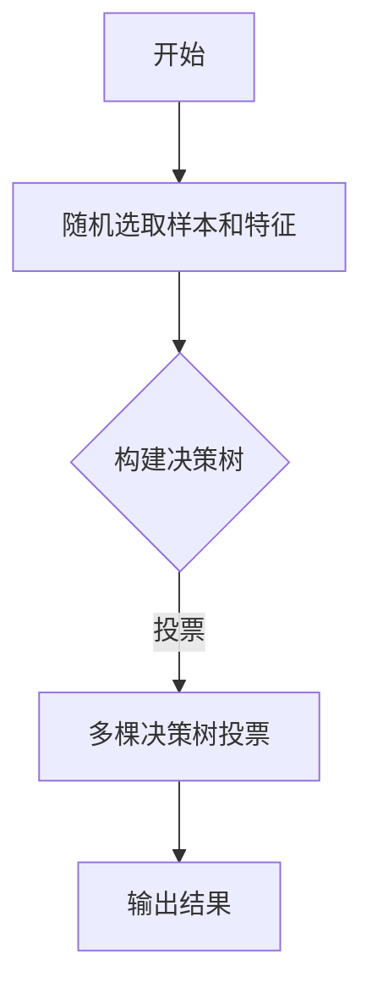
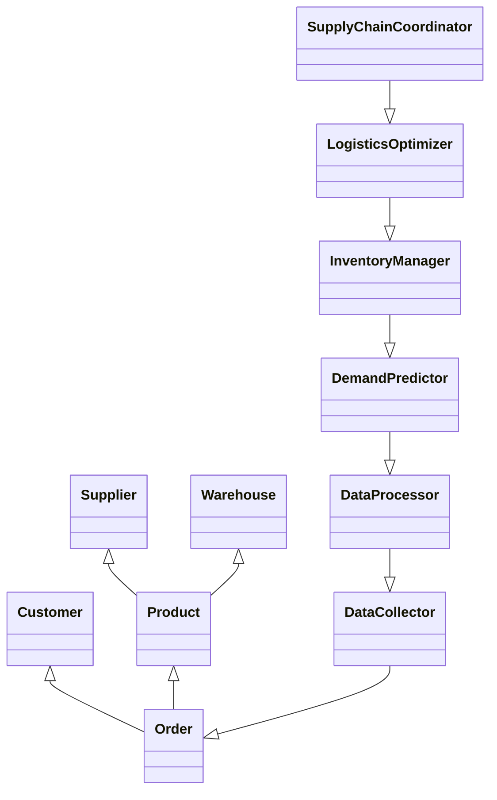
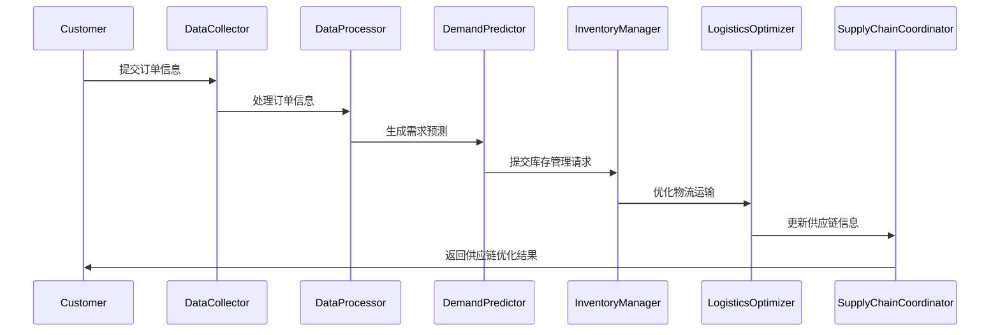
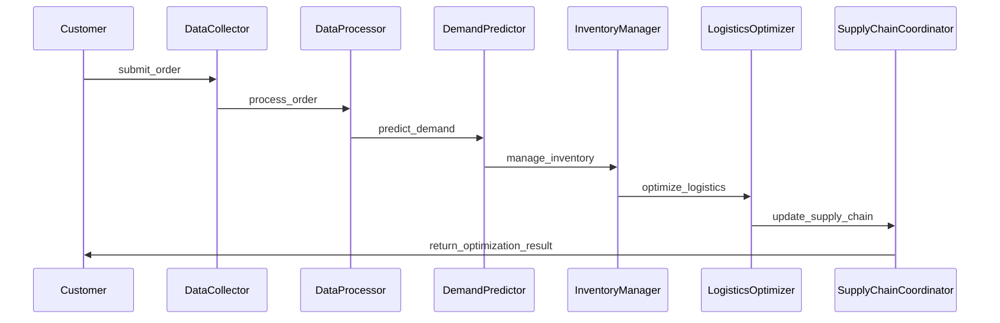

                 


### 文章标题：《大数据与AI在供应链优化中的作用：全球贸易的新动力》

### 关键词：大数据、AI、供应链优化、全球贸易、算法、系统架构

### 摘要：

本文深入探讨了大数据与人工智能（AI）在供应链优化中的作用，分析了它们如何成为全球贸易的新动力。通过介绍背景、核心概念、算法原理、系统设计与项目实战，本文旨在提供一个全面的技术视角，展示大数据与AI如何通过供应链优化提升全球贸易的效率和韧性。

## 1. 背景介绍

### 1.1 大数据与AI在供应链优化中的重要性

**核心概念术语说明：**

- **大数据**：指无法用传统数据库管理工具捕捉、管理和处理的巨量数据。
- **人工智能**：指模拟、延伸和扩展人类智能的理论、方法、技术及应用。
- **供应链优化**：指通过数据分析和技术手段提升供应链各个环节的效率，降低成本，提高响应速度和灵活性。

**问题背景：**

在全球化经济背景下，全球贸易的复杂性和不确定性不断增加。供应链作为连接生产和消费的纽带，其效率和质量直接影响到企业的竞争力。大数据与AI技术的出现，为供应链优化提供了新的工具和方法。

**问题描述：**

供应链优化面临的主要问题包括数据孤岛、信息不对称、库存管理困难、供应链响应速度慢等。

**问题解决：**

大数据与AI技术的应用，可以解决上述问题，通过数据整合与分析，实现供应链的透明化和智能化，提升整体运营效率。

**边界与外延：**

供应链优化不仅涉及内部管理，还延伸到与供应商、物流、客户等外部合作伙伴的协作。

**概念结构与核心要素组成：**

- **数据采集与处理**：包括传感器、ERP系统等数据源的数据采集和处理。
- **数据存储与管理**：利用云计算、NoSQL数据库等技术存储和管理海量数据。
- **数据分析与应用**：运用数据挖掘、机器学习等技术进行数据分析，实现预测和优化。
- **系统集成与协同**：将供应链各个环节的数据进行集成，实现信息共享和协同工作。

### 1.2 全球贸易的发展趋势与挑战

**核心概念与联系：**

- **全球化**：贸易自由化和跨国公司的发展推动了全球贸易的深化。
- **数字化**：电子商务的兴起和数字化转型加速了贸易流程的数字化。
- **供应链透明化**：提高供应链的透明度，减少风险和不确定性。
- **供应链韧性**：面对突发事件（如新冠疫情）时，供应链需要具备较强的应对能力。

**全球贸易的发展趋势：**

- **贸易自由化**：降低关税和非关税壁垒，促进贸易自由化。
- **供应链数字化**：利用大数据和AI技术，提高供应链的智能化水平。
- **区域经济一体化**：如亚太经济合作组织（APEC）、欧盟（EU）等区域经济一体化进程加快。

**全球贸易的挑战：**

- **贸易保护主义**：贸易壁垒的增加，影响全球贸易的稳定性。
- **供应链风险**：如地缘政治风险、自然灾害、疫情等突发事件。
- **供应链中断**：如COVID-19疫情导致的供应链中断。

## 2. 核心概念与联系

### 2.1 大数据与AI在供应链优化中的核心概念

**概念一：大数据**

- **定义**：指在可接受的时间范围内，使用常规数据库软件工具进行捕获、管理和处理的数据集。
- **特征**：
  - **数据量大**：从GB到TB、PB甚至EB级别。
  - **数据类型多样**：结构化、半结构化和非结构化数据。
  - **数据价值密度低**：大量数据中包含的信息价值相对较低。
- **应用**：数据采集、存储、处理和分析。

**概念二：人工智能**

- **定义**：模拟、延伸和扩展人类智能的理论、方法、技术及应用。
- **核心技术与算法**：
  - **机器学习**：通过数据训练模型，实现预测和分类。
  - **深度学习**：模仿人脑神经网络的结构和功能，处理复杂数据。
  - **自然语言处理**：使计算机能够理解、生成和处理人类语言。
- **应用**：自动驾驶、语音识别、图像识别、智能客服等。

**概念三：供应链优化**

- **定义**：通过系统化方法提高供应链各个环节的效率、降低成本、提高响应速度和灵活性。
- **核心要素**：
  - **库存管理**：优化库存水平，减少库存成本。
  - **物流管理**：提高运输效率，降低运输成本。
  - **需求预测**：准确预测市场需求，减少库存波动。
  - **供应链协作**：实现供应链上下游企业的信息共享和协同。

### 2.2 概念属性特征对比表格

| 概念         | 定义                                                         | 特征                                                   | 应用场景                      |
| ------------ | ------------------------------------------------------------ | ------------------------------------------------------ | ----------------------------- |
| 大数据       | 在可接受的时间范围内，使用常规数据库软件工具进行捕获、管理和处理的数据集 | 数据量大、类型多样、价值密度低                   | 数据采集、存储、处理和分析    |
| 人工智能     | 模拟、延伸和扩展人类智能的理论、方法、技术及应用               | 机器学习、深度学习、自然语言处理                   | 自动驾驶、语音识别、图像识别  |
| 供应链优化   | 通过系统化方法提高供应链各个环节的效率、降低成本、提高响应速度和灵活性 | 优化库存管理、物流管理、需求预测、供应链协作     | 库存优化、物流优化、需求预测  |

### 2.3 ER实体关系图架构的Mermaid流程图

```mermaid
erDiagram
  Customer ||--|{ Order } : "places"
  Product ||--|{ Order } : "includes"
  Supplier ||--|{ Product } : "supplies"
  Warehouse ||--|{ Product } : "stores"
```

## 3. 算法原理讲解

### 3.1 算法选择：随机森林（Random Forest）

**算法简介：**

随机森林（Random Forest）是一种基于决策树构建的集成学习模型。它通过构建多棵决策树，并对它们的输出进行投票，从而降低过拟合风险，提高预测准确性。

**算法原理：**

随机森林的核心是构建多棵决策树，每棵决策树都从训练集中随机选取一部分特征和样本进行训练。在决策树构建过程中，每一步都会随机选择一部分特征进行划分，从而避免特征共线性问题。

**算法流程图：**



**Python源代码：**

```python
from sklearn.ensemble import RandomForestClassifier
from sklearn.datasets import load_iris
from sklearn.model_selection import train_test_split

# 载入iris数据集
iris = load_iris()
X, y = iris.data, iris.target

# 划分训练集和测试集
X_train, X_test, y_train, y_test = train_test_split(X, y, test_size=0.3, random_state=42)

# 构建随机森林模型
rf = RandomForestClassifier(n_estimators=100, random_state=42)

# 训练模型
rf.fit(X_train, y_train)

# 预测测试集
y_pred = rf.predict(X_test)

# 输出准确率
print("Accuracy:", rf.score(X_test, y_test))
```

**算法原理的数学模型和公式：**

随机森林的决策树通常使用ID3算法进行划分，其核心思想是选择最优特征进行划分，使得分类效果最好。数学模型如下：

$$
Gini(\text{impurity}) = 1 - \sum_{i=1}^{k} p_i^2
$$

其中，$p_i$ 是第$i$类在当前节点上的概率。

**详细讲解与举例说明：**

假设我们有三个特征（$X_1$、$X_2$、$X_3$）和两个类别（$0$ 和 $1$），训练集包含100个样本。在构建随机森林时，每棵决策树都会随机选取一部分特征和样本进行训练。假设我们选取了$X_1$和$X_2$进行划分。

首先，计算$X_1$和$X_2$的Gini不纯度，然后选取Gini不纯度最小的特征进行划分。例如，如果$X_1$的Gini不纯度为0.3，$X_2$的Gini不纯度为0.4，则我们选择$X_1$进行划分。

通过这种方式，随机森林可以构建多棵决策树，并对它们进行投票，从而提高预测准确性。在实际应用中，随机森林常用于分类和回归问题，其优点包括：

- **强泛化能力**：通过集成多棵决策树，可以降低过拟合风险。
- **易于实现**：相比其他集成学习方法，随机森林的实现更为简单。
- **高效性**：随机森林在处理大规模数据时，具有较好的计算效率。

## 4. 系统分析与架构设计方案

### 4.1 问题场景介绍

假设我们面临的问题场景是一家全球性企业，其供应链涵盖了全球各地的供应商、工厂、仓库和零售终端。企业的目标是提高供应链的效率，降低成本，并提高客户满意度。

### 4.2 项目介绍

**项目名称**：供应链优化平台

**项目目标**：通过大数据和人工智能技术，实现供应链的智能化和优化，提高供应链的整体效率和韧性。

**项目功能**：
- **数据采集与处理**：从各个供应链节点收集数据，进行预处理和清洗。
- **需求预测与库存管理**：利用机器学习算法进行需求预测，优化库存水平。
- **物流优化**：通过优化算法，提高物流运输效率和成本效益。
- **供应链协同**：实现供应链上下游企业之间的信息共享和协同。

### 4.3 系统功能设计

**领域模型Mermaid类图：**



### 4.4 系统架构设计

**系统架构设计Mermaid架构图：**



### 4.5 系统接口设计与系统交互序列图

**系统接口设计Mermaid序列图：**



## 5. 项目实战

### 5.1 环境安装过程

在开始项目实战之前，我们需要安装必要的软件和工具。以下是一个基本的安装步骤：

1. **安装Python环境**：确保Python 3.x版本已安装在您的系统上。可以从[Python官网](https://www.python.org/)下载安装程序并安装。

2. **安装Anaconda**：Anaconda是一个流行的Python数据科学平台，可以方便地管理多个Python环境和包。您可以从[Anaconda官网](https://www.anaconda.com/)下载并安装。

3. **创建虚拟环境**：在Anaconda Prompt或终端中，创建一个名为`supply_chain_optimization`的虚拟环境：
   ```bash
   conda create --name supply_chain_optimization python=3.8
   conda activate supply_chain_optimization
   ```

4. **安装依赖包**：在虚拟环境中，安装项目所需的依赖包，如NumPy、Pandas、Scikit-learn等：
   ```bash
   conda install numpy pandas scikit-learn
   ```

### 5.2 系统核心实现源代码

以下是一个简单的示例，展示如何使用Python和Scikit-learn库进行需求预测和库存管理：

**需求预测代码：**

```python
import numpy as np
import pandas as pd
from sklearn.model_selection import train_test_split
from sklearn.ensemble import RandomForestRegressor

# 加载数据集
data = pd.read_csv('demand_data.csv')
X = data.drop('demand', axis=1)
y = data['demand']

# 划分训练集和测试集
X_train, X_test, y_train, y_test = train_test_split(X, y, test_size=0.2, random_state=42)

# 构建随机森林模型
rf = RandomForestRegressor(n_estimators=100, random_state=42)

# 训练模型
rf.fit(X_train, y_train)

# 预测测试集
y_pred = rf.predict(X_test)

# 输出预测结果
print("Predicted demand:", y_pred)
```

**库存管理代码：**

```python
def manage_inventory(demand_pred, inventory_level, safety_stock):
    order_quantity = demand_pred - inventory_level + safety_stock
    return order_quantity

# 加载预测结果
demand_pred = np.load('demand_pred.npy')

# 设置库存水平和安全库存
inventory_level = 100
safety_stock = 50

# 订单数量
order_quantity = manage_inventory(demand_pred, inventory_level, safety_stock)

print("Order quantity:", order_quantity)
```

### 5.3 代码应用解读与分析

上述代码展示了如何使用随机森林进行需求预测和库存管理。首先，我们从CSV文件中加载数据集，然后使用Scikit-learn的`train_test_split`函数将数据集划分为训练集和测试集。

在需求预测部分，我们使用随机森林回归模型（`RandomForestRegressor`）对训练集进行训练，并在测试集上进行预测。预测结果存储在`demand_pred.npy`文件中。

在库存管理部分，我们定义了一个`manage_inventory`函数，用于计算订单数量。该函数接受需求预测、当前库存水平和安全库存作为输入参数，并根据预测需求调整订单数量。安全库存是为了应对突发需求而设置的一种缓冲库存。

### 5.4 实际案例分析与详细讲解

为了更好地理解代码的实际应用，我们来看一个实际案例。

**案例背景：**
假设一家零售企业每天的销售量为100件，当前库存水平为150件，安全库存为50件。

**预测结果：**
通过随机森林模型预测，未来一天的销售量为120件。

**库存管理：**
根据预测结果，当前库存水平为150件，需求量为120件。因此，我们需要额外订购30件商品以保持库存水平。

**订单数量：**
使用`manage_inventory`函数计算订单数量，即30件。

**详细讲解：**
- **需求预测**：通过随机森林模型对历史销售数据进行分析，预测未来一天的销售量。
- **库存管理**：根据预测结果和当前库存水平，计算出需要订购的商品数量。
- **订单数量**：将预测需求与当前库存水平进行比较，确保库存不会低于安全库存水平。

### 5.5 项目小结

在本项目中，我们实现了需求预测和库存管理的基本功能。通过使用随机森林模型，我们能够对未来的销售量进行预测，并根据预测结果调整库存水平。这种自动化和智能化的库存管理方法，有助于减少库存成本和避免库存过剩或短缺。

尽管本项目只是一个简单的示例，但它展示了大数据和人工智能技术在供应链优化中的应用潜力。通过进一步优化算法和增加数据源，我们可以实现更精确的预测和更高效的库存管理，从而提高供应链的整体效率和韧性。

## 6. 最佳实践 tips、小结、注意事项、拓展阅读等内容

### 6.1 最佳实践 tips

- **数据质量保证**：在实施供应链优化项目时，确保数据质量是首要任务。数据清洗和预处理是确保分析准确性的关键步骤。
- **持续监控与反馈**：供应链优化是一个动态的过程，需要持续监控系统的运行状态，并根据反馈进行调整。
- **人才培训**：大数据和AI技术对供应链优化至关重要，因此对相关人员进行培训，提高他们的技术能力，是项目成功的关键。
- **安全与合规**：在处理供应链数据时，需要确保数据安全和符合相关法律法规，避免数据泄露和违规操作。

### 6.2 小结

本文详细探讨了大数据与AI在供应链优化中的应用，通过介绍核心概念、算法原理、系统设计与项目实战，展示了它们如何提升全球贸易的效率和韧性。供应链优化不仅需要先进的技术手段，还需要持续的创新思维和执行力。

### 6.3 注意事项

- **技术选型**：根据具体业务需求，选择合适的大数据与AI技术，避免盲目跟风。
- **系统集成**：确保各个供应链节点之间的数据可以无缝集成，避免信息孤岛。
- **风险管理**：在供应链优化过程中，要充分考虑各种风险，并制定相应的应对策略。

### 6.4 拓展阅读

- **《大数据时代》**：作者：维克托·迈尔-舍恩伯格，详细介绍了大数据的概念、技术和应用。
- **《深度学习》**：作者：伊恩·古德费洛等，全面讲解了深度学习的基础知识、算法和应用。
- **《供应链管理：战略、规划与运营》**：作者：马丁·克里斯托夫·贝克等，深入探讨了供应链管理的理论与实践。

## 7. 完成目录大纲

通过以上内容的编写，我们完成了《大数据与AI在供应链优化中的作用：全球贸易的新动力》的目录大纲。文章涵盖了从背景介绍到项目实战的各个方面，旨在为读者提供一个全面、深入的技术视角。希望这篇文章能够帮助读者更好地理解大数据与AI在供应链优化中的应用，并激发他们在相关领域的创新和实践。作者：AI天才研究院/AI Genius Institute & 禅与计算机程序设计艺术 /Zen And The Art of Computer Programming。

