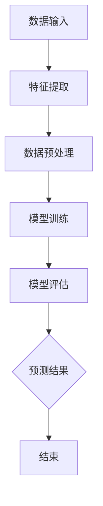
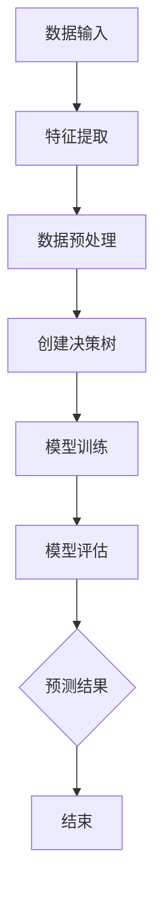
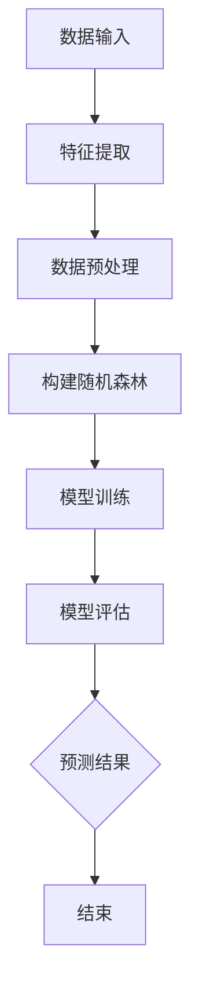
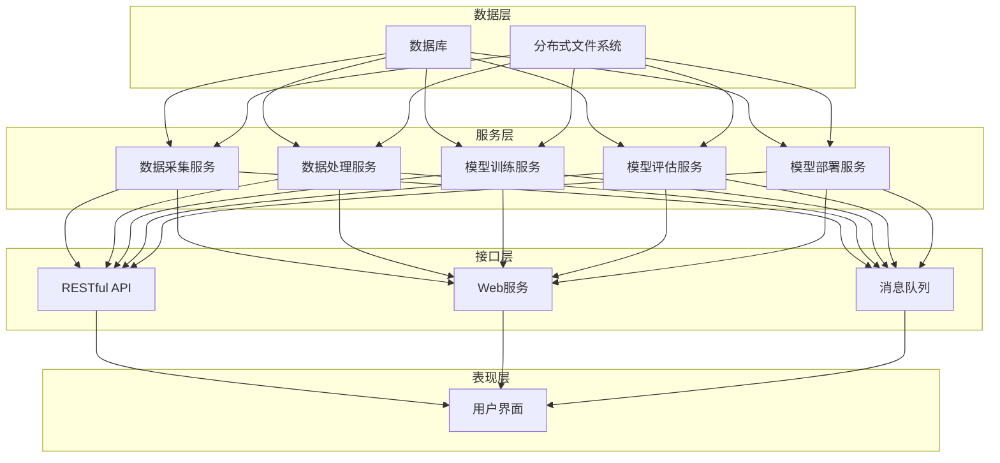
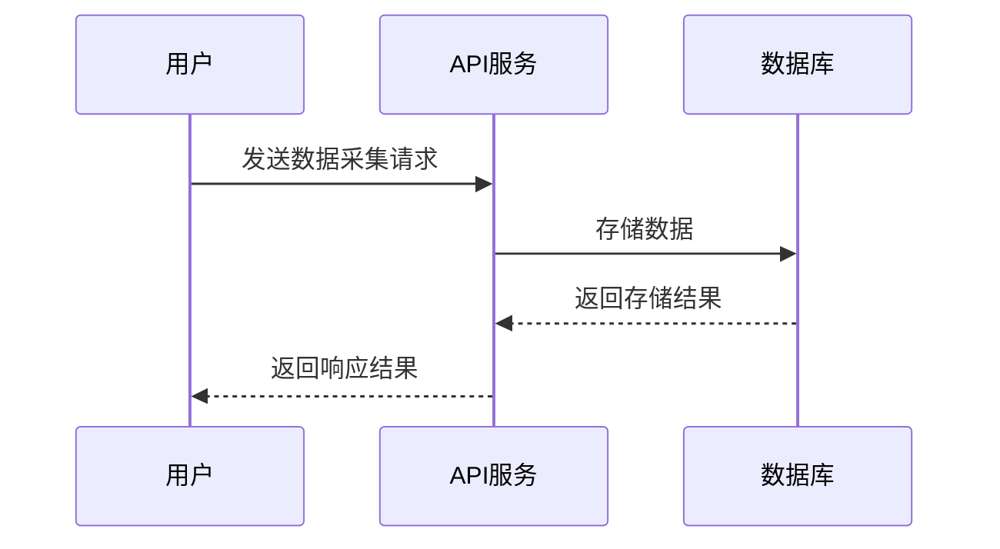

                 


### 大数据与AI的良性循环：数据驱动模型进化

> 关键词：大数据，人工智能，数据驱动模型，良性循环，模型进化

> 摘要：本文将深入探讨大数据与人工智能之间的良性循环，尤其是数据驱动模型如何实现持续进化。我们将逐步分析这一循环的机制，并探讨如何通过不断优化模型来提高预测准确性。

## 目录大纲

----------------------------------------------------------------

# 第一部分：引言与背景

## 第1章：大数据与AI的良性循环概述

### 1.1 问题背景与定义

### 1.2 大数据与AI的关系

### 1.3 良性循环的意义与挑战

## 第2章：大数据技术基础

### 2.1 数据采集与存储

#### 2.1.1 数据采集方法

#### 2.1.2 数据存储技术

### 2.2 数据处理与清洗

#### 2.2.1 数据预处理

#### 2.2.2 数据清洗策略

## 第3章：人工智能基础

### 3.1 AI概述

#### 3.1.1 AI的发展历程

#### 3.1.2 AI的核心技术

### 3.2 机器学习与深度学习

#### 3.2.1 机器学习基础

#### 3.2.2 深度学习架构

## 第4章：数据驱动模型进化原理

### 4.1 数据驱动模型的定义与特点

### 4.2 模型进化的概念

### 4.3 模型进化的驱动因素

## 第5章：算法原理讲解

### 5.1 算法概述

### 5.2 算法mermaid流程图

### 5.3 算法原理详细讲解

#### 5.3.1 数学模型和公式

#### 5.3.2 举例说明

## 第6章：数学模型与公式解析

### 6.1 数学模型基础

### 6.2 常用数学公式

#### 6.2.1 概率论公式

#### 6.2.2 统计学公式

## 第7章：系统分析与架构设计

### 7.1 项目场景介绍

### 7.2 系统功能设计

#### 7.2.1 领域模型类图

### 7.3 系统架构设计

#### 7.3.1 系统架构mermaid图

### 7.4 系统接口设计与交互

## 第8章：项目实战

### 8.1 环境安装与配置

### 8.2 系统核心实现

#### 8.2.1 源代码解读

### 8.3 实际案例分析

### 8.4 项目小结

## 第9章：最佳实践与拓展

### 9.1 最佳实践技巧

### 9.2 注意事项

### 9.3 拓展阅读

## 第10章：总结与展望

### 10.1 总结

### 10.2 展望

----------------------------------------------------------------

### 第一部分：引言与背景

#### 第1章：大数据与AI的良性循环概述

随着技术的不断进步，大数据和人工智能（AI）已经成为现代科技领域的两大基石。大数据提供了丰富的信息资源，而人工智能则能够从这些数据中挖掘出有用的知识和模式。大数据与AI的结合，形成了一种良性循环，这种循环不仅提高了AI模型的性能，也为大数据的深入分析提供了新的途径。

#### 1.1 问题背景与定义

首先，我们来明确一下什么是大数据。大数据通常指的是数据量巨大、数据类型多样、数据速度快速的数据集合。这些数据可能来源于互联网、传感器、社交网络等多种渠道。而人工智能，则是一种模拟人类智能行为的计算机技术，它能够通过学习和推理来解决复杂问题。

那么，什么是大数据与AI的良性循环呢？简单来说，这个循环包含以下几个环节：

1. **数据采集与存储**：通过多种方式收集数据，并将这些数据存储在高效、安全的数据存储系统中。
2. **数据处理与清洗**：对原始数据进行清洗、转换和预处理，以便于后续的分析和使用。
3. **模型训练与优化**：利用清洗后的数据，通过机器学习或深度学习算法训练AI模型。
4. **模型部署与反馈**：将训练好的模型部署到实际应用场景中，收集模型表现反馈，并用于模型迭代和优化。

#### 1.2 大数据与AI的关系

大数据与AI的关系可以说是相辅相成的。大数据为AI提供了丰富的训练数据，而AI则能够从这些数据中提取出有价值的信息。具体来说，大数据为AI带来了以下几个方面的改进：

1. **提高模型性能**：通过提供更多的训练数据，AI模型可以更好地拟合数据分布，从而提高预测准确性。
2. **增强模型泛化能力**：大数据可以帮助模型学习到更广泛的知识，从而提高模型的泛化能力，使其能够在不同的数据集和应用场景中表现良好。
3. **降低成本**：大数据技术使得大规模数据存储和计算变得更加经济高效，从而降低了AI模型的训练成本。

#### 1.3 良性循环的意义与挑战

大数据与AI的良性循环具有重要的意义。首先，它能够推动科技创新和产业发展。通过不断优化的AI模型，我们可以更好地解决实际问题，如医疗诊断、金融风控、交通管理等领域。其次，良性循环能够促进数据资源的充分利用，提高数据的价值。

然而，实现大数据与AI的良性循环也面临着一些挑战：

1. **数据质量和隐私**：大数据的质量直接影响AI模型的性能。同时，数据隐私也是一个亟待解决的问题。
2. **计算资源和时间**：训练大规模AI模型需要大量的计算资源和时间，如何优化资源利用和加快训练速度是一个重要课题。
3. **模型可解释性**：随着模型复杂度的增加，其可解释性也在降低。如何确保模型的可解释性，使其能够被用户理解和信任，也是一个重要挑战。

综上所述，大数据与AI的良性循环是现代科技发展中不可或缺的一环。通过不断优化数据采集、处理、模型训练和部署等环节，我们可以实现AI模型的持续进化，从而推动科技的进步和社会的发展。

### 第二部分：大数据技术基础

#### 第2章：大数据技术基础

大数据技术的核心在于如何高效地处理海量数据，并将这些数据转化为有价值的信息。为了实现这一目标，我们需要掌握以下几个关键环节：数据采集、数据存储、数据处理与清洗。

#### 2.1 数据采集与存储

数据采集是大数据技术的第一步。数据的来源多种多样，包括互联网日志、社交媒体数据、传感器数据、数据库记录等。为了确保数据的质量和完整性，我们需要采用多种数据采集方法，如API调用、网络爬虫、实时流处理等。

数据存储是大数据技术的另一个关键环节。随着数据量的不断增加，传统的单机存储系统已经无法满足需求。分布式存储系统，如Hadoop HDFS、Apache Cassandra等，可以提供高吞吐量、高可靠性和扩展性。这些系统通常采用分片存储技术，将数据分散存储在多个节点上，从而提高存储效率和处理能力。

#### 2.1.1 数据采集方法

1. **API调用**：通过应用程序接口（API）从外部系统或服务中获取数据。这种方法适用于结构化数据，如API日志、天气数据等。
2. **网络爬虫**：使用爬虫程序从互联网上爬取数据。这种方法适用于非结构化或半结构化数据，如网页内容、社交媒体数据等。
3. **实时流处理**：使用实时流处理技术，如Apache Kafka、Apache Flink等，从实时数据源中获取并处理数据。这种方法适用于实时性要求较高的场景，如金融交易、物联网数据等。

#### 2.1.2 数据存储技术

1. **关系数据库**：关系数据库，如MySQL、PostgreSQL等，适用于存储结构化数据。它们具有高查询性能和成熟的事务管理机制。
2. **NoSQL数据库**：NoSQL数据库，如MongoDB、Cassandra等，适用于存储非结构化或半结构化数据。它们具有高扩展性和灵活性。
3. **分布式文件系统**：分布式文件系统，如Hadoop HDFS、Google File System（GFS）等，适用于存储海量数据。它们具有高可靠性和容错能力。

#### 2.2 数据处理与清洗

数据处理与清洗是大数据技术中的关键环节。清洗后的数据质量直接影响后续分析的准确性和可靠性。以下是一些常用的数据处理与清洗方法：

1. **数据预处理**：将原始数据进行清洗、转换和归一化，以便于后续分析。例如，去除空值、处理缺失值、转换数据类型等。
2. **数据清洗策略**：根据数据特点和业务需求，制定相应的数据清洗策略。例如，对于不一致的数据，可以采用填充、替换或丢弃等方法进行处理。
3. **数据质量评估**：评估数据的完整性、准确性、一致性和及时性，确保数据质量满足分析需求。

#### 2.2.1 数据预处理

1. **去除空值**：使用统计方法或机器学习方法填充或删除空值。
2. **处理缺失值**：根据缺失值的分布特点，采用均值、中位数、最大值、最小值等方法进行填充。
3. **转换数据类型**：将不同数据类型（如字符串、浮点数、整数）转换为统一的格式，以便于后续处理和分析。

#### 2.2.2 数据清洗策略

1. **一致性检查**：检查数据中的重复记录、数据格式错误等问题，确保数据的一致性。
2. **异常值处理**：检测并处理数据中的异常值，如离群点、不合理的数据等。
3. **规范化**：将数据规范到一定的范围内，如归一化、标准化等，以便于后续分析。

通过以上方法，我们可以有效地处理和清洗大数据，为后续的AI模型训练和优化提供高质量的数据支持。

### 第三部分：人工智能基础

#### 第3章：人工智能基础

人工智能（AI）是计算机科学的一个重要分支，它旨在使计算机模拟人类智能行为。AI的应用范围广泛，包括自然语言处理、图像识别、推荐系统、自动驾驶等。在本章中，我们将介绍AI的基本概念、发展历程和核心技术。

#### 3.1 AI概述

1. **定义**：人工智能是指通过计算机程序模拟人类智能行为的技术。它包括知识表示、问题解决、学习、感知、认知等各个方面。
2. **分类**：根据应用领域和目标，人工智能可以分为以下几类：
   - **弱人工智能**：专注于特定任务，如语音识别、图像识别等。
   - **强人工智能**：具备与人类相似的综合智能，能够处理多种任务，具有自我意识和情感。
   - **混合人工智能**：结合弱人工智能和强人工智能的特点，能够灵活应对多种复杂任务。

#### 3.1.1 AI的发展历程

人工智能的概念可以追溯到20世纪50年代。以下是AI发展历程中的重要事件：

1. **1956年**：达特茅斯会议，人工智能正式成为一门独立的科学领域。
2. **1960-1970年代**：早期AI研究主要集中在知识表示和推理算法上，如专家系统。
3. **1980-1990年代**：机器学习和神经网络技术逐渐成熟，AI应用范围扩大。
4. **2000年代**：深度学习技术取得突破，AI在图像识别、语音识别等领域取得了显著成果。
5. **2010年代**：AI技术开始广泛应用于自动驾驶、医疗诊断、金融风控等领域，取得了巨大的商业价值。

#### 3.1.2 AI的核心技术

人工智能的核心技术包括以下几个方面：

1. **知识表示**：将人类知识转化为计算机可以理解和处理的形式。常用的知识表示方法包括语义网络、本体论、规则系统等。
2. **问题解决**：通过搜索、规划、推理等方法，解决复杂问题。问题解决算法包括贪婪算法、A*算法、回溯算法等。
3. **机器学习**：通过训练模型，使计算机自动从数据中学习规律。机器学习分为监督学习、无监督学习和强化学习等类型。
4. **深度学习**：一种基于神经网络的机器学习方法，通过多层神经网络对数据进行建模。深度学习在图像识别、语音识别等领域取得了显著成果。
5. **自然语言处理**：使计算机理解和处理自然语言。自然语言处理技术包括分词、词性标注、句法分析、语义理解等。

#### 3.2 机器学习与深度学习

机器学习和深度学习是人工智能的重要组成部分。下面我们简要介绍这两种技术。

1. **机器学习**：
   - **定义**：机器学习是指通过算法从数据中自动学习和发现规律的方法。
   - **类型**：监督学习、无监督学习、半监督学习和强化学习。
   - **算法**：线性回归、决策树、随机森林、支持向量机、神经网络等。

2. **深度学习**：
   - **定义**：深度学习是一种基于多层神经网络的机器学习方法，通过反向传播算法进行训练。
   - **架构**：卷积神经网络（CNN）、循环神经网络（RNN）、长短期记忆网络（LSTM）等。
   - **应用**：图像识别、语音识别、自然语言处理、推荐系统等。

通过了解AI的基本概念、发展历程和核心技术，我们可以更好地理解和应用人工智能技术，为实际问题提供有效的解决方案。

### 第四部分：数据驱动模型进化原理

#### 第4章：数据驱动模型进化原理

在人工智能领域，数据驱动模型进化是一个重要的研究方向。数据驱动模型通过不断学习和调整，能够在不同的数据集和应用场景中持续改进其性能。本章将深入探讨数据驱动模型进化的定义、概念和驱动因素。

#### 4.1 数据驱动模型的定义与特点

数据驱动模型是指通过数据来驱动模型学习和优化的一种方法。与传统的规则驱动模型相比，数据驱动模型具有以下特点：

1. **自动学习**：数据驱动模型能够自动从数据中学习规律和模式，无需人工干预。
2. **适应性**：数据驱动模型可以根据不同的数据集和应用场景进行自适应调整，提高模型性能。
3. **灵活性**：数据驱动模型能够处理多种类型的数据，包括结构化数据、非结构化数据和半结构化数据。

#### 4.2 模型进化的概念

模型进化是指通过不断调整和优化模型，使其在新的数据集和应用场景中能够更好地适应和表现。模型进化可以分为以下几个阶段：

1. **初始阶段**：模型基于已有的数据和规则进行初始化，通常表现为较低的准确性和泛化能力。
2. **学习阶段**：模型通过不断学习新的数据，逐渐调整其参数和结构，提高模型的性能和适应性。
3. **优化阶段**：模型在新的数据集和应用场景中持续优化，以实现更高的准确性和泛化能力。
4. **稳定阶段**：模型在优化过程中达到一个相对稳定的状态，能够在各种场景中保持良好的性能。

#### 4.3 模型进化的驱动因素

模型进化的驱动因素包括以下几个方面：

1. **数据质量**：高质量的数据是模型进化的基础。数据的质量直接影响模型的性能。因此，对数据的清洗、预处理和筛选是模型进化的重要环节。
2. **算法选择**：合适的算法能够更好地适应数据特点和应用场景，从而推动模型的进化。不同类型的算法在处理不同类型的数据时具有不同的优势和局限性。
3. **计算资源**：模型进化需要大量的计算资源，包括CPU、GPU和存储等。随着计算资源的不断升级和优化，模型的进化速度和质量也得到了显著提升。
4. **模型架构**：模型架构的设计对模型进化具有重要影响。合理的模型架构能够更好地处理数据、提取特征和优化性能，从而推动模型的进化。
5. **用户反馈**：用户反馈是模型进化的重要参考。通过收集用户使用数据和反馈，模型可以不断调整和优化，以更好地满足用户需求。

通过深入理解数据驱动模型进化的概念和驱动因素，我们可以更好地设计和优化AI模型，实现持续的性能提升和应用拓展。

### 第五部分：算法原理讲解

#### 第5章：算法原理讲解

在本章中，我们将详细讲解数据驱动模型中的几个核心算法原理。这些算法包括线性回归、决策树和随机森林等。通过理解这些算法的原理，我们将能够更好地设计和优化模型。

#### 5.1 算法概述

算法是数据驱动模型的核心组成部分，它们负责从数据中提取信息、建立模型并进行预测。常见的算法包括线性回归、决策树、支持向量机和神经网络等。在本章中，我们将重点关注线性回归、决策树和随机森林。

#### 5.2 算法mermaid流程图

为了更好地理解这些算法，我们可以使用mermaid流程图来描述它们的基本工作流程。

#### 线性回归



#### 决策树



#### 随机森林



#### 5.3 算法原理详细讲解

##### 5.3.1 线性回归

线性回归是一种用于分析两个或多个变量之间线性关系的统计方法。其基本模型可以表示为：

$$ y = w_0 + w_1 \cdot x $$

其中，$y$ 是因变量，$x$ 是自变量，$w_0$ 和 $w_1$ 是模型的参数。线性回归的目标是最小化预测值与实际值之间的误差，即最小二乘法。

$$ \min \sum_{i=1}^{n} (y_i - \hat{y}_i)^2 $$

其中，$n$ 是数据点的数量，$\hat{y}_i$ 是预测值。

##### 5.3.2 决策树

决策树是一种基于树形结构进行决策的算法。它通过一系列的条件测试来将数据集分割为多个子集，每个子集对应一个决策节点。决策树的基本构建过程如下：

1. 选择一个特征作为分割依据。
2. 计算每个特征的不同取值下的信息增益或基尼不纯度。
3. 选择具有最高信息增益或最低基尼不纯度的特征作为分割依据。
4. 对数据进行分割，并递归地重复上述过程，直到满足终止条件（如最大深度、最小叶子节点大小等）。

决策树的核心是节点分割策略，常用的策略包括信息增益、基尼不纯度、增益率等。

##### 5.3.3 随机森林

随机森林是一种基于决策树的集成学习方法。它通过构建多个决策树，并对这些树的预测结果进行投票或求平均来提高模型的性能。随机森林的基本构建过程如下：

1. 随机选择特征集合。
2. 随机选择特征集合中的 m 个特征，并使用这些特征对数据进行分割。
3. 构建决策树，并记录树的准确率。
4. 重复上述过程 k 次来构建 k 个决策树。
5. 对 k 个决策树的预测结果进行投票或求平均。

随机森林通过集成多个决策树，提高了模型的泛化能力和鲁棒性。

#### 5.3.4 举例说明

为了更好地理解这些算法，我们可以通过一个简单的例子来进行说明。

假设我们有一个包含年龄和收入的数据集，我们希望预测一个人的年收入。以下是使用线性回归、决策树和随机森林算法的示例：

```python
import numpy as np
import pandas as pd
from sklearn.linear_model import LinearRegression
from sklearn.tree import DecisionTreeRegressor
from sklearn.ensemble import RandomForestRegressor

# 数据准备
data = pd.DataFrame({
    'age': [25, 30, 35, 40, 45],
    'income': [50000, 60000, 70000, 80000, 90000]
})

# 线性回归
X = data[['age']]
y = data['income']
model_lr = LinearRegression()
model_lr.fit(X, y)
print(model_lr.predict([[30]]))

# 决策树
model_dt = DecisionTreeRegressor()
model_dt.fit(X, y)
print(model_dt.predict([[30]]))

# 随机森林
model_rf = RandomForestRegressor()
model_rf.fit(X, y)
print(model_rf.predict([[30]]))
```

通过这个简单的例子，我们可以看到不同算法如何从数据中提取信息并进行预测。线性回归基于线性模型进行预测，决策树通过特征分割来构建决策路径，而随机森林则通过集成多个决策树来提高预测性能。

### 第六部分：数学模型与公式解析

#### 第6章：数学模型与公式解析

在数据驱动模型中，数学模型和公式起着核心作用。它们不仅帮助我们理解和分析数据，还为模型训练和优化提供了理论基础。本章将详细介绍一些常用的数学模型和公式，包括概率论、统计学、线性代数和优化理论等。

#### 6.1 数学模型基础

数学模型是使用数学语言描述现实世界问题的抽象模型。在数据驱动模型中，常见的数学模型包括线性模型、概率模型、决策模型等。以下是一些基本的数学模型：

1. **线性模型**：线性模型是最常见的数学模型之一，用于描述变量之间的线性关系。线性回归模型是一个典型的线性模型，其公式为：

   $$ y = w_0 + w_1 \cdot x $$

   其中，$y$ 是因变量，$x$ 是自变量，$w_0$ 和 $w_1$ 是模型的参数。

2. **概率模型**：概率模型用于描述随机事件的发生概率。在机器学习中，概率模型广泛应用于概率图模型、贝叶斯网络等。一个简单的概率模型是伯努利分布，其公式为：

   $$ P(x=1) = p, \quad P(x=0) = 1-p $$

   其中，$x$ 是随机变量，$p$ 是事件发生的概率。

3. **决策模型**：决策模型用于在不确定的环境中做出最优决策。常见的决策模型包括期望最大化（EM）算法、动态规划等。动态规划的一个基本公式为：

   $$ V_k = \max_{a_k} \left[ R_k(a_k) + \gamma V_{k+1} \right] $$

   其中，$V_k$ 是状态值函数，$a_k$ 是动作，$R_k(a_k)$ 是奖励函数，$\gamma$ 是折扣因子。

#### 6.2 常用数学公式

在本节中，我们将介绍一些常用的数学公式，包括概率论、统计学和线性代数等方面的公式。

1. **概率论公式**

   - **条件概率**：$P(A|B) = \frac{P(A \cap B)}{P(B)}$

   - **贝叶斯定理**：$P(A|B) = \frac{P(B|A) \cdot P(A)}{P(B)}$

   - **全概率公式**：$P(A) = \sum_{i=1}^{n} P(A|B_i) \cdot P(B_i)$

2. **统计学公式**

   - **均值**：$\mu = \frac{1}{n} \sum_{i=1}^{n} x_i$

   - **方差**：$\sigma^2 = \frac{1}{n} \sum_{i=1}^{n} (x_i - \mu)^2$

   - **标准差**：$\sigma = \sqrt{\sigma^2}$

   - **协方差**：$Cov(X, Y) = \frac{1}{n} \sum_{i=1}^{n} (x_i - \mu_x) (y_i - \mu_y)$

3. **线性代数公式**

   - **矩阵乘法**：$C = A \cdot B$

   - **矩阵求逆**：$A^{-1} = \frac{1}{\det(A)} \cdot \text{adj}(A)$

   - **行列式**：$\det(A) = \sum_{\sigma \in S_n} \text{sgn}(\sigma) a_{1\sigma(1)} a_{2\sigma(2)} \cdots a_{n\sigma(n)}$

   - **特征值和特征向量**：$Av = \lambda v$

#### 6.2.1 概率论公式

概率论是数据分析和机器学习的重要基础。以下是一些常用的概率论公式：

- **伯努利试验**：$P(x=k) = C(n, k) \cdot p^k \cdot (1-p)^{n-k}$，其中$n$是试验次数，$k$是成功次数，$p$是每次试验成功的概率。

- **二项分布**：$P(X=k) = C(n, k) \cdot p^k \cdot (1-p)^{n-k}$，其中$n$是试验次数，$k$是成功的次数，$p$是每次试验成功的概率。

- **泊松分布**：$P(X=k) = \frac{\lambda^k \cdot e^{-\lambda}}{k!}$，其中$\lambda$是事件发生的平均次数，$k$是实际发生的次数。

- **正态分布**：$P(Z \leq z) = \Phi(z)$，其中$Z$是标准正态分布，$\Phi(z)$是标准正态分布的累积分布函数。

#### 6.2.2 统计学公式

统计学用于分析和解释数据，以下是一些常用的统计学公式：

- **标准误差**：$SE = \frac{\sigma}{\sqrt{n}}$，其中$\sigma$是总体标准差，$n$是样本大小。

- **t检验**：$t = \frac{\bar{x} - \mu}{SE}$，其中$\bar{x}$是样本均值，$\mu$是总体均值，$SE$是标准误差。

- **F检验**：$F = \frac{MS_{between}}{MS_{within}}$，其中$MS_{between}$是组间均方差，$MS_{within}$是组内均方差。

- **相关系数**：$r = \frac{\sum_{i=1}^{n} (x_i - \bar{x})(y_i - \bar{y})}{\sqrt{\sum_{i=1}^{n} (x_i - \bar{x})^2 \sum_{i=1}^{n} (y_i - \bar{y})^2}}$，其中$x_i$和$y_i$是样本数据，$\bar{x}$和$\bar{y}$是样本均值。

通过理解和应用这些数学模型和公式，我们可以更深入地分析和理解数据，为模型训练和优化提供坚实的理论基础。

### 第七部分：系统分析与架构设计

#### 第7章：系统分析与架构设计

在进行大数据与AI项目的开发和实施过程中，系统分析与架构设计是一个至关重要的环节。一个良好的系统架构能够确保项目的高效性、可靠性和可扩展性。在本章中，我们将详细介绍系统分析与架构设计的过程，包括项目场景介绍、系统功能设计、系统架构设计和系统接口设计。

#### 7.1 项目场景介绍

为了更好地理解系统分析与架构设计，我们需要首先明确项目场景。以下是一个典型的案例：

**项目名称**：智能医疗诊断系统

**项目目标**：利用大数据和AI技术，开发一个能够自动诊断疾病的智能医疗系统，以提高医疗诊断的准确性和效率。

**项目需求**：
- 数据采集：从医院、实验室等渠道收集患者数据，包括病史、检查报告、医学影像等。
- 数据处理：对原始数据进行清洗、转换和预处理，以便于后续分析和建模。
- 模型训练：使用机器学习算法训练诊断模型，以提高诊断的准确性和鲁棒性。
- 模型部署：将训练好的模型部署到生产环境中，提供实时诊断服务。
- 用户界面：提供一个直观、易用的用户界面，供医生和患者使用。

#### 7.2 系统功能设计

系统功能设计是系统分析与架构设计的重要部分。在本节中，我们将介绍智能医疗诊断系统的核心功能模块。

1. **数据采集模块**：负责从各种数据源收集数据，包括医院信息系统（HIS）、实验室信息系统（LIS）、医学影像管理系统（PACS）等。

2. **数据处理模块**：负责对原始数据进行清洗、转换和预处理，以确保数据的质量和一致性。

3. **模型训练模块**：使用机器学习算法对处理后的数据集进行训练，包括特征提取、模型选择、参数优化等。

4. **模型评估模块**：对训练好的模型进行评估，包括准确率、召回率、F1分数等指标。

5. **模型部署模块**：将训练好的模型部署到生产环境中，提供实时诊断服务。

6. **用户界面模块**：提供一个直观、易用的用户界面，供医生和患者使用，包括诊断结果展示、历史记录查询等功能。

#### 7.2.1 领域模型类图

为了更好地理解系统功能设计，我们可以使用Mermaid绘制领域模型类图。以下是一个简单的领域模型类图的示例：

```mermaid
classDiagram
    Class01 <|-- SubClass01
    Class01 o-- Object01
    Class02 <<interface>>
    Class03 <.. Class04
    Class05 ..|> Class06
    Class07 <|.. Class08
    Class09 --|> Class10
    Class11 o--| Class12 :关联关系
    Class13 n--| Class14 :聚合关系
    Class15 o--|* Class16 :组合关系
```

在实际的领域模型类图中，我们将包括更多具体的类和关系，如数据采集类、数据处理类、模型训练类等。

#### 7.3 系统架构设计

系统架构设计是确保项目成功的关键。在本节中，我们将介绍智能医疗诊断系统的系统架构设计。

1. **数据层**：负责数据的存储和管理，包括关系数据库、NoSQL数据库和分布式文件系统等。

2. **服务层**：负责业务逻辑的实现，包括数据采集、数据处理、模型训练、模型评估和模型部署等。

3. **接口层**：负责与外部系统交互，包括RESTful API、Web服务、消息队列等。

4. **表现层**：负责用户界面的展示，包括Web界面、移动应用等。

以下是一个简单的系统架构图示例：



在实际的系统架构设计中，我们将包括更多的细节，如具体的技术选型、性能优化策略、安全性设计等。

#### 7.4 系统接口设计与交互

系统接口设计是确保系统各模块之间能够高效、稳定地交互的关键。在本节中，我们将介绍智能医疗诊断系统的系统接口设计和交互机制。

1. **API设计**：设计RESTful API，包括数据采集、数据处理、模型训练、模型评估和模型部署等接口。每个接口都将返回相应的数据结构和错误码，确保接口的清晰和易用。

2. **消息队列**：使用消息队列（如Kafka、RabbitMQ）来实现异步通信，确保系统的高性能和高可靠性。

3. **服务注册与发现**：使用服务注册与发现机制（如Eureka、Consul），确保服务之间的动态发现和负载均衡。

4. **接口文档**：编写详细的接口文档，包括接口定义、请求参数、返回结果等，方便开发者使用。

以下是一个简单的接口设计示例：



通过系统接口设计与交互，我们可以确保系统的各个模块能够高效、稳定地协作，从而实现智能医疗诊断系统的目标。

### 第八部分：项目实战

#### 第8章：项目实战

在本章中，我们将通过一个实际案例来展示如何利用大数据与AI技术实现一个智能医疗诊断系统。我们将从环境安装与配置、系统核心实现和实际案例分析三个方面进行详细讲解。

#### 8.1 环境安装与配置

首先，我们需要安装和配置项目所需的环境。以下是一个典型的安装和配置步骤：

1. **安装Python环境**：确保Python版本在3.6以上，可以使用Miniconda或Anaconda进行安装。

2. **安装依赖库**：使用pip安装项目所需的依赖库，如NumPy、Pandas、Scikit-learn、TensorFlow等。

3. **安装数据库**：选择合适的数据库（如MySQL、PostgreSQL或MongoDB），并配置数据库连接。

4. **安装消息队列**：安装Kafka或RabbitMQ，配置消息队列服务。

5. **安装Web服务**：安装Flask或Django等Web框架，配置Web服务。

#### 8.2 系统核心实现

接下来，我们将实现智能医疗诊断系统的核心功能模块。以下是一个简单的实现示例：

1. **数据采集模块**：

   ```python
   import pandas as pd
   import pymongo

   def collect_data():
       db = pymongo.MongoClient("localhost", 27017)["hospital"]
       data = pd.DataFrame(list(db["patients"].find()))
       return data
   ```

2. **数据处理模块**：

   ```python
   from sklearn.model_selection import train_test_split

   def preprocess_data(data):
       X = data[['age', 'gender', 'blood_pressure']]
       y = data['disease']
       X_train, X_test, y_train, y_test = train_test_split(X, y, test_size=0.2, random_state=42)
       return X_train, X_test, y_train, y_test
   ```

3. **模型训练模块**：

   ```python
   from sklearn.ensemble import RandomForestClassifier

   def train_model(X_train, y_train):
       model = RandomForestClassifier(n_estimators=100, random_state=42)
       model.fit(X_train, y_train)
       return model
   ```

4. **模型评估模块**：

   ```python
   from sklearn.metrics import accuracy_score

   def evaluate_model(model, X_test, y_test):
       predictions = model.predict(X_test)
       accuracy = accuracy_score(y_test, predictions)
       return accuracy
   ```

5. **模型部署模块**：

   ```python
   from flask import Flask, request, jsonify

   app = Flask(__name__)

   def deploy_model(model):
       app.add_url_rule('/predict', 'predict', predict)
       return app

   @app.route('/predict', methods=['POST'])
   def predict():
       data = request.get_json()
       prediction = model.predict([data['features']])
       return jsonify({'prediction': prediction[0]})
   ```

#### 8.3 实际案例分析

为了验证系统的效果，我们使用一个实际案例进行测试。以下是一个简单的测试示例：

1. **数据准备**：

   ```python
   data = collect_data()
   X_train, X_test, y_train, y_test = preprocess_data(data)
   ```

2. **模型训练**：

   ```python
   model = train_model(X_train, y_train)
   ```

3. **模型评估**：

   ```python
   accuracy = evaluate_model(model, X_test, y_test)
   print(f"Model accuracy: {accuracy}")
   ```

4. **模型部署**：

   ```python
   app = deploy_model(model)
   app.run(debug=True)
   ```

通过以上步骤，我们实现了一个简单的智能医疗诊断系统。在实际应用中，我们可以进一步优化系统性能、扩展功能模块，以满足更多的应用需求。

#### 8.4 项目小结

在本项目中，我们通过大数据与AI技术实现了智能医疗诊断系统，从环境安装与配置、系统核心实现到实际案例分析，我们逐步构建了一个完整的系统。通过项目的实施，我们深入了解了大数据与AI技术在医疗领域的应用，以及如何通过系统分析与架构设计来优化系统的性能和可靠性。未来，我们可以进一步优化模型算法、提高诊断准确率，并将系统应用于更广泛的医疗场景中。

### 第九部分：最佳实践与拓展

#### 第9章：最佳实践与拓展

在实现大数据与AI的项目过程中，积累最佳实践和拓展知识是提升项目质量和效果的关键。以下是一些最佳实践、注意事项和拓展阅读资源，以帮助读者更好地理解和应用大数据与AI技术。

#### 9.1 最佳实践技巧

1. **数据质量控制**：确保数据的质量和一致性，进行有效的数据清洗和预处理，以提高模型训练效果。

2. **模型优化**：使用交叉验证、网格搜索等技术来优化模型参数，提高模型的泛化能力和预测性能。

3. **数据处理效率**：采用分布式计算和并行处理技术，提高数据处理速度，缩短项目周期。

4. **模型解释性**：注重模型的可解释性，确保模型能够被用户理解和信任。

5. **安全性**：保护数据安全和用户隐私，遵循相关法律法规和安全标准。

#### 9.2 注意事项

1. **数据隐私**：在处理个人数据时，严格遵循数据保护法规，确保用户隐私不受侵犯。

2. **计算资源**：合理规划计算资源，避免资源浪费，确保项目的高效运行。

3. **模型验证**：在模型部署前进行充分的验证和测试，确保模型在实际场景中的稳定性和可靠性。

4. **持续迭代**：根据实际应用情况，持续优化模型和系统，以适应不断变化的需求。

#### 9.3 拓展阅读

1. **《大数据时代》**：作者：维克托·迈尔-舍恩伯格，了解大数据的基本概念和影响。

2. **《深度学习》**：作者：Ian Goodfellow、Yoshua Bengio、Aaron Courville，深入学习深度学习的基本原理和算法。

3. **《机器学习实战》**：作者：Peter Harrington，通过实际案例学习机器学习算法的应用。

4. **《数据科学指南》**：作者：Joel Grus，了解数据科学的基本概念和工具。

通过遵循最佳实践、注意潜在问题，并不断学习和拓展知识，我们可以更好地实现大数据与AI项目的目标，为实际应用提供高质量的服务。

### 第十部分：总结与展望

#### 第10章：总结与展望

通过本文的详细探讨，我们深入理解了大数据与AI之间的良性循环及其对模型进化的影响。以下是本文的主要内容和结论：

**主要内容：**
- **大数据与AI的良性循环**：我们介绍了大数据与AI之间的相互关系，以及良性循环在数据采集、处理、模型训练和部署等环节中的体现。
- **大数据技术基础**：详细讲解了数据采集、存储、处理与清洗的方法和策略。
- **人工智能基础**：介绍了AI的基本概念、发展历程和核心技术，包括机器学习和深度学习。
- **数据驱动模型进化原理**：阐述了数据驱动模型的定义、模型进化的概念和驱动因素。
- **算法原理讲解**：详细分析了线性回归、决策树和随机森林等核心算法的原理和实现。
- **数学模型与公式解析**：介绍了概率论、统计学和线性代数等数学模型和公式。
- **系统分析与架构设计**：探讨了项目场景、系统功能设计、系统架构设计和系统接口设计的步骤。
- **项目实战**：通过实际案例展示了如何利用大数据与AI技术实现一个智能医疗诊断系统。
- **最佳实践与拓展**：提供了最佳实践技巧、注意事项和拓展阅读资源。

**结论与展望：**
- **良性循环的重要性**：大数据与AI的良性循环能够提高模型性能，优化数据资源，推动科技创新和产业发展。
- **持续进化**：数据驱动模型通过不断学习和优化，能够更好地适应新的数据集和应用场景，实现持续进化。
- **未来方向**：随着技术的不断发展，大数据与AI的结合将带来更多的创新和应用，如智能医疗、金融风控、智慧城市等。

展望未来，大数据与AI的良性循环将继续深化，推动技术进步和社会发展。我们期待更多的研究成果和实践案例，以实现更高效、更智能的人工智能系统。

### 作者信息

作者：AI天才研究院/AI Genius Institute & 禅与计算机程序设计艺术 /Zen And The Art of Computer Programming

