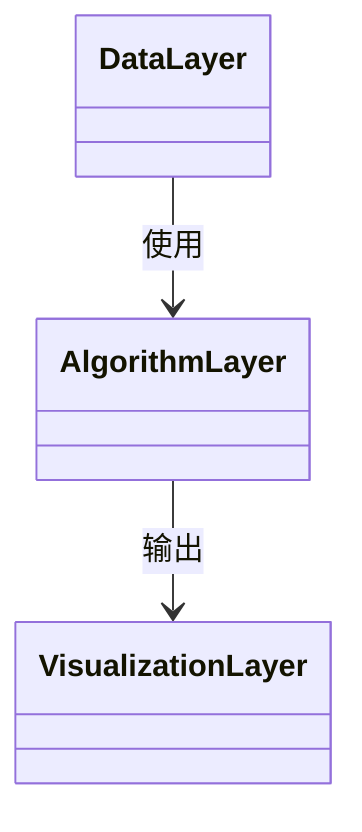
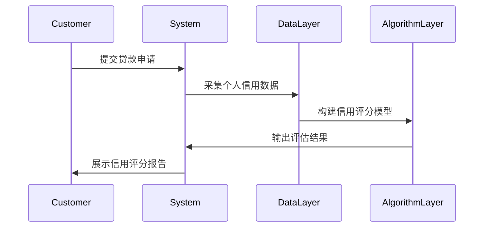

                 

# 大数据在个人信用评估中的应用：金融普惠的新途径

关键词：大数据、个人信用评估、金融普惠、信用评分模型、机器学习、数据可视化

摘要：随着大数据技术的飞速发展，个人信用评估在金融领域中扮演着越来越重要的角色。本文旨在探讨大数据在个人信用评估中的应用，分析其在金融普惠中的作用和挑战，通过一步步的思考过程，提供一种新的解决方案，以实现更准确、更公平的信用评估，推动金融普惠的深入发展。

## 第一部分：背景介绍

### 第1章：问题背景与核心概念

#### 1.1 个人信用评估的重要性

个人信用评估是指通过对个人信用历史、财务状况、还款能力等多方面信息的综合分析，评估个人信用风险的过程。在现代金融体系中，个人信用评估已经成为金融机构进行贷款审批、信用卡发放等业务决策的重要依据。其重要性体现在以下几个方面：

1. **风险控制**：个人信用评估有助于金融机构降低信用风险，防止违约损失。
2. **信用等级划分**：个人信用评估结果可以用来划分不同的信用等级，为金融机构制定差异化信贷政策提供参考。
3. **促进金融普惠**：通过科学合理的个人信用评估，可以更好地服务于那些信用记录不完善或被传统信用评估体系忽视的群体，实现金融普惠。

#### 1.2 大数据的发展与应用

大数据是指无法用传统数据处理工具在合理时间内进行捕获、管理和处理的大量数据。大数据技术的发展，特别是数据挖掘、机器学习和数据可视化等技术的进步，为个人信用评估提供了新的手段和工具。

1. **数据挖掘**：通过挖掘海量数据中的规律和模式，可以发现潜在的风险因素，为信用评估提供更多维度的参考。
2. **机器学习**：通过机器学习算法，可以自动构建信用评分模型，提高评估的准确性和效率。
3. **数据可视化**：通过数据可视化技术，可以直观地展示评估结果，帮助金融机构和消费者更好地理解信用评估过程。

#### 1.3 金融普惠的概念与意义

金融普惠是指让所有群体，尤其是那些传统金融体系之外的人群，能够公平、方便地获得金融服务。金融普惠的意义在于：

1. **促进经济增长**：通过金融普惠，可以扩大内需，推动经济增长。
2. **提高社会福祉**：金融普惠可以提升低收入群体的生活质量，减少贫困。
3. **实现社会公平**：金融普惠有助于消除金融排斥，实现社会公平。

#### 1.4 边界与外延

个人信用评估涉及多个相关领域，如信用风险管理、消费者行为分析等。大数据在金融普惠中的应用不仅限于个人信用评估，还包括支付服务、信用贷款和消费金融等领域。以下是几个典型的应用场景：

1. **支付服务**：通过大数据分析，可以优化支付流程，提升支付体验。
2. **信用贷款**：大数据技术可以帮助金融机构更准确地评估贷款申请者的信用风险，降低贷款违约率。
3. **消费金融**：大数据技术可以用于精准营销，提高消费金融服务的覆盖面和满意度。

### 第2章：核心概念与联系

#### 2.1 个人信用评估的核心概念

个人信用评估的核心概念包括信用评分模型、信用评级模型和个人信用数据。

1. **信用评分模型**：用于量化评估个人信用风险的模型，通常基于历史数据和统计方法构建。
2. **信用评级模型**：用于评估个人信用等级的模型，通常包含多个评分指标和权重。
3. **个人信用数据**：包括个人信用历史、财务状况、还款记录等，是信用评估的重要基础。

#### 2.2 大数据的核心概念

大数据的核心概念包括数据挖掘、机器学习和数据可视化。

1. **数据挖掘**：从大量数据中提取有价值信息的过程，常用于发现信用风险特征。
2. **机器学习**：通过训练模型，使计算机具备预测个人信用风险的能力。
3. **数据可视化**：将数据分析结果以图表形式展示，帮助决策者理解评估结果。

#### 2.3 概念属性特征对比表格

| 概念         | 定义                                                         | 关联关系                                   |
| ------------ | ------------------------------------------------------------ | ------------------------------------------ |
| 信用评分模型 | 用于评估个人信用风险的模型                                   | 与大数据、机器学习等技术密切相关           |
| 数据挖掘     | 从大量数据中提取有用信息的过程                               | 基于大数据技术，用于发现个人信用风险特征   |
| 机器学习     | 通过数据训练模型，使计算机具备预测能力的技术                   | 用于构建信用评分模型，提高评估准确性       |
| 数据可视化   | 将数据以图形或图表形式展示的技术                               | 帮助金融从业者更好地理解个人信用评估结果   |

#### 2.4 ER实体关系图架构

```mermaid
erDiagram
  Customer ||--|{ CreditScore }|-- PersonalLoan
  CreditScore ||--|{ LoanApplication }|-- PersonalLoan
  Customer ||--|{ FinancialBehavior }|-- FinancialProduct
```

## 第二部分：大数据在个人信用评估中的应用

### 第3章：数据采集与处理

#### 3.1 数据采集

数据采集是个人信用评估的基础，数据来源包括以下几个方面：

1. **公共记录**：如个人身份信息、财产状况等，通常来源于政府机构或公共数据库。
2. **金融机构记录**：如贷款记录、还款记录等，来源于银行、信用社等金融机构。
3. **第三方数据**：如社交网络数据、消费行为数据等，通过合法渠道获取。

#### 3.2 数据预处理

数据预处理是确保数据质量的重要步骤，主要包括以下内容：

1. **数据清洗**：去除重复、缺失、错误的数据。
2. **数据整合**：将来自不同来源的数据进行合并，形成统一的信用数据集。
3. **数据标准化**：将不同格式和单位的数据进行统一处理，便于后续分析。

#### 3.3 数据挖掘技术

数据挖掘技术是挖掘数据中的有价值信息的关键手段，主要包括以下技术：

1. **聚类分析**：将相似的数据分组，发现潜在的客户群体。
2. **关联规则挖掘**：发现数据之间的关联关系，如消费行为与信用评分之间的关联。
3. **异常检测**：识别数据中的异常值，如异常的还款行为。

### 第4章：机器学习在信用评分中的应用

#### 4.1 信用评分模型的构建

信用评分模型的构建是大数据在个人信用评估中的核心应用，主要包括以下步骤：

1. **特征选择**：从大量特征中选择对信用评分有显著影响的关键特征。
2. **模型选择**：选择适合信用评分任务的机器学习模型，如神经网络模型、支持向量机模型、决策树模型等。
3. **模型训练**：使用训练数据集对模型进行训练，调整模型参数，使模型能够准确预测信用评分。

#### 4.2 常见信用评分模型

1. **神经网络模型**：通过多层神经网络，将输入特征映射到输出评分，具有较高的预测能力。
2. **支持向量机模型**：通过最大化分类边界，提高模型分类准确性。
3. **决策树模型**：通过树形结构，将输入特征划分为不同的分支，实现分类或回归。

#### 4.3 模型评估与优化

模型评估与优化是确保信用评分模型准确性和稳定性的关键步骤，主要包括以下内容：

1. **评估指标**：如准确率、召回率、F1分数等，用于评估模型性能。
2. **跨样本验证**：通过将数据集划分为训练集和测试集，验证模型在未知数据上的性能。
3. **模型调参**：通过调整模型参数，优化模型性能，提高预测准确性。

### 第5章：数据可视化与报告

#### 5.1 数据可视化方法

数据可视化是将数据分析结果以图形或图表形式展示的过程，主要包括以下方法：

1. **图表选择**：根据数据类型和展示目的选择合适的图表类型，如柱状图、折线图、散点图等。
2. **视觉传达技巧**：通过颜色、形状、标注等视觉元素，提高图表的清晰度和易读性。

#### 5.2 信用评分报告

信用评分报告是向金融机构和消费者展示信用评分结果的重要文档，主要包括以下内容：

1. **报告内容**：包括信用评分结果、评估模型、数据来源等。
2. **报告格式**：通常采用文档格式，如PDF或Word文档，确保报告的规范性和一致性。

### 第6章：金融普惠中的大数据应用

#### 6.1 金融普惠的实现途径

金融普惠的实现途径主要包括以下几个方面：

1. **支付服务**：通过大数据技术，优化支付流程，提高支付效率和安全性。
2. **信用贷款**：通过大数据分析，准确评估贷款申请者的信用风险，降低贷款违约率。
3. **消费金融**：通过大数据技术，实现消费金融的精准营销和个性化服务。

#### 6.2 大数据在金融普惠中的挑战与机遇

大数据在金融普惠中的应用面临着一系列挑战和机遇：

1. **隐私保护**：保护个人隐私是大数据应用的重要挑战，需要制定严格的隐私保护政策和合规措施。
2. **数据质量**：数据质量对信用评估的准确性至关重要，需要建立数据质量控制机制。
3. **技术创新**：大数据技术的不断创新，将为金融普惠提供更多的工具和方法。

### 第7章：项目实战与案例分析

#### 7.1 项目介绍

本案例将介绍一个基于大数据技术的个人信用评估项目，项目背景为金融机构需要构建一个准确的信用评分模型，以支持贷款审批和信用风险管理。

#### 7.2 系统功能设计

系统功能设计主要包括以下几个方面：

1. **数据采集**：从多个数据源采集个人信用数据。
2. **数据预处理**：对采集到的数据进行清洗、整合和标准化。
3. **模型构建**：使用机器学习算法构建信用评分模型。
4. **模型评估**：对模型进行评估和优化。
5. **数据可视化**：将评估结果以图表形式展示。

#### 7.3 系统架构设计

系统架构设计主要包括以下几个方面：

1. **数据层**：包括数据采集、数据预处理和数据存储模块。
2. **算法层**：包括信用评分模型构建和评估模块。
3. **应用层**：包括数据可视化和报告生成模块。



#### 7.4 系统接口设计和系统交互

系统接口设计和系统交互主要包括以下几个方面：

1. **API接口**：提供数据采集、模型构建和模型评估的API接口。
2. **系统交互**：通过图形用户界面（GUI）展示评估结果和报告。



#### 7.5 项目实战与代码实现

本节将详细介绍项目实战中的核心实现部分，包括数据采集、数据预处理、模型构建和模型评估等。

1. **环境安装**：安装Python环境、机器学习库和数据可视化库等。
2. **数据采集**：使用Python爬虫从公开数据源采集个人信用数据。
3. **数据预处理**：使用Python进行数据清洗、整合和标准化。
4. **模型构建**：使用Python机器学习库（如scikit-learn）构建信用评分模型。
5. **模型评估**：使用Python机器学习库评估模型性能。

```python
# 示例代码：数据预处理
import pandas as pd
from sklearn.preprocessing import StandardScaler

# 读取数据
data = pd.read_csv('credit_data.csv')

# 数据清洗
data.dropna(inplace=True)

# 数据整合
X = data.drop('Target', axis=1)
y = data['Target']

# 数据标准化
scaler = StandardScaler()
X_scaled = scaler.fit_transform(X)

# 模型构建
from sklearn.ensemble import RandomForestClassifier
model = RandomForestClassifier()
model.fit(X_scaled, y)

# 模型评估
from sklearn.metrics import accuracy_score
predictions = model.predict(X_scaled)
accuracy = accuracy_score(y, predictions)
print(f"Model Accuracy: {accuracy}")
```

#### 7.6 实际案例分析与详细讲解剖析

本节将分析一个实际案例，通过详细讲解剖析，展示大数据在个人信用评估中的应用效果。

1. **案例背景**：某金融机构需要评估一组贷款申请者的信用风险。
2. **数据来源**：从多个数据源采集贷款申请者的个人信息、财务状况、还款记录等数据。
3. **数据处理**：对数据进行清洗、整合和标准化。
4. **模型构建**：使用机器学习算法构建信用评分模型。
5. **模型评估**：评估模型性能，调整模型参数。
6. **结果展示**：展示评估结果和报告。

```mermaid
gantt
    title 项目进度
    dateFormat  YYYY-MM-DD
    section 项目启动
    项目启动 : a1, 2023-01-01, 2weeks
    section 数据采集
    数据采集 : after a1, 2weeks
    section 数据处理
    数据处理 : after 数据采集, 2weeks
    section 模型构建
    模型构建 : after 数据处理, 2weeks
    section 模型评估
    模型评估 : after 模型构建, 1week
    section 结果展示
    结果展示 : after 模型评估, 1week
```

#### 7.7 项目小结

本案例通过大数据技术和机器学习算法，构建了一个准确的个人信用评估模型，提高了金融机构的信用风险管理能力。项目实战和实际案例分析证明了大数据在金融普惠中的应用价值。未来，随着大数据技术的不断发展和应用，个人信用评估将更加精准、公平，为金融普惠提供更强有力的支持。

### 最佳实践 tips

1. **数据质量至关重要**：确保数据源的可靠性和完整性，是构建准确信用评分模型的基础。
2. **模型选择要因地制宜**：根据具体应用场景和数据特点，选择适合的机器学习模型。
3. **持续优化模型性能**：定期评估模型性能，及时调整模型参数，以提高评估准确性。

### 小结

大数据在个人信用评估中的应用，为金融普惠提供了新的途径。通过数据挖掘、机器学习和数据可视化等技术的综合运用，可以构建准确的信用评分模型，提高信用评估的公平性和准确性。未来，随着大数据技术的不断进步，个人信用评估将在金融普惠中发挥更加重要的作用。

### 注意事项

1. **隐私保护**：在数据采集和处理过程中，应严格遵守相关法律法规，确保个人隐私安全。
2. **数据安全**：确保数据存储和传输的安全性，防止数据泄露和滥用。

### 拓展阅读

1. **大数据在金融领域的应用**：了解大数据技术在金融领域的广泛应用，如风险管理、投资分析和客户服务。
2. **机器学习在信用评分中的应用**：深入研究各种机器学习算法在信用评分中的应用，如神经网络、支持向量机和决策树等。

### 参考文献

1. **《大数据：改变世界的数据革命》**：作者：[舍恩伯格，库克耶]
2. **《机器学习实战》**：作者：[哈里斯，哈恩斯，布朗]
3. **《金融普惠：概念、实践与挑战》**：作者：[杰克逊，卡恩]

