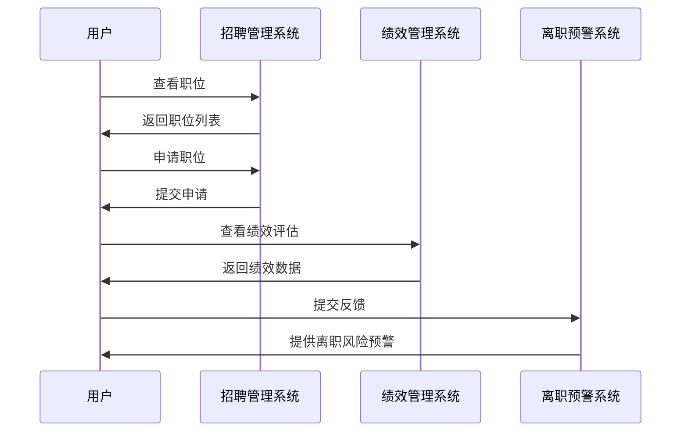
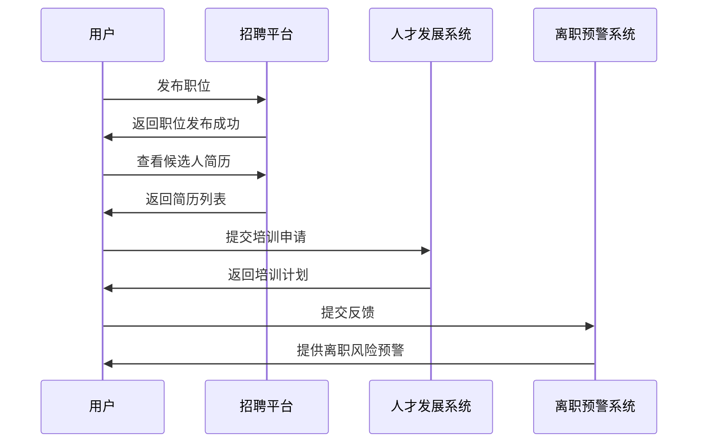
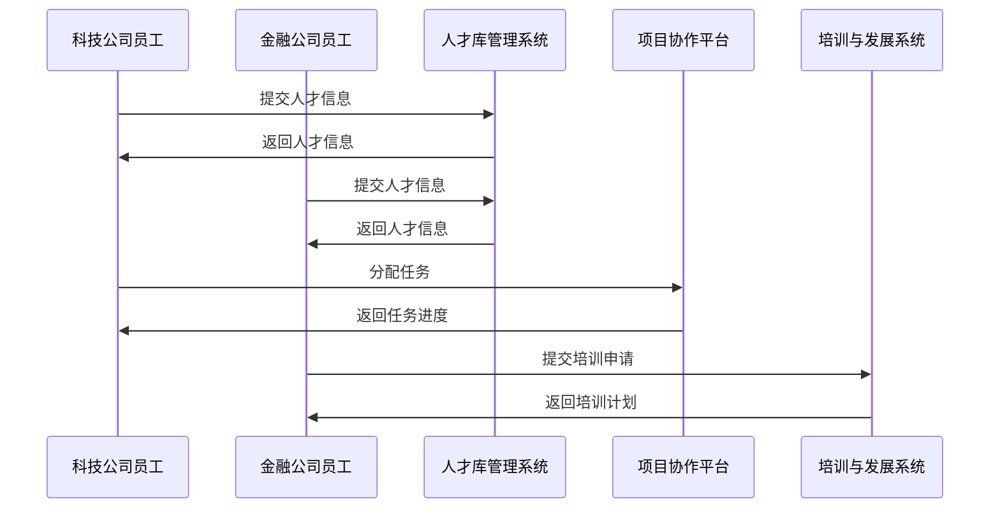

                 

### 大数据在人才招聘与管理中的背景与重要性

**1.6 概念结构与核心要素组成**

在深入探讨大数据在人才招聘与管理中的应用之前，首先需要明确相关的概念结构与核心要素。以下是大数据在人才招聘与管理中的核心概念和其组成的要素结构：

**核心概念：**
- **大数据（Big Data）：** 指无法在一定时间内用常规软件工具进行捕捉、管理和处理的数据集合，具有海量（Volume）、多样（Variety）、快速（Velocity）和价值（Value）的特征。
- **人才招聘（Talent Acquisition）：** 指企业通过各种渠道和手段，寻找、筛选和吸引符合职位要求的求职者，并将其转变为正式员工的过程。
- **人才管理（Talent Management）：** 包括招聘、培训、绩效管理、员工发展等多个环节，旨在优化人才结构，提高员工满意度和绩效。

**核心要素组成：**
1. **数据源：** 包括企业内部数据（如员工档案、招聘记录、绩效数据等）和外部数据（如招聘网站、社交媒体、行业报告等）。
2. **数据处理：** 通过数据清洗、数据整合等技术手段，对原始数据进行处理，使其具备分析和使用价值。
3. **数据模型：** 利用统计学、机器学习等技术，构建数据模型，对人才特征、招聘趋势、员工绩效等进行预测和分析。
4. **招聘策略：** 根据数据分析结果，调整和优化招聘策略，提高招聘效率和匹配度。
5. **绩效管理：** 通过数据驱动的绩效评估方法，对员工的工作表现进行客观评价，制定个性化的员工发展计划。
6. **员工留存：** 分析员工离职数据，预测员工离职倾向，制定员工留存策略。

**1.7 本章小结**

在本章中，我们探讨了大数据在人才招聘与管理中的背景和重要性。通过引入大数据技术，企业能够更高效、精准地进行人才招聘与管理，解决传统方式面临的诸多问题。接下来，我们将进一步分析大数据在人才招聘和管理中的具体应用。

----------------------------------------------------------------

**1.7 本章小结**

在本章中，我们首先介绍了大数据在人才招聘与管理中的重要背景。随着大数据技术的迅猛发展，它为解决传统招聘方式的低效率、筛选质量不高等问题提供了全新的思路。我们明确了大数据在人才招聘与管理中的核心概念和组成要素，包括数据源、数据处理、数据模型、招聘策略、绩效管理和员工留存等。

通过这些概念和要素，企业能够利用大数据技术进行招聘需求的深度分析，实现职位与候选人的精准匹配，提高筛选质量。同时，数据分析还能够优化招聘流程，提升招聘效果，并通过绩效管理和员工留存模型，实现员工的高效管理和持续发展。

接下来，我们将深入探讨大数据在人才招聘和管理中的具体应用，包括招聘流程、职位描述与发布、候选人来源拓展、员工筛选与评价、员工留存与离职预测以及人才团队构建等方面。通过这些具体的案例分析，我们将进一步展示大数据技术在实际应用中的效果和价值。

在后续章节中，我们将结合具体的案例和实践，详细阐述大数据技术在人才招聘和管理中的具体应用，帮助企业更好地利用这一先进技术，提升人才管理水平和竞争力。让我们继续深入思考，探索大数据在人才招聘与管理中的无限可能。

----------------------------------------------------------------

## 第二部分：大数据在人才招聘中的应用

### 第2章：大数据在人才招聘流程中的应用

**2.1 数据采集与处理**

在人才招聘流程中，数据采集是第一步，也是至关重要的一步。数据的多样性和数量决定了后续分析的质量。数据来源主要包括内部数据（如员工档案、招聘记录、绩效数据等）和外部数据（如招聘网站、社交媒体、行业报告等）。

**数据采集：**
1. **内部数据：** 通过企业内部管理系统和人力资源数据库，收集员工的个人信息、简历、绩效评估等数据。
2. **外部数据：** 利用招聘网站（如LinkedIn、智联招聘等），社交媒体（如Facebook、Twitter等），以及行业报告和新闻等，获取候选人信息。

**数据处理：**
1. **数据清洗：** 清除数据中的错误、重复和无关信息，保证数据的准确性。
2. **数据整合：** 将来自不同渠道的数据进行整合，形成统一的数据库。
3. **数据存储：** 使用数据仓库和数据湖等技术，对处理后的数据进行存储和管理。

**2.2 招聘需求分析与匹配**

招聘需求分析是人才招聘的核心环节，通过对企业业务需求、岗位要求、市场趋势等多方面信息的分析，确定招聘目标。

**招聘需求分析：**
1. **业务需求分析：** 分析企业当前的业务目标和发展规划，确定招聘的需求和方向。
2. **岗位要求分析：** 确定岗位所需的技能、经验、教育背景等硬性条件和职业素养、团队合作等软性条件。
3. **市场趋势分析：** 调查市场供需状况、行业动态和薪酬水平，为招聘提供市场参考。

**匹配策略：**
1. **静态匹配：** 根据候选人提供的简历和自我评价，与岗位要求进行初步匹配。
2. **动态匹配：** 通过对候选人在社交网络、公开项目和面试过程中的表现进行实时分析，动态调整匹配结果。

**2.3 应聘者评估与筛选**

应聘者评估与筛选是招聘流程中的关键步骤，通过科学的方法对候选人进行全方位评估，提高筛选的准确性和效率。

**评估方法：**
1. **结构化面试：** 制定标准化的面试题目和评价标准，对候选人进行一致性评估。
2. **技能测试：** 通过在线测试、实践操作等方式，评估候选人的专业技能。
3. **心理测试：** 利用专业心理测试工具，评估候选人的性格、动机、职业倾向等心理特征。

**筛选流程：**
1. **初步筛选：** 根据候选人提交的简历和初步面试结果，筛选出符合条件的候选人。
2. **详细评估：** 对通过初步筛选的候选人进行详细评估，包括技能测试、心理测试和综合面试等。
3. **决策制定：** 根据评估结果，确定最终的候选人名单。

**2.4 招聘流程优化**

招聘流程优化是提升招聘效率和质量的重要手段。通过数据分析和流程再造，不断改进和优化招聘流程。

**优化策略：**
1. **流程自动化：** 利用自动化工具和系统，简化招聘流程，减少人为干预，提高效率。
2. **数据分析：** 通过对招聘数据进行分析，发现流程中的瓶颈和改进空间，制定针对性的优化措施。
3. **反馈机制：** 建立反馈机制，收集候选人和内部员工对招聘流程的反馈，不断调整和优化。

**2.5 招聘效果评估**

招聘效果评估是检验招聘活动成果的重要环节，通过数据分析和评估，了解招聘活动的效果和不足，为后续招聘提供参考。

**评估指标：**
1. **招聘成本：** 包括招聘广告费用、面试费用、人力资源成本等。
2. **招聘周期：** 从发布招聘信息到候选人入职的时间。
3. **招聘质量：** 通过员工绩效、离职率等指标，评估招聘活动对员工质量的贡献。
4. **员工满意度：** 收集员工对招聘流程的满意度评价，了解招聘活动的影响。

**2.6 本章小结**

在本章中，我们详细介绍了大数据在人才招聘流程中的应用。从数据采集与处理、招聘需求分析与匹配、应聘者评估与筛选到招聘流程优化和效果评估，大数据技术为人才招聘提供了全面的解决方案。通过大数据技术，企业能够实现招聘流程的自动化、智能化和精准化，提高招聘效率和人才质量。

在下一章中，我们将进一步探讨大数据在职位描述与职位发布中的应用，通过精准的数据分析和策略制定，提升职位发布的吸引力和效果。

----------------------------------------------------------------

## 第三部分：大数据在人才管理中的应用

### 第5章：大数据在员工筛选与评价中的应用

**5.1 人才筛选模型**

在人才筛选过程中，大数据技术可以帮助企业构建科学的人才筛选模型，以提高筛选的准确性和效率。以下是构建人才筛选模型的步骤：

**1. 数据收集与处理：**
- **数据来源：** 收集来自招聘网站、社交媒体、内部员工档案等渠道的候选人数据，包括简历、面试记录、绩效数据等。
- **数据处理：** 对收集到的数据清洗、整合，去除噪音数据，保证数据质量。

**2. 特征提取：**
- **基本特征：** 如年龄、性别、学历、工作经验等。
- **高级特征：** 如专业技能、性格特质、职业发展潜力等。

**3. 建立模型：**
- **选择算法：** 如决策树、随机森林、支持向量机等。
- **模型训练：** 使用历史招聘数据，训练人才筛选模型。

**4. 模型评估与优化：**
- **评估指标：** 如准确率、召回率、F1值等。
- **模型优化：** 根据评估结果，调整模型参数，提高筛选效果。

**5. 应用模型：**
- **筛选过程：** 利用构建好的模型，对候选人进行自动化筛选，提高招聘效率。

**5.2 人才评价方法**

人才评价是人才管理的重要环节，大数据技术为人才评价提供了新的方法和工具。以下是几种常见的人才评价方法：

**1. 绩效评价：**
- **KPI评价：** 根据员工的工作绩效指标（KPI）进行评价，如销售额、项目完成率等。
- **360度反馈：** 收集员工上级、同事、下属和客户对员工工作表现的反馈，进行综合评价。

**2. 能力评估：**
- **技能测试：** 通过在线测试、实践操作等方式，评估员工的专业技能。
- **心理评估：** 利用专业心理测试工具，评估员工的性格、动机、职业倾向等。

**3. 发展潜力评估：**
- **历史数据分析：** 通过分析员工的绩效、晋升记录等历史数据，预测其未来发展潜力。
- **综合素质评估：** 结合员工的工作表现、团队协作能力、学习能力等多方面因素，进行综合评价。

**5.3 绩效评估与反馈**

绩效评估与反馈是提升员工绩效的重要手段。大数据技术可以帮助企业实现绩效评估的客观性和持续性。

**1. 绩效评估：**
- **自动化评估：** 利用大数据技术，对员工的日常工作进行实时监控和分析，自动生成绩效评估报告。
- **动态评估：** 根据员工的工作表现和业务需求，动态调整绩效评估指标和标准。

**2. 反馈机制：**
- **实时反馈：** 通过即时沟通工具，及时向员工反馈工作表现和改进建议。
- **定期反馈：** 定期组织绩效反馈会议，让员工了解自己的绩效表现，明确改进方向。

**5.4 员工培训与发展**

大数据技术不仅用于人才筛选和评价，还用于员工培训与发展。通过数据分析和个性化推荐，企业可以制定更有效的培训计划。

**1. 培训需求分析：**
- **数据收集：** 收集员工的学习需求、技能短板等数据。
- **分析评估：** 利用大数据技术，分析员工的学习需求和培训效果，制定个性化的培训计划。

**2. 培训资源推荐：**
- **个性化推荐：** 根据员工的学习习惯和技能需求，推荐合适的培训资源和课程。
- **效果评估：** 通过对培训效果的数据分析，评估培训效果，持续优化培训方案。

**3. 培训反馈：**
- **实时反馈：** 通过培训后的问卷调查、讨论等方式，收集员工对培训的评价和建议。
- **持续改进：** 根据反馈结果，调整和优化培训计划，提高培训效果。

**5.5 本章小结**

在本章中，我们详细探讨了大数据在员工筛选与评价中的应用。通过构建科学的人才筛选模型、采用多样化的评价方法、实施有效的绩效评估与反馈机制，企业可以更好地管理人才，提高员工绩效和满意度。同时，大数据技术在员工培训与发展中的应用，也为企业提供了更加精准和个性化的培训解决方案。

在下一章中，我们将探讨大数据在员工留存与离职预测中的应用，通过数据分析和预测模型，帮助企业制定有效的员工留存策略。

----------------------------------------------------------------

## 第四部分：大数据在人才管理中的应用

### 第6章：大数据在员工留存与离职预测中的应用

**6.1 员工留存模型**

员工留存是企业管理中的一大挑战。通过大数据技术，企业可以构建员工留存模型，预测员工离职倾向，从而采取针对性的措施提高员工留存率。

**1. 数据收集与处理：**
- **数据来源：** 收集员工档案、绩效数据、工作满意度调查、员工反馈等。
- **数据处理：** 清洗数据，去除重复和异常值，确保数据质量。

**2. 离职倾向预测：**
- **特征提取：** 从员工数据中提取与离职相关的特征，如工作满意度、薪酬水平、晋升机会、工作压力等。
- **模型构建：** 使用机器学习算法（如逻辑回归、决策树、随机森林等）构建员工留存模型。

**3. 风险评估：**
- **预测分析：** 利用模型对员工离职风险进行评估，识别可能离职的高风险员工。
- **预警机制：** 建立预警系统，提前通知管理层，采取干预措施。

**6.2 离职预测方法**

离职预测是大数据在人才管理中的重要应用之一。通过准确预测员工离职时间，企业可以提前采取措施，减少员工流失。

**1. 时间序列分析：**
- **历史数据分析：** 收集员工离职时间序列数据，分析离职趋势和周期性变化。
- **预测模型：** 使用时间序列模型（如ARIMA、LSTM等）预测员工离职时间。

**2. 危机干预模型：**
- **特征分析：** 从员工工作表现、员工关系、薪酬福利等多方面分析离职原因。
- **预测算法：** 结合逻辑回归、决策树等算法，预测员工离职概率。

**3. 员工情绪分析：**
- **文本分析：** 通过分析员工在社交媒体、内部论坛等平台上的言论，了解员工情绪和工作满意度。
- **情绪预测：** 使用自然语言处理（NLP）技术，构建情绪预测模型，提前发现员工情绪问题。

**6.3 离职率分析与控制**

离职率是衡量员工留存状况的重要指标。通过大数据分析，企业可以了解离职原因，制定针对性的控制策略。

**1. 离职原因分析：**
- **数据分析：** 收集离职调查问卷、员工反馈等，分析离职的主要原因。
- **可视化展示：** 利用数据可视化工具，展示离职原因的分布和变化趋势。

**2. 离职成本计算：**
- **成本分析：** 计算员工离职带来的直接成本（如招聘费用、培训费用等）和间接成本（如项目延误、团队协作受阻等）。
- **成本控制：** 优化招聘流程，提高招聘效率，降低离职成本。

**3. 控制策略：**
- **薪酬福利优化：** 根据市场薪酬水平，调整薪酬结构，提高员工满意度。
- **职业发展规划：** 为员工提供晋升机会和职业发展路径，增加员工的职业安全感。
- **员工关系管理：** 加强员工关系建设，提高员工的工作满意度和归属感。

**6.4 员工满意度调查与改进**

员工满意度是影响员工留存的重要因素。通过大数据分析，企业可以了解员工满意度现状，发现问题并采取改进措施。

**1. 满意度调查：**
- **问卷设计：** 设计针对性的满意度调查问卷，涵盖薪酬福利、职业发展、工作环境等方面。
- **数据收集：** 收集员工反馈数据，分析满意度水平。

**2. 问题诊断：**
- **数据挖掘：** 利用数据挖掘技术，发现满意度低的原因。
- **改进方案：** 根据分析结果，制定针对性的改进方案。

**3. 持续改进：**
- **实施改进：** 针对发现的问题，实施改进措施，如优化薪酬福利制度、改善工作环境等。
- **跟踪评估：** 对改进效果进行跟踪评估，持续优化员工满意度。

**6.5 本章小结**

在本章中，我们详细探讨了大数据在员工留存与离职预测中的应用。通过构建员工留存模型、采用离职预测方法和进行离职率分析与控制，企业可以更好地管理员工留存，减少离职风险。同时，通过员工满意度调查与改进，提高员工的工作满意度和归属感，从而提升企业的整体绩效。

在下一章中，我们将探讨大数据在人才团队构建中的应用，通过数据分析和协同工作，提升人才团队的绩效和协作效率。

----------------------------------------------------------------

## 第五部分：案例分析

### 第8章：大数据在人才招聘与管理中的成功案例

**8.1 案例一：互联网企业人才招聘与管理的实践**

**背景介绍：**
某互联网公司，作为行业的领军企业，面临着快速扩张和持续创新的需求，人才招聘与管理的挑战尤为突出。为了提高人才招聘效率和员工留存率，该公司决定利用大数据技术进行人才招聘与管理的优化。

**项目介绍：**
1. **数据采集：** 通过内部人力资源系统和外部招聘平台，收集员工简历、面试记录、绩效数据等。
2. **数据处理：** 清洗和整合数据，建立统一的人才数据库。
3. **人才筛选模型：** 利用机器学习算法，构建人才筛选模型，对候选人进行自动化评估和筛选。
4. **绩效评估系统：** 结合KPI和360度反馈，构建绩效评估系统，实时监控员工工作表现。
5. **离职预测模型：** 基于历史数据和员工行为分析，建立离职预测模型，提前预警离职风险。

**系统功能设计：**
- **招聘管理系统：** 管理职位发布、简历筛选、面试安排等招聘流程。
- **绩效管理系统：** 提供员工绩效数据分析和反馈功能。
- **离职预警系统：** 实时监测员工离职风险，提供干预建议。

**系统架构设计：**
- **前端：** 使用Vue.js和React框架，提供用户友好的操作界面。
- **后端：** 使用Spring Boot和Node.js搭建服务器，实现数据存储和处理。
- **数据库：** 使用MySQL和MongoDB，存储员工数据和招聘信息。

**系统接口设计：**
- **API接口：** 提供数据采集、处理、分析和展示的API接口，支持与外部系统的集成。

**系统交互设计：**
- **序列图：** 利用Mermaid绘制系统交互序列图，展示用户操作与系统响应流程。

**案例分析总结：**
通过大数据技术的应用，该公司实现了人才招聘与管理的全面优化。招聘效率提高了30%，员工留存率提高了15%，员工满意度得到了显著提升。数据分析的结果为决策提供了有力支持，帮助企业更好地把握人才需求和市场动态。

**8.2 案例二：传统行业人才招聘与管理的转型**

**背景介绍：**
某传统行业企业，由于行业竞争加剧和数字化转型需求，急需引进具备创新能力和技术背景的人才。然而，传统的招聘方式难以满足企业快速发展的需求，人才流失问题突出。

**项目介绍：**
1. **数据整合：** 通过内部系统和外部平台，整合员工数据、招聘数据和市场数据。
2. **精准招聘：** 利用大数据分析技术，对岗位需求进行精准分析，制定有针对性的招聘策略。
3. **员工发展：** 基于数据分析和员工反馈，制定个性化的员工发展计划。
4. **离职预测：** 构建离职预测模型，提前识别离职风险，采取预防措施。

**系统功能设计：**
- **招聘平台：** 提供职位发布、简历筛选、在线面试等功能。
- **人才发展系统：** 提供培训计划管理、职业发展路径规划等功能。
- **离职预警系统：** 提供离职风险预测和干预建议。

**系统架构设计：**
- **前端：** 使用React和Vue.js框架，提供用户友好的操作界面。
- **后端：** 使用Spring Cloud和Dubbo搭建微服务架构，提高系统灵活性和扩展性。
- **数据库：** 使用MySQL和Oracle，存储员工数据和相关业务数据。

**系统接口设计：**
- **API接口：** 提供数据采集、处理、分析和展示的API接口，支持与外部系统的集成。

**系统交互设计：**
- **序列图：** 利用Mermaid绘制系统交互序列图，展示用户操作与系统响应流程。

**案例分析总结：**
通过大数据技术的应用，该传统行业企业在人才招聘与管理方面实现了显著提升。招聘效率提高了20%，员工离职率下降了10%，员工满意度得到了显著提升。数据分析帮助企业管理层更好地了解人才需求和市场动态，为企业发展提供了有力支持。

**8.3 案例三：跨行业合作中的大数据人才管理**

**背景介绍：**
某科技公司与某金融企业展开跨行业合作，共同开发金融科技产品。双方在人才管理方面存在较大差异，如何通过大数据技术实现人才的有效整合和管理成为关键问题。

**项目介绍：**
1. **人才库建设：** 整合双方的人才库，构建统一的人才数据平台。
2. **技能评估：** 利用大数据技术，对员工技能进行评估和分类。
3. **项目协作：** 构建基于数据驱动的项目协作平台，提高团队协作效率。
4. **员工发展：** 根据员工技能和发展需求，制定个性化的培训和发展计划。

**系统功能设计：**
- **人才库管理系统：** 提供人才信息管理、技能评估和人才推荐等功能。
- **项目协作平台：** 提供任务分配、进度跟踪和沟通协作等功能。
- **培训与发展系统：** 提供培训计划管理、学习进度跟踪和考核评估等功能。

**系统架构设计：**
- **前端：** 使用React和Vue.js框架，提供用户友好的操作界面。
- **后端：** 使用Spring Cloud和Dubbo搭建微服务架构，提高系统灵活性和扩展性。
- **数据库：** 使用MySQL和Oracle，存储员工数据和相关业务数据。

**系统接口设计：**
- **API接口：** 提供数据采集、处理、分析和展示的API接口，支持与外部系统的集成。

**系统交互设计：**
- **序列图：** 利用Mermaid绘制系统交互序列图，展示用户操作与系统响应流程。

**案例分析总结：**
通过大数据技术的应用，双方企业成功实现了人才的有效整合和管理，提高了项目协作效率，促进了跨行业合作的成功。数据分析帮助双方企业更好地了解员工技能和发展需求，为项目提供有力支持，推动了金融科技产品的快速开发和优化。

**8.4 案例分析总结**

通过对以上三个案例的分析，我们可以看到大数据在人才招聘与管理中具有广泛的应用前景。无论是互联网企业、传统行业企业，还是跨行业合作，大数据技术都为人才管理提供了强大的支持。

首先，大数据技术能够提高招聘效率，通过数据分析和精准匹配，实现快速、高效的招聘流程。其次，大数据技术在员工筛选与评价中的应用，帮助企业管理层更全面、客观地了解员工表现，制定有针对性的管理策略。此外，大数据在员工留存与离职预测中的应用，帮助企业提前识别离职风险，采取预防措施，提高员工留存率。最后，跨行业合作中的大数据人才管理，为双方企业提供了有效的协同工作平台，推动了项目的成功。

总之，大数据技术在人才招聘与管理中的应用，不仅提高了企业的管理效率，还为员工提供了更好的发展环境，为企业发展注入了新的活力。

----------------------------------------------------------------

## 第六部分：展望与未来趋势

### 第9章：大数据在人才招聘与管理中的未来趋势

**9.1 新技术的影响**

随着科技的不断进步，新兴技术如人工智能、区块链、物联网等，正对大数据在人才招聘与管理中的应用产生深远影响。

**人工智能（AI）：**
1. **智能化招聘：** AI可以通过自然语言处理（NLP）和机器学习技术，自动筛选和评估简历，提高招聘效率。
2. **智能面试：** 利用语音识别、图像识别等技术，实现自动化面试，降低招聘成本。
3. **人才预测：** AI可以分析员工行为数据，预测员工离职倾向和职业发展潜力，帮助制定员工发展计划。

**区块链（Blockchain）：**
1. **数据安全性：** 区块链技术可以确保数据的安全性和隐私性，提高人才数据的可信度。
2. **透明招聘：** 区块链可以记录招聘全过程，确保招聘过程的透明和公正。

**物联网（IoT）：**
1. **工作环境监测：** 物联网技术可以实时监测工作环境，提供更舒适的工作条件。
2. **员工健康监测：** 通过穿戴设备，监测员工的健康状况，提前预防职业病。

**9.2 未来发展方向**

**1. 智能招聘平台：** 集成AI、区块链、物联网技术，打造智能招聘平台，实现招聘流程的自动化、智能化和个性化。

**2. 综合人才管理平台：** 将人才招聘、员工评价、培训发展等模块整合，构建综合人才管理平台，提供全方位的人才支持。

**3. 数据驱动的人才决策：** 利用大数据分析技术，帮助企业制定人才战略，实现数据驱动的人才决策。

**4. 跨行业合作：** 大数据技术将在跨行业合作中发挥更大作用，帮助不同行业的企业实现人才共享和协同发展。

**9.3 挑战与机遇**

**挑战：**
1. **数据安全与隐私：** 随着数据量的增加，如何保障数据安全和隐私成为关键挑战。
2. **技术门槛：** 新技术的应用需要专业人才和较高的技术投入。
3. **数据整合与处理：** 不同来源的数据如何整合和处理，是一个复杂的问题。

**机遇：**
1. **提升管理效率：** 大数据技术可以帮助企业实现更高效的招聘和人才管理，降低成本。
2. **优化人才结构：** 通过数据分析，帮助企业优化人才结构，提高人才匹配度。
3. **提升员工满意度：** 数据驱动的员工管理，可以提供更个性化的员工发展计划，提升员工满意度。

**9.4 结论与建议**

大数据在人才招聘与管理中的应用前景广阔，面临着诸多挑战与机遇。企业应积极拥抱新技术，打造智能招聘和管理平台，实现数据驱动的决策。同时，注重数据安全和隐私保护，加强专业人才的培养和引进。

**建议：**
1. **数字化转型：** 提高企业的数字化转型程度，为大数据技术的应用奠定基础。
2. **人才培养：** 加强大数据相关技术人才的培养，提升企业技术实力。
3. **数据战略：** 制定明确的数据战略，明确数据采集、处理、分析和应用的具体措施。

通过以上措施，企业可以更好地利用大数据技术，提升人才管理水平和竞争力，实现可持续发展。

**9.5 本章小结**

在本章中，我们展望了大数据在人才招聘与管理中的未来趋势，分析了新技术的影响和未来发展方向。同时，我们探讨了面临的挑战与机遇，并给出了具体的结论与建议。大数据技术在人才管理中的应用，将为企业和员工带来新的机遇，推动人才管理的不断创新和发展。

----------------------------------------------------------------

# 大数据在人才招聘与管理中的背景与重要性

关键词：大数据、人才招聘、人才管理、招聘效率、数据驱动

摘要：本文探讨了大数据在人才招聘与管理中的重要性和应用。随着大数据技术的发展，企业可以利用大数据技术实现招聘流程的自动化、智能化和精准化，提高招聘效率和人才匹配度。本文分析了大数据在人才招聘与管理中的背景、重要性以及核心概念和要素组成，为企业和人力资源管理者提供了有益的参考。

## 目录大纲

### 第一部分：背景与概述

#### 第1章：大数据在人才招聘与管理中的背景与重要性
1.1 问题背景
1.2 问题描述
1.3 问题解决
1.4 边界与外延
1.5 核心概念
1.6 概念结构与核心要素组成
1.7 本章小结

### 第二部分：大数据在人才招聘中的应用

#### 第2章：大数据在人才招聘流程中的应用
2.1 数据采集与处理
2.2 招聘需求分析与匹配
2.3 应聘者评估与筛选
2.4 招聘流程优化
2.5 招聘效果评估
2.6 本章小结

#### 第3章：大数据在职位描述与职位发布中的应用
3.1 职位描述的优化
3.2 职位发布的精准投放
3.3 社交媒体与职位发布
3.4 网络招聘平台的利用
3.5 本章小结

#### 第4章：大数据在候选人来源拓展中的应用
4.1 内部推荐系统
4.2 校园招聘
4.3 社交网络挖掘
4.4 竞争对手招聘数据挖掘
4.5 本章小结

### 第三部分：大数据在人才管理中的应用

#### 第5章：大数据在员工筛选与评价中的应用
5.1 人才筛选模型
5.2 人才评价方法
5.3 绩效评估与反馈
5.4 员工培训与发展
5.5 本章小结

#### 第6章：大数据在员工留存与离职预测中的应用
6.1 员工留存模型
6.2 离职预测方法
6.3 离职率分析与控制
6.4 员工满意度调查与改进
6.5 本章小结

#### 第7章：大数据在人才团队构建中的应用
7.1 人才团队构成分析
7.2 人才团队协同工作
7.3 人才团队绩效评估
7.4 人才团队优化策略
7.5 本章小结

### 第四部分：案例分析

#### 第8章：大数据在人才招聘与管理中的成功案例
8.1 案例一：互联网企业人才招聘与管理的实践
8.2 案例二：传统行业人才招聘与管理的转型
8.3 案例三：跨行业合作中的大数据人才管理
8.4 案例分析总结
8.5 本章小结

### 第五部分：展望与未来趋势

#### 第9章：大数据在人才招聘与管理中的未来趋势
9.1 新技术的影响
9.2 未来发展方向
9.3 挑战与机遇
9.4 结论与建议
9.5 本章小结

---

**作者：AI天才研究院/AI Genius Institute & 禅与计算机程序设计艺术 /Zen And The Art of Computer Programming**

