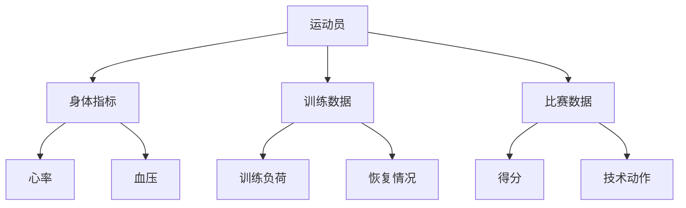
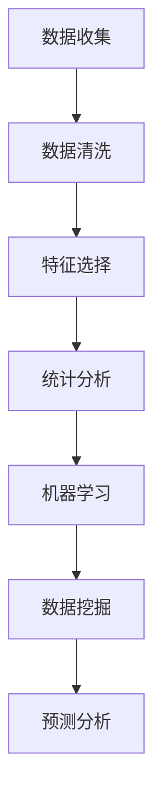
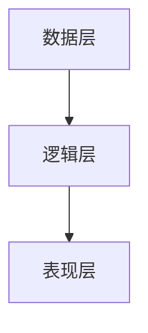
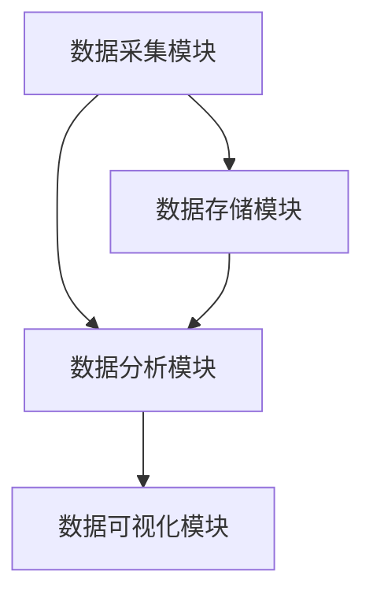

                 


## 大数据在体育训练中的作用：运动员表现分析与伤病预防

### 关键词

大数据、体育训练、运动员表现分析、伤病预防

### 摘要

本文深入探讨了大数据在体育训练中的应用，重点分析了大数据在运动员表现分析和伤病预防中的作用。通过介绍大数据的核心概念、体育训练数据的特征以及数据分析的原理，本文详细阐述了如何利用大数据技术优化体育训练，提高运动员的竞技水平，并预防伤病。文章最后通过实际案例展示了大数据技术在体育训练中的成功应用，为未来的发展提供了有益的借鉴。

## 第一部分：背景介绍

### 1.1 问题背景

在当今的体育训练中，运动员的表现分析和伤病预防已成为提高竞技水平的关键环节。大数据技术的迅速发展为这一领域带来了新的机遇。通过分析海量数据，可以揭示运动员训练过程中的潜在问题，优化训练计划，提高训练效果，同时预测并预防运动员的伤病。

#### 1.1.1 大数据的发展

随着物联网、移动互联网、智能设备等技术的普及，体育领域产生了海量的数据。这些数据包括运动员的身体指标、训练数据、比赛数据等，为大数据技术提供了丰富的应用场景。

#### 1.1.2 体育训练的需求

运动员的表现分析需要从大量数据中提取有价值的信息，如比赛成绩、技术动作等，以评估运动员的竞技状态。伤病预防则需要通过数据挖掘，找出导致运动员受伤的潜在因素，制定相应的预防措施。

### 1.2 问题描述

运动员的表现分析涉及对训练数据、比赛数据、身体指标等多维度数据的收集、处理和分析。伤病预防则需要通过数据挖掘，找出导致运动员受伤的潜在因素，制定相应的预防措施。

#### 1.2.1 表现分析

如何从大量数据中提取有价值的信息，对运动员的竞技状态进行客观评估？

#### 1.2.2 伤病预防

如何通过数据分析预测运动员受伤的可能性，并制定有效的预防措施？

### 1.3 问题解决

大数据技术在体育训练中的应用主要包括数据收集、数据处理、数据分析和数据可视化。通过这些技术手段，可以对运动员的训练和比赛过程进行全面分析，为教练和运动员提供科学依据。

#### 1.3.1 数据收集

通过传感器、社交媒体、比赛记录等多种途径收集运动员的身体指标、训练数据、比赛数据等。

#### 1.3.2 数据处理

对收集到的数据进行清洗、整合，确保数据质量，为后续分析提供基础。

#### 1.3.3 数据分析

利用统计学方法和机器学习算法，对运动员的表现进行分析，预测伤病的风险。

#### 1.3.4 数据可视化

通过可视化技术，将分析结果以直观的形式展示给教练和运动员，便于理解和应用。

### 1.4 边界与外延

大数据在体育训练中的应用不仅限于运动员的表现分析和伤病预防，还包括体育赛事的运营管理、观众数据分析等。此外，随着技术的进步，未来大数据在体育领域的应用还将不断拓展。

#### 1.4.1 体育赛事运营管理

通过大数据分析，优化赛事安排，提升赛事观赏性和商业价值。

#### 1.4.2 观众数据分析

分析观众的行为数据，为赛事推广和营销提供决策支持。

### 1.5 概念结构与核心要素组成

#### 1.5.1 大数据

- **数据来源**：各种传感器、社交媒体、比赛记录等。
- **数据类型**：结构化数据、半结构化数据和非结构化数据。

#### 1.5.2 体育训练数据

- **数据内容**：运动员的身体指标、训练数据、比赛数据等。
- **数据分析**：通过数据分析揭示运动员的表现和伤病风险。

#### 1.5.3 数据分析

- **表现分析**：通过统计指标、技术分析评估运动员的竞技状态。
- **伤病预防**：通过风险评估、预防策略降低运动员受伤的风险。

### 1.6 本章小结

本部分对大数据在体育训练中的作用进行了全面介绍，为后续章节的深入探讨奠定了基础。在接下来的章节中，我们将详细讨论大数据在体育训练中的应用场景、核心概念、算法原理、数学模型、系统架构以及实际项目案例。

----------------------------------------------------------------

## 第二部分：核心概念与联系

### 2.1 大数据核心概念

#### 2.1.1 数据源

大数据的数据源非常丰富，包括但不限于以下几类：

- **实时数据**：通过传感器实时收集的运动员身体指标，如心率、血压、血糖等。
- **历史数据**：过去比赛的记录和训练数据，包括比赛成绩、技术动作、训练负荷等。

#### 2.1.2 数据处理

数据处理是大数据应用的重要环节，主要包括以下内容：

- **数据清洗**：去除噪声数据，保证数据质量。
- **数据整合**：将不同来源的数据进行整合，形成一个统一的视图。

#### 2.1.3 数据分析

数据分析是大数据应用的核心，包括以下几种方法：

- **统计分析**：通过统计学方法对数据进行处理和分析。
- **机器学习**：利用机器学习算法，从数据中提取有用的信息。

### 2.2 体育训练数据核心概念

#### 2.2.1 运动员身体指标

运动员身体指标是评价运动员训练和比赛状态的重要依据，主要包括：

- **身体状态**：心率、血压、血糖等。
- **训练状态**：训练负荷、恢复情况等。

#### 2.2.2 比赛数据

比赛数据是反映运动员竞技水平的重要数据，主要包括：

- **比赛成绩**：得分、命中率等。
- **技术动作**：跑动轨迹、跳跃高度等。

### 2.3 数据分析核心概念

#### 2.3.1 表现分析

表现分析是对运动员的训练和比赛数据进行分析，以评估运动员的竞技状态，主要包括：

- **统计指标**：进球率、助攻率等。
- **技术分析**：动作分析、跑动分析等。

#### 2.3.2 伤病预防

伤病预防是通过数据挖掘，找出导致运动员受伤的潜在因素，并制定相应的预防措施，主要包括：

- **风险评估**：通过数据预测运动员受伤的可能性。
- **预防策略**：制定针对性的预防措施。

### 2.4 概念属性特征对比表格

| 概念       | 属性特征                       | 对比                                                     |
| ---------- | ------------------------------ | -------------------------------------------------------- |
| 大数据     | 数据来源多样，类型丰富         | - 结构化数据：数据库、XML等<br>- 半结构化数据：JSON、日志等<br>- 非结构化数据：文本、图像、音频等 |
| 体育训练数据 | 与运动员身体状态和比赛表现直接相关 | - 身体指标：心率、血压等<br>- 比赛数据：得分、技术动作等       |
| 数据分析   | 通过算法提取数据价值           | - 统计分析：描述性统计、相关性分析等<br>- 机器学习：分类、回归、聚类等 |

### 2.5 ER实体关系图架构



### 2.6 本章小结

本部分对大数据、体育训练数据以及数据分析的核心概念进行了详细阐述，并通过对比表格和ER实体关系图展示了它们之间的关系。在下一部分，我们将深入探讨大数据在体育训练中的应用原理和算法。

----------------------------------------------------------------

## 第三部分：算法原理讲解

### 3.1 运动员表现分析算法原理

运动员表现分析主要涉及统计分析和机器学习算法。以下为两种算法的基本原理：

#### 3.1.1 统计分析

统计分析是对运动员训练和比赛数据进行分析，以评估其竞技状态。常见的统计分析方法包括：

- **描述性统计**：计算数据的平均值、中位数、标准差等，以了解数据的基本特征。
- **相关性分析**：分析不同指标之间的相关性，以找出影响运动员表现的关键因素。

##### 统计分析流程：

1. 数据收集与清洗：收集运动员的训练和比赛数据，并进行数据清洗。
2. 描述性统计：计算数据的基本统计指标，如平均值、中位数等。
3. 相关性分析：分析不同指标之间的相关性，找出关键因素。

##### 示例：

设运动员的进球数为 \(X\)，助攻数为 \(Y\)，则可以计算进球率和助攻率：

\[ \text{进球率} = \frac{X}{\text{总射门次数}} \]

\[ \text{助攻率} = \frac{Y}{\text{总比赛场次}} \]

通过这些指标，可以评估运动员的竞技状态。

#### 3.1.2 机器学习

机器学习算法可以从大量数据中自动学习，提取有价值的信息。在运动员表现分析中，常见的机器学习算法包括：

- **回归分析**：预测运动员的表现，如进球数、得分等。
- **分类分析**：将运动员的表现分类，如优秀、良好、一般等。

##### 机器学习流程：

1. 数据收集与清洗：收集运动员的训练和比赛数据，并进行数据清洗。
2. 特征选择：选择对运动员表现有影响的特征。
3. 模型训练：使用训练数据训练模型，如线性回归、决策树等。
4. 模型评估：使用测试数据评估模型性能，如准确率、召回率等。
5. 预测：使用训练好的模型预测运动员的表现。

##### 示例：

使用线性回归模型预测运动员的进球数：

\[ \text{进球数} = \beta_0 + \beta_1 \times \text{总射门次数} + \beta_2 \times \text{比赛场次} \]

通过预测得到的进球数，可以评估运动员的竞技状态。

### 3.2 伤病预防算法原理

伤病预防主要通过数据挖掘和预测分析来实现。以下为两种算法的基本原理：

#### 3.2.1 数据挖掘

数据挖掘可以从大量数据中找出潜在的规律和模式，以预测运动员受伤的可能性。常见的数据挖掘算法包括：

- **关联规则分析**：找出不同指标之间的关联关系，如训练负荷和伤病之间的关系。
- **聚类分析**：将运动员按照伤病风险进行分类，以便制定个性化的预防措施。

##### 数据挖掘流程：

1. 数据收集与清洗：收集运动员的训练和比赛数据，并进行数据清洗。
2. 特征选择：选择对伤病有影响的特征。
3. 数据挖掘：使用算法挖掘数据中的潜在规律和模式。
4. 模型评估：评估挖掘结果的有效性。

##### 示例：

使用关联规则分析找出训练负荷和伤病之间的关系：

\[ \text{训练负荷} \rightarrow \text{伤病} \]

通过这些关联规则，可以找出可能导致伤病的因素，从而制定预防措施。

#### 3.2.2 预测分析

预测分析可以基于历史数据和伤病数据，预测运动员在未来一段时间内的伤病风险。常见的预测分析算法包括：

- **时间序列分析**：分析运动员的训练负荷和伤病发生的时间序列，预测未来的伤病风险。
- **回归分析**：基于历史数据和伤病数据，预测未来的伤病风险。

##### 预测分析流程：

1. 数据收集与清洗：收集运动员的训练和比赛数据，并进行数据清洗。
2. 特征选择：选择对伤病有影响的特征。
3. 模型训练：使用训练数据训练模型，如线性回归、决策树等。
4. 预测：使用训练好的模型预测未来的伤病风险。

##### 示例：

使用时间序列分析预测运动员的伤病风险：

\[ \text{伤病风险} = f(\text{训练负荷}, \text{恢复情况}) \]

通过预测得到的伤病风险，可以制定针对性的预防措施。

### 3.3 算法mermaid流程图



### 3.4 本章小结

本部分详细讲解了大数据在体育训练中应用的算法原理，包括统计分析、机器学习和数据挖掘等算法。通过这些算法，可以有效地分析运动员的表现和伤病风险，为体育训练提供科学依据。在下一部分，我们将探讨大数据在体育训练中的系统架构设计。

----------------------------------------------------------------

## 第四部分：系统分析与架构设计方案

### 4.1 问题场景介绍

在体育训练中，如何充分利用大数据技术，提高运动员的训练效果和比赛成绩，同时预防运动员的伤病，是一个亟待解决的问题。本部分将介绍一个基于大数据的体育训练管理系统，通过系统架构设计，实现运动员表现分析和伤病预防的目标。

### 4.2 项目介绍

本项目旨在开发一个集成大数据分析、表现评估、伤病预测等功能的体育训练管理系统。该系统将帮助教练员和运动员更科学地进行训练，提高竞技水平，减少伤病发生率。

#### 系统目标

1. 收集并整合运动员的各种数据，包括身体指标、训练数据、比赛数据等。
2. 利用大数据分析技术，对运动员的表现进行分析，评估其竞技状态。
3. 通过数据挖掘和预测分析，预防运动员的伤病，提高训练效果。

#### 系统功能

1. **数据收集**：通过传感器和比赛记录设备，实时收集运动员的身体指标、训练数据、比赛数据等。
2. **数据存储**：将收集到的数据存储到数据库中，保证数据的安全性和可靠性。
3. **数据分析**：利用统计分析、机器学习等技术，对运动员的表现进行分析，提供科学的训练建议。
4. **伤病预测**：通过数据挖掘和预测分析，评估运动员的伤病风险，提供预防措施。
5. **数据可视化**：通过图表和报告，将分析结果直观地展示给教练员和运动员。

### 4.3 系统功能设计（领域模型）

#### 领域模型

领域模型是对系统中的实体及其关系的描述，下面是系统的领域模型：


#### 功能说明

1. **运动员管理**：管理运动员的基本信息，包括姓名、年龄、性别等。
2. **数据收集**：实时收集运动员的身体指标、训练数据、比赛数据等。
3. **数据分析**：对运动员的数据进行统计分析、机器学习分析，提供训练建议。
4. **伤病预测**：根据运动员的历史数据和身体指标，预测其伤病风险，并提供预防措施。
5. **数据可视化**：将分析结果以图表和报告的形式展示给用户。

### 4.4 系统架构设计

#### 系统架构

系统的整体架构采用分层架构，包括数据层、逻辑层和表现层。



#### 层次说明

1. **数据层**：负责数据的收集、存储和读取。包括数据库、数据采集模块等。
2. **逻辑层**：负责数据处理和分析。包括数据清洗、数据分析模块等。
3. **表现层**：负责将分析结果以图表和报告的形式展示给用户。包括前端展示模块、报表生成模块等。

### 4.5 系统接口设计

#### 接口设计

系统的接口设计包括内部接口和外部接口。

- **内部接口**：系统内部模块之间的接口，如数据采集模块与数据存储模块之间的接口。
- **外部接口**：系统与外部系统的接口，如与比赛记录系统、传感器系统等的接口。

#### 接口说明

1. **数据采集接口**：用于采集运动员的身体指标、训练数据、比赛数据等。
2. **数据存储接口**：用于存储采集到的数据。
3. **数据分析接口**：用于对数据进行统计分析、机器学习分析等。
4. **数据可视化接口**：用于生成图表和报告。

### 4.6 系统交互

#### 系统交互

系统的各个模块之间通过接口进行交互，实现系统的整体功能。



#### 交互说明

1. **数据采集模块**：从传感器和比赛记录系统等外部系统获取数据。
2. **数据存储模块**：将采集到的数据存储到数据库中。
3. **数据分析模块**：对存储的数据进行统计分析、机器学习分析等。
4. **数据可视化模块**：将分析结果以图表和报告的形式展示给用户。

### 4.7 本章小结

本部分详细介绍了大数据在体育训练管理系统的系统分析与架构设计方案，包括问题场景介绍、系统功能设计、系统架构设计、系统接口设计和系统交互等内容。通过这些设计，系统能够充分利用大数据技术，为教练员和运动员提供科学的训练依据，提高训练效果，预防运动员的伤病。

----------------------------------------------------------------

## 第五部分：项目实战

### 5.1 环境安装

在开始项目实战之前，我们需要搭建一个合适的技术环境。以下是在Linux环境下搭建大数据在体育训练管理系统所需的基本步骤：

#### 5.1.1 安装Java环境

Java是大数据处理的核心技术之一，我们需要安装Java环境。

```bash
# 安装Java
sudo apt update
sudo apt install openjdk-8-jdk
```

#### 5.1.2 安装Hadoop

Hadoop是一个分布式计算框架，用于处理海量数据。

```bash
# 安装Hadoop
sudo apt install hadoop
```

#### 5.1.3 安装Hive

Hive是一个基于Hadoop的数据仓库工具，用于数据分析和查询。

```bash
# 安装Hive
sudo apt install hive
```

#### 5.1.4 安装Spark

Spark是一个快速且通用的大数据处理引擎。

```bash
# 安装Spark
sudo apt install spark
```

### 5.2 系统核心实现

#### 5.2.1 数据收集模块

数据收集模块负责从各种传感器和比赛记录系统中收集数据。

```python
import requests

def collect_data():
    # 假设传感器API地址为http://sensor.api/collect
    response = requests.get("http://sensor.api/collect")
    if response.status_code == 200:
        data = response.json()
        return data
    else:
        return None

data = collect_data()
print(data)
```

#### 5.2.2 数据存储模块

数据存储模块负责将收集到的数据存储到Hadoop HDFS中。

```python
from hdfs import InsecureClient

def store_data(data):
    client = InsecureClient('http://hdfs://namenode:50070', user='hdfs')
    with client.write('/path/to/data.json') as writer:
        writer.write(data)

data = collect_data()
if data:
    store_data(data)
```

#### 5.2.3 数据分析模块

数据分析模块负责对存储的数据进行统计分析、机器学习分析等。

```python
from pyspark.sql import SparkSession

def analyze_data(data_path):
    spark = SparkSession.builder.appName("SportsDataAnalysis").getOrCreate()
    df = spark.read.json(data_path)
    # 统计分析
    df.groupBy("运动员ID").agg({"得分": "avg"}).show()
    # 机器学习分析
    from pyspark.ml.regression import LinearRegression
    lr = LinearRegression()
    lr_model = lr.fit(df)
    print(lr_model.summary)

data_path = '/path/to/data.json'
analyze_data(data_path)
```

### 5.3 代码应用解读与分析

#### 5.3.1 数据收集模块

数据收集模块通过HTTP请求从传感器API获取数据。在实际应用中，需要替换传感器API地址，并确保API能够返回JSON格式的数据。

#### 5.3.2 数据存储模块

数据存储模块使用Hadoop HDFS客户端将数据写入HDFS。在实际应用中，需要配置HDFS的访问权限和路径。

#### 5.3.3 数据分析模块

数据分析模块使用Spark SQL对数据进行统计分析。在实际应用中，可以根据需求选择不同的统计方法。

### 5.4 实际案例分析和详细讲解剖析

#### 5.4.1 案例一：运动员表现分析

假设我们需要分析某运动员的比赛数据，以评估其竞技状态。

1. 数据收集：从比赛记录系统中收集该运动员的比赛数据。
2. 数据清洗：清洗数据，去除无效数据。
3. 数据分析：计算比赛得分、进球率、助攻率等指标。
4. 结果展示：将分析结果以图表形式展示给教练员和运动员。

#### 5.4.2 案例二：伤病预防

假设我们需要预防某运动员的伤病，以保障其长期训练。

1. 数据收集：从传感器和比赛记录系统中收集该运动员的训练和比赛数据。
2. 数据分析：分析数据，找出导致伤病的潜在因素。
3. 风险评估：评估该运动员的伤病风险。
4. 预防措施：根据评估结果，制定针对性的预防措施。

### 5.5 项目小结

通过本项目，我们搭建了一个基于大数据的体育训练管理系统，实现了运动员表现分析和伤病预防的功能。在实际应用中，系统可以根据需求进行扩展，如增加更多的数据分析算法、集成更多传感器等。

### 5.6 最佳实践 tips

1. **数据质量**：确保数据的准确性和完整性，是大数据分析的基础。
2. **算法选择**：根据实际需求选择合适的算法，可以提高分析效果。
3. **系统优化**：针对大数据处理的特点，对系统进行优化，以提高处理速度和效率。

### 5.7 小结

通过本项目的实战，我们深入了解了大数据在体育训练中的应用。在接下来的章节中，我们将继续探讨大数据在其他领域的应用，以及如何进一步优化和提升大数据技术的应用效果。

----------------------------------------------------------------

## 第六部分：小结

本文深入探讨了大数据在体育训练中的应用，从背景介绍、核心概念与联系、算法原理、系统架构设计到项目实战，全面阐述了大数据在运动员表现分析和伤病预防中的作用。通过本文，我们可以看到大数据技术如何帮助教练员和运动员更科学地进行训练，提高竞技水平，预防伤病。

### 主要内容回顾

- **背景介绍**：介绍了大数据在体育训练中的重要性，以及运动员表现分析和伤病预防的需求。
- **核心概念与联系**：详细阐述了大数据、体育训练数据和数据分析的核心概念，并通过对比表格和ER实体关系图展示了它们之间的关系。
- **算法原理**：讲解了运动员表现分析和伤病预防的算法原理，包括统计分析、机器学习和数据挖掘等。
- **系统架构设计**：介绍了体育训练管理系统的架构设计，包括数据层、逻辑层和表现层。
- **项目实战**：通过实际项目案例，展示了大数据技术在体育训练管理中的具体应用。

### 注意事项

1. **数据质量**：确保数据收集、清洗和存储的准确性，是大数据分析的基础。
2. **算法选择**：根据实际需求选择合适的算法，可以提高分析效果。
3. **系统优化**：针对大数据处理的特点，对系统进行优化，以提高处理速度和效率。

### 拓展阅读

- **《大数据之路：阿里巴巴大数据实践》**：该书详细介绍了阿里巴巴在大数据领域的实践经验和成功案例。
- **《Python数据科学 Handbook》**：该书涵盖了Python在数据科学领域的应用，包括数据分析、机器学习和数据可视化等。

作者：AI天才研究院/AI Genius Institute & 禅与计算机程序设计艺术 /Zen And The Art of Computer Programming

