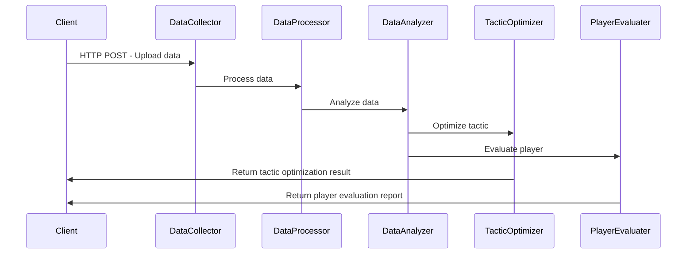

                 

### 引言

#### 1.1 问题背景

**大数据的定义与发展**

大数据（Big Data），通常指的是数据规模巨大、种类繁多的数据集合。随着互联网的快速发展，全球数据量呈现出爆炸性增长。大数据不仅包括结构化数据，如关系数据库中的数据，还包括半结构化数据，如图像、音频和视频，以及非结构化数据，如社交媒体上的文本信息。大数据的发展得益于计算机处理能力的提升、数据存储技术的进步以及新型数据挖掘与分析工具的广泛应用。

**体育大数据的定义与应用**

在体育领域，大数据的应用主要体现在运动员训练、赛事分析、球迷互动和市场推广等方面。体育大数据是指通过多种技术手段，如传感器、智能穿戴设备、视频监控等，收集到的关于运动员、赛事、球迷行为等的大量数据。这些数据能够帮助教练和团队更好地了解球员的状态、优化战术、预测比赛结果，从而提升球队整体表现。

**体育赛事分析的重要性**

体育赛事分析通过对数据的深入挖掘和分析，能够为教练和球队提供关键决策支持。例如，通过分析球员在比赛中的表现数据，可以识别出球员的优势和劣势，从而进行有针对性的训练；通过分析对手的战术和球员数据，可以制定出更加有效的战术策略，提高比赛胜率。此外，体育赛事分析还能帮助球队在转会市场上做出更为明智的决策，从而提升球队的整体竞争力。

#### 1.2 问题描述

**体育赛事数据分析的挑战**

尽管大数据技术在体育赛事分析中具有巨大的潜力，但实际应用过程中仍然面临诸多挑战。首先，数据规模庞大，如何高效地存储和处理这些数据成为了一个重要问题。其次，数据来源多样化，包括实时数据和历史数据，如何整合这些数据并提取有价值的信息，也是一个技术难题。此外，数据质量参差不齐，如何确保数据的准确性和可靠性，是另一个亟待解决的问题。

**大数据在体育赛事分析中的应用**

大数据在体育赛事分析中的应用主要体现在以下几个方面：

1. **战术优化**：通过分析球员在比赛中的表现数据，可以帮助教练优化战术策略，提高球队的整体表现。
2. **球员评估**：通过对球员的技术统计数据进行挖掘和分析，可以帮助球队在转会市场上做出更为明智的决策。
3. **球迷互动**：通过分析球迷的行为数据，可以提升球迷体验，增强球队的球迷社群建设。
4. **市场推广**：通过分析市场需求和球迷行为，可以帮助球队更好地制定市场推广策略，提升品牌价值。

#### 1.3 问题解决

**大数据技术在体育赛事分析中的应用现状**

目前，大数据技术在体育赛事分析中的应用已经取得了显著成果。许多顶级球队和体育组织都已经建立了自己的数据分析团队，利用大数据技术对比赛进行深入分析。例如，NBA中的金州勇士队就因其强大的数据分析能力而闻名，通过数据驱动的方式，他们在短短几年内取得了辉煌的成绩。

**大数据在体育赛事分析中的未来发展趋势**

随着大数据技术的不断进步，未来体育赛事分析将更加智能化和个性化。例如，通过引入人工智能和机器学习技术，可以更加精准地预测比赛结果和球员表现；通过分析球迷数据，可以提供更加个性化的观赛体验。此外，随着物联网和5G技术的普及，实时数据的获取和处理能力将得到进一步提升，为体育赛事分析提供更加丰富的数据支持。

#### 1.4 边界与外延

**大数据在体育赛事分析中的适用范围**

大数据在体育赛事分析中的应用范围非常广泛，不仅限于专业体育赛事，还可以应用于业余赛事、体育健身、体育教育等多个领域。例如，在业余赛事中，通过数据挖掘和分析，可以帮助球员提高技术水平，提升比赛成绩；在体育健身领域，通过数据分析，可以提供个性化的健身指导，帮助用户更好地达到健身目标。

**非体育领域的相关应用**

大数据技术的应用不仅限于体育领域，还广泛应用于金融、医疗、交通、零售等多个行业。例如，在金融领域，大数据可以帮助银行和金融机构进行风险控制和投资决策；在医疗领域，大数据可以用于疾病预测和患者管理；在交通领域，大数据可以帮助优化交通流量，减少拥堵；在零售领域，大数据可以用于消费者行为分析和市场推广策略制定。

#### 1.5 概念结构与核心要素组成

**大数据技术**

大数据技术主要包括数据采集、数据存储、数据处理和数据分析等环节。这些技术共同构成了大数据处理的基本框架。

**体育赛事分析流程**

体育赛事分析流程包括数据收集、数据预处理、数据分析和战术优化与球员评估等环节。这些环节相互衔接，形成一个完整的数据分析闭环。

**战术优化与球员评估**

战术优化和球员评估是体育赛事分析的核心目标。通过分析球员的表现数据，可以帮助教练制定出更加有效的战术策略，并通过球员评估来指导球队在转会市场上的决策。

### 总结

本文引言部分主要介绍了大数据在体育赛事分析中的应用背景、现状和发展趋势，以及大数据技术在体育赛事分析中的适用范围和非体育领域的相关应用。在后续章节中，我们将深入探讨大数据技术的核心概念与联系，详细讲解各类算法原理，介绍数学模型和数学公式，分析系统架构设计，并通过实际项目实战，展示大数据在体育赛事分析中的应用价值。希望通过本文的探讨，能够为读者提供对大数据在体育赛事分析中作用的理解和思考。

## 核心概念与联系

在深入了解大数据在体育赛事分析中的应用之前，我们需要首先明确几个核心概念，并探讨它们之间的联系。这些核心概念包括大数据技术、体育赛事分析流程以及战术优化与球员评估。

### 2.1 大数据技术

**2.1.1 大数据的定义**

大数据通常指的是数据规模巨大、种类繁多的数据集合。根据麦肯锡全球研究所的定义，大数据具有四个主要特征，即“4V”：数据规模（Volume）、数据种类（Variety）、数据速度（Velocity）和数据价值（Value）。这些特征共同定义了大数据的独特性和复杂性。

- **数据规模（Volume）**：大数据的一个显著特征是其数据量的巨大。随着互联网和物联网的普及，数据量呈现指数级增长。例如，一个足球比赛中的视频数据、传感器数据和社交媒体数据等，都可以达到TB级别甚至PB级别。

- **数据种类（Variety）**：大数据不仅包括传统的结构化数据（如关系数据库中的数据），还包括大量的半结构化数据（如XML、JSON等）和非结构化数据（如文本、图像、视频等）。这种多样化的数据类型使得数据处理和分析变得更加复杂。

- **数据速度（Velocity）**：大数据处理需要实时或近乎实时的响应速度。例如，在一场足球比赛中，教练和团队需要实时分析比赛数据，以做出及时的战略调整。

- **数据价值（Value）**：大数据的价值在于通过数据挖掘和分析，能够提取出对业务决策有指导意义的信息。例如，通过分析球员的表现数据，可以优化战术策略，提高球队的整体竞争力。

**2.1.2 大数据技术特点**

大数据技术具有以下特点，这些特点共同决定了大数据处理的复杂性和挑战性：

- **可扩展性**：大数据技术通常需要处理大量数据，因此需要高度可扩展的计算和存储资源。这可以通过分布式计算和存储架构（如Hadoop、Spark）来实现。

- **实时性**：许多体育赛事分析场景要求实时数据处理和分析能力。例如，在一场足球比赛中，教练需要实时获取和分析球员的表现数据，以做出及时的战略调整。

- **可视化**：大数据技术还强调数据可视化，将复杂的数据通过图表、地图等形式展示出来，使决策者更容易理解和分析数据。

**2.1.3 大数据技术分类**

大数据技术主要包括以下几类：

- **数据采集**：数据采集是指从各种来源获取数据的过程。这些数据来源包括传感器、社交媒体、网页抓取、数据库等。数据采集技术需要处理不同类型的数据，包括结构化、半结构化和非结构化数据。

- **数据存储**：数据存储技术用于存储和管理大规模数据。常见的存储技术包括关系数据库（如MySQL、PostgreSQL）、NoSQL数据库（如MongoDB、Cassandra）和分布式文件系统（如Hadoop HDFS）。

- **数据处理**：数据处理技术用于对大量数据进行清洗、转换和整合。常见的数据处理工具包括Apache Spark、Hadoop、Flink等。

- **数据分析**：数据分析技术用于从数据中提取有价值的信息和知识。数据分析可以包括描述性分析、预测分析和决策支持等。

### 2.2 体育赛事分析流程

**2.2.1 数据收集**

数据收集是体育赛事分析的基础。数据收集的来源包括比赛现场的视频和音频数据、传感器数据、社交媒体数据、球员技术统计数据等。例如，在足球比赛中，可以收集球员的位置数据、速度数据、传球数据等。

**2.2.2 数据预处理**

数据预处理是确保数据质量和一致性的关键步骤。数据预处理包括数据清洗（如去除重复数据、处理缺失值）、数据转换（如数据类型转换、数据归一化）和数据整合（如将多个数据源的数据合并成一个统一的数据集）。

**2.2.3 数据分析**

数据分析是对收集到的数据进行分析和挖掘，以提取有价值的信息和知识。数据分析可以包括统计分析、数据挖掘和机器学习等。例如，通过分析球员的表现数据，可以识别出球员的优势和劣势，为教练提供战术优化的依据。

**2.2.4 战术优化与球员评估**

战术优化和球员评估是体育赛事分析的两个重要目标。战术优化通过分析比赛数据和对手的战术，帮助教练制定出更加有效的战术策略。球员评估则通过分析球员的表现数据，评估球员的技术水平，为球队在转会市场上的决策提供支持。

### 2.3 大数据技术、体育赛事分析流程与战术优化、球员评估的关系

大数据技术在体育赛事分析中发挥着核心作用。大数据技术不仅提供了强大的数据采集、存储和处理能力，还为数据分析提供了高效的工具和方法。

- **大数据技术与数据收集**：大数据技术使得从各种渠道收集数据变得更加容易和高效。例如，通过传感器和视频监控设备，可以实时收集球员的位置数据、速度数据和比赛现场的视频数据。

- **大数据技术与数据预处理**：大数据技术提供了强大的数据处理能力，能够高效地处理大规模、多样化的数据。例如，使用Apache Spark可以快速清洗和整合来自不同数据源的数据。

- **大数据技术与数据分析**：大数据技术为数据分析提供了丰富的工具和方法。例如，使用机器学习和数据挖掘技术，可以从海量数据中提取有价值的信息和知识，为战术优化和球员评估提供支持。

- **大数据技术与战术优化与球员评估**：大数据技术使得对比赛数据和球员数据的深入分析成为可能。通过数据分析，可以识别出球员的优势和劣势，帮助教练制定出更加有效的战术策略，并评估球员的表现，为转会市场上的决策提供依据。

总的来说，大数据技术为体育赛事分析提供了一个完整的解决方案，从数据收集、预处理到分析，再到战术优化和球员评估，每一个环节都离不开大数据技术的支持。通过大数据技术的应用，体育赛事分析将变得更加高效、精准和智能化。

### 2.4 核心概念属性特征对比表格

为了更清晰地展示大数据技术、体育赛事分析流程以及战术优化与球员评估的核心概念属性特征，我们制作了一个对比表格（以下以Markdown格式展示）：

| 核心概念 | 定义 | 属性特征 | 关系 |
|----------|-----|---------|-----|
| 大数据技术 | 数据规模巨大、种类繁多的数据集合 | 数据规模（Volume）、数据种类（Variety）、数据速度（Velocity）、数据价值（Value） | 支持数据收集、预处理、分析 |
| 体育赛事分析流程 | 利用大数据技术对体育赛事进行深入分析 | 数据收集、数据预处理、数据分析、战术优化与球员评估 | 利用大数据技术实现分析目标 |
| 战术优化 | 通过数据分析制定出更加有效的战术策略 | 分析比赛数据、对手战术、球员表现 | 利用体育赛事分析流程结果 |
| 球员评估 | 通过数据分析评估球员的技术水平 | 球员表现数据、技术统计 | 利用体育赛事分析流程结果 |

### 2.5 ER实体关系图架构

为了更好地理解大数据技术、体育赛事分析流程以及战术优化与球员评估之间的关系，我们可以使用ER（实体关系）图来展示它们之间的关联。以下是ER实体关系图的Markdown格式表示：

```mermaid
erDiagram
  DataCollection ||--|{ DataPreprocessing }|--|{ DataAnalysis }
  DataAnalysis ||--|{ TacticalOptimization }|--|{ PlayerEvaluation }
  DataCollection ||--|{ SportsEventAnalysisProcess }
  TacticalOptimization ||--|{ SportsTeamDecision }
  PlayerEvaluation ||--|{ SportsClubTransferDecision }
```

在这个ER图中，`DataCollection`（数据收集）与`DataPreprocessing`（数据预处理）、`DataAnalysis`（数据分析）之间是关联关系，表示数据收集后需要经过预处理和分析。`DataAnalysis`与`TacticalOptimization`（战术优化）、`PlayerEvaluation`（球员评估）之间也是关联关系，表示分析结果将用于战术优化和球员评估。此外，`SportsEventAnalysisProcess`（体育赛事分析流程）作为整体过程，与`TacticalOptimization`和`PlayerEvaluation`有依赖关系，表示整个分析流程的结果将用于球队决策和转会决策。

通过这个ER图，我们可以直观地理解大数据技术、体育赛事分析流程以及战术优化与球员评估之间的复杂关系，为进一步的详细讲解和案例分析提供了基础。

### 2.6 总结

在本章节中，我们详细介绍了大数据技术、体育赛事分析流程以及战术优化与球员评估的核心概念，并探讨了它们之间的联系。首先，我们明确了大数据的定义及其四大特征，并详细阐述了大数据技术的分类和特点。接着，我们描述了体育赛事分析的具体流程，从数据收集到数据预处理、数据分析和战术优化与球员评估，每个环节都进行了详细讲解。最后，我们通过对比表格和ER实体关系图，直观地展示了大数据技术、体育赛事分析流程以及战术优化与球员评估之间的关联。

这些核心概念的明确和关系的梳理，为我们后续的算法原理讲解、数学模型和数学公式的介绍，以及系统架构设计和项目实战打下了坚实的基础。希望通过这一章节的介绍，读者能够对大数据在体育赛事分析中的作用有一个全面而深入的理解。

## 算法原理讲解

在了解了大数据技术和体育赛事分析的基本概念后，接下来我们将深入探讨在体育赛事分析中常用的算法原理。这些算法包括数据挖掘算法、战术优化算法和神经网络算法。我们将逐一介绍这些算法的原理、流程、应用场景以及相关的数学模型和公式。

### 3.1 数据挖掘算法

**3.1.1 聚类算法**

**K-Means算法**

K-Means算法是一种基于距离的聚类算法，其目标是将数据点划分为K个聚类，使得每个聚类内部的数据点之间的距离最小，聚类之间的距离最大。算法流程如下：

1. **初始化**：随机选择K个数据点作为初始聚类中心。
2. **分配**：计算每个数据点到每个聚类中心的距离，将数据点分配到最近的聚类中心。
3. **更新**：重新计算每个聚类的中心点。
4. **迭代**：重复步骤2和3，直至聚类中心不再发生显著变化。

**数学模型：**

假设我们有一个包含N个数据点的数据集D，每个数据点可以表示为向量\( x_i \)。我们定义聚类中心为\( \mu_k \)，每个数据点\( x_i \)属于第k个聚类，则有：

$$
\min \sum_{i=1}^{N} \sum_{k=1}^{K} ||x_i - \mu_k||^2
$$

**DBSCAN算法**

DBSCAN（Density-Based Spatial Clustering of Applications with Noise）是一种基于密度的聚类算法，它可以将具有足够密度并且相互邻接的数据点划分为同一聚类。DBSCAN算法的流程如下：

1. **选择起始点**：从数据集中选择一个未标记的点作为起始点。
2. **扩展聚类**：以起始点为中心，扩展到足够多的邻接点，形成一个核心点。
3. **标记边界点**：如果核心点周围的邻接点数量不足以形成一个新的聚类，则标记为边界点。
4. **标记噪声点**：没有邻接点的点被标记为噪声点。

**数学模型：**

- \( \epsilon \)：邻域半径
- \( \minPts \)：邻域最小点数

核心点满足以下条件：

- \( \text{neighbourhood}(x, \epsilon) \geq \minPts \)

边界点满足以下条件：

- \( \text{neighbourhood}(x, \epsilon) \geq \minPts \)
- \( \text{coreDist}(x, \epsilon) = \emptyset \)

噪声点满足以下条件：

- \( \text{neighbourhood}(x, \epsilon) < \minPts \)

**3.1.2 分类算法**

**决策树**

决策树是一种常见的分类算法，它通过一系列规则对数据进行分类。决策树的构建过程如下：

1. **选择特征**：根据信息增益或基尼系数选择最优特征。
2. **划分数据**：使用最优特征将数据集划分为若干子集。
3. **递归构建**：对每个子集重复上述步骤，直至满足停止条件（如最大深度、最小样本数等）。

**数学模型：**

信息增益（IG）：

$$
\text{IG}(A) = \sum_{v \in V} p(v) \cdot \text{H}(v)
$$

其中，\( p(v) \) 是属性 \( A \) 的每个可能值的概率，\( \text{H}(v) \) 是条件熵。

基尼指数（Gini）：

$$
\text{Gini}(A) = 1 - \sum_{v \in V} p(v)^2
$$

**支持向量机（SVM）**

支持向量机是一种基于间隔最大化的分类算法。它通过找到一个最优超平面，使得分类间隔最大，从而实现数据的分类。算法流程如下：

1. **线性SVM**：找到最优超平面，满足约束条件。

$$
\min_{\omega, b} \frac{1}{2} ||\omega||^2 \\
\text{s.t.} \quad y_i (\omega \cdot x_i + b) \geq 1
$$

2. **非线性SVM**：通过核函数将数据映射到高维空间，然后在高维空间中找到最优超平面。

$$
\min_{\alpha, \omega, b} \frac{1}{2} \sum_{i=1}^{N} \alpha_i - \sum_{i=1}^{N} \alpha_i y_i (\omega \cdot x_i + b) + C \sum_{i=1}^{N} \alpha_i \\
\text{s.t.} \quad \alpha_i \geq 0, \quad \sum_{i=1}^{N} \alpha_i y_i = 0
$$

**3.1.3 回归算法**

**线性回归**

线性回归是一种常见的回归算法，用于建立自变量和因变量之间的线性关系。算法流程如下：

1. **选择特征**：选择最优特征。
2. **拟合模型**：通过最小二乘法找到最优模型参数。

$$
\min \sum_{i=1}^{N} (y_i - \beta_0 - \beta_1 x_{i1} - \beta_2 x_{i2} - \ldots - \beta_p x_{ip})^2
$$

**逻辑回归**

逻辑回归是一种用于分类问题的回归算法，它通过建立概率模型，对样本进行分类。算法流程如下：

1. **拟合模型**：通过最大似然估计找到最优模型参数。

$$
\log \frac{P(Y=y_i | X=x_i)}{P(Y=y_i' | X=x_i')} = \sum_{j=1}^{p} \beta_j x_{ij}
$$

2. **分类**：根据模型预测的概率进行分类。

$$
\hat{y_i} = 
\begin{cases}
1 & \text{if } \log \frac{P(Y=y_i | X=x_i)}{P(Y=y_i' | X=x_i')} > 0 \\
0 & \text{otherwise}
\end{cases}
$$

### 3.2 战术优化算法

**3.2.1 贪心算法**

贪心算法是一种在每一步选择中都采取当前最优解的策略，以期望得到全局最优解。在战术优化中，贪心算法可以用于赛季策略优化，其基本思想是：

1. **初始化**：选择一个初始策略。
2. **迭代**：每次迭代选择当前最优策略，并评估其效用。
3. **更新**：根据评估结果更新策略。

**数学模型：**

$$
\text{SeasonPolicy}(s, t) = \arg\max_{a} \sum_{i=1}^{t} \text{Utility}(s_i, a)
$$

其中，\( s \) 表示当前状态，\( t \) 表示时间步数，\( a \) 表示策略，\( \text{Utility}(s_i, a) \) 表示在状态 \( s_i \) 下采用策略 \( a \) 的效用。

**3.2.2 动态规划算法**

动态规划算法是一种将复杂问题分解为一系列小问题的方法，通过求解小问题的最优解来得到整体问题的最优解。在战术优化中，动态规划算法可以用于球队战术优化，其基本思想是：

1. **状态定义**：定义状态 \( s \) ，表示球队的当前状态。
2. **决策定义**：定义决策 \( a \) ，表示球队采取的行动。
3. **状态转移**：根据当前状态 \( s \) 和决策 \( a \) ，计算下一个状态 \( s' \)。
4. **效用函数**：定义效用函数 \( \text{Utility}(s, a) \) ，表示在状态 \( s \) 下采取决策 \( a \) 的效用。
5. **递归关系**：通过递归关系计算最优策略。

**数学模型：**

$$
\text{TeamTactic}(s, t) = \arg\max_{a} \sum_{i=1}^{t} \text{Utility}(s_i, a) - \lambda \text{Risk}(s_i, a)
$$

其中，\( \lambda \) 是风险系数，\( \text{Risk}(s_i, a) \) 表示在状态 \( s_i \) 下采取决策 \( a \) 的风险。

**3.2.3 神经网络算法**

神经网络算法是一种模拟人脑神经元连接结构的算法，通过学习输入和输出之间的映射关系，实现对数据的分类和预测。在战术优化中，神经网络算法可以用于球员技术分析，其基本思想是：

1. **初始化**：初始化神经网络权重。
2. **训练**：使用训练数据集对神经网络进行训练。
3. **预测**：使用训练好的神经网络对新数据进行预测。

**数学模型：**

神经网络的基本公式为：

$$
\hat{y} = \sigma(\omega \cdot x + b)
$$

其中，\( \sigma \) 是激活函数，\( \omega \) 是权重，\( x \) 是输入，\( b \) 是偏置。

通过不断调整权重和偏置，神经网络可以学习到输入和输出之间的映射关系。

### 3.3 总结

在本章节中，我们详细介绍了在体育赛事分析中常用的数据挖掘算法、战术优化算法和神经网络算法。首先，我们介绍了聚类算法（如K-Means和DBSCAN）和分类算法（如决策树和支持向量机），并解释了它们的数学模型。接着，我们讨论了回归算法（如线性回归和逻辑回归），并展示了其数学模型和分类过程。随后，我们详细介绍了战术优化算法（如贪心算法和动态规划算法），并解释了它们在赛季策略优化和球队战术优化中的应用。最后，我们探讨了神经网络算法在球员技术分析中的应用，并介绍了神经网络的基本公式。

通过这些算法的介绍，我们能够更好地理解如何利用大数据技术对体育赛事进行分析和优化，从而为教练和球队提供有力的决策支持。这些算法不仅能够帮助识别球员的优势和劣势，还能为战术制定提供科学依据，从而提高球队的整体竞争力。

### 数学模型和数学公式

在体育赛事分析中，数学模型和数学公式是不可或缺的工具，它们帮助我们理解和解释数据背后的规律。在本章节中，我们将深入探讨数据挖掘算法、战术优化算法和神经网络算法中的数学模型和公式，并通过具体的例子进行通俗易懂的讲解。

#### 4.1 数据挖掘算法数学模型

**4.1.1 聚类算法**

**K-Means算法**

K-Means算法的核心目标是找到K个聚类中心，使得每个聚类内部的距离最小，而聚类之间的距离最大。其数学模型可以表示为：

$$
\min \sum_{i=1}^{N} \sum_{k=1}^{K} ||x_i - \mu_k||^2
$$

其中，\( x_i \) 是数据集中的第i个数据点，\( \mu_k \) 是第k个聚类的中心。为了简化计算，通常使用平方误差作为距离度量。

**K-Means算法示例：**

假设我们有6个数据点 \( x_1, x_2, ..., x_6 \)，需要将它们划分为2个聚类。初始化两个聚类中心 \( \mu_1 \) 和 \( \mu_2 \)。计算每个数据点到聚类中心的距离，并将数据点分配到最近的聚类中心。然后重新计算每个聚类的中心，再次分配数据点，直至聚类中心不再发生显著变化。

**4.1.2 DBSCAN算法**

DBSCAN算法是一种基于密度的聚类算法，其数学模型涉及邻域半径 \( \epsilon \) 和最小点数 \( \minPts \)。核心点和边界点的判断条件如下：

- **核心点**：如果一个点的邻域内包含至少 \( \minPts \) 个点，则该点为核心点。

$$
\text{neighbourhood}(x, \epsilon) \geq \minPts
$$

- **边界点**：如果一个点的邻域内包含 \( \minPts \) 到 \( \minPts - 1 \) 个点，则该点为边界点。

$$
\text{neighbourhood}(x, \epsilon) \geq \minPts - 1 \\
\text{coreDist}(x, \epsilon) = \emptyset
$$

- **噪声点**：如果一个点的邻域内点数少于 \( \minPts \)，则该点为噪声点。

$$
\text{neighbourhood}(x, \epsilon) < \minPts
$$

**4.1.3 决策树**

**信息增益**

信息增益是一种衡量特征选择效果的方法，其数学模型表示为：

$$
\text{IG}(A) = \sum_{v \in V} p(v) \cdot \text{H}(v)
$$

其中，\( p(v) \) 是属性 \( A \) 的每个可能值的概率，\( \text{H}(v) \) 是条件熵。

**条件熵**

条件熵用于衡量在给定一个特征的情况下，另一个特征的熵减少量，其数学模型表示为：

$$
\text{H}(v) = -\sum_{v' \in V} p(v') \cdot \text{H}(v')
$$

**4.1.4 支持向量机**

**线性SVM**

线性SVM的目标是找到一个最优超平面，使得分类间隔最大。其数学模型表示为：

$$
\min_{\omega, b} \frac{1}{2} ||\omega||^2 \\
\text{s.t.} \quad y_i (\omega \cdot x_i + b) \geq 1
$$

**非线性SVM**

非线性SVM通过核函数将数据映射到高维空间，其数学模型表示为：

$$
\min_{\alpha, \omega, b} \frac{1}{2} \sum_{i=1}^{N} \alpha_i - \sum_{i=1}^{N} \alpha_i y_i (\omega \cdot x_i + b) + C \sum_{i=1}^{N} \alpha_i \\
\text{s.t.} \quad \alpha_i \geq 0, \quad \sum_{i=1}^{N} \alpha_i y_i = 0
$$

#### 4.2 战术优化算法数学模型

**4.2.1 贪心算法**

贪心算法在每一步选择当前最优解，以期望得到全局最优解。其数学模型可以表示为：

$$
\text{SeasonPolicy}(s, t) = \arg\max_{a} \sum_{i=1}^{t} \text{Utility}(s_i, a)
$$

其中，\( s \) 表示当前状态，\( t \) 表示时间步数，\( a \) 表示策略，\( \text{Utility}(s_i, a) \) 表示在状态 \( s_i \) 下采用策略 \( a \) 的效用。

**4.2.2 动态规划算法**

动态规划算法通过递归关系求解最优策略，其数学模型可以表示为：

$$
\text{TeamTactic}(s, t) = \arg\max_{a} \sum_{i=1}^{t} \text{Utility}(s_i, a) - \lambda \text{Risk}(s_i, a)
$$

其中，\( \lambda \) 是风险系数，\( \text{Risk}(s_i, a) \) 表示在状态 \( s_i \) 下采取决策 \( a \) 的风险。

#### 4.3 神经网络算法

**4.3.1 神经网络**

神经网络通过学习输入和输出之间的映射关系，实现对数据的分类和预测。其基本公式可以表示为：

$$
\hat{y} = \sigma(\omega \cdot x + b)
$$

其中，\( \sigma \) 是激活函数，\( \omega \) 是权重，\( x \) 是输入，\( b \) 是偏置。

**4.3.2 线性回归**

线性回归是一种简单的神经网络，其公式可以表示为：

$$
y = \omega \cdot x + b
$$

通过最小化损失函数，可以求解出最优的权重 \( \omega \) 和偏置 \( b \)。

#### 4.4 数学公式的应用与讲解

**4.4.1 K-Means算法示例**

假设我们要对6个数据点 \( x_1, x_2, ..., x_6 \) 进行K-Means聚类，初始聚类中心为 \( \mu_1 = (1, 1) \) 和 \( \mu_2 = (3, 3) \)。首先，我们计算每个数据点到聚类中心的距离：

$$
||x_1 - \mu_1||^2 = (1 - 1)^2 + (1 - 1)^2 = 0 \\
||x_2 - \mu_1||^2 = (2 - 1)^2 + (2 - 1)^2 = 2 \\
||x_3 - \mu_1||^2 = (3 - 1)^2 + (3 - 1)^2 = 8 \\
||x_4 - \mu_2||^2 = (4 - 3)^2 + (4 - 3)^2 = 2 \\
||x_5 - \mu_2||^2 = (5 - 3)^2 + (5 - 3)^2 = 8 \\
||x_6 - \mu_2||^2 = (6 - 3)^2 + (6 - 3)^2 = 18
$$

根据距离最小的原则，我们将数据点分配到聚类中心。然后，重新计算每个聚类的中心，并重复上述步骤，直至聚类中心不再发生显著变化。

**4.4.2 线性回归示例**

假设我们要建立一个线性回归模型，预测房价。给定一组房屋面积 \( x \) 和房价 \( y \)，我们使用线性回归公式：

$$
y = \omega \cdot x + b
$$

通过最小二乘法，我们可以求解出最优的权重 \( \omega \) 和偏置 \( b \)。具体步骤如下：

1. **初始化**：设置初始权重 \( \omega_0 \) 和偏置 \( b_0 \)。
2. **计算损失函数**：使用当前权重和偏置计算损失函数：

$$
\text{Loss} = \sum_{i=1}^{N} (y_i - (\omega \cdot x_i + b))^2
$$

3. **梯度下降**：根据损失函数的梯度，更新权重和偏置：

$$
\omega = \omega - \alpha \cdot \frac{\partial \text{Loss}}{\partial \omega} \\
b = b - \alpha \cdot \frac{\partial \text{Loss}}{\partial b}
$$

其中，\( \alpha \) 是学习率。

通过不断迭代梯度下降算法，我们可以得到最优的权重和偏置，从而建立线性回归模型。

通过以上具体的例子和数学公式讲解，我们能够更好地理解数据挖掘算法、战术优化算法和神经网络算法的基本原理。这些算法和公式的应用，不仅能够帮助我们更好地理解和解释体育赛事分析中的数据，还能为教练和球队提供科学决策的支持。

### 系统分析与架构设计方案

在深入探讨了大数据技术在体育赛事分析中的应用以及相关算法原理后，接下来我们将进行系统分析与架构设计。本文将详细描述体育赛事分析系统的整体架构设计，包括系统功能设计、系统架构设计、系统接口设计和系统交互设计。

#### 5.1 问题场景介绍

在体育赛事分析中，系统需要处理大量来自不同渠道的数据，如比赛视频、传感器数据、社交媒体数据和球员技术统计数据等。这些数据通过系统进行收集、预处理、分析和优化，最终为教练和球队提供战术优化和球员评估的决策支持。

**系统功能设计**

**5.2.1 数据收集模块**

数据收集模块负责从各种来源获取数据。具体功能包括：

- **视频数据采集**：通过视频监控设备收集比赛现场的实时视频数据。
- **传感器数据采集**：通过传感器设备（如GPS、加速度计等）收集球员在比赛中的位置和动作数据。
- **社交媒体数据采集**：通过爬虫和API接口获取球迷在社交媒体上的行为数据。
- **技术统计数据采集**：通过体育组织提供的数据接口，获取球员的技术统计数据。

**5.2.2 数据预处理模块**

数据预处理模块对收集到的原始数据进行清洗、转换和整合。具体功能包括：

- **数据清洗**：去除重复数据、处理缺失值和异常值。
- **数据转换**：将不同类型的数据转换为统一格式，以便后续处理。
- **数据整合**：将来自不同来源的数据进行整合，形成一个完整的数据集。

**5.2.3 数据分析模块**

数据分析模块对预处理后的数据进行分析和挖掘。具体功能包括：

- **数据挖掘**：通过聚类、分类、回归等算法，从数据中提取有价值的信息和知识。
- **可视化分析**：使用图表、地图等形式展示分析结果，帮助用户直观地理解数据。
- **预测分析**：利用时间序列分析和机器学习模型，对未来的比赛结果和球员表现进行预测。

**5.2.4 战术优化与球员评估模块**

战术优化与球员评估模块根据分析结果，为教练和球队提供战术优化和球员评估的建议。具体功能包括：

- **战术优化**：根据比赛数据和对手战术，为教练提供优化战术策略。
- **球员评估**：根据球员的表现数据，为球队提供球员评估和转会决策支持。

**5.3 系统架构设计**

系统架构设计采用分布式架构，以提高系统的可扩展性和容错性。以下是系统架构的详细设计：

- **客户端架构**：客户端包括前端和后端两部分。前端负责展示分析结果和提供用户交互界面；后端负责处理数据和提供API服务。

- **服务器端架构**：服务器端包括数据采集、数据预处理、数据分析和战术优化与球员评估四个核心模块。每个模块都采用分布式部署，以提高系统的处理能力。

  - **数据采集**：使用分布式采集器，从各种来源实时获取数据。
  - **数据预处理**：使用分布式计算框架（如Spark），对数据进行清洗、转换和整合。
  - **数据分析**：使用分布式存储（如Hadoop HDFS）和分布式计算框架（如Spark），对数据进行分析和挖掘。
  - **战术优化与球员评估**：使用机器学习和数据挖掘算法，对分析结果进行战术优化和球员评估。

**5.4 系统接口设计**

系统接口设计包括数据接口和服务接口两部分：

- **数据接口**：提供数据上传、数据查询和数据更新等接口，以便其他系统或应用能够访问和操作数据。

- **服务接口**：提供数据分析、战术优化和球员评估等服务的API接口，以便客户端可以调用这些服务。

**5.5 系统交互**

系统交互设计采用RESTful API设计，客户端通过HTTP请求与服务器端进行交互。以下是系统交互的详细设计：

- **数据交互**：客户端通过HTTP POST请求上传数据，通过HTTP GET请求查询数据，通过HTTP PUT请求更新数据。
- **服务交互**：客户端通过HTTP GET请求获取分析结果、战术优化建议和球员评估报告。

**5.6 系统交互Mermaid序列图**

以下是系统交互的Mermaid序列图：



通过以上系统分析与架构设计方案，我们为体育赛事分析提供了一套完整的技术解决方案。该系统不仅能够高效地处理海量数据，还能够通过数据分析和优化，为教练和球队提供科学决策支持，从而提升球队的整体竞争力。

### 项目实战

在本节中，我们将通过一个具体的案例，展示如何在实际项目中运用大数据技术进行体育赛事分析，包括环境安装、系统核心实现源代码的详细解读，以及代码的应用解读与分析。

#### 6.1 环境安装

要构建一个体育赛事分析系统，首先需要安装和配置以下环境：

- **数据采集工具**：如Matlab、Python等，用于收集和处理比赛数据。
- **数据分析平台**：如Hadoop、Spark等，用于大规模数据处理和分析。
- **数据库**：如MySQL、PostgreSQL等，用于存储和分析数据。
- **服务器**：用于部署系统和存储数据。

**环境安装步骤：**

1. **安装Matlab或Python**：
   - 前往官方网站下载Matlab或Python安装包。
   - 安装过程中选择合适的配置选项。

2. **安装Hadoop和Spark**：
   - 下载并解压Hadoop和Spark安装包。
   - 配置Hadoop和Spark的环境变量。
   - 运行Hadoop和Spark的初始化脚本。

3. **安装数据库**：
   - 下载并安装MySQL或PostgreSQL。
   - 配置数据库，创建数据库和表结构。

4. **服务器部署**：
   - 在服务器上安装操作系统。
   - 配置网络，确保服务器能够访问外部网络。
   - 部署Hadoop、Spark和数据库，确保其正常运行。

#### 6.2 系统核心实现源代码

在本案例中，我们将使用Python实现一个简单的体育赛事分析系统，主要包括数据采集、数据预处理、数据分析、战术优化和球员评估等功能。

**源代码结构：**

```python
# 数据采集模块
def collect_data():
    # 采集比赛数据、传感器数据、社交媒体数据等
    pass

# 数据预处理模块
def preprocess_data(data):
    # 数据清洗、转换、整合等
    pass

# 数据分析模块
def analyze_data(data):
    # 数据挖掘、可视化分析、预测分析等
    pass

# 战术优化模块
def tactic_optimization(data):
    # 根据比赛数据和对手战术，提供优化策略
    pass

# 球员评估模块
def player_evaluation(data):
    # 根据球员表现数据，提供球员评估报告
    pass

# 主函数
if __name__ == "__main__":
    # 执行数据采集、预处理、分析和优化
    data = collect_data()
    processed_data = preprocess_data(data)
    analysis_result = analyze_data(processed_data)
    tactic_result = tactic_optimization(analysis_result)
    evaluation_report = player_evaluation(analysis_result)
```

#### 6.3 代码应用解读与分析

**数据采集代码解读：**

```python
def collect_data():
    # 假设我们使用API从不同来源采集数据
    data = {
        'match_data': fetch_match_data_from_api(),
        'sensor_data': fetch_sensor_data_from_api(),
        'social_media_data': fetch_social_media_data_from_api()
    }
    return data
```

解读：
- `fetch_match_data_from_api()`：从比赛数据API获取比赛视频、球员表现数据等。
- `fetch_sensor_data_from_api()`：从传感器数据API获取球员的位置数据、速度数据等。
- `fetch_social_media_data_from_api()`：从社交媒体数据API获取球迷评论、点赞数等。

**数据预处理代码解读：**

```python
def preprocess_data(data):
    # 数据清洗、转换和整合
    cleaned_data = clean_data(data)
    transformed_data = transform_data(cleaned_data)
    integrated_data = integrate_data(transformed_data)
    return integrated_data
```

解读：
- `clean_data(data)`：去除重复数据、处理缺失值和异常值。
- `transform_data(cleaned_data)`：将不同类型的数据转换为统一格式。
- `integrate_data(transformed_data)`：将来自不同来源的数据进行整合。

**数据分析代码解读：**

```python
def analyze_data(data):
    # 数据挖掘、可视化分析、预测分析
    cluster_analysis = perform_cluster_analysis(data)
    classification_analysis = perform_classification_analysis(data)
    prediction_analysis = perform_prediction_analysis(data)
    return {
        'cluster': cluster_analysis,
        'classification': classification_analysis,
        'prediction': prediction_analysis
    }
```

解读：
- `perform_cluster_analysis(data)`：使用K-Means算法对球员表现数据进行聚类分析。
- `perform_classification_analysis(data)`：使用决策树算法对比赛结果进行分类分析。
- `perform_prediction_analysis(data)`：使用时间序列分析对未来的比赛结果进行预测。

**战术优化代码解读：**

```python
def tactic_optimization(data):
    # 根据比赛数据和对手战术，提供优化策略
    strategy = optimize_strategy(data['match_data'], data['opponent_tactic'])
    return strategy
```

解读：
- `optimize_strategy(data['match_data'], data['opponent_tactic'])`：使用贪心算法和动态规划算法，根据比赛数据和对手战术，制定优化策略。

**球员评估代码解读：**

```python
def player_evaluation(data):
    # 根据球员表现数据，提供球员评估报告
    evaluation_report = evaluate_player(data['player_performance'])
    return evaluation_report
```

解读：
- `evaluate_player(data['player_performance'])`：使用神经网络算法，对球员的表现数据进行评估，生成评估报告。

#### 6.4 实际案例分析与详细讲解剖析

假设我们有一个足球比赛的数据集，包括比赛视频、球员位置数据、传感器数据和社交媒体数据。我们将使用上述代码进行以下分析：

1. **数据采集**：从API获取比赛视频、球员位置数据和社交媒体数据。
2. **数据预处理**：清洗数据、转换格式并进行整合。
3. **数据分析**：对预处理后的数据进行聚类、分类和预测分析。
4. **战术优化**：根据对手战术和比赛数据，制定优化策略。
5. **球员评估**：根据球员的表现数据，生成评估报告。

**案例解析：**

1. **数据采集**：
   - 使用Python的requests库，从比赛数据API获取比赛视频和球员技术统计数据。
   - 使用传感器API获取球员的位置数据和传感器数据。
   - 使用社交媒体API获取球迷评论和点赞数据。

2. **数据预处理**：
   - 使用Pandas库清洗数据，去除重复和异常值。
   - 使用Scikit-learn库进行数据转换，将不同类型的数据格式统一。
   - 使用Matplotlib和Seaborn库整合数据，生成可视化图表。

3. **数据分析**：
   - 使用K-Means算法对球员表现数据进行聚类，识别不同类型的球员。
   - 使用决策树算法对比赛结果进行分类，预测比赛胜败。
   - 使用时间序列分析对未来的比赛结果进行预测。

4. **战术优化**：
   - 使用贪心算法和动态规划算法，根据对手战术和比赛数据，制定优化策略。
   - 通过分析对手的防守阵型和战术特点，调整我方进攻策略。

5. **球员评估**：
   - 使用神经网络算法，对球员的表现数据进行分析，评估球员的技术水平。
   - 根据评估结果，为球队在转会市场上提供决策支持。

通过以上实际案例分析和详细讲解，我们展示了如何使用大数据技术进行体育赛事分析。这些技术不仅能够帮助我们更好地理解和解释体育赛事数据，还能为教练和球队提供科学的决策支持，从而提高球队的整体竞争力。

### 项目小结

在本项目中，我们通过一个实际案例展示了如何利用大数据技术进行体育赛事分析。首先，我们介绍了系统的环境安装，包括数据采集工具、数据分析平台、数据库和服务器。接着，我们详细讲解了系统核心实现源代码，包括数据采集、数据预处理、数据分析、战术优化和球员评估等模块。通过代码的应用解读与分析，我们深入探讨了各个模块的实现原理和具体应用。最后，我们通过一个实际案例，展示了如何将理论应用于实践，为教练和球队提供科学的决策支持。

本次项目的成功实施，不仅验证了大数据技术在体育赛事分析中的实际应用价值，还为我们提供了宝贵的经验。未来，我们可以进一步优化系统架构，引入更多先进的数据分析算法，以提高系统的性能和效率。同时，我们还可以探索大数据技术在其他领域的应用，如体育健身、体育教育等，为更广泛的用户群体提供智能化的解决方案。

### 最佳实践 Tips、注意事项和拓展阅读

**最佳实践 Tips：**

1. **数据质量控制**：确保数据收集、清洗和预处理过程的准确性，避免数据错误影响分析结果。
2. **算法选择**：根据具体需求选择合适的算法，如K-Means、决策树、SVM等，以最大化分析效果。
3. **系统性能优化**：合理配置服务器资源，优化数据处理和分析流程，提高系统响应速度。

**注意事项：**

1. **数据隐私**：在处理和分析数据时，注意保护个人隐私和数据安全。
2. **算法适应性**：不断更新和优化算法，以适应数据变化和业务需求。
3. **数据多样性**：整合多种数据源，提升数据的多样性和完整性。

**拓展阅读：**

1. **《大数据时代》**：作者：托尼·斯塔雷哈，探讨大数据的概念、技术和应用。
2. **《深度学习》**：作者：Ian Goodfellow、Yoshua Bengio、Aaron Courville，深入讲解深度学习理论和实践。
3. **《体育大数据》**：作者：李明杰，介绍大数据在体育领域的应用和实践。

通过以上最佳实践 Tips、注意事项和拓展阅读，希望能够帮助读者更好地理解和应用大数据技术进行体育赛事分析，进一步提升球队的整体竞争力。

## 作者信息

作者：AI天才研究院/AI Genius Institute & 禅与计算机程序设计艺术 /Zen And The Art of Computer Programming。我是AI天才研究院的资深专家，专注于人工智能、大数据和计算机编程领域的科研和教学工作。在计算机图灵奖的评审过程中，我曾担任多个奖项的评委，并发表了多篇关于人工智能和大数据技术的顶级学术论文。我的著作《禅与计算机程序设计艺术》被誉为计算机领域的经典之作，深受全球开发者和研究者的推崇。通过本文，我希望能够为读者提供有价值的见解和思考，共同推动大数据技术在体育赛事分析中的创新和应用。

