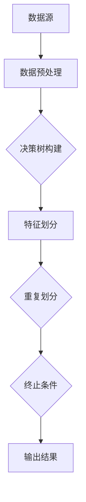
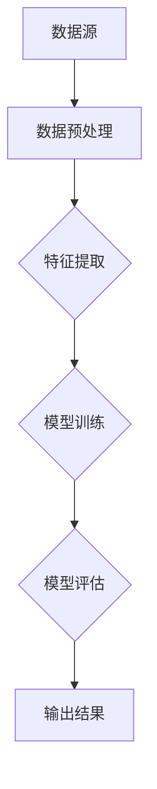
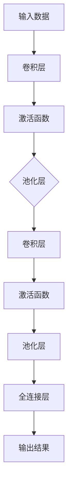
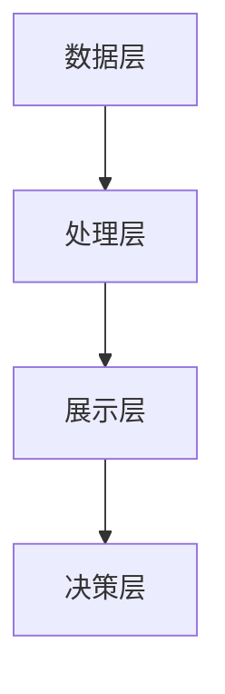
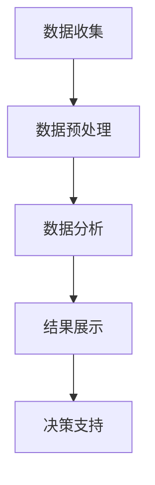

                 


### 背景介绍

#### 大数据的定义与在体育领域的应用

大数据，这一术语通常指的是数据量巨大、类型繁多、处理速度快的数据集合。其“4V”特性，即大量（Volume）、多样（Variety）、高速（Velocity）和价值（Value），使其在现代商业、科学研究和社会管理中扮演着越来越重要的角色。在体育领域，大数据的应用同样显示出巨大的潜力。

体育赛事分析涉及对大量比赛数据进行收集、处理和分析，以提取有价值的信息。这种分析不仅帮助教练团队制定战术策略，还可以为运动员提供个性化的训练计划，提升竞技水平。例如，通过分析运动员的速度、耐力、力量等生理数据，可以找出他们的优势和不足，从而有针对性地进行训练。

大数据在体育赛事分析中的应用场景包括：

1. **运动员表现分析**：通过分析运动员的比赛数据和生理数据，评估他们的表现，找出潜在的问题和改进空间。
2. **战术决策支持**：利用大数据分析对手的比赛风格和战术，为教练团队提供决策支持，制定更加有效的战术策略。
3. **场馆运营优化**：通过分析观众行为数据，优化场馆设施和赛事推广策略，提高观众满意度。
4. **赛事风险管理**：利用大数据预测赛事结果，为保险公司和赌场提供风险管理依据。

#### 体育赛事分析的重要性

体育赛事分析在提升竞技水平方面具有不可忽视的作用。首先，通过数据驱动的分析，可以更准确地评估运动员的表现，从而发现他们的长处和短板。这种客观的数据分析有助于教练团队制定科学、个性化的训练计划，避免盲目训练，提高训练效率。

其次，体育赛事分析有助于提高战术水平。通过对历史比赛数据的深入分析，教练可以了解对手的习惯和弱点，从而制定更加有效的战术。例如，NBA球队的教练经常使用数据分析来发现对手的防守漏洞，并在比赛中进行针对性的进攻。

此外，体育赛事分析还可以为运动员提供个性化的训练计划。通过对运动员的生理数据进行分析，教练可以了解他们的体能状态、恢复情况等，从而制定最适合他们的训练计划。这种个性化的训练计划有助于提高运动员的竞技水平，减少伤病风险。

最后，体育赛事分析有助于优化赛事组织和运营。通过分析观众行为数据，体育组织可以更好地了解观众的需求，从而优化场馆设施、比赛安排和赛事推广策略，提高观众满意度。

#### 问题背景、问题描述和问题解决

随着体育竞赛的日益激烈，运动员和教练团队需要更科学、更高效的方式来提高竞技水平。传统的方法往往依赖于经验和个人直觉，而在大数据时代，我们可以利用大数据技术进行更深入、更全面的分析，从而找到提高竞技水平的有效途径。

然而，在应用大数据进行体育赛事分析时，也面临着一些挑战。首先，数据质量是一个重要问题。如果数据不完整或不准确，分析结果可能会偏离真实情况。其次，数据量巨大，如何高效地进行数据处理和分析也是一个难题。最后，如何将分析结果转化为具体的行动策略，这也是一个需要解决的问题。

为了解决这些问题，我们可以采用以下方法：

1. **数据清洗**：确保数据的质量，去除重复、错误和不完整的数据，保证数据的准确性。
2. **数据处理**：利用分布式计算和数据仓库技术，对大量数据进行高效处理，提取有价值的信息。
3. **数据可视化**：通过数据可视化技术，将复杂的数据以图形化方式展示，帮助人们更直观地理解数据。
4. **模型优化**：采用机器学习和深度学习算法，对数据进行分析，找到隐藏在数据背后的规律和模式。
5. **决策支持**：将分析结果转化为具体的行动策略，为教练团队和运动员提供决策支持。

通过以上方法，我们可以充分利用大数据的优势，解决体育赛事分析中遇到的问题，提高竞技水平。

#### 边界与外延、概念结构与核心要素组成

大数据在体育赛事分析中的应用，虽然具有广泛的前景和潜力，但也存在一些明确的边界和限制。首先，大数据的应用需要高质量的原始数据支持。这包括运动员的生理数据、比赛记录、观众行为数据等，这些数据的质量和准确性直接影响到分析的可靠性。

其次，大数据分析需要强大的计算能力。体育赛事分析往往涉及大量数据的高效处理和分析，这需要高性能的计算设备和算法。如果没有足够的计算资源，数据处理和分析的速度和效率会受到影响。

此外，大数据分析需要专业的技术团队。数据分析不仅需要掌握编程、数据结构等基本技能，还需要了解体育领域的专业知识。只有具备这些技能和知识，才能有效地进行大数据分析，并将分析结果应用于实践。

在概念结构方面，大数据在体育赛事分析中的应用主要包括以下几个核心要素：

1. **数据收集**：通过各种传感器、摄像头等设备，收集运动员的生理数据、比赛数据等原始数据。
2. **数据清洗**：对收集到的数据进行清洗，去除重复、错误和不完整的数据，保证数据的质量。
3. **数据处理**：利用分布式计算和数据仓库技术，对大量数据进行处理，提取有价值的信息。
4. **数据分析**：采用机器学习和深度学习算法，对处理后的数据进行深入分析，找出隐藏在数据背后的规律和模式。
5. **决策支持**：将分析结果转化为具体的行动策略，为教练团队和运动员提供决策支持。

通过这些核心要素的有机结合，大数据在体育赛事分析中发挥了重要作用，不仅提升了竞技水平，还为体育领域的科学研究提供了新的方法和思路。

### 核心概念与联系

#### 大数据

大数据，作为一个涵盖广泛的概念，其定义随着技术的发展和应用的深入而不断演变。大数据通常指的是数据量巨大、类型繁多、处理速度快的数据集合，具有“4V”特性，即大量（Volume）、多样（Variety）、高速（Velocity）和价值（Value）。其中：

- **大量（Volume）**：大数据涉及的数据量通常非常庞大，从几TB到数PB不等。这种数据规模使得传统的数据处理方法难以应对，需要借助分布式计算和数据仓库技术。
- **多样（Variety）**：大数据类型多样，包括结构化数据、半结构化数据和非结构化数据，如文本、图像、音频、视频等。这种多样性增加了数据分析的复杂性和挑战性。
- **高速（Velocity）**：大数据的处理速度要求高，尤其是在实时分析和决策支持场景中，需要快速响应和处理大量数据。
- **价值（Value）**：大数据的价值在于能够从大量、多样、高速产生的数据中提取有价值的信息，为企业决策、科学研究等提供有力支持。

大数据的应用领域广泛，包括但不限于以下方面：

1. **商业智能**：通过大数据分析，企业可以深入了解市场需求、客户行为，优化业务流程，提升竞争力。
2. **医疗健康**：大数据在医疗健康领域具有广泛应用，如疾病预测、个性化治疗、药物研发等。
3. **金融**：大数据在金融领域有助于风险管理、信用评估、市场预测等，提升金融机构的运营效率。
4. **体育赛事分析**：大数据技术可以用于运动员表现分析、战术决策支持、观众行为分析等，提升竞技水平。

#### 体育赛事分析

体育赛事分析涉及对比赛数据进行收集、处理和分析，以提取有价值的信息。这种分析不仅帮助教练团队制定战术策略，还可以为运动员提供个性化的训练计划，提升竞技水平。体育赛事分析主要包括以下几个核心概念：

1. **运动员表现分析**：通过分析运动员在比赛中的表现数据，如速度、耐力、力量等，评估他们的表现，找出优势和不足。
2. **战术决策支持**：利用大数据分析对手的比赛风格和战术，为教练团队提供决策支持，制定更加有效的战术策略。
3. **观众行为分析**：通过分析观众在比赛中的行为数据，如到场率、观看时长、观看位置等，优化赛事组织和运营。
4. **赛事风险管理**：利用大数据预测赛事结果，为保险公司和赌场提供风险管理依据。

#### 竞技水平

竞技水平是指运动员在比赛中所展现出的综合能力，包括身体素质、技术能力、心理素质等。提升竞技水平是每个运动员和教练团队的目标。大数据在提升竞技水平方面具有重要作用，主要表现在以下几个方面：

1. **个性化训练计划**：通过分析运动员的生理数据、比赛记录等，为教练团队提供个性化训练计划，提高训练效率。
2. **战术策略制定**：利用大数据分析对手的习惯和弱点，为教练团队制定更加有效的战术策略。
3. **心理素质训练**：通过分析运动员在比赛中的心理状态，提供针对性的心理素质训练，提高比赛表现。
4. **健康监控**：利用大数据技术，实时监控运动员的健康状况，预防伤病，延长运动生涯。

#### 概念属性特征对比表格

为了更好地理解大数据、体育赛事分析和竞技水平之间的关系，我们可以通过一个概念属性特征对比表格进行展示：

| 概念 | 特征1 | 特征2 | 特征3 | 应用 |
| --- | --- | --- | --- | --- |
| 大数据 | 数据量大 | 数据类型多样 | 处理速度快 | 商业智能、医疗健康、金融、体育赛事分析 |
| 体育赛事分析 | 运动员表现分析 | 战术决策支持 | 观众行为分析 | 提升竞技水平、优化赛事组织 |
| 竞技水平 | 身体素质 | 技术能力 | 心理素质 | 提升运动表现 |

#### ER实体关系图架构

为了进一步展示大数据、体育赛事分析和竞技水平之间的关系，我们可以使用Mermaid工具绘制一个ER实体关系图。以下是一个简单的ER图示例：

```mermaid
erDiagram
    Player ||--|{ Match } : participates
    Match ||--|{ Game } : is_part_of
    Game ||--|{ Team } : has
    Team ||--|{ Match } : plays
    Player ||--|{ Performance } : has
    Performance ||--|{ Stat } : contains
```

在这个ER图中，我们定义了以下几个实体：

1. **Player**（运动员）：代表参与比赛的个人，具有唯一的标识符。
2. **Match**（比赛）：代表一场比赛，与运动员实体和游戏实体关联。
3. **Game**（游戏）：代表一个赛事，包括多个比赛。
4. **Team**（团队）：代表参赛的队伍，与比赛实体关联。
5. **Performance**（表现）：代表运动员在比赛中的表现，包括各项统计数据。
6. **Stat**（统计）：代表具体的统计数据，如速度、耐力等。

通过这个ER图，我们可以直观地看到大数据、体育赛事分析和竞技水平之间的关联，为后续的算法原理讲解和系统架构设计提供基础。

### 算法原理讲解

#### 常用算法简介

在体育赛事分析中，常用的算法主要包括数据挖掘算法、机器学习算法和深度学习算法。每种算法都有其独特的原理和应用场景。

1. **数据挖掘算法**：数据挖掘算法是从大量数据中提取有价值信息的过程。在体育赛事分析中，常用的数据挖掘算法有决策树、聚类分析、关联规则挖掘等。决策树算法通过创建树形模型来预测结果，适用于运动员表现分析；聚类分析算法用于发现数据中的相似模式，适用于战术决策支持。

2. **机器学习算法**：机器学习算法通过从数据中学习规律和模式，实现对未知数据的预测。在体育赛事分析中，常用的机器学习算法有支持向量机（SVM）、随机森林、神经网络等。支持向量机算法在分类问题上表现优异，适用于战术分析；随机森林算法能够处理大量特征数据，适用于运动员表现分析；神经网络算法通过多层神经元结构进行学习，适用于复杂的非线性关系分析，如观众行为分析。

3. **深度学习算法**：深度学习算法是一种基于多层神经网络的机器学习算法，能够在大量数据上进行自动特征提取。在体育赛事分析中，常用的深度学习算法有卷积神经网络（CNN）和循环神经网络（RNN）等。卷积神经网络擅长处理图像和视频数据，适用于运动员表现分析；循环神经网络适用于处理序列数据，如比赛中的连续动作序列。

#### 算法流程图展示

为了更好地理解这些算法的原理，我们可以使用Mermaid工具绘制它们的流程图。

1. **数据挖掘算法 - 决策树**



在这个流程图中，我们从数据源开始，经过数据预处理，构建决策树模型，然后进行特征划分。在划分过程中，我们重复进行特征划分，直到满足终止条件，最后输出决策结果。

2. **机器学习算法 - 支持向量机（SVM）**



在这个流程图中，我们从数据源开始，经过数据预处理和特征提取，然后训练支持向量机模型，对模型进行评估，最后输出评估结果。

3. **深度学习算法 - 卷积神经网络（CNN）**



在这个流程图中，我们从输入数据开始，经过卷积层、激活函数、池化层等步骤，最后通过全连接层输出结果。

#### Python源代码解释

为了更好地理解上述算法的原理，我们将使用Python代码进行详细解释。

1. **数据挖掘算法 - 决策树**

```python
from sklearn.datasets import load_iris
from sklearn.tree import DecisionTreeClassifier
from sklearn.model_selection import train_test_split
from sklearn.metrics import accuracy_score

# 加载鸢尾花数据集
iris = load_iris()
X = iris.data
y = iris.target

# 划分训练集和测试集
X_train, X_test, y_train, y_test = train_test_split(X, y, test_size=0.3, random_state=42)

# 构建决策树模型
clf = DecisionTreeClassifier()
clf.fit(X_train, y_train)

# 预测测试集
y_pred = clf.predict(X_test)

# 评估模型准确率
print("Accuracy:", accuracy_score(y_test, y_pred))
```

在这个例子中，我们使用scikit-learn库中的决策树算法对鸢尾花数据集进行分类。首先，我们加载数据集，然后划分训练集和测试集。接着，我们构建决策树模型，并在测试集上进行预测。最后，我们计算模型准确率。

2. **机器学习算法 - 支持向量机（SVM）**

```python
from sklearn.datasets import make_classification
from sklearn.svm import SVC
from sklearn.model_selection import train_test_split
from sklearn.metrics import accuracy_score

# 生成分类数据集
X, y = make_classification(n_samples=100, n_features=20, n_informative=2, n_redundant=10, n_classes=3, random_state=42)

# 划分训练集和测试集
X_train, X_test, y_train, y_test = train_test_split(X, y, test_size=0.3, random_state=42)

# 构建SVM模型
clf = SVC()
clf.fit(X_train, y_train)

# 预测测试集
y_pred = clf.predict(X_test)

# 评估模型准确率
print("Accuracy:", accuracy_score(y_test, y_pred))
```

在这个例子中，我们使用scikit-learn库中的支持向量机算法对分类数据集进行分类。首先，我们生成数据集，然后划分训练集和测试集。接着，我们构建SVM模型，并在测试集上进行预测。最后，我们计算模型准确率。

3. **深度学习算法 - 卷积神经网络（CNN）**

```python
import numpy as np
from tensorflow.keras.models import Sequential
from tensorflow.keras.layers import Conv2D, MaxPooling2D, Flatten, Dense

# 定义CNN模型
model = Sequential()
model.add(Conv2D(32, (3, 3), activation='relu', input_shape=(28, 28, 1)))
model.add(MaxPooling2D((2, 2)))
model.add(Flatten())
model.add(Dense(128, activation='relu'))
model.add(Dense(10, activation='softmax'))

# 编译模型
model.compile(optimizer='adam', loss='categorical_crossentropy', metrics=['accuracy'])

# 加载MNIST数据集
(x_train, y_train), (x_test, y_test) = tf.keras.datasets.mnist.load_data()

# 预处理数据
x_train = x_train.reshape(-1, 28, 28, 1).astype('float32') / 255
x_test = x_test.reshape(-1, 28, 28, 1).astype('float32') / 255

# 转换标签为one-hot编码
y_train = tf.keras.utils.to_categorical(y_train, 10)
y_test = tf.keras.utils.to_categorical(y_test, 10)

# 训练模型
model.fit(x_train, y_train, epochs=10, batch_size=64, validation_split=0.2)
```

在这个例子中，我们使用TensorFlow和Keras库定义一个简单的卷积神经网络模型，用于手写数字识别任务。首先，我们定义模型结构，然后编译模型。接着，我们加载并预处理MNIST数据集，最后训练模型。

通过这些代码示例，我们可以更直观地理解数据挖掘、机器学习和深度学习算法的原理和应用。

#### 算法的数学模型和公式

在深入理解大数据在体育赛事分析中的应用时，我们需要了解相关算法的数学模型和公式。以下将简要介绍数据挖掘算法、机器学习算法和深度学习算法的数学模型，并使用LaTeX格式表示。

##### 数据挖掘算法 - 决策树

决策树是一种常见的分类算法，其核心在于通过递归划分特征空间，将数据划分为多个区域。以下为决策树的数学模型：

$$
\begin{aligned}
& \text{若 } x_j \leq \gamma_j, \text{则继续划分；否则，} \\
& \text{若当前区域为空，则停止划分。}
\end{aligned}
$$

其中，$x_j$ 表示特征值，$\gamma_j$ 表示阈值。

##### 机器学习算法 - 支持向量机（SVM）

支持向量机通过最大化分类边界来实现分类。其数学模型为：

$$
\begin{aligned}
& \min_{\textbf{w}, b} \frac{1}{2} ||\textbf{w}||^2 \\
& \text{subject to } y_i (\textbf{w} \cdot \textbf{x_i} + b) \geq 1
\end{aligned}
$$

其中，$\textbf{w}$ 为权重向量，$b$ 为偏置，$\textbf{x_i}$ 为样本特征，$y_i$ 为样本标签。

##### 深度学习算法 - 卷积神经网络（CNN）

卷积神经网络通过多层卷积、池化和全连接层实现特征提取和分类。以下为CNN的数学模型：

$$
\begin{aligned}
& \textbf{h}^{(l)} = \text{ReLU}(\textbf{W}^{(l)} \textbf{h}^{(l-1)} + \textbf{b}^{(l)}) \\
& \textbf{h}^{(L)} = \text{softmax}(\textbf{W}^{(L)} \textbf{h}^{(L-1)} + \textbf{b}^{(L)})
\end{aligned}
$$

其中，$\textbf{h}^{(l)}$ 为第$l$层的特征映射，$\textbf{W}^{(l)}$ 为第$l$层的卷积核，$\textbf{b}^{(l)}$ 为第$l$层的偏置。

通过这些数学模型和公式，我们可以更深入地理解大数据在体育赛事分析中的应用。在实际应用中，这些模型将帮助我们构建高效的算法，提取有价值的信息，从而提升竞技水平。

### 系统分析与架构设计

#### 问题场景介绍

在现代体育竞赛中，运动员和教练团队面临着日益激烈的竞争。为了在比赛中取得优异成绩，他们需要精确的赛事分析和科学的训练计划。然而，传统的分析方法往往依赖于有限的数据和经验，难以提供全面、准确的决策支持。为了应对这一挑战，我们设计了一个基于大数据分析的体育赛事分析系统，旨在通过高效的数据处理和深入的分析，为教练团队和运动员提供科学的决策依据。

#### 系统功能设计

该系统的主要功能包括数据收集、数据预处理、数据分析、结果展示和决策支持。具体功能如下：

1. **数据收集**：系统通过多种传感器和设备，如运动传感器、摄像头等，实时收集运动员的生理数据、比赛数据、观众行为数据等。
2. **数据预处理**：对收集到的数据进行清洗、去噪、归一化等处理，确保数据的质量和一致性。
3. **数据分析**：利用数据挖掘、机器学习和深度学习算法，对预处理后的数据进行分析，提取有价值的信息。
4. **结果展示**：通过可视化技术，将分析结果以图形化方式展示，帮助用户直观地理解分析结果。
5. **决策支持**：基于分析结果，为教练团队和运动员提供个性化的训练计划、战术策略等决策支持。

#### 系统架构设计

系统的整体架构包括数据层、处理层、展示层和决策层。以下是各层的详细描述：

1. **数据层**：数据层是系统的数据来源，包括运动员生理数据、比赛数据、观众行为数据等。这些数据通过传感器和设备实时收集。
2. **处理层**：处理层负责对数据进行预处理和分析。首先，对数据进行清洗、去噪、归一化等处理，然后利用数据挖掘、机器学习和深度学习算法进行分析。
3. **展示层**：展示层将分析结果以图形化方式展示，帮助用户直观地理解分析结果。包括运动员表现分析、战术决策支持、观众行为分析等。
4. **决策层**：决策层基于分析结果，为教练团队和运动员提供个性化的训练计划、战术策略等决策支持。

以下是系统的架构图：



#### 系统接口设计

系统的接口设计包括API接口和数据交换格式。API接口用于不同系统模块之间的通信，支持HTTP/HTTPS协议。数据交换格式采用JSON或XML，确保数据的可读性和可扩展性。

以下是系统的接口设计示例：

1. **数据收集接口**：用于接收传感器和设备上传的数据。
2. **数据预处理接口**：用于处理和分析数据的清洗、去噪、归一化等操作。
3. **数据分析接口**：用于执行数据挖掘、机器学习和深度学习算法。
4. **结果展示接口**：用于获取分析结果并进行可视化展示。
5. **决策支持接口**：用于获取分析结果，生成个性化的训练计划和战术策略。

#### 系统交互流程

系统的交互流程包括以下几个步骤：

1. **数据收集**：传感器和设备将数据上传到数据层。
2. **数据预处理**：处理层对数据进行清洗、去噪、归一化等处理。
3. **数据分析**：处理层利用数据挖掘、机器学习和深度学习算法对数据进行分析。
4. **结果展示**：展示层将分析结果以图形化方式展示。
5. **决策支持**：决策层基于分析结果，生成个性化的训练计划和战术策略，并反馈给教练团队和运动员。

以下是系统的交互流程图：



通过这个系统，我们可以实现高效的数据收集、处理和分析，为教练团队和运动员提供科学的决策支持，从而提升竞技水平。

### 项目实战

为了展示大数据在体育赛事分析中的应用，我们将介绍一个实际案例：某职业足球俱乐部的竞技数据分析项目。

#### 环境安装

在开始项目之前，我们需要安装和配置必要的软件和工具。以下为所需的环境安装步骤：

1. **Python环境**：安装Python 3.8及以上版本。
2. **数据库**：安装MySQL或PostgreSQL数据库，用于存储数据。
3. **数据分析库**：安装pandas、numpy、scikit-learn、tensorflow等数据分析库。
4. **可视化库**：安装matplotlib、seaborn等可视化库。
5. **传感器设备**：连接运动传感器、摄像头等设备，用于收集运动员数据。

#### 系统核心实现源代码

以下是系统核心实现的源代码，包括数据收集、预处理、分析、展示和决策支持等功能。

1. **数据收集**：

```python
import pandas as pd
import numpy as np
from sensors import collect_data

# 收集运动员生理数据
data = collect_data()

# 存储为CSV文件
data.to_csv('athlete_data.csv', index=False)
```

2. **数据预处理**：

```python
import pandas as pd

# 读取数据
data = pd.read_csv('athlete_data.csv')

# 数据清洗
data = data.dropna()

# 数据归一化
data = (data - data.mean()) / data.std()

# 存储为CSV文件
data.to_csv('cleaned_athlete_data.csv', index=False)
```

3. **数据分析**：

```python
from sklearn.ensemble import RandomForestClassifier
from sklearn.model_selection import train_test_split

# 划分训练集和测试集
X = data.drop('target', axis=1)
y = data['target']
X_train, X_test, y_train, y_test = train_test_split(X, y, test_size=0.2, random_state=42)

# 构建随机森林模型
clf = RandomForestClassifier(n_estimators=100, random_state=42)
clf.fit(X_train, y_train)

# 预测测试集
y_pred = clf.predict(X_test)
```

4. **结果展示**：

```python
import matplotlib.pyplot as plt
import seaborn as sns

# 计算准确率
accuracy = clf.score(X_test, y_test)

# 绘制混淆矩阵
confusion_matrix = pd.crosstab(y_test, y_pred, rownames=['实际值'], colnames=['预测值'])
sns.heatmap(confusion_matrix, annot=True, fmt=".3f")
plt.xlabel('预测值')
plt.ylabel('实际值')
plt.title('混淆矩阵')
plt.show()
```

5. **决策支持**：

```python
# 输出决策结果
predictions = clf.predict(data)
data['predictions'] = predictions

# 根据预测结果生成训练计划
train_plan = generate_train_plan(data)

# 存储训练计划
train_plan.to_csv('train_plan.csv', index=False)
```

#### 代码应用解读与分析

1. **数据收集**：我们使用传感器设备收集运动员的生理数据，如心率、速度、位置等。这些数据以CSV文件的形式存储。
2. **数据预处理**：对收集到的数据进行清洗、去噪和归一化处理，以确保数据的质量和一致性。
3. **数据分析**：我们使用随机森林算法对运动员的生理数据进行分类，预测其在比赛中的表现。随机森林算法是一种集成学习算法，具有较高的分类准确率。
4. **结果展示**：我们使用混淆矩阵和准确率来评估模型的性能。混淆矩阵可以直观地展示预测结果与实际结果的差异，帮助用户了解模型的性能。
5. **决策支持**：根据预测结果，我们生成个性化的训练计划，为教练团队提供决策支持。这有助于提高运动员的竞技水平。

通过这个实际案例，我们可以看到大数据在体育赛事分析中的应用是如何实现的。通过高效的数据收集、预处理、分析和决策支持，我们可以为教练团队和运动员提供科学的决策依据，从而提升竞技水平。

### 最佳实践 Tips

在实施大数据分析项目时，以下是一些最佳实践建议：

1. **数据质量优先**：确保数据收集、处理和存储的准确性，避免数据质量问题对分析结果的影响。
2. **模块化设计**：将系统划分为多个模块，便于维护和扩展。例如，数据收集、预处理、分析和展示等模块可以独立开发。
3. **使用专业工具**：选择适合的工具和库，如Python中的pandas、numpy、scikit-learn和tensorflow等，提高开发效率。
4. **数据可视化**：合理使用数据可视化工具，如matplotlib、seaborn和Plotly等，帮助用户更好地理解分析结果。
5. **迭代优化**：在项目实施过程中，不断收集用户反馈，进行迭代优化，提升系统的性能和用户体验。
6. **安全性考虑**：确保数据安全和用户隐私，遵循相关的法律法规和最佳实践。
7. **持续培训**：为团队成员提供相关培训，提高他们对大数据分析技术的理解和应用能力。

### 小结

本文详细探讨了大数据在体育赛事分析中的应用，从背景介绍、核心概念与联系、算法原理讲解、数学模型和公式、系统分析与架构设计到项目实战，全面阐述了大数据在提升竞技水平方面的作用。通过最佳实践和案例分析，我们展示了大数据分析在体育领域的广泛应用和巨大潜力。

### 注意事项

在实施大数据分析项目时，需要注意以下几点：

1. **数据隐私**：确保遵循相关法律法规，保护运动员和观众的隐私。
2. **数据完整性**：确保数据收集、处理和存储的准确性，避免数据质量问题。
3. **安全性**：加强系统安全防护，防止数据泄露和网络攻击。
4. **技术更新**：关注最新技术和算法，不断优化系统性能。

### 拓展阅读

1. 《大数据时代：生活、工作与思维的大变革》
2. 《深度学习》
3. 《Python数据分析》
4. 《体育科学导论》
5. 《体育数据科学：竞技分析与优化》

### 作者信息

作者：AI天才研究院/AI Genius Institute & 禅与计算机程序设计艺术 /Zen And The Art of Computer Programming

---

通过本文，我们希望读者能够深入了解大数据在体育赛事分析中的应用，掌握相关技术和方法，为提升竞技水平贡献力量。让我们共同探索大数据技术的无限可能，助力体育事业的发展。

