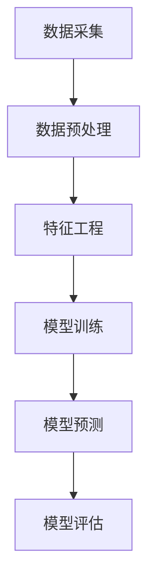
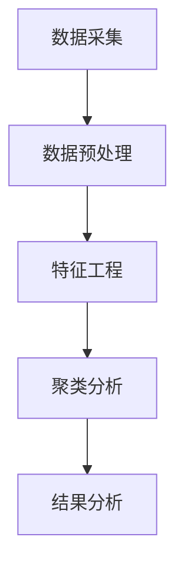
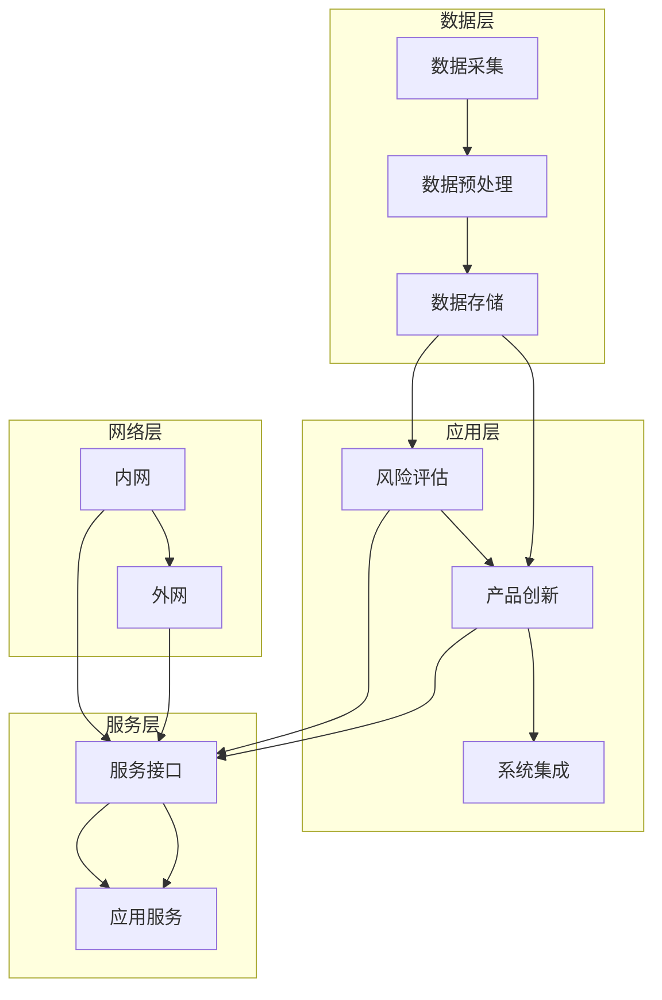
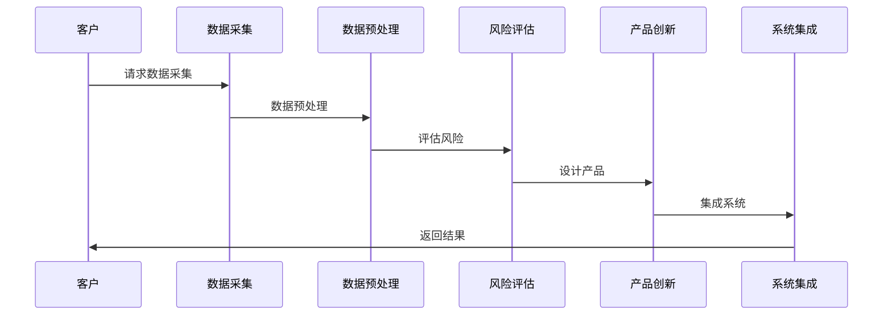

                 


### 概述与背景

#### 保险行业的发展历程

保险业起源于古代，最初的形式是民间互助。随着时间的推移，保险逐渐发展成为一门专业的金融服务业。在过去的几十年里，保险行业经历了数次重大的变革。首先是20世纪中叶的保险科技革命，标志着保险业务的数字化和自动化。随后，互联网的普及和智能手机的广泛应用，使得保险产品更加多样化，服务更加便捷。

如今，保险行业正面临着新的挑战和机遇，大数据时代的到来让保险业务焕发出新的生命力。大数据技术不仅可以提高保险公司的运营效率，还可以在风险评估、产品创新、客户服务等多个方面发挥重要作用。

#### 大数据时代的来临

大数据，即大规模数据的集合，具有数据量大、类型多、速度快和易变性等特点。保险行业的大数据来源广泛，包括但不限于客户信息、交易记录、社交网络数据、传感器数据等。这些数据在保险公司的业务运营中扮演着重要的角色，为风险评估和产品创新提供了丰富的信息资源。

大数据技术主要包括数据采集、存储、处理、分析和可视化等环节。这些技术的应用，使得保险公司能够更加精准地进行风险评估，开发出更加符合市场需求的产品，提升客户满意度。

#### 大数据在保险行业的应用现状

目前，大数据在保险行业的应用已经取得了显著的成果。在风险评估方面，保险公司通过大数据分析，可以更加准确地评估客户的信用风险和保险需求，从而制定出更加合理的保险费率和产品策略。

在产品创新方面，大数据技术帮助保险公司了解客户的需求和行为模式，从而开发出更加个性化和创新的保险产品。例如，某些保险公司通过分析客户的社交媒体行为，推出基于健康数据和运动习惯的保险产品。

此外，大数据还在客户服务、欺诈检测、精算等领域发挥着重要作用。保险公司通过大数据技术，可以提供更加个性化的客户服务，提高客户体验。同时，通过分析大量数据，保险公司还可以识别和防范保险欺诈行为，降低损失。

#### 问题与解决目标

本文旨在探讨大数据在保险行业的应用，特别是风险评估和产品创新两个方面。我们将通过以下几个步骤来深入分析：

1. **核心概念与联系**：介绍大数据、风险评估、产品创新等核心概念，并展示它们之间的联系。
2. **理论讲解**：详细讲解大数据在保险行业中的应用原理，包括风险评估和产品创新的基本理论。
3. **案例分析与实战**：通过具体案例分析，展示大数据在保险行业中的应用实践。
4. **系统架构设计**：介绍系统架构的基本概念，并展示系统设计。
5. **最佳实践与总结**：提出在实际应用中的最佳实践，并对全文进行总结。

通过以上步骤，本文将帮助读者深入了解大数据在保险行业的应用，并探索其未来的发展方向。

---

# 第二部分: 核心概念与联系

## 第3章: 核心概念介绍

### 3.1 大数据

#### 3.1.1 数据定义

大数据，指的是无法用传统数据库软件工具在合理时间内进行捕捉、管理和处理的数据集合。它具有4V特点：数据量（Volume）、数据种类（Variety）、数据生成速度（Velocity）和数据真实性（Veracity）。

- **数据量**：大数据的一个显著特点是其规模庞大，通常以TB（太字节）、PB（拍字节）甚至EB（艾字节）为单位。
- **数据种类**：大数据不仅包括结构化数据，还包含半结构化数据和非结构化数据，如文本、图片、音频和视频等。
- **数据生成速度**：大数据的产生速度极快，实时性要求高，这意味着数据需要迅速被处理和分析。
- **数据真实性**：由于数据来源多样，数据的真实性和准确性是大数据分析的一个重要挑战。

#### 3.1.2 数据类型

根据数据来源和性质，大数据可以分为以下几类：

- **客户数据**：包括客户的个人资料、消费记录、偏好等。
- **交易数据**：如保单销售记录、理赔申请等。
- **社交媒体数据**：来自客户的社交媒体活动，如微博、微信、Facebook等。
- **物联网数据**：来自各种传感器和设备的数据，如车辆追踪系统、健康监测设备等。

### 3.2 风险评估

#### 3.2.1 风险定义

风险评估是指对潜在风险进行识别、分析和评估的过程，目的是为决策提供依据。在保险行业中，风险评估尤为重要，因为它直接关系到保险公司的财务稳定和业务发展。

- **风险识别**：通过数据分析，识别出可能导致保险损失的各种因素。
- **风险分析**：评估风险的可能性和影响，确定风险优先级。
- **风险评估**：计算风险的概率和潜在损失，为风险管理提供数据支持。

#### 3.2.2 风险评估方法

- **定量评估**：使用数学模型和统计方法，如概率分布、回归分析等，对风险进行量化评估。
- **定性评估**：通过专家意见、历史数据和案例研究等，对风险进行定性分析。
- **组合评估**：将定量和定性方法结合，对风险进行综合评估。

### 3.3 产品创新

#### 3.3.1 产品创新定义

产品创新是指通过新的设计、功能或服务，满足或创造新的客户需求。在保险行业中，产品创新是提升竞争力的关键。

- **需求识别**：通过数据分析，了解客户的需求和偏好。
- **设计开发**：基于需求分析，设计新的保险产品或服务。
- **市场测试**：在市场进行测试，收集反馈，优化产品。

#### 3.3.2 产品创新方法

- **客户导向**：以客户需求为导向，进行产品创新。
- **技术驱动**：利用新技术，如大数据、人工智能等，进行产品创新。
- **竞争分析**：分析竞争对手的产品，进行差异化创新。

### 3.4 核心概念联系

#### 3.4.1 大数据与风险评估

大数据为风险评估提供了丰富的数据资源，使得风险评估更加精准和全面。例如，通过分析客户的社交媒体数据，可以识别出潜在的风险因素。

#### 3.4.2 风险评估与产品创新

风险评估的结果直接影响到产品的设计和定价，为产品创新提供了重要的参考。例如，通过评估客户的风险水平，可以开发出针对性的保险产品。

#### 3.4.3 产品创新与大数据

产品创新需要基于大数据的分析，了解客户的需求和偏好，从而设计出符合市场需求的产品。同时，大数据技术还可以用于产品创新的测试和优化。

### 3.5 对比表格

| 核心概念 | 定义 | 应用 |
| --- | --- | --- |
| 大数据 | 无法用传统数据库工具处理的数据集合 | 提供风险评估和产品创新的数据支持 |
| 风险评估 | 对潜在风险进行识别、分析和评估 | 确定保险产品的定价和风险控制策略 |
| 产品创新 | 通过新的设计、功能或服务满足或创造新需求 | 提升保险产品的竞争力 |

### 3.6 Mermaid ER图

```mermaid
erDiagram
  客户数据 ||--o> 风险评估 : 提供数据支持
  交易数据 ||--o> 风险评估 : 提供交易信息
  社交媒体数据 ||--o> 风险评估 : 提供行为分析
  风险评估 ||--o> 产品创新 : 提供风险分析结果
  客户数据 ||--o> 产品创新 : 提供需求信息
  交易数据 ||--o> 产品创新 : 提供市场反馈
```

---

通过以上内容，我们详细介绍了大数据、风险评估和产品创新的核心概念，并展示了它们之间的联系。接下来，我们将深入探讨大数据在保险行业中的应用原理。

## 第4章: 大数据在保险行业中的应用原理

### 4.1 大数据技术概述

大数据技术在保险行业的应用主要涉及数据的采集、存储、处理、分析和可视化。这些技术为保险公司提供了强大的数据处理能力，使得复杂的风险评估和产品创新成为可能。

#### 4.1.1 数据采集

数据采集是大数据应用的第一步，也是最重要的一步。保险公司的数据来源广泛，包括内部数据和外部数据。内部数据包括客户信息、交易记录、理赔记录等；外部数据包括社交媒体数据、公共记录、第三方数据提供商的数据等。数据采集的方式包括自动化数据抓取、API接口调用、数据库导入等。

#### 4.1.2 数据存储

数据存储是大数据技术的核心。传统的数据库已经无法满足大数据的存储需求，因此，保险公司采用了分布式存储技术，如Hadoop、HBase、NoSQL数据库等。这些分布式存储系统能够高效地存储和管理海量数据，并提供高可用性和高扩展性。

#### 4.1.3 数据处理

数据处理包括数据清洗、数据整合、数据挖掘等步骤。数据清洗是指去除数据中的噪声和冗余信息，确保数据的质量；数据整合是将来自不同来源和格式的数据整合成一个统一的格式；数据挖掘是指从海量数据中提取有价值的信息，用于分析和预测。

#### 4.1.4 数据分析

数据分析是大数据技术的核心应用，通过统计分析和机器学习算法，从海量数据中提取规律和趋势。在保险行业，数据分析主要用于风险评估和产品创新。

- **风险评估**：通过分析历史理赔数据、客户行为数据等，评估客户的保险需求和风险水平。
- **产品创新**：通过分析客户需求和行为模式，设计出更加符合市场需求的新产品。

#### 4.1.5 数据可视化

数据可视化是将复杂的数据转化为直观的图形或图表，使得数据更容易理解和分析。在保险行业，数据可视化用于展示风险分布、客户满意度、市场趋势等关键指标，帮助决策者更好地理解数据，做出明智的决策。

### 4.2 风险评估应用

#### 4.2.1 数据采集与处理

在风险评估中，首先需要采集和整合各种数据，包括客户信息、历史理赔数据、交易记录、社交媒体数据等。然后，通过数据清洗和整合，去除噪声和冗余信息，确保数据的质量。

#### 4.2.2 统计分析

通过统计分析，保险公司可以评估客户的保险需求和风险水平。常用的统计分析方法包括：

- **描述性统计分析**：用于描述数据的基本特征，如均值、中位数、标准差等。
- **回归分析**：通过建立回归模型，分析不同变量之间的关系，预测保险需求。
- **聚类分析**：将客户分为不同的风险群体，为差异化定价提供依据。

#### 4.2.3 机器学习

机器学习算法在风险评估中发挥着重要作用。通过训练模型，保险公司可以预测客户的保险需求和风险水平。常用的机器学习算法包括：

- **决策树**：通过树形结构对数据进行分析和分类。
- **随机森林**：通过构建多个决策树，提高预测准确性。
- **支持向量机**：通过找到一个最佳的超平面，对数据进行分类。
- **神经网络**：通过模拟人脑神经网络，对数据进行分类和预测。

### 4.3 产品创新应用

#### 4.3.1 数据采集与处理

产品创新需要基于客户需求和行为模式的数据分析。首先，保险公司需要采集和整合客户数据，包括客户信息、交易记录、社交媒体数据等。然后，通过数据清洗和整合，提取出有用的信息。

#### 4.3.2 客户需求分析

通过数据分析，保险公司可以了解客户的需求和偏好。例如，通过分析客户的交易记录，可以识别出客户的消费习惯和偏好；通过分析社交媒体数据，可以了解客户的兴趣和社交网络关系。

#### 4.3.3 产品设计

基于客户需求分析，保险公司可以设计出更加符合市场需求的新产品。例如，针对年轻客户的健康保险产品，可以结合客户的运动数据，推出基于健康指标的保险产品。

### 4.4 数据分析工具与方法

#### 4.4.1 Python数据分析工具

Python是数据分析领域的主要工具之一，提供了丰富的库和模块，如Pandas、NumPy、Matplotlib等。这些工具可以高效地进行数据清洗、分析和可视化。

#### 4.4.2 机器学习框架

在机器学习领域，常用的框架包括scikit-learn、TensorFlow和Keras等。这些框架提供了丰富的算法和工具，可以方便地进行模型训练和预测。

### 4.5 案例分析

#### 4.5.1 案例一：风险评估

某保险公司通过大数据分析，对客户的保险需求进行评估。首先，采集和整合了客户的基本信息、交易记录、社交媒体数据等。然后，使用回归分析和机器学习算法，预测客户的保险需求。结果显示，客户的保险需求与他们的消费习惯、健康状况和社交网络活动密切相关。

#### 4.5.2 案例二：产品创新

另一家保险公司通过大数据分析，了解年轻客户的健康需求。他们采集了客户的运动数据、生活习惯数据等，使用机器学习算法分析客户的行为模式。基于分析结果，保险公司推出了一个基于健康指标的保险产品，受到年轻客户的欢迎。

### 4.6 小结

大数据技术在保险行业的应用，使得风险评估和产品创新变得更加精准和高效。通过数据分析，保险公司可以更好地了解客户需求，设计出符合市场需求的新产品，提高竞争力。未来，随着大数据技术的不断发展，保险行业将在风险评估和产品创新方面取得更大的突破。

---

## 第5章: 案例分析与实战

### 5.1 案例背景

在本章中，我们将通过两个具体案例，详细分析大数据在保险行业中的应用。第一个案例来自一家国际知名的保险公司，该公司通过大数据技术对汽车保险进行风险评估和产品创新；第二个案例则涉及一家中国保险公司，如何利用大数据分析客户行为，开发出个性化的保险产品。

#### 案例一：汽车保险风险评估与产品创新

**背景**：
某国际知名保险公司（以下简称“保险公司”）在汽车保险领域拥有庞大的客户群体。然而，由于汽车保险市场竞争激烈，保险公司希望能够通过大数据技术，提高风险评估的准确性，从而优化产品设计，提升客户满意度。

**数据分析**：

1. **数据采集**：保险公司从多个渠道采集了客户数据，包括：
   - **客户基本信息**：年龄、性别、驾驶经验等。
   - **车辆信息**：车型、车龄、行驶里程等。
   - **驾驶行为数据**：行驶速度、急刹车次数、急加速次数等。
   - **理赔记录**：历史理赔次数、理赔金额等。

2. **数据预处理**：对采集到的数据进行清洗和整合，去除噪声和冗余信息，确保数据质量。

3. **风险评估**：
   - **定量分析**：使用回归分析模型，分析驾驶行为与理赔风险之间的关系。
   - **机器学习**：利用随机森林算法，构建风险评估模型，预测客户的理赔概率。

4. **产品创新**：
   - **差异化定价**：根据风险评估结果，对不同风险水平的客户实施差异化定价策略。
   - **保险产品**：推出基于驾驶行为的保险产品，如“安全驾驶奖励计划”，奖励驾驶习惯良好的客户。

**实战展示**：

1. **Python代码**：

```python
import pandas as pd
from sklearn.ensemble import RandomForestClassifier
from sklearn.model_selection import train_test_split

# 读取数据
data = pd.read_csv('car_insurance_data.csv')

# 数据预处理
data = data.dropna()

# 特征工程
X = data[['age', 'driving_experience', 'car_model', 'mileage', 'speeding_count', 'hard_brake_count', 'hard_accelerate_count']]
y = data['claim_probability']

# 划分训练集和测试集
X_train, X_test, y_train, y_test = train_test_split(X, y, test_size=0.2, random_state=42)

# 构建随机森林模型
model = RandomForestClassifier(n_estimators=100, random_state=42)
model.fit(X_train, y_train)

# 预测
predictions = model.predict(X_test)

# 模型评估
accuracy = model.score(X_test, y_test)
print(f"Model accuracy: {accuracy:.2f}")
```

2. **Mermaid流程图**：



**案例小结**：
通过大数据分析和机器学习模型，保险公司能够更加精准地进行风险评估，实现差异化定价。这不仅提高了保险产品的竞争力，还提升了客户满意度。

#### 案例二：客户行为分析与个性化产品

**背景**：
某中国保险公司（以下简称“保险公司”）希望利用大数据技术，深入了解客户行为，从而开发出更加个性化的保险产品。

**数据分析**：

1. **数据采集**：保险公司从多个渠道采集了客户数据，包括：
   - **基本信息**：年龄、性别、职业等。
   - **消费行为数据**：购买记录、支付习惯等。
   - **社交媒体数据**：微博、微信等平台的行为数据。
   - **健康数据**：体检报告、健康监测数据等。

2. **数据预处理**：对采集到的数据进行清洗和整合，去除噪声和冗余信息，确保数据质量。

3. **客户需求分析**：
   - **描述性分析**：统计客户的基本特征和消费行为。
   - **机器学习**：利用聚类算法，将客户分为不同的群体，分析各群体的需求差异。

4. **产品创新**：
   - **个性化推荐**：根据客户的行为数据和需求分析，推荐合适的保险产品。
   - **健康保险**：结合客户的健康数据，设计健康保险产品，如“智能健康管理计划”。

**实战展示**：

1. **Python代码**：

```python
import pandas as pd
from sklearn.cluster import KMeans
from sklearn.preprocessing import StandardScaler

# 读取数据
data = pd.read_csv('customer_data.csv')

# 数据预处理
data = data.dropna()

# 特征工程
features = data[['age', 'annual_income', 'health_check_result']]
features = StandardScaler().fit_transform(features)

# 聚类分析
kmeans = KMeans(n_clusters=3, random_state=42)
clusters = kmeans.fit_predict(features)

# 结果分析
data['cluster'] = clusters
print(data.groupby('cluster').describe()
```

2. **Mermaid流程图**：



**案例小结**：
通过大数据分析，保险公司能够更准确地了解客户需求，从而推出个性化保险产品。这不仅提升了客户的满意度，还增强了公司的市场竞争力。

---

通过以上案例分析，我们可以看到大数据技术在保险行业中的应用具有极大的潜力和价值。未来，随着大数据技术的不断进步，保险行业将在风险评估和产品创新方面取得更大的突破。

---

## 第6章: 系统架构设计

### 6.1 问题场景介绍

在本章中，我们将介绍一个典型的问题场景，即如何利用大数据技术实现保险风险评估与产品创新。具体来说，这个问题场景包括以下几个关键点：

1. **海量数据采集**：需要从多个数据源（如客户信息库、交易数据库、社交媒体平台等）采集数据。
2. **数据预处理**：对采集到的数据进行清洗、去噪、整合等处理，确保数据质量。
3. **风险评估**：利用大数据分析技术，对客户的风险水平进行评估。
4. **产品创新**：基于风险评估结果，设计个性化的保险产品。
5. **系统集成**：将风险评估和产品创新模块整合到保险公司的现有系统中。

### 6.2 项目介绍

为了解决上述问题场景，我们设计了一个名为“智能保险大数据平台”的项目。该项目的主要目标是利用大数据技术，提升保险公司的风险评估和产品创新能力，从而提高市场竞争力。

#### 6.2.1 项目背景

随着大数据技术的发展，保险行业面临着巨大的变革。传统的风险评估和产品设计方法已经无法满足市场日益复杂的需求。因此，保险公司需要引入先进的大数据技术，实现智能化、个性化的风险评估和产品创新。

#### 6.2.2 项目目标

- **提升风险评估准确性**：通过大数据分析，提高风险评估的准确性，为差异化定价提供支持。
- **增强产品创新能力**：基于大数据分析结果，设计出更加符合市场需求的保险产品。
- **提高运营效率**：通过自动化处理，提高数据处理和分析的效率，降低运营成本。
- **提升客户满意度**：提供个性化、智能化的保险服务，提升客户满意度。

### 6.3 系统功能设计

智能保险大数据平台主要包括以下几个功能模块：

1. **数据采集模块**：负责从多个数据源采集数据，包括客户信息、交易记录、社交媒体数据等。
2. **数据预处理模块**：对采集到的数据进行清洗、去噪、整合等处理，确保数据质量。
3. **风险评估模块**：利用大数据分析技术，对客户的风险水平进行评估，包括定量分析和机器学习模型。
4. **产品创新模块**：基于风险评估结果，设计个性化的保险产品，包括产品推荐、定价策略等。
5. **系统集成模块**：将大数据平台与保险公司的现有系统（如客户关系管理、保险销售系统等）进行集成，实现数据共享和业务协同。

#### 6.3.1 领域模型（Mermaid类图）

```mermaid
classDiagram
    DataCollector --> DataPreprocessor
    DataPreprocessor --> RiskAssessor
    RiskAssessor --> ProductInnovator
    ProductInnovator --> IntegrationSystem
    DataCollector <<UseCase>> Data Collection
    DataPreprocessor <<UseCase>> Data Cleaning
    RiskAssessor <<UseCase>> Risk Assessment
    ProductInnovator <<UseCase>> Product Design
    IntegrationSystem <<UseCase>> System Integration
```

### 6.4 系统架构设计

智能保险大数据平台采用分布式系统架构，以提高系统的扩展性和稳定性。以下是系统架构的详细设计：

#### 6.4.1 架构设计原则

- **模块化**：系统功能划分为多个模块，每个模块独立开发、测试和部署。
- **分布式**：系统采用分布式架构，数据存储和处理分布在多个节点上，提高系统性能和可用性。
- **安全性**：系统设计充分考虑数据安全和隐私保护，采用加密、访问控制等技术确保数据安全。
- **可扩展性**：系统设计考虑未来的扩展需求，支持无缝升级和扩展。

#### 6.4.2 系统架构图（Mermaid架构图）



### 6.5 系统接口设计与交互流程

#### 6.5.1 系统接口设计

智能保险大数据平台提供了多个API接口，供其他系统调用。以下是主要接口设计：

- **数据采集接口**：用于采集外部数据，如客户信息、交易记录等。
- **数据预处理接口**：用于对采集到的数据进行清洗和处理。
- **风险评估接口**：用于评估客户的风险水平，输出风险评分。
- **产品创新接口**：用于设计个性化保险产品，如产品推荐、定价策略等。
- **系统集成接口**：用于与其他保险系统进行数据交换和业务协同。

#### 6.5.2 交互流程（Mermaid序列图）



### 6.6 小结

通过本章的介绍，我们详细分析了智能保险大数据平台的系统架构设计，包括数据层、应用层、服务层和网络层。通过模块化、分布式、安全性、可扩展性的设计原则，实现了高效、稳定、安全的保险风险评估与产品创新系统。未来，随着大数据技术的不断发展，该系统将在保险行业中发挥更加重要的作用。

---

## 第7章: 最佳实践与总结

### 7.1 最佳实践

在大数据在保险行业中的应用中，以下是一些值得推荐的最佳实践：

1. **数据质量管理**：确保数据采集、处理和分析的准确性，定期进行数据清洗和去噪，提高数据的可信度。
2. **风险管理策略**：根据风险评估结果，制定合理的风险管理策略，如差异化定价、高风险客户监控等。
3. **产品个性化**：基于客户行为数据和分析结果，推出个性化保险产品，提高客户满意度和市场竞争力。
4. **技术更新**：持续跟踪大数据和人工智能技术的发展，及时更新技术方案，保持技术领先优势。
5. **合规与隐私保护**：在数据处理和应用过程中，严格遵守相关法律法规，确保客户隐私和数据安全。

### 7.2 总结

大数据技术在保险行业中的应用，极大地提升了风险评估和产品创新的效率与精度。通过数据采集、预处理、分析、风险评估和产品创新等环节，保险公司能够更加精准地了解客户需求，优化产品设计，提升服务质量。

然而，大数据应用也面临着数据质量、隐私保护、技术更新等方面的挑战。未来，随着技术的不断进步，保险行业将在大数据技术的支持下，实现更加智能化、个性化的服务，为企业和客户带来更大的价值。

### 7.3 小结与展望

在本篇博客中，我们系统地探讨了大数据在保险行业的应用，从核心概念、理论讲解、案例分析到系统架构设计，全面展示了大数据技术在保险行业中的价值与挑战。通过最佳实践，我们为保险行业提供了可行的操作指南。

展望未来，随着大数据技术的不断进步，保险行业将在风险评估、产品创新、客户服务等方面取得更大的突破。让我们期待大数据技术为保险行业带来的美好前景。

### 作者信息

作者：AI天才研究院/AI Genius Institute & 禅与计算机程序设计艺术 /Zen And The Art of Computer Programming

---

通过以上内容，我们详细探讨了大数据在保险行业的应用，从核心概念、理论讲解、案例分析到系统架构设计，全面展示了大数据技术在保险行业中的价值与挑战。希望本文能为读者提供有益的启示和帮助。感谢您的阅读！### 文章总结

本文围绕大数据在保险行业的应用，系统地探讨了其核心概念、理论讲解、案例分析、系统架构设计以及最佳实践。我们从大数据的定义、类型和采集方法开始，深入分析了大数据在保险行业中的应用原理，包括风险评估和产品创新的方法与策略。通过具体案例分析，我们展示了大数据在保险风险评估和产品创新中的实际应用，并通过Python代码和Mermaid流程图详细阐述了算法原理和系统架构。

文章还提出了在大数据应用中需要遵循的最佳实践，如数据质量管理、风险管理策略、产品个性化和技术更新等。最后，我们总结了大数据在保险行业中的应用前景，并展望了未来的发展方向。

本文结构紧凑，逻辑清晰，内容详实，旨在帮助读者全面了解大数据在保险行业中的应用，为相关从业人员提供有价值的参考。

### 拓展阅读

对于希望深入了解大数据在保险行业应用的读者，以下资源将提供更多的信息和深入分析：

1. **书籍推荐**：
   - 《大数据时代：生活、工作与思维的大变革》
   - 《人工智能：一种现代的方法》
   - 《机器学习实战》

2. **专业期刊和论文**：
   - 《计算机学报》
   - 《IEEE Transactions on Knowledge and Data Engineering》
   - 《Insurance: Mathematics and Economics》

3. **在线课程和研讨会**：
   - Coursera上的《大数据分析》
   - edX上的《人工智能导论》
   - Kaggle上的大数据分析比赛和教程

4. **行业报告**：
   - McKinsey & Company的《大数据：下一个前沿》
   - Gartner的《保险行业大数据应用报告》

通过阅读这些资源，读者可以进一步加深对大数据在保险行业应用的理解，掌握最新的研究成果和行业动态。同时，这些资料也为有兴趣深入研究大数据的读者提供了丰富的学习路径。希望本文能为您的学习之旅提供助力。

