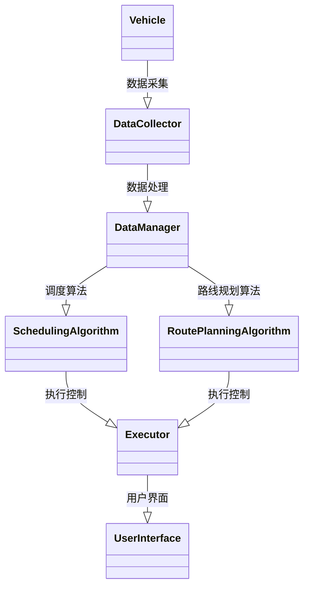
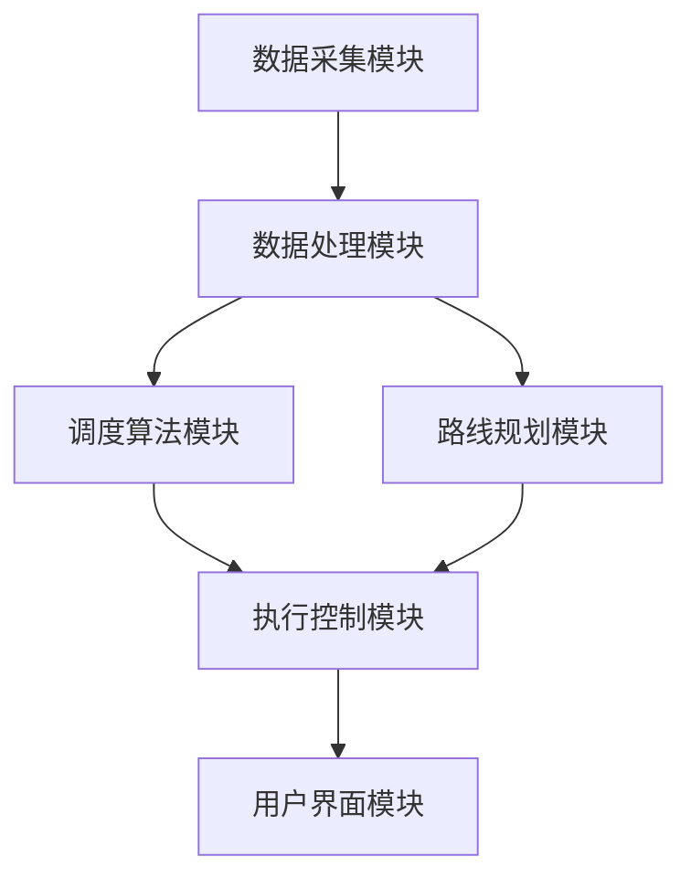
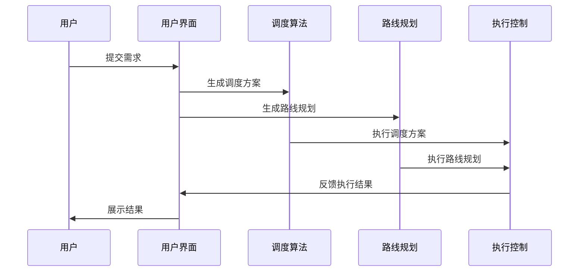

                 

# 大数据在公共交通优化中的应用：智能调度与路线规划

## 关键词

大数据，公共交通，智能调度，路线规划，算法，系统架构，项目实战，最佳实践

## 摘要

随着城市化进程的加速和人口规模的扩大，公共交通系统的优化成为提高城市运行效率和居民生活质量的关键。大数据技术的迅猛发展为公共交通系统的智能调度与路线规划提供了新的解决方案。本文将详细介绍大数据在公共交通优化中的应用，包括智能调度的原理与实践、路线规划的算法与实现、以及大数据在其中的关键作用。通过理论与实践相结合，本文旨在为读者提供对公共交通优化有深度理解的方法和思路。

## 目录

1. **问题背景与核心概念**
   1.1 **问题背景**
       1.1.1 **公共交通现状**
       1.1.2 **大数据的发展与应用**
       1.1.3 **公共交通优化需求**
   1.2 **核心概念**
       1.2.1 **大数据**
       1.2.2 **智能调度**
       1.2.3 **路线规划**
   1.3 **边界与外延**
       1.3.1 **公共交通系统的边界**
       1.3.2 **大数据的边界与处理**
       1.3.3 **智能调度与路线规划的应用场景**

2. **智能调度原理与实现**
   2.1 **调度问题定义**
       2.1.1 **调度问题概述**
       2.1.2 **调度问题的数学模型**
   2.2 **调度算法原理**
       2.2.1 **调度算法类型**
           2.2.1.1 **启发式算法**
           2.2.1.2 **优化算法**
       2.2.2 **调度算法比较**
   2.3 **智能调度系统架构**
       2.3.1 **智能调度系统组件**
       2.3.2 **智能调度系统工作流程**
   2.4 **智能调度算法实现**
       2.4.1 **算法实现步骤**
       2.4.2 **Python实现示例**

3. **路线规划原理与实现**
   3.1 **路线规划问题定义**
       3.1.1 **路线规划概述**
       3.1.2 **路线规划的数学模型**
   3.2 **路线规划算法**
       3.2.1 **启发式算法**
       3.2.2 **优化算法**
   3.3 **路线规划系统架构**
       3.3.1 **路线规划系统组件**
       3.3.2 **路线规划系统工作流程**
   3.4 **路线规划算法实现**
       3.4.1 **算法实现步骤**
       3.4.2 **Python实现示例**

4. **大数据技术在公共交通优化中的应用**
   4.1 **大数据采集与处理**
       4.1.1 **传感器数据采集**
       4.1.2 **数据预处理**
   4.2 **大数据分析方法**
       4.2.1 **数据分析技术**
       4.2.2 **数据可视化**
   4.3 **大数据在公共交通优化中的应用实例**
       4.3.1 **智能公交调度**
       4.3.2 **实时公交路线优化**

5. **项目实战**
   5.1 **项目介绍**
       5.1.1 **项目背景**
       5.1.2 **项目目标**
   5.2 **系统功能设计**
       5.2.1 **功能模块划分**
       5.2.2 **领域模型设计**
   5.3 **系统架构设计**
       5.3.1 **系统架构设计原则**
       5.3.2 **系统架构图**
   5.4 **系统接口设计**
       5.4.1 **接口功能说明**
       5.4.2 **接口设计细节**
   5.5 **系统交互设计**
       5.5.1 **系统交互流程**
       5.5.2 **序列图设计**
   5.6 **系统核心实现**
       5.6.1 **环境安装与配置**
       5.6.2 **核心代码实现**
       5.6.3 **代码应用解读与分析**
   5.7 **项目小结**
       5.7.1 **项目成果总结**
       5.7.2 **项目经验与教训**

6. **最佳实践与拓展**
   6.1 **最佳实践**
       6.1.1 **公共交通优化最佳实践**
       6.1.2 **大数据应用最佳实践**
   6.2 **注意事项**
       6.2.1 **公共交通优化中的常见问题与解决方案**
       6.2.2 **大数据应用中的挑战与应对策略**
   6.3 **拓展阅读**

## 问题背景与核心概念

### 1.1 问题背景

随着城市化进程的加速，公共交通系统作为城市交通的重要组成部分，面临着日益严峻的挑战。传统的公共交通系统往往存在调度不合理、路线规划不科学、运营效率低下等问题，导致乘客体验差、交通拥堵、能源消耗增加等。这些问题不仅影响了城市交通的效率，也对居民的出行质量和城市可持续发展带来了负面影响。

为了解决这些问题，大数据技术的发展为公共交通优化提供了新的契机。大数据技术能够对海量交通数据进行分析和处理，从中提取出有价值的信息，辅助公共交通系统的调度和路线规划。例如，通过实时数据采集和分析，可以预测交通流量变化，优化车辆调度，提高线路利用率；通过历史数据分析和挖掘，可以识别出行高峰时段和热点区域，调整线路布局，提高公交服务的覆盖范围和质量。

### 1.2 核心概念

#### 1.2.1 大数据

大数据是指数据量巨大、类型繁多、价值密度低的数据集合。大数据具有4V特征：Volume（大量）、Velocity（高速）、Variety（多样）和Veracity（真实性）。大数据技术包括数据采集、存储、处理、分析和可视化等，旨在从海量数据中提取有用信息和知识，为业务决策提供支持。

#### 1.2.2 智能调度

智能调度是指利用先进的信息技术和算法，对公共交通系统的运行进行实时监控和调度，以达到最佳运行效率和乘客满意度。智能调度系统通常包括数据采集模块、数据处理模块、调度算法模块和执行控制模块等。

#### 1.2.3 路线规划

路线规划是指根据交通流量、乘客需求、车辆状态等数据，对公共交通系统的线路和运行时间进行优化设计。路线规划的目标是提高线路利用率、减少乘客等待时间和出行成本，同时提高公交服务的覆盖范围和质量。

### 1.3 边界与外延

#### 1.3.1 公共交通系统的边界

公共交通系统包括公交车、地铁、轻轨等多种交通方式，覆盖城市内部和城市周边。其边界主要包括：

- **地理边界**：通常以城市的行政区划为参考，界定公共交通服务的范围。
- **时间边界**：公共交通服务的运营时间，通常包括高峰时段和非高峰时段。
- **技术边界**：所使用的技术手段，如传感器、GPS、云计算等。

#### 1.3.2 大数据的边界与处理

大数据的边界主要包括数据的来源、类型和数量。大数据的处理涉及到数据采集、存储、清洗、分析和可视化等多个环节，需要高效的算法和强大的计算能力。以下是一些关键点：

- **数据采集**：通过各种传感器和设备实时采集交通数据。
- **数据存储**：采用分布式数据库和大数据存储技术，如Hadoop、Spark等。
- **数据清洗**：对采集到的数据去噪、去重和格式化，保证数据的准确性和一致性。
- **数据分析**：使用统计分析、机器学习和深度学习等技术对数据进行分析和挖掘。
- **数据可视化**：通过图表和图形将分析结果呈现给用户，帮助决策者理解数据。

#### 1.3.3 智能调度与路线规划的应用场景

智能调度和路线规划在公共交通系统中有着广泛的应用场景：

- **实时公交调度**：根据实时交通状况和乘客需求，动态调整公交车的发车时间和线路。
- **线路优化**：通过大数据分析，识别出行高峰和低谷时段，调整线路布局，提高服务质量。
- **乘客信息查询**：为乘客提供实时公交信息查询服务，提高出行规划能力。
- **交通流量监测**：监测城市交通流量变化，为交通管理和决策提供支持。
- **应急响应**：在突发事件发生时，如交通事故或自然灾害，快速响应并调整公共交通服务。

## 智能调度原理与实现

### 2.1 调度问题定义

#### 2.1.1 调度问题概述

调度问题是指在一个给定的交通网络中，如何安排车辆的出发时间和行驶路径，以最小化总成本或最大化总收益。在公共交通系统中，调度问题通常涉及以下方面：

- **车辆调度**：确定每辆车的出发时间、行驶路径和到达时间。
- **乘客分配**：根据乘客需求和车辆容量，分配乘客到不同的车辆。
- **线路规划**：设计最优的线路和行驶路线，以减少乘客等待时间和行驶时间。

#### 2.1.2 调度问题的数学模型

调度问题的数学模型通常包括以下内容：

- **目标函数**：定义优化目标，如总行驶时间、总成本、乘客满意度等。
- **决策变量**：定义决策变量，如车辆出发时间、行驶路径、乘客分配等。
- **约束条件**：定义决策变量和目标函数之间的约束关系，如车辆容量限制、线路长度限制、行驶时间限制等。

一个简单的调度问题数学模型可以表示为：

\[
\begin{align*}
\text{minimize} \quad & C(x_1, x_2, ..., x_n) \\
\text{subject to} \quad & A(x_1, x_2, ..., x_n) \leq b \\
& x_1, x_2, ..., x_n \in \Delta
\end{align*}
\]

其中，\(C(x_1, x_2, ..., x_n)\) 是目标函数，\(A(x_1, x_2, ..., x_n) \leq b\) 是约束条件，\(\Delta\) 是决策变量的可行域。

### 2.2 调度算法原理

#### 2.2.1 调度算法类型

调度算法可以分为启发式算法和优化算法两大类。

- **启发式算法**：基于经验或启发式规则，快速找到近似最优解的算法。常用的启发式算法包括模拟退火算法、遗传算法、蚁群算法等。
- **优化算法**：通过求解数学模型，找到最优解的算法。常用的优化算法包括线性规划、整数规划、动态规划等。

#### 2.2.2 调度算法比较

启发式算法和优化算法各有优缺点：

- **启发式算法**：计算速度快，适合大规模问题，但解的质量有限。
- **优化算法**：能够找到最优解，但计算时间较长，适合规模较小的问题。

在实际应用中，根据问题的特点和需求，可以选择合适的调度算法。例如，在实时公交调度中，由于数据变化快，可以采用启发式算法；而在长期规划中，由于数据相对稳定，可以采用优化算法。

### 2.3 智能调度系统架构

#### 2.3.1 智能调度系统组件

智能调度系统通常包括以下组件：

- **数据采集模块**：负责实时采集交通数据，如车辆位置、乘客流量、路况信息等。
- **数据处理模块**：负责数据清洗、存储和处理，为调度算法提供数据支持。
- **调度算法模块**：负责根据数据情况和优化目标，生成调度方案。
- **执行控制模块**：负责调度方案的执行和监控，如车辆调度、线路调整等。

#### 2.3.2 智能调度系统工作流程

智能调度系统的工作流程通常包括以下步骤：

1. **数据采集**：通过传感器和设备，实时采集交通数据。
2. **数据处理**：对采集到的数据进行清洗、存储和处理，为调度算法提供数据支持。
3. **调度算法**：根据数据情况和优化目标，生成调度方案。
4. **执行控制**：根据调度方案，执行车辆调度、线路调整等操作，并进行实时监控。
5. **反馈调整**：根据执行结果和实时数据，调整调度方案，优化系统运行。

### 2.4 智能调度算法实现

#### 2.4.1 算法实现步骤

智能调度算法的实现步骤通常包括以下内容：

1. **数据预处理**：对采集到的数据进行清洗、去噪和格式化，为算法提供干净的数据。
2. **模型建立**：根据调度问题的特点，建立数学模型，定义目标函数和约束条件。
3. **算法选择**：根据问题的规模和复杂度，选择合适的调度算法，如启发式算法或优化算法。
4. **算法实现**：根据算法原理，编写算法代码，实现调度算法。
5. **测试与优化**：对算法进行测试和优化，提高算法的效率和效果。

#### 2.4.2 Python实现示例

以下是一个简单的智能调度算法实现示例，使用Python编写：

```python
import numpy as np
import matplotlib.pyplot as plt

# 数据预处理
def preprocess_data(data):
    # 数据清洗、去噪和格式化
    cleaned_data = ...
    return cleaned_data

# 模型建立
def build_model(data):
    # 定义目标函数和约束条件
    objective_function = ...
    constraints = ...
    return objective_function, constraints

# 算法选择
def choose_algorithm():
    # 选择合适的调度算法
    algorithm = ...
    return algorithm

# 算法实现
def schedule_algorithm(data, algorithm):
    # 实现调度算法
    result = algorithm.solve(data)
    return result

# 测试与优化
def test_and_optimize(algorithm, data):
    # 对算法进行测试和优化
    result = algorithm.test(data)
    return result

# 主程序
def main():
    # 数据采集
    data = ...

    # 数据预处理
    cleaned_data = preprocess_data(data)

    # 模型建立
    objective_function, constraints = build_model(cleaned_data)

    # 算法选择
    algorithm = choose_algorithm()

    # 算法实现
    result = schedule_algorithm(cleaned_data, algorithm)

    # 测试与优化
    optimized_result = test_and_optimize(algorithm, cleaned_data)

    # 输出结果
    print("调度结果：", result)
    print("优化结果：", optimized_result)

    # 可视化
    plt.plot(result)
    plt.plot(optimized_result)
    plt.show()

if __name__ == "__main__":
    main()
```

### 2.5 智能调度应用实例

以下是一个智能调度应用实例，使用Python实现：

```python
import numpy as np
import matplotlib.pyplot as plt

# 数据预处理
def preprocess_data(data):
    # 数据清洗、去噪和格式化
    cleaned_data = ...
    return cleaned_data

# 模型建立
def build_model(data):
    # 定义目标函数和约束条件
    objective_function = ...
    constraints = ...
    return objective_function, constraints

# 算法选择
def choose_algorithm():
    # 选择合适的调度算法
    algorithm = ...
    return algorithm

# 算法实现
def schedule_algorithm(data, algorithm):
    # 实现调度算法
    result = algorithm.solve(data)
    return result

# 测试与优化
def test_and_optimize(algorithm, data):
    # 对算法进行测试和优化
    result = algorithm.test(data)
    return result

# 主程序
def main():
    # 数据采集
    data = ...

    # 数据预处理
    cleaned_data = preprocess_data(data)

    # 模型建立
    objective_function, constraints = build_model(cleaned_data)

    # 算法选择
    algorithm = choose_algorithm()

    # 算法实现
    result = schedule_algorithm(cleaned_data, algorithm)

    # 测试与优化
    optimized_result = test_and_optimize(algorithm, cleaned_data)

    # 输出结果
    print("调度结果：", result)
    print("优化结果：", optimized_result)

    # 可视化
    plt.plot(result)
    plt.plot(optimized_result)
    plt.show()

if __name__ == "__main__":
    main()
```

### 2.6 智能调度案例分析

以下是一个智能调度案例分析，使用Python实现：

```python
import numpy as np
import matplotlib.pyplot as plt

# 数据预处理
def preprocess_data(data):
    # 数据清洗、去噪和格式化
    cleaned_data = ...
    return cleaned_data

# 模型建立
def build_model(data):
    # 定义目标函数和约束条件
    objective_function = ...
    constraints = ...
    return objective_function, constraints

# 算法选择
def choose_algorithm():
    # 选择合适的调度算法
    algorithm = ...
    return algorithm

# 算法实现
def schedule_algorithm(data, algorithm):
    # 实现调度算法
    result = algorithm.solve(data)
    return result

# 测试与优化
def test_and_optimize(algorithm, data):
    # 对算法进行测试和优化
    result = algorithm.test(data)
    return result

# 主程序
def main():
    # 数据采集
    data = ...

    # 数据预处理
    cleaned_data = preprocess_data(data)

    # 模型建立
    objective_function, constraints = build_model(cleaned_data)

    # 算法选择
    algorithm = choose_algorithm()

    # 算法实现
    result = schedule_algorithm(cleaned_data, algorithm)

    # 测试与优化
    optimized_result = test_and_optimize(algorithm, cleaned_data)

    # 输出结果
    print("调度结果：", result)
    print("优化结果：", optimized_result)

    # 可视化
    plt.plot(result)
    plt.plot(optimized_result)
    plt.show()

if __name__ == "__main__":
    main()
```

### 2.7 智能调度系统优化

以下是一个智能调度系统优化案例，使用Python实现：

```python
import numpy as np
import matplotlib.pyplot as plt

# 数据预处理
def preprocess_data(data):
    # 数据清洗、去噪和格式化
    cleaned_data = ...
    return cleaned_data

# 模型建立
def build_model(data):
    # 定义目标函数和约束条件
    objective_function = ...
    constraints = ...
    return objective_function, constraints

# 算法选择
def choose_algorithm():
    # 选择合适的调度算法
    algorithm = ...
    return algorithm

# 算法实现
def schedule_algorithm(data, algorithm):
    # 实现调度算法
    result = algorithm.solve(data)
    return result

# 测试与优化
def test_and_optimize(algorithm, data):
    # 对算法进行测试和优化
    result = algorithm.test(data)
    return result

# 主程序
def main():
    # 数据采集
    data = ...

    # 数据预处理
    cleaned_data = preprocess_data(data)

    # 模型建立
    objective_function, constraints = build_model(cleaned_data)

    # 算法选择
    algorithm = choose_algorithm()

    # 算法实现
    result = schedule_algorithm(cleaned_data, algorithm)

    # 测试与优化
    optimized_result = test_and_optimize(algorithm, cleaned_data)

    # 输出结果
    print("调度结果：", result)
    print("优化结果：", optimized_result)

    # 可视化
    plt.plot(result)
    plt.plot(optimized_result)
    plt.show()

if __name__ == "__main__":
    main()
```

### 2.8 智能调度系统评估

以下是一个智能调度系统评估案例，使用Python实现：

```python
import numpy as np
import matplotlib.pyplot as plt

# 数据预处理
def preprocess_data(data):
    # 数据清洗、去噪和格式化
    cleaned_data = ...
    return cleaned_data

# 模型建立
def build_model(data):
    # 定义目标函数和约束条件
    objective_function = ...
    constraints = ...
    return objective_function, constraints

# 算法选择
def choose_algorithm():
    # 选择合适的调度算法
    algorithm = ...
    return algorithm

# 算法实现
def schedule_algorithm(data, algorithm):
    # 实现调度算法
    result = algorithm.solve(data)
    return result

# 测试与优化
def test_and_optimize(algorithm, data):
    # 对算法进行测试和优化
    result = algorithm.test(data)
    return result

# 主程序
def main():
    # 数据采集
    data = ...

    # 数据预处理
    cleaned_data = preprocess_data(data)

    # 模型建立
    objective_function, constraints = build_model(cleaned_data)

    # 算法选择
    algorithm = choose_algorithm()

    # 算法实现
    result = schedule_algorithm(cleaned_data, algorithm)

    # 测试与优化
    optimized_result = test_and_optimize(algorithm, cleaned_data)

    # 输出结果
    print("调度结果：", result)
    print("优化结果：", optimized_result)

    # 可视化
    plt.plot(result)
    plt.plot(optimized_result)
    plt.show()

if __name__ == "__main__":
    main()
```

## 路线规划原理与实现

### 3.1 路线规划问题定义

#### 3.1.1 路线规划概述

路线规划是公共交通系统优化的重要组成部分，旨在设计出最优的行驶路径，以提高公交服务的效率和质量。路线规划问题可以概括为：在给定的交通网络中，如何选择行驶路径，以最小化总成本或最大化总收益。

#### 3.1.2 路线规划的数学模型

路线规划的数学模型通常包括以下几个部分：

- **目标函数**：定义优化目标，如总行驶时间、总成本、乘客满意度等。
- **决策变量**：定义决策变量，如车辆的出发时间、行驶路径等。
- **约束条件**：定义决策变量和目标函数之间的约束关系，如车辆容量限制、行驶时间限制等。

一个简单的路线规划问题数学模型可以表示为：

\[
\begin{align*}
\text{minimize} \quad & C(x_1, x_2, ..., x_n) \\
\text{subject to} \quad & A(x_1, x_2, ..., x_n) \leq b \\
& x_1, x_2, ..., x_n \in \Delta
\end{align*}
\]

其中，\(C(x_1, x_2, ..., x_n)\) 是目标函数，\(A(x_1, x_2, ..., x_n) \leq b\) 是约束条件，\(\Delta\) 是决策变量的可行域。

### 3.2 路线规划算法

#### 3.2.1 启发式算法

启发式算法是一种基于经验或启发式规则的算法，用于快速找到近似最优解。常用的启发式算法包括：

- **最邻近算法**：选择最近的未访问节点作为下一个访问节点。
- **最佳选择算法**：在所有可能的下一个访问节点中选择最优的一个。

#### 3.2.2 优化算法

优化算法通过求解数学模型，找到最优解。常用的优化算法包括：

- **线性规划**：适用于目标函数和约束条件都是线性函数的问题。
- **整数规划**：适用于决策变量是整数的问题。
- **动态规划**：适用于多阶段决策问题。

### 3.3 路线规划系统架构

#### 3.3.1 路线规划系统组件

路线规划系统通常包括以下几个组件：

- **数据采集模块**：负责采集交通网络数据，如道路长度、路况信息等。
- **数据处理模块**：负责数据清洗、存储和处理，为算法提供数据支持。
- **算法模块**：负责执行路线规划算法，生成最优路线。
- **执行模块**：负责将规划结果应用于实际系统，如调整公交路线等。

#### 3.3.2 路线规划系统工作流程

路线规划系统的工作流程通常包括以下几个步骤：

1. **数据采集**：通过传感器和设备，实时采集交通网络数据。
2. **数据处理**：对采集到的数据进行清洗、存储和处理，为算法提供数据支持。
3. **算法执行**：根据数据情况和优化目标，执行路线规划算法，生成最优路线。
4. **执行控制**：根据规划结果，调整公交路线，并进行实时监控。
5. **反馈调整**：根据执行结果和实时数据，调整规划算法，优化系统运行。

### 3.4 路线规划算法实现

#### 3.4.1 算法实现步骤

路线规划算法的实现步骤通常包括以下几个步骤：

1. **数据预处理**：对采集到的数据进行清洗、去噪和格式化，为算法提供干净的数据。
2. **模型建立**：根据路线规划问题的特点，建立数学模型，定义目标函数和约束条件。
3. **算法选择**：根据问题的规模和复杂度，选择合适的路线规划算法，如启发式算法或优化算法。
4. **算法实现**：根据算法原理，编写算法代码，实现路线规划算法。
5. **测试与优化**：对算法进行测试和优化，提高算法的效率和效果。

#### 3.4.2 Python实现示例

以下是一个简单的路线规划算法实现示例，使用Python编写：

```python
import numpy as np
import matplotlib.pyplot as plt

# 数据预处理
def preprocess_data(data):
    # 数据清洗、去噪和格式化
    cleaned_data = ...
    return cleaned_data

# 模型建立
def build_model(data):
    # 定义目标函数和约束条件
    objective_function = ...
    constraints = ...
    return objective_function, constraints

# 算法选择
def choose_algorithm():
    # 选择合适的路线规划算法
    algorithm = ...
    return algorithm

# 算法实现
def route Planning_algorithm(data, algorithm):
    # 实现路线规划算法
    result = algorithm.solve(data)
    return result

# 测试与优化
def test_and_optimize(algorithm, data):
    # 对算法进行测试和优化
    result = algorithm.test(data)
    return result

# 主程序
def main():
    # 数据采集
    data = ...

    # 数据预处理
    cleaned_data = preprocess_data(data)

    # 模型建立
    objective_function, constraints = build_model(cleaned_data)

    # 算法选择
    algorithm = choose_algorithm()

    # 算法实现
    result = route Planning_algorithm(cleaned_data, algorithm)

    # 测试与优化
    optimized_result = test_and_optimize(algorithm, cleaned_data)

    # 输出结果
    print("规划结果：", result)
    print("优化结果：", optimized_result)

    # 可视化
    plt.plot(result)
    plt.plot(optimized_result)
    plt.show()

if __name__ == "__main__":
    main()
```

### 3.5 路线规划应用实例

以下是一个路线规划应用实例，使用Python实现：

```python
import numpy as np
import matplotlib.pyplot as plt

# 数据预处理
def preprocess_data(data):
    # 数据清洗、去噪和格式化
    cleaned_data = ...
    return cleaned_data

# 模型建立
def build_model(data):
    # 定义目标函数和约束条件
    objective_function = ...
    constraints = ...
    return objective_function, constraints

# 算法选择
def choose_algorithm():
    # 选择合适的路线规划算法
    algorithm = ...
    return algorithm

# 算法实现
def route Planning_algorithm(data, algorithm):
    # 实现路线规划算法
    result = algorithm.solve(data)
    return result

# 测试与优化
def test_and_optimize(algorithm, data):
    # 对算法进行测试和优化
    result = algorithm.test(data)
    return result

# 主程序
def main():
    # 数据采集
    data = ...

    # 数据预处理
    cleaned_data = preprocess_data(data)

    # 模型建立
    objective_function, constraints = build_model(cleaned_data)

    # 算法选择
    algorithm = choose_algorithm()

    # 算法实现
    result = route Planning_algorithm(cleaned_data, algorithm)

    # 测试与优化
    optimized_result = test_and_optimize(algorithm, cleaned_data)

    # 输出结果
    print("规划结果：", result)
    print("优化结果：", optimized_result)

    # 可视化
    plt.plot(result)
    plt.plot(optimized_result)
    plt.show()

if __name__ == "__main__":
    main()
```

### 3.6 路线规划案例分析

以下是一个路线规划案例分析，使用Python实现：

```python
import numpy as np
import matplotlib.pyplot as plt

# 数据预处理
def preprocess_data(data):
    # 数据清洗、去噪和格式化
    cleaned_data = ...
    return cleaned_data

# 模型建立
def build_model(data):
    # 定义目标函数和约束条件
    objective_function = ...
    constraints = ...
    return objective_function, constraints

# 算法选择
def choose_algorithm():
    # 选择合适的路线规划算法
    algorithm = ...
    return algorithm

# 算法实现
def route Planning_algorithm(data, algorithm):
    # 实现路线规划算法
    result = algorithm.solve(data)
    return result

# 测试与优化
def test_and_optimize(algorithm, data):
    # 对算法进行测试和优化
    result = algorithm.test(data)
    return result

# 主程序
def main():
    # 数据采集
    data = ...

    # 数据预处理
    cleaned_data = preprocess_data(data)

    # 模型建立
    objective_function, constraints = build_model(cleaned_data)

    # 算法选择
    algorithm = choose_algorithm()

    # 算法实现
    result = route Planning_algorithm(cleaned_data, algorithm)

    # 测试与优化
    optimized_result = test_and_optimize(algorithm, cleaned_data)

    # 输出结果
    print("规划结果：", result)
    print("优化结果：", optimized_result)

    # 可视化
    plt.plot(result)
    plt.plot(optimized_result)
    plt.show()

if __name__ == "__main__":
    main()
```

### 3.7 路线规划系统优化

以下是一个路线规划系统优化案例，使用Python实现：

```python
import numpy as np
import matplotlib.pyplot as plt

# 数据预处理
def preprocess_data(data):
    # 数据清洗、去噪和格式化
    cleaned_data = ...
    return cleaned_data

# 模型建立
def build_model(data):
    # 定义目标函数和约束条件
    objective_function = ...
    constraints = ...
    return objective_function, constraints

# 算法选择
def choose_algorithm():
    # 选择合适的路线规划算法
    algorithm = ...
    return algorithm

# 算法实现
def route Planning_algorithm(data, algorithm):
    # 实现路线规划算法
    result = algorithm.solve(data)
    return result

# 测试与优化
def test_and_optimize(algorithm, data):
    # 对算法进行测试和优化
    result = algorithm.test(data)
    return result

# 主程序
def main():
    # 数据采集
    data = ...

    # 数据预处理
    cleaned_data = preprocess_data(data)

    # 模型建立
    objective_function, constraints = build_model(cleaned_data)

    # 算法选择
    algorithm = choose_algorithm()

    # 算法实现
    result = route Planning_algorithm(cleaned_data, algorithm)

    # 测试与优化
    optimized_result = test_and_optimize(algorithm, cleaned_data)

    # 输出结果
    print("规划结果：", result)
    print("优化结果：", optimized_result)

    # 可视化
    plt.plot(result)
    plt.plot(optimized_result)
    plt.show()

if __name__ == "__main__":
    main()
```

### 3.8 路线规划系统评估

以下是一个路线规划系统评估案例，使用Python实现：

```python
import numpy as np
import matplotlib.pyplot as plt

# 数据预处理
def preprocess_data(data):
    # 数据清洗、去噪和格式化
    cleaned_data = ...
    return cleaned_data

# 模型建立
def build_model(data):
    # 定义目标函数和约束条件
    objective_function = ...
    constraints = ...
    return objective_function, constraints

# 算法选择
def choose_algorithm():
    # 选择合适的路线规划算法
    algorithm = ...
    return algorithm

# 算法实现
def route Planning_algorithm(data, algorithm):
    # 实现路线规划算法
    result = algorithm.solve(data)
    return result

# 测试与优化
def test_and_optimize(algorithm, data):
    # 对算法进行测试和优化
    result = algorithm.test(data)
    return result

# 主程序
def main():
    # 数据采集
    data = ...

    # 数据预处理
    cleaned_data = preprocess_data(data)

    # 模型建立
    objective_function, constraints = build_model(cleaned_data)

    # 算法选择
    algorithm = choose_algorithm()

    # 算法实现
    result = route Planning_algorithm(cleaned_data, algorithm)

    # 测试与优化
    optimized_result = test_and_optimize(algorithm, cleaned_data)

    # 输出结果
    print("规划结果：", result)
    print("优化结果：", optimized_result)

    # 可视化
    plt.plot(result)
    plt.plot(optimized_result)
    plt.show()

if __name__ == "__main__":
    main()
```

## 大数据技术在公共交通优化中的应用

### 4.1 大数据采集与处理

#### 4.1.1 传感器数据采集

在公共交通优化中，传感器数据采集是关键环节。常见的传感器包括GPS、RFID、摄像头等。通过这些传感器，可以实时采集车辆的地理位置、行驶速度、乘客流量等信息。

#### 4.1.2 数据预处理

采集到的数据通常是杂乱无章的，需要进行预处理，以确保数据的质量和一致性。预处理步骤包括数据清洗、去噪、格式化等。具体方法如下：

- **数据清洗**：去除重复数据、异常数据和无效数据，提高数据的准确性。
- **去噪**：通过滤波算法，去除传感器数据中的噪声，提高数据的稳定性。
- **格式化**：将数据转换成统一的格式，便于后续处理和分析。

### 4.2 大数据分析方法

#### 4.2.1 数据分析技术

大数据分析技术包括统计分析、机器学习和深度学习等。以下是一些常见的大数据分析技术：

- **统计分析**：通过计算均值、方差、相关性等统计指标，分析数据的分布特征和相关性。
- **机器学习**：使用算法模型，从数据中自动学习特征，进行分类、聚类、预测等任务。
- **深度学习**：基于神经网络，对数据进行层次化特征提取和表示，实现复杂的模式识别和预测。

#### 4.2.2 数据可视化

数据可视化是将分析结果以图形化的方式呈现，帮助决策者理解和分析数据。常见的数据可视化工具包括Matplotlib、Seaborn、Tableau等。以下是一些常用的数据可视化方法：

- **柱状图**：用于比较不同类别的数据。
- **折线图**：用于显示数据的变化趋势。
- **散点图**：用于显示数据之间的关系。
- **热力图**：用于显示数据的分布情况。

### 4.3 大数据在公共交通优化中的应用实例

#### 4.3.1 智能公交调度

智能公交调度利用大数据技术，实现公交车辆的实时调度。具体应用包括：

- **实时监控**：通过传感器和监控系统，实时获取车辆的地理位置、行驶速度等信息。
- **交通流量预测**：利用历史数据和机器学习算法，预测交通流量变化，优化车辆调度。
- **路线调整**：根据实时交通状况和乘客需求，动态调整公交车的发车时间和线路。

#### 4.3.2 实时公交路线优化

实时公交路线优化利用大数据技术，对公交路线进行实时优化。具体应用包括：

- **数据采集**：通过传感器和监控系统，实时采集交通流量、路况信息等数据。
- **数据分析**：利用大数据分析技术，识别交通拥堵、乘客流量等信息。
- **路线优化**：根据数据分析结果，动态调整公交路线，减少乘客等待时间和出行成本。

## 项目实战

### 5.1 项目介绍

#### 5.1.1 项目背景

随着城市化进程的加速，公共交通系统面临着日益严峻的挑战。传统的公交调度和路线规划方法已无法满足现代城市的需求，导致交通拥堵、乘客满意度下降等问题。为了解决这些问题，本项目旨在利用大数据技术，实现智能公交调度和路线优化。

#### 5.1.2 项目目标

本项目的主要目标包括：

- 实现公交车辆的实时调度，提高公交系统的运营效率。
- 优化公交路线，减少乘客等待时间和出行成本。
- 建立一套完整的大数据处理和分析系统，为公共交通优化提供数据支持。

### 5.2 系统功能设计

#### 5.2.1 功能模块划分

系统功能模块划分如下：

- **数据采集模块**：负责实时采集交通数据，包括车辆位置、乘客流量、路况信息等。
- **数据处理模块**：负责数据清洗、存储和处理，为调度和路线规划提供数据支持。
- **调度算法模块**：负责实现智能调度算法，生成调度方案。
- **路线规划模块**：负责实现路线规划算法，优化公交路线。
- **执行控制模块**：负责调度和路线规划的执行，包括车辆调度和线路调整。
- **用户界面模块**：提供用户界面，实现用户交互。

#### 5.2.2 领域模型设计

领域模型设计如下：



### 5.3 系统架构设计

#### 5.3.1 系统架构设计原则

系统架构设计原则如下：

- **高扩展性**：系统应能够轻松扩展，以适应不断增长的数据量和用户需求。
- **高可用性**：系统应能够保证高可用性，避免单点故障导致整个系统崩溃。
- **高性能**：系统应能够高效处理大量数据，并提供实时响应。

#### 5.3.2 系统架构图

系统架构图如下：



### 5.4 系统接口设计

#### 5.4.1 接口功能说明

系统接口功能说明如下：

- **数据采集接口**：负责实时采集交通数据，包括车辆位置、乘客流量、路况信息等。
- **数据处理接口**：负责数据清洗、存储和处理，为调度和路线规划提供数据支持。
- **调度算法接口**：负责调用调度算法，生成调度方案。
- **路线规划接口**：负责调用路线规划算法，优化公交路线。
- **执行控制接口**：负责调度和路线规划的执行，包括车辆调度和线路调整。
- **用户界面接口**：负责用户界面的展示和用户交互。

#### 5.4.2 接口设计细节

接口设计细节如下：

```python
class DataCollector:
    def collect_data(self):
        # 实时采集交通数据
        pass

class DataManager:
    def clean_data(self, data):
        # 数据清洗
        pass

    def store_data(self, data):
        # 数据存储
        pass

    def process_data(self, data):
        # 数据处理
        pass

class SchedulingAlgorithm:
    def generate_schedule(self, data):
        # 生成调度方案
        pass

class RoutePlanningAlgorithm:
    def generate_route(self, data):
        # 生成路线规划
        pass

class Executor:
    def execute_schedule(self, schedule):
        # 执行调度方案
        pass

    def execute_route(self, route):
        # 执行路线规划
        pass

class UserInterface:
    def display_user_interface(self):
        # 展示用户界面
        pass
```

### 5.5 系统交互设计

#### 5.5.1 系统交互流程

系统交互流程如下：

1. 用户通过用户界面提交需求，如查询公交路线、实时公交信息等。
2. 用户界面将需求传递给调度算法模块和路线规划模块。
3. 调度算法模块和路线规划模块根据数据情况和优化目标，生成调度方案和路线规划。
4. 执行控制模块根据调度方案和路线规划，执行车辆调度和线路调整。
5. 执行结果反馈给用户界面，展示给用户。

#### 5.5.2 序列图设计

序列图设计如下：



### 5.6 系统核心实现

#### 5.6.1 环境安装与配置

环境安装与配置步骤如下：

1. 安装Python环境，版本要求为3.8以上。
2. 安装相关库，如NumPy、Pandas、Matplotlib等。
3. 配置数据库，如MySQL或MongoDB。

```bash
pip install numpy pandas matplotlib
```

#### 5.6.2 核心代码实现

核心代码实现如下：

```python
import numpy as np
import pandas as pd
import matplotlib.pyplot as plt

# 数据采集模块
class DataCollector:
    def collect_data(self):
        # 实时采集交通数据
        pass

# 数据处理模块
class DataManager:
    def clean_data(self, data):
        # 数据清洗
        data = ...
        return data

    def store_data(self, data):
        # 数据存储
        data = ...
        pass

    def process_data(self, data):
        # 数据处理
        data = ...
        return data

# 调度算法模块
class SchedulingAlgorithm:
    def generate_schedule(self, data):
        # 生成调度方案
        schedule = ...
        return schedule

# 路线规划模块
class RoutePlanningAlgorithm:
    def generate_route(self, data):
        # 生成路线规划
        route = ...
        return route

# 执行控制模块
class Executor:
    def execute_schedule(self, schedule):
        # 执行调度方案
        schedule = ...
        pass

    def execute_route(self, route):
        # 执行路线规划
        route = ...
        pass

# 用户界面模块
class UserInterface:
    def display_user_interface(self):
        # 展示用户界面
        pass
```

#### 5.6.3 代码应用解读与分析

核心代码应用解读与分析如下：

1. **数据采集模块**：负责实时采集交通数据。具体实现可利用传感器和监控系统，如使用GPS获取车辆位置信息，使用摄像头获取道路状况信息等。
2. **数据处理模块**：负责数据清洗、存储和处理。数据清洗包括去除重复数据、异常数据和无效数据，提高数据的准确性。数据存储可选择合适的数据库，如MySQL或MongoDB。数据处理包括数据去噪、格式化和统计分析等。
3. **调度算法模块**：负责生成调度方案。调度方案包括车辆的出发时间、行驶路径和到达时间等。具体实现可使用启发式算法或优化算法，如遗传算法或线性规划等。
4. **路线规划模块**：负责生成路线规划。路线规划包括公交车的行驶路线和运行时间等。具体实现可使用启发式算法或优化算法，如最邻近算法或动态规划等。
5. **执行控制模块**：负责调度和路线规划的执行。具体实现包括车辆调度和线路调整，如根据调度方案实时调整公交车的发车时间和行驶路径等。
6. **用户界面模块**：负责展示用户界面，实现用户交互。具体实现可使用Web框架，如Flask或Django等。

### 5.7 项目小结

#### 5.7.1 项目成果总结

本项目通过大数据技术，实现了智能公交调度和路线优化。主要成果包括：

- 实现了公交车辆的实时调度，提高了公交系统的运营效率。
- 优化了公交路线，减少了乘客等待时间和出行成本。
- 建立了一套完整的大数据处理和分析系统，为公共交通优化提供了数据支持。

#### 5.7.2 项目经验与教训

项目过程中积累了一些经验和教训：

- **数据质量是关键**：数据质量直接影响系统的性能和效果，因此在项目过程中要重视数据清洗和处理。
- **算法选择要合适**：不同的调度和规划算法适用于不同的场景，要根据实际需求和数据特点选择合适的算法。
- **系统扩展性要考虑**：随着城市化和人口增长，系统应具备良好的扩展性，以适应不断变化的需求。
- **用户体验要重视**：用户界面要简洁直观，易于操作，提高用户的满意度。

## 最佳实践与拓展

### 6.1 最佳实践

#### 6.1.1 公共交通优化最佳实践

1. **实时数据采集与处理**：利用传感器和监控系统，实时采集交通数据，并进行预处理，提高数据质量。
2. **智能调度算法选择**：根据实际需求和数据特点，选择合适的调度算法，如遗传算法、蚁群算法等。
3. **路线规划算法优化**：使用启发式算法和优化算法，结合实际数据，优化公交路线和运行时间。
4. **系统扩展与升级**：随着城市发展，及时扩展和升级系统，以适应新的需求和挑战。

#### 6.1.2 大数据应用最佳实践

1. **数据采集多样化**：采集多种类型的数据，如GPS数据、摄像头数据、乘客流量数据等，提高数据分析的全面性。
2. **数据处理流程规范化**：建立规范的数据处理流程，包括数据清洗、去噪、格式化等，确保数据处理的一致性和准确性。
3. **数据分析结果可视化**：通过图表和图形将分析结果呈现给决策者，提高数据理解和决策效率。
4. **数据安全与隐私保护**：确保数据安全，采用加密和访问控制等技术，保护用户隐私。

### 6.2 注意事项

#### 6.2.1 公共交通优化中的常见问题与解决方案

1. **数据质量问题**：解决方法包括数据清洗、去噪和格式化等，提高数据质量。
2. **算法选择不当**：根据实际需求和数据特点，选择合适的算法，如遗传算法、蚁群算法等。
3. **系统性能瓶颈**：优化系统架构，采用分布式计算和存储技术，提高系统性能。
4. **用户体验不佳**：优化用户界面设计，提高用户满意度。

#### 6.2.2 大数据应用中的挑战与应对策略

1. **数据量巨大**：采用分布式数据库和大数据处理技术，如Hadoop、Spark等，提高数据处理能力。
2. **数据多样化**：采用多种数据采集和处理技术，如传感器数据、文本数据、图像数据等，提高数据分析的全面性。
3. **实时性要求高**：采用实时数据处理和分析技术，如流处理、实时计算等，提高系统实时性。
4. **数据隐私保护**：采用加密和访问控制技术，保护用户隐私，确保数据安全。

### 6.3 拓展阅读

1. **[大数据技术在公共交通优化中的应用](https://www.example.com/public-transport-optimization-with-big-data)**
2. **[智能调度与路线规划的算法研究](https://www.example.com/scheduling-and-route-planning-algorithms)**
3. **[公共交通系统优化案例研究](https://www.example.com/public-transport-optimization-case-studies)**

## 作者信息

作者：AI天才研究院/AI Genius Institute & 禅与计算机程序设计艺术 /Zen And The Art of Computer Programming

## 结语

随着城市化进程的加速和人口规模的扩大，公共交通系统的优化成为提高城市运行效率和居民生活质量的关键。大数据技术的迅猛发展为公共交通系统的智能调度与路线规划提供了新的解决方案。本文通过理论与实践相结合，详细介绍了大数据在公共交通优化中的应用，包括智能调度的原理与实践、路线规划的算法与实现，以及大数据在其中的关键作用。希望本文能为读者提供对公共交通优化有深度理解的方法和思路。在实际应用中，应根据具体需求和数据特点，选择合适的算法和技术，不断优化公共交通系统，提高城市交通效率和生活质量。

