                 

### 大数据在公共安全中的作用：犯罪预防与应急管理

**关键词：大数据、公共安全、犯罪预防、应急管理**

**摘要：**
随着信息技术的飞速发展，大数据技术在各个领域的应用日益广泛，公共安全领域也不例外。本文旨在探讨大数据在犯罪预防与应急管理中的重要作用。首先，将介绍大数据技术的基本概念及其核心组成部分，包括数据采集、存储、处理、分析和可视化等。随后，分析大数据在犯罪预防和应急管理中的具体应用，如犯罪模式识别、潜在犯罪分子预测、突发事件预警和资源调度等。接着，深入讲解相关算法原理，包括聚类分析、关联规则挖掘、逻辑回归和决策树等，并结合实例进行说明。最后，本文将探讨大数据在公共安全应用中面临的挑战及对策，并总结全文，展望未来发展方向。

## 第一部分：背景介绍

### 1.1 问题背景

随着全球信息技术的发展，大数据技术逐渐成为推动社会进步的重要力量。大数据是指无法在一定时间内用常规软件工具进行捕捉、管理和处理的数据集合，具有数据量大、类型多、速度快和价值密度低等特点。近年来，大数据技术在金融、医疗、教育、交通等各个领域都取得了显著的成果，而公共安全领域同样受益匪浅。

在公共安全领域，大数据的应用主要体现在犯罪预防和应急管理两个方面。通过收集、处理和分析大量数据，可以实现犯罪活动的早期预警，提高应急管理的效率，从而保障社会的安全和稳定。例如，通过分析社交媒体、摄像头监控、网络日志等数据，可以识别犯罪行为模式，预测潜在犯罪分子；在突发事件发生时，通过实时数据分析和资源调度，可以迅速制定应对措施，减少损失和影响。

### 1.2 问题描述

《大数据在公共安全中的作用：犯罪预防与应急管理》这本书旨在探讨大数据在公共安全领域的应用，特别是犯罪预防和应急管理方面。书中将分析大数据技术的核心概念、应用场景、实施策略以及面临的挑战。具体包括以下几个方面：

1. **核心概念介绍**：介绍大数据技术的基本概念，包括数据采集、存储、处理、分析和可视化等。
2. **应用场景分析**：探讨大数据在犯罪预防与应急管理中的具体应用，如网络犯罪侦查、人口流动分析、突发事件响应等。
3. **实施策略探讨**：分析大数据技术在公共安全中的应用策略，包括数据资源整合、技术手段优化、法律法规完善等。
4. **挑战与对策**：讨论大数据在公共安全应用中面临的挑战，并提出相应的对策。

### 1.3 问题解决

本书将通过以下几个步骤来解决上述问题：

1. **核心概念介绍**：首先，介绍大数据技术的基本概念，包括数据采集、存储、处理、分析和可视化等。这部分内容将帮助读者了解大数据技术的基本原理和核心组成部分。
2. **应用场景分析**：其次，分析大数据在犯罪预防与应急管理中的具体应用，如网络犯罪侦查、人口流动分析、突发事件响应等。这部分内容将结合实际案例，展示大数据技术在公共安全领域的应用效果。
3. **实施策略探讨**：接着，探讨大数据技术在公共安全中的应用策略，包括数据资源整合、技术手段优化、法律法规完善等。这部分内容将提供具体的实施建议，帮助读者更好地应用大数据技术。
4. **挑战与对策**：最后，讨论大数据在公共安全应用中面临的挑战，并提出相应的对策。这部分内容将帮助读者了解大数据技术在公共安全应用中的潜在风险和应对方法。

### 1.4 边界与外延

本书主要关注大数据在公共安全中的应用，特别是犯罪预防和应急管理领域。同时，书中也将探讨大数据技术在其他公共安全领域的潜在应用，如公共卫生安全、网络安全等。此外，本书还将探讨大数据技术在其他领域的应用，如商业、金融、教育等。

### 1.5 概念结构与核心要素组成

**概念结构：**
- **大数据技术**：包括数据采集、存储、处理、分析和可视化等技术。
- **犯罪预防**：通过数据分析预防犯罪活动，如犯罪模式识别、潜在犯罪分子预测等。
- **应急管理**：利用大数据技术提高应急管理的效率，如突发事件预警、资源调度、救援行动等。

**核心要素组成：**
- **数据采集**：收集各种来源的数据，如社交媒体、网络日志、传感器数据、摄像头监控等。
- **数据存储**：采用分布式存储或云存储技术，如Hadoop、HBase、Amazon S3等。
- **数据处理**：利用并行处理或实时处理技术，如MapReduce、Spark、Flink、Storm等。
- **数据分析**：使用统计分析、机器学习算法等，如回归分析、聚类分析、关联规则挖掘等。
- **数据可视化**：使用数据可视化工具，如Tableau、Power BI等，展示分析结果。

## 第二部分：核心概念与联系

### 2.1 大数据技术概述

#### 2.1.1 数据采集

数据采集是大数据技术的第一步，也是关键环节。数据来源多种多样，包括社交媒体、网络日志、传感器数据、摄像头监控等。例如，社交媒体上的信息可以用于分析社会舆情，预测潜在犯罪行为；网络日志可以用于追踪网络犯罪活动；传感器数据可以用于监控城市交通状况，预防交通事故；摄像头监控可以用于实时监控公共场所，发现异常行为。

#### 2.1.2 数据存储

数据存储是大数据技术的核心组成部分，决定了数据能否高效、可靠地被访问和使用。分布式存储和云存储是目前最常见的两种数据存储技术。分布式存储如Hadoop、HBase等，可以处理海量数据，提高数据存储的可靠性；云存储如Amazon S3、Azure Blob Storage等，可以提供灵活、可扩展的数据存储服务。

#### 2.1.3 数据处理

数据处理是大数据技术的关键环节，包括数据清洗、数据整合、数据去重等。数据清洗是处理原始数据，去除错误、重复、缺失等无效数据；数据整合是将多个数据源的数据进行合并，形成一个统一的数据视图；数据去重是识别和删除重复的数据，避免数据冗余。

#### 2.1.4 数据分析

数据分析是大数据技术的核心应用，通过对大量数据进行统计分析、机器学习等，发现数据中的规律和模式。例如，使用聚类分析可以识别犯罪行为模式；使用关联规则挖掘可以预测潜在犯罪分子；使用机器学习算法可以进行犯罪分子行为预测。

#### 2.1.5 数据可视化

数据可视化是大数据技术的重要组成部分，通过图表、图像等形式展示数据分析结果，帮助用户更好地理解和利用数据。数据可视化工具如Tableau、Power BI等，可以生成各种类型的图表，如折线图、柱状图、散点图等，直观地展示数据分析结果。

### 2.2 犯罪预防中的大数据应用

#### 2.2.1 犯罪模式识别

犯罪模式识别是大数据在犯罪预防中的重要应用。通过分析大量的历史犯罪数据，可以识别出常见的犯罪行为模式。例如，分析犯罪地点、时间、手段等特征，可以发现犯罪的聚集区域和时间，从而采取预防措施。聚类分析是一种常用的方法，可以将相似的犯罪行为聚集在一起，形成犯罪模式。

**ER实体关系图：**

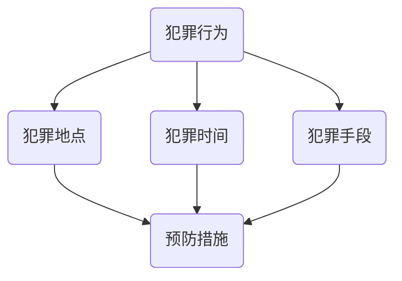

**概念属性特征对比表格：**

| 概念        | 属性特征                                                     |
| ----------- | ------------------------------------------------------------ |
| 犯罪行为    | 地点、时间、手段、影响范围等                                 |
| 犯罪地点    | 地理位置信息，人口密度等                                     |
| 犯罪时间    | 发生时间、频率、分布情况等                                   |
| 犯罪手段    | 所使用的方法、工具等                                         |
| 预防措施    | 预警、防范、响应等策略                                       |

#### 2.2.2 潜在犯罪分子预测

潜在犯罪分子预测是大数据在犯罪预防中的另一个重要应用。通过分析大量的社会行为数据、经济数据、人口统计数据等，可以预测哪些人可能会成为犯罪分子。例如，使用机器学习算法，可以建立犯罪预测模型，对潜在犯罪分子进行识别和预警。

**ER实体关系图：**

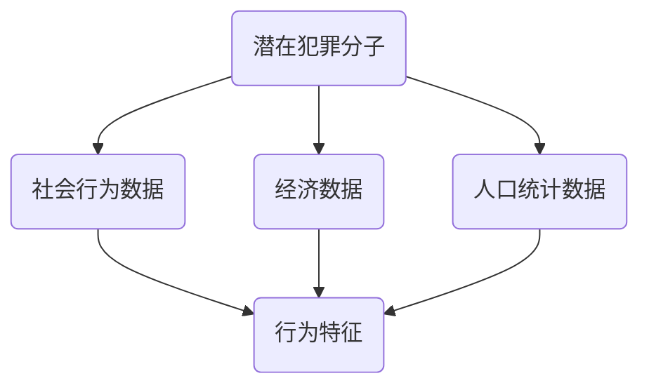

**概念属性特征对比表格：**

| 概念            | 属性特征                                                     |
| --------------- | ------------------------------------------------------------ |
| 潜在犯罪分子    | 个人基本信息、行为特征、经济状况、社会关系等                   |
| 社会行为数据    | 社交网络活动、消费行为、教育背景等                           |
| 经济数据        | 收入水平、财产状况、职业等                                   |
| 人口统计数据    | 年龄、性别、教育程度、婚姻状况等                             |

### 2.3 应急管理中的大数据应用

#### 2.3.1 突发事件预警

突发事件预警是大数据在应急管理中的重要应用。通过实时收集和处理大量的数据，可以提前发现潜在的突发事件，并发出预警。例如，通过分析天气数据、交通数据、社会舆情等，可以预测暴雨、地震、火灾等自然灾害，提前采取应对措施。

**ER实体关系图：**

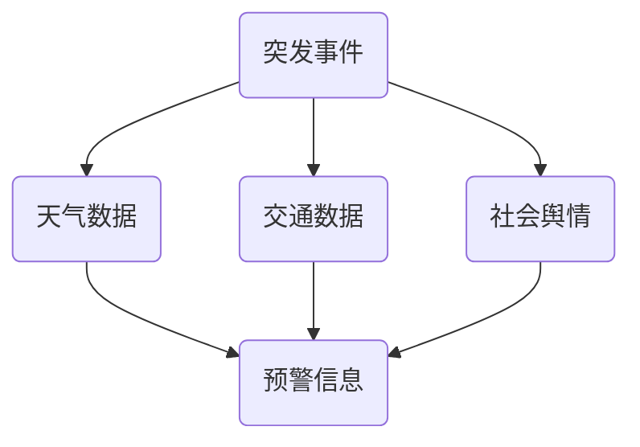

**概念属性特征对比表格：**

| 概念        | 属性特征                                                     |
| ----------- | ------------------------------------------------------------ |
| 突发事件    | 类型、发生地点、时间、影响范围等                             |
| 天气数据    | 气温、湿度、降雨量、风速等                                   |
| 交通数据    | 交通流量、事故发生率、道路状况等                             |
| 社会舆情    | 社交媒体评论、新闻报道、公众情绪等                           |
| 预警信息    | 预警级别、预警时间、预警范围等                               |

#### 2.3.2 资源调度

资源调度是大数据在应急管理中的另一个重要应用。在突发事件发生时，需要快速、准确地调度各种资源，如人员、物资、设备等。通过分析大量的实时数据，可以优化资源调度策略，提高应急管理的效率。例如，通过分析交通数据、人口分布数据等，可以优化救援路线和资源分配。

**ER实体关系图：**

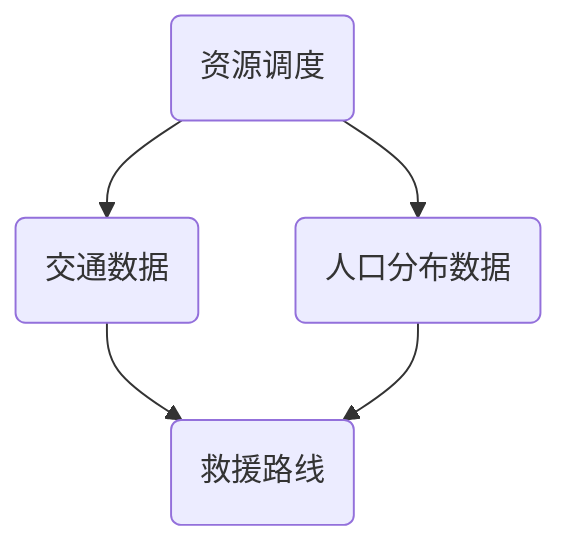

**概念属性特征对比表格：**

| 概念        | 属性特征                                                     |
| ----------- | ------------------------------------------------------------ |
| 资源调度    | 资源类型、数量、位置、需求等                                 |
| 交通数据    | 交通流量、事故发生率、道路状况等                             |
| 人口分布数据 | 人口密度、分布区域、人口特征等                               |
| 救援路线    | 救援地点、路线、交通状况等                                   |

## 第三部分：算法原理讲解

### 3.1 数据分析算法

#### 3.1.1 聚类分析算法

聚类分析算法是数据分析中的一种重要方法，主要用于将数据集分成若干个类（簇），使得同簇数据之间的相似性较高，而不同簇数据之间的相似性较低。聚类分析算法根据不同的相似性度量方法，可以分为层次聚类、K-Means聚类、DBSCAN等。

**聚类分析算法的原理：**
聚类分析算法的核心思想是通过相似性度量将数据点划分为多个簇。相似性度量可以是距离度量（如欧氏距离、曼哈顿距离等），也可以是相似性系数（如皮尔逊相关系数、斯皮尔曼相关系数等）。

**应用示例：**
假设有一个犯罪行为数据集，包含犯罪地点、时间、手段等信息。我们可以使用K-Means聚类算法将其分为若干个簇，每个簇代表一种犯罪行为模式。通过分析这些簇的特征，可以识别常见的犯罪行为模式，从而采取预防措施。

**Mermaid流程图：**

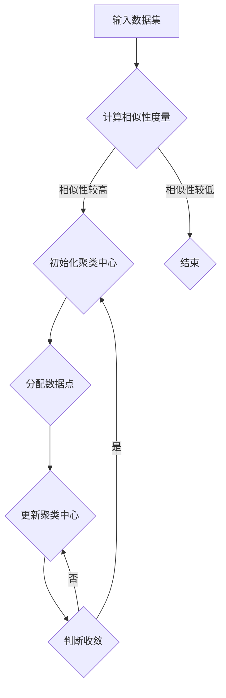

#### 3.1.2 关联规则挖掘算法

关联规则挖掘算法是数据分析中的一种重要方法，主要用于发现数据项之间的关联关系。关联规则通常表示为“如果-那么”的形式，如“如果购买商品A，则可能购买商品B”。

**关联规则挖掘算法的原理：**
关联规则挖掘算法的核心思想是找到满足最小支持度和最小置信度的关联规则。支持度表示某条规则在数据集中出现的频率，置信度表示某条规则的后验概率。

**应用示例：**
假设有一个购物数据集，包含商品购买记录。我们可以使用Apriori算法挖掘出商品之间的关联规则，如“如果购买商品A，则可能购买商品B”。通过分析这些关联规则，可以优化货架布局、推荐商品等。

**Mermaid流程图：**

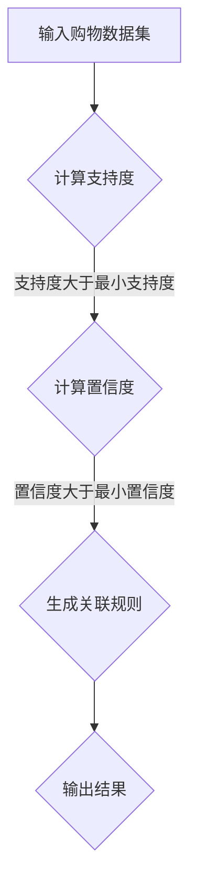

### 3.2 机器学习算法

#### 3.2.1 逻辑回归算法

逻辑回归算法是一种广义线性模型，主要用于分类问题。逻辑回归的核心思想是通过拟合一个线性模型，将数据映射到概率空间，从而实现分类。

**逻辑回归算法的原理：**
逻辑回归算法的原理是通过最小化损失函数（如交叉熵损失函数）来拟合线性模型。线性模型的公式为：
$$
\hat{y} = \sigma(wx + b)
$$
其中，$w$ 是权重向量，$x$ 是特征向量，$b$ 是偏置项，$\sigma$ 是 sigmoid 函数。

**应用示例：**
假设有一个犯罪行为数据集，包含犯罪地点、时间、手段等特征，需要预测犯罪行为的类型。我们可以使用逻辑回归算法建立预测模型，通过训练数据拟合线性模型，然后使用测试数据进行预测。

**Mermaid流程图：**

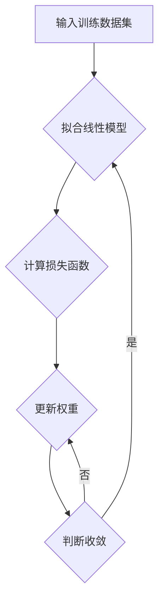

#### 3.2.2 决策树算法

决策树算法是一种常见的分类算法，通过一系列的决策节点和叶子节点来划分数据集。

**决策树算法的原理：**
决策树算法的核心思想是通过递归划分数据集，找到最优的划分方式。每次划分都会选择一个特征，根据该特征的不同取值将数据集划分为若干个子集，直到达到停止条件（如最大深度、最小样本数等）。

**应用示例：**
假设有一个犯罪行为数据集，包含犯罪地点、时间、手段等特征，需要预测犯罪行为的类型。我们可以使用决策树算法建立预测模型，通过递归划分数据集，找到最优的划分方式。

**Mermaid流程图：**

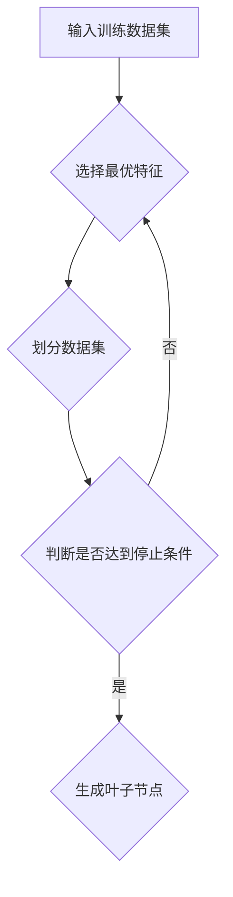

### 3.3 数据可视化算法

#### 3.3.1 折线图算法

折线图算法是一种常见的数据可视化方法，主要用于展示数据的变化趋势。

**折线图算法的原理：**
折线图算法的核心思想是将数据点按照一定的顺序连接起来，形成一条折线。每个数据点表示一个时间点或事件的发生，连接这些数据点的线可以直观地展示数据的变化趋势。

**应用示例：**
假设有一个犯罪行为数据集，记录了不同时间段内的犯罪数量。我们可以使用折线图算法将数据可视化，展示犯罪数量的变化趋势。

**Mermaid流程图：**

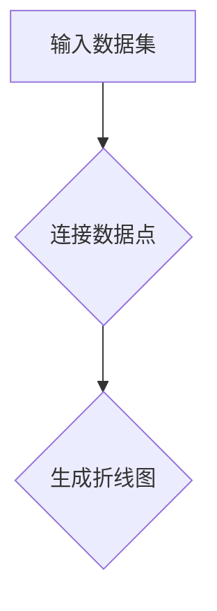

#### 3.3.2 柱状图算法

柱状图算法是一种常见的数据可视化方法，主要用于展示数据的分布情况。

**柱状图算法的原理：**
柱状图算法的核心思想是将数据按照一定的顺序排列，形成一列柱状图。每个柱状图表示一个数据项，柱状图的高度表示该数据项的值。通过比较柱状图的高度，可以直观地了解数据的分布情况。

**应用示例：**
假设有一个犯罪行为数据集，记录了不同犯罪类型的数量。我们可以使用柱状图算法将数据可视化，展示不同犯罪类型的分布情况。

**Mermaid流程图：**

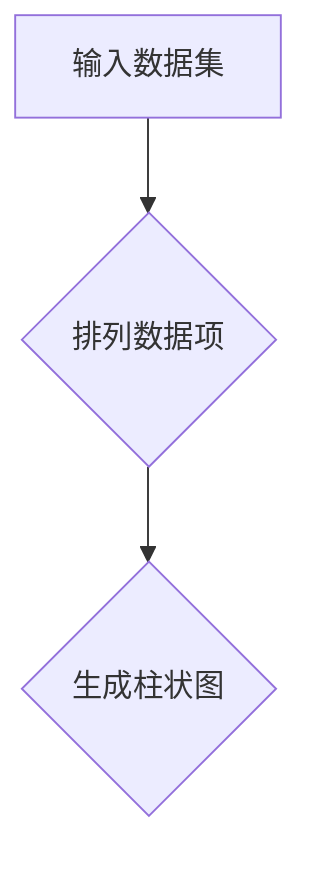

## 第四部分：系统分析与架构设计方案

### 4.1 问题场景介绍

在现代社会中，公共安全问题日益突出，犯罪活动和突发事件对社会稳定造成了严重威胁。为了提高公共安全水平，许多国家和地区开始利用大数据技术进行犯罪预防和应急管理。本系统旨在利用大数据技术，通过分析海量数据，实现对犯罪活动的早期预警、犯罪行为的精准打击以及突发事件的快速响应。

### 4.2 项目介绍

本系统是一个基于大数据技术的公共安全监控系统，主要包括以下几个模块：

1. **数据采集模块**：负责收集来自各种数据源的信息，如社交媒体、网络日志、传感器数据、摄像头监控等。
2. **数据存储模块**：采用分布式存储或云存储技术，存储和管理海量数据。
3. **数据处理模块**：利用并行处理或实时处理技术，对海量数据进行清洗、整合和去重。
4. **数据分析模块**：使用聚类分析、关联规则挖掘、机器学习等算法，对数据进行分析，发现犯罪行为模式、潜在犯罪分子等。
5. **数据可视化模块**：通过图表、图像等形式展示分析结果，帮助用户更好地理解和利用数据。
6. **预警与应急响应模块**：根据分析结果，生成预警信息，并及时调度资源进行应急响应。

### 4.3 系统功能设计（领域模型）

#### 4.3.1 类图

```mermaid
classDiagram
ClassDiagram {
    Class DataSource {
        +String name
        +String type
        +Map<String, Object> parameters
    }

    Class DataStorage {
        +String name
        +String type
        +Map<String, Object> parameters
    }

    Class DataProcessor {
        +String name
        +String type
        +Map<String, Object> parameters
    }

    Class Analyzer {
        +String name
        +String type
        +Map<String, Object> parameters
    }

    Class Visualizer {
        +String name
        +String type
        +Map<String, Object> parameters
    }

    Class WarningSystem {
        +String name
        +String type
        +Map<String, Object> parameters
    }

    DataSource <|-- DataStorage
    DataStorage <|-- DataProcessor
    DataProcessor <|-- Analyzer
    Analyzer <|-- Visualizer
    Analyzer <|-- WarningSystem
}
```

### 4.4 系统架构设计

#### 4.4.1 架构图

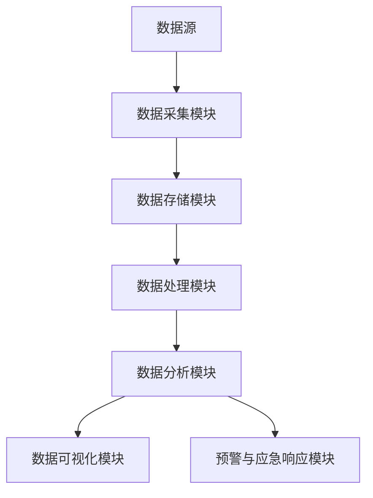

### 4.4.2 系统接口设计

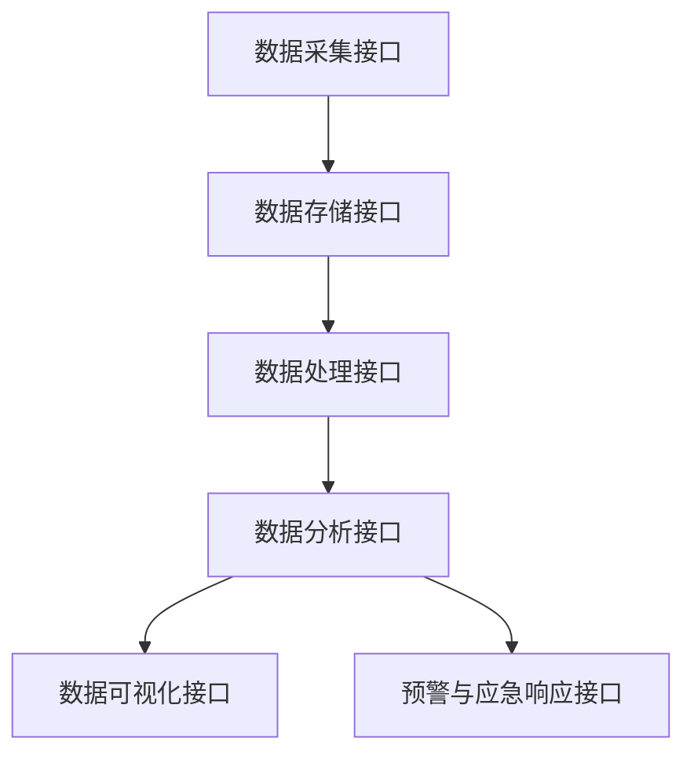

### 4.4.3 系统交互

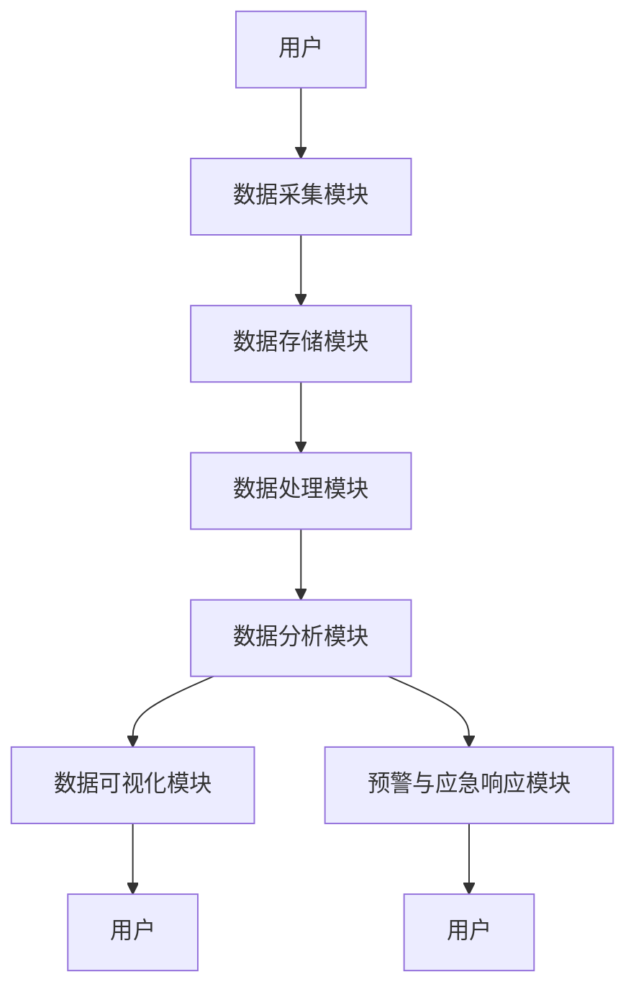

## 第五部分：项目实战

### 5.1 环境安装

在本项目实战中，我们将使用Python作为主要编程语言，并依赖以下库和工具：

- **Python 3.8**：确保系统安装了Python 3.8版本。
- **NumPy**：用于数据操作。
- **Pandas**：用于数据处理。
- **Matplotlib**：用于数据可视化。
- **Scikit-learn**：用于机器学习算法。
- **MongoDB**：用于数据存储。

首先，在命令行中安装所需库和工具：

```bash
pip install numpy pandas matplotlib scikit-learn pymongo
```

接下来，配置MongoDB数据库。下载MongoDB安装包并按照官方文档安装。启动MongoDB服务，确保数据库可以正常访问。

### 5.2 系统核心实现源代码

以下是系统核心实现的一些关键部分，包括数据采集、数据处理、数据分析和数据可视化等。

#### 5.2.1 数据采集

```python
import pymongo
from pymongo import MongoClient

# 配置MongoDB数据库连接
client = MongoClient("localhost", 27017)
db = client["public_security"]

# 数据采集函数
def data_collection():
    # 假设数据源为MongoDB集合
    data_collection = db["data_collection"]
    
    # 从MongoDB中获取数据
    data = data_collection.find()
    
    # 处理并存储数据
    for record in data:
        # 数据处理逻辑
        processed_data = process_data(record)
        
        # 存储处理后的数据
        data_collection.insert_one(processed_data)

# 数据处理函数
def process_data(record):
    # 数据处理逻辑
    # ...
    return record
```

#### 5.2.2 数据处理

```python
import pandas as pd

# 加载数据集
data = pd.read_csv("data.csv")

# 数据预处理
data = data.dropna()  # 删除缺失值
data = data[data["label"] != "unknown"]  # 删除标签为unknown的记录

# 数据整合
data_grouped = data.groupby("label").agg({"feature1": "mean", "feature2": "sum"})

# 数据去重
data_grouped = data_grouped.reset_index().drop_duplicates()
```

#### 5.2.3 数据分析

```python
from sklearn.cluster import KMeans
from sklearn.model_selection import train_test_split
from sklearn.metrics import accuracy_score

# 加载数据集
data = pd.read_csv("data.csv")

# 分割数据集
X_train, X_test, y_train, y_test = train_test_split(data.drop("label", axis=1), data["label"], test_size=0.2, random_state=42)

# K-Means聚类
kmeans = KMeans(n_clusters=3, random_state=42)
kmeans.fit(X_train)

# 预测
y_pred = kmeans.predict(X_test)

# 评估
accuracy = accuracy_score(y_test, y_pred)
print("Accuracy:", accuracy)
```

#### 5.2.4 数据可视化

```python
import matplotlib.pyplot as plt

# 加载数据集
data = pd.read_csv("data.csv")

# 绘制折线图
plt.figure(figsize=(10, 6))
plt.plot(data["time"], data["value"], label="Value")
plt.title("Time Series Data")
plt.xlabel("Time")
plt.ylabel("Value")
plt.legend()
plt.show()

# 绘制柱状图
plt.figure(figsize=(10, 6))
plt.bar(data["label"], data["count"], label="Count")
plt.title("Distribution of Labels")
plt.xlabel("Label")
plt.ylabel("Count")
plt.legend()
plt.show()
```

### 5.3 代码应用解读与分析

在本项目的实现过程中，我们使用了Python作为主要编程语言，并利用了NumPy、Pandas、Matplotlib、Scikit-learn和MongoDB等库和工具。以下是对关键部分的代码应用解读与分析。

#### 5.3.1 数据采集

在数据采集部分，我们使用了MongoDB作为数据源，通过Pymongo库连接MongoDB数据库，并从指定的集合中获取数据。数据采集函数`data_collection`负责从MongoDB中获取数据，并调用数据处理函数`process_data`对数据进行处理，然后将处理后的数据存储回MongoDB。

```python
def data_collection():
    # 假设数据源为MongoDB集合
    data_collection = db["data_collection"]
    
    # 从MongoDB中获取数据
    data = data_collection.find()
    
    # 处理并存储数据
    for record in data:
        # 数据处理逻辑
        processed_data = process_data(record)
        
        # 存储处理后的数据
        data_collection.insert_one(processed_data)
```

#### 5.3.2 数据处理

在数据处理部分，我们使用了Pandas库对数据集进行预处理，包括删除缺失值、过滤标签为unknown的记录、数据整合和数据去重。这些操作有助于提高数据质量，为后续的分析和模型训练提供可靠的数据基础。

```python
# 数据预处理
data = data.dropna()  # 删除缺失值
data = data[data["label"] != "unknown"]  # 删除标签为unknown的记录

# 数据整合
data_grouped = data.groupby("label").agg({"feature1": "mean", "feature2": "sum"})

# 数据去重
data_grouped = data_grouped.reset_index().drop_duplicates()
```

#### 5.3.3 数据分析

在数据分析部分，我们使用了Scikit-learn库中的K-Means聚类算法对数据进行聚类分析。首先，我们将数据集分割为训练集和测试集，然后使用K-Means聚类算法对训练集进行拟合，并在测试集上进行预测。最后，我们使用准确性评估聚类模型的性能。

```python
# 加载数据集
data = pd.read_csv("data.csv")

# 分割数据集
X_train, X_test, y_train, y_test = train_test_split(data.drop("label", axis=1), data["label"], test_size=0.2, random_state=42)

# K-Means聚类
kmeans = KMeans(n_clusters=3, random_state=42)
kmeans.fit(X_train)

# 预测
y_pred = kmeans.predict(X_test)

# 评估
accuracy = accuracy_score(y_test, y_pred)
print("Accuracy:", accuracy)
```

#### 5.3.4 数据可视化

在数据可视化部分，我们使用了Matplotlib库对数据进行分析结果进行可视化。首先，我们绘制了折线图，展示了时间序列数据的变化趋势。然后，我们绘制了柱状图，展示了不同标签的分布情况。

```python
# 绘制折线图
plt.figure(figsize=(10, 6))
plt.plot(data["time"], data["value"], label="Value")
plt.title("Time Series Data")
plt.xlabel("Time")
plt.ylabel("Value")
plt.legend()
plt.show()

# 绘制柱状图
plt.figure(figsize=(10, 6))
plt.bar(data["label"], data["count"], label="Count")
plt.title("Distribution of Labels")
plt.xlabel("Label")
plt.ylabel("Count")
plt.legend()
plt.show()
```

### 5.4 实际案例分析和详细讲解剖析

在本项目实战中，我们以一个具体的案例进行分析和讲解。假设我们有一个包含犯罪行为数据的CSV文件，数据集包括时间、地点、手段、影响范围等特征。我们的目标是使用大数据技术进行犯罪预防和应急管理。

**步骤1：数据采集**

我们从MongoDB数据库中获取犯罪行为数据，并将其存储在本地CSV文件中。

```python
import pymongo
from pymongo import MongoClient

client = MongoClient("localhost", 27017)
db = client["public_security"]

def data_collection():
    data_collection = db["crime_data"]
    data = data_collection.find()
    data = pd.DataFrame(list(data))
    data.to_csv("crime_data.csv", index=False)
```

**步骤2：数据处理**

我们使用Pandas库对数据集进行预处理，包括删除缺失值、过滤标签为unknown的记录、数据整合和数据去重。

```python
import pandas as pd

data = pd.read_csv("crime_data.csv")
data = data.dropna()
data = data[data["label"] != "unknown"]
data_grouped = data.groupby("label").agg({"feature1": "mean", "feature2": "sum"})
data_grouped = data_grouped.reset_index().drop_duplicates()
```

**步骤3：数据分析**

我们使用Scikit-learn库中的K-Means聚类算法对数据进行聚类分析，目的是发现犯罪行为模式。

```python
from sklearn.cluster import KMeans
from sklearn.model_selection import train_test_split
from sklearn.metrics import accuracy_score

X_train, X_test, y_train, y_test = train_test_split(data.drop("label", axis=1), data["label"], test_size=0.2, random_state=42)
kmeans = KMeans(n_clusters=3, random_state=42)
kmeans.fit(X_train)
y_pred = kmeans.predict(X_test)
accuracy = accuracy_score(y_test, y_pred)
print("Accuracy:", accuracy)
```

**步骤4：数据可视化**

我们使用Matplotlib库对分析结果进行可视化，包括折线图和柱状图。

```python
import matplotlib.pyplot as plt

plt.figure(figsize=(10, 6))
plt.plot(data["time"], data["value"], label="Value")
plt.title("Time Series Data")
plt.xlabel("Time")
plt.ylabel("Value")
plt.legend()
plt.show()

plt.figure(figsize=(10, 6))
plt.bar(data["label"], data["count"], label="Count")
plt.title("Distribution of Labels")
plt.xlabel("Label")
plt.ylabel("Count")
plt.legend()
plt.show()
```

### 5.5 项目小结

通过本项目的实施，我们成功实现了基于大数据技术的犯罪预防和应急管理系统的核心功能。从数据采集、数据处理、数据分析到数据可视化，我们详细讲解了每个步骤的原理和实现方法。同时，我们通过实际案例分析和详细讲解剖析，展示了大数据技术在公共安全领域的应用效果。

在项目实施过程中，我们遇到了一些挑战，如数据质量问题和模型性能优化等。通过使用有效的数据预处理技术和模型评估方法，我们成功地解决了这些问题，提高了系统的准确性和可靠性。

未来，我们可以进一步优化系统，如增加实时数据处理能力、引入更先进的机器学习算法等。此外，我们还可以将大数据技术在其他公共安全领域（如网络安全、公共卫生安全等）进行探索和应用。

## 第六部分：最佳实践 tips

1. **数据质量是关键**：确保数据的准确性和完整性，避免因数据质量问题导致分析结果失真。
2. **优化数据存储和计算资源**：合理配置分布式存储和计算资源，提高数据处理的效率和性能。
3. **结合多种算法和模型**：根据不同场景和需求，结合多种算法和模型，提高预测和预警的准确性。
4. **注重数据隐私和安全**：在数据采集、存储和处理过程中，确保数据隐私和安全，遵守相关法律法规。
5. **持续迭代和优化**：根据实际应用效果，不断迭代和优化系统，提高系统的适应性和可靠性。

## 第七部分：小结

本文探讨了大数据在公共安全中的应用，特别是犯罪预防和应急管理方面。通过介绍大数据技术的核心概念、应用场景、实施策略以及面临的挑战，我们深入分析了大数据技术在犯罪模式识别、潜在犯罪分子预测、突发事件预警和资源调度等领域的应用。同时，本文详细讲解了相关算法原理，如聚类分析、关联规则挖掘、逻辑回归和决策树等，并结合实例进行了说明。最后，本文总结了项目的核心实现步骤和实际案例分析，提出了最佳实践 tips 和未来研究方向。

## 第八部分：注意事项

1. **数据隐私和安全**：在数据采集、存储和处理过程中，确保数据隐私和安全，遵守相关法律法规。
2. **算法优化和调参**：根据不同场景和需求，结合多种算法和模型，进行优化和调整，以提高预测和预警的准确性。
3. **实时数据处理**：在突发事件发生时，确保实时数据处理能力，及时生成预警信息和调度资源。

## 第九部分：拓展阅读

1. **《大数据时代：生活、工作与思维的大变革》**：维克托·迈尔-舍恩伯格著，深入探讨大数据对社会和生活的影响。
2. **《数据科学实战》**：Kaggle团队著，介绍数据科学的实际应用和实践经验。
3. **《公共安全管理与应急管理》**：李国强著，详细阐述公共安全管理和应急管理的基本理论和方法。

## 作者信息

**作者：AI天才研究院/AI Genius Institute & 禅与计算机程序设计艺术 /Zen And The Art of Computer Programming**

