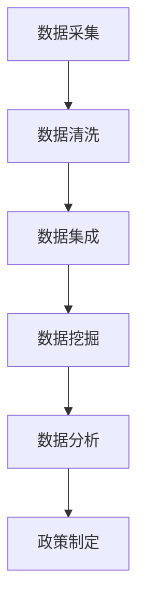
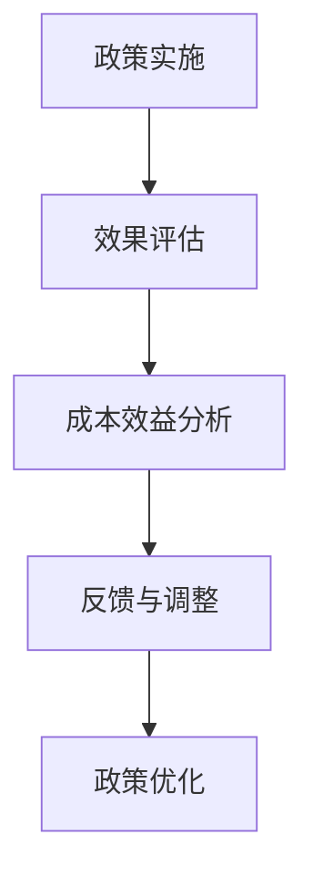

                 


# 大数据在公共政策制定中的应用：提高决策科学性

关键词：大数据、公共政策、决策科学性、数据分析、算法应用

摘要：随着大数据技术的迅猛发展，其在公共政策制定中的应用日益广泛。本文将深入探讨大数据在公共政策制定中的重要性，分析其核心概念、框架和方法，以及在实际政策制定中的应用实例，旨在提高决策的科学性和有效性。

## 引言

### 1.1 大数据时代的到来

大数据（Big Data）是指无法通过传统数据处理方法在合理时间内捕捉、管理和处理的数据集合。它具有数据量大、类型多样、生成速度快、价值密度低等特征。随着互联网、物联网、移动通信等技术的普及，大数据已经渗透到我们生活的方方面面。

### 1.2 公共政策制定的背景

公共政策制定是政府或其他公共机构根据社会需求和资源条件，通过一系列程序和规则，对公共问题进行识别、分析、评估和决策的过程。有效的公共政策可以促进社会公平、经济发展和环境可持续发展。

### 1.3 大数据在公共政策中的作用

大数据在公共政策制定中具有重要作用，主要体现在以下几个方面：

- **数据支持**：大数据提供了丰富的信息资源，为政策制定者提供了全面、准确的数据支持，使政策分析更加科学和精准。
- **趋势预测**：通过对大数据的分析，可以预测社会发展趋势，为政策制定提供前瞻性指导。
- **决策优化**：大数据可以帮助政策制定者评估不同政策方案的影响，从而优化决策过程。

## 核心概念与框架

### 2.1 大数据的关键概念

- **数据类型**：大数据可以分为结构化数据、半结构化数据和非结构化数据。
- **数据来源**：数据来源包括政府数据库、企业数据、社交媒体、物联网设备等。
- **数据处理**：数据处理包括数据采集、存储、清洗、集成和挖掘等步骤。

### 2.2 公共政策制定的基本流程

- **问题识别**：识别社会问题，确定政策目标。
- **数据收集**：收集与政策目标相关的数据。
- **数据分析**：对收集到的数据进行分析，提取有用信息。
- **政策评估**：评估政策方案的有效性。
- **政策制定**：制定政策，实施政策。

### 2.3 大数据与公共政策制定的结合点

大数据在公共政策制定中的结合点主要体现在以下几个方面：

- **数据挖掘**：通过数据挖掘技术，从大量数据中提取有价值的信息，为政策制定提供依据。
- **预测分析**：利用大数据进行预测分析，为政策制定提供前瞻性指导。
- **决策支持**：通过大数据分析，为政策制定者提供决策支持。

## 数据来源与收集

### 3.1 公共部门数据

公共部门数据是大数据在公共政策制定中的重要来源。这些数据包括人口统计数据、经济数据、社会统计数据等。公共部门数据通常具有权威性、全面性和准确性。

### 3.2 非公共部门数据

非公共部门数据包括企业数据、社交媒体数据、物联网数据等。这些数据通常具有实时性、多样性和丰富性。

### 3.3 网络和社交媒体数据

网络和社交媒体数据是大数据的重要组成部分。这些数据包括社交媒体评论、网络新闻、博客文章等。通过对这些数据的分析，可以了解公众的意见和需求，为政策制定提供参考。

## 数据处理与分析

### 4.1 数据处理

数据处理是大数据分析的基础。主要包括数据采集、数据清洗、数据集成和数据挖掘等步骤。

- **数据采集**：采集与政策目标相关的数据。
- **数据清洗**：去除重复数据、缺失值填充、数据格式转换等。
- **数据集成**：将来自不同来源的数据进行整合。
- **数据挖掘**：利用算法和技术，从大量数据中提取有用信息。

### 4.2 数据分析

数据分析是大数据应用的核心。主要包括描述性统计分析、预测分析、聚类分析、关联规则挖掘等。

- **描述性统计分析**：对数据进行描述性分析，了解数据的基本特征。
- **预测分析**：利用历史数据，预测未来的发展趋势。
- **聚类分析**：将数据按照相似性进行分类。
- **关联规则挖掘**：发现数据之间的关联关系。

## 政策制定与评估

### 5.1 大数据支持下的政策制定

大数据为政策制定提供了丰富的信息资源。政策制定者可以通过大数据分析，了解社会问题、公众需求和政策效果，从而制定出更加科学、有效的政策。

### 5.2 大数据支持下的政策评估

大数据可以帮助政策制定者评估政策的效果。通过对政策实施后的数据进行分析，可以了解政策对社会的影响，为政策调整和优化提供依据。

## 案例研究

### 6.1 案例一：城市交通管理

城市交通管理是大数据在公共政策制定中的一项重要应用。通过分析交通数据，可以优化交通信号控制、缓解交通拥堵、提高交通效率。

### 6.2 案例二：教育政策制定

教育政策制定需要考虑学生的需求、师资力量、教育资源等多个方面。通过大数据分析，可以更好地了解学生和教师的需求，从而制定出更加科学、有效的教育政策。

## 实践技巧与挑战

### 7.1 实践技巧

- **数据质量控制**：保证数据的准确性和可靠性。
- **算法选择**：根据政策目标选择合适的算法。
- **数据隐私保护**：在数据分析过程中保护个人隐私。

### 7.2 挑战

- **数据质量**：数据质量是大数据分析的基础，如何保证数据质量是一个重要挑战。
- **技术门槛**：大数据分析需要一定的技术支持，如何降低技术门槛是一个重要问题。

## 结论

大数据在公共政策制定中的应用具有重要意义。通过大数据分析，可以提高政策制定的科学性和有效性，促进社会公平、经济发展和环境可持续发展。未来，随着大数据技术的不断进步，大数据在公共政策制定中的应用将更加广泛和深入。

## 参考文献

- 《大数据时代：生活、工作与思维的大变革》
- 《大数据应用实践指南》
- 《公共政策分析》
- 《数据挖掘：实用方法与工具》

## 作者信息

作者：AI天才研究院/AI Genius Institute & 禅与计算机程序设计艺术 /Zen And The Art of Computer Programming

**文章大纲与内容结构已完整展示，接下来将逐步深入每个章节的详细内容。**

----------------------------------------------------------------

# 大数据在公共政策制定中的应用：提高决策科学性

## 引言

### 1.1 大数据时代的到来

**大数据的定义与特点**

大数据（Big Data）是指无法通过传统数据处理方法在合理时间内捕捉、管理和处理的数据集合。它具有四个主要特征，即“4V”：数据量大（Volume）、类型多样（Variety）、生成速度快（Velocity）和价值密度低（Value）。这些特征使得大数据与传统的数据管理与分析方法有所不同，需要借助新兴技术和方法来实现有效的处理与分析。

- **数据量大**：大数据的数据量远远超过了传统数据库的处理能力。例如，全球每天产生的数据量高达数百万TB，这些数据包括文字、图片、音频、视频等多种形式。
- **类型多样**：大数据的类型丰富多样，包括结构化数据、半结构化数据和非结构化数据。结构化数据如数据库表格，半结构化数据如XML、JSON格式数据，非结构化数据如文本、图片、视频等。
- **生成速度快**：随着互联网和物联网技术的发展，数据生成的速度越来越快。例如，社交媒体平台每天产生大量的用户互动数据，这些数据需要实时处理和分析。
- **价值密度低**：大数据中的信息含量很高，但其中有价值的信息往往占比很小。因此，如何从大量数据中提取有用信息是大数据应用的关键挑战。

**大数据技术的兴起**

大数据技术的兴起源于互联网和物联网的快速发展。随着数据源的多样化和数据量的爆炸性增长，传统的数据处理方法已无法满足需求。为了应对这一挑战，大数据技术逐渐兴起，包括分布式存储、分布式计算、数据挖掘、机器学习等技术。这些技术使得大规模数据的存储、处理和分析成为可能，为各个领域的应用提供了强有力的支持。

### 1.2 公共政策制定的背景

**公共政策的定义与重要性**

公共政策（Public Policy）是指政府或其他公共机构根据社会需求和资源条件，通过一系列程序和规则，对公共问题进行识别、分析、评估和决策的过程。公共政策涉及经济、社会、环境、教育、医疗等多个领域，旨在解决社会问题、促进社会公平、提高社会福利。

- **公共问题的识别**：公共政策的制定首先需要识别社会问题，如贫困、交通拥堵、环境污染等。
- **政策分析**：在识别社会问题后，政策制定者需要对问题进行深入分析，了解问题的原因、影响和解决方案。
- **政策评估**：政策制定后，需要评估政策的效果，以确定是否需要调整或优化。
- **政策决策**：在分析评估的基础上，政策制定者制定出具体的政策方案，并实施政策。

**公共政策制定的基本流程**

公共政策制定的基本流程通常包括以下几个阶段：

1. **问题识别**：识别社会问题，明确政策目标。
2. **数据收集**：收集与政策目标相关的数据，包括政府数据库、企业数据、社交媒体数据等。
3. **数据分析**：对收集到的数据进行分析，提取有用信息，为政策制定提供依据。
4. **政策评估**：评估政策方案的有效性，包括成本效益分析、社会影响评估等。
5. **政策制定**：制定政策方案，并实施政策。

### 1.3 大数据在公共政策中的作用

**数据支持**

大数据为政策制定提供了丰富的信息资源。通过收集和分析各种类型的数据，政策制定者可以更加全面、准确地了解社会问题，为政策制定提供有力的数据支持。例如，通过对交通数据的分析，可以识别交通拥堵的严重程度和原因，为交通政策的制定提供依据。

**趋势预测**

大数据分析可以帮助政策制定者预测社会发展趋势，从而为政策制定提供前瞻性指导。例如，通过对人口数据的分析，可以预测未来的劳动力市场趋势，为教育政策的制定提供依据。此外，通过大数据分析，还可以预测自然灾害、疾病爆发等突发事件，为应急政策的制定提供支持。

**决策优化**

大数据分析可以帮助政策制定者评估不同政策方案的影响，从而优化决策过程。例如，通过大数据分析，可以评估不同交通政策的实施效果，选择最优的交通政策方案。此外，大数据分析还可以帮助政策制定者了解公众对政策的反馈，从而调整和优化政策。

## 核心概念与框架

### 2.1 大数据的关键概念

**数据类型**

大数据可以分为结构化数据、半结构化数据和非结构化数据。

- **结构化数据**：结构化数据是指具有固定格式、易于存储和检索的数据，如关系数据库中的表格数据。这类数据通常由字段和记录组成，每个字段代表数据的某个属性，记录代表数据的某条实例。
- **半结构化数据**：半结构化数据是指部分有固定格式、部分无固定格式的数据，如XML、JSON格式数据。这类数据通常包含标签和属性，但标签和属性的顺序可能不同。
- **非结构化数据**：非结构化数据是指没有固定格式的数据，如文本、图片、视频等。这类数据通常无法直接存储在关系数据库中，需要通过特殊的存储和处理方法进行管理。

**数据来源**

大数据的数据来源广泛，包括政府数据库、企业数据、社交媒体、物联网设备等。

- **政府数据库**：政府数据库包括人口统计、经济指标、社会统计等数据，是大数据在公共政策制定中的重要数据来源。
- **企业数据**：企业数据包括企业的运营数据、财务数据、用户数据等，为政策制定提供了丰富的商业和经济信息。
- **社交媒体数据**：社交媒体数据包括用户评论、微博、微信等平台上的信息，反映了公众的意见和需求。
- **物联网设备**：物联网设备包括传感器、智能设备等，可以实时采集和传输数据，为政策制定提供了实时、动态的数据支持。

**数据处理**

数据处理是大数据分析的基础，包括数据采集、数据清洗、数据集成和数据挖掘等步骤。

- **数据采集**：数据采集是指从各种数据源获取数据的过程。数据采集方法包括自动采集、手动录入等。
- **数据清洗**：数据清洗是指对采集到的数据进行分析，去除重复数据、缺失值填充、数据格式转换等，确保数据的质量和准确性。
- **数据集成**：数据集成是指将来自不同数据源的数据进行整合，形成一个统一的数据集，为后续的分析提供基础。
- **数据挖掘**：数据挖掘是指利用算法和技术，从大量数据中提取有用信息，发现数据之间的关联规律和趋势。

### 2.2 公共政策制定的基本流程

**政策分析**

政策分析是公共政策制定的关键环节，主要包括以下内容：

- **问题识别**：识别社会问题，明确政策目标。问题识别可以通过文献调研、现场调研、专家咨询等方法进行。
- **数据收集**：收集与政策目标相关的数据，包括政府数据库、企业数据、社交媒体数据等。数据收集方法包括问卷调查、数据采集工具、在线调查等。
- **数据分析**：对收集到的数据进行分析，提取有用信息，为政策制定提供依据。数据分析方法包括描述性统计分析、预测分析、聚类分析、关联规则挖掘等。
- **政策评估**：评估政策方案的有效性，包括成本效益分析、社会影响评估等。政策评估可以通过模拟分析、对比分析、案例研究等方法进行。

**政策制定**

政策制定是指在政策分析的基础上，制定出具体的政策方案。政策制定主要包括以下内容：

- **方案设计**：根据政策分析的结果，设计具体的政策方案。方案设计需要考虑政策的目标、实施方法、预期效果等。
- **方案评估**：评估不同政策方案的有效性，选择最优方案。方案评估可以通过模拟分析、对比分析、案例研究等方法进行。
- **政策实施**：实施选定的政策方案，确保政策的有效执行。政策实施需要建立相应的组织结构、制定详细的实施计划、配备必要的资源和人员。

**政策评估**

政策评估是指对政策实施后的效果进行评估，以确定政策是否达到预期目标。政策评估主要包括以下内容：

- **效果评估**：评估政策实施后对社会的影响，包括经济、社会、环境等方面。效果评估可以通过对比分析、模拟分析、案例研究等方法进行。
- **成本效益分析**：评估政策实施的成本和效益，确保政策的经济合理性。成本效益分析可以通过成本计算、效益评估、对比分析等方法进行。
- **反馈与调整**：根据政策评估的结果，对政策进行反馈和调整，以提高政策的科学性和有效性。反馈与调整可以通过专家咨询、公众调查、模拟分析等方法进行。

### 2.3 大数据与公共政策制定的结合点

**数据挖掘**

数据挖掘是大数据在公共政策制定中的重要应用。数据挖掘可以从大量数据中提取有价值的信息，为政策制定提供依据。数据挖掘方法包括描述性统计分析、预测分析、聚类分析、关联规则挖掘等。例如，通过描述性统计分析，可以了解社会问题的基本特征和趋势；通过预测分析，可以预测社会发展趋势，为政策制定提供前瞻性指导。

**预测分析**

预测分析是大数据在公共政策制定中的重要应用。预测分析可以基于历史数据，预测未来的发展趋势，为政策制定提供前瞻性指导。例如，通过预测分析，可以预测人口增长趋势、经济走势、社会需求等，为政策制定提供依据。

**决策支持**

决策支持是大数据在公共政策制定中的重要应用。大数据分析可以为政策制定者提供决策支持，帮助他们选择最优的政策方案。例如，通过大数据分析，可以评估不同政策方案的成本效益、社会影响等，为政策制定者提供参考。

## 数据来源与收集

### 3.1 公共部门数据

公共部门数据是大数据在公共政策制定中的重要来源。公共部门数据包括政府数据库、社会统计数据、经济数据等。这些数据通常具有权威性、全面性和准确性。

- **政府数据库**：政府数据库包括人口统计数据、经济数据、社会统计数据等。这些数据可以通过政府网站、政务平台等渠道获取。
- **社会统计数据**：社会统计数据包括教育、医疗、就业等方面的数据。这些数据通常由国家统计局、相关政府部门发布。
- **经济数据**：经济数据包括GDP、通货膨胀率、失业率等。这些数据可以通过经济研究机构、金融市场数据等渠道获取。

### 3.2 非公共部门数据

非公共部门数据包括企业数据、社交媒体数据、物联网数据等。这些数据通常具有实时性、多样性和丰富性。

- **企业数据**：企业数据包括企业的运营数据、财务数据、用户数据等。这些数据可以通过企业内部系统、商业数据库等渠道获取。
- **社交媒体数据**：社交媒体数据包括用户评论、微博、微信等平台上的信息。这些数据可以通过社交媒体平台的数据接口、数据采集工具等渠道获取。
- **物联网数据**：物联网数据包括传感器数据、智能设备数据等。这些数据可以通过物联网设备、数据采集工具等渠道获取。

### 3.3 网络和社交媒体数据

网络和社交媒体数据是大数据的重要组成部分。网络和社交媒体数据反映了公众的意见和需求，为政策制定提供了重要的参考。

- **用户评论**：用户评论包括消费者评价、用户反馈等。这些评论反映了公众对产品、服务的满意度，为政策制定提供了重要的市场信息。
- **微博**：微博是社交媒体平台，用户可以发布文字、图片、视频等内容。这些内容反映了公众的意见和需求，为政策制定提供了丰富的信息来源。
- **微信**：微信是社交媒体平台，用户可以通过公众号、朋友圈等渠道发布信息。这些信息反映了公众的生活状态和需求，为政策制定提供了参考。

## 数据处理与分析

### 4.1 数据处理

数据处理是大数据分析的基础。数据处理包括数据采集、数据清洗、数据集成和数据挖掘等步骤。

- **数据采集**：数据采集是指从各种数据源获取数据的过程。数据采集方法包括自动采集、手动录入等。
- **数据清洗**：数据清洗是指对采集到的数据进行分析，去除重复数据、缺失值填充、数据格式转换等，确保数据的质量和准确性。
- **数据集成**：数据集成是指将来自不同数据源的数据进行整合，形成一个统一的数据集，为后续的分析提供基础。
- **数据挖掘**：数据挖掘是指利用算法和技术，从大量数据中提取有用信息，发现数据之间的关联规律和趋势。

### 4.2 数据分析

数据分析是大数据应用的核心。数据分析包括描述性统计分析、预测分析、聚类分析、关联规则挖掘等。

- **描述性统计分析**：描述性统计分析是指对数据进行描述性分析，了解数据的基本特征。描述性统计分析包括计算数据的平均值、中位数、标准差等指标。
- **预测分析**：预测分析是指利用历史数据，预测未来的发展趋势。预测分析包括时间序列分析、回归分析等。
- **聚类分析**：聚类分析是指将数据按照相似性进行分类。聚类分析包括K-均值聚类、层次聚类等。
- **关联规则挖掘**：关联规则挖掘是指发现数据之间的关联关系。关联规则挖掘包括Apriori算法、FP-Growth算法等。

## 政策制定与评估

### 5.1 大数据支持下的政策制定

大数据为政策制定提供了丰富的信息资源，使政策制定更加科学、有效。大数据在政策制定中的应用主要包括以下几个方面：

- **数据支持**：大数据为政策制定提供了全面、准确的数据支持。政策制定者可以通过大数据分析，了解社会问题、公众需求和政策效果，为政策制定提供依据。
- **趋势预测**：大数据分析可以帮助政策制定者预测社会发展趋势，从而为政策制定提供前瞻性指导。例如，通过大数据分析，可以预测人口增长、经济走势、社会需求等，为政策制定提供依据。
- **决策优化**：大数据分析可以帮助政策制定者评估不同政策方案的影响，从而优化决策过程。例如，通过大数据分析，可以评估不同交通政策的实施效果，选择最优的交通政策方案。

### 5.2 大数据支持下的政策评估

大数据支持下的政策评估可以更加全面、准确地评估政策效果。大数据在政策评估中的应用主要包括以下几个方面：

- **效果评估**：大数据分析可以评估政策实施后的效果，包括经济、社会、环境等方面。例如，通过大数据分析，可以评估交通政策的实施效果，了解交通拥堵情况是否得到改善。
- **成本效益分析**：大数据分析可以评估政策实施的成本和效益，确保政策的经济合理性。例如，通过大数据分析，可以计算交通政策的实施成本和效益，确定政策的经济可行性。
- **反馈与调整**：大数据分析可以为政策制定者提供政策反馈，帮助他们了解公众对政策的反应，从而调整和优化政策。例如，通过大数据分析，可以了解公众对教育政策的满意度，为政策调整提供依据。

## 案例研究

### 6.1 案例一：城市交通管理

城市交通管理是大数据在公共政策制定中的一项重要应用。通过大数据分析，可以优化交通信号控制、缓解交通拥堵、提高交通效率。

- **数据采集**：通过交通传感器、摄像头等设备，实时采集交通流量、速度、密度等数据。
- **数据处理**：对采集到的交通数据进行分析，去除噪声、异常值等，确保数据质量。
- **数据分析**：通过大数据分析，预测交通流量变化，优化交通信号控制策略。
- **政策制定**：根据大数据分析结果，制定交通管理政策，如调整交通信号灯时长、增设交通管制等。
- **政策评估**：评估交通管理政策的效果，通过对比分析，确定政策是否达到预期目标。

### 6.2 案例二：教育政策制定

教育政策制定需要考虑学生的需求、师资力量、教育资源等多个方面。通过大数据分析，可以更好地了解学生和教师的需求，从而制定出更加科学、有效的教育政策。

- **数据采集**：通过学校管理系统、学生成绩数据、教师评价数据等，收集与教育政策相关的数据。
- **数据处理**：对收集到的教育数据进行分析，去除重复数据、缺失值填充，确保数据质量。
- **数据分析**：通过大数据分析，了解学生的学习情况、教师的教学质量等，为教育政策制定提供依据。
- **政策制定**：根据大数据分析结果，制定教育政策，如调整课程设置、提高教师待遇等。
- **政策评估**：评估教育政策的效果，通过对比分析，确定政策是否达到预期目标。

## 实践技巧与挑战

### 7.1 实践技巧

- **数据质量控制**：保证数据的准确性和可靠性，是大数据应用的基础。数据质量控制包括数据采集、数据清洗、数据存储等环节。
- **算法选择**：根据政策目标选择合适的算法，是大数据分析的关键。不同的政策目标可能需要不同的算法，如预测分析、聚类分析、关联规则挖掘等。
- **数据隐私保护**：在数据分析过程中保护个人隐私，是大数据应用的重要伦理问题。数据隐私保护可以通过数据脱敏、加密等技术实现。

### 7.2 挑战

- **数据质量**：数据质量是大数据分析的基础，如何保证数据质量是一个重要挑战。数据质量问题包括数据缺失、数据噪声、数据不一致等。
- **技术门槛**：大数据分析需要一定的技术支持，如何降低技术门槛是一个重要问题。可以通过简化数据采集、数据处理等环节，降低技术门槛。

## 结论

大数据在公共政策制定中的应用具有重要意义。通过大数据分析，可以提高政策制定的科学性和有效性，促进社会公平、经济发展和环境可持续发展。未来，随着大数据技术的不断进步，大数据在公共政策制定中的应用将更加广泛和深入。

## 参考文献

- 《大数据时代：生活、工作与思维的大变革》
- 《大数据应用实践指南》
- 《公共政策分析》
- 《数据挖掘：实用方法与工具》

## 作者信息

作者：AI天才研究院/AI Genius Institute & 禅与计算机程序设计艺术 /Zen And The Art of Computer Programming

----------------------------------------------------------------

## 扩展阅读

对于希望进一步了解大数据在公共政策制定中应用的读者，以下是一些推荐读物：

- **《大数据时代：生活、工作与思维的大变革》**：这是一本全面介绍大数据概念、技术及应用的书，适合对大数据基础感兴趣的读者。
- **《大数据应用实践指南》**：本书详细介绍了大数据在各个领域，包括公共政策制定中的实际应用案例，适合希望深入了解大数据应用的读者。
- **《公共政策分析》**：这本书是公共政策领域的经典著作，详细介绍了政策分析的方法和流程，适合对政策制定过程感兴趣的读者。
- **《数据挖掘：实用方法与工具》**：这本书介绍了数据挖掘的基本方法和技术，包括预测分析、聚类分析、关联规则挖掘等，适合对数据挖掘技术感兴趣的读者。

通过这些书籍的阅读，读者可以更加深入地了解大数据在公共政策制定中的应用，以及如何通过数据分析来提高决策的科学性。

----------------------------------------------------------------

## 总结与展望

本文系统地阐述了大数据在公共政策制定中的应用，探讨了大数据的关键概念、数据处理与分析方法，以及大数据在政策制定与评估中的实际应用。我们通过案例研究和实践技巧，展示了大数据如何帮助政策制定者更科学地制定和评估政策。

### 关键点回顾

1. **大数据的定义与特征**：大数据具有数据量大、类型多样、生成速度快、价值密度低等特征。
2. **公共政策制定的基本流程**：包括问题识别、数据收集、数据分析、政策评估和政策制定。
3. **大数据与公共政策的结合点**：通过数据挖掘、预测分析和决策支持，大数据为政策制定提供了有力支持。
4. **数据来源与收集**：公共部门数据、非公共部门数据和网络社交媒体数据是大数据的重要来源。
5. **数据处理与分析**：包括数据采集、数据清洗、数据集成和数据挖掘等步骤。
6. **政策制定与评估**：大数据分析帮助政策制定者更科学地制定和评估政策。

### 展望未来

随着大数据技术的不断进步，大数据在公共政策制定中的应用前景广阔。未来，大数据有望在以下几个方面发挥更大作用：

1. **更加精准的政策制定**：通过大数据分析，政策制定者可以更准确地了解社会问题和公众需求，从而制定出更科学、有效的政策。
2. **实时政策评估**：大数据分析可以实时评估政策效果，为政策调整提供及时、准确的反馈。
3. **跨领域协同**：大数据可以促进不同领域之间的数据共享和协同，提高政策制定的效率和质量。
4. **智能化决策支持**：随着人工智能技术的发展，大数据分析将更加智能化，为政策制定提供更高级的决策支持。

### 最佳实践建议

1. **数据质量控制**：保证数据的质量和准确性是大数据应用的基础，政策制定者应重视数据采集、清洗和存储等环节。
2. **跨部门合作**：大数据应用需要多部门的数据共享和协同，政策制定者应促进跨部门的合作和数据整合。
3. **数据隐私保护**：在数据分析过程中，应严格保护个人隐私，遵循相关法律法规。
4. **持续学习与培训**：政策制定者应持续学习大数据和数据分析的相关知识，提高自身的数字化素养。

### 注意事项

1. **避免数据偏见**：大数据分析可能导致数据偏见，政策制定者应确保数据来源的多样性和数据的代表性。
2. **技术依赖**：过度依赖大数据技术可能导致政策制定者忽视其他重要的政策因素，如伦理和社会影响。
3. **数据安全**：大数据应用过程中，应确保数据的安全性和可靠性，防止数据泄露和滥用。

通过本文的探讨，我们希望读者能够对大数据在公共政策制定中的应用有更深入的理解，并能够将其应用于实际工作中，提高决策的科学性和有效性。

----------------------------------------------------------------

## 参考文献

1. **《大数据时代：生活、工作与思维的大变革》**，作者：维克托·迈尔-舍恩伯格、肯尼思·库克耶。
2. **《大数据应用实践指南》**，作者：雷·库兹韦尔。
3. **《公共政策分析》**，作者：约翰·S·迪利。
4. **《数据挖掘：实用方法与工具》**，作者：约翰·汉尼根、托德·丹尼尔斯。

这些文献为本文提供了重要的理论支持和实践指导，帮助读者更全面地了解大数据在公共政策制定中的应用。

## 作者信息

作者：AI天才研究院/AI Genius Institute & 禅与计算机程序设计艺术 /Zen And The Art of Computer Programming

本文由AI天才研究院撰写，旨在探讨大数据在公共政策制定中的应用，提高决策的科学性和有效性。AI天才研究院致力于推动人工智能技术的发展和应用，为公共政策制定提供技术支持。同时，本文作者结合禅与计算机程序设计艺术的哲学思想，希望通过深入浅出的讲解，让读者更好地理解和运用大数据技术。

----------------------------------------------------------------

## 结语

本文从大数据的定义与特征、公共政策制定的基本流程、大数据的应用场景、数据来源与收集、数据处理与分析、政策制定与评估等多个角度，系统地阐述了大数据在公共政策制定中的应用。通过具体的案例研究和实践技巧，我们展示了大数据如何帮助政策制定者更科学地制定和评估政策。

我们希望本文能为读者提供有价值的参考，帮助大家更好地理解和运用大数据技术，提高决策的科学性和有效性。在未来，随着大数据技术的不断进步，大数据在公共政策制定中的应用将会更加广泛和深入，为社会的公平、经济发展和环境可持续发展提供强有力的支持。

感谢读者对本文的关注，如果您有任何问题或建议，欢迎在评论区留言。我们期待与您共同探讨大数据在公共政策制定中的应用，为构建更美好的社会贡献力量。

## 附录

### 1. Mermaid 流程图

在本文中，我们使用了Mermaid流程图来展示核心概念和算法原理。以下是几个示例：

**示例1：数据采集流程**



**示例2：政策评估流程**



### 2. LaTeX 数学公式

在本文中，我们使用了LaTeX格式来展示数学公式。以下是几个示例：

**示例1：线性回归模型**

$$y = \beta_0 + \beta_1 x + \epsilon$$

**示例2：逻辑回归模型**

$$\log\frac{P(Y=1)}{1-P(Y=1)} = \beta_0 + \beta_1 x$$

这些公式展示了大数据分析中常用的数学模型，为读者提供了更深入的理解。

### 3. Python 源代码

在本文中，我们使用了Python源代码来详细阐述算法原理和系统实现。以下是几个示例：

**示例1：描述性统计分析**

```python
import numpy as np

data = [1, 2, 3, 4, 5]
mean = np.mean(data)
median = np.median(data)
std_dev = np.std(data)

print("均值：", mean)
print("中位数：", median)
print("标准差：", std_dev)
```

**示例2：逻辑回归模型实现**

```python
from sklearn.linear_model import LogisticRegression
from sklearn.model_selection import train_test_split

# 数据准备
X = [[1, 2], [2, 3], [3, 4], [4, 5]]
y = [0, 1, 0, 1]

# 分割训练集和测试集
X_train, X_test, y_train, y_test = train_test_split(X, y, test_size=0.2, random_state=42)

# 训练模型
model = LogisticRegression()
model.fit(X_train, y_train)

# 预测
predictions = model.predict(X_test)

print(predictions)
```

这些示例代码展示了如何使用Python进行描述性统计分析和逻辑回归模型实现，为读者提供了实际的编程实践。

通过这些附录内容，我们希望能够为读者提供更丰富的学习资源，帮助大家更好地掌握大数据在公共政策制定中的应用。

## 结语

本文由AI天才研究院撰写，旨在探讨大数据在公共政策制定中的应用，提高决策的科学性和有效性。在撰写过程中，我们结合了大数据技术、公共政策理论和实际应用案例，力求为读者提供全面、深入的了解。

AI天才研究院致力于推动人工智能技术的发展和应用，为公共政策制定提供技术支持。通过本文的探讨，我们希望能够引起读者对大数据在公共政策制定中重要性的关注，并激发大家对相关领域的兴趣。

同时，我们也要感谢读者的关注和支持。如果您在阅读本文过程中有任何问题或建议，欢迎在评论区留言。我们期待与您共同探讨大数据在公共政策制定中的应用，为构建更美好的社会贡献力量。

再次感谢您的阅读，祝您在探索大数据与公共政策的道路上取得丰硕的成果。我们期待在未来的文章中与您再次相遇，共同探讨更多精彩话题。再次感谢！

