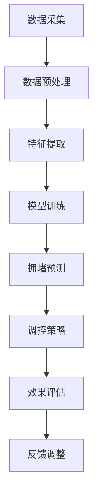

                 


# 大数据在城市交通管理中的作用：拥堵预测与实时调控

> 关键词：大数据，城市交通管理，拥堵预测，实时调控，人工智能

> 摘要：本文将探讨大数据在城市交通管理中的重要作用，尤其是拥堵预测与实时调控。我们将从背景介绍、核心概念与联系、算法原理讲解、系统分析与架构设计方案、项目实战、最佳实践 tips 以及小结与拓展阅读等方面，系统性地分析和讲解这一领域的最新进展和实践应用。

## 目录大纲

- 第一部分：背景介绍
  - 1.1 问题的背景
  - 1.2 问题描述
  - 1.3 问题解决
  - 1.4 边界与外延
  - 1.5 概念结构与核心要素组成

- 第二部分：核心概念与联系
  - 2.1 大数据的定义与特点
  - 2.2 城市交通管理的现状
  - 2.3 大数据在城市交通管理中的应用
  - 2.4 拥堵预测的概念与模型
  - 2.5 实时调控的策略与方法

- 第三部分：算法原理讲解
  - 3.1 算法流程图
  - 3.2 Python源代码实现
  - 3.3 数学模型与公式
  - 3.4 算法原理讲解
  - 3.5 举例说明

- 第四部分：系统分析与架构设计方案
  - 4.1 问题场景介绍
  - 4.2 系统功能设计
  - 4.3 系统架构设计
  - 4.4 系统接口设计
  - 4.5 系统交互序列图

- 第五部分：项目实战
  - 5.1 环境安装
  - 5.2 系统核心实现
  - 5.3 代码应用解读
  - 5.4 实际案例剖析
  - 5.5 项目小结

- 第六部分：最佳实践 tips
  - 6.1 常见问题解决
  - 6.2 性能优化建议
  - 6.3 系统安全性考虑
  - 6.4 用户体验提升

- 第七部分：小结与拓展阅读
  - 7.1 总结
  - 7.2 注意事项
  - 7.3 拓展阅读

## 1.1 问题的背景

随着城市化进程的加速，城市交通拥堵问题日益严重。这不仅影响了居民的日常生活质量，还增加了城市的运营成本。传统的城市交通管理方法主要依赖于经验管理和固定资源配置，难以实时应对复杂的交通状况。然而，随着大数据技术和人工智能的快速发展，利用大数据进行城市交通管理成为了一种新的趋势。

### 1.1.1 大数据时代的来临

大数据时代是指信息爆炸的时代，数据的种类和数量都在爆炸性地增长。这些数据不仅包括传统的结构化数据，还包括非结构化数据，如图像、视频和文本等。大数据技术能够对这些海量数据进行高效处理和分析，从而挖掘出有价值的信息。

### 1.1.2 城市交通拥堵问题

城市交通拥堵是指城市道路上的车辆在行驶过程中，因为车流量过大，导致车辆无法以预期速度行驶的现象。交通拥堵不仅会浪费大量的时间，还会导致空气污染和交通事故。

### 1.1.3 大数据在城市交通管理中的应用

大数据技术为城市交通管理提供了新的解决方案。通过收集和分析交通流量数据、车辆位置数据、路况数据等，可以实时了解交通状况，预测交通拥堵，并采取相应的调控措施。

## 1.2 问题描述

在城市交通管理中，主要面临以下问题：

### 1.2.1 拥堵现象分析

如何准确预测交通拥堵的发生，并提前预警？

### 1.2.2 实时调控需求

如何根据实时交通状况，动态调整交通信号灯，优化交通流量？

## 1.3 问题解决

为了解决上述问题，我们可以采用以下方法：

### 1.3.1 拥堵预测方法

利用大数据分析技术，对历史交通流量数据进行分析，建立拥堵预测模型，提前预测交通拥堵。

### 1.3.2 实时调控策略

根据实时交通状况，动态调整交通信号灯时长，优化交通流量。

## 1.4 边界与外延

本文主要探讨大数据在城市交通管理中的应用，尤其是拥堵预测与实时调控。然而，大数据在城市交通管理中还有许多其他应用，如交通规划、停车管理、公共交通优化等。

## 1.5 概念结构与核心要素组成

### 1.5.1 大数据的核心概念

大数据具有四个V特点：Volume（大量）、Velocity（高速）、Variety（多样）和 Veracity（真实性）。

### 1.5.2 城市交通管理的要素

城市交通管理主要包括交通流量监控、交通信号控制、交通规划、公共交通管理等方面。

### 1.5.3 拥堵预测与实时调控的关键技术

拥堵预测与实时调控的关键技术包括数据采集、数据处理、模型建立和算法实现等。

## 2.1 大数据的定义与特点

### 2.1.1 数据源与数据类型

大数据的数据源非常广泛，包括社交媒体、物联网设备、交通监控设备、智能交通系统等。数据类型包括结构化数据、半结构化数据和非结构化数据。

### 2.1.2 数据处理能力

大数据技术能够对海量数据进行实时处理和分析，挖掘出有价值的信息。

### 2.1.3 数据价值挖掘

通过大数据技术，可以从海量数据中提取出有价值的信息，用于决策支持、业务优化等。

## 2.2 城市交通管理的现状

### 2.2.1 现有管理方式

传统的城市交通管理方式主要依赖于人工调度和经验管理，效率较低。

### 2.2.2 存在问题与挑战

现有管理方式难以应对复杂的交通状况，导致交通拥堵问题严重。

### 2.2.3 大数据的应用场景

大数据技术在城市交通管理中的应用场景包括交通流量监测、拥堵预测、交通信号控制等。

## 2.3 大数据在城市交通管理中的应用

### 2.3.1 实时路况监测

通过大数据技术，实时监测交通流量和路况，为交通调控提供数据支持。

### 2.3.2 拥堵预测模型

利用历史交通数据，建立拥堵预测模型，提前预警交通拥堵。

### 2.3.3 调控策略优化

根据实时交通状况，动态调整交通信号灯时长，优化交通流量。

## 2.4 拥堵预测的概念与模型

### 2.4.1 拥堵预测的重要性

拥堵预测对于提前预警和优化交通流量具有重要意义。

### 2.4.2 预测模型的选择

常见的拥堵预测模型包括时间序列模型、回归模型、神经网络模型等。

### 2.4.3 模型参数调整

根据实际交通状况，调整模型参数，提高预测准确性。

## 2.5 实时调控的策略与方法

### 2.5.1 调控策略设计

根据实时交通状况，设计不同的调控策略，如流量控制、信号灯调整等。

### 2.5.2 调控方法实现

通过大数据分析和算法实现，将调控策略应用到实际交通调控中。

### 2.5.3 调控效果评估

评估调控效果，为后续优化提供依据。

## 3.1 算法流程图



## 3.2 Python源代码实现

```python
# 数据采集
data = collect_data()

# 数据预处理
preprocessed_data = preprocess_data(data)

# 特征提取
features = extract_features(preprocessed_data)

# 模型训练
model = train_model(features)

# 拥堵预测
predictions = model.predict(features)

# 调控策略
strategy = determine_strategy(predictions)

# 效果评估
evaluate_strategy(strategy)

# 反馈调整
adjust_strategy(strategy)
```

## 3.3 数学模型与公式

### 时间序列模型

$$
y_t = \sum_{i=1}^{n} \theta_i \cdot x_t^i + \epsilon_t
$$

### 回归模型

$$
y = \beta_0 + \beta_1 \cdot x_1 + \beta_2 \cdot x_2 + \ldots + \beta_n \cdot x_n
$$

### 神经网络模型

$$
y = f(\sum_{i=1}^{n} w_i \cdot x_i + b)
$$

## 3.4 算法原理讲解

### 数据采集

通过传感器、摄像头等设备，实时采集交通流量、车辆位置等数据。

### 数据预处理

对采集到的数据进行清洗、去噪等处理，使其符合模型训练的要求。

### 特征提取

从预处理后的数据中提取出对拥堵预测有用的特征。

### 模型训练

利用提取到的特征，通过训练算法建立拥堵预测模型。

### 拥堵预测

将实时数据输入模型，得到拥堵预测结果。

### 调控策略

根据预测结果，设计相应的调控策略。

### 效果评估

评估调控策略的实际效果，为后续优化提供依据。

### 反馈调整

根据效果评估结果，调整调控策略。

## 3.5 举例说明

### 时间序列模型

假设我们有以下一周的交通流量数据：

| 日期 | 交通流量 |
| ---- | -------- |
| 2023-01-01 | 5000     |
| 2023-01-02 | 5500     |
| 2023-01-03 | 5800     |
| 2023-01-04 | 6000     |
| 2023-01-05 | 6500     |
| 2023-01-06 | 6800     |
| 2023-01-07 | 7000     |

利用时间序列模型，可以预测下一周的第一天的交通流量。

### 回归模型

假设我们有以下交通流量和天气数据：

| 交通流量 | 天气 |
| -------- | ---- |
| 5000     | 晴   |
| 5500     | 晴   |
| 5800     | 雨   |
| 6000     | 雨   |
| 6500     | 雨   |
| 6800     | 晴   |
| 7000     | 晴   |

利用回归模型，可以预测给定天气情况下的交通流量。

### 神经网络模型

假设我们有以下输入输出数据：

| 输入 | 输出 |
| ---- | ---- |
| [1, 0] | [1] |
| [0, 1] | [0] |
| [1, 1] | [0] |
| [0, 0] | [1] |

利用神经网络模型，可以预测给定输入的输出结果。

## 4.1 问题场景介绍

在城市交通管理中，我们需要解决以下问题场景：

### 实时路况监测

实时监测道路上的车辆流量、速度等信息，以便及时了解交通状况。

### 拥堵预测

根据历史交通数据和实时路况信息，预测未来一段时间内的交通拥堵情况。

### 实时调控

根据拥堵预测结果，动态调整交通信号灯时长，优化交通流量。

## 4.2 系统功能设计

系统功能设计主要包括以下模块：

### 数据采集模块

负责实时采集交通流量、车辆位置等数据。

### 数据预处理模块

负责对采集到的数据进行清洗、去噪等处理。

### 特征提取模块

负责从预处理后的数据中提取出对拥堵预测有用的特征。

### 模型训练模块

负责训练拥堵预测模型，为实时调控提供支持。

### 拥堵预测模块

负责根据实时数据预测未来交通拥堵情况。

### 实时调控模块

负责根据拥堵预测结果，动态调整交通信号灯时长。

### 效果评估模块

负责评估调控策略的实际效果。

## 4.3 系统架构设计

系统架构设计主要包括以下层次：

### 数据层

负责存储和管理交通流量、车辆位置等数据。

### 算法层

负责拥堵预测模型的训练和实时调控策略的制定。

### 应用层

负责实现系统的功能，包括数据采集、数据预处理、特征提取、模型训练、拥堵预测、实时调控和效果评估等。

### 展示层

负责将交通状况和调控结果展示给用户。

## 4.4 系统接口设计

系统接口设计主要包括以下接口：

### 数据采集接口

负责采集交通流量、车辆位置等数据。

### 数据处理接口

负责处理采集到的数据，包括清洗、去噪等。

### 特征提取接口

负责提取对拥堵预测有用的特征。

### 模型训练接口

负责训练拥堵预测模型。

### 拥堵预测接口

负责根据实时数据预测未来交通拥堵情况。

### 实时调控接口

负责根据拥堵预测结果，动态调整交通信号灯时长。

### 效果评估接口

负责评估调控策略的实际效果。

## 4.5 系统交互序列图

```mermaid
sequenceDiagram
    participant User
    participant System
    participant DataLayer
    participant AlgorithmLayer
    participant Appli

