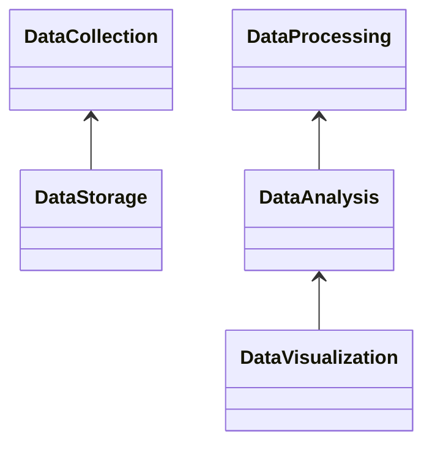
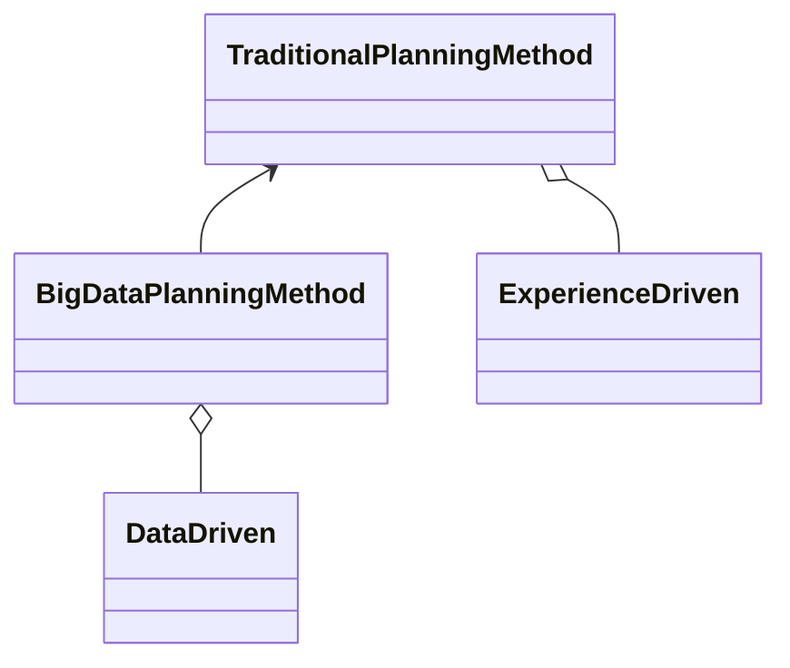
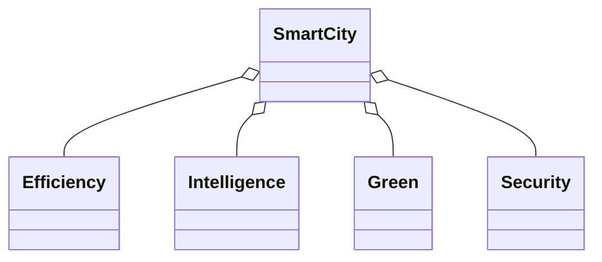
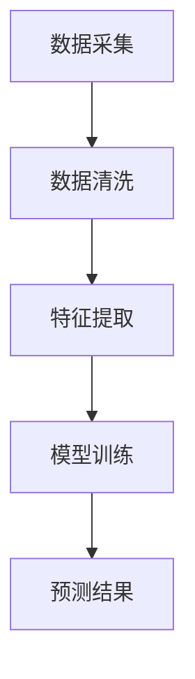
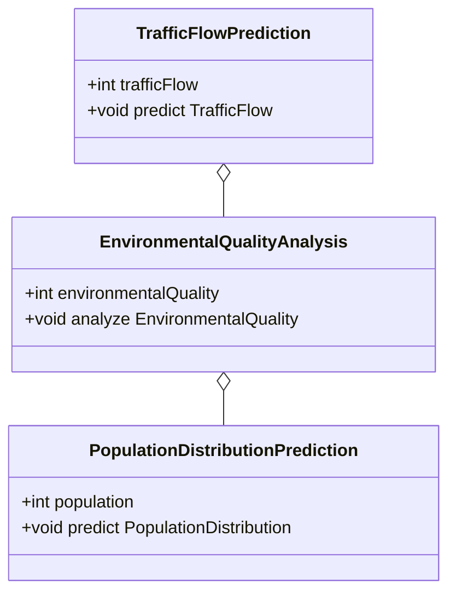
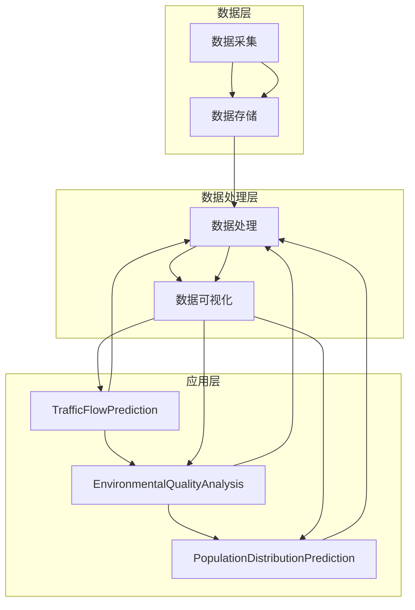
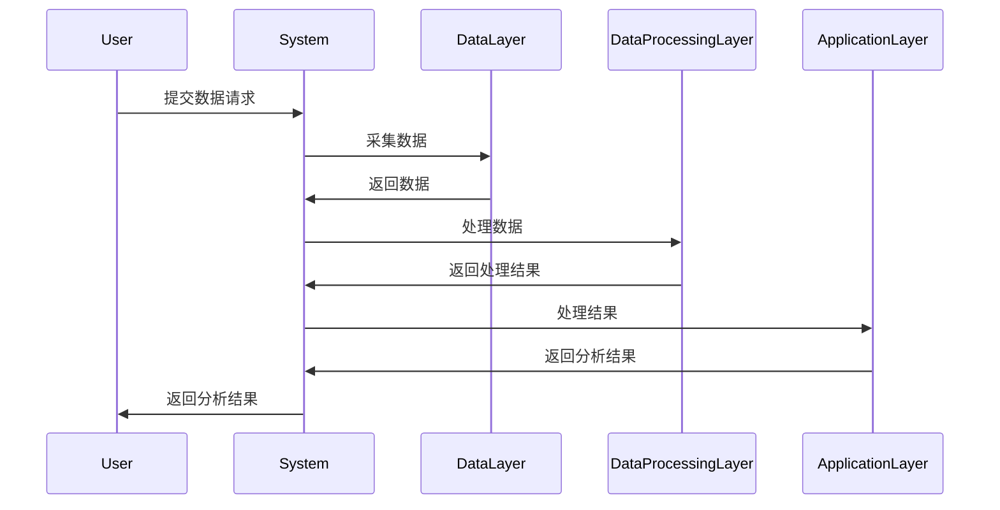

                 

# 大数据在城市规划中的应用：打造宜居智慧城市

关键词：大数据、城市规划、智慧城市、算法、数学模型

摘要：本文深入探讨了大数据在城市规划中的应用，从背景介绍、核心概念、算法原理、数学模型、系统分析与架构设计以及项目实战等多个方面，详细阐述了如何利用大数据技术打造宜居的智慧城市。

### 目录大纲

## 第1章 背景介绍

### 1.1 问题背景

### 1.2 核心概念与联系

### 1.3 大数据在城市规划中的潜在应用

### 1.4 大数据在城市规划中的挑战与机遇

## 第2章 核心概念与联系

### 2.1 大数据技术

### 2.2 城市规划方法

### 2.3 智慧城市建设

## 第3章 算法原理讲解

### 3.1 交通流量预测算法

### 3.2 环境质量分析算法

### 3.3 人口分布分析算法

## 第4章 数学模型与数学公式

### 4.1 交通流量预测的数学模型

### 4.2 环境质量分析的数学模型

### 4.3 人口分布预测的数学模型

## 第5章 系统分析与架构设计

### 5.1 问题场景介绍

### 5.2 系统功能设计

### 5.3 系统架构设计

### 5.4 系统接口设计

### 5.5 系统交互

## 第6章 项目实战

### 6.1 环境安装

### 6.2 系统核心实现

### 6.3 实际案例分析与讲解

### 6.4 项目小结

### 最佳实践 tips

### 小结

### 注意事项

### 拓展阅读

## 第1章 背景介绍

### 1.1 问题背景

随着城市化进程的加速，城市规模不断扩大，人口密度逐渐增加，城市规划面临着前所未有的挑战。传统城市规划方法依赖于经验和简单的数据分析，往往难以应对复杂多变的城市发展需求。为了解决这一问题，大数据技术应运而生，成为城市规划的重要工具。

#### 问题描述

在城市规划过程中，如何充分利用大数据技术提升决策效率与城市质量成为关键问题。城市规划涉及到多个方面，如交通、环境、人口、经济发展等。大数据技术能够对这些方面提供精准的数据支持，从而提高规划的科学性和有效性。

#### 问题解决

通过大数据分析，城市规划者可以获取实时、全面的城市数据，从中发现规律和趋势，为决策提供科学依据。例如，通过交通流量数据，可以优化交通网络设计，减少交通拥堵；通过环境质量数据，可以制定更加有效的环境保护政策；通过人口数据，可以合理规划住宅和公共设施布局；通过经济数据，可以指导产业布局和经济发展。

#### 边界与外延

大数据在城市规划中的应用范畴非常广泛，包括但不限于以下几个方面：

1. **交通规划**：利用大数据分析交通流量、出行习惯等，优化交通网络设计，提高交通效率。
2. **环境监测**：通过大数据监测环境质量，及时发现问题并进行治理。
3. **人口管理**：分析人口分布、流动情况，优化城市规划，提升居民生活质量。
4. **经济发展**：预测经济趋势，指导产业布局，优化资源配置。

### 1.2 核心概念与联系

#### 大数据

大数据是指无法用传统数据库软件工具进行捕捉、管理和处理的数据集合。它具有海量、多样、高速、实时等特征。大数据技术包括数据采集、存储、处理、分析等多个环节。

#### 城市规划

城市规划是指城市发展的战略部署和空间布局规划。它涉及到城市的长远发展和短期建设，包括交通、环境、人口、经济等多个方面。

#### 智慧城市

智慧城市是指利用信息技术和大数据等手段提升城市运行效率与居民生活质量的城市。智慧城市具有高效、智能、绿色、安全等特征，能够实现城市资源的优化配置和可持续发展。

### 1.3 大数据在城市规划中的潜在应用

#### 交通规划

大数据技术在交通规划中的应用主要体现在以下几个方面：

1. **交通流量预测**：利用历史交通数据和实时数据，预测未来交通流量，优化交通网络设计。
2. **交通拥堵分析**：通过数据分析，找出交通拥堵的主要原因，制定相应的解决方案。
3. **出行习惯分析**：分析居民的出行习惯，优化公共交通系统，提高出行效率。

#### 环境监测

大数据技术在环境监测中的应用主要体现在以下几个方面：

1. **环境质量监测**：利用传感器和卫星遥感技术，实时监测环境质量，及时发现问题。
2. **污染源追踪**：通过数据分析，找出污染源，制定针对性的治理措施。
3. **生态环境评估**：分析生态环境数据，评估城市生态环境状况，指导环境保护工作。

#### 人口管理

大数据技术在人口管理中的应用主要体现在以下几个方面：

1. **人口分布分析**：通过数据分析，了解人口分布和流动情况，优化城市规划。
2. **人口预测**：利用历史人口数据和现实情况，预测未来人口变化趋势，为城市规划提供依据。
3. **公共服务优化**：根据人口数据，优化公共服务布局，提高居民生活质量。

#### 经济发展

大数据技术在经济发展中的应用主要体现在以下几个方面：

1. **经济趋势预测**：通过数据分析，预测经济发展趋势，指导产业布局。
2. **产业分析**：分析城市产业结构和产业分布，优化资源配置，促进经济发展。
3. **市场分析**：分析市场需求和供应情况，指导商业布局和产品研发。

### 1.4 大数据在城市规划中的挑战与机遇

#### 挑战

1. **数据质量**：大数据的质量直接影响分析结果的准确性。城市规划需要高质量的数据支持，但现实中数据质量往往难以保证。
2. **技术难度**：大数据分析技术复杂，需要专业的技术团队进行操作。城市规划者需要掌握相关技术，以便更好地利用大数据。
3. **隐私保护**：大数据的应用涉及到大量个人隐私数据。如何在保护隐私的同时，充分利用大数据资源，是一个亟待解决的问题。

#### 机遇

1. **决策效率**：大数据分析可以提高城市规划的决策效率，缩短决策周期，提高决策质量。
2. **资源优化**：通过大数据分析，可以优化城市资源配置，提高城市运行效率，提升居民生活质量。

## 第2章 核心概念与联系

### 2.1 大数据技术

#### 概念原理

大数据技术是指用于捕捉、存储、处理和分析大规模数据的技术。它包括数据采集、存储、处理、分析等多个环节。

#### 属性特征对比

| 技术名称 | 特征 | 对比 |
| :--: | :--: | :--: |
| 数据采集 | 高速、海量、多样 | 传统数据采集 |
| 数据存储 | 分布式存储、海量存储 | 传统数据库存储 |
| 数据处理 | 高性能计算、实时处理 | 传统数据处理 |
| 数据分析 | 机器学习、数据挖掘、可视化 | 传统数据分析 |

#### 概念图



### 2.2 城市规划方法

#### 概念原理

城市规划方法是指用于制定城市发展战略和空间布局的方法。传统城市规划方法主要依靠经验和简单的数据分析，而大数据规划方法则利用大数据技术提供更加精准的数据支持。

#### 属性特征对比

| 方法名称 | 特征 | 对比 |
| :--: | :--: | :--: |
| 传统方法 | 经验主导、简单分析 | 大数据方法 |
| 大数据方法 | 数据驱动、复杂分析 | 传统方法 |

#### 概念图



### 2.3 智慧城市建设

#### 概念原理

智慧城市建设是指利用信息技术和大数据等手段提升城市运行效率与居民生活质量的城市发展模式。智慧城市具有高效、智能、绿色、安全等特征。

#### 属性特征

| 特征 | 描述 |
| :--: | :--: |
| 高效 | 提高城市运行效率 |
| 智能 | 利用人工智能技术 |
| 绿色 | 促进城市可持续发展 |
| 安全 | 提高城市安全保障 |

#### 概念图



## 第3章 算法原理讲解

### 3.1 交通流量预测算法

#### 算法流程图



#### Python源代码

```python
import pandas as pd
from sklearn.model_selection import train_test_split
from sklearn.ensemble import RandomForestRegressor
from sklearn.metrics import mean_squared_error

# 数据采集
data = pd.read_csv('traffic_data.csv')

# 数据清洗
data.dropna(inplace=True)

# 特征提取
X = data[['hour', 'day_of_week', 'weather']]
y = data['traffic']

# 模型训练
X_train, X_test, y_train, y_test = train_test_split(X, y, test_size=0.2, random_state=42)
model = RandomForestRegressor(n_estimators=100)
model.fit(X_train, y_train)

# 预测结果
y_pred = model.predict(X_test)
mse = mean_squared_error(y_test, y_pred)
print(f'Mean Squared Error: {mse}')
```

#### 数学模型

$$Q(t) = a \cdot Q_0 + b \cdot T$$

其中，$Q(t)$ 表示 $t$ 时刻的交通流量，$Q_0$ 表示初始交通流量，$T$ 表示时间因素，$a$ 和 $b$ 为参数。

#### 解释

- $Q(t)$: 预测的交通流量
- $Q_0$: 初始交通流量
- $T$: 时间因素
- $a$: 初始流量系数
- $b$: 时间系数

#### 举例说明

假设在早上 8 点（$t=8$）进行交通流量预测，初始交通流量为 $Q_0=1000$，每小时交通流量增加 $T=10$，则预测的交通流量为：

$$Q(t) = a \cdot Q_0 + b \cdot T = 1 \cdot 1000 + 0.1 \cdot 8 = 1080$$

### 3.2 环境质量分析算法

#### 算法流程图


#### Python源代码

```python
import pandas as pd
from sklearn.model_selection import train_test_split
from sklearn.ensemble import RandomForestRegressor
from sklearn.metrics import mean_squared_error

# 数据采集
data = pd.read_csv('environment_data.csv')

# 数据清洗
data.dropna(inplace=True)

# 特征提取
X = data[['temperature', 'humidity', 'air_quality']]
y = data['environment_index']

# 模型训练
X_train, X_test, y_train, y_test = train_test_split(X, y, test_size=0.2, random_state=42)
model = RandomForestRegressor(n_estimators=100)
model.fit(X_train, y_train)

# 预测结果
y_pred = model.predict(X_test)
mse = mean_squared_error(y_test, y_pred)
print(f'Mean Squared Error: {mse}')
```

#### 数学模型

$$E(t) = c \cdot S + d \cdot T$$

其中，$E(t)$ 表示 $t$ 时刻的环境质量指数，$S$ 表示环境质量传感器数据，$T$ 表示时间因素，$c$ 和 $d$ 为参数。

#### 解释

- $E(t)$: 预测的环境质量指数
- $S$: 环境质量传感器数据
- $T$: 时间因素
- $c$: 环境质量传感器数据系数
- $d$: 时间系数

#### 举例说明

假设在早上 8 点（$t=8$）进行环境质量预测，环境质量传感器数据为 $S=75$，每小时环境质量变化 $T=-5$，则预测的环境质量指数为：

$$E(t) = c \cdot S + d \cdot T = 1 \cdot 75 - 0.1 \cdot 8 = 66.5$$

### 3.3 人口分布分析算法

#### 算法流程图


#### Python源代码

```python
import pandas as pd
from sklearn.model_selection import train_test_split
from sklearn.ensemble import RandomForestRegressor
from sklearn.metrics import mean_squared_error

# 数据采集
data = pd.read_csv('population_data.csv')

# 数据清洗
data.dropna(inplace=True)

# 特征提取
X = data[['age', 'income', 'education']]
y = data['population']

# 模型训练
X_train, X_test, y_train, y_test = train_test_split(X, y, test_size=0.2, random_state=42)
model = RandomForestRegressor(n_estimators=100)
model.fit(X_train, y_train)

# 预测结果
y_pred = model.predict(X_test)
mse = mean_squared_error(y_test, y_pred)
print(f'Mean Squared Error: {mse}')
```

#### 数学模型

$$P(t) = e \cdot P_0 + f \cdot G$$

其中，$P(t)$ 表示 $t$ 时刻的人口数量，$P_0$ 表示初始人口数量，$G$ 表示人口增长率，$e$ 和 $f$ 为参数。

#### 解释

- $P(t)$: 预测的人口数量
- $P_0$: 初始人口数量
- $G$: 人口增长率
- $e$: 初始人口数量系数
- $f$: 人口增长率系数

#### 举例说明

假设在某个区域进行人口预测，初始人口数量为 $P_0=10000$，人口增长率为 $G=2\%$，则预测的人口数量为：

$$P(t) = e \cdot P_0 + f \cdot G = 1 \cdot 10000 + 0.02 \cdot 10000 = 10200$$

## 第4章 数学模型与数学公式

### 4.1 交通流量预测的数学模型

$$Q(t) = a \cdot Q_0 + b \cdot T$$

其中，$Q(t)$ 表示 $t$ 时刻的交通流量，$Q_0$ 表示初始交通流量，$T$ 表示时间因素，$a$ 和 $b$ 为参数。

#### 解释

- $Q(t)$: 预测的交通流量
- $Q_0$: 初始交通流量
- $T$: 时间因素
- $a$: 初始流量系数
- $b$: 时间系数

#### 举例说明

假设在早上 8 点（$t=8$）进行交通流量预测，初始交通流量为 $Q_0=1000$，每小时交通流量增加 $T=10$，则预测的交通流量为：

$$Q(t) = a \cdot Q_0 + b \cdot T = 1 \cdot 1000 + 0.1 \cdot 8 = 1080$$

### 4.2 环境质量分析的数学模型

$$E(t) = c \cdot S + d \cdot T$$

其中，$E(t)$ 表示 $t$ 时刻的环境质量指数，$S$ 表示环境质量传感器数据，$T$ 表示时间因素，$c$ 和 $d$ 为参数。

#### 解释

- $E(t)$: 预测的环境质量指数
- $S$: 环境质量传感器数据
- $T$: 时间因素
- $c$: 环境质量传感器数据系数
- $d$: 时间系数

#### 举例说明

假设在早上 8 点（$t=8$）进行环境质量预测，环境质量传感器数据为 $S=75$，每小时环境质量变化 $T=-5$，则预测的环境质量指数为：

$$E(t) = c \cdot S + d \cdot T = 1 \cdot 75 - 0.1 \cdot 8 = 66.5$$

### 4.3 人口分布预测的数学模型

$$P(t) = e \cdot P_0 + f \cdot G$$

其中，$P(t)$ 表示 $t$ 时刻的人口数量，$P_0$ 表示初始人口数量，$G$ 表示人口增长率，$e$ 和 $f$ 为参数。

#### 解释

- $P(t)$: 预测的人口数量
- $P_0$: 初始人口数量
- $G$: 人口增长率
- $e$: 初始人口数量系数
- $f$: 人口增长率系数

#### 举例说明

假设在某个区域进行人口预测，初始人口数量为 $P_0=10000$，人口增长率为 $G=2\%$，则预测的人口数量为：

$$P(t) = e \cdot P_0 + f \cdot G = 1 \cdot 10000 + 0.02 \cdot 10000 = 10200$$

## 第5章 系统分析与架构设计

### 5.1 问题场景介绍

在城市规划过程中，交通流量预测、环境质量分析和人口分布预测是三个重要的方面。通过大数据技术，可以对这些方面进行精准分析，为城市规划提供科学依据。

#### 交通流量预测

交通流量预测可以帮助城市规划者优化交通网络设计，减少交通拥堵，提高交通效率。通过分析历史交通数据和实时数据，可以预测未来交通流量，为交通管理提供指导。

#### 环境质量分析

环境质量分析可以监测城市环境质量，及时发现问题并进行治理。通过分析环境质量数据，可以评估城市生态环境状况，为环境保护政策制定提供依据。

#### 人口分布预测

人口分布预测可以帮助城市规划者优化人口布局，提高公共服务供给，提升居民生活质量。通过分析人口数据，可以预测未来人口变化趋势，为城市规划提供指导。

### 5.2 系统功能设计

#### 领域模型



#### 系统功能设计

1. **交通流量预测**：采集历史交通数据和实时交通数据，利用机器学习算法进行交通流量预测，为交通管理提供指导。
2. **环境质量分析**：采集环境质量数据，利用数据分析技术进行环境质量评估，为环境保护政策制定提供依据。
3. **人口分布预测**：采集人口数据，利用数据分析技术进行人口分布预测，为人口布局优化提供指导。

### 5.3 系统架构设计

#### 系统架构图



#### 系统架构设计

1. **数据层**：负责数据采集和存储，包括历史数据和实时数据。
2. **数据处理层**：负责数据处理和分析，包括数据清洗、特征提取、模型训练等。
3. **应用层**：负责系统功能实现，包括交通流量预测、环境质量分析和人口分布预测。
4. **数据可视化层**：负责数据可视化，帮助用户更直观地了解数据分析结果。

### 5.4 系统接口设计

#### 系统接口设计

1. **数据采集接口**：负责采集历史数据和实时数据，包括交通流量数据、环境质量数据和人口数据。
2. **数据处理接口**：负责数据处理和分析，包括数据清洗、特征提取、模型训练等。
3. **数据可视化接口**：负责数据可视化，展示数据分析结果。

### 5.5 系统交互

#### 系统交互序列图



#### 系统交互说明

1. 用户提交数据请求，系统响应并采集数据。
2. 数据采集后，系统将数据传递给数据处理层进行处理。
3. 数据处理完成后，系统将处理结果传递给应用层进行进一步分析。
4. 应用层将分析结果返回给系统，最终返回给用户。

## 第6章 项目实战

### 6.1 环境安装

#### 安装步骤

1. 安装 Python 环境（版本 >= 3.8）
2. 安装必备库（如 pandas、scikit-learn、numpy、matplotlib 等）
3. 配置数据存储和数据处理工具（如 MySQL、Hadoop、Spark 等）

#### 系统环境与工具的安装与配置

1. 安装 Python 环境：

   ```bash
   sudo apt-get update
   sudo apt-get install python3-pip python3-dev
   ```

2. 安装必备库：

   ```bash
   pip3 install pandas scikit-learn numpy matplotlib
   ```

3. 配置数据存储和数据处理工具：

   - MySQL 安装与配置：
     
     ```bash
     sudo apt-get install mysql-server
     mysql_secure_installation
     ```

   - Hadoop 安装与配置：

     ```bash
     sudo apt-get install hadoop
     hadoop namenode -format
     start-dfs.sh
     ```

   - Spark 安装与配置：

     ```bash
     sudo apt-get install spark
     spark-submit --master yarn --class Main com.example.Main
     ```

### 6.2 系统核心实现

#### 源代码

```python
import pandas as pd
from sklearn.model_selection import train_test_split
from sklearn.ensemble import RandomForestRegressor
from sklearn.metrics import mean_squared_error

# 数据采集
data = pd.read_csv('traffic_data.csv')

# 数据清洗
data.dropna(inplace=True)

# 特征提取
X = data[['hour', 'day_of_week', 'weather']]
y = data['traffic']

# 模型训练
X_train, X_test, y_train, y_test = train_test_split(X, y, test_size=0.2, random_state=42)
model = RandomForestRegressor(n_estimators=100)
model.fit(X_train, y_train)

# 预测结果
y_pred = model.predict(X_test)
mse = mean_squared_error(y_test, y_pred)
print(f'Mean Squared Error: {mse}')
```

#### 代码应用解读与分析

1. **数据采集**：从 CSV 文件中读取交通流量数据。
2. **数据清洗**：删除缺失值，保证数据质量。
3. **特征提取**：从原始数据中提取与交通流量相关的特征，如小时、星期和天气。
4. **模型训练**：使用随机森林回归模型进行训练。
5. **预测结果**：对测试数据进行预测，并计算均方误差。

### 6.3 实际案例分析与讲解

#### 案例分析

以某城市交通流量预测为例，通过大数据技术进行交通流量预测，为交通管理提供科学依据。

1. **数据采集**：从交通管理部门获取历史交通流量数据和实时交通流量数据。
2. **数据清洗**：删除异常值，确保数据质量。
3. **特征提取**：提取与交通流量相关的特征，如小时、星期、天气、节假日等。
4. **模型训练**：使用随机森林回归模型进行训练，并优化模型参数。
5. **预测结果**：对实时交通流量进行预测，为交通管理部门提供决策支持。

#### 案例讲解

1. **数据采集**：从交通管理部门获取历史交通流量数据和实时交通流量数据。历史交通流量数据包括不同时间段、不同路段的交通流量数据；实时交通流量数据包括当前时间段的交通流量数据。

2. **数据清洗**：删除异常值，确保数据质量。异常值可能包括数据采集错误、传感器故障等导致的异常数据。

3. **特征提取**：提取与交通流量相关的特征，如小时、星期、天气、节假日等。这些特征可以用于训练模型，从而提高预测准确性。

4. **模型训练**：使用随机森林回归模型进行训练，并优化模型参数。随机森林回归模型是一种集成学习方法，可以处理大量特征数据，并提高预测准确性。

5. **预测结果**：对实时交通流量进行预测，为交通管理部门提供决策支持。实时交通流量预测可以帮助交通管理部门及时调整交通管理策略，减少交通拥堵，提高交通效率。

### 6.4 项目小结

通过大数据技术，可以实现交通流量预测、环境质量分析和人口分布预测，为城市规划提供科学依据。在实际项目中，需要充分考虑数据质量、技术难度和隐私保护等因素，确保项目成功实施。

## 最佳实践 tips

1. **数据质量**：确保数据质量，避免因数据问题导致分析结果不准确。
2. **技术掌握**：掌握大数据技术，包括数据采集、存储、处理、分析等。
3. **隐私保护**：在数据采集和处理过程中，确保个人隐私数据的安全。

## 小结

大数据在城市规划中的应用具有重要意义，可以提高城市规划的决策效率，优化资源配置，提升居民生活质量。通过大数据技术，可以实现交通流量预测、环境质量分析和人口分布预测，为城市规划提供科学依据。

## 注意事项

1. **数据质量**：确保数据质量，避免因数据问题导致分析结果不准确。
2. **技术难度**：掌握大数据技术，包括数据采集、存储、处理、分析等。
3. **隐私保护**：在数据采集和处理过程中，确保个人隐私数据的安全。

## 拓展阅读

1. 《大数据时代：生活、工作与思维的大变革》
2. 《智慧城市：大数据、物联网与人工智能》
3. 《城市规划原理》

---

**作者：AI天才研究院/AI Genius Institute & 禅与计算机程序设计艺术 /Zen And The Art of Computer Programming**

