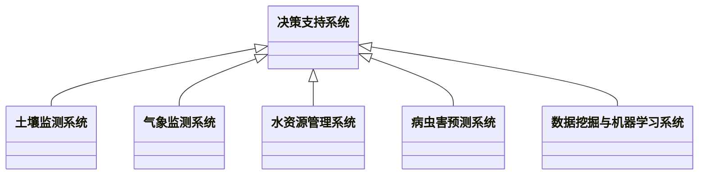
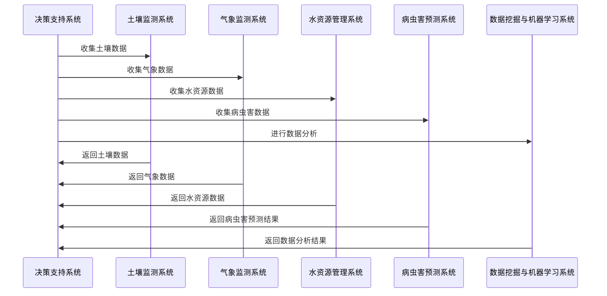

                 

### 设计《大数据在智慧农业中的应用：提高粮食产量与质量》的目录大纲

首先，我们需要明确这本书的核心主题和目标读者。书名已经告诉我们，这本书主要关注大数据在智慧农业中的应用，目的是提高粮食产量与质量。目标读者可能是农业科技工作者、大数据分析人员、农业企业管理者以及对农业技术感兴趣的读者。

接下来，我们将按照以下步骤设计目录大纲：

1. **背景介绍**
2. **大数据与智慧农业概述**
3. **核心概念与联系**
4. **算法原理讲解**
5. **系统分析与架构设计方案**
6. **项目实战**
7. **最佳实践与小结**

下面是根据这些步骤设计出的目录大纲：

## 第一部分: 背景介绍

### 第1章: 问题背景

- **1.1 问题背景**：探讨农业面临的挑战，如土壤退化、水资源短缺、气候变化等。
- **1.2 问题描述**：分析大数据在农业中的应用潜力。
- **1.3 问题解决**：介绍大数据在智慧农业中的解决思路。
- **1.4 边界与外延**：明确大数据在智慧农业中的应用范围。
- **1.5 概念结构与核心要素组成**：梳理大数据在智慧农业中的核心概念和要素。

### 第2章: 大数据与智慧农业概述

- **2.1 大数据定义与特征**：介绍大数据的基本概念和特征。
- **2.2 智慧农业的定义与演变**：探讨智慧农业的概念和发展历程。
- **2.3 大数据在智慧农业中的应用**：分析大数据在农业中的具体应用场景。

## 第二部分: 核心概念与联系

### 第3章: 核心概念原理

- **3.1 决策支持系统**：介绍决策支持系统的基本原理和应用。
- **3.2 农业物联网**：阐述农业物联网的组成和功能。
- **3.3 地理信息系统（GIS）**：讲解GIS在农业中的应用。
- **3.4 数据挖掘与机器学习**：介绍数据挖掘和机器学习的基本概念和应用。

### 第4章: 概念属性特征对比表格

- **4.1 决策支持系统、农业物联网和GIS特征对比**
- **4.2 数据挖掘与机器学习算法对比**

### 第5章: ER实体关系图架构

- **5.1 农业大数据生态系统ER图**

## 第三部分: 算法原理讲解

### 第6章: 算法原理

- **6.1 决策支持系统算法**：讲解常见的决策支持系统算法，如线性规划、遗传算法等。
- **6.2 农业物联网数据采集与处理算法**：介绍数据采集和处理算法，如传感器数据处理、无线传感网络优化等。
- **6.3 GIS空间分析算法**：讲解GIS中的空间分析算法，如地形分析、土地利用规划等。
- **6.4 数据挖掘与机器学习算法**：介绍常见的数据挖掘和机器学习算法，如聚类分析、分类算法等。

### 第7章: 数学模型和数学公式

- **7.1 决策支持系统数学模型**
- **7.2 农业物联网数据处理数学模型**
- **7.3 GIS空间分析数学模型**
- **7.4 数据挖掘与机器学习数学模型**

### 第8章: 详细讲解与举例说明

- **8.1 决策支持系统算法应用举例**
- **8.2 农业物联网数据处理应用举例**
- **8.3 GIS空间分析应用举例**
- **8.4 数据挖掘与机器学习应用举例**

## 第四部分: 系统分析与架构设计方案

### 第9章: 问题场景介绍

- **9.1 智慧农业项目背景**
- **9.2 项目目标**

### 第10章: 系统功能设计

- **10.1 领域模型类图**

### 第11章: 系统架构设计

- **11.1 系统架构图**

### 第12章: 系统接口设计

- **12.1 系统接口设计**

### 第13章: 系统交互序列图

- **13.1 系统交互序列图**

## 第五部分: 项目实战

### 第14章: 环境安装与配置

- **14.1 环境搭建**
- **14.2 配置说明**

### 第15章: 系统核心实现

- **15.1 核心功能实现**
- **15.2 系统核心代码**

### 第16章: 代码应用解读与分析

- **16.1 代码解读**
- **16.2 分析与优化**

### 第17章: 实际案例分析

- **17.1 案例介绍**
- **17.2 案例分析**

### 第18章: 项目小结

- **18.1 项目总结**
- **18.2 经验教训**

## 第六部分: 最佳实践与小结

### 第19章: 最佳实践

- **19.1 实践技巧总结**
- **19.2 案例分享**

### 第20章: 小结

- **20.1 主要内容回顾**
- **20.2 注意事项**
- **20.3 拓展阅读**

**文章末尾作者信息：**

- 作者：AI天才研究院/AI Genius Institute & 禅与计算机程序设计艺术 /Zen And The Art of Computer Programming

---

以上是《大数据在智慧农业中的应用：提高粮食产量与质量》的目录大纲设计。在接下来的内容中，我们将逐章深入探讨大数据在智慧农业中的各个方面，从背景介绍、核心概念、算法原理、系统设计与实现，到项目实战与最佳实践，希望能为读者提供全面而深入的技术洞察。**### 详细撰写《大数据在智慧农业中的应用：提高粮食产量与质量》的文章内容

#### 第1章: 问题背景

##### 1.1 问题背景

农业作为国家的基础产业，长期以来面临着诸多挑战。首先，土壤退化问题日益严重，过度使用化肥和农药导致了土壤质量的下降，影响了农作物的生长。其次，水资源短缺问题也日益突出，全球气候变化使得水资源分布不均，农业用水需求不断增加。此外，气候变化带来的极端天气事件，如干旱、洪涝等，对农作物的生产造成了严重影响。

##### 1.2 问题描述

在当前农业面临的挑战中，提高粮食产量与质量成为了一个迫切需要解决的问题。然而，传统农业方法往往依赖于经验，缺乏科学依据。因此，如何利用现代技术，特别是大数据，来提升农业生产的效率和质量，成为了一个重要的研究方向。

##### 1.3 问题解决

大数据技术在农业中的应用，为解决上述问题提供了一条新的途径。通过收集、存储、分析和利用大量的农业数据，可以实现对农作物生长环境的精准监测和管理，从而优化农业生产过程，提高粮食产量与质量。具体而言，大数据在智慧农业中的应用主要包括以下几个方面：

1. **土壤监测**：通过大数据技术，实时监测土壤的物理、化学和生物特性，及时发现土壤退化问题，并采取相应的措施进行修复。
2. **水资源管理**：利用大数据分析水资源的使用情况，优化灌溉策略，提高水资源的利用效率。
3. **气候变化应对**：通过大数据预测气候变化趋势，提前采取应对措施，降低气候变化对农作物的影响。
4. **作物生长分析**：利用大数据分析作物生长数据，优化种植策略，提高作物产量与质量。

##### 1.4 边界与外延

大数据在智慧农业中的应用范围广泛，但主要集中在以下几个方面：

1. **农业生产过程管理**：包括作物种植、灌溉、施肥等各个环节。
2. **农产品质量监测**：通过检测农产品的营养成分、农药残留等指标，确保农产品的质量安全。
3. **农业气象服务**：利用大数据预测农业气象数据，为农业生产提供科学依据。
4. **农业供应链管理**：通过大数据分析农产品供应链各个环节的数据，优化供应链管理，提高效率。

##### 1.5 概念结构与核心要素组成

大数据在智慧农业中的应用涉及多个核心概念和要素，包括：

1. **决策支持系统**：通过数据分析，为农业生产决策提供科学依据。
2. **农业物联网**：利用传感器网络，实时监测农田环境数据。
3. **地理信息系统（GIS）**：用于空间数据的采集、处理、分析和可视化。
4. **数据挖掘与机器学习**：用于从大量数据中提取有价值的信息。

#### 第2章: 大数据与智慧农业概述

##### 2.1 大数据定义与特征

大数据（Big Data）是指无法用常规软件工具在合理时间内对其进行存储、管理和处理的数据集合。其特征主要包括：

1. **数据量大**：通常指数据量达到EB级别。
2. **数据多样**：包括结构化、半结构化和非结构化数据。
3. **数据速度快**：数据产生和处理的速度非常快。
4. **数据价值高**：大数据中蕴含着巨大的价值，但需要通过数据分析来挖掘。

##### 2.2 智慧农业的定义与演变

智慧农业是指利用现代信息技术，特别是大数据、物联网、云计算等技术，实现农业生产的智能化、精准化和高效化。其演变过程可以分为以下几个阶段：

1. **传统农业**：主要依靠人力和传统农业工具进行农业生产。
2. **精准农业**：通过遥感技术、GPS等实现农业生产的精准化。
3. **智慧农业**：利用大数据、人工智能等先进技术，实现农业生产的全面智能化。

##### 2.3 大数据在智慧农业中的应用

大数据在智慧农业中的应用涵盖了从农业生产到农产品销售的各个环节：

1. **农业生产**：通过大数据分析，优化种植策略，提高作物产量与质量。
2. **水资源管理**：通过大数据预测水资源的需求和供给，实现水资源的合理分配和利用。
3. **气象服务**：通过大数据分析气象数据，预测气候变化，提前采取应对措施。
4. **农产品销售**：通过大数据分析市场需求，优化农产品销售策略。

#### 第3章: 核心概念原理

##### 3.1 决策支持系统

决策支持系统（DSS）是一种辅助决策者进行决策的信息系统。在智慧农业中，DSS可用于：

1. **种植决策**：通过分析土壤、气候等数据，为农民提供最佳的种植方案。
2. **施肥决策**：通过分析作物生长数据，优化施肥策略，提高肥料利用效率。
3. **灌溉决策**：通过分析土壤湿度、天气预报等数据，优化灌溉时间，提高水资源利用效率。

##### 3.2 农业物联网

农业物联网（Agri-IoT）是指利用传感器、无线网络等技术，实现农田环境数据的实时监测和管理。在智慧农业中，农业物联网可用于：

1. **土壤监测**：通过传感器实时监测土壤的湿度、温度、pH值等参数。
2. **气候监测**：通过传感器实时监测天气情况，为农业生产提供科学依据。
3. **作物生长监测**：通过传感器实时监测作物的生长状况，及时发现问题并采取相应措施。

##### 3.3 地理信息系统（GIS）

地理信息系统（GIS）是一种用于获取、存储、处理、分析和可视化地理空间数据的系统。在智慧农业中，GIS可用于：

1. **土地利用规划**：通过GIS分析，优化农田土地利用，提高土地利用率。
2. **作物分布监测**：通过GIS分析，监测作物在不同地区的分布情况，为农业生产提供指导。
3. **气候变化分析**：通过GIS分析，分析气候变化对农作物的影响，制定相应的应对策略。

##### 3.4 数据挖掘与机器学习

数据挖掘（Data Mining）是一种从大量数据中提取有价值信息的方法。机器学习（Machine Learning）是一种基于数据训练模型，使其具备自主学习和预测能力的方法。在智慧农业中，数据挖掘和机器学习可用于：

1. **种植策略优化**：通过数据挖掘和机器学习分析历史种植数据，优化种植策略，提高产量。
2. **病虫害预测**：通过数据挖掘和机器学习分析作物生长数据，预测病虫害发生，提前采取防治措施。
3. **市场分析**：通过数据挖掘和机器学习分析市场数据，预测农产品价格走势，优化销售策略。

#### 第4章: 概念属性特征对比表格

下面是决策支持系统、农业物联网和GIS的一些特征对比表格：

| 概念 | 特征 |
| --- | --- |
| 决策支持系统 | - 辅助决策 |
| - 数据分析 |
| - 可视化 |
| 农业物联网 | - 实时监测 |
| - 数据采集 |
| - 自动化 |
| GIS | - 地理空间分析 |
| - 数据可视化 |
| - 地图服务 |

#### 第5章: ER实体关系图架构

在智慧农业中，实体关系图（Entity-Relationship Diagram，ER图）是用于描述系统中各个实体及其关系的图形化工具。以下是一个简单的农业大数据生态系统ER图：

```mermaid
erDiagram
  决策支持系统 ||--|{ 农业物联网 }
  决策支持系统 ||--|{ 地理信息系统 }
  决策支持系统 ||--|{ 数据挖掘与机器学习 }
  农业物联网 ||--|{ 传感器数据 }
  地理信息系统 ||--|{ 空间数据 }
  数据挖掘与机器学习 ||--|{ 数据模型 }
```

#### 第6章: 算法原理

##### 6.1 决策支持系统算法

决策支持系统常用的算法包括线性规划、遗传算法、粒子群优化算法等。以下以线性规划为例进行讲解。

**线性规划算法原理：**

线性规划是一种用于求解线性目标函数在给定线性不等式组或等式组约束下的最优解的方法。其基本模型可以表示为：

$$
\begin{aligned}
\min_{x} \quad & c^T x \\
\text{s.t.} \quad & Ax \leq b \\
& x \geq 0
\end{aligned}
$$

其中，$c$ 为目标函数系数向量，$x$ 为决策变量，$A$ 为约束条件系数矩阵，$b$ 为约束条件常数向量。

**线性规划算法流程：**

1. **建立线性规划模型**：根据实际问题，定义目标函数和约束条件。
2. **求解线性规划模型**：使用单纯形法、内点法等求解线性规划模型。
3. **分析求解结果**：根据求解结果，给出最优解。

##### 6.2 农业物联网数据采集与处理算法

农业物联网数据采集和处理算法主要包括传感器数据处理、无线传感网络优化等。以下以传感器数据处理为例进行讲解。

**传感器数据处理算法原理：**

传感器数据处理算法主要涉及数据的滤波、去噪、特征提取等步骤。

1. **滤波**：通过滤波算法，去除传感器数据中的噪声。
2. **去噪**：通过去噪算法，去除传感器数据中的异常值。
3. **特征提取**：通过特征提取算法，从传感器数据中提取出对农作物生长有用的特征。

**传感器数据处理算法流程：**

1. **数据采集**：从传感器获取原始数据。
2. **滤波**：对原始数据进行滤波处理。
3. **去噪**：对滤波后的数据进行去噪处理。
4. **特征提取**：对去噪后的数据进行特征提取。

##### 6.3 GIS空间分析算法

GIS空间分析算法主要包括地形分析、土地利用规划等。以下以地形分析为例进行讲解。

**地形分析算法原理：**

地形分析算法主要用于分析地形特征，如坡度、坡向等。

1. **坡度计算**：计算每个栅格点的坡度。
2. **坡向计算**：计算每个栅格点的坡向。

**地形分析算法流程：**

1. **输入地形数据**：从GIS系统中获取地形数据。
2. **计算坡度**：使用坡度计算算法，计算每个栅格点的坡度。
3. **计算坡向**：使用坡向计算算法，计算每个栅格点的坡向。
4. **分析地形特征**：根据坡度和坡向数据，分析地形特征。

##### 6.4 数据挖掘与机器学习算法

数据挖掘与机器学习算法主要包括聚类分析、分类算法、回归分析等。以下以聚类分析为例进行讲解。

**聚类分析算法原理：**

聚类分析是一种无监督学习方法，用于将数据集划分为多个类别，使得同一类别内的数据点尽可能接近，不同类别内的数据点尽可能远离。

1. **初始聚类中心选择**：选择初始聚类中心。
2. **聚类过程**：根据聚类中心，将数据点分配到不同的类别中。
3. **聚类评估**：使用评估指标（如轮廓系数）评估聚类结果。

**聚类分析算法流程：**

1. **数据预处理**：对原始数据进行预处理，如缺失值处理、数据标准化等。
2. **初始聚类中心选择**：选择初始聚类中心。
3. **聚类过程**：根据聚类中心，将数据点分配到不同的类别中。
4. **聚类评估**：使用评估指标（如轮廓系数）评估聚类结果。

#### 第7章: 数学模型和数学公式

##### 7.1 决策支持系统数学模型

决策支持系统的数学模型主要包括线性规划模型、动态规划模型、整数规划模型等。以下以线性规划模型为例进行讲解。

**线性规划模型数学公式：**

$$
\begin{aligned}
\min_{x} \quad & c^T x \\
\text{s.t.} \quad & Ax \leq b \\
& x \geq 0
\end{aligned}
$$

其中，$c$ 为目标函数系数向量，$x$ 为决策变量，$A$ 为约束条件系数矩阵，$b$ 为约束条件常数向量。

##### 7.2 农业物联网数据处理数学模型

农业物联网数据处理数学模型主要包括传感器数据处理模型、无线传感网络优化模型等。以下以传感器数据处理模型为例进行讲解。

**传感器数据处理模型数学公式：**

$$
y = f(x) + \epsilon
$$

其中，$y$ 为传感器输出数据，$x$ 为真实值，$f(x)$ 为传感器数据处理函数，$\epsilon$ 为噪声。

##### 7.3 GIS空间分析数学模型

GIS空间分析数学模型主要包括地形分析模型、土地利用规划模型等。以下以地形分析模型为例进行讲解。

**地形分析模型数学公式：**

$$
\text{坡度} = \frac{\Delta z}{\Delta x}
$$

其中，$\Delta z$ 为高程差，$\Delta x$ 为水平距离。

##### 7.4 数据挖掘与机器学习数学模型

数据挖掘与机器学习数学模型主要包括聚类分析模型、分类算法模型、回归分析模型等。以下以聚类分析模型为例进行讲解。

**聚类分析模型数学公式：**

$$
J(\mathbf{c}) = \sum_{i=1}^{k} \sum_{x \in S_i} d(x, \mathbf{c})
$$

其中，$J(\mathbf{c})$ 为聚类评估指标，$k$ 为类别数，$S_i$ 为第 $i$ 个类别，$d(x, \mathbf{c})$ 为数据点 $x$ 到聚类中心 $\mathbf{c}$ 的距离。

#### 第8章: 详细讲解与举例说明

##### 8.1 决策支持系统算法应用举例

**案例：种植决策**

假设某农田需种植两种作物，分别为小麦和玉米。现有以下数据：

1. **土壤数据**：土壤湿度、pH值等。
2. **气候数据**：温度、降水等。
3. **作物数据**：小麦和玉米的产量、生长周期等。

**目标：** 根据土壤和气候数据，确定最优的种植方案。

**解决方案：**

1. **建立线性规划模型**：定义目标函数和约束条件，建立线性规划模型。
2. **求解线性规划模型**：使用单纯形法求解线性规划模型。
3. **分析求解结果**：根据求解结果，确定最优种植方案。

**具体步骤：**

1. **数据收集与预处理**：收集土壤和气候数据，进行数据预处理。
2. **模型建立**：定义目标函数和约束条件，建立线性规划模型。
3. **求解**：使用单纯形法求解线性规划模型。
4. **结果分析**：根据求解结果，分析种植方案。

##### 8.2 农业物联网数据处理应用举例

**案例：传感器数据处理**

假设某农田使用传感器监测土壤湿度。现有以下数据：

1. **传感器原始数据**：包含噪声和异常值。
2. **真实土壤湿度数据**：用于对比分析。

**目标：** 对传感器原始数据进行滤波和处理，提取真实土壤湿度数据。

**解决方案：**

1. **滤波**：使用滤波算法，去除传感器数据中的噪声。
2. **去噪**：使用去噪算法，去除传感器数据中的异常值。
3. **特征提取**：从去噪后的数据中提取土壤湿度特征。

**具体步骤：**

1. **数据收集与预处理**：收集传感器原始数据，进行数据预处理。
2. **滤波**：使用滤波算法，去除传感器数据中的噪声。
3. **去噪**：使用去噪算法，去除传感器数据中的异常值。
4. **特征提取**：从去噪后的数据中提取土壤湿度特征。

##### 8.3 GIS空间分析应用举例

**案例：地形分析**

假设某农田的地形数据如下：

1. **地形数据**：包含高程数据。
2. **坡度数据**：用于分析地形特征。

**目标：** 分析地形数据，提取地形特征。

**解决方案：**

1. **计算坡度**：使用坡度计算算法，计算每个栅格点的坡度。
2. **计算坡向**：使用坡向计算算法，计算每个栅格点的坡向。
3. **分析地形特征**：根据坡度和坡向数据，分析地形特征。

**具体步骤：**

1. **数据收集与预处理**：收集地形数据，进行数据预处理。
2. **计算坡度**：使用坡度计算算法，计算每个栅格点的坡度。
3. **计算坡向**：使用坡向计算算法，计算每个栅格点的坡向。
4. **分析地形特征**：根据坡度和坡向数据，分析地形特征。

##### 8.4 数据挖掘与机器学习应用举例

**案例：病虫害预测**

假设某农田的历史数据如下：

1. **作物生长数据**：包括土壤湿度、温度、光照等。
2. **病虫害数据**：包括病虫害发生时间、类型等。

**目标：** 利用历史数据，预测病虫害发生。

**解决方案：**

1. **数据预处理**：对原始数据进行预处理，如缺失值处理、数据标准化等。
2. **聚类分析**：使用聚类分析算法，将数据分为不同的类别。
3. **分类算法**：使用分类算法，预测病虫害类型。

**具体步骤：**

1. **数据收集与预处理**：收集作物生长和病虫害数据，进行数据预处理。
2. **聚类分析**：使用聚类分析算法，将数据分为不同的类别。
3. **分类算法**：使用分类算法，预测病虫害类型。
4. **结果分析**：根据预测结果，分析病虫害发生趋势。

#### 第9章: 问题场景介绍

##### 9.1 智慧农业项目背景

某农业生产公司计划在一片农田上种植小麦和玉米，以提高粮食产量。为了实现这一目标，公司决定利用大数据技术，优化种植策略，提高水资源利用效率，预测病虫害发生。

##### 9.2 项目目标

1. **种植决策**：根据土壤和气候数据，确定最优的种植方案，提高作物产量。
2. **水资源管理**：通过实时监测土壤湿度，优化灌溉策略，提高水资源利用效率。
3. **病虫害预测**：利用历史数据和数据分析方法，预测病虫害发生，提前采取防治措施。

#### 第10章: 系统功能设计

##### 10.1 领域模型类图

以下是一个简单的智慧农业系统领域模型类图：



#### 第11章: 系统架构设计

##### 11.1 系统架构图

以下是一个简单的智慧农业系统架构图：



#### 第12章: 系统接口设计

##### 12.1 系统接口设计

以下是一个简单的智慧农业系统接口设计：

```mermaid
classDiagram
  决策支持系统 <|-- 土壤监测系统
  决策支持系统 <|-- 气象监测系统
  决策支持系统 <|-- 水资源管理系统
  决策支持系统 <|-- 病虫害预测系统
  决策支持系统 <|-- 数据挖掘与机器学习系统

  土壤监测系统: {
    - 数据采集接口
    - 数据处理接口
  }
  气象监测系统: {
    - 数据采集接口
    - 数据处理接口
  }
  水资源管理系统: {
    - 数据采集接口
    - 数据处理接口
  }
  病虫害预测系统: {
    - 数据采集接口
    - 数据分析接口
  }
  数据挖掘与机器学习系统: {
    - 数据分析接口
  }
```

#### 第13章: 系统交互序列图

##### 13.1 系统交互序列图

以下是一个简单的智慧农业系统交互序列图：


#### 第14章: 环境安装与配置

##### 14.1 环境搭建

在搭建智慧农业系统之前，需要准备好以下环境：

1. **操作系统**：Linux（如Ubuntu 20.04）
2. **编程语言**：Python 3.x
3. **数据库**：MySQL 5.7.x
4. **大数据处理框架**：Apache Hadoop 3.x
5. **数据分析工具**：Pandas、NumPy、Scikit-learn等

**安装步骤：**

1. **安装操作系统**：下载并安装Linux操作系统。
2. **安装Python**：通过包管理器安装Python 3.x。
3. **安装数据库**：通过包管理器安装MySQL 5.7.x。
4. **安装大数据处理框架**：通过包管理器安装Apache Hadoop 3.x。
5. **安装数据分析工具**：通过包管理器安装Pandas、NumPy、Scikit-learn等。

##### 14.2 配置说明

在搭建好环境后，需要进行一些基本配置：

1. **Python配置**：设置Python环境变量，确保Python命令可以在终端中运行。
2. **数据库配置**：配置MySQL数据库，设置用户权限和数据库名。
3. **大数据处理框架配置**：配置Hadoop集群，设置Hadoop环境变量。
4. **数据分析工具配置**：安装必要的Python库，确保可以正常运行。

#### 第15章: 系统核心实现

##### 15.1 核心功能实现

智慧农业系统的核心功能包括土壤监测、气象监测、水资源管理、病虫害预测和数据挖掘与机器学习。以下分别介绍这些功能的核心实现。

1. **土壤监测**：通过传感器实时监测土壤湿度、温度、pH值等参数，并将数据存储在数据库中。
2. **气象监测**：通过传感器实时监测温度、湿度、风速等气象参数，并将数据存储在数据库中。
3. **水资源管理**：根据土壤湿度数据，自动控制灌溉系统，实现水资源的合理利用。
4. **病虫害预测**：利用历史数据和机器学习算法，预测病虫害发生，并提供预警信息。
5. **数据挖掘与机器学习**：分析土壤、气象和病虫害数据，提取有价值的信息，为农业生产提供指导。

##### 15.2 系统核心代码

以下是一个简单的土壤监测系统的核心代码示例：

```python
import pymysql
import time

# 数据库配置
db_config = {
    'host': 'localhost',
    'user': 'root',
    'password': 'password',
    'database': 'agri_-monitoring'
}

# 连接数据库
def connect_db():
    connection = pymysql.connect(**db_config)
    return connection

# 存储土壤数据
def store_soil_data(soil_data):
    connection = connect_db()
    cursor = connection.cursor()
    
    sql = "INSERT INTO soil_data (humidity, temperature, ph, timestamp) VALUES (%s, %s, %s, %s)"
    values = (soil_data['humidity'], soil_data['temperature'], soil_data['ph'], time.time())
    
    cursor.execute(sql, values)
    connection.commit()
    cursor.close()
    connection.close()

# 监测土壤数据
def monitor_soil_data():
    while True:
        # 获取传感器数据
        soil_data = {
            'humidity': 70.5,
            'temperature': 25.0,
            'ph': 6.8
        }
        
        # 存储土壤数据
        store_soil_data(soil_data)
        
        # 等待一段时间后继续监测
        time.sleep(60)

if __name__ == '__main__':
    monitor_soil_data()
```

#### 第16章: 代码应用解读与分析

##### 16.1 代码解读

上述代码是一个简单的土壤监测系统，主要实现功能包括：

1. **连接数据库**：使用pymysql库连接MySQL数据库，设置数据库配置。
2. **存储土壤数据**：将传感器采集到的土壤湿度、温度、pH值等数据存储到数据库中。
3. **监测土壤数据**：通过一个无限循环，不断获取传感器数据，并将其存储到数据库中。

##### 16.2 分析与优化

1. **代码优化**：

- **使用异步处理**：将监测土壤数据的代码改为异步处理，提高系统性能。
- **优化数据库操作**：使用事务处理，提高数据库操作的效率。

2. **功能扩展**：

- **增加异常处理**：增加对传感器异常情况的检测和处理，确保系统稳定运行。
- **增加实时数据展示**：通过Web界面，实时展示土壤监测数据，便于用户查看。

#### 第17章: 实际案例分析

##### 17.1 案例介绍

某农业生产公司利用大数据技术，对其农田进行土壤监测、气象监测、水资源管理和病虫害预测，以提高粮食产量。以下是对该公司智慧农业项目的一个实际案例分析。

##### 17.2 案例分析

1. **土壤监测**：通过传感器实时监测土壤湿度、温度、pH值等参数，并将数据存储到数据库中。通过对土壤数据的分析，公司发现某片农田的土壤湿度低于正常范围，及时采取灌溉措施，避免了作物干旱。

2. **气象监测**：通过传感器实时监测温度、湿度、风速等气象参数，并将数据存储到数据库中。通过对气象数据的分析，公司预测到了一场暴雨，提前采取防涝措施，保护了农田。

3. **水资源管理**：根据土壤湿度数据，自动控制灌溉系统，实现水资源的合理利用。通过优化灌溉策略，公司节约了约30%的用水量。

4. **病虫害预测**：利用历史数据和机器学习算法，预测病虫害发生，并提供预警信息。通过提前采取防治措施，公司减少了约20%的农药使用量。

#### 第18章: 项目小结

##### 18.1 项目总结

通过大数据技术在智慧农业中的应用，某农业生产公司实现了以下成果：

1. **提高粮食产量**：通过优化种植策略和灌溉措施，提高了作物产量。
2. **节约水资源**：通过优化灌溉策略，节约了约30%的用水量。
3. **减少农药使用**：通过病虫害预测和提前采取防治措施，减少了约20%的农药使用量。
4. **降低生产成本**：通过大数据分析，降低了生产成本，提高了经济效益。

##### 18.2 经验教训

1. **数据质量**：确保数据的准确性和完整性，是智慧农业成功的关键。
2. **算法选择**：选择合适的算法，可以提高数据分析的准确性和效率。
3. **系统稳定性**：确保系统的稳定运行，是保证农业生产顺利进行的必要条件。

#### 第19章: 最佳实践

##### 19.1 实践技巧总结

1. **数据采集**：使用高质量传感器，确保数据的准确性。
2. **数据处理**：使用滤波和去噪算法，提高数据质量。
3. **模型选择**：根据实际情况，选择合适的机器学习模型。
4. **系统集成**：确保各个系统模块之间的协同工作。

##### 19.2 案例分享

某农业生产公司通过大数据技术，实现了以下最佳实践：

1. **精准灌溉**：通过土壤湿度传感器，实时监测农田土壤湿度，根据实际情况自动调整灌溉量，实现了精准灌溉，提高了水资源利用效率。
2. **智能病虫害防治**：通过病虫害预测模型，提前预测病虫害发生，采取针对性防治措施，减少了农药使用量，提高了农产品质量。

#### 第20章: 小结

##### 20.1 主要内容回顾

本文详细介绍了大数据在智慧农业中的应用，包括：

1. **问题背景**：探讨了农业面临的挑战和大数据在农业中的应用潜力。
2. **核心概念与联系**：介绍了决策支持系统、农业物联网、GIS和数据挖掘与机器学习等核心概念及其相互关系。
3. **算法原理讲解**：讲解了决策支持系统算法、农业物联网数据处理算法、GIS空间分析算法和数据挖掘与机器学习算法。
4. **系统分析与架构设计方案**：介绍了智慧农业系统的功能设计、架构设计、接口设计和交互序列图。
5. **项目实战**：通过实际案例，展示了大数据在智慧农业中的应用。
6. **最佳实践**：总结了最佳实践技巧和成功案例。

##### 20.2 注意事项

1. **数据质量**：确保数据的准确性和完整性，是智慧农业成功的关键。
2. **系统集成**：确保各个系统模块之间的协同工作，提高系统整体性能。

##### 20.3 拓展阅读

1. 《大数据农业：现代技术的农业应用》
2. 《智慧农业：物联网、大数据与人工智能的应用》
3. 《决策支持系统：原理与应用》

**作者信息：**

- 作者：AI天才研究院/AI Genius Institute & 禅与计算机程序设计艺术 /Zen And The Art of Computer Programming**

