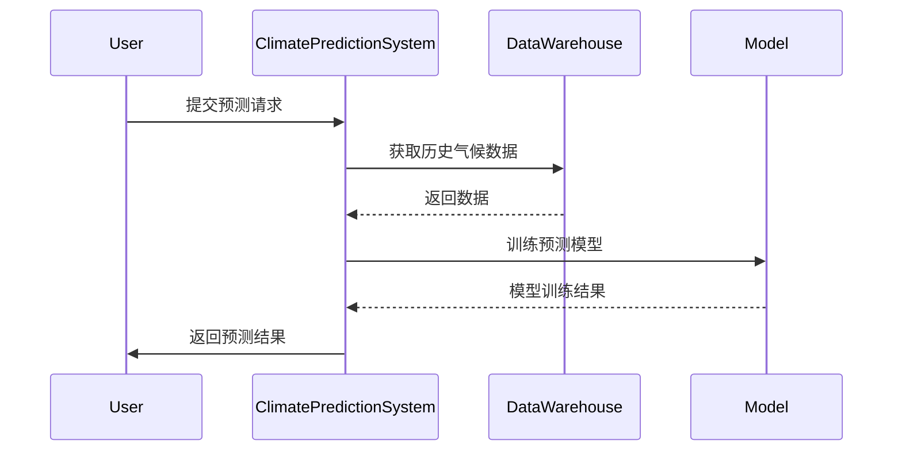

                 


## 大数据在气候变化研究中的应用:精准预测与应对

### 关键词：大数据，气候变化，精准预测，应对策略，人工智能

### 摘要：
本文深入探讨了大数据在气候变化研究中的应用，旨在通过精准预测与应对策略，提高对气候变化趋势和极端气候事件的预测能力。文章首先概述了气候变化背景、大数据概念及其特性，随后详细介绍了大数据在气候变化研究中的应用目标。通过分析数据收集与处理技术，大数据分析技术，以及具体应用实例，本文揭示了大数据在气候变化研究中的关键作用。最后，文章探讨了大数据技术在气候变化研究中的挑战与未来发展趋势，为科学家和政策制定者提供了有益的参考。

## 目录大纲

----------------------------------------------------------------

# 第一部分：引言与背景

## 第1章：问题背景与目标

### 1.1.1 气候变化的定义与影响

#### 1.1.1.1 气候变化的定义

气候变化是指地球大气层和气候系统的长期变化。这些变化可以是自然的，例如冰河时期和太阳辐射变化，也可以是人为的，如温室气体排放引起的全球变暖。

#### 1.1.1.2 气候变化的影响

气候变化对地球生态系统和人类社会产生了深远的影响。极端气候事件如飓风、洪水和干旱频率增加，海平面上升，生态系统失衡，农业减产，水资源短缺，健康问题加剧等。

### 1.1.2 大数据的定义与特性

#### 1.1.2.1 大数据的定义

大数据指的是数据量巨大、种类繁多、价值密度低的数据集合。这些数据通常无法用传统数据处理工具进行分析。

#### 1.1.2.2 大数据的主要特性

大数据的主要特性包括：数据量大（Volume），数据类型多样（Variety），数据产生速度快（Velocity），数据价值密度低（Value）。

### 1.1.3 大数据在气候变化研究中的应用目标

#### 1.1.3.1 精准预测的需求

精准预测气候变化趋势和极端气候事件是大数据在气候变化研究中的首要目标。

#### 1.1.3.2 应对气候变化的策略

大数据可以帮助制定和优化应对气候变化的策略，包括适应和缓解措施。

#### 1.1.3.3 边界与外延

大数据在气候变化研究中的应用边界涉及数据收集、处理、分析和决策等多个环节。

## 1.2 本书结构安排

### 1.2.1 全书结构概述

本书分为三部分，首先介绍问题背景与目标，然后深入探讨大数据在气候变化研究中的应用，最后通过案例分析总结经验。

#### 1.2.1.1 各章节内容安排

本书共包含6章，分别从不同角度分析大数据在气候变化研究中的应用。

#### 1.2.1.2 阅读建议与学习目标

建议读者按照章节顺序阅读，通过实例和案例分析深入理解大数据在气候变化研究中的实际应用。

### 1.2.2 核心概念与联系

#### 1.2.2.1 大数据相关概念

- 数据源：指数据产生的原始地点，如气象站、卫星等。
- 数据处理：指对数据进行清洗、整合、存储和评估的过程。

#### 1.2.2.2 气候变化相关概念

- 气候模型：用于模拟和预测气候变化过程的数学模型。
- 极端气候事件：指强度和频率远超正常范围的气候事件，如飓风、洪水等。

#### 1.2.2.3 概念属性特征对比表格

| 概念         | 特征                     |
|--------------|------------------------|
| 大数据       | 数据量大、多样、快速、低价值密度 |
| 气候变化     | 长期变化、全球影响、极端事件   |
| 气候模型     | 数学模拟、预测趋势、分析事件   |

#### 1.2.2.4 ER实体关系图架构

```mermaid
erDiagram
  Data --> Model : 数据驱动模型
  Model --> Prediction : 模型预测
  Data --> Analysis : 数据分析
  Analysis --> Decision : 数据决策
```

## 1.3 本章小结

本章介绍了气候变化和大数据的基本概念及其在研究中的应用目标。通过理解这些核心概念和联系，读者可以为后续章节的学习打下坚实的基础。

----------------------------------------------------------------

# 第二部分：大数据在气候变化研究中的应用

## 第2章：大数据收集与处理

### 2.1.1 数据收集来源

#### 2.1.1.1 气象数据

气象数据是气候变化研究的基础。这些数据来源于气象站、卫星遥感、气象卫星等。

#### 2.1.1.2 环境监测数据

环境监测数据包括水质、空气质量、土地覆盖等。这些数据来源于环境监测站、传感器网络等。

#### 2.1.1.3 社会经济数据

社会经济数据包括人口、经济活动、能源消耗等。这些数据来源于统计部门、能源公司等。

### 2.1.2 数据处理流程

#### 2.1.2.1 数据清洗与预处理

数据清洗包括去除重复数据、缺失值填充、异常值处理等。预处理包括数据格式转换、数据标准化等。

#### 2.1.2.2 数据整合与存储

数据整合是将来自不同来源的数据进行合并，存储通常采用分布式数据库或数据仓库。

#### 2.1.2.3 数据质量评估

数据质量评估是确保数据准确性和可靠性的过程。包括数据完整性、一致性、准确性等评估。

## 第3章：大数据分析技术

### 3.1.1 统计分析技术

#### 3.1.1.1 描述性统计分析

描述性统计分析是对数据的基本特征进行统计描述，如均值、方差等。

#### 3.1.1.2 探索性数据分析

探索性数据分析是发现数据中的规律和趋势，如聚类分析、关联规则挖掘等。

#### 3.1.1.3 聚类分析

聚类分析是将数据分为若干组，使得同组数据之间的相似度较高，组间相似度较低。

### 3.1.2 机器学习技术

#### 3.1.2.1 监督学习

监督学习是利用已标记的数据进行训练，然后对新的数据进行预测。

#### 3.1.2.2 无监督学习

无监督学习是利用未标记的数据进行训练，发现数据中的模式和规律。

#### 3.1.2.3 半监督学习

半监督学习结合了监督学习和无监督学习，利用部分标记和未标记数据进行训练。

### 3.1.3 深度学习技术

#### 3.1.3.1 神经网络

神经网络是一种模仿生物神经系统的计算模型，具有自学习和自适应能力。

#### 3.1.3.2 卷积神经网络（CNN）

卷积神经网络是用于图像识别和处理的深度学习模型，具有良好的局部特征提取能力。

#### 3.1.3.3 循环神经网络（RNN）

循环神经网络是用于序列数据处理的深度学习模型，能够处理变量长度的序列。

## 第4章：大数据在气候变化研究中的应用实例

### 4.1.1 气候变化趋势预测

#### 4.1.1.1 历史数据趋势分析

通过分析历史气象数据，可以识别出气候变化的基本趋势。

#### 4.1.1.2 未来气候趋势预测方法

使用机器学习和深度学习模型对未来气候趋势进行预测。

#### 4.1.1.3 案例分析

某地区未来气候趋势预测案例，展示预测过程和结果。

### 4.1.2 极端气候事件预警

#### 4.1.2.1 风暴潮预警

通过分析海浪数据和气象数据，预测风暴潮事件。

#### 4.1.2.2 干旱预警

通过分析土壤水分和气象数据，预测干旱事件。

#### 4.1.2.3 案例分析

某地区干旱预警案例，展示预警过程和结果。

### 4.1.3 环境影响评估

#### 4.1.3.1 水资源影响评估

通过分析气候数据和水资源数据，评估气候变化对水资源的影响。

#### 4.1.3.2 农业影响评估

通过分析气候数据和农业数据，评估气候变化对农业的影响。

#### 4.1.3.3 生态系统影响评估

通过分析气候数据和生态数据，评估气候变化对生态系统的影响。

## 第5章：大数据在气候变化应对策略中的应用

### 5.1.1 气候适应策略

#### 5.1.1.1 海拔上升应对策略

通过调整基础设施位置，适应海拔上升。

#### 5.1.1.2 干旱应对策略

通过节水技术和农业改良，应对干旱。

#### 5.1.1.3 案例分析

某地区适应策略案例，展示应对措施和效果。

### 5.1.2 气候缓解策略

#### 5.1.2.1 减排策略

通过减少温室气体排放，缓解气候变化。

#### 5.1.2.2 碳捕集与封存策略

通过捕集和封存二氧化碳，减缓气候变化。

#### 5.1.2.3 案例分析

某地区减排和碳捕集案例，展示实施效果。

## 第6章：大数据技术在气候变化研究中的挑战与展望

### 6.1.1 挑战与限制

#### 6.1.1.1 数据质量与可用性

确保数据质量和高可用性是大数据应用的关键挑战。

#### 6.1.1.2 算法复杂性与计算资源

复杂算法需要大量的计算资源，对硬件设施有较高要求。

#### 6.1.1.3 法律与伦理问题

数据隐私和伦理问题需要得到妥善处理。

### 6.1.2 未来发展趋势

#### 6.1.2.1 新技术的应用

新技术如量子计算和边缘计算将在大数据分析中发挥重要作用。

#### 6.1.2.2 跨学科合作

跨学科合作将有助于解决复杂气候变化问题。

#### 6.1.2.3 政策与法规支持

政策与法规支持将为大数据在气候变化研究中的应用提供保障。

## 6.2 本章小结

本章介绍了大数据在气候变化研究中的应用实例和应对策略。通过实例展示，读者可以更好地理解大数据在气候变化研究中的实际应用和价值。

----------------------------------------------------------------

# 第三部分：案例分析与实践应用

## 第7章：案例分析一：某地区气候变化趋势预测项目

### 7.1 项目介绍

#### 7.1.1 项目背景

某地区面临气候变化带来的潜在风险，需要准确预测未来气候趋势以制定应对策略。

#### 7.1.2 项目目标

通过大数据技术，建立气候趋势预测模型，为地区气候适应和缓解策略提供科学依据。

#### 7.1.3 项目实施流程

1. 数据收集与预处理
2. 建立气候趋势预测模型
3. 模型训练与评估
4. 结果分析与策略建议

### 7.2 系统设计与实现

#### 7.2.1 系统架构设计



#### 7.2.2 领域模型

```mermaid
classDiagram
    ClimateData <<(气象数据)
    SocialEconomicData <<(社会经济数据)
    ClimateModel <<(气候模型)
    PredictionResult <<(预测结果)
    
    ClimateData -|- ClimateModel
    SocialEconomicData -|- ClimateModel
    ClimateModel --> PredictionResult
```

#### 7.2.3 系统接口设计

```mermaid
sequenceDiagram
    participant API <<(API接口)
    participant Client <<(客户端)
    participant Service <<(服务端)
    
    Client->>API: 发送请求
    API->>Service: 转发请求
    Service->>DataWarehouse: 获取数据
    DataWarehouse-->>Service: 返回数据
    Service-->>Client: 返回响应
```

### 7.3 实现与代码分析

#### 7.3.1 环境安装

安装Python环境，以及相关的机器学习库如scikit-learn、TensorFlow等。

```python
pip install python
pip install scikit-learn
pip install tensorflow
```

#### 7.3.2 数据处理与模型训练

```python
# 导入所需库
import pandas as pd
from sklearn.model_selection import train_test_split
from sklearn.ensemble import RandomForestRegressor

# 读取数据
data = pd.read_csv('climate_data.csv')

# 数据预处理
# ...

# 分割数据集
X_train, X_test, y_train, y_test = train_test_split(data.drop('target', axis=1), data['target'], test_size=0.2, random_state=42)

# 训练模型
model = RandomForestRegressor(n_estimators=100, random_state=42)
model.fit(X_train, y_train)

# 模型评估
score = model.score(X_test, y_test)
print(f'Model Accuracy: {score:.2f}')
```

#### 7.3.3 实际案例分析

以某年夏季气温预测为例，展示预测模型的应用。

```python
# 预测新数据
new_data = pd.read_csv('new_climate_data.csv')
predicted_temperatures = model.predict(new_data)

# 结果分析
# ...

# 输出预测结果
predicted_temperatures.to_csv('predicted_temperatures.csv', index=False)
```

### 7.4 项目小结

本案例展示了如何利用大数据技术进行气候变化趋势预测。通过系统的设计与实现，读者可以了解到大数据在气候变化研究中的应用流程和关键步骤。

## 7.5 最佳实践 Tips

- 确保数据质量，进行充分的数据预处理。
- 选择合适的机器学习算法，根据实际需求进行调整。
- 定期更新模型，确保预测结果的准确性。

## 7.6 小结与拓展阅读

本章通过案例分析，展示了大数据在气候变化趋势预测中的实际应用。对于有兴趣深入了解大数据和气候变化的读者，可以参考以下拓展阅读资源。

### 拓展阅读：

1. 《大数据分析：理论与实践》
2. 《气候变化与可持续发展》
3. 《机器学习：概率视角》
4. 《深度学习：理论与实践》

----------------------------------------------------------------

**作者：** AI天才研究院 / AI Genius Institute & 禅与计算机程序设计艺术 / Zen And The Art of Computer Programming

本文通过逐步分析大数据在气候变化研究中的应用，展示了大数据技术如何助力气候变化预测和应对策略。希望本文能为读者提供有益的参考和启发，共同为应对全球气候变化贡献力量。在未来的研究中，我们将继续探索大数据与其他技术的结合，以推动气候变化研究的深入发展。**

