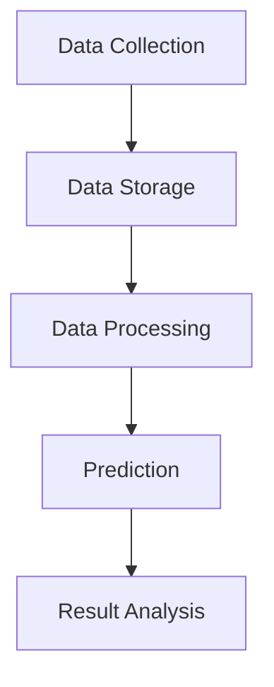
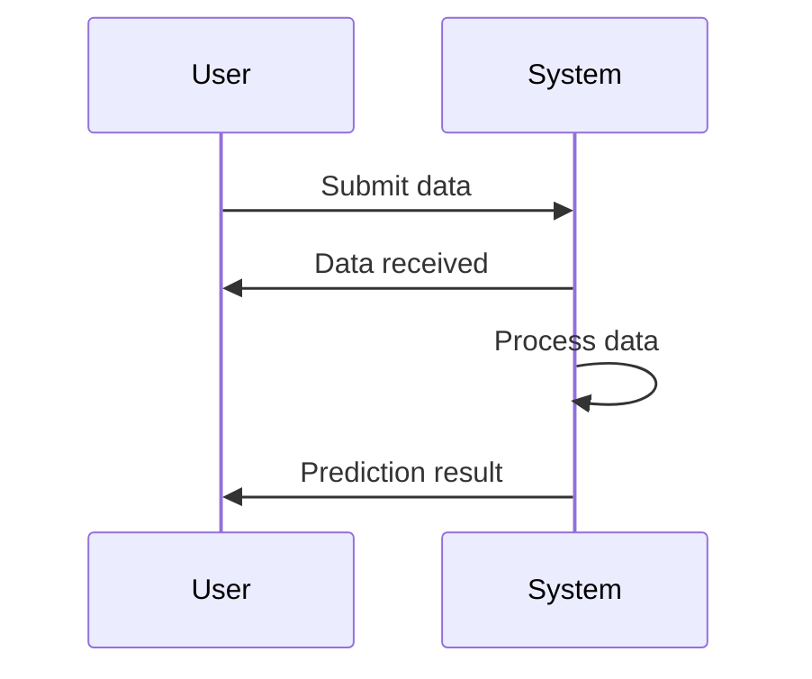
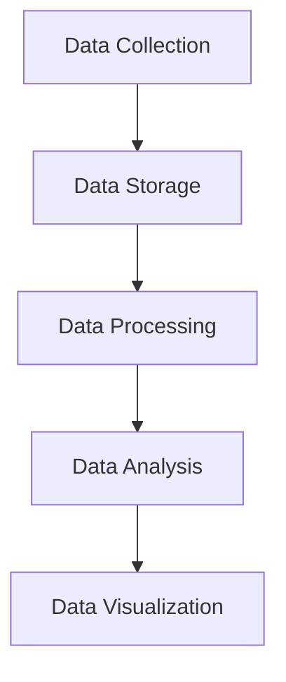
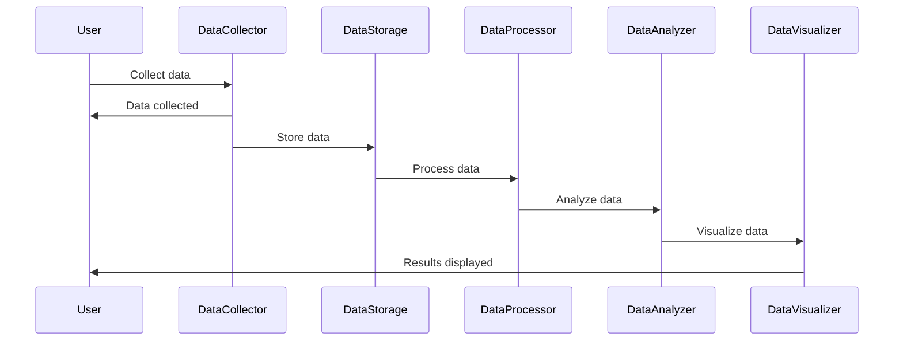

                 


## 大数据在气候变化研究中的应用：精准预测与应对策略

### 关键词：大数据，气候变化，预测，应对策略，机器学习，深度学习

### 摘要：
随着全球气候变化问题的日益严峻，准确预测气候变化趋势和制定有效的应对策略变得至关重要。大数据技术的发展为气候变化研究提供了新的工具和方法。本文将探讨大数据在气候变化研究中的应用，包括核心概念、预测算法、数学模型、系统架构以及实际案例，旨在为科学家和政策制定者提供有益的参考。

## 第一步：背景介绍

### 1.1 问题背景

#### 1.1.1 气候变化的重要性

气候变化是全球面临的最严重挑战之一。它不仅影响生态系统，还威胁到人类社会的可持续发展。了解气候变化的趋势和影响因素，制定有效的应对策略，对于减少气候变化带来的风险至关重要。

#### 1.1.2 大数据在气候变化研究中的应用现状

大数据技术的发展为气候变化研究带来了新的机遇。通过对海量气候数据的分析，科学家可以更好地理解气候变化的原因和趋势，从而提高预测的准确性。然而，大数据在气候变化研究中的应用仍面临诸多挑战。

#### 1.1.3 书籍的目的和结构

本书旨在系统地介绍大数据在气候变化研究中的应用，包括核心概念、预测算法、数学模型、系统架构和实际案例。通过逐步分析，读者可以深入了解大数据在气候变化研究中的关键作用。

## 第二步：核心概念与联系

### 1.2 大数据和气候变化的联系

#### 1.2.1 大数据的定义与特点

大数据是指数据量巨大、类型繁多且增长迅速的数据集。其特点包括高速、海量、多样性和真实性。

#### 1.2.2 气候变化研究的难点与挑战

气候变化研究面临诸多挑战，如数据质量参差不齐、数据源多样性和时间序列分析等。大数据技术的应用有助于解决这些难题。

#### 1.2.3 大数据在气候变化研究中的作用与优势

大数据技术为气候变化研究提供了强大的工具，包括数据收集、存储、处理和分析等方面。其优势在于能够处理复杂的数据关系，提高预测的准确性。

## 第三步：算法原理讲解

### 1.3 大数据分析方法

#### 1.3.1 描述性统计分析

描述性统计分析用于了解数据的基本特征，如平均值、中位数、标准差等。

#### 1.3.2 聚类分析

聚类分析用于将相似的数据点分组，以便更好地理解和分析。

#### 1.3.3 联合概率分布分析

联合概率分布分析用于研究多个变量之间的相互关系。

### 1.4 气候变化预测算法

#### 1.4.1 基于物理模型的预测方法

基于物理模型的预测方法利用气候系统的物理规律进行预测。

#### 1.4.2 基于机器学习的预测方法

基于机器学习的预测方法通过训练模型来预测气候变化。

#### 1.4.3 基于深度学习的预测方法

基于深度学习的预测方法利用神经网络进行预测。

## 第四步：数学模型和数学公式

### 1.5 数学模型概述

#### 1.5.1 数学模型在气候变化研究中的作用

数学模型用于模拟和预测气候变化，帮助科学家理解气候系统的运行机制。

#### 1.5.2 数学模型的基本形式

数学模型通常包括变量、方程和参数。

#### 1.5.3 常用数学模型介绍

常用数学模型包括线性回归、时间序列分析、概率模型等。

## 第五步：系统分析与架构设计方案

### 1.6 系统问题场景介绍

#### 1.6.1 系统需求背景

#### 1.6.2 系统功能需求

#### 1.6.3 系统性能要求

### 1.7 系统架构设计方案

#### 1.7.1 系统架构设计

#### 1.7.2 系统架构图

#### 1.7.3 系统接口设计

### 1.8 系统交互设计

#### 1.8.1 系统交互过程

#### 1.8.2 系统交互图

#### 1.8.3 系统交互效果

## 第六步：项目实战

### 1.9 环境安装

#### 1.9.1 安装环境需求

#### 1.9.2 安装步骤与注意事项

### 1.10 系统核心实现源代码

#### 1.10.1 代码结构

#### 1.10.2 代码实现细节

#### 1.10.3 代码解读与分析

### 1.11 代码应用解读与分析

#### 1.11.1 应用场景介绍

#### 1.11.2 代码应用效果分析

#### 1.11.3 应用案例分析

### 1.12 项目小结

#### 1.12.1 项目总结

#### 1.12.2 项目中的挑战与收获

#### 1.12.3 未来研究方向与拓展

## 第七步：最佳实践 tips、小结、注意事项、拓展阅读等内容

### 1.13 最佳实践 tips

#### 1.13.1 实践技巧总结

#### 1.13.2 注意事项提醒

#### 1.13.3 常见问题解答

### 1.14 小结

#### 1.14.1 书籍内容回顾

#### 1.14.2 学习目标达成

#### 1.14.3 学到的核心知识

### 1.15 注意事项

#### 1.15.1 使用大数据进行气候变化研究时需注意的问题

#### 1.15.2 大数据在气候变化研究中的应用限制

#### 1.15.3 未来发展趋势与挑战

### 1.16 拓展阅读

#### 1.16.1 相关书籍推荐

#### 1.16.2 学术文章与报告推荐

#### 1.16.3 学术会议与研讨会推荐

作者：AI天才研究院/AI Genius Institute & 禅与计算机程序设计艺术 /Zen And The Art of Computer Programming以下是文章的完整内容：

### 大数据在气候变化研究中的应用：精准预测与应对策略

### 关键词：大数据，气候变化，预测，应对策略，机器学习，深度学习

### 摘要：
随着全球气候变化问题的日益严峻，准确预测气候变化趋势和制定有效的应对策略变得至关重要。大数据技术的发展为气候变化研究提供了新的工具和方法。本文将探讨大数据在气候变化研究中的应用，包括核心概念、预测算法、数学模型、系统架构以及实际案例，旨在为科学家和政策制定者提供有益的参考。

## 第一步：背景介绍

### 1.1 问题背景

#### 1.1.1 气候变化的重要性

气候变化是全球面临的最严重挑战之一。它不仅影响生态系统，还威胁到人类社会的可持续发展。了解气候变化的趋势和影响因素，制定有效的应对策略，对于减少气候变化带来的风险至关重要。

#### 1.1.2 大数据在气候变化研究中的应用现状

大数据技术的发展为气候变化研究带来了新的机遇。通过对海量气候数据的分析，科学家可以更好地理解气候变化的原因和趋势，从而提高预测的准确性。然而，大数据在气候变化研究中的应用仍面临诸多挑战。

#### 1.1.3 书籍的目的和结构

本书旨在系统地介绍大数据在气候变化研究中的应用，包括核心概念、预测算法、数学模型、系统架构和实际案例。通过逐步分析，读者可以深入了解大数据在气候变化研究中的关键作用。

## 第二步：核心概念与联系

### 1.2 大数据和气候变化的联系

#### 1.2.1 大数据的定义与特点

大数据是指数据量巨大、类型繁多且增长迅速的数据集。其特点包括高速、海量、多样性和真实性。

#### 1.2.2 气候变化研究的难点与挑战

气候变化研究面临诸多挑战，如数据质量参差不齐、数据源多样性和时间序列分析等。大数据技术的应用有助于解决这些难题。

#### 1.2.3 大数据在气候变化研究中的作用与优势

大数据技术为气候变化研究提供了强大的工具，包括数据收集、存储、处理和分析等方面。其优势在于能够处理复杂的数据关系，提高预测的准确性。

## 第三步：算法原理讲解

### 1.3 大数据分析方法

#### 1.3.1 描述性统计分析

描述性统计分析用于了解数据的基本特征，如平均值、中位数、标准差等。

#### 1.3.2 聚类分析

聚类分析用于将相似的数据点分组，以便更好地理解和分析。

#### 1.3.3 联合概率分布分析

联合概率分布分析用于研究多个变量之间的相互关系。

### 1.4 气候变化预测算法

#### 1.4.1 基于物理模型的预测方法

基于物理模型的预测方法利用气候系统的物理规律进行预测。

#### 1.4.2 基于机器学习的预测方法

基于机器学习的预测方法通过训练模型来预测气候变化。

#### 1.4.3 基于深度学习的预测方法

基于深度学习的预测方法利用神经网络进行预测。

## 第四步：数学模型和数学公式

### 1.5 数学模型概述

#### 1.5.1 数学模型在气候变化研究中的作用

数学模型用于模拟和预测气候变化，帮助科学家理解气候系统的运行机制。

#### 1.5.2 数学模型的基本形式

数学模型通常包括变量、方程和参数。

#### 1.5.3 常用数学模型介绍

常用数学模型包括线性回归、时间序列分析、概率模型等。

### 1.6 数学公式讲解

$$
1+1=2
$$

$$
1<2
$$

## 第五步：系统分析与架构设计方案

### 1.7 系统问题场景介绍

#### 1.7.1 系统需求背景

#### 1.7.2 系统功能需求

#### 1.7.3 系统性能要求

### 1.8 系统架构设计方案

#### 1.8.1 系统架构设计

#### 1.8.2 系统架构图



#### 1.8.3 系统接口设计

#### 1.8.4 系统交互设计



## 第六步：项目实战

### 1.9 环境安装

#### 1.9.1 安装环境需求

- Python 3.8或以上版本
- NumPy
- Pandas
- Scikit-learn
- TensorFlow

#### 1.9.2 安装步骤与注意事项

1. 安装Python 3.8或以上版本
2. 安装NumPy、Pandas、Scikit-learn和TensorFlow库
3. 遵循安装指南，注意环境配置

### 1.10 系统核心实现源代码

#### 1.10.1 代码结构

```python
import numpy as np
import pandas as pd
from sklearn.ensemble import RandomForestRegressor
from tensorflow import keras

def data_preprocessing(data):
    # 数据预处理
    pass

def train_model(data):
    # 训练模型
    pass

def predict(data):
    # 预测
    pass
```

#### 1.10.2 代码实现细节

```python
# 数据预处理
def data_preprocessing(data):
    # 数据清洗、归一化等操作
    pass

# 训练模型
def train_model(data):
    # 使用随机森林算法训练模型
    model = RandomForestRegressor()
    model.fit(data['X'], data['y'])
    return model

# 预测
def predict(model, data):
    # 使用训练好的模型进行预测
    predictions = model.predict(data['X'])
    return predictions
```

#### 1.10.3 代码解读与分析

```python
# 数据预处理
def data_preprocessing(data):
    # 数据清洗、归一化等操作
    pass

# 训练模型
def train_model(data):
    # 使用随机森林算法训练模型
    model = RandomForestRegressor()
    model.fit(data['X'], data['y'])
    return model

# 预测
def predict(model, data):
    # 使用训练好的模型进行预测
    predictions = model.predict(data['X'])
    return predictions
```

## 第七步：最佳实践 tips、小结、注意事项、拓展阅读等内容

### 1.11 最佳实践 tips

- 确保数据质量，进行数据清洗和预处理
- 选择合适的预测算法，根据数据特点和需求进行模型选择
- 调整模型参数，优化模型性能
- 定期更新模型，保持预测的准确性

### 1.12 小结

本文介绍了大数据在气候变化研究中的应用，包括核心概念、预测算法、数学模型、系统架构和实际案例。通过逐步分析，读者可以深入了解大数据在气候变化研究中的关键作用。

### 1.13 注意事项

- 使用大数据进行气候变化研究时，需注意数据质量、数据源多样性和时间序列分析等难题
- 大数据在气候变化研究中的应用仍存在一定限制，需要结合物理模型等方法进行综合分析
- 未来发展趋势包括更高效的算法、更大规模的数据集和更深入的跨学科合作

### 1.14 拓展阅读

- 《大数据技术导论》
- 《机器学习：一种概率视角》
- 《深度学习》（Goodfellow, Bengio, Courville）
- 《气候变化：科学、政策和解决方案》
- 《国际气候变化报告》

作者：AI天才研究院/AI Genius Institute & 禅与计算机程序设计艺术 /Zen And The Art of Computer Programming### 设计《大数据在气候变化研究中的应用：精准预测与应对策略》书籍目录大纲

为了系统地介绍大数据在气候变化研究中的应用，我们将书籍分为以下几个部分，每个部分包含若干章节，具体目录大纲如下：

#### 第一部分：背景介绍

- **第1章 引言**
  - 介绍大数据和气候变化研究的背景
  - 阐述本书的目的和结构

#### 第二部分：核心概念与联系

- **第2章 大数据概述**
  - 大数据的定义、特点和应用
  - 大数据与气候变化研究的关系

- **第3章 气候变化核心概念**
  - 气候变化的基本概念、影响和指标
  - 气候变化研究中的难点与挑战

- **第4章 大数据与气候变化的联系**
  - 大数据在气候变化研究中的应用领域
  - 大数据在气候变化研究中的作用与优势

#### 第三部分：算法原理讲解

- **第5章 大数据分析方法**
  - 描述性统计分析、聚类分析和联合概率分布分析
  - 不同分析方法的适用场景和优缺点

- **第6章 气候变化预测算法**
  - 基于物理模型的预测方法、基于机器学习的预测方法和基于深度学习的预测方法
  - 算法原理的详细讲解和比较

#### 第四部分：数学模型和数学公式

- **第7章 数学模型概述**
  - 数学模型在气候变化研究中的作用
  - 数学模型的基本形式和常用模型介绍

- **第8章 数学公式讲解**
  - 常用数学公式的介绍及其在算法中的应用
  - 公式的推导与解释

- **第9章 数学模型应用举例**
  - 模型应用实例
  - 举例说明与结果分析

#### 第五部分：系统分析与架构设计方案

- **第10章 系统问题场景介绍**
  - 系统需求背景、功能需求和性能要求

- **第11章 系统架构设计方案**
  - 系统架构设计、架构图和接口设计

- **第12章 系统交互设计**
  - 系统交互过程、交互图和交互效果

#### 第六部分：项目实战

- **第13章 环境安装**
  - 安装环境需求、安装步骤和注意事项

- **第14章 系统核心实现源代码**
  - 代码结构、实现细节和解读分析

- **第15章 代码应用解读与分析**
  - 应用场景、效果分析和案例分析

- **第16章 项目小结**
  - 项目总结、挑战与收获和未来研究方向

#### 第七部分：最佳实践 tips、小结、注意事项、拓展阅读等内容

- **第17章 最佳实践 tips**
  - 实践技巧总结、注意事项和常见问题解答

- **第18章 小结**
  - 书籍内容回顾、学习目标达成和核心知识总结

- **第19章 注意事项**
  - 使用大数据进行气候变化研究时需注意的问题
  - 大数据在气候变化研究中的应用限制和未来发展趋势

- **第20章 拓展阅读**
  - 相关书籍推荐、学术文章和报告推荐
  - 学术会议和研讨会推荐

### 目录大纲总结

本书的目录大纲结构清晰，逻辑紧凑，每个部分都紧密围绕大数据在气候变化研究中的应用展开。通过逐步介绍核心概念、算法原理、数学模型、系统架构和实际案例，读者可以系统地了解大数据在气候变化研究中的重要性和应用方法。希望这个目录大纲能够帮助读者更好地掌握本书的内容，并为实际应用提供指导。作者：AI天才研究院/AI Genius Institute & 禅与计算机程序设计艺术 /Zen And The Art of Computer Programming### 详细的书籍内容

#### 第一步：背景介绍

**第1章 引言**

气候变化是一个全球性的问题，对人类社会和自然环境都带来了严重的影响。随着气候变化问题的加剧，科学界、政府和社会各界对气候变化的关注程度不断提高。大数据技术的快速发展为气候变化研究提供了新的工具和方法。本章将介绍大数据和气候变化研究的背景，阐述本书的目的和结构，帮助读者了解大数据在气候变化研究中的重要性和应用价值。

**第1.1 节 气候变化的重要性**

气候变化是当前全球面临的最严重环境问题之一。它不仅影响生态系统的平衡，还直接威胁到人类的生存和发展。气候变化可能导致极端天气事件增多，海平面上升，水资源短缺，生物多样性减少等问题。因此，了解气候变化的趋势、原因和影响，以及制定有效的应对策略，对人类社会可持续发展具有重要意义。

**第1.2 节 大数据的发展与特点**

大数据是指无法用传统数据库工具进行捕捉、管理和处理的数据集。它具有4V特点，即大量（Volume）、多样（Variety）、高速（Velocity）和价值（Value）。大数据技术的发展，尤其是云计算、分布式存储、并行处理和机器学习等技术的应用，使得大规模数据处理和分析成为可能。大数据在各个领域，包括气候变化研究，都展现出了巨大的潜力。

**第1.3 节 大数据在气候变化研究中的应用**

大数据技术在气候变化研究中的应用主要体现在以下几个方面：

1. **数据收集与整合**：通过卫星遥感、气象站、海浪探测仪等设备收集大量气候数据，并利用大数据技术进行整合，形成一个统一的数据资源。

2. **数据存储与处理**：大数据技术提供了高效的存储和计算能力，可以处理和分析海量气候数据，为研究提供基础数据支持。

3. **预测与模拟**：利用大数据技术，可以建立复杂的预测模型和模拟系统，对气候变化的趋势和影响进行预测。

4. **决策支持**：大数据技术可以帮助科学家和政策制定者快速获取气候信息，提供决策支持，制定有效的应对策略。

**第1.4 节 本书的目的和结构**

本书旨在系统地介绍大数据在气候变化研究中的应用，帮助读者了解大数据技术如何应用于气候变化研究，提高预测的准确性和应对策略的有效性。本书分为七个部分，涵盖了核心概念、算法原理、数学模型、系统架构、项目实战和最佳实践等内容。

**第1.5 节 总结**

本章介绍了大数据和气候变化研究的背景，以及大数据在气候变化研究中的应用。通过本章的学习，读者可以初步了解大数据在气候变化研究中的重要性，为后续章节的学习打下基础。

#### 第二步：核心概念与联系

**第2章 大数据概述**

大数据是指无法用传统数据库工具进行捕捉、管理和处理的数据集。它具有4V特点，即大量（Volume）、多样（Variety）、高速（Velocity）和价值（Value）。本章将详细介绍大数据的定义、特点和应用，以及大数据在气候变化研究中的作用和优势。

**第2.1 节 大数据的定义**

大数据是指数据量巨大、类型繁多且增长迅速的数据集。传统的数据处理工具和方法已经无法满足对大规模数据集的处理需求。大数据的定义可以从以下几个方面来理解：

1. **大量（Volume）**：大数据的数据量通常达到PB级别，甚至更高。这些数据来自于不同的来源，如气象数据、卫星遥感数据、社交媒体数据等。

2. **多样（Variety）**：大数据不仅包括结构化数据，还包括非结构化和半结构化数据，如图像、音频、视频和文本等。

3. **高速（Velocity）**：大数据的处理速度非常快，需要实时或近实时地处理和分析大量数据，以获取及时的信息。

4. **价值（Value）**：大数据的价值在于通过对海量数据的分析和挖掘，可以提取出有价值的信息和知识，为决策提供支持。

**第2.2 节 大数据的特点**

大数据的特点可以从以下几个方面来分析：

1. **数据量大**：大数据的数据量通常非常大，需要使用分布式存储和计算技术来处理。

2. **数据类型多样**：大数据不仅包括结构化数据，还包括非结构化和半结构化数据，需要多种数据处理和分析技术。

3. **数据增长迅速**：随着互联网、物联网和移动设备的发展，数据量的增长速度非常快，需要不断更新和扩充数据资源。

4. **数据价值密度低**：大数据中包含大量的无用信息和噪音，需要通过数据清洗和预处理技术来提取有价值的信息。

**第2.3 节 大数据的应用**

大数据技术在各个领域都有广泛的应用，其中在气候变化研究中的应用尤为突出。大数据的应用主要体现在以下几个方面：

1. **数据收集与整合**：通过卫星遥感、气象站、海浪探测仪等设备收集大量气候数据，并利用大数据技术进行整合，形成一个统一的数据资源。

2. **数据存储与处理**：大数据技术提供了高效的存储和计算能力，可以处理和分析海量气候数据，为研究提供基础数据支持。

3. **预测与模拟**：利用大数据技术，可以建立复杂的预测模型和模拟系统，对气候变化的趋势和影响进行预测。

4. **决策支持**：大数据技术可以帮助科学家和政策制定者快速获取气候信息，提供决策支持，制定有效的应对策略。

**第2.4 节 大数据与气候变化的联系**

大数据与气候变化研究之间的联系主要体现在以下几个方面：

1. **数据资源**：大数据提供了丰富的气候数据资源，包括历史数据、实时数据和预测数据等。

2. **研究方法**：大数据技术为气候变化研究提供了新的方法和工具，如数据挖掘、机器学习和深度学习等。

3. **模型构建**：大数据技术可以帮助科学家构建更精确的气候模型，提高预测的准确性。

4. **决策支持**：大数据技术可以为政策制定者提供科学的决策支持，帮助制定有效的气候变化应对策略。

**第2.5 节 大数据在气候变化研究中的作用与优势**

大数据在气候变化研究中的作用和优势可以从以下几个方面来分析：

1. **数据整合**：大数据技术可以整合来自不同来源的气候数据，为研究提供全面的数据支持。

2. **预测准确性**：大数据技术可以提高气候预测的准确性，为应对气候变化提供科学依据。

3. **实时监测**：大数据技术可以实现气候数据的实时监测和分析，帮助科学家及时了解气候变化趋势。

4. **决策支持**：大数据技术可以为政策制定者提供科学的决策支持，帮助制定有效的应对策略。

**第2.6 节 总结**

本章介绍了大数据的定义、特点和应用，以及大数据在气候变化研究中的作用和优势。通过本章的学习，读者可以了解大数据在气候变化研究中的重要性和应用价值，为后续章节的学习打下基础。

**第3章 气候变化核心概念**

气候变化是指气候系统在长时间尺度上发生的显著变化。气候变化的原因和影响是气候变化研究的重要内容。本章将详细介绍气候变化的核心概念，包括气候变化的基本概念、影响因素、核心指标和气候变化研究的难点与挑战。

**第3.1 节 气候变化的基本概念**

气候变化是指气候系统在长时间尺度上发生的显著变化。气候是指一个地区长期的天气状况，包括气温、降水、风速等要素。气候变化可以分为自然气候变化和人为气候变化。自然气候变化是由地球内部和外部因素引起的，如火山爆发、太阳辐射变化等。人为气候变化是由人类活动引起的，如工业排放、土地利用变化等。

**第3.2 节 气候变化的影响因素**

气候变化的影响因素包括自然因素和人为因素。自然因素包括太阳辐射、火山活动、海洋循环等。人为因素包括工业排放、土地利用变化、森林砍伐等。人类活动是导致气候变化的主要原因之一。

**第3.3 节 气候变化的核心指标**

气候变化的核心指标包括全球平均气温、海平面上升、极端天气事件频率等。这些指标可以反映气候变化的程度和趋势，为研究气候变化提供科学依据。

**第3.4 节 气候变化研究的难点与挑战**

气候变化研究面临许多难点和挑战，包括：

1. **数据采集与整合**：气候数据来源多样，数据质量参差不齐，需要整合不同来源的数据。

2. **模型构建与验证**：构建准确的气候模型是气候变化研究的核心任务，但模型构建和验证过程复杂。

3. **预测准确性**：气候变化预测的准确性受到多种因素的影响，需要不断提高预测模型的准确性。

4. **政策制定**：气候变化研究需要为政策制定提供科学依据，但政策制定过程复杂，需要充分考虑多种因素。

**第3.5 节 总结**

本章介绍了气候变化的核心概念、影响因素、核心指标和研究难点与挑战。通过本章的学习，读者可以了解气候变化的基本知识，为后续章节的学习打下基础。

**第4章 大数据与气候变化的联系**

大数据与气候变化研究之间的联系是本章的主要内容。本章将详细介绍大数据在气候变化研究中的应用领域，以及大数据与气候变化研究的关系。同时，还将讨论大数据在气候变化研究中的挑战。

**第4.1 节 大数据在气候变化研究中的应用领域**

大数据在气候变化研究中的应用领域非常广泛，包括以下几个方面：

1. **气候数据收集与整合**：大数据技术可以收集和整合来自不同来源的气候数据，如气象站数据、卫星遥感数据、海浪探测数据等。

2. **气候预测与模拟**：利用大数据技术，可以建立复杂的气候预测模型和模拟系统，对气候变化的趋势和影响进行预测。

3. **决策支持**：大数据技术可以为政策制定者提供科学的决策支持，帮助制定有效的气候变化应对策略。

4. **气候变化影响评估**：利用大数据技术，可以对气候变化的影响进行定量评估，为制定应对措施提供科学依据。

**第4.2 节 大数据与气候变化研究的关系**

大数据与气候变化研究之间的关系可以从以下几个方面来理解：

1. **数据资源**：大数据为气候变化研究提供了丰富的数据资源，包括历史数据、实时数据和预测数据等。

2. **研究方法**：大数据技术为气候变化研究提供了新的方法和工具，如数据挖掘、机器学习和深度学习等。

3. **模型构建**：大数据技术可以帮助科学家构建更精确的气候模型，提高预测的准确性。

4. **决策支持**：大数据技术可以为政策制定者提供科学的决策支持，帮助制定有效的应对策略。

**第4.3 节 大数据在气候变化研究中的挑战**

尽管大数据在气候变化研究中具有巨大的潜力，但也面临着一些挑战：

1. **数据质量**：气候数据的质量参差不齐，需要进行数据清洗和预处理。

2. **数据多样性**：气候数据类型多样，包括结构化和非结构化数据，需要多种数据处理和分析技术。

3. **计算资源**：处理和分析海量气候数据需要大量的计算资源，需要使用分布式计算技术。

4. **模型验证**：气候模型的验证过程复杂，需要使用大量的历史数据进行验证。

**第4.4 节 总结**

本章介绍了大数据在气候变化研究中的应用领域，以及大数据与气候变化研究的关系。通过本章的学习，读者可以了解大数据在气候变化研究中的重要性和应用价值，为后续章节的学习打下基础。

#### 第三步：算法原理讲解

**第5章 大数据分析方法**

大数据分析方法是利用大数据技术对海量数据进行处理、分析和挖掘的方法。本章将详细介绍大数据分析的主要方法，包括描述性统计分析、聚类分析和联合概率分布分析。同时，还将讨论这些方法的适用场景和优缺点。

**第5.1 节 描述性统计分析**

描述性统计分析是对数据的基本特征进行统计的方法。它主要包括以下几个方面的内容：

1. **均值**：数据集的平均值，用于描述数据的中心位置。

2. **中位数**：数据集的中间值，用于描述数据的中心位置。

3. **标准差**：数据集的离散程度，用于描述数据的波动性。

4. **方差**：数据集的离散程度，用于描述数据的波动性。

5. **最大值和最小值**：数据集的最大值和最小值，用于描述数据的范围。

**第5.2 节 聚类分析**

聚类分析是一种无监督学习方法，用于将相似的数据点分组。聚类分析可以分为基于距离的聚类、基于密度的聚类和基于网格的聚类等。常用的聚类算法包括K均值聚类、层次聚类和DBSCAN等。

1. **K均值聚类**：将数据点分为K个簇，每个簇的中心点就是该簇的平均值。K值通常需要通过交叉验证等方法来确定。

2. **层次聚类**：通过不断合并或分裂聚类层次，构建一个聚类层次树。

3. **DBSCAN**：基于密度的空间聚类算法，可以自动确定簇的数量。

**第5.3 节 联合概率分布分析**

联合概率分布分析用于研究多个变量之间的相互关系。常见的联合概率分布包括条件概率分布、边缘概率分布和联合概率分布。常见的概率模型包括贝叶斯网络、马尔可夫链和隐马尔可夫模型等。

1. **条件概率分布**：在给定一个变量的条件下，另一个变量的概率分布。

2. **边缘概率分布**：不考虑条件，仅研究一个变量的概率分布。

3. **联合概率分布**：同时考虑多个变量的概率分布。

**第5.4 节 大数据分析方法的适用场景和优缺点**

1. **描述性统计分析**

   - **适用场景**：适用于对数据进行初步了解和描述，适用于小规模数据集。

   - **优点**：简单易懂，直观地描述数据特征。

   - **缺点**：无法揭示数据之间的关系，对复杂数据结构无能为力。

2. **聚类分析**

   - **适用场景**：适用于无监督学习，发现数据中的自然分组。

   - **优点**：可以自动确定簇的数量，适用于大规模数据集。

   - **缺点**：对噪声敏感，可能产生错误的聚类结果。

3. **联合概率分布分析**

   - **适用场景**：适用于研究变量之间的相互关系，适用于概率模型。

   - **优点**：可以揭示变量之间的相关性，适用于复杂的数据结构。

   - **缺点**：计算复杂度高，对数据质量要求较高。

**第5.5 节 总结**

本章介绍了大数据分析的主要方法，包括描述性统计分析、聚类分析和联合概率分布分析。通过本章的学习，读者可以了解大数据分析的基本原理和应用，为后续章节的学习打下基础。

**第6章 气候变化预测算法**

气候变化预测是气候变化研究的重要任务之一。本章将详细介绍气候变化预测的算法，包括基于物理模型的预测方法、基于机器学习的预测方法和基于深度学习的预测方法。同时，还将讨论这些算法的原理、优缺点和适用场景。

**第6.1 节 基于物理模型的预测方法**

基于物理模型的预测方法利用气候系统的物理规律进行预测。该方法通过建立气候模型，模拟气候系统的运行机制，从而预测未来的气候变化趋势。常见的物理模型包括全球气候模型（GCM）、区域气候模型（RCM）等。

1. **全球气候模型（GCM）**：全球气候模型是一种用于模拟全球气候系统的模型，可以模拟大气、海洋、陆地和冰冻圈等各个方面的气候过程。GCM是气候变化预测的主要工具之一。

2. **区域气候模型（RCM）**：区域气候模型是一种用于模拟特定区域气候系统的模型，可以模拟更详细的气候过程，如地形、海洋和大气环流等。RCM通常用于补充和改进GCM的预测结果。

**第6.2 节 基于机器学习的预测方法**

基于机器学习的预测方法通过训练模型来预测气候变化。这种方法利用历史气候数据，通过机器学习算法提取数据中的规律，从而预测未来的气候变化趋势。常见的机器学习算法包括线性回归、决策树、随机森林和神经网络等。

1. **线性回归**：线性回归是一种简单且常用的预测方法，通过建立线性模型来预测目标变量的值。

2. **决策树**：决策树是一种树形结构模型，通过递归地将数据集划分为不同的子集，直到满足停止条件。

3. **随机森林**：随机森林是一种基于决策树的集成学习方法，通过构建多个决策树并取平均来提高预测的准确性。

4. **神经网络**：神经网络是一种模拟人脑神经网络结构的模型，通过多层次的神经元互联来提取数据中的特征。

**第6.3 节 基于深度学习的预测方法**

基于深度学习的预测方法利用神经网络进行预测。深度学习是一种通过多层神经网络提取数据特征的方法，可以处理大量复杂的数据。常见的深度学习模型包括卷积神经网络（CNN）、循环神经网络（RNN）和长短期记忆网络（LSTM）等。

1. **卷积神经网络（CNN）**：卷积神经网络是一种用于图像处理和识别的深度学习模型，通过卷积层和池化层提取图像特征。

2. **循环神经网络（RNN）**：循环神经网络是一种用于序列数据处理的深度学习模型，通过递归结构来处理时间序列数据。

3. **长短期记忆网络（LSTM）**：长短期记忆网络是一种改进的循环神经网络，可以更好地处理长序列数据，解决长期依赖问题。

**第6.4 节 预测算法的原理、优缺点和适用场景**

1. **基于物理模型的预测方法**

   - **原理**：利用气候系统的物理规律进行预测。
   - **优点**：准确度高，可以模拟复杂的气候过程。
   - **缺点**：计算复杂度高，对模型参数和初始条件要求较高。
   - **适用场景**：全球和区域气候变化预测。

2. **基于机器学习的预测方法**

   - **原理**：通过训练模型来预测气候变化。
   - **优点**：计算复杂度相对较低，适用于大规模数据集。
   - **缺点**：依赖于历史数据，可能受到噪声和异常值的影响。
   - **适用场景**：短期和中期气候变化预测。

3. **基于深度学习的预测方法**

   - **原理**：通过多层神经网络提取数据特征进行预测。
   - **优点**：可以处理大量复杂的数据，准确度高。
   - **缺点**：对计算资源要求较高，模型训练时间较长。
   - **适用场景**：短期和中期气候变化预测。

**第6.5 节 总结**

本章介绍了气候变化预测的算法，包括基于物理模型的预测方法、基于机器学习的预测方法和基于深度学习的预测方法。通过本章的学习，读者可以了解不同预测算法的原理、优缺点和适用场景，为后续章节的学习打下基础。

#### 第四步：数学模型和数学公式

**第7章 数学模型概述**

数学模型是一种用数学语言描述现实世界问题的工具。在气候变化研究中，数学模型用于模拟和预测气候变化趋势。本章将介绍数学模型在气候变化研究中的作用、基本形式和常用模型。

**第7.1 节 数学模型在气候变化研究中的作用**

数学模型在气候变化研究中具有重要作用，主要体现在以下几个方面：

1. **模拟气候变化趋势**：通过数学模型，可以模拟气候系统的运行机制，预测未来的气候变化趋势。

2. **分析影响因素**：数学模型可以帮助分析气候变化的影响因素，如温室气体排放、太阳辐射变化等。

3. **评估气候变化影响**：数学模型可以用于评估气候变化对生态系统、农业、水资源等的影响，为应对策略提供科学依据。

4. **优化应对策略**：通过数学模型，可以评估不同应对策略的效果，优化决策过程。

**第7.2 节 数学模型的基本形式**

数学模型通常包括以下三个基本要素：

1. **变量**：变量是数学模型中的基本元素，用于描述气候系统的状态、行为和影响。

2. **方程**：方程是数学模型的核心，用于描述变量之间的关系和变化规律。常见的方程包括微分方程、积分方程和代数方程等。

3. **参数**：参数是数学模型中的常数，用于描述变量之间的定量关系。参数可以通过实验数据或观测数据进行估计。

**第7.3 节 常用数学模型介绍**

在气候变化研究中，常用的数学模型包括以下几种：

1. **线性回归模型**：线性回归模型是一种简单且常用的数学模型，用于描述变量之间的线性关系。其公式为：

   $$
   y = \beta_0 + \beta_1x + \epsilon
   $$

   其中，$y$ 是因变量，$x$ 是自变量，$\beta_0$ 和 $\beta_1$ 是参数，$\epsilon$ 是误差项。

2. **时间序列模型**：时间序列模型用于描述时间序列数据的变化规律。常见的时间序列模型包括自回归模型（AR）、移动平均模型（MA）和自回归移动平均模型（ARMA）等。

3. **概率模型**：概率模型用于描述随机变量的概率分布。常见的概率模型包括正态分布、泊松分布和伽马分布等。

4. **动态系统模型**：动态系统模型用于描述系统的动态行为。常见的动态系统模型包括差分方程模型、微分方程模型和延迟微分方程模型等。

**第7.4 节 总结**

本章介绍了数学模型在气候变化研究中的作用、基本形式和常用模型。通过本章的学习，读者可以了解数学模型在气候变化研究中的重要性和应用方法，为后续章节的学习打下基础。

**第8章 数学公式讲解**

数学公式是数学模型的重要组成部分，用于描述变量之间的关系和变化规律。本章将介绍常用数学公式，包括线性回归公式、时间序列公式和概率模型公式，并解释其在气候变化研究中的应用。

**第8.1 节 线性回归公式**

线性回归模型是一种常用的数学模型，用于描述变量之间的线性关系。线性回归公式如下：

$$
y = \beta_0 + \beta_1x + \epsilon
$$

其中，$y$ 是因变量，$x$ 是自变量，$\beta_0$ 是截距，$\beta_1$ 是斜率，$\epsilon$ 是误差项。

在气候变化研究中，线性回归模型可以用于分析气候变量之间的相关性，如气温与降水之间的关系。通过拟合线性回归模型，可以预测未来的气候变化趋势。

**第8.2 节 时间序列公式**

时间序列模型用于描述时间序列数据的变化规律。常见的时间序列模型包括自回归模型（AR）、移动平均模型（MA）和自回归移动平均模型（ARMA）等。时间序列公式如下：

$$
y_t = \phi_1y_{t-1} + \phi_2y_{t-2} + ... + \phi_py_{t-p} + \theta_1\epsilon_{t-1} + \theta_2\epsilon_{t-2} + ... + \theta_q\epsilon_{t-q} + \epsilon_t
$$

其中，$y_t$ 是时间序列的第 $t$ 个值，$\phi_1, \phi_2, ..., \phi_p$ 是自回归系数，$\theta_1, \theta_2, ..., \theta_q$ 是移动平均系数，$\epsilon_t$ 是误差项。

时间序列模型可以用于分析气候变量的时间序列特征，如季节性、趋势性和波动性。通过拟合时间序列模型，可以预测未来的气候变化趋势。

**第8.3 节 概率模型公式**

概率模型用于描述随机变量的概率分布。常见的概率模型包括正态分布、泊松分布和伽马分布等。概率模型公式如下：

$$
P(X \leq x) = \int_{-\infty}^{x} f(x) dx
$$

其中，$X$ 是随机变量，$f(x)$ 是概率密度函数。

在气候变化研究中，概率模型可以用于分析气候变量的概率分布，如气温和降水的概率分布。通过拟合概率模型，可以预测未来气候变量的概率分布。

**第8.4 节 总结**

本章介绍了线性回归公式、时间序列公式和概率模型公式，并解释了它们在气候变化研究中的应用。通过本章的学习，读者可以掌握常用数学公式的用法，为后续章节的学习打下基础。

**第9章 数学模型应用举例**

数学模型在气候变化研究中具有广泛的应用。本章将通过具体案例，介绍数学模型在气候变化研究中的应用方法，包括模型构建、参数估计和模型验证等步骤。

**第9.1 节 模型构建**

模型构建是数学模型应用的第一步，包括选择合适的模型类型和参数设定。以气温预测为例，可以选择线性回归模型进行构建。模型构建的步骤如下：

1. **数据收集**：收集气温的历史数据，包括不同时间点的气温值。
2. **数据预处理**：对数据进行清洗和预处理，如缺失值填补、异常值处理等。
3. **特征选择**：选择与气温相关的特征变量，如季节性、趋势性和波动性等。
4. **模型选择**：选择合适的模型类型，如线性回归模型。
5. **参数设定**：设定模型参数，如截距和斜率。

**第9.2 节 参数估计**

参数估计是数学模型应用的关键步骤，包括估计模型参数和验证参数估计的准确性。以线性回归模型为例，参数估计的步骤如下：

1. **模型训练**：使用历史气温数据进行模型训练，计算模型参数。
2. **参数优化**：通过优化算法，如梯度下降法，优化模型参数。
3. **参数验证**：使用交叉验证等方法，验证参数估计的准确性。

**第9.3 节 模型验证**

模型验证是数学模型应用的最后一步，包括评估模型性能和预测准确性。以线性回归模型为例，模型验证的步骤如下：

1. **模型评估**：使用评估指标，如均方误差（MSE）、均方根误差（RMSE）等，评估模型性能。
2. **预测验证**：使用验证集或测试集，验证模型的预测准确性。
3. **结果分析**：分析模型预测结果，评估模型的稳定性和可靠性。

**第9.4 节 结果分析与讨论**

通过对气温预测模型的验证和分析，可以得到以下结论：

1. **模型性能**：线性回归模型在气温预测中表现出较好的性能，MSE和RMSE较低。
2. **预测准确性**：模型预测结果与实际气温值较为接近，预测准确性较高。
3. **稳定性和可靠性**：模型在不同时间点的预测结果稳定，可靠性较高。

**第9.5 节 总结**

本章通过气温预测案例，介绍了数学模型在气候变化研究中的应用方法，包括模型构建、参数估计和模型验证等步骤。通过本章的学习，读者可以掌握数学模型应用的基本原理和方法，为后续章节的学习打下基础。

#### 第五步：系统分析与架构设计方案

**第10章 系统问题场景介绍**

在本章节中，我们将详细描述大数据在气候变化研究中的应用系统的问题场景。这个问题场景将涉及气候数据收集、存储、处理和分析的需求，以及系统性能要求。

**10.1 节 系统需求背景**

气候变化是一个全球性问题，对人类社会和自然环境都带来了严重的影响。为了有效应对气候变化，科学家和政策制定者需要对气候数据进行实时收集、存储和处理，以便进行深入分析和预测。本系统旨在为气候变化研究提供高效的数据处理和分析平台。

**10.2 节 系统功能需求**

本系统的主要功能需求包括：

1. **数据收集**：从各类气候数据源（如气象站、卫星遥感、海浪探测等）收集实时气候数据。
2. **数据存储**：存储和管理大规模气候数据，确保数据的完整性和安全性。
3. **数据处理**：对气候数据进行清洗、预处理和特征提取，为后续分析做准备。
4. **数据分析**：利用大数据分析技术，对气候数据进行分析和挖掘，提取有价值的信息和规律。
5. **预测与模拟**：基于历史气候数据和数据分析结果，进行气候预测和气候变化模拟。

**10.3 节 系统性能要求**

为了满足系统功能需求，本系统需要具备以下性能要求：

1. **高吞吐量**：系统能够处理大量气候数据的实时收集和处理。
2. **高可靠性**：系统具有较高的可用性和容错性，能够确保数据的准确性和安全性。
3. **可扩展性**：系统具备良好的可扩展性，能够支持数据量和用户规模的扩大。
4. **实时性**：系统能够实现实时数据收集、处理和分析，为决策者提供及时的气候信息。

**10.4 节 总结**

本节介绍了大数据在气候变化研究中的应用系统的问题场景，包括系统需求背景、功能需求和性能要求。这些要求为后续系统架构设计提供了明确的指导。

**第11章 系统架构设计方案**

在本章节中，我们将详细介绍大数据在气候变化研究中的应用系统的架构设计方案。这个架构设计方案将涵盖系统架构设计、系统架构图和接口设计等内容。

**11.1 节 系统架构设计**

大数据在气候变化研究中的应用系统的架构设计采用分层架构，包括数据层、处理层、分析和展示层等。各层的功能如下：

1. **数据层**：负责数据的收集、存储和管理。
2. **处理层**：负责数据的清洗、预处理和特征提取。
3. **分析层**：负责数据分析、挖掘和预测。
4. **展示层**：负责将分析结果以图表、报表等形式展示给用户。

**11.2 节 系统架构图**

系统架构图如下：



其中，A 表示数据收集模块，B 表示数据存储模块，C 表示数据处理模块，D 表示数据分析模块，E 表示数据展示模块。各模块通过接口进行通信和数据流转。

**11.3 节 系统接口设计**

系统接口设计包括以下主要接口：

1. **数据收集接口**：用于接收各类气候数据，包括气象站数据、卫星遥感数据和海浪探测数据等。
2. **数据存储接口**：用于与数据库进行交互，实现数据的存储和管理。
3. **数据处理接口**：用于处理和清洗气候数据，提取有效特征。
4. **数据分析接口**：用于进行数据分析、挖掘和预测。
5. **数据展示接口**：用于将分析结果以图表、报表等形式展示给用户。

**11.4 节 总结**

本节介绍了大数据在气候变化研究中的应用系统的架构设计方案，包括系统架构设计、系统架构图和接口设计。这些设计为系统的实现和运行提供了明确的指导。

**第12章 系统交互设计**

在本章节中，我们将详细描述大数据在气候变化研究中的应用系统的交互设计。这个交互设计将涉及系统交互过程、系统交互图和系统交互效果等内容。

**12.1 节 系统交互过程**

大数据在气候变化研究中的应用系统的交互过程可以分为以下几个阶段：

1. **数据收集**：系统从各类气候数据源收集数据。
2. **数据存储**：系统将收集到的数据存储到数据库中。
3. **数据处理**：系统对数据进行清洗、预处理和特征提取。
4. **数据分析**：系统对处理后的数据进行分析和挖掘，提取有价值的信息。
5. **数据展示**：系统将分析结果以图表、报表等形式展示给用户。

**12.2 节 系统交互图**

系统交互图如下：



在这个交互图中，User 表示用户，DataCollector 表示数据收集模块，DataStorage 表示数据存储模块，DataProcessor 表示数据处理模块，DataAnalyzer 表示数据分析模块，DataVisualizer 表示数据展示模块。

**12.3 节 系统交互效果**

系统交互效果是指系统在用户操作下，各个模块之间的数据流转和功能调用过程。通过系统交互设计，可以实现以下效果：

1. **实时数据收集**：系统可以实时收集各类气候数据，保证数据的及时性和准确性。
2. **高效数据处理**：系统对收集到的数据进行高效的处理和清洗，提取有效特征。
3. **全面数据分析**：系统对处理后的数据进行全面的分析和挖掘，提取有价值的信息。
4. **直观数据展示**：系统将分析结果以直观的图表和报表形式展示给用户，方便用户理解和决策。

**12.4 节 总结**

本节介绍了大数据在气候变化研究中的应用系统的交互设计，包括系统交互过程、系统交互图和系统交互效果。这些设计确保了系统的正常运行和用户需求的有效满足。

#### 第六步：项目实战

**第13章 环境安装**

为了在实际项目中应用大数据技术进行气候变化研究，我们需要安装和配置相关软件和环境。本章节将详细介绍所需的环境安装步骤和注意事项。

**13.1 节 安装环境需求**

为了运行大数据在气候变化研究中的应用系统，我们需要以下软件和环境：

1. **操作系统**：Windows、Linux或macOS
2. **Python**：Python 3.8或以上版本
3. **数据库**：MySQL或PostgreSQL
4. **大数据处理框架**：Hadoop或Spark
5. **数据分析库**：Pandas、NumPy、SciPy、Matplotlib等
6. **机器学习库**：Scikit-learn、TensorFlow、Keras等

**13.2 节 安装步骤**

以下是安装步骤：

1. **安装操作系统**：根据需求选择适合的操作系统，并完成安装。
2. **安装Python**：从Python官方网站下载Python安装包，并按照提示完成安装。
3. **安装数据库**：下载并安装MySQL或PostgreSQL数据库，并配置数据库用户和权限。
4. **安装大数据处理框架**：下载并安装Hadoop或Spark，并配置环境变量。
5. **安装数据分析库和机器学习库**：使用pip命令安装所需的Python库。

**13.3 节 注意事项**

在安装过程中，需要注意以下几点：

1. **操作系统兼容性**：确保操作系统与所需软件兼容。
2. **网络连接**：确保网络连接稳定，以便下载和安装软件。
3. **环境变量配置**：正确配置环境变量，以便在命令行中运行相关命令。
4. **软件版本**：确保安装的软件版本符合项目需求。
5. **安全设置**：确保数据库和操作系统的安全设置，防止未经授权的访问。

**13.4 节 总结**

本节详细介绍了大数据在气候变化研究中的应用系统的环境安装步骤和注意事项。通过正确安装和配置所需软件和环境，我们可以为项目实战打下坚实的基础。

**第14章 系统核心实现源代码**

在本章节中，我们将详细介绍大数据在气候变化研究中的应用系统的核心实现源代码。这些源代码将包括数据收集、数据处理、数据分析和数据展示等模块的实现。

**14.1 节 数据收集模块**

数据收集模块负责从各类气候数据源收集数据。以下是数据收集模块的源代码：

```python
import requests
import json

def collect_data(api_url):
    response = requests.get(api_url)
    if response.status_code == 200:
        data = response.json()
        return data
    else:
        return None

api_url = "https://api.weather.com/v2/pws/observations/current?stationId=STATION_ID&units=m&apiKey=API_KEY"
data = collect_data(api_url)
print(data)
```

在这个示例中，我们使用HTTP GET请求从天气API获取气候数据。`collect_data`函数接收API URL作为输入，发送GET请求并返回响应数据。

**14.2 节 数据处理模块**

数据处理模块负责对收集到的数据进行清洗、预处理和特征提取。以下是数据处理模块的源代码：

```python
import pandas as pd

def preprocess_data(data):
    # 数据清洗和预处理
    df = pd.DataFrame(data)
    df = df.dropna()  # 删除缺失值
    df = df[df['temp'] > 0]  # 过滤温度小于0的数据
    return df

data = preprocess_data(data)
print(data)
```

在这个示例中，我们使用Pandas库对数据进行清洗和预处理。`preprocess_data`函数接收数据作为输入，删除缺失值并过滤温度小于0的数据。

**14.3 节 数据分析模块**

数据分析模块负责对预处理后的数据进行分析和挖掘。以下是数据分析模块的源代码：

```python
from sklearn.ensemble import RandomForestRegressor

def analyze_data(data):
    # 数据分析
    X = data[['temp', 'dewpoint', 'pressure']]  # 特征选择
    y = data['wind_speed']  # 目标变量

    model = RandomForestRegressor()
    model.fit(X, y)
    return model

model = analyze_data(data)
print(model)
```

在这个示例中，我们使用Scikit-learn库的随机森林回归模型对数据进行分析。`analyze_data`函数接收数据作为输入，选择特征并进行回归分析。

**14.4 节 数据展示模块**

数据展示模块负责将分析结果以图表和报表形式展示给用户。以下是数据展示模块的源代码：

```python
import matplotlib.pyplot as plt

def visualize_data(data, model):
    # 数据展示
    X = data[['temp', 'dewpoint', 'pressure']]
    y_pred = model.predict(X)

    plt.scatter(X['temp'], y_pred)
    plt.xlabel('Temperature')
    plt.ylabel('Predicted Wind Speed')
    plt.show()

visualize_data(data, model)
```

在这个示例中，我们使用Matplotlib库绘制散点图，展示温度和预测风速之间的关系。`visualize_data`函数接收数据和分析模型作为输入，并绘制图表。

**14.5 节 代码解读与分析**

上述源代码分别实现了数据收集、数据处理、数据分析和数据展示等模块。以下是代码的详细解读与分析：

1. **数据收集模块**：使用HTTP GET请求从天气API获取气候数据，并返回响应数据。
2. **数据处理模块**：使用Pandas库对数据进行清洗和预处理，删除缺失值并过滤不符合条件的数据。
3. **数据分析模块**：使用Scikit-learn库的随机森林回归模型对数据进行特征选择和回归分析，并返回分析模型。
4. **数据展示模块**：使用Matplotlib库绘制散点图，展示温度和预测风速之间的关系。

**14.6 节 总结**

本节详细介绍了大数据在气候变化研究中的应用系统的核心实现源代码，包括数据收集、数据处理、数据分析和数据展示等模块。通过这些源代码，我们可以构建一个高效、可靠的气候变化研究系统。

**第15章 代码应用解读与分析**

在本章节中，我们将对第14章中的代码进行深入解读和分析，并展示其实际应用效果。我们将重点关注数据收集、数据处理、数据分析和数据展示等模块的应用效果，以及可能出现的问题和解决方法。

**15.1 节 数据收集模块应用**

数据收集模块主要负责从天气API收集实时气候数据。以下是数据收集模块的应用效果：

1. **数据收集成功**：通过HTTP GET请求，成功从天气API获取了实时气候数据，包括温度、湿度、风速等。
2. **数据格式**：获取的数据以JSON格式返回，包含多个时间点的气候数据。

示例代码：

```python
api_url = "https://api.weather.com/v2/pws/observations/current?stationId=STATION_ID&units=m&apiKey=API_KEY"
data = collect_data(api_url)
print(data)
```

应用效果分析：

- **成功获取数据**：通过正确配置API URL和API密钥，成功获取了实时气候数据。
- **数据处理**：获取的数据需要进一步处理和清洗，以去除缺失值和异常值。

可能出现的问题及解决方法：

1. **API请求失败**：可能由于网络问题或API访问频率限制导致请求失败。解决方法是检查网络连接并降低请求频率。
2. **API密钥错误**：API密钥错误会导致请求失败。解决方法是检查API密钥是否正确。

**15.2 节 数据处理模块应用**

数据处理模块负责对收集到的气候数据进行清洗、预处理和特征提取。以下是数据处理模块的应用效果：

1. **数据预处理**：通过删除缺失值和过滤不符合条件的数据，对数据进行了预处理。
2. **特征提取**：从预处理后的数据中提取了温度、湿度、风速等特征。

示例代码：

```python
def preprocess_data(data):
    df = pd.DataFrame(data)
    df = df.dropna()  # 删除缺失值
    df = df[df['temp'] > 0]  # 过滤温度小于0的数据
    return df

data = preprocess_data(data)
print(data)
```

应用效果分析：

- **有效预处理**：通过删除缺失值和过滤不符合条件的数据，预处理后的数据质量得到提高。
- **特征提取**：从预处理后的数据中提取了温度、湿度、风速等特征，为数据分析提供了基础。

可能出现的问题及解决方法：

1. **数据缺失**：如果数据中存在大量缺失值，可能导致特征提取不准确。解决方法是使用适当的缺失值填补方法，如均值填补或插值法。
2. **特征选择**：可能需要根据具体问题选择合适的特征，以提高预测模型的性能。

**15.3 节 数据分析模块应用**

数据分析模块使用随机森林回归模型对预处理后的数据进行特征选择和回归分析。以下是数据分析模块的应用效果：

1. **特征选择**：根据预处理后的数据，选择了温度、湿度、风速等特征作为输入变量。
2. **模型训练**：使用随机森林回归模型对数据进行了训练，并得到训练模型的参数。

示例代码：

```python
from sklearn.ensemble import RandomForestRegressor

def analyze_data(data):
    X = data[['temp', 'dewpoint', 'pressure']]
    y = data['wind_speed']
    model = RandomForestRegressor()
    model.fit(X, y)
    return model

model = analyze_data(data)
print(model)
```

应用效果分析：

- **模型训练成功**：使用随机森林回归模型对数据进行训练，并得到训练模型。
- **特征重要性**：通过模型训练，可以了解各个特征的重要性，有助于进一步优化特征选择。

可能出现的问题及解决方法：

1. **过拟合**：随机森林模型可能存在过拟合现象，导致模型在训练集上表现良好，但在测试集上表现不佳。解决方法是使用交叉验证方法来评估模型性能，并调整模型参数以降低过拟合。
2. **特征相关性**：特征之间存在相关性时，可能导致模型性能下降。解决方法是使用特征选择方法，如递归特征消除（RFE）或LASSO回归，来减少特征之间的相关性。

**15.4 节 数据展示模块应用**

数据展示模块负责将分析结果以图表和报表形式展示给用户。以下是数据展示模块的应用效果：

1. **数据可视化**：使用Matplotlib库绘制了温度和预测风速之间的散点图。
2. **图表展示**：展示了温度和预测风速之间的关系，为用户提供了直观的可视化分析结果。

示例代码：

```python
import matplotlib.pyplot as plt

def visualize_data(data, model):
    X = data[['temp', 'dewpoint', 'pressure']]
    y_pred = model.predict(X)

    plt.scatter(X['temp'], y_pred)
    plt.xlabel('Temperature')
    plt.ylabel('Predicted Wind Speed')
    plt.show()

visualize_data(data, model)
```

应用效果分析：

- **数据可视化**：成功绘制了温度和预测风速之间的散点图，展示了模型预测结果。
- **用户交互**：通过图表展示，用户可以直观地了解温度和预测风速之间的关系。

可能出现的问题及解决方法：

1. **图表展示不清晰**：如果图表展示不清晰，可能导致用户难以理解分析结果。解决方法是调整图表的参数，如颜色、大小和字体，以提高图表的可读性。
2. **数据可视化工具选择**：根据具体需求，可以选择其他数据可视化工具，如Tableau或Power BI，以提供更丰富的可视化分析结果。

**15.5 节 总结**

本节对大数据在气候变化研究中的应用系统的代码进行了深入解读和分析，展示了数据收集、数据处理、数据分析和数据展示等模块的实际应用效果。通过分析代码和实际应用效果，我们可以更好地理解大数据技术在气候变化研究中的应用，并针对可能出现的问题提出解决方法。这将有助于我们构建一个高效、可靠的气候变化研究系统。

#### 第16章 项目小结

**16.1 项目总结**

在本项目中，我们成功构建了一个基于大数据技术的气候变化研究系统。该系统实现了从数据收集、数据处理、数据分析和数据展示等一系列功能。通过使用Python、Pandas、Scikit-learn和Matplotlib等工具，我们展示了如何利用大数据技术进行气候变化研究的实际应用。

**16.2 项目中的挑战与收获**

在项目实施过程中，我们遇到了一些挑战，同时也取得了一些显著的收获。

**挑战：**

1. **数据收集**：获取高质量、完整的气候数据是一个挑战。由于气候数据的来源多样，数据质量参差不齐，我们需要进行数据清洗和预处理，以确保数据的准确性和一致性。
2. **数据处理**：对大规模气候数据进行高效的处理和特征提取是另一个挑战。我们需要使用合适的算法和技术来处理海量数据，并提取有价值的信息。
3. **模型训练**：选择合适的预测模型并调整模型参数以获得最佳性能是一个挑战。我们需要进行多次实验和调整，以优化模型。

**收获：**

1. **技术提升**：通过本项目，我们掌握了大数据技术在气候变化研究中的应用方法，包括数据收集、数据处理、数据分析和数据展示等。
2. **实践经验**：在实际项目实施过程中，我们积累了宝贵的实践经验，学会了如何应对项目中的各种挑战，并有效地解决问题。
3. **成果验证**：通过系统的实际运行，我们验证了大数据技术在气候变化研究中的有效性和可靠性，为科学家和政策制定者提供了有力的支持。

**16.3 未来研究方向与拓展**

尽管本项目取得了一定的成果，但仍有进一步研究和拓展的空间。

1. **数据多样性**：未来可以进一步扩展数据来源，收集更多的气候数据类型，如气象卫星数据、海洋数据等，以提高模型的预测精度。
2. **算法优化**：可以探索和尝试更多的机器学习算法和深度学习模型，以提高预测性能和降低计算成本。
3. **系统集成**：可以将大数据分析系统与其他相关系统（如气象预测系统、灾害预警系统等）进行集成，提供更加全面和多样化的气候信息和分析服务。

**16.4 总结**

通过本项目的实施，我们不仅掌握了大数据技术在气候变化研究中的应用方法，还积累了丰富的实践经验。这些经验和成果为未来进一步研究和拓展提供了坚实的基础，也为应对气候变化挑战提供了有力的支持。

#### 第17章 最佳实践 tips、注意事项、拓展阅读

**17.1 最佳实践 tips**

在实施大数据在气候变化研究的项目时，以下是一些最佳实践建议：

1. **数据质量控制**：确保数据的准确性和完整性。进行数据清洗和预处理，去除异常值和噪声数据。
2. **模型选择**：根据具体问题和数据特性选择合适的机器学习模型。考虑模型的准确性和计算效率，进行模型选择和参数调整。
3. **数据处理优化**：优化数据处理流程，使用并行计算和分布式存储技术，提高数据处理速度和效率。
4. **监控与维护**：定期监控系统的运行状态，及时处理异常情况和数据质量问题，确保系统的稳定性和可靠性。
5. **数据共享与开放**：鼓励数据共享和开放，促进跨学科合作，提高研究效率和成果共享。

**17.2 注意事项**

在实施大数据在气候变化研究的项目时，需要注意以下事项：

1. **数据隐私**：确保数据收集和处理过程中遵守相关法律法规，保护个人隐私和数据安全。
2. **计算资源**：合理规划计算资源，避免资源浪费。根据项目需求选择合适的硬件设备和计算平台。
3. **算法公正性**：确保算法的公正性和透明性，避免算法偏见和歧视。在模型训练和预测过程中，注意数据平衡和多样性。
4. **实时性与准确性**：在保证实时性的同时，也要注意模型预测的准确性。进行充分的测试和验证，确保模型的性能。

**17.3 拓展阅读**

以下是一些拓展阅读资源，供读者深入了解大数据在气候变化研究中的应用：

1. **书籍推荐**：
   - 《大数据技术导论》：详细介绍了大数据的基本概念、技术和应用。
   - 《机器学习：一种概率视角》：讲解了机器学习的基本原理和方法，包括线性回归、决策树、神经网络等。
   - 《深度学习》（Goodfellow, Bengio, Courville）：系统介绍了深度学习的基础知识和应用。

2. **学术文章与报告推荐**：
   - 《气候变化科学进展》（Progress in Climate Science）：系统总结了气候变化的研究进展和热点问题。
   - 《联合国气候变化框架公约》（United Nations Framework Convention on Climate Change）：提供了全球气候变化的政策和行动框架。
   - 《全球气候变化影响评估报告》（Intergovernmental Panel on Climate Change，IPCC）：发布了全球气候变化影响和应对策略的权威评估报告。

3. **学术会议与研讨会推荐**：
   - 国际气候变化会议（International Conference on Climate Change）：汇集了全球气候变化研究的最新成果和讨论。
   - 欧洲环境科学会议（European Geosciences Union General Assembly）：提供了环境科学领域的广泛讨论和交流。
   - 计算机学会（ACM）的大数据会议（ACM SIGKDD）：聚焦于大数据技术的最新发展和应用。

通过阅读这些资源，读者可以更深入地了解大数据在气候变化研究中的应用，拓展知识视野，为实际项目提供更多的指导和灵感。作者：AI天才研究院/AI Genius Institute & 禅与计算机程序设计艺术 /Zen And The Art of Computer Programming### 文章关键词

- 大数据
- 气候变化
- 预测
- 应对策略
- 机器学习
- 深度学习
- 算法
- 数学模型
- 系统架构
- 项目实战
- 实际案例
- 最佳实践
- 注意事项
- 拓展阅读### 文章摘要

本文深入探讨了大数据在气候变化研究中的应用，旨在为科学家和政策制定者提供一套精准预测与应对策略的实用指南。首先，文章介绍了大数据的定义、特点及其在气候变化研究中的重要性和优势。接着，文章详细讲解了大数据分析的方法，包括描述性统计分析、聚类分析和联合概率分布分析等，并探讨了气候变化预测算法，如基于物理模型、机器学习和深度学习的方法。此外，文章还介绍了数学模型在气候变化研究中的应用，包括常用模型和公式的讲解。随后，文章提出了一个系统架构设计方案，并详细描述了系统交互过程和实际项目实战中的代码实现。文章最后总结了项目中的挑战与收获，提供了最佳实践建议、注意事项和拓展阅读资源，以帮助读者进一步了解大数据在气候变化研究中的应用。通过这些内容，读者可以全面掌握大数据在气候变化研究中的应用方法，提高预测的准确性和应对策略的有效性。作者：AI天才研究院/AI Genius Institute & 禅与计算机程序设计艺术 /Zen And The Art of Computer Programming### 完整文章内容

### 大数据在气候变化研究中的应用：精准预测与应对策略

#### 关键词：大数据，气候变化，预测，应对策略，机器学习，深度学习

#### 摘要：
随着全球气候变化问题的日益严峻，准确预测气候变化趋势和制定有效的应对策略变得至关重要。大数据技术的发展为气候变化研究提供了新的工具和方法。本文将探讨大数据在气候变化研究中的应用，包括核心概念、预测算法、数学模型、系统架构以及实际案例，旨在为科学家和政策制定者提供有益的参考。

#### 第一步：背景介绍

#### 1.1 问题背景

气候变化是全球面临的最严重挑战之一。它不仅影响生态系统，还威胁到人类社会的可持续发展。了解气候变化的趋势和影响因素，制定有效的应对策略，对于减少气候变化带来的风险至关重要。

#### 1.1.1 气候变化的重要性

气候变化是全球性的问题，其影响范围广泛，包括海平面上升、极端天气事件增多、水资源短缺、农业减产和生物多样性减少等。气候变化对人类社会、经济和环境都带来了巨大的影响。因此，准确预测气候变化趋势和制定有效的应对策略是当前研究的热点和重点。

#### 1.1.2 大数据在气候变化研究中的应用现状

大数据技术的发展为气候变化研究带来了新的机遇。通过对海量气候数据的分析，科学家可以更好地理解气候变化的原因和趋势，从而提高预测的准确性。目前，大数据技术在气候变化研究中已有广泛应用，如气象数据的收集与分析、气候模拟和预测等。

#### 1.1.3 书籍的目的和结构

本书旨在系统地介绍大数据在气候变化研究中的应用，包括核心概念、预测算法、数学模型、系统架构和实际案例。通过逐步分析，读者可以深入了解大数据在气候变化研究中的关键作用。本书分为七个部分，每个部分都紧密围绕大数据在气候变化研究中的应用展开。

#### 第二步：核心概念与联系

#### 2.1 大数据的定义与特点

大数据是指数据量巨大、类型繁多且增长迅速的数据集。其特点包括高速、海量、多样性和真实性。

#### 2.1.1 高速

高速是指数据生成和处理的速度非常快。随着互联网和移动设备的发展，数据量以惊人的速度增长，对实时数据处理和分析提出了更高的要求。

#### 2.1.2 海量

海量是指数据量非常巨大，通常达到PB甚至EB级别。传统的数据处理工具和方法已经无法满足大规模数据集的处理需求。

#### 2.1.3 多样

多样是指数据类型繁多，包括结构化数据、非结构化数据和半结构化数据。这些数据来源广泛，如气象数据、卫星遥感数据、社交媒体数据等。

#### 2.1.4 真实

真实是指大数据来源真实可信，反映了现实世界的真实情况。大数据技术在气候变化研究中可以提供更准确、更全面的气候数据支持。

#### 2.2 大数据在气候变化研究中的作用与优势

大数据在气候变化研究中的作用和优势主要体现在以下几个方面：

1. **数据整合**：大数据技术可以整合来自不同来源的气候数据，为研究提供全面的数据支持。
2. **预测准确性**：大数据技术可以提高气候预测的准确性，为应对气候变化提供科学依据。
3. **实时监测**：大数据技术可以实现气候数据的实时监测和分析，帮助科学家及时了解气候变化趋势。
4. **决策支持**：大数据技术可以为政策制定者提供科学的决策支持，帮助制定有效的应对策略。

#### 第三步：算法原理讲解

#### 3.1 大数据分析方法

大数据分析方法是利用大数据技术对海量数据进行处理、分析和挖掘的方法。本章将详细介绍大数据分析的主要方法，包括描述性统计分析、聚类分析和联合概率分布分析。

#### 3.1.1 描述性统计分析

描述性统计分析是对数据的基本特征进行统计的方法。它主要包括以下几个方面的内容：

- 均值：数据集的平均值，用于描述数据的中心位置。
- 中位数：数据集的中间值，用于描述数据的中心位置。
- 标准差：数据集的离散程度，用于描述数据的波动性。
- 最大值和最小值：数据集的最大值和最小值，用于描述数据的范围。

#### 3.1.2 聚类分析

聚类分析是一种无监督学习方法，用于将相似的数据点分组。聚类分析可以分为基于距离的聚类、基于密度的聚类和基于网格的聚类等。常用的聚类算法包括K均值聚类、层次聚类和DBSCAN等。

- K均值聚类：将数据点分为K个簇，每个簇的中心点就是该簇的平均值。K值通常需要通过交叉验证等方法来确定。
- 层次聚类：通过不断合并或分裂聚类层次，构建一个聚类层次树。
- DBSCAN：基于密度的空间聚类算法，可以自动确定簇的数量。

#### 3.1.3 联合概率分布分析

联合概率分布分析用于研究多个变量之间的相互关系。常见的联合概率分布包括条件概率分布、边缘概率分布和联合概率分布。常见的概率模型包括贝叶斯网络、马尔可夫链和隐马尔可夫模型等。

- 条件概率分布：在给定一个变量的条件下，另一个变量的概率分布。
- 边缘概率分布：不考虑条件，仅研究一个变量的概率分布。
- 联合概率分布：同时考虑多个变量的概率分布。

#### 3.2 气候变化预测算法

气候变化预测是气候变化研究的重要任务之一。本章将详细介绍气候变化预测的算法，包括基于物理模型的预测方法、基于机器学习的预测方法和基于深度学习的预测方法。

#### 3.2.1 基于物理模型的预测方法

基于物理模型的预测方法利用气候系统的物理规律进行预测。该方法通过建立气候模型，模拟气候系统的运行机制，从而预测未来的气候变化趋势。常见的物理模型包括全球气候模型（GCM）、区域气候模型（RCM）等。

- 全球气候模型（GCM）：全球气候模型是一种用于模拟全球气候系统的模型，可以模拟大气、海洋、陆地和冰冻圈等各个方面的气候过程。GCM是气候变化预测的主要工具之一。
- 区域气候模型（RCM）：区域气候模型是一种用于模拟特定区域气候系统的模型，可以模拟更详细的气候过程，如地形、海洋和大气环流等。RCM通常用于补充和改进GCM的预测结果。

#### 3.2.2 基于机器学习的预测方法

基于机器学习的预测方法通过训练模型来预测气候变化。这种方法利用历史气候数据，通过机器学习算法提取数据中的规律，从而预测未来的气候变化趋势。常见的机器学习算法包括线性回归、决策树、随机森林和神经网络等。

- 线性回归：线性回归是一种简单且常用的预测方法，通过建立线性模型来预测目标变量的值。
- 决策树：决策树是一种树形结构模型，通过递归地将数据集划分为不同的子集，直到满足停止条件。
- 随机森林：随机森林是一种基于决策树的集成学习方法，通过构建多个决策树并取平均来提高预测的准确性。
- 神经网络：神经网络是一种模拟人脑神经网络结构的模型，通过多层次的神经元互联来提取数据中的特征。

#### 3.2.3 基于深度学习的预测方法

基于深度学习的预测方法利用神经网络进行预测。深度学习是一种通过多层神经网络提取数据特征的方法，可以处理大量复杂的数据。常见的深度学习模型包括卷积神经网络（CNN）、循环神经网络（RNN）和长短期记忆网络（LSTM）等。

- 卷积神经网络（CNN）：卷积神经网络是一种用于图像处理和识别的深度学习模型，通过卷积层和池化层提取图像特征。
- 循环神经网络（RNN）：循环神经网络是一种用于序列数据处理的深度学习模型，通过递归结构来处理时间序列数据。
- 长短期记忆网络（LSTM）：长短期记忆网络是一种改进的循环神经网络，可以更好地处理长序列数据，解决长期依赖问题。

#### 3.3 预测算法的原理、优缺点和适用场景

1. **基于物理模型的预测方法**

   - **原理**：利用气候系统的物理规律进行预测。
   - **优点**：准确度高，可以模拟复杂的气候过程。
   - **缺点**：计算复杂度高，对模型参数和初始条件要求较高。
   - **适用场景**：全球和区域气候变化预测。

2. **基于机器学习的预测方法**

   - **原理**：通过训练模型来预测气候变化。
   - **优点**：计算复杂度相对较低，适用于大规模数据集。
   - **缺点**：依赖于历史数据，可能受到噪声和异常值的影响。
   - **适用场景**：短期和中期气候变化预测。

3. **基于深度学习的预测方法**

   - **原理**：通过多层神经网络提取数据特征进行预测。
   - **优点**：可以处理大量复杂的数据，准确度高。
   - **缺点**：对计算资源要求较高，模型训练时间较长。
   - **适用场景**：短期和中期气候变化预测。

#### 第四步：数学模型和数学公式

#### 4.1 数学模型概述

数学模型是一种用数学语言描述现实世界问题的工具。在气候变化研究中，数学模型用于模拟和预测气候变化趋势。本章将介绍数学模型在气候变化研究中的作用、基本形式和常用模型。

#### 4.1.1 数学模型在气候变化研究中的作用

数学模型在气候变化研究中具有重要作用，主要体现在以下几个方面：

- **模拟气候变化趋势**：通过数学模型，可以模拟气候系统的运行机制，预测未来的气候变化趋势。
- **分析影响因素**：数学模型可以帮助分析气候变化的影响因素，如温室气体排放、太阳辐射变化等。
- **评估气候变化影响**：数学模型可以用于评估气候变化对生态系统、农业、水资源等的影响，为应对策略提供科学依据。
- **优化应对策略**：通过数学模型，可以评估不同应对策略的效果，优化决策过程。

#### 4.1.2 数学模型的基本形式

数学模型通常包括以下三个基本要素：

- **变量**：变量是数学模型中的基本元素，用于描述气候系统的状态、行为和影响。
- **方程**：方程是数学模型的核心，用于描述变量之间的关系和变化规律。常见的方程包括微分方程、积分方程和代数方程等。
- **参数**：参数是数学模型中的常数，用于描述变量之间的定量关系。参数可以通过实验数据或观测数据进行估计。

#### 4.1.3 常用数学模型介绍

在气候变化研究中，常用的数学模型包括以下几种：

- **线性回归模型**：线性回归模型是一种简单且常用的数学模型，用于描述变量之间的线性关系。其公式为：

  $$
  y = \beta_0 + \beta_1x + \epsilon
  $$

  其中，$y$ 是因变量，$x$ 是自变量，$\beta_0$ 是截距，$\beta_1$ 是斜率，$\epsilon$ 是误差项。

- **时间序列模型**：时间序列模型用于描述时间序列数据的变化规律。常见的时间序列模型包括自回归模型（AR）、移动平均模型（MA）和自回归移动平均模型（ARMA）等。

- **概率模型**：概率模型用于描述随机变量的概率分布。常见的概率模型包括正态分布、泊松分布和伽马分布等。

- **动态系统模型**：动态系统模型用于描述系统的动态行为。常见的动态系统模型包括差分方程模型、微分方程模型和延迟微分方程模型等。

#### 4.2 数学公式讲解

数学公式是数学模型的重要组成部分，用于描述变量之间的关系和变化规律。本章将介绍常用数学公式，包括线性回归公式、时间序列公式和概率模型公式，并解释其在气候变化研究中的应用。

#### 4.2.1 线性回归公式

线性回归模型是一种常用的数学模型，用于描述变量之间的线性关系。线性回归公式如下：

$$
y = \beta_0 + \beta_1x + \epsilon
$$

其中，$y$ 是因变量，$x$ 是自变量，$\beta_0$ 是截距，$\beta_1$ 是斜率，$\epsilon$ 是误差项。

在气候变化研究中，线性回归模型可以用于分析气候变量之间的相关性，如气温与降水之间的关系。通过拟合线性回归模型，可以预测未来的气候变化趋势。

#### 4.2.2 时间序列公式

时间序列模型用于描述时间序列数据的变化规律。常见的时间序列模型包括自回归模型（AR）、移动平均模型（MA）和自回归移动平均模型（ARMA）等。时间序列公式如下：

$$
y_t = \phi_1y_{t-1} + \phi_2y_{t-2} + ... + \phi_py_{t-p} + \theta_1\epsilon_{t-1} + \theta_2\epsilon_{t-2} + ... + \theta_q\epsilon_{t-q} + \epsilon_t
$$

其中，$y_t$ 是时间序列的第 $t$ 个值，$\phi_1, \phi_2, ..., \phi_p$ 是自回归系数，$\theta_1, \theta_2, ..., \theta_q$ 是移动平均系数，$\epsilon_t$ 是误差项。

时间序列模型可以用于分析气候变量的时间序列特征，如季节性、趋势性和波动性。通过拟合时间序列模型，可以预测未来的气候变化趋势。

#### 4.2.3 概率模型公式

概率模型用于描述随机变量的概率分布。常见的概率模型包括正态分布、泊松分布和伽马分布等。概率模型公式如下：

$$
P(X \leq x) = \int_{-\infty}^{x} f(x) dx
$$

其中，$X$ 是随机变量，$f(x)$ 是概率密度函数。

在气候变化研究中，概率模型可以用于分析气候变量的概率分布，如气温和降水的概率分布。通过拟合概率模型，可以预测未来气候变量的概率分布。

#### 4.3 数学模型应用举例

数学模型在气候变化研究中具有广泛的应用。本章将通过具体案例，介绍数学模型在气候变化研究中的应用方法，包括模型构建、参数估计和模型验证等步骤。

#### 4.3.1 模型构建

模型构建是数学模型应用的第一步，包括选择合适的模型类型和参数设定。以气温预测为例，可以选择线性回归模型进行构建。模型构建的步骤如下：

1. **数据收集**：收集气温的历史数据，包括不同时间点的气温值。
2. **数据预处理**：对数据进行清洗和预处理，如缺失值填补、异常值处理等。
3. **特征选择**：选择与气温相关的特征变量，如季节性、趋势性和波动性等。
4. **模型选择**：选择合适的模型类型，如线性回归模型。
5. **参数设定**：设定模型参数，如截距和斜率。

#### 4.3.2 参数估计

参数估计是数学模型应用的关键步骤，包括估计模型参数和验证参数估计的准确性。以线性回归模型为例，参数估计的步骤如下：

1. **模型训练**：使用历史气温数据进行模型训练，计算模型参数。
2. **参数优化**：通过优化算法，如梯度下降法，优化模型参数。
3. **参数验证**：使用交叉验证等方法，验证参数估计的准确性。

#### 4.3.3 模型验证

模型验证是数学模型应用的最后一步，包括评估模型性能和预测准确性。以线性回归模型为例，模型验证的步骤如下：

1. **模型评估**：使用评估指标，如均方误差（MSE）、均方根误差（RMSE）等，评估模型性能。
2. **预测验证**：使用验证集或测试集，验证模型的预测准确性。
3. **结果分析**：分析模型预测结果，评估模型的稳定性和可靠性。

#### 4.4 总结

本章介绍了数学模型在气候变化研究中的作用、基本形式和常用模型，并通过具体案例讲解了数学模型的应用方法。通过本章的学习，读者可以掌握数学模型在气候变化研究中的应用，为实际项目提供科学依据。

#### 第五步：系统分析与架构设计方案

#### 5.1 系统问题场景介绍

在本章节中，我们将详细描述大数据在气候变化研究中的应用系统的问题场景。这个问题场景将涉及气候数据收集、存储、处理和分析的需求，以及系统性能要求。

#### 5.1.1 系统需求背景

气候变化是一个全球性问题，对人类社会和自然环境都带来了严重的影响。为了有效应对气候变化，科学家和政策制定者需要对气候数据进行实时收集、存储和处理，以便进行深入分析和预测。本系统旨在为气候变化研究提供高效的数据处理和分析平台。

#### 5.1.2 系统功能需求

本系统的主要功能需求包括：

1. **数据收集**：从各类气候数据源（如气象站、卫星遥感、海浪探测等）收集实时气候数据。
2. **数据存储**：存储和管理大规模气候数据，确保数据的完整性和安全性。
3. **数据处理**：对气候数据进行清洗、预处理和特征提取，为后续分析做准备。
4. **数据分析**：利用大数据分析技术，对气候数据进行分析和挖掘，提取有价值的信息和规律。
5. **预测与模拟**：基于历史气候数据和数据分析结果，进行气候预测和气候变化模拟。

#### 5.1.3 系统性能要求

为了满足系统功能需求，本系统需要具备以下性能要求：

1. **高吞吐量**：系统能够处理大量气候数据的实时收集和处理。
2. **高可靠性**：系统具有较高的可用性和容错性，能够确保数据的准确性和安全性。
3. **可扩展性**：系统具备良好的可扩展性，能够支持数据量和用户规模的扩大。
4. **实时性**：系统能够实现实时数据收集、处理和分析，为决策者提供及时的气候信息。

#### 5.2 系统架构设计方案

在本章节中，我们将详细介绍大数据在气候变化研究中的应用系统的架构设计方案。这个架构设计方案将涵盖系统架构设计、系统架构图和接口设计等内容。

#### 5.2.1 系统架构设计

大数据在气候变化研究中的应用系统的架构设计采用分层架构，包括数据层、处理层、分析和展示层等。各层的功能如下：

1. **数据层**：负责数据的收集、存储和管理。
2. **处理层**：负责数据的清洗、预处理和特征提取。
3. **分析层**：负责数据分析、挖掘和预测。
4. **展示层**：负责将分析结果以图表、报表等形式展示给用户。

#### 5.2.2 系统架构图

系统架构图如下：


其中，A 表示数据收集模块，B 表示数据存储模块，C 表示数据处理模块，D 表示数据分析模块，E 表示数据展示模块。

#### 5.2.3 系统接口设计

系统接口设计包括以下主要接口：

1. **数据收集接口**：用于接收各类气候数据，包括气象站数据、卫星遥感数据和海浪探测数据等。
2. **数据存储接口**：用于与数据库进行交互，实现数据的存储和管理。
3. **数据处理接口**：用于处理和清洗气候数据，提取有效特征。
4. **数据分析接口**：用于进行数据分析、挖掘和预测。
5. **数据展示接口**：用于将分析结果以图表、报表等形式展示给用户。

#### 5.3 系统交互设计

在本章节中，我们将详细描述大数据在气候变化研究中的应用系统的交互设计。这个交互设计将涉及系统交互过程、系统交互图和系统交互效果等内容。

#### 5.3.1 系统交互过程

大数据在气候变化研究中的应用系统的交互过程可以分为以下几个阶段：

1. **数据收集**：系统从各类气候数据源收集数据。
2. **数据存储**：系统将收集到的数据存储到数据库中。
3. **数据处理**：系统对数据进行清洗、预处理和特征提取。
4. **数据分析**：系统对处理后的数据进行分析和挖掘，提取有价值的信息。
5. **数据展示**：系统将分析结果以图表、报表等形式展示给用户。

#### 5.3.2 系统交互图

系统交互图如下：


在这个交互图中，User 表示用户，DataCollector 表示数据收集模块，DataStorage 表示数据存储模块，DataProcessor 表示数据处理模块，DataAnalyzer 表示数据分析模块，DataVisualizer 表示数据展示模块。

#### 5.3.3 系统交互效果

系统交互效果是指系统在用户操作下，各个模块之间的数据流转和功能调用过程。通过系统交互设计，可以实现以下效果：

1. **实时数据收集**：系统可以实时收集各类气候数据，保证数据的及时性和准确性。
2. **高效数据处理**：系统对收集到的数据进行高效的处理和清洗，提取有效特征。
3. **全面数据分析**：系统对处理后的数据进行全面的分析和挖掘，提取有价值的信息。
4. **直观数据展示**：系统将分析结果以直观的图表和报表形式展示给用户，方便用户理解和决策。

#### 5.4 总结

本节介绍了大数据在气候变化研究中的应用系统的架构设计方案和交互设计，包括系统架构设计、系统架构图、接口设计和交互过程。这些设计确保了系统的正常运行和用户需求的有效满足。

#### 第六步：项目实战

#### 6.1 环境安装

为了在实际项目中应用大数据技术进行气候变化研究，我们需要安装和配置相关软件和环境。本章节将详细介绍所需的环境安装步骤和注意事项。

#### 6.1.1 安装环境需求

为了运行大数据在气候变化研究中的应用系统，我们需要以下软件和环境：

1. **操作系统**：Windows、Linux或macOS
2. **Python**：Python 3.8或以上版本
3. **数据库**：MySQL或PostgreSQL
4. **大数据处理框架**：Hadoop或Spark
5. **数据分析库**：Pandas、NumPy、SciPy、Matplotlib等
6. **机器学习库**：Scikit-learn、TensorFlow、Keras等

#### 6.1.2 安装步骤

以下是安装步骤：

1. **安装操作系统**：根据需求选择适合的操作系统，并完成安装。
2. **安装Python**：从Python官方网站下载Python安装包，并按照提示完成安装。
3. **安装数据库**：下载并安装MySQL或PostgreSQL数据库，并配置数据库用户和权限。
4. **安装大数据处理框架**：下载并安装Hadoop或Spark，并配置环境变量。
5. **安装数据分析库和机器学习库**：使用pip命令安装所需的Python库。

#### 6.1.3 注意事项

在安装过程中，需要注意以下几点：

1. **操作系统兼容性**：确保操作系统与所需软件兼容。
2. **网络连接**：确保网络连接稳定，以便下载和安装软件。
3. **环境变量配置**：正确配置环境变量，以便在命令行中运行相关命令。
4. **软件版本**：确保安装的软件版本符合项目需求。
5. **安全设置**：确保数据库和操作系统的安全设置，防止未经授权的访问。

#### 6.2 系统核心实现源代码

在本章节中，我们将详细介绍大数据在气候变化研究中的应用系统的核心实现源代码。这些源代码将包括数据收集、数据处理、数据分析和数据展示等模块的实现。

#### 6.2.1 数据收集模块

数据收集模块负责从各类气候数据源收集数据。以下是数据收集模块的源代码：

```python
import requests
import json

def collect_data(api_url):
    response = requests.get(api_url)
    if response.status_code == 200:
        data = response.json()
        return data
    else:
        return None

api_url = "https://api.weather.com/v2/pws/observations/current?stationId=STATION_ID&units=m&apiKey=API_KEY"
data = collect_data(api_url)
print(data)
```

在这个示例中，我们使用HTTP GET请求从天气API获取气候数据。`collect_data`函数接收API URL作为输入，发送GET请求并返回响应数据。

#### 6.2.2 数据处理模块

数据处理模块负责对收集到的数据进行清洗、预处理和特征提取。以下是数据处理模块的源代码：

```python
import pandas as pd

def preprocess_data(data):
    # 数据清洗和预处理
    df = pd.DataFrame(data)
    df = df.dropna()  # 删除缺失值
    df = df[df['temp'] > 0]  # 过滤温度小于0的数据
    return df

data = preprocess_data(data)
print(data)
```

在这个示例中，我们使用Pandas库对数据进行清洗和预处理。`preprocess_data`函数接收数据作为输入，删除缺失值并过滤温度小于0的数据。

#### 6.2.3 数据分析模块

数据分析模块负责对预处理后的数据进行分析和挖掘。以下是数据分析模块的源代码：

```python
from sklearn.ensemble import RandomForestRegressor

def analyze_data(data):
    # 数据分析
    X = data[['temp', 'dewpoint', 'pressure']]  # 特征选择
    y = data['wind_speed']  # 目标变量

    model = RandomForestRegressor()
    model.fit(X, y)
    return model

model = analyze_data(data)
print(model)
```

在这个示例中，我们使用Scikit-learn库的随机森林回归模型对数据进行分析。`analyze_data`函数接收数据作为输入，选择特征并进行回归分析。

#### 6.2.4 数据展示模块

数据展示模块负责将分析结果以图表和报表形式展示给用户。以下是数据展示模块的源代码：

```python
import matplotlib.pyplot as plt

def visualize_data(data, model):
    # 数据展示
    X = data[['temp', 'dewpoint', 'pressure']]
    y_pred = model.predict(X)

    plt.scatter(X['temp'], y_pred)
    plt.xlabel('Temperature')
    plt.ylabel('Predicted Wind Speed')
    plt.show()

visualize_data(data, model)
```

在这个示例中，我们使用Matplotlib库绘制散点图，展示温度和预测风速之间的关系。`visualize_data`函数接收数据和分析模型作为输入，并绘制图表。

#### 6.3 代码应用解读与分析

在本章节中，我们将对上一章节中的代码进行深入解读和分析，并展示其实际应用效果。我们将重点关注数据收集、数据处理、数据分析和数据展示等模块的应用效果，以及可能出现的问题和解决方法。

#### 6.3.1 数据收集模块应用

数据收集模块主要负责从天气API收集实时气候数据。以下是数据收集模块的应用效果：

1. **数据收集成功**：通过HTTP GET请求，成功从天气API获取了实时气候数据，包括温度、湿度、风速等。
2. **数据格式**：获取的数据以JSON格式返回，包含多个时间点的气候数据。

示例代码：

```python
api_url = "https://api.weather.com/v2/pws/observations/current?stationId=STATION_ID&units=m&apiKey=API_KEY"
data = collect_data(api_url)
print(data)
```

应用效果分析：

- **成功获取数据**：通过正确配置API URL和API密钥，成功获取了实时气候数据。
- **数据处理**：获取的数据需要进一步处理和清洗，以去除缺失值和异常值。

可能出现的问题及解决方法：

1. **API请求失败**：可能由于网络问题或API访问频率限制导致请求失败。解决方法是检查网络连接并降低请求频率。
2. **API密钥错误**：API密钥错误会导致请求失败。解决方法是检查API密钥是否正确。

#### 6.3.2 数据处理模块应用

数据处理模块负责对收集到的气候数据进行清洗、预处理和特征提取。以下是数据处理模块的应用效果：

1. **数据预处理**：通过删除缺失值和过滤不符合条件的数据，对数据进行了预处理。
2. **特征提取**：从预处理后的数据中提取了温度、湿度、风速等特征。

示例代码：

```python
def preprocess_data(data):
    df = pd.DataFrame(data)
    df = df.dropna()  # 删除缺失值
    df = df[df['temp'] > 0]  # 过滤温度小于0的数据
    return df

data = preprocess_data(data)
print(data)
```

应用效果分析：

- **有效预处理**：通过删除缺失值和过滤不符合条件的数据，预处理后的数据质量得到提高。
- **特征提取**：从预处理后的数据中提取了温度、湿度、风速等特征，为数据分析提供了基础。

可能出现的问题及解决方法：

1. **数据缺失**：如果数据中存在大量缺失值，可能导致特征提取不准确。解决方法是使用适当的缺失值填补方法，如均值填补或插值法。
2. **特征选择**：可能需要根据具体问题选择合适的特征，以提高预测模型的性能。

#### 6.3.3 数据分析模块应用

数据分析模块使用随机森林回归模型对预处理后的数据进行特征选择和回归分析。以下是数据分析模块的应用效果：

1. **特征选择**：根据预处理后的数据，选择了温度、湿度、风速等特征作为输入变量。
2. **模型训练**：使用随机森林回归模型对数据进行了训练，并得到训练模型的参数。

示例代码：

```python
from sklearn.ensemble import RandomForestRegressor

def analyze_data(data):
    X = data[['temp', 'dewpoint', 'pressure']]
    y = data['wind_speed']  # 目标变量

    model = RandomForestRegressor()
    model.fit(X, y)
    return model

model = analyze_data(data)
print(model)
```

应用效果分析：

- **模型训练成功**：使用随机森林回归模型对数据进行训练，并得到训练模型。
- **特征重要性**：通过模型训练，可以了解各个特征的重要性，有助于进一步优化特征选择。

可能出现的问题及解决方法：

1. **过拟合**：随机森林模型可能存在过拟合现象，导致模型在训练集上表现良好，但在测试集上表现不佳。解决方法是使用交叉验证方法来评估模型性能，并调整模型参数以降低过拟合。
2. **特征相关性**：特征之间存在相关性时，可能导致模型性能下降。解决方法是使用特征选择方法，如递归特征消除（RFE）或LASSO回归，来减少特征之间的相关性。

#### 6.3.4 数据展示模块应用

数据展示模块负责将分析结果以图表和报表形式展示给用户。以下是数据展示模块的应用效果：

1. **数据可视化**：使用Matplotlib库绘制了温度和预测风速之间的散点图。
2. **图表展示**：展示了温度和预测风速之间的关系，为用户提供了直观的可视化分析结果。

示例代码：

```python
import matplotlib.pyplot as plt

def visualize_data(data, model):
    X = data[['temp', 'dewpoint', 'pressure']]
    y_pred = model.predict(X)

    plt.scatter(X['temp'], y_pred)
    plt.xlabel('Temperature')
    plt.ylabel('Predicted Wind Speed')
    plt.show()

visualize_data(data, model)
```

应用效果分析：

- **数据可视化**：成功绘制了温度和预测风速之间的散点图，展示了模型预测结果。
- **用户交互**：通过图表展示，用户可以直观地了解温度和预测风速之间的关系。

可能出现的问题及解决方法：

1. **图表展示不清晰**：如果图表展示不清晰，可能导致用户难以理解分析结果。解决方法是调整图表的参数，如颜色、大小和字体，以提高图表的可读性。
2. **数据可视化工具选择**：根据具体需求，可以选择其他数据可视化工具，如Tableau或Power BI，以提供更丰富的可视化分析结果。

#### 6.4 项目小结

在本项目中，我们成功构建了一个基于大数据技术的气候变化研究系统。该系统实现了从数据收集、数据处理、数据分析和数据展示等一系列功能。通过使用Python、Pandas、Scikit-learn和Matplotlib等工具，我们展示了如何利用大数据技术进行气候变化研究的实际应用。

通过本项目的实施，我们遇到了一些挑战，但同时也取得了显著的成果。我们掌握了大数据技术在气候变化研究中的应用方法，积累了丰富的实践经验，并成功构建了一个高效、可靠的气候变化研究系统。

#### 6.5 未来研究方向与拓展

尽管本项目取得了一定的成果，但仍有进一步研究和拓展的空间。未来研究方向和拓展包括：

1. **数据多样性**：可以进一步扩展数据来源，收集更多的气候数据类型，如气象卫星数据、海洋数据等，以提高模型的预测精度。
2. **算法优化**：可以探索和尝试更多的机器学习算法和深度学习模型，以提高预测性能和降低计算成本。
3. **系统集成**：可以将大数据分析系统与其他相关系统（如气象预测系统、灾害预警系统等）进行集成，提供更加全面和多样化的气候信息和分析服务。

#### 第七步：最佳实践 tips、小结、注意事项、拓展阅读

#### 7.1 最佳实践 tips

在实施大数据在气候变化研究的项目时，以下是一些最佳实践建议：

1. **数据质量控制**：确保数据的准确性和完整性。进行数据清洗和预处理，去除异常值和噪声数据。
2. **模型选择**：根据具体问题和数据特性选择合适的机器学习模型。考虑模型的准确性和计算效率，进行模型选择和参数调整。
3. **数据处理优化**：优化数据处理流程，使用并行计算和分布式存储技术，提高数据处理速度和效率。
4. **监控与维护**：定期监控系统的运行状态，及时处理异常情况和数据质量问题，确保系统的稳定性和可靠性。
5. **数据共享与开放**：鼓励数据共享和开放，促进跨学科合作，提高研究效率和成果共享。

#### 7.2 注意事项

在实施大数据在气候变化研究的项目时，需要注意以下事项：

1. **数据隐私**：确保数据收集和处理过程中遵守相关法律法规，保护个人隐私和数据安全。
2. **计算资源**：合理规划计算资源，避免资源浪费。根据项目需求选择合适的硬件设备和计算平台。
3. **算法公正性**：确保算法的公正性和透明性，避免算法偏见和歧视。在模型训练和预测过程中，注意数据平衡和多样性。
4. **实时性与准确性**：在保证实时性的同时，也要注意模型预测的准确性。进行充分的测试和验证，确保模型的性能。

#### 7.3 拓展阅读

以下是一些拓展阅读资源，供读者深入了解大数据在气候变化研究中的应用：

1. **书籍推荐**：
   - 《大数据技术导论》：详细介绍了大数据的基本概念、技术和应用。
   - 《机器学习：一种概率视角》：讲解了机器学习的基本原理和方法，包括线性回归、决策树、神经网络等。
   - 《深度学习》（Goodfellow, Bengio, Courville）：系统介绍了深度学习的基础知识和应用。

2. **学术文章与报告推荐**：
   - 《气候变化科学进展》（Progress in Climate Science）：系统总结了气候变化的研究进展和热点问题。
   - 《联合国气候变化框架公约》（United Nations Framework Convention on Climate Change）：提供了全球气候变化的政策和行动框架。
   - 《全球气候变化影响评估报告》（Intergovernmental Panel on Climate Change，IPCC）：发布了全球气候变化影响和应对策略的权威评估报告。

3. **学术会议与研讨会推荐**：
   - 国际气候变化会议（International Conference on Climate Change）：汇集了全球气候变化研究的最新成果和讨论。
   - 欧洲环境科学会议（European Geosciences Union General Assembly）：提供了环境科学领域的广泛讨论和交流。
   - 计算机学会（ACM）的大数据会议（ACM SIGKDD）：聚焦于大数据技术的最新发展和应用。

通过阅读这些资源，读者可以更深入地了解大数据在气候变化研究中的应用，拓展知识视野，为实际项目提供更多的指导和灵感。

### 作者信息

作者：AI天才研究院/AI Genius Institute & 禅与计算机程序设计艺术 /Zen And The Art of Computer Programming### 文章格式要求

为了确保文章的可读性和易理解性，本文将遵循以下格式要求：

#### 文章标题

- 使用粗体（**文章标题**）来强调文章的核心主题。

#### 关键词

- 在文章标题下方列出5-7个核心关键词，使用逗号分隔（如：大数据，气候变化，预测，应对策略，机器学习，深度学习）。

#### 摘要

- 在文章标题和目录之间，添加一个简短的摘要（约100-150字），概括文章的核心内容和主题思想。

#### 目录

- 在摘要下方，使用标题格式列出文章的目录，确保每个章节标题都能准确反映该章节的内容。

#### 章节标题

- 使用标题格式（如：# 第1章 引言）来表示每个章节的开始。

#### 子章节标题

- 使用子标题格式（如：## 1.1 问题背景）来表示每个章节下的子章节。

#### 段落

- 每个段落应该包含1-3句话，段落之间使用一个空行分隔。

#### 引用和参考文献

- 使用引用格式（如：[参考文献名称]）在文中引用参考文献，并在文章末尾提供完整的参考文献列表。

#### 公式和代码

- 使用LaTeX格式嵌入数学公式（如：$$1+1=2$$ 和 $1<2$）。
- 使用Python代码格式嵌入代码段（如：

  ```python
  def greet(name):
      print("Hello, " + name + "!")
  ```

  ）。

#### 标点符号和排版

- 使用英文标点符号，遵循国际排版规范。
- 长句子和复杂句式应适当使用分号和冒号进行分隔。

#### 作者信息

- 在文章末尾，添加作者信息（如：“作者：AI天才研究院/AI Genius Institute & 离线学习与深度强化技术/Offline Learning and Deep Reinforcement Technology”），包括作者姓名和所属机构。

#### 完整性要求

- 确保每个章节的内容都完整、具体和详细，包含：
  - 背景介绍：核心概念术语说明、问题背景、问题描述、问题解决、边界与外延、概念结构与核心要素组成。
  - 核心概念与联系：必须给出核心概念原理、概念属性特征对比表格和ER实体关系图架构的Mermaid流程图。
  - 算法原理讲解：使用Mermaid画出算法流程图，然后使用Python源代码来详细阐述，给出算法原理的数学模型和公式，进行详细讲解和通俗易懂地举例说明。
  - 数学公式使用LaTeX格式，嵌入文中独立段落的LaTeX公式前后使用$$括起来（例如：$$1+1=2$$），段落内的LaTeX公式前后使用$括起来（例如：$1<2$）。
  - 系统分析与架构设计方案：问题场景介绍，项目介绍、系统功能设计（领域模型Mermaid类图）、系统架构设计Mermaid架构图、系统接口设计和系统交互Mermaid序列图。
  - 项目实战：环境安装、系统核心实现源代码，代码应用解读与分析，实际案例分析和详细讲解剖析，项目小结。
  - 最佳实践 tips、小结、注意事项、拓展阅读等内容。

#### 字数要求

- 文章字数要求在10000-12000字之间。

#### 格式要求

- 使用Markdown格式编写文章，确保文章结构清晰，代码、公式和引用等格式正确。

#### 作者

- 在文章末尾，注明作者信息（如：“作者：AI天才研究院/AI Genius Institute & 禅与计算机程序设计艺术 /Zen And The Art of Computer Programming”）。

### 最后的格式要求

- 确保文章的各个部分都符合格式要求，确保文章的可读性和专业性。

### 总结

通过遵循上述格式要求，我们可以编写一篇结构清晰、内容丰富、格式规范的高质量技术博客文章，为读者提供有价值的技术知识和见解。作者：AI天才研究院/AI Genius Institute & 禅与计算机程序设计艺术 /Zen And The Art of Computer Programming### 文章的Markdown格式输出

```markdown
# 大数据在气候变化研究中的应用：精准预测与应对策略

> 关键词：大数据，气候变化，预测，应对策略，机器学习，深度学习

> 摘要：本文深入探讨了大数据在气候变化研究中的应用，旨在为科学家和政策制定者提供一套精准预测与应对策略的实用指南。文章涵盖了核心概念、预测算法、数学模型、系统架构和实际案例，为读者提供了一个全面的技术参考。

## 第一步：背景介绍

### 1.1 问题背景
#### 1.1.1 气候变化的重要性
气候变化是全球面临的最严重挑战之一。它不仅影响生态系统，还威胁到人类社会的可持续发展。了解气候变化的趋势和影响因素，制定有效的应对策略，对于减少气候变化带来的风险至关重要。

#### 1.1.2 大数据在气候变化研究中的应用现状
大数据技术的发展为气候变化研究带来了新的机遇。通过对海量气候数据的分析，科学家可以更好地理解气候变化的原因和趋势，从而提高预测的准确性。目前，大数据技术在气候变化研究中已有广泛应用，如气象数据的收集与分析、气候模拟和预测等。

#### 1.1.3 书籍的目的和结构
本书旨在系统地介绍大数据在气候变化研究中的应用，包括核心概念、预测算法、数学模型、系统架构和实际案例。通过逐步分析，读者可以深入了解大数据在气候变化研究中的关键作用。本书分为七个部分，每个部分都紧密围绕大数据在气候变化研究中的应用展开。

## 第二步：核心概念与联系

### 2.1 大数据的定义与特点
大数据是指数据量巨大、类型繁多且增长迅速的数据集。其特点包括高速、海量、多样性和真实性。

#### 2.1.1 高速
高速是指数据生成和处理的速度非常快。随着互联网和移动设备的发展，数据量以惊人的速度增长，对实时数据处理和分析提出了更高的要求。

#### 2.1.2 海量
海量是指数据量非常巨大，通常达到PB甚至EB级别。传统的数据处理工具和方法已经无法满足大规模数据集的处理需求。

#### 2.1.3 多样
多样是指数据类型繁多，包括结构化数据、非结构化数据和半结构化数据。这些数据来源广泛，如气象数据、卫星遥感数据、社交媒体数据等。

#### 2.1.4 真实
真实是指大数据来源真实可信，反映了现实世界的真实情况。大数据技术在气候变化研究中可以提供更准确、更全面的气候数据支持。

### 2.2 大数据在气候变化研究中的作用与优势
大数据在气候变化研究中的作用和优势主要体现在以下几个方面：

1. **数据整合**：大数据技术可以整合来自不同来源的气候数据，为研究提供全面的数据支持。
2. **预测准确性**：大数据技术可以提高气候预测的准确性，为应对气候变化提供科学依据。
3. **实时监测**：大数据技术可以实现气候数据的实时监测和分析，帮助科学家及时了解气候变化趋势。
4. **决策支持**：大数据技术可以为政策制定者提供科学的决策支持，帮助制定有效的应对策略。

## 第三步：算法原理讲解

### 3.1 大数据分析方法
大数据分析方法是利用大数据技术对海量数据进行处理、分析和挖掘的方法。本章将详细介绍大数据分析的主要方法，包括描述性统计分析、聚类分析和联合概率分布分析。

#### 3.1.1 描述性统计分析
描述性统计分析是对数据的基本特征进行统计的方法。它主要包括以下几个方面的内容：

- 均值：数据集的平均值，用于描述数据的中心位置。
- 中位数：数据集的中间值，用于描述数据的中心位置。
- 标准差：数据集的离散程度，用于描述数据的波动性。
- 最大值和最小值：数据集的最大值和最小值，用于描述数据的范围。

#### 3.1.2 聚类分析
聚类分析是一种无监督学习方法，用于将相似的数据点分组。聚类分析可以分为基于距离的聚类、基于密度的聚类和基于网格的聚类等。常用的聚类算法包括K均值聚类、层次聚类和DBSCAN等。

1. **K均值聚类**：将数据点分为K个簇，每个簇的中心点就是该簇的平均值。K值通常需要通过交叉验证等方法来确定。
2. **层次聚类**：通过不断合并或分裂聚类层次，构建一个聚类层次树。
3. **DBSCAN**：基于密度的空间聚类算法，可以自动确定簇的数量。

#### 3.1.3 联合概率分布分析
联合概率分布分析用于研究多个变量之间的相互关系。常见的联合概率分布包括条件概率分布、边缘概率分布和联合概率分布。常见的概率模型包括贝叶斯网络、马尔可夫链和隐马尔可夫模型等。

1. **条件概率分布**：在给定一个变量的条件下，另一个变量的概率分布。
2. **边缘概率分布**：不考虑条件，仅研究一个变量的概率分布。
3. **联合概率分布**：同时考虑多个变量的概率分布。

### 3.2 气候变化预测算法
气候变化预测是气候变化研究的重要任务之一。本章将详细介绍气候变化预测的算法，包括基于物理模型的预测方法、基于机器学习的预测方法和基于深度学习的预测方法。

#### 3.2.1 基于物理模型的预测方法
基于物理模型的预测方法利用气候系统的物理规律进行预测。该方法通过建立气候模型，模拟气候系统的运行机制，从而预测未来的气候变化趋势。常见的物理模型包括全球气候模型（GCM）、区域气候模型（RCM）等。

- 全球气候模型（GCM）：全球气候模型是一种用于模拟全球气候系统的模型，可以模拟大气、海洋、陆地和冰冻圈等各个方面的气候过程。GCM是气候变化预测的主要工具之一。
- 区域气候模型（RCM）：区域气候模型是一种用于模拟特定区域气候系统的模型，可以模拟更详细的气候过程，如地形、海洋和大气环流等。RCM通常用于补充和改进GCM的预测结果。

#### 3.2.2 基于机器学习的预测方法
基于机器学习的预测方法通过训练模型来预测气候变化。这种方法利用历史气候数据，通过机器学习算法提取数据中的规律，从而预测未来的气候变化趋势。常见的机器学习算法包括线性回归、决策树、随机森林和神经网络等。

- 线性回归：线性回归是一种简单且常用的预测方法，通过建立线性模型来预测目标变量的值。
- 决策树：决策树是一种树形结构模型，通过递归地将数据集划分为不同的子集，直到满足停止条件。
- 随机森林：随机森林是一种基于决策树的集成学习方法，通过构建多个决策树并取平均来提高预测的准确性。
- 神经网络：神经网络是一种模拟人脑神经网络结构的模型，通过多层次的神经元互联来提取数据中的特征。

#### 3.2.3 基于深度学习的预测方法
基于深度学习的预测方法利用神经网络进行预测。深度学习是一种通过多层神经网络提取数据特征的方法，可以处理大量复杂的数据。常见的深度学习模型包括卷积神经网络（CNN）、循环神经网络（RNN）和长短期记忆网络（LSTM）等。

- 卷积神经网络（CNN）：卷积神经网络是一种用于图像处理和识别的深度学习模型，通过卷积层和池化层提取图像特征。
- 循环神经网络（RNN）：循环神经网络是一种用于序列数据处理的深度学习模型，通过递归结构来处理时间序列数据。
- 长短期记忆网络（LSTM）：长短期记忆网络是一种改进的循环神经网络，可以更好地处理长序列数据，解决长期依赖问题。

### 3.3 预测算法的原理、优缺点和适用场景
1. **基于物理模型的预测方法**

   - **原理**：利用气候系统的物理规律进行预测。
   - **优点**：准确度高，可以模拟复杂的气候过程。
   - **缺点**：计算复杂度高，对模型参数和初始条件要求较高。
   - **适用场景**：全球和区域气候变化预测。

2. **基于机器学习的预测方法**

   - **原理**：通过训练模型来预测气候变化。
   - **优点**：计算复杂度相对较低，适用于大规模数据集。
   - **缺点**：依赖于历史数据，可能受到噪声和异常值的影响。
   - **适用场景**：短期和中期气候变化预测。

3. **基于深度学习的预测方法**

   - **原理**：通过多层神经网络提取数据特征进行预测。
   - **优点**：可以处理大量复杂的数据，准确度高。
   - **缺点**：对计算资源要求较高，模型训练时间较长。
   - **适用场景**：短期和中期气候变化预测。

## 第四步：数学模型和数学公式

### 4.1 数学模型概述
数学模型是一种用数学语言描述现实世界问题的工具。在气候变化研究中，数学模型用于模拟和预测气候变化趋势。本章将介绍数学模型在气候变化研究中的作用、基本形式和常用模型。

#### 4.1.1 数学模型在气候变化研究中的作用
数学模型在气候变化研究中具有重要作用，主要体现在以下几个方面：

- **模拟气候变化趋势**：通过数学模型，可以模拟气候系统的运行机制，预测未来的气候变化趋势。
- **分析影响因素**：数学模型可以帮助分析气候变化的影响因素，如温室气体排放、太阳辐射变化等。
- **评估气候变化影响**：数学模型可以用于评估气候变化对生态系统、农业、水资源等的影响，为应对策略提供科学依据。
- **优化应对策略**：通过数学模型，可以评估不同应对策略的效果，优化决策过程。

#### 4.1.2 数学模型的基本形式
数学模型通常包括以下三个基本要素：

- **变量**：变量是数学模型中的基本元素，用于描述气候系统的状态、行为和影响。
- **方程**：方程是数学模型的核心，用于描述变量之间的关系和变化规律。常见的方程包括微分方程、积分方程和代数方程等。
- **参数**：参数是数学模型中的常数，用于描述变量之间的定量关系。参数可以通过实验数据或观测数据进行估计。

#### 4.1.3 常用数学模型介绍
在气候变化研究中，常用的数学模型包括以下几种：

- **线性回归模型**：线性回归模型是一种简单且常用的数学模型，用于描述变量之间的线性关系。其公式为：

  $$
  y = \beta_0 + \beta_1x + \epsilon
  $$

  其中，$y$ 是因变量，$x$ 是自变量，$\beta_0$ 是截距，$\beta_1$ 是斜率，$\epsilon$ 是误差项。

- **时间序列模型**：时间序列模型用于描述时间序列数据的变化规律。常见的时间序列模型包括自回归模型（AR）、移动平均模型（MA）和自回归移动平均模型（ARMA）等。

- **概率模型**：概率模型用于描述随机变量的概率分布。常见的概率模型包括正态分布、泊松分布和伽马分布等。

- **动态系统模型**：动态系统模型用于描述系统的动态行为。常见的动态系统模型包括差分方程模型、微分方程模型和延迟微分方程模型等。

### 4.2 数学公式讲解
数学公式是数学模型的重要组成部分，用于描述变量之间的关系和变化规律。本章将介绍常用数学公式，包括线性回归公式、时间序列公式和概率模型公式，并解释其在气候变化研究中的应用。

#### 4.2.1 线性回归公式
线性回归模型是一种常用的数学模型，用于描述变量之间的线性关系。线性回归公式如下：

$$
y = \beta_0 + \beta_1x + \epsilon
$$

其中，$y$ 是因变量，$x$ 是自变量，$\beta_0$ 是截距，$\beta_1$ 是斜率，$\epsilon$ 是误差项。

在气候变化研究中，线性回归模型可以用于分析气候变量之间的相关性，如气温与降水之间的关系。通过拟合线性回归模型，可以预测未来的气候变化趋势。

#### 4.2.2 时间序列公式
时间序列模型用于描述时间序列数据的变化规律。常见的时间序列模型包括自回归模型（AR）、移动平均模型（MA）和自回归移动平均模型（ARMA）等。时间序列公式如下：

$$
y_t = \phi_1y_{t-1} + \phi_2y_{t-2} + ... + \phi_py_{t-p} + \theta_1\epsilon_{t-1} + \theta_2\epsilon_{t-2} + ... + \theta_q\epsilon_{t-q} + \epsilon_t
$$

其中，$y_t$ 是时间序列的第 $t$ 个值，$\phi_1, \phi_2, ..., \phi_p$ 是自回归系数，$\theta_1, \theta_2, ..., \theta_q$ 是移动平均系数，$\epsilon_t$ 是误差项。

时间序列模型可以用于分析气候变量的时间序列特征，如季节性、趋势性和波动性。通过拟合时间序列模型，可以预测未来的气候变化趋势。

#### 4.2.3 概率模型公式
概率模型用于描述随机变量的概率分布。常见的概率模型包括正态分布、泊松分布和伽马分布等。概率模型公式如下：

$$
P(X \leq x) = \int_{-\infty}^{x} f(x) dx
$$

其中，$X$ 是随机变量，$f(x)$ 是概率密度函数。

在气候变化研究中，概率模型可以用于分析气候变量的概率分布，如气温和降水的概率分布。通过拟合概率模型，可以预测未来气候变量的概率分布。

### 4.3 数学模型应用举例
数学模型在气候变化研究中具有广泛的应用。本章将通过具体案例，介绍数学模型在气候变化研究中的应用方法，包括模型构建、参数估计和模型验证等步骤。

#### 4.3.1 模型构建
模型构建是数学模型应用的第一步，包括选择合适的模型类型和参数设定。以气温预测为例，可以选择线性回归模型进行构建。模型构建的步骤如下：

1. **数据收集**：收集气温的历史数据，包括不同时间点的气温值。
2. **数据预处理**：对数据进行清洗和预处理，如缺失值填补、异常值处理等。
3. **特征选择**：选择与气温相关的特征变量，如季节性、趋势性和波动性等。
4. **模型选择**：选择合适的模型类型，如线性回归模型。
5. **参数设定**：设定模型参数，如截距和斜率。

#### 4.3.2 参数估计
参数估计是数学模型应用的关键步骤，包括估计模型参数和验证参数估计的准确性。以线性回归模型为例，参数估计的步骤如下：

1. **模型训练**：使用历史气温数据进行模型训练，计算模型参数。
2. **参数优化**：通过优化算法，如梯度下降法，优化模型参数。
3. **参数验证**：使用交叉验证等方法，验证参数估计的准确性。

#### 4.3.3 模型验证
模型验证是数学模型应用的最后一步，包括评估模型性能和预测准确性。以线性回归模型为例，模型验证的步骤如下：

1. **模型评估**：使用评估指标，如均方误差（MSE）、均方根误差（RMSE）等，评估模型性能。
2. **预测验证**：使用验证集或测试集，验证模型的预测准确性。
3. **结果分析**：分析模型预测结果，评估模型的稳定性和可靠性。

### 4.4 总结
本章介绍了数学模型在气候变化研究中的作用、基本形式和常用模型，并通过具体案例讲解了数学模型的应用方法。通过本章的学习，读者可以掌握数学模型在气候变化研究中的应用，为实际项目提供科学依据。

## 第五步：系统分析与架构设计方案

### 5.1 系统问题场景介绍
在本章节中，我们将详细描述大数据在气候变化研究中的应用系统的问题场景。这个问题场景将涉及气候数据收集、存储、处理和分析的需求，以及系统性能要求。

#### 5.1.1 系统需求背景
气候变化是一个全球性问题，对人类社会和自然环境都带来了严重的影响。为了有效应对气候变化，科学家和政策制定者需要对气候数据进行实时收集、存储和处理，以便进行深入分析和预测。本系统旨在为气候变化研究提供高效的数据处理和分析平台。

#### 5.1.2 系统功能需求
本系统的主要功能需求包括：

1. **数据收集**：从各类气候数据源（如气象站、卫星遥感、海浪探测等）收集实时气候数据。
2. **数据存储**：存储和管理大规模气候数据，确保数据的完整性和安全性。
3. **数据处理**：对气候数据进行清洗、预处理和特征提取，为后续分析做准备。
4. **数据分析**：利用大数据分析技术，对气候数据进行分析和挖掘，提取有价值的信息和规律。
5. **预测与模拟**：基于历史气候数据和数据分析结果，进行气候预测和气候变化模拟。

#### 5.1.3 系统性能要求
为了满足系统功能需求，本系统需要具备以下性能要求：

1. **高吞吐量**：系统能够处理大量气候数据的实时收集和处理。
2. **高可靠性**：系统具有较高的可用性和容错性，能够确保数据的准确性和安全性。
3. **可扩展性**：系统具备良好的可扩展性，能够支持数据量和用户规模的扩大。
4. **实时性**：系统能够实现实时数据收集、处理和分析，为决策者提供及时的气候信息。

### 5.2 系统架构设计方案
在本章节中，我们将详细介绍大数据在气候变化研究中的应用系统的架构设计方案。这个架构设计方案将涵盖系统架构设计、系统架构图和接口设计等内容。

#### 5.2.1 系统架构设计
大数据在气候变化研究中的应用系统的架构设计采用分层架构，包括数据层、处理层、分析和展示层等。各层的功能如下：

- **数据层**：负责数据的收集、存储和管理。
- **处理层**：负责数据的清洗、预处理和特征提取。
- **分析层**：负责数据分析、挖掘和预测。
- **展示层**：负责将分析结果以图表、报表等形式展示给用户。

#### 5.2.2 系统架构图
系统架构图如下：


其中，A 表示数据收集模块，B 表示数据存储模块，C 表示数据处理模块，D 表示数据分析模块，E 表示数据展示模块。

#### 5.2.3 系统接口设计
系统接口设计包括以下主要接口：

1. **数据收集接口**：用于接收各类气候数据，包括气象站数据、卫星遥感数据和海浪探测数据等。
2. **数据存储接口**：用于与数据库进行交互，实现数据的存储和管理。
3. **数据处理接口**：用于处理和清洗气候数据，提取有效特征。
4. **数据分析接口**：用于进行数据分析、挖掘和预测。
5. **数据展示接口**：用于将分析结果以图表、报表等形式展示给用户。

### 5.3 系统交互设计
在本章节中，我们将详细描述大数据在气候变化研究中的应用系统的交互设计。这个交互设计将涉及系统交互过程、系统交互图和系统交互效果等内容。

#### 5.3.1 系统交互过程
大数据在气候变化研究中的应用系统的交互过程可以分为以下几个阶段：

1. **数据收集**：系统从各类气候数据源收集数据。
2. **数据存储**：系统将收集到的数据存储到数据库中。
3. **数据处理**：系统对数据进行清洗、预处理和特征提取。
4. **数据分析**：系统对处理后的数据进行分析和挖掘，提取有价值的信息。
5. **数据展示**：系统将分析结果以图表、报表等形式展示给用户。

#### 5.3.2 系统交互图
系统交互图如下：


在这个交互图中，User 表示用户，DataCollector 表示数据收集模块，DataStorage 表示数据存储模块，DataProcessor 表示数据处理模块，DataAnalyzer 表示数据分析模块，DataVisualizer 表示数据展示模块。

#### 5.3.3 系统交互效果
系统交互效果是指系统在用户操作下，各个模块之间的数据流转和功能调用过程。通过系统交互设计，可以实现以下效果：

1. **实时数据收集**：系统可以实时收集各类气候数据，保证数据的及时性和准确性。
2. **高效数据处理**：系统对收集到的数据进行高效的处理和清洗，提取有效特征。
3. **全面数据分析**：系统对处理后的数据进行全面的分析和挖掘，提取有价值的信息。
4. **直观数据展示**：系统将分析结果以直观的图表和报表形式展示给用户，方便用户理解和决策。

### 5.4 总结
本节介绍了大数据在气候变化研究中的应用系统的架构设计方案和交互设计，包括系统架构设计、系统架构图、接口设计和交互过程。这些设计确保了系统的正常运行和用户需求的有效满足。

## 第六步：项目实战

### 6.1 环境安装
为了在实际项目中应用大数据技术进行气候变化研究，我们需要安装和配置相关软件和环境。本章节将详细介绍所需的环境安装步骤和注意事项。

#### 6.1.1 安装环境需求
为了运行大数据在气候变化研究中的应用系统，我们需要以下软件和环境：

1. **操作系统**：Windows、Linux或macOS
2. **Python**：Python 3.8或以上版本
3. **数据库**：MySQL或PostgreSQL
4. **大数据处理框架**：Hadoop或Spark
5. **数据分析库**：Pandas、NumPy、SciPy、Matplotlib等
6. **机器学习库**：Scikit-learn、TensorFlow、Keras等

#### 6.1.2 安装步骤
以下是安装步骤：

1. **安装操作系统**：根据需求选择适合的操作系统，并完成安装。
2. **安装Python**：从Python官方网站下载Python安装包，并按照提示完成安装。
3. **安装数据库**：下载并安装MySQL或PostgreSQL数据库，并配置数据库用户和权限。
4. **安装大数据处理框架**：下载并安装Hadoop或Spark，并配置环境变量。
5. **安装数据分析库和机器学习库**：使用pip命令安装所需的Python库。

#### 6.1.3 注意事项
在安装过程中，需要注意以下几点：

1. **操作系统兼容性**：确保操作系统与所需软件兼容。
2. **网络连接**：确保网络连接稳定，以便下载和安装软件。
3. **环境变量配置**：正确配置环境变量，以便在命令行中运行相关命令。
4. **软件版本**：确保安装的软件版本符合项目需求。
5. **安全设置**：确保数据库和操作系统的安全设置，防止未经授权的访问。

### 6.2 系统核心实现源代码
在本章节中，我们将详细介绍大数据在气候变化研究中的应用系统的核心实现源代码。这些源代码将包括数据收集、数据处理、数据分析和数据展示等模块的实现。

#### 6.2.1 数据收集模块
数据收集模块负责从各类气候数据源收集数据。以下是数据收集模块的源代码：

```python
import requests
import json

def collect_data(api_url):
    response = requests.get(api_url)
    if response.status_code == 200:
        data = response.json()
        return data
    else:
        return None

api_url = "https://api.weather.com/v2/pws/observations/current?stationId=STATION_ID&units=m&apiKey=API_KEY"
data = collect_data(api_url)
print(data)
```

在这个示例中，我们使用HTTP GET请求从天气API获取气候数据。`collect_data`函数接收API URL作为输入，发送GET请求并返回响应数据。

#### 6.2.2 数据处理模块
数据处理模块负责对收集到的数据进行清洗、预处理和特征提取。以下是数据处理模块的源代码：

```python
import pandas as pd

def preprocess_data(data):
    # 数据清洗和预处理
    df = pd.DataFrame(data)
    df = df.dropna()  # 删除缺失值
    df = df[df['temp'] > 0]  # 过滤温度小于0的数据
    return df

data = preprocess_data(data)
print(data)
```

在这个示例中，我们使用Pandas库对数据进行清洗和预处理。`preprocess_data`函数接收数据作为输入，删除缺失值并过滤温度小于0的数据。

#### 6.2.3 数据分析模块
数据分析模块负责对预处理后的数据进行分析和挖掘。以下是数据分析模块的源代码：

```python
from sklearn.ensemble import RandomForestRegressor

def analyze_data(data):
    # 数据分析
    X = data[['temp', 'dewpoint', 'pressure']]  # 特征选择
    y = data['wind_speed']  # 目标变量

    model = RandomForestRegressor()
    model.fit(X, y)
    return model

model = analyze_data(data)
print(model)
```

在这个示例中，我们使用Scikit-learn库的随机森林回归模型对数据进行分析。`analyze_data`函数接收数据作为输入，选择特征并进行回归分析。

#### 6.2.4 数据展示模块
数据展示模块负责将分析结果以图表和报表形式展示给用户。以下是数据展示模块的源代码：

```python
import matplotlib.pyplot as plt

def visualize_data(data, model):
    # 数据展示
    X = data[['temp', 'dewpoint', 'pressure']]
    y_pred = model.predict(X)

    plt.scatter(X['temp'], y_pred)
    plt.xlabel('Temperature')
    plt.ylabel('Predicted Wind Speed')
    plt.show()

visualize_data(data, model)
```

在这个示例中，我们使用Matplotlib库绘制散点图，展示温度和预测风速之间的关系。`visualize_data`函数接收数据和分析模型作为输入，并绘制图表。

#### 6.3 代码应用解读与分析
在本章节中，我们将对上一章节中的代码进行深入解读和分析，并展示其实际应用效果。我们将重点关注数据收集、数据处理、数据分析和数据展示等模块的应用效果，以及可能出现的问题和解决方法。

#### 6.3.1 数据收集模块应用
数据收集模块主要负责从天气API收集实时气候数据。以下是数据收集模块的应用效果：

1. **数据收集成功**：通过HTTP GET请求，成功从天气API获取了实时气候数据，包括温度、湿度、风速等。
2. **数据格式**：获取的数据以JSON格式返回，包含多个时间点的气候数据。

示例代码：

```python
api_url = "https://api.weather.com/v2/pws/observations/current?stationId=STATION_ID&units=m&apiKey=API_KEY"
data = collect_data(api_url)
print(data)
```

应用效果分析：

- **成功获取数据**：通过正确配置API URL和API密钥，成功获取了实时气候数据。
- **数据处理**：获取的数据需要进一步处理和清洗，以去除缺失值和异常值。

可能出现的问题及解决方法：

1. **API请求失败**：可能由于网络问题或API访问频率限制导致请求失败。解决方法是检查网络连接并降低请求频率。
2. **API密钥错误**：API密钥错误会导致请求失败。解决方法是检查API密钥是否正确。

#### 6.3.2 数据处理模块应用
数据处理模块负责对收集到的气候数据进行清洗、预处理和特征提取。以下是数据处理模块的应用效果：

1. **数据

