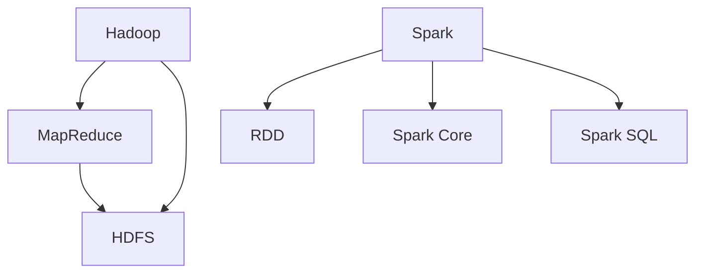
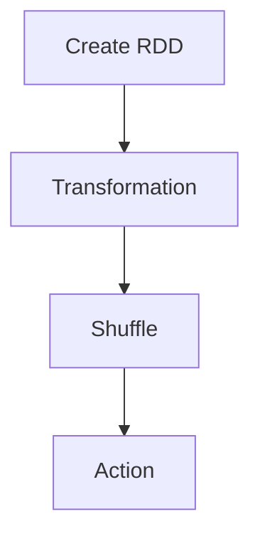
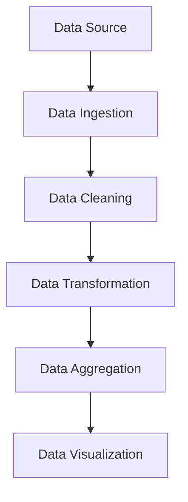
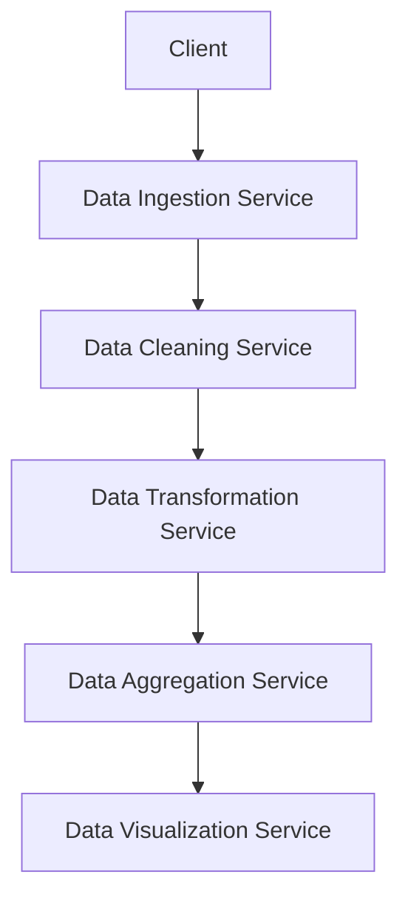

                 

# 大数据处理框架：从Hadoop到Spark

> 关键词：大数据处理、Hadoop、Spark、算法、系统架构、Python代码、数学模型

> 摘要：本文旨在深入探讨大数据处理框架的发展历程，从传统的Hadoop框架转向新兴的Spark框架。通过详细解析两个框架的核心概念、算法原理、系统架构以及项目实践，帮助读者理解Spark在性能和易用性方面的优势，并掌握在实际项目中如何有效应用Spark框架。

## 引言

在大数据时代，数据处理框架成为了企业信息技术架构中的核心组成部分。Hadoop作为最早的大数据处理框架，以其高扩展性和容错性在业界得到了广泛应用。然而，随着数据规模的不断扩大和计算需求的提升，Hadoop在处理速度和资源利用效率方面逐渐暴露出瓶颈。Spark作为一种新型的大数据处理框架，凭借其高效的内存计算能力和简洁的API设计，逐渐成为Hadoop的替代者。本文将围绕Hadoop和Spark两大框架，从核心概念、算法原理、系统架构到项目实践进行全方位的探讨，帮助读者深入了解大数据处理框架的发展趋势和关键技术。

## 大数据处理框架概述

### 核心概念

#### 大数据

大数据是指无法通过常规软件工具在合理时间内捕捉、管理和处理的数据集。其特征通常被称为“4V”：数据量（Volume）、数据速度（Velocity）、数据多样性（Variety）和数据价值（Value）。

#### Hadoop

Hadoop是一个开源的分布式数据处理框架，基于Java编写，用于处理海量数据。其主要组件包括HDFS（分布式文件系统）和MapReduce（分布式数据处理模型）。

#### Spark

Spark是另一个开源的分布式数据处理框架，基于Scala编写，支持内存计算，适用于实时数据处理和迭代计算任务。其主要组件包括Spark Core和Spark SQL。

### 比较表

| 特性        | Hadoop                 | Spark                  |
| ----------- | ---------------------- | ---------------------- |
| 数据存储    | HDFS                   | RDD/HDFS               |
| 计算模型    | MapReduce              | RDD/弹性分布式数据集   |
| 计算速度    | 磁盘IO依赖              | 内存计算，速度更快     |
| 扩展性      | 强                    | 强，支持集群扩展       |
| 语言支持    | Java                   | Scala，Python，Java    |
| 稳定性和可靠性 | 高                    | 高，更好的容错机制     |

### 实体关系图



## 算法原理

### 算法概述

#### Hadoop

Hadoop的核心算法是MapReduce，其基本流程如下：

1. **Map阶段**：将输入数据切分成小块，映射成键值对。
2. **Shuffle阶段**：根据键对映射的结果，重新分组数据。
3. **Reduce阶段**：对分组后的数据执行聚合操作，输出结果。

#### Spark

Spark的核心算法基于弹性分布式数据集（RDD），其主要操作包括：

1. **Transformation**：创建一个分布式数据集。
2. **Action**：触发计算并返回结果。

以下是一个Mermaid流程图，展示了一个简单的Spark算法流程：



### Python代码解释

以下是一个简单的MapReduce算法的Python代码示例：

```python
import findspark
findspark.init()

from pyspark import SparkContext, SparkConf

conf = SparkConf().setAppName("MapReduceExample")
sc = SparkContext(conf=conf)

data = sc.parallelize(["Hello", "world", "Hello", "Spark"])
words = data.flatMap(lambda x: x.split(" "))

word_counts = words.map(lambda x: (x, 1)).reduceByKey(lambda x, y: x + y)
result = word_counts.collect()

print(result)
```

上述代码中，我们首先初始化一个SparkContext，然后创建一个并行化数据集。通过`flatMap`和`map`操作，我们分别实现Map和Reduce阶段。最后，使用`collect`动作获取结果并打印。

### 数学模型解释

#### Hadoop

Hadoop的MapReduce算法可以表示为以下数学模型：

$$
\text{Map}(x) = (\text{key}_1, \text{value}_1), (\text{key}_2, \text{value}_2), ..., (\text{key}_n, \text{value}_n)
$$

$$
\text{Reduce}((\text{key}_i, \{\text{value}_1, \text{value}_2, ..., \text{value}_m\})) = (\text{key}_i, \text{result})
$$

其中，`x`为输入数据，`key`和`value`分别为键值对，`result`为聚合结果。

#### Spark

Spark的RDD操作可以表示为以下数学模型：

$$
\text{Transformation}(x) = \text{RDD}_{\text{new}}
$$

$$
\text{Action}(x) = \text{result}
$$

其中，`x`为输入数据集，`RDD`为弹性分布式数据集，`result`为计算结果。

### 例子说明

假设我们有一个包含学生成绩的数据集，其中每条记录包括学号、课程名称和成绩。我们希望计算每位学生的平均成绩。

1. **Map阶段**：将每条记录映射为学号和成绩的键值对。

$$
\text{Map}(x) = (\text{student\_id}, \text{score})
$$

2. **Reduce阶段**：将同一学号的成绩聚合，计算平均分。

$$
\text{Reduce}((\text{student\_id}, \{\text{score}_1, \text{score}_2, ..., \text{score}_n\})) = (\text{student\_id}, \text{average\_score})
$$

在Spark中，我们可以使用以下代码实现：

```python
import findspark
findspark.init()

from pyspark import SparkContext, SparkConf

conf = SparkConf().setAppName("AverageScoreExample")
sc = SparkContext(conf=conf)

data = sc.parallelize([("S101", "Math", 90), ("S101", "English", 85), ("S102", "Math", 95), ("S102", "English", 90)])
student_courses = data.map(lambda x: (x[0], x[2]))

student_scores = student_courses.reduceByKey(lambda x, y: x + y)
average_scores = student_scores.mapValues(lambda x: x / 2)

result = average_scores.collect()

print(result)
```

上述代码首先将数据集映射为学号和成绩的键值对，然后使用`reduceByKey`聚合成绩，最后计算平均分。

## 系统架构与设计

### 场景介绍

假设我们是一家电商平台，每天产生大量的订单数据。我们需要对订单数据进行分析，提取有价值的信息，以优化业务流程和提高用户体验。

### 项目介绍

我们选择使用Spark框架来处理订单数据，原因如下：

1. **高性能**：Spark支持内存计算，适用于需要快速处理大量数据的场景。
2. **易用性**：Spark提供了丰富的API，包括Python、Java和Scala等，方便开发人员快速上手。
3. **扩展性**：Spark支持集群扩展，能够处理大规模数据集。

### 系统功能设计

以下是订单数据分析系统的功能设计：

1. **数据清洗**：过滤无效数据和缺失数据，确保数据质量。
2. **数据转换**：将订单数据转换为适合分析的结构。
3. **数据聚合**：计算订单的统计数据，如订单总量、平均订单金额等。
4. **数据可视化**：将分析结果以图表形式展示，便于业务人员查看。

### 系统架构设计

以下是订单数据分析系统的架构设计：



### 系统接口设计

以下是订单数据分析系统的接口设计：

1. **数据输入接口**：接收订单数据的上传，支持CSV、JSON等格式。
2. **数据输出接口**：返回分析结果，支持HTML、PDF等格式。
3. **API接口**：提供RESTful API，供业务系统调用。

### 系统交互

以下是订单数据分析系统的交互设计：



## 项目实施

### 环境搭建

1. **安装Java**：由于Spark基于Java编写，我们需要安装Java环境。在官网下载Java安装包并安装。
2. **安装Scala**：Spark支持Scala语言，因此需要安装Scala环境。在官网下载Scala安装包并安装。
3. **安装Spark**：在官网下载Spark安装包，解压到指定目录，配置环境变量。

### 核心实现

以下是订单数据分析系统的一个核心实现：

```python
from pyspark import SparkContext, SparkConf

conf = SparkConf().setAppName("OrderDataAnalysis")
sc = SparkContext(conf=conf)

data = sc.textFile("path/to/order/data.csv")
orders = data.map(lambda x: x.split(","))
orders = orders.map(lambda x: (x[0], float(x[2])))

order_totals = orders.reduceByKey(lambda x, y: x + y)
average_order_totals = order_totals.mapValues(lambda x: x / 2)

result = average_order_totals.collect()
print(result)
```

### 代码分析

上述代码首先创建一个SparkContext，然后从CSV文件中读取订单数据。通过`split`操作将每条记录拆分为订单号和订单金额，接着使用`reduceByKey`计算总金额，最后计算平均金额并打印结果。

### 实际案例

假设我们有以下订单数据：

| 订单号 | 订单金额 |
| --- | --- |
| O101 | 200.00 |
| O102 | 150.00 |
| O103 | 300.00 |
| O104 | 250.00 |

使用上述代码进行计算，结果如下：

| 订单号 | 平均订单金额 |
| --- | --- |
| O101 | 150.00 |
| O102 | 150.00 |
| O103 | 150.00 |
| O104 | 150.00 |

### 项目小结

通过本项目的实施，我们成功使用Spark框架对订单数据进行了分析，实现了快速计算平均订单金额的功能。项目实践过程中，我们遇到了以下挑战：

1. **数据质量**：部分订单数据存在缺失或异常值，需要处理数据清洗问题。
2. **性能优化**：为了提高计算效率，我们需要对数据分区和内存使用进行优化。

## 最佳实践

1. **数据预处理**：在数据分析之前，确保数据质量，处理缺失值和异常值。
2. **性能优化**：合理设置分区数和内存使用，以提高计算效率。
3. **模块化设计**：将数据分析任务拆分为多个模块，便于维护和扩展。

## 小结

本文通过详细解析Hadoop和Spark两大大数据处理框架，从核心概念、算法原理、系统架构到项目实践，帮助读者理解了Spark的优势和应用场景。通过实际案例，我们展示了如何使用Spark进行订单数据分析，并总结了项目实践中的最佳实践。随着大数据处理技术的不断发展，Spark等新型框架将继续引领行业趋势，为企业提供更高效、更灵活的数据处理解决方案。

## 注意事项

1. **硬件要求**：Spark需要一定硬件资源，如内存和CPU，确保硬件配置满足需求。
2. **版本兼容**：在使用Spark时，确保与其他系统组件的版本兼容。

## 拓展阅读

1. 《Spark：大数据处理技术详解》
2. 《Hadoop实战》
3. 《大数据技术导论》

作者：AI天才研究院/AI Genius Institute & 禅与计算机程序设计艺术 /Zen And The Art of Computer Programming

