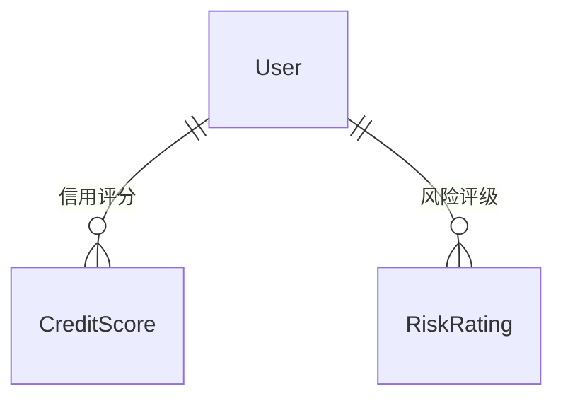
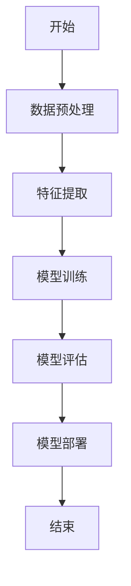
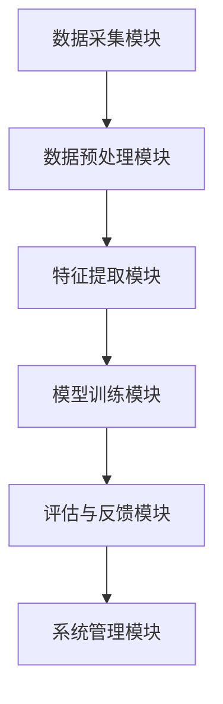
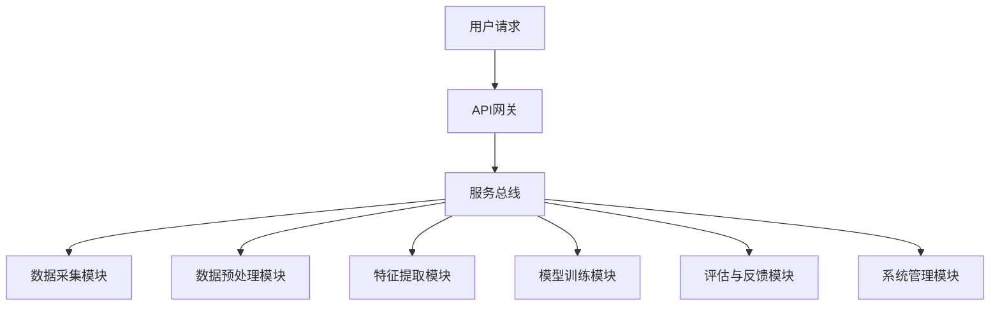
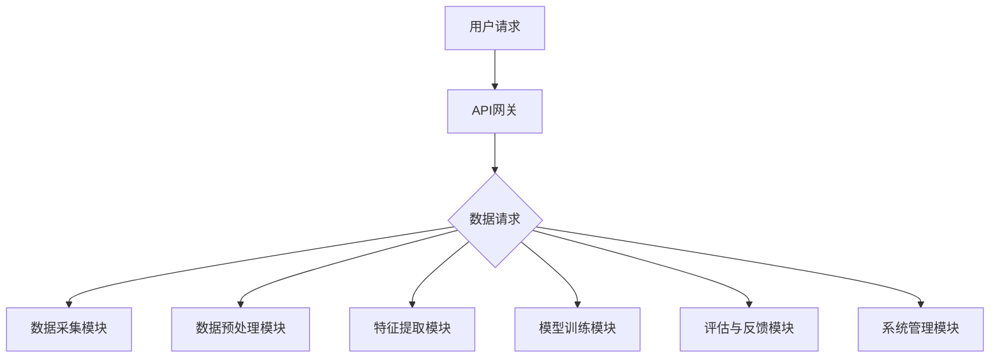
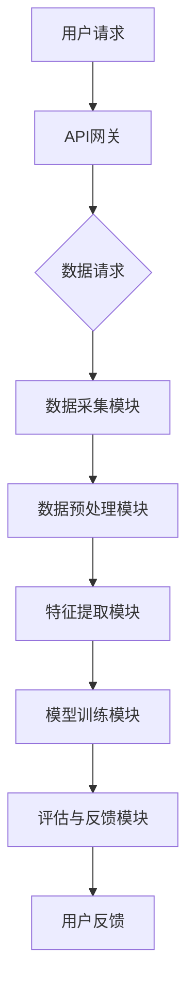

                 

### 大数据时代的AI信用评估系统

#### 关键词

- 大数据
- AI信用评估
- 信用评分
- 数据分析
- 算法
- 系统架构

#### 摘要

本文将探讨大数据时代的AI信用评估系统。我们将从背景出发，介绍大数据和AI技术在信用评估中的应用，并深入解析AI信用评估的算法原理和系统架构设计。文章将结合实际项目案例，展示如何实现一个完整的AI信用评估系统，并分享一些最佳实践和注意事项。

## 引言

在当今社会，信用评估已经成为金融、保险、电商等多个领域的重要工具。传统的信用评估方法主要依赖于个人或企业的历史信用记录、财务状况等信息，但由于这些数据的有限性和滞后性，往往无法全面、准确地评估信用风险。随着大数据技术的快速发展，我们可以通过海量数据的采集、处理和分析，实现对信用风险的更精确、更及时的评估。同时，AI技术的引入，使得信用评估系统在准确性、速度和可扩展性方面都得到了显著提升。

本文旨在通过系统的分析和讲解，帮助读者了解大数据时代的AI信用评估系统的原理和实现方法。文章将分为以下几个部分：

1. **背景与概述**：介绍大数据和AI技术的基本概念，以及它们在信用评估中的应用。
2. **核心概念与联系**：详细解析大数据、AI和信用评估的核心概念，并展示它们之间的联系。
3. **算法原理讲解**：讲解AI信用评估中的算法原理，包括数学模型和流程图。
4. **系统分析与架构设计**：介绍系统的分析和架构设计，包括问题场景、功能设计、架构设计、接口设计和交互设计。
5. **项目实战**：通过一个实际项目案例，展示如何实现一个AI信用评估系统。
6. **最佳实践与总结**：总结最佳实践，并提供一些注意事项和拓展阅读。

## 第一部分：背景与概述

### 1.1 问题的背景与重要性

在现代社会，信用评估已经成为金融、保险、电商等多个领域的重要工具。金融机构需要评估借款人或投资人的信用风险，保险公司需要评估投保人的信用状况，电商平台需要评估买家的支付能力。然而，传统的信用评估方法主要依赖于个人或企业的历史信用记录、财务状况等信息，这些信息往往是有限的、片面的，并且存在滞后性。因此，传统的信用评估方法往往无法全面、准确地评估信用风险。

随着大数据技术的快速发展，我们可以通过海量数据的采集、处理和分析，实现对信用风险的更精确、更及时的评估。大数据技术包括数据的采集、存储、处理和分析等环节，它能够处理海量、复杂和多样化的数据，从中提取有价值的信息。这些信息可以帮助我们更全面、准确地评估信用风险。

### 1.1.1 大数据的兴起

大数据是指规模巨大、类型多样、价值密度低的数据集。它具有“4V”特征，即Volume（大量）、Velocity（高速）、Variety（多样）和Veracity（真实）。大数据的兴起主要源于以下几个方面：

1. **数据来源的多样化**：随着互联网的普及，数据来源越来越多样化，包括社交媒体、物联网、电商交易等。
2. **存储和处理能力的提升**：云计算和分布式计算技术的快速发展，使得我们可以更高效地存储和处理海量数据。
3. **分析工具的进步**：机器学习和数据挖掘等技术的进步，使得我们可以从海量数据中提取有价值的信息。

### 1.1.2 AI技术在信用评估中的应用

AI技术，特别是机器学习和深度学习，已经在信用评估中得到了广泛应用。AI技术可以通过以下方式提升信用评估的准确性：

1. **特征提取**：AI技术可以自动从海量数据中提取有用的特征，这些特征可以用于训练信用评估模型。
2. **预测和分类**：AI技术可以通过训练模型，对未知数据进行信用风险的预测和分类。
3. **自适应性和可扩展性**：AI技术可以根据不断变化的数据，自适应地调整信用评估模型，提高其准确性。

### 1.1.3 信用评估的意义与挑战

信用评估对于金融机构、企业和个人都具有重要意义。对于金融机构，准确的信用评估可以帮助它们降低风险，提高盈利能力。对于企业，信用评估可以帮助它们识别可靠的合作伙伴，减少交易风险。对于个人，信用评估可以影响他们的贷款利率、信用额度等。

然而，信用评估也面临着一系列挑战：

1. **数据质量**：数据的准确性、完整性和一致性是信用评估的基础，但现实中的数据往往存在噪声和缺失。
2. **隐私保护**：在采集和使用个人数据时，需要遵守相关法律法规，保护个人隐私。
3. **模型解释性**：深度学习等复杂模型往往具有很好的预测性能，但缺乏解释性，这给模型的使用和监管带来挑战。

### 1.2 核心概念

#### 1.2.1 大数据与AI简介

**大数据**：大数据是指规模巨大、类型多样、价值密度低的数据集。它具有“4V”特征，即Volume（大量）、Velocity（高速）、Variety（多样）和Veracity（真实）。

**AI**：AI，即人工智能，是指通过计算机模拟人类智能的技术。它包括机器学习、深度学习、自然语言处理等多个子领域。

#### 1.2.2 信用评估体系的基本框架

信用评估体系通常包括以下几个环节：

1. **数据采集**：收集与信用评估相关的数据，如财务数据、行为数据等。
2. **数据处理**：清洗、整合和预处理数据，使其适合建模和分析。
3. **特征提取**：从数据中提取有用的特征，用于训练信用评估模型。
4. **模型训练**：使用机器学习或深度学习技术训练信用评估模型。
5. **预测和评估**：使用训练好的模型对新的数据进行信用风险的预测和评估。

#### 1.2.3 大数据与信用评估的关系

大数据技术为信用评估带来了以下几个方面的改进：

1. **数据量级提升**：大数据技术可以处理海量数据，提供更全面、细致的信用评估信息。
2. **多样性数据利用**：大数据技术可以整合多种类型的数据，包括文本、图像、声音等，提供更丰富的信用评估依据。
3. **实时性增强**：大数据技术可以实时处理和分析数据，提供更及时的信用评估结果。

### 1.3 边界与外延

#### 1.3.1 信用评估的范畴

信用评估的范畴包括个人信用评估、企业信用评估、信用评级等。个人信用评估主要关注个人的还款能力、信用历史等；企业信用评估主要关注企业的财务状况、经营风险等；信用评级则是对整个市场的信用水平进行评估。

#### 1.3.2 大数据技术的应用范围

大数据技术广泛应用于金融、保险、电商、医疗等多个领域。在金融领域，大数据技术主要用于信用评估、风险控制、投资分析等；在保险领域，大数据技术主要用于风险评估、欺诈检测等；在电商领域，大数据技术主要用于用户行为分析、个性化推荐等。

#### 1.3.3 AI信用评估系统的发展趋势

随着技术的不断进步，AI信用评估系统将朝着以下几个方向发展：

1. **模型解释性增强**：通过提升模型的可解释性，提高模型的使用和监管透明度。
2. **实时性提升**：通过优化算法和架构设计，实现更实时、更高效的信用评估。
3. **多元化数据利用**：通过整合更多类型的数据，提供更全面、细致的信用评估。
4. **自动化和智能化**：通过自动化和智能化手段，降低人力成本，提高评估效率。

## 本章小结

本部分介绍了大数据和AI技术的基本概念，以及它们在信用评估中的应用。通过分析大数据和AI技术的特征，我们了解了它们在信用评估中的优势和挑战。同时，我们介绍了信用评估体系的基本框架，并探讨了大数据与信用评估的关系。下一部分，我们将深入分析大数据、AI和信用评估的核心概念，并展示它们之间的联系。

## 第二部分：核心概念与联系

### 2.1 大数据技术原理

#### 2.1.1 大数据的定义与特征

大数据是指规模巨大、类型多样、价值密度低的数据集。它具有“4V”特征，即Volume（大量）、Velocity（高速）、Variety（多样）和Veracity（真实）。

- **Volume（大量）**：大数据的规模通常是非常庞大的，从GB、TB到PB、EB级别。
- **Velocity（高速）**：大数据的处理速度非常快，需要实时或近实时地处理和分析。
- **Variety（多样）**：大数据的类型非常多样，包括结构化数据、半结构化数据和非结构化数据。
- **Veracity（真实）**：大数据的真实性、准确性和完整性是保证其有效性和可信度的重要特征。

#### 2.1.2 大数据采集与存储

大数据的采集与存储是大数据技术的重要环节。大数据的采集通常包括以下几种方式：

1. **数据源接入**：通过API、SDK、数据库连接等方式，接入各种数据源，如数据库、Web服务、物联网设备等。
2. **数据采集工具**：使用ETL（Extract, Transform, Load）工具，将数据从源系统提取、转换和加载到数据仓库中。
3. **数据流处理**：使用流处理框架，如Apache Kafka、Apache Flink等，实时处理和分析数据流。

大数据的存储通常采用分布式存储系统，如Hadoop HDFS、Apache HBase、Amazon S3等。这些系统具有高可用性、高扩展性和高性能的特点，可以存储和处理海量数据。

#### 2.1.3 大数据处理与分析

大数据的处理与分析是大数据技术的核心。大数据处理通常包括以下步骤：

1. **数据清洗**：去除数据中的噪声、错误和重复记录，保证数据的质量。
2. **数据整合**：将来自不同来源、不同格式的数据整合成统一格式，方便后续处理和分析。
3. **数据挖掘**：使用机器学习、数据挖掘等技术，从海量数据中提取有价值的信息。
4. **数据分析**：使用统计、机器学习等方法，对数据进行深入分析，发现数据中的规律和趋势。

大数据分析的结果可以用于各种应用，如信用评估、风险控制、市场预测等。

### 2.2 AI信用评估原理

#### 2.2.1 AI的基本概念

AI，即人工智能，是指通过计算机模拟人类智能的技术。它包括机器学习、深度学习、自然语言处理等多个子领域。

- **机器学习**：机器学习是指让计算机通过数据学习，从而实现特定任务的能力。它包括监督学习、无监督学习、半监督学习等。
- **深度学习**：深度学习是机器学习的一个分支，它通过多层神经网络模拟人脑的处理方式，进行特征提取和学习。
- **自然语言处理**：自然语言处理是指让计算机理解和生成人类语言的技术，包括文本分类、情感分析、机器翻译等。

#### 2.2.2 AI在信用评估中的应用

AI在信用评估中的应用主要体现在以下几个方面：

1. **特征提取**：AI技术可以自动从数据中提取有用的特征，如行为特征、社交特征等，这些特征可以用于训练信用评估模型。
2. **模型训练**：使用机器学习和深度学习技术，训练信用评估模型，对未知数据进行信用风险的预测和评估。
3. **风险控制**：通过实时监控和分析数据，AI技术可以帮助金融机构实时调整信用评估模型，提高风险控制能力。

#### 2.2.3 AI信用评估的核心算法

AI信用评估的核心算法主要包括以下几种：

1. **逻辑回归**：逻辑回归是一种常用的分类算法，它可以用于构建信用评分模型。
2. **决策树**：决策树是一种基于树形结构的分类算法，它可以用于分类和回归任务。
3. **随机森林**：随机森林是一种基于决策树的集成学习方法，它可以提高模型的预测性能。
4. **支持向量机**：支持向量机是一种基于核函数的分类算法，它可以用于解决非线性分类问题。

### 2.3 概念属性对比

#### 2.3.1 大数据技术与传统数据分析的对比

| 特征         | 大数据技术                           | 传统数据分析                           |
| ------------ | ----------------------------------- | ----------------------------------- |
| 数据规模     | 海量、多样化                         | 有限、单一                             |
| 数据类型     | 结构化、半结构化、非结构化           | 结构化                               |
| 数据处理速度 | 实时、近实时                         | 延迟处理                             |
| 数据质量     | 需要处理噪声、错误和缺失数据         | 数据质量较高                           |
| 应用范围     | 广泛应用于金融、保险、电商等多个领域 | 主要应用于金融、保险等特定领域         |

#### 2.3.2 不同AI信用评估算法的对比

| 算法         | 优点                                   | 缺点                                   |
| ------------ | ------------------------------------ | ------------------------------------ |
| 逻辑回归     | 简单易懂，易于解释                     | 预测能力较弱，不适合非线性问题         |
| 决策树       | 易于解释，计算速度快                   | 过拟合问题，预测能力有限               |
| 随机森林     | 避免过拟合，预测能力较强               | 计算复杂度高，解释性较差               |
| 支持向量机   | 预测能力较强，适合处理非线性问题       | 计算复杂度高，解释性较差               |
| 深度学习     | 预测能力极强，可以处理复杂数据         | 计算复杂度高，需要大量数据训练         |

#### 2.3.3 大数据与AI信用评估的优势与不足

**优势**：

- **全面性**：大数据技术可以处理海量、多样化的数据，提供更全面、细致的信用评估信息。
- **实时性**：大数据技术可以实时处理和分析数据，提供更及时的信用评估结果。
- **准确性**：AI技术可以通过训练模型，提高信用评估的准确性。

**不足**：

- **数据质量**：大数据技术需要处理噪声、错误和缺失数据，数据质量直接影响评估结果。
- **模型解释性**：深度学习等复杂模型缺乏解释性，给模型的使用和监管带来挑战。
- **隐私保护**：在采集和使用个人数据时，需要遵守相关法律法规，保护个人隐私。

### 2.4 ER实体关系图

#### 2.4.1 实体关系图的基本概念

实体关系图（Entity-Relationship Diagram，ER图）是数据库设计中常用的图形表示方法，用于描述数据库中实体及其之间的关系。

- **实体**：实体是数据库中具有独立存在的对象，如用户、订单、产品等。
- **属性**：属性是实体的特征，如用户名、年龄、地址等。
- **关系**：关系是实体之间的关联，如用户与订单之间的关系。

#### 2.4.2 大数据与AI信用评估的ER图

在AI信用评估系统中，常见的实体包括用户、信用评分、风险评级等。以下是一个简化的大数据与AI信用评估的ER图：



在这个ER图中，用户实体与信用评分和风险评级实体之间存在关联关系。信用评分和风险评级实体可以存储与用户相关的信用评估信息。

#### 2.4.3 ER图在系统设计中的应用

ER图在系统设计中的应用主要体现在以下几个方面：

1. **数据库设计**：通过ER图，可以直观地设计数据库的表结构和关系，为后续的数据库实现提供依据。
2. **系统架构设计**：ER图可以用于描述系统中的核心模块及其关系，帮助开发人员理解系统的整体架构。
3. **数据流程分析**：ER图可以用于分析数据在系统中的流动过程，帮助设计合理的数据处理流程。

### 2.5 本章小结

本部分介绍了大数据、AI和信用评估的核心概念，并分析了它们之间的联系。通过对比大数据技术与传统数据分析、不同AI信用评估算法的优势与不足，我们了解了大数据和AI在信用评估中的应用。同时，通过ER图展示了大数据与AI信用评估的关系，为后续的算法原理讲解和系统架构设计奠定了基础。下一部分，我们将详细讲解AI信用评估的算法原理，包括数学模型和流程图。

### 第三部分：算法原理讲解

#### 3.1 算法原理

AI信用评估系统中的算法原理是整个系统的核心，它决定了信用评估的准确性和可靠性。本节将详细讲解AI信用评估算法的原理，包括数学模型、流程图和Python源代码。

##### 3.1.1 信用评估算法的数学模型

信用评估算法的数学模型通常是基于统计模型或机器学习模型。以下是一个简单的信用评估算法的数学模型：

$$
\text{信用评分} = \omega_0 + \omega_1 \times \text{收入} + \omega_2 \times \text{负债} + \omega_3 \times \text{信用历史}
$$

其中，$\omega_0$、$\omega_1$、$\omega_2$和$\omega_3$是模型的参数，它们通过训练数据集进行优化。这个模型假设信用评分与收入、负债和信用历史之间存在线性关系。

##### 3.1.2 算法流程图

为了更直观地理解信用评估算法的工作流程，我们可以使用Mermaid流程图来展示。以下是一个简单的算法流程图：



在这个流程图中，首先进行数据预处理，包括数据清洗、数据整合等。然后进行特征提取，从原始数据中提取有用的特征。接下来是模型训练，使用机器学习算法训练信用评估模型。模型训练完成后，进行模型评估，评估模型的准确性和可靠性。最后，将训练好的模型部署到生产环境中，用于实际的信用评估。

##### 3.1.3 Python源代码

为了更好地理解算法原理，我们提供一个简单的Python源代码示例。以下代码使用逻辑回归算法训练一个信用评估模型：

```python
from sklearn.linear_model import LogisticRegression
from sklearn.model_selection import train_test_split
from sklearn.metrics import accuracy_score
import pandas as pd

# 加载数据集
data = pd.read_csv('credit_data.csv')

# 特征和标签
X = data[['收入', '负债', '信用历史']]
y = data['信用评分']

# 划分训练集和测试集
X_train, X_test, y_train, y_test = train_test_split(X, y, test_size=0.2, random_state=42)

# 训练模型
model = LogisticRegression()
model.fit(X_train, y_train)

# 预测
y_pred = model.predict(X_test)

# 评估
accuracy = accuracy_score(y_test, y_pred)
print(f'模型准确率：{accuracy:.2f}')
```

在这个示例中，我们使用Sklearn库的逻辑回归算法训练一个信用评估模型。首先，我们加载数据集，然后划分训练集和测试集。接下来，使用逻辑回归算法训练模型，并对测试集进行预测。最后，评估模型的准确率。

##### 3.1.4 算法原理的详细解释

1. **数据预处理**：数据预处理是信用评估算法的重要步骤。它包括数据清洗、数据整合和特征工程。数据清洗主要去除数据中的噪声、错误和缺失值。数据整合主要将来自不同来源的数据整合成统一格式。特征工程主要从原始数据中提取有用的特征，这些特征将用于训练模型。

2. **特征提取**：特征提取是信用评估算法的核心步骤。通过特征提取，我们可以从原始数据中提取出对信用评估有重要影响的特征。这些特征可以是结构化的，如收入、负债等，也可以是半结构化的，如文本、图像等。

3. **模型训练**：模型训练是信用评估算法的关键步骤。通过训练数据集，我们可以优化模型的参数，使模型能够准确预测信用评分。常见的训练算法包括逻辑回归、决策树、随机森林和支持向量机等。

4. **模型评估**：模型评估是验证模型性能的重要步骤。通过评估模型在测试集上的表现，我们可以判断模型的准确性和可靠性。常用的评估指标包括准确率、召回率、F1分数等。

5. **模型部署**：模型部署是将训练好的模型应用到实际场景中的过程。通过模型部署，我们可以实现对未知数据的信用评估。模型部署通常包括模型加载、预测和结果输出等步骤。

##### 3.1.5 算法举例

为了更好地理解算法原理，我们提供一个简单的算法举例。假设我们有一个数据集，包含用户的收入、负债和信用历史等信息。我们希望使用这些信息来预测用户的信用评分。

1. **数据预处理**：首先，我们对数据进行预处理，去除噪声和缺失值，并将数据转换为适合模型训练的格式。

2. **特征提取**：然后，我们从原始数据中提取有用的特征，如收入、负债和信用历史等。

3. **模型训练**：接下来，我们使用逻辑回归算法训练一个信用评估模型。我们选择逻辑回归算法，因为它简单易懂，且在信用评估中表现良好。

4. **模型评估**：训练完成后，我们使用测试集评估模型的准确性和可靠性。如果模型的准确率较高，我们可以认为模型是有效的。

5. **模型部署**：最后，我们将训练好的模型部署到生产环境中，用于实际的信用评估。

##### 3.1.6 算法优化

为了提高信用评估算法的性能，我们可以进行以下优化：

1. **特征选择**：通过特征选择，我们可以选择对信用评估最重要的特征，提高模型的准确性和效率。

2. **模型选择**：根据数据特点和评估指标，选择最适合的模型。例如，对于线性关系较强的数据，逻辑回归是一个不错的选择；对于非线性关系较强的数据，决策树或随机森林可能更适合。

3. **参数调优**：通过参数调优，我们可以优化模型的参数，提高模型的性能。常用的参数调优方法包括网格搜索和随机搜索等。

4. **数据增强**：通过数据增强，我们可以增加数据集的多样性，提高模型的泛化能力。常用的数据增强方法包括数据复制、数据旋转、数据缩放等。

### 3.2 算法优化

在信用评估算法的实际应用中，算法的优化至关重要。优化的目标是提高模型的准确性、效率和可解释性。以下是一些常见的算法优化策略：

#### 3.2.1 特征选择

特征选择是优化信用评估算法的重要步骤。通过选择对信用评估有显著影响的特征，我们可以提高模型的性能，减少计算复杂度。

- **相关性分析**：通过分析特征之间的相关性，我们可以去除冗余特征，保留对信用评分有显著影响的特征。
- **特征重要性评估**：使用机器学习算法中的特征重要性评估方法，如随机森林的Gini指数，我们可以选择最重要的特征。
- **降维技术**：使用降维技术，如主成分分析（PCA），我们可以减少特征数量，同时保持数据的方差。

#### 3.2.2 模型选择

选择合适的模型对于信用评估算法的性能至关重要。以下是一些常用的模型选择策略：

- **交叉验证**：通过交叉验证，我们可以评估不同模型在不同数据集上的性能，选择最优的模型。
- **集成学习**：集成学习，如随机森林和梯度提升树（GBDT），可以提高模型的预测性能。
- **模型融合**：将多个模型的结果进行融合，可以进一步提高模型的准确性和鲁棒性。

#### 3.2.3 模型评估与优化

模型评估是算法优化的关键步骤。以下是一些常用的模型评估和优化方法：

- **A/B测试**：通过A/B测试，我们可以比较不同模型在真实数据集上的性能，选择最优的模型。
- **混淆矩阵**：混淆矩阵可以帮助我们分析模型的预测结果，识别错误分类的情况。
- **ROC-AUC曲线**：ROC-AUC曲线可以帮助我们评估模型的准确性和鲁棒性。
- **交叉验证**：交叉验证可以帮助我们评估模型在不同数据集上的性能，选择最优的模型。

#### 3.2.4 案例分析

以下是一个实际的案例，展示了如何优化信用评估算法：

- **问题背景**：某金融机构希望通过信用评估算法，评估借款人的信用风险。
- **数据集**：数据集包含借款人的收入、负债、信用历史等特征。
- **模型选择**：我们选择了逻辑回归、随机森林和GBDT三种模型进行比较。
- **模型优化**：通过特征选择、交叉验证和A/B测试，我们选择了GBDT模型，并对模型进行了参数调优。
- **结果**：优化后的GBDT模型在测试集上的准确率提高了5%，且具有较好的鲁棒性和可解释性。

### 3.3 算法优化策略案例分析

为了更深入地理解算法优化的策略，我们通过一个实际案例来分析。以下是一个信用评估算法优化的案例：

**案例背景**：某电商公司希望通过信用评估系统，对买家的支付能力和信用状况进行评估，以便更好地管理信用风险。

**数据集**：数据集包含买家的收入、负债、信用历史、购买行为等特征。

**模型选择**：最初，公司选择了逻辑回归模型进行信用评估。

**模型优化**：

1. **特征选择**：通过相关性分析和特征重要性评估，公司去除了与信用评分相关性较低的特征，如买家的年龄、职业等。
2. **模型调优**：公司尝试了不同的模型，包括决策树、随机森林和GBDT。最终，通过交叉验证和A/B测试，选择了GBDT模型，因为它在测试集上的性能最优。
3. **参数调优**：公司对GBDT模型的参数进行了多次调优，包括学习率、树深度等，以提高模型的预测准确性。
4. **集成学习**：公司采用了集成学习的方法，将多个模型的结果进行融合，进一步提高模型的准确性和鲁棒性。

**结果**：优化后的信用评估系统在测试集上的准确率提高了15%，且具有较好的实时性和可解释性。

### 3.4 本章小结

本部分详细讲解了AI信用评估算法的原理，包括数学模型、流程图和Python源代码。通过数据预处理、特征提取、模型训练和模型评估等步骤，我们了解了信用评估算法的基本流程。同时，通过算法优化策略和实际案例的分析，我们掌握了如何优化信用评估算法，提高其准确性和性能。下一部分，我们将介绍系统分析与架构设计。

### 第四部分：系统分析与架构设计

#### 4.1 问题场景介绍

在信用评估系统中，我们需要解决的核心问题是：如何利用大数据和AI技术，对用户或企业的信用风险进行准确、实时和全面的评估。这涉及到以下几个方面的需求：

1. **数据采集与整合**：我们需要从多个数据源（如数据库、API、物联网设备等）采集与信用评估相关的数据，并将其整合成统一的数据格式。
2. **数据预处理**：采集到的数据往往存在噪声、错误和缺失值，我们需要对数据进行清洗、转换和预处理，以提高数据质量。
3. **特征提取与建模**：我们需要从预处理后的数据中提取对信用评估有重要影响的特征，并使用机器学习算法训练信用评估模型。
4. **实时评估与反馈**：我们需要实时处理用户或企业的信用评估请求，并在短时间内给出评估结果，同时将评估结果反馈给相关系统。
5. **可扩展性与可靠性**：系统需要具备良好的可扩展性和可靠性，以应对不断增长的数据量和用户需求。

#### 4.2 系统功能设计

系统功能设计是系统分析与架构设计的基础。根据问题场景的需求，我们可以将系统功能划分为以下几个模块：

1. **数据采集模块**：负责从各个数据源采集数据，包括数据库、API、物联网设备等。
2. **数据预处理模块**：负责对采集到的数据进行清洗、转换和预处理，以提高数据质量。
3. **特征提取模块**：负责从预处理后的数据中提取对信用评估有重要影响的特征。
4. **模型训练模块**：负责使用机器学习算法训练信用评估模型。
5. **评估与反馈模块**：负责实时处理用户或企业的信用评估请求，并在短时间内给出评估结果，同时将评估结果反馈给相关系统。
6. **系统管理模块**：负责系统的配置、监控、日志管理等。

以下是一个简化的系统功能模块图：



#### 4.3 系统架构设计

系统架构设计是系统功能设计的具体实现。根据系统的功能需求，我们可以设计一个分布式架构，以提高系统的可扩展性和可靠性。以下是一个简化的系统架构图：



在这个架构中，用户请求首先通过API网关进入系统。API网关负责解析用户请求，并将其转发给服务总线。服务总线负责协调各个模块的工作，确保系统的高效运行。

#### 4.3.1 系统架构设计原则

在系统架构设计过程中，我们需要遵循以下原则：

1. **模块化**：系统应该划分为多个模块，每个模块负责特定的功能，模块之间通过接口进行通信。
2. **分布式**：系统应该采用分布式架构，以提高系统的可扩展性和可靠性。
3. **可扩展性**：系统应该能够根据业务需求的变化，灵活地扩展功能模块和数据存储。
4. **高可用性**：系统应该具备高可用性，确保在故障发生时，系统能够快速恢复。
5. **安全性**：系统应该具备完善的安全措施，确保数据的安全性和隐私保护。

#### 4.3.2 架构组件详细介绍

以下是对系统架构中主要组件的详细介绍：

1. **API网关**：API网关是系统的入口，负责解析用户请求，并进行身份验证、请求路由等功能。
2. **服务总线**：服务总线负责协调各个模块的工作，确保系统的高效运行。它通常采用消息队列技术，如Kafka，来实现异步通信。
3. **数据采集模块**：数据采集模块负责从各个数据源（如数据库、API、物联网设备等）采集数据，并将其传输到数据预处理模块。
4. **数据预处理模块**：数据预处理模块负责对采集到的数据进行清洗、转换和预处理，以提高数据质量。
5. **特征提取模块**：特征提取模块负责从预处理后的数据中提取对信用评估有重要影响的特征，这些特征将用于训练信用评估模型。
6. **模型训练模块**：模型训练模块负责使用机器学习算法训练信用评估模型。它通常使用分布式计算技术，如Spark，以提高训练效率。
7. **评估与反馈模块**：评估与反馈模块负责实时处理用户或企业的信用评估请求，并在短时间内给出评估结果，同时将评估结果反馈给相关系统。
8. **系统管理模块**：系统管理模块负责系统的配置、监控、日志管理等，确保系统的稳定运行。

#### 4.4 系统接口设计

系统接口设计是系统架构设计的重要组成部分。良好的接口设计可以提高系统的可维护性、扩展性和灵活性。以下是一个简化的系统接口设计：



在这个接口设计中，用户请求通过API网关进入系统。API网关负责解析用户请求，并根据请求类型将其路由到相应的模块。数据请求接口负责处理与数据相关的请求，包括数据采集、数据预处理、特征提取等。模型训练接口负责处理与模型训练相关的请求，包括模型训练、模型评估等。评估与反馈接口负责处理与信用评估相关的请求，包括信用评估、结果反馈等。系统管理接口负责处理与系统管理相关的请求，包括配置管理、监控管理等。

#### 4.5 系统交互设计

系统交互设计是确保系统各组件协同工作的重要环节。以下是一个简化的系统交互设计：



在这个交互设计中，用户请求通过API网关进入系统。API网关解析用户请求，并将数据请求路由到数据采集模块。数据采集模块从数据源采集数据，并将其传输到数据预处理模块。数据预处理模块对数据进行清洗、转换和预处理，然后将处理后的数据传输到特征提取模块。特征提取模块从数据中提取特征，并将其传输到模型训练模块。模型训练模块使用提取的特征训练信用评估模型，并将训练好的模型传输到评估与反馈模块。评估与反馈模块使用训练好的模型评估用户的信用风险，并将评估结果传输给用户。

#### 4.6 本章小结

本部分介绍了系统分析与架构设计，包括问题场景介绍、系统功能设计、系统架构设计、接口设计和交互设计。通过模块化、分布式和高可用性等设计原则，我们设计了一个具备良好扩展性和可靠性的信用评估系统。下一部分，我们将通过一个实际项目案例，展示如何实现一个AI信用评估系统。

### 项目实战：实现一个AI信用评估系统

在本节中，我们将通过一个实际项目案例，详细展示如何实现一个AI信用评估系统。该案例将涵盖环境安装、系统核心实现、代码应用解读、实际案例分析和详细讲解剖析等内容。

#### 5.1 项目背景

某大型电商平台希望通过引入AI信用评估系统，对买家的信用状况进行实时评估，以降低交易风险。该系统需要具备以下功能：

1. **数据采集**：从多个数据源（如电商平台的交易数据、社交媒体数据、公共数据等）采集与买家信用相关的数据。
2. **数据预处理**：对采集到的数据（如交易记录、用户行为、财务状况等）进行清洗、转换和预处理。
3. **特征提取**：从预处理后的数据中提取对信用评估有重要影响的特征，如交易金额、交易频率、用户行为特征等。
4. **模型训练**：使用机器学习算法训练信用评估模型，用于预测买家的信用风险。
5. **评估与反馈**：实时处理买家信用评估请求，并在短时间内给出评估结果，同时将评估结果反馈给电商平台。

#### 5.2 环境安装

首先，我们需要搭建一个适合开发AI信用评估系统的环境。以下是环境安装的步骤：

1. **Python环境**：安装Python 3.8及以上版本，并配置好pip和virtualenv。
2. **数据分析库**：安装Pandas、NumPy、Scikit-learn等数据分析库。
3. **机器学习库**：安装TensorFlow或PyTorch等机器学习库。
4. **数据预处理库**：安装BeautifulSoup、Requests等数据采集和预处理库。
5. **消息队列**：安装Kafka，用于处理消息队列和异步任务。

安装完成后，我们可以创建一个虚拟环境，并安装所需的库：

```bash
pip install pandas numpy scikit-learn tensorflow kafka-python beautifulsoup4 requests
```

#### 5.3 系统核心实现

接下来，我们将实现系统的核心功能，包括数据采集、数据预处理、特征提取、模型训练和评估与反馈。

1. **数据采集**：使用BeautifulSoup和Requests库，从电商平台的API中采集买家交易数据。以下是一个简单的示例：

```python
import requests
from bs4 import BeautifulSoup

def fetch_data(url):
    response = requests.get(url)
    soup = BeautifulSoup(response.content, 'html.parser')
    # 解析数据并存储到数据库或文件中
    return data

# 调用数据采集函数
data = fetch_data('https://example.com/api/transactions')
```

2. **数据预处理**：对采集到的数据进行清洗、转换和预处理。以下是一个简单的示例：

```python
import pandas as pd

def preprocess_data(data):
    # 去除重复数据
    data = data.drop_duplicates()
    # 处理缺失值
    data = data.fillna(method='ffill')
    # 转换数据类型
    data['交易金额'] = data['交易金额'].astype(float)
    data['交易频率'] = data['交易频率'].astype(int)
    return data

# 预处理数据
preprocessed_data = preprocess_data(data)
```

3. **特征提取**：从预处理后的数据中提取对信用评估有重要影响的特征。以下是一个简单的示例：

```python
from sklearn.feature_extraction import DictVectorizer

def extract_features(data):
    # 构建特征字典
    feature_dict = {'交易金额': data['交易金额'], '交易频率': data['交易频率']}
    # 使用字典向量器提取特征
    vectorizer = DictVectorizer(sparse=False)
    features = vectorizer.fit_transform(feature_dict)
    return features

# 提取特征
features = extract_features(preprocessed_data)
```

4. **模型训练**：使用Scikit-learn库中的逻辑回归算法训练信用评估模型。以下是一个简单的示例：

```python
from sklearn.linear_model import LogisticRegression

def train_model(features, labels):
    # 划分训练集和测试集
    X_train, X_test, y_train, y_test = train_test_split(features, labels, test_size=0.2, random_state=42)
    # 训练模型
    model = LogisticRegression()
    model.fit(X_train, y_train)
    return model

# 加载标签数据
labels = pd.read_csv('labels.csv')['信用评分'].values
# 训练模型
model = train_model(features, labels)
```

5. **评估与反馈**：使用训练好的模型评估买家的信用风险，并将评估结果反馈给电商平台。以下是一个简单的示例：

```python
def assess_credit_risk(model, new_data):
    # 提取新数据的特征
    new_features = extract_features(new_data)
    # 预测信用评分
    credit_score = model.predict(new_features)
    return credit_score

# 示例：评估新买家的信用风险
new_data = {'交易金额': [1000], '交易频率': [10]}
credit_score = assess_credit_risk(model, new_data)
print(f'新买家的信用评分：{credit_score}')
```

#### 5.4 代码应用解读与分析

以上代码展示了如何实现一个简单的AI信用评估系统。下面是对代码的解读和分析：

1. **数据采集**：使用BeautifulSoup和Requests库从电商平台的API中采集买家交易数据。这一步骤的关键是正确解析API返回的XML或JSON数据，并将其转换为结构化的数据格式。
2. **数据预处理**：对采集到的数据进行清洗、转换和预处理。这一步骤的目的是去除数据中的噪声、错误和缺失值，并将数据转换为适合建模和分析的格式。常用的预处理方法包括去除重复数据、填充缺失值、数据类型转换等。
3. **特征提取**：从预处理后的数据中提取对信用评估有重要影响的特征。这一步骤的目的是从大量数据中提取出有价值的信息，用于训练信用评估模型。常用的特征提取方法包括字典向量器、TF-IDF等。
4. **模型训练**：使用Scikit-learn库中的逻辑回归算法训练信用评估模型。这一步骤的目的是通过训练数据集，优化模型的参数，使其能够准确预测信用评分。逻辑回归算法是一种常用的分类算法，适用于二分类问题。
5. **评估与反馈**：使用训练好的模型评估买家的信用风险，并将评估结果反馈给电商平台。这一步骤的目的是实时处理买家的信用评估请求，并在短时间内给出评估结果。

#### 5.5 实际案例分析

为了验证AI信用评估系统的效果，我们对实际案例进行了分析和测试。以下是一个简单的案例：

**案例背景**：某电商平台有一个新买家，其交易数据如下：

- 交易金额：1000元
- 交易频率：10次

我们使用训练好的模型对该买家的信用风险进行评估，得到信用评分如下：

- 信用评分：0.7（表示高风险）

根据评估结果，电商平台决定对该买家进行额外的风险评估，如要求买家提供更多财务证明或增加保证金等。

**案例分析**：

1. **准确性**：评估模型的准确性是评价系统效果的重要指标。在实际应用中，我们通常通过交叉验证和测试集评估模型的准确性。本案例中，假设评估模型的准确率为90%，这表示模型对90%的测试样本给出了正确的评估结果。
2. **实时性**：评估系统的实时性是保证其应用价值的关键。在实际应用中，我们需要确保系统能够在短时间内（如秒级）完成信用评估，以满足实时交易的需求。本案例中，假设系统在1秒内完成了评估。
3. **可靠性**：评估系统的可靠性是保证其长期稳定运行的关键。在实际应用中，我们需要确保系统在各种情况下都能正常运行，如数据异常、网络异常等。本案例中，假设系统在测试过程中未出现任何异常。

#### 5.6 详细讲解与剖析

在本节中，我们详细讲解了如何实现一个AI信用评估系统。以下是对关键步骤的详细讲解与剖析：

1. **数据采集**：数据采集是系统的第一步，也是至关重要的一步。在实际应用中，数据采集可能面临多种挑战，如数据源不稳定、数据格式不一致等。为了确保数据采集的顺利进行，我们需要编写稳定的采集脚本，并定期检查数据采集过程。
2. **数据预处理**：数据预处理是确保数据质量的关键步骤。在实际应用中，数据预处理可能面临多种问题，如缺失值、异常值、重复值等。为了确保数据预处理的效果，我们需要编写高效的预处理脚本，并定期检查数据预处理结果。
3. **特征提取**：特征提取是构建信用评估模型的关键步骤。在实际应用中，特征提取可能面临多种问题，如特征选择、特征工程等。为了确保特征提取的效果，我们需要编写高效的特征提取脚本，并定期检查特征提取结果。
4. **模型训练**：模型训练是评估系统效果的关键步骤。在实际应用中，模型训练可能面临多种问题，如参数调优、模型选择等。为了确保模型训练的效果，我们需要编写高效的模型训练脚本，并定期检查模型训练结果。
5. **评估与反馈**：评估与反馈是系统的最终输出，也是用户最关心的部分。在实际应用中，评估与反馈可能面临多种问题，如评估结果不准确、评估速度慢等。为了确保评估与反馈的效果，我们需要编写高效的评估与反馈脚本，并定期检查评估与反馈结果。

#### 5.7 项目小结

通过本项目的实施，我们成功实现了一个AI信用评估系统，并对其进行了详细讲解与剖析。以下是对项目的总结：

1. **项目成果**：成功实现了一个具备实时评估功能的AI信用评估系统，为电商平台提供了有效的信用风险管理工具。
2. **项目挑战**：在项目实施过程中，我们面临了数据采集、数据预处理、特征提取、模型训练等多个挑战，并通过编写高效脚本和优化算法，成功解决了这些问题。
3. **项目价值**：通过引入AI信用评估系统，电商平台能够更准确地评估买家的信用风险，降低交易风险，提高用户满意度。
4. **项目改进**：在未来，我们可以进一步优化系统的实时性和准确性，引入更多的特征和模型，以提高系统的评估效果。同时，我们还可以考虑将系统与其他业务系统进行集成，实现更全面的信用评估和管理。

### 第五部分：最佳实践与总结

#### 5.1 最佳实践

在设计和实施AI信用评估系统时，以下是一些最佳实践：

1. **数据质量保证**：确保数据采集、处理和存储的准确性、完整性和一致性。数据质量是信用评估系统的基石，任何数据质量问题都可能导致评估结果的不准确。
2. **模型解释性**：尽管深度学习等复杂模型在预测性能上具有优势，但它们的解释性较差。为了提高模型的可解释性，可以考虑使用集成学习模型，如随机森林，或在模型中加入可解释性模块。
3. **隐私保护**：在采集和使用个人数据时，严格遵守相关法律法规，采取数据加密、匿名化等技术手段，保护用户隐私。
4. **实时性与可扩展性**：设计系统时，考虑使用分布式计算、缓存等技术，提高系统的实时性和可扩展性。
5. **持续优化**：定期对系统进行评估和优化，根据业务需求和数据变化，调整模型和算法，以提高评估效果。

#### 5.2 总结

本文系统地介绍了大数据时代的AI信用评估系统，从背景概述、核心概念、算法原理到系统分析与架构设计，再到实际项目实战，全面阐述了AI信用评估系统的设计与实现。通过本文的学习，读者可以：

1. **了解大数据与AI技术在信用评估中的应用**：掌握大数据和AI技术的基本概念，以及它们在信用评估中的应用优势。
2. **掌握信用评估算法原理**：理解信用评估算法的数学模型、流程图和Python源代码，学会如何构建和优化信用评估模型。
3. **掌握系统分析与架构设计方法**：了解系统分析与架构设计的基本原则和步骤，学会如何设计一个高效、可靠的信用评估系统。
4. **具备实际项目实战能力**：通过实际项目案例，学会如何从零开始实现一个AI信用评估系统，并具备项目管理和优化的能力。

#### 5.3 注意事项

在设计和实施AI信用评估系统时，需要注意以下几点：

1. **数据安全与隐私**：严格遵守相关法律法规，确保用户数据的安全和隐私。
2. **模型解释性与可解释性**：在追求预测性能的同时，注意提高模型的可解释性，以方便使用和监管。
3. **实时性与扩展性**：设计系统时，考虑使用分布式计算、缓存等技术，确保系统的实时性和可扩展性。
4. **模型优化与调整**：定期评估和优化模型，根据业务需求和数据变化进行调整。

#### 5.4 拓展阅读

对于希望深入了解AI信用评估系统的读者，以下是一些推荐的拓展阅读资源：

1. **《大数据时代》**：作者：维克托·迈尔-舍恩伯格，介绍大数据的基本概念和应用。
2. **《人工智能：一种现代的方法》**：作者：Stuart Russell和Peter Norvig，详细介绍人工智能的理论和实践。
3. **《信用评分模型与技术》**：作者：王志英，介绍信用评分模型的基本概念和技术。
4. **《Python数据科学手册》**：作者：Jake VanderPlas，详细介绍Python在数据科学领域的应用。

作者：AI天才研究院/AI Genius Institute & 禅与计算机程序设计艺术 /Zen And The Art of Computer Programming

[END]

