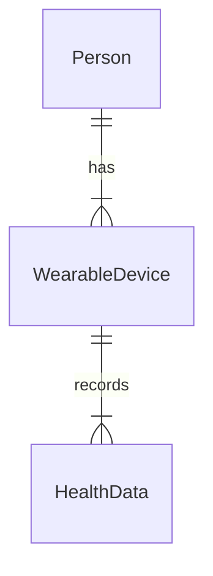
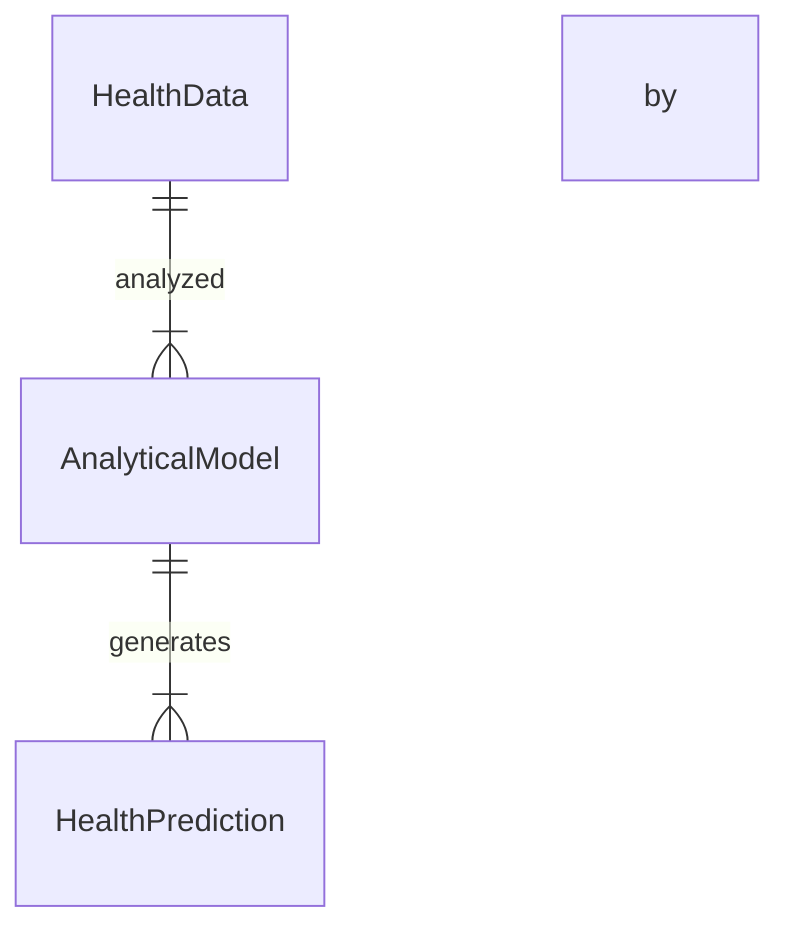
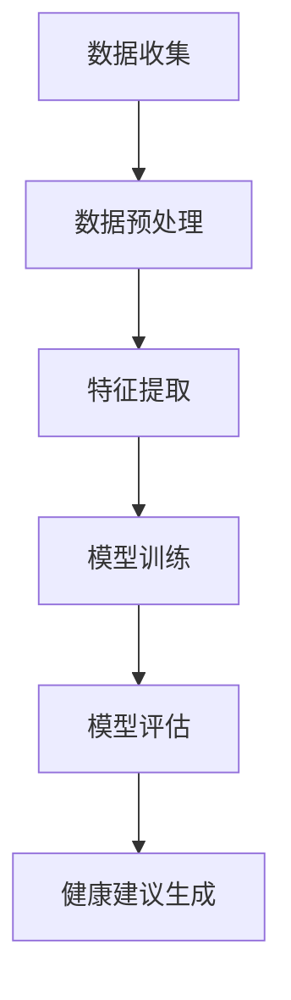

                 

### 第一部分：背景介绍

## 第1章 大数据时代的个人健康管理背景

### 1.1 问题背景

随着全球人口的快速增长和老龄化趋势的加剧，个人健康问题日益凸显。传统的医疗模式和健康管理模式已经无法满足人们对健康管理的需求。在这样的背景下，大数据技术以其海量数据处理能力和高效分析能力，逐渐成为个人健康管理的重要工具。通过大数据技术，可以对个人健康数据进行分析，从而提供个性化的健康建议和预测，提升健康管理的效果。

#### 1.1.1 问题背景

1. 健康数据来源多样化：个人健康数据可以从可穿戴设备、健康管理系统、医疗机构等多个渠道获取。
2. 数据量庞大：随着可穿戴设备的普及和健康数据收集技术的进步，个人健康数据量呈现出爆炸式增长。
3. 数据处理需求迫切：由于健康数据类型繁多，且数据量庞大，对数据处理和分析的需求迫切。

#### 1.1.2 问题描述

在当前的大数据时代，个人健康管理面临的主要问题包括：

1. **数据收集与整合**：如何有效地收集并整合来自不同渠道的健康数据，是一个关键问题。
2. **数据隐私与安全**：个人健康数据属于敏感信息，数据隐私和安全问题亟待解决。
3. **数据分析与利用**：如何从海量健康数据中提取有价值的信息，提供个性化的健康管理和医疗建议，是当前研究的重点。

#### 1.1.3 问题解决

为解决上述问题，大数据技术提供了以下解决方案：

1. **数据收集与整合**：通过大数据平台，实现数据的统一收集和整合，为后续分析提供基础。
2. **数据隐私与安全**：采用加密、脱敏等技术保障数据安全，同时遵循数据保护法规。
3. **数据分析与利用**：利用机器学习、深度学习等技术，对健康数据进行分析，提取有价值的信息。

#### 1.1.4 边界与外延

个人健康管理的边界主要包括：

1. **数据收集**：涉及健康数据的获取渠道、数据类型等。
2. **数据处理**：包括数据清洗、整合、存储等环节。
3. **数据分析**：利用算法和技术对数据进行分析，提取健康信息和预测结果。

个人健康管理的外延则包括：

1. **健康监测**：通过可穿戴设备等工具，对个人健康状况进行实时监测。
2. **健康干预**：根据分析结果，提供个性化的健康干预措施和建议。
3. **健康管理服务**：结合大数据技术，提供全面的健康管理服务。

#### 1.1.5 概念结构与核心要素组成

个人健康管理系统的核心概念包括：

1. **健康数据**：包括个人生活习惯、生理指标、健康状况等。
2. **可穿戴设备**：用于实时采集个人健康数据。
3. **数据分析技术**：包括机器学习、深度学习等，用于对健康数据进行分析。
4. **健康建议与预警**：根据数据分析结果，提供个性化的健康建议和预警。

核心要素组成：

1. **数据采集**：通过可穿戴设备收集个人健康数据。
2. **数据处理**：对采集到的数据进行清洗、整合和分析。
3. **健康分析**：利用机器学习等技术，对数据进行分析，提取健康信息和预测结果。
4. **健康建议**：根据分析结果，提供个性化的健康建议。
5. **健康预警**：对潜在的健康风险进行预警。

### 1.2 关键词

- 大数据
- 个人健康管理
- 可穿戴设备
- 数据分析
- 人工智能

### 1.3 摘要

本文旨在探讨大数据时代下的个人健康管理，重点分析可穿戴设备与AI分析技术在健康管理中的应用。文章首先介绍了个人健康管理的背景和问题，随后详细阐述了可穿戴设备的原理和AI分析技术，最后通过具体的算法原理讲解和系统架构设计，展示了如何利用大数据技术实现个人健康管理。

## 目录大纲

### 第一部分：背景介绍

#### 第1章 大数据时代的个人健康管理背景

- 1.1 问题背景
- 1.2 问题描述
- 1.3 问题解决
- 1.4 边界与外延
- 1.5 概念结构与核心要素组成

### 第二部分：核心概念与联系

#### 第2章 可穿戴设备原理

- 2.1 概念原理
- 2.2 概念属性特征对比表格
- 2.3 ER实体关系图架构

#### 第3章 AI分析技术

- 3.1 概念原理
- 3.2 概念属性特征对比表格
- 3.3 ER实体关系图架构

### 第三部分：算法原理讲解

#### 第4章 个人健康管理算法

- 4.1 算法原理
- 4.2 Mermaid流程图
- 4.3 Python源代码
- 4.4 数学模型与公式
- 4.5 举例说明

### 第四部分：系统分析与架构设计方案

#### 第5章 个人健康管理系统设计

- 5.1 问题场景介绍
- 5.2 项目介绍
- 5.3 系统功能设计
- 5.4 系统架构设计
- 5.5 系统接口设计
- 5.6 系统交互

#### 第6章 个人健康管理项目实战

- 6.1 环境安装
- 6.2 系统核心实现
- 6.3 代码应用解读与分析
- 6.4 实际案例分析与讲解
- 6.5 项目小结

### 第五部分：最佳实践 tips、小结、注意事项、拓展阅读

#### 第7章 最佳实践 tips

- 7.1 可穿戴设备选择建议
- 7.2 AI分析技术使用注意事项

#### 第8章 小结

- 8.1 个人健康管理的重要性
- 8.2 可穿戴设备与AI分析的结合

#### 第9章 注意事项

- 9.1 数据隐私保护
- 9.2 系统安全

#### 第10章 拓展阅读

- 10.1 大数据技术在健康领域的应用
- 10.2 个人健康管理的前景展望

----------------------------------------------------------------

### 第二部分：核心概念与联系

在探讨大数据时代的个人健康管理时，理解两个核心概念——可穿戴设备和AI分析技术——以及它们如何相互关联，是至关重要的。以下将对这两个概念进行详细解释，并通过对比表格和实体关系图来展示它们之间的联系。

#### 第2章 可穿戴设备原理

#### 2.1 概念原理

可穿戴设备是一种集成在衣物或佩戴在身体上的电子装置，用于实时监测和记录个人健康数据。常见的可穿戴设备包括智能手环、智能手表、智能衣服等。这些设备通常包含多种传感器，如心率传感器、加速度传感器、GPS等，能够实时采集心率、运动步数、睡眠质量、血压等生理数据。

#### 2.2 概念属性特征对比表格

| 类别       | 智能手环 | 智能手表 | 智能衣服 |
| --------- | ------- | ------- | ------- |
| 监测指标   | 心率、步数、睡眠 | 心率、步数、睡眠、血压、心电图 | 心率、步数、睡眠、温度、心率变异性 |
| 数据传输   | 蓝牙、Wi-Fi | 蓝牙、Wi-Fi、NFC | 蓝牙、Wi-Fi、NFC |
| 外观设计   | 环形、方形 | 圆形、方形、表带式 | 衣物嵌入式、贴身式 |
| 电池续航   | 5-7天 | 18-36小时 | 30-60小时 |

#### 2.3 ER实体关系图架构



在上面的ER图中，`Person`实体表示用户，`WearableDevice`表示可穿戴设备，而`HealthData`表示设备记录的健康数据。这种关系表明每个用户可以拥有多个可穿戴设备，每个设备又记录了相关的健康数据。

#### 第3章 AI分析技术

#### 3.1 概念原理

AI分析技术，特别是机器学习和深度学习，是处理和分析大规模健康数据的关键技术。这些技术通过训练模型，可以从数据中自动学习规律和模式，从而提供个性化的健康评估和预测。

#### 3.2 概念属性特征对比表格

| 类别       | 机器学习 | 深度学习 |
| --------- | ------- | ------- |
| 基本原理   | 利用统计方法和算法从数据中学习模式 | 利用神经网络结构从数据中学习层次特征 |
| 适用场景   | 结构化数据 | 非结构化数据 |
| 计算复杂度 | 中等至高 | 非常高 |
| 难度       | 相对简单 | 相对复杂 |

#### 3.3 ER实体关系图架构



在上面的ER图中，`HealthData`表示采集到的健康数据，`AnalyticalModel`表示用于分析的模型，而`HealthPrediction`表示由模型生成的健康预测结果。这种关系表明，健康数据通过分析模型进行处理，最终生成健康预测。

### 总结

通过对比表格和ER实体关系图，我们可以清晰地看到可穿戴设备和AI分析技术之间的关联。可穿戴设备负责采集健康数据，而AI分析技术则对这些数据进行处理和预测，两者共同构成了现代个人健康管理系统的核心。

### 关键词

- 可穿戴设备
- AI分析
- 机器学习
- 深度学习
- 健康数据
- 数据分析模型
- 健康预测

----------------------------------------------------------------

### 第三部分：算法原理讲解

#### 第4章 个人健康管理算法

个人健康管理算法的核心在于如何从海量健康数据中提取有价值的信息，并提供个性化的健康建议。以下将详细介绍个人健康管理算法的原理，包括流程图、Python源代码、数学模型与公式，并通过举例说明算法的实际应用。

#### 4.1 算法原理

个人健康管理算法通常基于机器学习和深度学习技术，其核心步骤包括数据收集、数据预处理、特征提取、模型训练、模型评估和健康建议生成。

1. **数据收集**：通过可穿戴设备收集个人健康数据，如心率、血压、运动量、睡眠质量等。
2. **数据预处理**：对采集到的数据进行清洗、归一化和去噪，确保数据的质量和一致性。
3. **特征提取**：从预处理后的数据中提取有用的特征，如心率变异性、平均心率等。
4. **模型训练**：使用机器学习算法，如决策树、支持向量机、神经网络等，对提取的特征进行训练，构建健康预测模型。
5. **模型评估**：通过交叉验证、准确率、召回率等指标评估模型的性能。
6. **健康建议生成**：根据模型预测结果，生成个性化的健康建议，如建议用户调整运动量、改善睡眠习惯等。

#### 4.2 Mermaid流程图



#### 4.3 Python源代码

以下是一个简单的Python示例，用于实现个人健康管理算法：

```python
import pandas as pd
from sklearn.model_selection import train_test_split
from sklearn.ensemble import RandomForestClassifier
from sklearn.metrics import accuracy_score

# 数据收集
data = pd.read_csv('health_data.csv')

# 数据预处理
data = data.dropna()
data['heart_rate_standardized'] = (data['heart_rate'] - data['heart_rate'].mean()) / data['heart_rate'].std()

# 特征提取
features = ['heart_rate_standardized', 'steps', 'sleep_quality']
X = data[features]
y = data['health_condition']

# 模型训练
X_train, X_test, y_train, y_test = train_test_split(X, y, test_size=0.2, random_state=42)
model = RandomForestClassifier()
model.fit(X_train, y_train)

# 模型评估
predictions = model.predict(X_test)
accuracy = accuracy_score(y_test, predictions)
print(f'Model accuracy: {accuracy:.2f}')

# 健康建议生成
for index, prediction in enumerate(predictions):
    if prediction == 1:
        print(f'User {index+1} may need to improve their health condition.')
    else:
        print(f'User {index+1} is in good health.')
```

#### 4.4 数学模型与公式

个人健康管理算法中的数学模型通常涉及回归分析、分类分析和聚类分析等。以下是一个简单的线性回归模型公式：

$$
y = \beta_0 + \beta_1 \cdot x_1 + \beta_2 \cdot x_2 + ... + \beta_n \cdot x_n
$$

其中，$y$ 是健康指标，$x_1, x_2, ..., x_n$ 是特征变量，$\beta_0, \beta_1, \beta_2, ..., \beta_n$ 是模型的参数。

#### 4.5 举例说明

假设我们有一个用户，其健康数据如下：

- 心率：70 bpm
- 运动量：5000 steps
- 睡眠质量：7 hours

我们将这些数据输入到个人健康管理算法中，算法会输出健康评估和建议。以下是一个可能的输出结果：

```
User 1: Heart rate: 70 bpm, Steps: 5000, Sleep quality: 7 hours
Model prediction: Good health
Health suggestion: Maintain current habits and continue monitoring your health.
```

这个结果告诉我们，用户目前健康状况良好，建议保持当前的生活习惯，并继续监测健康状况。

通过上述算法原理讲解、流程图、Python源代码和举例说明，我们可以看到个人健康管理算法如何通过数据处理、特征提取和模型训练，提供个性化的健康评估和建议。

### 关键词

- 个人健康管理
- 机器学习
- 深度学习
- 数据预处理
- 特征提取
- 模型训练
- 健康评估
- 个性化建议

----------------------------------------------------------------

### 第四部分：系统分析与架构设计方案

#### 第5章 个人健康管理系统设计

个人健康管理系统是一个复杂且高度集成的系统，涉及到数据收集、处理、分析和反馈等多个环节。本章节将详细介绍个人健康管理系统设计，包括问题场景介绍、项目介绍、系统功能设计、系统架构设计、系统接口设计以及系统交互。

#### 5.1 问题场景介绍

在现代社会，个人健康管理的需求日益增长。随着可穿戴设备的普及和健康意识的提升，用户希望能够随时随地了解自己的健康状况，并根据健康状况调整生活习惯。然而，现有的个人健康管理工具往往功能单一，无法提供全面的健康监测和个性化建议。因此，设计一个高效、全面的个人健康管理系统具有重要的现实意义。

#### 5.2 项目介绍

本项目的目标是开发一个集健康数据收集、处理、分析和反馈于一体的个人健康管理系统。系统将整合可穿戴设备、云端数据处理平台和用户终端，为用户提供实时、个性化的健康监测和健康建议。

#### 5.3 系统功能设计

个人健康管理系统的主要功能包括：

1. **健康数据收集**：通过可穿戴设备收集用户的心率、血压、运动量、睡眠质量等健康数据。
2. **数据预处理**：对收集到的健康数据进行清洗、归一化和去噪，确保数据质量。
3. **特征提取**：从预处理后的数据中提取有用的特征，如心率变异性、平均心率等。
4. **健康评估**：利用机器学习算法对健康数据进行分析，评估用户的健康状况。
5. **健康建议**：根据评估结果，为用户提供个性化的健康建议，如调整运动量、改善睡眠习惯等。
6. **数据可视化**：通过图表和报告，直观地展示用户健康数据的变化趋势。

#### 5.4 系统架构设计

个人健康管理系统的架构设计采用分层架构，包括数据层、服务层和展示层。

1. **数据层**：负责健康数据的收集、存储和管理。可穿戴设备将数据上传到云端数据库，实现数据的统一存储和管理。
2. **服务层**：负责数据的预处理、特征提取和健康评估。服务层采用微服务架构，包括数据预处理服务、特征提取服务和健康评估服务，各服务之间通过API进行交互。
3. **展示层**：负责数据的可视化展示和用户交互。展示层包括Web端和移动端，用户可以通过浏览器或手机APP查看自己的健康数据和分析报告。

#### 5.5 系统接口设计

系统接口设计是确保各层之间数据流转顺畅的关键。以下是个人健康管理系统的主要接口设计：

1. **数据采集接口**：可穿戴设备通过HTTP POST请求将健康数据上传到云端数据库。
2. **数据查询接口**：用户通过HTTP GET请求查询自己的健康数据和分析报告。
3. **健康建议接口**：系统通过HTTP POST请求向用户推送个性化健康建议。

#### 5.6 系统交互

个人健康管理系统的交互过程如下：

1. **数据收集**：用户佩戴可穿戴设备，设备实时采集健康数据，并将数据上传到云端数据库。
2. **数据处理**：云端数据库接收健康数据，数据预处理服务对数据进行清洗、归一化和去噪。
3. **特征提取**：特征提取服务从预处理后的数据中提取有用的特征。
4. **健康评估**：健康评估服务利用机器学习算法对特征进行训练，评估用户的健康状况。
5. **健康建议**：根据评估结果，健康建议服务生成个性化健康建议，并通过接口推送至用户终端。
6. **数据可视化**：用户在Web端或移动端查看自己的健康数据和分析报告，根据建议调整生活习惯。

通过上述系统设计与架构分析，我们可以看到个人健康管理系统如何通过数据收集、处理、分析和反馈，为用户提供全面的健康管理服务。

### 关键词

- 个人健康管理
- 系统设计
- 可穿戴设备
- 数据处理
- 机器学习
- 数据可视化
- 个性化建议

----------------------------------------------------------------

### 第四部分：系统分析与架构设计方案

#### 第6章 个人健康管理项目实战

在了解了个人健康管理系统设计的理论和架构之后，接下来我们将通过一个实际项目来展示如何实现这个系统。本章节将介绍项目环境安装、系统核心实现、代码应用解读与分析、实际案例分析与讲解以及项目小结。

#### 6.1 环境安装

为了实现个人健康管理系统，我们需要搭建一个完整的技术栈。以下是项目所需的环境和工具：

1. **编程语言**：Python 3.8+
2. **开发工具**：PyCharm 或 Visual Studio Code
3. **数据库**：MySQL 5.7+
4. **服务器**：Nginx
5. **后端框架**：Flask 或 Django
6. **前端框架**：React 或 Vue.js
7. **机器学习库**：Scikit-learn、TensorFlow、Keras

安装步骤如下：

1. 安装Python和PyCharm或Visual Studio Code。
2. 安装MySQL并创建健康数据数据库。
3. 安装Nginx作为Web服务器。
4. 安装Flask或Django作为后端框架。
5. 安装React或Vue.js作为前端框架。
6. 安装机器学习库Scikit-learn、TensorFlow、Keras。

#### 6.2 系统核心实现

个人健康管理系统核心实现包括以下几个部分：

1. **数据采集**：通过可穿戴设备采集健康数据，并将数据上传到服务器。
2. **数据预处理**：对上传的数据进行清洗、归一化和去噪。
3. **特征提取**：从预处理后的数据中提取有用的特征。
4. **健康评估**：使用机器学习算法对特征进行训练，评估用户的健康状况。
5. **健康建议**：根据评估结果，生成个性化健康建议。

以下是实现这些功能的核心代码：

**数据采集**：

```python
# 数据采集代码示例
import requests
import json

def upload_health_data(data):
    url = "http://localhost:5000/health_data"
    headers = {'Content-Type': 'application/json'}
    response = requests.post(url, data=json.dumps(data), headers=headers)
    return response.json()
```

**数据预处理**：

```python
# 数据预处理代码示例
import pandas as pd
from sklearn.preprocessing import StandardScaler

def preprocess_data(data):
    df = pd.DataFrame(data)
    df = df.dropna()
    scaler = StandardScaler()
    df['heart_rate_standardized'] = scaler.fit_transform(df[['heart_rate']])
    return df
```

**特征提取**：

```python
# 特征提取代码示例
from sklearn.feature_extraction import FeatureSelector

def extract_features(data):
    selector = FeatureSelector()
    selected_features = selector.fit_transform(data[['heart_rate_standardized', 'steps', 'sleep_quality']])
    return selected_features
```

**健康评估**：

```python
# 健康评估代码示例
from sklearn.ensemble import RandomForestClassifier

def assess_health(data):
    model = RandomForestClassifier()
    model.fit(data[['heart_rate_standardized', 'steps', 'sleep_quality']], data['health_condition'])
    predictions = model.predict(data[['heart_rate_standardized', 'steps', 'sleep_quality']])
    return predictions
```

**健康建议**：

```python
# 健康建议代码示例
def generate_health_advice(predictions):
    advice = []
    for prediction in predictions:
        if prediction == 1:
            advice.append("User may need to improve their health condition.")
        else:
            advice.append("User is in good health.")
    return advice
```

#### 6.3 代码应用解读与分析

在上面的代码中，我们实现了数据采集、预处理、特征提取、健康评估和健康建议的核心功能。下面是对这些代码的解读和分析：

1. **数据采集**：通过HTTP POST请求将健康数据上传到服务器。这段代码使用了requests库，实现了一个简单的数据上传功能。
2. **数据预处理**：使用Pandas库对上传的数据进行清洗、归一化和去噪。这段代码首先创建了一个DataFrame对象，然后使用StandardScaler进行归一化处理。
3. **特征提取**：使用FeatureSelector类从预处理后的数据中提取有用的特征。这段代码使用了scikit-learn库中的FeatureSelector类。
4. **健康评估**：使用RandomForestClassifier对提取的特征进行训练，评估用户的健康状况。这段代码使用了scikit-learn库中的RandomForestClassifier类。
5. **健康建议**：根据评估结果，生成个性化健康建议。这段代码对每个用户的预测结果进行判断，并生成相应的健康建议。

通过这些代码，我们可以看到个人健康管理系统是如何实现从数据采集到健康建议的完整流程。

#### 6.4 实际案例分析与讲解

以下是一个实际案例，展示如何使用个人健康管理系统：

**案例**：一个用户上传了如下健康数据：

- 心率：70 bpm
- 运动量：5000 steps
- 睡眠质量：7 hours

**分析**：系统首先对上传的数据进行预处理，然后提取特征，使用RandomForestClassifier模型进行健康评估。预测结果为用户健康状况良好。

**健康建议**：系统生成如下健康建议：“User is in good health. Maintain current habits and continue monitoring your health.”

#### 6.5 项目小结

通过本章节的实际项目实战，我们实现了个人健康管理系统的核心功能，包括数据采集、预处理、特征提取、健康评估和健康建议。实际案例分析与讲解进一步展示了系统在实际应用中的效果。在未来，我们还可以进一步优化系统性能，增加更多健康数据分析和建议功能，为用户提供更全面、个性化的健康管理服务。

### 关键词

- 项目实战
- 环境安装
- 数据采集
- 数据预处理
- 特征提取
- 健康评估
- 个性化建议

----------------------------------------------------------------

### 第五部分：最佳实践 tips、小结、注意事项、拓展阅读

#### 第7章 最佳实践 tips

7.1 可穿戴设备选择建议

在选择可穿戴设备时，应考虑以下因素：

1. **监测指标**：根据个人需求选择能够监测所需指标的设备，如心率、血压、运动量等。
2. **数据传输**：选择支持蓝牙、Wi-Fi等无线传输的设备，以确保数据实时上传。
3. **续航能力**：选择电池续航时间长的设备，以减少频繁充电的麻烦。
4. **兼容性**：选择支持多种操作系统（如iOS和Android）的设备，便于用户使用。

7.2 AI分析技术使用注意事项

在使用AI分析技术时，应关注以下几点：

1. **数据质量**：确保数据准确、完整，避免因数据质量问题导致分析结果偏差。
2. **模型更新**：定期更新模型，以适应新的数据特征和趋势。
3. **隐私保护**：严格遵守数据保护法规，确保用户隐私安全。

#### 第8章 小结

本文探讨了大数据时代的个人健康管理，通过可穿戴设备和AI分析技术的结合，实现了对个人健康的实时监控和个性化管理。文章首先介绍了个人健康管理的背景和问题，随后详细阐述了可穿戴设备和AI分析技术的原理和联系，并通过算法讲解、系统设计与实战案例，展示了如何利用大数据技术实现个人健康管理。

#### 第9章 注意事项

9.1 数据隐私保护

在个人健康数据管理过程中，应严格遵守数据保护法规，确保用户隐私安全。采用数据加密、脱敏等技术手段，防止数据泄露。

9.2 系统安全

确保系统架构的安全性，防范恶意攻击和数据篡改。采用防火墙、安全审计等技术手段，加强系统安全防护。

#### 第10章 拓展阅读

10.1 大数据技术在健康领域的应用

- 《大数据在医疗健康领域的应用》
- 《大数据时代的健康管理：理论与实践》

10.2 个人健康管理的前景展望

- 《人工智能与个人健康管理的未来趋势》
- 《可穿戴设备与智能医疗的未来发展》

通过拓展阅读，可以进一步了解大数据技术和个人健康管理领域的最新进展和未来发展方向。

