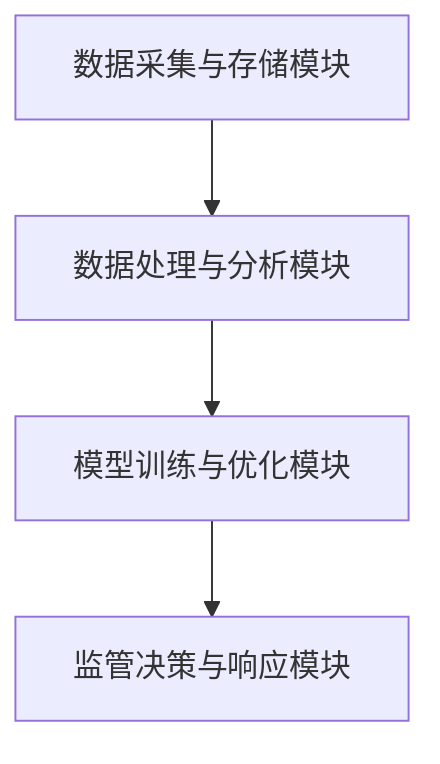
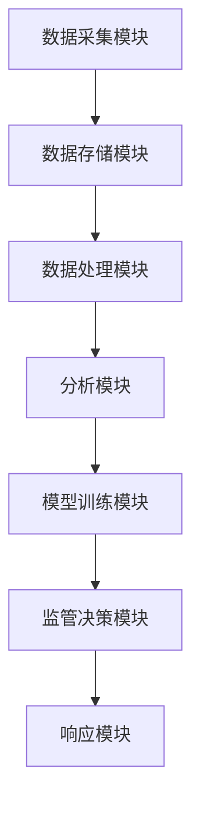
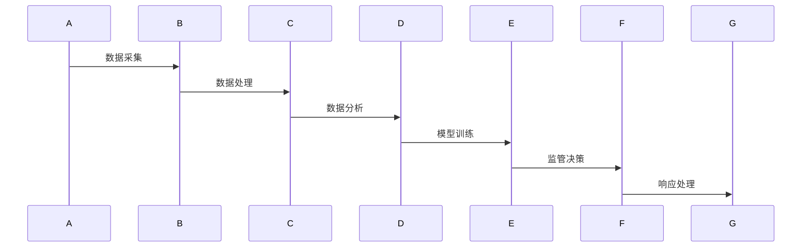

                 

# 《大数据时代的消费者权益保护：AI监管与快速响应》

## 关键词：大数据，消费者权益保护，AI监管，快速响应

> 摘要：本文深入探讨了大数据时代下消费者权益保护面临的新挑战，分析了AI监管和快速响应在解决这些挑战中的作用。文章首先介绍了大数据的基本概念和特征，以及其对消费者权益的影响。接着，探讨了消费者权益保护的核心概念和法律框架。在此基础上，本文重点阐述了AI监管的基本概念、优势与挑战，以及其在消费者权益保护中的应用前景。同时，文章还详细介绍了快速响应的定义、技术手段和实践方法。最后，本文通过具体的案例分析和实战经验，提出了最佳实践和建议，为大数据时代的消费者权益保护提供了新的思路和方法。

## 第一部分：背景与概念介绍

### 1.1 大数据的定义与特征

大数据（Big Data）是指无法用常规软件工具在合理时间内捕捉、管理和处理的大量数据。大数据具有4V特征，即数据量（Volume）、数据速度（Velocity）、数据多样性（Variety）和数据真实性（Veracity）。

- **数据量**：大数据量级通常以TB（太字节）或PB（拍字节）计，甚至达到EB（艾字节）级别。
- **数据速度**：数据生成、处理和传输的速度越来越快，对实时性和快速响应提出了更高要求。
- **数据多样性**：大数据来源广泛，包括结构化数据、非结构化数据和半结构化数据。
- **数据真实性**：数据真实性指的是数据的准确性和可信度，这对于消费者权益保护至关重要。

### 1.2 大数据对消费者权益的影响

大数据在带来便利的同时，也对消费者权益保护提出了新的挑战：

- **隐私泄露**：大量消费者的个人数据被收集、分析和共享，隐私泄露风险增加。
- **数据滥用**：企业可能滥用数据，进行不公平竞争或进行消费者行为操控。
- **决策不公平**：基于大数据分析的决策过程可能存在偏见，影响消费者的权益。

### 1.3 消费者权益保护的挑战与机遇

大数据时代的消费者权益保护面临以下挑战：

- **数据保护法规更新**：传统数据保护法规难以适应大数据环境。
- **技术障碍**：大数据处理和分析技术要求高，普通消费者难以掌握。
- **透明度不足**：消费者难以了解企业如何使用其数据。

但同时，大数据也为消费者权益保护带来了机遇：

- **数据透明**：大数据技术可以增强消费者对数据使用的透明度。
- **精准监管**：利用大数据技术，可以更精确地监测和评估企业行为。
- **个性化保护**：大数据分析可以为消费者提供更个性化的保护方案。

### 1.4 AI监管的概念与作用

AI监管是指利用人工智能技术对消费者数据进行监管，以保障消费者的权益。AI监管具有以下作用：

- **实时监控**：AI监管可以实时监控消费者数据的使用情况，及时发现问题。
- **自动化处理**：AI技术可以自动化处理大量数据，提高监管效率。
- **智能分析**：AI监管可以智能分析数据，发现潜在的风险和问题。

### 1.5 快速响应的重要性

快速响应在消费者权益保护中具有重要意义：

- **降低损失**：及时响应可以降低消费者的损失。
- **增强信任**：快速处理消费者的投诉和问题，可以增强消费者的信任。
- **预防风险**：及时响应可以预防潜在的风险和问题。

### 1.6 快速响应的技术手段

快速响应的技术手段包括：

- **自动化系统**：利用自动化系统，快速处理消费者的投诉和问题。
- **人工智能**：利用人工智能技术，智能分析消费者数据，提供快速响应。
- **大数据分析**：利用大数据分析，预测消费者可能遇到的问题，提前响应。

### 1.7 快速响应在消费者权益保护中的实践

快速响应在消费者权益保护中的应用实践包括：

- **消费者投诉处理**：建立高效的投诉处理系统，快速响应消费者的投诉。
- **风险预警**：利用大数据分析，提前预警可能的风险，及时采取措施。
- **个性化服务**：根据消费者的需求和行为，提供个性化的服务和保护。

## 第二部分：AI监管的技术实现

### 2.1 AI监管的基础技术

AI监管的基础技术包括数据采集与预处理、特征提取与选择、模型训练与优化等。

#### 2.1.1 数据采集与预处理

数据采集是AI监管的基础。数据来源包括企业内部数据、社交媒体数据、公开数据等。数据预处理包括数据清洗、数据整合和数据标准化等步骤。

#### 2.1.2 特征提取与选择

特征提取是从原始数据中提取出对监管任务有用的信息。特征选择是选择对监管任务最具代表性的特征，以减少数据量和提高模型性能。

#### 2.1.3 模型训练与优化

模型训练是通过训练数据来训练模型，使其能够对新的数据进行预测。模型优化是通过调整模型参数，提高模型的预测性能。

### 2.2 AI监管的关键算法

AI监管的关键算法包括监督学习算法、无监督学习算法和强化学习算法。

#### 2.2.1 监督学习算法

监督学习算法是在已知标签数据的情况下，训练模型进行预测。常用的监督学习算法包括决策树、支持向量机和神经网络等。

#### 2.2.2 无监督学习算法

无监督学习算法是在没有标签数据的情况下，通过数据自身的结构和特征进行学习。常用的无监督学习算法包括聚类和维度约减等。

#### 2.2.3 强化学习算法

强化学习算法是通过试错来学习策略，以达到最大化收益。常用的强化学习算法包括Q-Learning和Deep Q-Network等。

### 2.3 AI监管的系统架构设计

AI监管的系统架构设计包括数据采集与存储模块、数据处理与分析模块、模型训练与优化模块、监管决策与响应模块等。

#### 2.3.1 系统总体架构

系统的总体架构如图所示：



#### 2.3.2 系统功能模块设计

系统功能模块设计如图所示：


#### 2.3.3 系统架构设计

系统的架构设计如图所示：



#### 2.3.4 系统接口设计

系统接口设计包括数据接口、模型接口和响应接口等。

- **数据接口**：负责数据的采集、存储和读取。
- **模型接口**：负责模型的训练、加载和应用。
- **响应接口**：负责对监管决策的响应和处理。

#### 2.3.5 系统交互

系统的交互过程如图所示：



## 第三部分：项目实战

### 3.1 环境安装

在进行项目实战前，我们需要安装以下软件和工具：

- Python 3.8+
- TensorFlow 2.4.0+
- Pandas 1.1.1+
- NumPy 1.19.2+
- Matplotlib 3.3.3+

安装步骤：

1. 安装Python 3.8+：从Python官方网站下载并安装Python。
2. 安装TensorFlow 2.4.0+：使用pip命令安装TensorFlow。
   ```shell
   pip install tensorflow==2.4.0
   ```
3. 安装Pandas 1.1.1+、NumPy 1.19.2+和Matplotlib 3.3.3+：使用pip命令分别安装。
   ```shell
   pip install pandas==1.1.1
   pip install numpy==1.19.2
   pip install matplotlib==3.3.3
   ```

### 3.2 系统核心实现源代码

以下是系统核心实现的源代码，包括数据采集、数据处理、模型训练和响应处理等部分：

```python
# 数据采集
import pandas as pd
import numpy as np

# 加载数据集
data = pd.read_csv('consumer_data.csv')

# 数据预处理
# ...

# 特征提取
# ...

# 模型训练
from tensorflow.keras.models import Sequential
from tensorflow.keras.layers import Dense, Dropout

# 创建模型
model = Sequential()
model.add(Dense(units=64, activation='relu', input_shape=(input_shape,)))
model.add(Dropout(rate=0.5))
model.add(Dense(units=32, activation='relu'))
model.add(Dropout(rate=0.5))
model.add(Dense(units=1, activation='sigmoid'))

# 编译模型
model.compile(optimizer='adam', loss='binary_crossentropy', metrics=['accuracy'])

# 训练模型
model.fit(x_train, y_train, epochs=10, batch_size=32)

# 响应处理
# ...

```

### 3.3 代码应用解读与分析

以下是代码应用解读与分析：

- **数据采集**：使用Pandas读取CSV文件，获取消费者数据。
- **数据处理**：进行数据清洗、数据整合和数据标准化等预处理操作。
- **特征提取**：从原始数据中提取出对监管任务有用的信息。
- **模型训练**：使用TensorFlow构建神经网络模型，并进行训练。
- **响应处理**：根据监管决策，对消费者数据进行响应和处理。

### 3.4 实际案例分析和详细讲解剖析

以下是实际案例分析和详细讲解剖析：

#### 案例一：消费者隐私泄露

**问题描述**：某消费者在使用一款电商平台的移动应用程序时，发现其个人信息（如姓名、电话、住址等）被泄露。

**解决方案**：通过AI监管系统，实时监控消费者数据的使用情况，发现异常行为。立即采取以下措施：

1. **停止数据采集**：立即停止涉及隐私泄露的数据采集，防止进一步泄露。
2. **通知消费者**：通过短信或邮件通知消费者，告知其个人信息泄露的情况。
3. **数据恢复**：协助消费者恢复其个人信息，确保其安全。
4. **调查原因**：调查数据泄露的原因，加强数据保护措施。

#### 案例二：消费者投诉处理

**问题描述**：某消费者在购买一款电子产品后，发现产品存在质量问题。

**解决方案**：通过AI监管系统，快速响应消费者的投诉：

1. **投诉记录**：记录消费者的投诉信息，包括投诉内容、联系方式等。
2. **投诉分析**：使用大数据分析技术，分析投诉的频率、类型和原因。
3. **响应处理**：根据投诉情况，及时采取以下措施：
   - **退货或换货**：为消费者提供退货或换货服务。
   - **维修服务**：为消费者提供维修服务。
   - **沟通协调**：与消费者沟通，了解其具体需求，提供个性化解决方案。

### 3.5 项目小结

本项目通过AI监管和快速响应，实现了对消费者权益的有效保护。通过实际案例的分析和讲解，展示了AI监管在隐私保护、投诉处理等方面的应用价值。然而，AI监管和快速响应仍需不断优化和改进，以应对日益复杂的数据环境和消费者需求。

## 第四部分：最佳实践、小结、注意事项和拓展阅读

### 4.1 最佳实践 tips

1. **数据保护意识**：提高企业内部的数据保护意识，确保数据的合法、合理使用。
2. **透明度提升**：加强数据使用的透明度，让消费者了解其数据的使用情况。
3. **自动化与智能化**：利用自动化和智能化技术，提高监管效率，降低人为错误。
4. **持续监控与改进**：建立持续监控机制，及时发现问题并改进，以适应数据环境的变化。

### 4.2 小结

本文从大数据时代的消费者权益保护出发，探讨了AI监管和快速响应在其中的作用。通过实际案例的分析和讲解，展示了AI监管在隐私保护、投诉处理等方面的应用价值。未来，随着技术的不断进步，AI监管和快速响应将为消费者权益保护提供更强大的支持。

### 4.3 注意事项

1. **数据安全**：在处理消费者数据时，务必确保数据安全，防止数据泄露。
2. **合规性**：遵循相关法律法规，确保监管活动的合规性。
3. **用户体验**：在提供快速响应时，注重用户体验，确保服务质量和效率。

### 4.4 拓展阅读

1. **《大数据时代》**：[作者：维克托·迈尔-舍恩伯格] 详细介绍了大数据的概念、特征和应用。
2. **《人工智能：一种现代的方法》**：[作者：斯泰西·卡特] 介绍了人工智能的基本概念、算法和应用。
3. **《消费者权益保护法》**：[作者：中华人民共和国] 介绍了消费者权益保护的法律框架和相关规定。

### 作者信息

- 作者：AI天才研究院/AI Genius Institute & 禅与计算机程序设计艺术 /Zen And The Art of Computer Programming

## 附录

- **附录A：算法mermaid流程图**
  ```mermaid
  graph TD
  A[数据采集] --> B[数据预处理]
  B --> C[特征提取]
  C --> D[模型训练]
  D --> E[模型评估]
  E --> F[监管决策]
  ```
  
- **附录B：Python源代码**
  ```python
  # 数据采集
  data = pd.read_csv('consumer_data.csv')

  # 数据预处理
  # ...

  # 特征提取
  # ...

  # 模型训练
  model = Sequential()
  model.add(Dense(units=64, activation='relu', input_shape=(input_shape,)))
  model.add(Dropout(rate=0.5))
  model.add(Dense(units=32, activation='relu'))
  model.add(Dropout(rate=0.5))
  model.add(Dense(units=1, activation='sigmoid'))

  model.compile(optimizer='adam', loss='binary_crossentropy', metrics=['accuracy'])

  model.fit(x_train, y_train, epochs=10, batch_size=32)
  ```

- **附录C：数学模型和公式**
  $$1+1=2$$

- **附录D：系统架构设计mermaid架构图**
  ```mermaid
  graph TD
  A[数据采集模块]
  B[数据存储模块]
  C[数据处理模块]
  D[分析模块]
  E[模型训练模块]
  F[监管决策模块]
  G[响应模块]
  A --> B
  B --> C
  C --> D
  D --> E
  E --> F
  F --> G
  ```

- **附录E：系统交互mermaid序列图**
  ```mermaid
  sequenceDiagram
  A->>B: 数据采集
  B->>C: 数据处理
  C->>D: 数据分析
  D->>E: 模型训练
  E->>F: 监管决策
  F->>G: 响应处理
  ```

