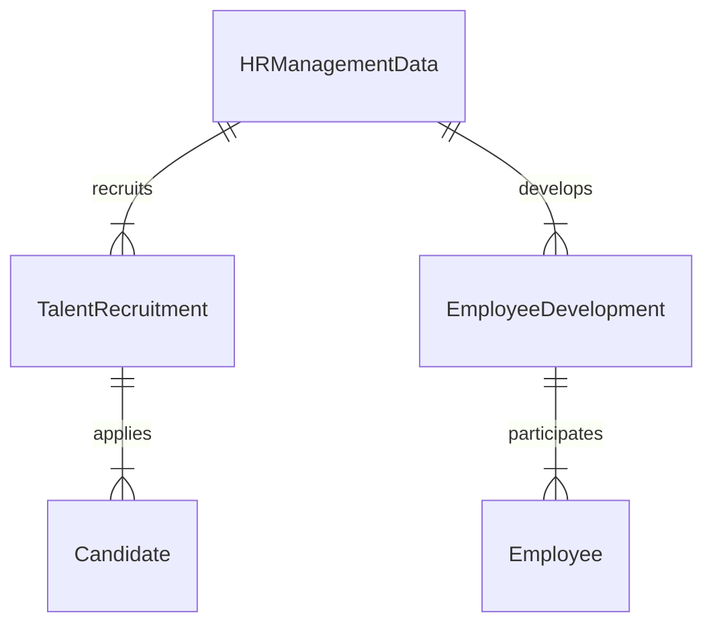

                 

Certainly, let's approach the task step by step to draft a comprehensive and well-structured outline for the article "Big Data-Driven Human Resource Management: Talent Recruitment and Employee Development."

## Step 1: Introduction and Problem Statement

### 1.1 Background and Core Issues

- The advent of the big data era.
- Challenges faced by human resource management.
- The relationship between talent recruitment and employee development.

### 1.2 Problem Description

- Limitations of traditional recruitment models.
- The need for and current state of employee development.
- The potential of data-driven human resource management.

### 1.3 Problem Solving

- Optimizing recruitment processes using big data.
- Enhancing employee development strategies through data analysis.
- Innovating talent management approaches.

### 1.4 Boundaries and Extensions

- Types and quality of data.
- Application scope and limitations of technology.
- Ethical and privacy concerns.

### 1.5 Core Concepts and Connections

#### 1.5.1 Core Concepts

- Big data.
- Human resource management.
- Talent recruitment.
- Employee development.

#### 1.5.2 Table of Concept Attributes and Comparisons

| Concept              | Definition                                                      | Attributes                                                      |
|----------------------|----------------------------------------------------------------|---------------------------------------------------------------|
| Big Data             | A collection of data characterized by volume, variety, and value density. | Rapid growth, massive information, high processing speed |
| Human Resource Mgt   | The process of managing and optimizing human resources for organizational performance. | Recruitment, training, performance management, etc.     |
| Talent Recruitment   | The process of attracting, selecting, and hiring talent from the external market. | Recruitment strategies, channels, processes, assessments |
| Employee Development  | The process of promoting personal growth, skill enhancement, and career progression of employees. | Training and development, career planning, leadership development, work-life balance |

#### 1.5.3 ER Diagram Structure

### 1.6 Summary of the Chapter

...

## Step 2: Big Data Applications in Talent Recruitment

### 2.1 Data Collection and Integration

- Social media data.
- Online resume databases.
- Recruitment website data.
- Employee referral systems.

### 2.2 Data Preprocessing and Cleaning

- Data cleaning.
- Data integration.
- Data quality assessment.

### 2.3 Recruitment Strategy Development

- Data-driven recruitment strategies.
- Customized recruitment plans.
- Recruitment channel optimization.

### 2.4 Recruitment Effectiveness Evaluation

- Analytical tools for recruitment.
- Recruitment cost and benefit analysis.
- Recruitment efficiency assessment.

## Step 3: Big Data Applications in Candidate Screening

...

## Step 4: Big Data Applications in Employee Development

...

## Step 5: Case Studies and Best Practices

### 5.1 Case Study 1: A Data-Driven Recruitment Success Story

#### 5.1.1 Background and Problem

#### 5.1.2 Solution Strategy

#### 5.1.3 Results and Analysis

### 5.2 Case Study 2: Leveraging Big Data for Employee Development

#### 5.2.1 Background and Problem

#### 5.2.2 Solution Strategy

#### 5.2.3 Results and Analysis

### 5.3 Best Practices for Big Data-Driven HRM

...

## Conclusion

...

## References

...

---

### Authors' Note

"Authors: AI Genius Institute & Zen and the Art of Computer Programming"

