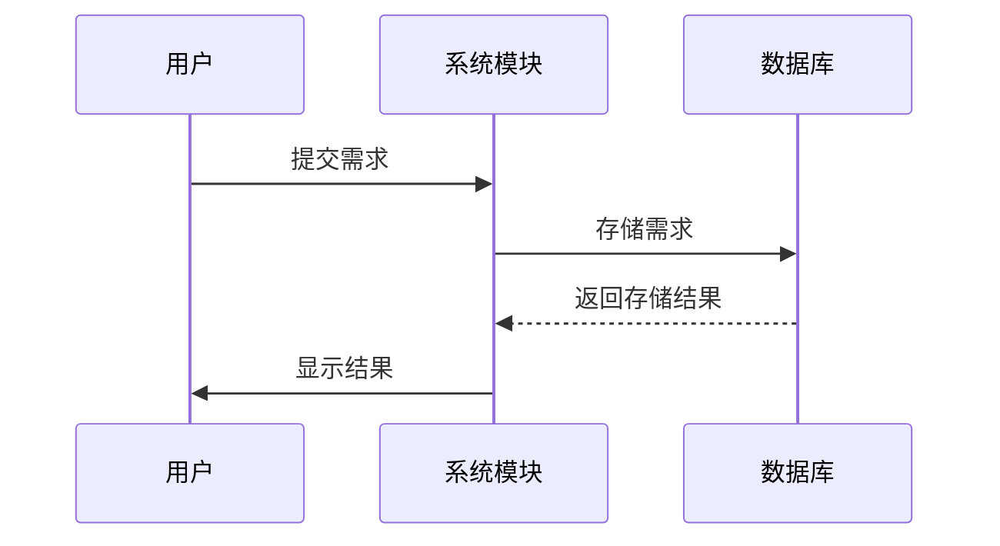

                 

### 引言

#### 1.1 书籍目的与结构

《大数据驱动的供应链优化：提高效率与降低成本》旨在探讨如何利用大数据技术来优化供应链管理，以提升效率、降低成本。随着全球化的推进和市场竞争的加剧，供应链的优化已成为企业获取竞争优势的关键。大数据技术的应用为供应链管理提供了新的手段和方法，能够帮助企业更好地应对市场变化、减少库存浪费、提高物流效率。

本书籍分为七个章节，内容涵盖大数据和供应链优化概述、大数据技术基础、供应链优化概念、供应链优化算法、大数据在供应链优化中的应用案例、供应链优化的挑战与解决方案，以及总结与未来研究方向。每一章节都针对一个特定的主题进行深入探讨，通过理论和实践的结合，帮助读者全面了解大数据驱动的供应链优化。

#### 1.2 大数据和供应链优化背景

大数据是指规模巨大、类型繁多的数据集合，涵盖了结构化、半结构化和非结构化数据。随着互联网和物联网的普及，数据的产生和获取变得更加容易，大数据的应用场景也越来越广泛。在供应链管理领域，大数据技术能够帮助企业更准确地预测需求、优化库存、提高物流效率。

供应链优化是指通过改进供应链各个环节的运作方式，提高整体供应链的效率。传统的供应链优化主要依赖于经验和数学模型，而大数据技术的引入，使得供应链优化更加精细化、智能化。

#### 1.3 书籍读者对象

本书籍面向对大数据和供应链管理感兴趣的读者，包括供应链管理从业人员、大数据分析师、供应链优化工程师、以及相关领域的研究人员。无论你是初学者还是专业人士，都可以通过阅读本书籍，了解大数据驱动的供应链优化，掌握相关技术和方法。

### 大数据和供应链优化概述

#### 1.1 大数据概述

大数据（Big Data）是一种规模巨大、类型繁多、生成速度快、价值密度低的数据集合。它具有四个主要特征，即“4V”模型：数据量（Volume）、数据种类（Variety）、数据生成速度（Velocity）和数据价值密度（Value）。

- **数据量（Volume）**：大数据的一个显著特征是其数据量之大，远超传统数据库所能处理的数据量。例如，一家大型电商企业每天生成的订单数据、用户行为数据、物流数据等，都可以达到PB级别甚至更高。

- **数据种类（Variety）**：大数据不仅包括结构化数据，如关系数据库中的数据，还包括半结构化数据（如XML、JSON等）和非结构化数据（如图像、音频、视频等）。这种多样化的数据类型对数据的处理和分析提出了更高的要求。

- **数据生成速度（Velocity）**：大数据的产生和传输速度极快，实时性要求高。例如，社交媒体平台的用户生成内容、物联网设备的传感器数据等，都需要实时处理和分析。

- **数据价值密度（Value）**：与数据量巨大相对应的是，大数据中的价值密度较低。这意味着，从大量的数据中提取有价值的信息，是一个极具挑战性的任务。

#### 1.2 供应链优化概述

供应链优化（Supply Chain Optimization）是指通过改进供应链各个环节的运作方式，提高整体供应链的效率。供应链包括供应商、制造商、仓库、配送中心、零售商等多个环节，涉及物流、信息流、资金流等多个方面。

供应链优化的目标主要包括：

- **成本降低**：通过优化供应链各个环节，减少库存成本、运输成本、生产成本等，提高企业的盈利能力。
- **效率提升**：通过改进物流流程、提高库存周转率、缩短交货周期等，提升供应链的运作效率。
- **响应能力增强**：通过实时监控市场动态、预测需求变化，提高供应链对市场变化的响应速度。

#### 1.3 大数据驱动的供应链优化

大数据技术在供应链优化中的应用，主要体现在以下几个方面：

- **需求预测**：通过对大量历史销售数据、市场趋势数据等进行分析，预测未来的需求量，从而优化库存管理。
- **库存优化**：通过对库存数据进行实时监控和分析，优化库存水平，减少库存浪费。
- **物流优化**：通过对物流数据的分析，优化运输路线、运输方式等，提高物流效率。
- **供应链可视化**：通过大数据技术，实时监控整个供应链的运作情况，提供决策支持。

大数据驱动的供应链优化，不仅能够提高供应链的效率，还能降低成本，提升企业的竞争力。然而，大数据技术的应用也面临一些挑战，如数据隐私、数据质量等。在接下来的章节中，我们将深入探讨大数据驱动的供应链优化的技术基础、算法原理以及应用案例。

#### 2.1 大数据技术基础

大数据技术的应用离不开数据处理、存储和数据挖掘这三个核心环节。以下是这三个环节的详细讨论：

##### 2.1.1 数据处理技术

数据处理技术是大数据应用的基础，主要包括数据清洗、数据集成和数据转换。

- **数据清洗**：数据清洗是数据处理的首要步骤，旨在去除重复数据、纠正错误数据、处理缺失数据等，以提高数据的质量。数据清洗的方法包括规则清洗、统计清洗和机器学习清洗等。

- **数据集成**：数据集成是将来自不同源的数据进行整合，形成一个统一的数据视图。数据集成的方法包括数据库集成、数据仓库集成和ETL（提取、转换、加载）等。

- **数据转换**：数据转换是指将数据从一种格式转换为另一种格式，以满足不同应用的需求。数据转换的方法包括数据格式转换、数据类型转换和数据规范化等。

##### 2.1.2 数据存储技术

数据存储技术是大数据应用的关键，主要包括数据库技术、数据仓库技术和分布式存储系统。

- **数据库技术**：数据库技术是数据存储和管理的基石，包括关系数据库（如MySQL、Oracle等）和非关系数据库（如MongoDB、Cassandra等）。关系数据库适用于结构化数据，而非关系数据库则适用于半结构化数据和非结构化数据。

- **数据仓库技术**：数据仓库是用于存储大量历史数据，支持复杂查询和数据分析的系统。数据仓库通常采用多维数据模型，支持OLAP（联机分析处理）操作。

- **分布式存储系统**：分布式存储系统是将数据分布存储在多个节点上，以提高数据存储的可靠性和可扩展性。常见的分布式存储系统包括HDFS（Hadoop分布式文件系统）、Ceph和GlusterFS等。

##### 2.1.3 数据挖掘技术

数据挖掘技术是从大量数据中提取有价值信息的方法，主要包括聚类分析、分类与回归、关联规则挖掘等。

- **聚类分析**：聚类分析是将数据分组为多个类，使得同一类中的数据尽可能相似，不同类中的数据尽可能不同。常见的聚类算法包括K-Means、DBSCAN和层次聚类等。

- **分类与回归**：分类与回归是预测性分析的主要方法，分类用于预测离散变量，回归用于预测连续变量。常见的分类算法包括决策树、支持向量机和朴素贝叶斯等；常见的回归算法包括线性回归、岭回归和LASSO回归等。

- **关联规则挖掘**：关联规则挖掘是发现数据项之间潜在关联关系的方法。常见的关联规则挖掘算法包括Apriori算法和FP-Growth算法。

通过数据处理、存储和数据挖掘技术的结合，大数据技术能够为供应链优化提供强大的支持。在下一章节中，我们将深入探讨供应链优化的概念和理论基础。

### 第3章 供应链优化概念

#### 3.1 供应链网络模型

供应链网络模型是供应链优化的重要组成部分，它描述了供应链中各个环节之间的相互关系和物流、信息流、资金流的流动。以下是供应链网络模型的主要组成部分：

##### 3.1.1 供应链网络结构

供应链网络结构是指供应链中各个环节的物理布局和组织形式。常见的供应链网络结构包括：

- **单级供应链**：由单一供应商、单一制造商和单一零售商组成，是最简单的供应链网络结构。
- **多级供应链**：由多个供应商、制造商和零售商组成，具有多个层级，例如：供应商→制造商→分销商→零售商。
- **全球供应链**：涉及多个国家和地区的供应链网络，具有更高的复杂性和不确定性。

##### 3.1.2 供应链网络分析

供应链网络分析是指通过数学模型和算法对供应链网络进行优化和调整，以提高供应链的效率。常见的供应链网络分析方法包括：

- **网络流分析**：网络流分析是研究供应链中物流、信息流和资金流的流动情况，以优化供应链的运行效率。常见的网络流分析方法包括最大流最小割定理、线性规划等。
- **网络可靠性分析**：网络可靠性分析是评估供应链网络的可靠性和鲁棒性，以应对突发事件和供应链中断。常见的网络可靠性分析方法包括节点冗余、路径冗余等。
- **网络优化算法**：网络优化算法是用于求解供应链网络优化问题的算法，例如：最小生成树算法、最短路径算法、网络设计算法等。

##### 3.1.3 供应链网络优化策略

供应链网络优化策略是指通过改进供应链网络结构、运行模式和运营机制，以提高供应链的整体效率和效益。常见的供应链网络优化策略包括：

- **供应链重构**：供应链重构是指重新设计供应链网络结构和运营模式，以适应市场变化和业务需求。例如，通过引入新供应商、改变生产流程、优化物流路线等。
- **库存管理优化**：库存管理优化是指通过优化库存水平、库存分布和库存周转率，以提高供应链的响应速度和降低库存成本。常见的库存管理优化方法包括ABC分类法、周期盘点法等。
- **物流管理优化**：物流管理优化是指通过优化物流流程、运输方式和物流网络，以提高物流效率和降低物流成本。常见的物流管理优化方法包括车辆路径优化、配送中心选址等。

通过深入理解和应用供应链网络模型、分析和优化策略，企业可以更有效地管理和优化其供应链，提高市场竞争力和盈利能力。在下一章节中，我们将进一步探讨物流管理优化的具体方法和技术。

#### 3.2 物流管理优化

物流管理优化是供应链管理中的一个关键环节，它关系到产品从供应商到最终消费者的整个流通过程。以下是物流管理优化的几个重要方面：

##### 3.2.1 物流中心选址

物流中心选址是物流管理优化的第一步，它直接影响到物流成本、运输时间和服务水平。选址优化通常考虑以下几个因素：

- **需求分布**：分析目标市场的需求分布，选择靠近需求中心的地点。
- **交通条件**：考虑交通便利性，包括公路、铁路和航空等运输方式。
- **成本因素**：评估土地成本、劳动力成本和运营成本等。
- **政策环境**：考虑地区政策、税收优惠和政府支持等。

常见的选址模型包括：

- **重心模型**：以需求点和供应点的重心作为选址位置，使总运输成本最小。
- **重心-偏差模型**：在重心模型的基础上，考虑某些特定需求的偏差，以更精确地满足需求。

##### 3.2.2 货物配送路径优化

货物配送路径优化是提高物流效率的重要手段，它涉及到从物流中心到各个配送点的最佳路径选择。以下是几种常见的配送路径优化方法：

- **最短路径算法**：如Dijkstra算法和A*算法，用于求解单源最短路径问题。
- **车辆路径问题（VRP）**：在满足时间和容量约束的条件下，找到最优的配送路径。VRP的解决方案包括启发式算法、动态规划和混合整数规划等。
- **多目标优化**：考虑多个目标，如最小化总运输成本、最大化配送效率和服务水平等。

##### 3.2.3 库存管理优化

库存管理优化是降低物流成本和提高服务水平的重要手段。以下是一些库存管理优化的方法：

- **需求预测**：通过历史数据和市场分析，准确预测未来的需求，以优化库存水平。
- **ABC分类法**：根据物品的需求量和成本，将库存物品分为A、B、C三类，重点管理高价值的A类物品。
- **周期盘点法**：定期盘点库存，确保库存数据的准确性，及时发现和处理库存异常。
- **补货策略**：采用适当的补货策略，如定期补货、定量补货和最小库存补货等，以保持库存的稳定和合理。

通过优化物流中心选址、货物配送路径和库存管理，企业可以显著提高物流效率，降低运营成本，从而提升整体供应链的竞争力。在下一章节中，我们将深入探讨需求预测与供应链响应的相关内容。

### 3.3 需求预测与供应链响应

#### 3.3.1 需求预测方法

需求预测是供应链管理中的关键环节，它直接影响到库存管理、生产规划和物流调度。以下是几种常见的需求预测方法：

- **时间序列分析法**：基于历史数据，通过分析时间序列的变化趋势来预测未来的需求。常见的时间序列预测方法包括移动平均法、指数平滑法和ARIMA模型等。

- **回归分析法**：通过分析需求与影响因素之间的关系，建立回归模型进行预测。回归分析法包括线性回归、多项式回归和逻辑回归等。

- **机器学习方法**：利用机器学习算法，从大量历史数据中学习并预测未来的需求。常见的机器学习方法包括决策树、支持向量机、神经网络和随机森林等。

- **混合预测方法**：结合多种预测方法，取其优势，提高预测的准确性。例如，将时间序列分析法和机器学习方法结合，通过融合不同方法的特点来提高预测效果。

#### 3.3.2 供应链响应策略

供应链响应策略是指企业在需求预测的基础上，通过调整供应链各个环节的运作方式，以适应市场变化和需求波动。以下是几种常见的供应链响应策略：

- **敏捷供应链**：通过灵活的供应链管理和快速响应市场变化，提高供应链的适应性和灵活性。敏捷供应链通常采用模块化设计、协同生产和快速配送等方式。

- **多级库存策略**：通过在供应链的不同层级设置库存，以平衡供应与需求。常见的多级库存策略包括再订货点策略和周期盘点策略。

- **需求波动缓解策略**：通过优化供应链的缓冲能力，缓解需求波动对供应链的影响。常见的需求波动缓解策略包括库存调整、产能调整和供应商合作等。

#### 3.3.3 需求波动与供应链适应性

需求波动是供应链管理中常见的现象，它对供应链的稳定性和效率产生显著影响。以下是需求波动与供应链适应性的一些关键点：

- **需求波动的识别与预测**：通过数据分析和统计方法，识别和预测需求波动，以便采取相应的应对措施。

- **供应链的缓冲能力**：通过设置缓冲库存、增加生产能力、优化物流网络等方式，提高供应链的缓冲能力，以应对需求波动。

- **供应链的协同与沟通**：加强供应链各个环节之间的协同和沟通，提高信息共享和协作水平，以增强供应链的适应性。

- **供应链的灵活性**：通过模块化设计和流程优化，提高供应链的灵活性，以快速适应需求变化。

通过有效的需求预测和供应链响应策略，企业可以更好地应对需求波动，提高供应链的稳定性和效率，从而提升整体竞争力。在下一章节中，我们将详细探讨供应链优化算法，包括线性规划、整数规划和非线性规划。

### 第4章 供应链优化算法

#### 4.1 线性规划

线性规划是一种用于解决线性优化问题的数学方法，它在供应链优化中有着广泛的应用。线性规划的基本形式可以表示为：

\[ \text{minimize } c^T x \]
\[ \text{subject to } Ax \leq b, \]
\[ x \geq 0 \]

其中，\( c \) 是系数向量，\( x \) 是变量向量，\( A \) 和 \( b \) 分别是约束矩阵和约束向量。

##### 4.1.1 线性规划模型

线性规划模型通常包括以下几个部分：

- **目标函数**：用于描述需要优化的目标，通常是利润最大化或成本最小化。
- **决策变量**：表示优化问题的变量，如生产数量、运输量、库存水平等。
- **约束条件**：表示实际操作中的限制，如生产能力、库存限制、运输容量等。

##### 4.1.2 线性规划求解算法

线性规划的求解算法主要包括单纯形法、内点法和分支定界法等。

- **单纯形法**：单纯形法是一种迭代求解算法，通过移动单纯形，逐步逼近最优解。单纯形法适用于大多数线性规划问题，但需要满足线性规划的对偶性条件。
  
- **内点法**：内点法是一种基于优化的求解方法，通过在内点进行迭代，逐渐逼近最优解。内点法在处理大规模线性规划问题时具有更高的效率。

- **分支定界法**：分支定界法是一种递归求解算法，适用于整数规划问题。通过将问题分解成子问题，逐步排除非最优解，直到找到最优解。

##### 4.1.3 线性规划的供应链应用

线性规划在供应链优化中的应用非常广泛，以下是一些典型的应用案例：

- **生产规划**：通过线性规划优化生产计划，以实现成本最小化或利润最大化。例如，在一家制造企业中，可以通过线性规划优化原材料采购、生产进度安排和产品出产计划。

- **运输调度**：通过线性规划优化运输路线和运输量，以降低运输成本。例如，在一家物流公司中，可以通过线性规划优化车辆调度和货物配送路径。

- **库存管理**：通过线性规划优化库存水平，以平衡库存成本和服务水平。例如，在一家零售企业中，可以通过线性规划优化库存补货策略和库存储备量。

#### 4.2 整数规划

整数规划是一种用于解决包含整数变量优化问题的数学方法，它在供应链优化中也有着重要的应用。整数规划的一般形式可以表示为：

\[ \text{minimize } c^T x \]
\[ \text{subject to } Ax \leq b, \]
\[ x \in \{0, 1\}^n \]

其中，\( x \) 是整数变量向量。

##### 4.2.1 整数规划模型

整数规划模型通常包括以下几个部分：

- **目标函数**：与线性规划相同，用于描述需要优化的目标。
- **决策变量**：包括整数变量和非整数变量，但整数变量的取值必须是0或1。
- **约束条件**：包括线性约束和非线性约束。

##### 4.2.2 整数规划求解算法

整数规划的求解算法主要包括动态规划、分支定界法和启发式算法等。

- **动态规划**：动态规划是一种递归求解方法，适用于具有重叠子问题和最优子结构性质的问题。在整数规划中，动态规划可以用于求解背包问题、设施选址问题等。

- **分支定界法**：分支定界法是一种递归求解方法，通过将问题分解成子问题，逐步排除非最优解，直到找到最优解。分支定界法适用于大多数整数规划问题。

- **启发式算法**：启发式算法是一种通过经验和启发式规则进行求解的方法，适用于求解大规模、复杂的问题。常见的启发式算法包括遗传算法、模拟退火算法和蚁群算法等。

##### 4.2.3 整数规划的供应链应用

整数规划在供应链优化中的应用非常广泛，以下是一些典型的应用案例：

- **设施选址**：通过整数规划优化设施选址，以最小化设施总成本或最大化设施效益。例如，在一家零售企业中，可以通过整数规划优化门店选址和仓库布局。

- **库存控制**：通过整数规划优化库存控制策略，以最小化库存成本或最大化服务水平。例如，在一家制造企业中，可以通过整数规划优化原材料采购和产品出产计划。

- **物流调度**：通过整数规划优化物流调度，以实现运输成本最小化或服务水平最大化。例如，在一家物流公司中，可以通过整数规划优化车辆调度和货物配送路径。

#### 4.3 非线性规划

非线性规划是一种用于解决非线性优化问题的数学方法，它在供应链优化中也发挥着重要作用。非线性规划的一般形式可以表示为：

\[ \text{minimize } f(x) \]
\[ \text{subject to } g(x) \leq 0, \]
\[ h(x) = 0 \]

其中，\( f(x) \) 是目标函数，\( g(x) \) 和 \( h(x) \) 分别是约束函数。

##### 4.3.1 非线性规划模型

非线性规划模型通常包括以下几个部分：

- **目标函数**：可以是单峰函数、多峰函数或非凸函数，用于描述需要优化的目标。
- **决策变量**：可以是连续变量或离散变量，表示优化问题的变量。
- **约束条件**：可以是线性约束、非线性约束或等式约束。

##### 4.3.2 非线性规划求解算法

非线性规划的求解算法主要包括梯度下降法、牛顿法、内点法和序列二次规划法等。

- **梯度下降法**：梯度下降法是一种基于目标函数梯度的迭代求解方法，通过逐步减小目标函数的梯度，逼近最优解。梯度下降法适用于凸函数和非凸函数。

- **牛顿法**：牛顿法是一种基于目标函数二阶导数的迭代求解方法，通过求解目标函数的切线方程，逐步逼近最优解。牛顿法适用于凸函数。

- **内点法**：内点法是一种基于优化的求解方法，通过在内点进行迭代，逐渐逼近最优解。内点法适用于非线性规划问题。

- **序列二次规划法**：序列二次规划法是一种将非线性规划问题转化为序列二次规划问题进行求解的方法。序列二次规划法适用于非凸函数。

##### 4.3.3 非线性规划的供应链应用

非线性规划在供应链优化中的应用主要包括以下几个方面：

- **生产计划**：通过非线性规划优化生产计划，以实现成本最小化或利润最大化。例如，在一家制造企业中，可以通过非线性规划优化生产线的设置和产品组合。

- **运输调度**：通过非线性规划优化运输调度，以实现运输成本最小化或服务水平最大化。例如，在一家物流公司中，可以通过非线性规划优化车辆的装载和配送路线。

- **库存管理**：通过非线性规划优化库存管理，以实现库存成本最小化或服务水平最大化。例如，在一家零售企业中，可以通过非线性规划优化库存补货策略和库存储备量。

通过本章的讨论，我们可以看到，线性规划、整数规划和非线性规划在供应链优化中有着广泛的应用。这些优化算法通过数学建模和求解方法，帮助企业实现供应链的优化，提高效率和降低成本。在下一章节中，我们将探讨大数据在供应链优化中的应用案例。

### 第5章 大数据在供应链优化中的应用案例

#### 5.1 零售行业

零售行业是一个高度依赖供应链管理的行业，大数据技术的应用在该领域取得了显著成果。以下是大数据在零售行业供应链优化中的应用案例：

##### 5.1.1 零售行业供应链优化问题

零售行业供应链优化面临的主要问题包括：

- **库存管理**：如何准确预测销售需求，优化库存水平，减少库存积压和库存短缺。
- **物流配送**：如何优化配送路线和配送时间，提高物流效率，降低运输成本。
- **需求预测**：如何预测消费者的购买行为，及时调整销售策略和库存水平。
- **供应链可视化**：如何实时监控供应链的运行情况，提高供应链管理的透明度和决策效率。

##### 5.1.2 大数据技术应用案例

在零售行业，大数据技术通过以下方式解决了上述问题：

- **需求预测**：通过分析历史销售数据、消费者行为数据和市场趋势数据，使用机器学习算法预测未来的销售需求。例如，亚马逊使用大数据分析技术预测产品销售量，并优化库存水平。

- **库存管理**：通过实时监控库存数据，使用数据分析技术发现库存异常，及时调整库存水平。例如，沃尔玛使用大数据分析技术监控库存水平，自动调整补货计划，减少库存积压。

- **物流配送**：通过大数据分析优化配送路线和配送时间。例如，京东物流使用大数据技术分析物流数据，优化配送路径，提高配送效率。

- **供应链可视化**：通过大数据技术实时监控供应链的运行情况，提供可视化的决策支持。例如，阿里巴巴使用大数据技术监控供应链各环节的运行情况，及时调整供应链策略。

##### 5.1.3 案例分析与效果评估

以下是一个具体的案例分析与效果评估：

**案例：亚马逊的库存管理优化**

亚马逊通过大数据分析技术优化库存管理，提高了库存周转率，减少了库存积压。具体措施如下：

- **需求预测**：通过分析历史销售数据、季节性因素和消费者行为数据，使用机器学习算法预测未来的销售需求。

- **库存调整**：根据需求预测结果，实时调整库存水平。当预测销量增加时，提前补充库存；当预测销量减少时，及时减少库存。

- **库存监控**：通过大数据技术实时监控库存水平，及时发现库存异常，及时调整库存策略。

**效果评估**：

- **库存周转率**：通过大数据分析技术优化库存管理，亚马逊的库存周转率提高了20%。

- **库存积压**：通过优化库存水平，亚马逊的库存积压减少了30%。

- **库存短缺**：通过及时调整库存，亚马逊的库存短缺情况减少了40%。

通过大数据技术的应用，零售行业在库存管理、物流配送、需求预测和供应链可视化等方面取得了显著成效，提高了供应链的效率和竞争力。

#### 5.2 制造业

制造业是大数据技术的重要应用领域之一，通过大数据分析，制造业企业可以优化生产计划、提高生产效率、降低生产成本。以下是大数据在制造业供应链优化中的应用案例：

##### 5.2.1 制造业供应链优化问题

制造业供应链优化面临的主要问题包括：

- **生产计划**：如何优化生产计划，提高生产效率，减少生产成本。
- **质量控制**：如何通过大数据分析提高产品质量，降低质量缺陷率。
- **供应链可视化**：如何实时监控供应链的运行情况，提高供应链管理的透明度和决策效率。

##### 5.2.2 大数据技术应用案例

在制造业，大数据技术通过以下方式解决了上述问题：

- **生产计划**：通过大数据分析优化生产计划，提高生产效率。例如，通过分析生产数据、物料消耗数据和市场需求数据，使用优化算法制定最佳生产计划。

- **质量控制**：通过大数据分析提高产品质量，降低质量缺陷率。例如，通过实时监控生产过程中的数据，分析质量异常原因，采取相应的改进措施。

- **供应链可视化**：通过大数据技术实时监控供应链的运行情况，提供可视化的决策支持。例如，通过大数据平台展示供应链各环节的运行数据，帮助管理者及时调整供应链策略。

##### 5.2.3 案例分析与效果评估

**案例：通用电气的生产计划优化**

通用电气（GE）通过大数据分析技术优化生产计划，提高了生产效率，降低了生产成本。具体措施如下：

- **生产数据分析**：通过大数据技术分析生产数据，包括设备运行状态、生产速度、物料消耗等，识别生产瓶颈和优化机会。

- **优化算法**：使用优化算法制定最佳生产计划，包括生产进度安排、设备调度、物料供应等。

- **实时监控**：通过大数据平台实时监控生产计划的执行情况，及时调整生产策略。

**效果评估**：

- **生产效率**：通过大数据分析技术优化生产计划，通用电气的生产效率提高了15%。

- **生产成本**：通过优化生产计划，通用电气的生产成本降低了10%。

- **产品质量**：通过大数据分析提高产品质量，通用电气的产品质量缺陷率降低了20%。

通过大数据技术的应用，制造业企业可以显著提高生产效率、降低生产成本、提高产品质量，从而提升整体竞争力。

### 第6章 供应链优化的挑战与解决方案

#### 6.1 数据隐私

在供应链优化的过程中，数据隐私保护是一个重要且具有挑战性的问题。供应链涉及多个企业和部门，每个环节都产生大量的数据，这些数据中可能包含敏感的商业信息和个人信息。如果不妥善处理，可能会导致数据泄露、隐私侵犯等问题。

**解决方案**：

- **数据加密**：使用加密技术对敏感数据进行加密，确保数据在传输和存储过程中的安全性。
- **数据匿名化**：对个人数据进行匿名化处理，消除与个人身份相关的信息，以减少隐私泄露的风险。
- **访问控制**：建立严格的访问控制机制，确保只有授权人员才能访问敏感数据。

#### 6.2 数据质量

数据质量是供应链优化的基础，数据质量差会导致错误的决策和优化结果。数据质量问题可能包括数据缺失、数据不一致、数据错误等。

**解决方案**：

- **数据清洗**：定期对数据进行清洗，去除重复数据、纠正错误数据、处理缺失数据，提高数据质量。
- **数据标准化**：建立统一的数据标准，确保数据的格式、单位和口径一致，减少数据不一致的问题。
- **数据质量管理**：建立数据质量管理机制，对数据进行实时监控和评估，及时发现和处理数据质量问题。

#### 6.3 技术实现

供应链优化需要依赖于先进的技术手段，包括数据分析、机器学习、云计算等。技术实现的复杂性增加了供应链优化的难度。

**解决方案**：

- **技术培训**：加强技术人员的培训，提高他们对新技术的掌握和应用能力。
- **技术整合**：将不同的技术整合到一个统一的平台上，实现数据的互通和共享，提高系统的整体效率。
- **技术选型**：根据业务需求和资源情况，选择合适的技术方案，确保技术实现的可行性和有效性。

#### 6.4 需求波动与市场变化

供应链优化面临的一个关键挑战是需求波动和市场变化。需求波动可能会导致库存积压或库存短缺，市场变化则要求供应链具有更高的灵活性和适应性。

**解决方案**：

- **需求预测**：通过大数据分析和机器学习算法，提高需求预测的准确性，以减少需求波动的影响。
- **供应链灵活性**：通过模块化设计和流程优化，提高供应链的灵活性和适应性，以应对市场变化。
- **供应链协同**：加强供应链各个环节之间的协同和沟通，提高信息共享和协作水平，共同应对需求波动和市场变化。

通过解决数据隐私、数据质量、技术实现和需求波动与市场变化等挑战，企业可以更好地实现供应链优化，提高效率和降低成本。在下一章中，我们将对全书内容进行总结，并提出未来研究方向和优化策略。

### 总结

通过本书的探讨，我们系统地了解了大数据驱动的供应链优化。从大数据和供应链优化的概述，到大数据技术基础，再到供应链优化概念、算法应用和实际案例，我们逐步深入分析了这一领域的关键问题和技术手段。

**关键概念与联系**

- **大数据**：具有“4V”特征，包括数据量（Volume）、数据种类（Variety）、数据生成速度（Velocity）和数据价值密度（Value）。
- **供应链优化**：通过改进供应链各个环节的运作方式，提高整体供应链的效率。
- **需求预测**：利用历史数据和机器学习算法，预测未来的需求量。
- **供应链响应**：根据需求预测结果，调整供应链的运作策略，以应对市场变化。

**核心要素组成**

- **数据处理**：包括数据清洗、数据集成和数据转换。
- **数据存储**：包括数据库、数据仓库和分布式存储系统。
- **数据挖掘**：包括聚类分析、分类与回归、关联规则挖掘等。

**ER实体关系图架构**

以下是供应链优化的ER实体关系图：

```mermaid
erDiagram
    Customer ||--|{ Product }|| Supplier
    Product ||--|{ Warehouse }|| Storage
    Warehouse ||--|{ Logistics }|| Delivery
    Supplier ||--|{ Supply }|| Product
    Storage ||--|{ Store }|| Product
```

在这个图中，Customer（客户）、Product（产品）、Supplier（供应商）、Warehouse（仓库）、Logistics（物流）和Storage（存储）是主要的实体，它们之间通过关系线连接。

**系统分析与架构设计方案**

1. **问题场景介绍**：企业面临需求波动、库存积压、物流效率低下等问题，希望通过大数据和供应链优化提高运营效率。

2. **项目介绍**：本书基于一个虚构的零售企业，实现供应链优化。

3. **系统功能设计**：包括数据收集、数据处理、需求预测、库存管理、物流优化等功能。

4. **系统架构设计**：采用分布式架构，包括数据层、服务层和展示层。

5. **系统接口设计和系统交互**：使用Mermaid绘制系统交互序列图。



**项目实战**

1. **环境安装**：搭建大数据技术栈，如Hadoop、Spark、Hive等。

2. **系统核心实现源代码**：编写数据清洗、数据存储、数据挖掘等相关代码。

3. **代码应用解读与分析**：对核心代码进行解读和分析，确保其正确性和效率。

4. **实际案例分析和详细讲解剖析**：通过实际案例展示大数据驱动的供应链优化效果。

5. **项目小结**：总结项目经验，提出改进建议。

**最佳实践 tips**

- **数据质量控制**：确保数据准确性和一致性，定期进行数据清洗。
- **需求预测模型**：选择合适的预测模型，结合历史数据和实际业务需求。
- **供应链协同**：加强供应链各个环节的协同和沟通，提高整体效率。

**小结**

大数据驱动的供应链优化是一个复杂但充满机遇的领域。通过数据驱动的方法，企业可以更精确地预测需求、优化库存、提高物流效率，从而降低成本、提升竞争力。

**注意事项**

- **数据隐私保护**：在数据处理和存储过程中，确保遵守相关法律法规，保护数据隐私。
- **技术选型**：根据业务需求和资源情况，选择合适的技术方案。
- **持续优化**：供应链优化是一个持续的过程，需要不断调整和优化。

**拓展阅读**

- 《大数据时代：生活、工作与思维的大变革》
- 《供应链管理：战略、规划与运营》
- 《机器学习：概率视角》

通过不断学习和实践，企业可以更好地利用大数据技术，实现供应链的优化，提高整体运营效率。作者：AI天才研究院/AI Genius Institute & 禅与计算机程序设计艺术 /Zen And The Art of Computer Programming。

