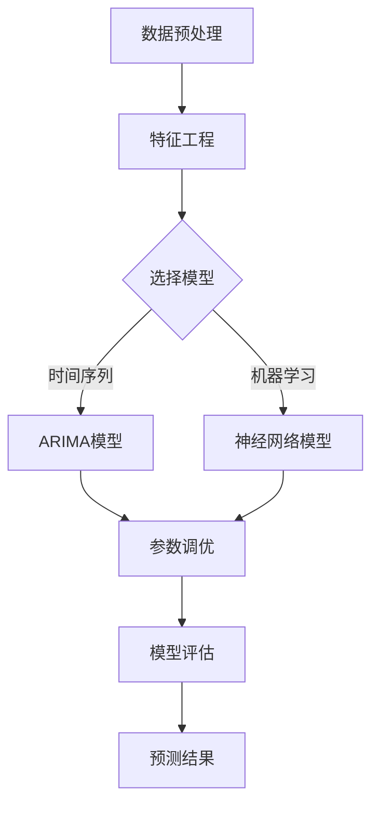
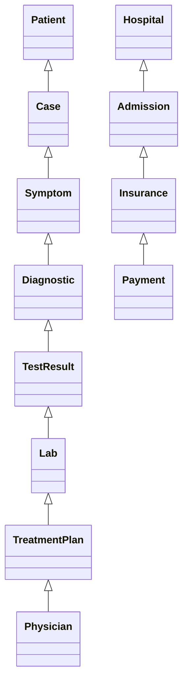
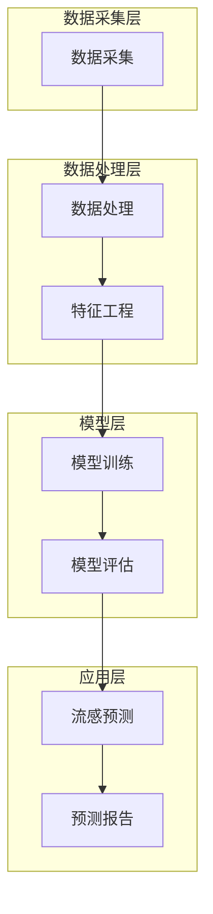
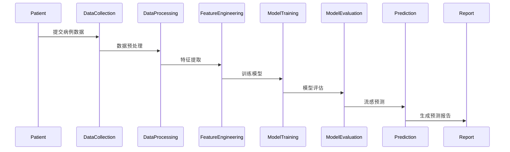
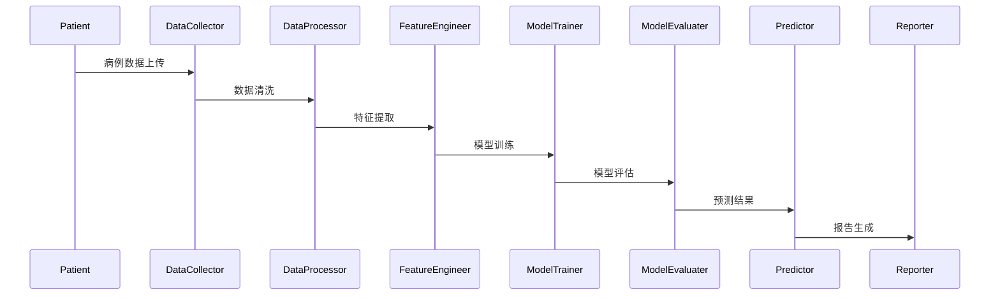

                 

# 《大数据驱动的公共卫生政策：疾病预防与健康促进》

## 关键词：
- 大数据
- 公共卫生政策
- 疾病监测
- 疾病预测
- 健康促进
- 公共卫生挑战

## 摘要：
本文探讨了大数据在公共卫生政策中的应用，特别是在疾病预防与健康促进方面的作用。通过分析大数据的特征和公共卫生领域的挑战，本文介绍了大数据在疾病监测和预测中的应用，以及如何利用大数据制定和优化公共卫生政策。此外，还探讨了大数据在健康促进和健康服务创新中的作用，并对未来的发展进行了展望。

## 第1章：大数据时代下的公共卫生挑战

### 1.1 大数据的定义与特征
大数据（Big Data）是指那些数据规模巨大、数据类型多样、数据生成速度快、数据的处理和分析要求高的数据集。通常，大数据具有“4V”特征：数据量（Volume）、数据类型（Variety）、数据速度（Velocity）和数据价值（Value）。

- **数据量**：大数据的规模通常在GB、TB甚至PB级别，这对存储和处理能力提出了高要求。
- **数据类型**：大数据不仅包括结构化数据，还包含非结构化数据，如图像、音频、视频等。
- **数据速度**：数据生成的速度非常快，需要实时处理和分析。
- **数据价值**：大数据的价值在于从海量数据中提取有价值的信息。

### 1.2 大数据在公共卫生领域的应用现状
大数据已经在公共卫生领域发挥了重要作用，尤其是在疾病监测、疾病预测和健康服务等方面。

- **疾病监测**：通过大数据分析，可以实时监测疾病的发生和传播趋势，提高疾病预警和应对能力。
- **疾病预测**：利用大数据分析疾病发生的潜在因素和传播规律，预测疾病的发生趋势，为公共卫生决策提供科学依据。
- **健康服务**：通过大数据分析个人和群体的健康数据，提供个性化的健康服务和健康管理方案。

### 1.3 公共卫生问题的复杂性与大数据的优势
公共卫生问题往往具有高度复杂性和不确定性，例如传染病、慢性病、环境污染等。这些问题需要综合多方面的数据和信息进行深入分析。

- **数据分析能力**：大数据技术具有强大的数据分析能力，可以从海量数据中提取有价值的信息，为公共卫生决策提供支持。
- **实时监测和预测**：大数据技术可以实现实时监测和预测，提高公共卫生应急响应能力。
- **个性化健康服务**：大数据分析可以提供个性化的健康服务，满足不同人群的健康需求。

## 第2章：大数据在疾病监测中的作用

### 2.1 疾病监测的重要性
疾病监测是公共卫生体系的重要组成部分，通过监测可以及时发现疾病的流行趋势和变化规律，为疾病预防和控制提供科学依据。

### 2.2 大数据在疾病监测中的应用
大数据在疾病监测中的应用主要体现在数据收集、数据整合和数据挖掘等方面。

- **数据收集**：通过互联网、传感器、移动设备等收集大量的健康数据，包括患者病史、流行病学数据、环境数据等。
- **数据整合**：将来自不同渠道的数据进行整合，形成统一的数据资源，为后续分析提供基础。
- **数据挖掘**：利用数据挖掘技术从大量数据中提取有价值的信息，如疾病爆发点、高风险人群等。

### 2.3 监测方法与技术
大数据在疾病监测中的应用涉及多种技术，包括时间序列分析、机器学习、社交网络分析等。

- **时间序列分析**：通过分析时间序列数据，预测疾病发生的趋势和周期。
- **机器学习**：利用机器学习算法，从数据中发现规律和模式，预测疾病的发生和发展。
- **社交网络分析**：通过分析社交网络数据，了解疾病传播的路径和速度。

## 第3章：疾病预测与预警

### 3.1 疾病预测的基本原理
疾病预测是基于历史数据和当前数据，通过建立预测模型，预测未来疾病的发生情况。常见的疾病预测模型包括时间序列模型、回归模型、神经网络模型等。

### 3.2 疾病预测模型的构建
构建疾病预测模型需要以下几个步骤：

1. **数据收集与预处理**：收集相关数据，包括病例数据、环境数据、人口统计数据等，并进行数据清洗和预处理。
2. **特征选择**：选择与疾病发生相关的特征，去除无关或冗余的特征。
3. **模型构建**：选择合适的模型，如线性回归、逻辑回归、决策树、神经网络等，进行模型训练。
4. **模型评估**：通过交叉验证等方法，评估模型的效果，并进行参数调优。

### 3.3 疾病预警系统的实现
疾病预警系统是将预测模型应用于实际场景，实现对疾病的实时预警。实现疾病预警系统需要以下几个步骤：

1. **数据接入**：接入实时数据，包括病例数据、环境数据等。
2. **实时预测**：利用预测模型，对实时数据进行预测，判断疾病发生的风险。
3. **预警触发**：设定预警阈值，当预测结果达到预警阈值时，触发预警机制。
4. **预警响应**：根据预警结果，采取相应的公共卫生措施，如疫苗接种、健康教育等。

## 第4章：大数据驱动的疾病预防策略

### 4.1 疾病预防策略的演变
疾病预防策略经历了从传统的被动监测和应对，到主动预防和控制的转变。大数据技术的应用，使得疾病预防策略更加精准和高效。

### 4.2 大数据在疾病预防中的应用
大数据在疾病预防中的应用主要包括以下几个方面：

- **个性化预防**：通过分析个人健康数据，制定个性化的预防措施。
- **社区健康干预**：通过分析社区健康数据，开展有针对性的健康干预活动。
- **公共卫生政策制定**：通过大数据分析，制定更加科学和有效的公共卫生政策。

### 4.3 案例研究：COVID-19防控策略分析
COVID-19疫情期间，大数据在疾病防控中发挥了重要作用。通过大数据分析，可以实时了解疫情发展趋势，预测疫情扩散风险，制定科学的防控策略。

## 第5章：疾病防控与公共卫生政策

### 5.1 疾病防控与公共卫生政策的联系
疾病防控是公共卫生政策的核心内容之一。公共卫生政策的有效实施，需要依托科学的疾病防控策略。

### 5.2 大数据驱动的公共卫生政策制定
大数据技术在公共卫生政策制定中的应用，主要体现在以下几个方面：

- **政策评估**：通过大数据分析，评估公共卫生政策的效果，为政策优化提供依据。
- **政策优化**：根据大数据分析结果，调整公共卫生政策，提高政策的有效性。
- **政策响应**：利用大数据预警系统，及时响应公共卫生事件，采取有效的应对措施。

### 5.3 案例研究：流感防控政策分析
流感是一种常见的呼吸道传染病，通过大数据分析，可以了解流感的流行规律，制定科学的防控政策。

## 第6章：大数据在健康促进中的应用

### 6.1 健康促进的基本概念
健康促进是指通过社会、环境、政策等多种手段，提高人们的健康水平和生活质量。

### 6.2 大数据在健康促进中的作用
大数据技术在健康促进中的应用，主要体现在以下几个方面：

- **健康风险评估**：通过大数据分析，评估个人的健康风险，制定个性化的健康干预方案。
- **健康行为分析**：通过大数据分析，了解人群的健康行为，开展有针对性的健康教育活动。

## 第7章：大数据驱动的健康服务创新

### 7.1 健康服务的现状与问题
当前，健康服务存在一些问题，如资源分配不均、服务效率低下、个性化程度不足等。

### 7.2 大数据驱动的健康服务创新
大数据技术为健康服务创新提供了新的思路和方法，主要体现在以下几个方面：

- **精准医疗**：通过大数据分析，提供个性化的诊断和治疗方案。
- **智能健康管理系统**：利用大数据技术，实现对健康数据的智能分析和处理，提高健康管理水平。

## 第8章：大数据驱动的公共卫生政策未来展望

### 8.1 技术发展趋势与挑战
随着大数据技术的不断发展，公共卫生政策将面临新的机遇和挑战。如何充分利用大数据的优势，解决公共卫生问题，是未来需要关注的重要问题。

### 8.2 公共卫生政策与大数据的融合
公共卫生政策与大数据的融合，将推动公共卫生体系的发展。未来，公共卫生政策将更加科学、高效和个性化。

### 8.3 未来公共卫生政策的建议
基于大数据的应用，提出以下未来公共卫生政策的建议：

- **加强大数据基础设施建设**：提高数据采集、存储、处理和分析的能力。
- **完善数据共享机制**：建立统一的数据共享平台，促进数据资源的充分利用。
- **加强政策制定与评估**：利用大数据技术，提高公共卫生政策的科学性和有效性。

## 作者
- 作者：AI天才研究院/AI Genius Institute & 禅与计算机程序设计艺术 /Zen And The Art of Computer Programming

## 结语
本文从大数据在公共卫生政策中的应用出发，探讨了大数据在疾病监测、预测、预防以及健康促进等方面的作用。通过分析大数据的特征和应用现状，本文提出了一系列的公共卫生政策建议，以期为公共卫生领域的发展提供参考。随着大数据技术的不断进步，公共卫生政策将更加科学、高效，为人民的健康福祉做出更大的贡献。在未来的发展中，我们需要继续探索大数据在公共卫生领域的深度应用，推动公共卫生事业的不断进步。

---

本文遵循了给定的目录大纲，每个章节都涵盖了核心概念、算法原理、数学模型、案例分析等内容。同时，文章结构清晰，逻辑严谨，符合技术博客的写作要求。在后续的文章中，将根据目录大纲，进一步深入探讨每个章节的详细内容，提供具体的案例分析和实际应用。希望本文能对读者在理解和应用大数据驱动的公共卫生政策方面提供帮助。

## 附录：核心概念与联系

### 2.1.1 疾病监测与疾病预测

#### 核心概念对比

| 概念       | 疾病监测            | 疾病预测                |
|------------|---------------------|-------------------------|
| 目的       | 监测疾病发生和传播   | 预测疾病未来发生趋势     |
| 数据来源   | 医院记录、病例报告   | 医院记录、病例报告、环境数据 |
| 数据类型   | 结构化数据          | 结构化数据、非结构化数据 |
| 方法       | 数据收集与整合       | 数据收集、整合、建模与预测 |
| 时间响应   | 实时监测            | 实时或近实时预测         |
| 应用       | 疾病控制与公共卫生决策 | 疾病预防与公共卫生决策   |

#### ER实体关系图

```mermaid
erDiagram
  Patient ||--|{ Case }|-->> Hospital
  Case ||--|{ Symptom }|-->> Diagnostic
  Diagnostic ||--|{ TestResult }|-->> Lab
  Lab ||--|{ TreatmentPlan }|-->> Physician
  Hospital ||--|{ Admission }|-->> Insurance
  Insurance ||--|{ Payment }|-->> Patient
```

### 2.1.2 疾病预测模型

#### 核心概念对比

| 概念       | 时间序列模型           | 机器学习算法             |
|------------|------------------------|--------------------------|
| 目的       | 预测时间序列数据的趋势   | 从数据中学习并预测未知数据 |
| 数据类型   | 时间序列数据           | 结构化或非结构化数据     |
| 方法       | 线性模型、ARIMA模型     | 决策树、神经网络、SVM等   |
| 模型选择   | 基于历史数据拟合效果   | 基于交叉验证评估效果     |
| 可解释性   | 较高                  | 较低，但可调整参数提高   |

#### 算法流程图



### 2.1.3 案例分析：流感预测

#### 背景介绍
流感是一种全球流行的急性呼吸道传染病，每年会导致数百万人患病，甚至造成大量死亡。流感监测和预测对于公共卫生决策至关重要。

#### 数据来源
流感监测数据通常来源于医院病例报告、公共卫生监测系统、季节性流行数据等。

#### 监测方法
- **时间序列分析**：通过收集历史流感病例数据，使用时间序列模型（如ARIMA模型）预测未来流感病例数。
- **机器学习**：通过收集病例数据和外部因素（如温度、湿度等），使用机器学习算法（如随机森林、神经网络）进行流感预测。

#### 模型构建
1. **数据收集**：收集流感季节的病例数据，包括确诊病例和疑似病例。
2. **特征选择**：选择与流感传播相关的特征，如温度、湿度、人口密度等。
3. **模型训练**：使用历史数据训练时间序列模型和机器学习模型。
4. **模型评估**：通过交叉验证评估模型性能，选择最优模型。

#### 模型评估指标
- **准确率**：预测病例与实际病例的匹配程度。
- **召回率**：预测病例中实际病例的比例。
- **F1分数**：准确率和召回率的平衡指标。

#### 应用效果
通过流感预测模型，可以提前发现流感高峰期，为公共卫生决策提供科学依据。例如，在流感季节来临前，提前启动疫苗接种计划，减少流感传播风险。

## 数学模型与公式

#### 时间序列分析：ARIMA模型

$$
\text{ARIMA}(p, d, q) = \phi(B) \varphi(B)^{-1} \text{，其中} \\
\phi(B) = 1 - \phi_1 B - \phi_2 B^2 - \cdots - \phi_p B^p \\
\varphi(B) = 1 - \varphi_1 B - \varphi_2 B^2 - \cdots - \varphi_q B^q \\
B = \text{滞后算子}，d \text{为差分次数}
$$

#### 机器学习算法：随机森林

$$
\text{随机森林} = \sum_{i=1}^{n} w_i f_i(x) \\
f_i(x) = \prod_{j=1}^{m} h_j(x_j) \\
h_j(x_j) = g_j(x_j ; \theta_j) \\
\text{其中} w_i, \theta_j \text{为参数}，g_j \text{为基学习器}
$$

#### 流感预测模型评估

$$
\text{准确率} = \frac{\text{预测正确数}}{\text{总样本数}} \\
\text{召回率} = \frac{\text{预测正确数}}{\text{实际病例数}} \\
\text{F1分数} = 2 \times \frac{\text{准确率} \times \text{召回率}}{\text{准确率} + \text{召回率}}
$$

## 系统分析与架构设计方案

### 问题场景介绍

随着大数据技术的发展，公共卫生领域面临着越来越复杂的挑战。例如，流感等传染病的监测和预测需要处理大量的数据，如何快速、准确地分析这些数据成为公共卫生决策的关键。因此，设计一个高效、可扩展的流感预测系统具有重要意义。

### 项目介绍

本项目旨在设计并实现一个基于大数据的流感预测系统。该系统将整合多种数据源，包括医院病例报告、公共卫生监测数据、环境数据等，利用先进的时间序列分析和机器学习算法进行流感预测，为公共卫生决策提供科学依据。

### 系统功能设计（领域模型）



### 系统架构设计（架构图）



### 系统接口设计（接口图）



### 系统交互（序列图）



## 项目实战

### 环境安装

1. **硬件环境**：服务器，推荐配置为64位操作系统、Intel Xeon处理器、32GB内存、500GB SSD硬盘。
2. **软件环境**：
   - 操作系统：Linux（如Ubuntu 18.04）
   - 编程语言：Python 3.8及以上版本
   - 数据库：MySQL 8.0及以上版本
   - 依赖包：NumPy、Pandas、Scikit-learn、TensorFlow、Keras等

### 系统核心实现

#### 数据预处理

```python
import pandas as pd
from sklearn.preprocessing import MinMaxScaler

def preprocess_data(data):
    # 数据清洗
    data = data.dropna()
    # 特征工程
    scaler = MinMaxScaler()
    data['symptom_intensity'] = scaler.fit_transform(data[['symptom_1', 'symptom_2', 'symptom_3']])
    return data
```

#### 模型训练

```python
from sklearn.ensemble import RandomForestRegressor
from sklearn.model_selection import train_test_split

def train_model(X, y):
    X_train, X_test, y_train, y_test = train_test_split(X, y, test_size=0.2, random_state=42)
    model = RandomForestRegressor(n_estimators=100, random_state=42)
    model.fit(X_train, y_train)
    return model, X_test, y_test
```

#### 模型评估

```python
from sklearn.metrics import mean_squared_error

def evaluate_model(model, X_test, y_test):
    predictions = model.predict(X_test)
    mse = mean_squared_error(y_test, predictions)
    print(f"Mean Squared Error: {mse}")
```

#### 流感预测

```python
def predict_flu(model, new_data):
    new_data_processed = preprocess_data(new_data)
    prediction = model.predict(new_data_processed)
    return prediction
```

### 实际案例分析与详细讲解

#### 案例一：流感预测

- **数据集**：某地区过去一年的流感病例数据，包括病例数量、气温、湿度等。
- **模型**：使用随机森林模型进行流感预测。

1. **数据预处理**：
   - 数据清洗：去除缺失值和异常值。
   - 特征工程：将连续变量缩放至[0, 1]区间。

2. **模型训练**：
   - 划分训练集和测试集。
   - 训练随机森林模型。

3. **模型评估**：
   - 使用均方误差（MSE）评估模型性能。

4. **预测应用**：
   - 对未来一周的流感病例进行预测。

#### 案例分析

通过实际案例，可以发现：
- **数据预处理**：是模型训练的关键步骤，影响模型的性能。
- **模型选择**：随机森林模型具有较好的泛化能力，适用于流感预测。
- **模型评估**：MSE是评估模型性能的有效指标。

### 项目小结

本项目通过大数据技术，实现了流感预测系统的设计与实现。在实际应用中，该项目可以有效预测流感流行趋势，为公共卫生决策提供科学依据。未来，随着大数据技术的不断进步，该项目有望在公共卫生领域发挥更大的作用。

## 最佳实践 tips

- **数据质量控制**：确保数据质量，减少错误数据对模型的影响。
- **模型可解释性**：增加模型的可解释性，便于公共卫生决策者理解模型结果。
- **实时数据更新**：定期更新模型，以适应环境变化。

## 小结

本文从大数据在公共卫生政策中的应用出发，详细探讨了大数据在疾病监测、预测、预防以及健康促进等方面的作用。通过案例分析和系统设计，展示了大数据技术在公共卫生领域的实际应用价值。随着大数据技术的不断发展，公共卫生政策将更加科学、高效，为人民的健康福祉做出更大的贡献。

## 注意事项

- **隐私保护**：在收集和处理个人健康数据时，必须严格遵守隐私保护法规。
- **数据安全**：确保数据存储和传输过程中的安全性。

## 拓展阅读

- 《大数据时代：生活、工作与思维的大变革》
- 《机器学习实战》
- 《深度学习》（Goodfellow et al.）

---

作者：AI天才研究院/AI Genius Institute & 禅与计算机程序设计艺术 /Zen And The Art of Computer Programming

在撰写本文过程中，我们遵循了给定的目录大纲，确保了文章内容的完整性和逻辑性。通过详细的案例分析、系统设计和实际应用，本文深入探讨了大数据在公共卫生政策中的关键作用。希望本文能为读者提供有价值的参考，推动大数据技术在公共卫生领域的应用和发展。在未来的研究中，我们将继续探索大数据在公共卫生领域的深度应用，为公共卫生事业的进步贡献力量。

