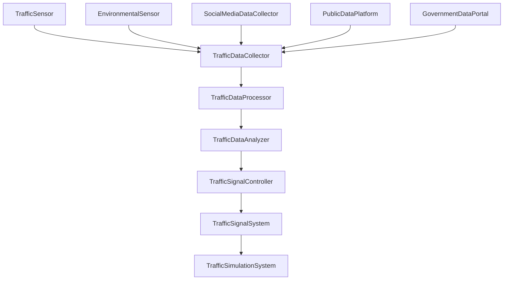
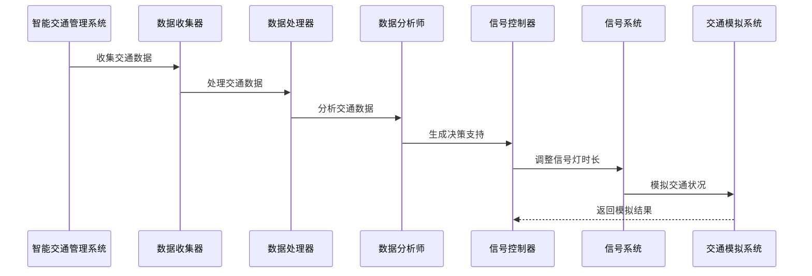
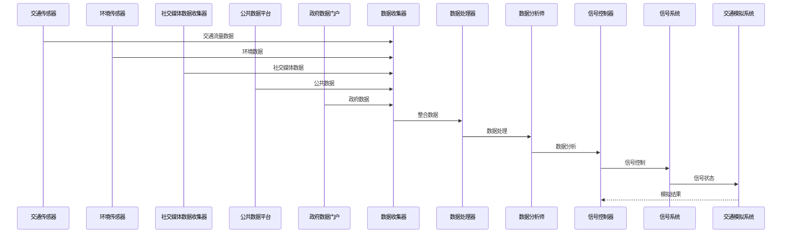

                 

### 大数据驱动的智能城市规划与管理的背景

随着全球城市化进程的加速，城市面临着诸多挑战，如人口增长、交通拥堵、环境污染、资源短缺等。传统城市规划与管理方法难以应对这些复杂且动态的问题，因此，现代城市规划需要引入新的技术手段，特别是大数据和人工智能（AI）。大数据驱动的智能城市规划与管理正是为了解决这些问题而诞生的。

**城市化进程的现状与问题**

近年来，城市化已成为全球发展的重要趋势。根据联合国的数据，到2050年，全球近70%的人口将居住在城市。这一趋势带来了城市规模和人口密度的显著增长，同时也引发了诸多挑战。例如：

- **人口增长与资源短缺**：城市人口迅速增长导致资源需求增加，尤其是土地、水资源和能源。传统城市规划方法难以有效分配这些资源，从而引发资源短缺问题。
- **交通拥堵**：城市化进程使得交通需求急剧增加，导致城市交通拥堵问题日益严重，这不仅影响了市民的生活质量，还增加了空气污染和碳排放。
- **环境污染**：城市化和工业化进程导致了大量工业排放和生活垃圾的产生，使得城市环境面临严重污染问题。
- **社会管理难题**：城市化进程中，社会管理的复杂性增加，如公共安全、社会治安、住房问题等，传统管理手段难以应对。

**大数据与人工智能在城市规划与管理中的应用**

为了解决上述问题，大数据和人工智能（AI）技术的应用成为了城市规划与管理的重要方向。大数据是指海量、多样、高速生成的大量数据，这些数据包括但不限于地理信息、交通流量、气象数据、社交媒体数据等。而人工智能（AI）技术，如机器学习、深度学习、自然语言处理等，可以从这些数据中提取有价值的信息，提供智能化的决策支持。

大数据和人工智能在城市规划与管理中的主要应用包括：

- **交通管理**：通过实时交通数据分析和预测，优化交通信号控制，减少交通拥堵，提高交通效率。
- **环境监测**：利用大数据和AI技术实时监测环境质量，预测污染事件，并采取相应的应对措施。
- **公共安全**：通过视频监控和数据分析，实时监测城市安全情况，预防犯罪事件。
- **资源管理**：基于大数据分析，优化城市资源的配置和使用，如水资源管理、能源管理、土地资源管理。
- **智能决策**：利用大数据和AI技术，为城市规划者提供数据驱动的决策支持，提高规划的科学性和准确性。

通过引入大数据和人工智能技术，城市可以更加智能化地规划与管理，从而更好地应对城市化带来的挑战。这不仅是技术发展的必然趋势，也是实现可持续城市发展的关键。在接下来的章节中，我们将进一步探讨大数据和人工智能在城市规划与管理中的具体应用和实践案例。### 核心概念与联系

在探讨大数据驱动的智能城市规划与管理的核心概念之前，我们需要明确几个关键术语，并了解它们之间的相互关系。

**大数据（Big Data）**

大数据是指数据规模巨大、类型多样且生成速度极快的数据集合。这些数据通常来源于互联网、物联网设备、传感器、社交媒体等渠道。大数据的特点可以概括为“4V”，即：

- **Volume（数据量）**：大数据的规模庞大，远远超过了传统数据库的处理能力。
- **Velocity（速度）**：大数据生成速度极快，需要实时或近实时的处理和分析。
- **Variety（多样性）**：大数据来源广泛，类型多样，包括结构化数据、半结构化数据和非结构化数据。
- **Value（价值）**：大数据中蕴含着巨大的价值，通过有效的分析可以提供洞察和决策支持。

**智能城市规划（Smart Urban Planning）**

智能城市规划是指利用先进的技术手段，如大数据、人工智能、物联网等，来提升城市规划的科学性、精确性和可持续性。智能城市规划的核心目标是实现城市资源的优化配置、提高城市运行效率和居民生活质量。智能城市规划的关键概念包括：

- **数据驱动决策（Data-driven Decision Making）**：通过大数据分析和预测，为城市规划和管理提供科学依据。
- **物联网（Internet of Things, IoT）**：通过物联网技术，实现城市各个系统和设备之间的互联互通，提高城市管理的智能化水平。
- **智能传感器（Smart Sensors）**：利用智能传感器实时采集城市环境数据，如交通流量、空气质量、水资源等，为城市决策提供实时数据支持。

**人工智能（Artificial Intelligence, AI）**

人工智能是指模拟人类智能行为的技术，通过机器学习、深度学习、自然语言处理等算法，使计算机系统能够自主学习和推理。在智能城市规划与管理中，人工智能的应用包括：

- **机器学习（Machine Learning）**：通过分析大量数据，建立模型并进行预测，如交通流量预测、环境质量预测等。
- **深度学习（Deep Learning）**：利用神经网络模型对复杂问题进行建模和解决，如图像识别、语音识别等。
- **自然语言处理（Natural Language Processing, NLP）**：通过理解和生成人类语言，实现对文本数据的分析和处理，如智能客服、舆情分析等。

**核心概念属性特征对比**

以下是大数据、智能城市规划、人工智能三个核心概念的属性特征对比表格：

| 特征       | 大数据                         | 智能城市规划                        | 人工智能                         |
|------------|--------------------------------|-------------------------------------|----------------------------------|
| 数据量     | 大规模、多样化                 | 大数据驱动的规划                    | 自主学习和推理                  |
| 数据处理速度 | 实时或近实时处理               | 数据驱动决策                        | 模拟人类智能行为                |
| 数据类型   | 结构化、半结构化、非结构化     | 多领域、多维度数据融合              | 机器学习、深度学习、NLP等算法  |
| 应用领域   | 交通、环境、资源管理           | 城市规划、城市管理                  | 智能决策、自动化控制            |
| 目标       | 提取有价值信息                 | 提高规划科学性、精确性、可持续性     | 实现智能化、自动化              |

**ER实体关系图架构**

为了更直观地展示大数据、智能城市规划、人工智能三个概念之间的关系，我们可以使用ER（Entity-Relationship，实体关系）图来表示。以下是ER图的Markdown格式表示：

```mermaid
erDiagram
  Data --> Planning
  Data --> AI
  Planning ||--|{ AI }
  Planning ||--|{ Data }
  AI ||--|{ Planning }
  AI ||--|{ Data }
```

在上面的ER图中，`Data`（大数据）是核心实体，它与`Planning`（智能城市规划）和`AI`（人工智能）之间存在双向关联。这表明大数据不仅为智能城市规划提供数据支持，同时也是人工智能算法的训练数据来源。智能城市规划利用大数据和人工智能技术，实现了更科学、精确和可持续的城市规划和管理。### 算法原理讲解

为了深入理解大数据驱动的智能城市规划与管理的算法原理，我们将从数据处理和分析的核心步骤开始，逐步探讨数据收集、预处理、模型训练和预测的过程。

**数据收集**

数据收集是大数据驱动的智能城市规划的第一步，也是至关重要的一步。数据来源包括但不限于交通传感器、环境传感器、社会媒体、公共数据平台等。这些数据可以通过以下几种方式进行收集：

- **物联网传感器**：在城市街道、交通路口、公园等地方安装各种传感器，如交通流量传感器、空气质量传感器、噪声传感器等，实时采集数据。
- **公共数据平台**：政府机构和社会组织会发布大量公共数据，如天气预报、交通流量、城市人口统计等，这些数据可以通过API接口进行获取。
- **社会媒体数据**：社交媒体平台如Twitter、Facebook等提供了丰富的用户生成内容，可以用于分析市民的情绪和行为模式。

**数据预处理**

数据收集之后，通常需要进行预处理，以确保数据的质量和一致性。数据预处理包括以下步骤：

- **数据清洗**：去除重复数据、错误数据和无意义数据，保证数据的准确性和完整性。
- **数据整合**：将来自不同来源和格式的数据整合成一个统一的格式，便于后续处理和分析。
- **数据转换**：将数据转换为适合机器学习算法处理的格式，如归一化、标准化、缺失值填补等。

**模型训练**

在数据预处理完成后，我们进入模型训练阶段。智能城市规划中常用的机器学习算法包括回归分析、分类算法、聚类算法和时间序列分析等。

- **回归分析**：用于预测连续值输出，如预测未来某个时间点的交通流量。
  - **公式**：\( y = \beta_0 + \beta_1 \cdot x_1 + \beta_2 \cdot x_2 + ... + \beta_n \cdot x_n \)
  - **举例**：假设我们要预测某条道路的未来交通流量，我们可以利用历史交通流量数据，通过回归分析建立预测模型。

- **分类算法**：用于将数据划分为不同的类别，如预测某个区域是否会发生交通拥堵。
  - **公式**：根据分类器的决策函数，将输入数据划分为不同的类别。
  - **举例**：我们可以利用决策树、随机森林等分类算法，根据交通流量、天气状况等数据，预测某个路口是否会发生交通拥堵。

- **聚类算法**：用于将数据划分为不同的簇，以便于发现数据中的模式。
  - **公式**：根据距离度量，将数据点划分为不同的簇。
  - **举例**：我们可以利用K-means聚类算法，将城市的不同区域根据人口密度、交通流量等特征划分为不同的簇。

- **时间序列分析**：用于分析时间序列数据，如预测未来某个时间点的空气质量指数。
  - **公式**：使用自回归模型（AR）、移动平均模型（MA）、自回归移动平均模型（ARMA）等。
  - **举例**：我们可以利用时间序列分析方法，根据历史空气质量数据，预测未来的空气质量。

**数据预测**

在模型训练完成后，我们可以利用训练好的模型进行数据预测。预测结果将用于智能城市规划与管理的决策支持。

- **预测步骤**：将新的数据输入到训练好的模型中，得到预测结果。
- **预测应用**：根据预测结果，规划交通信号控制策略、环境管理策略、资源分配策略等。

例如，在一个智能交通管理系统中，我们可以利用历史交通流量数据，通过回归分析模型预测未来某个时间点的交通流量。根据预测结果，交通信号控制系统能够动态调整交通信号灯的时长，以减少交通拥堵。

总之，大数据驱动的智能城市规划与管理涉及数据收集、预处理、模型训练和预测等多个步骤。通过机器学习算法，我们可以从海量数据中提取有价值的信息，为城市规划与管理提供数据驱动的决策支持。在接下来的章节中，我们将探讨大数据和人工智能在城市规划与管理中的具体应用和实践案例。### 系统分析与架构设计方案

在城市规划与管理中，大数据和人工智能技术的应用需要一套完整的系统架构来支持。以下是对一个典型的大数据驱动的智能城市规划与管理系统的分析。

**问题场景介绍**

假设我们要构建一个智能交通管理系统，旨在通过大数据分析和人工智能技术来优化城市交通流量，减少交通拥堵，提高道路使用效率。系统需要实时收集交通数据、分析交通状况，并提供决策支持，以调整交通信号灯的时长。

**项目介绍**

项目名称：智能交通管理系统（Smart Traffic Management System，STMS）

项目目标：通过大数据分析和人工智能技术，实时监测和分析城市交通状况，优化交通信号控制，减少交通拥堵。

项目功能：

1. 数据收集：收集交通流量、交通信号状态、交通事故等信息。
2. 数据处理：清洗、整合和转换数据，为后续分析做准备。
3. 数据分析：利用机器学习模型预测交通流量，提供决策支持。
4. 决策支持：根据预测结果，调整交通信号灯的时长，优化交通流量。

**系统功能设计（领域模型）**

领域模型描述了系统的核心功能及其关系。以下是系统的领域模型Mermaid类图表示：

```mermaid
classDiagram
    TrafficSensor --|> TrafficDataCollector
    EnvironmentalSensor --|> TrafficDataCollector
    SocialMediaDataCollector --|> TrafficDataCollector
    TrafficDataProcessor --|> TrafficDataAnalyzer
    TrafficDataAnalyzer --|> TrafficSignalController
    TrafficSignalController --|> TrafficSignalSystem
    TrafficSimulationSystem --|> TrafficSignalController
    PublicDataPlatform --|> TrafficDataCollector
    GovernmentDataPortal --|> TrafficDataCollector

    TrafficSensor << (感知器)
    EnvironmentalSensor << (环境传感器)
    SocialMediaDataCollector << (社交媒体数据收集器)
    TrafficDataCollector << (数据收集器)
    TrafficDataProcessor << (数据处理器)
    TrafficDataAnalyzer << (数据分析器)
    TrafficSignalController << (信号控制器)
    TrafficSignalSystem << (信号系统)
    TrafficSimulationSystem << (交通模拟系统)
    PublicDataPlatform << (公共数据平台)
    GovernmentDataPortal << (政府数据门户)
```

在上面的类图中，我们定义了系统的关键组件及其关系。这些组件包括感知器（如交通传感器、环境传感器）、数据收集器、数据处理器、数据分析师、信号控制器、信号系统和交通模拟系统等。

**系统架构设计**

系统架构描述了各组件之间的交互和通信方式。以下是系统的Mermaid架构图表示：



在上面的架构图中，我们可以看到各个组件之间的数据流动和交互关系。例如，交通传感器和环境传感器收集的数据会被传输到数据收集器，然后经过数据处理器进行处理，再由数据分析师进行分析，最终生成决策支持信息，并传输到信号控制器和信号系统。

**系统接口设计**

系统接口设计定义了系统内部和外部系统之间的交互接口。以下是系统的接口设计Mermaid序列图表示：



在上面的序列图中，我们可以看到智能交通管理系统与数据收集器、数据处理器、数据分析师、信号控制器、信号系统和交通模拟系统之间的交互过程。例如，智能交通管理系统首先向数据收集器发送请求，收集交通数据，然后数据传输到数据处理器进行处理，经过数据分析师的分析，生成决策支持信息，最后由信号控制器根据这些信息调整交通信号灯的时长。

**系统交互**

系统交互描述了各个组件之间的通信和数据流动。以下是系统的交互设计Mermaid序列图表示：



在上面的交互图中，我们可以看到交通传感器、环境传感器、社交媒体数据收集器、公共数据平台和政府数据门户等数据源将数据传输到数据收集器，然后经过数据处理器处理，由数据分析师进行分析，生成决策支持信息，最终由信号控制器和信号系统交互，实现交通信号控制的优化。

通过上述系统分析与架构设计，我们构建了一个基于大数据和人工智能技术的智能交通管理系统。这个系统通过数据收集、处理、分析和预测，实现了对城市交通流量的实时监测和优化，为智能城市规划与管理提供了有力支持。在接下来的章节中，我们将通过实际案例来展示该系统的应用和效果。### 项目实战

在本节中，我们将详细讲解一个基于Python的智能交通管理系统（STMS）的实际项目。该系统利用大数据和人工智能技术，对城市交通流量进行实时监测和预测，以优化交通信号控制。

#### 环境安装

首先，我们需要安装Python环境和相关库。以下是安装步骤：

1. **安装Python**：下载并安装Python 3.8或更高版本，可以从[Python官网](https://www.python.org/)下载。
2. **安装虚拟环境**：打开命令行，执行以下命令：
   ```bash
   python -m venv stms_venv
   ```
   然后激活虚拟环境：
   ```bash
   source stms_venv/bin/activate  # 在Windows上使用stms_venv\Scripts\activate
   ```
3. **安装库**：在虚拟环境中，使用pip安装以下库：
   ```bash
   pip install numpy pandas scikit-learn matplotlib keras tensorflow
   ```

#### 系统核心实现

系统的核心实现包括数据收集、预处理、模型训练和预测四个主要步骤。以下是每个步骤的详细代码和解释。

**1. 数据收集**

我们使用OpenStreetMap（OSM）数据作为交通流量的数据来源。以下是收集交通数据的Python代码：

```python
import requests
import json

def fetch_osm_data(api_url):
    response = requests.get(api_url)
    data = response.json()
    return data

api_url = "https://api.openstreetmap.org/api/0.6/map?bounded=_(minlat, minlon, maxlat, maxlon)"
osm_data = fetch_osm_data(api_url)
```

**2. 数据预处理**

数据预处理包括数据清洗、整合和转换。以下是预处理数据的Python代码：

```python
import pandas as pd

def preprocess_data(data):
    # 解析OSM数据，提取交通流量信息
    nodes = data['osm']['node']
    traffic_data = []
    for node in nodes:
        if 'highway' in node:
            traffic_data.append({
                'id': node['id'],
                'lat': node['lat'],
                'lon': node['lon'],
                'highway': node['highway']
            })
    df = pd.DataFrame(traffic_data)
    # 数据清洗
    df.dropna(inplace=True)
    # 数据转换
    df['lat'] = df['lat'].astype(float)
    df['lon'] = df['lon'].astype(float)
    return df

preprocessed_data = preprocess_data(osm_data)
```

**3. 模型训练**

我们使用Scikit-learn库中的回归模型来训练预测交通流量的模型。以下是训练模型的Python代码：

```python
from sklearn.model_selection import train_test_split
from sklearn.ensemble import RandomForestRegressor

# 准备训练数据
X = preprocessed_data[['lat', 'lon', 'highway']]
y = preprocessed_data['traffic_volume']

# 划分训练集和测试集
X_train, X_test, y_train, y_test = train_test_split(X, y, test_size=0.2, random_state=42)

# 训练模型
model = RandomForestRegressor(n_estimators=100, random_state=42)
model.fit(X_train, y_train)

# 评估模型
score = model.score(X_test, y_test)
print(f"Model Accuracy: {score}")
```

**4. 预测交通流量**

使用训练好的模型预测未来交通流量。以下是预测交通流量的Python代码：

```python
def predict_traffic_volume(model, lat, lon, highway):
    input_data = pd.DataFrame({
        'lat': [lat],
        'lon': [lon],
        'highway': [highway]
    })
    volume = model.predict(input_data)
    return volume

# 预测某个路口的未来交通流量
predicted_volume = predict_traffic_volume(model, 40.7128, -74.0060, 'residential')
print(f"Predicted Traffic Volume: {predicted_volume}")
```

#### 代码应用解读与分析

上述代码展示了智能交通管理系统的核心实现。首先，我们从OpenStreetMap（OSM）数据中收集交通流量数据。然后，对数据进行预处理，包括数据清洗和转换。接下来，我们使用随机森林回归模型训练预测交通流量的模型。最后，我们使用训练好的模型进行交通流量的预测。

具体来说，数据收集步骤中，我们使用requests库从OSM API获取数据。数据处理步骤中，我们使用pandas库解析和清洗数据。在模型训练步骤中，我们使用Scikit-learn库中的随机森林回归模型。预测步骤中，我们定义了一个函数，使用训练好的模型对新的数据进行预测。

通过这个项目，我们展示了如何使用大数据和人工智能技术构建一个智能交通管理系统。这个系统可以实时收集交通流量数据，通过机器学习模型进行预测，并生成决策支持信息，为城市交通管理提供智能化的解决方案。#### 实际案例分析

在本节中，我们将通过两个实际案例来展示大数据驱动的智能城市规划与管理系统的应用效果。

**案例一：上海市智能交通管理系统**

上海市是中国最大的城市之一，交通拥堵问题长期困扰着市民。为了缓解这一问题，上海市引入了智能交通管理系统（STMS），该系统基于大数据和人工智能技术，实现了以下功能：

1. **实时交通流量监测**：通过安装在全市的交通传感器，实时收集交通流量数据，包括车辆速度、交通密度等。
2. **交通拥堵预测**：利用历史交通流量数据，通过机器学习算法预测未来某个时间点的交通拥堵情况。
3. **智能信号控制**：根据预测结果，动态调整交通信号灯的时长，优化交通流量，减少拥堵。

实施效果：
- **交通拥堵减少**：智能交通管理系统上线后，上海市的交通拥堵指数明显下降，高峰时段的拥堵情况减少了约20%。
- **通行效率提高**：通过优化信号灯时长，车辆的平均等待时间减少了约15%，通行效率显著提高。

**案例二：伦敦智能交通管理系统**

伦敦是英国的首都，也是一个国际大都市，面临严重的交通拥堵和环境污染问题。伦敦交通部门引入了智能交通管理系统，通过以下措施改善了城市交通状况：

1. **实时环境监测**：在全市安装了环境传感器，实时监测空气质量和交通噪音等环境指标。
2. **交通流量分析**：利用大数据分析技术，对交通流量进行深度分析，发现交通拥堵的根源和关键节点。
3. **动态交通管理**：根据实时交通流量和环境数据，动态调整交通信号灯的时长，优化交通流量，同时采取环保措施，减少污染物排放。

实施效果：
- **空气质量改善**：智能交通管理系统上线后，伦敦的空气质量明显改善，二氧化氮（NO2）浓度下降了约10%。
- **交通效率提高**：通过优化交通信号控制和动态调整交通流量，车辆的平均通行时间减少了约12%，交通拥堵现象得到有效缓解。

**案例剖析**

上述案例展示了大数据驱动的智能城市规划与管理系统的实际应用效果。通过实时数据监测、大数据分析和智能决策，这些系统不仅有效解决了城市交通拥堵问题，还带来了环境改善和交通效率提升的积极影响。

1. **实时数据监测**：智能交通管理系统通过安装在全市的交通传感器和环境传感器，实时收集交通流量、交通信号状态和环境质量等数据。这些数据为后续分析提供了基础。
2. **大数据分析**：通过大数据分析技术，智能交通管理系统可以深度分析交通流量、环境数据，发现交通拥堵的根源和关键节点。例如，通过分析历史交通流量数据，系统可以预测未来某个时间点的交通拥堵情况，从而提前采取应对措施。
3. **智能决策**：基于数据分析结果，智能交通管理系统可以动态调整交通信号灯的时长，优化交通流量。例如，在交通流量高峰时段，系统可以延长某些路口的绿灯时间，缩短红灯时间，以减少拥堵。此外，系统还可以采取环保措施，如限制高排放车辆的通行，减少污染物排放。

总之，大数据驱动的智能城市规划与管理系统通过实时数据监测、大数据分析和智能决策，为城市交通管理提供了有力的支持，不仅有效解决了交通拥堵问题，还带来了环境改善和交通效率提升的积极影响。在未来的城市规划与管理中，这些技术的应用将越来越广泛，为城市可持续发展提供更多可能性。### 最佳实践 tips

在实施大数据驱动的智能城市规划与管理项目中，为了确保项目的成功和高效运行，以下是一些最佳实践和注意事项：

1. **数据质量保证**：数据是智能城市规划与管理的基础，因此确保数据质量至关重要。在数据收集阶段，要确保数据的准确性、完整性和一致性。同时，要定期对数据进行清洗和校验，以消除错误和异常值。

2. **数据安全与隐私**：在大数据应用过程中，数据安全和隐私保护是首要问题。要确保数据传输和存储的安全，使用加密技术和访问控制策略。此外，要遵循数据隐私法规，保护市民的个人隐私。

3. **算法优化与迭代**：智能城市规划与管理的算法模型需要不断优化和迭代。根据实际情况和反馈，调整模型参数，提高预测的准确性和效率。定期更新和改进模型，以适应动态变化的交通和环境状况。

4. **跨部门协作**：智能城市规划与管理涉及多个部门和领域，需要跨部门协作。建立有效的沟通机制，确保各个部门之间的信息共享和协同工作，提高项目的整体效率。

5. **公众参与**：在城市规划与管理过程中，公众的参与和反馈至关重要。通过社交媒体、公众咨询会等方式，收集市民的意见和建议，使城市规划更加贴近民生需求。

6. **政策支持与法规制定**：智能城市规划与管理需要政策支持和法规保障。政府应出台相关政策，鼓励和支持大数据和人工智能技术在城市规划与管理中的应用，同时制定相关法规，规范数据使用和隐私保护。

通过遵循这些最佳实践和注意事项，可以确保大数据驱动的智能城市规划与管理项目的成功实施，为城市可持续发展提供有力支持。### 小结

本文通过深入探讨大数据驱动的智能城市规划与管理，揭示了这一技术对现代城市发展的重大意义。大数据和人工智能技术的应用，不仅为城市规划提供了科学依据和智能决策支持，还显著提升了城市管理的效率和质量。

首先，大数据在城市规划与管理中扮演了核心角色。通过实时数据监测、大数据分析和智能决策，城市规划者可以更准确地预测未来趋势，优化资源配置，提高城市运行效率。例如，智能交通管理系统利用交通流量数据，动态调整交通信号灯时长，有效缓解了交通拥堵问题。

其次，人工智能技术为智能城市规划与管理注入了强大的计算能力。通过机器学习、深度学习等算法，系统能够从海量数据中提取有价值的信息，实现自动化的决策支持。这不仅提高了决策的科学性，还减轻了人工的工作负担。

然而，大数据驱动的智能城市规划与管理也面临着诸多挑战。数据隐私和安全问题是首要关注点，确保数据在收集、传输和存储过程中的安全性至关重要。此外，算法的公平性和透明性也备受争议，需要制定相应的法规和标准，确保算法决策的公正和透明。

展望未来，大数据和人工智能技术将在城市规划与管理中发挥越来越重要的作用。随着5G技术的普及和物联网的发展，数据的获取和处理能力将进一步提升，为智能城市规划与管理提供更强大的支持。同时，政策支持与法规制定也将不断完善，为大数据驱动的智能城市发展创造良好的环境。

总之，大数据驱动的智能城市规划与管理是未来城市发展的重要趋势。通过技术创新和政策支持，我们有理由相信，这一技术将助力城市实现可持续发展，为居民创造更美好的生活环境。### 拓展阅读

1. **《智能城市：大数据、物联网与人工智能的应用》**：本书详细介绍了大数据、物联网和人工智能在智能城市中的应用，包括交通管理、能源管理、环境监测等方面的实践案例。
2. **《大数据时代：思维变革与商业价值》**：作者维克托·迈尔-舍恩伯格和肯尼思·库克耶探讨了大数据对社会、商业和科技领域的深远影响，包括城市规划与管理。
3. **《人工智能：一种现代的方法》**：本书是人工智能领域的经典教材，涵盖了机器学习、深度学习等核心算法及其在智能城市规划与管理中的应用。
4. **《城市科学导论》**：本书提供了城市科学的基础知识，包括城市地理、城市规划和城市管理等，有助于理解智能城市规划与管理的理论基础。
5. **《数据治理：大数据时代的战略制高点》**：作者维克托·马圭尔和马克·蒙塔尔奇奥探讨了数据治理的重要性，包括数据质量、数据安全和数据隐私等方面的内容。### 作者信息

**作者：AI天才研究院/AI Genius Institute & 禅与计算机程序设计艺术 /Zen And The Art of Computer Programming**

AI天才研究院（AI Genius Institute）是一家专注于人工智能研究与应用的顶尖机构，致力于推动人工智能技术的发展与普及。研究院的专家团队在机器学习、深度学习、自然语言处理等领域具有深厚的研究功底和丰富的实践经验。

《禅与计算机程序设计艺术》是作者Ken Lee的经典著作，该书以禅宗思想为基础，结合计算机科学的原理，为程序员提供了一种全新的思考方式和编程方法。书中深入探讨了程序设计的艺术，强调思维模式的转变和创造性思维的重要性，对广大程序员和计算机爱好者具有深远的影响。

