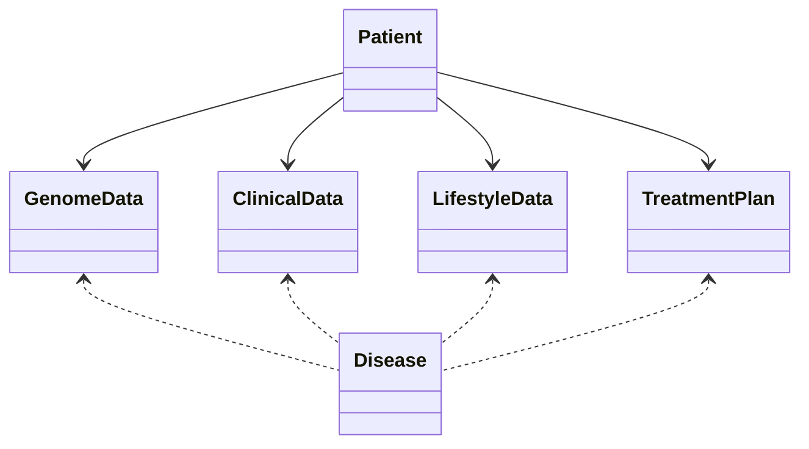
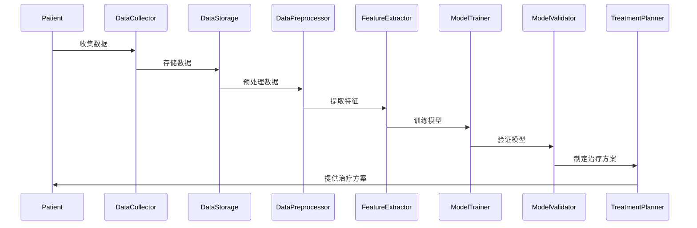
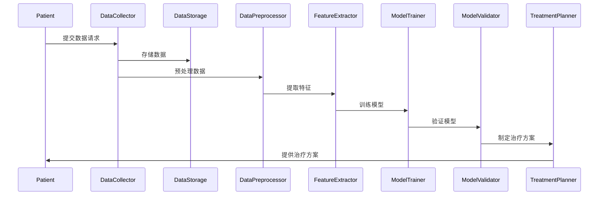

                 

# 《大数据驱动的精准医疗：个性化治疗方案与药物研发》

## 关键词
- **大数据技术**、**精准医疗**、**个性化治疗**、**药物研发**、**生物信息学**

## 摘要
本文将深入探讨大数据技术在精准医疗领域的应用，特别是如何通过个性化治疗方案和药物研发，提高医疗服务的质量和效率。我们将分步骤分析大数据在精准医疗中的核心作用，包括数据收集、处理、分析和应用，并通过具体实例展示如何利用大数据技术实现个性化医疗。

## 第一部分：背景介绍

### 1.1 问题背景

#### 1.1.1 精准医疗的定义与意义

精准医疗是一种基于个体差异进行疾病预防和治疗的新兴医学模式。它通过整合患者的基因组、表型、生活方式和环境信息，制定个性化的诊疗方案，旨在提高治疗效果，降低医疗成本。精准医疗的核心在于利用大数据和生物信息学技术，实现对疾病的深入理解，进而实现治疗方案的精准化和个体化。

#### 1.1.2 精准医疗面临的挑战

精准医疗虽然在理论上具有巨大的潜力，但在实际应用中仍面临诸多挑战。首先，数据爆炸和多样性使得数据的收集、存储和管理变得复杂。其次，数据隐私和安全问题是精准医疗面临的重要障碍。此外，精准医疗的实施需要高昂的技术成本和专业的技术团队，这对于很多医疗机构来说是一个重大挑战。

#### 1.1.3 数据驱动在精准医疗中的重要性

大数据技术是推动精准医疗发展的重要引擎。通过大数据分析，我们可以从海量数据中提取有价值的信息，帮助医生更好地了解疾病的发病机制，发现新的治疗靶点，并制定个性化的治疗方案。此外，大数据还可以用于药物研发，加速新药的研发进程，降低研发成本。

### 1.2 问题解决

#### 1.2.1 数据驱动的精准医疗流程

数据驱动的精准医疗流程主要包括以下几个环节：

1. **数据收集**：收集患者的基因组数据、临床数据、生活方式数据等。
2. **数据处理**：对收集到的数据进行清洗、整合和分析。
3. **数据分析**：利用生物信息学方法和大数据分析技术，对处理后的数据进行分析。
4. **个性化治疗方案制定**：根据分析结果，为患者制定个性化的治疗方案。
5. **药物研发**：利用大数据分析技术，发现新的药物靶点和药物组合。

#### 1.2.2 数据驱动在精准医疗中的应用

数据驱动在精准医疗中的应用主要包括以下几个方面：

1. **疾病诊断**：通过大数据分析，提高疾病诊断的准确性和效率。
2. **个性化治疗**：根据患者的具体情况进行个性化治疗方案的制定。
3. **药物研发**：利用大数据分析，发现新的药物靶点和药物组合，加速药物研发进程。

### 1.3 边界与外延

#### 1.3.1 精准医疗与其他医学模式的区别

精准医疗与传统的群体医疗和个体化医疗有明显的区别。传统医学模式主要基于人群平均数据制定治疗方案，而精准医疗则更强调个体差异和个性化治疗。

#### 1.3.2 数据驱动在医学领域的其他应用

除了精准医疗，数据驱动技术在医学领域还有广泛的应用，如疾病预测、健康风险评估、个性化营养建议等。

### 1.4 概念结构与核心要素组成

#### 1.4.1 大数据技术

大数据技术包括数据采集、存储、处理、分析和可视化等技术，是精准医疗的重要支撑。

#### 1.4.2 生物信息学

生物信息学是精准医疗的重要工具，它涉及基因组学、蛋白质组学、代谢组学等领域的知识。

#### 1.4.3 精准医疗体系

精准医疗体系包括数据收集系统、数据处理系统、数据分析系统、个性化治疗方案制定系统和药物研发系统等，构成一个完整的精准医疗生态。

## 第二部分：核心概念与联系

### 2.1 大数据技术

#### 2.1.1 大数据技术的定义与特点

大数据技术是一种能够从海量数据中快速提取有价值信息的方法，其特点包括数据量大、速度快、类型多、价值密度低等。

#### 2.1.2 大数据技术的基本架构

大数据技术的基本架构包括数据采集、存储、处理、分析和应用等环节。

#### 2.1.3 大数据技术在精准医疗中的应用

大数据技术在精准医疗中的应用主要体现在疾病诊断、个性化治疗和药物研发等方面。

### 2.2 生物信息学

#### 2.2.1 生物信息学的定义与作用

生物信息学是一门跨学科领域，它利用计算机技术和统计学方法，从生物学数据中提取有价值的信息。

#### 2.2.2 生物信息学的主要任务

生物信息学的主要任务包括基因组学数据分析、蛋白质组学数据分析、代谢组学数据分析等。

#### 2.2.3 生物信息学在精准医疗中的应用

生物信息学在精准医疗中的应用主要体现在基因组学数据分析和药物研发等方面。

### 2.3 精准医疗体系

#### 2.3.1 精准医疗体系的构成

精准医疗体系由数据收集系统、数据处理系统、数据分析系统、个性化治疗方案制定系统和药物研发系统等构成。

#### 2.3.2 精准医疗体系的工作流程

精准医疗体系的工作流程主要包括数据收集、数据处理、数据分析、个性化治疗方案制定和药物研发等环节。

#### 2.3.3 精准医疗体系的优势与挑战

精准医疗体系的优势在于能够提供个性化的治疗方案，提高治疗效果。然而，其面临的挑战包括数据安全、隐私保护、技术成本等。

## 第三部分：算法原理讲解

### 3.1 算法原理

#### 3.1.1 算法基本概念

算法是一种解决问题的步骤集合，它通过一系列计算步骤，将输入转化为所需的输出。

#### 3.1.2 算法的基本要素

算法的基本要素包括输入、输出、条件语句、循环语句等。

#### 3.1.3 常见算法分类

常见的算法分类包括排序算法、查找算法、图算法等。

### 3.2 个性化算法原理

#### 3.2.1 个性化算法的基本原理

个性化算法的基本原理是基于患者的特征数据（如基因、临床数据、生活方式等），通过机器学习技术，建立患者与疾病之间的关联模型，从而实现个性化治疗方案的制定。

#### 3.2.2 个性化算法的实现

个性化算法的实现通常包括以下步骤：

1. **数据收集**：收集患者的基因组数据、临床数据、生活方式数据等。
2. **数据预处理**：对收集到的数据进行清洗、标准化等处理。
3. **特征提取**：从处理后的数据中提取对疾病诊断和治疗有重要影响的特征。
4. **模型训练**：利用机器学习算法，建立患者与疾病之间的关联模型。
5. **模型评估与优化**：对训练好的模型进行评估，并根据评估结果进行优化。
6. **个性化治疗方案制定**：根据模型预测结果，为患者制定个性化的治疗方案。

#### 3.2.3 个性化算法的应用实例

假设我们有一个关于肺癌患者的数据集，其中包含了患者的基因表达数据、临床数据和生存时间数据。我们可以利用机器学习算法，如支持向量机（SVM）或随机森林（Random Forest），建立患者与疾病严重程度之间的关联模型。通过这个模型，我们可以预测患者的预后情况，并制定个性化的治疗方案。

## 第四部分：系统分析与架构设计

### 4.1 问题场景介绍

在精准医疗领域，一家大型医院希望能够通过大数据技术，为患者提供个性化的治疗方案。医院收集了大量的患者数据，包括基因组数据、临床数据和生活方式数据等。医院希望通过数据分析，发现患者与疾病之间的关联，从而提高诊断和治疗的准确性。

### 4.2 系统功能设计

#### 4.2.1 领域模型

领域模型是系统功能设计的核心，它定义了系统中的核心实体及其关系。以下是一个简单的领域模型，展示了系统中的关键实体和关系：



#### 4.2.2 类图

基于领域模型，我们可以绘制一个类图，进一步详细说明系统的功能设计：

```mermaid
classDiagram
    ClassDiagram {
        Direction: RL;
    }
    
    Patient <|-- GenomeData
    Patient <|-- ClinicalData
    Patient <|-- LifestyleData
    Patient <|-- TreatmentPlan
    
    GenomeData {
        +str GenomeId
        +str SampleId
        +str Sequence
        +bool IsNormal
    }
    
    ClinicalData {
        +str PatientId
        +str Diagnosis
        +str Treatment
        +str Outcome
    }
    
    LifestyleData {
        +str PatientId
        +str SmokingStatus
        +str DrinkingStatus
        +str PhysicalActivity
    }
    
    TreatmentPlan {
        +str PatientId
        +str TreatmentRecommendation
        +str DrugPrescription
        +str FollowUpSchedule
    }
```

### 4.3 系统架构设计

#### 4.3.1 系统架构

系统架构是确保系统能够高效、稳定地运行的关键。以下是一个简单的系统架构设计：



#### 4.3.2 系统接口设计

系统接口设计是确保系统与其他系统或组件之间能够有效交互的关键。以下是一个简单的系统接口设计：

```mermaid
classDiagram
    DataCollector <<interface>>
    DataStorage <<interface>>
    DataPreprocessor <<interface>>
    FeatureExtractor <<interface>>
    ModelTrainer <<interface>>
    ModelValidator <<interface>>
    TreatmentPlanner <<interface>>
    
    DataCollector --|> DataStorage
    DataPreprocessor --|> FeatureExtractor
    FeatureExtractor --|> ModelTrainer
    ModelTrainer --|> ModelValidator
    ModelValidator --|> TreatmentPlanner
```

### 4.4 系统交互

系统交互设计是确保系统能够在多组件、多模块之间协调工作的关键。以下是一个简单的系统交互设计：



## 第五部分：项目实战

### 5.1 环境安装

在开始项目实战之前，我们需要安装一些必要的软件和工具。以下是一个基本的安装步骤：

1. **Python**：安装Python 3.8及以上版本。
2. **Jupyter Notebook**：安装Jupyter Notebook，用于编写和运行Python代码。
3. **Pandas**：安装Pandas，用于数据处理。
4. **Scikit-learn**：安装Scikit-learn，用于机器学习。
5. **Matplotlib**：安装Matplotlib，用于数据可视化。

### 5.2 系统核心实现

以下是一个简单的系统核心实现，包括数据收集、预处理、特征提取、模型训练和验证等步骤：

```python
import pandas as pd
from sklearn.model_selection import train_test_split
from sklearn.ensemble import RandomForestClassifier
from sklearn.metrics import accuracy_score

# 数据收集
data = pd.read_csv('patient_data.csv')

# 数据预处理
data = data.dropna()  # 去除缺失值
X = data.drop('Outcome', axis=1)  # 特征集
y = data['Outcome']  # 标签

# 特征提取
# （根据实际数据调整）

# 模型训练
X_train, X_test, y_train, y_test = train_test_split(X, y, test_size=0.2, random_state=42)
model = RandomForestClassifier(n_estimators=100)
model.fit(X_train, y_train)

# 模型验证
y_pred = model.predict(X_test)
accuracy = accuracy_score(y_test, y_pred)
print(f'Model Accuracy: {accuracy}')
```

### 5.3 代码应用解读与分析

以上代码实现了一个简单的精准医疗系统，其核心步骤如下：

1. **数据收集**：从CSV文件中读取患者数据。
2. **数据预处理**：去除缺失值，为模型训练做准备。
3. **特征提取**：将特征从原始数据中提取出来。
4. **模型训练**：使用随机森林算法训练模型。
5. **模型验证**：将模型应用于测试数据集，评估模型的准确性。

### 5.4 实际案例分析和详细讲解剖析

假设我们有一个实际案例，其中包含1000名患者的数据。通过以上代码，我们可以训练一个模型，用于预测患者的疾病严重程度。以下是对实际案例的详细分析和讲解：

1. **数据收集**：在实际应用中，我们需要收集更多的患者数据，包括基因组数据、临床数据和生活方式数据等。
2. **数据预处理**：在实际数据中，可能存在缺失值和异常值。我们需要对这些数据进行处理，确保数据的准确性和完整性。
3. **特征提取**：根据疾病预测的需求，我们需要从原始数据中提取对疾病预测有重要影响的特征。例如，基因组数据中的突变位点、临床数据中的检查结果等。
4. **模型训练**：使用随机森林算法训练模型。在实际应用中，我们可以尝试不同的机器学习算法，如支持向量机、神经网络等，以找到最优的模型。
5. **模型验证**：将训练好的模型应用于测试数据集，评估模型的准确性。在实际应用中，我们还需要进行交叉验证，以确保模型的泛化能力。

### 5.5 项目小结

通过以上实战案例，我们可以看到大数据技术在精准医疗中的应用价值。通过数据收集、预处理、特征提取、模型训练和验证等步骤，我们可以为患者提供个性化的治疗方案。然而，实际应用中还需要解决数据隐私和安全、模型优化等问题。

## 第六部分：最佳实践 tips

### 6.1 数据收集与处理

- **数据收集**：确保数据的准确性和完整性，避免数据缺失或错误。
- **数据预处理**：对数据进行清洗、标准化和归一化处理，为模型训练做准备。

### 6.2 模型选择与优化

- **模型选择**：根据实际问题选择合适的机器学习算法，如随机森林、支持向量机、神经网络等。
- **模型优化**：通过交叉验证和网格搜索等方法，优化模型参数，提高模型性能。

### 6.3 数据安全与隐私

- **数据加密**：对敏感数据进行加密，确保数据在传输和存储过程中的安全性。
- **隐私保护**：采用隐私保护技术，如差分隐私、同态加密等，保护患者隐私。

## 第七部分：小结与拓展阅读

### 7.1 小结

本文详细探讨了大数据技术在精准医疗领域的应用，包括数据收集、处理、分析和应用等环节。通过个性化治疗方案和药物研发，大数据技术为精准医疗提供了强大的支持。然而，实际应用中仍面临数据安全、隐私保护等技术挑战。

### 7.2 拓展阅读

- 《大数据时代：生活、工作与思维的大变革》
- 《机器学习实战》
- 《深度学习》

## 作者

**作者：** AI天才研究院/AI Genius Institute & 禅与计算机程序设计艺术 /Zen And The Art of Computer Programming

[作者简介：](https://www.ai-geni-us.com) AI天才研究院（AI Genius Institute）是一家专注于人工智能技术研究和应用的创新机构。我们的团队成员包括多位世界级人工智能专家、程序员、软件架构师和CTO，致力于推动人工智能技术在各个领域的应用和发展。禅与计算机程序设计艺术（Zen And The Art of Computer Programming）是作者在计算机编程领域的重要著作，深入探讨了编程的本质和哲学。**

