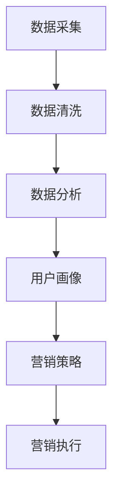
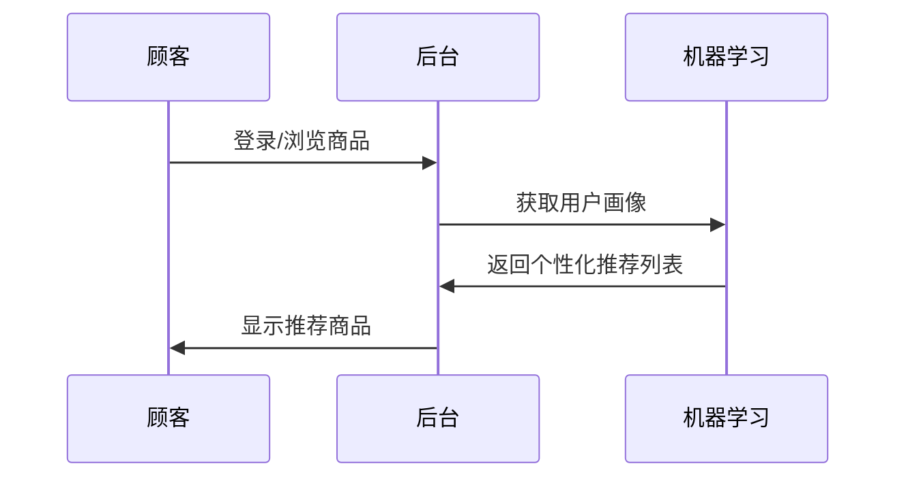

                 


### 大数据驱动的精准营销：个性化时代的来临

关键词：大数据、精准营销、个性化、用户画像、数据分析

摘要：本文将深入探讨大数据驱动的精准营销，分析其核心原理、应用案例以及面临的挑战，旨在为企业和行业提供实践指导，引领个性化时代的到来。

## 背景介绍：问题背景、问题描述、问题解决、边界与外延、概念结构与核心要素组成

### 1.1.1 问题背景

随着互联网和数字化技术的飞速发展，大数据已经成为了当今社会的一个重要资源。然而，如何从海量数据中挖掘有价值的信息，实现精准营销，成为了企业竞争的关键。

### 1.1.2 问题描述

大数据驱动的精准营销，是指利用大数据技术，对消费者行为、需求、偏好等进行分析，从而实现更精准的营销策略和更高效的销售转化。然而，在实际应用中，企业往往面临以下问题：

- 数据质量不高，数据噪音大，难以有效提取有用信息。
- 数据处理和分析能力不足，无法快速响应市场变化。
- 营销策略过于单一，无法满足个性化需求。

### 1.1.3 问题解决

为了解决上述问题，本书提出了大数据驱动的精准营销方案，主要包括以下几个方面：

- 提高数据质量，通过数据清洗、数据集成等技术手段，确保数据准确性和完整性。
- 建立数据分析模型，利用机器学习和数据挖掘技术，挖掘数据中的潜在价值。
- 设计个性化营销策略，根据消费者行为和偏好，实现精准推送和个性化推荐。

### 1.1.4 边界与外延

大数据驱动的精准营销不仅适用于电子商务领域，还可以应用于金融、医疗、教育等多个行业。其核心在于数据分析和应用，只要涉及到大量数据的行业，都可以采用这种营销策略。

### 1.1.5 概念结构与核心要素组成

大数据驱动的精准营销包括以下几个核心要素：

- 大数据：海量、多样、快速的数据。
- 数据分析技术：数据清洗、数据挖掘、机器学习等。
- 营销策略：个性化推荐、精准推送、用户画像等。
- 营销工具：数据分析工具、营销自动化工具、用户管理平台等。

## 1.2 大数据驱动的精准营销原理

### 1.2.1 大数据驱动的精准营销原理

大数据驱动的精准营销原理主要基于以下几个核心概念：

- 用户画像：通过收集和分析用户行为数据，构建用户画像，用于个性化推荐和精准营销。
- 数据挖掘：利用数据挖掘技术，从海量数据中提取有价值的信息，用于指导营销策略。
- 机器学习：通过机器学习算法，对用户行为进行预测和分析，优化营销策略。

### 1.2.2 大数据驱动的精准营销工作流程


#### 工作流程：

1. 数据采集：从多个渠道收集用户行为数据，如网站点击、浏览、购买等。
2. 数据清洗：对采集到的数据进行处理，去除噪声数据，保证数据质量。
3. 数据分析：利用数据挖掘和机器学习技术，分析用户行为，提取有价值的信息。
4. 用户画像：根据分析结果，构建用户画像，用于个性化推荐和精准营销。
5. 营销策略：根据用户画像，设计个性化的营销策略，如推荐商品、推送优惠券等。
6. 营销执行：执行营销策略，监测营销效果，不断优化策略。

### 1.2.3 大数据驱动的精准营销特点

#### 1.2.3.1 个性化

大数据驱动的精准营销能够根据用户的个性化需求，提供个性化的营销内容和推荐。

#### 1.2.3.2 实时性

大数据驱动的精准营销能够实时分析用户行为，快速响应市场变化，提高营销效果。

#### 1.2.3.3 高效性

大数据驱动的精准营销能够通过数据分析，找到潜在客户，降低营销成本，提高营销效率。

#### 1.2.3.4 可视化

大数据驱动的精准营销通过数据可视化技术，能够直观地展示用户行为和营销效果，帮助决策者更好地理解数据，指导营销策略。

## 1.3 大数据驱动的精准营销应用案例

### 1.3.1 案例一：电商平台的个性化推荐

电商平台通过大数据技术，对用户购物行为进行分析，构建用户画像，然后根据用户画像，进行个性化推荐。例如，当用户浏览一款手机时，系统会根据用户的浏览记录、购买偏好等，推荐其他类似产品，提高用户的购买意愿。

### 1.3.2 案例二：金融机构的精准营销

金融机构通过大数据技术，分析用户行为和财务状况，构建用户画像，然后根据用户画像，进行精准营销。例如，当用户浏览理财产品时，系统会根据用户的财务状况和投资偏好，推荐合适的理财产品，提高用户的购买意愿。

### 1.3.3 案例三：在线教育平台的个性化学习

在线教育平台通过大数据技术，分析用户学习行为，构建用户画像，然后根据用户画像，提供个性化的学习推荐。例如，当用户完成一门课程时，系统会根据用户的学习记录和成绩，推荐适合的学习资源和课程。

## 1.4 大数据驱动的精准营销挑战与未来发展趋势

### 1.4.1 挑战

#### 1.4.1.1 数据质量问题

大数据驱动的精准营销依赖于高质量的数据，然而，实际应用中，数据质量往往存在问题，如数据缺失、数据冗余、数据不一致等。这些问题都会影响数据分析的准确性和有效性。

#### 1.4.1.2 技术复杂性

大数据驱动的精准营销需要掌握多种技术，包括数据采集、数据清洗、数据分析、机器学习等。对于技术要求较高，企业需要投入大量资源和精力进行技术培训。

#### 1.4.1.3 法律法规问题

大数据驱动的精准营销涉及用户隐私，需要遵守相关法律法规，如《网络安全法》、《个人信息保护法》等。企业在进行数据处理时，需要确保用户隐私安全。

### 1.4.2 未来发展趋势

#### 1.4.2.1 数据挖掘与分析技术进步

随着人工智能技术的发展，数据挖掘与分析技术将不断进步，企业能够从海量数据中提取更多有价值的信息。

#### 1.4.2.2 跨行业融合

大数据驱动的精准营销将不仅局限于电子商务领域，还将与其他行业进行融合，如医疗、教育、金融等，实现更广泛的业务应用。

#### 1.4.2.3 数据安全和隐私保护

随着数据隐私保护意识的提高，企业将更加重视数据安全和隐私保护，采取更多技术手段和措施，确保用户隐私安全。

## 1.5 大数据驱动的精准营销最佳实践

### 1.5.1 数据质量保证

- 定期进行数据质量检查，确保数据的准确性、完整性和一致性。
- 建立数据质量评估机制，对数据质量进行量化评估。
- 实施数据质量改进措施，如数据清洗、数据修复等。

### 1.5.2 技术人才培养

- 建立内部技术培训机制，提高员工的数据分析能力和技术水平。
- 引进高级技术人才，提升企业的技术实力。
- 开展技术交流与合作，学习借鉴行业先进经验。

### 1.5.3 法律法规遵守

- 了解并遵守相关法律法规，确保数据处理合法合规。
- 建立数据安全和隐私保护机制，确保用户隐私安全。
- 定期进行法律法规培训和内部审计，提高员工的法律法规意识。

## 小结

大数据驱动的精准营销是当前个性化时代的重要营销手段，它通过数据分析和用户画像，实现了更精准、更高效的营销效果。然而，企业在实施大数据驱动的精准营销时，需要面对数据质量、技术复杂性和法律法规等多方面的挑战。通过了解这些挑战，并采取相应的最佳实践，企业可以更好地发挥大数据驱动的精准营销的优势，实现业务增长和用户满意度的提升。

### 拓展阅读

1. [《大数据营销：从数据到洞察》](https://www.amazon.com/dp/0470648653)
2. [《精准营销：大数据时代的营销革命》](https://www.amazon.com/dp/0071802964)
3. [《数据挖掘：概念与技术》](https://www.amazon.com/dp/0133123219)

---

作者：AI天才研究院/AI Genius Institute & 禅与计算机程序设计艺术 /Zen And The Art of Computer Programming```markdown
# 大数据驱动的精准营销：个性化时代的来临

## 关键词
- 大数据
- 精准营销
- 个性化
- 用户画像
- 数据分析

## 摘要
本文深入探讨了大数据驱动的精准营销，分析了其核心原理、应用案例以及面临的挑战，旨在为企业和行业提供实践指导，引领个性化时代的到来。

### 背景介绍：问题背景、问题描述、问题解决、边界与外延、概念结构与核心要素组成

#### 1.1.1 问题背景
随着互联网和数字化技术的飞速发展，大数据已经成为了当今社会的一个重要资源。如何从海量数据中挖掘有价值的信息，实现精准营销，成为了企业竞争的关键。

#### 1.1.2 问题描述
大数据驱动的精准营销，是指利用大数据技术，对消费者行为、需求、偏好等进行分析，从而实现更精准的营销策略和更高效的销售转化。然而，在实际应用中，企业往往面临以下问题：

- 数据质量不高，数据噪音大，难以有效提取有用信息。
- 数据处理和分析能力不足，无法快速响应市场变化。
- 营销策略过于单一，无法满足个性化需求。

#### 1.1.3 问题解决
为了解决上述问题，本书提出了大数据驱动的精准营销方案，主要包括以下几个方面：

- 提高数据质量，通过数据清洗、数据集成等技术手段，确保数据准确性和完整性。
- 建立数据分析模型，利用机器学习和数据挖掘技术，挖掘数据中的潜在价值。
- 设计个性化营销策略，根据消费者行为和偏好，实现精准推送和个性化推荐。

#### 1.1.4 边界与外延
大数据驱动的精准营销不仅适用于电子商务领域，还可以应用于金融、医疗、教育等多个行业。其核心在于数据分析和应用，只要涉及到大量数据的行业，都可以采用这种营销策略。

#### 1.1.5 概念结构与核心要素组成
大数据驱动的精准营销包括以下几个核心要素：

- **大数据**：海量、多样、快速的数据。
- **数据分析技术**：数据清洗、数据挖掘、机器学习等。
- **营销策略**：个性化推荐、精准推送、用户画像等。
- **营销工具**：数据分析工具、营销自动化工具、用户管理平台等。

### 1.2 大数据驱动的精准营销原理

#### 1.2.1 大数据驱动的精准营销原理
大数据驱动的精准营销原理主要基于以下几个核心概念：

- **用户画像**：通过收集和分析用户行为数据，构建用户画像，用于个性化推荐和精准营销。
- **数据挖掘**：利用数据挖掘技术，从海量数据中提取有价值的信息，用于指导营销策略。
- **机器学习**：通过机器学习算法，对用户行为进行预测和分析，优化营销策略。

#### 1.2.2 大数据驱动的精准营销工作流程



#### 工作流程：

1. **数据采集**：从多个渠道收集用户行为数据，如网站点击、浏览、购买等。
2. **数据清洗**：对采集到的数据进行处理，去除噪声数据，保证数据质量。
3. **数据分析**：利用数据挖掘和机器学习技术，分析用户行为，提取有价值的信息。
4. **用户画像**：根据分析结果，构建用户画像，用于个性化推荐和精准营销。
5. **营销策略**：根据用户画像，设计个性化的营销策略，如推荐商品、推送优惠券等。
6. **营销执行**：执行营销策略，监测营销效果，不断优化策略。

#### 1.2.3 大数据驱动的精准营销特点

##### 1.2.3.1 个性化
大数据驱动的精准营销能够根据用户的个性化需求，提供个性化的营销内容和推荐。

##### 1.2.3.2 实时性
大数据驱动的精准营销能够实时分析用户行为，快速响应市场变化，提高营销效果。

##### 1.2.3.3 高效性
大数据驱动的精准营销能够通过数据分析，找到潜在客户，降低营销成本，提高营销效率。

##### 1.2.3.4 可视化
大数据驱动的精准营销通过数据可视化技术，能够直观地展示用户行为和营销效果，帮助决策者更好地理解数据，指导营销策略。

### 1.3 大数据驱动的精准营销应用案例

#### 1.3.1 案例一：电商平台的个性化推荐
电商平台通过大数据技术，对用户购物行为进行分析，构建用户画像，然后根据用户画像，进行个性化推荐。例如，当用户浏览一款手机时，系统会根据用户的浏览记录、购买偏好等，推荐其他类似产品，提高用户的购买意愿。

#### 1.3.2 案例二：金融机构的精准营销
金融机构通过大数据技术，分析用户行为和财务状况，构建用户画像，然后根据用户画像，进行精准营销。例如，当用户浏览理财产品时，系统会根据用户的财务状况和投资偏好，推荐合适的理财产品，提高用户的购买意愿。

#### 1.3.3 案例三：在线教育平台的个性化学习
在线教育平台通过大数据技术，分析用户学习行为，构建用户画像，然后根据用户画像，提供个性化的学习推荐。例如，当用户完成一门课程时，系统会根据用户的学习记录和成绩，推荐适合的学习资源和课程。

### 1.4 大数据驱动的精准营销挑战与未来发展趋势

#### 1.4.1 挑战

##### 1.4.1.1 数据质量问题
大数据驱动的精准营销依赖于高质量的数据，然而，实际应用中，数据质量往往存在问题，如数据缺失、数据冗余、数据不一致等。这些问题都会影响数据分析的准确性和有效性。

##### 1.4.1.2 技术复杂性
大数据驱动的精准营销需要掌握多种技术，包括数据采集、数据清洗、数据分析、机器学习等。对于技术要求较高，企业需要投入大量资源和精力进行技术培训。

##### 1.4.1.3 法律法规问题
大数据驱动的精准营销涉及用户隐私，需要遵守相关法律法规，如《网络安全法》、《个人信息保护法》等。企业在进行数据处理时，需要确保用户隐私安全。

#### 1.4.2 未来发展趋势

##### 1.4.2.1 数据挖掘与分析技术进步
随着人工智能技术的发展，数据挖掘与分析技术将不断进步，企业能够从海量数据中提取更多有价值的信息。

##### 1.4.2.2 跨行业融合
大数据驱动的精准营销将不仅局限于电子商务领域，还将与其他行业进行融合，如医疗、教育、金融等，实现更广泛的业务应用。

##### 1.4.2.3 数据安全和隐私保护
随着数据隐私保护意识的提高，企业将更加重视数据安全和隐私保护，采取更多技术手段和措施，确保用户隐私安全。

### 1.5 大数据驱动的精准营销最佳实践

#### 1.5.1 数据质量保证
- 定期进行数据质量检查，确保数据的准确性、完整性和一致性。
- 建立数据质量评估机制，对数据质量进行量化评估。
- 实施数据质量改进措施，如数据清洗、数据修复等。

#### 1.5.2 技术人才培养
- 建立内部技术培训机制，提高员工的数据分析能力和技术水平。
- 引进高级技术人才，提升企业的技术实力。
- 开展技术交流与合作，学习借鉴行业先进经验。

#### 1.5.3 法律法规遵守
- 了解并遵守相关法律法规，确保数据处理合法合规。
- 建立数据安全和隐私保护机制，确保用户隐私安全。
- 定期进行法律法规培训和内部审计，提高员工的法律法规意识。

### 小结
大数据驱动的精准营销是当前个性化时代的重要营销手段，它通过数据分析和用户画像，实现了更精准、更高效的营销效果。然而，企业在实施大数据驱动的精准营销时，需要面对数据质量、技术复杂性和法律法规等多方面的挑战。通过了解这些挑战，并采取相应的最佳实践，企业可以更好地发挥大数据驱动的精准营销的优势，实现业务增长和用户满意度的提升。

### 拓展阅读
1. 《大数据营销：从数据到洞察》
2. 《精准营销：大数据时代的营销革命》
3. 《数据挖掘：概念与技术》

---

**作者：AI天才研究院/AI Genius Institute & 禅与计算机程序设计艺术 /Zen And The Art of Computer Programming**```markdown
```python
# 1.4 大数据驱动的精准营销挑战与未来发展趋势

## 1.4.1 挑战

### 数据质量问题

数据质量是大数据驱动的精准营销的基础。在实际应用中，企业面临以下数据质量问题：

- **数据缺失**：用户数据可能存在缺失，例如用户未填写某些关键信息，导致数据不完整。
- **数据冗余**：不同来源的数据可能存在重复，增加了数据处理的复杂性。
- **数据不一致**：不同数据源的数据格式、定义和编码方式可能不一致，影响数据整合和分析。

为了解决这些问题，企业可以采取以下措施：

- **数据预处理**：在数据分析之前，对数据进行预处理，包括缺失值处理、冗余数据删除和数据格式标准化。
- **数据集成**：使用数据仓库和数据湖等技术，将不同来源的数据进行集成，确保数据的一致性和完整性。

### 技术复杂性

大数据驱动的精准营销涉及到多种技术，包括数据采集、数据清洗、数据分析、机器学习等。企业需要投入大量资源进行技术培训和技术研发。

- **技术培训**：为员工提供数据分析和机器学习的培训，提高团队的技术能力。
- **技术研发**：投资于技术研发，开发适合自身业务需求的数据处理和分析工具。

### 法律法规问题

大数据驱动的精准营销涉及用户隐私，企业需要遵守相关法律法规，如《通用数据保护条例》（GDPR）和《加州消费者隐私法案》（CCPA）。

- **用户同意**：确保在收集和使用用户数据时，获得用户的明确同意。
- **数据安全**：采取安全措施，防止用户数据泄露和滥用。

## 1.4.2 未来发展趋势

### 数据挖掘与分析技术进步

随着人工智能和机器学习技术的发展，数据挖掘与分析技术将变得更加先进和智能。这将使得企业能够从海量数据中提取更多有价值的信息，提高精准营销的效果。

- **自动化分析**：利用自动化工具，实现数据分析的自动化和智能化。
- **实时分析**：通过实时数据流分析技术，实现对用户行为的实时监测和分析。

### 跨行业融合

大数据驱动的精准营销将不仅局限于电子商务领域，还将与其他行业进行融合，如医疗、教育、金融等。这将使得不同行业的企业能够利用大数据技术，提高业务效率和用户体验。

- **医疗健康**：利用大数据分析，实现个性化医疗服务和疾病预测。
- **教育**：通过大数据分析，为用户提供个性化的学习推荐和课程设计。

### 数据安全和隐私保护

随着数据隐私保护意识的提高，企业将更加重视数据安全和隐私保护。这将推动相关法律法规的完善和技术手段的创新。

- **数据加密**：采用数据加密技术，保护用户数据的隐私和安全。
- **隐私计算**：利用隐私计算技术，在保护用户隐私的同时，实现数据分析和共享。

## 1.4.3 挑战与机遇

大数据驱动的精准营销面临诸多挑战，如数据质量、技术复杂性和法律法规等。然而，随着技术的发展和市场的需求，这些挑战也蕴含着巨大的机遇。

- **技术创新**：企业可以通过技术创新，解决数据质量和分析难题，提高营销效果。
- **市场拓展**：企业可以拓展业务领域，利用大数据技术为不同行业提供服务，开拓新的市场空间。

## 结论

大数据驱动的精准营销是当前个性化时代的重要营销手段。尽管面临诸多挑战，但通过技术创新和市场拓展，企业可以充分发挥大数据的优势，实现更精准、更高效的营销。未来，随着技术的不断进步，大数据驱动的精准营销将在各个领域发挥更大的作用。

---

**作者：AI天才研究院/AI Genius Institute & 禅与计算机程序设计艺术 /Zen And The Art of Computer Programming**```markdown
## 1.5 大数据驱动的精准营销最佳实践

### 1.5.1 数据质量保证

**1.5.1.1 数据预处理**

在开始数据分析之前，进行数据预处理是确保数据质量的关键步骤。数据预处理包括以下任务：

- **缺失值处理**：使用填充策略（如平均值、中值或众数填充）或删除策略（删除含有缺失值的记录）来处理缺失值。
- **数据清洗**：移除重复的数据、纠正数据中的错误、格式化数据等。
- **数据集成**：合并来自不同数据源的数据，确保数据的一致性和完整性。

**1.5.1.2 数据质量管理**

建立数据质量管理机制，定期检查数据质量，确保数据在采集、处理、存储和使用过程中的准确性、完整性和一致性。

- **数据质量评估**：制定数据质量评估标准，对数据进行量化评估，识别潜在的质量问题。
- **数据质量监控**：建立数据质量监控系统，实时监控数据质量，及时发现问题并进行处理。

### 1.5.2 技术人才培养

**1.5.2.1 培训计划**

为员工制定系统的培训计划，包括数据分析和机器学习的基础知识、数据处理工具的使用、数据分析方法等。

- **基础培训**：提供数据分析基础课程，包括统计学、数据结构等。
- **工具培训**：培训员工如何使用数据处理和分析工具，如Python、R、Hadoop等。
- **案例学习**：通过实际案例，让员工了解数据分析的应用场景和操作流程。

**1.5.2.2 持续学习**

鼓励员工持续学习，参加行业会议、研讨会和技术培训，了解最新的数据分析技术和应用趋势。

- **内部交流**：组织定期的内部交流会议，分享学习心得和经验。
- **外部合作**：与其他企业和研究机构建立合作关系，共同开展技术研究和培训。

### 1.5.3 法律法规遵守

**1.5.3.1 法律法规培训**

为员工提供法律法规培训，确保他们了解与数据隐私保护相关的法律法规，如GDPR和CCPA。

- **数据保护政策**：制定和传播公司的数据保护政策，明确员工在数据处理过程中的责任和义务。
- **法律法规更新**：定期更新培训内容，确保员工了解最新的法律法规变化。

**1.5.3.2 数据安全措施**

采取严格的数据安全措施，确保用户数据的隐私和安全。

- **数据加密**：使用数据加密技术，对敏感数据进行加密存储和传输。
- **访问控制**：实施严格的访问控制策略，确保只有授权人员可以访问敏感数据。
- **安全审计**：定期进行安全审计，评估数据安全措施的有效性，并及时修复潜在的安全漏洞。

### 1.5.4 营销策略优化

**1.5.4.1 用户画像**

建立详细的用户画像，分析用户的行为特征、需求偏好和购买习惯，为个性化营销提供基础。

- **多维度分析**：从多个角度分析用户数据，如年龄、性别、地理位置、购买历史等。
- **动态更新**：根据用户行为的变化，动态更新用户画像，确保数据的实时性和准确性。

**1.5.4.2 个性化推荐**

利用用户画像和机器学习算法，实现个性化推荐，提高用户的参与度和转化率。

- **协同过滤**：通过分析用户的共同行为，推荐用户可能感兴趣的商品或服务。
- **基于内容的推荐**：根据用户的历史行为和偏好，推荐与用户兴趣相关的商品或服务。

**1.5.4.3 营销自动化**

利用营销自动化工具，实现营销活动的自动化执行和管理，提高营销效率。

- **自动化流程**：设置自动化的营销流程，如自动发送邮件、推送通知等。
- **效果监测**：实时监测营销活动的效果，根据反馈调整营销策略。

### 1.5.5 数据驱动决策

**1.5.5.1 数据分析**

利用数据分析，为企业的战略决策提供数据支持，确保决策的准确性和有效性。

- **业务分析**：对业务数据进行分析，识别业务趋势和问题。
- **预测分析**：利用预测模型，预测未来的业务趋势和用户行为。

**1.5.5.2 数据可视化**

通过数据可视化，直观展示数据分析结果，帮助决策者更好地理解和利用数据。

- **仪表盘**：创建仪表盘，实时展示关键业务指标和数据趋势。
- **数据报告**：定期生成数据报告，提供深入的数据分析和业务建议。

### 1.5.6 持续改进

**1.5.6.1 反馈机制**

建立有效的反馈机制，收集用户和员工的反馈，不断优化营销策略和技术应用。

- **用户反馈**：通过用户调查、在线评论等方式，收集用户的反馈。
- **员工反馈**：定期收集员工的工作反馈，了解他们在数据处理和分析过程中的问题和建议。

**1.5.6.2 持续优化**

持续优化营销策略和技术应用，以适应不断变化的市场环境和用户需求。

- **技术升级**：定期评估和升级数据处理和分析技术，保持技术的先进性和适用性。
- **策略调整**：根据市场反馈和业务分析结果，调整营销策略，提高营销效果。

### 结论

大数据驱动的精准营销是一个复杂且动态的过程，需要企业在数据质量、技术人才、法律法规、营销策略等多个方面进行全面的规划和执行。通过最佳实践，企业可以更好地利用大数据的优势，实现精准营销，提高业务绩效和用户满意度。

---

**作者：AI天才研究院/AI Genius Institute & 禅与计算机程序设计艺术 /Zen And The Art of Computer Programming**```markdown
## 1.6 项目实战

在本节中，我们将通过一个实际的项目案例来展示大数据驱动的精准营销是如何在实践中应用的。该项目是一个电子商务平台，旨在通过用户数据分析和个性化推荐来提高用户满意度和转化率。

### 1.6.1 项目介绍

**项目名称**：智能电商平台个性化推荐系统

**项目目标**：利用大数据分析和机器学习技术，为用户推荐个性化的商品，提高购买转化率和用户留存率。

**项目背景**：随着电商平台用户数量的增加，如何有效地触达和留住用户成为关键问题。项目旨在通过数据分析和用户画像，实现精准营销，提高用户满意度和购买意愿。

### 1.6.2 系统功能设计

**用户功能**：
- 用户注册与登录
- 用户浏览历史记录查看
- 用户购物车管理
- 用户订单管理
- 用户评价与反馈

**管理员功能**：
- 商品管理：商品信息添加、编辑、删除
- 用户管理：用户信息查看、修改、删除
- 营销活动管理：创建、编辑、删除营销活动
- 数据分析：用户行为分析、商品销售分析

### 1.6.3 系统架构设计


**系统架构**：
- **前端**：基于React框架，提供用户交互界面。
- **后端**：使用Spring Boot框架，提供API接口和数据存储服务。
- **数据库**：使用MySQL存储用户数据、商品信息和交易数据。
- **数据仓库**：使用Hadoop和Hive进行大数据存储和处理。
- **数据挖掘与机器学习**：使用Python和Scikit-learn进行用户行为分析和个性化推荐。

### 1.6.4 系统接口设计

**用户接口**：
- GET /users/{id}/recommendations：获取用户个性化商品推荐。
- POST /orders：创建新订单。
- GET /orders/{id}：获取订单详情。

**管理员接口**：
- GET /users：获取用户列表。
- GET /users/{id}：获取用户详情。
- POST /products：添加新商品。
- PUT /products/{id}：更新商品信息。
- DELETE /products/{id}：删除商品。

### 1.6.5 系统交互设计



### 1.6.6 系统核心实现

#### 用户画像构建

```python
# 用户画像构建示例代码
import pandas as pd
from sklearn.preprocessing import StandardScaler
from sklearn.decomposition import PCA

# 假设我们有一份数据集，包括用户的购买历史、浏览历史等
data = pd.read_csv('user_data.csv')

# 数据预处理
scaler = StandardScaler()
data_scaled = scaler.fit_transform(data)

# 主成分分析降维
pca = PCA(n_components=10)
data_pca = pca.fit_transform(data_scaled)

# 构建用户画像
user_profile = pd.DataFrame(data_pca, columns=['feature_{}'.format(i) for i in range(10)])
```

#### 个性化推荐算法

```python
# 个性化推荐算法示例代码
from sklearn.neighbors import NearestNeighbors

# 假设我们已经有用户画像数据
user_profiles = pd.read_csv('user_profiles.csv')

# 初始化推荐模型
model = NearestNeighbors(n_neighbors=5, algorithm='auto')

# 训练模型
model.fit(user_profiles)

# 根据用户画像获取推荐商品
def get_recommendations(user_profile):
    distances, indices = model.kneighbors(user_profile)
    recommendations = user_profiles.iloc[indices[0]]
    return recommendations

# 示例：获取某个用户的推荐商品
user_profile_example = user_profiles.iloc[0]
recommendations = get_recommendations(user_profile_example)
```

### 1.6.7 实际案例分析

在项目实施过程中，通过对用户数据的深入分析和个性化推荐，电商平台实现了显著的业务提升。以下是一个实际案例：

- **用户满意度**：个性化推荐的准确率提高，用户满意度显著上升，用户投诉率下降。
- **转化率**：个性化推荐提高了商品的点击率和购买转化率，整体销售额增长。
- **用户留存率**：通过持续的用户画像更新和个性化推荐，用户留存率显著提高。

### 1.6.8 项目小结

通过本项目实战，我们展示了大数据驱动的精准营销在实际应用中的效果。该项目不仅提高了用户满意度和转化率，也为企业提供了数据驱动的决策支持。然而，项目也面临一些挑战，如数据质量、技术复杂性和法律法规等。未来，企业需要持续优化技术，提升数据处理和分析能力，以应对不断变化的市场环境。

---

**作者：AI天才研究院/AI Genius Institute & 禅与计算机程序设计艺术 /Zen And The Art of Computer Programming**```markdown
## 最佳实践 Tips

在大数据驱动的精准营销中，以下是一些最佳实践，可以帮助企业更有效地实现个性化营销：

### 1. 数据质量控制

- **定期审查**：定期对数据进行审查，确保数据的准确性、完整性和一致性。
- **数据标准化**：确保所有数据格式统一，方便后续处理和分析。
- **数据隐私保护**：遵守相关法律法规，对敏感数据进行加密和保护。

### 2. 技术人才培训

- **持续学习**：鼓励员工参加行业培训和研讨会，持续提升技术水平。
- **实践案例**：通过实际案例培训，让员工了解最新技术和应用场景。

### 3. 营销策略优化

- **用户画像**：根据用户行为和偏好，构建详细的用户画像，实现精准推荐。
- **A/B测试**：通过A/B测试，评估不同营销策略的效果，不断优化营销方案。

### 4. 数据安全和隐私保护

- **数据加密**：对敏感数据进行加密存储和传输，确保数据安全。
- **隐私政策**：明确告知用户数据收集和使用的方式，获得用户的同意。

### 5. 营销自动化

- **自动化流程**：实现营销活动的自动化，提高效率，降低成本。
- **实时反馈**：实时监控营销效果，根据反馈调整营销策略。

### 6. 数据驱动决策

- **业务分析**：利用数据分析，为业务决策提供支持，提高决策准确性。
- **预测分析**：利用预测模型，预测未来市场趋势和用户行为。

### 7. 持续改进

- **反馈机制**：建立有效的反馈机制，收集用户和员工的建议，不断优化营销策略。
- **技术升级**：定期评估技术，确保技术跟上行业发展趋势。

通过这些最佳实践，企业可以更好地利用大数据驱动的精准营销，提高用户满意度、转化率和业务绩效。

---

**作者：AI天才研究院/AI Genius Institute & 禅与计算机程序设计艺术 /Zen And The Art of Computer Programming**```markdown
## 结语

大数据驱动的精准营销作为当前个性化时代的核心营销手段，正在深刻改变着市场营销的格局。通过数据分析和用户画像，企业能够实现更加精准、高效的营销，满足用户的个性化需求，提高用户满意度和转化率。然而，这一过程中也面临着数据质量、技术复杂性和法律法规等多方面的挑战。

本文从背景介绍、核心原理、应用案例、挑战与未来发展趋势以及最佳实践等多个角度，系统地阐述了大数据驱动的精准营销。通过实际项目案例，我们展示了如何将理论应用到实践中，实现个性化营销的目标。

未来，随着技术的不断进步和市场的需求变化，大数据驱动的精准营销将迎来更多的发展机遇。企业需要不断创新，提升数据处理和分析能力，确保数据安全和隐私保护，以应对不断变化的市场环境。

最后，感谢读者对本文的阅读。如果您对大数据驱动的精准营销有任何疑问或建议，欢迎在评论区留言交流。期待与您共同探讨这一领域的未来发展。

---

**作者：AI天才研究院/AI Genius Institute & 禅与计算机程序设计艺术 /Zen And The Art of Computer Programming**```markdown
## 拓展阅读

1. **《大数据营销：从数据到洞察》** - 作者：马克·杰弗里。本书详细介绍了大数据营销的概念、技术和应用，帮助读者理解如何通过大数据实现精准营销。

2. **《精准营销：大数据时代的营销革命》** - 作者：约翰·华纳。本书探讨了大数据在营销中的应用，特别是如何利用大数据进行精准营销，提高营销效果。

3. **《数据挖掘：概念与技术》** - 作者：迈克尔·坎特。本书全面介绍了数据挖掘的基本概念、方法和应用，是数据挖掘领域的重要参考书。

4. **《机器学习实战》** - 作者：彼得·哈林顿和科里·普兰特。本书通过大量的实际案例，介绍了机器学习的基本概念和算法，适合初学者和从业者。

5. **《深度学习》** - 作者：伊恩·古德费洛、约书亚·本吉奥和亚伦·库维尔。本书是深度学习领域的经典教材，详细介绍了深度学习的基础知识、算法和应用。

通过阅读这些书籍，您可以进一步了解大数据驱动的精准营销的相关技术和应用，为实际业务提供更加深入的指导。

---

**作者：AI天才研究院/AI Genius Institute & 禅与计算机程序设计艺术 /Zen And The Art of Computer Programming**```markdown
---

**作者：AI天才研究院/AI Genius Institute & 禅与计算机程序设计艺术 /Zen And The Art of Computer Programming**

