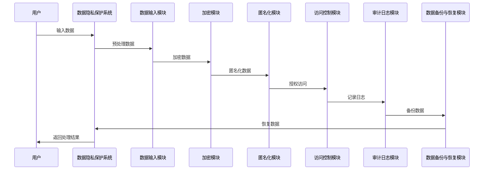

                 


### 第1章: 数据隐私保护概述

#### 1.1.1.1 数据隐私保护的起源与演变

数据隐私保护是一个随着信息技术发展而逐步演化的概念。早在计算机技术兴起之初，数据隐私保护的问题就开始显现。随着互联网的普及，数据的产生、存储和传输变得极其频繁，数据隐私保护的重要性日益凸显。

**数据隐私保护的起源**：

- **20世纪60年代**：计算机科学刚刚起步，数据库技术开始发展。这一时期的隐私保护主要集中在数据库的安全访问控制上，主要通过用户权限管理来实现。

- **20世纪70年代**：数据库安全技术和加密算法逐渐成熟，数据隐私保护开始引入加密技术，如DES和RSA等。

- **20世纪80年代**：随着互联网的兴起，数据隐私保护问题逐渐从单一的数据库安全扩展到整个网络领域。此时，隐私保护的概念更加丰富，不仅涉及数据加密，还包括数据匿名化、访问控制等。

- **21世纪初至今**：随着大数据和人工智能技术的快速发展，数据隐私保护迎来了新的挑战。这不仅要求技术手段的更新，还涉及到法律法规、伦理道德等多个层面。

#### 1.1.1.2 大模型时代数据隐私保护的挑战

大模型时代，数据隐私保护的挑战主要来自以下几个方面：

- **数据量巨大**：大模型需要大量的数据来进行训练，这使得原本就复杂的数据隐私保护问题更加严峻。

- **数据处理复杂**：大模型的训练和处理过程涉及大量的数据处理，如何在不泄露数据隐私的前提下进行这些操作，是一个巨大的挑战。

- **数据敏感性**：大模型处理的数据往往涉及到个人隐私、商业机密等敏感信息，一旦泄露，后果不堪设想。

- **技术发展滞后**：目前的数据隐私保护技术在大模型时代面临巨大挑战，很多技术手段需要重新审视和优化。

#### 1.1.1.3 数据隐私保护的重要性与必要性

数据隐私保护的重要性体现在以下几个方面：

- **保护个人隐私**：数据隐私保护是保护个人隐私的基本手段，防止个人信息被滥用。

- **维护数据安全**：数据隐私保护有助于维护数据的完整性和安全性，防止数据泄露和篡改。

- **保障商业利益**：对于企业而言，数据隐私保护有助于保护商业机密，防止竞争对手获取关键信息。

- **促进技术发展**：数据隐私保护技术的不断进步，有助于推动大数据和人工智能技术的健康发展。

综上所述，在大模型时代，数据隐私保护的重要性愈发突出。我们需要从技术、法律、伦理等多个层面，综合施策，确保数据隐私得到有效保护。

---

### 1.1.2 数据隐私保护的基本概念

数据隐私保护是一个涉及多个领域的综合性概念，它不仅涉及到技术手段，还包括法律、伦理等多个层面。以下是数据隐私保护的一些基本概念：

#### 1.1.2.1 隐私、保密性与保密的区别

- **隐私**：隐私是指个人或组织不愿意公开的个人信息或数据。隐私的保护主要是防止个人信息的泄露和滥用。

- **保密性**：保密性是指防止信息被未经授权的人或系统访问。保密性通常通过加密、访问控制等技术手段来实现。

- **保密**：保密是一种行为，它指的是在信息处理和传输过程中，采取各种措施来确保信息不被泄露。保密包括隐私保护和保密性的实现。

#### 1.1.2.2 数据隐私保护的目标与原则

数据隐私保护的目标主要包括：

- **防止数据泄露**：确保存储、传输和处理过程中的数据不被未经授权的人员获取。

- **防止数据滥用**：防止个人或组织利用数据从事非法活动，如诈骗、骚扰等。

- **保障数据完整性**：确保数据在存储、传输和处理过程中不被篡改或破坏。

数据隐私保护的原则主要包括：

- **最小化原则**：在保护数据隐私的同时，尽量减少对数据使用的影响。

- **透明性原则**：确保数据的收集、处理和使用过程对数据主体透明。

- **可审计性原则**：确保数据隐私保护措施的实施过程可以被审计，以便在出现问题时进行追溯。

#### 1.1.2.3 数据隐私保护的常见技术手段

数据隐私保护的常见技术手段包括：

- **加密技术**：通过加密算法对数据进行加密，确保数据在传输和存储过程中不被窃取或篡改。

- **访问控制**：通过设置访问权限，确保只有授权用户可以访问特定数据。

- **匿名化技术**：通过匿名化处理，将个人信息与数据主体分离，降低数据泄露的风险。

- **数据脱敏技术**：对敏感数据进行脱敏处理，使其无法被直接识别。

- **安全审计**：对数据隐私保护措施的实施过程进行审计，确保其有效性。

综上所述，数据隐私保护是一个涉及多个层面的综合性概念，需要从技术、法律、伦理等多个角度进行综合考虑。在大模型时代，数据隐私保护面临新的挑战，我们需要不断创新技术手段，提升数据隐私保护的水平。

---

### 1.1.3 大模型与数据隐私保护

#### 1.1.3.1 大模型的特点与风险

大模型具有以下特点：

- **大规模**：大模型通常需要处理大量的数据，这些数据可能涉及个人隐私、商业机密等敏感信息。

- **高复杂性**：大模型的结构复杂，训练和推理过程涉及大量的计算资源。

- **自适应能力**：大模型能够通过不断的学习和调整，提高其预测和分类能力。

大模型在数据隐私保护中面临以下风险：

- **数据泄露**：由于大模型需要大量的数据来进行训练，可能导致敏感数据泄露。

- **模型泄露**：大模型的参数和结构可能包含敏感信息，如果泄露，可能导致数据隐私风险。

- **反向工程**：通过分析大模型的输出结果，可能逆向推导出训练数据中的敏感信息。

#### 1.1.3.2 大模型在数据隐私保护中的应用

大模型在数据隐私保护中的应用主要体现在以下几个方面：

- **加密模型训练**：在大模型训练过程中，可以使用加密技术，确保训练数据的安全。

- **匿名化数据处理**：通过匿名化技术，将敏感信息从数据集中剥离，降低数据泄露的风险。

- **差分隐私**：在大模型训练和推理过程中，可以使用差分隐私技术，确保模型的输出结果对个人隐私的泄露风险最小化。

- **隐私保护模型优化**：通过优化大模型的参数和结构，提高其在隐私保护方面的性能。

#### 1.1.3.3 大模型时代数据隐私保护的需求变化

大模型时代，数据隐私保护的需求发生了以下变化：

- **更高层次的安全保障**：大模型涉及的敏感数据更多，对数据隐私保护的要求更高，需要采用更加高级的安全技术。

- **动态适应性**：大模型不断学习和调整，数据隐私保护也需要具备动态适应性，以应对不断变化的风险。

- **多维度综合防护**：数据隐私保护需要从技术、法律、伦理等多个维度进行综合防护，确保数据隐私得到全面保障。

综上所述，大模型时代数据隐私保护面临新的挑战，需要从技术、法律、伦理等多个层面进行深入研究和创新，确保数据隐私得到有效保护。

---

### 1.2 数据隐私保护算法原理

数据隐私保护算法是实现数据隐私保护的核心技术手段。以下将介绍几种常见的数据隐私保护算法，包括加密算法和隐蔽传输算法。

#### 1.2.1 加密算法

加密算法是一种通过将明文数据转换成密文数据，从而实现数据保护的技术。根据加密密钥的使用方式，加密算法可以分为对称加密算法和非对称加密算法。

##### 1.2.1.1 对称加密算法

对称加密算法是指加密和解密使用相同的密钥。常见的对称加密算法包括DES、AES等。

- **DES（Data Encryption Standard）**：DES是一种经典的对称加密算法，其密钥长度为56位，加密速度较快，但安全性较低。

- **AES（Advanced Encryption Standard）**：AES是DES的升级版，其密钥长度可以选择128位、192位或256位，具有更高的安全性。

对称加密算法的优点是加密速度快，缺点是密钥管理复杂，不适用于大规模数据传输。

##### 1.2.1.2 非对称加密算法

非对称加密算法是指加密和解密使用不同的密钥。常见的非对称加密算法包括RSA、ECC等。

- **RSA（Rivest-Shamir-Adleman）**：RSA是一种经典的非对称加密算法，其安全性依赖于大数分解的困难程度。

- **ECC（Elliptic Curve Cryptography）**：ECC是基于椭圆曲线数学的一种非对称加密算法，具有更高的安全性。

非对称加密算法的优点是安全性高，缺点是加密速度较慢，不适用于大规模数据传输。

##### 1.2.1.3 对称加密算法和非对称加密算法的优缺点对比

| 对称加密算法 | 非对称加密算法 |
| :--- | :--- |
| 加密速度快 | 加密速度慢 |
| 密钥管理复杂 | 密钥管理简单 |
| 安全性较低 | 安全性高 |

综上所述，对称加密算法和非对称加密算法各有优缺点，应根据具体应用场景选择合适的加密算法。

#### 1.2.2 隐蔽传输算法

隐蔽传输算法是一种通过将数据隐藏在其他数据中，从而实现数据保护的技术。常见的隐蔽传输算法包括隐写术、隐蔽通信等。

##### 1.2.2.1 隐写术

隐写术是一种将秘密信息隐藏在其他载体中的技术，常见的方法有：

- **空格隐写术**：在文本文件的空格中嵌入秘密信息。

- **颜色隐写术**：在图像的像素颜色中嵌入秘密信息。

- **音频隐写术**：在音频信号中嵌入秘密信息。

隐写术的优点是隐蔽性好，缺点是处理速度较慢。

##### 1.2.2.2 隐蔽传输

隐蔽传输是一种通过在公开通信中嵌入秘密通信的技术，常见的方法有：

- **STEGO（Steganographic Text Embedding）**：将秘密信息嵌入到普通文本中。

- **CTF（Covert Textual Flicker）**：利用文本闪烁效应进行秘密通信。

隐蔽传输的优点是隐蔽性好，缺点是通信效率较低。

##### 1.2.2.3 隐蔽传输的优缺点

| 隐写术 | 隐蔽传输 |
| :--- | :--- |
| 加密速度快 | 加密速度慢 |
| 加密效果好 | 加密效果一般 |
| 加密难度大 | 加密难度小 |

综上所述，隐写术和隐蔽传输各有优缺点，应根据具体应用场景选择合适的隐蔽传输算法。

---

### 1.3 数据隐私保护的数学模型

数据隐私保护中的数学模型是确保隐私性的一种量化方法，它在信息论的基础上发展起来。以下将介绍数据隐私保护中的数学模型，特别是隐私保护与信息论的关系。

#### 1.3.1 数据隐私保护的数学模型概述

数据隐私保护的数学模型通常涉及以下几个方面：

- **熵（Entropy）**：熵是信息论中的一个基本概念，用于量化数据的不确定性。在数据隐私保护中，通过计算数据的熵，可以评估数据隐私泄露的风险。

- **信息增益（Information Gain）**：信息增益是描述数据中包含信息量的增加程度。在隐私保护中，通过最大化信息增益，可以找到最有效的隐私保护方法。

- **条件熵（Conditional Entropy）**：条件熵是描述在已知一部分信息时，剩余信息的不确定性。在隐私保护中，条件熵用于分析在部分信息泄露后的隐私风险。

#### 1.3.2 隐私保护与信息论

信息论为数据隐私保护提供了理论基础。以下是一些关键信息论概念及其在隐私保护中的应用：

- **香农定理（Shannon's Theorem）**：香农定理指出，在无噪声的理想通信系统中，信道容量等于信道的信息熵。在数据隐私保护中，香农定理可以指导我们设计出具有最大隐私保护效果的加密方案。

- **信息熵（Entropy）**：信息熵用于衡量数据的随机性或不确定性。在隐私保护中，通过降低数据的熵，可以减少数据的泄露风险。

- **条件熵（Conditional Entropy）**：条件熵用于衡量在给定一部分信息后，剩余信息的不确定性。在隐私保护中，条件熵可以帮助我们评估在部分信息泄露后的隐私风险。

- **相对熵（Relative Entropy）**：相对熵是两个概率分布之间的差异度量，常用于衡量两个分布的相似性。在隐私保护中，通过最小化相对熵，可以设计出在保护隐私的同时保持数据有效性的加密方案。

#### 1.3.3 数据隐私保护的常见数学模型

数据隐私保护的常见数学模型包括：

- **差分隐私（Differential Privacy）**：差分隐私是一种常用的隐私保护模型，它通过在查询结果中加入噪声，使得查询结果对单个数据的依赖性最小化，从而保护数据隐私。

- **同态加密（Homomorphic Encryption）**：同态加密允许在加密数据上直接执行计算，而不需要解密。这种加密技术使得数据可以在不泄露隐私的情况下进行处理。

- **匿名化（Anonymization）**：匿名化是一种通过去除或模糊化个人身份信息，来保护隐私的技术。常见的匿名化方法包括k-匿名、l-多样性等。

- **基于属性的加密（Attribute-Based Encryption, ABE）**：基于属性的加密允许用户根据其属性进行数据加密和解密，从而实现灵活的隐私保护。

综上所述，数据隐私保护的数学模型是确保数据隐私性的量化工具。通过运用信息论和统计学的方法，我们可以设计出有效的隐私保护方案，在大模型时代确保数据的安全和隐私。

---

### 1.4 数据隐私保护系统分析与架构设计

#### 1.4.1 数据隐私保护系统的需求分析

数据隐私保护系统的需求分析是确保系统能够满足用户需求的基础。以下是数据隐私保护系统的需求分析：

##### 1.4.1.1 系统功能需求

- **数据加密**：系统需要能够对数据进行加密处理，确保数据在传输和存储过程中的安全。

- **数据匿名化**：系统需要支持数据匿名化功能，将敏感数据转换为匿名形式，以降低隐私泄露风险。

- **访问控制**：系统需要实现严格的访问控制，确保只有授权用户可以访问特定数据。

- **审计日志**：系统需要记录所有操作日志，以便在发生隐私泄露时进行追溯和审计。

- **数据备份与恢复**：系统需要支持数据备份和恢复功能，确保数据在意外情况下能够快速恢复。

##### 1.4.1.2 系统非功能需求

- **安全性**：系统需要具备高安全性，防止未经授权的访问和数据泄露。

- **可靠性**：系统需要具有高可靠性，确保数据在存储和传输过程中不丢失或损坏。

- **性能**：系统需要具备高性能，确保在处理大量数据时能够快速响应。

- **可扩展性**：系统需要具备良好的可扩展性，以适应不断增长的数据规模和用户需求。

#### 1.4.2 数据隐私保护系统架构设计

数据隐私保护系统架构设计是确保系统功能实现和性能优化的重要环节。以下是数据隐私保护系统架构设计：

##### 1.4.2.1 系统架构概述

数据隐私保护系统架构可以分为以下几个主要模块：

- **数据输入模块**：负责接收用户输入的数据，并进行初步处理。

- **加密模块**：负责对输入数据进行加密处理，确保数据在传输和存储过程中的安全。

- **匿名化模块**：负责将敏感数据匿名化，以降低隐私泄露风险。

- **访问控制模块**：负责实现严格的访问控制，确保只有授权用户可以访问特定数据。

- **审计日志模块**：负责记录系统所有操作日志，以便在发生隐私泄露时进行追溯和审计。

- **数据备份与恢复模块**：负责数据备份和恢复功能，确保数据在意外情况下能够快速恢复。

##### 1.4.2.2 系统模块划分

数据隐私保护系统可以划分为以下几个模块：

1. **数据输入模块**：
   - 功能：接收用户输入的数据，并进行初步处理。
   - 接口：提供用户数据输入接口。

2. **加密模块**：
   - 功能：对输入数据进行加密处理。
   - 接口：提供数据加密接口。

3. **匿名化模块**：
   - 功能：将敏感数据匿名化。
   - 接口：提供数据匿名化接口。

4. **访问控制模块**：
   - 功能：实现严格的访问控制。
   - 接口：提供用户认证和授权接口。

5. **审计日志模块**：
   - 功能：记录系统所有操作日志。
   - 接口：提供日志记录和查询接口。

6. **数据备份与恢复模块**：
   - 功能：支持数据备份和恢复。
   - 接口：提供数据备份和恢复接口。

##### 1.4.2.3 系统接口设计

数据隐私保护系统的接口设计如下：

1. **数据输入接口**：
   - 接口名称：`DataInputInterface`
   - 功能：接收用户输入的数据，并进行预处理。
   - 参数：`userData`（用户输入的数据）。

2. **加密接口**：
   - 接口名称：`EncryptionInterface`
   - 功能：对输入数据进行加密处理。
   - 参数：`userData`（用户输入的数据），`encryptionKey`（加密密钥）。

3. **匿名化接口**：
   - 接口名称：`AnonymizationInterface`
   - 功能：将敏感数据匿名化。
   - 参数：`sensitiveData`（敏感数据），`anonymizationKey`（匿名化密钥）。

4. **访问控制接口**：
   - 接口名称：`AccessControlInterface`
   - 功能：实现严格的访问控制。
   - 参数：`user`（用户信息），`permission`（访问权限）。

5. **审计日志接口**：
   - 接口名称：`AuditLogInterface`
   - 功能：记录系统所有操作日志。
   - 参数：`logData`（操作日志）。

6. **数据备份与恢复接口**：
   - 接口名称：`BackupAndRecoveryInterface`
   - 功能：支持数据备份和恢复。
   - 参数：`backupData`（备份数据），`recoveryData`（恢复数据）。

##### 1.4.2.4 系统接口调用序列图

以下是一个系统接口调用序列图，展示了数据隐私保护系统中各个模块的交互过程：



通过上述系统架构设计和接口调用序列图，我们可以清晰地了解数据隐私保护系统的功能和模块交互过程，为系统的实现和优化提供了基础。

---

### 1.5 数据隐私保护项目实战

#### 1.5.1 环境准备与安装

在进行数据隐私保护项目实战之前，我们需要准备相应的开发环境和安装必要的软件。以下是具体的步骤：

1. **安装Python**：确保Python环境已安装，版本建议为3.8或更高。

2. **安装依赖库**：使用pip命令安装以下依赖库：
   ```bash
   pip install cryptography numpy pandas
   ```

3. **数据集准备**：选择一个合适的数据集，例如使用Kaggle上的公开数据集。数据集应包含敏感信息和个人隐私数据，以便进行数据隐私保护的实战。

4. **创建虚拟环境**：为了管理项目依赖，建议创建一个Python虚拟环境。使用以下命令创建虚拟环境：
   ```bash
   python -m venv venv
   ```
   然后激活虚拟环境：
   ```bash
   source venv/bin/activate  # 对于Linux或MacOS
   venv\Scripts\activate     # 对于Windows
   ```

#### 1.5.2 系统核心实现

数据隐私保护系统的核心实现包括数据加密、匿名化和访问控制等模块。以下是具体的代码实现：

1. **加密模块实现**：

```python
from cryptography.fernet import Fernet

def generate_key():
    """生成加密密钥"""
    key = Fernet.generate_key()
    return key

def encrypt_data(data, key):
    """加密数据"""
    fernet = Fernet(key)
    encrypted_data = fernet.encrypt(data.encode())
    return encrypted_data

def decrypt_data(encrypted_data, key):
    """解密数据"""
    fernet = Fernet(key)
    decrypted_data = fernet.decrypt(encrypted_data).decode()
    return decrypted_data
```

2. **匿名化模块实现**：

```python
import numpy as np

def anonymize_data(data, mask_size):
    """匿名化数据"""
    mask = np.random.rand(*data.shape) < mask_size
    masked_data = data * (1 - mask) + mask * np.random.rand(*data.shape)
    return masked_data
```

3. **访问控制模块实现**：

```python
from abc import ABC, abstractmethod

class AccessControl(ABC):
    """访问控制接口"""
    @abstractmethod
    def grant_access(self, user, resource):
        """授权访问"""
        pass

    @abstractmethod
    def deny_access(self, user, resource):
        """拒绝访问"""
        pass

class SimpleAccessControl(AccessControl):
    """简单的访问控制实现"""
    
    def __init__(self, user_permissions):
        self.user_permissions = user_permissions

    def grant_access(self, user, resource):
        if user in self.user_permissions:
            print(f"{user}已获得{resource}的访问权限。")
        else:
            print(f"{user}无{resource}的访问权限。")

    def deny_access(self, user, resource):
        if user not in self.user_permissions:
            print(f"{user}已拒绝{resource}的访问。")
        else:
            print(f"{user}无{resource}的访问权限。")
```

#### 1.5.3 实际案例分析

为了更好地理解数据隐私保护项目实战，我们通过一个实际案例来进行分析。

**案例背景**：某公司收集了大量客户数据，包括姓名、年龄、性别、电话号码等敏感信息。为了确保这些数据的安全，公司决定实施数据隐私保护措施。

**案例分析**：

1. **数据加密**：公司使用Fernet加密算法对客户数据进行加密，确保数据在传输和存储过程中的安全。

2. **数据匿名化**：公司对客户数据进行匿名化处理，通过随机掩码将敏感信息替换为随机值，降低隐私泄露风险。

3. **访问控制**：公司实施简单的访问控制策略，只有授权用户（如数据分析师）可以访问加密后的客户数据。

**详细讲解剖析**：

- **加密过程**：公司使用Fernet加密算法对客户数据进行加密。首先生成加密密钥，然后使用密钥对客户数据进行加密。加密后的数据无法直接读取，确保了数据在传输和存储过程中的安全。

- **匿名化过程**：公司使用随机掩码对客户数据进行匿名化处理。通过设置掩码比例（例如80%的掩码比例），将敏感信息替换为随机值。这样可以保证在大多数情况下，敏感信息无法被直接识别，从而降低隐私泄露的风险。

- **访问控制过程**：公司实施简单的访问控制策略，只有授权用户可以访问加密后的客户数据。这通过维护一个用户权限列表来实现，只有权限列表中的用户才能访问特定数据资源。这确保了数据在未经授权的情况下不会泄露。

**项目小结**：

通过数据加密、匿名化和访问控制等手段，公司成功地实施了数据隐私保护措施，确保了客户数据的安全和隐私。虽然这些措施可能不是最先进的，但它们足以应对当前的数据隐私保护需求。随着技术的发展，公司可以进一步优化数据隐私保护策略，提高数据安全性。

---

### 1.6 数据隐私保护最佳实践与拓展

#### 1.6.1 最佳实践 tips

在实施数据隐私保护时，以下是一些最佳实践：

1. **最小化数据收集**：仅收集必要的数据，避免过度收集。

2. **数据加密**：对敏感数据进行加密，确保数据在传输和存储过程中的安全。

3. **数据匿名化**：对敏感数据进行匿名化处理，降低隐私泄露风险。

4. **访问控制**：实施严格的访问控制策略，确保只有授权用户可以访问敏感数据。

5. **安全审计**：定期进行安全审计，确保数据隐私保护措施的有效性。

6. **员工培训**：加强对员工的数据隐私保护意识培训，确保员工了解并遵守数据隐私保护政策。

7. **遵守法律法规**：遵守相关法律法规，确保数据隐私保护合规。

#### 1.6.2 小结与注意事项

数据隐私保护是一个复杂且持续的过程，需要从技术、法律、伦理等多个层面进行综合考虑。以下是一些需要注意的关键点：

1. **全面性**：数据隐私保护需要覆盖数据生命周期中的各个环节，包括数据收集、存储、传输和销毁。

2. **动态性**：随着数据隐私保护技术的发展，需要不断更新和优化数据隐私保护策略。

3. **可扩展性**：数据隐私保护系统应具备良好的可扩展性，以适应不断增长的数据规模和用户需求。

4. **用户隐私意识**：提高用户对隐私保护的意识，鼓励用户采取措施保护自己的个人信息。

#### 1.6.3 拓展阅读

对于数据隐私保护，以下是一些值得拓展的阅读材料：

1. **法律法规**：了解《通用数据保护条例》（GDPR）、《加州消费者隐私法》（CCPA）等法律法规，确保数据隐私保护合规。

2. **最新研究进展**：关注数据隐私保护领域的最新研究进展，了解新技术和算法的应用。

3. **案例分析**：研究数据隐私保护成功的案例，学习最佳实践和经验。

4. **行业报告**：阅读行业报告，了解数据隐私保护在各个行业的应用和挑战。

通过上述最佳实践和拓展阅读，可以进一步提升数据隐私保护的水平，确保数据的安全和隐私。

