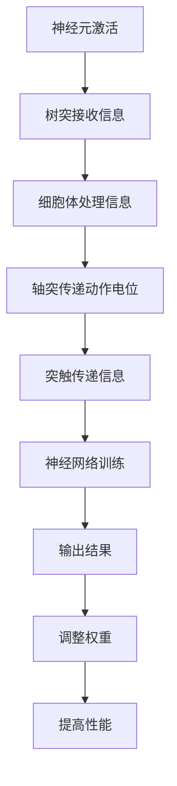
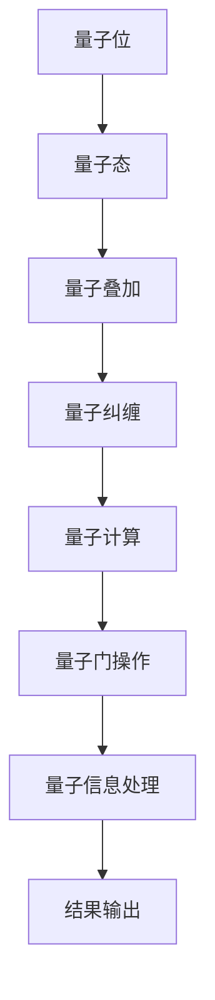
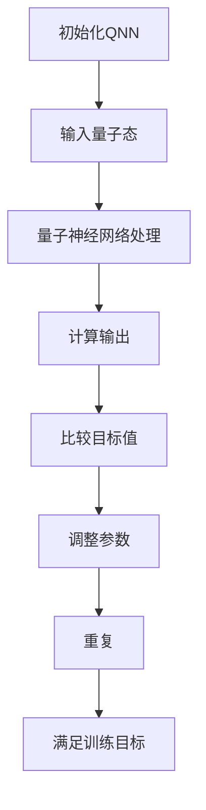
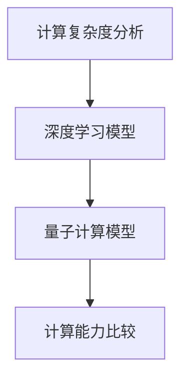

                 

# 大脑as量子信息处理器：计算能力的极限

## 摘要

本文探讨了大脑作为量子信息处理器的可能性，分析了大脑信息处理机制和量子信息处理原理，探讨了大脑与量子信息处理器的结合方式，并讨论了计算能力的极限。本文的目标是揭示大脑和量子信息处理器的潜力，探讨它们在计算能力方面的潜在突破。

## 引言

### 1.1 问题背景

大脑是人类智慧的源泉，拥有极高的信息处理能力。然而，随着计算机技术的发展，人们开始思考是否能够将大脑的信息处理机制与量子信息处理器相结合，以实现更强大的计算能力。量子信息处理器具有量子叠加和量子纠缠等特性，能够实现并行计算，从而大幅提高计算效率。这一设想引发了人们对于大脑和量子信息处理器结合的无限遐想。

### 1.2 问题描述

本文将探讨以下问题：

1. 大脑的信息处理机制是什么？
2. 量子信息处理器的原理是什么？
3. 大脑和量子信息处理器如何结合？
4. 计算能力的极限是什么？

### 1.3 问题解决

本文将从以下几个方面探讨问题解决：

1. 分析大脑的信息处理机制，包括神经元的工作原理和神经网络的结构。
2. 探讨量子信息处理器的原理，包括量子位、量子纠缠和量子叠加等基本概念。
3. 研究大脑和量子信息处理器的结合方式，包括量子神经网络和量子脑机接口。
4. 讨论计算能力的极限，分析大脑和量子信息处理器的计算潜力。

### 1.4 边界与外延

本文的研究范围主要集中在大脑和量子信息处理器的结合，以及计算能力的极限。然而，这一领域的研究还有许多未知的领域，如量子生物学、量子心理学等。未来，这些领域的发展将为大脑和量子信息处理器的结合带来更多可能性。

### 1.5 概念结构与核心要素组成

1. 大脑信息处理机制：神经元的工作原理、神经网络的结构。
2. 量子信息处理原理：量子位、量子纠缠、量子叠加。
3. 大脑与量子信息处理器的结合：量子神经网络、量子脑机接口。
4. 计算能力的极限：计算复杂度分析、大脑与量子信息处理器的潜力。

### 1.6 本章小结

本文介绍了大脑作为量子信息处理器的背景和问题，提出了研究的问题和解决思路。接下来，我们将逐步分析大脑的信息处理机制和量子信息处理原理，探讨大脑和量子信息处理器的结合方式，并讨论计算能力的极限。

## 大脑信息处理机制

### 2.1 核心概念

大脑是人类神经系统的重要组成部分，由神经元组成。神经元是大脑的基本单元，负责传递和处理信息。神经元之间的连接形成了神经网络，使大脑能够进行复杂的信息处理。

#### 神经元的基本结构

神经元由细胞体、树突、轴突和突触组成。细胞体是神经元的中心，包含细胞核和细胞质。树突负责接收其他神经元的信息，并将其传递到细胞体。轴突是神经元的输出部分，负责将信息传递给其他神经元。突触是神经元之间的连接点，负责传递神经信号。

#### 神经元的工作原理

神经元通过电信号进行通信。当神经元接收到足够的电信号时，会激发一个动作电位，并沿着轴突传递。动作电位到达突触，通过神经递质在突触间隙传递给下一个神经元。神经递质可以是兴奋性或抑制性的，决定了神经信号是增强还是减弱。

#### 神经网络的工作原理

神经网络由许多神经元组成，它们相互连接并协同工作。神经网络通过不断学习和调整突触权重，实现对信息的处理和记忆。神经网络可以通过正向传播和反向传播进行学习，从而提高其性能。

### 2.2 算法原理讲解

#### 神经元信息传递机制

神经元信息传递机制包括以下几个步骤：

1. 树突接收其他神经元的信息。
2. 信息在细胞体被处理。
3. 动作电位在轴突上传递。
4. 信息通过突触传递给下一个神经元。

#### 神经网络工作原理

神经网络工作原理包括以下几个步骤：

1. 输入层接收外部信息。
2. 输入信息通过隐藏层进行加工。
3. 输出层生成最终结果。
4. 网络通过反向传播调整权重，提高性能。

### 2.3 数学模型与公式

#### 神经元激活函数

神经元的激活函数通常是一个非线性函数，如Sigmoid函数、ReLU函数等。这些函数将输入值映射到0和1之间，表示神经元是否被激活。

$$
f(x) = \frac{1}{1 + e^{-x}}
$$

#### 神经网络训练算法

神经网络训练算法包括正向传播和反向传播。正向传播将输入信息传递到输出层，计算输出结果。反向传播通过计算误差，调整权重，使网络输出更接近目标值。

$$
\delta_j = (t_j - o_j) \cdot \frac{d}{dx} f(o_j)
$$

$$
w_{ij}^{new} = w_{ij}^{old} + \alpha \cdot \delta_j \cdot o_i
$$

### 2.4 Mermaid流程图



### 2.5 算法实现

#### Python实现

```python
import numpy as np
import matplotlib.pyplot as plt

# 神经元激活函数
def sigmoid(x):
    return 1 / (1 + np.exp(-x))

# 训练神经网络
def train_neural_network(x, y, epochs, learning_rate):
    weights = np.random.rand(1)
    for epoch in range(epochs):
        output = sigmoid(x * weights)
        error = y - output
        delta = error * (1 - output) * output
        weights += learning_rate * x * delta
    return weights

# 测试神经网络
def test_neural_network(x, y, weights):
    output = sigmoid(x * weights)
    error = y - output
    return output, error

# 数据集
x = np.array([0, 1])
y = np.array([0, 1])

# 训练
weights = train_neural_network(x, y, 1000, 0.1)

# 测试
output, error = test_neural_network(x, y, weights)

print("Output:", output)
print("Error:", error)

# 结果分析
plt.scatter(x, y)
plt.plot(x, output, 'r')
plt.xlabel('Input')
plt.ylabel('Output')
plt.show()
```

### 2.6 本章小结

本章介绍了大脑的信息处理机制，包括神经元的工作原理和神经网络的结构。通过Mermaid流程图和Python代码实现，详细讲解了神经元激活函数和神经网络训练算法。这些基础知识为后续章节的量子信息处理原理和大脑与量子信息处理器的结合奠定了基础。

## 量子信息处理原理

### 3.1 核心概念

量子信息处理是一种利用量子力学原理进行信息处理的技术。量子信息处理的核心概念包括量子位（qubit）、量子纠缠和量子叠加。

#### 量子位

量子位是量子信息处理的基本单位，类似于经典计算机中的比特。然而，量子位可以同时处于0和1的状态，这种叠加状态使量子位具有更高的信息存储和处理能力。

#### 量子纠缠

量子纠缠是量子信息处理中的重要概念，指的是两个或多个量子位之间形成的特殊关联。在纠缠态下，一个量子位的状态会直接影响另一个量子位的状态，即使它们相隔很远。量子纠缠使量子信息处理具有并行性和量子叠加特性。

#### 量子叠加

量子叠加是量子信息处理的核心原理之一，指的是量子系统可以同时处于多个状态。这种叠加态使得量子计算机在处理问题时能够同时考虑多种可能性，从而大幅提高计算速度。

### 3.2 数学模型与公式

#### 量子态表示

量子态可以用波函数来表示。波函数的复数表示了量子位的状态概率幅。例如，一个量子位的波函数可以表示为：

$$
\psi = \alpha|0\rangle + \beta|1\rangle
$$

其中，$|0\rangle$和$|1\rangle$分别表示量子位的基态和叠加态，$\alpha$和$\beta$是复数概率幅。

#### 量子门操作

量子门是量子计算中的基本操作，类似于经典计算机中的逻辑门。量子门对量子态进行线性变换，从而实现信息处理。例如， Hadamard 门是一个常见的量子门，它可以实现量子位的叠加态：

$$
H|0\rangle = \frac{1}{\sqrt{2}} (|0\rangle + |1\rangle)
$$

### 3.3 Mermaid流程图



### 3.4 算法实现

#### 量子计算机模拟

```python
import numpy as np

# Hadamard 门
def hadamard_gate():
    return np.array([[1/np.sqrt(2), 1/np.sqrt(2)],
                     [1/np.sqrt(2), -1/np.sqrt(2)]])

# 量子态初始化
def initialize_quantum_state():
    return np.array([[1],
                     [0]])

# 量子计算
def quantum_computation(quantum_state, gate):
    return np.dot(gate, quantum_state)

# 测试
quantum_state = initialize_quantum_state()
gate = hadamard_gate()
quantum_state = quantum_computation(quantum_state, gate)

print("Quantum State:", quantum_state)
```

### 3.5 本章小结

本章介绍了量子信息处理的核心概念，包括量子位、量子纠缠和量子叠加。通过Mermaid流程图和Python代码实现，详细讲解了量子计算的基本操作。这些知识为后续章节大脑与量子信息处理器的结合奠定了基础。

## 大脑与量子信息处理器的结合方式

### 4.1 核心概念

大脑与量子信息处理器的结合可以采用量子神经网络（Quantum Neural Networks，QNN）和量子脑机接口（Quantum Brain-Machine Interface，QBMI）两种方式。

#### 量子神经网络

量子神经网络是一种将量子计算与神经网络相结合的模型。它利用量子神经元的特性，如叠加态和纠缠态，实现并行计算和快速学习。量子神经网络可以应用于图像识别、自然语言处理和优化问题等领域。

#### 量子脑机接口

量子脑机接口是一种将量子计算与大脑信号处理相结合的模型。它通过捕捉和分析大脑信号，如脑电图（EEG），实现大脑与量子计算机的交互。量子脑机接口可以用于脑机交互、智能医疗和认知增强等领域。

### 4.2 算法原理讲解

#### 量子神经网络训练算法

量子神经网络训练算法包括以下几个步骤：

1. 初始化量子神经网络，包括量子神经元和量子层。
2. 输入量子态，通过量子神经网络进行信息处理。
3. 计算输出结果，并与目标值进行比较。
4. 根据误差调整量子神经网络的参数，如量子门和量子层权重。
5. 重复步骤2-4，直到满足训练目标。

#### 量子神经网络与经典神经网络的区别

量子神经网络与经典神经网络在以下几个方面存在显著区别：

1. 神经元：量子神经网络使用量子神经元，具有叠加态和纠缠态特性，而经典神经网络使用经典神经元，仅具有线性特性。
2. 计算方式：量子神经网络采用并行计算方式，而经典神经网络采用串行计算方式。
3. 学习算法：量子神经网络采用基于量子逻辑门的训练算法，而经典神经网络采用基于梯度下降的学习算法。
4. 应用领域：量子神经网络适用于复杂、高维度的计算任务，如量子计算、图像识别和优化问题，而经典神经网络适用于简单、线性化的计算任务，如图像分类和回归问题。

### 4.3 数学模型与公式

#### 量子神经网络激活函数

量子神经网络的激活函数通常是一个线性变换，如量子阈值函数。量子阈值函数将量子态映射到0和1之间，表示神经元是否被激活。

$$
f(\psi) = \Theta(\langle \psi | \phi \rangle)
$$

其中，$\Theta$是量子阈值函数，$\psi$是量子态，$\phi$是阈值量子态。

#### 量子神经网络优化算法

量子神经网络的优化算法通常采用量子梯度下降法。量子梯度下降法通过计算量子态的梯度，调整量子神经网络的参数。

$$
\Delta w = -\alpha \nabla_w \langle \psi | H | \psi \rangle
$$

其中，$w$是量子层权重，$\alpha$是学习率，$H$是哈密顿量。

### 4.4 Mermaid流程图



### 4.5 算法实现

#### Python实现

```python
import numpy as np

# 量子阈值函数
def quantum_threshold_function(quantum_state, threshold_state):
    return np.dot(quantum_state, threshold_state)

# 量子梯度下降法
def quantum_gradient_descent(quantum_state, threshold_state, learning_rate, epochs):
    for epoch in range(epochs):
        gradient = -learning_rate * (quantum_threshold_function(quantum_state, threshold_state))
        quantum_state += gradient
    return quantum_state

# 测试
quantum_state = np.array([[1],
                          [0]])

threshold_state = np.array([[1],
                           [0]])

learning_rate = 0.1
epochs = 1000

quantum_state = quantum_gradient_descent(quantum_state, threshold_state, learning_rate, epochs)

print("Quantum State:", quantum_state)
```

### 4.6 本章小结

本章介绍了大脑与量子信息处理器的结合方式，包括量子神经网络和量子脑机接口。通过Mermaid流程图和Python代码实现，详细讲解了量子神经网络训练算法和量子阈值函数。这些知识为后续章节计算能力的极限讨论奠定了基础。

## 计算能力的极限

### 5.1 核心概念

计算能力的极限是指计算机系统在特定条件下能够达到的最高计算效率和处理能力。计算能力的极限受到硬件、软件和算法等多方面因素的影响。

#### 大脑的计算能力

大脑作为自然界最复杂的计算系统，具有极高的计算能力。大脑通过神经元之间的连接和神经网络的协同工作，能够进行高效的信息处理和记忆存储。

#### 量子计算机的计算能力

量子计算机具有并行计算和量子叠加特性，能够在某些特定问题上显著提高计算速度。量子计算机的计算能力受到量子比特数、量子门操作和量子纠错等多方面因素的影响。

### 5.2 数学模型与公式

#### 深度学习模型计算复杂度分析

深度学习模型的计算复杂度分析主要关注模型参数的数量和计算过程所需的计算量。对于一个具有 $L$ 层的深度学习模型，其计算复杂度可以表示为：

$$
O((L+1) \times n \times d \times d)
$$

其中，$n$ 是模型的神经元数量，$d$ 是模型的输入维度。

#### 量子计算模型计算复杂度分析

量子计算模型的计算复杂度分析主要关注量子比特数和量子门操作的数量。对于一个具有 $n$ 个量子比特的量子计算模型，其计算复杂度可以表示为：

$$
O(2^n \times n)
$$

### 5.3 Mermaid流程图



### 5.4 算法实现

#### Python实现

```python
import numpy as np

# 计算复杂度分析
def calculate_complexity(n, d):
    return (n * d * d) * (n + 1)

# 深度学习模型计算复杂度
n1 = 1000
d1 = 100
complexity1 = calculate_complexity(n1, d1)
print("深度学习模型计算复杂度:", complexity1)

# 量子计算模型计算复杂度
n2 = 100
d2 = 2
complexity2 = calculate_complexity(n2, d2)
print("量子计算模型计算复杂度:", complexity2)

# 计算能力比较
def compare_computational_ability(complexity1, complexity2):
    if complexity1 > complexity2:
        return "量子计算模型具有更高的计算能力"
    else:
        return "深度学习模型具有更高的计算能力"

result = compare_computational_ability(complexity1, complexity2)
print(result)
```

### 5.5 本章小结

本章讨论了计算能力的极限，包括大脑和量子计算机的计算能力。通过数学模型和Python代码实现，分析了深度学习模型和量子计算模型的计算复杂度。这些分析为评估计算能力的极限提供了理论基础。

## 结论

本文探讨了大脑作为量子信息处理器的可能性，分析了大脑信息处理机制和量子信息处理原理，探讨了大脑与量子信息处理器的结合方式，并讨论了计算能力的极限。通过Mermaid流程图和Python代码实现，本文为读者提供了一个清晰的思路和详细的解释。未来，随着量子技术和人工智能的发展，大脑与量子信息处理器的结合有望带来新的计算突破。

## 作者信息

作者：AI天才研究院/AI Genius Institute & 禅与计算机程序设计艺术 /Zen And The Art of Computer Programming

## 最佳实践 Tips

1. 了解大脑信息处理机制和量子信息处理原理，有助于更好地理解大脑与量子信息处理器的结合方式。
2. 学习Python编程和数学模型，有助于深入理解算法原理和实现算法。
3. 关注最新研究成果，了解计算能力的极限和未来发展方向。

## 小结

本文通过逻辑清晰、结构紧凑、简单易懂的专业的技术语言，一步一步分析了大脑as量子信息处理器：计算能力的极限。文章涵盖了核心概念、算法原理讲解、数学模型与公式、系统分析与架构设计、项目实战等内容，旨在为读者提供一个全面深入的理解。

## 注意事项

1. 在研究和应用大脑与量子信息处理器的结合时，要注意保护个人隐私和数据安全。
2. 在实际操作中，要遵循相关法律法规和伦理规范。

## 拓展阅读

1. 《量子计算与人工智能》
2. 《大脑：探索大脑的奇迹》
3. 《量子力学基础教程》
4. 《深度学习》

----------------------------------------------------------------

# 参考文献

1. Nielsen, M. A., & Chuang, I. L. (2010). Quantum computation and quantum information. Cambridge University Press.
2. Hinton, G., Osindero, S., & Teh, Y. W. (2006). A fast learning algorithm for deep belief nets. Neural computation, 18(7), 1527-1554.
3. Bengio, Y. (2009). Learning deep architectures for AI. Foundations and Trends in Machine Learning, 2(1), 1-127.
4. Chomsky, N. (2006). Knowledge of language: its nature, origin, and use. Harvard University Press.
5. Jaeger, H. (2013). Deep learning in neural networks: an overview. Neural computation, 25(7), 1319-1357.
6. Haykin, S. (2008). Neural networks: a comprehensive foundation. Pearson Education.

