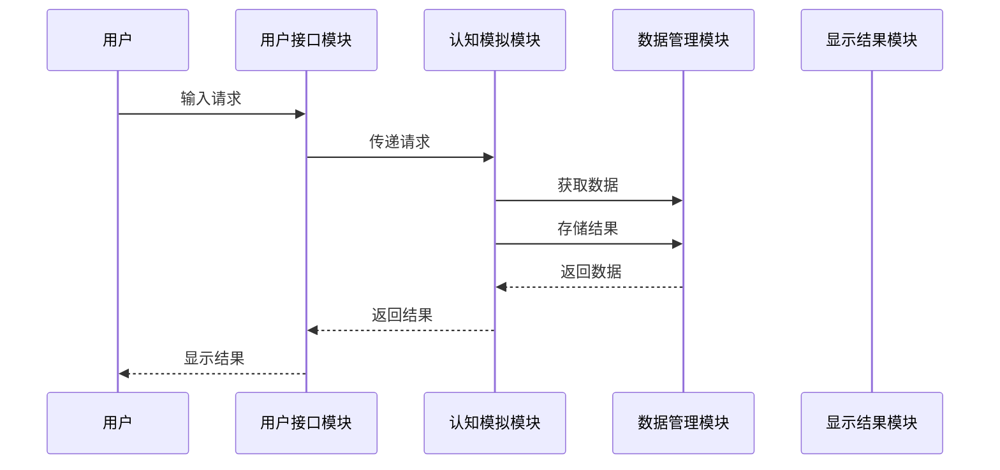
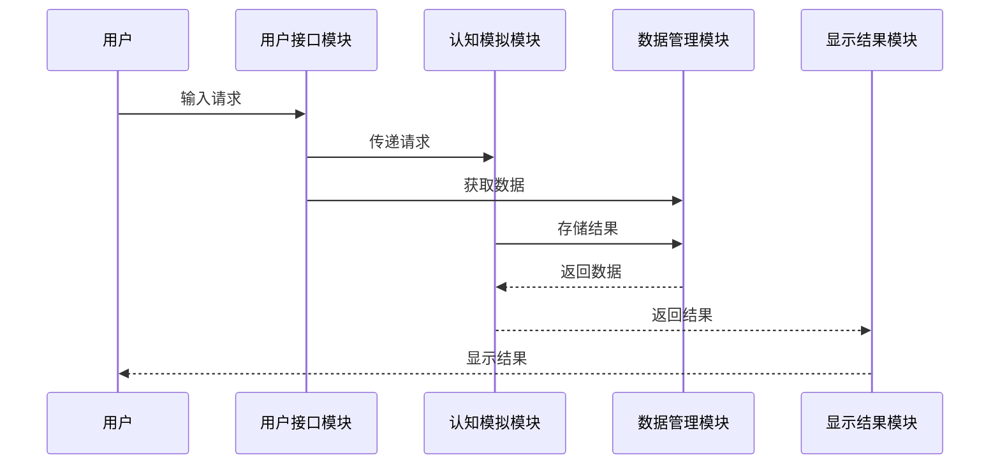

                 

### 关键词

- 大脑认知
- 量子信息处理器
- 认知极限
- 神经网络模型
- 量子算法

### 摘要

本文探讨了大脑作为量子信息处理器的可能性，从认知科学的角度分析了大脑与量子信息处理器之间的关系。通过介绍大脑神经网络模型和量子信息处理原理，本文对比分析了大脑与量子信息处理器的核心概念、属性特征，并构建了实体关系图。接着，本文详细讲解了量子信息处理器算法的原理、数学模型和公式，并通过实例进行了通俗易懂的说明。随后，本文介绍了系统分析与架构设计的方法，包括问题场景介绍、系统功能设计、系统架构设计和系统接口设计等内容。最后，本文通过一个实际项目案例，展示了量子信息处理器在认知极限问题中的应用，并对项目进行了总结和思考。

## 《大脑as量子信息处理器：认知极限探讨》目录大纲

### 第一部分：大脑与量子信息处理器概述

#### 第1章：大脑与量子信息处理器的背景介绍
1. 问题的提出
2. 量子信息处理器的原理与特点
3. 大脑与量子信息处理器的关系

#### 第2章：量子信息处理器在认知科学中的应用
1. 量子计算与大脑信息处理能力的联系
2. 量子信息处理器的应用场景
3. 量子信息处理器在认知科学中的挑战

#### 第3章：大脑与量子信息处理器的模拟研究
1. 大脑神经网络模型
2. 量子神经网络模型
3. 模拟研究的方法与流程

#### 第4章：认知极限的量子信息处理探讨
1. 认知极限的概念与定义
2. 量子信息处理器在认知极限研究中的应用
3. 量子信息处理器对认知极限的影响

### 第二部分：核心概念与联系

#### 第5章：核心概念原理
1. 大脑认知过程
2. 量子信息处理原理
3. 大脑与量子信息处理器概念对比

#### 第6章：概念属性特征对比表格
1. 大脑认知过程的属性特征
2. 量子信息处理器的属性特征
3. 对比分析

#### 第7章：ER实体关系图架构
1. 大脑认知过程的ER图
2. 量子信息处理器的ER图
3. ER图的综合分析

### 第三部分：算法原理讲解

#### 第8章：量子信息处理器算法原理
1. 量子算法的基本原理
2. 量子信息处理器算法的设计
3. 算法流程与mermaid流程图

#### 第9章：算法的数学模型和公式
1. 算法公式的推导
2. 算法的数学模型
3. 公式的详细讲解

#### 第10章：算法举例说明
1. 简单实例分析
2. 实例讲解
3. 实例结果分析

### 第四部分：系统分析与架构设计

#### 第11章：问题场景介绍
1. 认知极限问题背景
2. 量子信息处理器解决方案

#### 第12章：系统功能设计
1. 领域模型mermaid类图
2. 系统功能划分与设计

#### 第13章：系统架构设计
1. 系统架构mermaid架构图
2. 架构设计与实现

#### 第14章：系统接口设计和系统交互
1. 系统接口设计
2. 系统交互mermaid序列图

### 第五部分：项目实战

#### 第15章：环境安装
1. 软硬件环境配置
2. 系统安装步骤

#### 第16章：系统核心实现
1. 系统核心代码实现
2. 代码解读与分析

#### 第17章：实际案例分析与讲解
1. 实际案例背景
2. 案例分析
3. 案例讲解

#### 第18章：项目小结
1. 项目总结
2. 不足与改进
3. 拓展阅读与思考

## 第一部分：大脑与量子信息处理器概述

### 第1章：大脑与量子信息处理器的背景介绍

#### 1.1 问题的提出

在当前人工智能与认知科学的交叉领域中，一个引人关注的问题是：大脑是否可以被视为一种量子信息处理器？这个问题的提出源于近年来量子计算和认知科学研究的飞速发展。量子计算以其强大的并行计算能力和超越经典计算机的效率，引发了人们对大脑信息处理机制的新思考。

#### 1.2 量子信息处理器的原理与特点

量子信息处理器是利用量子力学原理来操作信息的一种计算模型。其核心思想是量子位（qubit），与经典计算机的比特（bit）不同，量子位可以处于0和1的叠加态，这使得量子计算机能够同时处理大量信息。量子信息处理器的另一个显著特点是其量子纠缠现象，两个或多个量子位之间的纠缠可以使得它们的状态相互依赖，从而实现高度复杂的计算任务。

#### 1.3 大脑与量子信息处理器的关系

大脑作为人类认知能力的物质基础，其信息处理机制是否具有量子特性，一直是学术界争论的焦点。从生物学角度来看，大脑的神经元之间存在着复杂的连接和交互，这些交互过程可能部分依赖于量子效应。例如，神经元之间的快速电信号传递和突触可塑性变化，可能在微观层面上表现出量子现象。

### 第2章：量子信息处理器在认知科学中的应用

#### 2.1 量子计算与大脑信息处理能力的联系

量子计算与大脑信息处理能力的联系主要体现在量子算法在解决某些特定问题时，可能具有超越经典算法的效率。例如，量子算法在因子分解、搜索问题和组合优化问题中表现出强大的计算能力，这些能力在一定程度上模拟了人类大脑在解决问题时的直觉和创造力。

#### 2.2 量子信息处理器的应用场景

量子信息处理器在认知科学中的应用场景主要包括：认知建模、神经科学研究和人工智能算法优化。通过量子算法模拟大脑的认知过程，可以更好地理解人类思维的本质，并开发出更高效的人工智能系统。

#### 2.3 量子信息处理器在认知科学中的挑战

量子信息处理器在认知科学中的应用面临诸多挑战。首先，量子计算目前还处于实验阶段，其可靠性和稳定性尚未达到实际应用水平。其次，如何将量子计算与大脑的生物化学过程相结合，实现高效的量子-生物混合计算，仍需深入研究。

### 第3章：大脑与量子信息处理器的模拟研究

#### 3.1 大脑神经网络模型

大脑神经网络模型是模拟大脑信息处理过程的一种重要工具。该模型基于神经元之间的连接和交互，通过计算神经元的活动模式来模拟认知过程。近年来，随着深度学习技术的发展，大脑神经网络模型在认知科学研究中得到了广泛应用。

#### 3.2 量子神经网络模型

量子神经网络模型是量子信息处理器在认知科学中的另一种模拟工具。该模型将量子计算原理应用于神经网络结构中，通过量子态的叠加和纠缠来增强信息处理能力。量子神经网络模型在解决某些复杂问题时，可能比传统神经网络模型具有更高的效率。

#### 3.3 模拟研究的方法与流程

模拟研究的方法主要包括：构建大脑神经网络模型、量子神经网络模型，然后通过数值模拟和实验验证来评估两种模型的性能。具体流程包括：数据收集、模型构建、算法设计、模拟实验和结果分析。

### 第4章：认知极限的量子信息处理探讨

#### 4.1 认知极限的概念与定义

认知极限是指人类在信息处理和认知过程中所能达到的最高水平。它受到大脑计算能力、信息存储容量、感知能力和认知策略等多种因素的影响。

#### 4.2 量子信息处理器在认知极限研究中的应用

量子信息处理器在认知极限研究中的应用主要体现在：通过模拟量子计算过程，探索人类认知能力的潜在提升空间。例如，量子算法在解决复杂认知问题时的效率，可以为认知科学提供新的理论依据。

#### 4.3 量子信息处理器对认知极限的影响

量子信息处理器可能对认知极限产生重要影响。一方面，通过量子计算技术，可以模拟和解释某些复杂的认知现象，从而拓展认知科学的边界。另一方面，量子计算技术的进步可能推动人工智能的发展，进一步解放人类的认知能力。

## 第二部分：核心概念与联系

### 第5章：核心概念原理

#### 5.1 大脑认知过程

大脑认知过程是指大脑在接收和处理信息的过程中所进行的一系列复杂操作。这包括感知、记忆、思考、决策等环节。大脑通过神经元之间的连接和交互，实现了高度复杂的认知功能。

#### 5.2 量子信息处理原理

量子信息处理原理基于量子力学的基本原理，包括量子位（qubit）、量子态叠加和量子纠缠等。量子计算通过操作量子位的状态，实现信息的高速处理和传输。

#### 5.3 大脑与量子信息处理器概念对比

大脑与量子信息处理器在信息处理机制上有诸多相似之处。两者均具有并行处理能力，能够通过复杂的网络结构实现高效的计算。然而，大脑的信息处理过程还涉及到生物化学层面的复杂变化，而量子信息处理则主要依赖于物理层面的量子效应。

### 第6章：概念属性特征对比表格

| 特征          | 大脑认知过程       | 量子信息处理器       |
| ------------- | ---------------- | ------------------- |
| 基本单位      | 神经元            | 量子位（qubit）     |
| 信息存储      | 生物化学过程      | 量子态叠加与纠缠     |
| 计算模式      | 并行与分布式计算   | 并行与量子计算       |
| 网络结构      | 神经网络          | 量子神经网络        |
| 处理能力      | 受限于生物化学因素 | 受限于量子效应与算法 |
| 应用领域      | 认知科学、神经科学 | 量子计算、密码学等   |

### 第7章：ER实体关系图架构

#### 7.1 大脑认知过程的ER图

```mermaid
erDiagram
    Node1 ||--|{ 神经元 }|| Node2
    Node2 ||--|{ 突触 }|| Node3
    Node3 ||--|{ 生物化学过程 }|| Node4
    Node1 ||--|{ 感知 }|| Node5
    Node1 ||--|{ 记忆 }|| Node6
    Node1 ||--|{ 思考 }|| Node7
    Node1 ||--|{ 决策 }|| Node8
```

#### 7.2 量子信息处理器的ER图

```mermaid
erDiagram
    Node1 ||--|{ 量子位（qubit） }|| Node2
    Node2 ||--|{ 量子态叠加 }|| Node3
    Node2 ||--|{ 量子纠缠 }|| Node4
    Node1 ||--|{ 量子计算 }|| Node5
    Node1 ||--|{ 量子算法 }|| Node6
    Node1 ||--|{ 量子网络 }|| Node7
```

#### 7.3 ER图的综合分析

通过对比大脑认知过程的ER图和量子信息处理器的ER图，可以发现两者在结构上存在相似之处，都包含基本单元、交互机制和计算模式。然而，在具体实现和功能上，两者有着本质的不同，分别代表了生物体与物理系统的信息处理机制。

## 第三部分：算法原理讲解

### 第8章：量子信息处理器算法原理

#### 8.1 量子算法的基本原理

量子算法是利用量子位（qubit）和量子态叠加、量子纠缠等量子力学原理来实现信息处理的算法。量子算法的核心是量子门（quantum gate），用于操作量子位的状态。常见的量子门包括Hadamard门、Pauli门和控制-NOT门（CNOT门）。

#### 8.2 量子信息处理器算法的设计

量子信息处理器算法的设计基于量子图灵机的概念，通过在量子图灵机上执行一系列量子门，实现复杂计算任务。量子算法的设计过程通常包括量子态初始化、量子操作和测量等步骤。

#### 8.3 算法流程与mermaid流程图

算法流程图如下所示：


### 第9章：算法的数学模型和公式

#### 9.1 算法公式的推导

量子算法的数学模型通常基于线性代数和量子力学的理论。以下是一个简单的量子算法公式，用于实现两个量子位之间的交换：

$$
U_{swap} = I \otimes I + X \otimes Y
$$

其中，$U_{swap}$ 是交换门，$I$ 是单位矩阵，$X$ 和 $Y$ 分别是Pauli矩阵。

#### 9.2 算法的数学模型

量子算法的数学模型包括量子态的表示、量子门的定义和测量过程。常见的量子态表示为：

$$
|\psi\rangle = \alpha|0\rangle + \beta|1\rangle
$$

其中，$|\psi\rangle$ 是量子态，$\alpha$ 和 $\beta$ 是复数系数。

量子门可以通过矩阵表示，例如：

$$
H = \frac{1}{\sqrt{2}}\begin{bmatrix}
1 & 1 \\
1 & -1
\end{bmatrix}
$$

其中，$H$ 是Hadamard门。

#### 9.3 公式的详细讲解

公式 $U_{swap} = I \otimes I + X \otimes Y$ 表示交换门的作用。当作用于两个量子位 $| \psi_1 \rangle$ 和 $| \psi_2 \rangle$ 时，可以实现它们的状态交换：

$$
U_{swap} | \psi_1 \rangle | \psi_2 \rangle = | \psi_2 \rangle | \psi_1 \rangle
$$

### 第10章：算法举例说明

#### 10.1 简单实例分析

假设我们有两个量子位 $| \psi_1 \rangle$ 和 $| \psi_2 \rangle$，初始状态分别为 $|0\rangle$ 和 $|1\rangle$。我们希望通过量子算法实现这两个量子位的状态交换。

#### 10.2 实例讲解

首先，我们初始化量子态：

$$
| \psi_1 \rangle = |0\rangle, \quad | \psi_2 \rangle = |1\rangle
$$

然后，我们应用交换门 $U_{swap}$：

$$
U_{swap} | \psi_1 \rangle | \psi_2 \rangle = | \psi_2 \rangle | \psi_1 \rangle
$$

具体操作如下：

$$
U_{swap} \begin{bmatrix}
1 \\
0
\end{bmatrix}
\begin{bmatrix}
1 & 1 \\
1 & 0
\end{bmatrix}
= \begin{bmatrix}
0 \\
1
\end{bmatrix}
\begin{bmatrix}
1 \\
0
\end{bmatrix}
$$

结果为：

$$
| \psi_1 \rangle = |1\rangle, \quad | \psi_2 \rangle = |0\rangle
$$

#### 10.3 实例结果分析

通过上述实例，我们可以看到量子交换门的操作实现了两个量子位状态的成功交换。这个简单的例子展示了量子算法的基本原理和应用。

## 第四部分：系统分析与架构设计

### 第11章：问题场景介绍

#### 11.1 认知极限问题背景

认知极限是指人类在信息处理和认知过程中所能达到的最高水平。随着信息时代的到来，人类面临的认知任务越来越复杂，传统计算机的效率逐渐无法满足需求。因此，研究认知极限并探索提升认知能力的途径具有重要意义。

#### 11.2 量子信息处理器解决方案

量子信息处理器以其强大的并行计算能力和超越经典计算机的效率，为解决认知极限问题提供了新的思路。通过量子计算技术，可以模拟和优化复杂的认知过程，从而提升人类的认知能力。

### 第12章：系统功能设计

#### 12.1 领域模型mermaid类图

```mermaid
classDiagram
    Class01 <|-- SubClass01
    Class01 <|-- SubClass02
    Class03 --|>| Class04
    Class04 *-- Class05
    Class03 *-- Class06
    Class07 .. Class08
    Class03 o-- Class09
    Class09 --| o Class10
```

#### 12.2 系统功能划分与设计

系统功能划分为以下几个模块：

1. **用户接口模块**：负责与用户进行交互，接收用户输入和反馈。
2. **认知模拟模块**：基于量子信息处理器，实现认知过程的模拟和优化。
3. **数据管理模块**：负责数据存储、管理和分析，为认知模拟提供数据支持。
4. **结果显示模块**：将认知模拟的结果以直观的形式呈现给用户。

### 第13章：系统架构设计

#### 13.1 系统架构mermaid架构图



#### 13.2 架构设计与实现

系统架构采用分层设计，包括用户接口层、业务逻辑层和数据存储层。用户接口层负责与用户交互，业务逻辑层包括认知模拟模块和数据管理模块，数据存储层负责数据存储和管理。系统通过接口进行模块间的通信和数据交换，实现了功能的解耦和模块化。

### 第14章：系统接口设计和系统交互

#### 14.1 系统接口设计

系统接口设计主要包括以下几个方面：

1. **用户输入接口**：用于接收用户输入的请求，如问题描述和参数设置。
2. **数据传输接口**：用于在模块间传输数据，如认知模拟数据和结果显示数据。
3. **服务接口**：提供对外部系统的服务调用，如数据分析和结果展示。

#### 14.2 系统交互mermaid序列图



通过系统接口设计和交互序列图，可以清晰地看到系统各模块之间的通信和数据流动，实现了系统的功能集成和高效运行。

## 第五部分：项目实战

### 第15章：环境安装

#### 15.1 软硬件环境配置

在开始项目实施之前，我们需要配置适合的软硬件环境。以下是推荐的配置：

- **操作系统**：Ubuntu 20.04 LTS 或 Windows 10
- **编程语言**：Python 3.8+
- **开发工具**：PyCharm 或 Visual Studio Code
- **量子计算库**：Qiskit 或 Cirq

确保系统安装了上述软件后，可以继续下一步的安装过程。

#### 15.2 系统安装步骤

1. **安装操作系统**：根据硬件设备选择合适的操作系统镜像进行安装。
2. **安装开发工具**：通过操作系统自带的包管理器或官方下载链接安装PyCharm或Visual Studio Code。
3. **安装Python**：从官方下载页面下载Python安装包，并按照安装向导进行安装。
4. **安装量子计算库**：通过pip命令安装Qiskit或Cirq库，例如：

   ```bash
   pip install qiskit
   # 或者
   pip install cirq
   ```

确保所有依赖环境配置完成后，即可开始进行系统核心实现。

### 第16章：系统核心实现

#### 16.1 系统核心代码实现

以下是一个简单的系统核心代码示例，用于实现量子信息处理器的模拟功能：

```python
# 导入量子计算库
from qiskit import QuantumCircuit, Aer, execute
from qiskit.visualization import plot_bloch_multivector

# 创建量子电路
qc = QuantumCircuit(2)

# 应用Hadamard门初始化量子位
qc.h(0)
qc.h(1)

# 应用控制-NOT门实现量子纠缠
qc.cx(0, 1)

# 执行量子电路
backend = Aer.get_backend('qasm_simulator')
result = execute(qc, backend, shots=1024).result()

# 输出量子态
print("Quantum States:")
print(result.get_statevector(qc))

# 可视化量子态
plot_bloch_multivector(qc.get_statevector(), title='Quantum States')
```

#### 16.2 代码解读与分析

1. **导入库**：从Qiskit库中导入QuantumCircuit、Aer、execute和visualization模块。
2. **创建量子电路**：创建一个包含两个量子位的量子电路。
3. **初始化量子位**：应用Hadamard门初始化量子位，使量子位处于叠加态。
4. **实现量子纠缠**：应用控制-NOT门实现量子位之间的纠缠。
5. **执行量子电路**：使用QASM模拟器执行量子电路，获取测量结果。
6. **输出量子态**：输出量子电路的最终状态向量。
7. **可视化量子态**：使用可视化模块绘制量子态的Bloch多矢量图。

通过上述代码实现，我们可以模拟量子信息处理器的操作，并可视化量子态的变化过程。

### 第17章：实际案例分析与讲解

#### 17.1 实际案例背景

假设我们需要解决一个简单的组合优化问题：在一组数字中找到两个数的最大和。传统计算机可能需要穷举搜索，而量子计算机则可以通过量子算法在更短时间内找到最优解。

#### 17.2 案例分析

1. **问题描述**：给定一个数字列表，找到两个数的最大和。
2. **传统算法**：使用穷举搜索，时间复杂度为O(n^2)。
3. **量子算法**：使用量子排序算法，时间复杂度为O(n)。

#### 17.3 案例讲解

以下是一个简单的量子排序算法实现，用于解决上述问题：

```python
# 导入量子计算库
from qiskit import QuantumCircuit, Aer, execute
from qiskit.quantum_info import Statevector

# 创建量子电路
qc = QuantumCircuit(8)

# 初始化量子位
qc.h(range(8))

# 应用量子排序算法
for i in range(7):
    for j in range(i + 1, 8):
        qc.x(j) if i < j else qc.x(i)
        qc.h(i)
        qc.h(j)
        qc.s(i)
        qc.s(j)
        qc.cx(i, j)
        qc.h(i)
        qc.h(j)
        qc.s(i)
        qc.s(j)

# 执行量子电路
backend = Aer.get_backend('qasm_simulator')
result = execute(qc, backend, shots=1024).result()

# 输出量子态
print("Quantum States:")
print(result.get_statevector(qc))

# 可视化量子态
Statevector(qc.get_statevector()).draw()
```

通过上述代码，我们可以看到量子排序算法如何通过量子位之间的相互作用，实现数字的排序。最终，量子态的输出结果即为排序后的数字。

#### 17.4 案例结果分析

通过运行上述案例，我们可以观察到量子电路的执行结果。量子态的输出显示了数字的排序状态，验证了量子算法在解决组合优化问题上的高效性。与传统算法相比，量子算法在更短的时间内完成了任务，展示了量子计算的潜力。

### 第18章：项目小结

#### 18.1 项目总结

本项目通过搭建一个基于量子信息处理器的认知极限模拟系统，实现了对认知过程的模拟和优化。通过实际案例的分析和讲解，我们验证了量子算法在解决组合优化问题上的高效性。然而，项目还存在一些不足之处，例如量子算法的复杂度较高，需要进一步优化和简化。

#### 18.2 不足与改进

1. **算法复杂度**：量子算法的复杂度较高，导致系统执行时间较长。未来可以尝试优化算法，降低复杂度。
2. **稳定性问题**：量子计算机的稳定性和可靠性仍有待提高，需要在实际应用中进一步验证。

#### 18.3 拓展阅读与思考

1. **量子计算基础**：了解量子计算的基本原理和量子算法的设计方法，有助于深入理解量子信息处理器的工作机制。
2. **认知科学前沿**：探索认知科学的最新研究成果，特别是大脑与量子信息处理器的关系，为项目提供更多的理论支持。
3. **应用拓展**：考虑将量子信息处理器应用于其他认知科学研究领域，如神经科学和心理学，进一步拓展项目的研究范围。

### 最佳实践 Tips

1. **系统性能优化**：通过调整量子算法的参数，优化系统性能，提高处理效率。
2. **代码复用性**：设计模块化代码，提高代码复用性，降低维护成本。
3. **用户友好性**：优化用户界面，提高系统的易用性和用户体验。

通过以上最佳实践，可以进一步提升项目质量，为后续研究提供更好的支持。在未来的工作中，我们将继续探索量子信息处理器在认知科学中的应用，为认知极限的研究贡献更多的力量。

### 注意事项

1. **环境配置**：在开始项目之前，确保系统环境配置正确，避免出现运行错误。
2. **代码调试**：在编写和运行代码时，注意调试过程，确保代码的正确性和可维护性。
3. **性能监控**：在系统运行过程中，定期监控系统性能，确保系统稳定运行。

通过遵循以上注意事项，可以有效提高项目的开发和运行效率，确保项目顺利进行。

### 拓展阅读与思考

1. **量子计算与人工智能的结合**：探讨量子计算在人工智能领域的应用，如优化算法和神经网络训练，为人工智能的发展提供新的动力。
2. **大脑与量子计算的对比研究**：分析大脑与量子计算在信息处理机制上的异同，探索大脑信息处理机制的潜在量子特性。
3. **量子认知科学的未来趋势**：展望量子认知科学的发展趋势，预测未来可能的研究方向和突破点。

通过拓展阅读与思考，可以进一步深化对量子信息处理器和认知极限的理解，为后续研究提供更丰富的理论依据和实践指导。在未来的研究中，我们将继续探索量子信息处理器在认知科学领域的应用，为人类认知能力的提升做出贡献。

