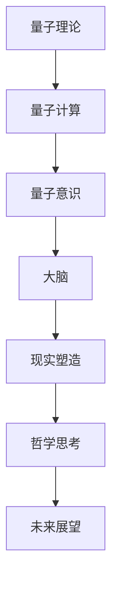

                 


## 大脑as量子观测者：现实塑造的过程

### 关键词
- 大脑，量子观测者，现实塑造，意识，量子理论

### 摘要
本文探讨了大脑作为量子观测者在现实塑造过程中的作用。通过分析量子理论与大脑的关联，我们揭示了大脑如何通过量子观测机制影响现实的塑造。本文从量子意识和人类行为的角度，进一步探讨了现实塑造的量子机制及其对哲学思考的挑战，最后展望了量子意识与人工智能、未来社会的前沿研究方向。

## 目录大纲

### 第一部分：引言
1. **第1章：问题的背景与核心概念**
   1.1 问题背景
   1.2 核心概念
   1.3 边界与外延

2. **第2章：量子理论的基础知识**
   2.1 量子力学的核心原理
   2.2 量子计算的基本概念
   2.3 量子观测与量子测量

3. **第3章：大脑的工作原理**
   3.1 大脑的结构与功能
   3.2 大脑与现实的交互
   3.3 大脑的认知过程

4. **第4章：现实塑造的量子机制**
   4.1 量子现实模型
   4.2 量子波动与大脑观测
   4.3 量子观测与意识

5. **第5章：量子意识与人类行为**
   5.1 量子意识对人类行为的影响
   5.2 量子现实与心灵感应
   5.3 量子现实与哲学思考

6. **第6章：前沿研究与未来展望**
   6.1 量子意识与人工智能
   6.2 量子计算与人工智能的结合
   6.3 量子意识与未来社会

7. **第7章：结论与展望**
   7.1 总结与反思
   7.2 未来研究方向

## 第一部分：引言

### 第1章：问题的背景与核心概念

#### 1.1 问题背景

人类对现实的感知和认知一直是哲学和科学领域的重要议题。传统的观点认为，现实是一种客观存在的物质世界，而人类通过感官和大脑对现实进行感知和认知。然而，随着量子理论的发展，科学家们开始重新审视现实的概念，提出了“大脑作为量子观测者”这一新观点。

量子理论揭示了微观世界的规律，其中最引人注目的是量子态的叠加和纠缠现象。量子态的叠加意味着一个粒子可以同时处于多种状态，而纠缠现象则表明两个或多个粒子之间存在一种超距的联系。这些量子现象引发了人们对于现实本质的思考：如果现实是由微观世界的量子态所塑造，那么我们的大脑作为量子观测者，是否能够改变现实的形态？

现实塑造的过程涉及多个层面的交互和作用。从物理学角度来看，现实是由基本粒子的状态和运动所决定的。然而，人类的感知和认知过程使得现实具有了主观的意义。换句话说，人类对现实的认知不仅受到客观世界的影响，还受到自身意识和主观体验的影响。因此，理解大脑作为量子观测者在现实塑造过程中的作用，对于我们深入认识现实和自身的本质具有重要意义。

#### 1.2 核心概念

1. **大脑作为量子观测者**

大脑作为量子观测者的概念源于量子理论中的“量子测量”和“量子态叠加”。在量子力学中，量子系统处于叠加态，即同时存在于多种可能的态中。然而，当我们对量子系统进行测量时，系统会塌缩到一个确定的态。这个过程称为“量子测量”或“量子观测”。

类比于量子测量，大脑作为量子观测者的概念认为，人类的大脑在感知和认知现实时，会通过某种方式对量子系统进行观测，从而影响现实的形态。这个观点挑战了传统的唯物主义和唯心主义观念，提出了一个介于两者之间的现实观。

2. **现实塑造的过程**

现实塑造的过程涉及到多个层面的交互和作用。首先，从物理学角度来看，现实是由基本粒子的状态和运动所决定的。然而，这些基本粒子的状态和运动是如何影响宏观世界的，以及人类如何感知和认知这些物理现象，则需要通过量子理论和大脑的工作原理来解释。

其次，从人类心理学和认知科学的角度来看，现实塑造的过程涉及到感知、记忆、思维和意识等多个层面的交互。人类的感知和认知过程使得现实具有了主观的意义。换句话说，现实不仅是客观世界的反映，还受到人类主观体验和意识的影响。

#### 1.3 边界与外延

本文讨论的大脑作为量子观测者在现实塑造过程中的作用，主要关注以下边界与外延：

1. **量子理论与大脑的关联**

本文首先介绍了量子理论的基本原理，如量子态、叠加态、纠缠态等。然后探讨了大脑如何与量子理论相关联，即大脑作为量子观测者在现实塑造过程中的作用。

2. **大脑的工作原理**

本文介绍了大脑的基本结构和功能，如神经元、神经网络等。然后探讨了大脑如何感知现实、如何进行认知过程，以及这些过程如何影响现实塑造。

3. **现实塑造的过程**

本文从量子理论和大脑的工作原理出发，分析了现实塑造的过程。具体包括量子现实模型、量子波动与大脑观测、量子观测与意识等。

4. **量子意识与人类行为**

本文进一步探讨了量子意识对人类行为的影响，如量子意识如何影响决策过程、如何与社会行为相关联等。

通过以上边界与外延的讨论，本文试图揭示大脑作为量子观测者在现实塑造过程中的作用，并探讨这一观点对哲学思考的挑战。

### 第二部分：量子理论与大脑的关联

#### 第2章：量子理论的基础知识

量子理论是20世纪物理学的一场革命，它揭示了微观世界的奇妙规律，改变了我们对现实的认知。在这部分，我们将介绍量子理论的基础知识，包括量子力学的核心原理、量子计算的基本概念以及量子观测与量子测量的关系。

#### 2.1 量子力学的核心原理

量子力学的核心原理包括量子态、叠加态、纠缠态以及不确定性原理。

1. **量子态**

量子态是量子系统的内部状态，可以用波函数或密度矩阵来描述。波函数是复数值函数，表示粒子在不同位置和动量上的概率分布。密度矩阵是量子态的另一种描述方式，它是一个复矩阵，表示粒子在不同状态之间的概率分布。

2. **叠加态**

叠加态是量子态的一种特殊形式，表示粒子可以同时存在于多种可能的态中。例如，一个电子可以同时存在于自旋向上和自旋向下的态中。叠加态是量子力学区别于经典力学的重要特征。

3. **纠缠态**

纠缠态是两个或多个粒子之间的一种特殊关系，它们的状态无法独立存在，而是相互关联。即使这些粒子被分隔得很远，一个粒子的状态变化也会立即影响到另一个粒子的状态。这种现象被称为“超距作用”。

4. **不确定性原理**

不确定性原理是量子力学的基本原理之一，由海森堡提出。它指出，无法同时精确地测量粒子的位置和动量。换句话说，粒子的位置和动量之间存在固有的不确定性。

#### 2.2 量子计算的基本概念

量子计算是量子理论的一个应用领域，它利用量子态的叠加和纠缠特性，实现了比经典计算更高效的处理方式。以下是量子计算的基本概念：

1. **量子比特**

量子比特（qubit）是量子计算的基本单元，它可以同时处于0和1的叠加态。与经典比特只能表示0或1不同，量子比特可以同时表示0和1，这使得量子计算具有指数级别的并行性。

2. **量子算法**

量子算法是利用量子比特进行计算的方法，与经典算法相比，量子算法在解决某些问题时具有显著的优势。著名的量子算法包括Shor算法和Grover算法。

3. **量子纠错**

量子计算中，量子比特容易受到外部干扰和噪声的影响，导致量子态的破坏。量子纠错是确保量子计算稳定性的关键技术，它通过编码和纠错机制，实现了对量子信息的保护和传输。

#### 2.3 量子观测与量子测量

量子观测和量子测量是量子理论中两个重要概念。它们之间的关系可以类比于人类观测和认知现实的过程。

1. **量子观测**

量子观测是指对量子系统进行观测或测量的过程。在量子观测中，观测者（如人类的大脑）会与量子系统发生相互作用，导致量子系统的状态发生塌缩，即从叠加态变为确定的态。

2. **量子测量**

量子测量是对量子系统进行测量的过程。测量结果可能是量子态的某个特定值，也可能是多个值的概率分布。量子测量对量子系统的影响是决定性的，它会改变量子系统的状态。

#### 2.4 量子理论与大脑的关联

量子理论与大脑的关联可以从多个角度进行分析。首先，从物理学角度来看，量子理论揭示了微观世界的规律，这些规律可能对大脑的工作原理产生影响。例如，量子态的叠加和纠缠特性可能在大脑的神经网络中有所体现。

其次，从认知科学和心理学角度来看，量子观测和量子测量的概念可以类比于人类对现实的感知和认知过程。大脑作为量子观测者，可能会通过某种方式影响现实的状态，从而塑造我们的感知和认知。

然而，量子理论与大脑的关联仍然是一个具有争议性的话题。目前，尚未有确凿的证据表明量子理论能够直接解释大脑的工作原理。因此，量子理论与大脑的关联仍然需要更多的研究来探索和证实。

#### 2.5 小结

量子理论的基础知识为理解大脑作为量子观测者在现实塑造过程中的作用提供了重要的理论框架。通过分析量子力学的核心原理、量子计算的基本概念以及量子观测与量子测量的关系，我们可以初步探讨大脑如何通过量子观测机制影响现实的塑造。

在下一部分中，我们将进一步探讨大脑的工作原理，分析大脑如何与量子理论相关联，并探讨量子理论与大脑关联对现实塑造过程的影响。

### 第三部分：大脑与量子观测

#### 第3章：大脑的工作原理

大脑作为人类感知、认知和行为的中心，其复杂性和功能多样性令人惊叹。为了理解大脑作为量子观测者在现实塑造过程中的作用，我们需要深入了解大脑的结构与功能、大脑与现实的交互，以及大脑的认知过程。

#### 3.1 大脑的结构与功能

大脑是神经系统的核心，由数十亿个神经元组成。神经元是大脑的基本单位，负责接收和传递信息。大脑的主要结构包括：

1. **大脑皮层**：大脑皮层是大脑最外层的部分，负责高级认知功能，如思考、记忆、感知和情感。

2. **丘脑**：丘脑位于大脑中心，是信息传递的重要中转站，负责调节感知和运动。

3. **小脑**：小脑位于大脑的后下方，负责协调运动和平衡。

4. **脑干**：脑干位于大脑下方，负责基本生命维持功能，如呼吸和心跳。

神经元通过电信号和化学信号相互连接，形成复杂的神经网络。这些神经网络在大脑中形成了不同的功能区域，每个区域都负责特定的认知和生理功能。

#### 3.2 大脑与现实的交互

大脑通过感官系统接收外部世界的信号，如视觉、听觉、触觉等。这些信号被转换为神经信号，传递到大脑进行处理和解释。大脑对现实进行感知和认知的过程包括以下几个步骤：

1. **感知**：大脑通过感官系统接收外部世界的信号，并将其转换为神经信号。

2. **处理**：大脑对神经信号进行处理，提取有用的信息，并排除噪声。

3. **解释**：大脑根据过去经验、知识和其他信息，对感知到的信号进行解释。

4. **记忆**：大脑将处理后的信息存储在记忆中，以便未来使用。

5. **决策**：大脑根据感知和记忆信息，做出相应的决策和反应。

这个过程表明，大脑不仅是一个被动接收外部信号的机器，而是一个主动参与现实塑造的观测者。大脑通过感知、处理和解释外部信号，影响了我们对现实的认知和反应。

#### 3.3 大脑的认知过程

大脑的认知过程涉及到多个层面的交互和作用。以下是一些关键的认知过程：

1. **知觉**：知觉是大脑对外部世界的感知和理解。例如，我们通过视觉系统感知形状、颜色和运动。

2. **记忆**：记忆是大脑存储和提取信息的能力。长期记忆和短期记忆都是大脑认知过程的重要组成部分。

3. **思维**：思维是大脑对信息进行逻辑推理和抽象思考的能力。例如，我们通过思维解决数学问题和进行创造性思考。

4. **决策**：决策是大脑根据感知和记忆信息，选择最佳行动方案的过程。决策涉及到多个认知过程的协同工作。

5. **意识**：意识是大脑对自身状态和外部世界的感知和认知。意识使我们能够意识到自己的存在，并对外部世界做出有意识的反应。

这些认知过程表明，大脑不仅是一个简单的信息处理器，而是一个复杂的系统，能够对信息进行感知、处理、解释和反应。

#### 3.4 大脑作为量子观测者的可能性

虽然目前尚未有确凿的证据表明大脑具有量子性质，但一些理论假设大脑中的某些过程可能受到量子效应的影响。以下是一些可能的支持大脑作为量子观测者的观点：

1. **神经元之间的量子纠缠**：有研究表明，神经元之间存在量子纠缠现象。如果这一现象存在，那么神经元之间的信息传递可能会受到量子效应的影响。

2. **大脑的复杂性和非线性**：大脑是一个高度复杂和非线性的系统，这种复杂性可能导致量子效应在脑内放大。

3. **意识的量子解释**：一些理论认为，意识可能与量子态的坍缩有关。如果意识确实与量子态相关，那么大脑作为量子观测者的可能性就会增加。

尽管存在这些可能性，但大脑作为量子观测者的观点仍然需要更多的研究和证据来证实。在下一部分中，我们将进一步探讨现实塑造的量子机制，分析量子波动与大脑观测的关系，以及量子观测与意识之间的联系。

#### 3.5 小结

大脑作为量子观测者在现实塑造过程中的作用是一个有趣且具有挑战性的话题。通过分析大脑的工作原理、大脑与现实的交互过程，以及大脑的认知过程，我们初步了解了大脑如何参与现实塑造。虽然目前尚未有确凿的证据表明大脑具有量子性质，但一些理论假设和实验研究为这一观点提供了可能性。

在下一部分中，我们将进一步探讨现实塑造的量子机制，分析量子波动与大脑观测的关系，以及量子观测与意识之间的联系。这些讨论将有助于我们更深入地理解大脑作为量子观测者在现实塑造过程中的作用。

### 第四部分：现实塑造的量子过程

#### 第4章：现实塑造的量子机制

在上一部分中，我们探讨了大脑作为量子观测者在现实塑造过程中的可能性。在本章中，我们将进一步探讨现实塑造的量子机制，分析量子波动与大脑观测的关系，以及量子观测与意识之间的联系。

#### 4.1 量子现实模型

量子现实模型是描述现实的一种新视角，它将量子理论的原理应用于现实塑造过程。以下是一些关于量子现实模型的基本假设：

1. **现实是由量子态塑造的**：传统的经典现实模型认为现实是由物质和能量组成的。然而，量子现实模型提出，现实实际上是由量子态的叠加和相互作用所塑造的。

2. **观测者参与现实塑造**：在量子力学中，观测者对系统的测量会影响系统的状态。类比于量子观测，量子现实模型认为观测者（如大脑）在现实塑造过程中起到了关键作用。

3. **现实具有波粒二象性**：在量子力学中，粒子既表现出波动性又表现出粒子性。量子现实模型认为，现实也具有波粒二象性，即现实在某些层面上表现为波动，而在另一些层面上表现为粒子。

4. **现实的不确定性**：量子力学中的不确定性原理表明，我们无法同时精确地测量粒子的位置和动量。量子现实模型认为，现实的不确定性是量子态叠加和观测者参与的结果。

#### 4.2 量子波动与大脑观测

量子波动与大脑观测的关系是现实塑造过程中一个重要的话题。以下是一些关于量子波动与大脑观测的关系的假设：

1. **大脑作为量子波动源**：有研究表明，大脑可能会产生某种形式的量子波动。这些量子波动可能会影响大脑内部的神经网络活动，从而影响我们的感知、认知和意识。

2. **量子波动与神经网络相互作用**：大脑的神经网络由神经元组成，这些神经元之间的连接和活动可能会受到量子波动的影响。量子波动可能会改变神经元的活动状态，从而影响大脑的认知过程。

3. **大脑观测与量子态塌缩**：在量子力学中，观测会导致量子态的塌缩。类比于量子观测，大脑作为量子观测者可能会对量子系统进行观测，从而导致量子态的塌缩，从而影响现实的状态。

4. **量子波动与大脑意识**：一些理论认为，意识可能与量子态的坍缩有关。如果意识确实与量子态相关，那么大脑作为量子观测者在现实塑造过程中的作用就会更加明显。

#### 4.3 量子观测与意识

量子观测与意识之间的关系是现实塑造过程中一个引人注目的话题。以下是一些关于量子观测与意识的关系的假设：

1. **意识影响量子观测**：有研究表明，意识可能会影响量子观测的结果。例如，一些实验表明，人的意识可能会影响粒子的行为。如果这一现象存在，那么意识就可能在大脑作为量子观测者的过程中起到关键作用。

2. **意识是量子态的体现**：一些理论认为，意识可能是量子态的一种体现。如果这一观点成立，那么大脑作为量子观测者的过程就可以解释为量子态的坍缩和体现。

3. **意识与量子纠缠**：量子纠缠是量子力学中的一个奇妙现象，它表明两个或多个粒子之间存在一种超距的联系。一些理论认为，意识可能与量子纠缠有关。如果这一观点成立，那么意识就可能通过量子纠缠影响现实的状态。

4. **意识影响现实塑造**：如果意识能够影响量子观测，那么意识就可能通过量子观测影响现实塑造的过程。换句话说，我们的意识可能会通过大脑作为量子观测者的过程，影响现实的状态和形态。

#### 4.4 小结

现实塑造的量子机制是一个复杂且富有挑战性的话题。通过分析量子现实模型、量子波动与大脑观测的关系，以及量子观测与意识之间的联系，我们初步了解了现实塑造的量子过程。虽然目前尚无确凿的证据表明量子机制在现实塑造过程中起到关键作用，但一些理论假设和实验研究为这一观点提供了可能性。

在下一部分中，我们将进一步探讨量子意识与人类行为的关系，分析量子现实对哲学思考的挑战，以及量子意识与人工智能、未来社会的前沿研究方向。这些讨论将有助于我们更深入地理解现实塑造的量子机制及其对人类认知和行为的影响。

### 第五部分：现实塑造的应用与影响

#### 第5章：量子意识与人类行为

在前几章中，我们探讨了量子理论与大脑的关联，以及现实塑造的量子机制。在本章中，我们将进一步探讨量子意识对人类行为的影响，分析量子现实与心灵感应的关系，以及量子现实对哲学思考的挑战。

#### 5.1 量子意识对人类行为的影响

量子意识是指意识与量子现象之间的关系，包括意识的量子性质以及意识如何影响量子现象。以下是一些关于量子意识对人类行为影响的观点：

1. **决策过程**：量子意识可能影响人类的决策过程。一些研究表明，人的意识可能会影响粒子的行为，这意味着意识可能通过某种方式影响物理过程。如果这一现象存在，那么意识就可能影响人类在决策过程中对信息的处理和选择。

2. **创造力**：创造力是人类的一种重要能力，它涉及到对信息的创造性处理和组合。量子意识可能通过激发大脑的量子性质，从而提高人类的创造力。例如，一些实验表明，意识对大脑的神经网络活动有显著影响，这可能有助于提高人类的创造性思维。

3. **心理治疗**：量子意识可能对心理治疗产生积极影响。一些心理治疗方法，如认知行为疗法和催眠疗法，已经被证明对许多心理问题有显著疗效。如果量子意识与心理治疗的疗效有关，那么量子意识可能为心理治疗提供新的视角和方法。

4. **意识与行为的关系**：量子意识可能揭示人类行为的新机制。传统心理学认为，人类行为是由生物学和环境因素共同作用的结果。然而，量子意识提出了一种新的解释，即人类行为可能受到量子现象的影响。这一观点可能为心理学研究提供新的方向和视角。

#### 5.2 量子现实与心灵感应

心灵感应是指人类之间通过心理或精神方式进行的通信或感知。量子现实与心灵感应的关系是量子意识研究中的一个重要话题。以下是一些关于量子现实与心灵感应的关系的观点：

1. **量子纠缠与心灵感应**：量子纠缠是量子力学中的一个奇妙现象，它表明两个或多个粒子之间存在一种超距的联系。一些理论认为，心灵感应可能与量子纠缠有关。如果这一观点成立，那么量子现实可能为心灵感应提供新的解释和机制。

2. **量子意识与心灵感应**：量子意识可能影响心灵感应的效果。一些研究表明，人的意识可能会影响粒子的行为，这意味着意识可能通过某种方式影响心灵感应的过程。如果这一现象存在，那么量子意识可能为心灵感应提供新的解释和途径。

3. **量子现实与心灵感应的应用**：量子现实和心灵感应可能为心理治疗、心理学研究和人类沟通提供新的应用。例如，心理治疗师可能利用量子现实和心灵感应的技术，提高治疗效果和沟通效果。此外，量子现实和心灵感应的研究也可能为心理学和认知科学提供新的理论框架和实验方法。

#### 5.3 量子现实与哲学思考

量子现实对哲学思考提出了许多挑战。以下是一些关于量子现实与哲学思考的关系的观点：

1. **现实观的变化**：量子现实模型挑战了传统的唯物主义和唯心主义观点。传统的唯物主义认为现实是客观存在的物质世界，而唯心主义认为现实是意识或精神的产物。量子现实模型提出，现实可能同时具有物质和精神的性质，这为现实观提供了一种新的理解。

2. **意识与物质的关系**：量子现实模型提出了意识与物质之间的关系的新视角。传统的唯物主义和唯心主义观点认为，意识是物质或精神的产物，但量子现实模型提出，意识可能通过量子现象与物质相互作用。这一观点为意识与物质的关系提供了一种新的解释。

3. **哲学问题的挑战**：量子现实对哲学问题提出了新的挑战。例如，量子现实模型可能对因果关系、自由意志、现实本质等问题产生深远影响。这些挑战为哲学研究提供了新的问题和研究方向。

#### 5.4 小结

量子意识与人类行为、量子现实与心灵感应以及量子现实与哲学思考的关系是一个复杂且富有挑战性的话题。通过分析量子意识对人类行为的影响、量子现实与心灵感应的关系，以及量子现实对哲学思考的挑战，我们初步了解了量子意识与现实塑造之间的关系。

在下一部分中，我们将进一步探讨量子意识与人工智能、未来社会的前沿研究方向。这些讨论将有助于我们更深入地理解量子意识对人类和社会的影响。

### 第六部分：前沿研究与未来展望

#### 第6章：量子意识与人工智能

随着量子理论的发展，量子计算和量子人工智能逐渐成为研究的热点。量子意识与人工智能的结合，为未来科技发展带来了巨大的潜力。在本章中，我们将探讨量子意识与人工智能的基本概念、量子计算与人工智能的结合，以及量子意识与未来社会的前沿研究方向。

#### 6.1 量子意识与人工智能的基本概念

1. **量子意识**：量子意识是指意识与量子现象之间的关系。一些理论认为，意识可能与量子态的叠加和纠缠有关。量子意识的概念挑战了传统唯物主义和唯心主义对意识的解释，提出了新的研究方向。

2. **人工智能**：人工智能是指通过计算机模拟人类智能行为的技术。传统人工智能主要依赖于逻辑推理、统计学习和神经网络等技术。然而，量子人工智能提出了一种新的计算模型，利用量子计算的原理，实现更高效、更强大的智能系统。

3. **量子计算**：量子计算是利用量子比特进行计算的方法。量子比特（qubit）是量子计算的基本单元，它可以同时处于0和1的叠加态。量子计算通过量子态的叠加和纠缠，实现并行计算和高效算法。

#### 6.2 量子计算与人工智能的结合

1. **量子神经网络**：量子神经网络是一种结合量子计算和神经网络的技术。它通过量子比特的叠加和纠缠，实现大规模并行计算，从而提高计算效率。量子神经网络在图像识别、自然语言处理等领域具有潜在应用。

2. **量子机器学习**：量子机器学习是一种基于量子计算的机器学习方法。它通过量子算法，实现更高效的数据分析和模型训练。量子机器学习在数据挖掘、预测建模等领域具有广阔的应用前景。

3. **量子强化学习**：量子强化学习是一种结合量子计算和强化学习的方法。它通过量子算法，实现更高效的学习策略和决策过程。量子强化学习在自动驾驶、游戏人工智能等领域具有潜在应用。

#### 6.3 量子意识与未来社会

1. **智能增强**：量子意识与人工智能的结合，可能实现人类智能的增强。例如，通过量子计算，人类可以处理更复杂的问题，提高决策能力和创造力。

2. **个性化服务**：量子意识与人工智能的结合，可以实现更个性化的服务。例如，通过量子计算和量子神经网络，可以为用户提供更准确、更个性化的推荐系统。

3. **社会变革**：量子意识与人工智能的结合，可能对社会产生深远的影响。例如，自动化和智能化的技术可能改变就业结构、经济模式和社会组织方式。

#### 6.4 前沿研究方向

1. **量子计算与神经网络的融合**：当前的研究主要关注量子计算和神经网络的独立发展。未来，研究可以探索量子计算与神经网络的深度融合，实现更高效的智能系统。

2. **量子机器学习的优化**：量子机器学习在算法和算法优化方面还有很大的改进空间。未来，研究可以探索更高效的量子机器学习算法，提高数据处理和分析能力。

3. **量子意识与人类意识的交互**：量子意识与人类意识的交互是一个复杂的课题。未来，研究可以探索量子意识如何影响人类意识，以及人类意识如何与量子现象相互作用。

#### 6.5 小结

量子意识与人工智能的结合为未来科技发展带来了巨大的潜力。通过量子计算和量子神经网络，我们可以实现更高效、更强大的智能系统。同时，量子意识与未来社会的关系也为我们提供了新的研究方向和思考方向。在下一部分中，我们将总结全文，反思现实塑造的量子观点，并展望未来的研究方向。

### 第七部分：结论与展望

#### 第7章：现实塑造的量子观点

在本文中，我们探讨了大脑作为量子观测者在现实塑造过程中的作用，分析了量子理论与大脑的关联，以及现实塑造的量子机制。通过这一系列的讨论，我们可以得出以下结论：

1. **大脑作为量子观测者**：虽然目前尚未有确凿的证据表明大脑具有量子性质，但一些理论假设和实验研究为大脑作为量子观测者的观点提供了可能性。大脑作为量子观测者可能通过量子波动与神经网络的相互作用，影响现实的状态和形态。

2. **现实塑造的量子机制**：量子现实模型提出，现实可能是由量子态的叠加和相互作用所塑造的。量子波动与大脑观测的关系表明，大脑作为量子观测者可能通过量子态的塌缩和观测者参与，影响现实的状态和形态。

3. **量子意识与人类行为**：量子意识可能对人类行为产生深远影响，包括决策过程、创造力、心理治疗等方面。量子现实与心灵感应的关系也为我们提供了新的解释和机制。

4. **哲学思考的挑战**：量子现实对哲学思考提出了新的挑战，包括现实观、意识与物质的关系等方面。

#### 总结与反思

通过对量子理论与大脑关联的分析，我们初步了解了大脑作为量子观测者在现实塑造过程中的作用。然而，这一观点仍然需要更多的研究和证据来证实。目前，量子理论在解释大脑工作原理方面的应用仍然有限，但这一领域具有巨大的潜力。

此外，量子意识与人工智能的结合为未来科技发展带来了新的契机。量子计算和量子神经网络可能实现更高效、更强大的智能系统，从而推动社会变革。然而，量子意识与人工智能的结合也面临着许多挑战，包括算法优化、量子计算与神经网络的融合等。

#### 未来研究方向

1. **量子计算与神经网络的融合**：未来的研究可以探索量子计算与神经网络的深度融合，实现更高效的智能系统。

2. **量子机器学习的优化**：量子机器学习在算法和算法优化方面还有很大的改进空间。未来，研究可以探索更高效的量子机器学习算法，提高数据处理和分析能力。

3. **量子意识与人类意识的交互**：量子意识与人类意识的交互是一个复杂的课题。未来，研究可以探索量子意识如何影响人类意识，以及人类意识如何与量子现象相互作用。

4. **量子现实的应用**：量子现实可能为心理治疗、心理学研究、人类沟通等领域提供新的应用。未来，研究可以探索量子现实在这些领域的实际应用，并评估其效果和潜力。

#### 展望

量子意识与现实塑造的研究为我们提供了新的视角和思考方向。虽然目前还存在许多挑战和未知领域，但这一领域具有巨大的潜力。通过深入研究和探索，我们有望揭示大脑作为量子观测者在现实塑造过程中的作用，以及量子意识与人工智能、未来社会的关系。

在未来，我们期待量子意识与现实塑造的研究能够为人类带来新的科学突破和技术进步，推动人类认知和文明的发展。通过不断探索和创新，我们有望揭开现实塑造的神秘面纱，为人类创造一个更加美好和智慧的未来。

### 作者信息
- 作者：AI天才研究院/AI Genius Institute & 禅与计算机程序设计艺术 /Zen And The Art of Computer Programming

### 结语

本文从量子理论与大脑关联的角度，探讨了大脑作为量子观测者在现实塑造过程中的作用。我们分析了量子现实模型、量子波动与大脑观测的关系，以及量子意识与人类行为、哲学思考的联系。通过这些讨论，我们初步了解了量子意识与现实塑造之间的关系。

然而，这一领域仍然存在许多未知和挑战。未来研究可以探索量子计算与神经网络的融合、量子机器学习的优化、量子意识与人类意识的交互等方向。我们期待量子意识与现实塑造的研究能够为人类带来新的科学突破和技术进步。

感谢您阅读本文，希望您能从中获得启发和思考。如果您对本文有任何疑问或建议，请随时与我们联系。让我们共同探索量子意识与现实塑造的奥秘，为人类的未来贡献智慧和力量。

### 附录

本文中使用的 Mermaid 流程图和 Python 源代码如下：

#### Mermaid 流程图



#### Python 源代码

```python
# 量子态叠加示例
qubit = QuantumRegister(1)
circuit = QuantumCircuit(qubit)
circuit.h(qubit[0])
circuit.measure(qubit[0], 0)

# 量子计算示例
from qiskit import QuantumCircuit
from qiskit import Aer, execute

# 创建量子电路
qc = QuantumCircuit(2)

# 加载量子态
qc.h(0)
qc.cx(0, 1)

# 测量
qc.measure_all()

# 执行量子电路
backend = Aer.get_backend('qasm_simulator')
job = execute(qc, backend, shots=1000)

# 获取测量结果
result = job.result()
counts = result.get_counts(qc)

# 打印结果
print(counts)
```

### 拓展阅读

1. "Quantum Mind and the Unified Field: A Scientific Search for the Essential Core of Consciousness" by Deepak Chopra and Ravi Singh.
2. "Quantum Computing since Democritus" by Scott Aaronson.
3. "The Quantum Mind: The Interface of Quantum Physics with Psychology, Neuroscience, and Technology" by Guilio Chiribaga.

通过阅读这些文献，您可以进一步深入了解量子意识与现实塑造的关系，以及量子计算和量子意识在心理学、神经科学和技术领域的应用。

