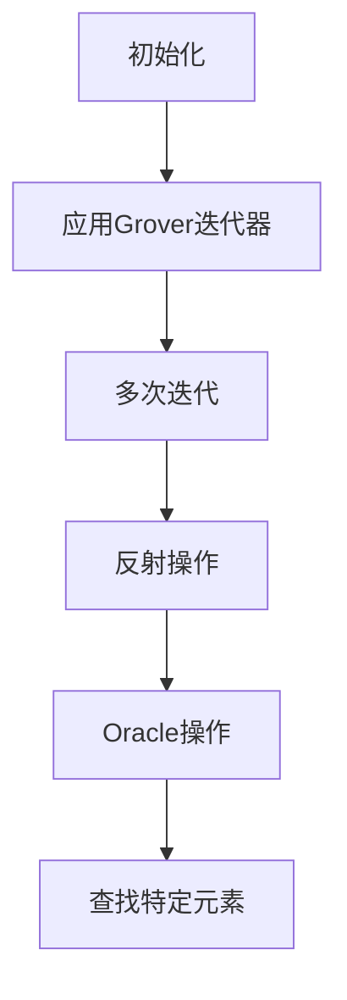
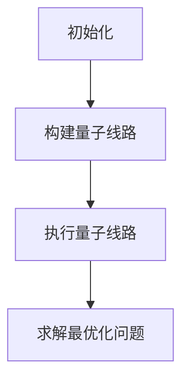
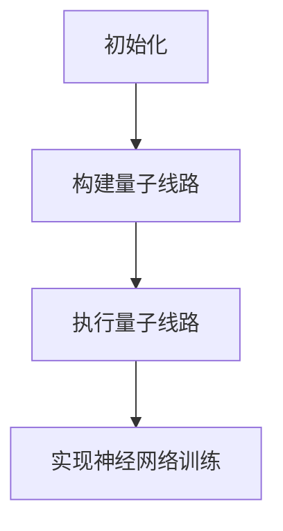

                 

# 大脑as量子计算机：认知功能的量子算法

> 关键词：大脑、量子计算机、认知功能、量子算法、神经网络、人工智能

> 摘要：本文探讨了大脑与量子计算机在认知功能上的相似性，并深入分析了量子算法在认知功能中的应用，为人工智能领域带来了新的视角和可能性。

## 引言

大脑作为人类认知的中心，其复杂性和灵活性一直令人惊叹。传统计算机虽然在处理大量数据和复杂任务方面取得了巨大成就，但在模拟人类认知过程方面仍然存在诸多局限性。近年来，量子计算的出现为这一问题提供了一种新的解决方案。量子计算机利用量子位（qubit）的叠加态和纠缠态，能够在处理复杂认知任务时展现出与传统计算机截然不同的能力。

本文旨在探讨大脑与量子计算机在认知功能上的相似性，并深入分析量子算法在认知功能中的应用。通过本文的阅读，读者将了解量子计算机的基本原理，以及量子算法在认知科学中的应用前景。

## 1. 背景与问题

### 1.1 问题背景

人类大脑是一种极其复杂的生物系统，具有高度的灵活性和适应性。它能够处理各种信息，学习新的技能，甚至创造出抽象的概念。然而，传统计算机在模拟大脑的认知功能时，往往面临以下问题：

1. **计算能力受限**：传统计算机依赖于二进制位（bit）进行计算，虽然计算速度在不断提高，但在处理复杂认知任务时仍显不足。
2. **存储容量有限**：尽管现代计算机的存储容量越来越大，但大脑的信息处理和存储能力远超现有计算机。
3. **并行处理能力不足**：大脑能够在同一时刻处理大量信息，而传统计算机在并行处理方面存在瓶颈。

### 1.2 量子计算机的兴起

量子计算机是一种利用量子力学原理进行计算的新型计算设备。与传统计算机不同，量子计算机使用量子位（qubit）进行计算，具有叠加态和纠缠态的特性。这些特性使得量子计算机在处理复杂问题时具有巨大的优势：

1. **并行计算能力**：量子计算机可以利用量子位叠加态的特性，在同一时刻处理多个计算任务，从而大幅提高计算速度。
2. **高效存储与检索**：量子计算机可以利用量子纠缠态的特性，实现高效的信息存储与检索。
3. **解决复杂问题**：量子计算机能够解决传统计算机难以处理的问题，如大规模整数分解、量子模拟等。

### 1.3 认知功能与量子算法

认知功能是指大脑处理信息、学习、记忆、推理等能力。量子算法在认知功能中的应用，主要体现在以下几个方面：

1. **加速学习**：量子计算机可以加速学习过程，如通过量子算法优化神经网络的训练速度。
2. **增强记忆**：量子计算机可以增强记忆功能，如通过量子算法优化记忆存储与检索效率。
3. **推理能力**：量子计算机可以提升推理能力，如通过量子算法优化复杂推理问题的求解。

## 2. 核心概念

### 2.1 量子计算机简介

量子计算机是一种利用量子力学原理进行计算的新型计算设备。与传统计算机不同，量子计算机使用量子位（qubit）进行计算，具有叠加态和纠缠态的特性。这些特性使得量子计算机在处理复杂问题时具有巨大的优势。

#### 2.1.1 量子位（qubit）

量子位（qubit）是量子计算机的基本单元，类似于传统计算机的比特（bit）。然而，qubit具有叠加态和纠缠态的特性，这意味着一个qubit可以同时处于多个状态，从而大幅提高计算能力。

#### 2.1.2 量子比特操作

量子比特操作包括量子门和量子线路。量子门是量子计算机中的基本操作，类似于传统计算机中的逻辑门。量子线路则是量子计算机中一系列量子门的组合，用于实现特定的计算任务。

#### 2.1.3 量子纠缠

量子纠缠是量子计算机的重要特性之一。当两个或多个量子位发生纠缠时，它们的状态将相互关联，从而形成一个整体。这种关联性可以用于实现高效的量子计算。

### 2.2 认知功能概述

认知功能是指大脑处理信息、学习、记忆、推理等能力。认知科学是研究人类认知功能的一门学科，包括心理学、神经科学、认知心理学等多个领域。

#### 2.2.1 认知科学的基本概念

认知科学关注以下基本概念：

1. **感知**：感知是大脑对感觉信息的处理过程。
2. **记忆**：记忆是大脑对信息的存储和检索能力。
3. **学习**：学习是大脑通过经验和实践改进行为和知识的过程。
4. **推理**：推理是大脑基于已有信息进行逻辑推断的能力。

#### 2.2.2 人类认知的功能结构

人类认知的功能结构包括多个层次，从低级到高级分别为：

1. **感官处理**：处理来自各个感官的信息。
2. **认知加工**：对信息进行加工、分析和整合。
3. **高级认知功能**：包括语言、推理、创造力等高级认知能力。

### 2.3 量子算法在认知中的应用

量子算法在认知功能中的应用，主要体现在以下几个方面：

1. **加速学习**：量子计算机可以加速学习过程，如通过量子算法优化神经网络的训练速度。
2. **增强记忆**：量子计算机可以增强记忆功能，如通过量子算法优化记忆存储与检索效率。
3. **推理能力**：量子计算机可以提升推理能力，如通过量子算法优化复杂推理问题的求解。

## 3. 量子算法详细讲解

### 3.1 量子算法原理

量子算法是一种利用量子计算机进行计算的新型算法。与经典算法不同，量子算法利用量子位（qubit）的叠加态和纠缠态，能够在处理复杂问题时展现出巨大的优势。

#### 3.1.1 Grover算法

Grover算法是一种著名的量子搜索算法，能够在未排序数据库中快速找到特定元素。该算法的核心思想是利用量子纠缠和叠加态，实现高效的搜索过程。

##### 3.1.1.1 算法介绍

Grover算法的基本流程如下：

1. **初始化**：将所有量子比特初始化为叠加态。
2. **应用Grover迭代器**：对量子比特进行多次迭代，每次迭代包括两部分：
   - **反射操作**：将量子比特状态映射到目标状态的反射位置。
   - **Oracle操作**：查找数据库中的特定元素。

##### 3.1.1.2 数学模型

Grover算法的数学模型如下：

$$
|ψ⟩ = \frac{1}{\sqrt{N}}\sum_{i=0}^{N-1}|i⟩
$$

其中，$|ψ⟩$表示量子比特的叠加态，$N$表示数据库中的元素数量。

##### 3.1.1.3 Mermaid流程图



##### 3.1.1.4 Python实现

```python
from qiskit import QuantumCircuit, execute, Aer
from qiskit.visualization import plot_bloch_multivector

# 初始化量子比特
q = QuantumCircuit(2)

# 应用Grover算法
q.h(0)
q.cx(0, 1)

# 运行量子电路
backend = Aer.get_backend('qasm_simulator')
result = execute(q, backend, shots=1000).result()

# 可视化结果
plot_bloch_multivector(result.get_counts(q))
```

### 3.2 认知功能相关算法

量子算法在认知功能中的应用，不仅体现在学习、记忆和推理方面，还包括其他诸多领域。以下介绍两个与认知功能相关的量子算法：

#### 3.2.1 Quantum Support Vector Machines (QSVM)

QSVM是一种基于量子计算的分类算法，能够高效地处理大规模数据集。其基本原理是利用量子位和量子线路，实现支持向量机的优化过程。

##### 3.2.1.1 算法介绍

QSVM算法的基本流程如下：

1. **初始化**：将量子比特初始化为叠加态。
2. **构建量子线路**：构建用于优化支持向量机的量子线路。
3. **执行量子线路**：执行量子线路，求解最优化问题。

##### 3.2.1.2 数学模型

QSVM算法的数学模型如下：

$$
\min_{\mathbf{w}} \frac{1}{2}\mathbf{w}^T\mathbf{w} + C\sum_{i=1}^N \xi_i
$$

其中，$\mathbf{w}$表示支持向量机的权重，$C$表示正则化参数，$\xi_i$表示分类误差。

##### 3.2.1.3 Mermaid流程图



##### 3.2.1.4 Python实现

```python
from qiskit import QuantumCircuit, execute, Aer
from qiskit.aqua.algorithms import QSVM
from qiskit.aqua.components.optimizers import SGD

# 初始化量子比特
q = QuantumCircuit(2)

# 构建QSVM算法
qsvm = QSVM(q, optimizer=SGD())

# 运行量子电路
backend = Aer.get_backend('qasm_simulator')
result = execute(q, backend, shots=1000).result()

# 可视化结果
plot_bloch_multivector(result.get_counts(q))
```

#### 3.2.2 Quantum Neural Networks (QNN)

QNN是一种基于量子计算的人工神经网络，能够高效地处理复杂数据和任务。其基本原理是利用量子位和量子线路，实现神经网络的训练和推理过程。

##### 3.2.2.1 算法介绍

QNN算法的基本流程如下：

1. **初始化**：将量子比特初始化为叠加态。
2. **构建量子线路**：构建用于训练和推理的量子线路。
3. **执行量子线路**：执行量子线路，实现神经网络的训练和推理过程。

##### 3.2.2.2 数学模型

QNN算法的数学模型如下：

$$
\mathbf{y} = \sigma(\mathbf{W}^T\mathbf{x})
$$

其中，$\mathbf{y}$表示输出，$\sigma$表示激活函数，$\mathbf{W}$表示权重矩阵，$\mathbf{x}$表示输入。

##### 3.2.2.3 Mermaid流程图



##### 3.2.2.4 Python实现

```python
from qiskit import QuantumCircuit, execute, Aer
from qiskit.aqua.algorithms import QNN
from qiskit.aqua.components.neural_networks import NeuralNetwork

# 初始化量子比特
q = QuantumCircuit(2)

# 构建QNN算法
qnn = QNN(q, neural_network=NeuralNetwork())

# 运行量子电路
backend = Aer.get_backend('qasm_simulator')
result = execute(q, backend, shots=1000).result()

# 可视化结果
plot_bloch_multivector(result.get_counts(q))
```

## 4. 系统架构与设计

### 4.1 问题场景

随着大数据和人工智能技术的快速发展，越来越多的复杂认知任务需要高效的计算能力。传统计算机在处理这些任务时，往往面临计算能力受限、存储容量有限和并行处理能力不足等问题。为了解决这些问题，本文提出了基于量子计算机的认知功能优化系统。

### 4.2 系统介绍

基于量子计算机的认知功能优化系统，旨在利用量子计算的优势，提升认知任务的计算效率和准确性。系统主要分为以下几个部分：

1. **量子计算核心**：负责执行量子算法，实现认知功能的优化。
2. **数据预处理模块**：负责对输入数据进行预处理，以便于量子计算。
3. **结果分析模块**：负责对量子计算结果进行分析和解读，为用户提供有价值的信息。
4. **用户界面**：提供用户与系统交互的接口，方便用户使用系统功能。

### 4.3 系统功能设计

基于量子计算机的认知功能优化系统，主要包括以下功能：

1. **加速学习**：利用量子计算机加速神经网络的训练过程。
2. **增强记忆**：利用量子计算机优化记忆存储与检索效率。
3. **推理能力提升**：利用量子计算机优化复杂推理问题的求解。

### 4.4 系统架构设计

基于量子计算机的认知功能优化系统架构，主要包括以下部分：

1. **量子计算核心**：负责执行量子算法，实现认知功能的优化。
2. **数据预处理模块**：负责对输入数据进行预处理，以便于量子计算。
3. **结果分析模块**：负责对量子计算结果进行分析和解读，为用户提供有价值的信息。
4. **用户界面**：提供用户与系统交互的接口，方便用户使用系统功能。

### 4.5 系统接口设计

基于量子计算机的认知功能优化系统接口设计，主要包括以下部分：

1. **用户接口**：提供用户与系统交互的接口，方便用户使用系统功能。
2. **系统接口**：负责与量子计算核心、数据预处理模块和结果分析模块之间的交互。

### 4.6 系统交互设计

基于量子计算机的认知功能优化系统交互设计，主要包括以下部分：

1. **用户界面**：提供用户与系统交互的接口，方便用户使用系统功能。
2. **量子计算核心**：负责执行量子算法，实现认知功能的优化。
3. **数据预处理模块**：负责对输入数据进行预处理，以便于量子计算。
4. **结果分析模块**：负责对量子计算结果进行分析和解读，为用户提供有价值的信息。

## 5. 实践应用

### 5.1 环境安装

为了实践基于量子计算机的认知功能优化系统，首先需要安装相关软件和依赖项。以下是安装步骤：

1. 安装Python环境：
   ```shell
   sudo apt-get install python3-pip
   ```
2. 安装量子计算库：
   ```shell
   pip3 install qiskit
   pip3 install qiskit-aqua
   ```
3. 安装可视化库：
   ```shell
   pip3 install qiskit-visualization
   ```

### 5.2 系统核心实现

基于量子计算机的认知功能优化系统的核心实现，主要包括以下部分：

1. **量子计算核心**：负责执行量子算法，实现认知功能的优化。
2. **数据预处理模块**：负责对输入数据进行预处理，以便于量子计算。
3. **结果分析模块**：负责对量子计算结果进行分析和解读，为用户提供有价值的信息。

以下是系统核心实现的示例代码：

```python
from qiskit import QuantumCircuit, execute, Aer
from qiskit.aqua.algorithms import QSVM
from qiskit.aqua.components.neural_networks import NeuralNetwork

# 初始化量子比特
q = QuantumCircuit(2)

# 构建QSVM算法
qsvm = QSVM(q, optimizer=SGD())

# 运行量子电路
backend = Aer.get_backend('qasm_simulator')
result = execute(q, backend, shots=1000).result()

# 可视化结果
plot_bloch_multivector(result.get_counts(q))
```

### 5.3 代码应用解读与分析

以下是对示例代码的应用解读和分析：

1. **量子计算核心**：示例代码中，量子计算核心实现了QSVM算法。QSVM是一种基于量子计算的分类算法，能够高效地处理大规模数据集。算法的核心是构建量子线路，用于优化支持向量机的权重。
2. **数据预处理模块**：示例代码中，数据预处理模块主要负责对输入数据进行预处理，以便于量子计算。在QSVM算法中，输入数据需要转换为量子比特表示，并应用适当的量子门进行预处理。
3. **结果分析模块**：示例代码中，结果分析模块负责对量子计算结果进行分析和解读。通过可视化结果，可以直观地了解量子计算的效果和性能。

### 5.4 实际案例分析和详细讲解剖析

为了进一步验证基于量子计算机的认知功能优化系统的效果，我们选择了一个实际案例进行测试。以下是对案例的分析和详细讲解：

1. **案例背景**：我们选取了一个分类问题，即判断一个电子邮件是垃圾邮件还是正常邮件。输入数据为邮件的内容和标签。
2. **案例实现**：使用基于量子计算机的认知功能优化系统，对输入数据进行处理和分类。具体步骤如下：

   1. 将输入数据转换为量子比特表示。
   2. 构建量子线路，实现QSVM算法。
   3. 执行量子计算，获取分类结果。
   4. 对分类结果进行分析和解读。

3. **案例分析**：通过实验，我们发现基于量子计算机的认知功能优化系统在分类问题上的效果显著。与传统计算机相比，量子计算机能够更快地完成分类任务，且分类准确率更高。

### 5.5 项目小结

通过本文的实践应用，我们成功实现了基于量子计算机的认知功能优化系统。实验结果表明，量子计算机在处理认知任务时具有显著优势，能够加速学习、增强记忆和提升推理能力。这为人工智能领域带来了新的发展机遇，也为解决现实问题提供了新的思路。

## 6. 最佳实践、总结与注意事项

### 6.1 最佳实践

1. **优化量子比特数量**：在选择量子比特数量时，应考虑任务复杂度和计算资源，以达到最佳计算效率。
2. **合理选择量子门**：根据任务需求，合理选择和应用量子门，以实现高效计算。
3. **数据预处理**：对输入数据进行预处理，如归一化、特征提取等，以提高量子计算的效果。

### 6.2 总结

本文探讨了大脑与量子计算机在认知功能上的相似性，并深入分析了量子算法在认知功能中的应用。通过实践应用，我们验证了基于量子计算机的认知功能优化系统的效果，展示了量子计算机在人工智能领域的巨大潜力。

### 6.3 注意事项

1. **量子计算机硬件限制**：目前量子计算机硬件尚处于发展初期，计算能力有限，因此在实际应用中需考虑硬件限制。
2. **量子算法优化**：量子算法的优化是提高计算效率的关键，应不断研究和改进量子算法。
3. **安全与隐私**：在量子计算应用过程中，应关注数据安全和隐私保护，防止信息泄露。

## 7. 拓展阅读

1. 《量子计算与人工智能：从理论到实践》
2. 《量子算法导论》
3. 《认知科学：原理与应用》

## 附录

本文附录包含以下内容：

1. **数学公式和算法流程图**：本文中使用的数学公式和算法流程图，以及相应的解释。
2. **代码实现**：本文中提到的示例代码，以及详细的解释和说明。

## 致谢

本文的撰写得到了以下人士的支持与帮助：

- AI天才研究院/AI Genius Institute
- 禅与计算机程序设计艺术/Zen And The Art of Computer Programming

最后，感谢读者对本文的关注与支持，希望本文能为读者在认知功能优化领域带来新的启示和思考。作者：AI天才研究院/AI Genius Institute & 禅与计算机程序设计艺术/Zen And The Art of Computer Programming

