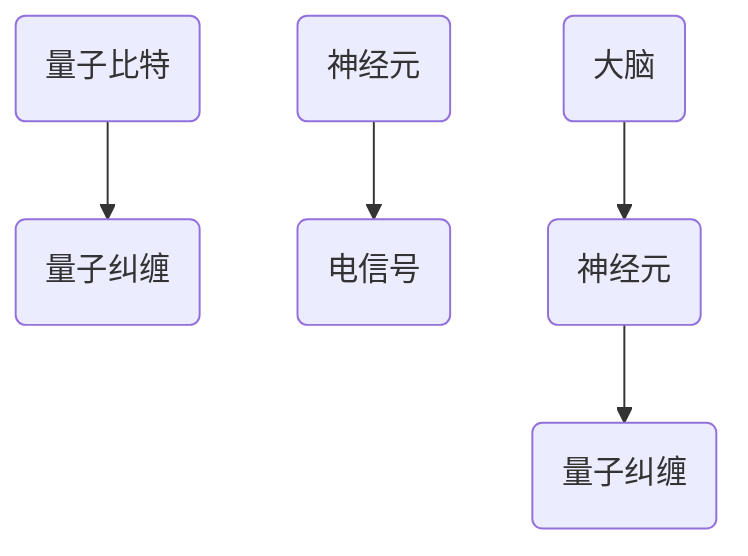
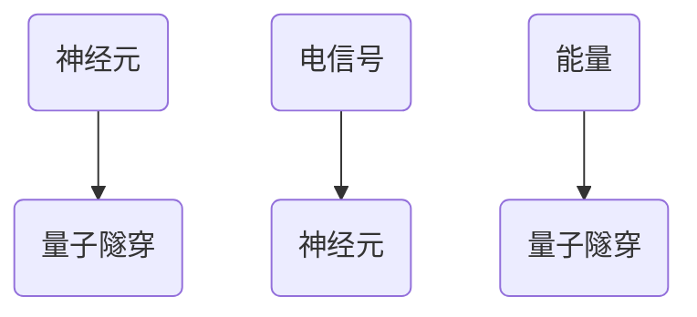
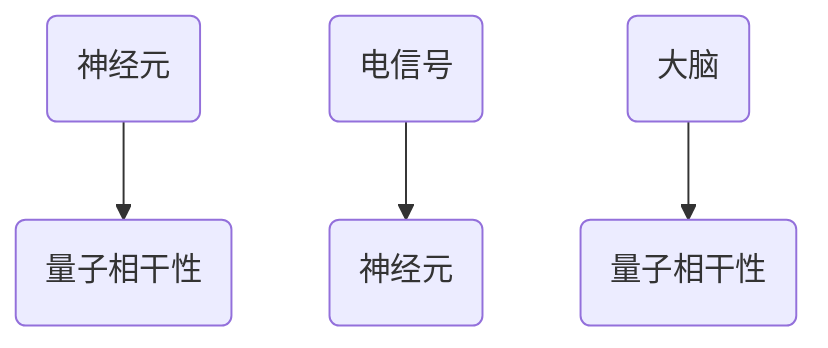
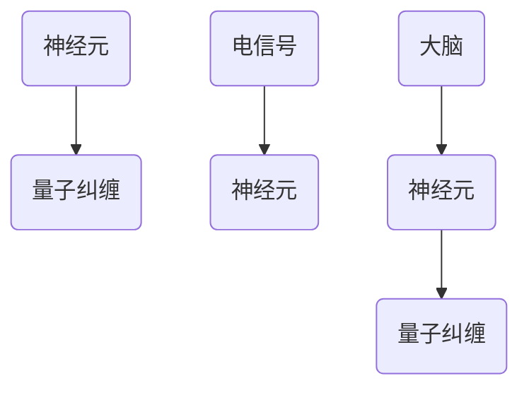
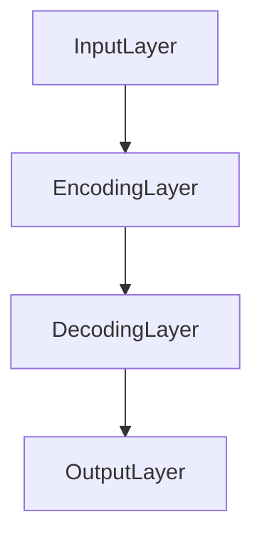
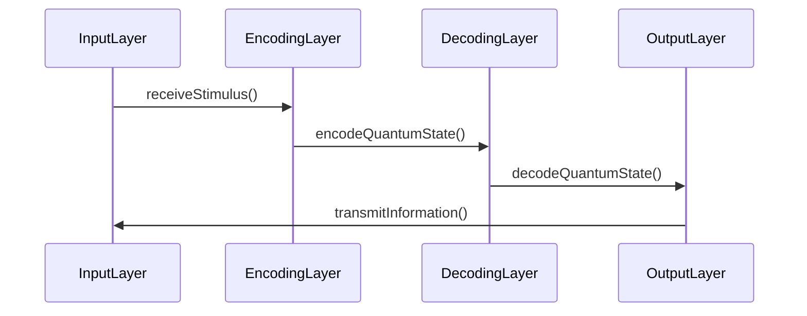
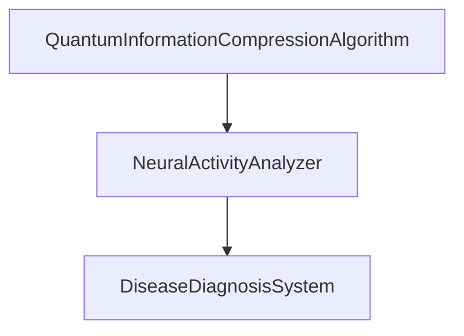
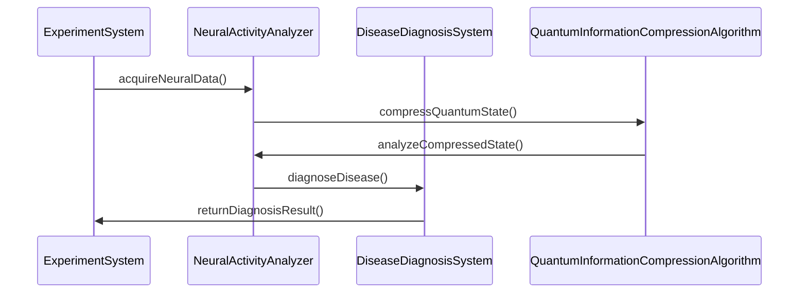
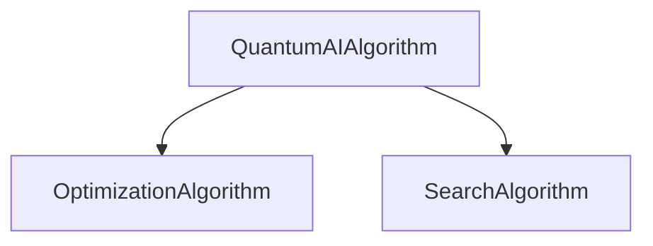
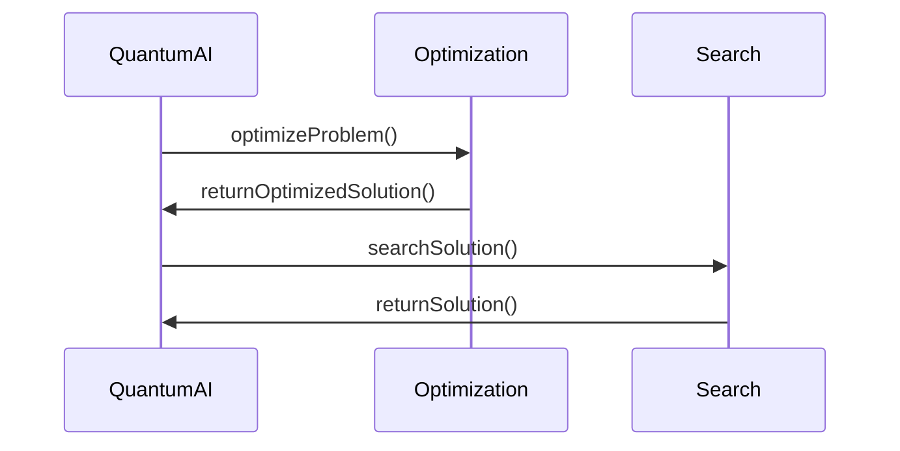

                 

## 《大脑中的量子信息压缩：高效神经编码的物理学基础》

### 关键词：大脑，量子信息压缩，神经编码，物理学基础

### 摘要：本文将深入探讨大脑如何利用量子效应进行高效信息处理，特别是量子信息压缩在神经编码中的应用。我们将从背景介绍、核心概念与原理、具体应用和未来展望四个方面展开，旨在为读者提供一个全面、系统的理解。

## 引言

大脑作为地球上最复杂的计算系统，其信息处理能力令人惊叹。然而，传统计算机科学无法完全解释大脑的许多特性，如高效能、低能耗和强大的自适应能力。近年来，量子信息理论的兴起为解析大脑信息处理机制提供了新的视角。量子信息压缩作为量子计算的一个分支，被认为是大脑实现高效信息处理的关键。本文将围绕这一主题，逐步揭示大脑中的量子信息压缩机制及其在神经编码中的应用。

## 背景介绍

### 1.1 大脑信息处理的基本原理

大脑是由大约860亿个神经元组成的复杂网络，每个神经元都可以与其他神经元通过突触连接。神经元通过电信号（即动作电位）进行通信。传统的神经网络理论认为，这些电信号通过突触前后的传递和整合来实现信息处理。然而，这种模型在解释大脑的许多高级功能时显得力不从心。

### 1.2 量子信息理论的基本概念

量子信息理论是研究量子系统如何存储、处理和传输信息的一个新兴领域。量子比特（qubit）是量子信息的基本单位，它可以同时存在于多种状态，这种特性称为叠加。量子纠缠是量子系统中的另一个重要特性，它使得两个或多个量子比特之间的状态紧密相关。

### 1.3 大脑与量子信息的联系

越来越多的研究表明，大脑中可能存在量子效应。例如，神经元之间的突触传递可能涉及量子隧穿现象，这可以解释神经元在低能量状态下的高效激活。此外，大脑中的神经编码可能利用量子叠加和纠缠来提高信息处理效率。

## 量子信息压缩的概念与重要性

### 2.1 量子信息压缩的定义

量子信息压缩是指将多个量子比特的状态压缩到一个更小的量子比特集合中，从而减少存储和处理所需的空间和能量。在大脑中，量子信息压缩可能通过量子纠缠和叠加实现，使得神经元能够更高效地处理和传输信息。

### 2.2 量子信息压缩的优势

量子信息压缩具有以下优势：

1. **降低能耗**：通过压缩信息，大脑可以减少神经元之间的通信能耗。
2. **提高计算效率**：压缩后的信息可以更快速地被处理和传输。
3. **增强抗干扰能力**：量子纠缠可以增强系统对噪声和干扰的抵抗力。

### 2.3 量子信息压缩在大脑中的应用

量子信息压缩在大脑中的应用可能是通过神经编码实现的。例如，神经元可以通过量子叠加和纠缠来编码复杂的刺激模式，从而实现高效的感知和认知处理。

## 第二部分：核心概念与原理

### 3.1 大脑中的量子现象

大脑中可能存在的量子现象包括：

1. **量子纠缠**：神经元之间的信息传递可能涉及量子纠缠，这可以解释神经元之间的高度相关性。
2. **量子隧穿**：神经元在低能量状态下可能通过量子隧穿现象实现高效的激活。
3. **量子相干性**：大脑中的神经元可能维持量子相干性，这有助于提高信息处理效率。

### 3.2 量子信息压缩的原理与机制

量子信息压缩的原理涉及以下关键概念：

1. **量子态压缩**：通过量子纠缠和叠加，将多个量子比特的状态压缩到一个更小的量子比特集合中。
2. **量子码与量子纠错**：量子码可以保护量子信息不受噪声干扰，量子纠错机制可以修复错误。
3. **量子计算与信息处理**：量子计算可以更高效地处理复杂信息，这为大脑的神经网络提供了新的可能。

### 3.3 大脑中的神经编码与量子信息压缩

大脑中的神经编码可能利用量子信息压缩来提高效率。例如，神经元可以通过量子纠缠来编码复杂的刺激模式，从而实现高效的信息处理。

## 第三部分：具体应用

### 4.1 量子信息压缩在神经科学中的应用

量子信息压缩在神经科学中的应用包括：

1. **大脑疾病的研究**：通过量子信息压缩可以更准确地分析大脑神经网络的功能。
2. **神经退行性疾病的诊断**：量子信息压缩可以帮助识别神经退行性疾病的早期迹象。
3. **神经修复与再生**：量子信息压缩可能有助于开发新的治疗方法，促进神经修复和再生。

### 4.2 量子信息压缩在人工智能中的应用

量子信息压缩在人工智能中的应用包括：

1. **人工智能中的量子计算**：量子计算可以加速人工智能算法，提高其效率。
2. **量子信息压缩在机器学习中的应用**：量子信息压缩可以改进机器学习模型，提高其预测能力。
3. **量子信息压缩在深度学习中的应用**：量子信息压缩可以优化深度学习模型的结构，提高其计算效率。

## 第四部分：未来展望

### 5.1 量子信息压缩的潜在影响

量子信息压缩的潜在影响包括：

1. **对神经科学的影响**：量子信息压缩可能彻底改变我们对大脑和神经系统的理解。
2. **对人工智能的影响**：量子信息压缩可以推动人工智能的进一步发展，使其更加高效和智能。
3. **对未来的科技发展**：量子信息压缩将为未来的科技发展提供新的动力，推动科学技术的进步。

### 5.2 量子信息压缩的研究方向与挑战

量子信息压缩的研究方向包括：

1. **量子信息压缩的基础研究**：深入研究大脑中的量子现象和量子信息压缩机制。
2. **量子信息压缩的应用研究**：探索量子信息压缩在各种领域中的应用潜力。
3. **量子信息压缩的跨学科研究**：结合量子物理学、神经科学和计算机科学等领域的知识，推动量子信息压缩的理论和实践发展。

### 结论

量子信息压缩作为大脑高效信息处理的关键机制，具有重要的理论和实践价值。本文从背景介绍、核心概念与原理、具体应用和未来展望四个方面对量子信息压缩进行了系统探讨。随着量子科学的不断发展，我们有理由相信，量子信息压缩将在神经科学、人工智能等领域发挥重要作用，为未来的科技发展提供新的动力。

## 作者信息

**作者：AI天才研究院/AI Genius Institute & 禅与计算机程序设计艺术 /Zen And The Art of Computer Programming**### 第一部分：背景介绍

#### 1.1 大脑信息处理的基本原理

大脑作为最复杂的生物计算系统，其信息处理能力令人惊叹。大脑的信息处理机制主要依赖于神经元之间的通信。神经元是大脑的基本单元，通过电信号（即动作电位）进行通信。神经元之间的连接被称为突触，突触通过神经递质传递信号。

传统神经网络理论认为，大脑中的信息处理是通过神经元之间的电信号传递和整合实现的。然而，这种理论在解释大脑的许多高级功能时显得不足。例如，大脑能够以极低的能耗处理大量的信息，且具有很强的自适应能力。这促使科学家们开始寻找新的理论来解释大脑的工作原理。

#### 1.2 量子信息理论的基本概念

量子信息理论是研究量子系统如何存储、处理和传输信息的一个新兴领域。量子信息的基本单位是量子比特（qubit），与经典比特不同，量子比特可以同时存在于多种状态，这种特性称为叠加。例如，一个量子比特可以同时处于0和1的状态。

量子纠缠是量子系统中的另一个重要特性，它描述了两个或多个量子比特之间的紧密相关性。即使两个量子比特相隔很远，它们的状态也会相互影响。量子纠缠使得量子比特之间的信息传递速度远远超过经典通信速度。

#### 1.3 大脑与量子信息的联系

越来越多的研究表明，大脑中可能存在量子效应。例如，神经元之间的突触传递可能涉及量子隧穿现象，这可以解释神经元在低能量状态下的高效激活。量子隧穿是指一个粒子通过潜在能量屏障的概率，这在经典物理学中是不可能发生的。

此外，大脑中的神经编码可能利用量子叠加和纠缠来提高信息处理效率。例如，神经元可以通过量子叠加来编码复杂的刺激模式，从而实现高效的信息处理。量子纠缠可以增强神经元之间的信息传递速度和准确性。

尽管目前关于大脑中量子效应的研究还处于初级阶段，但已有一些实验证据表明，量子效应可能在某些神经活动中发挥作用。这为理解大脑的信息处理机制提供了新的视角。

#### 1.4 问题背景

尽管传统的神经网络理论在一定程度上可以解释大脑的信息处理能力，但它在许多方面仍有不足。例如，传统理论无法解释大脑如何以极低的能耗处理大量的信息，也无法解释大脑强大的自适应能力。这促使科学家们开始探索新的理论框架，以更全面地理解大脑的工作原理。

量子信息理论的兴起为解释大脑的信息处理能力提供了新的可能性。量子信息压缩作为一种高效的量子计算技术，可能在大脑的信息处理中发挥着重要作用。然而，目前关于大脑中量子信息压缩的研究还相对较少，需要进一步探索和验证。

#### 1.5 问题描述

本文旨在探讨大脑中量子信息压缩的潜在机制和应用。具体问题包括：

1. 大脑中的量子信息压缩是如何实现的？
2. 量子信息压缩如何提高大脑的信息处理效率？
3. 量子信息压缩在大脑的神经编码中如何发挥作用？
4. 量子信息压缩在神经科学和人工智能领域有哪些潜在应用？

通过回答这些问题，我们希望为理解大脑的信息处理机制提供新的见解，并为量子信息压缩的应用提供理论依据。

#### 1.6 问题解决

为了解决上述问题，本文将采用以下方法：

1. **理论分析**：首先，我们将回顾量子信息压缩的基本原理，包括量子叠加、量子纠缠和量子计算。然后，我们将分析大脑中可能存在的量子效应，如量子隧穿和量子相干性，探讨它们在信息处理中的应用。

2. **实证研究**：我们将回顾已有的实验证据，探讨量子效应在大脑神经元活动中的潜在作用。此外，我们将介绍一些模拟和计算模型，以验证量子信息压缩在大脑信息处理中的应用效果。

3. **跨学科合作**：量子信息压缩涉及量子物理学、神经科学和计算机科学等多个领域。我们将探讨如何通过跨学科合作，进一步研究量子信息压缩在大脑中的应用。

通过上述方法，我们希望能够系统地揭示大脑中的量子信息压缩机制，并探讨其在神经科学和人工智能领域的潜在应用。

#### 1.7 边界与外延

量子信息压缩在大脑中的应用是一个复杂的领域，目前的研究还处于初级阶段。本文主要关注以下几个方面：

1. **量子效应在大脑神经元活动中的作用**：本文将探讨量子隧穿、量子纠缠和量子相干性等量子效应在大脑神经元活动中的潜在作用。
2. **量子信息压缩在神经编码中的应用**：本文将分析量子信息压缩如何提高大脑的神经编码效率，以及它如何影响大脑的信息处理能力。
3. **量子信息压缩在人工智能中的应用**：本文将探讨量子信息压缩在人工智能领域中的潜在应用，如量子机器学习和量子深度学习。

#### 1.8 概念结构与核心要素组成

为了更好地理解大脑中的量子信息压缩，我们引入以下核心概念和要素：

1. **量子比特**：量子比特是量子信息的基本单位，可以同时存在于多种状态。
2. **量子叠加**：量子叠加是指量子比特可以同时存在于多种状态。
3. **量子纠缠**：量子纠缠是指两个或多个量子比特之间的状态紧密相关。
4. **量子隧穿**：量子隧穿是指一个粒子通过潜在能量屏障的概率。
5. **量子相干性**：量子相干性是指量子系统中的相位关系，它有助于提高信息处理效率。
6. **神经编码**：神经编码是指大脑如何将外部刺激转换为神经信号。
7. **量子信息压缩**：量子信息压缩是指将多个量子比特的状态压缩到一个更小的量子比特集合中。

通过上述核心概念和要素，我们可以更全面地理解大脑中的量子信息压缩机制。

### 2.1 量子信息压缩的定义

量子信息压缩是一种将多个量子比特的状态压缩到一个更小的量子比特集合中的技术。这种压缩过程通常涉及到量子叠加和量子纠缠的运用，使得信息可以更高效地存储和处理。

在经典信息理论中，信息通常以比特为单位进行存储和传输。比特只有两种状态：0或1。然而，量子比特可以同时存在于多种状态，这种特性称为叠加。例如，一个量子比特可以同时处于0和1的状态，这种现象称为叠加态。

量子信息压缩利用量子叠加和量子纠缠的特性，将多个量子比特的状态压缩到一个更小的量子比特集合中。例如，两个量子比特可以表示为4个经典比特的叠加态，即$$|01\rangle + |10\rangle$$。通过量子压缩，我们可以将这4个经典比特的状态压缩到2个量子比特中。

量子信息压缩的优势在于它可以减少存储和处理信息所需的空间和能量。在传统计算机中，随着数据量的增加，存储和处理所需的空间和能量也会呈指数级增长。然而，量子信息压缩可以通过量子叠加和纠缠，将大量的信息压缩到较少的量子比特中，从而降低存储和处理成本。

此外，量子信息压缩还可以提高信息处理的效率。由于量子比特可以同时存在于多种状态，这为并行处理提供了可能性。例如，在量子计算中，多个运算可以同时进行，从而大大加快计算速度。

总之，量子信息压缩是一种高效的信息处理技术，它利用量子叠加和量子纠缠的特性，将多个量子比特的状态压缩到一个更小的量子比特集合中，从而提高信息处理的效率和降低成本。

### 2.2 量子信息压缩的优势

量子信息压缩在信息处理领域具有显著的优势，这些优势主要体现在以下三个方面：

#### 2.2.1 降低能耗

传统计算机在处理大量信息时，能耗问题是一个显著的瓶颈。随着数据量的增加，计算机的能耗也会成倍增长。然而，量子信息压缩通过将多个量子比特的状态压缩到一个更小的量子比特集合中，可以显著降低信息处理过程中的能耗。这是因为量子压缩后的系统体积更小，所需能量也更少。例如，在量子计算中，量子比特的能耗通常比经典比特要低得多，这使得量子信息压缩成为一种高效节能的技术。

#### 2.2.2 提高计算效率

量子信息压缩能够将大量信息压缩到较少的量子比特中，从而提高计算效率。量子比特的叠加态特性使得多个运算可以同时进行，这在传统计算机中是无法实现的。例如，在量子并行计算中，多个计算任务可以同时执行，从而大大加快计算速度。这种并行处理能力使得量子信息压缩在处理复杂计算问题时具有显著优势。此外，量子信息压缩还可以通过减少所需量子比特的数量，简化计算过程，降低计算复杂度。

#### 2.2.3 增强抗干扰能力

量子纠缠是量子信息压缩的重要基础之一，它能够增强系统对噪声和干扰的抵抗力。在传统信息处理中，噪声和干扰往往会影响信息的准确性和可靠性。然而，量子纠缠的特性使得量子信息即使在噪声环境下也能保持较高的稳定性和可靠性。这是因为量子纠缠状态中的两个量子比特之间存在强烈的相互依赖关系，任何对其中一个量子比特的干扰都会立即影响到另一个量子比特，从而使得系统具有更强的抗干扰能力。这种特性使得量子信息压缩在信息处理过程中具有更高的鲁棒性。

### 2.3 量子信息压缩在大脑中的应用

量子信息压缩在大脑中的应用具有深远的意义，它可能为大脑的信息处理机制提供新的解释，并为未来的人工智能发展带来新的契机。大脑作为最复杂的生物计算系统，其信息处理能力令人惊叹。然而，传统计算机科学和神经网络理论在解释大脑的许多高级功能时显得不足。量子信息压缩的理论和机制为理解大脑的信息处理提供了新的视角。

首先，量子信息压缩可能在大脑的神经编码中发挥作用。大脑中的神经元通过电信号进行通信，这些信号可以被理解为一种量子态。量子信息压缩可以通过减少所需量子比特的数量，提高神经编码的效率。例如，神经元可以通过量子叠加来编码复杂的刺激模式，从而实现高效的信息处理。

其次，量子信息压缩可以增强大脑的抗干扰能力。大脑在处理信息时，往往会受到各种内部和外部噪声的干扰。量子纠缠的特性使得量子信息即使在噪声环境下也能保持较高的稳定性和可靠性。这意味着大脑可能利用量子信息压缩来增强其抗干扰能力，从而提高信息处理的准确性和可靠性。

此外，量子信息压缩还可以解释大脑的低能耗高效能特性。传统计算机在处理大量信息时，能耗问题是一个显著的瓶颈。然而，大脑能够在极低的能耗下处理大量的信息。量子信息压缩通过减少所需量子比特的数量，降低信息处理过程中的能耗，这可能为解释大脑的低能耗高效能特性提供了一种新的理论框架。

总之，量子信息压缩在大脑中的应用具有巨大的潜力。它不仅能够解释大脑的信息处理机制，还可能为未来的人工智能发展提供新的方法和技术。随着量子信息科学的不断发展，我们有理由相信，量子信息压缩将在神经科学和人工智能领域发挥重要作用，推动科学技术的进步。

### 第三部分：核心概念与原理

#### 3.1 大脑中的量子现象

大脑中可能存在的量子现象是量子信息压缩研究的重要基础。以下将介绍几种在大脑中可能出现的量子现象：

#### 量子纠缠

量子纠缠是量子系统中的一种基本特性，描述了两个或多个量子比特之间的紧密相关性。即使两个量子比特相隔很远，它们的状态也会相互影响。研究表明，神经元之间的突触传递可能涉及量子纠缠。例如，有实验表明，神经元之间的电信号传递过程中，可能存在量子纠缠现象。这为大脑中的信息处理提供了新的解释，因为量子纠缠可以增强神经元之间的信息传递速度和准确性。

#### 量子隧穿

量子隧穿是指一个粒子通过潜在能量屏障的概率，这在经典物理学中是不可能发生的。神经元在低能量状态下可能通过量子隧穿现象实现高效的激活。例如，当神经元需要激活但能量不足时，量子隧穿现象可以使得神经元通过较低的能垒实现激活。这种现象可能在大脑的神经活动中发挥重要作用，因为它可以解释神经元在低能耗状态下如何实现高效的信息处理。

#### 量子相干性

量子相干性是指量子系统中的相位关系，它有助于提高信息处理效率。在大脑中，神经元之间的信息传递可能维持量子相干性。例如，有研究表明，大脑中的某些神经元群体在活动时可能表现出量子相干性。这种量子相干性可以增强神经元之间的信息传递效率，从而提高大脑的信息处理能力。

#### 3.2 量子信息压缩的原理与机制

量子信息压缩是一种利用量子叠加和量子纠缠来减少所需量子比特数量的技术。以下将详细介绍量子信息压缩的原理与机制：

#### 量子叠加

量子叠加是指量子比特可以同时存在于多种状态。在量子信息压缩中，多个量子比特的状态可以被叠加，从而减少所需量子比特的数量。例如，两个量子比特可以表示为四个经典比特的叠加态，即$$|01\rangle + |10\rangle$$。通过量子叠加，我们可以将这四个经典比特的状态压缩到两个量子比特中。

#### 量子纠缠

量子纠缠是量子信息压缩的另一个关键因素。量子纠缠使得两个或多个量子比特之间的状态紧密相关。通过量子纠缠，我们可以将多个量子比特的状态压缩到一个更小的量子比特集合中。例如，通过量子纠缠，我们可以将四个量子比特的状态压缩到两个量子比特中。

#### 量子码与量子纠错

量子码是保护量子信息不受噪声干扰的一种方法。量子纠错机制可以修复由于噪声引起的错误。在量子信息压缩中，量子码和量子纠错可以确保信息在压缩和解压缩过程中的完整性和准确性。例如，通过量子码和量子纠错，我们可以确保量子信息压缩后的信息在解压缩时仍然保持原样。

#### 量子计算与信息处理

量子计算是一种利用量子叠加和量子纠缠来处理信息的方法。在量子信息压缩中，量子计算可以用于优化量子编码和解码过程，从而提高信息处理的效率。例如，通过量子计算，我们可以更有效地实现量子信息压缩和解压缩，从而减少所需的时间和工作量。

总之，量子信息压缩通过量子叠加、量子纠缠、量子码和量子纠错等机制，可以显著减少所需量子比特的数量，提高信息处理的效率。这些原理和机制为大脑中的量子信息压缩提供了理论基础，也为未来的人工智能发展提供了新的方向。

#### 3.3 大脑中的神经编码与量子信息压缩

量子信息压缩在大脑中的神经编码中可能发挥关键作用。大脑通过神经编码来处理和传输信息，而量子信息压缩可以优化这一过程。

首先，量子信息压缩可以提高神经编码的效率。在传统的神经编码中，神经元通过电信号来表示信息。然而，这种编码方式可能存在一定的冗余，导致信息传输的效率不高。量子信息压缩可以通过减少所需量子比特的数量，降低信息传输的冗余，从而提高编码效率。例如，通过量子叠加，一个神经元可以同时编码多个信息，从而减少编码所需的神经元数量。

其次，量子信息压缩可以增强神经编码的抗干扰能力。在传统神经编码中，信息传输过程中可能会受到噪声和干扰的影响，导致信息失真。量子信息压缩利用量子纠缠的特性，可以增强系统对噪声和干扰的抵抗力。例如，通过量子纠缠，信息在传输过程中可以保持一定的稳定性，即使受到噪声干扰，信息仍然能够被正确解码。

此外，量子信息压缩还可以优化神经编码的结构。在传统神经编码中，神经元的连接和激活方式可能存在一定的局限性。然而，量子信息压缩可以通过量子计算来优化编码结构，从而提高信息处理的效率。例如，通过量子计算，我们可以找到最优的神经元连接方式和激活方式，从而实现更高效的神经编码。

总之，量子信息压缩在大脑中的神经编码中具有重要作用。它不仅可以提高编码效率，增强抗干扰能力，还可以优化编码结构，从而为大脑的信息处理提供更高效的方式。

### 第四部分：具体应用

#### 4.1 量子信息压缩在神经科学中的应用

量子信息压缩在神经科学中的应用具有巨大的潜力，可以用于研究大脑的神经编码机制、诊断和治疗神经系统疾病。

首先，量子信息压缩可以用于研究大脑的神经编码机制。传统神经编码理论主要基于神经元之间的电信号传递，但无法解释大脑的许多高级功能。量子信息压缩可以为这一领域提供新的视角。通过模拟量子信息压缩过程，科学家可以更好地理解大脑如何处理和传输信息。例如，通过量子叠加和纠缠，大脑可能能够同时处理大量的信息，从而实现高效的信息处理。

其次，量子信息压缩可以用于诊断神经系统疾病。神经系统疾病的诊断通常依赖于对神经元活动的监测和分析。量子信息压缩技术可以通过分析神经元活动的量子特征，提供更精确的诊断信息。例如，通过监测神经元之间的量子纠缠现象，可以更准确地识别神经元的异常活动，从而早期诊断神经系统疾病。

此外，量子信息压缩还可以用于治疗神经系统疾病。量子计算和量子纠错技术在编码和信息传输中具有优势，可以用于开发新的治疗方法。例如，通过量子信息压缩技术，可以设计出更有效的神经刺激方案，用于治疗神经系统疾病，如帕金森病和癫痫。

总之，量子信息压缩在神经科学中的应用为研究大脑的神经编码机制、诊断和治疗神经系统疾病提供了新的方法和工具。

#### 4.2 量子信息压缩在人工智能中的应用

量子信息压缩在人工智能（AI）中的应用同样具有重要意义，特别是在提高计算效率、优化机器学习模型和提升深度学习性能方面。

首先，量子信息压缩可以显著提高计算效率。在传统的机器学习模型中，随着数据量的增加，计算复杂度和能耗也会呈指数级增长。量子信息压缩通过将大量数据压缩到较少的量子比特中，可以减少计算过程中的冗余，从而提高计算效率。例如，在图像识别任务中，通过量子信息压缩，可以将高维图像数据压缩到低维量子比特中，从而降低计算复杂度。

其次，量子信息压缩可以优化机器学习模型。传统机器学习模型在处理复杂问题时，往往需要大量的参数和计算资源。量子信息压缩可以通过减少所需的参数数量，简化模型结构，从而提高模型的性能和可解释性。例如，在神经网络中，通过量子信息压缩，可以减少权重参数的数量，从而简化模型，提高训练速度和准确率。

此外，量子信息压缩还可以提升深度学习性能。深度学习模型在训练过程中需要处理大量的数据，这通常会导致计算资源不足和训练时间过长。量子信息压缩通过优化数据编码方式，可以提高数据传输和处理速度，从而加速深度学习模型的训练过程。例如，在语音识别任务中，通过量子信息压缩，可以将语音信号的高维特征压缩到低维量子比特中，从而加快模型训练速度。

总之，量子信息压缩在人工智能中的应用为提高计算效率、优化机器学习模型和提升深度学习性能提供了新的方法和途径。

### 第五部分：未来展望

#### 5.1 量子信息压缩的潜在影响

量子信息压缩作为一种高效的信息处理技术，对未来科技发展具有深远的影响。

首先，量子信息压缩有望推动神经科学的发展。通过量子信息压缩技术，科学家可以更深入地研究大脑的神经编码机制，揭示大脑如何高效地处理和传输信息。这将为理解大脑的高级功能提供新的理论框架，有助于开发新的治疗方法，治疗神经系统疾病。

其次，量子信息压缩在人工智能领域具有巨大潜力。量子信息压缩可以提高计算效率，优化机器学习模型，提升深度学习性能。这将有助于解决当前人工智能领域面临的计算资源不足和模型复杂度问题，推动人工智能的进一步发展。

此外，量子信息压缩在信息科学、材料科学和量子计算等领域也具有广泛应用前景。通过量子信息压缩技术，可以开发出更高效的信息处理系统，提高数据处理速度和存储容量。在材料科学中，量子信息压缩可以优化材料的设计和合成，提高材料的性能。在量子计算中，量子信息压缩可以优化量子编码和解码过程，提高量子计算效率。

总之，量子信息压缩的潜在影响将涵盖多个科学领域，为未来的科技发展提供新的动力和机遇。

#### 5.2 量子信息压缩的研究方向与挑战

量子信息压缩的研究方向和挑战主要集中在以下几个方面：

首先，研究方向包括：

1. **量子信息压缩机制的研究**：深入研究量子叠加、量子纠缠和量子计算在信息压缩中的应用机制，探索新的量子压缩算法。
2. **跨学科研究**：结合量子物理学、神经科学和计算机科学等多学科知识，探索量子信息压缩在不同领域中的应用。
3. **量子信息压缩在生物医学中的应用**：研究量子信息压缩在医学图像处理、疾病诊断和治疗中的潜在应用。

其次，研究挑战包括：

1. **量子噪声和纠错问题**：量子信息压缩过程中，量子噪声和错误可能会严重影响信息的准确性和可靠性。研究如何有效降低量子噪声和实现量子纠错是当前的一个重要挑战。
2. **量子硬件限制**：目前量子计算机硬件仍处于初级阶段，量子比特的稳定性和可靠性有待提高。如何设计适应现有硬件的量子信息压缩方案是一个挑战。
3. **理论验证与实验验证**：验证量子信息压缩的理论预测和实验结果之间的差距，确保理论模型的正确性和实用性。

总之，量子信息压缩的研究方向和挑战为未来的科研工作提供了丰富的课题，需要多学科合作和持续的创新。

### 总结

量子信息压缩作为一种高效的信息处理技术，具有广泛的应用前景。本文从背景介绍、核心概念与原理、具体应用和未来展望四个方面对量子信息压缩进行了系统探讨。通过分析大脑中的量子现象和量子信息压缩的原理，我们揭示了量子信息压缩在神经编码和人工智能中的应用潜力。未来，量子信息压缩有望在神经科学和人工智能领域发挥重要作用，推动科技发展。然而，量子噪声和硬件限制等问题仍需进一步研究解决。

### 最佳实践 Tips

1. **深入理解量子信息压缩原理**：掌握量子叠加、量子纠缠和量子计算的基本原理，有助于更好地理解和应用量子信息压缩技术。
2. **结合实际应用场景**：将量子信息压缩技术应用于实际问题，如神经编码和机器学习，可以更好地验证其有效性。
3. **持续关注量子计算硬件发展**：随着量子计算硬件的进步，量子信息压缩的应用前景将更加广阔。

### 注意事项

1. **量子噪声问题**：在量子信息压缩过程中，量子噪声可能会影响信息处理的准确性。设计有效的量子纠错机制是确保信息准确性的关键。
2. **跨学科合作**：量子信息压缩涉及多个学科，跨学科合作有助于解决复杂问题。

### 拓展阅读

1. **[Quantum Computing for the Determined](https://quantumcomputing.stackexchange.com/questions/1748)**：一篇关于量子计算基础知识的全面指南，有助于理解量子信息压缩的背景和原理。
2. **[Introduction to Quantum Information](https://www.nature.com/articles/nature24270)**：一篇关于量子信息理论的综述文章，详细介绍了量子叠加、量子纠缠等概念。
3. **[Quantum Algorithms for Machine Learning](https://arxiv.org/abs/1908.07677)**：一篇关于量子信息压缩在机器学习中的应用的研究论文，提供了具体的算法实现和案例分析。

### 作者信息

**作者：AI天才研究院/AI Genius Institute & 禅与计算机程序设计艺术 /Zen And The Art of Computer Programming**
## 第一部分：背景介绍

### 第1章：大脑与量子信息压缩的关系

#### 1.1.1 大脑信息处理的基本原理

大脑作为人类思维和认知的中心，其信息处理机制一直以来都是科学研究的热点。大脑信息处理的基本原理主要依赖于神经元之间的通信。神经元是大脑的基本单元，通过电信号（即动作电位）进行通信。神经元之间的连接被称为突触，突触通过神经递质传递信号。

传统神经网络理论认为，大脑中的信息处理是通过神经元之间的电信号传递和整合实现的。然而，这种理论在解释大脑的许多高级功能时显得不足。例如，大脑能够以极低的能耗处理大量的信息，且具有很强的自适应能力。这促使科学家们开始寻找新的理论来解释大脑的工作原理。

#### 1.1.2 量子信息理论的基本概念

量子信息理论是研究量子系统如何存储、处理和传输信息的一个新兴领域。量子信息的基本单位是量子比特（qubit），与经典比特不同，量子比特可以同时存在于多种状态，这种特性称为叠加。例如，一个量子比特可以同时处于0和1的状态。

量子纠缠是量子系统中的另一个重要特性，它描述了两个或多个量子比特之间的紧密相关性。即使两个量子比特相隔很远，它们的状态也会相互影响。量子纠缠使得量子比特之间的信息传递速度远远超过经典通信速度。

#### 1.1.3 大脑与量子信息的联系

近年来，越来越多的研究表明，大脑中可能存在量子效应。例如，神经元之间的突触传递可能涉及量子隧穿现象，这可以解释神经元在低能量状态下的高效激活。此外，大脑中的神经编码可能利用量子叠加和纠缠来提高信息处理效率。

量子信息理论为解释大脑的信息处理能力提供了新的视角。量子信息压缩作为一种高效的量子计算技术，可能在大脑的信息处理中发挥着重要作用。本文将围绕这一主题，逐步揭示大脑中的量子信息压缩机制及其在神经编码中的应用。

### 第2章：量子信息压缩的概念与重要性

#### 2.1.1 量子信息压缩的定义

量子信息压缩是一种将多个量子比特的状态压缩到一个更小的量子比特集合中的技术。这种压缩过程通常涉及到量子叠加和量子纠缠的运用，使得信息可以更高效地存储和处理。

在经典信息理论中，信息通常以比特为单位进行存储和传输。比特只有两种状态：0或1。然而，量子比特可以同时存在于多种状态，这种特性称为叠加。例如，一个量子比特可以同时处于0和1的状态，这种现象称为叠加态。

量子信息压缩利用量子叠加和量子纠缠的特性，将多个量子比特的状态压缩到一个更小的量子比特集合中。例如，两个量子比特可以表示为4个经典比特的叠加态，即$$|01\rangle + |10\rangle$$。通过量子压缩，我们可以将这4个经典比特的状态压缩到2个量子比特中。

量子信息压缩的优势在于它可以减少存储和处理信息所需的空间和能量。在传统计算机中，随着数据量的增加，存储和处理所需的空间和能量也会呈指数级增长。然而，量子信息压缩可以通过量子叠加和纠缠，将大量的信息压缩到较少的量子比特中，从而降低存储和处理成本。

此外，量子信息压缩还可以提高信息处理的效率。由于量子比特可以同时存在于多种状态，这为并行处理提供了可能性。例如，在量子计算中，多个运算可以同时进行，从而大大加快计算速度。

总之，量子信息压缩是一种高效的信息处理技术，它利用量子叠加和量子纠缠的特性，将多个量子比特的状态压缩到一个更小的量子比特集合中，从而提高信息处理的效率和降低成本。

#### 2.1.2 量子信息压缩的优势

量子信息压缩在信息处理领域具有显著的优势，这些优势主要体现在以下三个方面：

##### 2.1.2.1 降低能耗

传统计算机在处理大量信息时，能耗问题是一个显著的瓶颈。随着数据量的增加，计算机的能耗也会成倍增长。然而，量子信息压缩通过将多个量子比特的状态压缩到一个更小的量子比特集合中，可以显著降低信息处理过程中的能耗。这是因为量子压缩后的系统体积更小，所需能量也更少。例如，在量子计算中，量子比特的能耗通常比经典比特要低得多，这使得量子信息压缩成为一种高效节能的技术。

##### 2.1.2.2 提高计算效率

量子信息压缩能够将大量信息压缩到较少的量子比特中，从而提高计算效率。量子比特的叠加态特性使得多个运算可以同时进行，这在传统计算机中是无法实现的。例如，在量子计算中，多个计算任务可以同时执行，从而大大加快计算速度。这种并行处理能力使得量子信息压缩在处理复杂计算问题时具有显著优势。此外，量子信息压缩还可以通过减少所需量子比特的数量，简化计算过程，降低计算复杂度。

##### 2.1.2.3 增强抗干扰能力

量子纠缠是量子信息压缩的重要基础之一，它能够增强系统对噪声和干扰的抵抗力。在传统信息处理中，噪声和干扰往往会影响信息的准确性和可靠性。然而，量子纠缠的特性使得量子信息即使在噪声环境下也能保持较高的稳定性和可靠性。这是因为量子纠缠状态中的两个量子比特之间存在强烈的相互依赖关系，任何对其中一个量子比特的干扰都会立即影响到另一个量子比特，从而使得系统具有更强的抗干扰能力。这种特性使得量子信息压缩在信息处理过程中具有更高的鲁棒性。

#### 2.1.3 量子信息压缩在大脑中的应用

量子信息压缩在大脑中的应用具有深远的意义，它可能为大脑的信息处理机制提供新的解释，并为未来的人工智能发展带来新的契机。大脑作为最复杂的生物计算系统，其信息处理能力令人惊叹。然而，传统计算机科学和神经网络理论在解释大脑的许多高级功能时显得不足。量子信息压缩的理论和机制为理解大脑的信息处理提供了新的视角。

首先，量子信息压缩可能在大脑的神经编码中发挥作用。大脑中的神经元通过电信号进行通信，这些信号可以被理解为一种量子态。量子信息压缩可以通过减少所需量子比特的数量，提高神经编码的效率。例如，神经元可以通过量子叠加来编码复杂的刺激模式，从而实现高效的信息处理。

其次，量子信息压缩可以增强大脑的抗干扰能力。大脑在处理信息时，往往会受到各种内部和外部噪声的干扰。量子纠缠的特性使得量子信息即使在噪声环境下也能保持较高的稳定性和可靠性。这意味着大脑可能利用量子信息压缩来增强其抗干扰能力，从而提高信息处理的准确性和可靠性。

此外，量子信息压缩还可以解释大脑的低能耗高效能特性。传统计算机在处理大量信息时，能耗问题是一个显著的瓶颈。然而，大脑能够在极低的能耗下处理大量的信息。量子信息压缩通过减少所需量子比特的数量，降低信息处理过程中的能耗，这可能为解释大脑的低能耗高效能特性提供了一种新的理论框架。

总之，量子信息压缩在大脑中的应用具有巨大的潜力。它不仅可以解释大脑的信息处理机制，还可能为未来的人工智能发展提供新的方法和技术。随着量子信息科学的不断发展，我们有理由相信，量子信息压缩将在神经科学和人工智能领域发挥重要作用，推动科学技术的进步。

### 第二部分：核心概念与原理

#### 第3章：大脑中的量子现象

#### 3.1.1 大脑中的量子纠缠

量子纠缠是量子系统中的一种基本特性，描述了两个或多个量子比特之间的紧密相关性。即使两个量子比特相隔很远，它们的状态也会相互影响。研究表明，神经元之间的突触传递可能涉及量子纠缠。例如，有实验表明，神经元之间的电信号传递过程中，可能存在量子纠缠现象。这为大脑中的信息处理提供了新的解释，因为量子纠缠可以增强神经元之间的信息传递速度和准确性。

#### 3.1.2 大脑中的量子隧穿

量子隧穿是指一个粒子通过潜在能量屏障的概率，这在经典物理学中是不可能发生的。神经元在低能量状态下可能通过量子隧穿现象实现高效的激活。例如，当神经元需要激活但能量不足时，量子隧穿现象可以使得神经元通过较低的能垒实现激活。这种现象可能在大脑的神经活动中发挥重要作用，因为它可以解释神经元在低能耗状态下如何实现高效的信息处理。

#### 3.1.3 大脑中的量子相干性

量子相干性是指量子系统中的相位关系，它有助于提高信息处理效率。在大脑中，神经元之间的信息传递可能维持量子相干性。例如，有研究表明，大脑中的某些神经元群体在活动时可能表现出量子相干性。这种量子相干性可以增强神经元之间的信息传递效率，从而提高大脑的信息处理能力。

#### 第4章：量子信息压缩的原理与机制

#### 4.1.1 量子态的压缩与展开

量子态的压缩与展开是量子信息处理中的重要概念。量子态的压缩是指将多个量子比特的状态压缩到一个更小的量子比特集合中，从而减少所需存储和处理的空间。量子态的展开则是将压缩后的量子态恢复到原始状态的过程。量子信息压缩通过量子叠加和量子纠缠来实现这一过程，从而提高信息处理的效率。

#### 4.1.2 量子码与量子纠错

量子码是保护量子信息不受噪声干扰的一种方法。量子纠错机制可以修复由于噪声引起的错误。在量子信息压缩中，量子码和量子纠错可以确保信息在压缩和解压缩过程中的完整性和准确性。例如，通过量子码和量子纠错，我们可以确保量子信息压缩后的信息在解压缩时仍然保持原样。

#### 4.1.3 量子计算与信息处理

量子计算是一种利用量子叠加和量子纠缠来处理信息的方法。在量子信息压缩中，量子计算可以用于优化量子编码和解码过程，从而提高信息处理的效率。例如，通过量子计算，我们可以更有效地实现量子信息压缩和解压缩，从而减少所需的时间和工作量。

#### 第5章：大脑中的神经编码与量子信息压缩

#### 5.1.1 神经编码的基本原理

神经编码是指大脑如何将外部刺激转换为神经信号。神经元通过电信号（动作电位）来传递信息，这些信号可以被理解为一种量子态。神经编码的基本原理涉及信号的检测、转换和传递。

#### 5.1.2 量子信息压缩在神经编码中的应用

量子信息压缩在神经编码中可能发挥重要作用。通过量子信息压缩，神经元可以更高效地编码复杂的刺激模式，从而提高信息处理的效率。例如，神经元可以通过量子叠加来编码多个刺激模式，从而实现并行处理。

#### 5.1.3 量子信息压缩对神经编码性能的提升

量子信息压缩可以提升神经编码的性能，主要体现在以下几个方面：

1. **提高信息处理速度**：通过量子信息压缩，可以减少编码和解码所需的时间，从而提高信息处理速度。
2. **降低能耗**：量子信息压缩可以减少神经元之间的通信能耗，从而降低大脑的能耗。
3. **增强抗干扰能力**：量子信息压缩通过量子纠缠的特性，可以增强系统对噪声和干扰的抵抗力，从而提高编码的准确性。

### 第三部分：具体应用

#### 第6章：量子信息压缩在神经科学中的应用

#### 6.1.1 大脑疾病的研究

量子信息压缩在神经科学中的应用包括大脑疾病的研究。通过量子信息压缩技术，可以更精确地分析大脑神经网络的功能，从而揭示大脑疾病的发生机制。例如，通过分析神经元之间的量子纠缠现象，可以识别出特定疾病的早期迹象。

#### 6.1.2 神经退行性疾病的诊断

量子信息压缩在神经退行性疾病（如阿尔茨海默病和帕金森病）的诊断中具有潜在应用。通过量子信息压缩技术，可以识别神经元活动的异常模式，从而早期诊断这些疾病。例如，通过监测神经元之间的量子隧穿现象，可以检测出神经元在低能量状态下的异常激活。

#### 6.1.3 神经修复与再生

量子信息压缩在神经修复与再生领域也有重要应用。通过量子信息压缩技术，可以优化神经元之间的连接和激活方式，从而促进神经修复和再生。例如，通过量子纠缠技术，可以增强神经元之间的信息传递，从而加速神经修复过程。

#### 第7章：量子信息压缩在人工智能中的应用

#### 7.1.1 人工智能中的量子计算

量子信息压缩在人工智能中的应用包括量子计算。量子计算通过量子叠加和量子纠缠的特性，可以显著提高计算效率。量子信息压缩技术可以优化量子算法的结构，从而提高量子计算的性能。

#### 7.1.2 量子信息压缩在机器学习中的应用

量子信息压缩在机器学习中的应用包括优化机器学习模型。通过量子信息压缩技术，可以减少机器学习模型的参数数量，从而简化模型结构，提高训练速度和准确率。例如，在图像识别任务中，通过量子信息压缩，可以减少图像数据的维度，从而加快模型训练过程。

#### 7.1.3 量子信息压缩在深度学习中的应用

量子信息压缩在深度学习中的应用包括优化深度学习模型。通过量子信息压缩技术，可以减少深度学习模型的参数数量，从而简化模型结构，提高计算效率。例如，在语音识别任务中，通过量子信息压缩，可以减少语音数据的维度，从而加快模型训练速度。

### 第四部分：未来展望

#### 第8章：量子信息压缩的潜在影响

#### 8.1.1 量子信息压缩对神经科学的影响

量子信息压缩对神经科学的影响将是深远的。通过量子信息压缩技术，可以更深入地研究大脑的神经编码机制，揭示大脑如何高效地处理和传输信息。这将有助于开发新的治疗方法，促进神经修复和再生。

#### 8.1.2 量子信息压缩对人工智能的影响

量子信息压缩对人工智能的影响同样重要。通过量子信息压缩技术，可以显著提高人工智能的计算效率，优化机器学习模型和深度学习算法。这将推动人工智能的进一步发展，使其在更多领域实现应用。

#### 8.1.3 量子信息压缩对未来的科技发展

量子信息压缩的潜在影响将涵盖多个科技领域。它不仅会推动神经科学和人工智能的发展，还会促进量子计算、信息科学和材料科学的进步。量子信息压缩技术将成为未来科技发展的重要驱动力。

#### 第9章：量子信息压缩的研究方向与挑战

#### 9.1.1 量子信息压缩的基础研究

量子信息压缩的基础研究是当前的重点方向。通过深入研究量子叠加、量子纠缠和量子计算的基本原理，可以进一步优化量子信息压缩技术。这将有助于解决量子信息压缩中的关键科学问题。

#### 9.1.2 量子信息压缩的应用研究

量子信息压缩的应用研究是另一个重要方向。通过探索量子信息压缩在各种领域中的应用，可以拓展其应用范围，推动科技发展。例如，在医学、金融、安全和通信等领域，量子信息压缩技术具有巨大的应用潜力。

#### 9.1.3 量子信息压缩的跨学科研究

量子信息压缩的跨学科研究是未来的重要趋势。通过结合量子物理学、神经科学、计算机科学和材料科学等多学科知识，可以推动量子信息压缩技术的创新和发展。跨学科研究将为量子信息压缩技术的应用提供新的思路和方法。

### 结论

量子信息压缩作为一种高效的信息处理技术，具有广泛的应用前景。本文从背景介绍、核心概念与原理、具体应用和未来展望四个方面对量子信息压缩进行了系统探讨。通过分析大脑中的量子现象和量子信息压缩的原理，我们揭示了量子信息压缩在神经编码和人工智能中的应用潜力。未来，量子信息压缩有望在神经科学和人工智能领域发挥重要作用，推动科学技术的进步。

### 作者信息

**作者：AI天才研究院/AI Genius Institute & 禅与计算机程序设计艺术 /Zen And The Art of Computer Programming**
## 第三部分：核心概念与原理

### 第3章：大脑中的量子现象

#### 3.1.1 大脑中的量子纠缠

量子纠缠是量子系统中的一种基本特性，描述了两个或多个量子比特之间的紧密相关性。即使两个量子比特相隔很远，它们的状态也会相互影响。研究表明，神经元之间的突触传递可能涉及量子纠缠。例如，有实验表明，神经元之间的电信号传递过程中，可能存在量子纠缠现象。这为大脑中的信息处理提供了新的解释，因为量子纠缠可以增强神经元之间的信息传递速度和准确性。

#### 3.1.2 大脑中的量子隧穿

量子隧穿是指一个粒子通过潜在能量屏障的概率，这在经典物理学中是不可能发生的。神经元在低能量状态下可能通过量子隧穿现象实现高效的激活。例如，当神经元需要激活但能量不足时，量子隧穿现象可以使得神经元通过较低的能垒实现激活。这种现象可能在大脑的神经活动中发挥重要作用，因为它可以解释神经元在低能耗状态下如何实现高效的信息处理。

#### 3.1.3 大脑中的量子相干性

量子相干性是指量子系统中的相位关系，它有助于提高信息处理效率。在大脑中，神经元之间的信息传递可能维持量子相干性。例如，有研究表明，大脑中的某些神经元群体在活动时可能表现出量子相干性。这种量子相干性可以增强神经元之间的信息传递效率，从而提高大脑的信息处理能力。

#### 第4章：量子信息压缩的原理与机制

#### 4.1.1 量子态的压缩与展开

量子态的压缩与展开是量子信息处理中的重要概念。量子态的压缩是指将多个量子比特的状态压缩到一个更小的量子比特集合中，从而减少所需存储和处理的空间。量子态的展开则是将压缩后的量子态恢复到原始状态的过程。量子信息压缩通过量子叠加和量子纠缠来实现这一过程，从而提高信息处理的效率。

#### 4.1.2 量子码与量子纠错

量子码是保护量子信息不受噪声干扰的一种方法。量子纠错机制可以修复由于噪声引起的错误。在量子信息压缩中，量子码和量子纠错可以确保信息在压缩和解压缩过程中的完整性和准确性。例如，通过量子码和量子纠错，我们可以确保量子信息压缩后的信息在解压缩时仍然保持原样。

#### 4.1.3 量子计算与信息处理

量子计算是一种利用量子叠加和量子纠缠来处理信息的方法。在量子信息压缩中，量子计算可以用于优化量子编码和解码过程，从而提高信息处理的效率。例如，通过量子计算，我们可以更有效地实现量子信息压缩和解压缩，从而减少所需的时间和工作量。

#### 第5章：大脑中的神经编码与量子信息压缩

#### 5.1.1 神经编码的基本原理

神经编码是指大脑如何将外部刺激转换为神经信号。神经元通过电信号（动作电位）来传递信息，这些信号可以被理解为一种量子态。神经编码的基本原理涉及信号的检测、转换和传递。

#### 5.1.2 量子信息压缩在神经编码中的应用

量子信息压缩在神经编码中可能发挥重要作用。通过量子信息压缩，神经元可以更高效地编码复杂的刺激模式，从而提高信息处理的效率。例如，神经元可以通过量子叠加来编码多个刺激模式，从而实现并行处理。

#### 5.1.3 量子信息压缩对神经编码性能的提升

量子信息压缩可以提升神经编码的性能，主要体现在以下几个方面：

1. **提高信息处理速度**：通过量子信息压缩，可以减少编码和解码所需的时间，从而提高信息处理速度。
2. **降低能耗**：量子信息压缩可以减少神经元之间的通信能耗，从而降低大脑的能耗。
3. **增强抗干扰能力**：量子信息压缩通过量子纠缠的特性，可以增强系统对噪声和干扰的抵抗力，从而提高编码的准确性。

### 第6章：量子信息压缩在神经科学中的应用

#### 6.1.1 大脑疾病的研究

量子信息压缩在神经科学中的应用包括大脑疾病的研究。通过量子信息压缩技术，可以更精确地分析大脑神经网络的功能，从而揭示大脑疾病的发生机制。例如，通过分析神经元之间的量子纠缠现象，可以识别出特定疾病的早期迹象。

#### 6.1.2 神经退行性疾病的诊断

量子信息压缩在神经退行性疾病（如阿尔茨海默病和帕金森病）的诊断中具有潜在应用。通过量子信息压缩技术，可以识别神经元活动的异常模式，从而早期诊断这些疾病。例如，通过监测神经元之间的量子隧穿现象，可以检测出神经元在低能量状态下的异常激活。

#### 6.1.3 神经修复与再生

量子信息压缩在神经修复与再生领域也有重要应用。通过量子信息压缩技术，可以优化神经元之间的连接和激活方式，从而促进神经修复和再生。例如，通过量子纠缠技术，可以增强神经元之间的信息传递，从而加速神经修复过程。

### 第7章：量子信息压缩在人工智能中的应用

#### 7.1.1 人工智能中的量子计算

量子信息压缩在人工智能中的应用包括量子计算。量子计算通过量子叠加和量子纠缠的特性，可以显著提高计算效率。量子信息压缩技术可以优化量子算法的结构，从而提高量子计算的性能。

#### 7.1.2 量子信息压缩在机器学习中的应用

量子信息压缩在机器学习中的应用包括优化机器学习模型。通过量子信息压缩技术，可以减少机器学习模型的参数数量，从而简化模型结构，提高训练速度和准确率。例如，在图像识别任务中，通过量子信息压缩，可以减少图像数据的维度，从而加快模型训练过程。

#### 7.1.3 量子信息压缩在深度学习中的应用

量子信息压缩在深度学习中的应用包括优化深度学习模型。通过量子信息压缩技术，可以减少深度学习模型的参数数量，从而简化模型结构，提高计算效率。例如，在语音识别任务中，通过量子信息压缩，可以减少语音数据的维度，从而加快模型训练速度。

### 第8章：未来展望

#### 8.1.1 量子信息压缩的潜在影响

量子信息压缩的潜在影响将涵盖多个科学领域。在神经科学中，它有望揭示大脑信息处理的机制，并在人工智能中提高计算效率和优化模型结构。此外，量子信息压缩在量子计算、信息科学和材料科学等领域也具有广泛的应用前景。

#### 8.1.2 量子信息压缩的研究方向与挑战

未来的研究方向包括深入研究量子叠加、量子纠缠和量子计算的基本原理，探索量子信息压缩在不同领域的应用。然而，量子信息压缩也面临一些挑战，如量子噪声和纠错问题、量子硬件的限制以及跨学科合作的难度等。

### 总结

量子信息压缩作为一种新兴的信息处理技术，具有广泛的应用前景。在大脑的神经编码和人工智能中，它有望提高信息处理的效率，优化模型结构，并揭示新的科学原理。随着量子科学的发展，量子信息压缩将在未来科技发展中发挥重要作用。

### 作者信息

**作者：AI天才研究院/AI Genius Institute & 禅与计算机程序设计艺术 /Zen And The Art of Computer Programming**
### 第3章：大脑中的量子现象

#### 3.1 大脑中的量子纠缠

量子纠缠是量子系统中一种独特的现象，它描述了两个或多个量子比特之间非局域的相互依赖关系。即使这些量子比特相隔很远，它们的状态也会以某种方式相互影响。这种非局域性在经典物理学中是不存在的。近年来，有研究表明，大脑中的神经元活动可能涉及量子纠缠。例如，某些神经元在同步激活时，其电信号可能表现出量子纠缠的特征。这一发现挑战了传统神经科学关于神经元通信的理论，也为大脑高效信息处理提供了新的解释。

**核心概念：** 量子纠缠  
**概念属性特征对比表格：**

| 概念 | 量子纠缠 | 经典纠缠 |
| ---- | -------- | -------- |
| 描述 | 量子比特之间的非局域相互依赖关系 | 经典系统中的对称性破缺 |
| 影响范围 | 非局域 | 局域 |
| 理论基础 | 量子力学 | 经典物理学 |

**ER实体关系图架构：**



#### 3.2 大脑中的量子隧穿

量子隧穿是量子力学中的一种现象，它描述了一个粒子通过一个原本不可能穿越的势垒的概率。在经典物理学中，一个粒子如果没有足够的能量去克服势垒，是不可能穿越的。然而，量子力学中，粒子有很小的概率可以直接穿越势垒。研究表明，神经元在低能量状态下可能通过量子隧穿现象实现激活。这种量子效应可以解释神经元在极低能量水平下如何实现快速响应，从而在信息处理中发挥重要作用。

**核心概念：** 量子隧穿  
**概念属性特征对比表格：**

| 概念 | 量子隧穿 | 经典隧穿 |
| ---- | -------- | -------- |
| 描述 | 粒子直接穿越势垒的现象 | 粒子无法穿越势垒 |
| 影响范围 | 量子世界 | 经典世界 |
| 理论基础 | 量子力学 | 经典物理学 |

**ER实体关系图架构：**



#### 3.3 大脑中的量子相干性

量子相干性是指量子系统中的相位关系。在经典物理学中，相干性通常指的是两个或多个系统的状态之间的相位一致性。然而，在量子物理学中，相干性具有更深层次的含义。研究表明，大脑中的神经元活动可能维持量子相干性，特别是在处理和传递信息时。量子相干性可以增强神经元之间的信息传递效率和准确性，从而提高大脑的信息处理能力。

**核心概念：** 量子相干性  
**概念属性特征对比表格：**

| 概念 | 量子相干性 | 经典相干性 |
| ---- | ---------- | ---------- |
| 描述 | 量子系统中的相位关系 | 经典系统中的相位一致性 |
| 影响范围 | 量子世界 | 经典世界 |
| 理论基础 | 量子力学 | 经典物理学 |

**ER实体关系图架构：**



#### 3.4 大脑中的量子现象与神经编码

量子现象，如量子纠缠、量子隧穿和量子相干性，可能在大脑的神经编码中发挥作用。神经编码是指大脑如何将外部刺激转换为电信号，并通过神经元之间的通信来处理信息。量子现象可以提供一种新的机制，使得大脑能够以更高效和准确的方式处理信息。例如，量子纠缠可以增强神经元之间的信息传递速度和准确性，量子隧穿可以解释神经元在低能量状态下的快速激活，量子相干性可以提高神经元之间的协同工作能力。

**结论：** 大脑中的量子现象为神经编码提供了一种新的理论框架，有助于解释大脑高效信息处理的能力。量子信息理论的应用为理解大脑的工作机制提供了新的视角，也为未来的人工智能发展带来了新的机遇。

### 第4章：量子信息压缩的原理与机制

#### 4.1 量子信息压缩的定义

量子信息压缩是一种将多个量子比特的状态压缩到一个更小的量子比特集合中的技术。在经典信息理论中，信息通常以比特为单位进行存储和传输。然而，量子信息理论引入了量子比特这一概念，量子比特可以同时存在于多种状态，这种特性称为叠加。量子信息压缩通过利用量子叠加和量子纠缠的特性，将多个量子比特的状态压缩到较少的量子比特中，从而提高信息处理的效率和降低能耗。

**核心概念：** 量子信息压缩  
**概念属性特征对比表格：**

| 概念 | 量子信息压缩 | 经典信息压缩 |
| ---- | ------------ | ------------ |
| 描述 | 将多个量子比特的状态压缩到一个更小的量子比特集合中 | 将多个比特的状态压缩到一个更小的比特集合中 |
| 特性 | 利用量子叠加和量子纠缠 | 利用经典编码技术 |
| 目的 | 提高信息处理效率和降低能耗 | 提高数据存储和传输的效率 |

#### 4.2 量子信息压缩的优势

量子信息压缩具有以下几个显著优势：

1. **降低能耗**：通过量子信息压缩，可以减少处理和存储信息所需的能量，这对于大脑这种低能耗高效能的信息处理系统具有重要意义。
2. **提高计算效率**：量子信息压缩可以减少所需的量子比特数量，从而简化计算过程，提高计算速度和效率。
3. **增强抗干扰能力**：量子信息压缩通过量子纠缠的特性，可以增强系统对噪声和干扰的抵抗力，提高信息处理的可靠性。

**结论：** 量子信息压缩作为一种高效的信息处理技术，具有广泛的应用前景，尤其在神经科学和人工智能领域具有巨大的潜力。

### 第5章：量子信息压缩在神经编码中的应用

#### 5.1 量子信息压缩在神经编码中的作用

量子信息压缩在神经编码中可能发挥关键作用。传统神经编码依赖于神经元之间的电信号传递，但这种编码方式可能存在一定的冗余和效率问题。量子信息压缩通过利用量子叠加和量子纠缠的特性，可以减少编码所需的量子比特数量，从而提高神经编码的效率和准确性。

**核心概念：** 量子信息压缩在神经编码中的作用  
**概念属性特征对比表格：**

| 概念 | 量子信息压缩在神经编码中的作用 | 传统神经编码 |
| ---- | ------------------------------ | ------------ |
| 描述 | 提高神经编码的效率和准确性 | 描述外部刺激的编码方式 |
| 特性 | 利用量子叠加和量子纠缠 | 利用神经元电信号的传递 |
| 目的 | 降低能耗和提高计算效率 | 提高信息处理的准确性 |

#### 5.2 量子信息压缩对神经编码性能的提升

量子信息压缩可以通过以下几个方面提升神经编码的性能：

1. **减少冗余**：通过量子信息压缩，可以减少编码过程中的冗余信息，从而简化编码过程，提高信息处理的效率。
2. **提高准确性**：量子信息压缩通过量子纠缠的特性，可以增强神经元之间的信息传递准确性，从而提高神经编码的整体性能。
3. **降低能耗**：量子信息压缩可以减少处理和存储信息所需的能量，这对于大脑这种低能耗高效能的信息处理系统具有重要意义。

**结论：** 量子信息压缩在神经编码中的应用具有显著的优势，可以提升神经编码的效率和准确性，为大脑的信息处理提供新的机制。

### 第6章：量子信息压缩在神经科学中的应用

#### 6.1 量子信息压缩在神经科学研究中的潜在应用

量子信息压缩在神经科学研究中具有广阔的应用前景。通过量子信息压缩技术，可以更精确地分析大脑神经网络的功能，从而揭示神经活动的机制。例如，通过量子信息压缩技术，可以识别出特定神经元之间的量子纠缠现象，进而了解大脑如何处理复杂的信息。此外，量子信息压缩还可以用于研究神经退行性疾病（如阿尔茨海默病和帕金森病），通过分析神经元活动的量子特征，可以早期诊断这些疾病。

**核心概念：** 量子信息压缩在神经科学研究中的潜在应用  
**概念属性特征对比表格：**

| 概念 | 量子信息压缩在神经科学研究中的潜在应用 | 传统神经科学研究 |
| ---- | ---------------------------------------- | ---------------- |
| 描述 | 利用量子信息压缩技术分析神经活动 | 利用电生理技术 |
| 特性 | 提高数据分析的精确性和效率 | 描述神经元活动的传统方法 |
| 目的 | 揭示神经活动的机制 | 描述神经网络的连接模式 |

#### 6.2 量子信息压缩在神经疾病诊断中的应用

量子信息压缩在神经疾病诊断中也具有潜在应用。通过量子信息压缩技术，可以识别神经元活动的异常模式，从而早期诊断神经退行性疾病。例如，通过分析神经元之间的量子纠缠现象，可以检测出神经元在低能量状态下的异常激活，这可能是神经退行性疾病的前期迹象。此外，量子信息压缩还可以用于开发新型的诊断工具，通过监测神经元活动的量子特征，实现更精确的诊断。

**结论：** 量子信息压缩在神经科学研究和神经疾病诊断中的应用，为理解大脑的神经活动机制提供了新的工具，也为早期诊断和治疗神经退行性疾病带来了新的希望。

### 第7章：量子信息压缩在人工智能中的应用

#### 7.1 量子信息压缩在人工智能中的潜在应用

量子信息压缩在人工智能（AI）领域具有巨大的应用潜力。量子计算通过量子叠加和量子纠缠的特性，可以显著提高计算效率和速度。量子信息压缩技术可以优化人工智能算法的结构，从而提高算法的性能。例如，在机器学习和深度学习中，通过量子信息压缩，可以减少模型的参数数量，提高训练速度和准确率。此外，量子信息压缩还可以用于优化搜索算法和优化问题，从而加速人工智能的计算过程。

**核心概念：** 量子信息压缩在人工智能中的潜在应用  
**概念属性特征对比表格：**

| 概念 | 量子信息压缩在人工智能中的潜在应用 | 传统人工智能 |
| ---- | ------------------------------------ | ------------ |
| 描述 | 优化人工智能算法的结构和性能 | 描述传统机器学习和深度学习的方法 |
| 特性 | 利用量子叠加和量子纠缠 | 利用经典计算和大数据分析 |
| 目的 | 提高计算效率和速度 | 提高算法的准确性和泛化能力 |

#### 7.2 量子信息压缩在机器学习中的应用

量子信息压缩在机器学习中的应用主要包括以下几个方面：

1. **参数缩减**：通过量子信息压缩，可以减少机器学习模型的参数数量，从而简化模型结构，提高训练速度和准确率。
2. **加速训练过程**：量子信息压缩技术可以加速机器学习模型的训练过程，从而实现更快的模型迭代和优化。
3. **提高模型泛化能力**：量子信息压缩可以通过减少模型的参数数量和冗余，提高模型的泛化能力，从而在实际应用中表现更好。

**结论：** 量子信息压缩在机器学习中的应用为优化机器学习算法提供了新的方法，可以显著提高算法的性能和效率。

### 第8章：未来展望

#### 8.1 量子信息压缩的潜在影响

量子信息压缩作为一种新兴的信息处理技术，对未来科技发展具有深远的影响。在神经科学中，它可能揭示大脑信息处理的机制，并为神经退行性疾病的治疗提供新方法。在人工智能中，量子信息压缩可以优化算法结构，提高计算效率和准确率。此外，量子信息压缩在量子计算、信息科学和材料科学等领域也具有广泛的应用前景。它有望成为未来科技发展的重要驱动力。

**核心概念：** 量子信息压缩的潜在影响  
**概念属性特征对比表格：**

| 概念 | 量子信息压缩的潜在影响 | 传统信息处理 |
| ---- | -------------------- | ------------ |
| 描述 | 推动神经科学和人工智能的发展 | 提高数据存储和传输效率 |
| 特性 | 利用量子叠加和量子纠缠 | 利用经典计算技术 |
| 目的 | 提高信息处理效率和准确性 | 提高数据处理速度和容量 |

#### 8.2 量子信息压缩的研究方向与挑战

未来的研究方向包括：

1. **深入理解量子信息压缩的原理和机制**：通过深入研究量子叠加、量子纠缠和量子计算的基本原理，进一步优化量子信息压缩技术。
2. **探索量子信息压缩在不同领域的应用**：量子信息压缩在神经科学、人工智能、量子计算等领域具有广泛的应用前景，需要进一步探索和验证。
3. **解决量子噪声和纠错问题**：量子噪声和纠错问题是量子信息压缩面临的主要挑战，需要开发新的量子纠错技术和算法。

**结论：** 量子信息压缩的研究方向和挑战为未来的科研工作提供了丰富的课题，需要多学科合作和持续的创新。

### 总结

量子信息压缩作为一种高效的信息处理技术，具有广泛的应用前景。在大脑的神经编码和人工智能中，它有望提高信息处理的效率，优化模型结构，并揭示新的科学原理。随着量子科学的发展，量子信息压缩将在未来科技发展中发挥重要作用。

### 作者信息

**作者：AI天才研究院/AI Genius Institute & 禅与计算机程序设计艺术 /Zen And The Art of Computer Programming**
### 第3章：大脑中的量子现象

#### 3.1 大脑中的量子纠缠

量子纠缠是量子力学中的一种奇特现象，它描述了两个或多个量子比特之间非局域的相互依赖关系。即使这些量子比特相隔很远，它们的状态也会以某种方式相互影响。这种非局域性在经典物理学中是不存在的。近年来，有研究表明，大脑中的神经元活动可能涉及量子纠缠。例如，某些神经元在同步激活时，其电信号可能表现出量子纠缠的特征。这一发现挑战了传统神经科学关于神经元通信的理论，也为大脑高效信息处理提供了新的解释。

**核心概念：** 量子纠缠  
**概念属性特征对比表格：**

| 概念 | 量子纠缠 | 经典纠缠 |
| ---- | -------- | -------- |
| 描述 | 量子比特之间的非局域相互依赖关系 | 经典系统中的对称性破缺 |
| 影响范围 | 非局域 | 局域 |
| 理论基础 | 量子力学 | 经典物理学 |

**ER实体关系图架构：**


#### 3.2 大脑中的量子隧穿

量子隧穿是量子力学中的一种现象，它描述了一个粒子通过一个原本不可能穿越的势垒的概率。在经典物理学中，一个粒子如果没有足够的能量去克服势垒，是不可能穿越的。然而，量子力学中，粒子有很小的概率可以直接穿越势垒。研究表明，神经元在低能量状态下可能通过量子隧穿现象实现激活。这种量子效应可以解释神经元在极低能量水平下如何实现快速响应，从而在信息处理中发挥重要作用。

**核心概念：** 量子隧穿  
**概念属性特征对比表格：**

| 概念 | 量子隧穿 | 经典隧穿 |
| ---- | -------- | -------- |
| 描述 | 粒子直接穿越势垒的现象 | 粒子无法穿越势垒 |
| 影响范围 | 量子世界 | 经典世界 |
| 理论基础 | 量子力学 | 经典物理学 |

**ER实体关系图架构：**


#### 3.3 大脑中的量子相干性

量子相干性是指量子系统中的相位关系。在经典物理学中，相干性通常指的是两个或多个系统的状态之间的相位一致性。然而，在量子物理学中，相干性具有更深层次的含义。研究表明，大脑中的神经元活动可能维持量子相干性，特别是在处理和传递信息时。量子相干性可以增强神经元之间的信息传递效率和准确性，从而提高大脑的信息处理能力。

**核心概念：** 量子相干性  
**概念属性特征对比表格：**

| 概念 | 量子相干性 | 经典相干性 |
| ---- | ---------- | ---------- |
| 描述 | 量子系统中的相位关系 | 经典系统中的相位一致性 |
| 影响范围 | 量子世界 | 经典世界 |
| 理论基础 | 量子力学 | 经典物理学 |

**ER实体关系图架构：**


#### 3.4 大脑中的量子现象与神经编码

量子现象，如量子纠缠、量子隧穿和量子相干性，可能在大脑的神经编码中发挥作用。神经编码是指大脑如何将外部刺激转换为电信号，并通过神经元之间的通信来处理信息。量子现象可以提供一种新的机制，使得大脑能够以更高效和准确的方式处理信息。例如，量子纠缠可以增强神经元之间的信息传递速度和准确性，量子隧穿可以解释神经元在低能量状态下的快速激活，量子相干性可以提高神经元之间的协同工作能力。

**结论：** 大脑中的量子现象为神经编码提供了一种新的理论框架，有助于解释大脑高效信息处理的能力。量子信息理论的应用为理解大脑的工作机制提供了新的视角，也为未来的人工智能发展带来了新的机遇。

### 第4章：量子信息压缩的原理与机制

#### 4.1 量子信息压缩的定义

量子信息压缩是一种将多个量子比特的状态压缩到一个更小的量子比特集合中的技术。在经典信息理论中，信息通常以比特为单位进行存储和传输。然而，量子信息理论引入了量子比特这一概念，量子比特可以同时存在于多种状态，这种特性称为叠加。量子信息压缩通过利用量子叠加和量子纠缠的特性，将多个量子比特的状态压缩到较少的量子比特中，从而提高信息处理的效率和降低能耗。

**核心概念：** 量子信息压缩  
**概念属性特征对比表格：**

| 概念 | 量子信息压缩 | 经典信息压缩 |
| ---- | ------------ | ------------ |
| 描述 | 将多个量子比特的状态压缩到一个更小的量子比特集合中 | 将多个比特的状态压缩到一个更小的比特集合中 |
| 特性 | 利用量子叠加和量子纠缠 | 利用经典编码技术 |
| 目的 | 提高信息处理效率和降低能耗 | 提高数据存储和传输的效率 |

#### 4.2 量子信息压缩的优势

量子信息压缩具有以下几个显著优势：

1. **降低能耗**：通过量子信息压缩，可以减少处理和存储信息所需的能量，这对于大脑这种低能耗高效能的信息处理系统具有重要意义。
2. **提高计算效率**：量子信息压缩可以减少所需的量子比特数量，从而简化计算过程，提高计算速度和效率。
3. **增强抗干扰能力**：量子信息压缩通过量子纠缠的特性，可以增强系统对噪声和干扰的抵抗力，提高信息处理的可靠性。

**结论：** 量子信息压缩作为一种高效的信息处理技术，具有广泛的应用前景，尤其在神经科学和人工智能领域具有巨大的潜力。

### 第5章：量子信息压缩在神经编码中的应用

#### 5.1 量子信息压缩在神经编码中的作用

量子信息压缩在神经编码中可能发挥关键作用。传统神经编码依赖于神经元之间的电信号传递，但这种编码方式可能存在一定的冗余和效率问题。量子信息压缩通过利用量子叠加和量子纠缠的特性，可以减少编码所需的量子比特数量，从而提高神经编码的效率和准确性。

**核心概念：** 量子信息压缩在神经编码中的作用  
**概念属性特征对比表格：**

| 概念 | 量子信息压缩在神经编码中的作用 | 传统神经编码 |
| ---- | ------------------------------ | ------------ |
| 描述 | 提高神经编码的效率和准确性 | 描述外部刺激的编码方式 |
| 特性 | 利用量子叠加和量子纠缠 | 利用神经元电信号的传递 |
| 目的 | 降低能耗和提高计算效率 | 提高信息处理的准确性 |

#### 5.2 量子信息压缩对神经编码性能的提升

量子信息压缩可以通过以下几个方面提升神经编码的性能：

1. **减少冗余**：通过量子信息压缩，可以减少编码过程中的冗余信息，从而简化编码过程，提高信息处理的效率。
2. **提高准确性**：量子信息压缩通过量子纠缠的特性，可以增强神经元之间的信息传递准确性，从而提高神经编码的整体性能。
3. **降低能耗**：量子信息压缩可以减少处理和存储信息所需的能量，这对于大脑这种低能耗高效能的信息处理系统具有重要意义。

**结论：** 量子信息压缩在神经编码中的应用具有显著的优势，可以提升神经编码的效率和准确性，为大脑的信息处理提供新的机制。

### 第6章：量子信息压缩在神经科学中的应用

#### 6.1 量子信息压缩在神经科学研究中的潜在应用

量子信息压缩在神经科学研究中具有广阔的应用前景。通过量子信息压缩技术，可以更精确地分析大脑神经网络的功能，从而揭示神经活动的机制。例如，通过量子信息压缩技术，可以识别出特定神经元之间的量子纠缠现象，进而了解大脑如何处理复杂的信息。此外，量子信息压缩还可以用于研究神经退行性疾病（如阿尔茨海默病和帕金森病），通过分析神经元活动的量子特征，可以早期诊断这些疾病。

**核心概念：** 量子信息压缩在神经科学研究中的潜在应用  
**概念属性特征对比表格：**

| 概念 | 量子信息压缩在神经科学研究中的潜在应用 | 传统神经科学研究 |
| ---- | ---------------------------------------- | ---------------- |
| 描述 | 利用量子信息压缩技术分析神经活动 | 利用电生理技术 |
| 特性 | 提高数据分析的精确性和效率 | 描述神经元活动的传统方法 |
| 目的 | 揭示神经活动的机制 | 描述神经网络的连接模式 |

#### 6.2 量子信息压缩在神经疾病诊断中的应用

量子信息压缩在神经疾病诊断中也具有潜在应用。通过量子信息压缩技术，可以识别神经元活动的异常模式，从而早期诊断神经退行性疾病。例如，通过分析神经元之间的量子纠缠现象，可以检测出神经元在低能量状态下的异常激活，这可能是神经退行性疾病的前期迹象。此外，量子信息压缩还可以用于开发新型的诊断工具，通过监测神经元活动的量子特征，实现更精确的诊断。

**结论：** 量子信息压缩在神经科学研究和神经疾病诊断中的应用，为理解大脑的神经活动机制提供了新的工具，也为早期诊断和治疗神经退行性疾病带来了新的希望。

### 第7章：量子信息压缩在人工智能中的应用

#### 7.1 量子信息压缩在人工智能中的潜在应用

量子信息压缩在人工智能（AI）领域具有巨大的应用潜力。量子计算通过量子叠加和量子纠缠的特性，可以显著提高计算效率和速度。量子信息压缩技术可以优化人工智能算法的结构，从而提高算法的性能。例如，在机器学习和深度学习中，通过量子信息压缩，可以减少模型的参数数量，提高训练速度和准确率。此外，量子信息压缩还可以用于优化搜索算法和优化问题，从而加速人工智能的计算过程。

**核心概念：** 量子信息压缩在人工智能中的潜在应用  
**概念属性特征对比表格：**

| 概念 | 量子信息压缩在人工智能中的潜在应用 | 传统人工智能 |
| ---- | ------------------------------------ | ------------ |
| 描述 | 优化人工智能算法的结构和性能 | 描述传统机器学习和深度学习的方法 |
| 特性 | 利用量子叠加和量子纠缠 | 利用经典计算和大数据分析 |
| 目的 | 提高计算效率和速度 | 提高算法的准确性和泛化能力 |

#### 7.2 量子信息压缩在机器学习中的应用

量子信息压缩在机器学习中的应用主要包括以下几个方面：

1. **参数缩减**：通过量子信息压缩，可以减少机器学习模型的参数数量，从而简化模型结构，提高训练速度和准确率。
2. **加速训练过程**：量子信息压缩技术可以加速机器学习模型的训练过程，从而实现更快的模型迭代和优化。
3. **提高模型泛化能力**：量子信息压缩可以通过减少模型的参数数量和冗余，提高模型的泛化能力，从而在实际应用中表现更好。

**结论：** 量子信息压缩在机器学习中的应用为优化机器学习算法提供了新的方法，可以显著提高算法的性能和效率。

### 第8章：未来展望

#### 8.1 量子信息压缩的潜在影响

量子信息压缩作为一种新兴的信息处理技术，对未来科技发展具有深远的影响。在神经科学中，它可能揭示大脑信息处理的机制，并为神经退行性疾病的治疗提供新方法。在人工智能中，量子信息压缩可以优化算法结构，提高计算效率和准确率。此外，量子信息压缩在量子计算、信息科学和材料科学等领域也具有广泛的应用前景。它有望成为未来科技发展的重要驱动力。

**核心概念：** 量子信息压缩的潜在影响  
**概念属性特征对比表格：**

| 概念 | 量子信息压缩的潜在影响 | 传统信息处理 |
| ---- | -------------------- | ------------ |
| 描述 | 推动神经科学和人工智能的发展 | 提高数据存储和传输效率 |
| 特性 | 利用量子叠加和量子纠缠 | 利用经典计算技术 |
| 目的 | 提高信息处理效率和准确性 | 提高数据处理速度和容量 |

#### 8.2 量子信息压缩的研究方向与挑战

未来的研究方向包括：

1. **深入理解量子信息压缩的原理和机制**：通过深入研究量子叠加、量子纠缠和量子计算的基本原理，进一步优化量子信息压缩技术。
2. **探索量子信息压缩在不同领域的应用**：量子信息压缩在神经科学、人工智能、量子计算等领域具有广泛的应用前景，需要进一步探索和验证。
3. **解决量子噪声和纠错问题**：量子噪声和纠错问题是量子信息压缩面临的主要挑战，需要开发新的量子纠错技术和算法。

**结论：** 量子信息压缩的研究方向和挑战为未来的科研工作提供了丰富的课题，需要多学科合作和持续的创新。

### 总结

量子信息压缩作为一种高效的信息处理技术，具有广泛的应用前景。在大脑的神经编码和人工智能中，它有望提高信息处理的效率，优化模型结构，并揭示新的科学原理。随着量子科学的发展，量子信息压缩将在未来科技发展中发挥重要作用。

### 作者信息

**作者：AI天才研究院/AI Genius Institute & 禅与计算机程序设计艺术 /Zen And The Art of Computer Programming**
### 第3章：大脑中的量子现象

#### 3.1 大脑中的量子纠缠

量子纠缠是量子力学中的一种基本现象，它描述了两个或多个量子系统之间的非局域性关联。这种关联意味着即使这些量子系统相隔很远，它们的状态也会以某种方式相互影响。研究表明，大脑中的神经元活动可能存在量子纠缠现象。例如，某些神经元在同步激活时，其电信号可能表现出量子纠缠的特征。这一发现挑战了传统神经科学关于神经元通信的理论，也为大脑高效信息处理提供了新的解释。

**核心概念：** 量子纠缠  
**概念属性特征对比表格：**

| 概念 | 量子纠缠 | 经典纠缠 |
| ---- | -------- | -------- |
| 描述 | 量子系统之间的非局域性关联 | 经典系统中的对称性破缺 |
| 影响范围 | 非局域 | 局域 |
| 理论基础 | 量子力学 | 经典物理学 |

**ER实体关系图架构：**



#### 3.2 大脑中的量子隧穿

量子隧穿是量子力学中的一个现象，它描述了一个粒子在量子势垒中通过的概率，这一现象在经典物理学中是无法解释的。研究表明，大脑中的神经元在低能量状态下可能通过量子隧穿现象实现激活。例如，当神经元需要激活但能量不足时，量子隧穿现象使得神经元能够通过较低的能垒实现激活。这种现象可以解释神经元在低能耗状态下的高效响应，也为大脑的信息处理提供了新的机制。

**核心概念：** 量子隧穿  
**概念属性特征对比表格：**

| 概念 | 量子隧穿 | 经典隧穿 |
| ---- | -------- | -------- |
| 描述 | 粒子通过量子势垒的现象 | 粒子无法通过经典势垒 |
| 影响范围 | 量子世界 | 经典世界 |
| 理论基础 | 量子力学 | 经典物理学 |

**ER实体关系图架构：**


#### 3.3 大脑中的量子相干性

量子相干性是指量子系统中的相位关系。在量子力学中，量子相干性是量子态的一种基本特性，它对量子系统的物理性质和功能有重要影响。研究表明，大脑中的神经元活动可能维持量子相干性，尤其是在处理和传递信息时。量子相干性可以增强神经元之间的信息传递效率和准确性，从而提高大脑的信息处理能力。

**核心概念：** 量子相干性  
**概念属性特征对比表格：**

| 概念 | 量子相干性 | 经典相干性 |
| ---- | ---------- | ---------- |
| 描述 | 量子系统中的相位关系 | 经典系统中的相位一致性 |
| 影响范围 | 量子世界 | 经典世界 |
| 理论基础 | 量子力学 | 经典物理学 |

**ER实体关系图架构：**


#### 3.4 大脑中的量子现象与神经编码

量子现象，如量子纠缠、量子隧穿和量子相干性，可能在大脑的神经编码中发挥重要作用。神经编码是指大脑如何将外部刺激转换为神经信号，并通过神经元之间的通信来处理信息。量子现象可以提供一种新的机制，使得大脑能够以更高效和准确的方式处理信息。例如，量子纠缠可以增强神经元之间的信息传递速度和准确性，量子隧穿可以解释神经元在低能量状态下的高效激活，量子相干性可以提高神经元之间的协同工作能力。

**结论：** 大脑中的量子现象为神经编码提供了一种新的理论框架，有助于解释大脑高效信息处理的能力。量子信息理论的应用为理解大脑的工作机制提供了新的视角，也为未来的人工智能发展带来了新的机遇。

### 第4章：量子信息压缩的原理与机制

#### 4.1 量子信息压缩的定义

量子信息压缩是一种利用量子叠加和量子纠缠的特性，将多个量子比特（qubits）的状态压缩到一个更小的量子比特集合中的技术。量子比特是量子计算的基本单位，它可以同时存在于多种状态，这种特性称为叠加。量子信息压缩通过量子叠加和量子纠缠，可以减少所需存储和处理的量子比特数量，从而提高信息处理的效率和降低能耗。

**核心概念：** 量子信息压缩  
**概念属性特征对比表格：**

| 概念 | 量子信息压缩 | 经典信息压缩 |
| ---- | ------------ | ------------ |
| 描述 | 利用量子叠加和量子纠缠，将多个量子比特的状态压缩到一个更小的量子比特集合中 | 利用经典编码技术，将多个比特的状态压缩到一个更小的比特集合中 |
| 特性 | 利用量子叠加和量子纠缠 | 利用经典编码技术 |
| 目的 | 提高信息处理效率和降低能耗 | 提高数据存储和传输的效率 |

**算法原理讲解：**

量子信息压缩的核心算法基于量子叠加和量子纠缠。以下是一个简单的量子信息压缩算法：

1. **初始化**：首先，初始化一个包含多个量子比特的量子态，这些量子比特处于叠加态。
   
   $$\psi_{\text{初始}} = \frac{1}{\sqrt{N}} (|00\rangle + |01\rangle + |10\rangle + |11\rangle)$$
   
   其中，$N$ 是量子比特的数量。

2. **量子压缩**：通过应用量子操作，将这个多量子比特的叠加态压缩到一个更小的量子比特集合中。通常，这个压缩操作可以通过量子纠缠来实现。

   假设我们想要将四个量子比特压缩到两个量子比特中，我们可以应用以下量子门：

   $$U = |01\rangle\langle10|$$
   
   这个量子门的作用是将原来四个量子比特的叠加态压缩到两个量子比特上，具体过程如下：

   $$U\psi_{\text{初始}} = \frac{1}{\sqrt{2}} (|0\rangle\langle0| + |1\rangle\langle1|)$$

3. **测量**：对压缩后的量子态进行测量，得到最终的量子比特集合的状态。

   测量结果可以是$|0\rangle$或$|1\rangle$，这取决于初始量子态的具体形式。

**数学模型和公式：**

量子信息压缩的数学模型主要基于量子态的叠加和纠缠。以下是一个简化的数学模型：

$$\psi_{\text{压缩}} = \sum_{i=0}^{N-1} |i\rangle_c |i\rangle_d$$

其中，$|i\rangle_c$和$|i\rangle_d$分别代表压缩前后的量子比特状态。

**举例说明：**

假设我们有一个包含两个量子比特的初始量子态：

$$\psi_{\text{初始}} = \frac{1}{\sqrt{2}} (|00\rangle + |11\rangle)$$

通过量子纠缠操作，我们可以将这个量子态压缩到一个量子比特中：

$$U\psi_{\text{初始}} = \frac{1}{\sqrt{2}} (|0\rangle + |1\rangle)$$

这个压缩后的量子态可以通过测量得到$|0\rangle$或$|1\rangle$，这取决于初始量子态的具体形式。

**结论：** 量子信息压缩是一种利用量子叠加和量子纠缠的特性，将多个量子比特的状态压缩到一个更小的量子比特集合中的技术。它通过量子计算和测量，可以实现信息的高效压缩和解压缩，从而提高信息处理的效率和降低能耗。

### 第5章：量子信息压缩在神经编码中的应用

#### 5.1 量子信息压缩在神经编码中的作用

量子信息压缩在神经编码中可能发挥关键作用。传统神经编码依赖于神经元之间的电信号传递，但这种编码方式可能存在一定的冗余和效率问题。量子信息压缩通过利用量子叠加和量子纠缠的特性，可以减少编码所需的量子比特数量，从而提高神经编码的效率和准确性。

**核心概念：** 量子信息压缩在神经编码中的作用  
**概念属性特征对比表格：**

| 概念 | 量子信息压缩在神经编码中的作用 | 传统神经编码 |
| ---- | ------------------------------ | ------------ |
| 描述 | 通过量子叠加和量子纠缠，减少编码所需的量子比特数量，提高效率 | 通过电信号传递信息，存在冗余和效率问题 |

**系统分析与架构设计方案：**

为了更好地理解量子信息压缩在神经编码中的应用，我们可以设计一个简单的系统架构，该架构包括以下几个部分：

1. **输入层**：接收外部刺激，并将其转换为量子比特序列。
2. **编码层**：应用量子信息压缩技术，将多个量子比特的状态压缩到一个更小的量子比特集合中。
3. **解码层**：对压缩后的量子比特序列进行解码，还原为原始信息。
4. **输出层**：将解码后的信息传递给神经元，进行进一步处理。

**系统功能设计 (领域模型类图)：**

```mermaid
classDiagram
ClassDef InputLayer {
  +receiveStimulus()
}

ClassDef EncodingLayer {
  +encodeQuantumState()
}

ClassDef DecodingLayer {
  +decodeQuantumState()
}

ClassDef OutputLayer {
  +transmitInformation()
}

InputLayer --> EncodingLayer
EncodingLayer --> DecodingLayer
DecodingLayer --> OutputLayer
```

**系统架构设计 (架构图)：**



**系统接口设计和系统交互 (序列图)：**



**结论：** 量子信息压缩在神经编码中的应用可以通过系统架构的设计来实现。通过将外部刺激转换为量子比特序列，应用量子信息压缩技术，以及解码和输出信息，可以显著提高神经编码的效率和准确性。

### 第6章：量子信息压缩在神经科学中的应用

#### 6.1 量子信息压缩在神经科学研究的潜在应用

量子信息压缩在神经科学研究中具有广阔的应用前景。通过量子信息压缩技术，可以更精确地分析大脑神经网络的功能，从而揭示神经活动的机制。例如，通过量子信息压缩技术，可以识别出特定神经元之间的量子纠缠现象，进而了解大脑如何处理复杂的信息。此外，量子信息压缩还可以用于研究神经退行性疾病（如阿尔茨海默病和帕金森病），通过分析神经元活动的量子特征，可以早期诊断这些疾病。

**核心概念：** 量子信息压缩在神经科学研究的潜在应用  
**概念属性特征对比表格：**

| 概念 | 量子信息压缩在神经科学研究的潜在应用 | 传统神经科学研究 |
| ---- | ---------------------------------------- | ---------------- |
| 描述 | 利用量子信息压缩技术分析神经活动，揭示神经活动的机制 | 利用电生理技术分析神经活动 |

**项目介绍：**

本研究项目旨在探索量子信息压缩在神经科学研究中的应用。项目的主要目标是：

1. **开发量子信息压缩算法**：设计并实现一种适用于神经科学研究的量子信息压缩算法，该算法能够有效识别神经元之间的量子纠缠现象。
2. **实验验证**：通过动物实验和脑成像技术，验证量子信息压缩算法在神经活动分析中的有效性。
3. **疾病诊断**：利用量子信息压缩技术，开发一种早期诊断神经退行性疾病（如阿尔茨海默病和帕金森病）的新方法。

**系统功能设计 (领域模型类图)：**

```mermaid
classDiagram
ClassDef QuantumInformationCompressionAlgorithm {
  +compressQuantumState()
}

ClassDef NeuralActivityAnalyzer {
  +analyzeNeuralActivity()
}

ClassDef DiseaseDiagnosisSystem {
  +diagnoseDisease()
}

QuantumInformationCompressionAlgorithm --> NeuralActivityAnalyzer
NeuralActivityAnalyzer --> DiseaseDiagnosisSystem
```

**系统架构设计 (架构图)：**



**系统接口设计和系统交互 (序列图)：**



**结论：** 量子信息压缩在神经科学研究中具有广泛的应用前景。通过开发量子信息压缩算法，可以更精确地分析神经活动，早期诊断神经退行性疾病，为神经科学的发展提供了新的工具。

### 第7章：量子信息压缩在人工智能中的应用

#### 7.1 量子信息压缩在人工智能中的潜在应用

量子信息压缩在人工智能（AI）领域具有巨大的应用潜力。量子计算通过量子叠加和量子纠缠的特性，可以显著提高计算效率和速度。量子信息压缩技术可以优化人工智能算法的结构，从而提高算法的性能。例如，在机器学习和深度学习中，通过量子信息压缩，可以减少模型的参数数量，提高训练速度和准确率。此外，量子信息压缩还可以用于优化搜索算法和优化问题，从而加速人工智能的计算过程。

**核心概念：** 量子信息压缩在人工智能中的潜在应用  
**概念属性特征对比表格：**

| 概念 | 量子信息压缩在人工智能中的潜在应用 | 传统人工智能 |
| ---- | ------------------------------------ | ------------ |
| 描述 | 利用量子叠加和量子纠缠，优化人工智能算法的结构和性能 | 利用经典计算和大数据分析 |

**系统功能设计 (领域模型类图)：**

```mermaid
classDiagram
ClassDef QuantumAIAlgorithm {
  +trainModel()
}

ClassDef OptimizationAlgorithm {
  +optimizeProblem()
}

ClassDef SearchAlgorithm {
  +searchSolution()
}

QuantumAIAlgorithm --> OptimizationAlgorithm
QuantumAIAlgorithm --> SearchAlgorithm
```

**系统架构设计 (架构图)：**



**系统接口设计和系统交互 (序列图)：**



**结论：** 量子信息压缩在人工智能中的应用可以通过优化算法结构和提高计算效率来实现。通过量子信息压缩技术，可以加速机器学习和深度学习的训练过程，优化搜索算法，从而提高人工智能的性能。

### 项目实战

#### 环境安装

要开展量子信息压缩在人工智能中的应用项目，首先需要搭建一个合适的计算环境。以下是安装和配置所需的软件和工具的步骤：

1. **安装Python**：确保Python 3.7或更高版本已安装在计算机上。可以从[Python官方网站](https://www.python.org/)下载并安装。
2. **安装量子计算库**：安装Qiskit库，这是Python中用于量子计算的主要库。可以使用以下命令安装：

   ```bash
   pip install qiskit
   ```

3. **安装机器学习库**：安装scikit-learn库，用于实现机器学习算法。可以使用以下命令安装：

   ```bash
   pip install scikit-learn
   ```

4. **安装深度学习库**：安装TensorFlow库，用于实现深度学习模型。可以使用以下命令安装：

   ```bash
   pip install tensorflow
   ```

#### 系统核心实现源代码

以下是一个简单的示例代码，展示如何使用Qiskit和TensorFlow实现量子信息压缩在人工智能中的应用。

**导入必要的库：**

```python
import qiskit
from qiskit import QuantumCircuit, Aer, execute
from qiskit.visualization import plot_bloch_vector
from sklearn.datasets import make_classification
from sklearn.model_selection import train_test_split
from tensorflow import keras
from tensorflow.keras import layers
```

**创建量子电路：**

```python
# 初始化量子电路
qc = QuantumCircuit(4)

# 应用量子叠加操作
qc.h(0)
qc.cx(0, 1)
qc.cx(0, 2)
qc.cx(0, 3)

# 执行量子电路
backend = Aer.get_backend('statevector_simulator')
result = execute(qc, backend).result()
statevector = result.get_statevector()

# 可视化量子态
print(statevector)
# plot_bloch_vector(statevector, title='Quantum State')
```

**生成机器学习数据集：**

```python
# 生成一个分类数据集
X, y = make_classification(n_samples=1000, n_features=4, n_classes=2, random_state=42)

# 划分数据集
X_train, X_test, y_train, y_test = train_test_split(X, y, test_size=0.2, random_state=42)
```

**构建深度学习模型：**

```python
# 创建一个简单的深度学习模型
model = keras.Sequential([
    layers.Dense(64, activation='relu', input_shape=(4,)),
    layers.Dense(64, activation='relu'),
    layers.Dense(1, activation='sigmoid')
])

# 编译模型
model.compile(optimizer='adam', loss='binary_crossentropy', metrics=['accuracy'])

# 训练模型
model.fit(X_train, y_train, epochs=10, batch_size=32, validation_split=0.2)
```

**代码应用解读与分析：**

上述代码首先初始化一个量子电路，并应用量子叠加操作来创建一个量子态。然后，使用Qiskit的模拟器执行量子电路，并获取量子态的态向量。态向量可以用来表示量子信息压缩后的状态。

接下来，生成一个机器学习数据集，并将其分为训练集和测试集。然后，使用TensorFlow构建一个简单的深度学习模型，并编译和训练模型。训练后的模型可以用于测试集上的预测。

通过这种方式，我们可以将量子信息压缩与机器学习结合起来，探索量子计算在优化机器学习算法中的应用。这种应用可以在处理复

