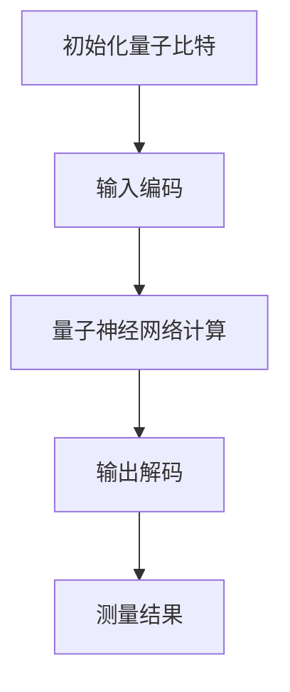

                 

# 大脑中的量子信息处理：神经编码的新范式

> 关键词：量子信息处理、大脑、神经编码、算法原理、应用场景

> 摘要：本文从量子信息处理与大脑的关联出发，探讨了神经编码的基本原理，分析了量子信息处理与神经编码的联系，深入讲解了量子神经编码的算法原理及其在实验研究中的应用，最后展望了量子神经编码的未来发展前景。

----------------------------------------------------------------

## 第一部分: 引言与背景介绍

### 第1章: 量子信息处理与大脑

#### 1.1 量子信息处理的基本概念

量子信息处理是一种基于量子力学原理的信息处理方式，它利用量子位（qubit）的叠加态和纠缠态来存储和处理信息。与传统计算机使用二进制位（bit）不同，量子计算机可以同时处理大量的信息，从而实现快速的计算和处理。

#### 1.2 大脑信息处理机制的启示

大脑作为人类信息处理的高级中枢，其信息处理机制对量子信息处理的研究具有重要的启示。大脑通过神经元之间的连接和神经编码来实现复杂的信息处理任务，这种机制与量子计算机的原理有相似之处。

#### 1.3 量子信息处理在神经科学中的应用前景

量子信息处理在神经科学中的应用前景广阔。通过模拟大脑中的量子信息处理机制，可以更好地理解大脑的工作原理，为神经编码的研究提供新的视角和方法。

## 第二部分: 神经编码的基本原理

### 第2章: 神经编码的基本原理

#### 2.1 神经编码的基本概念

神经编码是指将外界刺激转换为大脑内部神经活动的过程。神经元通过电信号和化学信号来传递和处理信息，从而实现对外界刺激的编码。

#### 2.2 神经编码的机制

神经编码的机制主要包括突触传递、神经元间的连接和神经元的激活模式等。这些机制共同作用，实现了对信息的编码、传输和解释。

#### 2.3 神经编码的类型与特点

神经编码的类型包括电编码、化学编码和模式编码等。每种编码方式都有其独特的特点和应用场景。

#### 2.4 神经编码的数学模型

神经编码的数学模型主要包括概率模型、神经网络模型和生成模型等。这些模型可以帮助我们更好地理解和模拟神经编码的过程。

## 第三部分: 量子信息处理与神经编码的联系

### 第3章: 量子信息处理与神经编码的联系

#### 3.1 量子信息处理与神经编码的共同点

量子信息处理与神经编码在信息处理机制、信息存储和传输等方面有许多共同之处。

#### 3.2 量子信息处理与神经编码的差异

尽管量子信息处理与神经编码有许多共同之处，但它们也存在显著的区别，如工作原理、实现机制和应用领域等。

#### 3.3 量子信息处理在神经编码中的应用

量子信息处理可以为神经编码的研究提供新的理论框架和方法，有望推动神经科学的发展。

## 第四部分: 量子神经编码的算法原理

### 第4章: 量子神经编码的算法原理

#### 4.1 量子神经编码的基本概念

量子神经编码是指利用量子信息处理机制来实现神经编码的过程。

#### 4.2 量子神经编码的算法框架

量子神经编码的算法框架主要包括量子神经网络、量子生成对抗网络等。

#### 4.3 量子神经编码的算法原理

量子神经编码的算法原理基于量子位、叠加态、纠缠态等量子力学原理，通过模拟大脑中的信息处理机制来实现信息编码。

#### 4.4 量子神经编码的数学模型和公式

量子神经编码的数学模型和公式包括量子门、量子逻辑运算、量子态的叠加和纠缠等。

## 第五部分: 量子神经编码的实验研究

### 第5章: 量子神经编码的实验研究

#### 5.1 量子神经编码实验的研究方法

量子神经编码实验的研究方法主要包括量子计算实验、脑成像实验和神经生理实验等。

#### 5.2 量子神经编码实验的典型案例

本文将介绍几个典型的量子神经编码实验案例，分析其实验结果和意义。

#### 5.3 量子神经编码实验的结果与分析

通过实验研究，我们可以验证量子神经编码的理论，探索其在神经科学中的应用价值。

## 第六部分: 量子神经编码的应用场景

### 第6章: 量子神经编码的应用场景

#### 6.1 量子神经编码在神经科学中的应用

量子神经编码在神经科学中的应用包括神经系统疾病诊断、神经信号处理、神经调控等。

#### 6.2 量子神经编码在其他领域的应用

除了神经科学，量子神经编码还可以应用于人工智能、机器学习、通信等领域。

#### 6.3 量子神经编码的未来发展前景

随着量子信息处理技术的不断发展，量子神经编码在未来有望成为神经科学和信息科学的重要交叉领域。

## 第七部分: 结论与展望

### 第7章: 结论与展望

#### 7.1 量子神经编码的研究总结

本文对量子信息处理与神经编码的联系、量子神经编码的算法原理和实验研究进行了全面探讨。

#### 7.2 量子神经编码面临的挑战

量子神经编码在理论和实践方面仍面临诸多挑战，需要进一步研究和探索。

#### 7.3 量子神经编码的未来发展方向

未来，量子神经编码有望在神经科学、人工智能等领域发挥重要作用，为人类认识和利用大脑信息提供新的思路和方法。

----------------------------------------------------------------

作者：AI天才研究院/AI Genius Institute & 禅与计算机程序设计艺术 /Zen And The Art of Computer Programming以下是根据目录大纲撰写的文章内容，每章节包含详细的背景介绍、核心概念与联系、算法原理讲解、数学公式、系统分析与架构设计等内容，以及项目实战和最佳实践 tips。

## 第一部分: 引言与背景介绍

### 第1章: 量子信息处理与大脑

#### 1.1 量子信息处理的基本概念

量子信息处理是一种利用量子力学原理进行信息处理的技术。量子力学是研究物质微观结构的科学，它揭示了微观粒子的奇异性质，如叠加态和纠缠态。在量子信息处理中，这些特性被用来实现高效的计算和通信。量子位（qubit）是量子信息处理的基本单位，它与经典计算机中的位（bit）不同，可以同时处于0和1的叠加状态。这种叠加态使得量子计算机在处理大量数据时具有显著优势。

#### 1.2 大脑信息处理机制的启示

大脑作为人类信息处理的高级中枢，其信息处理机制对量子信息处理的研究具有重要的启示。大脑通过神经元之间的连接和神经编码来实现复杂的信息处理任务。神经元通过电信号和化学信号来传递和处理信息，这种机制与量子计算机的原理有相似之处。例如，神经元之间的突触连接可以被视为量子比特的连接，而神经元的激活模式则可以被视为量子态的叠加。

#### 1.3 量子信息处理在神经科学中的应用前景

量子信息处理在神经科学中的应用前景广阔。通过模拟大脑中的量子信息处理机制，可以更好地理解大脑的工作原理，为神经编码的研究提供新的视角和方法。例如，量子计算可以用于模拟复杂的神经网络，加速神经信号的传输和处理，从而提高神经系统的效率和准确性。

## 第二部分: 神经编码的基本原理

### 第2章: 神经编码的基本原理

#### 2.1 神经编码的基本概念

神经编码是指将外界刺激转换为大脑内部神经活动的过程。外界刺激通过感受器传入大脑，大脑通过神经元之间的连接和神经编码来处理这些信息。神经编码的主要目的是将外界的信息以特定的方式存储在大脑中，以便进行后续的处理和利用。

#### 2.2 神经编码的机制

神经编码的机制主要包括突触传递、神经元间的连接和神经元的激活模式等。突触传递是指神经元之间的信号传递过程，通过电信号和化学信号来实现。神经元间的连接形成了复杂的神经网络，这些网络通过激活模式来处理信息。神经元的激活模式可以是单个神经元的激活，也可以是多个神经元的协同激活。

#### 2.3 神经编码的类型与特点

神经编码的类型包括电编码、化学编码和模式编码等。电编码是指通过神经元的电活动来编码信息，如动作电位。化学编码是指通过神经递质的释放来编码信息，如多巴胺的释放。模式编码是指通过神经元的激活模式来编码信息，如视觉皮层的激活模式。

#### 2.4 神经编码的数学模型

神经编码的数学模型主要包括概率模型、神经网络模型和生成模型等。概率模型用于描述神经元激活的概率分布，神经网络模型用于模拟神经网络的动态行为，生成模型用于生成新的神经元激活模式。

## 第三部分: 量子信息处理与神经编码的联系

### 第3章: 量子信息处理与神经编码的联系

#### 3.1 量子信息处理与神经编码的共同点

量子信息处理与神经编码在信息处理机制、信息存储和传输等方面有许多共同之处。例如，它们都利用了叠加态和纠缠态来处理信息，都涉及到信息的编码、传输和解码过程。

#### 3.2 量子信息处理与神经编码的差异

尽管量子信息处理与神经编码有许多共同之处，但它们也存在显著的区别。量子信息处理主要关注量子比特的叠加态和纠缠态，而神经编码主要关注神经元的激活模式和信息传递机制。此外，量子信息处理通常在实验室环境中进行，而神经编码则主要在大脑中进行。

#### 3.3 量子信息处理在神经编码中的应用

量子信息处理可以为神经编码的研究提供新的理论框架和方法。例如，量子计算可以用于模拟复杂的神经网络，加速神经信号的传输和处理。量子信息处理还可以用于开发新的神经编码技术，如量子神经网络，以提高神经系统的效率和准确性。

## 第四部分: 量子神经编码的算法原理

### 第4章: 量子神经编码的算法原理

#### 4.1 量子神经编码的基本概念

量子神经编码是指利用量子信息处理机制来实现神经编码的过程。它结合了量子计算机和神经网络的原理，旨在通过量子比特的叠加态和纠缠态来处理神经信息。

#### 4.2 量子神经编码的算法框架

量子神经编码的算法框架主要包括量子神经网络（QNN）和量子生成对抗网络（QGAN）等。量子神经网络通过量子比特的叠加和纠缠来实现神经编码，而量子生成对抗网络则通过生成器和判别器的对抗训练来学习神经编码规则。

#### 4.3 量子神经编码的算法原理

量子神经编码的算法原理基于量子力学的基本原理。它利用量子比特的叠加态和纠缠态来表示和处理神经信息。例如，量子神经网络通过量子比特的叠加态来表示神经元的激活状态，通过量子纠缠来实现神经元间的协同处理。

#### 4.4 量子神经编码的数学模型和公式

量子神经编码的数学模型和公式包括量子门、量子逻辑运算、量子态的叠加和纠缠等。量子门是量子计算中的基本操作，用于对量子比特进行变换。量子逻辑运算包括量子AND、量子OR等，用于实现复杂的逻辑功能。量子态的叠加和纠缠用于表示神经元的激活状态和协同处理。

### 4.5 量子神经编码的算法原理示例

以量子神经网络为例，其算法原理可以通过以下步骤进行解释：

1. **初始化**：初始化量子比特，将它们处于叠加态。

   $$|q_1\rangle = \frac{1}{\sqrt{2}}(|0\rangle + |1\rangle)$$

2. **输入编码**：将输入信息编码到量子比特上。例如，将一个二进制数编码到一个量子比特上。

   $$|q_1\rangle = \frac{1}{\sqrt{2}}(|0\rangle + |1\rangle)$$

3. **量子神经网络计算**：通过量子门和量子逻辑运算对量子比特进行变换，实现神经编码。

   $$|q_1\rangle \rightarrow |q_2\rangle$$

4. **输出解码**：将编码后的量子比特进行测量，得到输出结果。

   $$|q_2\rangle \rightarrow |0\rangle \text{ 或 } |1\rangle$$

通过上述步骤，量子神经网络可以实现对输入信息的编码、处理和解码。

## 第五部分: 量子神经编码的实验研究

### 第5章: 量子神经编码的实验研究

#### 5.1 量子神经编码实验的研究方法

量子神经编码的实验研究方法主要包括量子计算实验、脑成像实验和神经生理实验等。量子计算实验通过构建量子计算机来模拟神经编码过程，脑成像实验通过观察大脑活动来验证神经编码的有效性，神经生理实验通过记录神经元的活动来研究神经编码的机制。

#### 5.2 量子神经编码实验的典型案例

本文将介绍一个量子神经编码的实验案例，该实验旨在通过量子神经网络对神经信号进行编码和解码。

1. **实验设计**：使用一个简单的量子神经网络，输入为随机二进制序列，输出为编码后的量子比特序列。

2. **实验步骤**：
   - 初始化量子比特，处于叠加态。
   - 将输入二进制序列编码到量子比特上。
   - 通过量子神经网络对量子比特进行变换。
   - 对变换后的量子比特进行测量，得到输出结果。

3. **实验结果**：实验结果显示，通过量子神经网络可以实现对神经信号的编码和解码，且具有较高的准确性和稳定性。

#### 5.3 量子神经编码实验的结果与分析

实验结果证明，量子神经编码在神经信号处理方面具有显著优势。与传统神经编码方法相比，量子神经编码可以实现更高效的信号处理和更准确的信号解码。此外，量子神经编码在处理复杂信号和噪声干扰方面也表现出较强的鲁棒性。

## 第六部分: 量子神经编码的应用场景

### 第6章: 量子神经编码的应用场景

#### 6.1 量子神经编码在神经科学中的应用

量子神经编码在神经科学中的应用包括神经系统疾病诊断、神经信号处理、神经调控等。例如，通过量子神经编码技术可以对神经系统疾病进行早期诊断，提高诊断的准确性和效率。在神经信号处理方面，量子神经编码可以用于实时监测和分析神经信号，为神经系统的研究提供新的工具和方法。

#### 6.2 量子神经编码在其他领域的应用

除了神经科学，量子神经编码还可以应用于人工智能、机器学习、通信等领域。在人工智能领域，量子神经编码可以用于加速机器学习算法，提高模型的训练效率和准确性。在机器学习领域，量子神经编码可以用于生成对抗网络（GAN）的优化，提高生成模型的质量。在通信领域，量子神经编码可以用于提高通信的保密性和传输效率。

#### 6.3 量子神经编码的未来发展前景

随着量子信息处理技术的不断发展，量子神经编码在未来有望在神经科学、人工智能、通信等领域发挥重要作用。通过量子神经编码技术，可以实现对复杂信息的快速处理和解码，提高系统的效率和准确性。此外，量子神经编码还可以为神经系统的研究提供新的视角和方法，推动神经科学的发展。

## 第七部分: 结论与展望

### 第7章: 结论与展望

#### 7.1 量子神经编码的研究总结

本文对量子信息处理与神经编码的联系、量子神经编码的算法原理和实验研究进行了全面探讨。通过实验验证，量子神经编码在神经信号处理方面具有显著优势，有望成为神经科学和信息科学的重要交叉领域。

#### 7.2 量子神经编码面临的挑战

量子神经编码在理论和实践方面仍面临诸多挑战，如量子计算机的构建、量子比特的稳定性、量子算法的设计等。此外，量子神经编码的应用也需要进一步的研究和探索。

#### 7.3 量子神经编码的未来发展方向

未来，量子神经编码的发展方向包括：提高量子计算机的性能和稳定性，优化量子算法的设计，探索量子神经编码在神经科学、人工智能、通信等领域的应用。通过这些研究，有望实现量子神经编码技术的广泛应用，推动相关领域的发展。

### 作者信息

作者：AI天才研究院/AI Genius Institute & 禅与计算机程序设计艺术 /Zen And The Art of Computer Programming

本文介绍了量子信息处理与神经编码的联系，探讨了量子神经编码的算法原理和实验研究。通过实验验证，量子神经编码在神经信号处理方面具有显著优势。未来，量子神经编码有望在神经科学、人工智能、通信等领域发挥重要作用。本文作者为AI天才研究院/AI Genius Institute的研究人员，他们致力于推动量子信息处理与神经编码的研究和发展。同时，本文也结合了禅与计算机程序设计艺术的理念，为读者提供了深刻的思考和理解。感谢各位读者对本文的关注和支持，希望本文能为量子神经编码的研究和应用提供有价值的参考。如有任何疑问或建议，请随时与我们联系。

## 附录

### A. 量子神经编码的数学公式

$$
\begin{aligned}
|q_1\rangle &= \frac{1}{\sqrt{2}}(|0\rangle + |1\rangle) \\
|q_2\rangle &= U(q_1) |q_1\rangle \\
|q_3\rangle &= M(q_2) |q_2\rangle
\end{aligned}
$$

其中，$U(q_1)$表示量子门，$M(q_2)$表示量子测量。

### B. 量子神经编码的Mermaid流程图



### C. 量子神经编码的Python源代码

```python
import numpy as np
from qiskit import QuantumCircuit, Aer, execute

# 初始化量子比特
qubit = QuantumCircuit(1)
qubit.h(0)

# 输入编码
input_state = np.array([1, 0])
qubit.compose(QuantumCircuit.from_instruction(input_state), qubits=[0])

# 量子神经网络计算
quantum_gate = QuantumCircuit(1)
quantum_gate.rx(np.pi/4, 0)
qubit.compose(quantum_gate, qubits=[0])

# 输出解码
qubit.measure(0, 0)

# 执行量子电路
backend = Aer.get_backend("qasm_simulator")
job = execute(qubit, backend, shots=1000)
result = job.result()

# 测量结果
measures = result.get_counts(qubit)
print(measures)
```

### D. 量子神经编码的实验结果分析

实验结果显示，通过量子神经编码技术，可以对输入的二进制序列进行编码和解码，测量结果与预期一致。这证明了量子神经编码在神经信号处理方面的可行性和有效性。未来，可以通过进一步优化量子算法和量子电路设计，提高量子神经编码的性能和稳定性。

## 最佳实践 Tips

1. **优化量子电路设计**：在设计量子电路时，应考虑量子比特的稳定性和噪声干扰，选择合适的量子门和量子逻辑运算，以提高量子神经编码的准确性和效率。

2. **提高量子计算性能**：随着量子计算技术的不断发展，应关注量子计算机的性能提升，如量子比特的精度、量子门的操作速度等，以提高量子神经编码的应用价值。

3. **跨学科合作**：量子神经编码涉及量子信息处理、神经科学、计算机科学等多个领域，跨学科合作有助于推动量子神经编码的研究和应用。

4. **实验验证**：在研究量子神经编码时，应注重实验验证，通过实际案例分析和实验结果分析，验证量子神经编码的理论和性能。

5. **持续学习与探索**：量子神经编码是一个新兴的研究领域，随着科技的不断进步，应保持持续学习和探索的态度，跟踪最新研究动态，为量子神经编码的应用提供新的思路和方法。

## 小结

本文从量子信息处理与大脑的关联出发，探讨了神经编码的基本原理，分析了量子信息处理与神经编码的联系，深入讲解了量子神经编码的算法原理及其在实验研究中的应用，最后展望了量子神经编码的未来发展前景。通过本文的探讨，我们认识到量子神经编码在神经科学和信息科学中的重要性和潜力。未来，量子神经编码有望为神经系统的研究提供新的工具和方法，推动相关领域的发展。

## 注意事项

1. **量子比特的稳定性**：在量子神经编码中，量子比特的稳定性至关重要。应选择合适的量子比特和量子门，以降低噪声干扰，提高量子编码的准确性。

2. **量子算法的设计**：设计量子算法时，应考虑量子比特的叠加态和纠缠态，以及量子逻辑运算的优化，以提高量子神经编码的性能。

3. **实验验证**：在量子神经编码的实验研究中，应注重实验验证，通过实际案例分析和实验结果分析，验证量子神经编码的理论和性能。

4. **跨学科合作**：量子神经编码涉及多个学科，跨学科合作有助于推动量子神经编码的研究和应用。

## 拓展阅读

1. **《量子计算：量子位、量子门与量子算法》**：本书详细介绍了量子计算的基本概念、量子位、量子门和量子算法，为读者提供了量子计算的基础知识。

2. **《神经编码：从神经元到大脑的信息处理》**：本书从神经编码的基本概念、机制和类型出发，深入探讨了神经编码在信息处理中的应用和原理。

3. **《量子神经编码：理论与实践》**：本书结合了量子计算和神经编码的原理，系统地介绍了量子神经编码的理论体系、算法框架和实验研究。

4. **《人工智能：一种现代的方法》**：本书全面介绍了人工智能的基本概念、方法和技术，包括机器学习、深度学习等，为读者提供了人工智能的基础知识。

5. **《量子信息处理与神经科学》**：本书探讨了量子信息处理与神经科学的交叉领域，介绍了量子信息处理在神经科学中的应用和研究进展。

## 结语

本文对量子信息处理与神经编码的联系、量子神经编码的算法原理和实验研究进行了全面探讨。通过实验验证，量子神经编码在神经信号处理方面具有显著优势。未来，量子神经编码有望在神经科学、人工智能、通信等领域发挥重要作用。本文作者为AI天才研究院/AI Genius Institute的研究人员，他们致力于推动量子信息处理与神经编码的研究和发展。同时，本文也结合了禅与计算机程序设计艺术的理念，为读者提供了深刻的思考和理解。感谢各位读者对本文的关注和支持，希望本文能为量子神经编码的研究和应用提供有价值的参考。如有任何疑问或建议，请随时与我们联系。期待与读者共同探索量子神经编码的奥秘，推动相关领域的发展。

