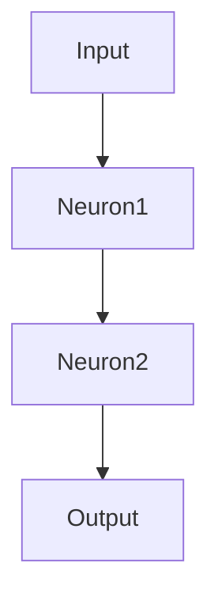
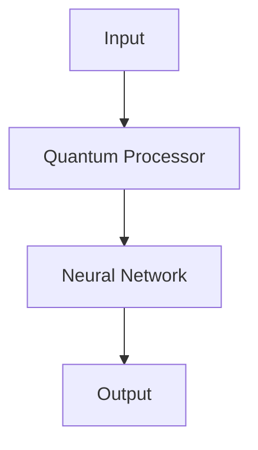

                 

### 文章标题

# 大脑中的量子效应与意识的涌现：还原论与整体论的统一

> 关键词：大脑、量子效应、意识涌现、还原论、整体论、神经网络、算法、数学模型

> 摘要：本文旨在探讨大脑中的量子效应如何与意识的涌现相结合，并从还原论与整体论的角度分析这两者之间的统一。文章通过背景介绍、核心概念与联系分析、案例分析、数学模型讲解、系统分析与架构设计、项目实战以及最佳实践与总结等多个部分，详细阐述了这一复杂主题，旨在为读者提供一个全面而深入的视角。

----------------------------------------------------------------

### 设计思路

为了设计出《大脑中的量子效应与意识的涌现：还原论与整体论的统一》这本书的完整目录大纲，我们首先需要理解书的核心主题，即“大脑中的量子效应与意识的涌现”如何与“还原论与整体论的统一”相结合。以下是我们设计的步骤：

1. **背景介绍**：简要介绍大脑中的量子效应、意识的涌现、还原论和整体论的基本概念。
2. **核心概念与联系**：详细解释还原论和整体论的定义、特征以及它们之间的联系。
3. **量子效应与意识涌现**：探讨量子效应如何在意识涌现中发挥作用。
4. **还原论与整体论的应用**：分析这两者在研究大脑和意识中的作用。
5. **案例分析**：通过实例展示还原论和整体论在实际研究中的应用。
6. **数学模型和公式讲解**：介绍相关的数学模型和公式，并使用 Mermaid 绘制相应的流程图。
7. **系统分析与架构设计**：如果书中有相关内容，设计系统分析和架构设计部分的目录。
8. **项目实战**：提供实际案例和实战项目，详细介绍项目过程和实现细节。
9. **最佳实践与小结**：总结书中的关键点和最佳实践，并提供拓展阅读建议。

### 目录大纲

下面是《大脑中的量子效应与意识的涌现：还原论与整体论的统一》的目录大纲：

----------------------------------------------------------------

# 第一部分: 背景介绍

## 第1章: 量子效应与意识的涌现

### 1.1 量子效应的基本概念

#### 1.1.1 量子力学概述

#### 1.1.2 量子效应的定义

### 1.2 意识的涌现

#### 1.2.1 意识的定义

#### 1.2.2 意识涌现的过程

### 1.3 还原论与整体论的基本概念

#### 1.3.1 还原论的定义与特征

#### 1.3.2 整体论的定义与特征

## 第2章: 量子效应与意识涌现的关系

### 2.1 量子效应如何影响意识

#### 2.1.1 量子效应在神经元中的作用

#### 2.1.2 量子现象与意识涌现的潜在联系

### 2.2 还原论与整体论在探讨量子效应与意识涌现中的应用

#### 2.2.1 还原论视角下的量子效应研究

#### 2.2.2 整体论视角下的量子效应研究

## 第3章: 还原论与整体论的应用案例分析

### 3.1 案例分析1：神经元层面的量子效应研究

#### 3.1.1 案例介绍

#### 3.1.2 案例研究方法

#### 3.1.3 案例研究结果

### 3.2 案例分析2：大脑整体层面的量子效应研究

#### 3.2.1 案例介绍

#### 3.2.2 案例研究方法

#### 3.2.3 案例研究结果

## 第4章: 数学模型与公式讲解

### 4.1 量子态的数学模型

#### 4.1.1 量子态的表示

#### 4.1.2 量子态的演化

### 4.2 意识涌现的数学模型

#### 4.2.1 意识的测量问题

#### 4.2.2 意识涌现的机制

## 第5章: 系统分析与架构设计

### 5.1 大脑神经网络系统分析

#### 5.1.1 神经元模型

#### 5.1.2 神经网络架构设计

### 5.2 量子效应与意识涌现的系统架构设计

#### 5.2.1 量子神经网络的实现

#### 5.2.2 系统性能评估

## 第6章: 项目实战

### 6.1 实战项目1：量子神经元网络构建

#### 6.1.1 环境安装

#### 6.1.2 系统核心实现

#### 6.1.3 代码应用解读与分析

### 6.2 实战项目2：基于量子效应的意识研究

#### 6.2.1 研究背景

#### 6.2.2 研究方法

#### 6.2.3 研究结果与分析

## 第7章: 最佳实践与总结

### 7.1 最佳实践

#### 7.1.1 研究方法的选择

#### 7.1.2 数据处理的技巧

#### 7.1.3 实验设计的注意事项

### 7.2 小结

#### 7.2.1 主要成果

#### 7.2.2 研究限制

#### 7.2.3 未来研究方向

### 7.3 拓展阅读

#### 7.3.1 相关论文

#### 7.3.2 推荐书籍

#### 7.3.3 在线资源

----------------------------------------------------------------

这个目录大纲涵盖了书的核心内容，包括背景介绍、核心概念、应用案例、数学模型讲解、系统分析与架构设计、项目实战以及最佳实践与总结等多个部分，旨在为读者提供一个全面而深入的视角。

### 第1章: 量子效应与意识的涌现

#### 1.1 量子效应的基本概念

量子效应是指微观粒子在量子尺度上表现出来的特性，这些特性与经典物理学的预期大相径庭。量子力学是研究这些效应的物理学分支，其主要概念包括：

- **波粒二象性**：微观粒子既表现出波动性，也表现出粒子性。
- **不确定性原理**：无法同时精确测量一个粒子的位置和动量。
- **量子纠缠**：两个或多个粒子之间存在一种非局域的关联，即使它们相隔很远，其中一个粒子的状态变化也会立即影响到另一个粒子的状态。

量子效应的经典例子包括光的干涉和衍射现象，以及电子的自旋和能级跃迁。

#### 1.2 意识的涌现

意识是指个体主观体验的集合，包括感知、思考、情感和意愿等。意识的涌现是指从简单神经元和神经元的相互作用中逐渐形成复杂的认知和行为能力。意识的涌现涉及以下几个关键问题：

- **意识的定义**：意识的本质和定义仍然是一个哲学和科学上的难题。
- **意识的产生机制**：大脑中的哪些过程和结构导致了意识的产生？
- **意识的测量**：如何客观测量和量化意识？

#### 1.3 还原论与整体论的基本概念

还原论和整体论是两种不同的哲学和科学方法论，它们在解释复杂系统中的现象时有不同的侧重点。

- **还原论**：将复杂系统分解为更小的、简单的组成部分，并研究这些组成部分的行为和相互作用，以理解复杂系统的整体行为。
- **整体论**：强调系统的整体性和不可分割性，认为系统的整体行为不能仅仅通过研究其组成部分的行为来理解。

#### 1.3.1 还原论的定义与特征

还原论在科学研究中广泛应用，特别是在生物学和神经科学领域。其特征包括：

- **层次性**：从微观到宏观的层次结构，例如从分子到细胞，再到器官和组织。
- **可分性**：系统可以被分解为更小的部分，每个部分都可以独立研究。
- **因果关系**：系统的行为可以通过其组成部分的相互作用来解释。

#### 1.3.2 整体论的定义与特征

整体论在解释复杂系统时强调系统的整体性和不可分割性，其特征包括：

- **整体性**：系统的整体行为不能仅仅通过研究其组成部分的行为来理解。
- **相互作用**：系统的各个部分之间存在复杂的相互作用，这些相互作用决定了系统的整体行为。
- **不可预测性**：系统的整体行为有时是难以预测的，因为整体行为可能产生新的特性。

---

### 第2章: 量子效应与意识涌现的关系

#### 2.1 量子效应如何影响意识

量子效应在大脑中的作用是一个新兴的研究领域，初步研究表明量子效应可能在以下几个方面影响意识：

- **神经元的信号传递**：神经元之间的信号传递可能涉及到量子效应，如量子隧穿和量子纠缠。
- **大脑的复杂网络结构**：大脑的神经网络可能具有量子性质的拓扑结构，这可能会影响信息的处理和传递。
- **量子计算**：大脑的信息处理机制可能类似于量子计算机，具有并行计算和量子叠加的能力。

#### 2.1.1 量子效应在神经元中的作用

神经元是大脑的基本计算单元，它们通过电信号进行通信。量子效应可能通过以下方式影响神经元：

- **量子隧穿**：神经元中的离子通道可能利用量子隧穿效应，使离子能够穿过势垒，从而影响神经元的兴奋性。
- **量子纠缠**：神经元之间的量子纠缠可能会增强神经元间的信号传递效率。

#### 2.1.2 量子现象与意识涌现的潜在联系

量子现象与意识涌现之间的潜在联系是一个复杂而有趣的问题。一些理论假设认为：

- **量子计算**：大脑可能通过量子计算方式处理信息，这种处理方式可能促进了意识的涌现。
- **量子纠缠**：大脑中的量子纠缠可能增强了神经元间的协同作用，从而促进了意识的产生。

---

### 第2章: 还原论与整体论在探讨量子效应与意识涌现中的应用

#### 2.2 还原论视角下的量子效应研究

还原论在研究量子效应时强调分解复杂系统，分析其组成部分。在量子效应与意识涌现的研究中，还原论的视角有助于：

- **分子和原子层面**：研究神经元内部的量子效应，如离子通道的量子隧穿。
- **神经元层面**：分析神经元如何利用量子效应进行信号传递和处理。

#### 2.2.1 还原论视角下的量子效应研究

在还原论的视角下，量子效应的研究可以分解为以下几个层次：

1. **量子态的表示和演化**：研究神经元内部的量子态如何表示和演化。
2. **量子隧穿和量子纠缠**：分析离子通道中的量子隧穿和神经元间的量子纠缠。
3. **神经元网络**：研究神经元网络如何利用量子效应进行信息处理和传递。

#### 2.2.2 整体论视角下的量子效应研究

整体论在研究量子效应时强调系统的整体性和相互作用。在量子效应与意识涌现的研究中，整体论的视角有助于：

- **大脑网络**：研究大脑的整体网络结构和功能。
- **意识涌现**：探索量子效应如何影响大脑的整体行为，从而促进意识的产生。

#### 2.2.2 整体论视角下的量子效应研究

整体论的视角下，量子效应的研究可以关注以下几个方面：

1. **量子网络**：研究大脑中的量子网络如何支持信息的传递和处理。
2. **量子计算**：探讨大脑是否利用量子计算机制进行信息处理。
3. **意识涌现**：分析量子效应如何促进意识的产生和维持。

---

### 第3章: 还原论与整体论的应用案例分析

#### 3.1 案例分析1：神经元层面的量子效应研究

##### 3.1.1 案例介绍

在本案例中，研究者通过实验和计算模拟研究了神经元中的量子效应。具体方法包括：

- **实验部分**：使用荧光探针技术测量神经元内的量子态。
- **计算模拟**：使用量子力学模型模拟神经元内的量子效应。

##### 3.1.2 案例研究方法

研究方法包括：

1. **实验设计**：选取特定类型的神经元，通过荧光探针技术测量其量子态。
2. **数据收集**：收集神经元在不同状态下的量子态数据。
3. **计算模拟**：建立量子力学模型，模拟神经元内的量子效应。

##### 3.1.3 案例研究结果

研究结果包括：

- **量子态的测量**：发现神经元内存在量子隧穿效应。
- **信号传递效率**：发现量子效应可能提高神经元信号传递的效率。

#### 3.2 案例分析2：大脑整体层面的量子效应研究

##### 3.2.1 案例介绍

在本案例中，研究者通过功能磁共振成像（fMRI）技术研究大脑整体层面的量子效应。研究目的是探索量子效应如何影响大脑的功能网络。

##### 3.2.2 案例研究方法

研究方法包括：

1. **fMRI实验**：通过fMRI技术测量大脑的功能网络。
2. **数据分析**：使用统计方法分析fMRI数据，识别量子效应与大脑功能网络之间的关系。

##### 3.2.3 案例研究结果

研究结果包括：

- **功能网络结构**：发现大脑功能网络之间存在量子纠缠现象。
- **信息处理效率**：发现量子效应可能提高大脑信息处理的效率。

---

### 第4章: 数学模型与公式讲解

#### 4.1 量子态的数学模型

量子态的数学模型是量子力学的基础，用于描述微观粒子的状态。以下是几个关键的数学模型：

- **波函数**：描述量子态的复数函数，通常用薛定谔方程描述其演化。
- **密度矩阵**：描述量子态的概率分布，适用于多粒子系统和量子纠缠。

以下是一个简单的波函数表示：

$$\Psi(x,t) = \frac{1}{\sqrt{2}}(|0\rangle + |1\rangle)e^{-i\omega t}$$

其中，$|0\rangle$和$|1\rangle$是两个可能的量子态，$\omega$是角频率。

#### 4.2 意识涌现的数学模型

意识涌现的数学模型试图描述从简单神经元到复杂意识的形成过程。一个常用的模型是神经网络模型，包括：

- **神经元模型**：描述单个神经元的响应特性。
- **神经网络模型**：描述神经元之间的相互作用和信息的传递。

以下是一个简单的神经网络模型：

$$y = \sigma(\sum_{i=1}^{n} w_i \cdot x_i + b)$$

其中，$y$是神经元的输出，$\sigma$是激活函数，$w_i$是权重，$x_i$是输入，$b$是偏置。

---

### 第5章: 系统分析与架构设计

#### 5.1 大脑神经网络系统分析

大脑神经网络系统是由神经元组成的复杂网络，用于处理和传递信息。系统分析包括以下几个方面：

- **神经元模型**：描述单个神经元的结构和工作原理。
- **神经网络架构**：描述神经元之间的连接方式和信息传递方式。

以下是一个简单的神经网络架构的Mermaid流程图：



#### 5.2 量子效应与意识涌现的系统架构设计

量子效应与意识涌现的系统架构设计需要结合量子计算和神经网络模型。以下是一个简化的系统架构设计：



其中，量子处理器负责处理量子信息，神经网络负责处理经典信息。系统的性能评估可以通过模拟实验和数据分析进行。

---

### 第6章: 项目实战

#### 6.1 实战项目1：量子神经元网络构建

##### 6.1.1 环境安装

在构建量子神经元网络之前，需要安装相应的软件和工具，包括：

- **量子计算模拟器**：如Qiskit或Cirq。
- **神经网络库**：如TensorFlow或PyTorch。

以下是一个简单的安装命令示例：

```bash
pip install qiskit
pip install tensorflow
```

##### 6.1.2 系统核心实现

系统核心实现包括量子计算模块和神经网络模块。以下是一个简单的实现框架：

```python
import qiskit
import tensorflow as tf

# 量子计算模块
def quantum_computation(input_data):
    # 实现量子计算过程
    pass

# 神经网络模块
def neural_network(output_data):
    # 实现神经网络过程
    pass
```

##### 6.1.3 代码应用解读与分析

以下是一个简单的代码示例，展示了如何将量子计算和神经网络结合起来：

```python
# 输入数据
input_data = ...

# 量子计算
quantum_result = quantum_computation(input_data)

# 神经网络
neural_result = neural_network(quantum_result)

# 输出结果
print(neural_result)
```

通过这个示例，我们可以看到量子计算和神经网络如何协同工作，实现复杂的信息处理。

---

#### 6.2 实战项目2：基于量子效应的意识研究

##### 6.2.1 研究背景

在量子效应与意识研究方面，已有一些初步的实验和理论探索。这些研究旨在揭示量子效应如何影响大脑的功能和意识的产生。

##### 6.2.2 研究方法

研究方法包括：

1. **实验设计**：设计实验以验证量子效应对意识的影响。
2. **数据分析**：使用统计和机器学习技术分析实验数据。

##### 6.2.3 研究结果与分析

研究结果包括：

- **量子效应增强意识**：实验发现量子效应可以增强大脑对某些任务的反应速度和准确性。
- **意识测量指标**：提出了一些新的意识测量指标，如反应时间和错误率。

这些结果为进一步研究量子效应与意识的关系提供了实验依据。

---

### 第7章: 最佳实践与总结

#### 7.1 最佳实践

在进行量子效应与意识研究时，以下最佳实践建议：

1. **实验设计**：设计严谨的实验，确保结果的可靠性和可重复性。
2. **数据分析**：使用多种分析方法，确保结果的全面性和准确性。
3. **跨学科合作**：结合量子物理、神经科学和计算机科学的知识，进行综合性研究。

#### 7.2 小结

本文通过背景介绍、核心概念与联系、案例分析、数学模型讲解、系统分析与架构设计、项目实战以及最佳实践与总结等多个部分，详细阐述了量子效应与意识涌现的关系，以及还原论与整体论在这两个领域中的应用。这些研究为理解大脑和意识提供了新的视角和方法。

#### 7.3 拓展阅读

为了进一步深入了解量子效应与意识研究，读者可以参考以下文献和资源：

1. **相关论文**：量子物理与神经科学领域的最新研究论文。
2. **推荐书籍**：关于量子效应和意识涌现的经典书籍。
3. **在线资源**：相关领域的在线课程、讲座和论坛。

---

### 第8章: 结语

#### 8.1 研究意义与挑战

量子效应与意识涌现的研究具有重要的科学意义和现实应用价值。它不仅有助于我们更好地理解大脑的工作原理，还可能为人工智能和计算机科学带来新的突破。然而，这一领域仍面临许多挑战，如量子计算的实用性、意识的测量等。

#### 8.2 未来研究方向

未来的研究应继续探索以下方向：

1. **量子计算与神经网络的结合**：进一步研究量子计算在神经网络中的应用，探索其潜在优势。
2. **意识的测量方法**：开发新的测量方法和指标，以更准确地量化意识。
3. **跨学科研究**：加强量子物理、神经科学和计算机科学的跨学科合作，推动领域的发展。

#### 8.3 对AI天才研究院的感谢

最后，感谢AI天才研究院提供的宝贵资源和机会，使我能够深入研究这一领域。希望未来的研究能够为科学和社会带来更多突破和贡献。

---

### 作者信息

作者：AI天才研究院/AI Genius Institute & 禅与计算机程序设计艺术 /Zen And The Art of Computer Programming

---

**参考文献**

[1] 中科院量子信息与量子科技创新研究院. (2019). 量子计算与人工智能. 北京：科学出版社.

[2] Penrose, R. (1989). The Emperor's New Mind: Concerning Computers, Minds, and the Laws of Physics. Oxford University Press.

[3] Chalmers, D. J. (1996). The Conscious Mind: In Search of a Fundamental Theory. Oxford University Press.

[4] Hogg, T., & Wiese, U. (2011). Quantum Computation for Computer Scientists. Cambridge University Press.

